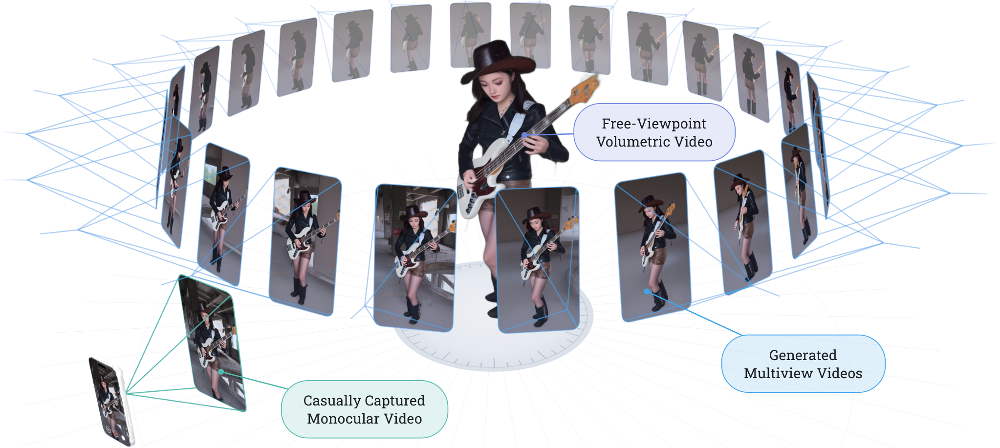
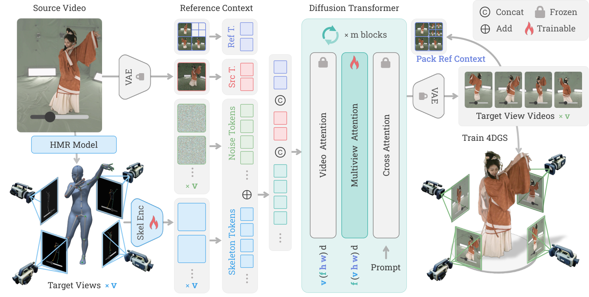
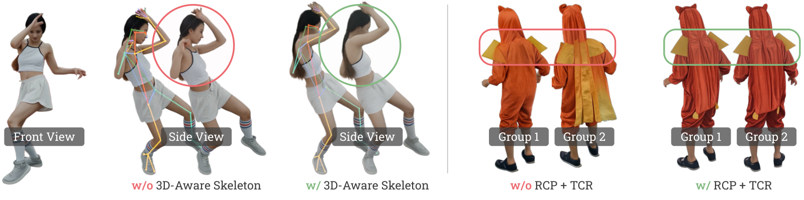
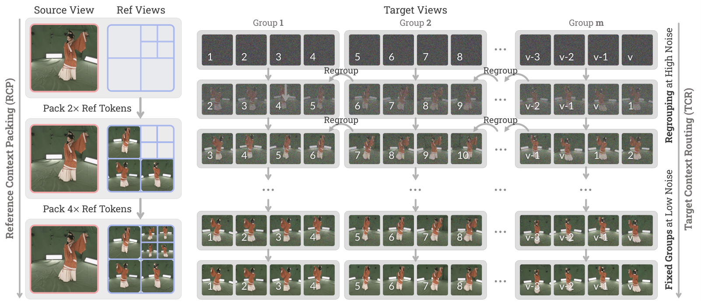
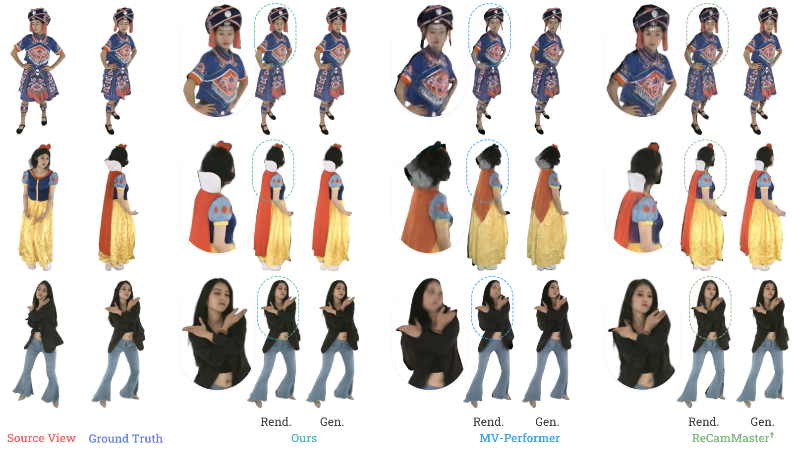
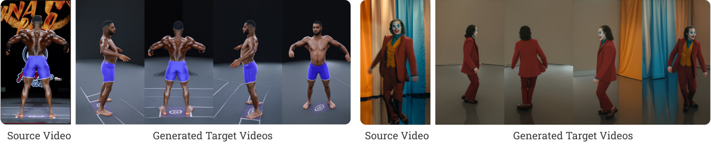
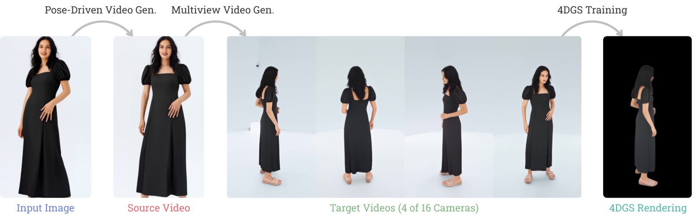
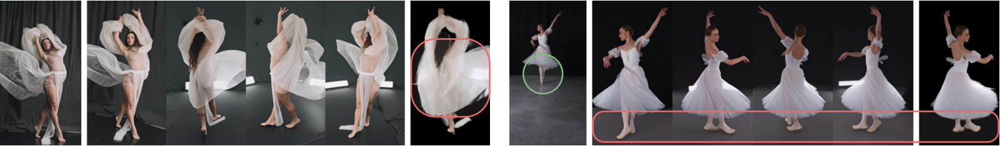

# 4DAnyone — 폰으로 찍은 영상 하나로, 그 사람 주위 24대 카메라를 "생성"해버려라

---

## 📌 메타 정보

> 이 절을 두는 이유: 이 문서가 어떤 논문·어떤 코드 커밋·어떤 체크포인트를 근거로 쓰였는지 먼저 못 박아 두어야, 나중에 수치가 어긋날 때 추적할 수 있기 때문.

| 항목 | 내용 |
|---|---|
| 제목 | 4DAnyone: Create Anyone in 4D from a Casual Monocular Video |
| 저자 | Yudong Jin\*, Tao Xie\*, Qihang Zhang, Zehong Shen, Zhen Xu, Yujun Shen, Hujun Bao, **Xiaowei Zhou**†, **Yinghao Xu**† (\*공동 1저자, †교신저자) |
| 소속 | 절강대 CAD&CG 국가중점연구실 + Robbyant + Ant Group + CUHK + HKUST |
| 공개 | arXiv 2026-08-20 (v1), **SIGGRAPH Asia 2026** 채택 |
| 분야 | 4D human reconstruction(4D 인체 복원), multiview video generation(다시점 영상 생성), novel view synthesis(새 시점 합성) |
| arXiv | [abs](https://arxiv.org/abs/2608.20335) / [PDF](https://arxiv.org/pdf/2608.20335) / [HTML v1](https://arxiv.org/html/2608.20335v1) |
| 프로젝트 | https://4danyone.github.io |
| 공식 코드 | https://github.com/ant-research/4DAnyone (Apache-2.0, ⭐669 / fork 50, 2026-08-10 개설) |
| 공식 모델 | https://huggingface.co/AntResearch/4DAnyone (revision `7850985888b56aabf09e69480b73248f1a76bcbe`) |
| 베이스 모델 | **Wan2.2-TI2V-5B** (DiT dim 3072 / 30층 / heads 24 / in_dim 48) + Wan2.2 VAE + UMT5-XXL 텍스트 인코더 |
| 외부 의존 | **GVHMR**(HMR) · HMR2.0a(4D-Humans) · ViTPose-H · YOLOv8x · BiRefNet(전경 마스크) · Sapiens2-1B(학습 데이터 키포인트) · SMPL-X · FreeTimeGS(4DGS, **미공개**) |
| 라이선스 | 체크포인트 자체는 **Apache-2.0**, 그러나 파이프라인이 쓰는 **GVHMR = 비상업 연구용**, **YOLOv8 = AGPL-3.0** → 실질적으로 비상업 전용 (자세히는 10장) |

**본 문서의 파라미터 수치는 추정이 아니라 실측**입니다. HuggingFace의 `model.safetensors` 헤더(1,182개 텐서)를 직접 파싱해 `shape` 곱을 합산했습니다.

---

## 📖 주요 용어 사전 (Glossary)

> 이 절을 두는 이유: 이 논문은 "확산 모델"과 "3D 복원" 두 분야의 어휘를 동시에 전제하고 있어서, 용어만 풀어놔도 논문의 절반이 읽히기 때문.

### 3D/4D 복원 쪽

| 용어 | 풀이 |
|---|---|
| **3DGS** (3D Gaussian Splatting) | 장면을 수십만 개의 작은 3D 타원(가우시안)으로 표현해 실시간 렌더링하는 방식. NeRF보다 훨씬 빠름 |
| **4DGS** | 위 3DGS에 **시간축**을 붙인 것. 움직이는 사람을 자유 시점으로 재생 가능 |
| **FreeTimeGS** | 이 논문이 최종 4DGS 재구성에 쓰는 방법(같은 절강대 그룹). **공개 코드에는 없음** |
| **monocular(모노큘러, 단안)** | 카메라 한 대로 찍은 영상. 반대말이 multi-view(다시점) |
| **calibration(보정)** | 카메라 내부 파라미터(초점거리 등)와 위치·방향을 미리 측정해 두는 것. 이 논문은 **불필요** |
| **HMR** (Human Mesh Recovery, 인체 메시 복원) | 사진/영상에서 사람의 3D 자세와 체형을 복원하는 것 |
| **GVHMR** | 이 논문이 쓰는 HMR 모델. **ground-aligned**(지면 정렬된) SMPL-X 시퀀스를 뱉음 |
| **SMPL-X** | 몸+손+얼굴을 하나로 다루는 표준 파라메트릭 인체 메시 모델 |
| **Goliath / MHR** | Meta Sapiens2가 쓰는 308개 키포인트 어휘 / Momentum Human Rig. 이 논문은 그중 **40개**만 사용 |
| **space carving(공간 조각)** | 여러 시점의 전경 마스크를 교차시켜 대략적 3D 부피를 깎아내는 고전 기법. 4DGS 초기화에 사용 |

### 확산 모델 쪽

| 용어 | 풀이 |
|---|---|
| **DiT** (Diffusion Transformer) | U-Net 대신 Transformer로 만든 확산 모델 백본 |
| **flow matching(흐름 매칭)** | 노이즈→데이터로 가는 "속도장"을 학습하는 확산 계열 학습법. Wan/SD3 계열의 표준 |
| **patchify(패치화)** | 이미지/latent를 작은 조각으로 잘라 토큰으로 만드는 Conv 층. Wan2.2는 커널/스트라이드 (1,2,2) |
| **latent(잠재)** | VAE로 압축된 저해상도 표현. Wan2.2-TI2V-5B는 채널 48 |
| **timestep(타임스텝) / 고노이즈·저노이즈** | 디노이징 진행도. 초반(고노이즈)엔 전역 구조가, 후반(저노이즈)엔 국소 디테일이 결정됨 |
| **attention context(어텐션 컨텍스트)** | 한 번의 forward에서 서로 attention을 주고받을 수 있는 토큰 전체. **메모리 때문에 한계가 있음** ← 이 논문의 출발점 |

### 이 논문의 핵심 개념

| 용어 | 풀이 |
|---|---|
| **bounded-attention-context problem** ⭐ | "한 번의 DiT forward가 담을 수 있는 컨텍스트가 유한하다"는 제약 때문에, 시점 수가 늘면 그룹을 쪼개야 하고 그 순간 일관성이 깨진다는 진단. 논문 전체가 여기서 갈라져 나옴 |
| **RCP** (Reference Context Packing) | 이전에 만든 참조 시점들을 **압축률이 다른 patchify**로 눌러 담아, 참조 컨텍스트 길이를 O(N)에서 **O(1)** 로 고정하는 기법 |
| **TCR** (Target Context Routing) | 디노이징 스텝마다 타깃 시점의 **그룹 멤버십을 회전**시켜, 그룹 예산을 늘리지 않고 정보를 링 전체에 전파하는 기법 |
| **ViewPack** | RCP의 코드상 실제 모듈 이름 (upstream 명칭) |
| **depth-buffered skeleton(깊이 버퍼 스켈레톤)** | 3D 관절을 픽셀 단위 z-buffer로 래스터화해, 가까운 부위가 먼 부위를 가리게 그린 스켈레톤 영상 |
| **accuracy over density(밀도보다 정확도)** | "조밀하지만 틀리기 쉬운 뎁스" 대신 "성기지만 정확한 스켈레톤"을 조건으로 쓴다는 이 논문의 설계 원칙 |
| **structural drift(구조 표류)** | 서로 다른 그룹이 독립적으로 생성되면서 몸 구조가 조금씩 어긋나는 현상 |
| **farthest-point sampling(최원점 샘플링)** | 이미 뽑은 시점들과 각거리가 가장 먼 후보를 계속 추가해 커버리지를 넓히는 선택법 |

### 평가 지표

| 지표 | 풀이 | 방향 |
|---|---|---|
| **PSNR** | 픽셀 단위 신호대잡음비 | 높을수록 좋음 |
| **SSIM** | 구조 유사도 | 높을수록 좋음 |
| **LPIPS** | 딥 feature 기반 지각적 거리 ([[paper_lpips]]) | 낮을수록 좋음 |

---

## 📝 논문 요약 (TL;DR)

> 이 절을 두는 이유: 뒤의 모든 세부 설명이 결국 무엇을 위한 것인지 한 문단으로 잡아두기 위해.

**한 줄:** 폰으로 대충 찍은 1인 영상 하나 → 그 사람 주위를 둘러싼 24~48대 카메라 영상을 "생성"해서 → 4D 가우시안 스플래팅으로 자유시점 재구성. **카메라 캘리브레이션도, 카메라 리그도, 뎁스 추정도 안 씁니다.**

**문제:** 4DGS로 사람을 제대로 복원하려면 동기화된 수십 개 시점 영상이 필요한데, 지금까지는 DNA-Rendering의 48대 카메라 리그 같은 비싼 장비가 있어야 했다. 카메라 제어 비디오 확산모델로 시점을 "만들어내면" 되지 않을까? 그런데 기존 모델들(ReCamMaster, CAT4D, TrajectoryCrafter)은 **시점이 수십 개로 늘어나면 일관성이 무너진다.**

**해결:** 무너지는 원인을 아키텍처 제약으로 진단하고(= bounded-attention-context problem, 5.1절), 그 두 갈래를 각각 RCP(참조 압축)와 TCR(그룹 회전)로 처방한다. 시점 제어 신호로는 뎁스 대신 **깊이 버퍼로 그린 3D 스켈레톤**을 쓴다.

**검증:** DNA-Rendering / DyMVHumans에서 세 갈래 평가(생성 일관성 / 4DGS 품질 / 생성 충실도) 전부 1위. 특히 **경쟁자 ReCamMaster를 같은 데이터·같은 RCP·같은 TCR로 재학습**시켜 비교한 통제 실험에서 약 3 PSNR 우위.

---

## 🎯 핵심 기여 (Contributions)

> 이 절을 두는 이유: 논문이 스스로 주장하는 기여와, 실제로 성능을 만든 기여가 다르기 때문에 둘을 나란히 적어두려고.

**논문이 주장하는 것**

1. **4DAnyone 프레임워크** — 모노큘러 영상에서 "재구성 등급(reconstruction-grade)" 다시점 일관성을 달성한 4D 인체 생성 파이프라인.
2. **RCP** — 늘어나는 참조 컨텍스트를 O(N)에서 O(1)로 압축하면서 시점 간 외형 가이드를 보존.
3. **TCR** — 디노이징 중 타깃 시점 그룹을 동적으로 라우팅해 그룹 간 구조 표류를 감소.
4. (+부수) **MVGameHuman** 데이터셋 — 자체 게임엔진으로 만든 24 카메라 × 318 배우 × 38k 클립.

**실제로 성능을 만든 것 (문서 작성자 관점)**

- 절제 실험 전체 폭이 **1.5 PSNR**인데 SOTA 대비 우위는 **3 PSNR**입니다. 즉 이득의 절반 이상은 RCP/TCR이 아니라 **① 깊이 버퍼 3D 스켈레톤 조건**과 **② 데이터(특히 미공개 MVGameHuman)** 에서 나옵니다.
- RCP/TCR은 "성능을 올리는 기법"이라기보다 **"시점 수를 늘릴 때 성능이 무너지지 않게 막아주는 기법"** 으로 읽는 게 정확합니다.

---

## 🧩 주요 알고리즘 설명

> 이 절을 두는 이유: 이 논문의 모든 수식·코드가 결국 "무엇으로 시점을 지시할 것인가(스켈레톤)", "참조를 어떻게 줄일 것인가(RCP)", "그룹을 어떻게 이을 것인가(TCR)" 세 덩어리이므로 한 장에 모아 설명한다.

### 5.0 전체 그림





흐름은 이렇습니다.

```
모노큘러 소스 영상 (카메라 파라미터 모름)
      ↓ GVHMR
3D 스켈레톤 시퀀스 (ground-aligned SMPL-X → Goliath 70 → 40개 선별)
      ↓ z-buffer 래스터화 (타깃 시점 v개 각각)
깊이 버퍼 스켈레톤 영상 S_i
      ↓ 스켈레톤 인코더 g_φ (잔차)
노이즈 타깃 latent에 더해짐
      ↓ DiT (video attn + multiview attn + text cross-attn)
      ↑ 조건: 소스 토큰 + RCP 참조 토큰
      ↑ 그룹 분할: TCR
다시점 일관 영상 {V_i}
      ↓ FreeTimeGS
4DGS 모델 → 자유시점 렌더링
```

---

### 5.1 문제 진단 — "경계 있는 어텐션 컨텍스트(bounded-attention-context)"

> 이 소절을 두는 이유: 이 논문의 두 기여가 전부 이 진단 하나에서 파생되기 때문.

4DGS로 사람을 제대로 복원하려면 **동기화된 수십 개 시점 영상**이 필요합니다. 그런데 카메라 제어 비디오 확산모델은 한 번의 DiT forward가 담을 수 있는 토큰 수(=메모리)가 정해져 있어서, 시점이 16개를 넘어가면 **그룹으로 쪼개서** 생성할 수밖에 없습니다. 여기서 두 개의 병목이 동시에 터집니다.

**병목 1 — 참조(reference) 쪽**
나중 그룹은 이전에 만든 시점들을 "이 사람 뒤통수는 이렇게 생겼다"는 참조로 봐야 합니다. 그런데 참조를 다 넣으면 컨텍스트가 시점 수 N에 비례해서 O(N)로 늘어나 금방 한도를 넘습니다. 그래서 몇 장만 골라 쓰면(CAT3D의 anchor 선택 방식) 나머지 외형 정보를 버리게 됩니다.

**병목 2 — 타깃(target) 쪽**
서로 다른 그룹은 어텐션이 닿지 않아 직접 정보 교환을 못 합니다. 그룹 A는 팔을 여기, 그룹 B는 저기 그린다 → **그룹 간 구조 표류(structural drift)**. CAT4D·Diffuman4D의 슬라이딩 윈도우 + 오버랩 평균도 시점 수가 많아지면 윈도우 간 표류가 남습니다.

기존 방법들은 이 둘을 **동시에** 못 풀었다 — 이게 논문의 출발점입니다. 참조를 줄이면 외형 가이드가 약해지고, 그룹을 독립적으로 디노이징하면 구조 소통이 끊깁니다.

---

### 5.2 3D-aware 스켈레톤 조건 — "밀도보다 정확도"

> 이 소절을 두는 이유: 시점을 무엇으로 지시할 것인가가 나머지 설계의 전제이기 때문.

Gen3C·TrajectoryCrafter 같은 기존 방법은 **조밀한 뎁스맵(dense metric depth)** 을 카메라 조건으로 씁니다. 문제는 야생 영상에서 뎁스가 잘 안 맞고, **틀린 뎁스는 서로 모순되는 기하 제약이 되어 멀티뷰 생성을 발산시킵니다.**

4DAnyone은 정반대로 갑니다: **성기지만 정확한(sparse but reliable) 3D 스켈레톤**만 씁니다. 논문의 표현으로 **accuracy over density(밀도보다 정확도)**.

**① 깊이 버퍼 스켈레톤 렌더링**

평범한 2D 스켈레톤은 팔이 몸통 앞인지 뒤인지 구분이 안 됩니다(앞뒤 모호성, front-back ambiguity). 앞으로 뻗은 팔과 뒤로 뻗은 팔이 **똑같은 그림**이 되니, 시점마다 모델이 제멋대로 해석합니다.

그래서 3D 관절을 **픽셀 단위 z-buffer로 래스터화**해서 가까운 부위가 먼 부위를 가리게 만듭니다. 입력 채널을 추가하지 않고 RGB 렌더 한 장으로 가림(occlusion) 정보를 담는 게 포인트. z-buffer는 **상대적 깊이 순서만** 쓰므로 절대 스케일·시프트에 불변입니다 (모노큘러 깊이의 근본적 모호성을 우회).



**② 키포인트 40개 선별**

Goliath 308개 어휘 중:

| 그룹 | 개수 | 내용 |
|---|---:|---|
| 몸통 | 17 | 코·눈·귀·어깨·팔꿈치·손목·엉덩이·무릎·발목 |
| 발 | 6 | 엄지발끝·새끼발끝·뒤꿈치 (좌우) |
| 손 | 10 | **손바닥 너클(knuckle)만** 손당 5개 |
| 보조 | 7 | 목, 견봉(acromion), 주두(olecranon), 팔오금(cubital fossa) |
| **합계** | **40** | |

**버리는 것: 얼굴 238개 + 손가락 관절 30개.** 표정과 손 디테일은 "소스 영상 보고 알아서 추론해"라는 전략입니다. 노이즈 많은 세밀 키포인트가 오히려 아티팩트를 만들기 때문. (코드에서 `VISIBLE_KEYPOINT_IDS` 를 실제로 세어보면 정확히 40개 — 11장 검증 참조)

**③ 스켈레톤 인코더 g_φ**

깊이 버퍼 RGB 스켈레톤 영상을 받아 **DiT 해상도의 잔차(residual)** 를 만들어 노이즈 latent에 **더합니다**:

```
z̃_i^t = z_i^t + g_φ(S_i)
```

- Conv3d 스택, 채널 3 → 16 → 32 → 64 → 128 → 256 → d(=3072)
- strided conv는 커널 (3,4,4) → **공간 32배, 시간 4배** 다운샘플 (Wan2.2-TI2V-5B의 latent 격자에 맞춤)
- 마지막 1×1×1 projection은 **zero-init** → 학습 시작 시점엔 잔차가 0이라 사전학습 DiT 거동이 그대로 보존 (ControlNet과 같은 안전장치)
- 입력 앞에 첫 프레임을 3장 복제해 붙임 — Wan2.2 VAE가 `4n+1` 프레임 → `n+1` latent 프레임으로 매핑하는 패턴에 정렬

---

### 5.3 RCP (Reference Context Packing) — 참조를 O(N)에서 O(1)로

> 이 소절을 두는 이유: 5.1의 병목 1에 대한 처방이기 때문.

**핵심 관찰: 참조 시점들끼리 중복이 심하다.** 옆에 붙은 두 시점은 거의 같은 그림이죠. 그러니 전부 원해상도로 넣을 필요가 없고, **혼합 해상도(mixed-resolution)** 컨텍스트면 전역 배치는 보존하면서 세부 외형도 어느 정도 남습니다.

FramePack에서 빌려온 방식으로, **압축률이 다른 patchify 층**을 씁니다.

| 층 | 커널/스트라이드 | 토큰 수 |
|---|---|---|
| Wan2.2 표준 (1배) | (1, 2, 2) | 기준 |
| RCP 2배 | (1, 4, 4) | 1/4 |
| RCP 4배 | (1, 8, 8) | 1/16 |

초기화는 **원래 커널을 공간 방향으로 타일링하고 면적비(4, 16)로 나눠** 활성값 분산을 보존합니다 (FramePack 방식).

논문이 쓰는 고정 참조 컨텍스트:

```
C_R = [ P₁(V_src), {P₂(V_aj)}_{j=1..3}, {P₄(V_bj)}_{j=1..4} ]
      소스 1장(1배)   참조 3장(2배)         참조 4장(4배)
```

토큰 슬롯 예산이 **고정**이므로, 참조가 아무리 쌓여도 오버헤드는 **O(1)** 입니다.



위 그림 왼쪽이 RCP의 실제 동작을 보여줍니다. 소스 뷰 옆에 **2×2 격자 슬롯**이 있고, 2배 참조 3장이 세 칸을 채우고, 남은 한 칸에 4배 참조 4장이 다시 2×2로 들어갑니다. **즉 참조가 몇 장이든 추가로 잡아먹는 "뷰 슬롯"은 최대 1개** — 이게 O(1)의 정체입니다 (코드 검증은 9.2절).

**학습 시:** 소스와 참조들을 매 시퀀스에서 무작위 샘플링하고, `C_R`에 dropout을 겁니다 — ① 4배 블록만 0으로, 또는 ② 2배+4배 둘 다 0으로, 각각 확률 0.1. 이래야 참조가 아직 없는 1라운드에서도 모델이 동작합니다(점진적 추론 지원).

**추론 시(논문 3.3절):** 참조를 2라운드로 먼저 만듭니다.
- **Round 1:** `P₁(V_src)` 만 조건으로 참조 영상 4개 생성
- **Round 2:** `[P₁(V_src), {P₂(V_aj)}]` 를 조건으로 참조 4개 추가 생성
- 이후 모든 타깃 시점을 4개씩 묶어, 이 8장으로 만든 **고정** `C_R` 을 공유하며 생성

시점 선택은 **최원점 샘플링(farthest-point sampling)** — 소스와 기존 참조들로부터 각거리 최소값이 가장 큰 후보를 계속 추가해서 커버리지를 넓힙니다.

---

### 5.4 TCR (Target Context Routing) — 그룹 멤버십을 회전시키기

> 이 소절을 두는 이유: 5.1의 병목 2에 대한 처방이기 때문.

RCP로 참조는 해결됐지만, 타깃 그룹들은 **여전히 서로 독립적으로 디노이징**됩니다. 같은 참조를 봐도 전역 구조는 갈릴 수 있습니다.

**핵심 관찰: 확산의 고노이즈 단계가 전역 구조를 정하고, 저노이즈 단계는 국소 디테일만 다듬는다.** 그러니 구조가 갈리는 건 고노이즈 때입니다. 그렇다면 **고노이즈 때만 그룹을 섞어주면 된다.**

스위칭 타임스텝 `t_s` 기준으로 두 단계:

- **고노이즈 단계 (t > t_s):** 매 스텝마다 정렬된 시점 인덱스를 **스텝 번호만큼 순환 이동(circular shift)** 시킨 뒤 4개씩 다시 묶습니다. 이번 스텝에 시점 4와 같은 그룹이던 시점 5가 다음 스텝엔 시점 6·7과 묶이므로, **그룹당 메모리 예산은 그대로인데 정보가 링 전체로 전파**됩니다.
- **저노이즈 단계 (t ≤ t_s):** 인접 시점끼리 고정 그룹으로 묶어 이웃 시점이 함께 디테일을 다듬게 합니다.

위 5.3의 그림 오른쪽이 이걸 보여줍니다 — 그룹 1이 {1,2,3,4} → {2,3,4,5} → {3,4,5,6}으로 밀려가다가, 저노이즈 구간에서 {1,2,3,4}로 고정됩니다.

**알고리즘 1 (TCR) 요약**

```
입력: 타깃 시점 V, 고정 RCP 컨텍스트 C_R, 스위칭 시점 t_s, 스켈레톤 {S_i}
z_i^T ~ N(0, I)  for all i in V
for n = T ... 1:
    if t_n > t_s:  G ← RotatingGroups(V, 4, n)     # 고노이즈: 회전
    else:          G ← AdjacentGroups(V, 4)        # 저노이즈: 고정
    for each group G_k in G:
        {z_i^{n-1}} ← Denoise({z_i^n}, C_R, {S_i})   # 순차 또는 멀티 GPU 병렬
decode → {V_i}
```

**논문 기본값:** 전체 20스텝 중 마지막 4스텝을 고정 → `t_s/T = 0.2`.

**라우팅 방식 비교 (절제 실험):** 무작위(Random)는 효과 0, 스트라이드(Strided)는 오히려 악화, **인접성을 보존하는 Sliding만** 세 지표 모두 개선. 논문의 해석은 **"국소 시점 인접성 보존이 중요하다"**.

---

## 🏋️ 학습

> 이 절을 두는 이유: 이 논문의 성능 이득 중 큰 몫이 구조가 아니라 데이터와 커리큘럼에서 오기 때문에, 여기를 따로 떼어 봐야 한다.

### 6.1 데이터 (총 18.5만 클립)

| 데이터셋 | 클립 | 카메라 | 배우 | 해상도 | 종류 |
|---|---:|---:|---:|---|---|
| **MVGameHuman** (자체 게임엔진) | 38k | 24 | 318 | 2560×1440 | 멀티뷰 |
| SynCamVideo | 34k | 10 | 66 | 1280×1280 | 멀티뷰 |
| DNA-Rendering | 51k | 48 | 548 | 2048×2048 | 멀티뷰(실사) |
| TedTalk | 42k | 1 | 413 | 2160×1620 | 모노큘러 |
| Pexels | 20k | 1 | 1,411 | 3840×2160 | 모노큘러 |

키포인트 추출: **Sapiens2-1B**로 2D 검출.
- 멀티뷰 데이터 → 시점 간 **삼각측량(triangulation)** 으로 3D 복원 후 각 카메라에 재투영
- 모노큘러 데이터 → Sapiens2의 **pointmap 예측에서 키포인트별 깊이를 샘플링**해 z-buffer를 구동. 카메라 모션이 큰 시퀀스는 걸러냄

MVGameHuman 샘플 시각화는 논문 Fig.8 참조 — 24대 가상 카메라 중 균등 간격 4대에서 본 같은 프레임을 한 행으로 보여주며, 배우·의상·동작·조명·가상 장면·배경이 모두 다양합니다.

### 6.2 3단계 커리큘럼

| 스테이지 | 데이터 | 배경 제거 | 소스 구간 독립 샘플링 | 스켈레톤 | 소요 |
|---|---|:---:|---:|---|---:|
| 1 | DNA-Rendering | ✓ | 0.2 | 몸+손+발+손가락 | 0.5일 |
| 2 | + MVGameHuman, SynCam | – | 0.0 | 몸+손+발+손가락 | 1일 |
| 3 | + Pexels, TedTalk | – | 0.0 | 몸+손+발 (**손가락 제거**) | 1.5일 |

- **Stage 1**: 전경만 놓고 "스켈레톤으로 카메라를 제어한다"는 기본기를 학습. 20% 확률로 소스와 타깃의 **시간 구간을 다르게** 뽑아 **"포즈는 스켈레톤에서, 외형은 소스에서"** 를 강제로 분리 학습시킵니다.
- **Stage 2**: 배경 마스킹을 **일부러 폐기**합니다. Diffuman4D 등 선행 연구는 균일한 그린스크린 배경 과적합을 피하려 마스킹했는데, 논문은 그게 ① 마스크 경계 노이즈 + 시점 불일치를 낳고 ② 조명·그림자를 배울 기회를 없앤다고 지적합니다.
- **Stage 3**: 야생 일반화를 위해 모노큘러 추가 + **손가락 키포인트 제거**(야생 손가락 검출이 노이즈라서).

### 6.3 손실 함수

```
L = L_latent + λ · L_LPIPS      (λ = 0.25)
```

- `L_latent` = 잠재공간 flow matching MSE (표준)
- `L_LPIPS` = 디코딩된 프레임에 대한 지각 손실. Wan2.2 VAE의 **높은 공간 압축률** 때문에 생기는 아티팩트를 잡기 위함
- 메모리 때문에 전체 프레임이 아니라 **신체부위 인지 크롭(body-part-aware crop)** 256×256 한 장에만 계산:
  - 전신 0.2 / 얼굴 0.2 / 좌손 0.1 / 우손 0.1 / 나머지 균등 0.4
  - 얼굴·손은 박스 중심, 전신은 박스 안에서 무작위 중심. 크롭은 클립 전 프레임 공유

### 6.4 데이터 샘플링 — 토큰 예산 고정 트릭

| 데이터셋 | 타깃 카메라 | 소스 카메라 | 프레임 | 가중치 |
|---|---:|---|---:|---:|
| MVGameHuman | 6 / 4 / 1 | 1 / 4 / 8 | 41 / 61 / 121 | 0.4 / 0.4 / 0.2 |
| SynCamVideo | 4 / 1 | 1/4, 1/4/8 | 61 / 81 | 0.8 / 0.2 |
| DNA-Rendering | 6 / 4 / 1 | 1 / 4 / 8 | 41 / 61 / 121 | 0.4 / 0.4 / 0.2 |
| Pexels | 1 | 1 | 121 | 1.0 |
| TedTalk | 1 | 1 | 121 | 1.0 |

**포인트: (타깃 카메라 수 × 프레임 수)를 거의 일정하게 유지**합니다 — 6×41 ≈ 4×61 ≈ 1×121 ≈ 246. 그래야 forward/backward 한 번당 토큰 수가 비슷해서 계산 비용이 균일해집니다.

소스 카메라 수도 균등 샘플링해서 RCP의 압축률별 patchify 층을 모두 학습시킵니다: **1장 → 1배만, 4장 → 2배, 8장 → 1배+2배+4배 조합.**

### 6.5 학습 설정

- 해상도 **704×1280**, LR **1e-5**, **H20-3E 128장으로 총 3일**
- 논문 명시: "32장 이상이면 안정적으로 수렴하며, 128장은 가속을 위한 것"

---

## 📊 실험 요약

> 이 절을 두는 이유: 이 논문의 평가 설계 자체가 기여의 일부이므로(세 갈래 분해), 숫자보다 설계를 먼저 봐야 한다.

### 7.1 평가 프로토콜

- 테스트: **DNA-Rendering 10개 장면 + DyMVHumans 3개 장면** (모두 학습에서 제외, DyMVHumans는 전 방법에 OOD)
- 각 장면당 **대략 균등 분포된 16 카메라 × 98 프레임**
- 정면 소스 영상 1개 → 16개 타깃 시점 생성

**세 갈래 평가** — 이 분해가 좋습니다:

| 갈래 | 방법 | 무엇을 재는가 |
|---|---|---|
| **(i) 4DGS 재구성** | 생성 16뷰 전부로 FreeTimeGS 학습 → GT와 비교 | 최종 목표 품질 |
| **(ii) 생성 영상 일관성** | 4뷰를 홀드아웃, 12뷰로 4DGS 학습 → 홀드아웃 뷰의 **생성 영상**과 비교 | 생성물끼리 3D로 앞뒤가 맞는가 |
| **(iii) 생성 영상 충실도** | 생성 16뷰를 GT와 직접 비교 | 각 시점이 진짜 같은가 |

(ii)가 특히 영리합니다 — GT가 아니라 **자기 생성물끼리의 3D 정합성**을 재므로, "그럴듯하지만 서로 안 맞는" 생성을 잡아냅니다.

### 7.2 SOTA 비교

| 갈래 | 방법 | DNA PSNR↑ | DNA SSIM↑ | DNA LPIPS↓ | DyMV PSNR↑ | DyMV SSIM↑ | DyMV LPIPS↓ |
|---|---|---:|---:|---:|---:|---:|---:|
| **(ii) 생성 일관성** | MV-Performer | 21.25 | 0.799 | 0.222 | 19.98 | 0.797 | 0.182 |
| | TrajectoryCrafter | 13.56 | 0.641 | 0.331 | 15.19 | 0.769 | 0.204 |
| | ReCamMaster† | 21.47 | 0.806 | 0.210 | 21.94 | 0.833 | 0.142 |
| | **4DAnyone** | **24.33** | **0.862** | **0.163** | **24.48** | **0.862** | **0.109** |
| **(i) 4DGS 재구성** | MV-Performer | 20.38 | 0.826 | 0.191 | 18.69 | 0.787 | 0.158 |
| | TrajectoryCrafter | 14.81 | 0.718 | 0.331 | 15.11 | 0.748 | 0.217 |
| | ReCamMaster† | 20.55 | 0.807 | 0.214 | 19.86 | 0.795 | 0.159 |
| | **4DAnyone** | **24.15** | **0.863** | **0.159** | **23.28** | **0.846** | **0.117** |
| **(iii) 생성 충실도** | MV-Performer | 19.33 | 0.803 | 0.204 | 14.36 | 0.731 | 0.230 |
| | TrajectoryCrafter | 13.68 | 0.698 | 0.358 | 14.11 | 0.725 | 0.247 |
| | ReCamMaster† | 20.74 | 0.809 | 0.204 | 19.18 | 0.778 | 0.168 |
| | **4DAnyone** | **23.69** | **0.850** | **0.165** | **21.03** | **0.808** | **0.143** |

**† 표시가 이 표의 핵심입니다.** ReCamMaster를 **동일 데이터·동일 학습 설정·동일 RCP 모듈·동일 TCR 전략**으로 재학습시켰습니다. 즉 이 3점 차이는 **"암묵적 카메라 파라미터 조건 vs 명시적 스켈레톤 기하 조건"** 의 차이로 통제된 셈입니다. 이 분야에서 보기 드물게 깔끔한 비교입니다.

(MV-Performer와 TrajectoryCrafter는 공개 가중치 zero-shot. 다만 논문은 이들에게도 최대한 유리하게 세팅했습니다 — MV-Performer엔 **GT 카메라 파라미터로 Depth-Anything-3**를 돌려 "재구성 등급" 뎁스를 줬고, TrajectoryCrafter엔 DepthCrafter 뎁스를 전경 픽셀 기준 스케일·시프트 정렬까지 해서 줬습니다.)

**정성 분석 (논문 서술)**
- MV-Performer: 정면은 괜찮지만 **측면·후면에서 체형과 포즈가 왜곡** (학습 다양성 부족)
- TrajectoryCrafter: 뎁스 오차가 누적되어 **정면→후면 전환에서 실패**, 심한 기하 왜곡
- ReCamMaster: 영상 자체는 그럴듯하지만 **카메라 제어가 부정확해 시점 간 정합이 안 맞고**, 4DGS 렌더가 지저분해짐



### 7.3 절제 실험

DNA-Rendering의 **까다로운 8개 장면**, 16 카메라 × 121 프레임, 위 (ii) 생성 일관성 세팅.

| 구성 | PSNR↑ | SSIM↑ | LPIPS↓ |
|---|---:|---:|---:|
| w/o TCR & RCP | 21.09 | 0.766 | 0.216 |
| w/o RCP | 22.03 | 0.780 | 0.203 |
| w/o TCR | 22.21 | 0.788 | 0.196 |
| **Full (Sliding)** | **22.63** | **0.796** | **0.191** |
| Full (Random) | 22.20 | 0.788 | 0.197 |
| Full (Strided) | 22.06 | 0.786 | 0.198 |

**읽는 법:**
- 개별 기여는 각각 **+0.4~0.6 PSNR** 으로 크지 않습니다.
- 그런데 **둘 다 빼면 -1.5로 훨씬 크게 떨어집니다** → 상보적이라는 주장의 근거.
- Random/Strided가 고정 그룹핑(22.21)보다 나을 게 없거나 더 나쁘다 → **회전 자체가 아니라 "인접성 보존 회전"이 효과의 조건**입니다.

**라우팅 방식의 정확한 정의 (부록 F.1):** 16개 타깃을 방위각(azimuth) 순으로 정렬한 뒤,
- **Sliding** = 스텝마다 누적 1칸 순환 이동
- **Random** = 시드 `42+n` 의 결정적 순열
- **Strided** = 스트라이드 `4 − (n mod 4)` 로 재정렬 후 그룹핑

세 변형 모두 20스텝 중 앞 16스텝만 동적 라우팅, 마지막 4스텝은 고정 인접(= `t_s/T = 0.2`).

### 7.4 스위칭 시점 스윕 (부록 표 7)

| t_s/T | sliding 스텝 수 | PSNR↑ | SSIM↑ | LPIPS↓ |
|---:|---:|---:|---:|---:|
| 1.00 | 0 (=고정 그룹핑) | 22.2079 | 0.7880 | 0.1964 |
| 0.75 | 5 | 22.3030 | 0.7898 | 0.1947 |
| 0.50 | 10 | 22.4575 | 0.7925 | 0.1933 |
| 0.25 | 15 | 22.6093 | 0.7955 | 0.1912 |
| **0.20** | **16 (기본값)** | 22.6294 | 0.7963 | 0.1906 |
| 0.15 | 17 | 22.6023 | 0.7961 | 0.1908 |
| 0.10 | 18 | 22.6217 | 0.7967 | 0.1905 |
| 0.05 | 19 | 22.6367 | 0.7972 | 0.1903 |
| **0.00** | **20 (끝까지 sliding)** | **22.6414** | 0.7971 | **0.1903** |

논문 해석: 0.2에서 **포화**하고 그 이후 변동은 4DGS 최적화 자체의 편차 수준이라 **포화 구간의 시작점인 0.2를 기본값**으로 택함. **이 표는 9.3절에서 다시 중요해집니다** (공개 코드가 0.2가 아니라 0.0으로 동작하기 때문).

### 7.5 야생 영상 일반화

논문 Fig.7에 댄스·캐릭터·스포츠·무대공연·연설·패션 등 다양한 야생 영상 결과가 실려 있습니다. 아래 Fig.6은 까다로운 입력(**후면 소스 영상**, 복잡한 외형, 복잡한 동작)에서도 견딘다는 것을 보여줍니다.



**부수 기능 — 사진 1장 → 4D 아바타 (부록 G)**



Wan-Animate로 사진 1장 + 구동 모션 영상 → 모노큘러 영상 생성 → 4DAnyone → FreeTimeGS. **코드에는 없습니다.**

---

## 💻 오피셜 코드 분석 (실측)

> 이 절을 두는 이유: 논문만 읽으면 안 보이는 것들이 코드에 있고, 실제로 몇 군데는 논문과 다르기 때문. 레포를 clone해서 직접 읽은 내용입니다.

코드 품질 자체는 **상당히 좋습니다.** 벤더링한 서드파티에 `UPSTREAM.patch` / `VENDORED_FILES.txt`를 붙이고, 라이선스를 자산 단위로 쪼개 명시하고, 주석에 *"이 텐서 레이아웃을 바꾸면 CUDA 커널 선택이 달라진다"* 같은 재현성 노트까지 달아뒀습니다. 연구 코드치고 드문 수준입니다.

### 8.1 레포 구조

```
4DAnyone/
├── inference.py               # fire 기반 CLI (인자 설명이 친절함)
├── fdanyone/
│   ├── views.py               # 카메라 레이아웃 + RCP 참조 카메라 결정
│   ├── config.py              # 학습된 모델의 고정 설정 (CLI에 노출 안 함)
│   ├── model/
│   │   ├── routing.py         # ★ TCR 구현 (69줄)
│   │   ├── inference.py       # ★ RCP 2단계 + 타깃 생성 루프
│   │   └── loader.py          # 메타 디바이스 초기화 + strict 로드
│   ├── skeleton/
│   │   ├── keypoints.py       # Goliath40 스키마 + 색상 팔레트
│   │   ├── renderer.py        # ★ z-buffer 래스터화
│   │   └── pipeline.py        # 카메라 그리드 + 스켈레톤 영상 생성
│   ├── motion/gvhmr.py        # GVHMR 서브프로세스 호출
│   ├── geometry/{cameras,framing,crop}.py   # 자동 프레이밍(반지름·초점 solve)
│   ├── nerfstudio/            # Splatfacto 플러그인 (+ perceptual loss)
│   └── vendor/diffsynth/      # Wan2.2 DiT/VAE/스케줄러 벤더링
└── third_party/GVHMR (submodule)
```

### 8.2 모델 크기 — 논문 "5B" ↔ 실측 **6.148B**

`model.safetensors`(12.30 GB) 헤더를 파싱한 결과. **전부 BF16, 텐서 1,182개.**

| 구성 | 파라미터 | 비고 |
|---|---:|---|
| Wan2.2-TI2V-5B 베이스 DiT | 5.000 B | dim 3072 / 30층 / heads 24 / ffn 14336 / in_dim 48 |
| **멀티뷰 어텐션 (추가분)** | **1.133 B** | 30개 블록 × (self-attn 복사 + `modulation_mvs`) |
| 스켈레톤(pose) 인코더 | 3.47 M | |
| RCP viewpack patchify (2배/4배) | 11.8 M | |
| **합계** | **6.148 B** | |

**논문 부록 A는** 멀티뷰 self-attention이 "시간축 self-attention과 **같은 구조와 가중치를 공유(share)** 한다"고 썼습니다. **코드는 다릅니다** — `wan_video_spatem.py`의 `init_spatem_modules()`는 블록마다 `self_attn_mvs`를 **새로 만들어 시간축 가중치를 복사(`load_state_dict`)** 할 뿐 공유하지 않습니다. 게다가 설정값이 `mvs_attention_range = (0, None, 1)` 이라 **30개 블록 전부**에 붙습니다 (기본값 `(1, None, 2)` = 격층이 아님).

그래서 +1.133B (+22.7%). **논문의 "5B" 표기는 실제 배포 모델을 19% 작게 부른 셈**입니다.

### 8.3 RCP의 실체 = "2×2 타일링으로 참조를 뷰 슬롯 1개에 우겨넣기"

코드에서 RCP는 upstream 이름 그대로 **ViewPack**입니다. `wan_video_dit.py`의 `forward()`에서:

```python
v_src = x_src.shape[0]
if v_src == 1:      x_src_2x, x_src_4x = None, None            # 소스만
elif v_src == 5:    x_src, x_src_2x, x_src_4x = x_src[:1], x_src[1:], None      # 1배1 + 2배4
elif v_src == 8:    x_src, x_src_2x, x_src_4x = x_src[:1], x_src[1:4], x_src[4:] # 1배1 + 2배3 + 4배4
else:               raise ValueError(...)
```

**지원하는 소스 뷰 개수는 1, 5, 8 딱 세 가지뿐**입니다.

패킹 과정:
```python
# 4배 참조 4장 → 2×2 타일 → 2배 크기 한 칸
x_src_4x = rearrange(x_src_4x, '(g1 g2) c f h w -> 1 c f (g1 h) (g2 w)', g1=2, g2=2)
x_src_2x = torch.cat([x_src_2x, x_src_4x], dim=0)        # 총 4칸
# 2배 4칸 → 2×2 타일 → 1배 크기 뷰 1개
x_pack   = rearrange(x_src_2x, '(g1 g2) c f h w -> 1 c f (g1 h) (g2 w)', g1=2, g2=2)
x = torch.cat([x, x_pack], dim=0);  v_pack += 1
```

**즉 참조가 몇 장이든 추가 뷰 슬롯은 최대 1개.** 이게 O(1)의 정체입니다. (5.3절 그림의 왼쪽 2×2 격자가 정확히 이 연산입니다.)

패킹된 슬롯은:
- **timestep = 0** 을 받습니다 (`torch.cat([timestep, torch.zeros(v_pack)])`) — "이건 깨끗한 latent다"라는 표시
- **스켈레톤 = 전부 −1** 을 받습니다 (`-torch.ones_like(...)`) — 정규화 [-1,1] 기준 검은 화면 = 조건 없음
- 멀티뷰 어텐션에 정상 참여한 뒤, 마지막에 `x = x[:-v_pack]` 으로 **잘려나갑니다**

### 8.4 카메라 파라미터가 모델에 안 들어갑니다

`config.py`의 `use_camera_encoder: bool = False`. 코드에 `cam_encoder`/`projector` 경로가 있지만 **비활성**입니다.

즉 **시점 정보는 오직 두 경로로만 전달**됩니다:
1. **렌더링된 스켈레톤 그림의 기하** (어느 각도에서 본 몸인가)
2. **멀티뷰 어텐션의 뷰 축 RoPE** — `freqs_mvs`가 시점 인덱스를 위치로 씁니다. 재밌게도 **시간축 주파수 테이블(`self.freqs[0]`)을 재사용**합니다

"카메라 내부·외부 파라미터 불필요"라는 논문 주장이 **코드 수준에서 사실**입니다.

### 8.5 멀티뷰 어텐션의 구현

```python
input_x = rearrange(input_x, "v (f h w) c -> f (v h w) c", ...)   # 같은 시각의 모든 시점을 한 시퀀스로
input_x = self.self_attn_mvs(input_x, freqs_mvs)
input_x = rearrange(input_x, "f (v h w) c -> v (f h w) c", ...)
```

토큰을 `(f, v·h·w, d)` 로 재배열해서 **같은 타임스텝의 서로 다른 시점 토큰들이 직접 attention** 하게 합니다. 시간축 self-attention(시점 내 프레임 간)과 합쳐 **4D 정보 교환**을 이룹니다. 가중치를 사전학습 시간축 attention에서 복사해 시작하므로, "시간적 일관성" 능력이 "시점 간 일관성" 학습의 출발점이 됩니다 — 영리한 초기화입니다.

### 8.6 스켈레톤 렌더러 = 순수 numpy z-buffer

`skeleton/renderer.py`는 OpenCV 없이 직접 짠 z-buffer 래스터라이저입니다.

```python
update = mask & (depth > 0) & (depth <= view)     # 더 가까운 픽셀만 통과
view[update] = depth[update]
canvas[y0:y3, x0:x3][update] = color
```

- 선분은 파라메트릭 보간으로 픽셀별 깊이를 만들고, 캡슐 모양 마스크로 두께를 줍니다
- 신체 부위별 색상(팔=청록/노랑, 다리, 머리, 손가락별 색)으로 모델이 부위를 구분하게 함
- **body_scale_px**: 3D 몸 높이와 카메라 깊이로부터 픽셀 스케일을 계산해 선 두께를 적응적으로 조절 (멀리 있으면 얇게)
- `VISIBLE_KEYPOINT_IDS`를 실제로 세면 **정확히 40개** — 논문 서술과 일치 (링크 엔드포인트 33개 + 보조 7개)

### 8.7 자동 프레이밍 (논문에 없는 부분)

카메라 파라미터를 모르므로 타깃 카메라 링을 **직접 풀어야** 합니다. `geometry/framing.py`:

- 기준 반지름 3.0 m, 타깃 높이 1.0 m, 정규화 초점거리 1664/1280
- 목표: 인물 높이가 프레임의 **80%(95 백분위)**, 폭이 **90%(80 백분위)** 를 차지하도록 반지름을 이분탐색 (범위 1.5~8.0 m)
- 잘림 비율(cutoff) 99% 목표로 초점거리 solve
- 링의 방위각 0도가 **인물의 정면**을 향하도록 GVHMR 몸 방향에서 결정

### 8.8 성능 실측 (레포 문서, 6뷰 기준 3회 중앙값)

| GPU | 백엔드 | GVHMR (분) | 스켈레톤 추출 (분) | 디노이징 (분) | 피크 VRAM (GiB) |
|---|---|---:|---:|---:|---:|
| H200 | SDPA | 0.94 | 0.57 | 9.17 | 43.34 |
| H200 | FlashAttention-3 | 0.94 | 0.57 | **7.84** | 43.34 |
| H20-3E | SDPA | 0.97 | 0.55 | 20.59 | 43.34 |
| H20-3E | FlashAttention-3 | 0.97 | 0.55 | 16.62 | 43.34 |
| RTX A6000 | SDPA | 1.70 | 1.06 | 22.93 | 43.32 |

논문 부록 E의 수치(참조용): 전처리 ~2분(RTX 4090) + 121프레임 4개 영상 20스텝 생성 ~7분(H20 1장) + FreeTimeGS ~30분(RTX 4090). 논문은 "조건 가이드가 강해서 **10스텝으로 줄여도 품질 저하가 미미**하다"고 덧붙입니다.

### 8.9 멀티 GPU 추론 구성 (논문 부록 E)

| 레이어 수 | 레이어당 카메라 | GPU 수 | GPU당 타깃 카메라 | 용도 |
|---:|---:|---:|---:|---|
| 1 | 16 | 4 | 4 | 제한된 피치 범위의 자유시점 |
| 2 | 16 | 8 | 4 | 대부분의 시나리오 |
| 3 | 16 | 8 | 6 | 복잡한 의상·극단적 동작 |

---

## ⚠️ 논문 ↔ 코드 불일치

> 이 절을 두는 이유: 이 논문을 재현하거나 인용할 때 실제로 발목을 잡을 지점들이기 때문. 심각도 순으로 정렬했습니다.

### 9.1 모델 크기: 논문 "5B" ↔ 실측 6.148B

→ 8.2절 참조. 멀티뷰 어텐션 복제분 **1.133B가 미계상**되었습니다.

### 9.2 RCP의 완전한 구성이 **논문 평가에도 코드에도 없음**

논문 3.3절은 **2라운드 참조 생성 + 3장(2배) + 4장(4배)** 구성을 제시합니다. 그런데:

- **코드:** `model/inference.py`가 RCP를 **1라운드만** 돌리고, 생성된 제안 시점 중 **`frame_dirs[:4]`** 만 참조로 씁니다. 그 결과 `target_sources = cat([source_latents, rcp_reference_latents])` = **5뷰** → DiT의 `v_src == 5` 분기 → **4배 압축은 아예 실행되지 않습니다.** `v_src == 8` 경로는 코드에 있지만 추론에서 **도달 불가**입니다.
- **논문 평가:** 부록 F의 4DAnyone 평가 프로토콜도 *"소스 영상에서 **1라운드로** 균등 간격 참조 4개를 먼저 생성한다"* 고 명시합니다.

→ **표 2의 숫자도 4배 압축 없이 나온 것**입니다. 결국 논문 본문이 제시한 완전한 `C_R` 구성은 **어떤 실험에서도 검증되지 않았습니다.** (학습 시엔 8뷰 구성이 샘플링되므로 가중치는 존재합니다 — 쓰이지 않을 뿐)

### 9.3 TCR의 2단계 스위칭이 코드에 **없음**

`model/routing.py`:

```python
return tuple(
    tuple(... for group in view_groups(views_per_layer, group_size,
                                       step_index if enable_tcr else 0,   # ← 모든 스텝에서 회전
                                       circular=circular))
    for step_index in range(num_steps)
)
```

TCR이 켜지면 **모든 스텝에서** `offset = step_index`로 그룹을 회전시킵니다. 논문의 핵심인 **"저노이즈 구간에선 인접 그룹 고정"** 분기가 **아예 구현돼 있지 않습니다.** 즉 코드는 `t_s/T = 0.2`가 아니라 **`t_s/T = 0.0`(끝까지 sliding)** 설정입니다.

변명의 여지는 있습니다 — **7.4절 스윕 표에서 0.00이 22.6414로 오히려 미세하게 최고값**입니다. 논문 스스로 "0.2 이후는 포화"라고 했으니 실질 차이는 없습니다. 그래도 **논문이 방법의 절반으로 내세운 2단계 설계가 배포 코드에 없다**는 건 짚어둘 일입니다.

부수 효과: 마지막 스텝의 offset은 `num_steps−1`이므로(24스텝이면 23, 그룹 4면 23 mod 4 = 3) **최종 스텝조차 인접 그룹이 아닙니다.**

### 9.4 TCR은 **피치 레이어 내부에서만** 동작

```python
tuple(layer_index * views_per_layer + view_index for view_index in group)
for layer_index in range(num_layers)
for group in view_groups(views_per_layer, group_size, ...)
```

48뷰 3레이어를 돌려도 **레이어 간에는 정보 교환이 없습니다.** 논문 실험이 전부 단일 레이어 16뷰라 드러나지 않은 지점입니다.

(다만 코드에는 논문에 없는 개선이 하나 있습니다: `circular=False` 분기 — 부분 yaw 범위(예: 정면 180°)일 때는 링의 양 끝을 **잇지 않고** 경계 그룹을 작게 남깁니다. "존재하지 않는 이웃 관계"를 만들지 않으려는 배려.)

### 9.5 나머지 불일치

| 항목 | 논문 | 코드 |
|---|---|---|
| 디노이징 스텝 | 20 | **24** (`config.py: num_inference_steps = 24`) |
| 스켈레톤 인코더 Conv3d 수 | 10개 (strided 5 + non-strided 5) | **11개** (앞에 3→3 conv 하나 더) |
| 인코더 출처 | 언급 없음 | **MimicMotion PoseNet의 3D판** (코드 주석에 Apache-2.0 출처 명시) |
| 출력 스케일 | 언급 없음 | 학습 가능한 `scale` 파라미터 (초기값 2.0) |
| 카메라 임베딩 | 언급 없음 | 코드에 존재하나 **비활성** |
| 멀티뷰 attn 가중치 | "공유(share)" | **복사** (별도 파라미터) |

### 9.6 RCP 참조 카메라가 **하드코딩**

`views.py`:
```python
RCP_CAMERA_ORDER = (4, 9, 14, 19, 0, 12)
```
표준 24대 링에서의 **고정 인덱스**입니다 (그룹 크기 4면 앞 4개, 6이면 6개 전부 사용). 그리고 사용자가 정면 8뷰만 요청해도 **참조는 항상 표준 24링(피치 15°)에서 별도로 렌더링**됩니다 (`skeleton/pipeline.py`의 `is_canonical_target_ring` 분기).

이건 결함이 아니라 **영리한 설계**입니다 — 어떤 레이아웃을 요청하든 참조는 360° 외형 커버리지를 확보하도록 강제됩니다. 다만 논문에는 "farthest-point sampling으로 고른다"고만 되어 있어, 실제로는 고정 인덱스라는 점이 드러나지 않습니다.

---

## 🚧 실용 제약 — 실제로 쓰려면

> 이 절을 두는 이유: 이 논문을 "지금 내 작업에 붙일 수 있나"로 판단할 때, 성능표보다 이 절이 결정적이기 때문.

**❶ 4D가 없습니다** ⭐
레포에 **FreeTimeGS(4DGS)가 없습니다.** 제공되는 건 nerfstudio Splatfacto로 **단일 프레임 3DGS**를 만드는 내보내기 스크립트뿐입니다(`scripts/export_nerfstudio.py --frame_index 0`). README의 Todo에 *"오픈소스 방법으로 4DGS 재구성 지원"* 이 **미완**으로 남아 있습니다. 지금 이 레포로 얻는 건 **다시점 영상 + 한 프레임짜리 정지 3DGS**이고, 제목의 "4D"까지 가려면 4DGS를 직접 붙여야 합니다.

**❷ 학습 코드·데이터 없음**
추론만 공개. **MVGameHuman(자체 게임엔진 38k 클립)도 배포되지 않았습니다** — GitHub·HuggingFace 어디에도 없습니다. 논문의 기여로 내세운 데이터셋인데 현재로선 재현 불가.

**❸ VRAM 43.3 GiB — 그것도 6뷰 기준**
사실상 48GB급 이상이 필요합니다. Todo에 *"저메모리 추론 (<32 GB)"* 이 미완으로 있습니다.

**❹ 느립니다**
8.8절 표 참조. 6뷰에 H200으로도 8~9분, A6000은 23분. 24뷰면 이 배수로 늘어납니다.

**❺ 입력 제약이 빡셉니다** (README "Custom data")
- 720p 이상 (1080p 권장)
- **9:16 세로 비율**
- **1인**, 전신 또는 상반신
- **최소 121프레임** (내부적으로 121프레임 고정 계약 — `INFERENCE.num_frames = 121`)
- **약한 카메라 모션만**

**❻ 라이선스 함정** ⭐

| 자산 | 라이선스 |
|---|---|
| `model.safetensors` (4DAnyone 체크포인트) | **Apache-2.0** |
| Wan2.2 VAE / UMT5-XXL / ViTPose | Apache-2.0 |
| **GVHMR** `gvhmr_siga24_release.ckpt` | **연구·교육·비영리 전용, 상업적 사용 금지** |
| **YOLOv8x** | **AGPL-3.0** |
| HMR2.0a (4D-Humans) | MIT |
| VGG-19 (perceptual) | CC BY 4.0 |
| Goliath 키포인트 스키마 | Sapiens2 License |

체크포인트 자체는 Apache-2.0으로 관대하지만, **파이프라인을 그대로 쓰면 실질적으로 비상업 전용**입니다. 상업적으로 쓰려면 HMR(GVHMR)과 검출기(YOLOv8)를 다른 것으로 갈아끼워야 합니다. (GVHMR 라이선스 문구: *"상업적 사용 문의는 xwzhou@zju.edu.cn"* — 4DAnyone 교신저자와 동일 인물입니다.)

**❼ 프롬프트가 고정 중국어 한 줄**
`INFERENCE.prompt = "视频中的人在做动作"` (영상 속 사람이 동작을 하고 있다). 사실상 상수인데 이걸 인코딩하려고 **UMT5-XXL 11GB**를 다운받아야 합니다. 인코딩 직후 즉시 메모리에서 해제됩니다.

---

## ❌ 한계 및 실패 사례 (논문 부록 H)

> 이 절을 두는 이유: 이 논문의 설계 선택(스켈레톤 조건)이 만든 대가를 논문 스스로 정직하게 드러낸 부분이라, 방법의 경계를 이해하는 데 가장 유용하기 때문.



**전제:** 스켈레톤 조건은 대체로 **강건**합니다. 가림이나 모션 블러가 있어도 HMR은 보통 완전하고 그럴듯한 스켈레톤을 뱉으므로, 포즈 오차는 "깨진 결과"가 아니라 "살짝 어긋났지만 일관된 사람"으로 나타납니다. 그럼에도 두 가지가 무너집니다.

**❶ 헐렁한 옷 (loose garments)**
몸에서 멀리 나부끼는 천은 스켈레톤이 **아무 정보를 못 줍니다.** 각 시점이 천을 제멋대로 생성 → 시점 간 불일치 → 4DGS 재구성 붕괴.

**❷ HMR 오류 상속 (inaccurate pose estimation)**
발레리나가 발끝으로 섰는데(en pointe) GVHMR이 평발로 추정하면, **생성된 모든 시점이 그 오류를 충실히 따라갑니다.**

→ 이 둘은 같은 동전의 양면입니다. **조건이 강력할수록 조건의 오류도 그대로 전파된다.** 5.2절의 "밀도보다 정확도" 원칙이 얻은 것(야생 강건성)과 잃은 것(조건 밖 영역·조건 오류)이 정확히 대칭입니다.

---

## 💬 Q&A

> 이 절을 두는 이유: 대화 중 나온 질문들을 원래 흐름 그대로 보존하기 위해.

### Q1. "RCP가 O(1)이라는 게 정확히 무슨 뜻인가?"

**참조 시점 수 N이 늘어도 DiT가 처리하는 토큰 수가 안 늘어난다**는 뜻입니다.

순진하게 하면: 참조 8장 → 어텐션 컨텍스트에 8뷰치 토큰 추가 → **O(N)**. 시점이 24개, 48개로 늘면 감당 불가.

RCP는 참조를 **압축률 다른 patchify로 눌러서 2×2 격자에 타일링**합니다:
- 4배 압축 참조 4장 → 각각 원본의 1/16 토큰 → 2×2로 붙이면 → **2배 압축 1장 크기**
- 2배 압축 참조 3장 + 위에서 만든 1장 = 4장 → 2×2로 붙이면 → **원본 1장 크기**

결과: 참조 7~8장이 **뷰 슬롯 1개**로 압축됩니다. 참조가 몇 장이든 슬롯은 1개 고정 → **O(1)**.

비유하면, **A4 여덟 장을 축소 복사해서 한 장에 8분할로 인쇄**하는 것과 같습니다. 글씨는 작아지지만(디테일 손실) 배치·구도는 다 보이고, 종이는 한 장만 씁니다.

### Q2. "TCR이 왜 고노이즈 때만 회전시키는가?"

확산 모델의 성질 때문입니다. **고노이즈 단계 = 전역 구조가 정해지는 시기**, **저노이즈 단계 = 국소 디테일이 다듬어지는 시기**입니다.

- 구조가 갈리는 건 초반이니, **초반에만** 그룹을 섞어 "우리 다 같은 사람 그리는 중이야"를 공유시키면 됩니다.
- 후반에 계속 섞으면 오히려 매 스텝 이웃이 바뀌어 디테일 정합(시점 간 부드러운 전환)이 흔들릴 수 있습니다. 그래서 마지막엔 인접 시점끼리 고정.

다만 7.4절 스윕을 보면 **끝까지 섞어도(0.00) 아무 문제 없고 오히려 최고값**입니다. 그래서 공개 코드는 아예 2단계를 구현하지 않았습니다(9.3절).

### Q3. "논문의 3 PSNR 우위가 정말 RCP/TCR 덕분인가?"

**아닙니다. 절반 이상은 다른 데서 옵니다.**

산수로 확인하면:
- 절제 실험 전체 폭(둘 다 제거 21.09 → Full 22.63) = **+1.54 PSNR**
- SOTA 대비 우위(ReCamMaster† 21.47 → 4DAnyone 24.33) = **+2.86 PSNR**

그런데 **ReCamMaster†는 이미 RCP와 TCR을 장착한 상태**입니다(부록 F 명시). 즉 저 +2.86은 **RCP/TCR을 통제한 상태에서의 차이**이고, 남는 변수는 **조건 방식(암묵적 카메라 파라미터 vs 명시적 깊이 버퍼 스켈레톤)** 뿐입니다.

정리하면:
| 이득의 출처 | 크기 |
|---|---|
| 깊이 버퍼 3D 스켈레톤 조건 (vs 암묵적 카메라 조건) | ~+2.9 PSNR |
| RCP + TCR (시점 확장 시 붕괴 방지) | ~+1.5 PSNR |

**RCP/TCR은 "성능을 올리는 기법"이 아니라 "시점 수를 늘릴 때 성능이 무너지지 않게 막는 기법"** 으로 읽는 게 정확합니다.

### Q4. "그럼 이 논문의 진짜 재사용 가능한 아이디어는?"

**"한 번의 forward에 담을 수 없는 것을, 압축(RCP)과 회전(TCR)으로 나눠 담는다"** 는 발상 자체입니다.

이건 다시점 생성에만 국한되지 않습니다. **긴 시퀀스 확산 일반**에 이식 가능합니다:
- 긴 영상 생성 → 이전 청크를 RCP로 눌러 담고, 청크 경계를 TCR로 회전
- 다중 프레임 편집 → 참조 프레임 압축 + 그룹 회전
- 실제로 RCP의 원류인 FramePack이 이미 "긴 영상 생성"용이었고, 4DAnyone은 그걸 **시간축에서 시점축으로 옮긴** 것입니다

### Q5. "지금 당장 써먹을 수 있나?"

**용도에 따라 갈립니다.**

| 용도 | 가능 여부 |
|---|---|
| 다시점 영상 생성기 | ✅ **바로 쓸 만함** (48GB GPU 필요) |
| 정지 3DGS 아바타 | ⚠️ 가능하지만 단일 프레임만 (nerfstudio Splatfacto 제공) |
| **4DGS 아바타** | ❌ FreeTimeGS 미공개 — 직접 붙여야 함 |
| 논문 재현 / 파인튜닝 | ❌ 학습 코드·MVGameHuman 없음 |
| **상업적 사용** | ❌ GVHMR 비상업 + YOLOv8 AGPL (교체 필요) |

---

## 🏁 총평

> 이 절을 두는 이유: 위의 모든 사실을 "그래서 이 논문을 어떻게 대할 것인가"로 압축하기 위해.

**좋은 점**

1. **진단이 명확하고 처방이 그 진단에 정확히 대응합니다.** "경계 있는 어텐션 컨텍스트" 하나를 세우고, 그 두 갈래(참조/타깃)에 RCP와 TCR을 각각 붙였습니다. 논리 구조가 깔끔합니다.
2. **"밀도보다 정확도"** — 조밀한 뎁스를 버리고 성긴 스켈레톤을 택한 결정이 야생 일반화의 핵심이고, 실패 사례(옷·포즈 오류)가 그 대가까지 정직하게 보여줍니다.
3. **ReCamMaster†를 동일 데이터·동일 RCP/TCR로 재학습해서 비교**한 건 이 분야에서 드물게 통제된 비교입니다.
4. **평가를 세 갈래로 분해**한 것도 좋습니다. 특히 (ii) 생성 일관성은 "그럴듯하지만 서로 안 맞는" 생성을 잡아내는 지표로, 4DGS 성능이 생성 일관성에서 온다는 인과를 보여줍니다.
5. **코드 위생 수준이 매우 높습니다** — 벤더링 추적, 자산별 라이선스 명시, 재현성 주석.

**급소**

1. **논문 "5B" ↔ 실측 6.148B** — 멀티뷰 어텐션 복제분 1.13B 미계상 (9.1)
2. **TCR의 2단계 스위칭이 배포 코드에 없음** — 논문 기본값 0.2가 아니라 0.0으로 동작 (9.3)
3. **RCP의 완전한 구성(2라운드 + 4배 압축)이 논문 평가에도 코드에도 없음** — 경로는 있으나 도달 불가 (9.2)
4. **절제 폭 1.5 PSNR인데 SOTA 우위 3 PSNR** — 이득의 절반 이상이 RCP/TCR 밖에서 옴 (Q3)
5. **"4D"를 재현할 수 없음** — FreeTimeGS 미공개, 대체품은 단일 프레임 3DGS (❶)
6. **학습 코드·MVGameHuman 미공개, 43GB VRAM, GVHMR 비상업 라이선스** (❷❸❻)

---

## 🎯 한 줄 요약 (전체)

**"한 번의 어텐션에 담을 수 없으면, 참조는 2×2로 눌러 담고(RCP) 타깃 그룹은 스텝마다 회전시켜라(TCR)"** — 이 두 수로 다시점 확산을 4DGS 재구성 등급까지 끌어올린 논문. 다만 성능 이득의 절반 이상은 사실 **깊이 버퍼로 그린 3D 스켈레톤 조건**에서 나오고, 공개된 코드에는 **TCR의 2단계 설계도, RCP의 완전한 구성도, 4DGS 자체도 없다.**

---

## 🔗 관련 메모리 / 문서

- [[paper_lpips]] — 학습 손실의 `L_LPIPS` 원논문 (PAPER_LPIPS.md)
- [[paper_sam_3d_body]] — SMPL-X→Goliath70 회귀기를 학습시킬 때 MHR 파라미터 공급원으로 사용 (PAPER_SAM-3D-Body.md)
- [[paper_dust3r]] — 이 논문이 "쓰지 않기로 한" 조밀 기하 추정 계열의 대표 (PAPER_DUSt3R.md)
- [[paper_murre]] — 마찬가지로 "성긴 기하를 확산모델 조건으로 쓴다"는 발상의 사촌 (PAPER_Murre.md)
- [[paper_any2anytryon]] — 인체 대상 확산 + 조건 주입 설계 비교군 (PAPER_Any2AnyTryon.md)
