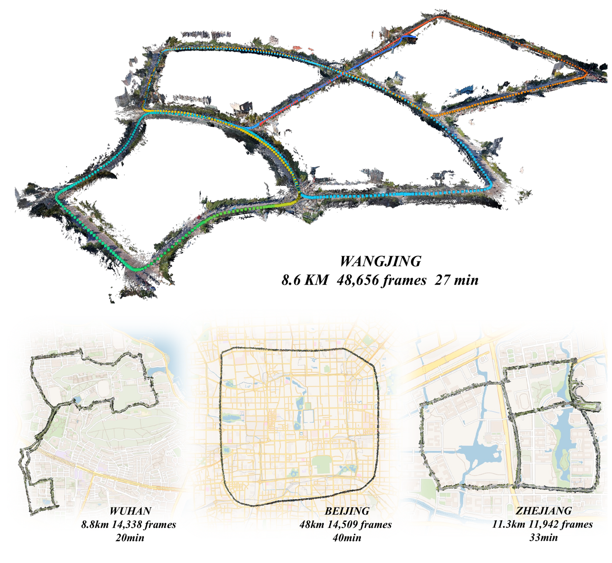
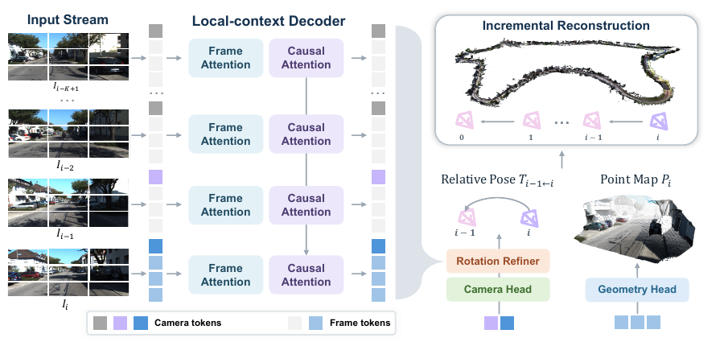
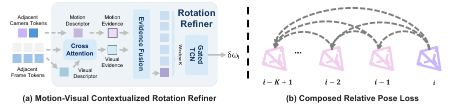
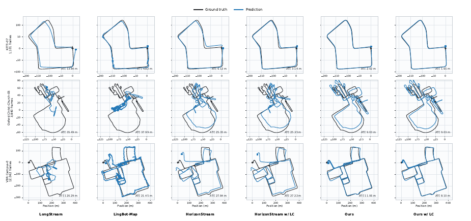
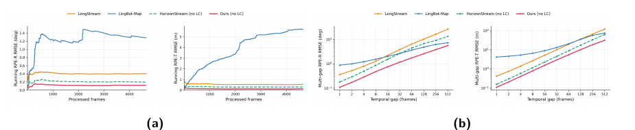

# ABot-Recon — 기억을 늘리지 말고, 기억이 필요 없는 문제로 바꿔라

---

## 📌 메타 정보

> 이 절을 두는 이유: 이 문서가 어떤 논문·어떤 코드·어떤 체크포인트를 근거로 쓰였는지 먼저 못 박아 두어야, 나중에 수치나 줄 번호가 어긋날 때 추적할 수 있기 때문.

| 항목 | 내용 |
|---|---|
| 제목 | Revisiting Local Context for Long-Horizon Streaming 3D Reconstruction |
| 저자 | Jiarong Han, Jincheng Xiong, Yuzhou Liu, Linzhe Shi, Changjie Wu, Ning Guo, Mu Xu, Hang Zhang, Ming Qian |
| 소속 | AMAP (Alibaba 고덕지도) CV Lab |
| 공개 | arXiv 2026-08-27 |
| 분야 | streaming 3D reconstruction(스트리밍 3차원 복원), visual odometry(시각 주행거리계), SLAM |
| arXiv | [abs](https://arxiv.org/abs/2608.27529) / [PDF](https://arxiv.org/pdf/2608.27529) / [HTML](https://arxiv.org/html/2608.27529v1) |
| 프로젝트 | https://amap-cvlab.github.io/ABot-Recon-html |
| 공식 코드 | https://github.com/amap-cvlab/ABot-Recon (본 문서 기준 `main` = `195cb92`, `eval` = `2fd4ad6`) |
| 체크포인트 | https://huggingface.co/acvlab/ABot-Recon (`abot_recon.safetensors`, 4.00 GB) |
| 온라인 데모 | [HF Space](https://huggingface.co/spaces/acvlab/abot-recon-streaming-3d) / [ModelScope](https://modelscope.cn/studios/amap_cvlab/ABot-Recon) |
| 라이선스 | 코드 Apache 2.0 / **가중치 CC BY-NC 4.0 (상업 사용 금지)** / cuRoPE 커널 CC BY-NC-SA 4.0 |
| 사전학습 백본 | **Pi3** 공개 가중치에서 출발 (Pi3 자신은 VGGT → DINOv2 계보) |
| 학습 데이터 | 30개 데이터셋 혼합 (synthetic 62.05% / real 37.95%). TartanAir, DL3DV, Waymo, ScanNet++, ARKitScenes 등 + 사내 비공개 7.7% |
| 학습 자원 | Stage I 48× NVIDIA H20 (32K iter) → Stage II 32× AMD MI308 (38K iter) → confidence 4K iter |
| 공개 상태 | 추론 코드 ✅ / 평가 코드 ✅(`eval` 브랜치) / **학습 코드 ❌ (2026-09-30 공개 예정)** |

**본 문서의 파라미터 수치는 추정이 아니라 실측**입니다. Hugging Face의 `abot_recon.safetensors` 헤더(129,640 바이트)를 직접 range-GET 으로 받아 JSON 을 파싱해 텐서 1,274개의 원소 수를 합산했습니다.

| 실측 항목 | 값 |
|---|---|
| 총 파라미터 | **1,000,934,176 (1.0009 B)** |
| 저장 dtype | 전부 **F32** (그래서 파일이 4.00 GB) |
| 텐서 개수 | 1,274 |

---

## 📖 주요 용어 사전 (Glossary)

> 이 절을 두는 이유: 이 논문은 새 수식이 거의 없는 대신 3D 비전과 SLAM 의 기본 어휘를 잔뜩 전제하고 있어서, 용어만 풀어놔도 논문의 절반이 읽히기 때문.

### 3D 복원 기본

| 용어 | 풀이 |
|---|---|
| **3D reconstruction(3차원 복원)** | 사진이나 영상만 보고 "이 장면이 3차원 공간에서 어떻게 생겼나"를 복원하는 것 |
| **camera pose(카메라 자세)** | 카메라가 **어디에**(translation, 평행이동 3개 숫자) **어느 방향으로**(rotation, 회전 3개 숫자) 있었는가. 합쳐서 4×4 행렬 하나로 표기 |
| **c2w** (camera-to-world) | "카메라 좌표계의 점을 세계 좌표계로 옮기는 변환". 이 논문이 출력하는 자세의 형식 |
| **trajectory(궤적)** | 영상 전체에 걸친 카메라 자세들의 나열 = 촬영자가 걸어간 길 |
| **point map(포인트맵)** | 픽셀마다 3D 좌표 (x, y, z) **셋**을 담은 맵. 이미지와 같은 해상도의 3채널 맵인데 값이 색이 아니라 3D 점. 다 모으면 point cloud(점구름) |
| **local point map(국소 포인트맵)** | 그 3D 점들을 **현재 프레임의 카메라 좌표계**로 표현한 것. ABot-Recon 이 직접 출력하는 형식 |
| **confidence map(신뢰도 맵)** | 픽셀마다 "이 3D 예측을 얼마나 믿어도 되는가"를 담은 맵 |
| **intrinsics(내부 파라미터)** | 렌즈 자체의 성질(초점거리 등). ABot-Recon 은 **이게 없어도 동작**한다는 게 강점 |
| **SfM / MVS** | 고전 파이프라인. SfM = 여러 사진에서 카메라 위치와 3D 구조를 동시에 알아내기(COLMAP), MVS = 카메라를 안다고 치고 조밀한 표면 만들기 |

### 이 논문의 핵심 개념

| 용어 | 풀이 |
|---|---|
| **streaming(스트리밍)** ⭐ | 영상 전체를 미리 보지 못하고, 프레임이 들어오는 대로 한 장씩 즉시 처리. 미래 프레임은 못 봄 |
| **causal(인과적)** | "미래를 보지 않는다"는 뜻. LLM 이 다음 단어를 예측할 때 뒤 문장을 못 보는 것과 같은 제약 |
| **long-horizon(장기 지평)** | 수천~수만 프레임짜리 아주 긴 영상. 이 논문이 겨냥하는 무대 |
| **local context(국소 맥락)** ⭐ | "최근 K프레임만 본다"는 이 논문의 핵심 설계. K = **12** (현재 1 + 과거 11) |
| **relative pose(상대 자세)** ⭐ | "직전 프레임 대비 얼마나 움직였나". 표기 `T_{i-1←i}` = 프레임 i 의 좌표를 프레임 i−1 의 좌표계로 옮기는 변환 |
| **composition(합성)** ⭐ | 상대 자세들을 순서대로 **곱해서** 절대 궤적을 복원하는 것. 식 (5) |
| **equivariance(등변성)** | "기준점을 어디로 옮겨도 문제의 형태가 안 변한다". 상대 자세 예측이 갖는 성질이자 이 논문의 근거 |
| **drift(드리프트, 누적 오차)** ⭐ | 한 걸음씩 작은 오차가 쌓여 100 m 걸으면 몇 m 씩 어긋나는 현상. composition 방식의 유일한 근본 약점 |
| **loop closure(루프 클로저)** | "여기 아까 왔던 데네"를 알아채고 그 정보로 쌓인 drift 를 한 번에 펴주는 것 |
| **PGO** (Pose Graph Optimization, 자세 그래프 최적화) | 프레임을 노드, 상대 자세 관측을 엣지로 놓고 전체 모순을 최소화하는 고전 최적화 |
| **KV cache** | Transformer 가 과거 입력을 기억해 두는 캐시. LLM 이 앞 문장을 기억하는 바로 그것 |
| **register token(레지스터 토큰)** | 원래 ViT 에서 "잉여 정보를 버리는 여유 슬롯" 용도로 넣던 토큰. ABot-Recon 은 이걸 camera token(자세 예측 전용 슬롯)으로 재활용 |

### 구조 관련

| 용어 | 풀이 |
|---|---|
| **ViT** (Vision Transformer) | 이미지를 정사각 patch(패치, 조각)로 잘라 token(토큰)으로 만든 뒤 Transformer 로 처리하는 구조 |
| **DINOv2** | Meta 가 라벨 없이(self-supervised, 자기지도) 학습시킨 ViT. 여기서는 encoder(인코더, 눈) 로 사용 |
| **VGGT / Pi3** | ABot-Recon 의 직계 조상. 여러 장을 한꺼번에 받아 pose 와 point map 을 뱉는 feed-forward(단방향) 3D 모델 |
| **frame attention / causal attention** | 짝수 블록 = 한 프레임 **안에서만** 토큰끼리 섞기, 홀수 블록 = 프레임 **사이를** 섞되 과거 12프레임만 보기 |
| **RoPE** (Rotary Position Embedding, 회전 위치 임베딩) | 위치 정보를 벡터 회전으로 넣는 방식. attention 점수가 **두 위치의 차이에만** 의존하게 되는 성질이 핵심 |
| **TCN** (Temporal Convolutional Network, 시간 합성곱 신경망) | 시간축을 따라 1D convolution 을 굴려 최근 몇 프레임을 요약하는 가벼운 구조 |
| **gated(게이트 달린)** | 두 갈래를 계산해 한쪽을 sigmoid 로 만든 뒤 곱해, "얼마나 통과시킬지"를 스스로 조절하는 방식 |
| **axis-angle(축-각 표현)** | 회전을 "어떤 축을 중심으로 몇 라디안" 3개 숫자로 나타내는 방식. `Exp()` 로 회전 행렬로 변환 |
| **paged KV cache** | LLM 서빙에서 온 기법. KV 캐시를 고정 크기 "페이지"로 쪼개 재활용해 메모리 단편화를 없앰 (FlashInfer 사용) |

### 평가 지표

| 지표 | 풀이 | 방향 |
|---|---|---|
| **ATE** (Absolute Trajectory Error, 절대 궤적 오차) | 예측 궤적 전체를 정답에 겹쳐놓고 잰 위치 오차의 RMSE (m). **장기 drift 를 봄** | 낮을수록 좋음 |
| **RPE-R** (Relative Pose Error, rotation) | 바로 옆 프레임 사이 **회전** 오차 (도). **순간 떨림을 봄** | 낮을수록 좋음 |
| **RPE-T** | 바로 옆 프레임 사이 **이동** 오차 (m) | 낮을수록 좋음 |
| **Sim(3) alignment(닮음변환 정렬)** ⭐ | 예측 궤적을 정답에 겹칠 때 회전·평행이동뿐 아니라 **전체 크기(scale)까지** 자유롭게 맞춰 주는 것. 단안 카메라는 절대 크기를 알 수 없으므로 이 분야 표준. Umeyama 알고리즘 사용 | — |
| **CD** (Chamfer Distance) | 복원 점구름과 정답 점구름 사이 평균 최근접 거리 (m) | 낮을수록 좋음 |
| **F1** | 임계값 τ 안에 든 점의 비율 (%). 7Scenes/TUM 은 τ=0.25 m, Oxford 는 τ=4 m | 높을수록 좋음 |

---

## 🎯 논문 요약 (TL;DR)

**한 줄:** 긴 영상용 3D 복원에서 "장기 기억 장치"를 붙이는 대신, **예측 대상을 국소적인 것(현재 카메라 기준 point map + 직전 프레임 대비 상대 자세)으로 바꿔** 12프레임 KV cache 만으로 무제한 길이를 처리하고, 그 부작용인 drift 는 **합성 인식 손실(composition-aware loss)** 과 **rotation refiner(회전 보정기)** 두 개로 잡는다.

**핵심 문제.** 스트리밍 3D 복원에서 5,000번째 프레임의 "1번 프레임 기준 절대 위치"를 맞히려면 1번 프레임을 기억해야 한다. 그래서 최근 연구들은 persistent memory(지속 메모리), hierarchical memory(계층 메모리), anchor frame(앵커 프레임), spatial map(공간 지도) 같은 장치를 점점 정교하게 붙여 왔다. 하지만 그 장치들은 (a) 메모리가 영상 길이에 따라 늘고 (b) 학습 때 본 적 없는 길이에서 어떻게 될지 보장이 없다.

**해결책.** 예측 대상 자체를 바꾼다. "1번 프레임 기준 내 위치"(값의 범위가 무한정 커짐) 대신 "직전 프레임 대비 이동"(1프레임이든 100만 프레임이든 값의 범위가 똑같음)을 예측한다. 점도 마찬가지로 세계 좌표계가 아니라 **현재 카메라 좌표계**에서 예측한다. 둘 다 reference frame(기준 좌표계) 변경에 대해 equivariant(등변) 하므로, 나중에 **곱해서 이어붙이면**(composition) 전역 궤적과 전역 점구름이 그대로 복원된다. 기억은 최근 12프레임 KV cache 뿐이고, 그마저 창 밖으로 나가면 버린다 → 메모리는 상수 O(K), 계산은 O(N·K).

**검증.** Oxford Spires(3,840프레임 × 10시퀀스)에서 ATE **4.35 m**, RPE-R **0.12°** — 기존 최고 스트리밍 방식(LingBot-Map 7.32 m) 대비 약 **40% 감소**. KITTI 에서도 스트리밍 방식 중 1위(18.25 m). 절제 실험(ablation)에서 composition loss 하나가 KITTI ATE 를 56.60 → 27.66 m 로 **절반 아래**로 떨어뜨린다.


*Fig. 1 — 48,656프레임(27분, 8.6 km) 도심 주행을 한 번의 causal pass 로 복원한 결과. 참고로 코드의 `--max-frames` 기본값은 22,000이므로 이런 길이는 옵션을 올려야 한다.*

---

## 🔑 핵심 기여 (Contributions)

> 이 절을 두는 이유: 뒤 알고리즘 장에서 각각을 자세히 뜯기 전에, "이 논문이 새로 주장하는 것이 정확히 몇 개인가"를 먼저 세어 두기 위함.

1. **Local formulation(국소 정식화)** — point map 은 현재 카메라 좌표계로, 자세는 인접 프레임 상대값으로 예측. 예측 대상의 범위가 시퀀스 길이와 무관해진다. (§3.1)
2. **12프레임 windowed causal attention** — 전 이력 causal attention 을 최근 K−1=11 프레임 KV cache 로 대체. persistent memory 없음, anchor 없음. (§3.2)
3. **Composition-aware pose loss(합성 인식 자세 손실)** ⭐ — 인접 쌍을 따로 채점하지 말고, **여러 간격으로 곱한 결과**를 채점. 기여도 압도적 1위. (§3.3)
4. **Motion-Visual Contextualized Rotation Refiner(움직임-시각 문맥 회전 보정기)** — 파라미터 4.75 M(전체의 0.475%)로 ATE 18~27% 감소. (§3.4)
5. **Optional loop-closure backend(선택형 루프 클로저 백엔드)** — 학습과 무관한 고전 SLAM 후처리. DINOv2-SALAD 검색 + PGO. (§3.5)
6. **재현 가능한 평가 하네스** — `eval` 브랜치에 경쟁자 6종 어댑터를 직접 포함. (§6)

---

## 🧠 주요 알고리즘 설명


*Fig. 3 — 전체 구조. 왼쪽부터 입력 스트림 → frame attention 과 causal attention 이 번갈아 쌓인 local-context decoder → camera head(자세) / geometry head(점) 두 갈래 → 오른쪽에서 순차 합성으로 전역 복원.*

### 3.0 실측 부품표

> 이 절을 두는 이유: 논문 본문에는 모델 크기가 ablation 표의 "996M / 1B" 두 줄뿐이라, 무엇이 어디에 얼마나 쓰였는지 코드와 체크포인트로 직접 세어 둬야 이후 논의가 가능하기 때문.

| 부품 | 파라미터 | 비중 | 역할 |
|---|---:|---:|---|
| `encoder` (DINOv2 ViT-L/14) | 304.37 M | 30.4% | 사진 1장 → 특징 벡터. **동결 아님**, 함께 학습됨 |
| `decoder` (36 블록) | 491.30 M | 49.1% | 짝수=frame attention, 홀수=windowed causal attention. **여기에 게이트 37.75 M 포함** |
| `point_decoder` + `point_head` | 66.73 M | 6.7% | 픽셀별 3D 점 (5블록 + linear) |
| `conf_decoder` + `conf_head` | 66.33 M | 6.6% | 픽셀별 신뢰도 (5블록 + linear) |
| `camera_decoder` | 65.60 M | 6.6% | 자세용 특징 (5블록) |
| `camera_head` (AdjacentPoseHead) | 6.60 M | 0.7% | 상대 자세 + rotation refiner |
| └ `camera_head.rot_correction` | **4.754 M** | 0.475% | rotation refiner 단독 — 논문의 "4.75 M / 0.48%" 주장과 **정확히 일치** |
| └ `camera_head.pair_mlp` | 1.312 M | | 쌍 서술자 → 자세 |
| └ `camera_head.frame_descriptor` | 0.526 M | | camera token → 프레임 서술자 |
| `register_token` | 0.01 M | | camera token 5개의 학습 가능한 초기값 |

입력은 **504 × 280 고정**(`config.json`). patch 14 → 36 × 20 = **720 패치** + register 5 = **프레임당 725 토큰**.

### 3.1 왜 상대 자세인가 — 이 논문의 뿌리

> 이 절을 두는 이유: 이 논문의 모든 설계가 "예측 대상을 국소적으로 바꾼다"는 한 가지 선택에서 파생되므로, 그 선택의 논리를 먼저 세워야 나머지가 따라 읽힌다.

지도 없이 낯선 도시를 걷는 두 가지 방법을 생각해 보자.

- **방법 A (절대 자세):** "출발점에서 지금까지의 좌표"를 계속 암산한다. 5 km 걸으면 5,000 m 짜리 숫자를 다뤄야 하고, 출발점을 계속 기억해야 한다.
- **방법 B (상대 자세):** "직전 걸음에서 몇 도 꺾어 몇 m 갔다"만 기록하고, 나중에 종이에 이어 그린다. 걸음 하나하나의 난이도는 첫 걸음이나 5,000번째 걸음이나 **똑같다**.

신경망 입장에서 A는 치명적이다. 학습 때 32~128프레임 클립만 봤는데 추론 때 4,661프레임짜리 좌표를 뱉어야 하면, 학습 분포 밖으로 나가 버린다(extrapolation, 외삽). B는 학습 분포 안에 영원히 머문다.

이걸 논문은 "예측이 reference frame 변경에 대해 equivariant 하다"고 표현한다. 대가는 하나뿐 — **각 걸음의 작은 오차가 곱해지며 쌓인다(drift)**. §3.3 과 §3.4 는 전부 이 대가를 갚는 이야기다.

### 3.2 국소 기하 추정 + 12프레임 창

> 이 절을 두는 이유: "기억을 12프레임으로 줄인다"가 실제 네트워크에서 어떤 연산으로 구현되는지 확인해야, 뒤에 나오는 O(K) 메모리 주장이 검증된다.

**식 (1) — 뼈대**

```
F_i            = Encoder(I_i)                       # 프레임 1장 → 720 패치 토큰
(G_i, C_i, M_i) = Decoder([F_i, C], M_{i-1})        # G=frame token, C=camera token, M=KV cache
P_i            = Head_point(G_i)                    # 현재 카메라 좌표계의 point map
S_i            = Head_conf(G_i)                     # confidence map
```

`C` 는 learnable camera token(학습 가능한 자세 토큰). **코드에서 이것의 정체는 `register_token` 5개**다 (`pi3.py:216`, `patch_start_idx = 5`). 즉 원래 ViT 에서 잉여 정보 버리는 용도로 쓰던 슬롯을 자세 예측 전용으로 재활용했다.

**식 (2)~(4) — 상대 자세 예측**

```
z_i     = (1/L) Σ_ℓ φ_desc(c_i^ℓ)                   # camera token 5개(L=5)를 MLP 통과 후 평균 → 프레임 서술자
q_i     = R(z_{i-1}, z_i),  R(x,y) = [x, y, y−x, x⊙y]   # 두 프레임 서술자로 "쌍 서술자" 만들기
T_{i-1←i} = Head_pose(q_i)                          # 쌍 서술자 → 4×4 상대 자세
```

`R(x,y)` 는 두 벡터를 그냥 이어붙이는 게 아니라 **차이(y−x)와 곱(x⊙y)까지 함께** 넣는다. 차이는 "얼마나 변했나", 곱은 "어떤 성분이 둘 다 강한가"를 명시적으로 제공해서, MLP 가 처음부터 관계를 배우지 않아도 되게 해 준다. 코드는 `adjacent_pose_head.py:373-381`.

출력은 quaternion(사원수, 회전 4개 숫자) + translation vector(이동 3개 숫자). 초기화가 중요하다:

```python
# adjacent_pose_head.py:250-257
nn.init.normal_(self.delta_t_head.weight, std=1e-4); nn.init.zeros_(...bias)
nn.init.normal_(self.delta_q_head.weight, std=1e-4)
self.delta_q_head.bias.zero_(); self.delta_q_head.bias[-1] = 1.0   # 항등 회전
```

즉 **학습 시작 시점에 모델은 "카메라가 안 움직였다"고 예측**한다. 안전한 출발점.

**식 (5) — 합성**

```
T_{i←j} = T_{i←i+1} · T_{i+1←i+2} · … · T_{j-1←j}
```

코드에서는 head 안에서 매 프레임 곧바로 누적한다:

```python
# adjacent_pose_head.py:342-348
corrected_delta[:, :3, :3] = raw_delta[:, :3, :3] @ correction_matrix   # 식 (11)
current_pose = previous_pose @ corrected_delta                          # 식 (5)
```

즉 "전역 궤적 복원"은 별도 후처리가 아니라 **head 안의 행렬 곱 한 줄**이다. 첫 프레임 자세는 단위행렬 → **세계 좌표계 = 첫 프레임의 카메라 좌표계**.

**식 (6) — 12프레임 창**

```
M^{(K)}_{j-1} = { KV_i }  for  i = max(0, j−K+1) … j−1
```

코드에서 확인한 정확한 의미 (`core/window_mask.py`):
- **W = `local_window_frames` = 12 는 현재 프레임을 포함한 값** → 과거는 11프레임
- 키가 보이는 조건: `T_k ≤ T_q` (causal) **그리고** `T_q − T_k ≤ W−1` (window)
- `config.py:39` 에 `if self.local_window_frames != 12: raise` — **릴리스 모델은 12 고정**

메모리 실측 계산: global 블록 18개 × 페이지 28개 × 725토큰 × 16헤드 × 64차원 × 2(K,V) × 2바이트(bf16) ≈ **1.5 GB**. 여기에 FP32 가중치 4.0 GB 를 더하면 논문이 보고한 6.71 GB 와 맞아떨어진다.

> 💡 **실무 팁:** 6.71 GB 중 4.0 GB 가 순수 FP32 가중치다. 가중치만 bf16 으로 캐스팅해 올려도 약 2 GB 를 즉시 절약할 수 있다.

### 3.3 Composition-aware Loss — 이 논문에서 하나만 가져간다면 이것

> 이 절을 두는 이유: 절제 실험에서 이 항목 하나가 KITTI ATE 를 51% 줄인다. 나머지 기여를 다 합친 것보다 크므로 가장 자세히 볼 값어치가 있다.


*Fig. 4 — (a) rotation refiner 내부: motion 증거와 visual 증거를 융합해 gated TCN 으로 회전 잔차 δω_i 를 뱉는다. (b) composed relative pose loss: 인접 쌍만이 아니라 여러 간격으로 곱한 변환을 정답과 비교한다.*

**문제.** 각 걸음을 따로 채점하면, 걸음마다 **같은 방향으로 조금씩** 틀린 편향(bias)을 잡아내지 못한다. 12개 나무 도막을 각각 1도씩만 틀리게 잘라도, 이어붙이면 12도가 휜다. 낱개 검사는 전부 통과한다.

**처방.** 창 안의 **모든 간격 조합**에 대해 곱한 결과를 채점한다.

```
P = { (i, j) : 0 ≤ i < j < N,  j − i ≤ K−1 }     # 식 (12), 간격 1~11 전부
α_ij = (j−i)^γ / mean_{(m,n)∈P}[(n−m)^γ],  0 < γ < 1   # 식 (13), 긴 사슬에 가중치 ↑
L_pose = (1/|P|) Σ_{(i,j)∈P} [ λ_trans · ℓ_trans + α_ij · λ_rot · ℓ_rot ]   # 식 (14)
```

식 (13) 을 풀어 읽으면: 간격이 클수록 가중치를 올리되, `γ < 1` 이므로 **선형보다 완만하게** 올린다(간격 11이 간격 1의 11배가 아니라 그보다 작게). 그리고 전체 평균으로 나눠 정규화하므로 창 크기를 바꿔도 손실 규모가 안 흔들린다.

가중치를 회전 항에만 붙인 것도 의도적이다 — 긴 사슬에서 터지는 건 이동보다 회전이기 때문(§3.4 첫 줄과 같은 이유).

전체 목적함수 (식 15):

```
L = λ_pose·L_pose + λ_smooth·L_smooth + λ_pts·L_pts + λ_normal·L_normal + λ_conf·L_conf
```

`L_smooth` 는 rotation refiner 가 뱉는 잔차의 크기와 시간적 변화를 함께 벌주는 정규화 항이다. 나머지 셋(점, 표면 법선, 신뢰도)은 Pi3 것을 그대로 쓴다.

> ⚠️ **λ 계수 값은 논문에 없다.** 학습 코드가 아직 미공개(2026-09-30 예정)라 Table 8 의 절제 실험은 현재 재현 불가.

### 3.4 Motion-Visual Contextualized Rotation Refiner

> 이 절을 두는 이유: 왜 하필 **회전만** 고치는지, 그리고 4.75 M 이라는 작은 모듈이 어떻게 ATE 를 20% 넘게 줄이는지가 이 절의 두 질문이다.

**왜 회전만인가.** 위치 오차 ≈ 각도 오차 × 이동 거리. 1도 틀린 채 100 m 를 가면 1.7 m 어긋난다. 반면 translation(이동)은 화면에서 물체가 밀린 양으로 비교적 잘 구속된다. 논문 표현: *"adjacent-frame translation is generally more constrained and stable than rotation."*

**구조 3단계** (코드 `adjacent_pose_head.py:110-181`):

```
f_m = φ_m(q_i)                                          # 식 (7) motion 증거: 쌍 서술자를 MLP 로
f_v = CrossAttn( φ_v(R(Ḡ_{i-1}, Ḡ_i)), [G_{i-1}; G_i] )  # 식 (8) visual 증거
f_i = φ_fuse([f_m ; f_v])                                # 식 (9) 융합
```

식 (8) 을 풀어 읽으면 coarse-to-fine(거친→세밀) 2단 구조다. ① 두 프레임의 dense patch token 720개씩을 평균내 거친 요약 `Ḡ` 을 만들고, ② 그걸 **query(질의) 한 개**로 삼아 원래의 dense token 1,440개(=720×2)에 cross-attention 을 걸어 세밀한 정보를 회수한다. 코드에서는 두 프레임을 구분하도록 `frame_role_embed` 2개를 각각 더해 준다(`:135-140`).

```
W_i  = [ f_{i-K+1}, …, f_i ]                            # 식 (10) 최근 K프레임 버퍼
δω_i = φ_o( T_h(W_i) ⊙ σ(T_g(W_i)) )                    # gated TCN
R̂_{i-1←i} = R̃_{i-1←i} · Exp([δω_i]×)                    # 식 (11) 회전 잔차 적용
```

`T_h`(값)와 `T_g`(게이트) 는 둘 다 depthwise Conv1d(채널별로 따로 도는 1D 합성곱). 게이트를 sigmoid 로 통과시켜 곱하므로, **"지금 이 채널의 시간 정보를 얼마나 믿을지"를 스스로 조절**한다.

**안전장치 3종** — 이 모듈에서 가장 잘 설계된 부분:

| 장치 | 코드 | 효과 |
|---|---|---|
| 출력 레이어 0 초기화 | `nn.init.zeros_(self.out.weight/bias)` (`:105`) | Stage II 에서 붙일 때 잔차가 정확히 0 → Stage I 성능을 절대 안 깨뜨림 |
| tanh × max_rot_deg | `residual = max_rad * tanh(out(hidden))` (`:180`) | 축당 최대 **2도**. 보정기 폭주로 궤적이 망가지는 사고를 원천 차단 |
| `L_smooth` 정규화 | 식 (15) | 잔차의 크기와 시간 변화를 함께 억제 |

> ⚠️ **코드↔논문 불일치:** 식 (10) 은 창 길이를 K(=12) 로 쓰지만, 코드 기본값은 `rot_correction_kernel = 10` (`model.py:22`). 같은 기호 K 를 두 다른 값에 쓰고 있다. 성능 영향은 크지 않겠으나 문서상 오류.

### 3.5 선택형 Loop Closure 백엔드

> 이 절을 두는 이유: 최장 벤치마크(VBR)의 성능 향상 상당 부분이 학습된 모델이 아니라 이 후처리에서 나오므로, 무엇이 학습이고 무엇이 고전 최적화인지 분리해서 봐야 한다.

학습과 완전히 분리된 후처리다. 순서:

1. **검색** — DINOv2-SALAD 서술자로 FAISS 검색. 유사도 ≥ 0.85, top-5, 최소 30프레임 이상 떨어진 쌍만 (`loop_closure.py:63-68`)
2. **재추론** — 후보 상위 50개 각각에 대해, **두 시점의 10프레임 구간을 이어붙인 20프레임짜리 가짜 영상**을 모델에 다시 통과시켜 두 프레임 사이 상대 자세를 얻음 (`:220-232`)
3. **PGO** — odometry 엣지 + loop 엣지로 자세 그래프를 만들고 GPU 희소 PCG 로 최적화. 노드는 **50프레임마다 하나**만 쓰고(`pose_graph_keyframe_stride=50`), 나머지 프레임은 보정량을 Slerp 로 부드럽게 보간해 적용 (`sparse_keyframes.py:54-79`)

엣지 가중치: odometry = 1.0, loop = `0.01 × sqrt(inliers/24)`.

> ⚠️ **기하 검증이 없다.** `inliers` 는 `default_inliers = 128` **상수**로 하드코딩되어 있어(`loop_closure.py:240`) 모든 loop 엣지가 같은 가중치 `0.01 × sqrt(128/24) ≈ 0.023` 을 받는다. RANSAC 같은 기하학적 검증도, SALAD 유사도 점수의 가중치 반영도 없다. 즉 **비슷하게 생긴 다른 장소**(perceptual aliasing — 복도가 다 똑같은 건물 등)를 오인해도 걸러지지 않는다. 유일한 완화책은 loop 가중치가 odometry 의 1/100 이라는 점.
>
> 또한 2단계의 "두 시점을 이어붙인 가짜 영상"은 **학습 때 본 적 없는 입력 분포**(순간이동하는 영상)다. 실험이 잘 작동함을 보여 주지만 원리적 보장은 없는 휴리스틱이다.

---

## 🔬 코드에서만 확인되는 것들 (논문에 없음)

> 이 절을 두는 이유: 공개 체크포인트에 논문이 설명하지 않는 부품이 들어 있으면, "성능이 어디서 나왔는가"에 대한 논문의 서사를 그대로 믿을 수 없게 되므로 따로 모아 둔다.

### 5.1 Attention Gate 37.75 M — 논문에 단 한 줄도 없음

`model.py:105` 에서 `gate_layers=list(range(36))` — **디코더 36블록 전부**에 게이트가 붙는다.

```python
# pi3/models/layers/attention.py:465-469
def _apply_output_gate(self, x_input, attn_out):
    if getattr(self, 'use_gate', False):
        gate_val = torch.sigmoid(self.gate_proj(x_input))
        return attn_out * gate_val
```

attention 출력을, 입력으로부터 만든 sigmoid 값으로 채널별·토큰별로 곱해 감쇠시키는 구조다. 크기는 **1024 × 1024 × 36 = 37,748,736 (전체의 3.8%)** — `point_decoder`(66 M)의 절반이 넘는데, 논문 본문·그림·절제 실험 어디에도 등장하지 않는다.

그리고 Table 8 의 baseline 이 **996 M** 인데 `1000.93 − 4.75(refiner) = 996.18` 이므로 **baseline 에도 이미 게이트가 들어 있다.** 즉 게이트는 한 번도 검증된 적이 없고, 성능 기여도를 알 방법이 없다.

부수 발견: 게이트 생성은 `nn.Linear(..., bias=False)` 인데 바로 아래 로그는 `"elementwise, bias=True, init bias=5.0"` 을 출력한다(`network.py:182-191`). 과거 버전 잔재.

### 5.2 3D RoPE — 논문에 없고, 경쟁자 코드에서 가져옴

원본 Pi3 는 2D RoPE(가로·세로)만 쓴다. 그런데 릴리스 모델은:

```python
# model.py:99-104
global_pos_encoding="rope3d",
rope3d_config={"theta": 10_000.0, "max_seq_len": config.max_frames, "fhw_dim": [20, 22, 22]},
```

head 차원 64를 **시간축 20 + 세로 22 + 가로 22** 로 쪼개, 프레임 간 attention 에 **시간축 위치까지** 넣는다. 논문에서 "rotary", "3D position" 을 grep 하면 0건.

그리고 파일 헤더가 이렇게 되어 있다:

```
# Copyright (c) Meta Platforms, Inc. and affiliates.
# ...licensed under the Apache License, Version 2.0 described in THIRD_PARTY_NOTICES.md.
# Adapted from ``lingbot-map/lingbot_map/layers/rope.py`` (RoPE3D, 3D RoPE).
```

**LingBot-Map 은 이 논문의 주요 비교 대상(경쟁자)이다.** README 감사문에 "draws inspiration from … LingBot-Map" 이라 적혀 있지만, 이건 "영감"이 아니라 소스 이식이다. 게다가 이 파일이 가리키는 `THIRD_PARTY_NOTICES.md` 에는 **LingBot-Map 항목이 없다**(grep 확인. HorizonStream 은 "vendoring 하지 않았다"는 부인 문장으로만 등장). 실질적인 라이선스 고지 누락.

**시간축 인덱스에 대한 미묘한 설계.** 코드는 이렇게 주석한다:

```python
# sdpa.py:110-113
# 각 프레임은 절대 시간 인덱스를 유지한다: 프레임 4989..4999 + 현재 5000 을
# 쓰지, 0..11 로 다시 번호매기지 않는다.
```

"길이 무관"을 주장하는 모델이 5000 이라는 절대 숫자를 넣어도 되는 이유는, **RoPE 의 attention 점수가 두 위치의 차이에만 의존**하기 때문이다(각각을 절대 각도로 회전시켜도 내적은 각도 차이만 남는다). 수학적으로 문제없고 오히려 재번호매김 시의 캐시 재계산을 피하는 영리한 선택이지만, 이 미묘한 성질에 정확성이 의존한다는 사실은 논문에 설명이 있어야 할 수준이다.

### 5.3 FPS 24.45 는 "자세만" 낸 속도로 보인다 ⚠️

Table 6 효율 비교에서 가장 신경 쓰이는 지점. 추적 경로:

| 단계 | 근거 |
|---|---|
| ① Table 6 은 KITTI-02 = **pose 프로토콜**에서 측정 | `configs/evaluation/relpose_stride1.yaml` 에만 `measure_forward_fps` 존재 |
| ② 어댑터가 `need_points=False` 로 호출 | `eval` 브랜치 `interfaces/abot_recon.py:339` |
| ③ → `output_keys=("camera_poses",)` | 같은 파일 `:184` |
| ④ → `_forward_frame_camera_only()` 진입 | `network.py:1147`, docstring: *"skips point/conf/global point heads"* |
| ⑤ `time_forward(...)` 가 감싸는 게 바로 이 호출 | `interfaces/abot_recon.py:175` |

즉 **`point_decoder`(5블록) + `conf_decoder`(5블록), 합쳐 132 M 파라미터가 타이밍에서 빠진다.** 반면 CUT3R·TTT3R·InfiniteVGGT 같은 경쟁자는 point map 생성이 forward 에서 분리 불가능한 구조다.

전체 경로가 인코더 24 + 디코더 36 + camera 5 ≈ 65블록이고 빠진 게 10블록이므로, dense 출력까지 켜면 대략 **10~20% 느려질 것으로 추정**(본 문서의 추산이며 실측 아님)된다. 24.45 → 약 20~22 FPS. 그러면 LingBot-Map(19.74)과 거의 붙는다. 논문의 *"faster than LongStream, LingBot-Map, and HorizonStream"* 중 **LingBot-Map 부분은 흔들릴 수 있다.** LongStream(10.36)·HorizonStream(8.02) 대비 우위는 안전하다.

### 5.4 재현성에 관한 솔직하지만 무서운 주석

```python
# preprocessing.py:96-98
# 공개 추론 파이프라인이 쓰는 미세한 bicubic 경계 오버슛을 보존한다.
# 여기서 clamp 하면 long-horizon pose composition 이 달라진다.
```

이미지를 bicubic 으로 리사이즈하면 값이 [0,1] 을 아주 살짝 벗어나는데, **그걸 정리하면 최종 궤적이 바뀐다**는 뜻이다. 부동소수점 수준의 입력 차이가 수천 번 합성되며 증폭되는 것 — composition 방식의 본질적 성질이다. 논문 어디에도 없지만, 이 계열을 쓸 때 반드시 알아야 한다. **벤치마크 숫자를 소수점 둘째 자리까지 재현하려면 전처리 코드가 바이트 단위로 같아야 한다.**

### 5.5 기타

- `--max-frames` 기본값 **22,000** — RoPE3D 의 `max_seq_len` 이기도 하다. 초과하면 조용히 틀리는 게 아니라 길이 불일치 `RuntimeError` 로 죽는다(`sdpa.py:127`). teaser 의 48,656프레임은 옵션을 올린 결과.
- `pi3.py:32` — `datasets.vendored_dust3r.utils.ossutil` import (사내 OSS 스토리지). 저장소에 없는 모듈, 죽은 코드.
- `kv_state.py`, `network.py:233` 등에 중국어 주석 잔존.
- `tests/test_release_hygiene.py` 가 `"anchor"`, `"hybrid_long_pi3"`, `"motion_mode"` 같은 문자열이 남아 있으면 실패하도록 되어 있다. 내부에 훨씬 큰 연구 코드베이스가 있고 이 릴리스는 그중 최종 구성만 잘라낸 것임을 드러낸다. `pyproject.toml` 의 description 이 `"Anchor-free streaming 3D reconstruction"` 인 것도 같은 맥락(anchor 방식을 시도했다가 버린 흔적).

---

## 📊 실험 요약

> 이 절을 두는 이유: "국소 맥락만으로 충분한가"라는 주장이 어떤 조건에서 성립하고 어떤 조건에서 깨지는지는 벤치마크별로 갈리므로, 평균 한 줄이 아니라 갈리는 지점을 봐야 한다.

### 6.1 카메라 자세 — 스트리밍 방식끼리 (루프 클로저 없음)

| 벤치마크 | 규모 | ABot-Recon ATE | 최강 경쟁자 | 판정 |
|---|---|---:|---:|---|
| **Oxford Spires** | 3,840f × 10seq, 0.18~0.80 km | **4.35 m** | LingBot-Map 7.32 | **완승 (−40%)** |
| **KITTI** | 271~4,661f × 11seq, 0.4~5.1 km | **18.25 m** | HorizonStream 22.51 | 승 (−19%) |
| **VBR** | 8,815~18,846f × 7seq, 1.0~5.2 km | 30.14 m | HorizonStream **29.02** / LingBot-Map 29.45 | **3위 (사실상 무승부)** |

RPE(순간 떨림)는 세 벤치마크 전부 압도적 1위다.

| 벤치마크 | Ours RPE-R | 2위 | 비고 |
|---|---:|---:|---|
| Oxford | **0.12°** | HorizonStream 0.20° | LingBot-Map 은 2.29° (심한 떨림) |
| KITTI | **0.10°** | HorizonStream 0.17° | |
| VBR | **0.60°** | HorizonStream 0.60° | 동률 |

**읽는 법:** "한 걸음 한 걸음은 이 모델이 제일 정확한데(RPE 압승), 아주 긴 코스의 최종 위치는 장기 기억 있는 모델과 비슷해진다(VBR ATE)." 논문 스스로도 VBR 에 대해 *"remains competitive"* 라고만 쓴다 — 정직한 표현이다.

**루프 클로저를 켜면:**

| 벤치마크 | no LC | w/ LC | 감소폭 |
|---|---:|---:|---:|
| Oxford | 4.35 | 4.02 | −8% |
| KITTI | 18.25 | 13.49 | −26% |
| **VBR** | 30.14 | **9.99** | **−67%** |

VBR(최장 시퀀스)의 승리는 **학습된 모델이 아니라 §3.5 의 고전 SLAM 백엔드**가 가져온 것이다. 논문이 이를 optional backend 로 분리해 제시하므로 은폐는 아니지만, "긴 영상에 강하다"의 근거로 VBR 을 읽을 때는 반드시 구분해야 한다.


*Fig. 5 — 궤적 정성 비교(파랑=예측, 검정=정답, Umeyama Sim(3) 정렬). 위→아래: KITTI-07 / Oxford Christ-Church-05 / VBR Campus-0. 오른쪽 두 열이 Ours, Ours w/ LC.*

### 6.2 장기 안정성


*Fig. 6 — (a) KITTI-02(4,661프레임)에서 처리 프레임 수가 늘어도 running RMSE 가 **증가하지 않음**(파란 LingBot-Map 은 계속 상승). (b) 시간 간격(gap)을 1→512 로 늘렸을 때 오차 증가 속도가 가장 완만함 = composition loss 의 효과.*

(a) 가 §3.1 의 주장("예측 대상이 길이와 무관")을 직접 보여 주는 그래프이고, (b) 가 §3.3 의 주장("여러 간격 합성을 감독하면 긴 사슬이 안정")을 보여 주는 그래프다.

### 6.3 밀집 복원

| Method | 7Scenes CD↓ / F1↑ | TUM-Dyn CD↓ / F1↑ | Oxford CD↓ / F1↑ |
|---|---|---|---|
| CUT3R | 0.18 / 75.18 | 0.11 / 90.68 | 7.26 / 41.22 |
| LongStream | 0.06 / 94.60 | 0.14 / 88.29 | 5.69 / 53.84 |
| **LingBot-Map** | 0.05 / **96.01** | **0.08 / 95.97** | 1.68 / 90.58 |
| HorizonStream | 0.23 / 98.22 | 0.12 / 90.97 | 2.00 / 84.69 |
| **Ours** | 0.06 / 94.88 | 0.11 / 92.19 | **1.37 / 91.81** |

**패턴이 선명하다.** 좁은 실내(같은 자리를 계속 다시 보는 상황) → 장기 기억 가진 LingBot-Map 승. 넓은 야외(계속 새 장소로 나아가는 상황) → ABot-Recon 승. 논문 Discussion 이 이걸 먼저 인정한다 — **이 논문에서 가장 신뢰가 가는 부분.**

### 6.4 절제 실험 (Table 8) — 논문의 급소

| 변형 | 학습 프레임 | 크기 | Refiner | L_comp | KITTI ATE | Oxford ATE | VBR ATE |
|---|---:|---:|:-:|:-:|---:|---:|---:|
| Baseline | 32 | 996 M | − | − | 56.60 | 10.16 | 52.90 |
| **+ Composition loss** | 32 | 996 M | − | ✓ | **27.66** | 9.40 | 44.72 |
| + 장기 클립 학습 | 128 | 996 M | − | ✓ | 22.31 | **5.95** | 36.77 |
| + Rotation refiner | 128 | 1 B | ✓ | ✓ | **18.25** | **4.35** | **30.14** |

| 항목 | KITTI | Oxford | VBR | 비용 |
|---|---:|---:|---:|---|
| Composition loss | **−51%** | −7% | −15% | 파라미터 0 |
| 32→128프레임 학습 | −19% | **−37%** | −18% | 학습 시간만 |
| Rotation refiner | −18% | −27% | −18% | +4.75 M (0.475%) |

**주의:** 이 표에는 §5.1 의 게이트(37.75 M)와 §5.2 의 3D RoPE 가 baseline 에 이미 포함되어 있어, 그 둘의 기여는 측정되지 않았다.

### 6.5 효율 (Table 6, H100, 입력 저장 제외)

| Method | FPS↑ | Mem (GB)↓ |
|---|---:|---:|
| CUT3R | 29.62 | 3.16 |
| TTT3R | 25.53 | 4.65 |
| **Ours** | **24.45** | **6.71** |
| LingBot-Map | 19.74 | 18.87 |
| Stream3R-w | 12.76 | 5.26 |
| LongStream | 10.36 | 6.62 |
| HorizonStream | 8.02 | 13.04 |

**단 이 FPS 는 §5.3 의 caveat 를 안고 읽어야 한다.** 메모리 6.71 GB 는 §3.2 의 계산과 일치하며 신뢰할 만하다.

### 6.6 평가 프로토콜의 정직성

`eval` 브랜치의 `README_ONLINE_EVAL_PROTOCOL.md` 는 이 분야에서 보기 드물게 상세하다. 특히 **자기에게 불리한 조건을 스스로 문서화**한다:

| Method | 7Scenes/TUM 입력 | Oxford 입력 |
|---|---|---|
| **ABot-Recon** | **280 × 504** | **280 × 504** |
| LingBot-Map | 434 × 574 | 378 × 518 |
| HorizonStream | 378 × 518 | 378 × 518 |

즉 **경쟁자가 더 높은 해상도를 받는다.** 정렬은 전 방식 동일하게 Umeyama Sim(3) + point-to-point ICP 20회, voxel 크기와 임계값까지 명시되어 있다.

---

## 💬 Q&A

### Q1. "12프레임만 기억한다"면서 어떻게 5,000프레임짜리 궤적이 나오나?

기억하는 것과 출력하는 것이 다르기 때문이다.

| 구분 | 실제 내용 | 크기 |
|---|---|---|
| **학습된 상태 (기억)** | 최근 11프레임의 KV cache | 상수 (약 1.5 GB) |
| **누적기 (기억 아님)** | `previous_pose` 4×4 행렬 1개, `previous_desc` 벡터 1개, refiner 버퍼 10프레임 | 상수 |
| **출력 (기록)** | 지금까지 계산된 자세 5,000개 = 그냥 결과 배열 | 프레임 수에 비례 |

논문이 "no persistent memory" 라 할 때의 memory 는 **첫 번째 줄**, 즉 신경망이 참조하는 학습된 상태를 뜻한다. 두 번째 줄의 `previous_pose` 는 "지금까지 걸어온 총합"을 담은 계산기 레지스터일 뿐 네트워크가 attention 으로 들여다보는 대상이 아니다. 종이에 지도를 그려 나가는 것과, 그 지도를 계속 쳐다보며 다음 걸음을 정하는 것의 차이다.

### Q2. Sim(3) 정렬로 크기를 맞춰 준다면, "ATE 4.35 m" 는 무슨 의미인가?

단안 카메라(렌즈 하나)로는 **"작은 물건을 가까이서" vs "큰 물건을 멀리서"** 를 원리적으로 구분할 수 없다. 그래서 이 모델이 뱉는 궤적은 실제 미터 단위가 아니라 **비율만 맞는 궤적**이다.

Sim(3) 정렬은 그 비율 궤적에 딱 하나의 배율을 곱해 정답에 가장 잘 겹치도록 맞춘 뒤 오차를 잰다. 따라서 "ATE 4.35 m" 는 **"전체 크기를 최적으로 맞춘 뒤에도 남는 모양의 어긋남"** 이다. 이 방식이 잡아내는 것은:

- ✅ 궤적이 휘었는가 (drift)
- ✅ 코너를 잘못 돌았는가
- ❌ 전체가 1.1배 커졌는가 ← 이건 안 잡힘 (원리적으로 불가능하므로 면제)

표에서 `*` 표시된 DPVO, DPV-SLAM, Droid-SLAM 등은 **intrinsics 를 입력으로 받는** 방식이라 조건이 다르다. Oxford 에서 DPVO 1.56 m 가 ABot-Recon 4.35 m 보다 좋지만, 렌즈 정보를 받고 시작한 결과다.

### Q3. Composition loss 는 왜 그렇게 효과가 큰가? 낱개 채점과 뭐가 다른가?

**편향(bias)과 분산(variance)의 차이**를 잡느냐 못 잡느냐다.

각 걸음의 오차가 무작위로 흩어져 있다면(분산) 합성해도 √n 정도로만 커져서 크게 문제되지 않는다. 그런데 오차가 **같은 방향으로 쏠려 있으면**(편향) 합성 시 n 에 비례해 커진다. 낱개 채점은 이 둘을 구분하지 못한다 — 각각의 오차 크기가 같으면 똑같은 점수를 준다.

합성해서 채점하면 편향만 골라서 크게 벌준다. 그래서:

- KITTI(직진 위주 주행, 편향이 누적되기 쉬움) → **51% 감소**
- Oxford(작은 루프 반복, 편향이 상쇄되기 쉬움) → 7% 감소

효과 크기가 데이터 성격에 따라 7배 차이 나는 것 자체가 이 해석의 방증이다.

### Q4. Rotation refiner 는 왜 "최근 프레임들"을 보나? 현재 두 프레임만 보면 안 되나?

**시간적 일관성(temporal consistency)** 때문이다. 카메라의 실제 움직임은 물리 법칙을 따르므로 급격히 바뀌지 않는다 — 차가 우회전 중이면 다음 프레임도 우회전 중일 가능성이 높다.

현재 두 프레임만 보면, 모션 블러·역광·특징 없는 벽 같은 순간에 예측이 튀어도 그게 튄 건지 진짜 급회전인지 알 수 없다. 최근 10프레임의 흐름을 함께 보면 "이 프레임만 흐름에서 벗어났다"를 판단할 수 있고, 그 경우에만 잔차로 되돌린다.

gated TCN 의 게이트가 하는 일이 정확히 이것이다 — "이 채널의 최근 흐름을 얼마나 신뢰할지"를 sigmoid 로 조절한다.

### Q5. 이 모델을 언제 쓰고 언제 쓰지 말아야 하나?

| 상황 | 판정 | 이유 |
|---|---|---|
| 드론·차량·도보로 **계속 앞으로 나아가는 긴 야외 영상** | 🟢 최적 | Oxford/KITTI 우승 조건. 국소 맥락으로 충분 |
| 실내에서 **같은 곳을 계속 다시 보는** 촬영 | 🟡 대안 고려 | LingBot-Map 계열이 7Scenes/TUM 에서 앞섬 |
| 렌즈 정보(intrinsics)가 있고 **정밀도가 최우선** | 🔴 부적합 | DPVO/Droid-W 같은 최적화 기반이 더 정확 |
| 반복 패턴 환경(복도, 주차장)에서 **루프 클로저 필요** | 🟡 주의 | §3.5 의 기하 검증 부재 |
| **상업 제품** | 🔴 불가 | 가중치 CC BY-NC 4.0 |
| 벤치마크 수치를 **소수점까지 재현** | 🟡 주의 | §5.4 의 전처리 민감성 |

### Q6. Pi3, VGGT, DUSt3R 와 계보상 어떤 관계인가?

```
DINOv2 (Meta, 라벨 없는 ViT)
  └→ VGGT (여러 장을 한 번에, global attention)
       └→ Pi3 (permutation-equivariant, 기준 프레임 없음)
            └→ ABot-Recon  ← 여기
                 · Pi3 가중치에서 출발 (Stage I)
                 · 절대 자세 head → 인접 상대 자세 head 로 교체
                 · full causal attention → 12프레임 windowed 로 교체
                 · +3D RoPE, +attention gate (논문 미기술)
```

`pi3.py:279-292` 에 VGGT 가중치를 디코더에 심는 코드가 남아 있다 — VGGT 의 `frame_blocks` 를 짝수 인덱스, `global_blocks` 를 홀수 인덱스에 교차로 배치한다. 릴리스에서는 `load_vggt=False` 라 실행되지 않지만, **짝수=프레임 내부 / 홀수=프레임 간이라는 교차 구조가 VGGT 에서 왔음**을 그대로 보여 준다. [[PAPER_DUSt3R]] 는 이 계보의 최초 조상(pointmap 회귀라는 표현 자체를 만든 논문)이다.

### Q7. 학습 코드가 없는데 무엇을 재현할 수 있고 무엇을 못 하나?

| 항목 | 가능? |
|---|---|
| 공개 체크포인트로 추론 | ✅ |
| 논문의 벤치마크 수치 재현 | ✅ (`eval` 브랜치에 경쟁자 어댑터까지 포함) |
| Table 8 절제 실험 | ❌ 학습 코드 미공개 |
| 자체 데이터로 fine-tuning | ❌ 손실 함수·λ 계수 없음 |
| 처음부터 학습 | ❌ 사내 데이터 7.7% 비공개 + Pi3 초기화 필요 |

`eval` 브랜치에 CUT3R, TTT3R, LongStream, LingBot-Map, HorizonStream 어댑터가 전부 들어 있다는 건 **경쟁자 숫자를 인용하지 않고 직접 돌렸다**는 뜻으로, 이 분야에서 드문 수준의 성의다.

---

## ✅ 한 줄 요약 (전체)

**아이디어(예측 대상의 국소화 + 합성 인식 손실)는 견고하고 다른 시스템에 이식 가능하며 정직하게 검증되어 있지만, 공개된 모델은 논문이 설명하는 것보다 4%쯤 큰 미기술 부품(attention gate 37.75 M + 3D RoPE)을 달고 있고, 효율 수치는 point map 을 끄고 잰 것으로 보이며, 상업적으로는 쓸 수 없다.**

### 종합 평가

| 축 | 평가 |
|---|---|
| 아이디어의 독창성 | 🟢🟢 "기억을 키우자"는 흐름에서 빠져나온 역발상. composition loss 는 단독으로 이식 가치가 큼 |
| 실험의 설득력 | 🟢 벤치마크 3+3개, 절제 실험 4단계, 장기 안정성 그래프까지. **단 게이트/RoPE3D 는 미측정** |
| 논문의 정직성 | 🟡 지는 조건(실내·VBR)을 먼저 인정하는 건 훌륭. **그러나 모델 부품 2종 미기술 + FPS 측정 조건 미명시** |
| 코드 품질 | 🟢 테스트 50개, 릴리스 위생 검사까지. 중국어 주석·죽은 코드 소량 |
| 재현성 | 🟡 추론·평가는 완전 재현 가능(경쟁자 포함), **학습은 불가** (9/30 예정) |
| 라이선스 투명성 | 🟡 배지는 Apache 2.0 인데 가중치는 CC BY-NC. LingBot-Map 고지 누락 |
| 실무 유용성 | 🟢 긴 야외 스트림에서는 현재 최선의 선택지 중 하나. **단 비상업 한정** |

**한 문장 조언:** 긴 야외 주행 영상의 궤적과 대략적 3D 가 필요하고 비상업 용도라면 바로 써도 좋다. 다만 (a) 실내 반복 관측이면 LingBot-Map 을 먼저 비교하고, (b) 루프 클로저를 켤 거면 반복 패턴 환경에서 오검출을 직접 확인하고, (c) 논문의 24.45 FPS 는 point map 을 켠 실제 사용 조건에서 직접 재측정할 것.

---

## 🔗 관련 문서

- [[PAPER_R3]] ⭐ — **가장 가까운 형제 논문** (2026-05, ABot-Recon 보다 3개월 앞섬). 똑같이 "전역 좌표계를 버리고 프레임 쌍의 상대 이동만 배운다"는 발상. ABot-Recon 은 R3 를 인용하면서 *"R3 improves pose estimation through relative prediction but **remains tied to the first-frame reference**"* 라고 차별점을 명시한다 — 즉 R3 는 상대 예측을 쓰되 여전히 첫 프레임 기준에 묶여 있고, ABot-Recon 은 인접 프레임 기준까지 내려간 것이 차이. 두 문서를 나란히 읽으면 "상대화를 어디까지 밀 것인가"의 스펙트럼이 보인다
- [[PAPER_DUSt3R]] — 이 계보의 시조. pointmap 회귀로 SfM/MVS 파이프라인을 삭제한 논문. ABot-Recon 의 point map 표현이 여기서 나옴
- [[PAPER_Murre]] — 반대 방향 접근(SfM 결과를 조건으로 확산 모델에 주입)
- [[PAPER_Depth-Anything-V2]] / [[PAPER_Depth-Anything]] — 단안 깊이 추정 계열. ABot-Recon 의 point map 은 깊이 + 광선 방향의 합성으로 볼 수 있음
- [[PAPER_4DAnyone]] — 3D/4D 재구성 계열, 논문↔코드 괴리 점검 관점이 유사
- [[reference_pretrained_backbone_reuse_landscape]] — "DINOv2 → VGGT → Pi3 → ABot-Recon" 은 사전학습 백본 재사용 분기 B의 전형적 사례

### 이 문서에서 언급된 외부 논문/코드

| 이름 | 링크 |
|---|---|
| Pi3 (직계 부모) | https://github.com/yyfz/Pi3 |
| VGGT | https://arxiv.org/abs/2503.11651 |
| DUSt3R | https://github.com/naver/dust3r |
| DINOv2 | https://github.com/facebookresearch/dinov2 |
| SALAD (장소 인식 서술자) | https://github.com/serizba/salad |
| FlashInfer (paged KV) | https://github.com/flashinfer-ai/flashinfer |
| Oxford Spires 데이터셋 | https://dynamic.robots.ox.ac.uk/datasets/oxford-spires/ |
