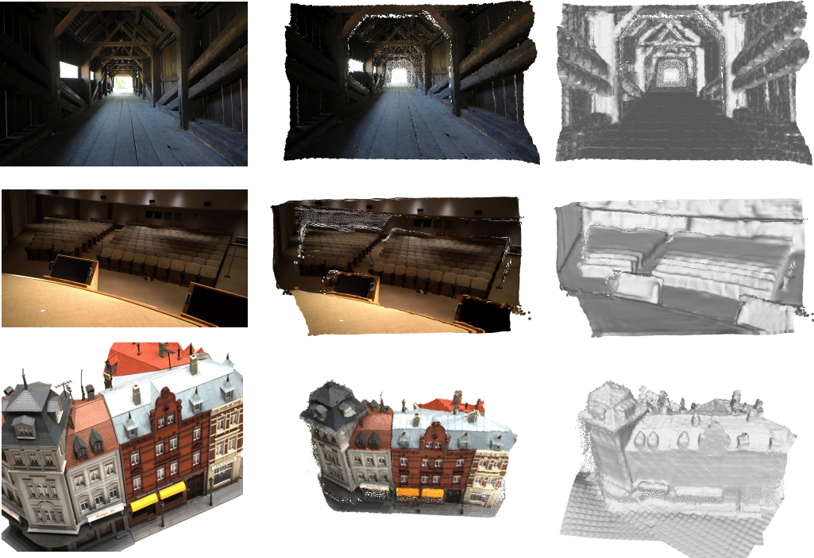
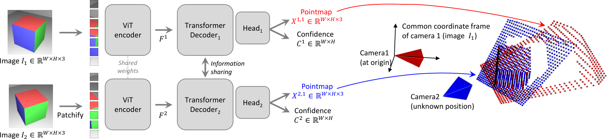
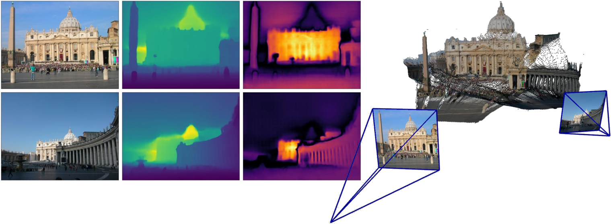

# DUSt3R — 카메라를 먼저 풀지 말고, 3D 좌표를 그냥 회귀해버려라

---

## 📌 메타 정보

> 이 절을 두는 이유: 이 문서가 어떤 논문·어떤 코드 커밋을 근거로 쓰였는지 먼저 못 박아 두어야, 나중에 수치나 코드 줄 번호가 어긋날 때 추적할 수 있기 때문.

| 항목 | 내용 |
|---|---|
| 제목 | DUSt3R: Geometric 3D Vision Made Easy |
| 저자 | Shuzhe Wang, Vincent Leroy, Yohann Cabon, Boris Chidlovskii, Jerome Revaud |
| 소속 | Naver Labs Europe (+ Aalto University) |
| 공개 | arXiv 2023-12-21 (v1), **CVPR 2024** 채택 |
| 분야 | 3D reconstruction(3D 복원), MVS(다시점 스테레오), SfM(카메라 자세·구조 동시 추정) |
| arXiv | [abs](https://arxiv.org/abs/2312.14132) / [PDF](https://arxiv.org/pdf/2312.14132) / [HTML v3](https://arxiv.org/html/2312.14132v3) |
| 프로젝트 | https://dust3r.europe.naverlabs.com/ |
| 공식 코드 | https://github.com/naver/dust3r (본 문서 기준 커밋 `4c24a6e`, 2025-07-01) |
| 라이선스 | **CC BY-NC-SA 4.0 — 상업적 사용 금지** (코드·체크포인트 모두) |
| 사전학습 백본 | **CroCo v2** (`CroCo_V2_ViTLarge_BaseDecoder.pth`) — 같은 팀의 self-supervised(자기지도) cross-view completion 모델 |
| 학습 데이터 | Habitat, CO3Dv2, ScanNet++, ARKitScenes, StaticThings3D, MegaDepth, BlendedMVS, Waymo — 총 **8.5M image pair(이미지 쌍)** |
| 공식 체크포인트 | `DUSt3R_ViTLarge_BaseDecoder_512_dpt` (기본), `..._512_linear`, `..._224_linear` |

**본 문서의 파라미터 수치는 추정이 아니라 실측**입니다. 저장소를 clone 한 뒤 `AsymmetricCroCo3DStereo` 를 실제로 인스턴스화해서 `numel()` 로 세었습니다.

---

## 📖 주요 용어 사전 (Glossary)

> 이 절을 두는 이유: 이 논문은 새 수식이 거의 없는 대신 3D 비전 분야의 기본 어휘를 잔뜩 전제하고 있어서, 용어만 풀어놔도 논문의 절반이 읽히기 때문.

### 3D 비전 파이프라인 기본

| 용어 | 풀이 |
|---|---|
| **SfM** (Structure-from-Motion, 움직임으로부터 구조 복원) | 여러 장의 사진에서 ① 카메라가 어디에 어떤 방향으로 있었는지(pose, 자세)와 ② 장면의 3D 점 위치를 동시에 알아내는 고전 기법. 대표 구현이 COLMAP |
| **MVS** (Multi-View Stereo, 다시점 스테레오) | 카메라 위치·방향을 **이미 안다고 가정하고**, 여러 사진을 비교해 조밀한(dense) 3D 표면을 만드는 단계 |
| **intrinsics(내부 파라미터) / K** | 카메라 렌즈 자체의 성질. focal length(초점거리) f 와 principal point(주점, 이미지 중심) 등 |
| **extrinsics(외부 파라미터) / pose(자세)** | 카메라가 세계 좌표계에서 어디에(translation, 평행이동) 어떤 방향으로(rotation, 회전) 있는가 |
| **calibration(보정)** | 카메라의 intrinsics 를 미리 측정해 두는 작업. DUSt3R는 **이게 없어도 된다**는 게 요지 |
| **triangulation(삼각측량)** | 두 사진에서 같은 점을 찾았을 때, 두 카메라에서 뻗은 광선(ray)의 교점으로 3D 좌표를 정하는 것 |
| **BA** (Bundle Adjustment, 번들 조정) | SfM 마지막에 모든 카메라와 3D 점을 동시에 미세조정하는 최적화. 기준은 **reprojection error(재투영 오차)** = 3D 점을 다시 이미지에 찍었을 때 원래 픽셀과 얼마나 어긋나는가 |
| **depthmap(깊이맵)** | 픽셀마다 "카메라로부터 얼마나 먼가" 스칼라 하나를 담은 맵 |

### 이 논문의 핵심 개념

| 용어 | 풀이 |
|---|---|
| **pointmap(포인트맵)** ⭐ | 픽셀마다 3D 좌표 (x, y, z) **셋**을 담은 맵. 이미지와 같은 해상도의 3채널 맵인데 값이 색이 아니라 3D 점. 표기 X 는 크기가 W×H×3 |
| **X^{2,1}** (위첨자 표기) | "**이미지 2**의 픽셀들에 대응하는 3D 점을, **이미지 1**의 카메라 좌표계로 표현한 것". 앞 숫자 = 어느 이미지의 픽셀인가, 뒤 숫자 = 어느 카메라 좌표계인가 |
| **common coordinate frame(공통 좌표계)** | DUSt3R가 두 pointmap 을 **모두 이미지 1의 좌표계**로 뱉는다는 설계. 이 한 가지 선택이 논문 전체를 굴러가게 만듦 |
| **confidence map(신뢰도 맵)** | 픽셀마다 "이 3D 예측을 얼마나 믿어도 되는가"를 담은 맵. **정답 라벨 없이** 손실 함수만으로 학습됨 |
| **global alignment(전역 정렬)** | 이미지 쌍마다 따로 나온 pointmap 들의 좌표계가 제각각이므로, N장 전체를 하나의 세계 좌표계로 봉합하는 후처리 최적화 |
| **scale ambiguity(스케일 모호성)** | 사진만으로는 "작은 물체를 가까이서 찍은 것"과 "큰 물체를 멀리서 찍은 것"을 구분할 수 없다는 근본적 한계. DUSt3R는 이걸 풀지 않고 정규화로 회피 |
| **metric scale(미터 단위 스케일)** | 실제 물리 단위(미터)로 복원하는 것. DUSt3R는 **못 함** (후속작 MASt3R가 해결) |

### 구조 관련

| 용어 | 풀이 |
|---|---|
| **CroCo v2** | "한쪽 이미지를 가리고 다른 시점 이미지를 참고해서 복원하라"는 과제로 미리 학습된(pretrained) Transformer. 라벨 없이 학습되며, 이 과제 자체가 두 시점 사이 기하 관계를 배우게 만듦 |
| **ViT** (Vision Transformer) | 이미지를 16×16 패치(patch, 조각)로 잘라 토큰(token)으로 만든 뒤 Transformer 로 처리하는 구조 |
| **siamese(샴) 구조** | 두 입력을 **완전히 같은 가중치**의 네트워크에 통과시키는 방식 |
| **cross-attention(교차 어텐션)** | 한 이미지의 토큰이 **다른 이미지의 토큰을 참조**해서 정보를 가져오는 연산. DUSt3R 디코더의 핵심 |
| **DPT head** (Dense Prediction Transformer) | Transformer 여러 층의 중간 출력을 뽑아 위로 올려가며 합쳐, 픽셀 단위 조밀한 예측을 만드는 디코더 헤드. 원래 단안 깊이 추정용으로 나온 것 |
| **RoPE** (Rotary Position Embedding, 회전 위치 임베딩) | 위치 정보를 벡터 회전으로 넣는 방식. 절대 위치표를 안 쓰므로 **학습 때와 다른 해상도**에도 잘 일반화됨 |

### 평가 지표

| 지표 | 풀이 | 방향 |
|---|---|---|
| **rel / AbsRel** | 예측 깊이와 정답 깊이의 상대 오차 평균 (%) | 낮을수록 좋음 |
| **δ₁.₂₅** | 예측/정답 비율이 1.25배 이내인 픽셀 비율 (%) | 높을수록 좋음 |
| **τ** (tau) | 다시점 깊이에서 오차가 임계값(1.03) 이내인 픽셀 비율 (%) | 높을수록 좋음 |
| **RRA@15 / RTA@15** | Relative Rotation/Translation Accuracy — 상대 회전/평행이동 오차가 15도 이내인 쌍의 비율 (%) | 높을수록 좋음 |
| **mAA(30)** | mean Average Accuracy — 0~30도 임계값 곡선 아래 면적. 회전·평행이동을 **동시에** 맞춰야 올라가는 종합 지표 | 높을수록 좋음 |
| **Accuracy / Completeness (DTU)** | 복원된 점이 정답 표면에 얼마나 가까운가 / 정답 표면이 얼마나 빠짐없이 복원됐는가 (mm) | 낮을수록 좋음 |

---

## 📝 논문 요약 (TL;DR)

> 이 절을 두는 이유: 뒤의 모든 세부 설명이 결국 무엇을 위한 것인지 한 문단으로 잡아두기 위해.

**한 줄:** 보정도 자세도 모르는 사진 두 장을 Transformer에 넣어 **3D 좌표를 곧바로 회귀(regression)** 하고, 카메라 파라미터는 그 결과에서 사후에 뽑아낸다.

**문제:** 기존 SfM/MVS는 직렬(sequential) 파이프라인이다 — 특징점 매칭 → essential matrix(필수행렬) → pose(자세) → triangulation(삼각측량) → dense stereo(조밀 스테레오). 각 단계가 앞 단계 출력을 정답으로 믿고 진행하므로 ① 오차가 누적되고 복구가 안 되며, ② 매칭이 실패하는 조건(무텍스처 벽, 시점 차 90도 이상, 사진 2~3장뿐)에서는 파이프라인 전체가 멈춘다.

**해결:** 저 단계들을 하나로 합친다. 출력을 **pointmap(포인트맵)** — 픽셀마다 3D 좌표를 담은 맵 — 으로 정의하고, 두 이미지의 pointmap 을 **둘 다 이미지 1의 좌표계로** 내놓게 한다. 그러면 두 이미지 사이의 상대 자세가 출력 안에 이미 녹아 있으므로, matching(대응점 찾기)·pose·focal·depth 가 전부 이 하나의 출력에서 **뽑아 쓰는 것**이 된다. 기하학적 제약을 명시적으로 걸지 않고 8.5M 쌍의 데이터로 prior(사전지식)를 학습시킨다.

**검증:** 다시점 자세 추정에서 CO3Dv2 mAA(30) **76.7** (기존 PoseDiffusion 66.5), 다시점 깊이에서 ETH3D 는 **정답 자세를 쓰는 방법들보다도** 좋음, 단안 깊이는 zero-shot(학습에서 본 적 없는 데이터셋)으로 지도학습 SOTA급. 반면 정밀 복원(DTU)에서는 전용 MVS 대비 5배 뒤진다.

---

## 🎯 핵심 기여 (Contributions)

> 이 절을 두는 이유: 논문이 스스로 주장하는 기여와, 실제로 분야를 바꾼 기여가 다르기 때문에 둘을 나란히 적어두려고.

**논문이 주장하는 것**

1. **보정 없고 자세 없는 이미지들로부터 end-to-end(처음부터 끝까지 한 번에) 3D 복원**을 하는 최초의 파이프라인.
2. MVS 응용을 위한 **pointmap representation(포인트맵 표현)** 의 도입 — 단안(monocular)과 양안(binocular) 경우를 하나의 표현으로 통일.
3. 여러 장을 다룰 때 쓰는 **global alignment(전역 정렬)** 최적화 — 3D 공간에서 직접 풀기 때문에 기존 BA보다 빠르고 단순.
4. 단안/다시점 깊이 추정과 상대 자세 추정에서 SOTA.

**실제로 분야를 바꾼 것 (문서 작성자 관점)**

- 새 모듈도 새 손실 트릭도 없다. **"네트워크의 출력을 무엇으로 정의할 것인가"** 라는 표현(representation) 하나를 바꿔 끼운 논문이다.
- 이 한 수 때문에 2024년 이후 "feed-forward 3D reconstruction(한 번의 순전파로 끝내는 3D 복원)"이라는 하위 분야 전체가 여기서 갈라져 나왔다 (MASt3R → MUSt3R → VGGT 계열).

---

## 🧩 주요 알고리즘 설명

> 이 절을 두는 이유: 이 논문의 모든 수식·코드가 결국 "pointmap 을 어떻게 정의하고, 어떻게 학습하고, 어떻게 여러 장으로 확장하는가" 세 덩어리이므로 한 장에 모아 설명한다.

### 5.0 전체 그림



*Figure 1 — 자세도 내부 파라미터도 모르는 사진 뭉치를 넣으면 pointmap 집합이 나오고, 거기서 depth(깊이)·pixel correspondence(픽셀 대응)·camera(카메라)·3D 모델이 곧바로 유도된다.*

### 5.1 pointmap — 이 논문의 전부

> 이 소절을 두는 이유: 여기만 이해하면 나머지는 전부 따라온다.

**정의.** pointmap X 는 크기 W×H×3 인 맵이다. 픽셀 (i, j) 마다 3D 점 하나가 일대일로 대응한다. 카메라 내부 파라미터 K 와 depthmap D 가 있으면 이렇게 만들어진다:

```
X[i,j] = K⁻¹ · [ i·D[i,j] ,  j·D[i,j] ,  D[i,j] ]ᵀ
```

(즉 픽셀 좌표를 카메라 광선 방향으로 되돌린 뒤, 그 방향으로 깊이만큼 나아간 지점)

**진짜 트릭은 좌표계다.** 네트워크는 이미지 1과 2를 받아 pointmap 두 장을 내는데, **둘 다 이미지 1의 카메라 좌표계**로 표현한다:

- X^{1,1} = 이미지 1의 픽셀들 → 이미지 1 좌표계 (자연스러움)
- X^{2,1} = **이미지 2의 픽셀들 → 이미지 1 좌표계** (여기가 핵심)

왜 이게 마법인가: 이미지 2의 점들을 이미지 1의 좌표계에 놓았다는 것은, **두 카메라 사이의 상대 자세를 이미 알고 있다는 뜻**이다. 자세 추정이 별도의 문제가 아니라 회귀 결과의 부산물이 된다. 정리하면:

| 원하는 것 | pointmap에서 얻는 법 |
|---|---|
| pixel correspondence(픽셀 대응) | 두 pointmap 사이 3D nearest neighbor(최근접 이웃) 탐색 + reciprocal(상호) 필터 |
| relative pose(상대 자세) | X^{1,1} ↔ X^{1,2} 를 Procrustes 정렬 → 회전·평행이동 **닫힌 해(closed form)** |
| focal length(초점거리) | X^{1,1} 을 다시 픽셀에 투영시키는 f 를 Weiszfeld 알고리즘으로 탐색 |
| depth(깊이) | pointmap 의 z 성분 그대로 |
| absolute pose(절대 자세, 위치추정) | 2D-3D 대응을 만들어 PnP-RANSAC |
| 3D 모델 | pointmap 자체 |

**보너스:** 같은 이미지를 두 번 넣으면 (F(I, I)) 그대로 monocular depth estimator(단안 깊이 추정기)가 된다. 단안과 양안이 하나의 표현에서 통일된다.

### 5.2 네트워크 구조 — 비대칭 샴(asymmetric siamese)



*Figure 2 — 두 이미지가 공유 가중치 ViT 인코더를 지나고, 두 개의 디코더가 매 층마다 서로 정보를 교환(information sharing)한 뒤, 각자의 헤드가 pointmap + confidence 를 낸다. 오른쪽: 두 출력이 모두 카메라 1의 좌표계에 놓인다.*

```
img1 ──┐                        ┌── 디코더 A (12층, cross-attn) ── 헤드1 → X^{1,1} + C^{1,1}
       ├─ 공유 ViT-L 인코더 ────┤          ↕ 매 층마다 상호 참조
img2 ──┘   (24층, 1024차원)      └── 디코더 B (12층, cross-attn) ── 헤드2 → X^{2,1} + C^{2,1}
```

**파라미터 실측** (512-DPT 기본 모델, `dust3r/model.py` 의 `AsymmetricCroCo3DStereo` 를 직접 인스턴스화해 측정):

| 구성요소 | 설정 | 파라미터 |
|---|---|---|
| 인코더 ViT-L (공유, 물리적으로 1개) | `enc_embed_dim=1024, enc_depth=24, enc_num_heads=16` | **303.1 M** |
| 디코더 2개 | `dec_embed_dim=768, dec_depth=12, dec_num_heads=12` | **227.7 M** |
| DPT 헤드 2개 | `feature_dim=256` | **40.4 M** |
| **합계 (dpt)** | | **571.2 M** |
| 합계 (linear 헤드 버전) | 헤드가 1.6M 뿐 | 532.3 M |

**코드를 봐야만 보이는 설계 디테일 5가지**

**① 두 디코더는 같은 가중치에서 시작해 학습으로 갈라진다.**
```python
# dust3r/model.py:72
self.dec_blocks2 = deepcopy(self.dec_blocks)
# dust3r/model.py:94-97 — CroCo 체크포인트에 dec_blocks2 가 없으면 dec_blocks 를 복사
```
즉 "이미지 1의 좌표계를 쓴다"는 **비대칭성은 구조가 아니라 손실 함수가 가르친 것**이다. 구조만 보면 두 브랜치는 대칭이다.

**② 매 층 동시 상호 참조.**
```python
# dust3r/model.py:180-186
for blk1, blk2 in zip(self.dec_blocks, self.dec_blocks2):
    f1, _ = blk1(*final_output[-1][::+1], pos1, pos2)   # f1 이 f2 를 참조
    f2, _ = blk2(*final_output[-1][::-1], pos2, pos1)   # f2 가 f1 을 참조
    final_output.append((f1, f2))
```
둘 다 `final_output[-1]`(직전 층의 결과)을 본다. 한쪽이 먼저 갱신되고 나머지가 그걸 보는 순차 구조가 아니라 **진짜 대칭 교환**이다.

**③ 절대 위치 임베딩이 없다.**
```python
# dust3r/model.py:133
assert self.enc_pos_embed is None
```
`pos_embed='RoPE100'` 만 쓴다. 224로 학습한 뒤 512로, 그것도 5가지 종횡비(512×384 / 336 / 288 / 256 / 160)로 미세조정할 수 있는 이유가 이것이다.

**④ 세로 사진 처리 꼼수 — 논문에 한 줄도 없다.**
`ManyAR_PatchEmbed` (dust3r/patch_embed.py:32) 는 portrait(세로) 이미지를 `swapaxes` 로 눕혀서 넣고, `transpose_to_landscape` (dust3r/utils/misc.py:54) 가 결과를 다시 세워 놓는다. 다중 종횡비 학습을 가능하게 하는 실무 장치.

**⑤ 계산 절약 — 대칭 배치면 인코더를 절반만 돈다.**
학습·추론에서 (I¹,I²) 와 (I²,I¹) 을 짝지어 넣는데, `is_symmetrized` 가 이를 감지하면 인코더를 한 번만 돌리고 결과를 `interleave` 로 재배치한다 (dust3r/model.py:162-166). 인코더는 이미지별로 독립이므로 정당한 최적화다.

### 5.3 학습 목표 — 스케일 정규화 + 학습되는 신뢰도

> 이 소절을 두는 이유: DUSt3R의 가장 중요한 성질(미터 단위 복원 불가)과 가장 예쁜 설계(라벨 없는 신뢰도)가 둘 다 손실 함수 안에 있기 때문.

**(a) 3D regression loss(회귀 손실)**

예측과 정답 pointmap 의 유클리드 거리인데, 각각을 **자기 자신의 평균 원점거리로 나눈 뒤** 비교한다:

```
ℓ_regr(v, i) = ‖ (1/z)·X_i^{v,1}  −  (1/z̄)·X̄_i^{v,1} ‖
```
(즉 예측 점군은 예측 점군의 평균 스케일 z 로, 정답 점군은 정답의 평균 스케일 z̄ 로 각각 나눠서 크기를 지운 뒤 비교)

```python
# dust3r/losses.py:178-181
if self.norm_mode:                                   # norm_mode='avg_dis'
    pr_pts1, pr_pts2 = normalize_pointcloud(pr_pts1, pr_pts2, self.norm_mode, valid1, valid2)
if self.norm_mode and not self.gt_scale:
    gt_pts1, gt_pts2 = normalize_pointcloud(gt_pts1, gt_pts2, self.norm_mode, valid1, valid2)
```
`avg_dis` = 유효 픽셀 전체의 원점까지 평균 거리 (dust3r/utils/geometry.py:281). 두 이미지의 점을 **합쳐서 한 번에** 정규화하므로 두 pointmap 사이의 상대 스케일 관계는 보존된다.

> ⭐ **이 한 줄이 DUSt3R의 가장 큰 한계를 만든다.** 예측도 정답도 스케일을 지우고 비교하므로 **모델은 절대 크기(metric scale)를 배울 기회가 아예 없다.** 후속작 MASt3R가 metric pointmap 을 따로 도입한 이유가 정확히 이것이다.

**(b) confidence-aware loss(신뢰도 인식 손실)** ⭐

픽셀마다 신뢰도 C 를 같이 뱉게 하고:

```
L_conf = Σ_{v,i}  C_i^{v,1} · ℓ_regr(v,i)  −  α · log C_i^{v,1}
```
(즉 "오차 × 신뢰도"를 최소화하되, 신뢰도를 무작정 0으로 낮추지 못하게 −log 벌점을 붙임)

```python
# dust3r/losses.py:229-232
conf1, log_conf1 = self.get_conf_log(pred1['conf'][msk1])
conf_loss1 = loss1 * conf1 - self.alpha * log_conf1        # alpha=0.2
```

**라벨이 전혀 없다.** 논리는 단순하다 — 오차가 클 수밖에 없는 픽셀(하늘, 반투명 물체, 가려진 영역, 정답 깊이 자체가 노이즈인 곳)은 C 를 낮춰 손실을 깎을 수 있지만, `−α·log C` 항이 무작정 낮추는 걸 막는다. 그 균형점에서 **네트워크가 "여긴 내가 자신 없다"를 스스로 학습**한다. 이 값은 나중에 global alignment 의 가중치로 재활용된다.

C 가 반드시 양수이도록 `C = 1 + exp(C̃)` 로 만든다:
```python
# dust3r/heads/postprocess.py:55  (conf_mode=('exp', 1, inf))
return vmin + x.exp().clip(max=vmax-vmin)     # = 1 + exp(x), 상한은 inf 라 사실상 무제한
```

**(c) 좌표 파라미터화 — 논문에 설명이 없는 중요한 장치**

```python
# dust3r/heads/postprocess.py:37-44  (depth_mode=('exp', -inf, inf))
d = xyz.norm(dim=-1, keepdim=True)
xyz = xyz / d.clip(min=1e-8)          # 방향(단위벡터)
return xyz * torch.expm1(d)           # 방향 × (e^d − 1)
```
네트워크 출력 벡터를 **방향과 크기로 분해**한 뒤 크기에 `expm1` 을 씌운다. 원점 근처에서는 expm1(d) ≈ d 라 선형처럼 동작하고, 멀어질수록 지수적으로 커진다. **유한한 네트워크 출력 범위로 실내 1m 부터 실외 수백 m 까지의 깊이 동적 범위를 커버**하는 장치다. 이게 없으면 실내/실외 혼합 학습이 잘 안 된다.

### 5.4 pointmap에서 카메라를 되뽑기

> 이 소절을 두는 이유: "카메라를 안 쓴다"는 논문이 결국 카메라를 어떻게 되찾는지가 실무에서 가장 자주 쓰이는 부분이기 때문.

**focal length 추정 (Weiszfeld).** X^{1,1} 을 다시 픽셀 평면에 투영했을 때 원래 픽셀 위치와 가장 잘 맞는 f 를 찾는다. 신뢰도로 가중한 L1 문제라 outlier(이상치)에 강하고, IRLS(iteratively reweighted least squares, 반복 재가중 최소자승) 10회면 수렴한다.
```python
# dust3r/post_process.py:44-53
focal = dot_xy_px.mean(dim=1) / dot_xy_xy.mean(dim=1)      # L2 닫힌 해로 초기화
for iter in range(10):
    dis = (pixels - focal.view(-1,1,1) * xy_over_z).norm(dim=-1)
    w = dis.clip(min=1e-8).reciprocal()                    # 거리의 역수로 재가중
    focal = (w * dot_xy_px).mean(dim=1) / (w * dot_xy_xy).mean(dim=1)
```
마지막에 화각 60도 기준 focal 의 0.5~3.5배로 clip 한다 (post_process.py:57-58). 즉 **암묵적으로 "말이 되는 화각" 사전지식이 하드코딩되어 있다.**

**relative pose(상대 자세).** 두 가지 길이 있다: ① 2D 대응 → intrinsics → essential matrix, ② X^{1,1} 과 X^{1,2} 를 Procrustes 정렬해 닫힌 해로. 논문은 ②가 노이즈에 약하다고 인정하고 실제로는 **RANSAC-PnP** 를 권한다.

**두 장뿐이면 최적화를 아예 안 한다.** 데모는 이미지가 정확히 2장이면 `PairViewer` 를 쓴다 (dust3r/demo.py:158) — gradient descent 없이 focal 추정 + `cv2.solvePnPRansac` 만으로 끝낸다. 두 방향 예측 중 **신뢰도 곱이 큰 쪽을 기준 좌표계로 채택**한다 (pair_viewer.py:66-73). 논문에는 없는 실무 판단.

### 5.5 global alignment — **논문 수식과 실제 코드가 다르다** ⭐

> 이 소절을 두는 이유: 이 논문에서 논문↔코드 괴리가 가장 큰 지점이고, 재구현하려는 사람이 반드시 알아야 하기 때문.

이미지가 N장이면 쌍마다 따로 예측이 나오므로 좌표계가 제각각이다. 이걸 하나로 봉합하는 후처리가 global alignment 다.

**논문의 식 (Eq. 5)** 은 자유로운 3D 점 집합 χ 를 직접 최적화한다:
```
χ* = argmin_{χ, P, σ}  Σ_e Σ_{v∈e} Σ_i  C_i^{v,e} · ‖ χ_i^v − σ_e · P_e · X_i^{v,e} ‖
```
(각 엣지 e 의 pointmap 에 강체변환 P_e 와 스케일 σ_e 를 곱한 것이, 전역 점 χ 와 얼마나 어긋나는지를 신뢰도 C 로 가중해 최소화. σ 들의 곱이 1이라는 제약으로 전부 0으로 쪼그라드는 자명해를 막음)

**그런데 공개 코드에는 χ 버전이 존재하지 않는다.** 최적화 변수는 처음부터 카메라 모델이다:
```python
# dust3r/cloud_opt/optimizer.py:29-33
self.im_depthmaps = nn.ParameterList(torch.randn(H, W)/10-3 for H, W in self.imshapes)  # log(depth)
self.im_poses     = nn.ParameterList(self.rand_pose(self.POSE_DIM) ...)                 # 쿼터니언+평행이동
self.im_focals    = nn.ParameterList(torch.FloatTensor([focal_break*np.log(max(H,W))]) ...)
self.im_pp        = nn.ParameterList(torch.zeros((2,)) ...)                             # 주점
```
즉 3D 점은 항상 **카메라 광선 위에 갇혀 있다**. 논문이 "χ 를 핀홀 모델로 대체하면 카메라도 얻는다"고 부록처럼 덧붙인 쪽이 사실상 유일한 구현이다. 실용적으로는 더 나은 선택(자유도가 적어 훨씬 잘 수렴)이지만, **논문 본문 식을 그대로 재구현하려는 사람은 헛수고를 하게 된다.**

**가중치도 다르다.** 논문 식의 가중치는 신뢰도 C 인데, 코드 기본값은 **log C** 다:
```python
# dust3r/cloud_opt/commons.py:48-50  (base_opt 기본 인자 conf='log')
if mode == 'log':
    def conf_trf(x): return x.log()
```
C 는 `1+exp(·)` 라 지수적으로 커질 수 있으므로, 로그로 눌러 특정 엣지가 손실을 독식하는 것을 막는 실전 보정이다. 역시 논문에 없다.

**초기화가 사실상 핵심이다.** 비볼록(non-convex) 문제라 랜덤 시작으로는 잘 안 풀린다. 코드는:
1. 엣지 점수 = 두 신뢰도 맵 평균의 곱 → **minimum spanning tree(최소/최대 신장 트리)** 구성
2. 가장 신뢰도 높은 엣지의 pointmap 을 기준으로 삼고, 트리를 따라가며 `roma.rigid_points_registration` (신뢰도 가중 Procrustes)로 점군을 이어붙임
3. 아직 자세가 없는 카메라는 `cv2.solvePnPRansac` 로 채움
4. 그 다음에야 Adam 최적화 (lr=0.01, betas=(0.9, 0.9), 기본 300 스텝, cosine 스케줄)

```python
# dust3r/cloud_opt/base_opt.py:337
optimizer = torch.optim.Adam(params, lr=lr, betas=(0.9, 0.9))
```

**이건 BA가 아니다.** 재투영 오차(reprojection error)가 아니라 **3D 공간 거리**를 직접 최소화한다. 그래서 GPU에서 몇 초로 끝나지만, 기하학적으로 BA와 등가가 아니며 **정확도 상한이 여기서 결정된다.** (DTU에서 전용 MVS에 5배 밀리는 이유의 상당 부분이 여기 있다.)

**부가 기능:** `clean_pointcloud` (base_opt.py:369) 는 각 3D 점을 다른 카메라에 투영해, 그 카메라의 depthmap 보다 **앞에 떠 있는데 신뢰도는 더 낮은** 점들의 신뢰도를 0으로 만든다. 즉 "허공에 떠 있는 유령 점" 제거기다. 데모에서 기본 활성화되어 있다.

---

## 📊 실험 요약

> 이 절을 두는 이유: 이 논문의 진짜 위치("정밀도 챔피언이 아니라 로버스트니스 챔피언")는 표를 나란히 놓아야만 보이기 때문.

### 6.1 학습 설정 (논문 Table 7)

3단계 순차 학습이다. 매 단계 이전 단계의 가중치에서 출발한다.

| 항목 | 1단계 (저해상도) | 2단계 (고해상도) | 3단계 (DPT) |
|---|---|---|---|
| 예측 헤드 | Linear | Linear | **DPT** |
| 입력 해상도 | 224×224 | 512×{384,336,288,256,160} | 동일 |
| 에폭당 쌍 수 | 700k | 70k | 70k |
| Batch size | 128 | 64 | 64 |
| Epochs | 50 | 100 | 90 |
| Warmup epochs | 10 | 20 | 15 |
| Optimizer | AdamW, lr 1e-4, wd 0.05, β=(0.9, 0.95), cosine decay | (동일) | (동일) |
| 초기화 | **CroCo v2** | 1단계 결과 | 2단계 결과 |
| 증강 | random centered crop, color jitter | (동일) | (동일) |

학습 데이터 혼합 (논문 Table 8, 총 8.5M 쌍):

| 데이터셋 | 쌍 수 | 성격 |
|---|---|---|
| ARKitScenes | 2.04 M | 실내 실사 (iPad LiDAR) |
| MegaDepth | 1.761 M | 실외 랜드마크 (인터넷 사진) |
| Waymo | 1.1 M | 실외 주행 |
| BlendedMVS | 1.062 M | 합성/실사 혼합 |
| Habitat | 1.0 M | 합성 실내 |
| CO3Dv2 | 0.941 M | 물체 중심 |
| StaticThings3D | 0.337 M | 합성 |
| ScanNet++ | 0.224 M | 실내 실사 (고품질) |

### 6.2 결과

| 과제 / 벤치마크 | DUSt3R 512 | 비교 대상 | 판정 |
|---|---|---|---|
| **다시점 자세 (CO3Dv2, 10장)** | RRA@15 **96.2** / RTA@15 **86.8** / mAA(30) **76.7** | PoseDiffusion 80.5 / 79.8 / 66.5 | 🟢 압승. 이 논문 최고 결과 |
| **다시점 자세 (RealEstate10K)** | mAA(30) **67.7** | PoseDiffusion 48.0 | 🟢 압승 |
| 자세 (3장·5장만 줬을 때) | 여전히 우위 유지 | — | 🟢 사진 3장에서도 동작 |
| **다시점 깊이 (ETH3D)** | rel **2.91** / τ **76.91** | **정답 자세를 쓰는 방법들보다도 좋음** | 🟢 가장 놀라운 결과 |
| 단안 깊이 (KITTI, zero-shot) | rel **10.74** / δ₁.₂₅ 86.60 | 지도학습 SOTA급 | 🟢 깊이 전용 학습을 한 적 없음 |
| 단안 깊이 (DDAD / BONN) | 13.88 / 81.17, 8.08 / 93.56 | 자기지도 계열 상회 | 🟢 |
| 위치추정 (7Scenes) | 3cm / 0.97도 급 | HLoc, DSAC*, PixLoc 과 대등 | 🟢 해당 장면을 학습에서 본 적 없음 |
| **3D 복원 (DTU)** | Acc **2.677mm** / Comp **0.805mm** / 종합 **1.741mm** | CasMVSNet 0.325mm (정답 카메라 사용) | 🔴 **약 5배 뒤짐** |
| 속도 | 쌍당 **≈40ms** (H100), 이미지당 **0.13초** | COLMAP 약 3분 | 🟢 |

**정직하게 읽으면:** DTU 5배 차이가 이 논문의 실제 위치를 말해준다. DUSt3R는 정밀도 챔피언이 아니라 **"아무 조건 없이도 그럴듯한 결과가 나온다"는 로버스트니스 챔피언**이다. 저자들도 이를 인정하고 "plug-and-play(꽂으면 바로 되는) 성질이 절대 정확도를 상쇄한다"고 쓴다 — 타당한 방어다.



*Figure 3 — 학습 중 본 적 없는 장면. 왼쪽부터 RGB / depth map / confidence map / 복원 결과. confidence map 이 하늘·경계 영역에서 낮게 나오는 것을 확인할 수 있다.*

### 6.3 절제 실험 (ablation) — 있는 것과 없는 것

**있는 것: 딱 두 축뿐** (사전학습 유무 × 해상도)

| 설정 | KITTI 단안 깊이 rel | 7Scenes 위치추정 |
|---|---|---|
| 224, CroCo 사전학습 **없음** | 20.10 | 5cm / 1.76도 |
| 224, CroCo 사전학습 있음 | 16.97 | 3cm / 0.96도 |
| 512, CroCo 사전학습 있음 | **10.74** | 3cm / 0.97도 |

→ CroCo 사전학습과 고해상도가 둘 다 크게 기여함은 확실히 보였다.

**없는 것 ⚠️ — 이 논문의 가장 큰 실험적 공백**

정작 **DUSt3R 고유 요소에 대한 절제 실험이 하나도 없다**:

| 검증되지 않은 설계 | 왜 궁금한가 |
|---|---|
| confidence loss (α=0.2) | 빼면 얼마나 나빠지는가? α 민감도는? |
| 두 출력을 **같은 좌표계**로 내는 선택 | 각자 자기 좌표계로 내고 나중에 정렬하면 안 되는가? (논문이 "radically differs"라 자랑하는 바로 그 선택) |
| `expm1` 좌표 파라미터화 | linear 로 하면 얼마나 나빠지는가? |
| MST 초기화 | 랜덤 초기화 대비 얼마나 중요한가? (코드를 보면 결정적일 것 같은데 수치가 없다) |
| 디코더를 2개로 분리 | 하나로 공유하면? |

즉 **"CroCo + 데이터 + 해상도"가 성능의 대부분이라는 것만 증명됐고, "pointmap 이라는 아이디어"의 각 구성요소가 얼마나 기여했는지는 증명되지 않았다.**

---

## 🔧 공식 코드 리뷰

> 이 절을 두는 이유: 이 논문은 코드를 열어봤을 때 논문과 어긋나는 지점이 유난히 많아서, 그대로 쓰려는 사람이 반드시 먼저 알아야 하기 때문.

### 7.1 🔴 논문의 학습 레시피를 재현할 수 없다

README 354~394행의 실제 학습 명령에 들어있는 8개 데이터셋 중 하나가 **`InternalUnreleasedDataset`** — 미공개 사내 데이터다.

```bash
# README.md:360 (일부)
--train_dataset=" + 100_000 @ Habitat(...) + 100_000 @ BlendedMVS(...) + 100_000 @ MegaDepth(...)
 + 100_000 @ ARKitScenes(...) + 100_000 @ Co3d(...) + 100_000 @ StaticThings3D(...)
 + 100_000 @ ScanNetpp(...) + 100_000 @ InternalUnreleasedDataset(...) "
```

반면 논문 Table 8은 8번째 데이터셋을 **Waymo (1.1M 쌍)** 라고 적는다. 저장소에는 `dust3r/datasets/waymo.py` 와 `datasets_preprocess/preprocess_waymo.py` 가 **존재하는데도 공개된 학습 명령은 Waymo 를 쓰지 않는다.** 논문 표와 공개 레시피가 서로 다른 구성이다.

### 7.2 🔴 학습량 수치도 논문과 안 맞는다

| 항목 | 논문 Table 7 | README 실제 명령 | 차이 |
|---|---|---|---|
| 224 단계 에폭당 쌍 | 700k | 8 × 100k = **800k** | +14% |
| 224 단계 epochs | 50 | **100** | **2배** |
| 512 단계 에폭당 쌍 | 70k | 8 × 10k = **80k** | +14% |
| 512 단계 epochs | 100 | 100 | ✅ |
| DPT 단계 epochs | 90 | 90 | ✅ |
| Batch size (전 단계) | 128 / 64 / 64 | 8 GPU × 16 × 1 = 128, 8 × 4 × 2 = 64, 8 × 4 × 2 = 64 | ✅ 정확히 일치 |

224 단계만 놓고 보면 **총 학습량이 약 2.3배 차이**(35M vs 80M pair-sample)다. 700k = 7 × 100k, 70k = 7 × 10k 인 걸 보면 논문 수치는 **7개 데이터셋 기준**으로 보이는데, 정작 Table 8은 8개를 나열한다. 어느 쪽이 실제 체크포인트를 만든 설정인지 문서만으로는 알 수 없다.

### 7.3 🔴 버그 — MST 초기화에서 변수를 갱신 전에 사용

`dust3r/cloud_opt/init_im_poses.py:150-161`

```python
while todo:
    score, i, j = todo.pop()

    if im_focals[i] is None:
        im_focals[i] = estimate_focal(pred_i[i_j])   # ← i_j 는 아직 "직전 엣지" 값
    if i in done:
        ...
        i_j = edge_str(i, j)                          # ← 여기서야 이번 엣지로 갱신됨
```

`i_j` 를 이번 반복의 값으로 갱신하기 **전에** 사용한다. 즉 이미지 i 의 focal length 를 **직전 엣지의 pointmap** 으로 추정한다 — 대부분의 이미지에서 잘못된 값이 들어간다.

- **영향 범위:** `im_focals[i]` 는 한 번 채워지면 다시 계산되지 않는다(193~195행의 보충 루프는 `None` 만 채움). 이후 `fast_pnp` 의 카메라 자세 초기화와 `_set_focal` 의 최적화 초기값으로 쓰인다.
- **심각도:** 🟡 중간. focal 은 이후 자유변수로 다시 최적화되므로 치명적이진 않지만, **MST가 채운 초기 카메라의 PnP 품질을 떨어뜨리고**, `preset_focal` 을 쓰지 않는 기본 경로에서 **항상** 발생한다. 초기값 품질이 곧 최종 품질인 비볼록 최적화에서는 무시할 수 없다.

### 7.4 🟡 죽은 코드

`dust3r/cloud_opt/optimizer.py:76-81`

```python
# normalize scale if there's less than 1 known pose
n_known_poses = sum((p.requires_grad is False) for p in self.im_poses)
self.norm_pw_scale = (n_known_poses <= 1)

self.im_poses.requires_grad_(False)
self.norm_pw_scale = False        # ← 두 줄 위 계산을 무조건 덮어씀
```
조건부로 계산한 값을 즉시 상수로 덮어쓴다. 앞의 계산은 의미가 없다. (`modular_optimizer.py` 쪽에는 덮어쓰기가 없어서 두 최적화기의 동작이 다르다.)

### 7.5 🔴 확장성 — 실질적인 벽

`make_pairs(scene_graph='complete', symmetrize=True)` 는 이미지 N장에 대해 **N(N−1)회 순전파**를 요구한다.

| 이미지 수 | 쌍(엣지) 수 | 순전파 시간 (40ms/쌍 가정) | pointmap 메모리 (512×384 기준) |
|---|---|---|---|
| 5장 | 20 | 0.8초 | ~0.13 GB |
| 10장 | 90 | 3.6초 | ~0.57 GB |
| 20장 | 380 | 15초 | **~2.4 GB** |
| 50장 | 2,450 | 98초 | **~15 GB** |

게다가 최적화기가 엣지별 pointmap 을 **두 벌 보관**한다 — `self.pred_i/pred_j` (원본 `NoGradParamDict`) 와 `_stacked_pred_i/_stacked_pred_j` (스택 사본, optimizer.py:56-57). 위 표의 메모리를 **약 2배**로 봐야 한다. 20장에서 이미 5GB 안팎이고 50장은 실용 범위를 벗어난다.

논문은 이 비용을 정면으로 다루지 않는다. **MASt3R-SfM(희소 그래프 + 재투영 기반 최적화)와 MUSt3R(전역 정렬 자체를 제거)가 나온 이유가 바로 여기다.**

### 7.6 🟡 그 밖에 알아둘 것

| 항목 | 내용 |
|---|---|
| `load_model` 의 `eval()` | 체크포인트에 저장된 문자열을 그대로 `eval()` 한다 (model.py:39). 신뢰할 수 없는 체크포인트를 로드하면 임의 코드 실행 위험 |
| `strict=False` 로 로드 | model.py:40. 가중치가 일부 안 맞아도 조용히 통과한다 |
| focal 범위 하드코딩 | 화각 60도 기준의 0.5~3.5배로 clip (post_process.py:57-58). 극단적 광각/망원 사진에서는 조용히 잘린다 |
| `assert net.dec_depth > 9` | DPT 헤드가 디코더 6·9·12층을 훅으로 뽑기 때문 (dpt_head.py:100,110). 얕은 디코더로는 DPT 헤드를 못 쓴다 |
| DPT 입력 구성 | 훅 인덱스 `[0, 6, 9, 12]` 인데 **0번은 디코더가 아니라 인코더 출력**이다 (dim_tokens `[1024, 768, 768, 768]`). 즉 인코더 1 + 디코더 3 레벨을 융합한다 — 논문에 없는 정보 |
| 라이선스 | **CC BY-NC-SA 4.0. 코드도 체크포인트도 상업적 사용 불가.** 실무 도입 시 가장 먼저 확인해야 할 항목인데 논문엔 당연히 없다 |

### 7.7 재현성 총평

| 항목 | 상태 |
|---|---|
| 추론 코드 | 🟢 완비. 데모(gradio)까지 포함, 바로 돌아감 |
| 학습 코드 | 🟢 완비 (`train.py`, 데이터셋 전처리 스크립트 8종 포함) |
| 체크포인트 | 🟢 3종 공개 (224_linear, 512_linear, 512_dpt) |
| **학습 데이터** | 🔴 **8개 중 1개가 미공개 사내 데이터** → 체크포인트 재현 불가 |
| **논문↔코드 일치** | 🔴 전역 정렬 수식(χ 최적화)이 구현되지 않음, 가중치가 C 대신 log C, 학습량 수치 불일치 |
| 코드 품질 | 🟡 전반적으로 읽기 좋고 실용적(전역 정렬이 순수 PyTorch 300줄). 단 위의 버그 1건 + 죽은 코드 |

**결론:** 공개된 체크포인트를 **쓰는 것**은 완전히 재현 가능하다. 공개된 코드로 **처음부터 학습해 논문 수치를 재현하는 것**은 불가능하다.

---

## 💬 Q&A

> 이 절을 두는 이유: 위 설명을 읽고 나면 반드시 떠오르는 질문들이 있는데, 앞 장에 끼워 넣으면 흐름이 끊기므로 여기 모았다.

### Q1. "카메라 없이 3D를 만든다"가 정말 가능한가? 스케일은 어떻게 아나?

**못 안다. 그리고 논문은 그걸 풀지 않고 회피한다.**

사진만으로는 "작은 물체를 가까이서" 와 "큰 물체를 멀리서"를 구분할 수 없다 (scale ambiguity). DUSt3R는 손실 함수에서 예측과 정답을 **각각 자기 스케일로 정규화**해서 비교하므로(5.3절 (a)), 애초에 절대 크기를 학습하지 않는다.

결과물은 "형태와 상대 비율은 맞지만 전체 크기는 임의"인 3D다. 실제 미터 단위가 필요하면 ① 알려진 크기의 물체를 넣거나, ② 카메라 baseline(기선 길이)을 알거나, ③ 후속작 MASt3R 를 쓰면 된다.

### Q2. 그럼 focal length 는 어떻게 나오는 건가? 보정 안 했다면서.

pointmap 자체가 이미 "각 픽셀이 3D 공간의 어느 방향, 얼마 거리에 있는가"를 담고 있다. 여기서 f 는 **"이 3D 점들을 다시 이미지에 찍었을 때 원래 픽셀 위치와 가장 잘 맞는 값"** 으로 역산된다 (5.4절).

주의할 점: 이건 진짜 보정이 아니라 **네트워크가 학습 데이터에서 배운 화각 사전지식의 반영**이다. 그래서 코드에 화각 60도 기준 0.5~3.5배라는 clip 이 하드코딩되어 있다. 학습 데이터에 없던 극단적 광각(어안 렌즈 등)에서는 신뢰할 수 없다.

### Q3. 여러 장 넣을 때 다시점 일관성(multi-view consistency)은 어디서 나오나?

**네트워크가 아니라 전적으로 후처리에서 나온다.** DUSt3R 네트워크는 **한 번에 두 장만** 본다 — 3장 이상을 동시에 본 적이 한 번도 없다.

따라서 N장의 일관성은 100% global alignment 최적화(5.5절)의 몫이다. 이 구조가 만드는 세 가지 결과:

1. 이미지가 늘어나면 순전파 비용이 **제곱으로** 증가한다 (7.5절).
2. 최적화가 실패하면 개별 쌍 예측이 아무리 좋아도 결과가 무너진다.
3. 반대로, 네트워크는 건드리지 않고 최적화만 개선해도 성능이 오른다 → 실제로 후속 연구들이 여기를 공략했다.

### Q4. CroCo 사전학습이 그렇게 중요한가?

절제 실험 기준으로 **KITTI 단안 깊이 rel 20.10 → 16.97** (약 16% 개선)이다. 해상도 상승(16.97 → 10.74, 37% 개선)보다는 작지만 확실하다.

더 중요한 건 **왜 도움이 되는가**다. CroCo 의 사전학습 과제는 "한쪽 이미지를 가리고, 다른 시점의 이미지를 참고해서 복원하라"다. 이 과제를 잘 풀려면 **두 시점 사이의 기하학적 대응 관계를 이미 배워야만 한다.** 즉 DUSt3R가 풀려는 문제의 "절반"이 라벨 없이 미리 학습되어 있는 셈이다. 일반 ImageNet 사전학습이었다면 이만큼 안 나왔을 가능성이 높다 — 다만 **논문은 그 비교(CroCo vs 다른 사전학습)를 하지 않았다.**

### Q5. 이 논문의 주장 중 과장된 것은?

| 주장 | 실제 |
|---|---|
| "기존 BA보다 빠르고 단순한 global alignment" | 🟡 빠른 건 사실이지만 **BA가 아니다.** 재투영 오차가 아니라 3D 거리를 최소화하므로 기하학적으로 등가가 아니고, 정확도 상한이 여기서 막힌다 |
| "state-of-the-art on 3D reconstruction" | 🔴 DTU에서 전용 MVS 대비 **5배 뒤진다.** 논문도 인정하지만 abstract 톤은 훨씬 강하다 |
| Eq. 5 의 전역 점 χ 최적화 | 🔴 **구현되어 있지 않다** (5.5절) |
| "8.5M 쌍, 8개 데이터셋으로 학습" | 🔴 공개 레시피는 그중 하나가 **미공개 사내 데이터**다 (7.1절) |
| "monocular과 binocular를 매끄럽게 통일" | 🟢 사실. 같은 이미지를 두 번 넣는 것만으로 단안 깊이 추정기가 된다 |
| 상대 자세 추정 결과 | 🟢 과장 없음. 오히려 이 논문의 최고 결과인데 제목이 이를 부각하지 않는다 |

### Q6. 언제 쓰면 되고, 언제 쓰면 안 되나?

**쓰면 좋은 경우**
- 사진이 **적다** (2~20장). COLMAP이 아예 실패하는 구간
- 시점 차가 크다 (90도 이상, 심지어 거의 마주 보는 배치)
- 카메라 정보가 전혀 없다 (인터넷에서 긁은 사진, 오래된 아카이브)
- 무텍스처 영역이 많다 (흰 벽, 하늘) — 학습된 prior 가 메워준다
- 빠른 프로토타이핑, "일단 대충 3D가 보여야 하는" 상황

**쓰면 안 되는 경우**
- **정밀 계측**이 목적 (DTU에서 5배 뒤짐)
- **미터 단위**가 필요 (스케일을 모름) → MASt3R
- 사진이 **많다** (50장 이상) → 제곱 비용 + 메모리 폭발 → MASt3R-SfM / MUSt3R
- **상업적 제품** (CC BY-NC-SA 4.0)
- 움직이는 물체가 있는 장면 (정적 장면 가정)

### Q7. Murre 같은 "SfM 결과를 조건으로 넣는" 방식과 뭐가 다른가?

방향이 정반대다.

| | Murre 계열 | DUSt3R |
|---|---|---|
| SfM | **필요하다** (희소 점군을 조건으로 입력) | **필요 없다** (SfM 을 대체) |
| 스케일 | SfM 이 준 스케일을 물려받음 | 없음 |
| 카메라 정보 | 필요 | 불필요 |
| 실패 조건 | SfM 이 실패하면 같이 실패 | SfM 이 실패하는 곳이 오히려 주 무대 |
| 정밀도 | 조건이 좋으면 더 높음 | 상대적으로 낮음 |

즉 Murre 계열은 "SfM 이 성공한 뒤를 잘하는" 방법이고, DUSt3R는 "SfM 이 실패하는 앞을 대신하는" 방법이다. 상호 배타적이지 않고 오히려 보완적이다. → [[PAPER_Murre]] Q18 참조

### Q8. 왜 두 pointmap 을 **같은** 좌표계로 내는 것이 그렇게 중요한가?

각자 자기 좌표계로 내면(X^{1,1}, X^{2,2}) 그건 그냥 **깊이 추정 두 번**이다. 두 결과 사이의 관계를 알 수 없으므로 여전히 매칭 → 자세 추정이라는 옛 파이프라인이 필요하다.

같은 좌표계로 강제하면 네트워크는 **"두 사진이 어떤 상대 자세로 찍혔는지"를 출력에 담아낼 수밖에 없다.** 손실 함수는 3D 점 위치만 보는데, 그걸 맞추려면 상대 자세를 암묵적으로 풀어야 하기 때문이다. 즉 **자세 추정을 명시적으로 학습시키지 않고 회귀 과제의 부산물로 얻어낸 것**이 이 논문의 진짜 설계다.

(아이러니하게도 이 핵심 선택에 대한 절제 실험이 논문에 없다 — 6.3절)

### Q9. 이 논문의 계보상 위치는?

```
CroCo v2 (자기지도 cross-view completion 사전학습)
   ↓  백본으로 재사용
DUSt3R (2023-12) ── pointmap 회귀라는 표현을 도입
   ├→ MASt3R (2024)        : local feature head 추가 + metric scale 해결
   │     └→ MASt3R-SfM     : 희소 그래프 + 재투영 기반 최적화로 대규모 확장
   ├→ MUSt3R (2025)        : 다시점 직접 예측, global alignment 자체를 제거
   ├→ Pow3R (2025)         : 알려진 focal/depth/pose 를 조건으로 주입 (있으면 쓴다)
   └→ VGGT 등 후속 feed-forward 3D 계열 전반
```

DUSt3R의 한계 하나하나가 후속 논문 하나씩으로 대응된다는 점이 이 논문의 영향력을 가장 잘 보여준다.

---

## 🏁 한 줄 요약

**새 모듈도 새 손실 트릭도 없다. CroCo 백본 + DPT 헤드라는 기성품에 "출력을 pointmap 으로 정의하고, 두 출력을 같은 좌표계에 놓는다"는 표현(representation) 한 수를 바꿔 끼웠고, 그 한 수가 3D 비전의 문제 정의를 바꿨다.**

### 종합 평가

| 축 | 평가 |
|---|---|
| 아이디어의 독창성 | 🟢🟢🟢 표현 하나로 분야를 재편. 이후 모든 feed-forward 3D 복원의 출발점 |
| 실험의 설득력 | 🟡 벤치마크 커버리지는 넓지만(6개 과제), **방법론 고유 요소의 절제 실험이 0건** |
| 논문의 정직성 | 🟡 DTU 열세를 명시하는 건 좋으나, 구현되지 않은 수식(Eq. 5)을 본문에 두고 abstract 톤이 결과보다 강함 |
| 코드 품질 | 🟡 실용적이고 읽기 좋음. 버그 1건 + 죽은 코드 1건 + `eval()` 위험 |
| 재현성 | 🔴 **미공개 사내 데이터 + 논문↔레시피 수치 불일치**로 체크포인트 재현 불가 |
| 실무 유용성 | 🟢 사진이 적고 정보가 없는 상황에서는 대안이 없다시피 함. **단 비상업 라이선스** |

**한 문장 조언:** 정밀도가 필요하면 쓰지 말고, "정보가 아무것도 없는데 일단 3D가 나와야 한다"면 이것 말고 대안이 별로 없다. 다만 실제 프로젝트에 넣기 전 **CC BY-NC-SA(비상업)** 조항을 먼저 확인할 것.

---

## 🔗 관련 문서

- [[PAPER_Murre]] — SfM 결과를 조건으로 넣는 반대 방향 접근 (Q7 참조). 해당 문서 Q18에 DUSt3R 관련 논의가 있음
- [[PAPER_Depth-Anything-V2]] / [[PAPER_Depth-Anything]] — 단안 깊이 추정 계열. DUSt3R가 zero-shot 으로 이들과 비교되는 대상
- [[PAPER_LPIPS]] — 무관하지만 같은 "기성 백본 재사용" 흐름

### 이 문서에서 언급된 외부 논문/코드

| 이름 | 링크 |
|---|---|
| CroCo v2 | https://github.com/naver/croco |
| MASt3R | https://github.com/naver/mast3r |
| MUSt3R | https://github.com/naver/must3r |
| Pow3R | https://github.com/naver/pow3r |
| DPT (Dense Prediction Transformer) | https://arxiv.org/abs/2103.13413 |
