# PAPER_Depth-Anything-V2 — 라벨을 버리고 데이터를 갈아엎은 단안 깊이 추정

> **한 줄 요약**
> 모델 구조는 그대로 두고 **학습 데이터만 통째로 교체**했다. 사람·센서가 만든 실제 사진의 깊이 정답(labeled real data)을 **전부 버리고**, 그래픽스 엔진이 만든 synthetic image(합성 이미지) 59.5만 장으로 거대 teacher(교사) 모델을 학습시킨 뒤, 그 teacher가 라벨 없는 실제 사진 **6,200만 장**에 pseudo-label(의사 라벨)을 찍어주게 하고, 배포용 student(학생) 모델은 **오직 그 pseudo-label만 보고** 학습한다.
> 결과: Stable Diffusion 기반 경쟁 모델보다 **10배 이상 빠르면서 더 정확**하고, 25M짜리 최소 모델조차 1.3B급 확산 모델을 앞선다.

---

## 0. 메타 정보

| 항목 | 값 |
|---|---|
| 제목 | Depth Anything V2 |
| 저자 | Lihe Yang, Bingyi Kang, Zilong Huang, Zhen Zhao, Xiaogang Xu, Jiashi Feng, Hengshuang Zhao |
| 소속 | HKU (홍콩대) + TikTok / ByteDance |
| 발표 | **NeurIPS 2024** |
| 공개일 | 2024-06-13 (v1) / 2024-10-20 (v2 개정) |
| arXiv | [2406.09414](https://arxiv.org/abs/2406.09414) · [PDF](https://arxiv.org/pdf/2406.09414) · [HTML](https://arxiv.org/html/2406.09414v2) |
| 공식 코드 | [github.com/DepthAnything/Depth-Anything-V2](https://github.com/DepthAnything/Depth-Anything-V2) |
| 분야 | Monocular Depth Estimation(단안 깊이 추정, MDE) — foundation model(파운데이션 모델) |
| encoder(인코더) | **DINOv2** (ViT-S 25M / ViT-B 97M / ViT-L 335M / ViT-G 1.3B) |
| decoder(디코더) | **DPT** (Dense Prediction Transformer) |
| 학습 데이터 | synthetic 595K (Hypersim, IRS, TartanAir, BlendedMVS, vKITTI2) + unlabeled real 62M (8개 출처) |
| 평가 데이터 | KITTI, NYU-D, Sintel, ETH3D, DIODE + 자체 제작 **DA-2K** |

### 이 문서를 정리한 이유 (왜?)

Depth Anything V2는 지금 이미지·비디오·3D 생성 파이프라인에서 **사실상 표준 depth 추정기**로 박혀 있다 (ControlNet의 depth 조건, 3D 재구성의 초기값 등). 그런데 이 모델의 강함은 새로운 구조에서 온 게 아니라 **"무엇을 먹일 것인가"** 라는 데이터 설계에서 온다. 특히 이 논문이 실험으로 보인 *"모델이 만든 pseudo-label이 사람이 붙인 진짜 라벨보다 낫다"* 는 결론은 depth 밖의 다른 dense prediction(밀집 예측) 문제 — optical flow(광류), normal map(법선 지도), segmentation(분할) — 에도 그대로 옮겨 쓸 수 있는 일반 레시피다. 그래서 구조가 아니라 **데이터 파이프라인의 논리 흐름**을 중심으로 정리한다.

---

## 1. 주요 용어 사전 (Glossary)

> **왜?** — 본문에 들어가기 전, 논문 전체에서 반복되는 용어를 먼저 쉬운 말로 풀어둔다. 이후 본문에서는 영어 용어만 쓴다.

### 과제(task) 관련

- **Monocular Depth Estimation(단안 깊이 추정, MDE)** — 카메라 한 대로 찍은 **사진 한 장**만 주고, 각 픽셀이 카메라로부터 얼마나 멀리 있는지 맞추는 문제. 사람이 한 눈을 감아도 원근을 느끼는 것과 같은 능력을 신경망에 학습시킨다.
- **depth map(깊이 지도)** — 출력물. 원본 사진과 같은 크기의 흑백 이미지이며, 밝기가 곧 거리(가까움/멂)를 뜻한다.
- **relative depth(상대 깊이) / affine-invariant depth** — "A가 B보다 가깝다"는 **순서와 비율**만 맞는 출력. 사진 한 장으로는 원리상 절대 거리를 알 수 없으므로(미니어처 방과 진짜 방은 사진으로 구분 불가) 이 형태가 기본이다. 이 논문의 본체 모델이 여기 해당.
- **metric depth(절대 깊이)** — "이 픽셀은 3.7미터"처럼 **실제 물리 단위**가 붙은 출력. relative depth 모델을 특정 데이터셋에 fine-tuning(미세조정)해서 얻는다.
- **zero-shot evaluation(제로샷 평가)** — 학습에 **한 번도 쓰지 않은** 데이터셋에서 그대로 테스트하는 방식. "새 환경에서도 되는가"를 재며, 이 분야의 표준 평가법.
- **open-world image(오픈월드 이미지)** — 특정 데이터셋 스타일에 갇히지 않은, 인터넷에 굴러다니는 임의의 사진.

### 이 논문의 핵심 개념

- **labeled real data(라벨 붙은 실제 사진)** — 실제로 찍은 사진 + 센서/알고리즘이 붙인 깊이 정답. **이 논문이 "버려야 한다"고 주장하는 대상.**
- **synthetic image(합성 이미지)** — 언리얼 엔진 같은 graphics engine(그래픽스 엔진)이 렌더링한 CG 이미지. 컴퓨터가 3D 장면을 직접 만들었으므로 **모든 픽셀의 정확한 깊이를 이미 알고 있다.**
- **pseudo-label(의사 라벨, 가짜 정답)** — 사람이 아니라 **다른 모델이 예측해서 만든 정답**. 이 논문의 심장.
- **teacher–student(교사–학생)** — 크고 강한 모델(teacher)의 출력을 정답 삼아 작고 빠른 모델(student)을 학습시키는 구도.
- **distillation(증류)** — 위 과정의 정식 명칭. 큰 모델의 지식을 작은 모델로 "증류해서 옮긴다"는 비유. 이 논문은 중간 feature를 흉내내는 **feature-level distillation을 쓰지 않고**, 최종 출력(depth map)만 흉내내는 **pseudo-label distillation**을 쓴다.
- **distribution shift(분포 이동)** — 학습 때 본 데이터와 실제 테스트 데이터의 "생김새"가 달라서 성능이 무너지는 현상. 여기서는 "CG 이미지 ↔ 실제 사진"의 간극.
- **scene coverage(장면 커버리지)** — 데이터셋이 세상의 얼마나 다양한 상황을 담고 있는가. graphics engine은 개발자가 만든 애셋 밖의 장면을 만들 수 없다.

### 구조/학습 관련

- **DINOv2** — Meta가 라벨 없이(self-supervised learning, 자기지도학습) 대규모 실제 사진으로 학습시킨 이미지 encoder. "세상의 시각적 상식"을 이미 갖고 있어, 이 논문에서 **CG의 이질감을 흡수해주는 유일한 encoder**로 판명된다.
- **ViT(Vision Transformer)** — 이미지를 패치로 잘라 토큰처럼 다루는 Transformer. 뒤의 S/B/L/G는 크기 등급(Small 25M → Giant 1.3B).
- **DPT(Dense Prediction Transformer) decoder** — ViT의 여러 층에서 뽑은 feature를 단계적으로 해상도를 키우며 합쳐, 픽셀 단위 예측(깊이 지도)을 만들어내는 표준 디코더.
- **scale- and shift-invariant loss(스케일·시프트 불변 손실)** — 예측값 전체에 상수를 곱하고 더해서 정답에 최대한 맞춘 뒤 **남은 오차만** 벌점으로 주는 손실. 덕분에 단위가 제각각인 여러 데이터셋을 한 솥에 넣고 학습할 수 있다.
- **gradient matching loss(기울기 일치 손실)** — 깊이 지도의 **공간적 변화율**(옆 픽셀과의 차이)을 정답의 변화율과 맞추게 하는 손실. 물체 경계의 선명함(sharpness)을 담당.
- **feature alignment loss(특징 정렬 손실)** — pseudo-label 학습 중에도 encoder가 원래 DINOv2가 갖고 있던 **semantics(의미 정보)** 를 잊지 않도록 붙잡아 두는 보조 손실.

### 평가 지표

- **AbsRel (Absolute Relative error)** — 예측과 정답의 차이를 정답으로 나눈 값의 평균. **낮을수록 좋음.** 0.05 = 평균 5% 오차.
- **δ₁ (delta-1)** — 예측/정답 비율이 1.25배 이내인 픽셀의 **비율**. **높을수록 좋음.** δ₂는 1.25², δ₃는 1.25³ 기준.
- **RMSE** — 제곱 오차의 평균에 루트를 씌운 값(미터 단위). metric depth 평가에서 사용. 낮을수록 좋음.

### 비교 대상 모델

- **MiDaS** — relative depth 학습의 원조 격. scale-shift-invariant loss로 여러 데이터셋을 섞어 쓰는 방식을 정립.
- **Depth Anything V1** — 같은 저자들의 전작. labeled real data 62만 장 + unlabeled real 6,200만 장을 함께 쓰는 semi-supervised(준지도) 방식.
- **Marigold / GeoWizard / DepthFM** — Stable Diffusion을 개조한 **generative model(생성형) 계열** depth 추정기. 디테일은 좋지만 느리고 무겁다.
- **ZoeDepth** — metric depth의 대표 baseline.
- **SAM(Segment Anything Model)** — Meta의 범용 분할 모델. 여기서는 DA-2K 벤치마크 제작 시 **물체 마스크 자동 추출**에 사용.

---

## 2. 논문 요약 (TL;DR)

- **한 줄** — "깊이 추정이 안 되는 건 모델 탓이 아니라 **정답이 틀려서**다. 정답이 완벽한 CG로 배우고, 실제 사진에는 그 지식을 옮겨 적어라."

- **핵심 문제** — 2024년 당시 MDE는 두 진영으로 갈려 있었다.
  - **discriminative(판별형)** 계열(MiDaS, Depth Anything V1): 빠르고 복잡한 장면에 강하지만 결과가 **over-smoothed(과도하게 뭉개짐)** — 나뭇잎, 의자 다리, 머리카락이 뭉텅이로 나온다.
  - **generative(생성형)** 계열(Marigold 등): 디테일은 선명하지만 **느리고 무겁고**, 복잡한 장면에서 크게 틀리기도 한다.

  저자들의 진단: 이건 **architecture(구조)의 문제가 아니라 data(데이터)의 문제**다. 판별형이 뭉개지는 건 **학습에 쓴 정답 라벨 자체가 뭉개져 있기 때문**이다. 원문 표현으로 *"the most critical part is still data"*.

- **해결책** — 3단계 데이터 파이프라인.
  1. labeled real data를 **전량 폐기**하고 synthetic image 595K만으로 teacher(DINOv2-G, 1.3B)를 학습 → 디테일 완벽, 그러나 실제 사진엔 서툼
  2. teacher가 **unlabeled real image 62M**에 pseudo-label을 생성 → "실제 사진 + 정밀한 라벨"이라는 세상에 없던 조합의 데이터셋 탄생
  3. student(ViT-S/B/L/G)는 **오직 이 pseudo-label만** 보고 학습 → distribution shift와 scene coverage 문제가 동시에 해소

- **검증** — DA-2K에서 V2-ViT-S(25M)가 **95.3%**로 Marigold(86.8%)·V1(88.5%)을 큰 폭으로 앞섬. metric depth fine-tuning에서도 ViT-S가 기존 ViT-L 기반 모델들을 능가. 그리고 결정적 ablation: **동일 이미지에 대해 pseudo-label로 학습한 쪽이 원본 수동 라벨보다 DA-2K에서 +9.5%p 우수.**

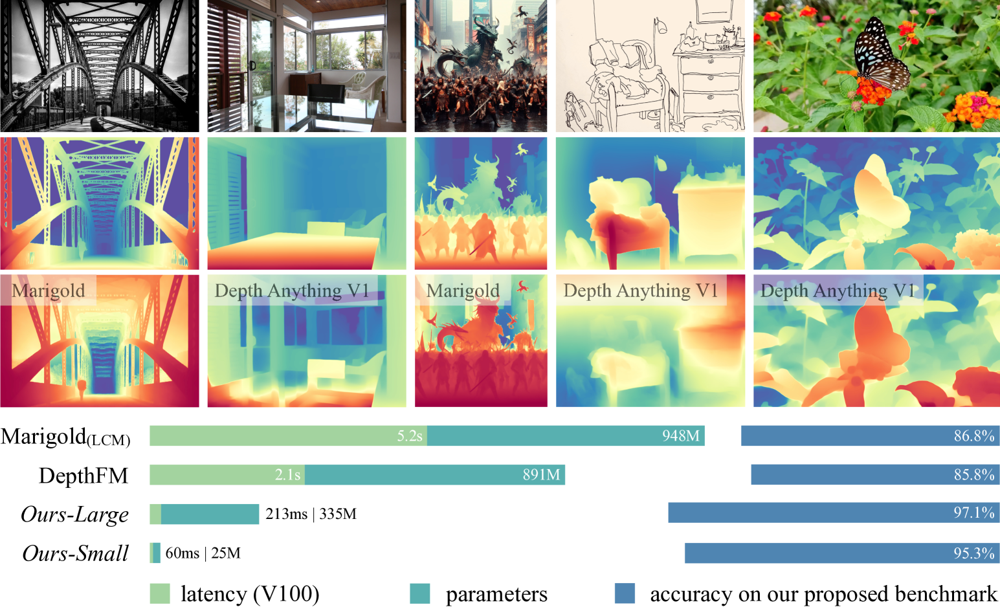
*Figure 1. V2는 V1 대비 robustness와 fine-grained detail 모두에서 앞서고, SD 기반 모델 대비 더 빠르고 가볍고 정확하다.*

---

## 3. 핵심 기여 (Contributions)

1. **labeled real data가 해롭다는 것을 실험으로 규명** — depth sensor / stereo matching / SfM 각각의 고질적 label noise(라벨 잡음)를 시각화하고, 그것이 모델 예측 오류로 그대로 전이됨을 보임.
2. **synthetic-only 학습의 두 가지 벽을 정량화** — ① distribution shift(오직 DINOv2-G만 넘어감), ② restricted scene coverage(하늘·사람에서 실패).
3. **unlabeled real image를 "다리"로 쓰는 3단계 파이프라인 제안** — precision(정밀함)과 robustness(강건함)를 **트레이드오프 없이** 동시에 얻는 구조.
4. **25M ~ 1.3B의 모델 패밀리 공개** + metric depth fine-tuned 버전 제공.
5. **DA-2K 벤치마크 제안** — "조밀하지만 부정확한 정답" 대신 **"희소하지만 확실한 정답"(sparse depth pair)** 으로 평가하자는 패러다임 전환.
6. **downstream transfer 검증** — semantic segmentation에서 Cityscapes 85.6 mIoU / ADE20K 58.6 mIoU 달성, 범용 initialization(초기값)으로서의 가치 입증.

---

## 4. 문제 진단 — 왜 실제 사진의 깊이 라벨을 버려야 하는가

> **왜 이 절을 두는가?** — 이 논문의 모든 설계가 "기존 라벨은 못 믿을 물건"이라는 진단 하나에서 파생되기 때문이다. 이 전제가 무너지면 파이프라인 전체가 과잉 설계가 된다.

### 4.1 label noise — 정답이 애초에 틀려 있다

실제 사진의 깊이 정답은 사람이 손으로 그릴 수 없다(픽셀마다 미터를 적어야 하니까). 그래서 자동 수집하는데, 수집 방식마다 고유한 실패 패턴이 있다.

| 수집 방식 | 원리 | 고장 나는 지점 |
|---|---|---|
| **depth sensor** (RGB-D, LiDAR) | 적외선·레이저를 쏘고 돌아오는 시간 측정 | 유리·물·거울에서 **빛이 통과하거나 반사** → 값이 비거나 완전히 엉뚱. 해상도 낮고 경계에서 번짐 |
| **stereo matching** (카메라 두 대) | 좌/우 사진에서 같은 지점을 찾아 시차 계산 | 흰 벽처럼 **무늬가 없거나**, 타일처럼 **패턴이 반복되면** 대응점을 못 찾음 |
| **SfM** (Structure-from-Motion) | 여러 장의 사진으로 3D 복원 | **움직이는 물체**(사람·차)에서 원리적으로 깨짐, outlier 처리 실패 |

| | |
|---|---|
| 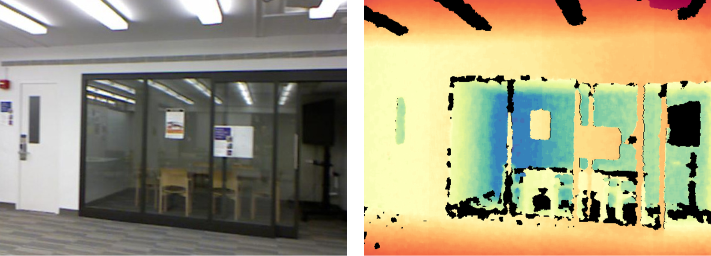 | 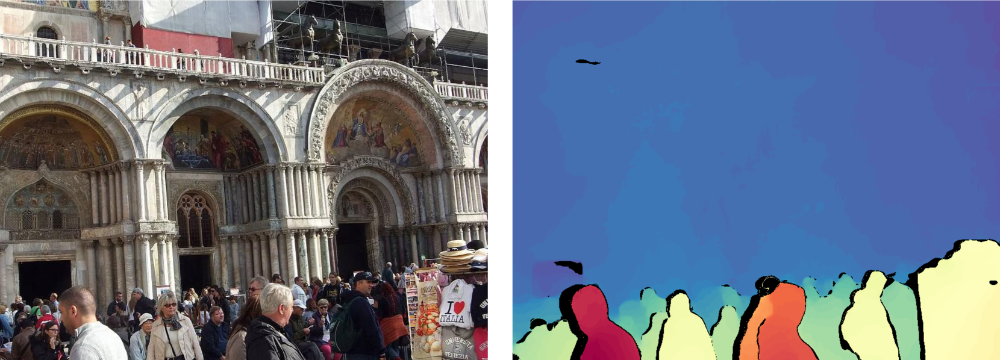 |
| *(a) 투명 물체에서의 label noise (depth sensor)* | *(b) 반복 패턴에서의 label noise (stereo matching)* |
| 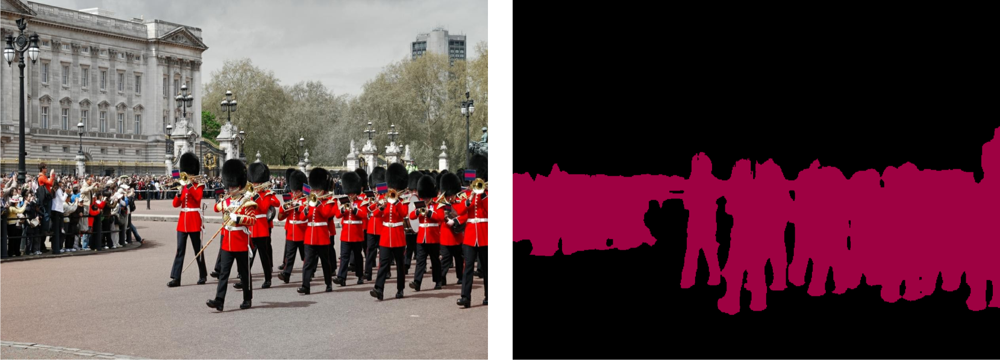 | 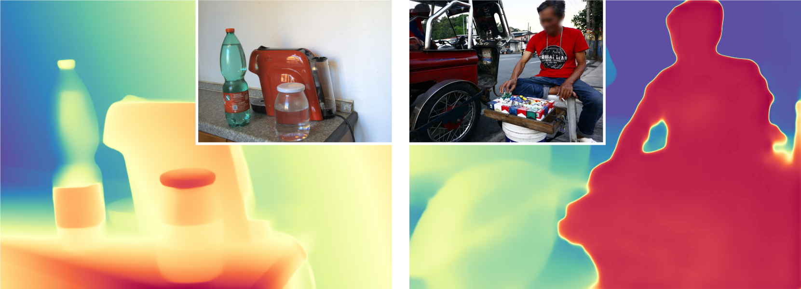 |
| *(c) 동적 물체에서의 label noise (SfM)* | *(d) 그로 인해 모델 예측에 생긴 오류* |

**Figure 2 (d)가 논증의 핵심이다.** 라벨의 결함이 모델 예측의 결함으로 **그대로 복사**된다.

📌 숫자로 본 증거 — Transparent Surface Challenge 정확도:

| 모델 | 정확도 |
|---|---|
| MiDaS | 25.9% |
| Depth Anything V1 | 53.5% |
| **Depth Anything V2** | **83.6%** |

V1이 절반밖에 못 맞춘 건 모델이 부족해서가 아니라, **유리를 제대로 라벨링한 학습 데이터를 본 적이 없어서**다.

### 4.2 ignored details — 정답에 디테일이 없다

label noise와 별개의 문제. 실제 데이터의 정답은 애초에 **coarse(뭉툭)** 하다. 물체 경계, 얇은 구조에 정밀도가 없다. 그러니 모델은 아무리 잘 배워도 뭉툭하게밖에 못 배운다 — **정답의 품질이 성능의 천장**이다.

| | |
|---|---|
| 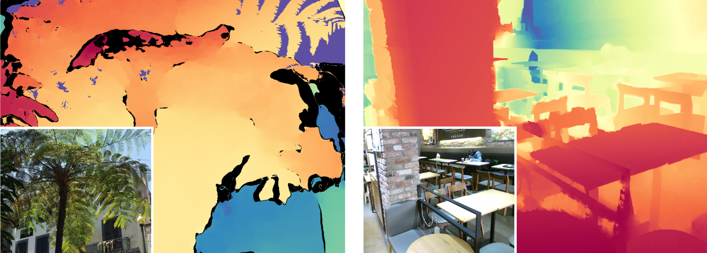 | 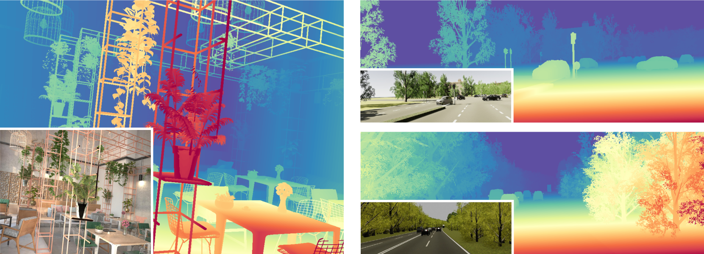 |
| *(a) 실제 데이터의 coarse depth (HRWSI, DIML)* | *(b) synthetic data의 depth (Hypersim, vKITTI)* |


*(c) labeled real image로 학습한 모델(가운데) vs synthetic image로 학습한 모델(오른쪽). 오른쪽이 압도적으로 선명하다.*

---

## 5. 처방 1단계 — synthetic image로 갈아타기

> **왜 이 절을 두는가?** — 4장에서 "실제 라벨이 문제"라고 진단했으니, 정답이 원리적으로 완벽한 대안을 찾아야 한다.

graphics engine이 렌더링한 CG 이미지는 컴퓨터가 3D 장면을 직접 구성했으므로 **모든 픽셀의 정확한 거리를 이미 알고 있다.**

**synthetic data의 장점 3가지**

1. **완벽한 정밀도** — 나뭇잎 한 장, 철망 한 가닥까지 정확한 depth. 경계가 칼같이 떨어진다.
2. **어려운 물체에도 정답이 존재** — 유리창의 "진짜" 거리, 거울 뒤 벽의 진짜 거리를 알 수 있다.
3. **윤리적으로 깨끗함** — 실제 인물 사진 수집에 따르는 privacy(프라이버시) 문제가 없다.

**사용한 synthetic dataset — 총 595K (59.5만 장)**

| 데이터셋 | 장수 | 성격 |
|---|---|---|
| TartanAir | 306K | 드론·다양한 환경 |
| BlendedMVS | 115K | 실외 3D 계열 |
| IRS | 103K | 실내 |
| Hypersim | 60K | 실내 (사실적 렌더링) |
| Virtual KITTI 2 | 20K | 가상 도심 주행 |

---

## 6. 그러나 synthetic만으로는 망한다 — 두 개의 벽

> **왜 이 절을 두는가?** — "그럼 CG로만 학습하면 끝 아닌가?"라는 자연스러운 반문에, 논문이 실험으로 "아니다"라고 답하는 부분이다. 이 두 벽이 곧 pseudo-label 파이프라인의 존재 이유다.

### 6.1 벽 ① — distribution shift(분포 이동)

CG 이미지는 실제 사진과 눈에 띄게 다르다.
- 색이 지나치게 **깨끗하다**(clean) — 센서 노이즈·번짐·조명 불균일이 없다
- 배치가 지나치게 **정돈되어**(ordered) 있다 — 현실은 훨씬 지저분하고 무작위적이다

그래서 CG로만 배운 모델은 실제 사진 앞에서 무너진다. 논문의 pilot study(예비 실험, Table 13)에서 여러 pretrained encoder를 ViT-Large 규모로 synthetic-only 학습시킨 결과:

> **BEiT, SAM, SynCLR 계열은 전부 심각한 generalization(일반화) 실패. 오직 DINOv2-G(1.3B)만이 쓸 만한 결과를 냈다.**


*Figure 5. synthetic-to-real transfer에서 DINOv2-G만이 만족스러운 예측을 낸다.*

즉 "CG → 실제"의 도약은 **모델이 극단적으로 커야만** 겨우 가능하다. 실무에서 실제로 가장 많이 쓰이는 25M 모델로는 불가능하다는 뜻이다.

> 💡 **왜 하필 DINOv2인가?** DINOv2는 라벨 없이 방대한 **실제 사진**으로 self-supervised learning을 한 encoder다. 이미 "실제 세상이 어떻게 생겼는지"에 대한 사전 지식을 갖고 있어서, CG로 fine-tuning을 해도 그 지식이 남아 이질감을 흡수해준다.

### 6.2 벽 ② — restricted scene coverage(제한된 장면 커버리지)

graphics engine의 3D 애셋은 개발자가 미리 만들어둔 것뿐이다. 거실·도로·창고는 있지만 **붐비는 광장, 시장통, 온갖 인종과 자세의 사람들**은 없다.

그래서 DINOv2-G조차 synthetic-only로는 다음 실패가 남는다.

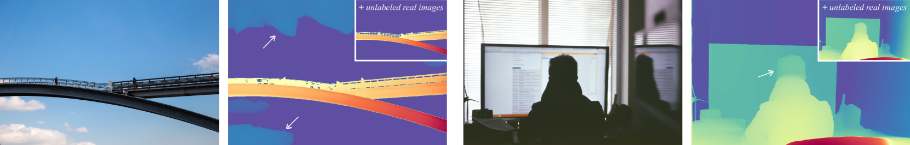
*Figure 6. 왼쪽: 하늘은 무한히 멀어야 하는데 가깝다고 예측. 오른쪽: 머리의 depth가 몸통과 따로 논다. 학습 데이터에 다양한 하늘 패턴과 사람이 없었기 때문.*

### 6.3 그렇다면 "섞으면" 되지 않나? — 안 된다

> synthetic에 실제 라벨 데이터(예: HRWSI)를 **조금만 섞어도** 원래의 fine-grained depth 예측이 **망가진다.**

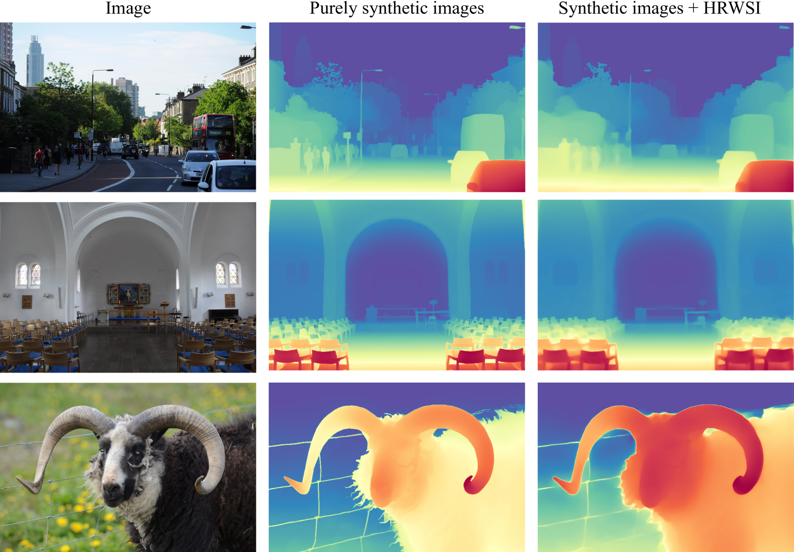
*Figure 12. synthetic 학습셋에 real dataset(HRWSI)을 추가하면 원래의 정밀한 depth 예측이 무너진다.*

이것이 이 논문 설계의 분기점이다. **섞지 말고, 시간 순서로 분리하라.** 정밀함은 1단계(synthetic)에서 얻고, 다양성은 2단계(pseudo-label)에서 얻되, 두 데이터를 같은 배치에 절대 넣지 않는다.

---

## 7. 핵심 알고리즘 — 3단계 pseudo-label 파이프라인

> **왜 이 절을 두는가?** — 6장의 두 벽(분포 이동 + 커버리지 부족)을 구조 변경 없이 데이터 배치만으로 우회하는 것이 이 논문의 실질적 발명이다.

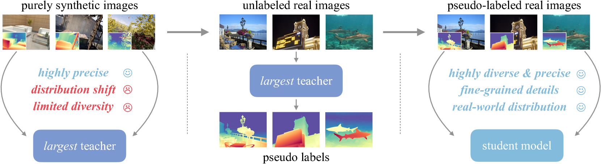
*Figure 7. ① 정밀한 synthetic image로 가장 강력한 teacher를 학습 → ② teacher로 unlabeled real image에 라벨을 찍음 → ③ 그 pseudo-label로 student를 학습.*

### 7.1 파이프라인

```
[1단계] teacher 학습
  DINOv2-G (1.3B) ← synthetic image 595K 만 학습
  → 디테일은 완벽하나 실제 사진엔 다소 서툰 "천재 조수" 완성

[2단계] pseudo-label 생성
  teacher가 unlabeled real image 62,000,000장에 depth map을 예측해 저장
  → "실제 사진 + 정밀한 라벨" 이라는 세상에 없던 데이터셋 탄생

[3단계] student 학습
  ViT-S / B / L / G 가 오직 이 pseudo-label 62M 만 보고 학습
  ※ 이때 원래의 synthetic image는 다시 쓰지 않는다 (핵심)
```

### 7.2 unlabeled real image — 총 62M, 8개 출처

| 출처 | 장수 | 성격 |
|---|---|---|
| ImageNet-21K | 13.1M | 일반 사물 |
| SA-1B | 11.1M | 매우 다양한 일상 장면 |
| LSUN | 9.8M | 실내/장면 |
| BDD100K | 8.2M | 주행 영상 |
| Open Images V7 | 7.8M | 웹 이미지 |
| Places365 | 6.5M | 장소 |
| Google Landmarks | 4.1M | 랜드마크·실외 |
| Objects365 | 1.7M | 사물 |

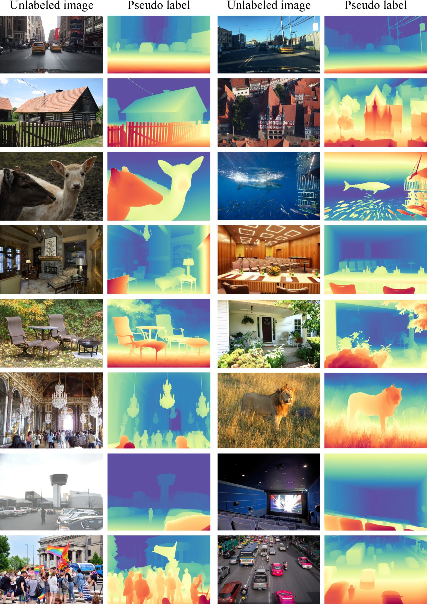
*Figure 17. 8개 출처에서 뽑은 매우 다양한 이미지에 대해 생성된 pseudo depth label.*

### 7.3 이 우회로가 정확히 무엇을 해결하는가

unlabeled real image가 **동시에 세 가지 역할**을 한다.

1. **domain bridge(도메인 다리)** — student는 CG를 직접 보지 않는다. CG의 지식이 이미 "실제 사진 위에 칠해진 형태"로 번역된 것만 본다. → **distribution shift가 student 단계에서 소멸.**
2. **scene diversity(장면 다양성) 확보** — 붐비는 거리, 다양한 사람, 온갖 하늘이 학습 데이터에 들어온다. 라벨링 비용은 0원(teacher가 찍으므로). → **scene coverage 문제 해소.**
3. **distillation의 매개체** — 25M student가 1.3B teacher의 능력을 물려받는 통로.

> 📌 논문이 명시적으로 밝히는 설계 선택: **규모 차이가 극단적일 때 feature representation을 직접 distill하는 것은 비실용적이고 위험하다.** 그래서 최종 출력(depth map)만 흉내내게 하는 pseudo-label distillation을 택했고, 이는 1.3B → 25M 같은 극단적 격차에서도 안전하다.

이렇게 해서 **preciseness(정밀함)와 robustness(강건함)의 딜레마를 트레이드오프 없이** 푼다. 정밀함은 synthetic에서, 강건함은 실제 사진의 다양성에서 각각 가져오되, 둘을 **섞지 않고 시간 순서로 배치**해 서로의 단점이 전파되지 않게 한 것이다.

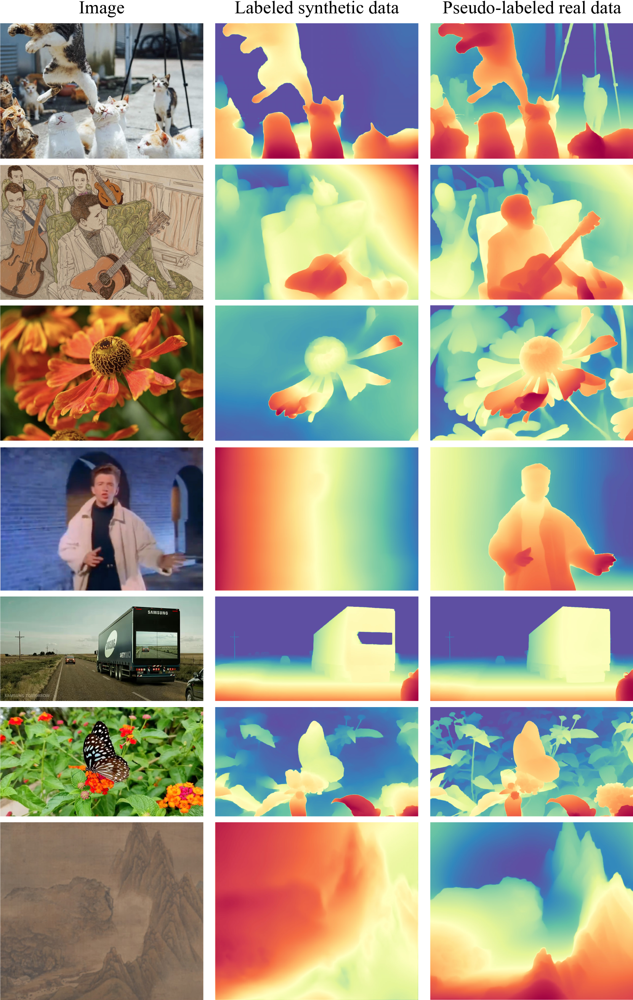
*Figure 16. DINOv2-small 기반 모델을 labeled synthetic만으로 학습한 경우 vs pseudo-labeled real만으로 학습한 경우. robustness가 극적으로 향상된다.*

### 7.4 구조 — 놀랍도록 평범하다

```
입력 이미지 → DINOv2 encoder (ViT-S/B/L/G) → DPT decoder → depth map
```

- **DINOv2 encoder**: 공개된 pretrained weight(사전학습 가중치)를 출발점으로 가져와 fine-tuning
- **DPT decoder**: Transformer 여러 층의 feature를 단계적으로 해상도를 키우며 합쳐 픽셀 단위 예측 생성 — 이미 널리 쓰이는 표준 모듈

**구조적 신규성은 사실상 0이다.** 이 논문이 자랑하는 것은 데이터 레시피다.

### 7.5 loss(손실 함수)

**① scale- and shift-invariant loss** (MiDaS에서 계승)

relative depth는 절대값을 못 맞춘다. 그래서 예측값에 상수 a를 곱하고 b를 더해 정답에 가장 가깝게 맞춘 뒤, **남은 오차만** 벌점으로 준다. 말로 풀면:

> 예측 결과 전체를 자유롭게 **밝기 조절(더하기)** 과 **대비 조절(곱하기)** 해도 되니, **상대적 형태만 맞춰라.**

덕분에 단위가 제각각인 데이터셋(미터 단위 LiDAR, 단위 없는 stereo 결과 등)을 한 솥에 넣고 학습할 수 있다. 이 분야를 연 결정적 아이디어.

**② gradient matching loss**

depth map의 **공간적 변화율(gradient)** — 즉 옆 픽셀과의 차이 — 을 정답의 변화율과 맞추게 한다. 물체 경계에서는 depth가 급격히 튀어야 하는데, 이를 명시적으로 강제한다.

📌 **가중치 비율은 scale-shift-invariant : gradient matching = 1 : 2.**
MiDaS는 gradient matching 가중치를 0.5로 썼는데 이 논문은 **2.0**을 쓴다. 이유는 **정답이 정밀한 synthetic image를 쓸 때 비로소 이 손실이 "super beneficial"해지기** 때문이다. 라벨이 뭉개져 있으면 뭉개진 gradient를 강하게 따라 하게 되어 오히려 독이 되었던 것 — **데이터 품질을 올리자 기존 하이퍼파라미터의 최적점 자체가 이동한** 사례다.

**③ feature alignment loss**

pseudo-label 학습 중 encoder의 feature가 원래 DINOv2가 갖고 있던 semantics를 잊지 않도록 붙잡는 보조 손실. 덕분에 이 모델을 semantic segmentation 같은 다른 과제의 initialization으로 재활용할 수 있다(§8.4).

### 7.6 학습 설정

| 항목 | 값 |
|---|---|
| 입력 해상도 | 518×518 (짧은 변 기준 resize 후 random crop) |
| teacher 학습 | batch size 64, 160K iteration (synthetic) |
| student 학습 | batch size 192, 480K iteration (pseudo-labeled) |
| optimizer | Adam — encoder lr **5e-6**, decoder lr **5e-5** |
| dataset balancing | **안 함** (그냥 이어붙임) |
| 노이즈 방어 | 샘플마다 **loss 상위 10% 영역을 학습에서 무시** |

마지막 두 항목이 실용적으로 중요하다.

- **loss 상위 10% 무시**: pseudo-label도 teacher가 틀린 곳이 있고, 대개 그런 곳에서 loss가 크게 나온다. 가장 못 맞추는 10%를 아예 빼버려 오염된 신호를 차단하는 단순하고 효과적인 방어책.
- **encoder lr이 decoder의 1/10**: 애써 사전학습된 DINOv2를 망가뜨리지 않으려는 전형적 처방.

---

## 8. DA-2K 벤치마크

> **왜 이 절을 두는가?** — "우리 모델이 더 좋다"고 주장하려는데, 이 논문의 출발점이 바로 **기존 벤치마크의 정답 자체가 부정확하다**는 것이었다. 자기 논리에 충실하려면 새 시험지가 필요했다.

### 8.1 기존 벤치마크의 문제

NYU·KITTI 같은 표준 테스트셋의 정답도 결국 센서로 찍은 것이라 **경계가 뭉개져 있고 유리에서 틀린다.** 여기서 점수가 높다는 건 "뭉개진 정답을 잘 흉내낸다"는 뜻이 될 수도 있다.

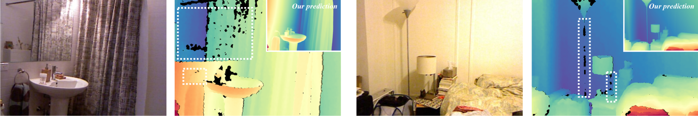
*Figure 8. 거울과 얇은 구조의 정답 depth가 틀려 있다(검은 픽셀은 무시 영역). 반면 우리 모델의 예측은 정확하다. 이 노이즈 때문에 **더 좋은 모델이 오히려 낮은 점수를 받는다.***

### 8.2 아이디어 — 조밀한 정답 대신 sparse depth pair

모든 픽셀의 미터를 재는 건 불가능하지만, **"이 두 점 중 어느 쪽이 더 가까운가?"** 는 사람이 정확하게 판정할 수 있다. 그래서:

- 이미지 **1,000장**, 픽셀 쌍 **2,000개**에 대해 "A가 B보다 가깝다"만 라벨링

### 8.3 구축 과정

| | |
|---|---|
| 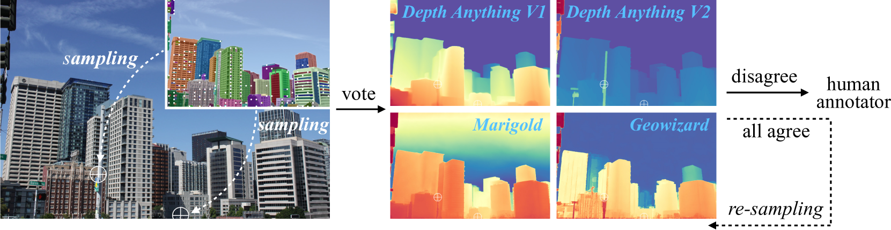 | 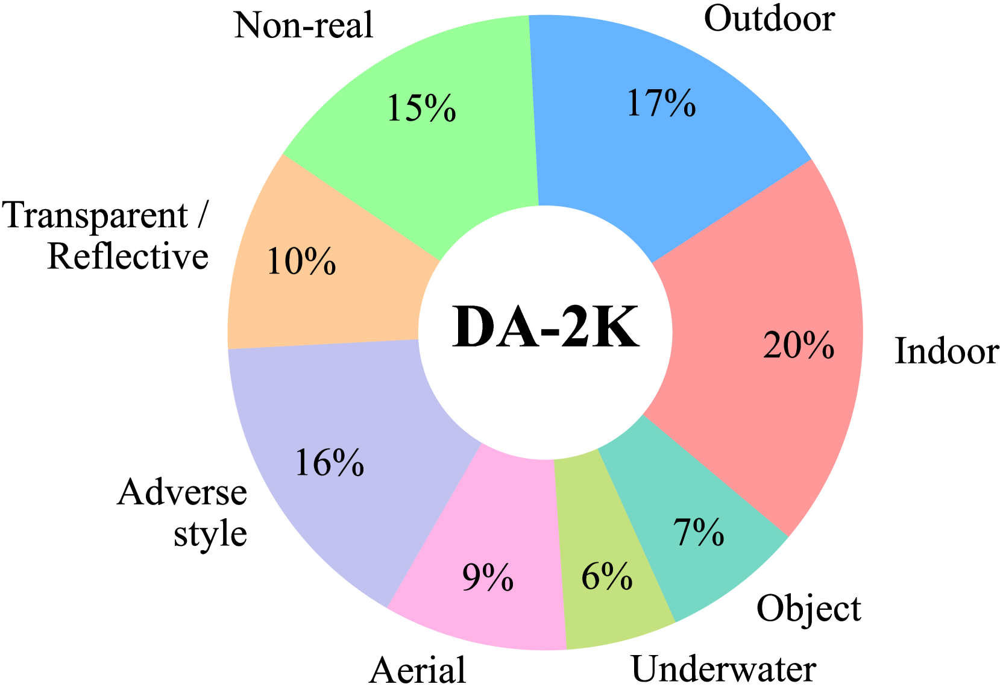 |
| *(a) annotation pipeline* | *(b) 8개 시나리오 커버* |

1. **GPT-4로 8개 시나리오별 다양한 키워드 생성** → Flickr에서 이미지 수집
2. **SAM**이 자동으로 object mask 예측 → 마스크 위에서 픽셀 쌍 샘플링
3. **전문가 모델 4개에게 상대 depth 투표**를 시킴 → 의견이 갈리거나 depth 비율이 **3배 이상** 차이 나면 사람에게 넘김
4. 투명 표면 등 까다로운 케이스는 사람이 직접 어려운 쌍을 찾아 추가
5. **모든 annotation은 다른 두 명이 교차 검증(triple-check)**

**8개 시나리오:** 실내(indoor), 실외(outdoor), 비현실(non-real, AI 생성·그림), 투명/반사(transparent & reflective), 악천후(adverse weather), 항공(aerial), 수중(underwater), 사물(objects)

> 이 벤치마크 설계 자체가 하나의 기여다. "조밀하지만 부정확한 정답" 대신 **"희소하지만 확실한 정답"** 을 택한 발상의 전환.

---

## 9. 실험 요약

### 9.1 zero-shot relative depth (기존 벤치마크)

> *V2가 기존 5개 표준 벤치마크에서 어느 위치인지 확인하는 실험. 결과 해석에 반전이 있다.*

| 데이터셋 | 지표 | MiDaS V3.1 | V1-ViT-L | V2-ViT-S | V2-ViT-L | V2-ViT-G |
|---|---|---|---|---|---|---|
| KITTI | AbsRel ↓ | 0.127 | 0.076 | 0.078 | **0.074** | 0.075 |
| | δ₁ ↑ | 0.850 | 0.947 | 0.936 | 0.946 | **0.948** |
| NYU-D | AbsRel ↓ | 0.048 | **0.043** | 0.053 | 0.045 | 0.044 |
| | δ₁ ↑ | 0.980 | **0.981** | 0.973 | 0.979 | 0.979 |
| Sintel | AbsRel ↓ | 0.587 | **0.458** | 0.500 | 0.487 | 0.530 |
| | δ₁ ↑ | 0.699 | 0.760 | 0.718 | 0.752 | **0.767** |
| ETH3D | AbsRel ↓ | 0.139 | **0.127** | 0.142 | 0.131 | 0.132 |
| | δ₁ ↑ | 0.867 | **0.882** | 0.851 | 0.865 | 0.862 |
| DIODE | AbsRel ↓ | 0.075 | 0.066 | 0.073 | 0.066 | **0.065** |
| | δ₁ ↑ | 0.942 | 0.952 | 0.942 | 0.952 | **0.954** |

**⚠️ 반드시 짚어야 할 점: V2가 MiDaS는 확실히 이겼지만, V1과는 비등하거나 오히려 살짝 밀린다.**

논문은 이를 숨기지 않고 **자기 논리의 증거**로 쓴다 — *"이 벤치마크들의 정답이 뭉개져 있고 부정확하므로(§8.1, Figure 8), 여기서의 점수 차이는 실제 품질을 반영하지 못한다"*. 그래서 DA-2K가 필요했다는 논증이다.

### 9.2 DA-2K — 여기서 격차가 드러난다

> *정답이 확실한 시험지에서 다시 재면 순위가 어떻게 바뀌는지 확인하는 실험.*

| 방법 | 계열 | 정확도 (%) |
|---|---|---|
| DepthFM | SD 기반 generative | 85.8 |
| Marigold | SD 기반 generative | 86.8 |
| GeoWizard | SD 기반 generative | 88.1 |
| Depth Anything V1 | discriminative | 88.5 |
| **V2-ViT-S (25M)** | discriminative | **95.3** |
| **V2-ViT-B (97M)** | discriminative | **97.0** |
| **V2-ViT-L (335M)** | discriminative | **97.1** |
| **V2-ViT-G (1.3B)** | discriminative | **97.4** |

**가장 작은 25M 모델조차 확산 기반 대형 모델들을 7~10%p 앞선다.** 게다가 SD 기반 대비 **10배 이상 빠르다** — 확산 모델은 여러 번의 denoising step이 필요하지만 V2는 **단 한 번의 forward pass**로 끝나기 때문.

### 9.3 fine-tuned metric depth

> *relative depth 모델이 "좋은 initialization"으로서도 값어치가 있는지 확인하는 실험.*

**NYU-D (실내)**

| 방법 | δ₁ ↑ | δ₂ ↑ | δ₃ ↑ | AbsRel ↓ | RMSE ↓ | log10 ↓ |
|---|---|---|---|---|---|---|
| ZoeDepth | 0.951 | 0.994 | 0.999 | 0.077 | 0.282 | 0.033 |
| V2-ViT-S | 0.961 | 0.996 | 0.999 | 0.073 | 0.261 | 0.032 |
| V2-ViT-B | 0.977 | 0.997 | 1.000 | 0.063 | 0.228 | 0.027 |
| **V2-ViT-L** | **0.984** | **0.998** | **1.000** | **0.056** | **0.206** | **0.024** |

**KITTI (실외 주행)**

| 방법 | δ₁ ↑ | δ₂ ↑ | δ₃ ↑ | AbsRel ↓ | RMSE ↓ | RMSE log ↓ |
|---|---|---|---|---|---|---|
| V2-ViT-S | 0.973 | 0.997 | 0.999 | 0.053 | 2.235 | 0.081 |
| V2-ViT-B | 0.979 | 0.998 | 1.000 | 0.048 | 1.999 | 0.072 |
| **V2-ViT-L** | **0.983** | **0.998** | **1.000** | **0.045** | **1.861** | **0.067** |

**가장 작은 ViT-S조차 기존 ViT-L 기반 모델들을 능가한다.** 좋은 pretraining이 모델 크기보다 중요함을 보여주는 결과.

### 9.4 downstream transfer

> *feature alignment loss가 실제로 semantics를 지켜냈는지 검증하는 실험.*

| 과제 | 데이터셋 | 성능 |
|---|---|---|
| semantic segmentation | Cityscapes | **85.6 mIoU** |
| semantic segmentation | ADE20K | **58.6 mIoU** |

depth 학습이 semantic 정보를 파괴하지 않았고, 오히려 범용 initialization으로 쓸 만한 encoder가 되었다.

### 9.5 정성 비교

| | |
|---|---|
| 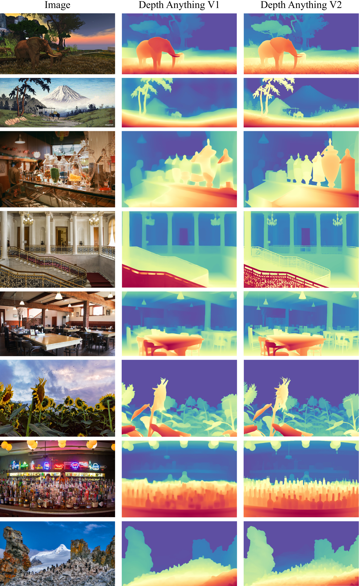 | 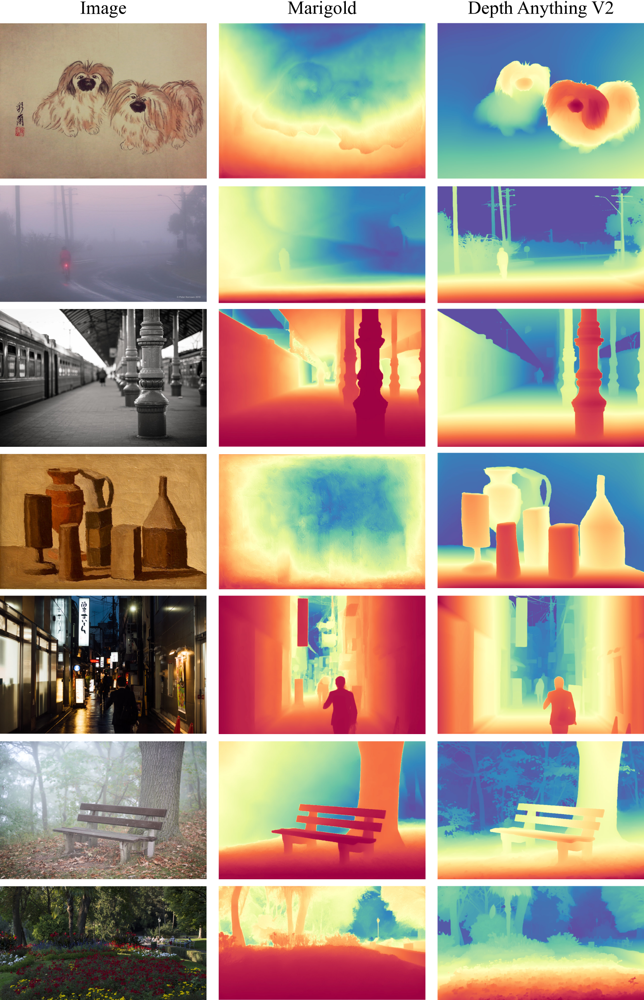 |
| *Figure 13. V1 vs V2 (open-world image)* | *Figure 14. Marigold vs V2 (open-world image)* |

---

## 10. Ablation Study — 이 논문에서 가장 흥미로운 부분

> **왜 이 절을 두는가?** — 이 논문의 주장은 "데이터가 전부다"이므로, 데이터 구성을 하나씩 바꿔봤을 때 성능이 어떻게 움직이는지가 곧 주장의 사활이다. (ablation study = 구성요소를 하나씩 빼보며 각각이 정말 필요한지 검증하는 실험)

### ⭐ 10.1 pseudo-label이 사람이 만든 진짜 라벨보다 낫다

DIML 데이터셋의 **동일한 이미지**에 대해 (a) 원래 제공된 수동/센서 라벨로 학습 vs (b) 우리 teacher가 찍은 pseudo-label로 학습을 비교:

| 라벨 종류 | 5개 벤치마크 평균 δ₁ ↑ | DA-2K 정확도 ↑ |
|---|---|---|
| 원본 수동/센서 라벨 | 0.882 | 80.2% |
| **우리 pseudo-label** | **0.901** | **89.7%** |

**모델이 만든 가짜 정답이 사람이 붙인 진짜 정답보다 학습 재료로 더 좋았다.** DA-2K에서 무려 **+9.5%p** 차이. 논문 원문: *"our produced pseudo labels are of much higher quality than the manual labels provided by DIML."*

이 실험 하나가 논문 전체의 전제(§4 "기존 라벨은 못 믿는다")를 직접 입증한다.

### 10.2 student 학습에서 synthetic을 빼면 오히려 좋아진다

> *"학생 모델 학습 시 synthetic image를 제거하는 것이 **작은 모델에서는 오히려 약간 더 좋은 결과**를 낳을 수 있다"*

역설적으로 들리지만 §6.1의 논리와 정확히 일치한다. student에게 CG를 직접 보여주면 **distribution shift라는 독을 다시 주입하는 셈**이다. student는 "실제 사진 위에 칠해진 CG의 지식"만 먹는 게 낫다. (§6.3 Figure 12와 같은 현상의 다른 각도)

### 10.3 데이터는 양보다 다양성

SA-1B 한 곳에서만 1,100만 장을 뽑아 **epoch를 더 돌리는 것**보다, 8개 출처에서 골고루 모으는 쪽이 낫다. **source diversity(출처 다양성)가 핵심**이며, 단순 반복 학습으로는 대체되지 않는다.

### 10.4 encoder 선택이 결정적

synthetic 학습에서 BEiT·SAM·SynCLR 계열은 모두 심각한 일반화 실패, **DINOv2 계열(특히 G)만 성공** (§6.1 Figure 5). 이 방법론은 DINOv2에 크게 의존한다.

### 10.5 test-time resolution scaling

추론 시 입력 해상도를 키우면 예측의 sharpness가 추가로 향상된다(Figure 11). 학습 없이 얻는 공짜 개선.

---

## 11. 한계와 비판적 시각

> **왜 이 절을 두는가?** — 이 모델을 실제로 가져다 쓸 때 어디서 발이 걸리는지, 그리고 논문 주장 중 어디까지가 검증된 것인지 구분해두기 위해.

### 논문이 스스로 인정한 한계

- **계산 부담이 매우 크다.** 62M 장에 inference를 돌려 pseudo-label을 만들고, 그걸로 다시 480K iteration을 학습하는 건 개인이나 소규모 연구실이 재현할 수 없는 규모다. → **모델 weight는 공개됐지만 파이프라인 재현은 사실상 불가능.**
- **synthetic dataset의 다양성이 여전히 부족.** 5개 데이터셋으로는 세상을 못 덮으며, 더 많은 출처 확보가 필요하다고 명시.

### 추가로 짚을 점

- **구조적 기여가 사실상 없다.** DINOv2 + DPT는 완전한 기성품이다. 이 논문의 가치는 "무엇을 먹일 것인가"에 대한 체계적 실험이지 새 모델이 아니다. (저자들은 이를 숨기지 않고 오히려 메시지로 내세운다.)
- **teacher의 오류가 그대로 상속된다.** student는 teacher를 넘어설 수 없다. loss 상위 10% 무시로 완화하지만, teacher가 **자신 있게 틀리는** 체계적 오류(특정 장면 유형 등)는 62M 장에 걸쳐 증폭되어 각인된다.
- **기존 벤치마크에서 V1을 못 이긴 것**은, 아무리 "정답이 틀렸다"는 논증이 있어도 약점으로 남는다. 구조적으로 *"우리가 진 시험은 시험이 잘못됐다"* 형태이기 때문. 다만 정성적 결과와 투명 표면 성능이 압도적이고 DA-2K가 엄격하게 만들어진 덕에 학계는 대체로 이 논증을 받아들였다.
- **여전히 relative depth다.** 절대 거리가 필요한 응용(로봇 파지, 측량)에는 별도 fine-tuning과 카메라 정보가 필요하다.

---

## 12. 💬 Q&A

### Q1. 사진 한 장으로 거리를 안다는 게 원리적으로 가능한가?

**절대 거리는 불가능하고, 상대 거리는 가능하다.**

미니어처로 만든 방을 찍은 사진과 진짜 방을 찍은 사진은 픽셀만 봐서는 구분할 수 없다. 따라서 "이 픽셀은 3.7m"라는 metric depth는 사진 한 장에서 원리적으로 결정 불가능하다.

하지만 "책상이 벽보다 가깝다", "이 물체가 저 물체보다 2배 멀다" 같은 **순서와 비율(relative depth)** 은 그림자, 물체 겹침(occlusion), 원근에 따른 크기 변화, 질감의 조밀도 같은 단서로부터 추론 가능하다. 사람이 한 눈을 감고도 방 안을 걸어 다닐 수 있는 이유와 같다.

그래서 이 분야의 foundation model은 전부 relative depth를 학습하고, 절대 거리가 필요하면 카메라 정보가 있는 데이터셋에 fine-tuning해서 metric depth 버전을 따로 만든다.

### Q2. "정답 라벨이 틀렸다"는 게 그렇게 심각한 문제인가?

**성능의 천장을 결정하는 문제다.** 두 가지가 겹쳐 있다.

1. **틀린 값(label noise)** — 유리창에 센서를 쏘면 빛이 통과해 뒤쪽 벽 거리가 찍힌다. 모델은 "유리는 뒤쪽 벽만큼 멀다"를 정답으로 배운다. 그래서 V1의 투명 표면 정확도가 53.5%에 그친 것.
2. **없는 값(ignored details)** — 센서 해상도가 낮아 나뭇잎 사이 틈, 의자 다리 같은 얇은 구조가 정답에서부터 뭉개져 있다. 모델은 뭉개진 것을 정답이라 믿고 뭉개진 예측을 낸다.

즉 discriminative 모델이 오랫동안 "디테일이 약하다"고 여겨진 이유가 **구조 탓이 아니라 정답 탓**이었다는 게 이 논문의 발견이다.

### Q3. 왜 좋은 실제 데이터와 합성 데이터를 그냥 섞지 않았나?

**섞으면 나쁜 쪽이 이기기 때문이다.**

Figure 12(§6.3)가 이를 직접 보여준다. synthetic 학습셋에 실제 라벨 데이터(HRWSI)를 조금만 추가해도 원래의 fine-grained depth 예측이 **무너진다.** 뭉개진 정답은 "물체 경계에서 depth가 부드럽게 변한다"고 가르치는데, 이 신호가 정밀한 정답이 가르치는 "경계에서 급격히 튄다"와 정면으로 충돌한다. 그리고 실제 데이터는 양이 많고 장면이 익숙해서 **충돌에서 이겨버린다.**

그래서 이 논문은 섞는 대신 **시간 순서로 분리**한다. 1단계에서 정밀함만 배우고, 2단계에서 그 정밀함을 실제 사진에 옮겨 적은 뒤, 3단계에서는 옮겨 적힌 것만 본다. 두 신호가 같은 배치에서 만나는 일이 없다.

### Q4. teacher가 만든 pseudo-label이 어떻게 사람 정답보다 나을 수 있나?

**"사람 정답"이라는 표현이 오해를 부른다.** depth 라벨은 사람이 손으로 그리는 게 아니라 **센서/알고리즘이 자동 수집**한 것이다. 즉 애초에 기계가 만든 정답이며, §4.1의 고질적 실패 패턴을 갖고 있다.

한편 teacher는 **정답이 원리적으로 완벽한** CG로만 학습했다. 유리에서 헷갈리지 않고, 경계에서 뭉개지지 않는다. 두 "기계 정답"을 비교하면 teacher 쪽이 이길 수 있는 것이다.

§10.1의 DIML 실험이 이를 통제된 조건에서 확인했다 — **같은 이미지**에 대해 pseudo-label로 학습한 쪽이 DA-2K에서 89.7% vs 80.2%로 앞섰다.

### Q5. 이 논문의 방법을 다른 문제에도 쓸 수 있나?

**정답 수집이 어렵고 CG로는 정답이 공짜인 모든 dense prediction 문제에 그대로 적용 가능하다.**

조건은 두 가지다. ① 실제 데이터의 정답 수집이 부정확하거나 비쌀 것, ② graphics engine이 그 정답을 원리적으로 완벽하게 제공할 수 있을 것.

해당되는 예: optical flow(광류, 픽셀의 이동 벡터), surface normal(표면 법선), semantic/instance segmentation, 3D pose. 모두 CG에서는 렌더링 과정에서 정답이 공짜로 떨어지지만 실제 사진에서는 수집이 지옥이다.

레시피는 동일하다 — **CG로 거대 teacher 학습 → 라벨 없는 실제 데이터에 pseudo-label → student는 pseudo-label만 학습.**

### Q6. 실무에서 어떤 크기를 써야 하나?

| 모델 | 파라미터 | DA-2K | 용도 |
|---|---|---|---|
| ViT-S | 25M | 95.3% | **실시간·엣지.** V1에서도 가장 널리 쓰인 등급 |
| ViT-B | 97M | 97.0% | 균형점. ViT-L과 거의 차이 없음 |
| ViT-L | 335M | 97.1% | 품질 우선, metric depth fine-tuning 기본값 |
| ViT-G | 1.3B | 97.4% | teacher용. 대부분의 응용은 storage·속도상 수용 불가 |

**ViT-B에서 이미 ViT-L과 0.1%p 차이**라는 점이 중요하다. 논문 본문도 "대부분의 응용은 DINOv2-G(1.3B)를 감당할 수 없다"고 명시한다. 생성 모델의 depth 조건 입력 같은 용도라면 ViT-S/B로 충분하다.

### Q7. Marigold 같은 확산 기반 방식은 왜 밀렸나?

**디테일 우위를 데이터로 뺏겼고, 속도 열세는 그대로 남았기 때문이다.**

Marigold의 강점은 Stable Diffusion의 사전학습된 생성 능력에서 오는 선명한 디테일이었다. 그런데 V2는 **정밀한 synthetic 정답**으로 같은 선명함을 discriminative 모델에서 확보했다. 우위가 상쇄되자 확산 방식의 구조적 단점 — 여러 denoising step으로 인한 **10배 이상의 추론 시간**, 큰 파라미터, 복잡한 장면에서의 불안정성 — 만 남았다.

DA-2K 결과가 이를 압축한다: **25M V2(95.3%)가 1B급 Marigold(86.8%)를 8.5%p 앞선다.**

---

## 13. 한 줄 요약 (전체)

**"구조를 고치지 말고 정답을 고쳐라."** — labeled real data를 전량 폐기하고 정답이 완벽한 synthetic image로 teacher를 만든 뒤, 라벨 없는 실제 사진 62M에 그 지식을 pseudo-label로 옮겨 적어 student를 학습시킴으로써, precision(합성에서)과 robustness(실제 다양성에서)를 **섞지 않고 시간 순서로 분리해** 트레이드오프 없이 동시에 얻은 논문. 25M 모델이 1B급 확산 모델을 10배 빠른 속도로 앞선다.

---

## 14. 관련 문서

| 문서 | 관계 |
|---|---|
| [PAPER_REPA.md](PAPER_REPA.md) | DINOv2 표현을 활용해 학습을 가속하는 다른 축 — "좋은 pretrained encoder의 재사용"이라는 공통 주제 |
| [PAPER_Florence-2.md](PAPER_Florence-2.md) | 대규모 데이터 엔진(FLD-5B)으로 성능을 만드는 같은 철학 — "구조보다 데이터" |
| [PAPER_CRAFT.md](PAPER_CRAFT.md) | pseudo-GT를 모델이 스스로 만들어 학습하는 weakly-supervised 부트스트랩 — 본 논문의 pseudo-label distillation과 같은 계열의 발상 |
| [PAPER_LPIPS.md](PAPER_LPIPS.md) | "정답/지표 자체를 다시 설계한다"는 관점의 공통점 (DA-2K 벤치마크 설계와 대응) |
