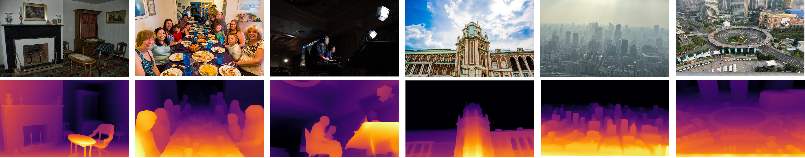
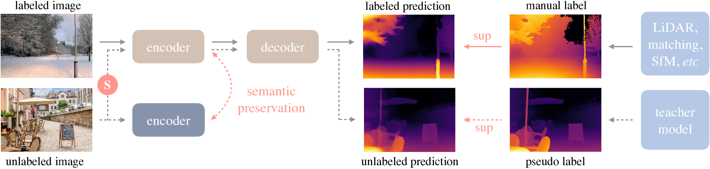
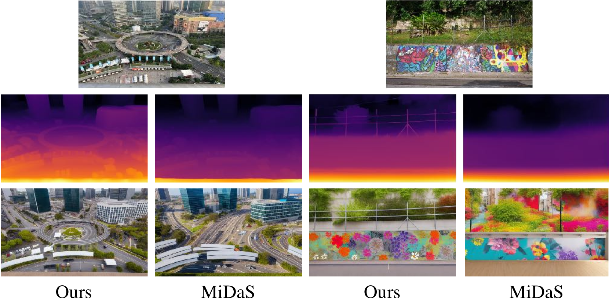

# PAPER_Depth-Anything (V1) — 라벨 없는 사진 6,200만 장을 "쓸모 있게" 만든 레시피

> **한 줄 요약**
> 새 모듈은 하나도 만들지 않았다. 이미 있는 부품(DINOv2 encoder + DPT decoder)에, 라벨 없는 인터넷 사진 **6,200만 장**을 teacher(교사) 모델이 자동으로 라벨링한 pseudo-label(의사 라벨)을 먹여 monocular depth estimation(단안 깊이 추정) foundation model(파운데이션 모델)을 만들었다.
> 그런데 **그냥 먹였더니 아무 일도 일어나지 않았고**, 그 실패를 뚫은 두 개의 장치 — ① 학생에게 일부러 망가진 입력을 주는 strong perturbation(강한 교란), ② 얼린 DINOv2 특징과 정렬하는 feature alignment(특징 정렬) — 가 이 논문의 본체다.

---

## 0. 메타 정보

| 항목 | 값 |
|---|---|
| 제목 | Depth Anything: Unleashing the Power of Large-Scale Unlabeled Data |
| 저자 | Lihe Yang, Bingyi Kang, Zilong Huang, Xiaogang Xu, Jiashi Feng, Hengshuang Zhao |
| 소속 | HKU (홍콩대) + TikTok / ByteDance |
| 발표 | **CVPR 2024** |
| 공개일 | 2024-01-19 (v1) / 2024-04-07 (v2 개정) |
| arXiv | [2401.10891](https://arxiv.org/abs/2401.10891) · [PDF](https://arxiv.org/pdf/2401.10891) · [HTML](https://arxiv.org/html/2401.10891v2) |
| 공식 코드 | [github.com/LiheYoung/Depth-Anything](https://github.com/LiheYoung/Depth-Anything) (Apache-2.0) |
| 분야 | Monocular Depth Estimation(단안 깊이 추정, MDE) — relative depth(상대 깊이) foundation model |
| encoder(인코더) | **DINOv2** — ViT-S 24.8M / ViT-B 97.5M / ViT-L 335.3M |
| decoder(디코더) | **DPT** (Dense Prediction Transformer) |
| 학습 데이터 | labeled real 1.5M (6개 데이터셋) + **unlabeled real 62M** (8개 데이터셋) |
| 평가 데이터 | KITTI, NYUv2, Sintel, DDAD, ETH3D, DIODE (전부 zero-shot) |
| 외부 모델 사용 | DINOv2 (encoder 초기화 + feature alignment의 기준), SegFormer (하늘 영역 검출), ZoeDepth (metric depth 미세조정 프레임워크), Mask2Former + MMSegmentation (semantic segmentation 전이) |

*Figure 1. 저조도, 안개, 복잡한 실내, 초원거리 건물, 애니메이션 이미지까지 — 학습 때 본 적 없는 임의의 사진에서 깊이를 뽑아낸다.*

### 이 문서를 정리한 이유 (왜?)

Depth Anything V1은 **"데이터를 늘리면 된다"가 실제로는 그냥 되지 않는다**는 것을 자기 손으로 보이고, 그걸 뚫은 논문이다. 6,200만 장을 넣었는데 성능이 안 올라간 ablation 한 줄이 논문 전체의 출발점이며, 그 뒤에 붙은 처방(입력을 망가뜨려 목표를 어렵게 만들기 / 얼린 encoder와 특징 정렬하기)은 depth 밖의 self-training(자기학습) 문제에 그대로 옮겨 쓸 수 있다. 또 이 논문은 이미 정리된 [PAPER_Depth-Anything-V2](PAPER_Depth-Anything-V2.md)가 **무엇을 뒤집었는지**를 이해하기 위한 전제이기도 하다.

---

## 1. 주요 용어 사전 (Glossary)

> **왜?** — 본문에 들어가기 전에, 논문 전체에서 반복되는 용어를 먼저 쉬운 말로 풀어둔다. 이후 본문에서는 영어 용어만 쓴다.

### 과제(task) 관련

- **Monocular Depth Estimation(단안 깊이 추정, MDE)** — 카메라 한 대로 찍은 **사진 한 장**만 보고 각 픽셀이 얼마나 멀리 있는지 맞추는 문제. 사람이 한 눈을 감아도 원근을 느끼는 능력을 신경망에 학습시키는 것.
- **relative depth(상대 깊이) / affine-invariant depth(어파인 불변 깊이)** — "A가 B보다 가깝다"는 **순서와 비율**만 맞는 출력. 사진 한 장으로는 원리상 절대 거리를 알 수 없으므로(미니어처 방과 진짜 방은 사진으로 구분 불가) 이 형태가 기본값이다. 이 논문의 본체 모델이 여기 해당.
- **metric depth(절대 깊이)** — "이 픽셀은 3.7미터"처럼 실제 물리 단위가 붙은 출력. relative depth 모델을 특정 데이터셋에 fine-tuning(미세조정)해서 얻는다.
- **disparity(시차)** — 깊이의 역수(1/depth). 가까울수록 값이 크다. 여러 데이터셋을 섞어 학습할 때 다루기 쉬워서 이 논문도 깊이를 disparity 공간으로 옮긴 뒤 각 이미지마다 0~1로 정규화해서 쓴다.
- **zero-shot evaluation(제로샷 평가)** — 학습에 **한 번도 쓰지 않은** 데이터셋에서 그대로 테스트하는 방식. "새 환경에서도 되는가"를 재며, 이 분야의 표준 평가법.
- **open-world image(오픈월드 이미지)** — 특정 데이터셋 스타일에 갇히지 않은, 인터넷에 굴러다니는 임의의 사진.

### 이 논문의 핵심 개념

- **data engine(데이터 엔진)** — 사람 손을 거의 안 쓰고 학습 데이터를 자동으로 불려나가는 파이프라인. 여기서는 "라벨 없는 사진 수집 → teacher가 깊이 예측 → 그게 정답이 됨" 구조.
- **pseudo-label(의사 라벨, 가짜 정답)** — 사람이 아니라 **다른 모델이 예측해서 만든 정답**.
- **teacher–student(교사–학생)** — 먼저 학습시킨 모델(teacher)의 출력을 정답 삼아 다른 모델(student)을 학습시키는 구도. 이 논문에서는 teacher가 ViT-L 하나, student는 ViT-S/B/L 각각.
- **self-training(자기학습)** — 위 구도를 라벨 없는 데이터에 적용하는 semi-supervised learning(준지도 학습) 기법의 대표 이름.
- **strong perturbation(강한 교란, 논문 기호 `S`)** — student에게 들어가는 입력을 일부러 심하게 망가뜨리는 것. 색을 뒤흔들거나(color jittering), 흐리게 하거나(Gaussian blurring), 서로 다른 사진 두 장을 잘라 붙이는(CutMix) 방식.
- **CutMix** — 원래 image classification(이미지 분류)용으로 나온 augmentation(증강). 사진 A의 직사각형 영역을 사진 B로 갈아끼워 한 장으로 만든다. 이 논문이 MDE에 거의 처음 끌어왔다.
- **feature alignment loss(특징 정렬 손실)** — 학습 중인 student encoder가 뽑은 특징 벡터를, **얼려둔(frozen) DINOv2 encoder**가 뽑은 특징 벡터와 방향이 비슷해지도록 잡아당기는 보조 손실.
- **tolerance margin(허용 여유, `α`)** — 위 정렬을 **어느 선까지만** 강제할지 정하는 문턱값. 이미 충분히 비슷해진 픽셀은 더 이상 안 당긴다. 이 논문은 0.85.
- **semantic prior(의미 사전지식)** — "이건 자동차다, 저건 하늘이다" 같은 고수준 시각 지식. DINOv2가 이미 갖고 있고, depth 학습 중에 잃어버리지 않게 붙잡아 두는 것이 목표.

### 구조/학습 관련

- **DINOv2** — Meta가 라벨 없이(self-supervised learning, 자기지도 학습) 대규모 실제 사진으로 학습시킨 이미지 encoder. patch size(패치 크기)가 14라서 입력 해상도가 14의 배수여야 한다.
- **ViT(Vision Transformer)** — 이미지를 패치로 잘라 토큰처럼 다루는 Transformer. 뒤의 S/B/L은 크기 등급.
- **DPT(Dense Prediction Transformer) decoder** — ViT의 여러 층에서 뽑은 특징을 단계적으로 해상도를 키우며 합쳐, 픽셀 단위 예측(깊이 지도)을 만드는 표준 디코더.
- **affine-invariant loss(어파인 불변 손실)** — 예측 전체에 상수를 곱하고 더해 정답에 맞춘 뒤 **남은 오차만** 벌점으로 주는 손실. 덕분에 단위가 제각각인 여러 데이터셋을 한 솥에 넣을 수 있다.

### 평가 지표

- **AbsRel (Absolute Relative error, 절대 상대 오차)** — 예측과 정답의 차이를 정답으로 나눈 값의 평균. **낮을수록 좋음.** 0.05면 평균 5% 오차.
- **δ₁ (delta-1)** — 예측/정답 비율이 1.25배 이내인 픽셀의 **비율**. **높을수록 좋음.** δ₂는 1.25², δ₃는 1.25³ 기준.
- **RMSE** — 제곱 오차 평균의 제곱근(미터 단위). metric depth 평가에서 사용. 낮을수록 좋음.
- **mIoU** — semantic segmentation 정확도. 높을수록 좋음.

### 비교 대상

- **MiDaS** — relative depth 학습의 원조. affine-invariant loss로 여러 데이터셋을 섞어 쓰는 방식을 정립했다. 이 논문의 유일한 정면 비교 대상이며, 비교 대상은 v3.1의 최강 모델인 **DPT-BEiT_L**.
- **ZoeDepth** — relative depth 모델을 metric depth로 바꾸는 대표 프레임워크. 이 논문은 그 안의 encoder만 갈아끼운다.
- **VPD / NeWCRFs / NDDepth 등** — NYUv2·KITTI 전용 metric depth SOTA 모델들.

---

## 2. 논문 요약 (TL;DR)

**핵심 문제** — depth 정답(label)은 근본적으로 비싸다. LiDAR는 희소하고, stereo matching(스테레오 정합)은 실패 케이스가 많고, SfM(Structure-from-Motion)은 움직이는 물체에서 깨진다. 그래서 labeled 데이터가 수백만 장에서 멈추고, 저조도·안개·초원거리·복잡 장면 같은 상황이 데이터에 거의 없어서 일반화가 무너진다.

**해결책** — 라벨을 더 모으는 대신 **라벨이 필요 없는 사진 62M**으로 데이터 커버리지 문제를 지운다. 다만 이걸 그냥 넣으면 안 되고, 두 개의 장치를 붙여야 한다.

1. **student를 괴롭힌다** — teacher는 깨끗한 원본을 보고 pseudo-label을 만들고, student는 색이 뒤틀리고 두 장이 잘라 붙여진 이미지를 보고 그 답을 맞춰야 한다.
2. **DINOv2의 의미를 잃지 않게 붙잡는다** — student의 특징이 얼린 DINOv2 특징과 cosine similarity(코사인 유사도)로 정렬되도록 하되, 이미 0.85 이상 닮은 픽셀은 놓아준다.

**검증** — 6개 미공개 데이터셋 전부에서 MiDaS v3.1(ViT-L)을 넘고, **ViT-B가 이미 MiDaS ViT-L을 이기며, 1/10 크기의 ViT-S조차 여러 데이터셋에서 이긴다.** NYUv2·KITTI metric depth 미세조정에서 새 SOTA. 부수 효과로 depth만 학습한 encoder가 **semantic segmentation 전이에서도 SOTA**(Cityscapes 86.2 / ADE20K 59.4)를 찍는다.

---

## 3. 핵심 기여 (Contributions)

1. **62M 규모 unlabeled data engine** — SA-1B, ImageNet-21K, LSUN, BDD100K, Open Images V7, Places365, Google Landmarks, Objects365 8종을 끌어와 pseudo-label을 찍는 파이프라인 구축. labeled 데이터는 오히려 MiDaS v3.1(12종)보다 **적게**(6종, 1.5M) 쓴다.
2. **"pseudo-label을 그냥 넣으면 소용없다"는 negative result(부정 결과)를 공개** — 그리고 그 원인을 "teacher와 student가 같은 pre-training과 구조를 공유해서 같은 실수를 한다"로 진단.
3. **strong perturbation(`S`)으로 최적화 목표를 어렵게 만들기** — color jittering + Gaussian blurring + CutMix. 특히 CutMix를 MDE에 도입하고, 마스크 안/밖을 각각 다른 teacher 예측에 맞추는 손실을 정의(Eq. 5~8).
4. **feature alignment loss + tolerance margin α** — 이산 클래스로 의미를 주입하려던 시도가 실패한 뒤, 연속 feature space(특징 공간)에서 정렬하는 쪽으로 전환. α=0.85로 "물체 내부의 깊이 변화"를 죽이지 않게 조절.
5. **범용 encoder라는 부수 성과** — depth만 학습했는데 semantic segmentation 전이에서 원본 DINOv2보다도 우수. middle-level(중간 수준)과 high-level(고수준) 인식을 함께 다루는 multi-task encoder(다중 과제 인코더)의 가능성을 제시.

---

## 4. 데이터 엔진 — 무엇을 먹였나

> **왜?** — 이 논문의 기여가 구조가 아니라 데이터이므로, "무엇을 얼마나 넣었는가"가 곧 방법의 절반이다.

### 4.1 labeled 1.5M (6종)

| 데이터셋 | 실내 | 실외 | 라벨 출처 | 장수 |
|---|:--:|:--:|---|---:|
| BlendedMVS | ✓ | ✓ | Stereo | 115K |
| DIML | ✓ | ✓ | Stereo | **927K** |
| HRWSI | ✓ | ✓ | Stereo | 20K |
| IRS | ✓ | | Stereo | 103K |
| MegaDepth | | ✓ | SfM | 128K |
| TartanAir | ✓ | ✓ | Stereo | 306K |

MiDaS v3.1은 12종을 썼는데 이 논문은 6종만 쓴다. 이유를 명시한다: ① **NYUv2·KITTI를 zero-shot 평가용으로 남기려고 학습에서 뺐고**, ② Movies·WSVD처럼 더 이상 구할 수 없는 데이터셋이 있고, ③ RedWeb처럼 품질(해상도 포함)이 나쁜 것은 버렸다.

또 하나의 전처리: 사전학습된 semantic segmentation 모델(SegFormer)로 **하늘 영역을 검출해 disparity를 0(=가장 멂)으로 강제**한다. 하늘은 스테레오·SfM 라벨이 특히 엉망이라 손으로 규칙을 박아 넣은 셈이다.

### 4.2 unlabeled 62M (8종)

| 데이터셋 | 실내 | 실외 | 장수 |
|---|:--:|:--:|---:|
| ImageNet-21K | ✓ | ✓ | 13.1M |
| SA-1B | ✓ | ✓ | 11.1M |
| LSUN | ✓ | | 9.8M |
| BDD100K | | ✓ | 8.2M |
| Open Images V7 | ✓ | ✓ | 7.8M |
| Places365 | ✓ | ✓ | 6.5M |
| Google Landmarks | | ✓ | 4.1M |
| Objects365 | ✓ | ✓ | 1.7M |

논문이 강조하는 지점: 라벨 없는 사진의 깊이 라벨을 얻는 건 **"이미 잘 학습된 MDE 모델에 그냥 통과시키기"** 한 번이면 끝난다. stereo matching이나 SfM 재구성을 돌리는 것에 비하면 비교가 안 되게 싸다.

---

## 5. 주요 알고리즘 설명

> **왜?** — 데이터를 모았으면 그다음은 "어떻게 학습시켰길래 6,200만 장이 실제로 쓸모 있어졌는가"다. 손실 세 개(`L_l`, `L_u`, `L_feat`)가 각각 라벨 데이터 / 라벨 없는 데이터 / 의미 보존을 담당한다.

*Figure 2. 실선 = labeled 이미지 흐름, 점선 = unlabeled 이미지 흐름. `S`는 strong perturbation. 오른쪽의 얼린 encoder가 feature alignment의 기준점이다.*

### 5.1 `L_l` — labeled 이미지 학습 (affine-invariant loss)

*단위와 기준점이 제각각인 6개 데이터셋을 한 솥에 넣으려면, "절대값"이 아니라 "정렬한 뒤 남은 오차"만 벌점으로 줘야 한다.*

깊이를 disparity 공간으로 옮긴 뒤 각 이미지마다 0~1로 정규화하고, 예측과 정답을 각각 아래처럼 **평행이동·스케일 정규화**한다.

$$\hat{d}_i = \frac{d_i - t(d)}{s(d)} \qquad (2)$$

$$t(d) = \mathrm{median}(d), \qquad s(d) = \frac{1}{HW}\sum_{i=1}^{HW}\left|d_i - t(d)\right| \qquad (3)$$

(즉 **중앙값을 빼서 위치를 0에 맞추고, 평균절대편차로 나눠 크기를 1에 맞춘다**. 이렇게 하면 어느 데이터셋의 이미지든 같은 자에 놓인다.)

그 위에서 픽셀별 절대 오차를 평균한다.

$$\mathcal{L}_l = \frac{1}{HW}\sum_{i=1}^{HW}\rho(d_i^{*}, d_i), \qquad \rho(d_i^{*}, d_i) = \left|\hat{d}_i^{*} - \hat{d}_i\right| \qquad (1)$$

> 참고: MiDaS는 코드를 공개하지 않았기 때문에 저자들이 이 단계를 **직접 재현(reproduce)** 하는 것부터 시작했다고 밝힌다.

### 5.2 `L_u` — unlabeled 이미지 학습, 그리고 실패의 기록

*이 절이 논문의 심장이다. "데이터를 늘리면 좋아진다"가 실제로는 성립하지 않았고, 그걸 성립하게 만드는 것이 기여이기 때문이다.*

#### (a) pseudo-label 생성

teacher `T`(ViT-L, labeled 1.5M으로 20 epoch 학습)로 62M 전량에 예측을 찍는다.

$$\hat{\mathcal{D}}^u = \{(u_i,\, T(u_i)) \mid u_i \in \mathcal{D}^u\}_{i=1}^{N} \qquad (4)$$

**중요한 설계 하나**: student `S`는 teacher를 fine-tuning하는 게 아니라 **DINOv2 가중치로 다시 초기화(re-initialize)해서 처음부터 학습**한다. teacher를 그대로 이어받으면 teacher의 오차까지 물려받아 스스로를 강화하기 때문이다.

#### (b) 그런데 안 됐다

> *"Unfortunately, in our pilot studies, we failed to gain improvements with such a self-training pipeline."*

저자들의 진단은 두 갈래다.
1. **labeled 데이터가 이미 충분**해서, 추가로 얻을 수 있는 지식이 적다. (라벨이 몇 장뿐일 때 self-training이 잘 통한다는 기존 관찰과 정반대 상황.)
2. teacher와 student가 **같은 pre-training(DINOv2)과 같은 구조**를 공유하므로, 애초에 **비슷한 곳에서 맞고 비슷한 곳에서 틀린다.** 그러니 teacher의 답을 베껴봐야 새로 배울 게 없다.

#### (c) 처방 — 입력을 망가뜨려 목표를 어렵게

두 종류의 교란을 넣는다.

- **강한 색 왜곡** — color jittering(색상 지터링) + Gaussian blurring(가우시안 블러)
- **강한 공간 왜곡** — **CutMix** (50% 확률로 적용)

CutMix는 라벨 없는 이미지 두 장 `u_a`, `u_b`를 직사각형 마스크 `M`으로 섞는다.

$$u_{ab} = u_a \odot M + u_b \odot (1-M) \qquad (5)$$

(즉 **사진 A 위에 사진 B의 직사각형 조각을 붙인 합성 이미지**를 만든다.)

손실은 마스크 안쪽과 바깥쪽을 **서로 다른 정답에 맞춰** 따로 계산한 뒤,

$$\mathcal{L}_u^{M} = \rho\big(S(u_{ab})\odot M,\; T(u_a)\odot M\big) \qquad (6)$$
$$\mathcal{L}_u^{1-M} = \rho\big(S(u_{ab})\odot (1-M),\; T(u_b)\odot (1-M)\big) \qquad (7)$$

면적 비율로 가중 평균한다.

$$\mathcal{L}_u = \frac{\sum M}{HW}\mathcal{L}_u^{M} + \frac{\sum (1-M)}{HW}\mathcal{L}_u^{1-M} \qquad (8)$$

**놓치면 안 되는 비대칭**: CutMix에 들어가는 이미지는 이미 색 왜곡까지 먹은 상태지만, **teacher에게 pseudo-label을 받으러 가는 이미지는 깨끗한 원본**이다. 즉 teacher는 좋은 조건에서 답을 만들고, student는 나쁜 조건에서 그 답을 맞춰야 한다. 이 **조건의 격차가 곧 학습 신호**다.

원리로 정리하면: 잘라 붙인 이미지는 현실에 존재할 수 없는 장면이므로 student가 "전역 맥락"에 기댈 수 없고, **국소 구조만으로 깊이를 추론**해야 한다. 그 결과 얻어지는 것이 논문이 말하는 invariant representation(불변 표현)이다.

### 5.3 `L_feat` — 의미 사전지식 보존

*라벨 없는 데이터의 pseudo-label에는 노이즈가 섞여 있다. 다른 축의 감독(supervision)을 하나 더 걸어 그 노이즈에 끌려가지 않게 잡아주려는 것이 이 절의 동기다.*

#### (a) 먼저 실패한 시도 — 이산 클래스는 정보가 너무 적다

첫 시도는 **semantic segmentation을 보조 과제(auxiliary task)로 붙이기**였다. RAM + GroundingDINO + HQ-SAM 조합으로 62M 장에 자동 라벨을 붙여 **4,000여 클래스**의 class space(클래스 공간)를 만들고, encoder는 공유하고 decoder를 둘로 나눠 depth와 segmentation을 같이 예측하게 했다.

**실패했다.** 저자들의 해석:

> *"decoding an image into a discrete class space indeed loses too much semantic information."*
> (이미지를 **이산 클래스 공간으로 디코딩하는 순간** 의미 정보가 너무 많이 날아간다.)

이미 경쟁력 있는 depth 모델을 더 밀어 올리기에는 segmentation mask에 담긴 정보량이 부족했다는 뜻이다.

#### (b) 그래서 연속 feature로 갈아탐

얼린 DINOv2 encoder의 특징 `f'`와 student의 특징 `f`를 cosine similarity로 정렬한다.

$$\mathcal{L}_{feat} = 1 - \frac{1}{HW}\sum_{i=1}^{HW}\cos(f_i,\, f'_i) \qquad (9)$$

(즉 **두 특징 벡터가 같은 방향을 가리킬수록 손실이 0에 가까워진다.** 특징 공간은 고차원 연속 공간이라 이산 마스크보다 훨씬 많은 의미 정보를 담는다.)

여기에 두 가지 설계 판단이 붙는다.

**① projector(투영층)를 쓰지 않는다.** 일부 선행 연구는 student 특징을 새 공간으로 한 번 투영한 뒤 정렬하는데, 저자들은 **무작위 초기화된 projector 때문에 초기 정렬 손실이 지나치게 커져 전체 손실을 지배해버린다**는 이유로 쓰지 않는다.

**② tolerance margin α = 0.85.** 이게 진짜 핵심이다.

> semantic encoder는 **한 물체의 서로 다른 부분에 비슷한 특징**을 준다 (자동차 앞부분과 뒷부분이 똑같이 "자동차"). 하지만 depth는 그 안에서도 계속 변해야 한다.

그래서 코사인 유사도가 이미 α를 넘긴 픽셀은 `L_feat` 계산에서 **제외**한다. 그 결과 DINOv2의 semantic-aware representation(의미 인식 표현)과, depth 감독에서 오는 **part-level discriminative representation(부분 수준 변별 표현)** 을 동시에 가질 수 있다.

### 5.4 전체 손실

$$\mathcal{L} = \frac{1}{3}\big(\mathcal{L}_l + \mathcal{L}_u + \mathcal{L}_{feat}\big)$$

**가중치 튜닝 없이 단순 평균**이다. 세 손실 사이의 균형을 맞추는 하이퍼파라미터가 아예 없다는 점은, 이 논문이 "구조가 아니라 데이터"라고 주장하는 것과 결이 맞는다.

### 5.5 학습 설정

| 항목 | 값 |
|---|---|
| encoder | DINOv2 사전학습 ViT-S / ViT-B / ViT-L |
| decoder | DPT (무작위 초기화) |
| 1단계 | labeled 1.5M으로 teacher **20 epoch** 학습 |
| 2단계 | student가 unlabeled 62M을 **1회 통과(1 pass)** |
| pseudo-label 생성 모델 | **ViT-L teacher 하나** (모든 크기 student가 공유) |
| 배치 구성 | labeled : unlabeled = **1 : 2** |
| optimizer | AdamW, linear decay |
| learning rate | encoder 5e-6 / decoder는 그 **10배** |
| labeled 증강 | **horizontal flip(좌우 반전)만** |
| unlabeled 증강 | color jitter + Gaussian blur + CutMix(50%) |
| 해상도 | 짧은 변을 518로 리사이즈 → **518×518 crop** |
| 추론 | crop 없이 원해상도, 단 양변을 **14의 배수**로 (DINOv2 patch size) |
| 데이터셋 혼합 | labeled 6종을 **re-sampling 없이 단순 합침** |
| α | 0.85 |

metric depth 미세조정(ZoeDepth 코드베이스) 시에는 encoder LR을 decoder의 **1/50**로 낮춘다 — MiDaS encoder에 쓰던 1/10보다 훨씬 작으며, 이유는 "우리 초기화가 이미 강해서". 학습 해상도는 NYUv2 392×518, KITTI 384×768, batch 16, 5 epoch.

### 5.6 공식 코드 매핑

*논문이 데이터·학습 레시피 논문이므로, 코드에서 확인할 수 있는 것과 확인할 수 없는 것을 구분해두면 재현 판단이 빨라진다.*

| 논문 요소 | 공식 저장소 위치 | 확인 결과 |
|---|---|---|
| 모델 구조 (DINOv2 + DPT) | `depth_anything/dpt.py` — `DPT_DINOv2`, `DPTHead` | ✅ 있음 |
| encoder 특징 추출 | `self.pretrained.get_intermediate_layers(x, 4, return_class_token=True)` | ✅ ViT 중간층 **4개**를 뽑아 DPT에 넘김 |
| patch 14 처리 | `patch_h, patch_w = h // 14, w // 14` | ✅ |
| 추론 전처리 | `run.py` — `Resize(518, 518, keep_aspect_ratio=True, ensure_multiple_of=14, resize_method='lower_bound')` + ImageNet 정규화 | ✅ 논문 부록과 일치 |
| 출력 형태 | `depth = F.relu(depth)` (그리고 head 마지막에도 `nn.ReLU`) | ✅ 출력은 **음수가 없는 disparity**. 미터 단위가 아님 |
| metric depth 미세조정 | `metric_depth/` — ZoeDepth 포크, `train_mono.py` / `train_mix.py` | ✅ 학습 코드 있음 |
| semantic segmentation 전이 | `semseg/config/depth_anything/*.py` (MMSegmentation + Mask2Former, 896×896) | ✅ 설정 파일 있음 |
| **affine-invariant loss (`L_l`)** | — | ❌ **없음** |
| **CutMix / strong perturbation (`L_u`)** | — | ❌ **없음** |
| **feature alignment (`L_feat`, α)** | — | ❌ **없음** |
| **데이터 엔진 (pseudo-label 생성)** | — | ❌ **없음** |

즉 **논문의 기여에 해당하는 학습 코드는 하나도 공개되지 않았다.** 공개된 것은 추론 경로, 체크포인트 3종, 그리고 "이미 만들어진 encoder를 가져다 쓰는" 하위 과제(metric depth, semseg) 코드뿐이다.

---

## 6. 실험 요약

> **왜?** — 주장이 "데이터를 이렇게 쓰면 강해진다"이므로, ① 진짜 강한가(zero-shot), ② 그 강함이 다른 과제로 옮겨지는가(전이), ③ 두 장치가 실제로 기여했는가(ablation) 세 축으로 확인해야 한다.

### 6.1 zero-shot relative depth (Table 2) — 메인 실험

*학습에 한 번도 쓰지 않은 6개 데이터셋에서 MiDaS v3.1의 최강 모델(DPT-BEiT_L)과 정면 비교.*

| 모델 | encoder | KITTI | NYUv2 | Sintel | DDAD | ETH3D | DIODE |
|---|---|---|---|---|---|---|---|
| | | AbsRel↓ / δ₁↑ | AbsRel / δ₁ | AbsRel / δ₁ | AbsRel / δ₁ | AbsRel / δ₁ | AbsRel / δ₁ |
| MiDaS v3.1 | ViT-L | 0.127 / 0.850 | 0.048 / 0.980 | 0.587 / 0.699 | 0.251 / 0.766 | 0.139 / 0.867 | 0.075 / 0.942 |
| Depth Anything | ViT-S | 0.080 / 0.936 | 0.053 / 0.972 | 0.464 / 0.739 | 0.247 / 0.768 | 0.127 / 0.885 | 0.076 / 0.939 |
| Depth Anything | ViT-B | 0.080 / 0.939 | 0.046 / 0.979 | **0.432 / 0.756** | 0.232 / 0.786 | **0.126** / 0.884 | 0.069 / 0.946 |
| Depth Anything | ViT-L | **0.076 / 0.947** | **0.043 / 0.981** | 0.458 / **0.760** | **0.230 / 0.789** | 0.127 / 0.882 | **0.066 / 0.952** |

읽을 점 세 가지.

1. **크기 대비 효율** — ViT-B가 이미 MiDaS ViT-L을 전 항목에서 넘고, 1/10 크기의 ViT-S조차 Sintel·DDAD·ETH3D에서 MiDaS ViT-L을 이긴다.
2. **KITTI 격차가 압도적** — AbsRel 0.127 → 0.076 (40% 감소). 게다가 **MiDaS는 KITTI·NYUv2 학습 이미지를 썼고(zero-shot이 아님) Depth Anything은 안 썼다.** 불리한 조건에서 이긴 것.
3. **작은 흠** — Sintel에서는 ViT-B(0.432)가 ViT-L(0.458)보다 좋다. 모델을 키우면 항상 좋아지는 단조 관계가 아니며, 논문은 이 역전을 설명하지 않는다.

*Figure 4. 왼쪽은 depth 예측 비교, 오른쪽은 그 depth를 조건으로 ControlNet이 만든 이미지. depth가 정확해지면 생성 제어 신호도 좋아진다는 논지.*

### 6.2 metric depth 미세조정 (Table 3, 4)

*"이 encoder가 다른 모델의 좋은 출발점(weight initialization)이 되는가"를 확인하는 실험. encoder만 가져오고 decoder는 무작위 초기화한 뒤 ZoeDepth 프레임워크로 미세조정.*

**NYUv2**

| 방법 | δ₁↑ | δ₂↑ | δ₃↑ | AbsRel↓ | RMSE↓ | log10↓ |
|---|---|---|---|---|---|---|
| AdaBins | 0.903 | 0.984 | 0.997 | 0.103 | 0.364 | 0.044 |
| DPT | 0.904 | 0.988 | 0.998 | 0.110 | 0.357 | 0.045 |
| SwinV2-L | 0.949 | 0.994 | 0.999 | 0.083 | 0.287 | 0.035 |
| VPD (기존 SOTA) | 0.964 | 0.995 | 0.999 | 0.069 | 0.254 | 0.030 |
| ZoeDepth (재현) | 0.951 | 0.994 | 0.999 | 0.077 | 0.282 | 0.033 |
| **Ours** | **0.984** | **0.998** | **1.000** | **0.056** | **0.206** | **0.024** |

**KITTI**

| 방법 | δ₁↑ | AbsRel↓ | RMSE↓ | RMSE log↓ |
|---|---|---|---|---|
| NeWCRFs | 0.974 | 0.052 | 2.129 | 0.079 |
| SwinV2-L | 0.977 | 0.050 | 1.966 | 0.075 |
| NDDepth | 0.978 | 0.050 | 2.025 | 0.075 |
| GEDepth | 0.976 | 0.048 | 2.044 | 0.076 |
| ZoeDepth (재현) | 0.971 | 0.054 | 2.281 | 0.082 |
| **Ours** | **0.982** | **0.046** | **1.896** | **0.069** |

저자들이 덧붙이는 말이 의미심장하다 — **"우리는 ZoeDepth라는 비교적 기본적인(basic) depth 모델을 썼을 뿐이고, 더 발전된 구조를 얹으면 더 올라갈 것".** 즉 성능의 출처가 구조가 아니라 초기화(=데이터로 얻은 encoder)라는 주장이다.

### 6.3 zero-shot metric depth (Table 5)

*ZoeDepth의 MiDaS encoder만 Depth Anything encoder로 갈아끼우고 나머지는 그대로 둔, 통제된 A/B 비교.*

| 데이터셋 | 지표 | ZoeDepth | Depth Anything |
|---|---|---|---|
| SUN RGB-D (실내) | AbsRel↓ / δ₁↑ | 0.520 / 0.545 | **0.500 / 0.660** |
| iBims-1 (실내) | AbsRel / δ₁ | 0.169 / 0.656 | **0.150 / 0.714** |
| HyperSim (실내) | AbsRel / δ₁ | 0.407 / 0.302 | **0.363 / 0.361** |
| Virtual KITTI 2 (실외) | AbsRel / δ₁ | 0.106 / 0.844 | **0.085 / 0.913** |
| DIODE Outdoor (실외) | AbsRel / δ₁ | 0.814 / 0.237 | **0.794 / 0.288** |

전부 개선. **부품 하나만 바꿔서 얻은 이득**이라는 점에서 encoder 품질 주장을 가장 깔끔하게 뒷받침한다.

### 6.4 semantic segmentation 전이 (Table 7, 8)

*depth만 학습한 encoder가 고수준 인식 과제로도 옮겨지는지 — `L_feat`가 의미를 보존했다는 간접 증거.*

**Cityscapes** (Mask2Former, COCO·Mapillary 사전학습 없음)

| 방법 | encoder | mIoU (single-scale) | multi-scale |
|---|---|---|---|
| Mask2Former | Swin-L | 83.3 | 84.3 |
| OneFormer | ConvNeXt-XL | 83.6 | 84.6 |
| **Ours** | ViT-L | **84.8** | **86.2** |

**ADE20K**

| 방법 | encoder | mIoU |
|---|---|---|
| Mask2Former | Swin-L | 56.4 |
| ViT-Adapter | BEiT-L | 58.3 |
| OneFormer | ConvNeXt-XL | 57.4 |
| **Ours** | ViT-L | **59.4** |

ImageNet-21K로 대규모 사전학습한 encoder들을 **depth 학습만 한 encoder가 넘는다.**

### 6.5 Ablation ① — 두 장치의 기여 (Table 9, ViT-L)

*이 표 한 장이 논문의 논증 전체다.* AbsRel↓, 데이터셋 이름은 앞 두 글자.

| `L_l` | `L_u` | `S` | `L_feat` | KI | NY | SI | DD | ET | DI |
|:--:|:--:|:--:|:--:|---|---|---|---|---|---|
| ✓ | | | | 0.085 | 0.053 | 0.492 | 0.245 | 0.134 | 0.070 |
| ✓ | ✓ | | | 0.085 | 0.054 | 0.481 | 0.242 | **0.138** | **0.073** |
| ✓ | ✓ | ✓ | | 0.081 | 0.048 | 0.469 | 0.235 | 0.134 | 0.068 |
| ✓ | ✓ | ✓ | ✓ | **0.076** | **0.043** | **0.458** | **0.230** | **0.127** | **0.066** |

**2행이 이 논문의 출발점이다.** 라벨 없는 이미지 **6,200만 장을 통째로 넣었는데** 1행과 사실상 같고, ETH3D(0.134→0.138)와 DIODE(0.070→0.073)는 **오히려 나빠졌다.** "데이터를 늘리면 좋아진다"가 성립하지 않는다는 것을 저자들이 자기 표로 증명한 것.

3행에서 `S`(강한 교란)를 넣자 비로소 전 항목이 개선되고, 4행에서 `L_feat`까지 넣으면 한 번 더 개선된다. **62M을 살린 것은 데이터 자체가 아니라 그 두 줄이다.**

### 6.6 Ablation ② — 데이터셋별 일반화 (Table 6, 단일 데이터셋 학습)

*labeled 데이터를 하나씩만 써서 학습했을 때 어디까지 일반화되는지 — "다양성이 규모보다 중요하다"는 저자들의 동기를 뒷받침하는 표.*

| 학습 데이터셋 | 장수 | Mean AbsRel↓ | Mean δ₁↑ |
|---|---:|---|---|
| **HRWSI** | **20K** | **0.200** | 0.846 |
| BlendedMVS | 115K | 0.210 | 0.844 |
| IRS | 103K | 0.215 | 0.840 |
| TartanAir | 306K | 0.222 | 0.841 |
| DIML | **927K** | 0.226 | 0.837 |
| MegaDepth | 128K | 0.274 | 0.780 |
| *(전체 합침)* | *1.5M* | *0.180* | *0.874* |

**20K짜리 HRWSI가 927K짜리 DIML을 이긴다** (0.200 vs 0.226). 46배 적은 데이터가 더 강한 일반화를 준다는 것이고, 저자들은 이를 "data diversity counts a lot"으로 해석하며 unlabeled 데이터를 쓰는 자기 동기와 연결한다.

한 가지 단서도 단다 — MegaDepth는 이 6개 벤치마크에서 최하위지만, **초원거리 건물 거리 추정에 특화**되어 있어(Figure 1) 항공기 같은 용도에서는 유용하다. 벤치마크 순위가 데이터셋의 가치를 다 담지 못한다는 뜻.

### 6.7 Ablation ③ — encoder 비교 (Table 10, 11)

*"우리 encoder가 좋다"를 두 방향으로 확인: 경쟁자(MiDaS)와, 출발점(DINOv2)과.*

| 비교 | NYUv2 AbsRel↓ | NYUv2 δ₁↑ | KITTI AbsRel↓ | KITTI δ₁↑ | Cityscapes mIoU↑ | ADE20K mIoU↑ |
|---|---|---|---|---|---|---|
| MiDaS encoder | 0.077 | 0.951 | 0.054 | 0.971 | 82.1 | 52.4 |
| **원본 DINOv2** | 0.066 | 0.973 | 0.058 | 0.971 | — | 58.8 |
| **Ours** | **0.056** | **0.984** | **0.046** | **0.982** | **84.8** | **59.4** |

**출발점인 DINOv2보다도 낫다**는 게 핵심. 62M depth 학습이 DINOv2의 의미 능력을 망치기는커녕 오히려 강화했다는 뜻이고, 이것이 `L_feat` + α 설계가 의도한 결과다.

### 6.8 Ablation ④ — α와 `L_feat` 적용 위치 (부록 Table 12, 13, **ViT-S**)

*α라는 문턱값이 정말 필요한지, 그리고 `L_feat`를 labeled 데이터에도 걸어야 하는지 확인.* ⚠️ 이 두 표만 **ViT-S 기준**이라 본문 Table 9(ViT-L)와 절대값을 직접 비교하면 안 된다.

**Table 12 — tolerance margin α**

| α | KITTI | NYU | Sintel | DDAD | ETH3D | DIODE | **Mean** |
|---|---|---|---|---|---|---|---|
| 1.00 (제약 안 풂) | 0.085 | 0.055 | 0.523 | 0.250 | 0.134 | 0.079 | **0.188** |
| **0.85** | 0.080 | 0.053 | **0.464** | 0.247 | 0.127 | 0.076 | **0.175** |
| 0.70 | **0.079** | 0.054 | 0.482 | 0.248 | 0.127 | 0.077 | 0.178 |

α=1.00은 "모든 픽셀을 끝까지 DINOv2에 맞춰라"는 뜻인데, 명확히 나쁘다(0.188 vs 0.175). **제약을 푸는 장치가 없으면 `L_feat`는 오히려 depth를 방해한다.**

**Table 13 — `L_feat`를 어디에 걸 것인가** (U = unlabeled, L = labeled)

| U | L | KITTI | NYU | Sintel | DDAD | ETH3D | DIODE | **Mean** |
|:--:|:--:|---|---|---|---|---|---|---|
| | | 0.083 | 0.055 | 0.478 | 0.249 | 0.133 | 0.080 | 0.180 |
| ✓ | | 0.080 | 0.053 | **0.464** | 0.247 | **0.127** | 0.076 | **0.175** |
| | ✓ | 0.084 | 0.054 | 0.472 | 0.252 | 0.133 | 0.081 | 0.179 |

labeled 데이터에 걸면 **아무 이득이 없다**(0.179 vs 0.180). 저자들의 해석: labeled 데이터는 라벨 품질이 높아서, 의미 손실이 오히려 **그 좋은 라벨의 학습을 방해**한다. 반대로 pseudo-label은 노이즈가 많고 정보가 적어서 의미 제약이 그 노이즈와 싸워준다.

→ 즉 `L_feat`의 정체는 "의미 주입"보다 **"pseudo-label 노이즈에 대한 regularization(정규화)"** 에 가깝다.

---

## 7. 한계와 급소

> **왜?** — 이 논문을 실제로 따라 하거나 후속 연구의 기준선으로 삼으려면, 논문이 인정한 한계와 인정하지 않은 급소를 나눠 봐야 한다.

### 논문이 스스로 밝힌 한계

1. **최대 크기가 ViT-L에서 멈춤** — DINOv2에는 ViT-Giant 가중치가 있으니 거기까지 키워, 더 좋은 teacher로 더 정확한 pseudo-label을 만들어 작은 모델에 물려주겠다는 계획.
2. **해상도 부족** — "널리 쓰이는 512×512 학습 해상도로는 실사용에 **충분하지 않다(not enough)**", 700+ 또는 1000+로 재학습하겠다고 명시. (부록의 실제 값은 518×518이며, 본문 한계 절은 512로 어림해 적었다.)

### 논문이 말하지 않은 급소

3. **기여의 학습 코드가 통째로 미공개** — §5.6 표 참고. affine-invariant loss, CutMix 손실, `L_feat`, 데이터 엔진 어느 것도 저장소에 없다. **레시피 논문인데 레시피를 검증할 수 없다.**
4. **`S`의 요소별 ablation이 없다** — color jittering, Gaussian blurring, CutMix가 "strong perturbations" 한 줄로 묶여 있다. 62M을 살린 것이 셋 중 무엇인지, 혹은 조합이 필요한 것인지 표에서 알 수 없다. 재현자 입장에서 가장 아쉬운 공백.
5. **labeled 데이터 품질 문제를 관찰만 하고 넘어감** — HRWSI(20K) > DIML(927K)이라는 §6.6의 결과는 "이 논문의 labeled 1.5M 중 62%(DIML)가 사실상 도움이 안 된다"는 말이기도 하다. 논문은 이 관찰을 "그러니 unlabeled를 늘리자"로 소비하고, "labeled를 갈아엎자"로는 가지 않는다. **그 방향이 V2다.**
6. **모델 크기와 성능이 단조가 아님** — Sintel에서 ViT-B가 ViT-L을 이긴다(§6.1). 설명 없음.
7. **출력은 상대 깊이** — 미터가 필요하면 별도 미세조정이 필수. 구조적 제약이며 V2도 동일하다.

---

## 8. 💬 Q&A

### Q1. "62M을 넣었는데 왜 아무 일도 안 일어났나?"를 한 문장으로 하면?

**teacher와 student가 같은 DINOv2 사전학습과 같은 구조를 공유하기 때문에, 같은 곳에서 맞고 같은 곳에서 틀린다.** 그러니 teacher가 찍어준 답을 student가 베껴봐야 새로 배울 것이 없다. 게다가 이 논문은 labeled 데이터도 이미 1.5M이나 있어서, 라벨이 몇 장 없을 때 self-training이 잘 통하던 상황과 조건 자체가 다르다.

처방의 논리는 여기서 바로 따라 나온다 — **둘이 너무 닮아서 문제라면, 둘이 보는 것을 다르게 만들면 된다.** teacher는 깨끗한 원본, student는 망가진 입력. 그 비대칭이 학습 신호를 만든다.

### Q2. CutMix가 왜 depth에 통하나? 원래 분류용 기법 아닌가?

핵심은 **잘라 붙인 이미지가 현실에 존재할 수 없는 장면**이라는 데 있다.

정상 사진에서 모델은 "실내 사진이니 대충 이 정도 거리", "도로 사진이니 소실점이 여기" 같은 **전역 맥락(global context)에 기대어** 깊이를 찍을 수 있다. 그런데 방 사진 위에 도로 조각이 붙어 있으면 그 지름길이 막힌다. 남은 방법은 물체 크기, 경계, 텍스처 밀도 같은 **국소 단서로만 추론하기**뿐이다.

여기에 손실 설계가 더해진다 — 마스크 안쪽은 `T(u_a)`, 바깥쪽은 `T(u_b)`라는 **서로 다른 정답**에 맞춰야 한다(Eq. 6~7). 즉 student는 한 장 안에서 두 개의 독립적인 깊이 체계를 동시에 세워야 하고, 이는 "전역 맥락으로 한 번에 뭉뚱그리기"를 구조적으로 불가능하게 만든다.

### Q3. `L_feat`는 REPA와 뭐가 다른가? (둘 다 DINOv2에 정렬하는데)

같은 뿌리에서 나온 아이디어인데 **선택이 정반대인 지점이 두 곳** 있다. 시기적으로 Depth Anything V1(2024-01)이 [PAPER_REPA](PAPER_REPA.md)(2024-10)보다 9개월 앞선다.

| | Depth Anything V1 `L_feat` | REPA |
|---|---|---|
| 대상 과제 | monocular depth estimation | diffusion model(확산 모델) 학습 가속 |
| 정렬 기준 | 얼린 DINOv2 | 얼린 DINOv2 (동일) |
| **projector(투영층)** | **쓰지 않음** — 무작위 초기화된 projector가 초기 손실을 지배해버려서 | **씀** (학습 가능한 MLP) |
| **정렬 강도 조절** | **tolerance margin α=0.85** — 이미 닮은 픽셀은 놓아줌 | margin 없음, 계수 λ로 전체 세기만 조절 |
| 목적 | pseudo-label 노이즈 방어 + 의미 보존 | 표현 학습 가속(수렴 속도) |

특히 α는 depth 과제 고유의 요구에서 나온 장치다. **"자동차 앞뒤는 의미적으로 같지만 깊이는 달라야 한다"** 는 충돌은 diffusion에는 없는 문제이기 때문이다.

### Q4. 이 논문에서 실제로 재현 가능한 것과 불가능한 것은?

| 재현 가능 | 재현 불가 (직접 구현 필요) |
|---|---|
| 공개 체크포인트로 추론 (ViT-S/B/L) | teacher 학습 (labeled 1.5M, 20 epoch) |
| metric depth 미세조정 (ZoeDepth 포크 제공) | 62M pseudo-label 생성 |
| semantic segmentation 전이 (MMSeg 설정 제공) | `L_l` / `L_u`(CutMix) / `L_feat` 구현 전부 |
| ONNX·TensorRT 변환 (커뮤니티 기여) | 1:2 배치 샘플러, 하늘 마스킹 전처리 |

**결론**: 이 모델을 *쓰는* 것은 완전히 가능하고, 이 모델을 *만드는* 것은 논문 텍스트만 보고 처음부터 구현해야 한다.

### Q5. V2와의 관계 — 무엇이 계승되고 무엇이 뒤집혔나?

| | **V1** (2401.10891) | **V2** ([2406.09414](PAPER_Depth-Anything-V2.md)) |
|---|---|---|
| labeled 데이터 | **실사 1.5M** (스테레오·SfM) | **실사 전량 폐기**, 합성 595K |
| unlabeled 데이터 | 62M | 62M (동일 규모) |
| student가 보는 정답 | labeled 정답 + pseudo-label 혼합 (1:2) | **pseudo-label만** |
| 핵심 장치 | strong perturbation + `L_feat` | 합성 teacher → pseudo-label 단독 학습 |
| 구조 | DINOv2 + DPT | 동일 |
| 최대 크기 | ViT-L (335M) | ViT-G (1.3B) |

**계승된 것**: 구조, 62M unlabeled 자산, teacher–student 구도, DINOv2 초기화, 그리고 "V1의 한계 절에서 예고한 ViT-Giant 확장".

**뒤집힌 것**: V2의 메시지는 **"실사 라벨은 노이즈 때문에 오히려 해롭다"** 이다. 즉 V2는 V1의 labeled 데이터 전제를 스스로 부정한다. 그런데 그 근거의 씨앗은 이미 V1 안에 있었다 — 20K짜리 HRWSI가 927K짜리 DIML을 이긴 §6.6의 표다. **V1은 그것을 "unlabeled를 늘리자"로 읽었고, V2는 같은 관찰을 "labeled를 갈아엎자"로 읽었다.**

**조명을 잃은 것**: V1의 두 장치. 합성 teacher의 라벨이 깨끗해지면 "목표를 일부러 어렵게 만들" 이유가 줄어들기 때문이다.

두 편을 하나의 축으로 압축하면 이렇게 된다.

> **pseudo-label의 품질을 올릴 수 없으면 student의 입력을 망가뜨려라(V1). 올릴 수 있으면 그냥 올려라(V2).**

### Q6. depth만 학습했는데 왜 semantic segmentation이 SOTA가 되나?

세 가지가 겹친 결과다.

1. **출발점이 이미 강하다** — DINOv2는 라벨 없이 대규모 사진으로 학습된, 의미 능력이 뛰어난 encoder다.
2. **`L_feat`가 그 능력을 지킨다** — 보통 특정 과제로 오래 미세조정하면 원래 능력이 지워진다(catastrophic forgetting 계열 문제). α=0.85 정렬이 이걸 막는다.
3. **depth 학습이 부분 수준 변별력을 더한다** — DINOv2 혼자서는 자동차 앞뒤를 같게 보지만, depth 감독을 받으면 물체 내부까지 구분하게 된다. §6.7에서 **Ours가 원본 DINOv2보다 ADE20K에서 나은(59.4 vs 58.8)** 이유가 이것이다.

즉 "DINOv2의 의미 능력 + depth에서 온 공간 변별력"의 합이며, 저자들이 multi-task encoder 가능성을 언급하는 근거다.

### Q7. 이 논문에서 실무로 바로 가져갈 교훈은?

1. **self-training에서 teacher와 student가 너무 닮으면 아무 일도 안 일어난다.** 비대칭(입력 난이도, 구조, 사전학습)을 인위적으로 만들어야 한다.
2. **보조 감독은 이산 라벨보다 연속 feature가 낫다.** 4,000 클래스 segmentation보다 얼린 encoder의 feature 정렬이 정보량 면에서 우위였다(§5.3).
3. **정렬 손실에는 "그만하기" 장치를 달아라.** α 없는 정렬(α=1.00)은 오히려 성능을 떨어뜨린다.
4. **정규화는 노이즈 낀 데이터에만 걸어라.** 깨끗한 라벨에 같은 제약을 걸면 이득이 없거나 방해가 된다(§6.8 Table 13).
5. **데이터셋 규모 ≠ 가치.** 20K가 927K를 이길 수 있으니, 데이터를 늘리기 전에 데이터셋별 전이 성능부터 재라.

---

## 9. 한 줄 요약 (전체)

> **Depth Anything V1은 "라벨 없는 사진 6,200만 장을 넣었더니 아무 일도 일어나지 않았다"는 실패를 논문 한가운데에 두고, 그것을 뚫는 두 줄 — teacher에겐 깨끗한 원본을, student에겐 색이 뒤틀리고 잘라 붙여진 이미지를 주는 strong perturbation, 그리고 이미 충분히 닮은 픽셀은 놓아주는(α=0.85) DINOv2 feature alignment — 을 제시해, 새 모듈 없이 단안 깊이 추정 foundation model을 세운 데이터 레시피 논문이다.**

---

## 10. 관련 문서

- [PAPER_Depth-Anything-V2.md](PAPER_Depth-Anything-V2.md) — 같은 저자들의 후속작. V1의 labeled 데이터 전제를 뒤집는다 (§8 Q5 참조)
- [PAPER_REPA.md](PAPER_REPA.md) — 같은 "얼린 DINOv2에 정렬" 아이디어를 diffusion에 적용. projector와 margin에서 정반대 선택 (§8 Q3 참조)
- [PAPER_LPIPS.md](PAPER_LPIPS.md) — "딥 feature 거리가 곧 지각적 지표"라는, feature space 감독의 계보상 출발점
