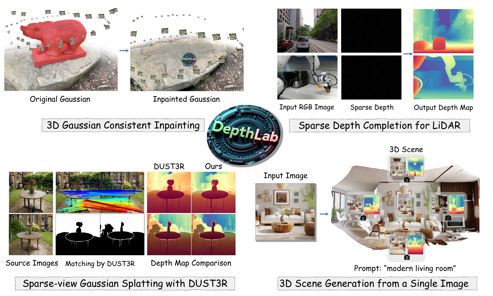
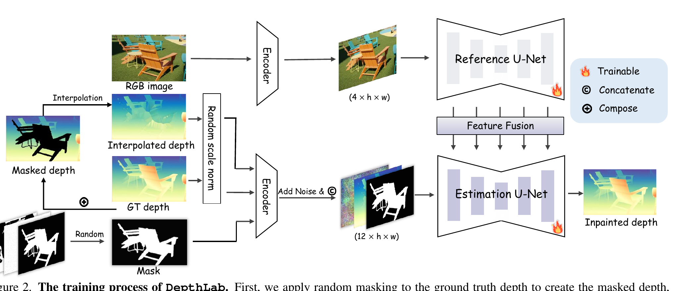
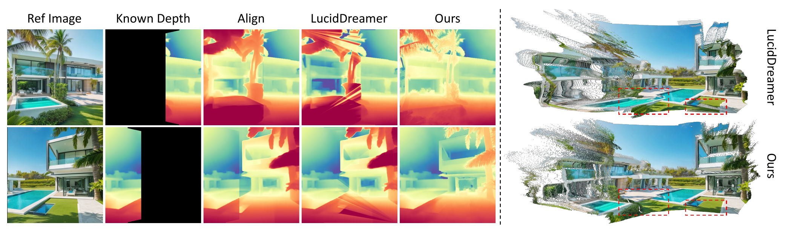

# DepthLab — 깊이 추정을 "추정 후 정렬"에서 "조건부 인페인팅"으로 바꾸다

## 📌 메타 정보

| 항목 | 내용 |
|---|---|
| **논문 제목** | DepthLab: From Partial to Complete |
| **저자** | Zhiheng Liu\*, Ka Leong Cheng\* (공동 1저자), Qiuyu Wang, Shuzhe Wang, Hao Ouyang, Bin Tan, Kai Zhu, Yujun Shen, Qifeng Chen†, Ping Luo† |
| **소속** | HKU, **Ant Group**, HKUST, Aalto University, Tongyi Lab |
| **공개일** | 2024-12-24 (v1) / **2026-03-15 (v2)** — v2는 소속 번호 재배치와 참고문헌 서식만 바뀌고 **본문·수치는 동일** |
| **분야** | Depth Inpainting(깊이 인페인팅), Depth Completion(깊이 완성), Diffusion Model(확산 모델), 3D Reconstruction(3D 복원) |
| **arXiv abstract** | https://arxiv.org/abs/2412.18153 |
| **arXiv PDF** | https://arxiv.org/pdf/2412.18153 (13페이지, **부록(appendix) 없음**) |
| **프로젝트 페이지** | https://johanan528.github.io/depthlab_web/ |
| **공식 코드** | https://github.com/ant-research/DepthLab (Apache-2.0, 별 552개, 마지막 푸시 **2025-02-14**) — **추론 전용, 학습 코드 미공개** |
| **체크포인트** | https://huggingface.co/Johanan0528/DepthLab (denoising_unet.pth / reference_unet.pth / mapping_layer.pth) |
| **베이스 모델** | **Marigold** (= Stable Diffusion v2 를 깊이 추정기로 파인튜닝한 모델). 두 U-Net 모두 이 가중치에서 출발 |
| **외부 모델** | CLIP-ViT-H-14-laion2B (image encoder), Grounded-SAM (학습 마스크 라벨링), SDXL Inpainting·Gaussian Grouping·DUSt3R·InstantSplat·LucidDreamer (응용) |
| **학습 데이터** | Hypersim 54K + Virtual KITTI 20K = **74K, 전부 synthetic(합성)** |
| **학습 비용** | A100-80G 8장 × 2일 ≈ **384 A100-시간** |
| **학습 파라미터** | 두 U-Net 풀 파인튜닝 **약 1.73B** (LoRA 아님) |
| **리뷰 시점 코드 상태** | main 브랜치, 총 11개 파이썬 파일 / 5,851줄 |

---

## 📖 주요 용어 사전 (Glossary)

*이 논문은 새 용어를 거의 만들지 않습니다. 아래 표만 알면 본문이 다 읽힙니다.*

### 문제 정의 관련

| 용어 | 풀이 |
|---|---|
| **depth map(깊이 지도)** | 사진의 각 픽셀이 카메라에서 얼마나 떨어져 있는지를 적어둔 이미지. 이 논문의 입력이자 출력. |
| **depth inpainting(깊이 인페인팅)** | 깊이 지도에 뚫린 구멍(값이 없는 영역)을 자연스럽게 메우는 일. 이 논문이 정의한 과제. |
| **depth completion(깊이 완성)** | LiDAR 같은 센서가 준 **매우 희소한 점들**(전체 픽셀의 1% 미만)로부터 조밀한 깊이를 복원하는 전통 과제. 인페인팅의 극단적 특수 케이스. |
| **monocular depth estimation(단안 깊이 추정)** | 사진 한 장만 보고 깊이를 맞히는 일. Marigold, Depth Anything이 여기 해당. |
| **relative depth(상대 깊이)** | "A가 B보다 가깝다"는 순서만 맞고 실제 미터 값은 모르는 깊이. 단안 추정 모델의 일반적 출력. |
| **metric / absolute depth(절대 깊이)** | 실제 물리 단위를 갖는 깊이. DepthLab의 출력. |
| **scale & shift(스케일과 시프트)** | 상대 깊이를 실제 깊이로 바꾸는 두 숫자. `실제 = a × 예측 + b`. |
| **least-squares alignment(최소제곱 정렬)** | 추정한 상대 깊이를 이미 알고 있는 깊이에 맞추려고 위 두 숫자를 최소제곱으로 푸는 것. **이 논문이 없애려는 대상.** |
| **geometric inconsistency(기하 불일치)** | 정렬을 해도 새로 추정한 깊이와 기존 깊이가 경계에서 계단처럼 끊기는 현상. 이 논문의 출발점. |
| **warped depth(워프된 깊이)** | 3D 점군을 다른 시점으로 돌려 다시 투영했을 때 얻어지는 깊이. 이미 값이 있는 부분과 빈 부분이 섞여 있음 → 인페인팅 입력으로 딱 맞음. |

### 구조 관련

| 용어 | 풀이 |
|---|---|
| **dual-branch(이중 분기)** | U-Net을 두 개 쓰는 구조. 하나는 RGB 이미지 전용(Reference), 하나는 깊이 생성 전용(Estimation). |
| **Reference U-Net(참조 U-Net)** | RGB 이미지에서 특징(feature)만 뽑는 U-Net. 출력을 내지 않고 층마다 특징을 넘겨주는 역할만 함. AnimateAnyone·MagicAnimate의 ReferenceNet과 같은 아이디어. |
| **Estimation U-Net(추정 U-Net)** | 실제로 노이즈를 제거해 깊이를 만들어내는 U-Net. 입력이 12채널. |
| **layer-by-layer feature fusion(층별 특징 융합)** | Reference U-Net의 각 층 특징을 Estimation U-Net의 대응 층에 attention으로 주입하는 것. 최종 출력 한 번만 주는 게 아니라 **모든 깊이에서** 준다는 뜻. |
| **latent(잠재)** | VAE로 8배 압축한 공간의 표현. 여기서는 4채널. |
| **VAE (Variational AutoEncoder)** | 이미지를 latent로 압축(encoder)하고 되돌리는(decoder) 모듈. 여기서는 SD 2.1 것을 **동결(frozen)** 해서 씀. |
| **CFG (Classifier-Free Guidance)** | 조건을 준 예측과 안 준 예측의 차이를 증폭해 조건 반영을 강하게 만드는 확산 모델의 표준 기법. **이 코드에서는 실질적으로 꺼져 있으면서 계산만 함 (§7 참조).** |
| **blend diffusion(블렌드 확산)** | 매 스텝마다 마스크 바깥 영역을 "정답 latent에 그 시점만큼 노이즈를 얹은 값"으로 되돌려 놓는 인페인팅 기법. 알려진 영역이 흔들리지 않게 잡아주는 역할. |
| **strength(강도)** | 확산을 몇 % 지점부터 시작할지. 1이면 순수 노이즈에서 시작, 0.8이면 앞쪽 20% 스텝을 건너뛰고 입력 깊이를 부분적으로 살린 채 시작. |

### 응용 관련

| 용어 | 풀이 |
|---|---|
| **3DGS (3D Gaussian Splatting)** | 3D 장면을 수십만 개의 작은 타원체(가우시안)로 표현하는 실시간 렌더링 기법. |
| **DUSt3R** | 카메라 정보 없이 사진 두 장만으로 3D 점군을 바로 뱉는 모델. 대응점이 있는 곳만 정확하다는 약점이 있음 → DepthLab이 보정. |
| **InstantSplat** | DUSt3R 점군을 초기값으로 써서 희소 뷰 3DGS를 만드는 방법. |
| **LucidDreamer** | 이미지 한 장에서 3D 장면을 만드는 방법. "시점 돌리기 → RGB 인페인팅 → 깊이 추정 → 정렬"을 반복 → 정렬 때문에 깨짐. |
| **Gaussian Grouping** | 3DGS 장면에서 물체 단위로 가우시안을 묶어 지울 수 있게 하는 방법. |

### 평가 지표

| 용어 | 풀이 |
|---|---|
| **AbsRel (Absolute Relative error, 절대 상대 오차)** | 예측과 정답의 차이를 정답으로 나눈 값의 평균. **낮을수록 좋음.** 표에는 %로 표기(2.5 = 2.5%). |
| **δ₁ (delta-1)** | 예측/정답 비율이 1.25배 이내에 들어오는 픽셀의 비율. **높을수록 좋음.** |
| **RMSE (Root Mean Square Error)** | 오차 제곱 평균의 제곱근. depth completion 표에서 **미터** 단위. 낮을수록 좋음. |

---

## 📝 논문 요약 (TL;DR)

**한 줄:** 깊이 지도에 구멍이 뚫려 있을 때 RGB 이미지를 보고 그 구멍만 메워주는 foundation model(파운데이션 모델). 핵심은 **메워 넣은 값이 이미 알고 있는 깊이의 scale(스케일)과 자동으로 맞는다**는 것.

- **핵심 문제**: 기존에는 두 갈래뿐이었다. ① LiDAR depth completion 전용 모델은 한 데이터셋에 학습·평가되어 일반화가 안 되고, ② 단안 깊이 추정 후 least-squares alignment(최소제곱 정렬)로 붙이는 방식은 **경계에서 계단처럼 끊긴다**. Marigold나 Depth Anything이 아무리 정확해도 그들이 내놓는 건 relative depth(상대 깊이)라서 기존 깊이 위에 억지로 스케일·시프트를 맞춰야 하고, 그 순간 이음매가 터진다.
- **해결책**: **"정렬을 없애자. 애초에 알려진 깊이를 조건(condition)으로 넣고 생성하면 정렬이 필요 없다."** 즉 깊이 추정을 depth inpainting(깊이 인페인팅) 문제로 재정의한다. 알려진 영역만으로 min/max를 잡아 정규화하고, 랜덤 압축 계수 β로 "범위 밖 값"도 표현할 수 있게 학습시킨다.
- **검증**: 5개 zero-shot(제로샷) 벤치마크 전 항목 1위. NYUv2 AbsRel **2.5** (Depth Anything V2는 4.4), 합성 데이터 **74K** 만으로 62M장을 학습한 모델을 앞선다. LiDAR depth completion은 1만 스텝 파인튜닝으로 RMSE 0.090 (SOTA 0.089 동급).
- **가장 중요한 발견**: 표 3 — **픽셀의 2%만 알려줘도 AbsRel 3.3** 으로 RGB 전체를 본 Depth Anything V2(4.4)를 이긴다. 여기가 이 논문의 가장 단단한 증거다.

핵심 문장 하나만 남긴다면: **"이 논문은 깊이를 더 잘 추정하는 법을 발명하지 않았다. 이미 알고 있는 깊이를 버리지 않고 조건으로 쓰는 법을 만들었다."**


*Figure 1 — 부분적으로 깊이를 이미 알고 있는 4가지 과제. (1) 3D Gaussian 인페인팅, (2) LiDAR depth completion, (3) DUSt3R 희소 뷰 재구성, (4) 이미지 한 장에서 3D 장면 생성.*

---

## 🎯 핵심 기여 (Contributions)

1. **깊이 추정을 조건부 인페인팅으로 재정의** — "추정한 뒤 정렬"이라는 2단계를 "알려진 값을 조건으로 넣고 한 번에 생성"이라는 1단계로 접었다. 정렬 단계가 사라지므로 정렬에서 생기던 geometric inconsistency(기하 불일치)도 원리적으로 사라진다.
2. **랜덤 스케일 정규화 (random scale normalization)** — 추론 시엔 구멍 안 깊이를 모르니 전체 min/max를 알 수 없다. 알려진 영역만으로 정규화하되, 학습 중 압축 계수 β를 0.2~1.0에서 무작위로 뽑아 "알려진 범위 밖으로 나가는 값"을 표현하는 법을 배우게 했다. → §5.2
3. **Reference U-Net을 통한 층별 RGB 주입** — 선행 연구 InFusion처럼 RGB latent를 채널로 이어붙이는 대신 전용 U-Net을 두어 모든 층에서 특징을 주입. 큰 영역을 메울 때의 붕괴를 막는다. → §5.1
4. **마스크를 다운샘플하지 않고 VAE로 인코딩** — 희소한 점 하나짜리 마스크가 1/8 축소에서 사라지는 것을 막는다. → §5.3
5. **다중 마스킹 전략으로 하나의 모델이 여러 과제를 커버** — 도형 마스크 / 0.1~2% 점 마스크 / Grounded-SAM 물체 마스크를 섞어 학습. → §5.4
6. **4가지 다운스트림 적용 시연** — 3D Gaussian 인페인팅, text-to-3D 장면 생성, DUSt3R 희소 뷰 재구성, LiDAR depth completion. → §6

---

## 🧠 주요 알고리즘 설명

### 5.0 전체 그림

*먼저 데이터가 어디로 흐르는지 한 장으로 잡아두면 이후 소절들이 전부 이 그림의 각 부품 설명으로 읽힌다.*


*Figure 2 — 학습 과정. 정답 깊이(GT depth)에 랜덤 마스크를 씌워 masked depth를 만들고 보간한다. 보간된 masked depth와 원본 depth 모두 random scale norm을 거쳐 encoder로 들어간다. Reference U-Net은 RGB 특징을 뽑고, Estimation U-Net은 노이즈 깊이 + masked depth + 인코딩된 mask를 입력받는다. 층별 feature fusion으로 세밀한 시각적 안내를 준다.*

```
RGB 이미지 ──→ [Reference U-Net] ──(층마다 attention으로 특징 주입)──┐
                                                                     ↓
[노이즈 깊이 latent(4ch) + 마스크 latent(4ch) + 마스크된 깊이 latent(4ch)] = 12채널
                              ↓
                     [Estimation U-Net] ──→ 깊이 예측 (4ch latent) ──VAE decode──→ 절대 깊이
```

두 U-Net 모두 **Marigold 가중치로 초기화**한다(Marigold 자체는 SD 2.1을 깊이 추정기로 파인튜닝한 모델). "RGB → 깊이"라는 도메인 변환을 처음부터 다시 배울 필요를 없앤 것이 학습 효율(A100 8장 × 2일)의 핵심이다.

### 5.1 Reference U-Net — 왜 U-Net을 하나 더 두는가

*RGB를 채널로 그냥 이어붙이면 큰 구멍을 메울 때 무너지기 때문에, RGB 전용 경로를 따로 만들어 모든 층에서 안내를 준다.*

선행 연구 **InFusion**은 RGB latent를 채널 방향으로 이어붙여 총 13채널을 만들었다. 논문은 이 방식이 (a) 지역적 깊이 정보를 잃고 (b) 선명한 깊이 경계를 못 만든다고 지적한다. 특히 큰 영역을 메우거나 복잡한 이미지일 때.

DepthLab의 융합 방식(논문 서술):

> Reference U-Net의 특징맵 f₁ ∈ ℝ^(c×h×w) 과 Estimation U-Net의 f₂ ∈ ℝ^(c×h×w) 를 **width 방향으로 이어붙여** f ∈ ℝ^(c×h×2w) 를 만들고, self-attention을 적용한 뒤 **앞쪽 절반만** 결과로 취한다.

두 U-Net이 **같은 구조·같은 초기 가중치(Marigold)** 라서 특징 공간이 동일하고, 그래서 Estimation U-Net이 필요한 특징만 골라 가져올 수 있다는 것이 설계 논리다.

**코드에서의 실제 구현** (`src/models/mutual_self_attention.py:158-167`):

```python
modify_norm_hidden_states = torch.cat([norm_hidden_states] + bank_fea, dim=1)
hidden_states_uc = self.attn1(
    norm_hidden_states,                                # query = 자기 토큰만
    encoder_hidden_states=modify_norm_hidden_states,   # key/value = 자기 + 참조
) + hidden_states
```

즉 **토큰 축(dim=1)으로 이어붙이고 query는 원본 토큰만** 쓴다. 논문의 "width로 concat 후 앞 절반 취하기"와 수학적으로 완전히 동일하면서 계산량은 절반이다 (뒤쪽 절반의 query·출력을 아예 만들지 않으므로).

**효율 디테일**: Reference U-Net은 디노이징 루프 **첫 스텝(i==0)에만 한 번** 실행되고, 그때 timestep으로 `torch.zeros_like(t)` 를 넣는다 (`inference/depthlab_pipeline.py:333-342`). 뽑아둔 특징(bank)을 50스텝 내내 재사용하므로, 이중 분기라고 해서 추론 비용이 2배가 되지는 않는다.

### 5.2 깊이 정규화 — 이 논문의 진짜 급소

*추론할 때는 구멍 안 깊이를 모르므로 전체 min/max를 알 수 없다. 이 한 가지 사실이 정규화 설계 전체를 결정한다.*

알려진 영역만으로 d_min, d_max 를 잡고 [-1, 1]로 선형 정규화한다. 문제는 **구멍 안에 알려진 영역보다 더 멀거나 가까운 것이 있으면** 그 값이 [-1, 1]을 벗어나 VAE decoding이 overflow(넘침)로 터진다는 것.

처방은 한 줄이다. 학습 중에 **랜덤 압축 계수 β를 [0.2, 1.0]에서 뽑아** 정규화 범위를 무작위로 좁혀 둔다.

$$\tilde{d} = \left(\frac{d - d_{\min}}{d_{\max} - d_{\min}} - 0.5\right) \times 2 \times \beta \qquad (1)$$

*(즉 알려진 영역 기준으로 0~1로 만든 뒤 중앙을 0으로 옮기고, β배만큼 범위를 좁힌 값)*

β를 매번 다르게 주면 모델은 "여백이 있는 정규화"에 익숙해지고, 결과적으로 알려진 범위 **바깥**의 깊이도 표현할 수 있게 된다. 추론에서 사용자가 `--normalize_scale` 을 낮추면 먼 물체를 더 잘 예측하는 이유가 정확히 이것이다.

그리고 이 설계 덕분에 **least-squares alignment가 필요 없어진다**. 입력할 때 쓴 min/max 두 숫자만 기억했다가 출력에 역정규화를 적용하면 곧바로 절대 깊이가 나온다.

**코드 매핑** (`utils/image_util.py:154-158`, `inference/depthlab_pipeline.py:292-295`):

```python
min_value = depth[mask == 0].min()   # 알려진 영역(mask==0)만으로
max_value = depth[mask == 0].max()
depth = Disparity_Normalization_mask_scale(depth, min_value, max_value, scale=normalize_scale)
# → ((disparity - min) / (max - min + 1e-6) - 0.5) * scale * 2
```

역정규화는 `inference/depthlab_pipeline.py:373, 233`:
```python
depth = (depth + normalize_scale) / (normalize_scale * 2)     # [-β,β] → [0,1]
depth_pred = depth_pred * (max_value - min_value) + min_value  # [0,1] → 절대 깊이
```

### 5.3 마스크와 희소 깊이를 VAE로 인코딩

*희소한 점 하나짜리 마스크는 1/8로 다운샘플하면 그냥 사라지기 때문이다.*

보통 image inpainting(이미지 인페인팅)은 마스크를 1/8로 다운샘플해서 넣는다. DepthLab은 마스크를 3채널로 복제해 **VAE encoder에 통과**시켜 4채널 latent로 만든다.

```python
mask_latents = self.encode_RGB(mask.repeat(1,3,1,1) * 2 - 1)  # depthlab_pipeline.py:307
```

희소 깊이 자체도 VAE에 넣기 전에 보간으로 조밀화한다. VAE는 조밀한 입력을 복원하는 데 특화돼 있어서, 점 몇 개짜리 희소 맵을 그대로 넣으면 제대로 인코딩되지 않기 때문이다.

Estimation U-Net 입력은 이렇게 12채널이 된다 (`depthlab_pipeline.py:343`):
```python
unet_input = torch.cat([noisy_depth_latent, mask_latents, masked_depth_latent], dim=1)
```

### 5.4 마스킹 전략 (학습)

*하나의 모델로 여러 다운스트림 과제를 커버하려면, 학습 때 그 과제들이 만들어낼 마스크 모양을 미리 다 보여줘야 한다.*

| 전략 | 내용 | 겨냥한 과제 |
|---|---|---|
| 도형 마스크 | 획(stroke)·원·사각형 및 그 조합을 랜덤 선택 | 일반 인페인팅, warped depth |
| 점 마스크 | 전체의 **0.1~2%** 점만 알려진 것으로 남김 | LiDAR depth completion |
| 물체 마스크 | **Grounded-SAM** 으로 라벨링 후 신뢰도(confidence score)로 필터링 | 물체 단위 제거·삽입 |

### 5.5 학습 설정

*재현 가능성을 판단하려면 규모와 하이퍼파라미터를 먼저 봐야 한다.*

| 항목 | 값 |
|---|---|
| 데이터 | **Hypersim** 54K (461개 실내 씬 중 불완전 샘플 제거 후 365개) + **Virtual KITTI** 20K (5개 중 4개) = **74K, 전부 합성** |
| 에폭 | 200, **50 에폭마다 LR 감쇠** |
| 초기 LR | **1e-3** ← 아래 주의 |
| GPU | A100-80G × 8, **2일** |
| 증강 | **랜덤 플립만** |
| 배치 크기 | 미명시 |
| 학습 해상도 | 미명시 |

> ⚠️ **LR 1e-3은 diffusion(확산) 모델 파인튜닝 기준으로 비정상적으로 크다.** 비교하자면 Marigold는 3e-5다. 오타로 의심되지만 **학습 코드가 공개되지 않아 확인할 방법이 없다.**

---

## 📊 실험 요약

### 6.1 메인 표 — 5개 zero-shot 벤치마크

*"알려진 깊이를 쓰면 얼마나 좋아지는가"를 기존 단안 깊이 추정 모델들과 나란히 놓고 본 표. 지표는 마스크 안(= 예측한 영역)에서만 계산한다.*

| 방법 | 학습 샘플 (real / synthetic) | NYUv2 AbsRel↓/δ₁↑ | KITTI | ETH3D | ScanNet | DIODE |
|---|---|---|---|---|---|---|
| DiverseDepth | 320K / – | 12.1 / 86.8 | 18.8 / 70.2 | 23.0 / 69.9 | 11.1 / 87.6 | 37.2 / 63.8 |
| MiDaS | 2M / – | 10.9 / 88.9 | 24.2 / 62.2 | 18.3 / 75.4 | 13.2 / 87.6 | 33.7 / 70.6 |
| LeReS | 300K / 54K | 9.2 / 91.5 | 14.9 / 78.5 | 17.3 / 77.7 | 9.6 / 90.4 | 27.4 / 77.0 |
| Omnidata | 11.9M / 310K | 7.8 / 94.0 | 14.7 / 83.7 | 16.9 / 77.8 | 7.2 / 94.1 | 34.4 / 73.1 |
| HDN | 300K / – | 7.2 / 94.6 | 11.2 / 87.2 | 12.1 / 94.2 | 8.0 / 94.2 | 24.2 / 78.3 |
| DPT | 1.2M / 188K | 9.8 / 90.1 | 10.2 / 89.9 | 7.7 / 94.6 | 8.4 / 93.2 | 18.1 / 75.8 |
| Depth Anything | 63.5M / – | 4.4 / 97.6 | 7.6 / 94.7 | 12.5 / 88.5 | 4.2 / 98.1 | 27.4 / 76.1 |
| Depth Anything V2 | 62M / 595K | 4.4 / 98.0 | 7.5 / 94.8 | 13.1 / 86.6 | 4.1 / 98.2 | 27.3 / 76.4 |
| Marigold | – / 74K | 5.6 / 96.4 | 9.8 / 91.7 | 6.6 / 95.9 | 6.3 / 95.4 | 30.9 / 77.2 |
| DepthFM | – / 63K | 6.5 / 95.6 | 8.4 / 93.2 | – | – | 22.4 / 79.8 |
| GeoWizard | – / 278K | 5.2 / 96.5 | 9.6 / 92.3 | 6.4 / 96.3 | 6.1 / 95.4 | 29.5 / 79.5 |
| **DepthLab** | **– / 74K** | **2.5 / 98.8** | **7.2 / 95.3** | **3.1 / 97.9** | **2.3 / 98.5** | **17.6 / 85.6** |

전 항목 1위. 다만 **DepthLab만 정답 깊이의 일부를 입력으로 본다.** 이건 반칙이 아니라 논문의 주장 그 자체이지만, "74K로 62M을 이겼다"는 서술은 조건이 다르다는 점을 반드시 붙여 읽어야 한다. → Q1

> ⚠️ **Table 1의 마스크 면적 비율이 논문에 명시돼 있지 않다.** "획/원/사각형을 랜덤 선택"이라고만 하고 몇 %를 가렸는지 밝히지 않아 그대로 재현할 수 없다.

### 6.2 알려진 깊이 비율 분석 — 진짜 설득력 있는 표

*"결국 정답을 많이 보여줘서 이긴 것 아니냐"는 반문에 대한 직접적인 답.*

| 알려진 비율 | 2% | 5% | 10% | 30% | 50% |
|---|---|---|---|---|---|
| **NYUv2** AbsRel↓ | 3.3 | 3.0 | 2.8 | 2.5 | 2.2 |
| **NYUv2** δ₁↑ | 98.2 | 98.3 | 98.4 | 98.8 | 98.8 |
| **ETH3D** AbsRel↓ | 3.1 | 2.9 | 2.7 | 2.3 | 2.0 |
| **ETH3D** δ₁↑ | 97.4 | 98.0 | 98.3 | 98.5 | 98.6 |

**픽셀의 2%만 줘도 NYUv2 AbsRel 3.3** 으로, RGB 전체를 본 Depth Anything V2(4.4)를 이긴다. 비율을 50%까지 올려도 2.2로 개선 폭이 완만하다는 것은 **적은 힌트만으로도 스케일을 거의 다 잡는다**는 뜻이다.

### 6.3 LiDAR / 센서 depth completion (NYUv2)

*범용 인페인팅 모델이 전용 모델의 영역에서 어디까지 버티는지 확인하는 실험.*

평가 프로토콜은 CompletionFormer를 따른다: 640×480 원본을 절반으로 bilinear 축소 → **304×228 중앙 크롭** → **정답 픽셀 500개만** 사용.

| NLSPN | DSN | Struct-MDC | ACMNet | CFormer | BP-Net | LRRU | DepthLab* (제로샷) | DepthLab (파인튜닝) |
|---|---|---|---|---|---|---|---|---|
| 0.092 | 0.102 | 0.245 | 0.105 | 0.090 | **0.089** | 0.091 | 0.104 | 0.090 |

(RMSE, 미터, 낮을수록 좋음)

제로샷으로는 지고, **1만 스텝만 파인튜닝하면 동급**이 된다. "전용 모델을 이긴다"가 아니라 "범용 백본으로 붙일 만하다"가 정직한 해석이다.

논문이 직접 밝힌 한계도 여기 붙어 있다: **latent 공간에서 마스크를 다운샘플해야 하는데, SD 2.1의 VAE가 극도로 희소한 데이터를 세밀하게 복원하지 못한다.**

---

## 🔧 응용 4가지

*이 논문의 가치는 벤치마크 숫자가 아니라 "부분 깊이를 이미 갖고 있는 과제가 얼마나 많은가"에 있다.*

### (1) 3D Gaussian 인페인팅
Gaussian Grouping으로 물체를 분할·제거 → SDXL Inpainting으로 참조 뷰의 RGB를 채움 → **그 RGB를 안내로 DepthLab이 깊이를 채움** → 3D로 역투영해 초기 점군으로 사용. 인페인팅된 가우시안과 원본 가우시안 사이에 기하 일관성이 있고 픽셀과 가우시안이 정렬돼 있어서, 인페인팅 이미지를 간단히 수정하는 것만으로 텍스처 변경·물체 삽입이 된다.

### (2) Text-to-3D 장면 생성


*Figure 5 — 왼쪽: "Align"(최소제곱 정렬)은 경계에서 명백한 기하 불일치를 보인다. LucidDreamer는 불일치를 줄이지만 새로 추정한 깊이의 정확도를 희생한다. DepthLab은 일관되면서 정확하다. 오른쪽: 개선된 깊이가 더 나은 3D 장면 생성으로 이어진다.*

기존 방식(LucidDreamer 등)은 이렇다: 단일 뷰 깊이 추정 → 3D 점군 → 카메라 회전 → warped image / warped depth 계산 → RGB 인페인팅 → **단안 깊이 재추정 → warped depth에 정렬** → 역투영 → 반복.

문제는 굵게 표시한 부분이다. 스케일이 서로 다른 깊이를 정렬하는 과정에서 기하 불일치가 생기고, 인페인팅 영역의 깊이 정확도가 망가진다.

DepthLab은 **인페인팅된 이미지와 warped depth를 그대로 입력으로 받는다.** 정렬 단계 자체가 사라진다.

### (3) DUSt3R 희소 뷰 재구성
DUSt3R는 픽셀 대응이 있는 곳에서는 고품질 깊이를 주지만, **뷰 간 대응이 없는 곳에서는 선명한 깊이 경계를 못 만든다.**

처방:
1. 어느 소스 이미지와도 매칭되지 않은 픽셀로 마스크 생성
2. DUSt3R의 초기 깊이를 VAE로 인코딩 → 노이즈를 얹어 noisy latent로
3. 매칭된 점들의 깊이는 masked depth latent로
4. 둘 + 마스크를 DepthLab에 넣어 정제

정제된 깊이를 3D로 역투영해 DUSt3R 점군을 대체하고, 그걸 InstantSplat의 초기값으로 쓰면 렌더링 품질이 올라간다. (코드의 `--refine` 옵션이 이 경로다.)

> ⚠️ 논문은 이 응용의 정량 비교를 "supplementary materials"로 미뤘는데, **부록이 존재하지 않는다.**

### (4) LiDAR / 센서 depth completion
→ §6.3

---

## 🔬 오피셜 코드 분석

*논문만 읽고는 알 수 없는 것들 — 실제로 무엇이 학습됐고, 기본 스크립트가 무슨 짓을 하고 있는가.*

### 7.1 저장소 구성

```
infer.py                                추론 진입점 (247줄)
inference/depthlab_pipeline.py          핵심 파이프라인 (442줄)
src/models/mutual_self_attention.py     ReferenceNet 주입 훅 (347줄)
src/models/attention.py                 BasicTransformerBlock (443줄)
src/models/unet_2d_condition.py         diffusers UNet 통째 vendoring (1,308줄)
src/models/unet_2d_condition_main.py    같은 것의 다른 버전 (1,305줄)
src/models/projection.py                1024→1024 선형층 하나 (11줄)
utils/image_util.py                     정규화·보간·리사이즈 (188줄)
```

환경: `diffusers==0.27.2`, `transformers==4.44.2`, `torch==2.1.0`, Python 3.9.

### 7.2 체크포인트 실측 — 무엇이 학습됐나

HuggingFace `Johanan0528/DepthLab` 의 파일 크기를 바이트 단위로 확인했다.

| 파일 | 바이트 | 환산 |
|---|---|---|
| `denoising_unet.pth` | 3,464,025,874 | fp32 기준 **866.0M 파라미터** |
| `reference_unet.pth` | 3,463,883,746 | fp32 기준 **866.0M 파라미터** |
| `mapping_layer.pth` | 4,200,102 | **1.05M** (1024×1024 + bias 1024) |

두 U-Net의 크기 차이 **142,128 바이트**를 뜯어보면 정확히 설명된다.

| 항목 | 파라미터 차 |
|---|---|
| denoising 쪽 `conv_in` 이 4채널 → 12채널 (320 × 8 × 3 × 3) | **+23,040** |
| reference 쪽은 출력이 필요 없어 `conv_out` (4×320×3×3 + 4) 과 `conv_norm_out` (320+320) 이 없음 | **−12,164** |
| 합계 | **35,204 파라미터 = 140,816 바이트** |

관측된 142,128 바이트와 일치한다(나머지는 pickle 키 이름 오버헤드). → **LoRA 같은 부분 학습이 아니라 두 U-Net을 통째로 full fine-tuning(풀 파인튜닝)했고, 학습 파라미터는 약 1.73B다.**

추론에 필요한 것: 두 U-Net(6.9GB) + Marigold(VAE·텍스트 인코더·스케줄러) + CLIP-ViT-H-14(2.5GB). **fp32로 10GB를 넘는다.**

### 7.3 코드에서 확인한 문제들

#### (A) ⭐ CFG 계산이 통째로 낭비된다 — 추론이 2배 느리다

파이프라인 안에 `do_classifier_free_guidance = True` 가 **하드코딩**돼 있고(`inference/depthlab_pipeline.py:132`, `:277`), `infer.py` 는 `guidance_scale = 1` 을 **하드코딩해서 넘긴다**(`infer.py:238`). 그 결과 매 디노이징 스텝마다 배치를 2배로 복제해 U-Net을 돌린 뒤:

```python
noise_pred = noise_pred_uncond + guidance_scale * (noise_pred_text - noise_pred_uncond)
# guidance_scale = 1 이므로  =  noise_pred_text   ← uncond는 완전히 상쇄
```

즉 uncond 절반은 계산해서 **그대로 버린다.** 50스텝 × 2배 = 절반이 순수 낭비다.

**고치는 법**: `guidance_scale` 을 1로 쓸 거라면 `do_classifier_free_guidance` 를 `False` 로 바꾸는 것만으로 추론 시간이 대략 절반이 된다. (반대로 CFG를 실제로 쓰고 싶다면 `guidance_scale` 을 argparse 인자로 노출하고 1보다 큰 값을 주면 된다.)

덤으로, 그 버려지는 uncond 브랜치의 조건 벡터를 만들려고 **CLIPTextModel(약 340M)을 통째로 로드한다.** 빈 프롬프트를 넣고 첫 토큰(BOS) 하나만 꺼내 쓰는데(`depthlab_pipeline.py:120-130`), 그 결과가 가중치 0으로 사라지므로 텍스트 인코더는 기본 경로에서 **아무 일도 하지 않는다.**

참고로 uncond 브랜치는 CLIP 임베딩만 빼는 게 아니라 **Reference U-Net 특징 주입까지 빼도록** 제대로 구현돼 있다(`mutual_self_attention.py:169-190` — uc 행은 참조 특징 없이 순수 self-attention으로 재계산). 설계는 맞는데 쓰지를 않는 것이다.

#### (B) 실제 의미 조건은 CLIP 벡터 1개뿐

cross-attention 조건은 CLIP `image_embeds` 를 `unsqueeze(1)` 한 **길이 1짜리 토큰 하나**다.

```python
encoder_hidden_states = clip_image_embeds.unsqueeze(1)      # (1, 1, 1024)
encoder_hidden_states = self.mapping_layer(encoder_hidden_states)   # depthlab_pipeline.py:118-119
```

이미지 전체를 요약한 벡터 한 개라 정보량이 매우 적고, **실질적인 RGB 조건은 전부 Reference U-Net의 층별 주입에서 나온다.** `mapping_layer` 가 1.05M짜리 정사각 선형층 하나인 것도 이 때문이다.

#### (C) 논문과 코드의 보간 방식이 다르다

논문은 "희소 깊이를 **nearest neighbor 보간**으로 조밀화한 뒤 인코딩"이라고 쓴다. 실제로는 두 단계로 나뉘어 있고 방식이 서로 다르다.

| 단계 | 위치 | 방식 |
|---|---|---|
| 전체 깊이 맵 사전 채움 | `infer.py:227` → `utils/image_util.py:184` | griddata **nearest** |
| masked depth latent 생성 | `depthlab_pipeline.py:299` → `utils/image_util.py:28` | griddata **linear**, convex hull(볼록 껍질) 바깥은 `fill_value=0` |

정규화 공간에서 0은 알려진 범위의 정중앙 깊이라, 이미지 가장자리 바깥 영역은 "중간 깊이"로 채워진다. 큰 문제는 아니지만 논문 서술과 다르다.

#### (D) ⭐ 알려진 영역의 깊이가 보존되지 않는다 (GitHub 이슈 #16)

논문은 목표를 "**preserving the depth values in the unmasked regions**(마스크 밖 깊이 값을 보존하면서)"라고 적었지만, 코드는 최종 latent를 **통째로 VAE decoding** 하고 끝낸다(`depthlab_pipeline.py:369`). 알려진 값을 다시 붙여넣는 **paste-back 단계가 없다.** VAE는 무손실이 아니므로 마스크 밖 값도 미세하게 바뀐다.

그런데 **평가는 마스크 안에서만 지표를 계산**하므로 논문 수치에는 이 오차가 전혀 잡히지 않는다. 이슈 #16에서 저자 측 답변도 *"이 모델이 이 문제를 피할 수는 없다. 작업 요구사항이 허락한다면 생성된 깊이를 원래의 정확한 깊이로 덮어써라"* 이다.

**실무 처방**: 알려진 영역이 정확히 보존돼야 하는 파이프라인이라면 출력 후 직접 덮어쓰기가 필수다. 코드가 해주지 않는다.

#### (E) blend 옵션은 마스크를 단순 다운샘플한다

논문의 자랑거리가 "마스크를 단순 다운샘플하지 않고 VAE로 인코딩한다"(§5.3)인데, 기본으로 켜지는 **blend diffusion 경로는 마스크를 nearest로 1/8 축소해서 쓴다**:

```python
mask_down = torch.nn.functional.interpolate(mask, size=(h//8, w//8), mode='nearest')  # :308
...
mask_blend = mask_down.repeat(1,4,1,1).float()
noisy_depth_latent = (1 - mask_blend) * depth_latent_step + mask_blend * noisy_depth_latent  # :363-364
```

희소 점 시나리오에서 점이 뭉개지는 이유이고, 저자가 이슈 #12에서 *"sparse 작업에서는 절대 리사이즈하지 말고 processing_res를 원본 긴 변으로 맞춰라"* 라고 답한 것과 같은 뿌리다. → Q6

#### (F) 죽은 코드 / 정합성 문제

| 항목 | 내용 |
|---|---|
| `ref_features` | `src/models/unet_2d_condition.py:61` 에 선언만 되고 **어디에서도 쓰이지 않음** |
| `TemporalBasicTransformerBlock` | AnimateAnyone의 **비디오용** 블록. `mutual_self_attention.py` 에서 6번 isinstance 검사를 받지만 이미지 전용 모델이라 **항상 False** |
| `uc_mask` 의 `*16` | `mutual_self_attention.py:76-80` 에서 batch_size × 16 크기로 만들지만 실제 배치와 안 맞아 바로 아래 fallback에서 재생성됨. 무해하지만 명백한 잔재 |
| 두 UNet 파일 | 2,600여 줄이 diffusers 버전만 다른 **사실상 중복 사본** |
| 로딩 경고 (이슈 #17) | `from_pretrained` 가 `conv_in` 크기 불일치로 랜덤 초기화한 뒤 `strict=False` 로 덮어쓰는 구조(`infer.py:161-185`)라, 사용자에게 *"이 모델을 학습시켜야 합니다"* 경고가 뜬다. 동작에는 문제 없지만 여러 사용자가 "결과가 데모와 다르다"고 보고 |

#### (G) 공개 코드가 저자의 내부 버전과 다르다

이슈 #14에서 저자가 직접 올린 실행 명령에 `--guidance_scale 1` 플래그가 있는데, **공개된 `infer.py` 의 argparse에는 그 인자가 없다.** 그대로 실행하면 `unrecognized arguments` 로 죽는다. 내부에는 다른 버전이 있다는 뜻이다.

### 7.4 추론 파라미터 실전 가이드

`scripts/infer.sh` 기본값과 각 값의 의미:

| 인자 | 기본값 | 의미와 실전 권고 |
|---|---|---|
| `--denoise_steps` | 50 | DDIM 스텝 수. 20~50 권장 |
| `--processing_res` | 768 | 처리 해상도. **희소 마스크(depth completion)에서는 반드시 원본 긴 변과 같게** — 리사이즈하면 마스크와 깊이의 정렬이 깨진다. 조밀한 인페인팅이면 640 또는 768 |
| `--normalize_scale` | 1 | §5.2의 β. 알려진 깊이 범위가 전체 범위를 담지 못할 때 낮추면 먼 물체를 더 잘 예측 |
| `--strength` | 0.8 | 1이면 순수 노이즈에서 시작. 1보다 작으면 보간된 masked depth의 도움을 부분적으로 받음. 내부적으로는 앞쪽 `(1-strength)` 비율의 스텝을 건너뛴다 (`depthlab_pipeline.py:252-259`) → 50스텝 × 0.8 = 실제 40스텝 |
| `--blend` | 켬 | blend diffusion 사용 여부 (§7.3 (E)) |
| `--refine` | 끔 | DUSt3R 깊이 정제용, 또는 완전한 초기 깊이 맵을 이미 갖고 있을 때. 켜면 `get_filled_for_latents` 사전 채움을 건너뛴다 |

입력 규약: **마스크는 검정(0)이 알려진 영역, 흰색(1)이 예측할 영역.** 깊이는 `.npy`, 이미지는 PNG/JPG.

---

## 💬 Q&A

### Q1. Table 1에서 "74K로 62M장 학습 모델을 이겼다"는 게 공정한 비교인가?

**엄밀히 말하면 조건이 다르다.** DepthLab만 정답 깊이의 일부를 입력으로 받고, 나머지 모델들은 RGB만 보고 추정한 뒤 최소제곱으로 정렬한다.

다만 이건 반칙이 아니라 **논문의 주장 그 자체**다. "알려진 깊이를 버리지 말자"가 기여이므로, 알려진 깊이를 쓴 결과를 보여주는 게 맞다.

진짜 설득력은 §6.2 표에서 나온다. **알려진 픽셀이 2%뿐일 때도 AbsRel 3.3** 으로 Depth Anything V2(4.4)를 이긴다. 픽셀 100개 중 2개만 알려줘도 이긴다면, "정답을 많이 봐서 이긴 것"이라는 반박은 약해진다.

**인용할 때 붙여야 할 문장**: "부분적으로 알려진 깊이를 조건으로 받는 설정에서".

### Q2. CFG가 왜 낭비인가? 정확히 무슨 일이 일어나나?

단계별로 보면 이렇다.

1. `infer.py:238` 이 `guidance_scale = 1` 을 넘긴다.
2. `depthlab_pipeline.py:132` 가 `do_classifier_free_guidance = True` 를 하드코딩한다.
3. 조건 벡터를 `[uncond, cond]` 로 이어붙여 배치가 2가 된다 (`:186-188`).
4. 매 스텝 U-Net을 **배치 2로** 돌린다 (`:344-348`).
5. 결과를 합친다: `uncond + 1 × (cond − uncond)` = **`cond`**.

즉 3~4단계에서 계산한 uncond 절반이 5단계에서 **완전히 상쇄되어 사라진다.** 50스텝 내내 그렇다.

| | 현재 | `do_cfg=False` 로 고치면 |
|---|---|---|
| U-Net 호출당 배치 | 2 | 1 |
| 50스텝 총 U-Net forward | 100 | 50 |
| 결과 | 동일 | 동일 |

여기에 더해 텍스트 인코더 340M을 로드해서 빈 프롬프트의 BOS 토큰 하나를 뽑는데(`:120-130`), 그 결과물이 바로 이 사라지는 uncond 벡터다. **기본 경로에서 CLIPTextModel은 아무 일도 하지 않는다.**

### Q3. 왜 알려진 영역의 깊이가 안 지켜지나?

확산 모델은 latent 공간에서 동작하고, 최종 결과는 **latent 전체를 VAE로 디코딩**해서 얻는다. VAE는 압축·복원 과정에서 손실이 있으므로, 마스크 밖 픽셀도 원본과 정확히 같은 값이 나오지 않는다.

blend diffusion(`--blend`)이 매 스텝 마스크 밖을 정답 latent로 되돌려 주긴 하지만, ① 그 마스크가 1/8로 다운샘플된 근사이고 ② 마지막에 VAE 디코딩을 한 번 더 거치므로 완벽한 보존이 아니다.

**논문 문장과 코드가 다른 지점**이기도 하다. 논문 §3은 "unmasked 영역의 깊이 값을 보존하면서"라고 쓰지만 코드에는 paste-back이 없다. 그리고 **평가가 마스크 안에서만 이뤄지므로 논문 수치는 이 오차를 전혀 반영하지 않는다.**

실무에서는 출력 후 `pred[mask==0] = gt[mask==0]` 한 줄을 직접 넣으면 된다.

### Q4. 왜 Reference U-Net을 따로 두었나? InFusion처럼 채널로 붙이면 안 되나?

InFusion 방식은 RGB latent(4ch)를 노이즈 깊이(4) + masked depth(4) + 다운샘플 마스크(1)에 이어붙여 **13채널**을 만든다. 즉 RGB 정보가 **입력 층에서 한 번만** 들어간다.

논문의 지적은 이 방식이 (a) 지역적 깊이 정보를 잃고 (b) 선명한 깊이 경계를 못 만든다는 것. 특히 **큰 영역을 메우거나 복잡한 RGB일 때**. 입력에서 한 번 섞인 RGB 신호는 U-Net을 타고 내려가면서 희석되기 때문이다.

Reference U-Net은 RGB를 **모든 해상도 층에서** 다시 공급한다. 두 U-Net이 같은 Marigold 가중치에서 출발했으므로 특징 공간이 같고, Estimation U-Net은 필요한 것만 골라 attention으로 가져올 수 있다.

> ⚠️ 다만 이 핵심 주장에 대한 **ablation(절제 실험)이 논문에 없다.** "Reference U-Net을 InFusion식 concat으로 바꾸면 얼마나 나빠지는가"는 이 논문으로는 알 수 없다.

### Q5. 체크포인트 크기만으로 어떻게 파라미터 수를 검증했나?

fp32 저장이라면 파라미터 1개 = 4바이트다. `3,464,025,874 ÷ 4 = 866.0M`.

두 파일이 거의 같은 크기라는 것 자체가 "두 U-Net 모두 통째로 학습됐다"는 증거다. LoRA였다면 어댑터만 수십 MB로 저장됐을 것이다.

차이 142,128 바이트가 정확히 설명되는지 확인하면 추측이 검증으로 바뀐다:

```
denoising 쪽 conv_in 이 12채널   : +320 × 8 × 3 × 3        = +23,040
reference 쪽 conv_out 없음        : −(4 × 320 × 3 × 3 + 4)  = −11,524
reference 쪽 conv_norm_out 없음   : −(320 + 320)            =    −640
────────────────────────────────────────────────────────────────────
합계                              = 35,204 파라미터 = 140,816 바이트
```

관측값 142,128 바이트와 1,312 바이트 차이(pickle 키 이름 오버헤드). **일치한다.**

`conv_out`/`conv_norm_out` 이 reference 쪽에 없다는 사실은 GitHub 이슈 #17에 붙은 로딩 경고 로그에서도 확인된다 — Marigold 체크포인트의 그 4개 키가 "사용되지 않았다"고 뜬다. Reference U-Net은 이미지를 출력할 필요가 없으니 당연하다.

### Q6. 희소 depth completion에서 왜 결과가 나쁜가?

두 가지가 겹친다.

**① 해상도 리사이즈가 마스크와 깊이의 정렬을 깬다.** 파이프라인은 깊이를 `cv2.INTER_LINEAR` 로, 마스크를 `cv2.INTER_NEAREST` 로 **따로** 리사이즈한다(`depthlab_pipeline.py:150-155`). 조밀한 데이터면 문제없지만, 점 몇 개짜리 희소 데이터에서는 리사이즈된 마스크가 가리키는 위치와 리사이즈된 깊이의 값 위치가 어긋난다. 저자의 처방은 **`--processing_res` 를 입력 원본의 긴 변과 같게 설정**해서 리사이즈 자체를 없애는 것이다(이슈 #12).

**② SD 2.1 VAE가 극도로 희소한 데이터를 못 다룬다.** 논문이 직접 인정한 한계다. 마스크를 latent 공간으로 내리는 순간 1/8이 되므로, 픽셀 하나짜리 점은 표현이 뭉개진다. §7.3 (E)의 blend 마스크는 아예 나이브한 다운샘플이라 더 취약하다.

논문의 future work 두 번째 항목이 정확히 이것이다: **"희소 정보를 더 잘 인코딩하도록 이미지 VAE를 추가로 파인튜닝하는 것".**

### Q7. Murre, DUSt3R, Depth Anything과는 어떤 관계인가?

| 모델 | 관계 |
|---|---|
| **Marigold** | **직접적 부모.** DepthLab의 두 U-Net 모두 Marigold 가중치에서 출발. "SD를 깊이 추정기로 재활용"이라는 아이디어를 그대로 계승 |
| [[paper_murre]] **Murre** | **가장 가까운 형제.** 역시 Marigold 기반이고, 역시 "희소한 깊이 정보를 조건으로 넣는다". 차이는 조건의 출처 — Murre는 **SfM 점군**을 KNN 조밀화 + 거리맵으로 가공해 넣고, DepthLab은 **임의의 마스크 + 알려진 깊이**를 넣는다. Murre가 다시점 일관성을 노린다면 DepthLab은 범용 인페인팅을 노린다 |
| [[paper_dust3r]] **DUSt3R** | **보완 대상.** DepthLab의 응용 (3)이 DUSt3R 출력을 정제하는 것. DUSt3R는 대응점이 있는 곳만 정확하므로, 대응 없는 픽셀을 마스크로 만들어 DepthLab이 채운다 |
| [[paper_depth_anything_v2]] **Depth Anything V2** | **비교 대상.** 62M장을 학습한 discriminative(판별형) 단안 추정 모델. RGB만 보고 상대 깊이를 낸다. DepthLab은 74K 합성 데이터만으로 이기지만, 알려진 깊이를 조건으로 받는다는 조건 차이가 있다 (Q1) |
| **InFusion** | **직접 비판 대상.** RGB latent를 채널로 concat해 13채널을 만드는 선행 깊이 인페인팅 연구. DepthLab의 Reference U-Net이 이걸 대체 (Q4) |

---

## ⚠️ 재현성 총평

*논문의 주장 중 무엇을 직접 확인할 수 있고 무엇을 믿어야만 하는지 구분하는 절.*

| 항목 | 상태 |
|---|---|
| 추론 코드 · 가중치 | ✅ 공개 (Apache-2.0) |
| **학습 코드** | ❌ **미공개.** README의 to-do로만 남아 있고 2025-02-14 이후 푸시 없음. 이슈 #19 미해결 |
| **다운스트림 4개 응용 코드** | ❌ **전부 미공개** (이슈 #9, #20 미해결) |
| **Ablation(절제 실험)** | ❌ **본문에 0건.** Reference U-Net vs InFusion식 concat, β 랜덤화, VAE 마스크 인코딩 — 세 가지 기여 어느 것도 절제 실험이 없다 |
| **Supplementary(부록)** | ❌ 본문에서 **4번** 참조한다(다른 사전학습 가중치 실험, DUSt3R 정량 비교, 희소 VAE 분석, 알려진 깊이 추가 분석). **arXiv v1·v2 어디에도 없다.** PDF 13페이지가 전부이고 부록 섹션이 존재하지 않는다 |
| Table 1의 마스크 비율 | ❌ **미명시** → 그대로 재현 불가 |
| 학습 LR 1e-3 | ⚠️ 확산 파인튜닝 기준 비정상적으로 큼. 오타 의심되나 학습 코드가 없어 확인 불가 |
| v2 (2026-03) 변경점 | ⚠️ 소속 번호 재배치와 참고문헌 서식뿐. **15개월 만의 개정인데 본문·수치는 동일**하고 약속한 부록은 여전히 없다 |
| 저자 응답성 | ✅ GitHub 이슈에 저자(Johanan528)가 상세히 답변. 다만 답변에 등장하는 명령줄 플래그가 공개 코드에 없음 (§7.3 G) |

---

## ✅ 무엇을 가져갈 것인가

### 좋은 것

1. **문제 재정의가 깔끔하다.** "추정 후 정렬"을 "조건부 생성"으로 바꿔 정렬 단계를 삭제한 것이 이 논문의 전부이자 값어치다.
2. **랜덤 β 정규화는 재사용 가치가 크다.** 알려진 영역만으로 min/max를 잡고 랜덤 압축 계수로 범위 밖 표현을 학습시키는 처방은 단순하고, 다른 조건부 깊이/노멀(normal) 추정 작업에 그대로 이식 가능하다.
3. **2%만 알아도 이긴다는 결과**는 SfM 희소 점군이나 LiDAR를 이미 갖고 있는 실무자에게 곧바로 쓸모가 있다.
4. **재현 규모가 현실적이다.** 합성 74K · A100 8장 · 2일. 단, 학습 코드가 없다.

### 주의할 것

1. Table 1의 전 항목 1위는 **"정답 깊이 일부를 본 모델 대 안 본 모델"** 비교다. 인용할 때 조건을 붙일 것.
2. 알려진 영역이 정확히 보존돼야 하는 파이프라인이라면 **출력 후 직접 덮어쓰기가 필수**다. 코드가 해주지 않는다.
3. 기본 스크립트 그대로 쓰면 **계산의 절반을 버린다.** `do_classifier_free_guidance` 를 끄면 바로 2배 빨라진다.
4. **희소 점 용도라면 `--processing_res` 를 반드시 원본 긴 변으로** 설정할 것. 리사이즈가 마스크와 깊이의 정렬을 깨뜨린다.
5. 구조 기여 3가지 중 **어느 것도 절제 실험으로 검증되지 않았다.**

---

## 🏁 한 줄 요약 (전체)

> **DepthLab은 깊이를 더 잘 추정하는 모델이 아니라, 이미 알고 있는 깊이를 버리지 않는 모델이다.** Marigold 위에 Reference U-Net을 하나 더 얹고 "알려진 영역만으로 정규화 + 랜덤 압축 계수 β" 한 줄을 추가해, 단안 깊이 추정의 고질병인 least-squares alignment(최소제곱 정렬)와 그로 인한 경계 붕괴를 원리적으로 제거했다. 합성 74K·A100 8장 2일로 5개 벤치마크 1위이고 픽셀 2%만 알아도 Depth Anything V2를 이기지만, **ablation 0건 · 부록 부재 · 학습 코드 미공개**이며 공개 코드는 CFG 계산의 절반을 버리고 알려진 영역을 보존하지 않는다.

---

## 🔗 관련 메모리 링크

- [[paper_murre]] — 같은 Marigold 기반, SfM 점군을 조건으로 넣는 형제 논문
- [[paper_dust3r]] — DepthLab 응용 (3)의 정제 대상
- [[paper_depth_anything_v2]] / [[paper_depth_anything_v1]] — Table 1의 주요 비교 대상
- [[reference_pretrained_backbone_reuse_landscape]] — 사전학습 백본 재사용 분기 (DepthLab = Marigold 재사용 → SD 재사용의 2단 계승)
