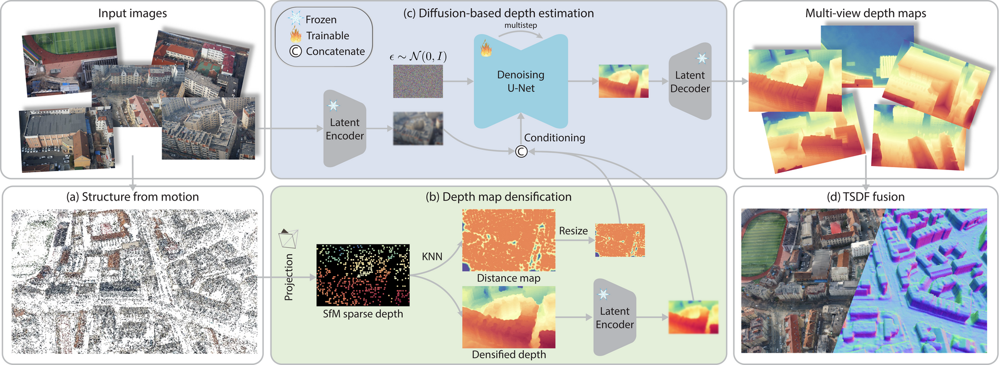
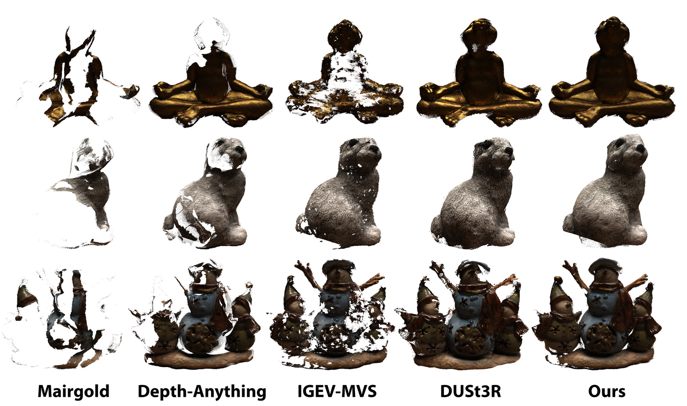
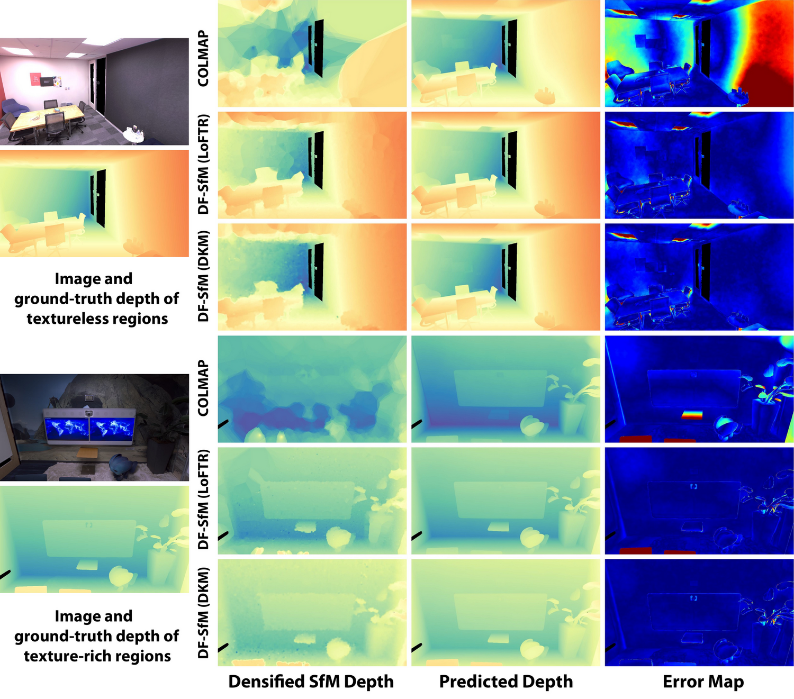

# Murre — 다시점 매칭을 지우고, SfM 점군을 "조건"으로 넣는다

## 📌 메타 정보

| 항목 | 내용 |
|---|---|
| **논문 제목** | Multi-view Reconstruction via SfM-guided Monocular Depth Estimation |
| **저자** | Haoyu Guo\*, He Zhu\*, Sida Peng, Haotong Lin, Yunzhi Yan, Tao Xie, Wenguan Wang, Xiaowei Zhou, Hujun Bao (\*공동 1저자) |
| **소속** | Zhejiang University (State Key Lab of CAD&CG, **ZJU3DV**) |
| **공개일** | 2025-03-18 (arXiv v1) |
| **학회** | **CVPR 2025 (Oral)** |
| **분야** | Multi-view Reconstruction(다시점 3D 복원), Monocular Depth Estimation(단안 깊이 추정), Diffusion Model(확산 모델), SfM |
| **arXiv abstract** | https://arxiv.org/abs/2503.14483 |
| **arXiv PDF** | https://arxiv.org/pdf/2503.14483 |
| **프로젝트 페이지** | https://zju3dv.github.io/murre/ |
| **공식 코드** | https://github.com/zju3dv/Murre (**추론 전용**, 총 13파일 / 2,205줄) |
| **체크포인트** | Google Drive 1개 (DDIM 버전만). **LCM 증류 버전 미공개** |
| **베이스 모델** | **Stable Diffusion v2** (VAE 동결, UNet만 fine-tuning(미세조정)) |
| **계승한 방법론** | **Marigold** (SD를 깊이 추정기로 재활용) — 코드도 Marigold 저장소 fork 수준 |
| **학습 데이터** | Hypersim 56,077 프레임 + 3D Ken Burns 30,309 프레임 = **86,386장** (전부 synthetic(합성)) |
| **학습 비용** | A100 8장 × 25시간 ≈ **200 A100-시간** |
| **SfM 백엔드** | 학습: Detector-Free SfM (DF-SfM, matcher(정합기)=LoFTR) / 추론: COLMAP·DKM도 가능 |
| **리뷰 시점 코드 상태** | main 브랜치 `0deaaa1` (커뮤니티 PR #26 병합 후) |

---

## 📖 주요 용어 사전 (Glossary)

*이 논문은 새 용어를 거의 만들지 않고 3D 비전의 기존 용어들을 조합합니다. 아래 표만 알면 본문이 거의 다 읽힙니다.*

### 3D 복원 파이프라인 기본

| 용어 | 풀이 |
|---|---|
| **SfM (Structure from Motion, 움직임으로부터의 구조 복원)** | 여러 장의 사진에서 **카메라 위치·방향**과 **희소한 3D 점 몇천 개**를 동시에 알아내는 고전 기법. 20년 넘게 다듬어져 매우 성숙하고 안정적. COLMAP이 사실상 표준. |
| **MVS (Multi-View Stereo, 다시점 스테레오)** | SfM이 만든 카메라 정보를 받아서, **모든 픽셀의 깊이**를 채워 조밀한 3D를 만드는 다음 단계. 이 논문이 대체하려는 대상. |
| **cost volume(비용 볼륨)** | 학습형 MVS의 핵심 자료구조. "이 픽셀이 깊이 d에 있을 때 여러 뷰가 얼마나 일치하는가"를 3D 격자로 쌓아 둔 것. **메모리를 엄청 먹는다** — 이 논문이 지목한 1번 문제. |
| **photometric consistency(광도 일관성)** | "같은 3D 점은 어느 카메라에서 봐도 같은 색으로 보인다"는 가정. MVS의 기본 원리. **흰 벽처럼 무늬 없는 곳(textureless region)에서는 어디를 봐도 색이 같아서 무너진다.** |
| **sparse view(희소 뷰)** | 사진이 3~10장 정도로 적은 상황. 매칭할 짝이 없어서 MVS가 특히 약하다. |
| **triangulation(삼각측량) 모드** | 카메라 파라미터를 이미 알고 있을 때, 매칭된 특징점들로 3D 점만 계산하는 SfM 모드. 이 논문의 평가 데이터셋(DTU/ScanNet/Replica/Waymo)은 전부 이 모드를 씀. |
| **TSDF fusion (Truncated Signed Distance Function, 절단 부호거리 함수 융합)** | 뷰별 깊이 맵 여러 장을 3D 복셀 격자에 누적해서 하나의 mesh(메시)로 합치는 고전 알고리즘. KinectFusion에서 유래. |
| **point cloud fusion(점군 융합)** | TSDF 대신, 깊이 맵을 3D 점으로 되돌린 뒤 뷰 간에 서로 안 맞는 점을 걸러내는 방식. Fusibile이 대표. |

### 깊이 추정 관련

| 용어 | 풀이 |
|---|---|
| **monocular depth estimation(단안 깊이 추정)** | 사진 **한 장**만 보고 깊이를 맞히는 일. 원리적으로 답이 하나로 안 정해지는(ill-posed, 불량 설정) 문제 — 큰 물체가 멀리 있는지 작은 물체가 가까이 있는지 사진만으로는 모른다. |
| **relative depth(상대 깊이)** | "A가 B보다 가깝다"는 순서만 맞고 실제 미터 값은 모르는 깊이. Marigold, Depth-Anything이 여기 해당. |
| **metric depth(미터법 깊이)** | 실제 물리 단위(미터)를 갖는 깊이. Metric3D가 여기 해당. |
| **scale & shift(스케일과 시프트)** | 상대 깊이를 실제 깊이로 바꾸는 두 숫자. `실제 = a × 예측 + b`. 이 두 값을 못 맞히면 뷰마다 3D가 어긋나서 융합이 망가진다. |
| **multi-view consistency(다시점 일관성)** | 서로 다른 사진에서 예측한 깊이가 3D에서 같은 자리를 가리키는 성질. 단안 추정의 최대 약점이자 이 논문이 해결하려는 것. |
| **Marigold** | Stable Diffusion을 깊이 추정기로 개조한 대표 논문. Murre의 직접적 출발점 — 코드 구조가 거의 동일하다. |
| **depth completion(깊이 완성)** | 라이다 등에서 얻은 **희소한 깊이 측정치**를 조밀하게 채우는 과제. SparseDC가 SOTA. Murre와 입력이 비슷해 보이지만, **깊이 완성은 희소 입력이 정확하다고 가정**하는 반면 SfM 점에는 노이즈가 많아서 그대로는 안 통한다. |

### 이 논문이 도입한 구성요소

| 용어 | 풀이 |
|---|---|
| **explicit intermediate representation(명시적 중간 표현)** | 논문의 핵심 프레이밍. 여러 뷰의 정보를 신경망 특징으로 뭉개서 넘기는 대신, **눈에 보이는 3D 점군이라는 명시적 형태**로 압축해 전달한다는 뜻. |
| **KNN densification(K-최근접 이웃 조밀화)** | 값이 없는 픽셀마다 가까운 유효 픽셀 k개를 찾아 거리 역수 가중평균으로 채우는 것. 코드 기본 k=3. |
| **distance map(거리 맵)** | 각 픽셀에서 "가장 가까운 진짜 SfM 값까지의 거리"를 적어둔 맵. **어디가 진짜 관측이고 어디가 지어낸 값인지 알려주는 신뢰도 지도.** |
| **RANSAC (RANdom SAmple Consensus, 무작위 표본 합의)** | 이상치가 섞인 데이터에서 직선을 맞히는 고전 기법. 무작위로 몇 점 골라 직선을 그어보고, 그 직선에 동의하는 점(inlier)이 가장 많은 직선을 채택한다. Murre는 이걸로 스케일·시프트를 보정. |
| **LCM (Latent Consistency Model, 잠재 일관성 모델)** | 여러 스텝 걸리는 확산 모델을 1~4스텝으로 줄이는 distillation(증류) 기법. teacher(교사) UNet을 고정하고 student(학생) UNet이 "어느 시점에서 출발하든 같은 결과에 도달하도록" 학습. |

### 평가 지표

| 용어 | 풀이 |
|---|---|
| **Chamfer distance(챔퍼 거리)** | 두 점군 사이 거리. 각 점에서 상대편의 가장 가까운 점까지 거리를 양방향 평균. **낮을수록 좋음.** DTU에서 mm 단위. |
| **F-score @5cm** | 예측 표면과 정답 표면이 5cm 이내로 맞는 비율을 정밀도(precision)·재현율(recall) 조화평균으로 낸 값. **높을수록 좋음.** ScanNet/Replica에서 사용. |
| **RMSE (Root Mean Square Error, 제곱근 평균 제곱 오차)** | 예측 깊이와 라이다 깊이 차이의 제곱 평균에 루트. **낮을수록 좋음.** Waymo에서 **미터** 단위(코드에서 80m로 clip 후 계산). |

---

## 📝 논문 요약 (TL;DR)

**한 줄:** 다시점 매칭(cost volume)을 통째로 지우고, **SfM 희소 점군을 "다시점 정보의 압축된 형태"로 보아 단안 깊이 확산 모델(diffusion model)의 조건(condition)으로 밀어 넣는다.**

- **핵심 문제**: 학습형 MVS는 ① cost volume 때문에 GPU 메모리를 폭식하고 ② 희소 뷰에서 매칭 실패로 무너지며 ③ GT 3D 데이터가 희귀해 일반화가 안 된다. 반대로 단안 확산 모델(Marigold 등)은 그림은 예쁘지만 **뷰마다 스케일이 제각각**이라 그냥 합치면 3D가 산산조각 난다.
- **해결책**: 두 세계를 잇는 다리로 **SfM 점군**을 쓴다. 점군을 각 뷰에 투영 → KNN으로 조밀화 → 거리 맵과 함께 조건으로 주입. 모든 뷰가 **같은 전역 점군**을 보므로 예측 깊이가 자동으로 같은 좌표계·같은 스케일에 놓인다.
- **검증**: DTU 3-뷰 Chamfer **1.42mm** (2위 MonoSDF 1.86), Replica F-score 0.85, ScanNet 0.700, Waymo RMSE 2.83m. 합성 데이터 8.6만 장(200 A100-시간)만으로 850만 장 학습한 DUSt3R(2.81mm)를 큰 차이로 앞선다.
- **가장 중요한 발견**: 표 4(§6.3) — **KNN 조밀화가 없으면 F-score가 0.853 → 0.543으로 붕괴**한다. 희소 깊이를 VAE에 그대로 넣으면 작동하지 않는다.

핵심 문장 하나만 남긴다면: **"이 논문은 다시점 일관성을 손실 함수로 강제하지 않는다. 모든 뷰가 같은 SfM 점군을 조건으로 받게 만들어 일관성이 저절로 따라오게 한다."**

---

## 🎯 핵심 기여 (Contributions)

1. **SfM 사전정보(prior)를 확산 기반 깊이 추정에 주입하는 방법** — 점군을 뷰별 희소 깊이로 투영 → KNN 조밀화 → 거리 맵 동반 → 범위 정규화(range normalization)의 4단 처리. 이게 논문의 실질적 본체.
2. **다시점 복원 프레임워크 전체 설계** — SfM → 뷰별 깊이 → RANSAC 정렬 → TSDF/점군 융합의 피드포워드 파이프라인. 장면별 최적화(per-scene optimization)가 필요 없다.
3. **합성 데이터 처리 레시피** — Hypersim에 triangulation(삼각측량)을, 3D Ken Burns에 DF-SfM을 돌려 SfM 조건 학습쌍을 만드는 방법. (다만 **이 전처리 코드는 미공개**.)
4. **4종 도메인 검증** — object(물체)/indoor(실내)/streetscape(거리)/aerial(항공)까지 성격이 전혀 다른 5개 데이터셋에서 일반화 확인.

---

## 🧩 주요 알고리즘 설명

### 5.0 전체 구조

*왜 이 그림부터 보나: 이 논문은 새 신경망 구조를 만들지 않았기 때문에, "어떤 신호가 어디로 흘러 들어가는가"만 이해하면 방법론이 끝난다.*


*(a) SfM으로 희소 3D 구조 → (b) 이를 명시적 중간 표현(거리 맵 + 조밀화 깊이)으로 인코딩 → (c) 조건으로 넣어 확산 깊이 추정 → (d) TSDF 융합. 눈송이 = 동결(frozen), 불꽃 = 학습(trainable).*

```
                 ┌──────────────── 다중 뷰 이미지 ────────────────┐
                 │                                              │
                 ▼                                              ▼
        ┌─────────────────┐                          ┌────────────────────┐
        │ (a) SfM         │  DF-SfM(LoFTR) 또는       │  RGB 이미지 (뷰 i) │
        │  희소 3D 점군    │  COLMAP                   └─────────┬──────────┘
        └────────┬────────┘                                     │ VAE 인코더(동결)
                 │ 뷰 i로 투영 (가시성 기반)                        ▼
                 ▼                                       [RGB latent  4ch]
        ┌─────────────────┐
        │ SfM 희소 깊이     │  픽셀의 1% 미만만 값 있음
        └────────┬────────┘
                 │ ① 범위 정규화 (2%/98% 컷 → ±20% 확장)
                 ├──────────────┬───────────────────────────┐
                 │ ② KNN(k=3)   │ ③ 거리 변환                 │
                 ▼              ▼                            │
        [조밀화 깊이]      [거리 맵]                           │
                 │ VAE 인코더(동결)  │ 그냥 8배 축소 (인코더 통과 X) │
                 ▼              ▼                            │
        [idpt latent 4ch]  [dist 1ch]                        │
                 │              │                            │
                 └──────┬───────┴────────────────────────────┘
                        ▼  concat(연결)
        [4(RGB) + 4(idpt) + 1(dist) + 4(노이즈 깊이)] = 13채널
                        ▼
             ┌──────────────────────┐
             │  Denoising U-Net      │  ← SD v2 초기화, 이것만 학습
             │  (10 step DDIM)       │
             └──────────┬───────────┘
                        ▼ VAE 디코더(동결), 3채널 평균
                  [정규화 깊이 0~1]
                        ▼ ④ 역정규화 (기록해둔 d_min, d_max)
                        ▼ ⑤ RANSAC 스케일·시프트 정렬 (SfM 희소 깊이 기준)
                  [미터법 깊이 맵]
                        ▼ (d) TSDF fusion
                     [최종 mesh]
```

> **채널 수 근거**: 코드 `pipeline.py:431-433`의 `torch.cat([rgb_latent, ipdt_latent, dist_down, depth_latent], dim=1)`에서 4+4+1+4 = **13채널**. Marigold의 8채널(RGB 4 + 노이즈 4) 대비 5채널 증설이며, 이것이 SD v2 UNet 대비 유일한 구조 변경이다.

### 5.1 확산 기반 깊이 추정 (Marigold 계승분)

*왜 확산 모델인가: 3D GT 데이터는 희귀한데 Stable Diffusion은 수십억 장의 이미지로 이미 "세상이 어떻게 생겼는지"를 배웠다. 그 prior(사전지식)를 빌려 쓰면 8.6만 장만으로도 일반화가 된다.*

깊이 맵을 이미지처럼 취급해 latent(잠재) 공간에 넣고, 노이즈를 씌웠다 벗기는 표준 DDPM 절차를 그대로 쓴다.

**forward process(정방향 과정, 노이즈 추가):**

$$d_t = \sqrt{\bar{\alpha}_t}\, d_0 + \sqrt{1-\bar{\alpha}_t}\, \epsilon, \qquad \epsilon \sim \mathcal{N}(0, I)$$

*(즉 진짜 깊이 $d_0$ 와 무작위 노이즈 $\epsilon$ 을 시각 $t$ 에 따른 비율로 섞은 값. $\bar\alpha_t = \prod_{s=1}^{t}(1-\beta_s)$ 로, $t$ 가 커질수록 노이즈 비중이 커진다.)*

**학습 손실 — 이게 전부다:**

$$\mathcal{L} = \left\| \epsilon - \hat{\epsilon} \right\|^2$$

*(모델이 예측한 노이즈 $\hat\epsilon$ 이 실제로 섞은 노이즈 $\epsilon$ 과 같아지도록 하는 단순 MSE. 별도의 깊이 손실도, 다시점 일관성 손실도 없다.)*

- VAE는 **동결(frozen)**, UNet만 fine-tuning
- GT 깊이는 **3채널로 복제**해서 VAE 인코더에 통과 (VAE가 RGB 3채널만 받으므로)
- 디코딩 시에는 반대로 **3채널 평균**을 내서 1채널 깊이로 복원 (`pipeline.py:490`)

### 5.2 SfM 조건 주입 — 3중 신호 ⭐

*왜 이 절이 핵심인가: 방법론의 나머지는 전부 기성품이고, 논문의 기여는 오직 "SfM 점군을 어떤 형태로 가공해서 넣는가"에 있다.*

SfM 점군을 뷰에 투영하면 픽셀의 1% 미만만 값이 있는 극단적으로 희소한 맵이 나온다. 이걸 VAE 인코더에 그냥 넣으면 **작동하지 않는다**(F-score 0.543, §6.3 표 4).

#### ① 범위 정규화 (normalization)

*왜: 장면·뷰마다 깊이 범위가 실내 3m부터 항공 500m까지 천차만별이라, 그대로 넣으면 학습이 발산한다.*

```python
# murre/util/depth_util.py: normalize_depth()
val_dpt = sdpt[sdpt > 0.]                      # 유효 픽셀만
val_dpt = val_dpt.clip(0., pre_clip_max)       # max_depth로 상한 (기본 10m)
dpt_min = np.percentile(val_dpt, 2)            # 하위 2% 컷 (이상치 제거)
dpt_max = np.percentile(val_dpt, 98)           # 상위 2% 컷
dpt_max = dpt_max * 1.2                        # ±20% 범위 확장
dpt_min = dpt_min * 0.8
sdpt_norm = (np.clip(sdpt, dpt_min, dpt_max) - dpt_min) / (dpt_max - dpt_min)
```

두 가지 설계 의도:
- **2%/98% 컷**: SfM 점에는 삼각측량 실패로 생긴 이상치가 반드시 섞인다.
- **±20% 확장**: SfM 점은 이미지의 극히 일부만 덮으므로, **실제 장면의 깊이 범위가 SfM 점의 범위보다 넓을 수 있다.** 미리 여유를 둬서 화면 밖 깊이가 잘려나가지 않게 한다.

그리고 결정적으로 — **GT 깊이도 똑같은 범위로 정규화해서 감독한다.** 조건과 정답이 같은 자로 재어지므로, 학습된 모델의 출력은 자동으로 SfM과 같은 스케일에 놓인다. 뒤의 RANSAC 정렬이 "필수"가 아니라 "미세 보정"으로 격하되는 이유가 이것이다.

#### ② KNN 조밀화 (densification)

*왜: 희소 맵을 그대로 인코더에 넣으면 실패하므로, "SfM 점을 뭉갠 저해상도 깊이 스케치"로 만들어 준다.*

값이 없는 픽셀 $p$ 마다, 값이 있는 가장 가까운 $k$ 개 픽셀을 찾아 **거리의 역수를 가중치로 가중평균**한다.

$$d(p) = \frac{\sum_{i=1}^{k} \frac{1}{\|p - q_i\|} \, d(q_i)}{\sum_{i=1}^{k} \frac{1}{\|p - q_i\|}}$$

*(가까운 SfM 점일수록 더 큰 영향을 주도록 거리 역수로 가중. $q_i$ 는 $p$ 에서 $i$ 번째로 가까운 유효 픽셀.)*

```python
# murre/util/depth_util.py: interp_depth(sdpt, k=3, w_dist=10.0)
tree = KDTree(val_pos)                     # 유효 픽셀 좌표로 KD 트리
dists, inds = tree.query(inval_pos, k=k)   # 무효 픽셀마다 k개 최근접 탐색
weights = 1 / np.where(dists == 0, 1e-10, dists)
weights /= np.sum(weights, axis=1, keepdims=True)
weighted_avg = np.sum(sdpt[val_x[inds], val_y[inds]] * weights, axis=1)
```

#### ③ 거리 맵 (distance map)

*왜: 조밀화를 하고 나면 화면 전체가 값으로 차 버려서, 네트워크가 어디가 진짜 관측이고 어디가 지어낸 값인지 구분할 수 없게 된다. 그 정보를 따로 알려주는 채널.*

```python
val_msk = sdpt > 0
dist_map = cv2.distanceTransform((1 - val_msk).astype(np.uint8), cv2.DIST_L2, maskSize=5)
dist_map = dist_map / np.sqrt(h**2 + w**2)   # 이미지 대각선으로 정규화
dist_map = dist_map * 10.0                   # w_dist = 10배 스케일
```

- 값이 0이면 "여기는 진짜 SfM 점", 값이 크면 "여기는 멀리서 끌어온 추측값"
- **저주파(low-frequency) 정보라서 VAE 인코더를 통과시키지 않고**, 그냥 latent 해상도로 nearest 리사이즈해 1채널로 붙인다 (`pipeline.py:402`). 인코더 한 번 아끼는 실용적 선택.
- 사실상 **confidence map(신뢰도 지도)** 역할

### 5.3 다시점 복원 파이프라인

*왜 정렬 단계가 또 필요한가: §5.2 ①에서 스케일은 이미 맞춰졌지만 "약간의 불일치(slight inconsistency)"가 남아서, 그대로 융합하면 뷰 경계에 겹침이 생긴다.*

1. SfM 실행 (DF-SfM 또는 COLMAP)
2. 뷰별 깊이 예측 (§5.2 조건 사용)
3. 기록해둔 `d_min, d_max`로 **역정규화**: `depth = (d_max - d_min) × pred + d_min`
4. **RANSAC 선형 회귀**로 SfM 희소 깊이에 스케일·시프트 정렬
5. TSDF fusion 또는 point cloud fusion

```python
# murre/util/depth_util.py: align_depth()
ransac = RANSACRegressor(max_trials=1000)
model = make_pipeline(PolynomialFeatures(degree=1, include_bias=False), ransac)
model.fit(pred_dpt[mask].reshape(-1,1), ref_dpt[mask].reshape(-1,1))
a, b = ransac.estimator_.coef_, ransac.estimator_.intercept_
pred_metric = a * pred_dpt + b if a > 0 else pred_dpt * (gt_mean / pred_mean)
```

RANSAC을 쓰는 이유는 SfM 점의 이상치 때문이며, 실제로 최소제곱(least square) 대비 F-score가 0.812 → 0.828로 유의미하게 좋다(§6.2).

> ⚠️ **논문 서술 오류**: 논문은 RANSAC이 *"reprojection error(재투영 오차)를 최소화한다"*고 썼지만, 코드는 **깊이 값의 잔차**를 최소화한다. 재투영 오차가 아니다.

### 5.4 학습 설정

*왜 이 설정인가: GT 3D가 있는 실제 데이터가 없으니 합성 데이터를 쓰되, SD prior 덕분에 소량으로도 충분하다는 것이 논문의 베팅.*

| 항목 | 값 |
|---|---|
| 초기화 | Stable Diffusion v2 (VAE 동결, UNet만 학습) |
| 프레임워크 | PyTorch Lightning + diffusers |
| 데이터 A | **Hypersim** — 461개 실내 장면 중 공식 train 365개에서 저품질 제외 → **345장면 56,077프레임**. 768×1024 → **384×512** 다운스케일. 카메라 파라미터가 주어져 있어 **triangulation**으로 희소 점군 생성 |
| 데이터 B | **3D Ken Burns** — 23개 야외 장면(각 2시퀀스) 중 품질 미달·SfM 실패 제외 → **12시퀀스 30,309프레임**. 카메라 파라미터가 없어 **DF-SfM으로 캘리브레이션부터** 수행. 512×512 → 384×512 센터크롭 |
| 하드웨어 | A100 8장, batch size 128, 50 epoch, **약 25시간** |
| 옵티마이저 | Adam, lr = 3e-5 |
| 추론 | 10 step DDIM + 5회 ensemble(앙상블) 후 픽셀별 median(중앙값) |

**학습 비용이 놀랍게 싸다**: DUSt3R가 850만 장을 쓰는데 Murre는 8.6만 장, **약 98배 적다.** 이것이 "SD prior에 얹혀간다"는 전략이 통했다는 가장 직접적인 증거다.

---

## 📊 실험 요약

### 6.1 데이터셋별 결과

#### DTU (물체 단위, **3-뷰**, Chamfer 거리 mm, ↓)

*왜 3뷰인가: 논문의 강점이 "희소 뷰"이므로 MonoSDF의 3-뷰 프로토콜을 따랐다. 15개 장면 평가.*

| 방법 | 계열 | 평균 ↓ | 학습 데이터 |
|---|---|---|---|
| COLMAP | 고전 MVS | 2.56 | - |
| RealityCapture | 상용 | 2.84 | - |
| VolSDF | 신경 최적화 | 4.21 | - |
| **MonoSDF** | 신경 최적화 | **1.86** (2위) | - |
| Marigold | 단안 상대 | 5.46 | 74K |
| Depth-Anything | 단안 상대 | 3.09 | 1.5M |
| Depth-Anything v2 | 단안 상대 | 3.69 | 0.6M |
| Metric3D | 단안 미터법 | 5.01 | 8M |
| MVSNet | 학습형 MVS | 2.38 (3위) | 27.1K |
| IGEV-MVS | 학습형 MVS | 3.50 | 35.8K |
| DUSt3R | ViT 포인트맵 | 2.81 | 8.5M |
| **Murre** | **본 논문** | **1.42** 🥇 | **86.4K** |

15개 장면 중 **12개에서 1위**. 이 논문의 가장 강한 결과다.


*DUSt3R를 제외한 모든 방법은 Fusibile로 깊이 맵을 융합. Murre가 구멍이 훨씬 적은 완전한 점군을 만든다.*

> ⚠️ **반드시 알아야 할 단서**: 이건 **3-뷰 희소 설정**이다. 표준 DTU MVS 벤치마크(49뷰)에서는 COLMAP만으로도 0.7~1.0mm가 나온다. 여기서 COLMAP이 2.56mm인 건 사진이 3장뿐이라서다. **DTU 리더보드 숫자와 직접 비교하면 안 된다.**

#### Replica / ScanNet (실내, F-score @5cm, ↑)

*왜 두 개인가: Replica는 GT 기하가 매우 정확한 합성급 실내, ScanNet은 실제 스캔 실내. 성격이 달라 둘 다 본다.*

| 방법 | Replica ↑ | ScanNet ↑ |
|---|---|---|
| **MonoSDF** (장면별 최적화) | **0.86** 🥇 | **0.733** 🥇 |
| **Murre** | 0.85 🥈 | 0.700 🥈 |
| IGEV-MVS | 0.82 | 0.483 |
| Depth-Anything v2 (SfM 정렬됨) | 0.73 | 0.689 |
| SimpleRecon (ScanNet 학습) | - | 0.683 |
| Depth-Anything (SfM 정렬됨) | 0.67 | 0.663 |
| Marigold (SfM 정렬됨) | 0.57 | 0.643 |
| Metric3D | 0.61 | 0.475 |
| NeuralRecon (ScanNet 학습) | - | 0.617 |
| Manhattan-SDF | - | 0.602 |
| COLMAP | - | 0.537 |
| MVSNet | 0.61 | 0.089 |
| SparseDC (깊이 완성) | 0.25 | 0.220 |

> 📌 **이 표들의 등수·지표 관대함·순위 안정성을 다시 뜯어본 분석은 Q17 참조.** DA v2는 ScanNet 3위(0.689)로 Murre와 1.6% 차이이고, 논문의 우위는 사실상 DTU 하나에 얹혀 있다.

**두 실내 벤치마크 모두에서 MonoSDF에 진다.** 다만 MonoSDF는 장면 하나에 수 시간이 걸리는 per-scene optimization(장면별 최적화)이고 Murre는 뷰당 1~12초의 feedforward(피드포워드)다. 속도를 함께 말해야 공정한 비교가 된다.

#### Waymo (거리 풍경, LiDAR 대비 RMSE, **미터**, ↓)

*왜 RMSE인가: 실외 대규모 장면은 3D GT 메시가 없어서, 이미지 공간에서 라이다 깊이와 직접 비교한다. 32개 정적 시퀀스.*

| 방법 | 평균 RMSE ↓ |
|---|---|
| **Murre** | **2.83** 🥇 |
| Metric3D | 2.89 🥈 |
| Depth-Anything (SfM 정렬됨) | 3.25 |
| StreetSurf | 3.35 |
| Depth-Anything v2 | 3.36 |
| Marigold | 3.60 |
| IGEV-MVS | 5.81 |
| COLMAP | 8.08 |
| SparseDC | 10.21 |
| MVSNet | 15.22 |
| F2-NeRF | 18.65 |

> ⚠️ **Waymo 우위는 실질적으로 없다**: 2.83 vs 2.89는 **2% 차이**이고, 32개 시퀀스 중 Metric3D가 8개에서 이긴다. 게다가 논문이 표 캡션에 스스로 *"COLMAP·F2-NeRF·StreetSurf는 LiDAR 공간에서, 우리와 나머지는 이미지 공간에서 평가했다"*고 적었다 — **평가 프로토콜이 다른 숫자를 한 표에 놓았다.** "SOTA"가 아니라 "Metric3D와 동급"이 정확하다.

#### UrbanScene3D (항공)

드론 촬영, 장면당 2,500~6,000장, $10^6$ m² 규모. 이 데이터셋만 **COLMAP**으로 SfM을 돌렸다(DF-SfM 아님). 정량 표 없이 정성 결과만 제시.

### 6.2 속도-정확도 트레이드오프 (Replica, 680×1200, A6000 1장, batch=1)

*왜 이 표가 중요한가: 논문의 기본 설정이 실제로는 낭비라는 사실이 여기서 드러난다.*

| 스텝 | 앙상블 | 정렬 | 시간(초) ↓ | F-score ↑ |
|---|---|---|---|---|
| 10 | 5 | RANSAC | 12.166 | **0.853** |
| 10 | 1 | RANSAC | 2.969 | 0.850 |
| 1 (LCM) | 5 | RANSAC | 3.202 | 0.829 |
| 1 (LCM) | 1 | RANSAC | **0.840** | 0.828 |
| 1 (LCM) | 1 | 최소제곱 | 0.836 | 0.812 |
| 1 (LCM) | 1 | 없음 | 0.829 | 0.780 |

읽는 법 3가지:
1. **앙상블 5회는 사실상 낭비.** 4.1배 느려지는데 F-score는 **+0.003**. 그런데 코드 기본값과 README 예시가 둘 다 `--ensemble_size 5`다.
2. **최고 설정 대비 최속 설정은 14.5배 빠르고 F는 0.025밖에 안 떨어진다.** 실사용에서는 LCM 1스텝 + 앙상블 1이 압도적으로 합리적이다 (**단 LCM 체크포인트가 미공개**, §7.3).
3. **"정렬은 필수가 아니다"는 논문의 서술은 과장.** 0.828 → 0.780, **−0.048**로 LCM 증류 손실(−0.024)의 두 배다. 게다가 RANSAC은 11ms밖에 안 든다(0.840 − 0.829). 안 쓸 이유가 없다.

### 6.3 SfM 방법 / 깊이 조건화 절제 실험

*왜: 방법론의 두 축(어떤 SfM을 쓰나 / 조건을 어떻게 가공하나)이 각각 얼마나 중요한지 분리해 본다.*

**표 3 — SfM 방법 (Replica F-score):**

| COLMAP | DF-SfM (LoFTR, 학습과 동일) | DF-SfM (DKM) |
|---|---|---|
| 0.645 | **0.853** | 0.842 |

- 학습 때 쓴 matcher(LoFTR)와 다른 DKM으로 바꿔도 0.842로 거의 유지 → **matcher 선택에는 견고하다.**
- 반면 COLMAP은 0.645로 급락. 원인은 **무늬 없는 영역에서 COLMAP의 keypoint(특징점)가 극단적으로 희소하고 노이즈가 많기 때문.** 논문 표현대로 "깊이 맵은 보기엔 그럴듯한데 실제 값에는 상당한 오차가 있다".
- 실무 결론: **SfM이 괜찮은 점군만 만들어 주면 어떤 SfM이든 된다. 문제는 SfM이 실패할 때다.**


*무늬가 풍부한 장면(위)과 무늬 없는 장면(아래)에서의 비교. 무늬 없는 장면에서 COLMAP 기반 결과가 무너진다.*

**표 4 — 깊이 조건화 설계 (Replica F-score) — 이 논문의 급소 ⭐:**

| $k$ | 0 | 0 | 1 | 1 | 3 | 3 |
|---|---|---|---|---|---|---|
| **거리 맵** | ✘ | ✔ | ✘ | ✔ | ✘ | ✔ |
| **F-score** | 0.543 | 0.528 | 0.783 | 0.840 | 0.753 | **0.853** |

논문이 말하지 않은 것까지 포함해 읽으면:

1. **KNN 조밀화가 거의 전부다**: 0.543 → 0.783, **+0.24**. 희소 깊이를 VAE 인코더에 그대로 넣으면 작동하지 않는다. VAE는 자연 이미지 분포로 학습됐으므로 "점 몇천 개만 찍힌 검은 맵"은 분포 밖(out-of-distribution) 입력이다.
2. **거리 맵은 조밀화가 있을 때만 의미가 있다**: $k=0$ 에서는 오히려 **−0.015로 해롭고**, $k=1$ 에서 +0.057, $k=3$ 에서 +0.100. 논리적으로 당연하다 — 보간이 없으면 "어디가 보간인지" 알려줄 게 없으니 채널만 낭비된다.
3. **논문이 놓친 반전**: 거리 맵 없이는 $k=3$(0.753)이 $k=1$(0.783)보다 **나쁘다**. 이웃 3개를 섞으면 더 뭉개지는데 어디가 진짜인지 모르니 손해다. 거리 맵이 붙는 순간 순서가 뒤집힌다(0.840 → 0.853). 즉 **두 요소는 독립 기여가 아니라 상호작용(interaction)**인데, 논문은 이 점을 지적하지 않는다.

### 6.4 잘 설계된 통제 실험 ✅

*왜 언급하나: 이 논문에 대한 가장 자연스러운 반박을 미리 막았기 때문.*

"Murre의 이득은 그냥 SfM에 스케일을 맞춘 덕분 아니냐?"는 반박이 당연히 나온다. 논문은 **단안 상대 깊이 베이스라인(Marigold, Depth-Anything v1/v2)에 똑같은 SfM 정렬을 적용한 뒤** 평가했다(보충자료 §Baselines에 명시).

- Replica: 정렬된 Depth-Anything v2 = 0.73 vs Murre = **0.85**
- **조건화 자체가 +0.12를 벌어온다.** 정렬만으로는 설명이 안 된다.

### 6.5 없는 실험 ⚠️

*왜 짚나: 실무 도입을 판단할 때 가장 필요한 숫자들이 빠져 있다.*

1. **SfM 점 밀도 대비 성능 곡선이 없다.** "뷰당 SfM 점이 몇 개여야 작동하는가"는 이 방법의 유일한 실전 리스크인데 그래프가 없다. 표 3(COLMAP vs DF-SfM)이 간접적으로 답하지만 **밀도와 정확도가 뒤섞인 실험**이라 원인 분리가 안 된다.
2. **뷰 개수 대비 성능 곡선이 없다.** 희소 뷰가 강점이라면서 뷰 수를 스윕하지 않았다.
3. **하이퍼파라미터 절제 전무**: 거리 맵 스케일(`w_dist=10`), 범위 확장(±20%), 이상치 컷(2%/98%) 셋 다 근거 수치 없음. 특히 ±20%는 "대부분의 경우 커버된다"는 서술만 있다.
4. **백본 교체 ablation이 없다.** 확산 모델을 고른 이유를 논문은 *"현대 이미지 확산 모델의 강력한 성능 덕을 본 확산 기반 단안 깊이 추정에 조건을 건다"* 정도로만 쓴다. **확산이 필수라는 증거는 논문 어디에도 없다** — Marigold라는 잘 만들어진 출발점이 있어서 골랐다는 게 실질적 이유로 보인다. → 대안은 Q9.
5. **단안 깊이를 네 번째 조건으로 넣는 실험이 없다.** KNN 얼룩은 스케일은 맞지만 경계를 모르고, 단안 깊이는 경계는 알지만 스케일을 모른다 — **약점이 정확히 반대**인데 둘을 함께 넣어 본 실험이 없다. → Q13.

---

## 🔧 공식 코드 리뷰

*왜 별도 장을 두나: 논문에 없는 설계 결정과 여러 개의 실제 버그가 코드에만 존재하고, 그중 일부는 논문 결과의 재현 가능성 자체에 영향을 준다.*

저장소(zju3dv/Murre)는 **추론 전용**이다. 13개 파일, 2,205줄. 구조 자체는 Marigold를 거의 그대로 가져와 조건 채널만 늘린 형태다.

### 7.1 🔴 버그 1 — `--err_thr` / `--nviews_thr` 플래그가 완전한 무효 코드

README가 "신뢰할 수 없는 SfM 깊이를 걸러내려면 이 두 플래그를 조정하라"고 **명시적으로 안내하는 기능**이다.

```python
# run.py:289-296
sdpt, err, nviews = sdpt[..., 0], sdpt[..., 1], sdpt[..., 2]
input_sparse_depth = np.clip(sdpt, None, max_depth)   # ← 여기서 새 배열(복사본) 생성
if err_thr is not None:
    sdpt[err > err_thr] = 0.                          # ← 원본만 수정됨
if nviews_thr is not None:
    sdpt[nviews <= nviews_thr] = 0.                   # ← 원본만 수정됨
...
pipe_out = pipe(input_image, input_sparse_depth, ...) # ← 필터 전 복사본을 전달
```

`np.clip`이 **새 배열을 반환**하므로, 그 뒤 `sdpt`에 가한 필터링은 파이프라인에 전혀 전달되지 않는다. 292행을 296행 뒤로 옮기면 고쳐진다.

**이게 단순 오타로 넘길 수 없는 이유:**
- GitHub 이슈 #15에서 사용자가 권장값을 묻자 저자가 상세히 답변한다 — *"err_thr는 SfM 재투영 오차와 실제 깊이 오차의 상관이 약해서 영향이 거의 없다. 반면 nviews_thr는 눈에 띄는 효과가 있으니 장면 커버리지를 보고 정하라."* 그런데 **공개된 스크립트로는 저자의 조언대로 해도 아무 일도 일어나지 않는다.**
- 이슈 #27에서 또 다른 사용자가 "DTU 재현 시 err_thr / nviews_thr를 썼는지"를 묻고 있으나 미답변. **논문 숫자가 어떤 코드로 나왔는지 확인할 방법이 없다.**

### 7.2 🔴 버그 2·3 — 하드코딩 해상도와 16비트 PNG 오버플로우

**② `tsdf_fusion.py`에 Replica 해상도가 박혀 있다:**

```python
# tsdf_fusion.py:131
valid = ((z > 0) & (u >= 0) & (u < 1200) & (v >= 0) & (v < 680))
```

1200×680은 §6.2 표에 나오는 **Replica 해상도**다. 다른 데이터셋(DTU 1600×1200, Waymo 1920×1280)에서 이 가시성 검사는 **에러 없이 조용히 틀린 결과**를 낸다. 이건 메시 정리 단계라 최종 F-score에 직접 영향을 준다.

같은 파일의 추가 가정:
- 83~85행: **모든 프레임에 `ixts[0]` 하나만 사용** → 뷰마다 intrinsic(내부 파라미터)이 다르면(Waymo는 카메라 5대) 틀린다.
- 60행 `h, w = round(cy*2), round(cx*2)`: **principal point(주점)가 정확히 이미지 중앙**이라고 가정.

**③ 16비트 PNG 출력이 오버플로우:**

```python
# run.py:333
depth_to_save = (depth_pred * 65535.0).astype(np.uint16)
```

Marigold에서 그대로 복사한 줄인데, **Marigold의 `depth_pred`는 0~1 범위이고 Murre의 것은 미터 단위 metric depth**다. 깊이 10m면 655,350이 되어 uint16 상한(65,535)을 넘고 **모듈로 래핑**된다. `depth_bw/` 폴더의 PNG는 실내 장면에서도 대부분 쓰레기다. (`depth_npy/`의 .npy는 정상이고 TSDF 융합도 그쪽을 읽으므로 논문 결과 자체에는 영향 없음 — 다만 PNG를 쓰는 사용자는 조용히 당한다.)

### 7.3 🟡 그 밖의 문제

| # | 위치 | 내용 |
|---|---|---|
| ④ | `depth_util.py:89-91` | 유효 SfM 점이 10개 미만이면 `return None, None`(**튜플**)을 반환하는데, 호출부 `pipeline.py:305`는 배열 하나를 기대하고 바로 `.clip()`을 부른다 → `AttributeError` 크래시. 커버리지 나쁜 뷰가 하나만 섞여도 전체 실행이 죽는다. |
| ⑤ | `get_sfm_depth.py` ↔ `image_util.py` | **해상도의 진실 소스가 둘**이다. 전자는 COLMAP 카메라 모델에서, 후자는 디스크의 실제 이미지 파일에서 H·W를 읽는다. 조금이라도 어긋나면 `pipeline.py:234`의 `assert sdpt.shape == rgb.shape[2:]`에서 하드 크래시. 이슈 #13("대부분의 해상도에서 실패, 되는 해상도를 찾을 때까지 시도해야")로 보고되어 커뮤니티 PR #26으로 완화됨. |
| ⑥ | `depth_util.py:32` | `np.clip(sdpt, dpt_min, dpt_max)`를 **희소 맵 전체**에 적용한다. 무효 픽셀(0)이 `dpt_min`으로 올라갔다 정규화 후 0이 되는 건 의도된 동작이지만, **실제 깊이가 `dpt_min`보다 작은 유효 SfM 점도 함께 0으로 눌려 무효로 오분류**된다. `dpt_min`이 하위 2% 백분위의 0.8배이므로 **카메라에 가장 가까운 점들**이 조건에서 빠진다. 이상치 필터와 유효성 마스크가 의도치 않게 결합된 것이며 논문에는 언급이 없다. |
| ⑦ | `util/ensemble.py` | Marigold의 스케일·시프트 정렬 앙상블 180줄이 **import만 되고 한 번도 호출되지 않는다.** 실제 앙상블은 `pipeline.py:287`의 단순 median. (모든 예측이 같은 정규화 범위를 공유하므로 이 단순화 자체는 타당하다.) 또한 docstring은 MAD 불확실도를 반환한다고 약속하지만 `pred_uncert`는 **항상 None**. |
| ⑧ | `pipeline.py:305` | **정렬 방식을 고를 플래그가 없다.** RANSAC이 하드코딩되어 §6.2 표의 "최소제곱"·"정렬 없음" 행은 코드를 고쳐야만 재현된다. |
| ⑨ | `get_sparse_depth()` | 투영 좌표를 `int()`로 **버림**(반올림 아님), 화면 밖 점을 버리지 않고 **경계로 클램프**, 같은 픽셀에 여러 점이 떨어지면 **z-buffer 없이 나중 값이 덮어쓴다**. 다만 저자가 이슈 #1에서 확인한 대로 이 코드는 **해당 이미지 자신의 feature track(특징 궤적)만** 투영하므로 "건물 뒷면이 비쳐 보이는" 심각한 문제는 발생하지 않는다. |
| ⑩ | `pipeline.py:433,435` | `# this order is important NOTE: check`, `# predict the noise residual NOTE: check` — 개발 중 메모가 그대로 남아 있다. |

### 7.4 🔴 재현성 총평

| 항목 | 상태 | 근거 |
|---|---|---|
| 추론 코드 | ✅ 공개 | - |
| DDIM 체크포인트 | ✅ 공개 | Google Drive |
| **LCM 증류 체크포인트** | ❌ **미공개** | 이슈 #25, 미답변 → §6.2의 1스텝 행 4개 **전부 재현 불가** |
| **학습 / fine-tuning 스크립트** | ❌ **미공개** | 이슈 #23, 미답변 |
| 데이터 전처리 (Hypersim, 3D Ken Burns) | ❌ 미공개 | 기여 3번이 코드로 존재하지 않음 |
| 평가 스크립트 | ❌ 미공개 | EVAL.md는 "MonoSDF/Manhattan-SDF 참고" 수준 |
| **논문 재현용 하이퍼파라미터** | ❌ 미공개 | 이슈 #27, 미답변 |
| Hugging Face 배포 | ❌ 미공개 | 이슈 #2, 미답변 |

**"돌려볼 수는 있지만, 논문 표를 재현할 수는 없다."** CVPR Oral 논문 치고는 아쉬운 수준이다.

---

## 💬 Q&A

### Q1. Murre는 어떻게 "다시점 일관성"을 얻는가? 손실 함수도 cross-attention도 없는데?

**얻는 게 아니라, 얻어걸리게 설계했다.**

Murre에는 다시점 일관성 손실도, 뷰 간 attention도 없다. 학습 손실은 노이즈 MSE 하나뿐이다(§5.1). 일관성은 **세 가지 설계가 겹쳐서 부수적으로(emergent) 따라온다**:

1. **모든 뷰가 같은 전역 SfM 점군을 조건으로 받는다.** SfM 점군은 이미 전역적으로 일관된 3D 좌표계에 있으므로, 그 투영을 조건으로 받은 각 뷰의 예측도 같은 좌표계로 끌려간다.
2. **GT를 SfM과 같은 범위로 정규화해서 학습했다**(§5.2 ①). 모델이 "SfM 스케일로 답하도록" 훈련되어 있다.
3. **마지막에 RANSAC으로 SfM에 다시 못박는다**(§5.3).

증거는 표 4다(§6.3). 조건화를 빼면(k=0) F-score가 0.543으로 무너진다 — 그 상태가 사실상 "SfM 가이드 없는 Marigold"이고, Replica에서 Marigold 자체가 0.57이니 거의 같은 값이다. **일관성의 출처가 조건화라는 것이 수치로 확인된다.**

### Q2. Marigold와 뭐가 다른가? 그냥 채널 몇 개 더 붙인 것 아닌가?

맞다. **구조적으로는 그게 전부다.** UNet 입력 채널을 8 → 13으로 늘린 것이 유일한 아키텍처 변경이다.

하지만 그게 이 논문의 약점이라고 보긴 어렵다. 논문의 가치는 구조가 아니라 **"무엇을 조건으로 줄 것인가"라는 representation(표현) 선택**에 있다. 그리고 그 선택이 자명하지 않다는 증거가 표 4다 — **희소 깊이를 그냥 넣으면(k=0) 완전히 실패한다.** "SfM 점군을 조건으로 쓰자"까지는 누구나 생각할 수 있지만, 그걸 **작동하게 만드는 가공 방식**(조밀화 + 신뢰도 채널 + 공유 범위 정규화)이 논문의 실질이다.

성능 차이도 크다: Replica에서 Marigold 0.57 → Murre 0.85.

### Q3. 논문의 주장 중 과장된 것은?

세 가지다.

| 주장 | 실제 |
|---|---|
| 결론부: *"surpassing state-of-the-art MVS and implicit neural reconstruction-based method"* | **실내 두 벤치마크 모두 MonoSDF에 진다** (ScanNet 0.700 vs 0.733, Replica 0.85 vs 0.86). 그것도 두 표 모두 MonoSDF 칸이 1등 색으로 칠해져 있는데도 그렇게 썼다. 정직한 서술은 *"장면별 최적화가 필요 없는 피드포워드 방식으로 MonoSDF에 근접"*이다. 속도(수 시간 vs 수 초)를 함께 말하면 오히려 더 설득력 있었을 텐데 굳이 과장했다. |
| Waymo SOTA | 2.83 vs Metric3D 2.89 = **2% 차이**, 32개 중 8개는 Metric3D 승. 게다가 **평가 프로토콜(LiDAR 공간 vs 이미지 공간)이 섞인 표**다(§6.1). |
| *"정렬 단계는 불가결하지 않다(not indispensable)"* | 빼면 **−0.048**로 LCM 증류 손실의 2배다. RANSAC은 11ms밖에 안 든다(§6.2). |

부수적으로, Replica·ScanNet 표에서 MonoSDF의 장면별 값은 전부 "-"인데 그 빈칸까지 1등 색으로 칠해져 있어 표가 오해를 부른다.

### Q4. 그래서 언제 쓰면 되고, 언제 쓰면 안 되나?

**적합한 상황**
- 사진이 3~10장뿐인 **희소 촬영** — DTU 3-뷰에서 가장 압도적
- SfM은 잘 도는데 MVS가 무늬 없는 벽·바닥에서 무너지는 **실내**
- MonoSDF/NeRF 같은 장면별 최적화를 감당할 수 없는 **속도 요구** (뷰당 1초 이하 가능)
- **3DGS 초기화/감독** (프로젝트 페이지가 gsplat 연동 결과를 보여줌)

**부적합한 상황**
- **SfM 자체가 실패하는 경우** — 극단적 베이스라인, 겹침 최소. 논문이 스스로 인정하는 한계이고, DUSt3R 계열 통합을 future work로 제시.
- **동적 장면** — 정적 씬 전용. 움직이는 물체는 SfM 점이 안 생기거나 틀린 자리에 생긴다.
- **조밀한 다시점(40장 이상)에서 최고 정밀도** — 전통 MVS가 더 낫다.
- **무늬 없는 대면적을 COLMAP으로 처리** — 0.853 → 0.645 급락(§6.3).

### Q5. 실전 권장 설정은?

```bash
# 1) SfM 파싱
python sfm_depth/get_sfm_depth.py \
    --input_sfm_dir  <COLMAP 형식 폴더> \
    --output_sfm_dir <출력> \
    --processing_res 768

# 2) 깊이 추정
python run.py --checkpoint <ckpt> \
    --input_rgb_dir <이미지> --input_sdpt_dir <출력>/sparse_depth \
    --output_dir <결과> \
    --denoise_steps 10 \
    --ensemble_size 1 \        # ← 5는 4.1배 느리고 이득 +0.003
    --processing_res 768 \     # ← 1)과 반드시 동일하게
    --max_depth 10.0           # ← 실내 10.0 / 실외 80.0. 기본값이 10이라 실외는 반드시 변경

# 3) TSDF 융합
python tsdf_fusion.py --image_dir ... --depth_dir <결과>/depth_npy \
    --intrinsic_dir ... --pose_dir ... --res 10 --depth_max 9
```

주의사항:
- **`--err_thr` / `--nviews_thr`는 쓰지 말 것 — 어차피 작동하지 않는다** (§7.1). 필터링이 필요하면 `run.py:292`를 필터 뒤로 옮겨야 한다.
- **`--denoise_steps 1`은 불가** — LCM 체크포인트가 미공개다(§7.4).
- **Replica가 아닌 데이터셋이면 `tsdf_fusion.py:131`의 `1200`/`680`을 실제 해상도로 고칠 것** (§7.2).
- **`depth_bw/`의 PNG는 쓰지 말 것** — 오버플로우된다. `depth_npy/`의 .npy를 쓸 것 (§7.2).
- 1)과 2)의 `--processing_res`가 다르면 assert에서 크래시한다.

### Q6. 이 논문의 위치 — 무엇의 후속이고, 무엇과 대립하는가?

**계보**: Marigold(SD를 깊이 추정기로 재활용) → **Murre**(거기에 SfM 조건 추가). 사전학습 가중치를 그대로 재사용하는 [[reference_pretrained_backbone_reuse_landscape]]의 **B 분기(diffusion 가중치 재사용)** 전형이다.

**대립 구도가 흥미로운 지점**: [[paper_depth_anything_v2]] 계열은 *"pseudo-label(가짜 라벨)을 대량 생산해서 단안 문제를 데이터로 이긴다"*는 노선이다. Murre는 정반대로 *"단안의 근본적 스케일 모호성은 데이터로 못 이긴다. 추론 시점에 기하 신호를 주입해야 한다"*는 노선이다.

이 논쟁에서는 Murre 쪽이 유리하다. §6.4에서 보듯 **SfM 정렬을 똑같이 해줘도** Depth-Anything v2가 0.73에 그치는 반면 Murre는 0.85다. 데이터를 아무리 늘려도 "이 사진의 깊이가 몇 미터인가"는 사진만으로 정해지지 않는다는 사실이 수치로 남는다.

**DUSt3R와의 대비**: DUSt3R는 카메라 파라미터 없이 ViT로 point map을 직접 회귀한다(850만 장 학습). Murre는 SfM에 의존하는 대신 학습 데이터를 98배 아꼈다. DTU 3-뷰에서 2.81 vs 1.42로 Murre 승이지만, **DUSt3R는 SfM이 실패하는 극단 상황에서도 동작한다**는 것이 결정적 차이다. 논문 스스로 future work로 "DUSt3R 계열 통합"을 꼽는다.

### Q7. 깊이 추론은 뷰마다 독립적인가?

**완전히 독립적이다.** 뷰끼리 정보를 주고받는 구간이 한 곳도 없다.

`run.py`는 이미지를 하나씩 for 루프로 돌면서 매번 파이프라인을 새로 호출한다. 뷰 사이에 유지되는 상태(state)가 없다.

```python
for rgb_path, sdpt_path in zip(...):      # 뷰 하나씩
    sdpt = np.load(sdpt_path)             # 그 뷰의 희소 깊이만 로드
    pipe_out = pipe(input_image, input_sparse_depth, ...)
```

파이프라인 안에서도 마찬가지다. 배치를 만드는 부분을 보면:

```python
duplicated_rgb = rgb_norm.expand(ensemble_size, -1, -1, -1)   # pipeline.py:245
```

배치에 들어가는 건 **다른 뷰가 아니라 같은 이미지를 앙상블 횟수만큼 복제한 것**이다. 즉 "배치 = 앙상블"이지 "배치 = 여러 뷰"가 아니다.

**뷰마다 따로 계산되는 것들:**

| 단계 | 범위 |
|---|---|
| 정규화 기준값 ($d_{min}, d_{max}$) | **뷰마다 독립적으로** 상하위 2% 잘라서 계산 |
| KNN 조밀화 / 거리 맵 | 그 뷰의 희소 깊이만 보고 계산 |
| 노이즈 초기값 | 뷰마다 새로 뽑음 |
| UNet 디노이징 | 뷰마다 독립 |
| RANSAC 정렬 | 그 뷰의 SfM 점만으로 스케일·시프트 추정 |

특히 **정규화 범위가 뷰마다 다르다**는 게 중요하다. UNet이 내놓는 0~1 값의 의미가 뷰마다 다른 자를 쓰고 있고, 각자의 $d_{min}, d_{max}$ 로 역정규화해서 미터 단위로 되돌리는 순간 비로소 같은 좌표계로 모인다.

**뷰들이 만나는 지점은 딱 두 군데:**
1. **입력 쪽 — SfM 점군.** 전역적으로 하나뿐인 점군을 각 뷰에 투영해서 나눠 주므로, 조건 신호가 이미 같은 3D 좌표계에 있다. 유일한 "다시점 정보 전달 경로".
2. **출력 쪽 — TSDF 융합.** 여기서 처음으로 깊이 맵들이 한 공간에 쌓인다.

**좋은 점**
- **뷰 개수와 무관하게 메모리가 일정하다.** cost volume 방식이 뷰를 늘릴수록 메모리를 먹는 것과 정반대. 논문이 내세우는 "메모리 문제 해결"의 실체가 이것.
- **뷰를 GPU 여러 장에 그냥 쪼개 던지면 된다.** 동기화 불필요. UrbanScene3D처럼 장면당 2,500~6,000장짜리도 이래서 돌아간다.
- 뷰를 나중에 추가해도 기존 예측 재계산 불필요.

**나쁜 점**
- **어긋남을 바로잡을 장치가 없다.** SfM 점이 드문 영역에서는 이웃한 두 뷰가 서로 다른 답을 내도 알아챌 방법이 없다. COLMAP에서 F-score가 0.853 → 0.645로 떨어지는 이유(§6.3)가 여기 있다 — 조건이 약해지는 만큼 각 뷰가 제멋대로 간다.
- 즉 **다시점 일관성이 SfM 점 밀도에 정비례**한다. §6.5의 첫 번째 누락이 더 아쉬운 이유.

**부수적 발견 (논문에 없음)**: `--seed`를 주면 generator를 **for 루프 안에서** 매번 같은 값으로 다시 초기화한다(`run.py:299-303`). 해상도가 같은 뷰들이라면 **모든 뷰가 완전히 동일한 초기 노이즈**로 시작한다. DDIM은 초기 노이즈 외에 무작위성이 없으므로 뷰 간 흔들림이 줄어드는 효과가 있을 수 있다. 저자 의도인지 불분명하고 실험으로 확인된 바도 없으나, **일관성이 중요하면 seed를 고정하는 쪽이 유리할 가능성**이 있다.

### Q8. Depth Anything도 똑같이 단안 깊이 추정 아닌가? 뭐가 다른가?

**맞다. 그리고 이게 논문의 가장 솔직한 지점이다** — 제목 자체가 "SfM-guided **Monocular** Depth Estimation"이다. 저자들도 이게 단안 깊이 추정이라고 인정하고 시작한다.

구조만 보면 하는 일이 똑같다. 사진 한 장 넣으면 깊이 맵 한 장 나온다. 다른 뷰를 안 본다. **차이는 "무엇을 보고 있는가" 하나다.**

| | 입력 | 출력 |
|---|---|---|
| Depth Anything | RGB 한 장 | 상대 깊이 (실제 미터 모름) |
| Marigold | RGB latent 4 + 노이즈 4 = 8채널 | 상대 깊이 |
| **Murre** | 위 8채널 + 조밀화 깊이 4 + 거리 맵 1 = **13채널** | 이미 SfM 스케일에 놓인 깊이 |

> ⚠️ 이 표는 **비교 축이 서로 다르다.** 8채널의 절반(노이즈 4채널)은 확산 모델이라서 있는 것이고, Depth Anything은 확산이 아니라 노이즈 채널이라는 개념 자체가 없다. 채널 수가 적어서 못 쓰는 게 아니다 → Q10.

**핵심은 이것이다: 연산은 독립적인데 정보는 독립적이지 않다.** 다른 뷰들의 정보가 SfM 점군이라는 형태로 이미 입력 안에 구워져 들어와 있다. 뷰끼리 대화를 안 할 뿐, 각자 "다른 뷰들이 합의한 3D 힌트"를 쥐고 시작한다.

**"그럼 Depth Anything 돌리고 SfM에 스케일만 맞추면 되지 않나?"** — 논문이 이 실험을 실제로 했고(§6.4), Replica에서 **+0.12 차이가 남는다**(0.73 vs 0.85).

**왜 안 메워지나 — 숫자 2개 vs 앵커 수천 개.** 스케일·시프트 정렬이 하는 일은 이미지 전체에 **딱 두 숫자**를 적용하는 것이다. 그런데 단안 모델의 오차는 그런 모양이 아니다. 단안 모델은 **순서는 잘 맞힌다** — "저 의자가 저 벽보다 앞이다"는 거의 안 틀린다. 문제는 **자가 휘어 있다**는 것이다. 평평한 벽이 볼록하게, 먼 영역이 압축되어 나온다. 이건 이미지 안쪽에서 위치마다 다르게 일어나는 왜곡이라, 전체에 같은 두 숫자를 곱해봐야 펴지지 않는다.

Murre가 받는 건 이미지 전역에 흩뿌려진 **수천 개의 앵커 포인트**다. 곳곳에 못을 박아 주니 전역 보정이 아니라 **국소 보정**이 된다.

**이걸 뒷받침하는 증거 — 단안 성능 순위가 복원 성능 순위로 전이되지 않는다:**

| | DTU (mm ↓) | Waymo (m ↓) |
|---|---|---|
| Depth-Anything v1 | 3.09 | 3.25 |
| Depth-Anything **v2** | **3.69** ❌ | **3.36** ❌ |

v2는 v1보다 확실히 좋은 모델인데 이 두 데이터셋에서는 복원 성능이 **오히려 나쁘다**(실내인 Replica·ScanNet에서는 v2가 낫다). 논문 본문도 지적한다: *"Marigold와 Depth-Anything은 보기에는 훌륭한 깊이 맵을 만들지만, 깊이 값 자체는 여러 데이터셋에서 부정확하다."*

**보기 좋은 깊이 맵과 3D로 합쳐지는 깊이 맵은 다른 물건**이라는 뜻이고, 이게 이 논문의 출발점이다.

한 줄로: **Murre는 더 좋은 단안 모델을 만든 게 아니라, 단안 모델에게 컨닝 페이퍼를 쥐여 준 것이다.** 다만 공짜는 아니다 — 그 컨닝 페이퍼를 만들려면 SfM이 성공해야 하고, 실패하면 Murre는 그냥 평범한 Marigold로 돌아간다. **적용 범위를 좁히는 대가로 정확도를 산 것.**

### Q9. Depth Anything으로 학습한 모델에 같은 방법을 적용할 수 있나?

**된다. 그리고 같은 연구실이 3개월 먼저 이미 해놨다.**

#### Prompt Depth Anything (PromptDA)

- 논문: [Prompting Depth Anything for 4K Resolution Accurate Metric Depth Estimation](https://arxiv.org/abs/2412.14015) (arXiv 2412.14015, 2024-12) / [프로젝트 페이지](https://promptda.github.io/)
- **Depth Anything V2를 백본으로 쓰고**, 희소 깊이(저가 LiDAR)를 "프롬프트"로 넣어 미터법 깊이를 뽑는다
- 저자: Haotong Lin, Sida Peng, ... Hujun Bao, Xiaowei Zhou — **Murre 공저자와 4명이 겹친다** (같은 ZJU3DV)
- ARKitScenes / ScanNet++ SOTA, 4K 해상도, 응용 중 하나가 **3D 복원**

> **Murre는 이 논문을 인용하지 않는다.** `main.bib`을 전수 검색했으나 없다. CVPR 2025 마감(2024-11)이 PromptDA 공개(2024-12)보다 앞서므로 동시기 연구(concurrent work)로 보는 게 맞지만, 2025-03 arXiv 최종본에서도 추가하지 않았다.

#### 갈아끼울 때 바뀌는 것 — "어디에 꽂는가"

| | Murre (Stable Diffusion) | Depth Anything |
|---|---|---|
| 구조 | VAE + UNet, 10스텝 확산 | DINOv2 ViT 인코더 + DPT 디코더, **1 forward** |
| 조건 주입 위치 | VAE latent에서 채널 concat (8→13) | **VAE가 없음** → 자리를 새로 정해야 함 |

**선택지 세 가지:**

| | 방식 | 평가 |
|---|---|---|
| **A** | **패치 임베딩 확장** — 입력 conv를 3채널(RGB) → 5채널(+조밀화 깊이 +거리 맵) | Murre와 가장 유사. 조밀화를 이미 거쳤으니 입력이 조밀해서 ViT가 처리 가능. **새 채널 가중치는 반드시 0으로 초기화**해야 DINOv2 사전학습이 안 깨짐 |
| **B** | **디코더 다중 스케일 주입** — 희소 깊이를 DPT 디코더 각 단계 해상도에 맞춰 주입 | **PromptDA가 택해서 실증한 방식.** 깊이는 고주파·국소 정보라 디코더 쪽이 이치에 맞음 |
| **C** | **별도 인코더로 특징 뽑아 융합** | 사실 Murre가 하는 일이 이쪽에 가깝다 — 코드에서 조밀화 깊이를 **RGB와 똑같은 VAE 인코더**에 통과시킨다(`encode_rgb`를 그대로 호출). "깊이 맵을 이미지인 척 취급해 이미지 인코더를 재사용"하는 것 |

#### 바꾸면 좋아지는 것

- **한 번의 forward로 끝난다.** Murre가 LCM 증류까지 동원해 겨우 만든 뷰당 0.84초를 그냥 얻는다. 앙상블도 불필요 — 결정론적이라 매번 같은 답이 나온다.
- Depth Anything V2는 상대 깊이 성능이 Marigold보다 확실히 낫다 (SfM 정렬 후 Replica 0.73 vs 0.57).
- **Depth-Anything-V2-Metric 공식 파인튜닝 버전이 이미 공개**되어 출발점이 좋다.
- 4K까지 올라간다. Murre는 확산 + VAE 구조상 고해상도가 비싸다.

#### ⚠️ 진짜 함정 — 프롬프트의 성질이 다르다

| | PromptDA (LiDAR) | Murre (SfM) |
|---|---|---|
| 밀도 | 저해상도지만 **규칙적 격자로 꽉 참** | 픽셀의 **1% 미만**, 불규칙 |
| 정확도 | **정확함** (측정값) | **틀린 값이 섞여 있음** (삼각측량 실패) |
| 커버리지 | 화면 전체 | 무늬 있는 곳에만 몰림, 흰 벽에는 전무 |

PromptDA는 **프롬프트가 맞다고 믿고** 설계됐다. Murre의 설계 중 상당 부분은 **프롬프트를 못 믿어서** 존재하는 장치들이다 — 2%/98% 컷, 거리 맵, RANSAC(최소제곱 아님).

증거가 논문 안에 있다. **SparseDC**는 깊이 완성 SOTA인데 SfM 깊이를 주니 Replica **0.25** / ScanNet **0.220**으로 거의 전 방법 중 꼴찌다. 논문 표현대로 *"SparseDC는 노이즈가 섞인 실제 SfM 깊이 입력에 견고하지 않다."*

**결론: 백본 교체는 쉽고, 노이즈 견고성 유지가 어렵다.** PromptDA 구조를 가져오되 조건 가공(§5.2)은 Murre 것을 그대로 얹어야 한다.

### Q10. 그럼 Depth Anything은 채널 구조가 달라서 못 쓰는 것 아닌가?

**아니다. "못 쓴다"가 아니라 "꽂는 자리가 다르다"이다.** Q8의 표가 축을 섞어 놓아 생기는 오해다.

**축을 맞춰서 다시:**

| | 모델 형태 | 조건을 꽂는 자리 | 출력 |
|---|---|---|---|
| Depth Anything (원본) | ViT + DPT, **1 forward** | 없음 (RGB만) | 상대 깊이 |
| Marigold | VAE + UNet, **10스텝 확산** | — | 상대 깊이 |
| **Murre** | 위와 동일 | **UNet 입력단에 채널 concat** (8→13) | SfM 스케일 깊이 |
| **PromptDA** | ViT + DPT, **1 forward** | **DPT 디코더 다중 스케일** | 미터법 깊이 |

**Murre가 채널 붙이기로 끝난 이유**: 확산 모델은 원래부터 입력이 "잠재값 + 노이즈를 채널 방향으로 붙인 것"이다. 조건을 하나 더 붙이는 게 그 구조에서 가장 자연스러운 동작이다. 코드에서 한 일은 UNet 첫 conv 층을 8→13채널로 넓힌 것뿐이다.

즉 **Murre의 "13채널"은 대단한 설계가 아니라 확산 모델이라 공짜로 얻은 편의**다. 주입 방식 3선택지는 Q9 참조.

### Q11. Depth Anything은 condition을 안 먹으니 (b)가 역할을 못 하지 않나?

지적이 절반 맞다. **공개된 Depth Anything 체크포인트를 그대로 두고 (b)의 출력을 먹일 방법은 없다.** 받을 입력 포트가 없다.

**그런데 Stable Diffusion도 원래 조건을 안 먹었다.**

| 단계 | UNet 첫 conv 입력 채널 | 무슨 일이 있었나 |
|---|---|---|
| Stable Diffusion v2 원본 | **4채널** (노이즈 잠재값만) | 이미지 생성용. 깊이? 그런 거 모름 |
| Marigold | **8채널** | conv 층을 뜯어 넓히고 RGB 잠재값 4채널 추가 → 재학습 |
| **Murre** | **13채널** | 또 뜯어 넓혀 조밀화 깊이 4 + 거리 맵 1 추가 → 또 재학습 |

**"조건을 먹는 모델"은 처음부터 없었다. 두 번에 걸쳐 만든 것이다.** 그러니 "Depth Anything은 조건을 안 먹는다"는 탈락 사유가 아니라, **Stable Diffusion이 있던 바로 그 출발선**이다. Murre가 한 일 자체가 "조건 포트를 뚫고 미세조정하기"였다.

**(b)는 백본에 안 붙어 있다.** (b)의 출력은 그냥 이미지 두 장이다 — 신경망 특징도, 확산 전용 형식도 아닌 numpy 배열. 실제로 (b)를 담당하는 `depth_util.py`의 `normalize_depth`, `interp_depth` 두 함수에는 **torch가 등장하지도 않는다.** scipy KDTree와 cv2뿐이다. 모델과 완전히 분리되어 있으므로 백본이 뭐든 역할이 그대로 산다.

**진짜 장벽은 조건 포트가 아니라 학습 데이터다.** 포트를 뚫는 건 conv 층 하나 넓히는 일이라 30분이면 된다. 문제는 그다음 — 미세조정에는 **(RGB, SfM 희소 깊이, GT 깊이) 세 쌍이 맞춰진 데이터**가 필요하다. 그냥 깊이 데이터셋으로는 안 되고 **SfM을 직접 돌려 붙여야** 한다. Murre는 이걸 8.6만 장 만들었는데 **그 전처리 코드가 미공개다**(§7.4). 즉 백본을 바꾸려면 **논문에서 가장 손이 많이 갔지만 코드로는 하나도 공개되지 않은 부분부터 다시 만들어야** 한다. 200 A100-시간이라는 계산 비용은 오히려 부차적이다.

**학습을 안 할 거라면** 남는 선택지는 하나다 — (b) 없이 그냥 돌리고 SfM에 정렬하는 것:

| Replica F-score | |
|---|---|
| Depth-Anything v2 + SfM 정렬 (학습 없음, **(b) 못 씀**) | 0.73 |
| Murre (개조 + 재학습, **(b) 씀**) | **0.85** |

**이 0.12가 정확히 "(b)를 먹일 수 있게 개조하고 다시 학습시키는 값어치"다.**

### Q12. Fig.2의 (b) Depth map densification은 정확히 무슨 역할인가?

한 줄로: **3D 점군을 신경망이 먹을 수 있는 이미지로 번역하는 곳.** (a)에서 나온 SfM 결과는 3D 좌표 리스트인데 (c)의 UNet은 이미지만 먹는다. 형식이 안 맞는 둘을 (b)가 잇는다. (내부 처리 상세는 §5.2)

**⚠️ 가장 흔한 오해: (b)는 깊이를 "생성"하지 않는다 — 이미 아는 값을 퍼뜨릴 뿐이다.**

`interp_depth`가 하는 일은 KDTree로 가까운 점 3개 찾아 거리 역수로 평균내는 것뿐이다. **이미지를 보지도 않는다.** SfM이 값을 준 자리 말고는 아무것도 알아내지 못한다. 사진에 뭐가 찍혀 있든 상관없이 순수하게 화면상 거리로만 번지는 물감 같은 것이다. 그래서 (b)의 출력은 "깊이 추정 결과"가 아니라 **"SfM 점을 뭉갠 얼룩"**이다.

**필요한 이유 세 가지:**

**① VAE가 먹을 수 있는 분포로 바꾸기** — VAE는 수십억 장의 **자연 이미지**로 학습됐다. "까만 배경에 점 몇천 개 찍힌 맵"은 분포 밖(out-of-distribution) 입력이라 인코딩하면 의미 없는 latent가 나온다. 조밀화를 거치면 "깊이 맵처럼 생긴 것"이 되어 그제야 VAE가 제대로 압축한다. → 표 4의 0.853 → 0.543 붕괴.

**② 정보를 화면 전체에 퍼뜨리기** — 희소 맵 상태로는 어느 픽셀 주변을 봐도 99%가 0이라, 신경망 입장에서 "정보 없음"과 구분이 안 된다. 조밀화는 모든 픽셀이 최소한 뭔가는 받도록 만든다.

**③ 퍼뜨린 흔적 기록 (거리 맵)** — ②의 대가로 **어디가 진짜 관측인지 구분이 사라진다.** 거리 맵이 그걸 되살린다. 그래서 (b)는 **"퍼뜨리기 + 흔적 남기기"가 한 세트**이며, 떼면 안 된다 — 표 4에서 조밀화 없이 거리 맵만 넣으면(k=0 + 거리 맵) **0.528로 전체 조합 중 최악**이다.

**역할 분담 — 왜 뭉개져도 괜찮은가:**

KNN 보간은 순수하게 **이미지 위의 거리**만 본다. 물체 경계를 전혀 모르므로 앞의 의자와 뒤의 벽 사이를 부드럽게 이어버린다. 그래도 되는 이유는 분업이 되어 있어서다.

| 신호 | 담당 |
|---|---|
| **(b) 조밀화 깊이** | **거리·스케일** — "이 근처는 대략 3m쯤" |
| **RGB 이미지** | **구조·경계** — "여기가 의자 끝, 여기부터 벽" |
| 거리 맵 | 신뢰도 — "이 값은 얼마나 믿을 만한가" |

**(b)는 "어디쯤인지"만 알려주고, "어떻게 생겼는지"는 RGB가 알려준다.** UNet이 하는 일은 뭉개진 스케일 힌트를 RGB의 선명한 경계에 맞춰 다시 재단하는 것이다.

### Q13. (b)(c) 대신 Depth Anything으로 깊이를 뽑아 바로 (d)에 넣으면 되지 않나?

**논문이 이미 해봤다. 그게 표의 "Depth-Anything" 행이다.** 논문은 모든 단안 베이스라인에 **Murre와 똑같은 융합 방식**을 적용했다고 보충자료에 명시했고, SfM 정렬까지 똑같이 해줬다.

| | DTU (mm ↓) | Replica ↑ | ScanNet ↑ | Waymo (m ↓) |
|---|---|---|---|---|
| Depth-Anything → 바로 (d) | 3.09 | 0.67 | 0.663 | 3.25 |
| Depth-Anything v2 → 바로 (d) | 3.69 | 0.73 | 0.689 | 3.36 |
| **Murre** | **1.42** | **0.85** | **0.700** | **2.83** |

**왜 안 되나 — (d)는 오차를 못 고친다.** TSDF 융합이 하는 일은 **그냥 평균내기**다. 여러 뷰가 같은 복셀에 각자 값을 던지면 가중평균해서 표면을 정한다. **판단하지 않는다.**

그래서 입력 깊이 맵에 요구되는 조건은 "각각이 예쁠 것"이 아니라 **"뷰끼리 3D에서 서로 맞을 것"**이다. 완전히 다른 요구조건이다. 단안 모델은 Q8에서 본 대로 자가 휘어 있고, 결정적으로 **뷰마다 다르게 휜다.** 왼쪽에서 찍은 벽은 볼록하게, 오른쪽에서 찍은 같은 벽은 오목하게 나오는 식이다. 그러면 (d)에서:
- 같은 벽인데 뷰마다 다른 자리에 표면 생성
- TSDF가 평균 → **표면이 두꺼워지고 뭉개짐**
- 심하면 상쇄되어 **구멍** 발생

그림 3에서 Murre 점군만 구멍이 적은 이유가 이것이다.

**그리고 SfM은 어차피 못 뺀다.** DA 출력은 상대 깊이라 미터 값을 모르는데, TSDF 융합은 카메라 위치와 **같은 좌표계·같은 단위**의 깊이를 요구한다. → Q14.

**💡 살짝 비튼 버전은 진짜 안 해본 실험이다.** (d)가 아니라 **(c)의 네 번째 조건**으로 넣는다면:

| 신호 | 담당 | 강점 |
|---|---|---|
| KNN 얼룩 | **스케일** | 절대 거리는 맞음, 경계는 모름 |
| **DA 깊이** | **형상** | 경계·디테일은 정확, 절대 스케일은 모름 |
| 거리 맵 | 신뢰도 | 어디가 진짜 관측인지 |
| RGB | 구조 | 원본 정보 |

**서로의 약점이 정확히 반대다.** 논문에 이 조합 실험이 없다(§6.5-5). 다만 완전히 새로운 발상은 아니다 — **단안 깊이를 사전정보로 쓰는 노선의 대표가 MonoSDF**이고(Omnidata의 단안 깊이·법선을 SDF 최적화의 추가 감독으로 사용), 공교롭게도 **실내 두 벤치마크에서 Murre를 이기는 그 방법**이다.

### Q14. Depth Anything을 쓰면 (a)(b)(c)가 다 필요없어지는 것 아닌가?

**(a)는 못 뺀다.** 이유가 품질이 아니라 훨씬 근본적이다.

**(d)는 깊이 맵만으로 안 돌아간다:**

```bash
python tsdf_fusion.py --depth_dir ...  --intrinsic_dir ...  --pose_dir ...
                         깊이 맵         카메라 내부 파라미터   카메라 위치·방향
```

**카메라가 어디서 어느 방향으로 찍었는지 모르면 깊이 맵을 3D에 놓을 수가 없다.** 사진 100장의 깊이를 완벽히 알아도 각 사진이 어디서 찍힌 건지 모르면 하나의 3D로 합칠 방법이 없다. README도 명시한다: *"Murre가 만든 깊이 맵과 **첫 단계에서 파싱한 카메라 파라미터**를 넣으세요."*

| | 카메라 위치·방향 | 카메라 내부 파라미터 | 미터 기준점 |
|---|---|---|---|
| **(a) SfM** | ✅ | ✅ | ✅ (희소 점군) |
| **Depth Anything** | ❌ | ❌ | ❌ (상대 깊이) |

**DA는 셋 중 하나도 안 준다.** DA가 대체할 수 있는 건 (b)+(c)뿐이고, (a)는 성격이 아예 다른 부품이다.

**"포즈를 이미 아는 경우는?"** — 사실 이 논문 평가가 대부분 그 경우다. 논문은 DTU·ScanNet·Replica·Waymo에서 *"이미 알고 있는 카메라 파라미터로부터 DF-SfM의 **triangulation 모드**"*를 썼다. 즉 **포즈는 데이터셋이 줬고 SfM은 희소 점만 만들었다.** 그래도 **상대 깊이라면 여전히 안 된다** — 뷰마다 임의 단위라 포즈를 알아도 "이 3이 3미터인지 30미터인지" 모른다. **뷰당 최소 하나의 미터 기준점이 필요하고, 그걸 주는 게 SfM 희소 점이다.**

**진짜로 SfM을 빼는 유일한 길 — 미터법 깊이 모델.** 논문이 이것도 측정했다(**Metric3D 행**):

| | DTU (mm ↓) | Replica ↑ | ScanNet ↑ | Waymo (m ↓) |
|---|---|---|---|---|
| Metric3D (SfM 점 불필요) | 5.01 | 0.61 | 0.475 | **2.89** |
| Depth-Anything (상대) | 3.09 | 0.67 | 0.663 | 3.25 |
| **Murre** | **1.42** | **0.85** | **0.700** | 2.83 |

**Waymo에서만 통한다**(학습 데이터에 실제 도로 영상 대량 포함). **DTU에서는 5.01로 거의 꼴찌** — 800만 장을 학습했는데도 물체 근접 촬영의 절대 거리는 학습 분포 밖이라 못 맞힌다.

**정리:**

| 빼려는 것 | 가능? | 결과 |
|---|---|---|
| (c)만 | ✅ | (b)의 KNN 얼룩이 그대로 최종 깊이 → 경계 완전 뭉개짐, 사용 불가 |
| (b)+(c) → DA로 대체 | ✅ | "Depth-Anything" 행: DTU 3.09 / Replica 0.67 |
| (b)+(c) → Metric3D로 대체 | ✅ | "Metric3D" 행: DTU 5.01 / Waymo만 2.89로 선전 |
| **(a) SfM** | ❌ **불가** | 카메라 포즈가 없으면 (d)가 아예 실행 불가 |
| (a)를 포즈 제공 데이터셋으로 대체 | △ | 포즈는 해결되지만 미터 기준점 없음 → 미터법 깊이 모델 필수 |

**(a)까지 빼는 노선은 DUSt3R 계열**이다 — 포즈도 점군도 없이 이미지 쌍에서 3D 포인트맵을 직접 회귀한다. DTU 3뷰 2.81로 Murre(1.42)보다 나쁘지만 **SfM이 실패해도 돌아간다**는 게 결정적 차이이고, 논문 스스로 향후 과제로 꼽는다.

### Q15. Fig.2 기준으로 실제 의존 관계는?

**핵심은 "그림에 안 그려진 화살표"다.**

그림에서 (d) TSDF fusion으로 들어오는 화살표는 **위쪽의 Multi-view depth maps 하나뿐**이다. (a)에서 (d)로 가는 선이 없다. **그런데 실제로는 있다.** `get_sfm_depth.py`가 만드는 폴더가 셋이다:

```
${output}/sparse_depth/   → (b)로 감    ← 그림에 그려져 있음
${output}/intrinsic/      → (d)로 감    ← 그림에 없음
${output}/pose/           → (d)로 감    ← 그림에 없음
```

빠진 화살표가 하나 더 있다 — **RANSAC 정렬**(§5.3). "Multi-view depth maps"와 (d) 사이에 있어야 하는데 그림에 없고, 이 정렬도 **(a)의 희소 점을 기준으로** 한다.

```
      ┌──────────────── 입력 이미지 ────────────────┐
      ▼                                            ▼
 ┌─────────┐                                  ┌────────┐
 │   (a)   │─── 희소 점군 ──────────────────▶ │  (b)   │
 │   SfM   │                                  └───┬────┘
 └────┬────┘                                      │ 조건
      │                                           ▼
      │                                      ┌────────┐
      │                                      │  (c)   │
      │                                      └───┬────┘
      │                                          │ 깊이 맵
      ├── 희소 점군 ──▶ [RANSAC 정렬] ◀───────────┘   ← 그림에 없음
      │                      │
      └── 포즈 + 내부파라미터 ─┼──────────▶ ┌────────┐
                             └───────────▶ │  (d)   │ → mesh
                                           └────────┘
```

**(a)는 세 군데에 공급한다: (b), 정렬 단계, (d).** 그림에는 첫 번째만 그려져 있고, 이것이 "(a)는 (b)를 위한 것"이라는 오해를 만든다.

| 블록 | 입력 | 출력 | DA로 대체 가능? |
|---|---|---|---|
| **(a)** SfM | 이미지 N장 | 희소 점군 + **포즈** + **내부파라미터** | ❌ 셋 다 못 만듦 |
| **(b)** 조밀화 | 희소 점군 + 포즈 | 조밀화 깊이 + 거리 맵 | ✅ 자리 대체 가능 |
| **(c)** 확산 추정 | RGB + (b)의 조건 | 깊이 맵 | ✅ |
| **(d)** 융합 | 깊이 맵 + **포즈** + **내부파라미터** | mesh | ❌ 최종 산출물 |

### Q16. 그 의존 관계 그림을 DA 버전으로 바꾸면?

**① DA 버전** — (b)(c) 두 칸만 교체

```
      ┌──────────────── 입력 이미지 ────────────────┐
      ▼                                            ▼
 ┌─────────┐                                  ┌──────────┐
 │   (a)   │    ✂ 희소 점군 → 조건 경로 삭제 ✂   │    DA    │ ← (b)+(c) 자리
 │   SfM   │                                  └────┬─────┘
 └────┬────┘                                       │ 상대 깊이 (단위 없음)
      │                                            ▼
      ├── 희소 점군 ──▶ [RANSAC 정렬] ◀─────────────┘  ← SfM 점의 유일한 접점
      │                      │
      └── 포즈 + 내부파라미터 ─┼──────────▶ ┌────────┐
                             └───────────▶ │  (d)   │ → mesh
                                           └────────┘
```

**(a)에서 나가는 화살표 3개 중 1개만 사라진다.** 결정적인 건 **희소 점군이 들어가는 횟수**다.
- **Murre**: 두 번 — (b)의 **조건**으로 한 번, **정렬** 기준으로 한 번
- **DA 버전**: 한 번 — **정렬**에서만

즉 DA로 바꾼다는 건 **"SfM 정보를 예측 전에 미리 알려주기"를 포기하고 "예측한 뒤 사후 보정하기"만 남기는 것**이다.

**② Metric3D 버전** — 정렬까지 사라짐

```
 ┌─────────┐                                  ┌──────────┐
 │   (a)   │   ✂ 희소 점군, 아무 데도 안 씀 ✂    │ Metric3D │
 │   SfM   │                                  └────┬─────┘
 └────┬────┘                                       │ 미터법 깊이 (단위 있음)
      │                                            ▼
      └── 포즈 + 내부파라미터 ──────────────▶ ┌────────┐
                                            │  (d)   │ → mesh
                                            └────────┘
```

미터 단위로 바로 나오니 정렬 불필요. **희소 점군이 0번 쓰인다.** 포즈만 다른 데서 구하면 (a)를 통째로 지울 수 있다.

**③ DUSt3R 버전** — (a)가 아예 없음

```
 입력 이미지 ──▶ ┌──────────┐ ── 포즈 + 3D 포인트맵 ──▶ ┌────────┐
                │ DUSt3R   │                          │  (d)   │ → mesh
                └──────────┘                          └────────┘
```

**SfM 점군 접점 수와 성능:**

| 구성 | 희소 점군 사용 | 포즈 필요 | Replica ↑ | DTU (mm ↓) |
|---|---|---|---|---|
| **Murre** | **2번** (조건 + 정렬) | ✅ | **0.85** | **1.42** |
| Depth-Anything v2 | 1번 (정렬만) | ✅ | 0.73 | 3.69 |
| Depth-Anything | 1번 (정렬만) | ✅ | 0.67 | 3.09 |
| Metric3D | **0번** | ✅ | 0.61 | 5.01 |
| DUSt3R | 0번 | ❌ (스스로 생성) | - | 2.81 |

Replica에서 **접점 수가 줄어드는 순서대로 성능이 정확히 내려간다**(0.85 → 0.73 → 0.67 → 0.61). 다만 이건 상관이지 인과의 증명은 아니다 — Metric3D와 DA는 모델 자체도 다르다. **인과에 가까운 증거는 표 4**로, 같은 모델에서 조건만 뺐을 때 0.853 → 0.543으로 무너지는 것이 "미리 알려주기"의 값어치를 직접 보여준다.

### Q17. 논문의 Depth-Anything 결과, 그렇게 나쁘지 않은 것 아닌가? (베이스라인 재해석)

**맞다. 등수로 보면 DA는 4개 중 3개에서 확실히 준수하다.** 논문 서술이 Murre 쪽으로 기울어 있다.

| 데이터셋 | Depth-Anything v2 등수 | 누구를 이겼나 |
|---|---|---|
| **ScanNet** | **3위 / 13개** (0.689) | **SimpleRecon(0.683) — ScanNet으로 학습한 모델**, NeuralRecon, Manhattan-SDF, COLMAP, IGEV, Metric3D |
| **Replica** | 4위 / 9개 (0.73) | Metric3D, MVSNet, Marigold, SparseDC |
| **Waymo** | 3위 / 11개 (v1 기준 3.25) | **StreetSurf(3.35) — 거리 장면 전용 신경 복원**, Marigold, IGEV, COLMAP |
| **DTU** | 7~9위 / 12개 (3.09 / 3.69) | 하위권 |

**ScanNet 결과는 놀랍다.** ScanNet으로 직접 학습한 SimpleRecon을, 그 데이터셋을 한 번도 안 본 단안 모델이 이긴다. Waymo에서 StreetSurf를 이긴 것도 마찬가지 — 장면마다 몇 시간씩 최적화하는 방법을 한 방에 앞선다.

**상대 격차:**

| 데이터셋 | Murre | DA(최선) | 상대 격차 |
|---|---|---|---|
| ScanNet | 0.700 | 0.689 | **1.6%** |
| Waymo | 2.83 | 3.25 | 15% |
| Replica | 0.85 | 0.73 | 16% |
| **DTU** | **1.42** | **3.09** | **118%** |

**논문의 헤드라인은 사실상 DTU 하나에 얹혀 있다.** 나머지 셋에서는 "확실히 낫다"가 아니라 "조금 낫다" 수준이다.

**DTU만 다른 이유 — 지표의 관대함 차이:**

| | 지표 | 관대함 |
|---|---|---|
| ScanNet·Replica | **F-score @ 5cm** | **5cm 안에만 들면 만점.** 방 크기 장면에서 단안 모델의 휨은 종종 5cm 안에 들어감 |
| DTU | **Chamfer 거리 (mm)** | **임계값 없음.** 휜 만큼 전부 오차로 계산됨 |

즉 실내 벤치마크는 **"대충 맞으면 통과"**시켜 주는 지표라 단안 모델의 약점이 가려진다. 여기에 DTU만의 조건(**뷰 3장 + 물체 근접 촬영**)이 겹쳐 정밀도 요구가 훨씬 높다.

**속도까지 넣으면 판단이 뒤집히는 구간이 있다.** Murre 기본 설정은 **UNet을 50번 통과**한다(10스텝 × 앙상블 5). Replica에서 뷰당 12.166초. DA v2는 **한 번**이고 수십 밀리초다. **ScanNet에서 F-score 0.011을 얻으려 연산을 수백 배 쓰는 셈**이라 실무에서 정당화하기 어렵다.

**그래도 Murre 편을 들 근거 두 가지:**

**① DTU는 논문이 겨냥한 바로 그 영역이다.** 뷰가 적고 정밀도가 필요한 상황에서 2배 이상 차이는 실질적이다. 주장이 "모든 곳에서 압승"이 아니라 **"희소 뷰 정밀 복원에서 압승"**이었다면 완전히 정직했을 것이다.

**② 순위 안정성이 다르다.**

| | DTU | Replica | ScanNet | Waymo |
|---|---|---|---|---|
| Murre | 1위 | 2위 | 2위 | 1위 |
| Depth-Anything v2 | **9위** | 4위 | **3위** | 5위 |

**DA는 3위에서 9위까지 요동친다.** 심지어 DTU·Waymo에서는 v2가 v1보다 나쁘다. 어떤 장면에서 잘 될지 예측이 안 된다는 뜻이고, 실무에서는 평균 점수보다 더 무서운 성질이다. Murre는 어디서도 무너지지 않는다.

**마지막 단서**: 표의 DA 숫자는 **이미 Murre 파이프라인의 절반을 빌려 쓴 결과**다. RANSAC 정렬은 논문 §3.3, 즉 Murre의 구성요소다. 이걸 빼면 DA 출력은 단위가 없어 **TSDF 융합 자체가 불가능**하다.

정확한 결론: **"SfM + 정렬은 여전히 필요하고, 거기에 무거운 확산 조건화까지 얹을 가치는 DTU 같은 정밀 요구 상황에서만 있다."**

### Q18. DUSt3R는 깊이 추정을 안 하나? SfM 역할까지 한다면 너무 복잡한 것 아닌가?

#### 깊이 추정을 한다 — 다만 형태가 다르다

DUSt3R가 내놓는 건 깊이 맵이 아니라 **pointmap(포인트맵)**이다. 픽셀마다 **3D 좌표 세 개(X, Y, Z)**를 통째로 예측하고, 깊이는 그 Z값이라 **공짜로 딸려 나온다.** 즉 깊이 추정을 안 하는 게 아니라 **깊이보다 더 많은 걸** 내놓는다.

DUSt3R의 핵심 주장이 *"monocular depth(단안 깊이) + MVS + pose estimation(포즈 추정)을 하나의 pointmap regression(포인트맵 회귀) 과제로 통합했다"*는 것이다.

| 모델 | 출력 | 여기서 깊이는? |
|---|---|---|
| Depth Anything | 깊이 맵 (상대) | 그게 전부 |
| Murre | 깊이 맵 (SfM 스케일) | 그게 전부 |
| **DUSt3R** | **포인트맵 (X,Y,Z) + 신뢰도** | Z 성분 = 깊이. **덤으로 포즈·내부파라미터도 복원 가능** |

#### SfM 역할까지 하는 게 맞다

두 장의 이미지에 대한 포인트맵을 **첫 번째 카메라 좌표계로 통일해서** 내놓기 때문에, 두 포인트맵을 비교하면 **상대 포즈가 저절로 나온다.** 초점거리도 최적화로 뽑아낼 수 있다. 캘리브레이션도, 포즈도, SfM도 입력으로 요구하지 않는다.

#### "너무 복잡?" — 오히려 반대이면서, 동시에 맞다

**파이프라인 구성은 훨씬 단순하다.**

```
Murre :  SfM  →  조밀화  →  확산 10스텝  →  RANSAC 정렬  →  TSDF
DUSt3R:  신경망 하나  →  전역 정렬  →  (끝, 점군이 바로 나옴)
```

Murre가 서로 다른 부품 넷을 이어 붙인 것에 비해 DUSt3R는 신경망 하나다. **복잡도가 사람이 짠 파이프라인에서 학습된 가중치 안으로 들어간 것.**

**그런데 다른 데서 복잡해진다.** DUSt3R는 **이미지 두 장씩만** 처리한다. N장을 복원하려면:
1. 쌍을 여러 개 만들어 전부 돌리고 (쌍 개수가 뷰 수의 **제곱**으로 증가)
2. 나온 포인트맵들을 공통 좌표계로 맞추는 **global alignment(전역 정렬) 최적화**를 별도로 돌려야 한다 — **장면당 약 10초**

**Murre의 "뷰별 완전 독립"(Q7)과 정확히 반대되는 성질**이다. Murre는 뷰를 늘려도 선형으로 늘 뿐 동기화가 없는데, DUSt3R는 뷰가 늘수록 쌍이 폭증하고 마지막에 전체를 묶는 최적화가 붙는다.

#### 그 복잡성을 없앤 것이 VGGT

**VGGT (Visual Geometry Grounded Transformer)** — **CVPR 2025 Best Paper**. 여러 뷰를 **한 번에 feed-forward**로 처리해 카메라 파라미터·깊이 맵·포인트맵을 동시에 내놓는다. **전역 정렬 최적화가 필요 없고 0.2초.** DUSt3R/MASt3R의 10초짜리 최적화를 통째로 삭제했다.

#### 세 노선 비교

| | 부품 | 뷰 확장 | 속도 | 미터 스케일 | DTU 3뷰 (mm ↓) |
|---|---|---|---|---|---|
| **Murre** | SfM + 확산 + 융합 | **뷰별 독립, 선형** | 뷰당 0.84~12초 | ✅ (SfM 기준) | **1.42** |
| **DUSt3R** | 신경망 + 전역 정렬 | 쌍 단위, 제곱 + 최적화 | +약 10초/장면 | ❌ up-to-scale | 2.81 |
| **VGGT** | 신경망 하나 | **다중 뷰 한 번에** | **0.2초** | ❌ up-to-scale | - |

**핵심 트레이드오프 셋:**
1. **정확도는 아직 Murre가 낫다** — DTU 3뷰 1.42 vs 2.81, 거의 2배.
2. **미터 스케일이 없다.** DUSt3R·VGGT 출력은 배율이 정해지지 않은 상태(up-to-scale)라 실제 미터가 필요하면 결국 기준점을 붙여야 한다. 반면 Murre는 알려진 카메라로 삼각측량한 SfM 점을 기준 삼아 미터 단위로 나온다.
3. **대신 SfM이 실패하는 곳에서 유일하게 돌아간다.** 겹침이 거의 없는 두 장, 무늬 없는 벽뿐인 장면 — Murre가 무너지는 지점이다. 논문 자신이 한계로 인정하며 향후 과제로 "DUSt3R 계열 통합"을 꼽는 이유.

### Q19. DA v2는 SfM만 빠르면 실시간인가? SfM은 빠른가?

> ⚠️ **범위 주의**: 이 항목의 SLAM·GLOMAP·실시간 논의는 **논문 밖 확장**이다. Murre 논문에는 SLAM이 한 번도 등장하지 않고, 실시간을 주장하지도 않는다. 표 2의 속도 비교도 **장면별 최적화(MonoSDF, 수 시간)와의 대비**이지 밀리초 단위 실시간과의 대비가 아니다. **Murre가 실시간이 될 수 없는 구조적 이유는 이 항목 마지막에 정리한다.**

**"SfM만 빠르면"이라는 전제가 성립하지 않는다.** 속도가 아니라 **성격**이 문제다.

#### DA v2 자체는 이미 실시간

| 모델 | 파라미터 | 등급 |
|---|---|---|
| ViT-S | 25M | **실시간·엣지** |
| ViT-B | 97M | 균형점 |
| ViT-L | 335M | 품질 우선 |

한 번의 forward로 끝나므로 ViT-S는 수 밀리초 수준. 여기는 병목이 아니다.

#### 문제는 SfM이 "느린" 게 아니라 "배치"라는 것

| | DA v2 | SfM |
|---|---|---|
| 처리 단위 | **프레임 하나** | **장면 전체** |
| 스트리밍 | ✅ 사진 들어오는 대로 처리 | ❌ **모든 사진이 다 모여야 시작** |

SfM은 100번째 프레임의 3D 점을 얻으려면 **앞의 99장이 다 있어야** 한다. 전체를 한꺼번에 푸는 최적화이기 때문이다. 그러니 SfM을 10배 빠르게 만들어도 여전히 "다 찍고 나서 한 번 돌리는" 구조다. **실시간이라는 말이 애초에 적용되지 않는 부품.**

#### 그래도 얼마나 걸리나 — 이미지 수에 초선형(superlinear)

**① 매칭 단계**: 전수 매칭(exhaustive)은 쌍이 이미지 수의 제곱으로 증가.
- 100장 → 4,950쌍
- 1,000장 → 499,500쌍 (**100배**)

**② 증분 매핑 + 번들 조정(bundle adjustment)**: 여기가 진짜 병목. 이미지를 하나 추가할 때마다 전체를 다시 최적화한다.

체감상 수백 장이면 **분에서 시간 단위.**

그리고 중요한 점 — **Murre가 학습에 쓴 DF-SfM은 COLMAP보다 더 느리다.** LoFTR가 dense matching(조밀 정합)이라 SIFT 같은 희소 특징 매칭보다 쌍당 비용이 훨씬 크다. 무늬 없는 곳에 강한 대가다.

#### 빠르게 하는 세 가지 길 (그래도 배치는 배치)

| | 방법 | 효과 |
|---|---|---|
| **①** | **GLOMAP** ([Global Structure-from-Motion Revisited](https://arxiv.org/abs/2407.20219), ECCV 2024) | 증분 COLMAP 대비 **자릿수 단위로 빠르면서** 정확도 동등 이상(recall +8%p). **Murre 저장소에 병합된 커뮤니티 문서 `setupAndRunning.md`가 실제로 GLOMAP 워크플로를 쓴다** |
| **②** | **triangulation 모드** | 포즈를 이미 알면 증분 매핑과 번들 조정을 **통째로 건너뛴다.** 매칭 + 삼각측량만. **Murre의 평가 전부가 이 모드** |
| **③** | **매칭 축소** | 전수 대신 sequential(비디오) / vocab tree(대규모). 쌍 개수를 제곱에서 선형 수준으로 |

#### 진짜 실시간을 원하면 SfM이 아니라 SLAM

SLAM은 같은 결과물(**포즈 + 희소 점군**)을 **증분적으로** 내놓는다. 정확히 Murre나 DA가 필요로 하는 두 가지다.
- **ORB-SLAM3** — CPU에서 실시간
- **DROID-SLAM** — GPU, 더 정확

**"DA v2 + SLAM"이면 진짜 실시간 파이프라인이 된다. "DA v2 + SfM"은 안 된다.**

#### 파이프라인 부품별 정리

| 단계 | 성격 | 비용 | 실시간? |
|---|---|---|---|
| DA v2 (ViT-S) | 프레임당 | 수 ms | ✅ |
| Murre 확산 (10스텝×5) | 프레임당 | 12.166초 | ❌ |
| Murre 확산 (LCM 1스텝×1) | 프레임당 | 0.840초 | △ |
| RANSAC 정렬 | 프레임당 | **약 11ms** | ✅ |
| TSDF 융합 | 증분 가능 | KinectFusion이 원래 실시간 시스템 | ✅ |
| **SfM (COLMAP)** | **장면 배치** | 분~시간 | ❌ |
| SfM (GLOMAP) | 장면 배치 | 훨씬 빠름 | ❌ (여전히 배치) |
| **SLAM** | **증분** | 실시간 | ✅ |

정렬 비용 11ms는 §6.2 표에서 직접 나온다 (RANSAC 0.840초 − 정렬 없음 0.829초). **융합도 정렬도 실시간의 걸림돌이 아니다. 오직 SfM만 그렇다.**

#### ⚠️ 다만 공짜가 아니다

SLAM이 내놓는 희소 점은 오프라인 SfM보다 **훨씬 희소하고 노이즈가 많다.** 실시간으로 돌리려니 매칭을 아끼고 번들 조정을 국소적으로만 하기 때문이다. 그런데 §6.3 표 3이 정확히 그 상황의 결과를 보여준다:

| COLMAP (점이 희소·노이즈 많음) | DF-SfM (점이 조밀·정확) |
|---|---|
| **0.645** | **0.853** |

**점군 품질이 떨어지면 최종 성능이 0.2 넘게 무너진다.** SLAM 점군은 COLMAP보다도 열악할 가능성이 높으니, 실시간은 정확도를 상당히 내주고 사는 것이 된다.

**결론**: 실시간이 목표라면 "DA v2 + SLAM"으로 가되 품질 하락을 각오해야 하고, 그 정도 품질이면 애초에 SfM 조건화의 이점이 대부분 사라지므로 — **차라리 VGGT처럼 포즈까지 한 번에 내놓는 feed-forward 모델**(0.2초/장면)이 더 자연스러운 선택이다.

#### ⛔ 그리고 Murre 자체는 SfM을 SLAM으로 바꿔도 실시간이 안 된다

위 논의는 전부 **"DA v2를 쓴다면"**이라는 가정 위에 있다. Murre 본체에는 별도의 벽이 셋 있다.

| # | 벽 | 내용 |
|---|---|---|
| ① | **추론 자체가 느리다** | 공개된 DDIM 체크포인트로는 뷰당 **2.969초**(10스텝·앙상블 1). 100뷰면 깊이 추정에만 5분. 0.840초짜리는 **LCM 체크포인트 미공개**라 못 쓴다(§7.4) |
| ② | **TSDF 융합이 배치** | `tsdf_fusion.py`가 모든 깊이 맵을 먼저 다 읽어들인 뒤 통합한다 |
| ③ | **정렬 기준이 흔들린다 (구조적)** | Murre는 뷰마다 두 가지를 SfM 점에 의존한다 — **정규화 범위**($d_{min}, d_{max}$, §5.2 ①)와 **RANSAC 정렬**(§5.3). 그런데 SLAM은 점군과 포즈가 시간에 따라 계속 갱신되고, **loop closure(루프 클로저)가 일어나면 과거 포즈까지 통째로 바뀐다.** 그러면 이미 예측해 둔 깊이 맵들의 정렬이 전부 무효가 되고, 조건까지 바뀌었으므로 재추론이 필요해진다 |

③이 핵심이다. **Murre는 "SfM이 완성되어 고정된 상태"를 전제로 설계되어 있다.** 증분적으로 변하는 지도 위에 얹히는 구조가 아니다.

**따라서 SLAM은 "Murre를 실시간화하는 길"이 아니라, "실시간이 필요하면 Murre가 맞는 도구가 아니다"라는 신호로 읽는 것이 맞다.** → 적용 범위는 Q4.

---

## 🏁 한 줄 요약

**"SfM 점군은 다시점 정보의 압축된 형태다"** — 이 한 문장의 프레이밍으로, cost volume 없이 Stable Diffusion 200 A100-시간 미세조정만으로 850만 장 학습 모델을 이겼다. 아이디어는 우아하고 표 4의 절제 실험은 설득력 있지만, **결론부의 주장이 자기 표보다 한 단계 강하고**(실내는 MonoSDF에 패배, Waymo는 무승부), **공개 코드는 논문 재현이 불가능한 데다 README가 광고하는 기능 하나가 죽어 있다.** 아이디어는 빌려 쓰되, 숫자는 직접 재현하기 전까지 유보하는 게 맞다.

### 종합 평가

| 축 | 평가 |
|---|---|
| 아이디어 | ★★★★☆ 간결하고 옳은 프레이밍 |
| 실험 설계 | ★★★☆☆ 정렬된 단안 베이스라인 통제는 훌륭, SfM 밀도·뷰 수 스윕 부재 |
| 결과의 강도 | ★★★☆☆ DTU 희소 뷰 압승, 실내 패배, Waymo 무승부 |
| 서술의 정직성 | ★★☆☆☆ 결론부 과장 3건 |
| 코드 품질 | ★★☆☆☆ 무효 플래그, 하드코딩 해상도, 오버플로우, 죽은 코드 |
| 재현성 | ★☆☆☆☆ 추론만 가능 |

---

## 🔗 관련 문서

- [[paper_depth_anything_v2]] / [[paper_depth_anything_v1]] — 단안 깊이의 "데이터로 이긴다" 노선 (Q6에서 대립 구도, Q8·Q17에서 베이스라인 재해석)
- [[reference_pretrained_backbone_reuse_landscape]] — Murre의 B 분기(diffusion 가중치 재사용) 위치
- [[paper_lpips]] — 지각 손실 계열 (Murre는 쓰지 않음, 순수 노이즈 MSE)

### 이 문서에서 언급된 외부 논문

| 논문 | 관계 | 링크 |
|---|---|---|
| **Prompt Depth Anything** (2412.14015) | **Murre의 Depth Anything 백본 버전** — 같은 ZJU3DV, 저자 4명 겹침, 3개월 먼저 공개. Murre가 인용하지 않음 | [arXiv](https://arxiv.org/abs/2412.14015) / [프로젝트](https://promptda.github.io/) |
| **Marigold** | Murre의 직접적 출발점. 코드 구조 계승 | ke2023repurposing |
| **MonoSDF** | 실내 두 벤치마크에서 Murre를 이기는 방법. 단안 깊이·법선을 SDF 최적화 감독으로 사용 | yu2022monosdf |
| **DUSt3R** | (a) SfM까지 제거하는 유일한 노선. 논문이 향후 과제로 지목. 포인트맵 회귀로 깊이+포즈 통합 (Q18) | wang2023dust3r |
| **VGGT** (CVPR 2025 **Best Paper**) | DUSt3R의 쌍 단위 + 전역 정렬 복잡성을 제거. 다중 뷰 한 번에 0.2초 (Q18) | [CVPR 2025](https://openaccess.thecvf.com/content/CVPR2025/papers/Wang_VGGT_Visual_Geometry_Grounded_Transformer_CVPR_2025_paper.pdf) |
| **GLOMAP** (ECCV 2024) | 증분 COLMAP 대비 자릿수 단위 고속화. Murre 저장소 커뮤니티 문서가 실제 사용 (Q19) | [arXiv 2407.20219](https://arxiv.org/abs/2407.20219) |
| **Detector-Free SfM** | Murre 학습 데이터 생성에 사용한 SfM (matcher=LoFTR). COLMAP보다 느림 (Q19) | he2024dfsfm |
