# R³ — 전역 좌표계를 포기하고, 프레임 쌍의 상대 이동만 배워라

---

## 📌 메타 정보

> 이 절을 두는 이유: 이 문서가 어떤 논문 버전·어떤 코드 커밋을 근거로 쓰였는지 먼저 못 박아 두어야, 나중에 수치나 코드 줄 번호가 어긋날 때 추적할 수 있기 때문.

| 항목 | 내용 |
|---|---|
| 제목 | R³: 3D Reconstruction via Relative Regression |
| 저자 | Congrong Xu, Huachen Gao, Xingyu Chen, Yuliang Xiu, Jun Gao, Anpei Chen |
| 소속 | Westlake University (+ NVIDIA, University of Michigan). 1저자는 Westlake 인턴 중 수행 |
| 공개 | arXiv 2026-05-26 (v1) / 2026-05-28 (v2) |
| 분야 | streaming 3D reconstruction(스트리밍 3D 복원), camera pose estimation(카메라 자세 추정), feed-forward geometry model(순전파 기하 모델) |
| arXiv | [abs](https://arxiv.org/abs/2605.26519) / [PDF](https://arxiv.org/pdf/2605.26519) / [HTML v2](https://arxiv.org/html/2605.26519v2) |
| 프로젝트 | https://kevinxu02.github.io/r3-site/ |
| 공식 코드 | https://github.com/KevinXu02/R3 (본 문서 기준 커밋 `e345f11`, 2026-06-19 "Prepare training release") |
| 라이선스 | 추론 코드 **Apache-2.0**. 단 `R3/training/` 및 **그것으로 학습된 모델은 비상업 연구용만** (DUSt3R/CroCo CC BY-NC-SA 계보) |
| 사전학습 백본 | **DA3-Large** (Depth Anything 3, ByteDance) — DINOv2 ViT-L 기반. 대부분 freeze(동결) |
| 추가 외부 모델 | `depth-anything/DA3METRIC-LARGE` — `--mode long/strided`에서 metric scale(실제 미터 단위 크기) 앵커용으로 **별도 다운로드** |
| 학습 데이터 | 공개 데이터셋 15종 (AriaSyntheticENV, ARKitScenes, CO3Dv2, DL3DV, HyperSim, MapFree, MVS-Synth, OmniWorld-Game, ScanNet, ScanNet++, Spring, TartanAir, Dynamic Replica, Virtual KITTI 2, WildRGBD) |
| 학습 자원 | 48GB GPU **6장** (논문). r3_long은 4장 (README) |
| 공식 체크포인트 | `r3.safetensors` (4–32뷰, 논문 보고치), `r3_long.safetensors` (32–100뷰, **논문에 없음**) |

**본 문서의 파라미터 수치는 추정이 아니라 실측**입니다. HuggingFace의 `r3.safetensors` 헤더를 직접 파싱해 596개 텐서의 원소 수를 합산했습니다.

---

## 📖 주요 용어 사전 (Glossary)

> 이 절을 두는 이유: 이 논문은 새 수식이 거의 없는 대신 3D 비전의 기본 어휘와 SLAM 관행을 통째로 전제하고 있어서, 용어만 풀어놔도 논문의 절반이 읽히기 때문.

### 3D 비전 기본

| 용어 | 풀이 |
|---|---|
| **camera pose(카메라 자세)** | 사진 찍을 때 카메라가 **어디에**(translation, 평행이동 — 숫자 3개) **어느 방향으로**(rotation, 회전 — 자유도 3) 있었는가. 합쳐서 6자유도 |
| **extrinsics(외부 파라미터) / intrinsics(내부 파라미터)** | extrinsics = 위의 자세. intrinsics = 렌즈 자체 성질, 즉 focal length(초점거리)와 FoV(field of view, 화각) |
| **world frame(월드 좌표계) / global frame(전역 좌표계)** | "이 장면 전체의 기준 원점". 보통 첫 프레임 카메라를 원점으로 삼음 |
| **quaternion(쿼터니언)** | 회전을 숫자 4개로 표현하는 방법. 회전행렬(3×3=9개)보다 압축적이고 미분이 안정적. 부호를 뒤집어도 같은 회전이라 평균 낼 때 부호 정렬이 필요 |
| **SE(3)** | 3차원 공간의 회전+평행이동을 묶어 부르는 수학 집합. "카메라 자세 하나"가 SE(3)의 원소 하나 |
| **depth map(깊이맵)** | 픽셀마다 "이 점이 카메라에서 몇 m 떨어져 있나" 스칼라 하나를 담은 맵 |
| **pointmap(포인트맵)** | 픽셀마다 3D 좌표 (x, y, z) **셋**을 담은 맵. 깊이맵 + 자세 + intrinsics가 있으면 만들 수 있음 |
| **SfM / SLAM** | 사진 여러 장에서 카메라 위치와 3D 구조를 복원하는 고전 파이프라인. SfM(Structure-from-Motion) 대표 구현이 COLMAP, SLAM 대표가 ORB-SLAM. 특징점 매칭 → 최적화로 수 분~수 시간 소요 |
| **BA(Bundle Adjustment, 번들 조정)** | 카메라와 3D 점을 **동시에** 미세조정하는 최적화. 기준은 reprojection error(재투영 오차). 무거움 |
| **PGO(Pose Graph Optimization, 자세 그래프 최적화)** | BA의 경량판. 3D 점은 건드리지 않고 **카메라 자세끼리의 상대 관계**만 맞춤 |
| **Sim(3) alignment(Sim(3) 정렬)** | 평가 전 예측 궤적과 정답 궤적의 회전·이동·**크기**를 맞추는 것. 단안 영상은 절대 크기를 알 수 없으므로 필수 |
| **scale ambiguity(스케일 모호성)** | 사진만으로는 "작은 물체를 가까이서"와 "큰 물체를 멀리서"를 구분할 수 없다는 근본 한계 |
| **metric scale(미터 단위 스케일)** | 실제 물리 단위로 복원하는 것. R³ 본체는 못 하고, 별도 metric depth 모델을 붙여서 해결 |

### feed-forward / streaming 복원

| 용어 | 풀이 |
|---|---|
| **feed-forward reconstruction(순전파 복원)** ⭐ | 위의 반복 최적화를 다 버리고, 신경망 한 번 통과로 깊이·자세를 바로 뱉는 방식. DUSt3R(2024)가 시작, VGGT·π³·DA3로 이어짐 |
| **streaming(스트리밍) / online(온라인)** | 영상 프레임이 하나씩 도착하고 **미래 프레임을 못 보는 상태**로 즉시 처리. 반대는 offline(전체 클립을 한꺼번에 봄) |
| **causal attention(인과 어텐션)** | Transformer가 "과거 프레임만" 보게 미래를 가리는 마스크. GPT가 다음 단어를 예측할 때 쓰는 그것과 동일 |
| **KV cache(키-값 캐시)** | Transformer에서 과거 토큰의 key/value를 저장해 재사용하는 캐시. 프레임이 쌓일수록 메모리가 선형으로 증가 |
| **keyframe(키프레임)** | 모든 프레임을 다 기억하면 메모리가 터지므로 대표 프레임만 골라 기억하는 것. 고전 SLAM(PTAM, ORB-SLAM, DSO)의 표준 기법 |
| **drift(드리프트)** | 프레임을 이어붙일수록 오차가 누적돼 궤적이 서서히 휘어지는 현상 |
| **camera token(카메라 토큰)** | DA3 백본이 프레임마다 하나씩 뱉는, 그 프레임의 카메라 정보를 압축한 벡터. R³의 MLP는 **오직 이 토큰만** 먹는다 |
| **TTT(Test-Time Training, 시험시 학습)** | 추론 중에도 모델 가중치를 조금씩 갱신해 장면 기억으로 쓰는 방식. TTT3R 계열. R³는 **이걸 안 쓴다**는 게 차별점 |

### 이 논문의 핵심 개념

| 용어 | 풀이 |
|---|---|
| **relative regression(상대 회귀)** ⭐ | 카메라 자세를 전역 좌표계에서 직접 맞추지 않고, **프레임 쌍 (i, j) 사이의 상대 이동만** 예측하는 것. 이 논문의 제목이자 전부 |
| **pose graph(자세 그래프)** | 프레임 = node(노드), 프레임 쌍 = directed edge(방향성 간선)로 보는 관점. 간선 하나가 "i에서 j로 가는 상대 자세 + 신뢰도 2개"를 들고 있음 |
| **learned confidence(학습된 신뢰도)** ⭐ | 정답 라벨 없이 손실 함수만으로 학습되는 "이 예측을 얼마나 믿어도 되나" 스칼라. R³는 이걸 **rotation용/translation용 2개로 분리** |
| **decoupled confidence(분리된 신뢰도)** | 회전 신뢰도와 이동 신뢰도를 따로 예측하는 것. 제자리 회전(pure rotation)처럼 한쪽만 믿을 만한 상황이 실제로 흔하기 때문 |
| **aggregation(조립/융합)** | 쌍 단위 상대 자세들을 이어붙여 하나의 전역 궤적을 만드는 후처리. R³는 신뢰도 softmax 가중평균 사용 |
| **active context(활성 컨텍스트)** | 스트리밍에서 현재 프레임이 쌍을 맺는 대상 집합. R³에서는 {1번 프레임} + {키프레임 뱅크} |
| **novelty gate(신규성 게이트)** | 새 프레임이 기존 키프레임들과 충분히 다를 때만 뱅크에 넣는 규칙. 코사인 유사도가 임계값 tau보다 작으면 통과 |
| **segment reset(세그먼트 리셋)** | 트래킹이 망가졌다고 판단되면 캐시와 뱅크를 비우고 새 구간을 시작. 앞 구간의 3~10프레임을 bridge(다리)로 겹쳐 이어붙임 |
| **full-context inference(전체 문맥 추론)** | 같은 체크포인트에서 causal 마스크만 벗겨 전체 클립을 양방향으로 보게 하는 오프라인 모드. 재학습 불필요 |

### 평가 지표

| 지표 | 풀이 | 방향 |
|---|---|---|
| **ATE** (Absolute Trajectory Error, 절대 궤적 오차) | Sim(3) 정렬 후, 전체 궤적이 정답과 얼마나 어긋났나. **전역** 정확도 | 낮을수록 좋음 |
| **RPE-T / RPE-R** (Relative Pose Error) | 인접 프레임 사이 **상대** 이동/회전이 얼마나 틀렸나. **국소** 정확도. RPE-R 단위는 도(degree) | 낮을수록 좋음 |
| **Acc / Comp** (Accuracy / Completeness) | 복원된 점이 정답 표면에 얼마나 가까운가 / 정답 표면을 얼마나 빠짐없이 덮었나 | 낮을수록 좋음 |
| **NC** (Normal Consistency, 법선 일치도) | 복원된 표면의 방향이 정답 표면 방향과 얼마나 일치하나 | 높을수록 좋음 |
| **SR** (Success Rate) | 방해 프레임(distractor)을 성공적으로 거부한 비율 | 높을수록 좋음 |
| **BFS** (Balanced Filtering Score) | (방해 거부율 + 정상 수용률) / 2. "무조건 거부해서 SR만 올리는" 꼼수를 막는 지표 | 높을수록 좋음 |
| **Abs Rel / δ<1.25** | 깊이 추정 지표. 상대 오차 평균 / 예측·정답 비율이 1.25배 이내인 픽셀 비율 | 낮을수록 / 높을수록 좋음 |
| **OOM** (Out Of Memory) | 정해진 GPU 메모리 예산(여기선 48 GiB)을 넘겨 실행 실패 | — |

---

## 📝 논문 요약 (TL;DR)

**한 줄:** 카메라 자세를 하나의 global frame(전역 좌표계)에서 맞추려 하지 말고, 프레임 쌍 사이의 **relative pose(상대 자세)만 예측**한 뒤 **학습된 신뢰도로 가중평균해서 전역 궤적을 사후에 조립**하자.

**핵심 문제.** 기존 feed-forward 모델(VGGT, π³, DA3)은 전부 하나의 월드 좌표계에서 모든 자세를 직접 회귀합니다. 100명이 릴레이로 걸어가는데 **각자가 "출발점에서 나까지의 거리"를 눈대중으로 맞춰야 하는** 상황입니다. 100번째 사람은 출발점을 본 적도 없습니다. 두 가지가 터집니다 — ① translation 값이 시퀀스 길이에 비례해 무한히 커져 학습 분포 밖(out-of-distribution)으로 나가고, ② 임의의 원점 선택이 신경망 안에 갇혀 후반 자세가 초기 관측에 편향됩니다.

**해결책.** 릴레이 주자는 "내 앞사람과 나 사이의 거리"만 말하게 하고, 출발점부터의 누적은 나중에 컴퓨터가 더합니다. 이 값은 baseline(두 카메라 사이 간격)에만 의존하므로 시퀀스가 길어져도 **항상 작고 학습 분포 안**입니다. 구체적으로는 DA3 백본을 대부분 얼린 채, camera token 두 개를 이어붙여 넣는 **2층 MLP 하나**를 얹어 상대 회전·상대 이동·회전 신뢰도·이동 신뢰도 4가지를 뽑습니다.

**검증.** 372M 파라미터(1B급 경쟁자의 약 1/3)로 streaming 설정에서 Sintel/TUM-dynamics/ScanNet ATE 전부 1위, 1000프레임 7-Scenes에서 Acc가 0.021→0.022로 **거의 평평**(다른 방법들은 무너지거나 OOM), DL3DV 25개 장면 중 **24개 1위**. 표 7의 통제 실험(백본·데이터·학습량 고정, 예측 대상과 손실만 교체)이 "상대 자세 목표 자체가 좋다"를 직접 보입니다.

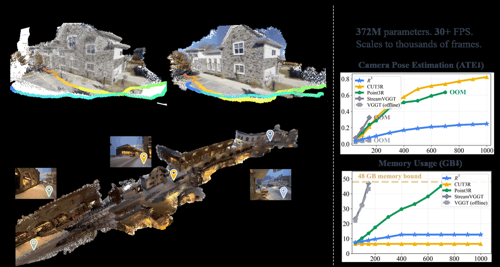
*Fig. 1 — 372M 파라미터, 20+ FPS, bounded memory(고정 메모리)로 무제한 길이 스트림을 처리한다는 논문의 자기 소개.*

---

## 🎯 핵심 기여 (Contributions)

> 이 절을 두는 이유: 이 논문은 구조 변경이 거의 없어서, "그럼 뭘 한 건가"를 세 줄로 못 박아 두지 않으면 기여가 흐려지기 때문.

1. **feed-forward 3D 복원을 pairwise relative-pose regression(쌍 단위 상대 자세 회귀)으로 재정의.** 고정된 전역 좌표계 의존을 줄이고, 전역 조립을 신경망 밖 후처리로 밀어냄. N프레임에서 O(N²)개의 감독 신호(간선)를 얻음.
2. **rotation/translation 신뢰도를 분리 예측하는 경량 MLP**를 도입하고, **같은 신뢰도를 세 곳에 재사용** — 학습 손실 가중치, 스트리밍 자세 융합 가중치, 키프레임 뱅크 관리.
3. **하나의 causal 체크포인트로 두 모드**를 지원. 테스트 시 attention 마스크만 바꾸면 bounded-memory streaming ↔ full-context offline 전환. 재학습도, 두 번째 모델도 불필요.

---

## 🧩 주요 알고리즘 설명

> 이 절을 두는 이유: 이 논문의 알고리즘은 "MLP 하나 + 가중평균"이 전부라 짧지만, **좌표계 관례와 신뢰도 변환식이 논문과 코드에서 다르게 쓰여** 있어 정확히 짚어두지 않으면 코드를 읽을 때 반드시 헤매기 때문.

### 5.0 세 가지 자세 패러다임 비교

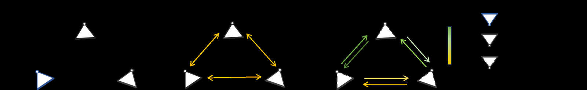
*Fig. 2 — (a) VGGT: 첫 카메라를 월드 원점으로 고정하고 거기서 뻗어나가는 간선만 감독. (b) π³: 모델이 좌표계를 고르되 모든 쌍을 **균일 가중치**로 감독. (c) R³: 전역 자세 헤드를 쓰지 않고, 모든 방향성 쌍 (i, j)을 **학습된 간선별 신뢰도**로 감독 → 완전 연결 방향성 pose graph.*

| 속성 | VGGT | π³ | **R³** |
|---|---|---|---|
| Relative Pose를 **출력**하는가 | ✗ | ✗ | **✓** |
| Relative Loss를 쓰는가 | ✗ | ✓ | ✓ |
| 모든 쌍(all-pair) 간선 | ✗ | ✓ | ✓ |
| Learned Confidence | ✗ | ✗ | **✓** |

π³와의 차이가 헷갈리기 쉬운데, π³는 **손실 함수만** 상대적으로 바꿨고 **출력은 여전히 한 좌표계의 전역 자세 집합**입니다. 그래서 translation 크기 폭발 문제는 그대로 남습니다.

### 5.1 pairwise pose head — 이 논문의 전부

*왜 이 절이 필요한가: 논문이 말하는 "lightweight MLP"가 실제로 얼마나 가벼운지, 무엇을 먹고 무엇을 뱉는지 확정해야 나머지가 다 따라오기 때문.*

DA3 백본이 프레임마다 camera token(카메라 토큰) z_i를 하나씩 뱉습니다. 두 토큰을 **그냥 옆으로 이어붙여(concatenate)** MLP에 넣고 4개를 받습니다:

```
(상대회전 q̂[i→j],  상대이동 t̂[i→j],  회전신뢰도 c_R[i→j],  이동신뢰도 c_T[i→j])
    = MLP_rel( [z_i ; z_j] )
```

즉 "i의 좌표계에서 봤을 때 j가 어디에 어떤 방향으로 있는가" + "그 답을 얼마나 믿어도 되는가 2개". focal length(초점거리)는 별도의 작은 per-frame(프레임별) 헤드가 토큰 하나에서 뽑습니다.

**코드 실체** (`depth_anything_3/model/cam_dec.py:78-90`, `CameraDecRel`):

```python
self.rel_backbone = nn.Sequential(
    nn.Linear(2048*2, 2048), nn.ReLU(),   # 토큰 두 개 concat → 4096 입력
    nn.Linear(2048, 2048), nn.ReLU(),
)
self.fc_rel_t      = nn.Linear(2048, 3)   # 상대 이동
self.fc_rel_qvec   = nn.Linear(2048, 4)   # 상대 회전 (quaternion)
self.fc_rel_conf   = nn.Linear(2048, 1)   # ⚠ split 모드에서는 "회전" 신뢰도
self.fc_rel_conf_t = nn.Linear(2048, 1)   # 이동 신뢰도
```

정말로 2층 MLP + 선형층 4개가 전부입니다. **논문 주장 그대로**입니다.

> ⚠ **이름 함정.** `fc_rel_conf`인데 split 모드에서는 `rel_conf_r = self.fc_rel_conf(...)` — 즉 **rotation** 담당입니다(`cam_dec.py:243`). 옛 shared-confidence 체크포인트 호환을 위해 `_load_from_state_dict`가 옛 `fc_rel_conf` 가중치를 `fc_rel_conf_t`로 복사하기 때문에 생긴 역사적 잔재입니다.

**입력이 raw 토큰이 아니다.** 코드는 `feat = self.backbone(feat)` — 즉 절대 자세 헤드의 공유 2층 MLP를 한 번 통과시킨 hidden feature를 쌍으로 만듭니다(`cam_dec.py:193, 203, 302-304`). 논문 식의 z_i는 엄밀히는 "백본 토큰"이 아니라 "abs 헤드 trunk를 거친 특징"입니다.

### 5.2 왜 신뢰도를 회전/이동으로 쪼개는가

*왜 이 절이 필요한가: 이게 논문에서 유일하게 "설계 선택"이라 부를 만한 부분이고, 근거가 부록에 실측으로 들어 있기 때문.*

> 카메라가 제자리에서 빙 도는 경우(pure rotation, 순수 회전) — 회전은 아주 잘 맞지만 이동량은 거의 0이라 parallax(시차)가 없어 추정이 불가능합니다. 신뢰도가 하나뿐이면 "이 쌍은 믿지 마"라고 하는 순간 **멀쩡한 회전 정보까지 버려집니다.**

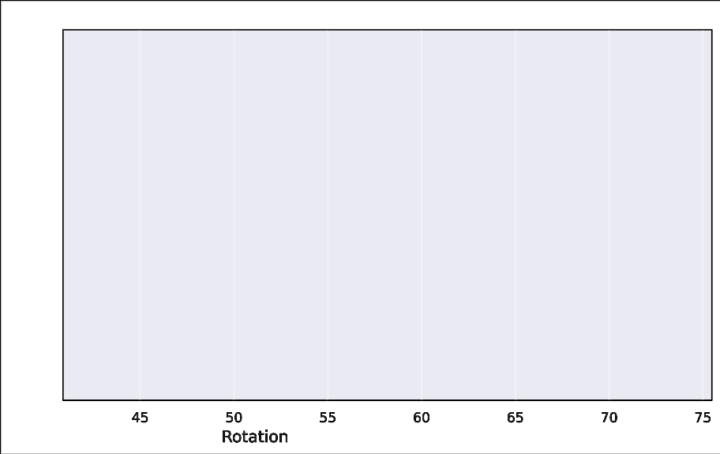
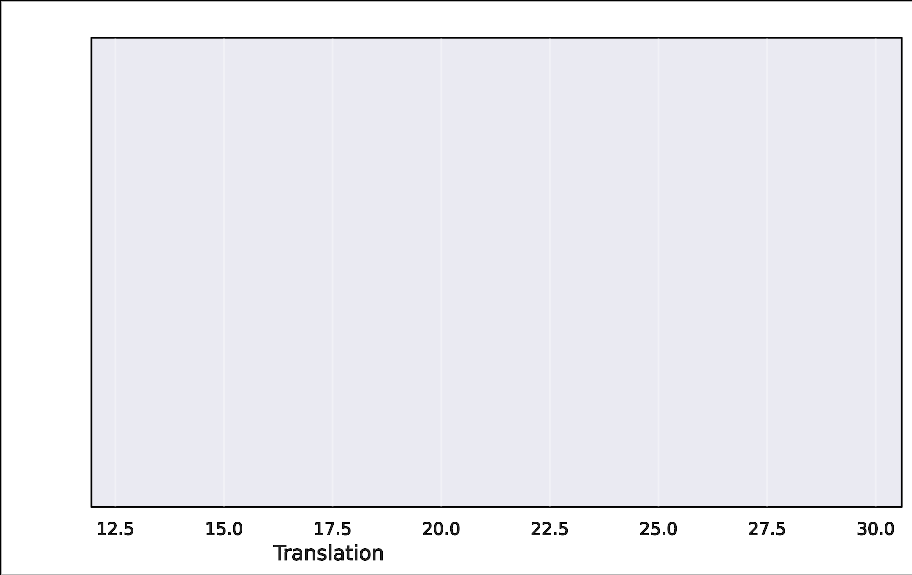
*Fig. 8 — ScanNet 20개 장면의 모든 쌍을 예측 신뢰도의 등질량 분위구간(equal-mass quantile bin)으로 묶은 것. 실선 = 구간별 평균 자세 오차, 음영 = 구간 내 분산. 신뢰도가 올라갈수록 평균 오차와 분산이 **둘 다** 줄어든다.*

이 그림이 "학습된 신뢰도가 loss 가중치를 넘어 **실제 pair reliability(쌍 신뢰성)를 예측한다**"는 유일한 직접 증거입니다. 그리고 rotation 신뢰도가 translation보다 높은 수치대에 몰려 있고 오차도 더 낮아, **비대칭이 실측으로 확인**됩니다.

### 5.3 global aggregation — 목격자 여러 명의 가중평균

*왜 이 절이 필요한가: 상대 간선만으로는 점군을 못 만든다. 결국 모든 카메라를 하나의 좌표계로 올려야 하고, 그 다리를 놓는 게 이 절이기 때문.*

말로 풀면:

> 1번 프레임을 원점(단위행렬)으로 놓는다. 새 프레임 j가 오면, **이미 위치가 확정된 참조 프레임 i마다** 후보 자세를 하나씩 만든다 — "i의 확정 자세"에 "i→j 상대 이동"을 이어 붙이면 j의 후보가 나온다. 참조가 30개면 후보 30개.
> 그다음 신뢰도로 **softmax 가중평균**한다. 이때 **회전은 회전 신뢰도로, 이동은 이동 신뢰도로 따로** 평균낸다. quaternion은 부호를 맞춘 뒤 더하고 다시 길이 1로 정규화한다.

논문 식 (camera-to-world 관례):
```
q_j^(i) = q_i ⊗ q̂[i→j]          # ⊗ 는 quaternion 곱
t_j^(i) = t_i + q_i( t̂[i→j] )   # q_i(·) 는 벡터를 q_i로 회전
```

**⚠ 코드는 반대 관례를 씁니다** (`R3/utils/pose_utils.py:169-177`, world-to-camera):
```python
out_rot   = rel_rot @ abs_rot
out_trans = (rel_rot @ abs_trans).squeeze(-1) + rel_pose_enc[..., :3]
```
**수학적으로 둘 다 옳습니다** — 같은 연산을 서로 역인 관례로 쓴 것뿐입니다. 하지만 논문 식을 보고 코드를 읽으면 곱셈 순서가 뒤집혀 보여 "버그다!"라고 착각하기 쉽습니다. **초보자가 이 코드를 고칠 때 가장 조심할 지점**입니다.

**top-K는 정확도 장치가 아니라 효율 상한**입니다. 논문 부록 E.1이 명시하듯, 전부 평균내는 게 항상 제일 좋고 top-K는 계산량을 아끼려는 캡입니다. 코드 기본값도 `topn_conf=1000`(사실상 전부)입니다(`R3/models/r3.py:140`).

### 5.4 causal streaming — 활성 컨텍스트와 키프레임 뱅크

*왜 이 절이 필요한가: 상대 자세 아이디어만으로는 메모리가 여전히 무한히 자란다. 프레임당 비용을 상수로 묶는 장치가 이 절이기 때문.*

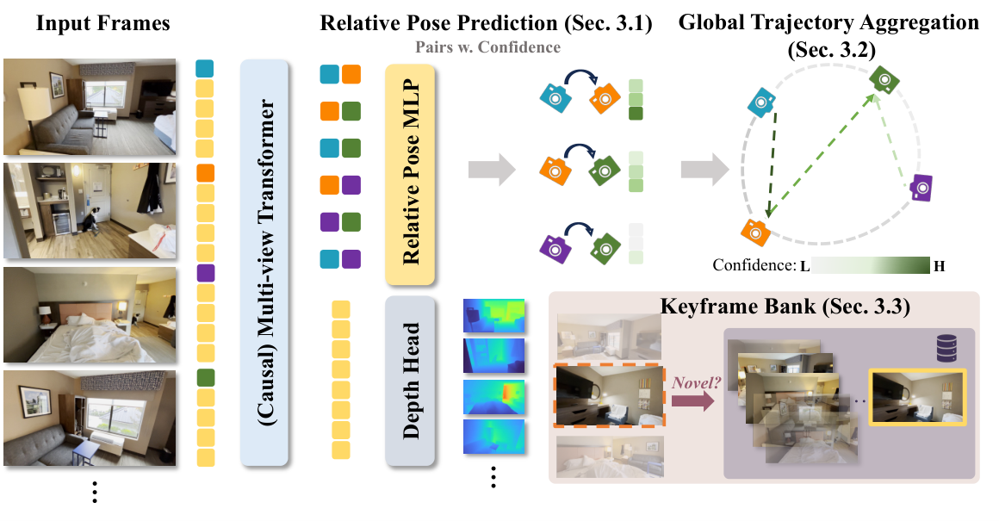
*Fig. 3 — causal 백본이 프레임마다 카메라 토큰 하나를 뽑고, 경량 pairwise 헤드가 방향성 간선과 신뢰도 2개를 예측하고, 그 간선들이 신뢰도 가중으로 궤적에 융합되고, 뱅크가 컨텍스트를 고정 크기로 유지한다.*

**활성 컨텍스트 C_t = {1번 프레임} ∪ {키프레임 뱅크 B_t}.** 새 프레임은 이 집합하고만 쌍을 맺으므로 프레임당 비용이 고정입니다.

| 규칙 | 내용 | 논문 값 | **코드/데모 값** |
|---|---|---|---|
| **추가 (novelty)** | 새 프레임의 pre-attention 백본 토큰(cross-frame 상호작용 **전**)과 뱅크의 최대 코사인 유사도가 tau보다 **작으면** 채택 | tau = 0.98 | **0.985** |
| **강제 추가** | Δ_max 프레임 동안 추가가 없으면 강제 삽입 (장면이 안 변할 때 정체 방지) | Δ_max = 20 | **30** |
| **제거 (culling)** | 뱅크가 꽉 차면 **유용도(utility) u_j 최소**인 것 제거. 아래 상세 참조 | M_max = 100 | **100** ✓ (단 **공식은 미구현**, 7.1 참조) |

**culling 공식 상세.** 뱅크 상한이 100장인데 101번째가 들어오려 하면 하나를 내보내야 합니다. 논문의 규칙은:

```
유용도  u_j = d_j · c_j        →  u_j 가 가장 작은 프레임을 제거 (1번 프레임은 제외)

d_j = min over i≠j  ( 1 − cos(tok_i, tok_j) )        # distinctiveness(고유성)
c_j = max over i≠j  ( (c_R[i→j] + c_T[i→j]) / 2 )    # 최강 쌍 신뢰도
```

| 항 | 직관 | 작아지는 경우 |
|---|---|---|
| **d_j** (고유성) | "나랑 제일 닮은 애랑도 얼마나 다른가" | 다른 키프레임과 거의 같은 그림 = **중복** |
| **c_j** (신뢰도) | "나는 최소한 한 명하고는 확실한 자세 연결이 있는가" | 아무하고도 자세를 못 맞춤 = **잡음** |

**곱셈인 것이 핵심**입니다 — 둘 중 하나만 나빠도 버려집니다. 중복 프레임(d_j 작음)도, 독특하지만 연결이 없는 프레임(c_j 작음)도 탈락하고, **독특하면서 연결도 튼튼한 프레임만** 살아남습니다.

이 뱅크는 고전 SLAM의 keyframe database(PTAM, ORB-SLAM, DSO)와 역할이 같습니다. 다만 손으로 튜닝한 translation/rotation/covisibility 임계값 대신 **학습된 토큰 유사도 + 자세 헤드 신뢰도**로 대체했다는 게 주장입니다.

**train/inference 길이 격차 메우기.** 학습은 최대 32프레임인데 배포는 수백 프레임입니다. 엄격한 novelty 임계값이 **유효 컨텍스트 길이를 학습 영역 근처로 묶어주기** 때문에 격차가 완화된다는 것이 논문의 설명입니다.

### 5.5 outlier gate와 segment reset

*왜 이 절이 필요한가: 모션블러·장면 전환 프레임 하나가 뱅크에 들어가면 이후 모든 자세가 오염된다. 그걸 막는 장치이자, 논문 4.4절 robustness 결과의 정체이기 때문.*

**이상치 거부.** 스트림 첫 N_cal 프레임으로 "평상시 신뢰도 기준선"을 캘리브레이션하고, 이후 프레임의 평균 쌍 신뢰도가 기준선의 tau_out배 아래면 거부합니다. 거부된 프레임은 — 이미 백본을 통과한 뒤(토큰이 있어야 점수를 매길 수 있으므로) — **KV 캐시에서 통째로 제거**되고, 뱅크에도 안 들어가고, 간선도 안 만들고, 절대 자세도 안 받습니다.

**세그먼트 리셋.** N_rej번 연속 거부되면 "loss of track(트래킹 실패)" 선언 → 캐시·뱅크를 비우고 새 구간 시작. 앞 구간의 3~10프레임을 **bridge(다리)**로 겹쳐 다시 돌립니다. 브릿지 프레임 b는 앞 구간의 절대 자세를 들고 있으므로, 새 프레임 j의 절대 자세는 그냥 곱셈 한 번으로 나옵니다 — **Sim(3)이나 SE(3) 정합이 필요 없습니다.** 스케일 드리프트만 별도로, metric depth 모델로 각 구간 첫 프레임 깊이를 정렬해 스칼라 하나로 흡수합니다.

| 상수 | 논문 값 | 코드 대응 | 코드 기본값 |
|---|---|---|---|
| tau_out (거부 임계 비율) | **0.15** | `evict_low_conf_threshold_pct` | **0.0 = 비활성** ⚠ |
| N_cal (캘리브레이션 프레임) | **3** | `evict_low_conf_warmup_frames` | 3 ✓ |
| N_rej (연속 거부 → 리셋) | **3** | `fallback_drought_length` | 3 ✓ |
| (논문에 없음) | — | `fallback_drought_threshold_pct` | 50.0 / 프리셋 **45.0** |
| (논문에 없음) | — | `fallback_drought_warmup_frames` | 5 |

즉 코드에는 게이트가 **두 개**(프레임 거부 / 세그먼트 리셋)이고 임계값이 다릅니다. 자세한 함의는 7.4절.

### 5.6 full-context 모드와 PGO

*왜 이 절이 필요한가: "체크포인트 하나로 온라인·오프라인 둘 다"라는 셀링 포인트가 실제로 무엇을 켜고 끄는 것인지 확인해야 하기 때문.*

전체 클립이 있으면 **causal 마스크만 벗기면** 백본이 모든 프레임을 양방향으로 보고, pairwise 헤드를 모든 쌍 (i, j)에 질의할 수 있습니다. 재학습·추가 모델 불필요. 그다음 confidence-weighted PGO를 한 번 돌립니다:

```
min over {T_i}   Σ_(i,j)∈E  [ c_R[i→j] · Huber(회전 잔차) + c_T[i→j] · Huber(이동 잔차) ]
```
T_1은 고정, solver는 L-BFGS. **BA가 아닙니다** — 재투영도, 깊이 최적화도 없고 간선이 나르는 건 상대 자세 잔차와 스칼라 신뢰도뿐이라 매우 쌉니다.

### 5.7 학습 목적함수

*왜 이 절이 필요한가: "신뢰도가 왜 저절로 학습되는가"가 이 논문에서 유일하게 비자명한 부분이기 때문.*

전체 손실 = 카메라 손실 + 깊이 손실.

**카메라 손실** (쌍마다, α = 0.2):
```
L_rot(i,j)   = c_R · (회전 L1 잔차)  − α·log c_R
L_trans(i,j) = c_T · (이동 L1 잔차)  − α·log c_T
```
두 항이 서로 당깁니다 — 오차가 큰데 신뢰도를 높이면 첫 항이 커져 손해라 **신뢰도를 낮추고**, 그렇다고 0으로 만들면 −log 항이 무한대라 **붕괴가 방지**됩니다. 결과적으로 잔차가 작은 쌍에 높은 신뢰도가 붙습니다. causal 체크포인트에서는 과거→현재의 하삼각 쌍 집합에 대해 평균내고, focal length는 **가중치 없는 순수 L1** 항을 따로 더합니다.

**깊이 손실.** 예측과 정답을 각각 자기 프레임의 median(중앙값)으로 나눠(scale ambiguity 제거) L1 비교, 픽셀별 신뢰도 Σ_p로 가중, 같은 −α·log Σ_p 정규화. 정답은 합성 데이터면 GT, 실제 데이터면 **얼린 DA3의 출력**(teacher distillation, 교사 증류)입니다.

> ⚠ **코드에는 논문에 없는 +1 오프셋이 있습니다.** `R3/training/loss/utils.py:462-463`가 `c = softplus(logit) + 1` — 즉 학습 신뢰도가 **1 밑으로 못 내려갑니다.** 함의는 7.2절에서 자세히.

### 5.8 학습 설정

| 항목 | 논문 | 공개 config |
|---|---|---|
| 백본 | DA3-Large, **대부분 freeze** | `freeze: global, cam_dec` — 8번 이후 홀수 블록(global attention) 8개 + cam_dec만 학습 |
| trainable(학습 가능) | ~110M / 372M | README **~121M / ~423M** (실측 일치, 7.6 참조) |
| Stage 1 | DA3-Large → frame-causal 절대자세 체크포인트, 15k iters, lr 1e-4 고정 | ❌ **config 없음** |
| Stage 2 | 상대자세 헤드, 25k iters, lr 1e-4 → cosine → 1e-5, grad accum 2 | lr **1e-5** 시작, LinearWarmupCosine, accum 2 ✓ |
| 뷰 수 | 4–32 (후반부에 32로 확장) | `r3`: 4–32 ✓ / `r3_long`: 32–100 |
| 정밀도/메모리 | bf16-mixed, gradient checkpointing, FlexAttention causal | ✓ 전부 일치 |
| GPU당 패킹 | teacher 없으면 ~200뷰, 있으면 ~96뷰 / 48GB | `max_num_of_images_per_gpu: 192` |
| 신뢰도 활성함수 | softplus | ✓ (단 학습에만 +1) |

---

## 📊 실험 요약

> 이 절을 두는 이유: 이 논문의 설득력은 대부분 "작은 모델이 큰 모델을 이긴다"와 "길어져도 안 무너진다" 두 표에서 나오므로, 그 두 개를 먼저 봐야 하기 때문.

### 6.1 카메라 자세 정확도 (논문 Table 2)

*작은 모델이 정말 큰 모델을 이기는지 확인하는 메인 실험.*

| 방법 | #Params | Sintel ATE | Sintel RPE-T | Sintel RPE-R | TUM-dyn ATE | ScanNet ATE |
|---|---|---|---|---|---|---|
| VGGT † (오프라인) | 1.26B | 0.172 | 0.061 | 0.471 | 0.012 | 0.035 |
| DA3-Large † (오프라인) | 385M | 0.140 | 0.059 | 0.450 | 0.013 | 0.039 |
| **R³ †** (full context) | 372M | **0.130** | **0.047** | 0.523 | 0.012 | 0.037 |
| Spann3R | — | 0.329 | 0.110 | 4.471 | 0.056 | 0.096 |
| CUT3R | 793M | 0.213 | 0.066 | 0.621 | 0.046 | 0.099 |
| Point3R | — | 0.351 | 0.128 | 1.822 | 0.075 | 0.106 |
| StreamVGGT | 1.26B | 0.251 | 0.149 | 1.894 | 0.061 | 0.161 |
| STream3R | 1.26B | 0.213 | 0.076 | 0.868 | 0.026 | 0.052 |
| TTT3R | 793M | 0.201 | 0.063 | 0.617 | 0.028 | 0.064 |
| ZipMap-stream ∗ | 1.40B | 0.159 | 0.065 | 0.750 | — | — |
| **R³** (streaming) | **372M** | **0.115** | 0.068 | **0.548** | **0.018** | **0.038** |

(† = 오프라인/전체 시퀀스, ∗ = 논문 인용치)

**스트리밍 R³가 1.26B 오프라인 VGGT보다도 Sintel ATE가 좋습니다**(0.115 vs 0.172). 파라미터는 1/3.4. 스트리밍 블록에서 유일하게 밀리는 게 Sintel RPE-T(단기 이동)입니다.

### 6.2 점군 복원 (논문 Table 3)

*자세가 좋다고 기하가 좋다는 보장은 없으니, 실제 점군 품질로 확인하는 실험.*

CUT3R 프로토콜(7-Scenes stride 200, NRGBD stride 100), Acc/Comp의 Mean 값:

| 방법 | 7-Scenes Acc↓ | 7-Scenes Comp↓ | 7-Scenes NC↑ | NRGBD Acc↓ | NRGBD Comp↓ | NRGBD NC↑ |
|---|---|---|---|---|---|---|
| VGGT † | 0.087 | 0.091 | 0.787 | 0.073 | 0.077 | **0.910** |
| DA3-Large † | 0.086 | 0.088 | 0.756 | 0.045 | 0.061 | 0.896 |
| **R³ †** (full context) | **0.081** | **0.070** | 0.770 | **0.038** | **0.044** | 0.887 |
| CUT3R | 0.126 | 0.154 | 0.727 | 0.099 | 0.076 | 0.837 |
| STream3R | 0.122 | 0.110 | 0.746 | 0.057 | **0.028** | **0.910** |
| StreamVGGT | 0.129 | 0.115 | 0.751 | 0.084 | 0.074 | 0.861 |
| **R³** (streaming) | **0.092** | 0.093 | 0.755 | 0.047 | 0.050 | 0.883 |

7-Scenes에서 스트리밍 R³가 선두, NRGBD에서는 STream3R와 엎치락뒤치락합니다. 같은 체크포인트로 full-context 스위치를 켜면 두 데이터셋 모두 Acc/Comp가 개선됩니다.

### 6.3 장기 시퀀스 확장성 (논문 Table 4) ⭐ 가장 인상적

*"메모리가 고정"이라는 주장이 정확도를 희생한 것인지 검증하는 실험. 48 GiB 예산 고정.*

7-Scenes, 프레임 수를 늘려가며:

| 방법 | 200 Acc↓ | 200 Comp↓ | 500 Acc↓ | 500 Comp↓ | 1000 Acc↓ | 1000 Comp↓ |
|---|---|---|---|---|---|---|
| Spann3R | 0.215 | 0.122 | 0.343 | 0.154 | 0.340 | 0.154 |
| CUT3R | 0.087 | 0.045 | 0.194 | 0.092 | 0.240 | 0.102 |
| Point3R | 0.041 | 0.023 | 0.056 | 0.031 | 0.068 | 0.025 |
| TTT3R | 0.027 | 0.023 | 0.065 | 0.030 | 0.126 | 0.050 |
| StreamVGGT | 0.038 | 0.029 | **OOM** | **OOM** | **OOM** | **OOM** |
| InfiniteVGGT | 0.046 | 0.031 | 0.040 | 0.024 | 0.061 | 0.035 |
| **R³** | **0.021** | **0.018** | **0.022** | **0.017** | **0.022** | **0.017** |

**R³만 평평합니다.** 200 → 1000프레임에서 Acc가 0.021 → 0.022로 사실상 변화 없음. 나머지는 무너지거나 OOM.

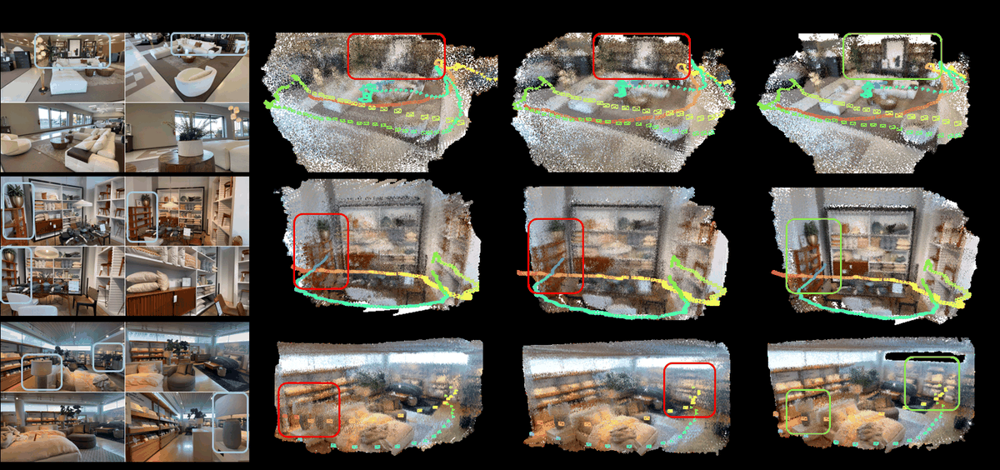
*Fig. 5 — in-the-wild(야외 실촬영) 클립에서 수백 프레임에 걸친 궤적·점군 정합성 정성 비교.*

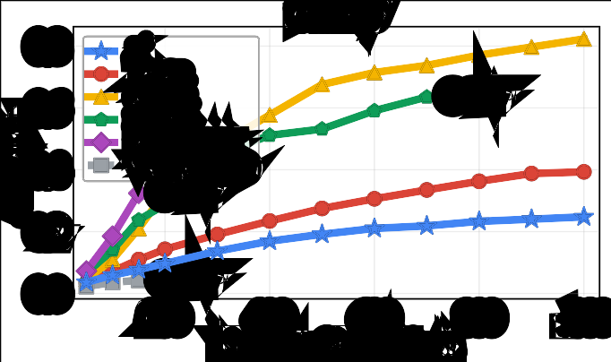
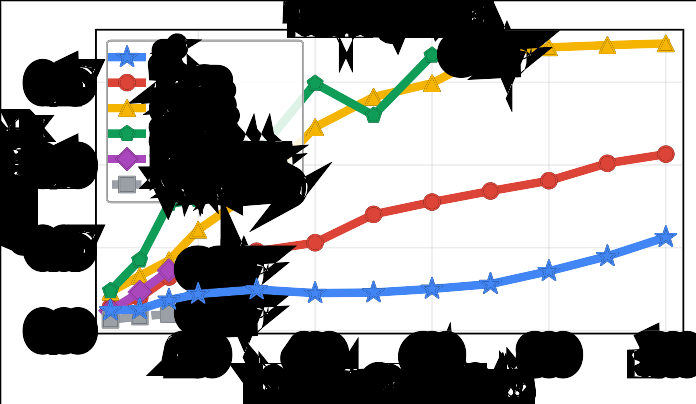
*Fig. 4 — 입력 프레임 수를 늘릴 때의 ATE. 베이스라인들은 누적 드리프트를 보이거나 OOM으로 끊기지만 R³는 완만하게 유지된다.*

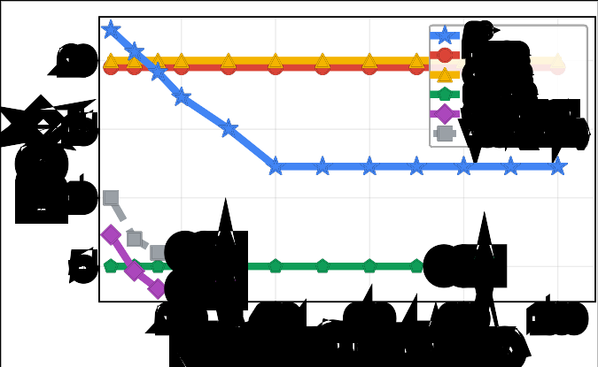
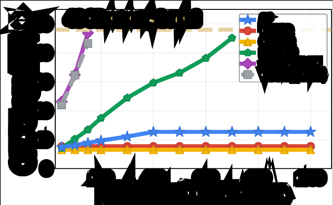
*Fig. 7 — 뷰 수 대비 추론 FPS(왼쪽)와 GPU 메모리(오른쪽). 전역 회귀 베이스라인의 O(N²) 증가가 R³에서는 bounded 증가 + 완만한 FPS 감소로 바뀐다.*

### 6.4 실외 장기 궤적 (논문 Table 5)

*실내 위주 벤치마크(TUM/ScanNet)를 벗어나, 넓은 baseline과 실외 장면에서도 되는지 보는 실험. DL3DV-Benchmark 25개 장면, 304–439프레임.*

| 방법 | ATE-norm (%) ↓ | ATE-RMSE ↓ | Rot RMSE (°) ↓ | Win rate |
|---|---|---|---|---|
| TTT3R (100프레임 reset 사용) | 4.91 | 0.601 | 5.65 | 1/25 |
| InfiniteVGGT | 2.85 | 0.367 | 3.06 | 0/25 |
| **R³** (reset 없이 단일 패스) | **1.16** | **0.155** | **1.79** | **24/25** |

25개 중 24개 1위, 평균 ATE-norm이 차선책의 40% 수준입니다.

### 6.5 강건성 (논문 Table 6)

*학습된 신뢰도가 "loss 가중치"를 넘어 실제 이상치 탐지기로 쓸 수 있는지 검증하는 실험. Robust-VGGT 프로토콜, Small/Medium/Large 평균, 시드 10개.*

| 방법 | ETH3D ATE↓ | ETH3D SR↑ | RobustNeRF ATE↓ | RobustNeRF SR↑ |
|---|---|---|---|---|
| RobustVGGT-A † | 0.733 | 0.914 | 0.138 | 0.641 |
| RobustVGGT-F † | 0.763 | 0.985 | 0.138 | 0.586 |
| R³ (게이트 끔) | 0.998 | – | 0.199 | – |
| **R³ + reject** | **0.244** | **1.000** | **0.152** | **0.986** |

Robust-VGGT는 여러 번 훑는 **오프라인 다중 패스 검출 단계**가 필요한데, R³는 **온라인 한 패스**에서 잡아냅니다. "무조건 거부해서 SR만 올린 것 아니냐"는 반박에 대비해 BFS도 보고 — ETH3D 0.84/0.89/0.93, RobustNeRF 0.999/0.992/0.996. **성실한 태도**입니다.

### 6.6 핵심 ablation — "상대 자세 자체가 좋은가?" (논문 Table 7) ⭐

*aggregation 같은 후처리를 걷어내고, 예측 대상과 손실만 바꿨을 때도 이득이 나는지 확인하는 통제 실험. 백본·데이터·최적화 예산 전부 고정.*

| 변형 | Sintel ATE | Sintel RPE-T | Sintel RPE-R | ScanNet ATE | ScanNet RPE-T | ScanNet RPE-R |
|---|---|---|---|---|---|---|
| **Full-context** (VGGT init, 64k iters) | | | | | | |
| 백본 직접 회귀 (Pi3 loss) † | 0.1583 | 0.0841 | 0.9492 | 0.0683 | 0.0195 | 0.5143 |
| 백본 + **R³ 상대 타깃/손실** † | **0.1370** | **0.0757** | **0.7282** | **0.0604** | **0.0189** | **0.5039** |
| **Streaming** (5k iters, 절대자세 사전학습 백본, 헤드 리셋) | | | | | | |
| 백본 직접 회귀 (VGGT abs loss) | **0.141** | 0.079 | 1.56 | 0.063 | 0.026 | 1.33 |
| 백본 + **R³ 상대 타깃/손실** | 0.146 | **0.066** | **0.67** | **0.052** | **0.021** | **0.93** |

특히 회전 오차(RPE-R)에서 격차가 큽니다(1.56 → 0.67). 스트리밍 블록은 **절대 자세로 사전학습된 백본**을 써서 베이스라인에 유리하게 세팅했는데도 R³ 쪽이 이깁니다. 즉 **복잡한 aggregation을 적용하기 전에도 상대 자세 목표 자체가 더 좋은 기하 사전지식**이라는 뜻입니다.

### 6.7 부수 ablation (논문 Table 8/9, 부록 I)

*aggregation 전략과 임계값이 얼마나 민감한지, 그리고 자세 학습이 깊이 품질을 해치지 않는지 확인.*

**aggregation 전략 (평균 ATE):** Top-1 0.0624 → Top-5 0.0586 → Top-10 0.0574 → **All-avg 0.0572** → +PGO 0.0567. K가 클수록 좋고, PGO는 작지만 일관된 추가 이득.

**novelty 임계값 tau (ScanNet ATE, 프레임 수별):**

| tau | 100 | 300 | 500 | 800 | 1k |
|---|---|---|---|---|---|
| 0.96 | 0.066 | 0.200 | 0.270 | 0.334 | 0.357 |
| 0.97 | 0.061 | 0.180 | 0.250 | 0.306 | 0.332 |
| **0.98** | 0.061 | **0.171** | **0.245** | **0.295** | **0.318** |
| 0.99 | 0.068 | 0.172 | 0.246 | 0.300 | 0.329 |

0.96은 장기 스트림에서 뱅크를 굶기고, 0.99는 중복 프레임과 잡음 간선을 너무 받아들입니다. **논문 결론은 0.98**인데 코드 기본값은 0.985입니다.

**full-attention fine-tuning 참조 (Table 8, ATE):** DA3-Large 0.140/0.013/0.039 → R³ full-attn 0.117/0.011/0.035. 다만 저자 스스로 *"통제된 ablation이 아니라 backbone calibration reference"*라고 명시 — DA3-Large는 훨씬 많은 데이터로 학습됐기 때문. **과장하지 않은 좋은 태도**입니다.

**video depth estimation (부록 I):**

| 방법 | Sintel AbsRel↓ | Bonn AbsRel↓ | KITTI AbsRel↓ |
|---|---|---|---|
| DA3-Large (teacher) | 0.460 | 0.106 | **0.122** |
| **R³** | **0.410** | **0.102** | 0.130 |

자세 목적함수를 얹어도 백본의 깊이 품질이 유지됩니다. (사실 깊이 헤드가 얼려 있으므로 당연한 결과 — 7.5절 참조.)

### 6.8 한계 (부록 J, 논문이 스스로 인정)

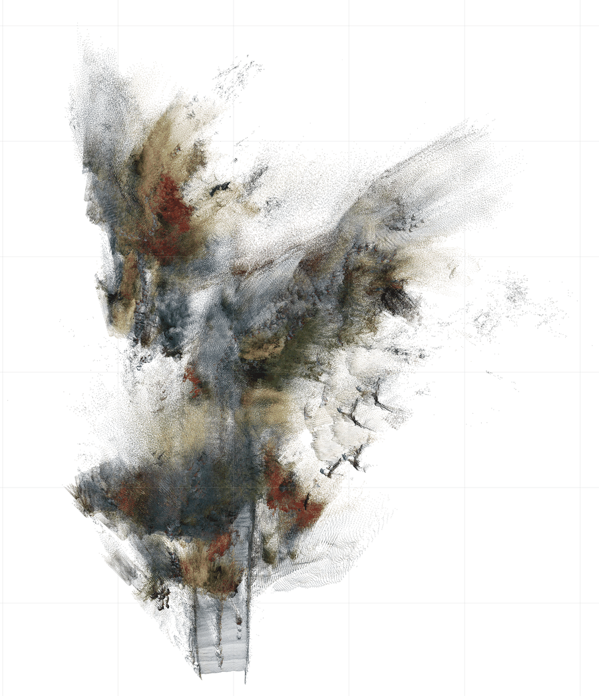
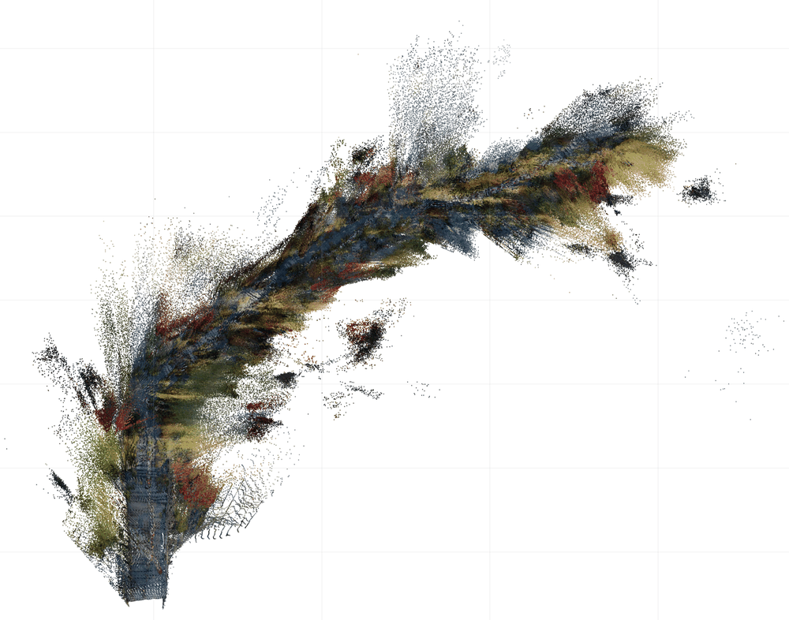
*Fig. 9 — 장기 스트리밍의 조감도(bird's-eye view). (a) reset 없이는 궤적이 결국 드리프트하고 카메라를 놓친다. (b) 주기적 reset이 트랙을 회복시킨다.*

- 372M / GPU 6장에서 멈췄고, 더 큰 백본이나 데이터는 탐색 안 함
- 뱅크가 여전히 손으로 정한 임계값들(tau, Δ_max, M_max, outlier 상수)에 의존 — 도메인이 크게 다르면 재튜닝 필요
- **reset 없이는 아주 긴 스트림에서 드리프트**하고, 과거 토큰을 revisit(재방문)할 수 없어 먼 시점·가림·장기 시퀀스에서 기하 불일치가 남음

---

## 🔧 공식 코드 리뷰

> 이 절을 두는 이유: 이 논문은 아이디어와 결과가 좋은데, **논문에 쓴 시스템과 공개한 시스템이 미묘하게 다릅니다.** 재현이나 이식을 시도하기 전에 그 차이를 알아야 시간을 안 버리기 때문.

### 7.0 저장소 구조와 파라미터 실측

```
R3/
├─ depth_anything_3/          ← DA3 원본을 통째로 vendoring(복사 내장)
│  └─ model/cam_dec.py        ← ★ CameraDecRel = 논문의 그 MLP
├─ R3/models/
│  ├─ r3.py                   ← 메인 wrapper (생성자 인자 69개!)
│  ├─ r3_wrapper/online_inference.py   ← 100KB(!) 스트리밍 루프 본체
│  ├─ online/
│  │  ├─ fallback.py (40KB)   ← segment reset + KeyframeRegistry
│  │  ├─ kv_cache.py          ← 캐시 pruning
│  │  ├─ revisit.py           ← ★ 죽은 코드 (7.7)
│  │  └─ scale_estimation.py  ← metric scale 정렬
│  ├─ utils/pose_utils.py     ← ★ greedy 조립 + PGO
│  └─ training/               ← 학습 코드 (비상업 라이선스)
├─ infer.py (28KB) / demo.py / view.py (45KB, Viser 뷰어)
```

`r3.safetensors` 596개 텐서 실측 = **정확히 372,623,893개**:

| 구성요소 | 파라미터 | 비중 |
|---|---|---|
| DINOv2 ViT-L 백본 | 304.374M | 81.7% |
| DualDPT 깊이 헤드 | 47.229M | 12.7% |
| cam_dec (자세 헤드 전체) | 21.021M | 5.6% |
| └ 그중 `rel_backbone` (신규 추가분) | **12.59M** | 3.4% |

**논문의 "372M"은 정확합니다.** 반올림 장난이 없습니다. 최근 논문 중 이렇게 정직한 경우가 흔치 않습니다(참고: [[PAPER_GLM-OCR]]은 0.9B라 해놓고 실측 1.325B). `r3_long.safetensors`도 동일한 372,623,893개입니다.

### 7.1 🔴 논문의 culling 공식이 코드에 **없다**

논문 3.3.1절과 부록 C는 뱅크가 꽉 찼을 때 **유용도 = 고유성(distinctiveness) × 신뢰도**로 제거한다고 수식까지 써서 명시합니다. 그런데 실제 코드(`R3/models/online/fallback.py:996-1011`):

```python
def _evict_lowest_score(self):
    ...
    worst_frame_id = min(self._keyframes.keys(),
        key=lambda frame_id: (float(self.score_provider(frame_id)), frame_id))
```

`score_provider`는 `state.frame_scores[fid]` — **신뢰도 항 하나뿐**입니다. **고유성 항 d_j가 코드 어디에도 없습니다.**

결정적 정황: `R3/models/online_utils.py:42`의 `log_online_memory_selection`이 `candidate["novelty"]`, `candidate["utility"]`를 출력합니다 — **논문 공식을 구현했던 흔적**입니다. 그런데 이 함수는 저장소 전체에서 **정의 1곳, 호출 0곳**입니다. 유용도 계산 코드는 삭제되고 로깅 헬퍼만 고아로 남았습니다.

부수 차이:
- 논문의 "첫 프레임은 제거 대상 제외"도 `_evict_lowest_score`에 없습니다. 다만 `kv_cache.py`의 `pinned_anchor_ids`가 별도 경로로 프레임 0을 KV 캐시에 붙잡아 두므로 실질적 사고는 안 납니다.
- 신뢰도 항의 정의도 다릅니다. 논문은 "뱅크 내 다른 프레임들과의 최대 쌍 신뢰도"인데, 코드는 "이 프레임이 메모리에 있는 동안 들어온 현재 프레임들에 대한 신뢰도의 **시간축 running max**"입니다.

논문의 핵심 세일즈 포인트가 "confidence를 세 곳에 재사용"인데, **그 세 번째(뱅크 관리)가 논문 수식대로 구현돼 있지 않습니다.**

#### 실질 영향 — "그럼 필터가 아예 안 되는 건가?"

**아닙니다.** R³의 필터는 3종류이고 빠진 건 하나뿐입니다.

| # | 필터 | 하는 일 | 코드 상태 |
|---|---|---|---|
| ① | **입장 필터** (novelty gate, tau=0.98) | 뱅크와 너무 비슷하면 **안 받음** | ✅ 구현됨 |
| ② | **이상치 필터** (outlier gate, tau_out=0.15) | 모션블러·장면전환 프레임을 **통째로 거부** | ⚠️ 구현됐지만 **기본 OFF** (7.4) |
| ③ | **퇴장 필터** (culling, u = d·c) | 뱅크가 꽉 찼을 때 **누구를 버릴지** | 🔴 **c만 있고 d 없음** |

중복 제거의 주력은 원래 ①입니다 — 애초에 안 받으면 버릴 일도 없습니다. 게다가 **논문 스스로 ③이 거의 안 걸린다고 씁니다** (부록 C): *"The keyframe-bank cap M_max is a secondary bound that **rarely fires** before this confidence trigger in practice."* 즉 뱅크가 100장을 채우기 전에 보통 segment reset이 먼저 터져 뱅크가 통째로 비워집니다.

**⭐ 그런데 빠진 d_j가 담당하던 게 정확히 c_j로는 못 잡는 케이스이고, 오히려 반대로 작동합니다.**

> 뱅크에 이미 있는 것과 **거의 똑같은 시점**의 프레임은 그 닮은 짝과 자세를 아주 쉽게 맞춥니다(baseline이 좁고 겹치는 영역이 넓음). → **신뢰도가 높습니다.**
> 반대로 멀찍이 떨어진 각도의 프레임은 자세 맞추기가 어렵습니다. → **신뢰도가 낮습니다.** 그런데 이런 wide-baseline 프레임이야말로 궤적을 잡아주는 귀한 프레임입니다.

**신뢰도만으로 버리면 버려야 할 중복이 살아남고, 지켜야 할 wide-baseline 프레임이 먼저 나갑니다.** 논문이 굳이 d_j를 곱한 이유가 이 역전을 막기 위해서인데, 그 항이 빠졌습니다.

게다가 **중복이 들어오는 문이 코드에 열려 있습니다** (`fallback.py:889-893`) — 정체 방지용 강제 삽입은 유사도 검사를 **건너뜁니다**:

```python
if self._frames_since_last_add >= self.max_interval:   # 30프레임
    self._store_keyframe(...)   # ← 유사도 검사 없이 무조건 삽입
    return
```

원래 시나리오는 "일단 넣고 나중에 d_j로 걸러낸다"인데 **그 나중이 없습니다.** 부수적으로 `_update_online_scores`의 `frame_scores[fid] = max(이전값, 새값)`는 **감쇠하지 않는 running max**라, 한 번 높았던 프레임은 쓸모가 없어져도 점수가 안 떨어져 잘 안 버려집니다(뱅크 ossification, 고착화).

**언제 실제로 문제가 되나:**

| 상황 | 영향 |
|---|---|
| 논문 벤치마크 (Sintel/TUM/ScanNet, segment reset 켜짐) | **거의 없음** — 뱅크가 100장을 못 채우고 리셋됨 |
| 카메라가 오래 정지·미세 이동 (실내 스캔, 삼각대) | **있음** — 강제 삽입으로 중복이 쌓이고 신뢰도가 높아 안 버려짐 |
| 같은 장소를 여러 번 지나감 | **있음** — 각 프레임은 입장 시엔 "새로웠"지만 뱅크 전체가 중복 클러스터화 |
| 리셋 없이 아주 긴 단일 패스 | **있음** — 뱅크가 실제로 꽉 차서 culling이 자주 실행됨 |

**처방:** `--mode local`/`long`처럼 fallback을 켜서 쓰면 대부분 드러나지 않습니다(논문 설정이 그렇습니다). 리셋 없이 장시간 돌릴 계획이면 `_evict_lowest_score`에 d_j를 직접 넣는 게 낫습니다 — `KeyframeRegistry`가 이미 `_get_similarity_vector()`로 각 키프레임의 정규화 벡터를 들고 있어서 **20줄이면 논문 공식을 복원할 수 있습니다.**

### 7.2 🔴 학습과 추론의 신뢰도 변환식이 다르다

| 위치 | 식 | 최솟값 |
|---|---|---|
| 학습 (`R3/training/loss/utils.py:462-463`) | `softplus(logit) + 1` | **1.0** |
| 추론 PGO (`R3/utils/pose_utils.py:81`) | `softplus(logit) + 1e-4` | **0.0001** |

**(a) 학습 신뢰도가 1 밑으로 못 내려간다.** 논문 손실 `c·ℓ − 0.2·log c`의 최적 c는 `0.2/ℓ`입니다. 오차 ℓ이 0.2보다 크면 최적 c가 1보다 작아야 하는데 `softplus+1`이 1에서 잘라버립니다. 결과적으로:

> **"나쁜 쌍"들은 전부 신뢰도 정확히 1로 뭉쳐서 서로 구분이 안 됩니다.** 학습된 신뢰도는 사실상 "좋은 쌍을 얼마나 더 올릴까"만 해상도가 있고, "나쁜 쌍을 얼마나 내릴까"는 못 합니다.

논문 부록 D.2의 "낮은 신뢰도 구간에서 분산이 크다"는 관찰과도 정합적입니다. DUSt3R 계열의 관행이긴 하지만(DUSt3R도 `conf = 1 + exp(x)`), **손실의 작동 원리 설명이 이 오프셋으로 절반쯤 바뀌므로 논문에 밝혔어야** 합니다. 논문에는 한 줄도 없습니다.

**(b) PGO 가중치가 학습보다 훨씬 공격적이다.** logit −5와 +5인 두 간선의 상대 비중이 학습 때는 약 6배(1.007 vs 6.007)지만 PGO에서는 약 747배(0.0067 vs 5.007)입니다. 같은 신뢰도인데 하류 소비자에 따라 100배 이상 다르게 해석됩니다.

### 7.3 🟡 softmax를 신뢰도가 아니라 **로짓**에 건다

논문 식은 "c_R, c_T의 softmax 정규화"라고 씁니다(c는 softplus를 통과한 양수 신뢰도). 코드(`R3/utils/pose_utils.py:182`):

```python
weights = torch.softmax(logits, dim=1)   # logits = softplus 이전 원시값
```

`softmax(softplus(x))`와 `softmax(x)`는 다릅니다. **후자가 지수적으로 훨씬 뾰족합니다.** 논문이 말하는 "모든 참조를 융합"이 실제로는 상위 몇 개에 훨씬 크게 쏠려 있을 가능성이 있습니다(Table 9에서 Top-1과 All-avg 차이가 0.0624 vs 0.0572로 작은 것과도 정합적). 버그는 아니고 합리적 엔지니어링 선택이지만, **논문 서술과 코드가 다른 연산**을 합니다.

같은 종류로, 통합 신뢰도도 논문은 `(c_R + c_T)/2`인데 코드는 `0.5*(logit_r + logit_t)` — **로짓 평균**입니다(`cam_dec.py:107`). softplus가 볼록함수라 두 값은 같지 않습니다.

### 7.4 🔴 공개 기본 설정에서 Table 6의 이상치 게이트가 **꺼져 있다**

`infer.py:248`의 `--evict_low_conf_threshold_pct` 기본값이 **0.0 = 비활성**이고, `demo.py`는 오히려 `--evict_low_conf_threshold 0`을 명시적으로 넘겨 확실히 꺼둡니다.

즉 **`--evict_low_conf_threshold_pct 15`를 직접 주지 않으면 Table 6의 "R³ + reject"를 재현할 수 없습니다.** (다행히 `--evict_low_conf_warmup_frames` 기본값 3은 논문 N_cal=3과 일치하므로, pct만 주면 됩니다.)

그리고 논문 부록 C는 "N_rej번 연속 거부되면 리셋"이라며 두 게이트를 하나로 서술하는데, 코드에서는 **서로 다른 임계값을 쓰는 별개 메커니즘**입니다 — 거부 게이트는 기준선의 15%(비활성), drought/reset 게이트는 45~50%(활성), warmup 프레임 수도 3 vs 5로 다릅니다.

### 7.5 🟡 깊이 헤드가 얼려 있다

논문 3.4절: *"The pairwise pose head **and depth head** are supervised with confidence-weighted residual losses"*, 그리고 *"Σ_p는 **학습된** 픽셀별 깊이 신뢰도"*.

코드: `freeze: global, cam_dec` — 깊이 헤드(47.2M)는 풀리지 않습니다. 학습 README도 명시합니다: *"local/frame-attention backbone blocks and **the depth head remain frozen**"*.

물론 gradient(기울기)는 얼린 헤드를 **통과해서** global 블록까지 흘러가므로 깊이 손실이 무의미하진 않습니다. 하지만 "깊이 신뢰도가 학습된다"는 서술은 정확하지 않습니다 — 그건 DA3에서 물려받은 값입니다. 부록 I에서 R³ 깊이가 DA3와 거의 같게 나오는 것(Bonn 0.102 vs 0.106)이 이걸 방증합니다.

### 7.6 🟡 학습 가능 파라미터 수치가 논문과 안 맞는다

- 논문 부록 F: *"roughly **110M** trainable out of the 372M"*
- 학습 README: *"Of the ~423M parameters, **~121M** are trainable"*
- **직접 계산**: ViT-L 블록 하나 ≈ 12.6M (attention 4×1024² + MLP 2×1024×4096). `alt_start=8` 이후 홀수 인덱스 = 9, 11, ..., 23 → **8개** → 100.7M. + cam_dec 21.02M − 동결된 `fc_t`/`fc_qvec`/`fc_abs_fov` 0.018M ≈ **121.7M**

README와 제 계산이 일치하고 **논문이 약 10% 낮게 적었습니다.** (423M은 학습 시에만 쓰는 `cam_enc`가 포함된 수치. 추론 config에는 cam_enc가 없어 372M.)

### 7.7 🟡 죽은 코드 3건

1. **`revisit.py`의 `run_online_revisit_loop`** (약 120줄): 저신뢰 프레임을 시퀀스 끝으로 옮겨 재생하는 메커니즘. `R3/models/online/__init__.py:20`에서 공개 API로 export까지 되는데 **호출자가 0개**입니다. 게다가 `r3_wrapper/constants.py`가 `online_revisit_*` 키들을 *"Legacy keys"*로 주석 달아 옵션 dict에서 뺐기 때문에, 지금 호출하면 `KeyError`로 죽습니다. (참고로 이건 causal 가정을 깨는 실험 기능이라 논문에 없는 게 맞습니다.)
2. **PGO의 focal length 항**: `weight_fl` 기본값이 0.25인데 정작 코드는 `loss = loss + 0.0 * rel_fov_err.mean()` — **0을 곱합니다**. `pose_utils.py:545, 685, 687` 세 군데 모두. `weight_fl` 파라미터는 아무 효과가 없습니다.
3. **`fc_abs_fov`**: 체크포인트에 가중치가 들어 있는데 forward에서 호출부가 주석 처리돼 있습니다. `r3_wrapper/setup.py:94`가 *"fc_abs_fov is dead code (never called in forward)"*라고 스스로 인정합니다.

### 7.8 🟡 PGO 구현 세부

- 논문 부록 C는 *"with Huber losses H_δR, H_δT"* — 회전과 이동 **둘 다** Huber라고 씁니다. 코드는 이동만 `smooth_l1_loss(beta=0.1)`(=Huber)이고, **회전은 그냥 quaternion cosine 거리**입니다. Huber 아님.
- `pose_utils.py:496-498`: `if not keep_mask.any(): keep_mask = raw_edge_weights >= cutoff` — **같은 식을 두 번** 씁니다. 무의미한 fallback 분기(원래는 다른 조건이었을 것).
- `pose_utils.py:705`: `pgo_num_iters=100`인데 실제로는 `range(100 // 10)` = 10회 × L-BFGS 내부 `max_iter=15` = **최대 150회**. 이름과 실제가 다릅니다.
- greedy 조립(`_reconstruct_camera_sequence_greedy`)은 배치×시퀀스 **파이썬 이중 루프**입니다. 1000프레임이면 1000번 반복 + 매번 topk/softmax. GPU를 못 쓰는 구간입니다. (스트리밍 경로는 프레임당 후보만 다루므로 괜찮습니다.)

### 7.9 🟡 배포와 논문의 불일치

- **체크포인트가 2개인데 논문은 1개만 말한다.** `r3`(4–32뷰, 논문 보고치)와 `r3_long`(32–100뷰). 그런데 `--mode long`/`--mode strided` 프리셋은 **자동으로 `r3_long`을 씁니다.** 논문 본문의 "single causal checkpoint" 서술과 배포 현실이 다릅니다. (README는 이걸 정직하게 표로 밝힙니다.)
- **long/strided 모드는 추가 모델이 필요하다.** `--metric_scale`이 켜지면 `depth-anything/DA3METRIC-LARGE`를 별도로 받아 씁니다. 즉 실제 장기 스트리밍 배포는 372M 하나가 아니라 **372M + metric 모델**입니다. 논문 부록 C에 "pretrained metric-depth model"이라고 한 줄 있지만, "1B급의 1/3" 자랑과 나란히 놓으면 다소 불공평한 비교입니다.
- **`demo.py`의 기본 모드가 `test`**이고 이건 `kv_cache_mode="all"` — **전체 KV를 다 들고 갑니다.** 논문의 bounded-memory 스트리밍이 아닙니다. 그냥 `python demo.py` 돌리면 논문 설정이 아닙니다.
- **키프레임 기본 모드가 `interval`**(10프레임마다 기계적으로). `demo.py`가 명시적으로 `novelty`를 넘겨 정상 동작하지만, `infer.py`를 직접 쓰며 이 플래그를 빼먹으면 **논문에 없는 고정 간격 방식**으로 돌아갑니다.

### 7.10 재현성 총평

| 항목 | 상태 |
|---|---|
| 추론 코드 | ✅ 공개 (Apache-2.0) |
| 체크포인트 | ✅ 공개 (r3, r3_long) |
| 학습 코드 + config | ✅ 공개 — 단 **비상업 연구용만** |
| **Stage 1** (causal 절대자세 적응, 15k iters) | ❌ **config 없음** |
| **평가 코드** | ❌ README TODO 미체크 |
| 학습률 | 논문 stage 2 = 1e-4→1e-5, 공개 config는 **1e-5 시작** |
| 학습 GPU 수 | 논문 6장 / README의 r3_long은 4장 |
| 데이터 | ❌ 미배포 (CUT3R 전처리 직접 필요, KITTI-360/TartanGround는 자체 스크립트 제공) |

README가 스스로 밝힙니다: *"The released r3 checkpoint was produced through an **internal multi-stage schedule**, so runs started from public DA3 weights may have differences."*

**정리하면 논문의 메인 체크포인트는 공개 설정만으로 재현 불가입니다.** 정직하게 고지한 건 높이 살 만하지만, 사실은 사실입니다. 그리고 **평가 코드가 없어서 Table 2~11의 어떤 숫자도 직접 검증할 수 없습니다.**

라이선스도 실무적으로 중요합니다: **추론은 Apache-2.0이지만, 학습 코드와 "그것으로 학습된 모델"은 DUSt3R/CroCo(CC BY-NC-SA) 계보 때문에 비상업 연구용**입니다.

### 7.11 실행 방법

```bash
conda env create -f environment.yml && conda activate r3
pip install -e .
# 체크포인트를 ckpt/r3.safetensors, ckpt/r3_long.safetensors 에 배치

# 논문 설정에 가장 가까운 실내 스트리밍
python demo.py --seq_path examples/indoor --mode local --no_viewer
# 장기/실외 (r3_long + metric 모델 자동 다운로드)
python demo.py --seq_path <video> --mode long
# 저장된 결과 다시 보기 (Viser 브라우저 뷰어)
python view.py --data_dir scratch/demo/<run_name>
```

주의: 기본 `--mode test`는 KV를 전부 유지하므로 논문 설정이 아닙니다. Table 6 강건성을 보려면 `--evict_low_conf_threshold_pct 15`를 수동으로 넣어야 합니다.

---

## 💬 Q&A

### Q1. π³도 상대 자세 손실을 쓴다는데, R³와 뭐가 다른가?

**손실 vs 출력의 차이**입니다.

| | π³ | R³ |
|---|---|---|
| 손실 | 상대적 (모든 쌍) | 상대적 (모든 쌍) |
| **출력** | 여전히 **한 좌표계의 전역 자세 N개** | **쌍마다의 상대 변환** |
| 쌍별 가중치 | 균일 | **학습된 신뢰도** |
| 스트리밍 적합성 | 낮음 (all-pair 손실은 전체 뷰 집합 전제) | 높음 (과거→현재 하삼각만 써도 됨) |

π³는 "첫 프레임을 원점으로 고정"이라는 편향은 없앴지만, **여전히 전체 궤적을 하나의 좌표계로 표현**해야 합니다. 그래서 시퀀스가 길어지면 translation 크기가 커지는 문제는 그대로 남습니다. 그리고 all-pair 손실은 정의상 전체 뷰가 다 있어야 계산되는데, causal stream은 접두(prefix)만으로 결과를 뱉어야 하므로 그대로는 못 씁니다.

### Q2. "상대 자세를 쓰면 드리프트가 없어진다"는 건가?

**아닙니다.** 조립 단계에서 결국 이미 확정된 자세에 상대 이동을 곱해 붙이므로 **오차는 여전히 누적됩니다.** 부록 J의 Fig 9가 reset 없으면 드리프트한다고 그림까지 넣어 인정합니다.

진짜 이득은 "드리프트 제거"가 아니라 **"신경망이 회귀해야 할 숫자가 항상 학습 분포 안에 있다"**는 것입니다. 초록만 읽으면 놓치기 쉬운 구분입니다.

비유하면 — 릴레이 주자 각자에게 "앞사람과의 거리"만 물어보면 **각자의 대답은 정확해집니다.** 하지만 그걸 100번 더하면 오차도 100번 더해집니다. 개별 측정의 품질이 올라간 것이지, 누적이 사라진 게 아닙니다.

### Q3. O(N²)개의 감독 신호가 생긴다는데, 정보량도 그만큼 늘어나나?

**아닙니다.** 백본은 여전히 N개 프레임만 보고, camera token도 N개입니다. 쌍 손실은 그 N개 토큰의 조합일 뿐이라 정보량이 제곱으로 늘지는 않습니다. **값싼 data augmentation(데이터 증강)에 가깝습니다.**

그래도 유효합니다 — Table 7의 통제 실험이 같은 백본·같은 데이터·같은 예산에서 이득을 보이니까요. "정보가 늘어서"가 아니라 "학습 신호의 형태가 더 나아서" 좋아진 것으로 읽어야 합니다.

계산 비용이 싼 이유도 명확합니다: 모든 쌍 계산은 **작은 카메라 토큰에 대한 MLP**일 뿐이라 image token attention에 비하면 무시할 수준입니다. 백본을 N² 번 돌리는 게 아닙니다.

### Q4. 논문은 "손으로 만든 규칙을 학습된 신뢰도로 대체했다"고 하는데, 정말 그런가?

**부분적으로만 그렇습니다.** 부록 J가 인정하듯 tau, Δ_max, M_max, tau_out, N_cal, N_rej, drought 임계값, bridge 길이 등이 남아 있습니다. 실제 `R3.__init__`의 생성자 인자는 **69개**입니다.

고전 SLAM의 손튜닝을 **완전히 없앤 게 아니라 종류를 바꾼 것**에 가깝습니다. 다만 바뀐 종류가 더 낫긴 합니다 — "translation이 몇 cm 이상이면 키프레임" 같은 물리 임계값은 도메인마다 다시 재야 하지만, "토큰 코사인 유사도 0.98"은 사전학습된 표현에 기대므로 상대적으로 도메인에 덜 민감합니다.

### Q5. 이 논문의 주장 중 과장된 것은?

1. **"drops the global-pose head"** (Fig 2 캡션) — 절대 자세 헤드(`fc_t`, `fc_qvec`)는 구조에 그대로 남아 있고 매 forward마다 계산됩니다. 다만 R³ 학습에서는 동결되고 손실에도 안 들어가며, 추론 시 최종 자세는 상대 조립 결과로 덮어씌워지므로 **기능적으로는 맞는 말**입니다. 그래도 "drops"는 강한 표현입니다.
2. **"110M trainable"** — 실제 ~121M (7.6절).
3. **"372M으로 1B급을 이긴다"** — 맞지만, 장기 모드에서는 별도 metric depth 모델이 추가로 필요합니다 (7.9절).
4. **"unified anchor로 신뢰도를 세 곳에 재사용"** — 세 번째(뱅크 관리)가 공개 코드에서 논문 수식대로 구현돼 있지 않습니다 (7.1절).
5. **SOTA 표현의 조건부성** — 동시 연구 LingBot-Map이 더 좋은 결과를 냈지만 "100 GPU 클러스터 + 대규모 내부 데이터라 공정 비교가 비현실적"이라며 비교를 뺐습니다. 합리적 판단이지만, "SOTA streaming"은 그만큼 조건부로 읽어야 합니다.

### Q6. 언제 쓰면 되고, 언제 쓰면 안 되나?

**쓰면 좋은 경우**
- 수백~수천 프레임의 긴 영상에서 카메라 궤적 + 조밀한 기하가 필요할 때 (여기서 압도적)
- GPU 메모리가 빠듯하고 프레임 수를 미리 알 수 없을 때 (bounded memory)
- 실시간에 가까운 온라인 처리가 필요할 때 (20+ FPS 주장)
- 방해 프레임/장면 전환이 섞인 실촬영 스트림 (신뢰도 게이트)

**쓰면 안 되는 경우**
- **상업적 용도** — 학습 코드로 만든 모델은 비상업 연구용
- 절대 미터 단위 정확도가 중요한 계측 (metric 모델을 별도로 붙여야 하고, 그마저 스칼라 하나)
- 짧은 클립 몇 장에서 최고 정확도가 필요할 때 — 오프라인 VGGT/DA3의 이점이 크지 않게 남아 있음
- loop closure(루프 클로저, 같은 장소로 돌아왔을 때 궤적을 닫는 것)가 필요한 SLAM — R³에는 없습니다. 과거 토큰을 revisit 못 한다고 부록 J가 명시

### Q7. 이 논문의 계보상 위치는?

```
DUSt3R (2024)  ── pointmap 회귀로 SfM/MVS 파이프라인 삭제
   │              (두 뷰 → 이미지1 좌표계의 pointmap 2장)
   ├─ MASt3R ─ 매칭 강화 + metric scale
   ├─ VGGT (2025) ─ 다중 뷰, 첫 프레임 고정 전역 좌표계, 1.26B
   ├─ π³ (2025) ─ 상대 자세 손실로 첫 프레임 편향 제거 (출력은 여전히 전역)
   ├─ DA3 (2025) ─ DINOv2 + unified depth-ray target, 385M ★ R³의 백본
   │
   ├─ [스트리밍 계열] Spann3R → CUT3R → Point3R → StreamVGGT
   │                  → STream3R → TTT3R(test-time training) → InfiniteVGGT
   │
   └─ ★ R³ (2026) ─ DA3 백본 + 상대 자세 출력 + 분리된 학습 신뢰도
                     "recurrent state도 TTT도 추가 Transformer도 없다"
```

핵심 위치: **π³의 상대 손실을 상대 출력까지 밀어붙이고, 거기에 학습된 신뢰도를 붙여 스트리밍 프론트엔드로 재활용한 것.** 구조적으로는 스트리밍 계열들과 직교합니다(그들은 메모리 구조를 새로 만들었고, R³는 예측 대상을 바꿨습니다).

관련해서 [[PAPER_DUSt3R]](이 계보의 출발점), [[PAPER_Depth-Anything-V2]] / [[PAPER_Depth-Anything]](DA3의 직계 선조), [[PAPER_Murre]](SfM 결과를 조건으로 넣는 반대 방향 접근)를 같이 보면 지형이 잡힙니다.

### Q8. 신뢰도가 "정답 없이" 학습된다는 게 어떻게 가능한가?

이게 초보자가 가장 헷갈리는 지점인데, 원리는 간단합니다.

손실이 `c·ℓ − α·log c` 형태일 때, 네트워크 입장에서 c를 얼마로 두는 게 유리한지 계산해 보면 **c* = α/ℓ** 입니다. 즉 최적의 신뢰도는 **오차 ℓ에 반비례**합니다.

- 오차가 작은 쌍 → c를 크게 두는 게 이득 (첫 항 손해가 작고, −log c 이득이 큼)
- 오차가 큰 쌍 → c를 작게 두는 게 이득 (첫 항 손해가 큼)

**"신뢰도 정답 라벨"을 준 적이 없는데도, 손실의 형태 자체가 네트워크에게 "네 오차의 역수를 예측하라"고 강요**하는 셈입니다. DUSt3R가 처음 대중화한 트릭이고, R³는 이걸 회전/이동으로 쪼갠 것입니다.

단 7.2절에서 봤듯 코드의 `+1` 오프셋 때문에 c ≥ 1이라, ℓ > 0.2인 쌍은 전부 c = 1로 몰려 구분이 안 됩니다.

### Q9. 긴 시퀀스에서 KV cache 메모리 때문에 R³도 터지지 않나?

**절반은 맞고 절반은 틀립니다.**

**틀린 쪽 — 그걸 막으려고 만든 게 이 논문입니다.** `kv_cache_mode="dynamic"`이면 캐시가 키프레임 + 앵커 + 최근 프레임만 남기고 나머지는 통째로 잘려 나갑니다(`R3/models/online/kv_cache.py`의 `prune_kv_cache_list`). 상한이 코드에 박혀 있습니다:

```
max_frames = keyframe_max_keyframes(100) + bank_initial_frames(1) + recent(1) + 1 = 103 프레임
```

프레임이 1000개든 10000개든 캐시는 103프레임어치에서 멈춥니다. 실제 크기를 계산해 보면 (bf16 autocast, `--size 504` → 504×378 → 36×27 패치 + 카메라 토큰 1개 = **973 토큰/프레임**, KV 캐시는 **global attention 층 8개에서만** 생성 — `vision_transformer.py:738`):

- 프레임 1장당: 973 × 1024 × 2(K,V) × 2바이트 × 8층 ≈ **31.9 MB**
- dynamic 상한 103프레임: **≈ 3.3 GB** ← 고정, 더 안 늘어남

**맞는 쪽 — 세 가지 실제 함정이 있습니다.**

**① 릴리스 프리셋 중 두 개가 `kv_cache_mode="all"`입니다** (`demo.py`의 `MODE_PRESETS`):

| 프리셋 | kv_cache_mode | 메모리 통제 수단 |
|---|---|---|
| `test` (**demo.py 기본값**) | **all** | 없음 ← 무한 증가 |
| `local` | dynamic | 키프레임 뱅크 ✅ |
| `long` | dynamic | 키프레임 뱅크 ✅ |
| `strided` | **all** | `max_segment_frames=100` (세그먼트 리셋으로 캐시 flush) |

`strided`는 "시간적으로 띄엄띄엄한 영상용" 권장 프리셋인데 KV를 다 들고 갑니다. 대신 100프레임마다 세그먼트를 끊어 캐시를 비우는 방식으로 우회합니다 — 즉 여기선 **뱅크가 아니라 세그먼트 길이가 메모리 상한**이고, 리셋 직전 순간이 피크입니다. 그리고 그냥 `python demo.py`를 돌리면 기본이 `test` = all이라, 1000프레임이면 31.9 GB(+ `kv_cache.py:167`의 `target_size = keep_len * 2` 버퍼 확보 때문에 재할당 순간 더)로 **48 GiB 예산을 넘깁니다.** Table 4의 R³ 숫자를 재현하려면 반드시 `--mode local` 이상을 써야 합니다.

**② 메모리는 고정이어도 속도는 안 고정입니다.** 프레임 하나가 들어올 때마다 973개 query가 약 10만 개(103프레임 × 973)의 캐시된 key를 봐야 합니다. O(N²)에서 O(N × 103)으로 바뀐 것이지 상수가 된 게 아닙니다. Fig 7 왼쪽에서 FPS가 완만하게 **떨어지는** 게 이것 때문이고, 논문도 *"gentler FPS decline"*이라고 정직하게 씁니다 — 평평하다고 하지 않습니다.

**③ 상한 3.3 GB는 해상도의 제곱에 비례합니다.** `--size`를 1008로 올리면 토큰이 4배 → 캐시도 4배 → **약 13 GB**. `keyframe_max_keyframes`를 늘려도 선형 증가. **"bounded"는 "작다"가 아니라 "더 안 커진다"**는 뜻입니다.

**정리:** KV 캐시 자체는 R³가 이미 푼 문제입니다 — 단 `--mode local`/`long`을 명시적으로 켰을 때만. 그리고 긴 시퀀스에서 R³의 진짜 약점은 메모리가 아니라 **드리프트**입니다(부록 J, Fig 9). 리셋 없이는 결국 카메라를 놓치고, loop closure도 없습니다.

### Q10. 코드에서 좌표계 때문에 혼란스러운데, 어느 쪽이 맞나?

**둘 다 맞습니다.** 다만 서로 역(inverse)입니다.

| | camera-to-world (c2w) | world-to-camera (w2c) |
|---|---|---|
| 의미 | "카메라 좌표의 점을 월드로 보내는 변환" = 카메라가 월드 어디에 있는가 | "월드 좌표의 점을 카메라로 보내는 변환" = OpenCV `[R|t]` extrinsics |
| 논문 | 이걸 씀 (T_i, 부록 D) | |
| 코드 | | 이걸 씀 (`extri_intri_to_pose_encoding` docstring: "camera from world") |
| 합성식 | `T_j = T_i · T_{i→j}` | `T_j = T_{i→j} · T_i` |

**곱셈 순서가 뒤집혀 보이는 게 정상**입니다. 코드를 수정할 때는 `pose_encoding_to_hmat` → `compose_relative_pose` → `hmat_to_pose_encoding` 세 함수의 관례를 한 번에 확인하고 손대세요. 그리고 `depth_anything_3/model/da3.py`는 중간에 `affine_inverse(c2w)`로 한 번 뒤집으므로, DA3 원본 코드와 R3 유틸의 관례가 파일마다 다를 수 있다는 점도 주의해야 합니다.

---

## 🏁 한 줄 요약

> **전역 좌표계라는 "임의의 선택"을 신경망 밖으로 밀어내고, 프레임 쌍의 상대 이동 + 회전/이동 분리 신뢰도만 배우게 하면, 372M짜리 모델이 1B급 스트리밍 모델을 이기고 1000프레임에서도 성능이 평평하다.**

### 종합 평가

**강점**

1. **진단과 처방이 직결된다.** "왜 전역 좌표계가 스케일링을 막는가"의 진단이 명확하고, 처방(상대 회귀)이 거기서 직접 나옵니다. Table 7의 통제 실험이 뒷받침합니다.
2. **신뢰도 재사용이 우아하다.** 하나의 학습된 스칼라가 손실·융합·뱅크·이상치를 다 커버합니다. 보통은 각각에 손으로 만든 휴리스틱이 붙는 자리입니다.
3. **크기 대비 성능이 압도적이다.** 372M으로 1.26B 모델들을 이기고, 48GB GPU 6장으로 학습했습니다. **소규모 연구실에서 재현 가능한 스케일**입니다.
4. **장기 시퀀스 결과가 진짜다.** Table 4의 "1000프레임에서 0.022 평평"은 다른 방법들과 질적으로 다릅니다. DL3DV 24/25 승도 마찬가지.
5. **정직한 서술이 많다.** 부록 J의 드리프트 그림, 부록 E의 "통제된 ablation 아님" 고지, BFS 지표 추가, README의 재현성 고지 — 과장을 억제한 흔적이 곳곳에 있습니다.
6. **파라미터 수치가 정확하다.** 체크포인트를 실측했더니 372,623,893개로 논문과 일치.
7. **학습 코드를 실제로 공개했다** (2026-06-19). 데이터셋 15종 설정, 손실, 전처리 스크립트 포함.

**약점**

1. **논문에 쓴 시스템과 공개한 시스템이 다르다.** culling 공식이 통째로 미구현(로깅 함수만 유령처럼 잔존), 신뢰도 변환식이 학습/추론에서 불일치, 이상치 게이트 기본 비활성, tau·Δ_max 값이 다름, 깊이 헤드 동결, trainable 파라미터 10% 축소 기재.
2. **메인 체크포인트 재현 불가.** Stage 1 config 없음, 내부 멀티스테이지 스케줄 사용(README 자인), lr도 다름.
3. **평가 코드 미공개.** 표의 어떤 숫자도 직접 검증 불가.
4. **하이퍼파라미터가 여전히 많다.** 생성자 인자 69개. "손튜닝 제거"라는 서사와 거리가 있음.
5. **드리프트를 없앤 게 아니다.** reset 없이는 결국 궤적을 놓칩니다. loop closure도 없습니다.
6. **비상업 라이선스.** 학습 코드와 그 산출물은 연구용만.

**한 문장으로:** 아이디어와 실험 설계는 좋고 결과도 진짜지만, **공개 코드로 논문을 그대로 재현하려 들면 최소 6군데에서 막힙니다.** 반대로 "상대 자세 + 분리 신뢰도"라는 아이디어만 자기 파이프라인에 이식할 생각이면, 이 저장소는 훌륭한 참조 구현입니다 — `cam_dec.py` 100줄과 `pose_utils.py`의 조립 로직만 보면 됩니다.

---

## 🔗 관련 문서

- [[PAPER_DUSt3R]] — pointmap 회귀로 SfM/MVS를 삭제한 이 계보의 출발점. R³가 코드 유틸을 차용
- [[PAPER_Depth-Anything]] / [[PAPER_Depth-Anything-V2]] — R³ 백본 DA3의 직계 선조
- [[PAPER_Murre]] — 반대 방향 접근 (SfM 희소 점군을 조건으로 확산 모델에 주입)
- [[PAPER_DepthLab]] — 깊이를 "알려진 값 조건 인페인팅"으로 재정의한 사례
- [[reference_pretrained_backbone_reuse_landscape]] — 사전학습 백본 재사용 패러다임 분류 (R³는 "백본 대부분 동결 + 얇은 헤드" 분기)

### 이 문서에서 언급된 외부 논문/코드

| 이름 | 링크 |
|---|---|
| Depth Anything 3 (백본) | https://github.com/ByteDance-Seed/Depth-Anything-3 |
| DUSt3R | https://github.com/naver/dust3r |
| CUT3R (데이터 전처리 규약) | https://github.com/CUT3R/CUT3R |
| VGGT | https://github.com/facebookresearch/vggt |
| π³ | arXiv:2507.13347 |
| TTT3R | arXiv:2509.26645 |
| LingBot-Map (동시 연구, 비교 제외) | arXiv:2604.14141 |
| Viser (뷰어) | https://viser.studio/ |
