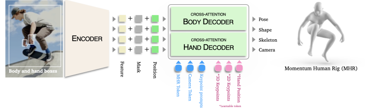
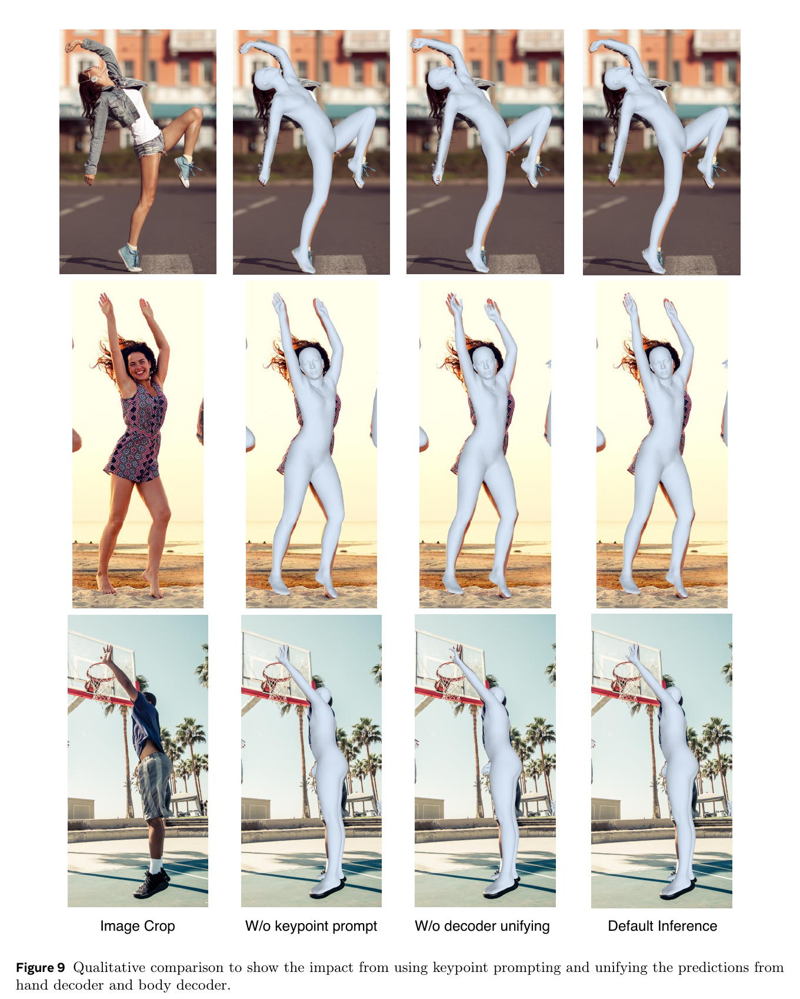
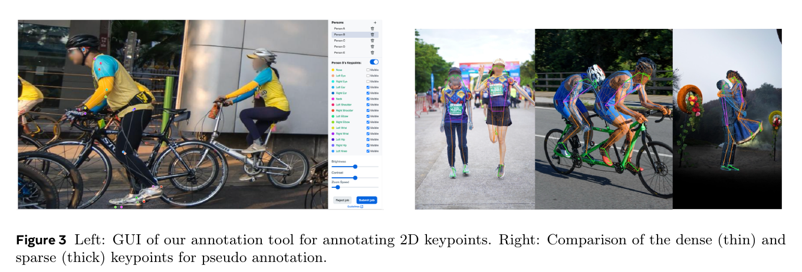
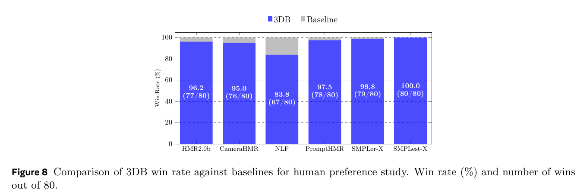

# PAPER: SAM 3D Body — 모델이 아니라 rig(뼈대 구조)와 데이터로 이긴 전신 인체 메시 복원

## 0. 이 문서를 읽는 법

이 문서는 SAM 3D Body 논문(arXiv 2602.15989)과 공개된 추론 코드(github.com/facebookresearch/sam-3d-body, 12.2K줄)를 함께 읽고 정리한 리뷰입니다.

핵심 주장은 하나입니다.

> **SAM 3D Body는 "새 아키텍처" 논문이 아니라, 인체를 표현하는 방식(rig)을 SMPL에서 MHR로 갈아끼우고 700만 장짜리 자동 어노테이션 파이프라인을 붙여서 이긴 논문이다.**

읽는 순서는 이렇게 잡았습니다.

1. **큰 그림**(§5): 왜 기존 human mesh recovery(인체 메시 복원)가 야생 이미지에서 무너지나
2. **MHR**(§6): 이 논문의 표현적 핵심 — 논문에 없는 수치는 코드에서 복원
3. **아키텍처**(§7): 논문이 말한 구조 + **코드에만 있는 두 가지**
4. **데이터**(§8): 진짜 기여가 있는 곳
5. **실험 결과**(§9)와 **비판적 평가**(§10)
6. **코드 리뷰**(§11): 발견한 버그·함정 7가지
7. **학습셋과 학습 코드**(§12): 직접 구현할 수 있나 — 부품 인벤토리와 권장 경로
8. **Q&A**(§13)와 한 줄 요약

수식은 GitHub에서 깨지지 않도록 LaTeX 대신 일반 텍스트로 적었습니다.

```text
예: cont(연속표현) 260차원 = 3-DoF 관절 23개 × 6D(=138)
                          + 1-DoF 관절 58개 × sincos(=116)
                          + 이동 6개
```

---

## 1. 메타 정보

| 항목 | 내용 |
|---|---|
| 논문 | SAM 3D Body: Robust Full-Body Human Mesh Recovery |
| 저자 | Xitong Yang\*, Devansh Kukreja\*, Don Pinkus\*, Anushka Sagar, Taosha Fan, Jinhyung Park°, Soyong Shin°, Jinkun Cao, Jiawei Liu, Nicolas Ugrinovic, Matt Feiszli†, Jitendra Malik†, Piotr Dollar†, Kris Kitani† (총 14명. \*=Core Contributor, °=Intern, †=Project Lead) |
| 소속 | **Meta Superintelligence Labs** |
| 공개일 | 2026-02-17 (arXiv v1) / 체크포인트·데이터셋·웹데모는 2025-11-19 선공개 |
| arXiv | https://arxiv.org/abs/2602.15989 |
| 코드 | https://github.com/facebookresearch/sam-3d-body (SAM License) |
| 체크포인트 | `facebook/sam-3d-body-dinov3` (840M), `facebook/sam-3d-body-vith` (631M) — 둘 다 **접근 승인 필요(gated)** |
| 데이터셋 | https://huggingface.co/datasets/facebook/sam-3d-body-dataset (gated, 1M~10M 샘플) |
| 라이브 데모 | https://www.aidemos.meta.com/segment-anything/editor/convert-body-to-3d |
| 분야 | Human Mesh Recovery(인체 메시 복원, HMR), 3D Human Pose(3차원 인체 자세), Promptable Model(프롬프트 가능 모델) |
| 인체 모델 | **MHR (Momentum Human Rig)** — 별도 논문 arXiv 2511.15586, github.com/facebookresearch/MHR |
| 외부 모델 의존 | DINOv3 / ViT-H (backbone(백본)), ViTdet 또는 SAM 3 (사람 검출), SAM 2 (mask prompt(마스크 프롬프트) 생성), MoGe-2 (field-of-view(화각) 추정) |
| 공개 범위 | **추론 코드 + 체크포인트 2종 + 어노테이션 데이터셋 8종.** 학습 코드·손실 함수·데이터로더·학습 레시피 전부 비공개 |
| 자매 모델 | SAM 3D Objects (github.com/facebookresearch/sam-3d-objects) — 두 결과를 같은 좌표계로 정렬하는 예제 노트북 제공 |

---

## 2. 주요 용어 사전 (Glossary)

*본문에 들어가기 전에, 이 분야를 처음 보는 사람이 걸릴 만한 용어를 먼저 풀어둡니다. 인체 3D 복원은 용어가 많아서 이걸 안 깔면 §6부터 막힙니다.*

### 2.1 인체 표현 (Human Body Representation) 관련

- **HMR (Human Mesh Recovery, 인체 메시 복원)**: 사진 한 장을 보고 그 사람의 3차원 몸 형태(mesh(메시) = 삼각형 수만 개로 이루어진 표면)와 자세를 통째로 복원하는 문제. "관절 위치만 찍는" 자세 추정(pose estimation)보다 한 단계 위입니다.
- **parametric mesh model(파라미터형 인체 모델)**: 메시를 정점 하나하나 예측하는 대신, **수십~수백 개의 숫자(파라미터)만 예측하면 메시가 자동으로 만들어지는** 미리 학습된 모델. SMPL이 대표.
- **SMPL**: 2015년 나온 표준 인체 모델. 몸을 pose(자세) + shape(체형) 두 묶음으로 표현. 정점 6,890개.
- **SMPL-X**: SMPL에 손(MANO)과 얼굴(FLAME)을 붙여 확장한 것.
- **MANO**: 손 전용 파라미터형 모델.
- **MHR (Momentum Human Rig)**: 이 논문이 채택한 새 인체 모델. **skeleton(뼈대)과 surface shape(표면 형태)을 분리**한 것이 핵심. ATLAS(ICCV 2025)의 발전형.
- **rig(리그)**: 3D 캐릭터를 움직이게 만드는 뼈대 + 관절 구조. 애니메이션 용어에서 왔습니다.
- **skeleton scale(뼈대 스케일)**: 각 뼈의 길이·비율. "이 사람은 팔이 길다" 같은 정보.
- **blend shape(블렌드 셰이프)**: 기본 형태에 더해서 체형 변화를 만드는 보정 벡터들. "살이 붙었다" 같은 정보를 담당.
- **DoF (Degree of Freedom, 자유도)**: 한 관절이 몇 방향으로 움직일 수 있는지. 어깨는 3-DoF(모든 방향 회전), 팔꿈치는 사실상 1-DoF(경첩처럼 한 축만).
- **kinematic tree(관절 트리)**: 골반 → 척추 → 어깨 → 팔꿈치 → 손목처럼 부모-자식으로 이어진 관절 계층. 부모가 돌면 자식도 따라 돕니다.
- **FK / IK (Forward / Inverse Kinematics, 순/역 운동학)**: FK는 "관절 각도들 → 최종 손 위치"를 계산하는 것, IK는 반대로 "원하는 손 위치 → 필요한 관절 각도"를 역산하는 것.
- **6D rotation representation(6차원 회전 표현)**: 회전을 각도(오일러 각)로 직접 예측하면 ±180도 경계에서 값이 튀어 학습이 불안정합니다. 대신 회전행렬의 앞 두 열(6개 숫자)을 예측하고 직교화해서 복원하는 기법.

### 2.2 아키텍처 관련

- **promptable model(프롬프트 가능 모델)**: 사용자가 힌트(점, 박스, 마스크)를 주면 그에 맞춰 결과를 바꿔주는 모델. SAM(Segment Anything)이 유행시킨 개념.
- **encoder–decoder(인코더-디코더)**: 이미지를 특징 벡터로 압축하는 부분(encoder)과, 그 특징을 보면서 답을 만들어내는 부분(decoder)으로 나눈 구조.
- **query token(쿼리 토큰)**: decoder가 "무엇을 알아낼지"를 담아 들고 다니는 학습 가능한 벡터. DETR에서 온 개념으로, 토큰 하나가 답 하나에 대응합니다.
- **cross-attention(교차 주의집중)**: 쿼리 토큰이 이미지 특징을 훑어보며 필요한 정보를 끌어오는 연산.
- **iterative refinement(반복 정교화)**: 한 번에 정답을 맞추지 않고, 층을 지날 때마다 예측을 조금씩 고쳐나가는 방식.
- **ray conditioning(광선 조건화)**: 각 픽셀이 카메라에서 어느 방향으로 뻗은 광선인지를 계산해 모델에 알려주는 것. 잘라낸(crop) 이미지에서 생기는 원근 왜곡을 보정합니다.
- **CLIFF condition**: 사람을 잘라낸 박스가 **원본 이미지 어디에** 있었는지(중심 오프셋·크기를 초점거리로 나눈 값)를 모델에 함께 넣어주는 기법. CLIFF(ECCV 2022)에서 유래.
- **FOV (field of view, 화각)**: 카메라가 얼마나 넓게 보는지. 이걸 모르면 사람의 3D 위치를 결정할 수 없어 외부 추정기(MoGe-2)를 씁니다.

### 2.3 데이터 관련

- **pseudo-GT (pseudo-ground truth, 유사 정답)**: 사람이 직접 만든 정답이 아니라, 알고리즘이 자동으로 만들어낸 "정답인 척하는" 라벨. 야생 데이터셋 대부분이 이걸 씁니다.
- **dense keypoint(조밀 키포인트)**: 관절 17개 같은 성긴 점이 아니라, 몸 표면을 촘촘히 덮는 수백 개의 점(이 논문은 595개).
- **triangulation(삼각측량)**: 여러 대의 카메라에서 본 같은 점의 2D 위치들로부터 3D 좌표를 역산하는 기하학 기법.
- **data engine(데이터 엔진)**: 모델이 틀리는 데이터를 자동으로 찾아 라벨링 대기열로 보내는 순환 시스템. 능동학습(active learning)의 산업 규모 버전.
- **leave-one-out(하나 빼고 학습)**: 평가할 데이터셋 하나를 학습에서 제외하고 학습시켜, 그 데이터셋에 대해서는 "처음 보는 상태"로 만들어 공정하게 비교하는 프로토콜.

### 2.4 평가 지표

*숫자 표를 읽으려면 이 넷은 알아야 합니다. 전부 mm(밀리미터) 단위이고, 앞의 셋은 낮을수록 좋습니다.*

- **MPJPE (Mean Per Joint Position Error)**: 예측 관절과 정답 관절의 평균 거리. 골반(pelvis)을 원점으로 맞춘 뒤 잽니다.
- **PA-MPJPE (Procrustes-Aligned MPJPE)**: 회전·크기·위치를 최적으로 맞춘 뒤 재는 MPJPE. **자세의 모양만** 평가하고 전역 방향 오차는 봐주는 지표.
- **PVE (Per-Vertex Error, 정점 오차)**: 관절이 아니라 메시 정점 전체의 평균 오차. 체형까지 맞아야 좋아집니다.
- **PCK (Percentage of Correct Keypoints, 정확 키포인트 비율)**: 2D 이미지 위에서, 예측 점이 정답에서 일정 거리(보통 사람 박스 크기의 5%) 안에 있는 비율. **높을수록 좋습니다.**
- **Avg-PCK**: 임계값 0.01/0.025/0.05/0.075/0.1을 모두 써서 평균 낸 PCK.
- **F@5 / F@15 (F-score)**: 손 메시 평가용. 5mm/15mm 이내로 맞은 정점의 정밀도·재현율 조화평균.

---

## 3. 논문 요약 (TL;DR)

**한 줄**: 인체를 표현하는 방식을 SMPL에서 **뼈대와 살을 분리한 MHR**로 바꾸고, VLM(Vision-Language Model, 시각-언어 모델)이 어려운 사진을 골라오는 **데이터 엔진**으로 700만 장을 자동 라벨링해서, 단일 이미지 전신 인체 메시 복원의 새 최고 성능을 세운 모델.

- **핵심 문제**: 기존 HMR 모델은 실험실 데이터(정확하지만 단조로움)와 야생 데이터(다양하지만 정답이 부정확함) 사이에서 어느 쪽으로도 강건해지지 못했다. 게다가 몸과 손은 학습 성질이 달라 한 헤드로 같이 배우면 서로를 갉아먹는다.
- **해결책**: (1) 관절마다 해부학적 자유도가 정해진 MHR을 채택해 불가능한 자세를 **표현 단계에서 차단**, (2) 몸/손 decoder(디코더)를 분리하고 그 둘을 **프롬프트로 봉합**, (3) 다단계 어노테이션 파이프라인 + VLM 데이터 엔진으로 데이터의 품질·양·다양성을 동시에 확보.
- **검증**: 표준 벤치 5종에서 단일 이미지 방식 전부를 이기고 비디오 기반 방법과도 대등. 새로 만든 벤치 5종에서 leave-one-out으로도 큰 격차. 7,800명 사용자 조사에서 최강 베이스라인 NLF 상대 **83.8% 승률**.

---

## 4. 핵심 기여 (Contributions)

1. **MHR을 쓴 최초의 HMR 모델** — skeleton(뼈대)과 surface shape(표면 형태)을 분리한 rig를 채택해 해석 가능성과 자세 타당성을 동시에 확보.
2. **promptable encoder–decoder 구조** — 2D keypoint(키포인트)·mask(마스크)·카메라 정보를 선택적으로 받아 결과를 조종할 수 있음.
3. **two-way decoder(양방향 디코더 분리)** — 이미지 encoder는 공유하고 몸/손 decoder는 분리해서 최적화 충돌을 회피.
4. **프롬프트를 내부 접착제로 사용** — 손 decoder 결과를 몸에 붙일 때 생기는 팔꿈치 붕괴를, "손목·팔꿈치를 프롬프트로 되먹여 재추정"하는 방식으로 해결. (§7.5)
5. **데이터 엔진 + 다단계 어노테이션 파이프라인**, 그리고 **카테고리별 신규 평가 프로토콜**(2D 24범주 / 3D 28범주 + leave-one-out).

---

## 5. 큰 그림 — 왜 기존 HMR은 야생 이미지에서 무너지나

*본론에 들어가기 전에, 이 논문이 무엇을 고치려 했는지부터 짚습니다. 문제를 모르면 MHR도 데이터 엔진도 "그냥 좋은 것"으로만 읽힙니다.*

논문이 지목하는 원인은 두 축입니다.

**① 데이터 축.** 고품질 3D 정답을 대규모로 모으는 게 원천적으로 비쌉니다. 그래서 현실은 둘 중 하나입니다.

- 실험실 캡처(Human3.6M, Panoptic, DexYCB): 정답은 정확하지만 배경·의상·조명·자세가 단조로움
- 야생 데이터(3DPW, MPII, COCO): 다양하지만 정답이 **단안 최적화로 만든 pseudo-GT**라 자세·체형·카메라에 계통 오차가 깔림

**② 모델 축.** 몸과 손은 요구 조건이 다릅니다.

| 축 | 몸 | 손 |
|---|---|---|
| 필요한 입력 해상도 | 전신이 들어가야 함 | 손만 크게 잘라야 함 |
| 카메라 추정 | 전신 기준 | 손목 기준(국소) |
| 감독 신호 | 전신 관절 | 손가락 21점 |

이걸 하나의 head(예측 헤드)로 묶으면 서로 다른 방향으로 잡아당깁니다. 그래서 지금까지 전신 방법(full-body method)은 항상 손 전문 모델보다 손이 나빴습니다.

---

## 6. MHR — 이 논문의 표현적 핵심

*이 장을 먼저 두는 이유: 이 논문에서 가장 중요한 결정이 "SMPL을 버렸다"이고, 나머지 설계(파라미터 개수, 손실, 손 융합)가 전부 여기서 파생되기 때문입니다.*

### 6.1 SMPL의 문제 — 뼈와 살이 한 파라미터에 섞여 있다

*MHR이 무엇을 고치려 했는지 알려면 기존 표준의 불편함부터 봐야 합니다.*

SMPL은 shape parameter(체형 파라미터) 하나가 **뼈 길이와 연부조직(살)을 동시에** 표현합니다. 그래서 파라미터를 보고 "이 사람은 팔이 긴 건가, 팔에 살이 붙은 건가"를 구분할 수 없습니다. 논문 표현으로는 "파라미터가 뼈 길이에 직접 대응하지 않아 해석 가능성(interpretability)과 제어 가능성(controllability)이 제한된다"는 것입니다.

MHR은 이 둘을 **명시적으로 분리**합니다. 뼈대는 skeleton scale 쪽에서, 살은 shape 쪽에서 담당합니다.

### 6.2 MHR 실측 수치 — 논문에 없어서 코드에서 복원했습니다

*논문 본문에는 MHR의 구체적 숫자가 거의 없습니다. 아래는 공개 코드(`sam_3d_body/models/heads/mhr_head.py`)의 버퍼 크기에서 직접 읽어낸 값입니다.*

| 항목 | 값 | 의미 |
|---|---|---|
| joint(관절) 수 | **127** | SMPL은 24 |
| vertex(정점) / face(면) | **18,439 / 36,874** | SMPL(6,890 정점)보다 2.7배 조밀 |
| skeleton scale | 28 comps → **68개 스케일 값** | **뼈대** — 뼈 길이·비율 담당 |
| shape | **45 comps** | **살** — 표면 형태 blend shape |
| body pose | **133 model params** | §6.3 참조 |
| hand pose | 한 손 27 DoF → cont 54차원, 양손 108 | |
| face / expression | 72 comps | **코드에서 `* 0` 처리 → 실제 미사용** (§11.2) |
| keypoint regressor | 308개 중 **앞 70개만 사용** | 얼굴 키포인트는 버림 |

70개 키포인트 구성(`sam_3d_body/metadata/mhr70.py`): COCO식 상체·하체 관절 15개 + 발 6개(양발 엄지·새끼·뒤꿈치) + 오른손 21개 + 왼손 21개 + 나머지 7개. **발과 손가락이 전신 출력에 처음부터 들어 있다**는 게 "full-body"의 실체입니다.

### 6.3 ⭐ body pose 133개의 내부 구성 — 여기가 진짜 차이

*"뼈대를 분리하면 왜 자세가 좋아지는가"의 답이 이 소절에 있습니다.*

133개 파라미터를 뜯어보면(`mhr_utils.py`의 `compact_cont_to_model_params_body`) 이렇게 구성돼 있습니다.

```text
3-DoF 회전 관절  23개 × 3축 = 69개   (어깨, 고관절, 척추 등 실제로 자유롭게 도는 관절)
1-DoF 회전 관절  58개              (팔꿈치, 무릎 같은 경첩(hinge) 관절 — 한 축으로만 회전)
1-DoF 이동(translation) 6개        (쇄골·견갑골처럼 미끄러지는 부위)
──────────────────────────────────
합계 133
```

SMPL은 **모든 관절이 3-DoF axis-angle(축각)** 입니다. 그래서 네트워크가 조금만 잘못 예측해도 팔꿈치가 옆으로 꺾이는, 해부학적으로 불가능한 자세가 만들어질 수 있습니다. MHR은 팔꿈치·무릎을 애초에 1축으로 묶어둬서 **그런 실패를 표현 자체에서 차단**합니다.

이게 §9.3에서 "거꾸로 뒤집힌 몸", "다리·팔 스플릿" 같은 극단 자세 범주의 격차가 유독 큰 이유의 절반입니다(나머지 절반은 데이터 엔진).

### 6.4 260차원 cont(연속표현) — 각도를 직접 예측하지 않는 이유

*각도를 그대로 회귀하면 학습이 불안정해지기 때문에, 네트워크는 133개를 바로 뱉지 않고 한 번 변환된 형태로 출력합니다.*

```text
cont 260차원 = 3-DoF 관절 23개 × 6D 회전 표현      = 138
             + 1-DoF 관절 58개 × (sin, cos) 쌍     = 116
             + 이동 6개 (변환 없이 그대로)          =   6
```

- 3-DoF는 **6D rotation representation(6차원 회전 표현)** — 회전행렬 앞 두 열을 예측한 뒤 직교화
- 1-DoF는 **sin/cos 쌍** — 나중에 `atan2(sin, cos)`로 각도 복원. ±π 경계 불연속 회피
- 손은 같은 방식으로 한 손 27 DoF → 54차원 (3-DoF 관절은 6D, 1·2-DoF는 sincos)

네트워크 최종 출력 크기(`mhr_head.py`의 `npose`)는 이렇게 계산됩니다.

```text
npose = 6(global rotation) + 260(body cont) + 45(shape) + 28(scale)
      + 54×2(양손) + 72(face) = 519
```

**중요**: `mhr_utils.py`에는 이 변환의 **역방향**(`compact_model_params_to_cont_body`, `compact_model_params_to_cont_hand`)도 함께 들어 있습니다. 데이터셋이 주는 정답 `model_params`(133개)를 네트워크 출력 공간으로 바꿀 수 있다는 뜻이고, 이게 §12에서 학습 코드 자작 가능성을 크게 높이는 요소입니다.

### 6.5 이 논문의 공백 — MHR 자체 설명은 없다

*이 논문만 읽고 MHR을 이해하려 하면 막히는 지점이 있어서 미리 표시해 둡니다.*

MHR이 어떻게 학습된 모델인지(45/28 comps가 무엇의 주성분인지, 어떤 스캔 데이터로 만들었는지)는 **전부 별도 논문 arXiv 2511.15586에 위임**돼 있습니다. 이 논문만 읽으면 "새 rig를 썼더니 좋더라"까지만 알 수 있고, 왜 좋은지는 §6.3처럼 코드를 봐야 재구성됩니다.

---

## 7. 아키텍처

*이 장은 "구조 자체는 평범한데 왜 잘 되는가"를 가르는 지점을 보여주기 위해 둡니다. 논문에 적힌 구조와, 코드에만 존재하는 두 장치를 구분해서 정리합니다.*

### 7.1 전체 구조

*몸과 손의 학습 성질이 다르다는 §5의 문제(모델 축)를 구조로 푼 결과가 이 그림입니다.*



```text
사람 crop 이미지(512×512) → 공유 image encoder (ViT-H 632M 또는 DINOv3-H+ 840M)
                                     │
        ┌────────────────────────────┴────────────────────────────┐
   BODY decoder (전신 feature 참조)              HAND decoder (손 crop feature 참조)
        └────────────────────────────┬────────────────────────────┘
                       Pose / Shape / Skeleton / Camera → MHR → 메시
```

- image encoder는 **공유**, decoder는 **완전히 분리**(별도 가중치)
- 입력 해상도 512×512
- 카메라 내부 파라미터(intrinsics)는 외부 추정기(MoGe-2)에서 받아옵니다 — 즉 **단독으로 완결되지 않는 파이프라인**입니다

### 7.2 decoder에 들어가는 query token(쿼리 토큰) 5종

*"프롬프트를 받는다"가 구조적으로 무슨 뜻인지 보여주는 표입니다. 프롬프트가 별도 경로가 아니라 그냥 토큰 하나로 들어갑니다.*

| 토큰 | 개수 | 역할 |
|---|---|---|
| MHR + Camera | 1 | 최종 파라미터를 뽑는 토큰. decoder 출력의 **0번 토큰**을 MLP에 통과시켜 519차원을 만듭니다 |
| prev estimate | 1 | 직전 추정치를 다시 넣는 토큰 — 반복 정교화·다중 라운드 프롬프트용 |
| 2D keypoint prompt | N | (x, y, label) 3개 값. label이 관절 번호면 양성, `-1`이면 "이 예측은 틀렸다"는 음성 프롬프트, `-2`면 더미(프롬프트 없음) |
| hand box | 2 | 내장 손 검출기용(좌/우). 박스 4개 값 + 존재 여부 2분류를 예측 |
| 보조 keypoint | 70(2D) + 70(3D) | 관절별 학습 토큰. §7.4의 되먹임이 여기에 꽂힙니다 |

mask prompt(마스크 프롬프트)만 토큰이 아닙니다. SAM과 동일하게 **컨볼루션으로 임베딩한 뒤 이미지 특징에 원소별로 더합니다**. 마스크가 없을 때 쓰는 `no_mask_embedding`이 따로 있고, 마스크 점수로 가중합니다.

### 7.3 ⭐ 코드에만 있는 것 (a) — ray conditioning(광선 조건화)

*사람을 잘라내면 원본 카메라의 원근 정보가 사라집니다. 그 손실을 메우는 장치인데, 논문에는 "camera information"이라는 단어 하나로만 지나갑니다.*

`sam_3d_body/models/modules/camera_embed.py`의 `CameraEncoder`:

```text
1. 각 픽셀 좌표를 crop 변환의 역으로 원본 이미지 좌표로 되돌림
2. 카메라 중심을 빼고 초점거리로 나눔 → 각 픽셀의 "광선 방향" 2채널
3. z=1을 붙여 3차원으로 만든 뒤 Fourier position encoding(푸리에 위치 인코딩) → 99차원
   (band 16개 × 3축 × sin/cos = 96, + 원래 좌표 3 = 99)
4. 이미지 feature와 채널 방향으로 concat 후 1×1 conv → LayerNorm
```

여기에 더해 **CLIFF condition** 3개 값(박스 중심 오프셋 x, y와 박스 크기를 각각 초점거리로 나눈 값)이 MHR 토큰의 입력에 함께 concat됩니다. 즉 모델은 "내가 지금 보고 있는 crop이 원본 사진의 어디에서, 어떤 화각으로 잘려 나왔는지"를 두 경로로 전달받습니다.

### 7.4 ⭐ 코드에만 있는 것 (b) — decoder 층마다 도는 되먹임 루프

*이게 이 코드에서 가장 놀라운 부분이고, 2D 정렬 성능(PCK)이 유독 높은 이유로 보입니다. 논문 3.2절에는 "이 토큰들이 특정 관절을 추론하게 해준다" 한 줄뿐입니다.*

`sam3d_body.py:1759` `keypoint_token_update_fn`. decoder 층을 하나 지날 때마다:

```text
1. 현재 토큰으로 중간 MHR 파라미터를 뽑고 → MHR로 메시·3D 키포인트 생성
2. 카메라로 2D 투영 → crop 좌표계로 변환
3. 그 2D 위치에서 F.grid_sample 로 이미지 feature를 직접 뽑아
   → 선형 변환 후 keypoint 토큰에 "더함"
4. 현재 2D 좌표(2→D)와 pelvis(골반) 정규화한 3D 좌표(3→D)를 FFN에 통과시켜
   → 토큰의 positional embedding(위치 임베딩)을 통째로 교체
5. 화면 밖으로 나갔거나(0~1 범위 밖) 카메라 뒤에 있는(depth < 1e-5) 관절은 마스킹해 0으로 죽임
```

DETR 계열의 **iterative refinement(반복 정교화)** 를 인체 메시에 적용한 것입니다. 마지막 층에서는 갱신을 건너뜁니다(`layer_idx == len(layers) - 1`이면 즉시 반환).

**핵심 직관**: 첫 층의 예측이 대충이라도, 그 위치의 이미지 특징을 다시 읽어와서 다음 층이 고칩니다. "예측 → 그 자리를 다시 본다 → 고친다"의 반복이라, 특히 2D 정렬이 좋아집니다.

### 7.5 손 융합 — promptability의 실제 용도

*이 논문에서 프롬프트가 왜 단순한 사용자 기능이 아닌지 보여주는 절입니다. 프롬프트가 없으면 손 decoder를 붙일 방법 자체가 없습니다.*

**문제**: 손 decoder 결과를 kinematic tree(관절 트리) 중간에 그냥 꽂으면 **인접 관절, 특히 팔꿈치가 망가진다**(논문 4절).

**처방** (`sam3d_body.py:1197` `run_inference`, `inference_type="full"`):

1. 몸 decoder로 1차 추정 → 내장 손 검출기가 좌/우 손 박스 출력
2. **왼손은 이미지를 좌우 반전해 "오른손"으로 처리** — 모델은 오른손만 배우면 됩니다. 결과를 되돌릴 때 손 스케일 인덱스 8↔9를 평균·표준편차로 재변환하고, 손목 전역 회전행렬의 1·2행 부호를 뒤집습니다
3. 손 decoder가 준 **손목 위치** + 몸 decoder가 준 **팔꿈치 위치**를 → **2D keypoint prompt로 몸 decoder에 되먹여 전신 재추정**
4. IK로 손목의 국소 회전을 역산해 삽입하고, 손 스케일·형태는 좌우 평균으로 갱신 → MHR 재실행

**4중 게이트** — 아래를 전부 통과해야 손 결과를 채택합니다.

| 기준 | 임계값 | 왜 |
|---|---|---|
| 손목 각도 차이 | < 1.4 rad (약 80도) | 손 결과가 몸 자세와 너무 어긋나면 오검출 |
| 손 박스 크기 | > 64 px | 너무 작으면 손 decoder 신뢰 불가 |
| 손 2D 키포인트가 박스 안 | crop 좌표 절대값 < 0.5 | 손이 박스를 벗어났으면 실패 |
| 손목 2D 위치가 몸 예측과 가까움 | 박스 크기 대비 < 0.25 | 다른 사람 손을 잡은 경우 배제 |

하나라도 실패하면 몸 decoder 결과를 그대로 유지합니다. 즉 **손 융합은 "되면 좋고, 아니면 안전하게 포기"** 하는 설계입니다.



*왼쪽부터 입력 crop / 키포인트 프롬프트 없음 / decoder 통합 없음 / 기본 추론. 프롬프트가 없으면 손목·손가락의 2D 정렬이 무너지고, decoder 통합이 없으면 손목 회전이 어색해집니다.*

---

## 8. 데이터 — 진짜 기여가 있는 곳

*모델 구조가 평범한데 성능 격차가 큰 이유를 설명하는 장입니다. 저자들도 결론에서 "핵심 진보는 supervision pipeline에 있다"고 스스로 밝힙니다.*

### 8.1 다단계 어노테이션 파이프라인

*정답의 품질이 곧 모델의 상한이기 때문에, 사람 손·검출기·기하 최적화를 층층이 쌓아 pseudo-GT를 만듭니다.*

**1단계 — 수동 2D 어노테이션**
현재 버전의 3DB로 초기 관절 위치를 찍어주고, 훈련된 작업자가 교정합니다. 관절마다 **가시성 라벨**을 엄격한 기준으로 붙입니다(50% 이상 가려짐, 모션 블러 등이면 "안 보임").



*왼쪽: 2D 키포인트 어노테이션 GUI(관절별 visible 체크박스가 보입니다). 오른쪽: dense(얇은 선) vs sparse(굵은 선) 키포인트 비교.*

**2단계 — 595개 dense keypoint 검출기**
595라는 숫자는 "인체 메시를 표현하는 최소 다양체(minimal manifold)"로 선정한 것입니다. 이 검출기의 차별점은 픽셀만 보는 기존 방식과 달리 **1단계에서 얻은 sparse 키포인트를 힌트로 함께 입력**한다는 점입니다. 학습은 자기학습(self-training) 순환입니다.

```text
3D 데이터(Goliath, 합성)로 학습 → 야생 데이터에 메시 피팅
   → 피팅된 메시를 투영해 dense 라벨 생성 → 재학습   (이 순환을 2회)
```

**3단계 — 메시 피팅**

| | 단일뷰 | 멀티뷰 |
|---|---|---|
| 초기값 | 현재 3DB 예측 | 삼각측량한 3D 키포인트 + 카메라 |
| 손실 | 2D 재투영 L2 + 초기값 앵커 정규화 + GMM 자세 prior + L2 형태 정규화 | 위 항목 + **3D 키포인트 L2** + **시간 평활(temporal smoothness)** |
| 최적화 | 경사 기반 정교화 | 2차 최적화, 카메라/형태/뼈대/자세를 번갈아 갱신, RANSAC·robust loss로 필터링 |
| 특징 | 규모는 크지만 깊이 모호성 때문에 품질이 낮음 | 뼈대·체형은 **전 프레임 공동 최적화** |

"초기값 앵커 정규화(initialization-anchored regularization)"가 중요합니다. 현재 모델 예측에서 너무 멀어지지 않도록 붙잡아 **model drift(모델 표류)** 를 막습니다. 자기 예측으로 자기 정답을 만드는 순환 구조라서 이 제동장치가 없으면 오차가 증폭됩니다.

### 8.2 VLM 데이터 엔진

*비디오를 왕창 라벨링하면 양은 늘지만 자세·배경이 다 비슷합니다. 다양성을 사서 늘리는 장치가 이 절입니다.*

무작위 샘플링이나 단순 휴리스틱 대신, **VLM이 채굴 규칙을 만들고 갱신**합니다. VLM이 찾는 유형:

가림(occlusion) / 희귀 자세(곡예·댄스) / 상호작용(사람-물체, 사람-사람) / 극단적 스케일 / 저가시성(조명·블러) / 손-몸 협응(수화·스포츠)

규칙 갱신 루프가 이 시스템의 핵심입니다.

```text
현재 모델을 라벨링된 이미지에 돌림 → 키포인트 오차 큰 실패 사례를 시각화
  → 사람이 몇 단어로 실패 유형을 적음 → 그 단어가 VLM 프롬프트가 됨
  → VLM이 수천만 장에서 비슷한 이미지 채굴 → 수동 어노테이션 대기열로
```

사람이 하는 일은 "몇 단어 적기"뿐이고 나머지는 자동입니다. 반자동 능동학습(semi-manual active learning)의 산업 규모 구현입니다.

### 8.3 학습 데이터 (논문 Table 1, 총 7M+)

*어떤 데이터가 어느 역할을 맡았는지 한눈에 봐야, §12에서 "공개된 건 어디까지인가"를 판단할 수 있습니다.*

| 유형 | 데이터셋 | 이미지/프레임 | 피험자 | 뷰 |
|---|---|---|---|---|
| 야생 단일뷰 | SA-1B | 1.65M | 1.65M+ | 1 |
| | AI Challenger | 172K | 172K+ | 1 |
| | MS COCO | 24K | 24K+ | 1 |
| | 3DPW | 17K | 7 | 1 |
| | MPII | 5K | 5K+ | 1 |
| 멀티뷰 | Ego-Exo4D | 1.08M | 740 | 4+ |
| | InterHand2.6M ⭐ | 1.09M | 27 | 66 |
| | Goliath ⭐ | 966K | 120+ | 500+ |
| | DexYCB | 291K | 10 | 8 |
| | EgoHumans | 272K | 50+ | 15 |
| | Harmony4D | 250K | 24 | 20 |
| 합성 | Goliath 사실적 확장 ⭐ | 1.63M | – | – |
| 손 전용 | Re:InterHand ⭐ | 1.50M | 10 | 170 |

⭐ = 손 decoder 학습에 쓰인 데이터셋(논문에서 별표 표시). **이 표시가 §12.2에서 결정적입니다.**

---

## 9. 실험 결과

*숫자를 어떻게 읽어야 하는지가 중요한 장입니다. 특히 "학습에 쓴 데이터셋"과 "안 쓴 데이터셋"을 구분해서 봐야 합니다.*

### 9.1 표준 벤치마크 5종 (Table 2)

*기존 방법들과 같은 링에서 비교하는 기본 실험. 단일 이미지 방식 전 항목 1위이고 비디오 기반 방법과도 대등합니다.*

| 모델 | 3DPW MPJPE↓ | EMDB MPJPE↓ | RICH PVE↓ | COCO PCK↑ | LSPET PCK↑ |
|---|---|---|---|---|---|
| HMR2.0b | 81.3 | 118.5 | 110.9 | 86.1 | 53.3 |
| CameraHMR | 56.0 | 70.3 | 64.4 | 80.5 | 49.1 |
| PromptHMR | 58.7 | 71.7 | 65.5 | 79.2 | 55.6 |
| NLF-L+fit | 54.9 | 68.4 | **58.2** | 74.9 | 54.9 |
| GENMO (비디오) | 53.9 | 73.0 | 75.4 | – | – |
| **3DB-H** (ViT-H 632M) | 54.8 | 62.9 | 61.7 | **86.8** | **68.9** |
| **3DB-DINOv3** (840M) | 54.8 | **61.7** | 60.3 | 86.5 | 67.8 |

**읽는 법 세 가지**

- EMDB·RICH는 **학습에 쓰지 않은 도메인 밖 데이터**입니다. 여기서 격차가 가장 큽니다(EMDB 68.4 → 61.7). 일반화 능력의 증거로 저자들이 강조하는 지점.
- RICH만 NLF에 뒤지는데, **NLF는 RICH를 학습에 씁니다**(논문이 명시).
- 2D 정렬(PCK)에서 LSPET 54.9 → 68.9는 격차가 유난히 큽니다. §7.4의 되먹임 루프 효과로 보입니다.

### 9.2 신규 벤치마크 5종 + leave-one-out (Table 3)

*"기존 방법들은 각자 자기 데이터 분포에만 강한 것 아닌가"를 검증하기 위해 만든 실험. 38.6K장.*

공정성 문제가 있습니다 — CameraHMR/PromptHMR/NLF는 각각 6/9/48개 데이터셋으로 학습했고, 학습 코드나 데이터 목록이 불명확합니다. 그래서 3DB는 **평가할 데이터셋을 빼고 학습한(leave-one-out) 모델**로 비교하고, 참고용으로 전체 학습 모델도 함께 보고합니다.

| 모델 | EE4D-Phy PVE↓ | Harmony4D PVE↓ | Goliath PVE↓ | Synthetic PVE↓ | SA1B-Hard Avg-PCK↑ |
|---|---|---|---|---|---|
| CameraHMR | 71.1 | 84.6 | 66.7 | 102.8 | 63.0 |
| PromptHMR | 74.6 | 91.9 | 67.2 | 92.7 | 59.0 |
| NLF | 75.9 | 97.3 | 66.5 | 97.6 | 66.5 |
| **3DB leave-one-out** | 49.7 | 63.5 | 54.2 | 85.6 | 73.1 |
| 3DB 전체 학습 (상한 참고) | 37.0 | 41.0 | 34.5 | 55.2 | 76.6 |

기존 방법 3종이 **데이터셋마다 2등 자리를 서로 바꿔가며** 차지합니다. 논문은 이를 "각 베이스라인이 데이터 분포의 좁은 조각에 과적합됐다"고 해석하는데, 표를 보면 설득력이 있습니다.

### 9.3 카테고리별 성능 분석 (Table 5, SA-1B Hard 24범주)

*평균 숫자 하나로는 "어떤 상황에서 강한지"를 알 수 없어서, 사람이 24개 범주로 나눠 분석한 결과입니다.*

격차가 극단적인 구간만 뽑으면(aPCK(body) 기준):

| 범주 | CameraHMR | PromptHMR | **3DB** |
|---|---|---|---|
| Pose - 거꾸로 뒤집힌 몸 | 46.1 | 39.8 | **78.2** |
| Pose - 다리·팔 스플릿 | 57.5 | 54.8 | **83.7** |
| Camera - 아래에서 올려다본 시점 | 55.2 | 46.6 | **69.6** |
| Camera - 위에서 내려다본 시점 | 55.1 | 43.7 | **73.3** |
| Visibility - 하반신 잘림 | 39.3 | 46.5 | **62.0** |
| Pose - 굽히기·비틀기 | 47.1 | 42.6 | **65.2** |

논문은 이를 **데이터 엔진이 골라온 어려운 자세 분포** 덕으로 귀속합니다(잘림 범주는 "훨씬 강한 자세 prior를 배웠다"고 설명). §6.3의 해부학적 DoF 제약도 같은 방향으로 기여했을 텐데, 이 둘을 분리하는 실험은 없습니다.

3D 범주(Table 6, 28범주)에서도 같은 경향입니다. 가장 극적인 건 `pose_3d:very_hard`(PVE 213.7 / 186.4 → **114.2**)와 `truncation:severe`(230.5 / 186.6 → **126.5**).

### 9.4 손 (Table 4, FreiHand)

*전신 모델이 손 전문 모델과 얼마나 좁혀졌는지 보는 실험. 이 논문이 "최초"를 주장하는 근거입니다.*

| 방법 | PA-MPVPE↓ | PA-MPJPE↓ | F@5↑ |
|---|---|---|---|
| HaMeR † | 5.7 | 6.0 | 0.785 |
| MaskHand † | 5.4 | 5.5 | 0.801 |
| WiLoR † | **5.1** | 5.5 | **0.825** |
| **3DB-H** | 6.3 | **5.5** | 0.735 |
| **3DB-DINOv3** | 6.2 | **5.5** | 0.737 |

† = FreiHand를 학습에 사용(즉 도메인 안 이점을 가짐). **3DB는 FreiHand를 학습하지 않았습니다.**

관절 오차(PA-MPJPE)는 동률이지만 정점 오차(PA-MPVPE)와 F@5는 아직 뒤집니다. 논문도 부록 C에서 "전문 손 모델을 넘지는 못했다"고 인정합니다.

### 9.5 사용자 선호도 조사

*수치 지표가 사람 눈에 보이는 품질과 항상 일치하지는 않기 때문에 별도로 수행한 실험입니다.*

6개 베이스라인 각각에 대해 독립적인 쌍대 비교(pairwise comparison)를 설계했습니다. 참가자 총 **7,800명**(비교당 1,300명), 응답 20,000건 이상. 좌우로 두 방법의 복원 결과를 보여주고 "어느 쪽이 원본 사진과 더 잘 맞는가"를 물었습니다.



최강 베이스라인 NLF 상대로도 **83.8%(67/80)**, SMPLest-X 상대로는 100%(80/80).

### 9.6 유일한 ablation — 프롬프트 효과 (부록 B)

*논문 전체에서 "무엇을 빼면 얼마나 나빠지는가"를 측정한 곳은 여기뿐입니다.*

**2D 키포인트 프롬프트** (Table 7, 3DB-H. 오차가 가장 큰 관절을 프롬프트로 제공)

| 프롬프트 수 | 0 | 1 | 1 (노이즈 0.03) | 1 (노이즈 0.05) | 1 (노이즈 0.1) | 2 |
|---|---|---|---|---|---|---|
| COCO PCK@0.05 ↑ | 86.7 | 90.2 | 89.5 | 87.6 | 80.9 | **93.0** |
| EMDB MPJPE ↓ | 63.3 | 60.1 | 61.5 | 63.3 | 67.8 | **58.9** |

두 가지를 읽을 수 있습니다.

- **2D 힌트가 3D 정확도까지 끌어올립니다** — 프롬프트는 이미지 평면 위의 점인데 EMDB의 3D 오차가 개선됩니다
- 노이즈 0.05를 넘으면 **오히려 나빠집니다** — 모델이 틀린 힌트를 충실히 따라가기 때문. 즉 "프롬프트를 잘 따른다"와 "프롬프트에 취약하다"는 같은 동전의 양면

**마스크 프롬프트** (Table 8, 3DB-DINOv3)

| | Hi4D PVE↓ | Hi4D MPJPE↓ | Harmony4D PVE↓ | SA1B-MP Avg-PCK↑ |
|---|---|---|---|---|
| 마스크 없음 | 91.4 | 76.4 | 42.7 | 67.9 |
| **마스크 있음** | **58.3** | **47.0** | **36.5** | **72.3** |

Hi4D에서 PVE 91.4 → 58.3은 거의 다른 모델 수준의 차이입니다. 밀착 상호작용하는 2인 장면에서 **박스만으로는 "누구를 복원할지" 지정이 안 되기 때문**입니다. SA1B-Hard 전체에서는 +0.9%p인데 다인(multi-person) 부분집합만 보면 +4.4%p — 마스크의 효용이 어디에서 오는지가 분명합니다.

---

## 10. 비판적 평가

*논문의 주장을 그대로 받아들이기 전에 짚어야 할 것들입니다. 재현이나 후속 연구를 계획한다면 여기가 실무적으로 가장 중요합니다.*

### 약한 지점

*후속 연구나 재현을 계획한다면 여기가 실무적으로 가장 중요합니다.*

1. **아키텍처 ablation이 사실상 없습니다.** 논문이 내세운 3대 기여 중 (i) two-way decoder가 몸/손 최적화 충돌을 완화한다, (iii) MHR이 SMPL보다 낫다 — **둘 다 수치로 검증된 적이 없습니다.** ray conditioning, 층별 되먹임, 보조 키포인트 토큰도 마찬가지. §9.6의 실험 2개는 전부 추론 시 프롬프트 효과일 뿐입니다.
2. **학습 레시피가 통째로 비어 있습니다.** optimizer, 학습률, 배치 크기, 스텝 수, GPU 시간, 손실 가중치 값 — 한 줄도 없습니다. "λ는 경험적으로 설정", "3D 키포인트 손실은 warm-up" 정도가 전부입니다.
3. **평가의 자기참조성.** 신규 벤치 5종의 정답이 **자기 어노테이션 파이프라인**으로 만들어졌습니다. leave-one-out으로 학습 누출은 막았지만, "우리 파이프라인이 정의한 정답에 우리 모델이 가깝다"는 편향은 남습니다. SMPL 기반 벤치 평가 시 MHR → SMPL 메시 변환 오차도 통제되지 않았습니다.
4. **3DPW MPJPE가 두 백본 모두 54.8** — 632M을 840M으로 키워도 동일합니다. 벤치마크 포화 신호이고, 저자들이 EMDB/RICH를 강조하는 이유이기도 합니다.
5. **사용자 조사의 표본 구조.** 참가자 7,800명은 화려하지만 **자극 이미지는 비교당 80장**입니다. 승률 100%(80/80) 같은 숫자는 이미지 표본 크기를 감안해 읽어야 합니다.
6. **저자가 인정한 한계(부록 C)**: 사람을 한 명씩 독립 처리해서 다인·물체 상호작용의 상대 위치를 못 잡음 / 손 전문 모델에 못 미침 / **MHR 자체가 아동 체형을 지원하지 않음**.

### 강한 지점

*비판만 늘어놓으면 이 논문에서 가져갈 것을 놓치기 때문에 함께 정리합니다.*

1. **MHR 채택이 단순한 부품 교체가 아닙니다.** 해부학적 DoF 제약을 표현 레벨에서 강제하는 결정이고, §9.3의 극단 자세 범주 격차가 이를 뒷받침합니다.
2. **promptability를 내부 봉합 장치로 쓴 설계**(§7.5)는 다른 문제에도 이식 가능한 아이디어입니다. "두 모듈의 출력을 합칠 때, 한쪽 출력을 다른 쪽의 입력 프롬프트로 되먹인다"는 패턴.
3. **평가 프로토콜 기여** — leave-one-out 비교와 카테고리별 분석(2D 24범주 / 3D 28범주)은 이 분야의 평가 문화를 개선합니다.

---

## 11. 코드 리뷰 (github.com/facebookresearch/sam-3d-body)

*논문만 읽고 "오픈소스니까 쓰면 되겠다"고 판단하면 어긋나는 지점들이 있어서 별도 장으로 둡니다.*

### 11.1 구성과 실행 경로

*이 모델을 실제로 돌리려면 무엇이 더 필요한지(외부 검출기·FOV 추정기)를 먼저 확인해야 합니다.*

총 12.2K줄, **추론 전용**. 핵심 로직이 `sam3d_body.py` 한 파일에 2,025줄(전체의 17%) 몰려 있습니다.

```text
demo.py
 └ ViTdet 또는 SAM 3 로 사람 검출
 └ MoGe-2 로 FOV 추정 → 카메라 intrinsics
 └ SAM 2 로 마스크 생성 (--use_mask 일 때만)
 └ SAM3DBodyEstimator.process_one_image()
     └ run_inference(inference_type = "full" | "body" | "hand")
     └ 렌더링 (pyrender)
```

MHR 자산은 체크포인트에 TorchScript(`mhr_model.pt`)로 동봉되어 있어, 별도 momentum 패키지 없이도 돕니다(`mhr_head.py`가 import 실패 시 자동 폴백).

### 11.2 ⭐ 발견한 버그·함정 7가지

*그냥 쓰면 모르고 지나치는데, 결과나 이식성에 영향을 주는 것들입니다.*

| # | 위치 | 내용 |
|---|---|---|
| 1 | `sam3d_body.py:1223-1224` | **예외가 던져지지 않습니다.** `inference_type`이 유효하지 않을 때 `ValueError(...)`를 **생성만 하고 `raise`를 빠뜨렸습니다.** 오타를 내면 조용히 "full" 경로로 흘러갑니다 |
| 2 | `sam3d_body.py:1363-1368` | **좌/우 뒤바뀜.** 손목 거리 게이트에서 오른손 거리를 **왼손 박스 크기**로, 왼손 거리를 **오른손 박스 크기**로 정규화합니다. 두 손 크기가 비슷하면 티가 안 나지만, 한 손만 카메라에 가까운 장면에서 게이트가 오판합니다 |
| 3 | `sam3d_body.py:1034` 외 다수 | **`.cuda()` 하드코딩.** 광선 조건 생성, 관절 인덱스 텐서, 배치 이동 등. `mhr_head`는 CPU 폴백을 갖고 있는데 상위 경로가 GPU를 강제해서 **CPU/MPS 추론 불가** |
| 4 | `mhr_head.py:316` | **얼굴은 죽은 코드.** 72차원 표정 파라미터를 예측한 뒤 `* 0`. 논문이 "body+hands+feet"라 한 것과는 일치하지만 파라미터와 연산은 그대로 남아 있습니다 |
| 5 | `sam3d_body.py:62, 77` | **손 PCA basis 무력화.** 체크포인트에서 로드한 `hand_pose_comps`를 **`eye(54)` 단위행렬로 덮어씁니다**(원본은 `hand_pose_comps_ori`에 백업). 즉 손을 주성분 계수가 아니라 54차원 직접 회귀로 다룹니다. 의도된 설계로 보이나 논문에 언급 없음 |
| 6 | `demo.py`, `sam_3d_body_estimator.py` | **2D 키포인트 프롬프트 API가 공개돼 있지 않습니다.** 노출된 건 마스크 프롬프트(`--use_mask`)뿐. 키포인트 경로(`run_keypoint_prompt`)는 존재하지만 손목/팔꿈치 내부 정교화에만 쓰입니다. **논문 대표 기능이자 §9.6 Table 7을 재현하려면 사용자가 호출 코드를 직접 작성해야 합니다** |
| 7 | 여러 곳 | **백본 종류를 문자열 리스트로 분기**해 feature map을 `[:, :, :, 2:-2]` 식으로 잘라내는 코드가 6군데 이상 흩어져 있습니다. 새 백본을 붙이려면 여러 곳을 동시에 고쳐야 합니다. (`_initialze_model` 오타도 그대로) |

### 11.3 라이선스 — SAM License

*"오픈소스"라는 말만 보고 제품에 넣으면 곤란해질 수 있어 조건을 따로 정리합니다.*

**Apache/MIT 같은 OSI 승인 오픈소스가 아닙니다.**

- 비상업 제한 조항은 **없습니다** — 상업 이용 자체는 막지 않습니다
- 다만: 리버스 엔지니어링 금지 / 무역제재(Trade Controls) 대상국 배제 / 무기·군사 용도 금지 / 무보증 / **Meta가 약관을 수시로 변경할 수 있고 변경 즉시 발효**
- 준거법은 캘리포니아주법, 관할은 캘리포니아 법원
- 체크포인트와 데이터셋 모두 Hugging Face에서 **접근 승인 요청 + 연락처 공유 동의** 필요

### 11.4 공개 / 비공개 정리

*"무엇이 되고 무엇이 안 되는가"를 한 표로 확인하기 위한 절입니다.*

| 항목 | 상태 |
|---|---|
| 추론 코드 | ✅ 공개 (12.2K줄) |
| 체크포인트 | ✅ 2종 (gated) |
| MHR 자산 | ✅ 체크포인트에 TorchScript 동봉 |
| 어노테이션 데이터셋 | ✅ 8개 소스 (gated, 이미지는 원본에서 직접) |
| 학습 코드 | ❌ 없음 |
| 손실 함수 | ❌ 없음 |
| 데이터로더 | ❌ 없음 |
| 학습 하이퍼파라미터 | ❌ 논문에도 없음 |
| 손·합성 데이터 (5종) | ❌ 비공개 |
| 595 dense keypoint 검출기 | ❌ 비공개 |
| 메시 피팅 파이프라인 | ❌ 비공개 |
| 평가 코드 / 신규 벤치 | ❌ 비공개 |

---

## 12. 학습셋과 학습 코드 — 직접 구현할 수 있나

*"이 모델을 내 데이터에 맞게 미세조정할 수 있는가"는 논문 리뷰와 별개의 실무 질문이라 장을 따로 뒀습니다. 결론부터: **데이터셋은 공개, 학습 코드는 직접 구현해야 하며, 미세조정 목적이면 충분히 가능합니다.***

### 12.1 공개된 데이터셋의 실체

*"데이터셋 공개"라는 말이 어느 수준까지를 뜻하는지(이미지까지인가, 정답만인가)를 확인하는 절입니다.*

- **HF `facebook/sam-3d-body-dataset`** (gated, 1M~10M 샘플 규모)
- 8개 소스의 train/test 분할: **3DPW, AI Challenger, COCO, EgoExo4D, EgoHumans, Harmony4D, MPII, SA-1B**
- 제공 형태는 **어노테이션 parquet만**입니다. 이미지는 각 원본 데이터셋에서 직접 받아야 하고(소스별 README 제공), `data/scripts/create_webdataset.py`로 이미지+어노테이션을 합쳐 WebDataset tar로 만듭니다

**어노테이션 필드** (`create_webdataset.py`에서 확인):

| 필드 | 내용 |
|---|---|
| `keypoints_2d` / `keypoints_3d` | 2D·3D 키포인트 (마지막 채널이 신뢰도/가시성) |
| `mhr_params.model_params` | **MHR 133개 자세 파라미터 + 스케일** |
| `mhr_params.shape_params` | MHR 체형 파라미터 |
| `mhr_valid` | 메시 정답 유효 플래그 |
| `bbox`, `bbox_center`, `bbox_scale`, `bbox_score` | 사람 박스 |
| `cam_int` | 카메라 내부 파라미터 |
| `mask` (RLE) | 세그멘테이션 마스크 |
| `loss` | **메시 피팅 잔차** — 저품질 샘플 필터링에 그대로 쓸 수 있음 |

즉 **학습에 바로 쓸 수 있는 수준의 정답**입니다.

### 12.2 빠진 5개 데이터셋 = 손 학습 데이터 전부

*여기가 재현 가능성을 가르는 지점입니다.*

논문 Table 1(§8.3)의 13개 중 **5개가 공개에서 제외**됐습니다: **DexYCB, InterHand2.6M, Re:InterHand, Goliath, 합성 데이터.** 라이선스·사내 자산 문제로 보입니다.

그런데 이 다섯이 곧 **§8.3에서 ⭐로 표시된 손 decoder 학습 데이터 전부**(InterHand, Re:InterHand, Goliath, 합성)와 고품질 합성 데이터 1.63M입니다.

정리하면 공개분은 **몸 쪽 야생·멀티뷰 데이터**이고, 7M 중 대략 절반가량입니다. **손 decoder 학습은 재현 불가**로 보시면 됩니다.

### 12.3 이미 있어서 안 만들어도 되는 부품

*저장소를 뜯어보면 추론에 전혀 쓰이지 않는 학습 전용 코드가 그대로 남아 있습니다. 내부 학습 코드에서 추론 부분만 잘라내 공개한 흔적이라, 실제로는 "밑바닥부터"가 아니라 "빈칸 채우기"에 가깝습니다.*

| 부품 | 위치 | 왜 중요한가 |
|---|---|---|
| **인터랙티브 프롬프트 샘플러** | `keypoint_prompt_sampler.py` 전체(182줄) | 논문 4절의 "여러 라운드로 프롬프트를 무작위 샘플링해 인터랙티브 상황을 시뮬레이션"이 **완전 구현체로 남아 있습니다.** `is_train` 분기, 최악 키포인트 선택 80%(`WORST_RATIO`), 주요 관절 80%(`KEYBODY_RATIO`), 더미 프롬프트 10%(`DUMMY_RATIO`), 음성 프롬프트까지. 추론에서는 호출되지 않습니다 |
| **멀티라운드 루프** | `sam3d_body.py` `_one_prompt_iter` | 직전 추정치를 prev token으로 되먹여 다음 라운드를 도는 학습 루프 |
| **MHR 순전파의 미분 가능성** | `mhr_head.py` | MHR은 TorchScript 모듈이고 파라미터만 frozen이라 **입력 파라미터에 대해서는 기울기가 흐릅니다.** 메시·키포인트 손실을 바로 걸 수 있습니다 |
| **정답 변환 함수 양방향** | `mhr_utils.py:356`, `:207` | `compact_model_params_to_cont_body` / `_cont_hand`. 데이터셋이 주는 `model_params`(133개)를 **네트워크 출력 공간(cont 260/54차원)으로 변환**해 L2 파라미터 손실을 거는 게 바로 됩니다. 이게 없었으면 제일 골치였습니다 (§6.4) |
| 카메라 투영·crop 변환 | `camera_project`, `_full_to_crop` | 2D 재투영 손실에 그대로 사용 |
| 회전 증강 훅 | `TopdownAffine`의 `bbox_rotation` | 인자만 넣으면 동작 |
| 분산학습·FP16 유틸 | `utils/dist.py`(638줄), `optim/fp16_utils.py` | |
| Lightning 로깅 골격 | `base_lightning_module.py` | `training_step`만 비어 있습니다. Lightning 전제 자체는 살아 있음 |

### 12.4 만들어야 하는 것 (난이도 순)

*작업량을 가늠하고 어디서 막힐지 미리 알기 위해 난이도별로 나눕니다.*

**쉬움 — 하루 이틀**

- **데이터로더**: WebDataset tar → 배치 딕셔너리. 키 이름과 좌표 규약은 `prepare_batch`와 `forward_pose_branch`를 역설계하면 정확히 나옵니다(`img`, `keypoints_2d`, `bbox_center/scale`, `cam_int`, `affine_trans`, `mask`, `mask_score`)
- **기본 증강**: 스케일·이동 지터, 색상 지터, 회전

**보통 — 일주일 안팎**

- **손실 함수 일체**: 2D/3D 키포인트 L1(관절별 학습 가능한 불확실성 가중), MHR 파라미터 L2, 관절 한계 페널티, 손 박스 GIoU + L1. 논문 4절 서술이 꽤 구체적이라 재구성은 됩니다. 다만 **λ 값이 하나도 공개되지 않았습니다**
- **관절별 불확실성 파라미터**: 저장소에 없습니다. 추가해야 합니다
- **손실 warm-up 스케줄**: "3D 키포인트 손실은 가중치를 점진적으로 올린다"는 서술만 있음 → 안 하면 초반에 발산할 가능성이 큽니다

**어려움 — 여기가 진짜 함정**

- **좌우 반전(flip) 증강.** 70개 키포인트의 좌우 대응표는 `mhr70.py`에 있지만, **MHR 133개 파라미터의 좌우 치환 + 부호 반전 테이블은 저장소에 없습니다.** 추론 코드가 왼손을 뒤집어 처리하면서 스케일 인덱스 8↔9와 회전행렬 1·2행 부호만 손으로 뒤집는 걸 보면(§7.5), 전체 테이블은 내부에만 있는 겁니다. 이걸 잘못 만들면 **에러 없이 조용히 성능만 떨어집니다.** 초기엔 flip을 끄고 시작하는 편이 안전합니다
- **좌표계 규약**: MHR 출력에 `verts[..., [1,2]] *= -1`, 길이 `/100` 같은 변환이 곳곳에 박혀 있습니다. 손실을 어느 공간에서 걸지 헷갈리면 학습이 안 됩니다
- **최적화 설정 전무**: optimizer, 학습률, 배치, 스텝 수, GPU 시간 — 논문에 한 줄도 없습니다. HMR2.0 / CameraHMR 관례에서 출발해 직접 잡아야 합니다

### 12.5 구현으로 극복 못 하는 제약

*코드를 아무리 잘 짜도 해결되지 않는 부분을 미리 분리해 둡니다. 여기에 시간을 쓰면 낭비입니다.*

1. **손 decoder 학습은 사실상 불가** — §12.2. 공개 대체 데이터(FreiHand 등)로 바꿔 붙이는 건 가능하지만 논문 수치는 안 나옵니다
2. **처음부터 학습(from scratch)은 권장하지 않습니다** — 데이터 절반 + 레시피 0 조합이라, 들인 비용 대비 공개 체크포인트보다 나쁜 모델이 나올 확률이 매우 높습니다
3. **학습 결과물도 SAM License에 종속**됩니다(체크포인트·MHR 자산의 파생물)

### 12.6 권장 경로

*위험이 낮은 단계부터 밟아야 중간에 무엇이 잘못됐는지 알 수 있어서, 순서를 고정해 제안합니다.*

| 단계 | 내용 | 비용 | 위험 |
|---|---|---|---|
| **0. 정합성 검증** | 데이터셋의 `model_params`를 MHR에 그대로 넣어 렌더링 → 원본 이미지와 겹치는지 확인 | 반나절 | 없음. **여기서 좌표계·crop 규약이 전부 검증됩니다. 반드시 첫 마일스톤으로** |
| **1. 가벼운 미세조정** | 백본 동결, decoder·head만 학습. 2D 키포인트 손실 + 초기값 앵커 L2만 | 1~2일 + GPU 소수 | 낮음. 도메인 적응엔 이걸로 충분한 경우가 많음 |
| **2. 본격 미세조정** | 전체 학습 + 3D 키포인트 + 파라미터 L2 + 관절 한계 + 프롬프트 시뮬레이션 | 1~2주 | 중간 (λ 튜닝) |
| **3. 처음부터 학습** | — | — | 권장하지 않음 |

**손실 구현 검증 요령**: 공개 체크포인트로 추론한 출력과 데이터셋 정답을 손실 함수에 넣어보면 됩니다. 값이 충분히 작게 나오면 손실·좌표계 구현이 맞는 것이고, 크게 나오면 규약이 어긋난 겁니다. **학습을 돌리기 전에 이 검증을 통과시키는 게 핵심입니다.**

---

## 13. 💬 Q&A

### Q1. 학습셋을 지원하나?

**데이터셋은 공개, 학습 코드는 비공개**입니다. 실무 관점 요약:

| 하고 싶은 것 | 가능 여부 |
|---|---|
| 추론 / 데모 / 파이프라인 통합 | ✅ 가능 (체크포인트 2종 공개) |
| 마스크 조건 추론 | ✅ 가능 (`--use_mask`) |
| 2D 키포인트 프롬프트 추론 | ⚠️ 코드는 있으나 API 미노출 — 직접 호출 코드 작성 필요 (§11.2 #6) |
| 공개 데이터로 자체 미세조정 | ⚠️ 가능하지만 학습 루프·손실을 직접 작성해야 함 (§12) |
| 논문 결과 재현 | ❌ 불가 (손·합성 데이터 누락 + 학습 레시피 전무) |

### Q2. 학습 코드는 직접 구현해야 하나? 가능한가?

**네, 직접 구현해야 합니다. 그리고 미세조정 목적이면 충분히 가능합니다.**

다만 "밑바닥부터"는 아닙니다. 인터랙티브 프롬프트 샘플러, 멀티라운드 루프, 정답↔출력 공간 변환 함수, 미분 가능한 MHR까지 이미 저장소에 있어서 실제로는 **빈칸 채우기**에 가깝습니다. 부품 인벤토리와 난이도, 권장 경로는 §12.3~§12.6 참조.

가장 큰 함정 하나만 다시 짚으면: **좌우 반전 증강에 필요한 MHR 파라미터 치환 테이블이 없습니다.** 초기엔 flip을 끄고 시작하세요.

### Q3. 내 프로젝트에 MHR과 SMPL 중 무엇을 골라야 하나?

*이 논문을 읽고 나면 자연히 드는 질문이라 실무 판단 기준으로 정리합니다.*

| 상황 | 권장 |
|---|---|
| 기존 SMPL 기반 파이프라인(리타게팅, 의상 시뮬레이션, 기존 데이터셋)이 이미 있음 | **SMPL 유지** — MHR은 생태계가 아직 없고, 변환 시 오차가 생깁니다 |
| 극단적 자세(스포츠, 곡예, 요가)의 타당성이 중요 | **MHR** — 해부학적 DoF 제약이 표현 레벨에서 작동 (§6.3) |
| 뼈 길이와 체형을 분리해 측정·제어해야 함 (피트니스, 의료, 아바타 커스터마이징) | **MHR** — 이게 애초의 설계 목적 |
| 아동·유아 대상 | **둘 다 부적합** — 논문 부록 C가 명시적으로 인정 |
| 손 정밀도가 최우선 | 전신은 3DB, 손은 별도 전문 모델(WiLoR 등) 병행 (§9.4) |

---

## 14. 한 줄 요약 (전체)

**SAM 3D Body는 아키텍처 혁신이 아니라 "표현을 바꾸고(SMPL → MHR, 뼈대와 살을 분리해 팔꿈치가 옆으로 꺾이지 않게 만듦) 데이터를 사서(VLM 데이터 엔진 + 다단계 자동 어노테이션 700만 장) 이긴" 전신 인체 메시 복원 모델이며, promptability를 사용자 기능이 아니라 몸·손 decoder를 봉합하는 내부 접착제로 쓴 것이 실질적 설계 아이디어다. 다만 아키텍처 ablation과 학습 레시피가 전무해 재현은 불가능하고, 공개된 것은 추론 코드·체크포인트 2종·데이터셋 8종(손 데이터 5종은 누락)이므로 실무에서는 "추론은 바로, 미세조정은 학습 루프 자작, 재현은 포기"가 현실적인 선이다.**

---

## 15. 관련 메모리 링크

- [[paper_sam_3d_body]] — 이 문서의 메모리 포인터
- [[paper_depth_anything_v2]] / [[paper_depth_anything_v1]] — 같은 "pseudo-label(유사 정답)이 사람 라벨을 이긴다" 계열. Depth Anything은 합성 teacher → 6,200만 pseudo-label, SAM 3D Body는 다단계 피팅 → 700만 메시 정답
- [[paper_craft]] — 글자 단위 pseudo-GT를 watershed로 만들어 약지도 학습한 사례. "정답을 만드는 파이프라인이 곧 기여"라는 구조가 동일
- [[reference_pretrained_backbone_reuse_landscape]] — DINOv3/ViT-H 백본 재사용 관점에서의 위치
