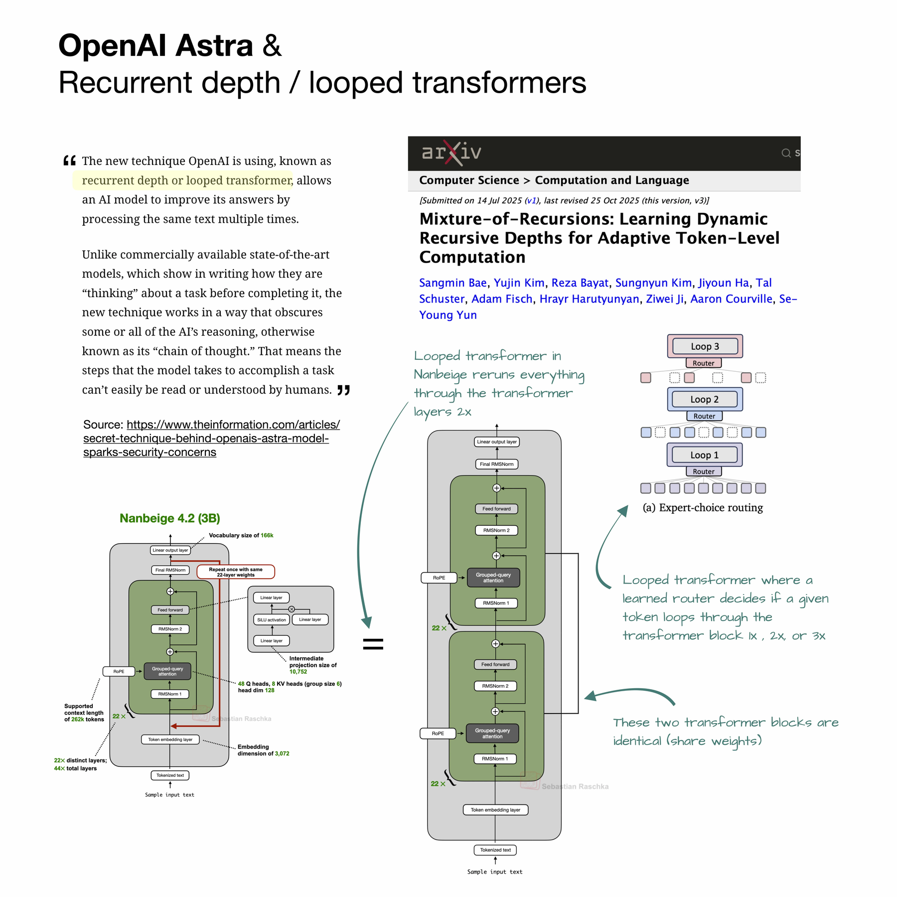

# OpenAI Astra and Looped Transformers — 블로그 글 리뷰

---

## 📋 메타 정보

| 항목 | 내용 |
|---|---|
| **제목** | OpenAI Astra and Looped Transformers |
| **저자** | Sebastian Raschka |
| **공개일** | 2026-09-02 |
| **형식** | 논문 아님. Substack 노트의 웹사이트 버전 (본문 15문단 남짓의 짧은 글) |
| **분야** | LLM architecture(구조) / 효율화 / AI safety(안전성) 논쟁 |
| **원문 링크** | https://sebastianraschka.com/blog/2026/openai-astra-looped-transformers.html |
| **원문 X 게시글** | https://x.com/rasbt/status/2095141254958858496 |
| **논쟁 발단** | The Information 보도 — "OpenAI Astra는 recurrent depth 또는 looped transformer를 쓴다" |
| **확산 기사** | Fortune (2026-09-03) — 안전 전문가 우려 보도 |
| **본문에서 인용된 모델** | Nanbeige4.2-3B (arXiv 2607.22083), Mixture-of-Recursions (arXiv 2507.10524, NeurIPS 2025) |
| **글이 빠뜨린 선행 연구** | Universal Transformer (2018), ALBERT (2019), Huginn-3.5B / Recurrent Depth (Geiping et al., 2025-02) |
| **코드/가중치** | 해당 없음 (Astra 미공개). 단 Nanbeige4.2-3B는 공개 가중치 존재 |
| **직접 실측한 것** | `Nanbeige4.2-3B-Base`의 `config.json` / `configuration_nanbeige.py` / `modeling_nanbeige.py` (Hugging Face 공개본) — 원문 주장의 사실 확인용 |
| **재현 코드** | `code_looped_transformer_demo.py` (본 저장소, 실행 가능) — §코드로 읽는 looped transformer 의 출력 전부를 재현 |



*Figure 1. 원문의 유일한 그림. Astra의 recurrent depth 보도 내용, Nanbeige 4.2의 반복 레이어, Mixture-of-Recursions의 토큰 단위 routing(경로 배정)을 나란히 놓고 비교한 합성 다이어그램.*

---

## 📖 주요 용어 사전 (Glossary)

*이 글은 짧은 대신 전문 용어가 압축돼 있어서, 용어를 먼저 풀어두지 않으면 논쟁의 쟁점 자체가 안 보인다. 그래서 본문보다 이 절을 앞에 둔다.*

### 구조 (Architecture)

| 용어 | 쉬운 풀이 |
|---|---|
| **looped transformer(루프 트랜스포머)** | Transformer 레이어 뭉치를 여러 개 새로 만드는 대신, **같은 레이어 뭉치를 여러 번 다시 통과**시키는 구조. 가중치(weight)는 하나만 저장하고 계산만 반복함. |
| **recurrent depth(재귀 깊이)** | 위와 사실상 같은 말. "깊이(레이어 수)를 반복으로 만들어낸다"는 뜻. Astra 보도에 쓰인 용어. |
| **layer stack(레이어 스택)** | Transformer 블록 여러 층을 쌓아 올린 한 덩어리. Nanbeige에선 22층이 한 덩어리. |
| **weight sharing / parameter sharing(가중치 공유)** | 여러 층이 **같은 파라미터를 공유**하는 것. 루프 트랜스포머의 본질이 바로 이것. |
| **effective depth(유효 깊이)** | 실제 저장된 층 수가 아니라, 데이터가 실제로 통과한 총 층 수. 22층을 2번 돌면 유효 깊이 44층. |
| **hidden state(은닉 상태)** | 모델 내부에서 토큰 하나를 나타내는 중간 벡터. 사람이 읽을 수 없는 숫자 덩어리. |
| **latent activation(잠재 활성값)** | 은닉 상태와 거의 같은 뜻으로 쓰이며, "텍스트로 읽히지 않는 내부 계산 결과"를 강조할 때 씀. |

### 이 글에 등장하는 비교 대상

| 이름 | 정체 |
|---|---|
| **Astra** | OpenAI의 차기 frontier model(최전선 모델). 아직 미공개. 구조 정보는 The Information 보도가 유일한 출처. |
| **Nanbeige4.2-3B** | 30억 파라미터 공개 가중치 모델. 22층 스택을 2번 통과하는 looped transformer를 28조(28T) 토큰 사전학습에 실제로 적용한 사례. |
| **Mixture-of-Recursions (MoR)** | NeurIPS 2025 논문. 루프를 고정 횟수로 돌리는 대신 **router(라우터)** 를 학습시켜 토큰마다 몇 번 돌지 다르게 정함. 쉬운 토큰은 일찍 빠져나가고(early exit) 어려운 토큰만 더 돈다. |
| **Huginn-3.5B** | 원문이 언급하지 않은 핵심 선행 연구. "Scaling up Test-Time Compute with Latent Reasoning: A Recurrent Depth Approach" (Geiping et al., 2025-02). 보도 용어 "recurrent depth"의 실제 출처. |

### 코드/구현 용어

*아래 §코드로 읽는 looped transformer 를 읽으려면 필요한 최소한의 용어들. 루프의 진짜 비용이 여기서 갈린다.*

| 용어 | 쉬운 풀이 |
|---|---|
| **KV cache(키·값 캐시)** | 이미 처리한 토큰의 key/value를 저장해 두고 재사용하는 장치. 이게 없으면 토큰 하나 뽑을 때마다 문장 전체를 다시 계산해야 함. 긴 문맥에서는 **메모리를 지배하는 것이 가중치가 아니라 이 캐시**다. |
| **cache slot(캐시 슬롯)** | 층마다 하나씩 배정되는 캐시 칸. 루프 모델에서는 층 수가 아니라 **층 수 × 루프 횟수**만큼 필요하다는 것이 핵심 함정. |
| **GQA (Grouped-Query Attention)** | query head는 많이 두되 key/value head는 적게 두어 KV cache를 줄이는 기법. Nanbeige는 query 48개 : KV 8개. |
| **early exit(조기 종료)** | 쉬운 토큰이 정해진 바퀴를 다 돌지 않고 중간에 빠져나가는 것. 여기서 비로소 연산이 실제로 절약된다. |
| **router(라우터)** | "이 토큰은 몇 바퀴 돌려야 하나"를 예측하는 아주 작은 층. MoR의 핵심 부품. |
| **top-1 gating(최상위 1개 선택)** | router가 후보 중 점수가 가장 높은 하나를 고르는 방식. 그냥 argmax만 쓰면 gradient(기울기)가 안 흘러 학습이 안 되므로, 선택 확률을 곱해 주는 처리가 따라붙는다. |
| **gradient checkpointing(기울기 체크포인팅)** | 학습 중 중간 결과를 저장하지 않고 필요할 때 다시 계산해 메모리를 아끼는 기법. 루프의 KV 공유 옵션과 **충돌**한다는 게 실전 제약. |
| **forward hook(포워드 훅)** | 모듈이 실제로 몇 번 호출됐는지 세기 위해 PyTorch에 다는 관찰 장치. 아래 데모에서 "연산이 정말 2배인지"를 재는 데 씀. |

### 안전성 논쟁 용어

| 용어 | 쉬운 풀이 |
|---|---|
| **chain-of-thought, CoT(사고 사슬)** | 모델이 답을 내기 전에 **텍스트로 뱉는 중간 추론 과정**. 사람이 읽을 수 있다는 게 핵심. |
| **CoT monitorability(사고 사슬 감시 가능성)** | 그 중간 추론 텍스트를 사람이 읽어서 모델이 무슨 꿍꿍이인지 감시할 수 있는 성질. AI 안전 진영이 지키고 싶어 하는 것. |
| **latent reasoning(잠재 추론)** | 텍스트를 안 뱉고 **내부 벡터 안에서만** 추론을 진행하는 것. 감시가 불가능해짐. |
| **neuralese(뉴럴리즈)** | 위의 latent reasoning 결과물을 부르는 별명. "기계는 읽지만 사람은 못 읽는 언어". |
| **test-time compute scaling(추론 시점 연산 확장)** | 학습이 아니라 **답할 때** 계산을 더 써서 성능을 올리는 것. CoT 토큰을 더 뽑는 방식과 루프를 더 도는 방식, 두 가지 길이 있음. |

---

## 🎯 TL;DR (한 줄 + 요지)

**한 줄:** Astra의 "looped transformer"를 두고 벌어진 소동에 대해, Raschka가 "그건 그냥 레이어 재사용이고 이미 공개 모델에 있다"고 김을 빼는 짧은 글 — **소음 정리에는 성공했지만, 정작 논쟁의 출처인 Huginn 논문을 빠뜨려 계보와 안전성 반박 두 군데가 비었다.**

**다룬 문제:** The Information이 "Astra가 recurrent depth를 쓴다"고 보도 → Fortune이 안전 전문가 우려를 받아 확산 → "새롭고 위험한 아키텍처"라는 서사가 형성됨.

**글의 해법:** 기법의 정체를 한 문장으로 환원("레이어 스택 재사용")하고, 이미 공개 가중치 모델(Nanbeige4.2-3B)에 존재한다는 반례를 제시.

**근거:** Nanbeige 4.2 기술보고서의 수치 한 줄 — 2회 통과가 최적, 표준 구조 대비 **토큰 효율 약 75% 유지**.

---

## 🔥 글이 주장하는 것 (3가지)

*원문이 무엇을 말하려는 글인지 먼저 못 박아야, 뒤의 "맞다/틀리다" 평가가 따라온다.*

1. **looped transformer = 레이어 스택 재사용, 그게 전부다.** Nanbeige4.2-3B는 22층 스택을 2번 통과시켜 사실상 44층처럼 쓰되 가중치는 복제하지 않는다.
2. **트레이드오프(trade-off, 득실 교환)는 단순하다.** 저장 공간과 RAM은 그대로, 대신 연산(compute)은 거의 2배. 원문 표현대로 "새로운 아키텍처"가 아니라 **"tiny architectural tweak(사소한 구조 손질)"**.
3. **"이 기법을 쓰면 모델의 생각 과정이 감춰진다"(obscures some or all of the AI's reasoning)는 보도는, 루프를 쓴다고 저절로 그렇게 된다는 보장이 없다.** 레이어를 다시 밟는 것(reusing layers)은 보통 레이어와 똑같이 **다음 글자를 뽑기 전에 내부에서 계산을 더 하는 것**(adds computation in hidden states before the next token is emitted)일 뿐이다. 원래 transformer도 이미 층을 통과하며 사람이 못 읽는 숫자로 계산을 하고 있었으니, 루프는 그 층을 몇 번 더 밟는 것에 가깝다. 즉 루프는 **"내부 계산량을 늘리는 손잡이(knob)"이지 "화면에 풀이를 보여줄지 말지 정하는 스위치(switch)"가 아니다.** 굳이 우려를 살려 읽으면 "루프를 많이 돌수록 중간 풀이 토큰(intermediate reasoning tokens, chain-of-thought)을 덜 뽑아도 되니, 계산이 사람이 못 읽는 latent activation(잠재 활성값) 쪽으로 숨는다"는 것인데, 그건 **모델을 그냥 키워도(scaling up the model size) 똑같이 생기는 현상**이다. (→ 왜 이게 저절로 성립하지 않는지는 Q4, 그럼에도 이 반박이 반만 맞는 이유는 §약한 부분 ②)

> 원문의 해당 문장: *"Reusing layers does not by itself suppress visible chain of thought."* (레이어 재사용은 그 자체로는 눈에 보이는 사고 사슬을 억누르지 않는다)

---

## ⚙️ 주요 메커니즘 설명

*이 기법이 무엇을 아끼고 무엇을 더 쓰는지가 이 논쟁 전체의 갈림길인데, 언론 보도가 이걸 정확히 뒤집어 놓았기 때문에 여기서 정리한다.*

### 1. 루프 트랜스포머의 동작 (원문의 핵심 설명)

가장 짧게 쓰면 이렇다. 22개 블록을 만들어 두 번 호출하는 것 — 진짜로 `for` 루프 한 겹이다.

```
표준 44층:  x → [L1 … L44]           → out     (가중치 44개 층 저장)
루프 22×2:  x → [L1 … L22] → [L1 … L22] → out  (가중치 22개 층만 저장, 두 번 통과)
```

여기서 반드시 구분해야 할 것:

| 자원 | 표준 44층 | 루프 22층×2 | 결론 |
|---|---|---|---|
| **파라미터/저장 용량** | 44층분 | **22층분 (절반)** | ✅ 절약됨 |
| **메모리 대역폭 (weight 로딩)** | 44층분 | **22층분 (절반)** | ✅ 절약됨 |
| **연산량 (FLOPs)** | 44층분 | 44층분 | ❌ 그대로 |
| **22층 대비 연산량** | — | **약 2배** | ❌ 더 비쌈 |

> ⭐ **이 글의 가장 실용적인 기여가 바로 이 구분이다.** 루프는 **파라미터와 메모리를 아끼는 기법이지, 연산을 아끼는 기법이 아니다.** 44층짜리 모델을 22층 무게로 들고 다니는 것에 가깝다.
>
> Fortune 기사의 "연산 50~90% 절감"이라는 표현은 이 구분을 흐렸고, 원문의 "거의 2배 비싸다"가 기술적으로 정확하다. 따라서 **on-device(온디바이스)·edge(엣지) 배포에서 의미 있는 기법이지, 데이터센터 학습 비용을 줄이는 기법이 아니다.**

### 2. 세 갈래의 루프 — "어떤 루프냐"가 전부다

원문이 뭉뚱그린 지점이라 여기서 갈라 둔다. 루프 트랜스포머라고 다 같은 물건이 아니다.

| 방식 | 루프 횟수 | 대표 사례 | CoT 감시 우려 |
|---|---|---|---|
| **고정 루프 (fixed loop)** | 학습·추론 모두 고정 2회 | Nanbeige4.2-3B | **사실상 없음** — 그냥 깊은 모델 |
| **토큰별 적응 루프 (adaptive, router 기반)** | 토큰마다 1~N회, router가 결정 | Mixture-of-Recursions | 낮음 — 효율이 목적 |
| **가변 대량 루프 (latent reasoning)** | 학습 평균 32회, 추론 시 최대 50회 | Huginn-3.5B | **실체 있음** — 목적 자체가 "CoT 토큰 없이 latent에서 추론" |

원문은 **첫 번째 칸(Nanbeige) 사례 하나로 세 칸 전체를 일반화**해서 안전성 우려를 기각한다. 이게 뒤에 나올 비판 ②의 뿌리다.

---

## 📊 정량 근거와 계보 정리

### 이 글의 유일한 숫자: 토큰 효율 75%

*짧은 글이라 정량 근거가 딱 하나뿐인데, 그 하나가 해석 없이 지나가서 주장의 무게를 재기 어렵다.*

Nanbeige 4.2 기술보고서 인용 내용:
- 2회 통과가 **최적의 trade-off**
- 표준 구조 대비 **토큰 효율(token efficiency) 약 75% 유지**
- 3회 이상은 **이득 거의 없고 학습만 훨씬 느리고 비싸짐**

문제는 **"표준 구조"의 기준선이 22층인지 44층인지 원문이 밝히지 않는다**는 점이다. 해석에 따라 결론이 정반대가 된다.

| 기준선 해석 | 의미 | 평가 |
|---|---|---|
| **진짜 44층 대비 75%** | 파라미터 절반으로 성능 3/4 확보 | ✅ 상당히 좋은 거래 (문맥상 이쪽이 자연스러움) |
| **22층 대비 75%** | 연산 2배 쓰고 오히려 손해 | ❌ 말이 안 됨 |

### recurrent depth 계보표 (원문이 잘못 잡은 부분)

*원문은 계보를 2025년 7월 MoR 논문에서 시작한다고 썼는데, 실제 뿌리는 훨씬 길고 그 사이에 논쟁의 핵심 논문이 끼어 있다.*

| 연도 | 연구 | 무엇을 했나 |
|---|---|---|
| 2018 | **Universal Transformer** | Transformer 블록을 반복 적용 + 토큰별 적응적 종료 (ACT, Adaptive Computation Time) |
| 2019 | **ALBERT** | cross-layer parameter sharing(층간 파라미터 공유)으로 BERT 파라미터를 대폭 축소 |
| 2025-02 | **Huginn-3.5B** (Geiping et al.) | "Scaling up Test-Time Compute with **Latent Reasoning**: A **Recurrent Depth** Approach". prelude 2층 / **recurrent core 4층** / coda 2층, 학습 시 평균 32회·추론 시 최대 50회 반복. 8000억(800B) 토큰 학습 |
| 2025-07 | **Mixture-of-Recursions** (arXiv 2507.10524) | 학습된 router가 토큰별 재귀 깊이 결정. Expert-choice / Token-choice 두 가지 routing, 살아남은 토큰만 KV cache에 담아 메모리도 절약 |
| 2026 | **Nanbeige4.2-3B** (arXiv 2607.22083) | 공개 가중치 대규모 적용. 22층×2, 28T 토큰. 단순 루프만으로는 부족해 **LoopSplit, depth attention이 붙은 mHC, n-gram 임베딩 concat** 등 부가 장치 추가 |

---

## ✅ 맞는 부분

*무엇이 옳은지 먼저 인정해야 뒤의 비판이 트집이 아니라 리뷰가 된다.*

1. **"새 아키텍처"라는 프레이밍은 과장이 맞다.** 구현 관점에서 for 루프 한 겹이라는 지적은 정확하고, "새롭고 더 효율적인 AI 아키텍처"라는 언론 표현은 부풀려졌다.
2. **절감되는 자원이 무엇인지 정확히 짚었다.** (위 표 참조) 연산이 아니라 파라미터·메모리라는 구분은 이 글의 최대 가치.
3. **공개 반례를 구체적으로 제시했다.** Nanbeige4.2-3B라는 실제 공개 가중치 사례를 든 것은 "OpenAI만의 비밀 병기" 서사를 깨는 데 효과적이다.

---

## ⚠️ 약한 부분 (리뷰어 지적)

*짧은 노트라는 형식을 감안하더라도, 논박을 목적으로 쓴 글이라면 넘어가기 어려운 구멍이 네 개 있다.*

### ① 계보를 잘못 잡았다 — 가장 큰 결함

원문은 "이 아이디어는 NeurIPS 논문 Mixture-of-Recursions로 거슬러 올라간다"고 쓰는데 **부정확하다.** MoR은 2025년 7월 논문이고, 진짜 뿌리는 위 계보표대로 2018년까지 간다.

특히 **Huginn 논문을 언급하지 않은 것이 치명적**이다. 이유는 셋:

- The Information이 쓴 용어 **"recurrent depth"가 바로 Huginn 논문 제목의 표현**이다. 논박하려는 보도의 개념 출처가 그 논문인데, 정작 리뷰에 없다.
- Huginn은 Nanbeige의 "고정 2회"와 **성격이 완전히 다른 물건**이다 (코어 4층을 수십 번 반복).
- 그리고 Huginn의 세일즈 포인트가 정확히 **"CoT 토큰을 뽑지 않고 latent에서 추론한다"** 이다. → **논박하려는 안전성 우려의 근거가 빠뜨린 논문 안에 들어 있다.**

### ② CoT 반박이 절반만 맞다

"레이어 재사용 자체가 visible chain of thought를 억제하지 않는다" — **메커니즘 서술로는 맞다.** 하지만 쟁점을 비껴간다.

- 안전 진영의 논점은 "루프가 CoT를 지운다"가 아니라 **"루프 횟수를 늘리는 것이 CoT 토큰을 늘리는 것의 대체재가 되도록 학습·설계될 유인이 생긴다"** 이다. Huginn이 명시적으로 그걸 목표로 삼았으니 가설이 아니라 이미 존재하는 연구 방향이다.
- 원문이 제시한 반론 — "모델을 키워도 같은 효과" — 도 절반만 맞다. **scale-up(규모 확장)은 깊이가 학습 때 고정**돼 추론 시 조절이 불가능하다. 반면 recurrent depth는 **추론 시점에 루프 수를 늘려 test-time compute를 확장**할 수 있고, 이것이 정확히 "생각 토큰을 더 뽑기"와 경쟁하는 축이다. 두 축을 같다고 놓은 건 무리다.

### ③ "tiny architectural tweak"이 학습 난이도를 숨긴다

코드의 for 루프 자체는 한 줄이 맞지만, 그 한 줄을 실제로 돌리려면 주변에 붙는 처리가 사소하지 않다. 공개된 `modeling_nanbeige.py`가 그 목록을 그대로 보여준다 (→ 상세는 §코드 로 읽는 looped transformer).

- **KV cache 슬롯을 루프별로 분리**해야 함 — 캐시 인덱스가 `layer_idx + loop_idx * num_hidden_layers`. 즉 **파라미터는 절반이어도 KV cache는 절반이 아니다.** 추론 메모리 이득이 여기서 반감된다.
- **루프 경계의 정규화 위치**가 별도 스위치(`skip_loop_final_norm`)로 존재 — 매 루프 끝에 normalize할지, 맨 끝에서 한 번만 할지가 설계 결정 사항이라는 뜻.
- **gradient checkpointing과 충돌** — `loop_share_kv`, `enable_depth_attention`은 학습 중 gradient checkpointing과 함께 못 쓰도록 코드가 명시적으로 막아 놓았다. 메모리 절약 기법끼리 부딪힌다는 실전 제약.
- **중간 루프 출력에 별도 loss** — `loop_loss_weights`가 존재. 루프마다 중간 출력에 가중치를 걸어 학습을 잡아 준다는 것은, 그냥 두 번 돌리면 학습이 잘 안 된다는 방증.
- pipeline parallelism(파이프라인 병렬화)이 어려워짐 — 같은 가중치를 다시 밟아야 해서 깊이 방향 분산이 꼬임.

> ⚠️ **정정**: 공개된 `Nanbeige4.2-3B-Base`의 `config.json`을 실측한 결과, **LoopSplit(`enable_double_loop_split`)·mHC(`enable_mhc`)·depth attention(`enable_depth_attention`)·hyper connection은 모두 꺼져 있다** (config에 키 자체가 없고 기본값이 전부 `False`). 이 장치들은 `modeling_nanbeige.py`에 **구현만 되어 있는 옵션**이고, 출시된 Base 체크포인트는 **22층 × 2회의 평범한 고정 루프**다. 따라서 "부가 장치를 얹어야만 돌아간다"는 서술은 이 체크포인트에는 해당되지 않는다. 대신 위의 KV cache 분리·정규화 위치·loop_loss_weights·checkpointing 제약이 실제 난이도의 증거다.

### ④ 근거의 비대칭

Astra에 대한 공개 정보가 The Information 보도뿐인 상황에서, 원문은 그 보도를 "기자가 다른 기법을 말했거나 오해했을 수 있다"고 처리한다. 그런데 **자기 쪽 근거도 Nanbeige 사례 하나에서 나온 유추**다. 반박의 무게가 대칭이 아니다.

---

## 💻 코드로 읽는 looped transformer

*원문은 "그냥 레이어 재사용"이라고만 말하고 코드를 보여주지 않는다. 실제로 몇 줄인지, 그리고 그 몇 줄 주변에 무엇이 더 필요한지를 직접 확인해야 "사소한 손질"이라는 평가가 맞는지 판단할 수 있다.*

### 1. 실측한 Nanbeige4.2-3B-Base 설정 (Hugging Face 공개 `config.json`)

*원문 주장의 사실 확인. 22층·2회 루프라는 서술이 실제 배포된 체크포인트와 일치하는지 본다.*

| 키 | 값 | 의미 |
|---|---|---|
| `num_hidden_layers` | **22** | 실제로 저장된 블록 수 |
| `num_loops` | **2** | 그 22층을 통과시키는 횟수 → 유효 깊이 44 |
| `hidden_size` | 3072 | |
| `num_attention_heads` / `num_key_value_heads` | 48 / 8 | GQA(Grouped-Query Attention) |
| `loop_loss_weights` | `[]` (비어 있음) | 중간 루프 출력에 별도 loss를 거는 옵션 — 이 체크포인트는 미사용 |
| `skip_loop_final_norm` | `false` | **루프 끝날 때마다 정규화** 수행 (맨 끝 한 번만 하는 모드도 있음) |
| `enable_double_loop_split` (LoopSplit) | 키 없음 → 기본 `False` | **꺼짐** |
| `enable_mhc` / `enable_depth_attention` / `enable_hyper_connection` | 키 없음 → 기본 `False` | **전부 꺼짐** |

> ✅ 결론: 원문의 "22층 스택을 2번 통과" 서술은 **배포된 가중치와 정확히 일치**한다. LoopSplit 같은 화려한 장치들은 코드에 구현만 되어 있고 이 체크포인트에선 안 쓴다.

### 2. 최소 구현 — 루프의 본체는 정말 `for` 한 줄

*"tiny tweak"이라는 표현이 어디까지 맞는지 눈으로 확인하는 부분.*

```python
class LoopedTransformer(nn.Module):
    """
    핵심. 블록은 22개만 만들고, forward 에서 두 번 통과시킨다.
    => 저장되는 가중치는 22벌, 데이터가 지나가는 층은 44층.
    """
    def __init__(self, n_layers=22, num_loops=2, skip_loop_final_norm=False):
        super().__init__()
        self.layers = nn.ModuleList([Block() for _ in range(n_layers)])  # 22개뿐
        self.norm = nn.LayerNorm(D)
        self.num_loops = num_loops
        # 루프와 루프 사이에 정규화를 넣을지 여부.
        # 안 넣으면 hidden state 크기가 루프마다 누적되며 커져 학습이 발산하기 쉽다.
        # (Nanbeige config 의 skip_loop_final_norm 이 정확히 이 스위치)
        self.skip_loop_final_norm = skip_loop_final_norm

    def forward(self, x):
        for loop_idx in range(self.num_loops):   # ← 이 for 문 한 줄이 "looped transformer" 의 전부
            for blk in self.layers:              #   같은 self.layers 를 매 루프 다시 밟는다
                x = blk(x)
            if not self.skip_loop_final_norm:    # 루프 경계마다 정규화 (기본 동작)
                x = self.norm(x)
        if self.skip_loop_final_norm:            # 스킵 모드면 맨 끝에서 한 번만
            x = self.norm(x)
        return x
```

**실행 결과** (hidden 256 / head 4 / 22층 × 2 vs 44층, forward hook으로 블록 호출 횟수 실측):

```
표준 44층      : 파라미터   34,749,952  | 저장 블록 44개 | 통과 층 44
루프 22층 x 2  : 파라미터   17,375,232  | 저장 블록 22개 | 통과 층 44
→ 파라미터 비율 : 0.500  (약 절반 = 메모리 이득)
→ 블록 호출 횟수: 표준 44회 vs 루프 44회  (연산은 동일 = 절약 아님)
→ 22층짜리 단독 모델 대비하면 루프는 연산 2배
```

> ⭐ §주요 메커니즘의 자원 비교 표가 여기서 숫자로 확인된다. 파라미터는 정확히 0.500배, 블록 호출은 44회로 동일.

### 3. 진짜 함정 — 루프별 KV cache 분리

*이 문서에서 가장 실전적인 부분. "메모리 절반"이라는 말이 추론 단계에서 왜 그대로 성립하지 않는지가 여기서 드러난다.*

루프 1회차의 3번 층과 2회차의 3번 층은 **가중치는 같지만 입력이 다르다.** 따라서 만들어내는 key/value도 완전히 다르다. 캐시 슬롯을 층 번호로만 관리하면 뒤 루프가 앞 루프의 캐시를 덮어써서 생성이 망가진다.

`modeling_nanbeige.py`가 쓰는 인덱스 계산은 정확히 이 문제를 푸는 형태다:

```python
# 잘못된 방식 — 층 번호만 사용 → loop 0과 loop 1이 같은 슬롯을 놓고 충돌
naive_slot   = layer_idx

# 올바른 방식 — 루프마다 슬롯을 통째로 밀어서 분리
correct_slot = layer_idx + loop_idx * num_hidden_layers
```

```
  loop=0 layer= 0 | naive slot= 0 (충돌!) | correct slot= 0
  loop=0 layer= 3 | naive slot= 3 (충돌!) | correct slot= 3
  loop=0 layer=21 | naive slot=21 (충돌!) | correct slot=21
  loop=1 layer= 0 | naive slot= 0 (충돌!) | correct slot=22
  loop=1 layer= 3 | naive slot= 3 (충돌!) | correct slot=25
  loop=1 layer=21 | naive slot=21 (충돌!) | correct slot=43
```

> ⚠️ **캐시 슬롯이 22개가 아니라 44개 필요하다.** 즉 **파라미터는 절반이지만 KV cache는 절반이 아니다.** 긴 문맥 추론에서는 KV cache가 메모리를 지배하므로, 루프의 "메모리 절반" 이득은 실제로는 상당 부분 상쇄된다. 원문이 다루지 않은 지점.
>
> 참고로 이 문제의 회피책이 `loop_share_kv` (2회차가 1회차의 KV를 재사용) 인데, 코드가 **학습 중 gradient checkpointing과 동시 사용을 명시적으로 금지**한다. 메모리 절약 기법끼리 부딪히는 실전 제약.

### 4. MoR 스타일 router — 여기서 비로소 연산이 절약된다

*Nanbeige식 고정 루프와 MoR의 차이가 코드에서 어떻게 갈리는지 보는 부분. 고정 루프는 연산이 늘지만, router를 달면 줄어든다.*

```python
class MoRTransformer(nn.Module):
    """
    Nanbeige 식 고정 루프와의 차이: 몇 번 돌지를 '학습된 router' 가 토큰마다 정한다.
    쉬운 토큰은 1회만 돌고 빠지고(early exit), 어려운 토큰만 더 돈다 → 연산도 실제로 절약됨.
    """
    def __init__(self, n_layers=4, max_loops=3):
        super().__init__()
        self.layers = nn.ModuleList([Block() for _ in range(n_layers)])
        self.router = nn.Linear(D, max_loops)   # 토큰당 "몇 바퀴 돌래?" 를 예측하는 아주 작은 층
        self.max_loops = max_loops

    def forward(self, x):
        # top-1 gating: 시작 시점에 토큰마다 목표 깊이를 한 번 확정 (token-choice 방식)
        logits = self.router(x)                       # (B, T, max_loops)
        depth = logits.argmax(-1) + 1                 # (B, T) 각 토큰의 루프 횟수 1..max_loops
        gate = logits.softmax(-1).max(-1).values      # router 를 학습시키려면 gradient 가 흘러야 하므로
                                                      # 선택 확률을 곱해 준다 (없으면 argmax 라 학습 불가)
        for loop_idx in range(self.max_loops):
            h = x
            for blk in self.layers:
                h = blk(h)
            # 이번 바퀴를 '아직 돌아야 하는' 토큰만 갱신하고 나머지는 이전 값 유지 = early exit
            active = (depth > loop_idx).unsqueeze(-1).float()
            x = torch.where(active.bool(), x + gate.unsqueeze(-1) * (h - x), x)
        return x, depth
```

**실행 결과** (랜덤 초기화라 배정 자체는 무의미. 메커니즘 확인용):

```
토큰별 배정된 루프 횟수: [1, 3, 2, 2, 2, 3, 2, 2, 2, 3, 3, 2]
평균 깊이 2.25바퀴 (전부 3바퀴 돌리면 3.00) → 실제 연산 75%만 사용
```

세 가지가 여기서 갈린다:

| | 고정 루프 (Nanbeige) | router 루프 (MoR) |
|---|---|---|
| 루프 횟수 | 코드에 상수로 박힘 (`num_loops=2`) | `self.router`가 토큰마다 예측 |
| 연산 | 늘어남 (2배) | **줄어듦** (early exit) |
| 추가 파라미터 | 0 | router 한 층 (아주 작음) |
| 학습 난이도 | 낮음 | 높음 — router가 무너지면(전부 같은 깊이 선택) 이득이 0 |

### 5. 실제 저장소에서 볼 곳

| 저장소 | 어디를 보면 되나 |
|---|---|
| `Nanbeige/Nanbeige4.2-3B-Base` (HF) | `modeling_nanbeige.py`의 `NanbeigeModel.forward` 안 `for loop_idx in range(num_loops)` 블록, 그리고 `_get_loop_cache_layer_idx` 헬퍼 |
| `raymin0223/mixture_of_recursions` (GitHub) | Expert-choice / Token-choice routing 구현 |
| `tomg-group-umd/huginn-0125` (HF) | prelude / recurrent core / coda 3분할과 반복 횟수 샘플링 |

---

## 💬 Q&A

### Q1. 그래서 왜 프론티어 랩들은 지금까지 이걸 안 썼나? (원문에 없는 부분)

*이 질문에 답해야 "왜 지금 Astra에서 화제가 되나"가 풀리는데 원문에는 없다.*

| 안 쓴 이유 | 설명 |
|---|---|
| **학습 비용이 늘어난다** | 연산이 2배인데 학습 예산이 병목인 곳에선 매력이 없음 |
| **병렬화가 나빠진다** | 같은 가중치를 다시 밟아야 해서 깊이 방향 분산 학습이 꼬임 |
| **파라미터 절약이 이득이 아니다** | 어차피 수천억 파라미터를 굴릴 수 있는 쪽에선 무의미 |

반대로 **파라미터 예산이 강제로 고정된 상황** (온디바이스, 3B급, 메모리 대역폭 제약) 에서는 매우 합리적이다. Nanbeige가 3B에서 쓴 이유가 이것이다.

그래서 **Astra가 정말 이걸 쓴다면 "효율" 자체보다 추론 시 깊이를 조절 가능한 새 scaling axis(확장 축)를 노렸다고 보는 게 자연스럽고, 그 순간 안전 쪽 우려도 다시 살아난다.** 원문이 이 가능성을 닫아버린 것이 가장 아쉬운 지점.

### Q2. Fortune 기사에서 실제로 나온 주장과 인물은?

*논쟁의 온도를 알아야 이 글이 왜 "진화용"으로 쓰였는지 이해된다.*

| 주체 | 발언/주장 |
|---|---|
| **The Information** (최초 보도) | Astra가 효율을 위해 recurrent depth / looped transformer 사용 |
| 기술적 주장 | 표준 성능을 **연산 50~90% 덜 쓰고** 달성 가능, 대신 사람이 못 읽는 **neuralese** 산출 |
| **Steven Adler** (전 OpenAI, Guidelight AI Standards) | 사실이라면 OpenAI가 "업계에 몇 안 되는 redline(레드라인) 중 하나를 넘는 것" |
| **Peter Wildeford** (AI Policy Network) | "잠재적으로 매우 우려스럽고", "잠재적으로 무모함" |
| **Daniel Kokotajlo** (AI Futures Project) | OpenAI가 절제해도 "다른 곳이 밀어붙일 것" → 완전히 불투명한 추론으로 갈 위험 |
| **Jakub Pachocki** (OpenAI 수석과학자) | CoT 모니터링을 "매우 중시"하며 첫 reasoning model 때부터 보존·활용해 왔다. 감시 난이도 상승은 "구조 변경과 무관한 이유로도" 올 수 있다. 구조 세부는 추후 공개 |

주의: 기술적 주장 칸의 "연산 50~90% 절감"은 **위 §주요 메커니즘 표와 충돌한다.** 절약되는 건 메모리·파라미터이지 연산이 아니다. 이 지점이 원문이 옳게 짚은 부분.

### Q3. MoR은 Nanbeige의 고정 루프와 뭐가 다른가?

*원문이 "MoR이 조금 더 정교하다"고만 언급하고 넘어가서 실제 차이가 안 보인다.*

| 항목 | Nanbeige 고정 루프 | Mixture-of-Recursions |
|---|---|---|
| 루프 횟수 결정 | 모든 토큰 **똑같이 2회** | **router가 토큰마다** 1회, 2회, N회로 다르게 |
| routing 방식 | 없음 | **Expert-choice** (단계마다 상위 k개 토큰만 통과) / **Token-choice** (시작 시 top-1 gating으로 깊이 확정) |
| 연산 절약 | 없음 (오히려 2배) | 있음 — 쉬운 토큰이 early exit(조기 종료) |
| 메모리 추가 이득 | 파라미터 공유만 | 살아남은 토큰의 **KV cache만 저장**, attention도 활성 토큰끼리만 |

즉 MoR은 "파라미터 공유"와 "적응적 연산" 두 가지를 하나의 구조 안에서 동시에 노린 것이고, Nanbeige는 앞의 하나만 취한 셈이다.

### Q4. "루프를 쓰면 생각 과정이 감춰진다"는 말이 왜 저절로 성립하지 않나?

*보도와 원문이 정면으로 부딪히는 지점이라, 두 가지가 서로 다른 일이라는 것부터 갈라 놓아야 한다.*

> 📌 **용어 먼저.** 이런 주장에 흔히 쓰이는 "A이면 B가 **자동으로 따라 나온다**"(B automatically follows from A)는 논리학 표현이고, 쉬운 말로는 **"A라고 해서 B가 된다는 보장이 있다"**(guaranteed) 는 뜻이다. 여기서 원문이 부정하는 것은 **보장(guarantee)** 이지 **가능성(possibility)** 이 아니다. 이 구분이 이 절 전체의 핵심이다.

| | 무엇인가 | 비유 |
|---|---|---|
| **CoT (chain-of-thought, 사고 사슬)** | 모델이 답 내기 전에 **화면에 찍어 보여주는 중간 풀이 글자** | 시험 답안지에 **적는** 풀이 과정 |
| **루프 (layer 재사용)** | 글자를 찍기 전에 **내부에서 계산을 더 하는 것** | 답을 적기 전에 **머릿속으로 검산 한 번 더** 하기 |

핵심은 **원래 transformer도 이미 내부 계산을 하고 있었다**는 점이다. 층을 하나씩 통과할 때마다 사람이 못 읽는 숫자 덩어리(hidden state, 은닉 상태)로 계산이 진행되고(computation in hidden states), 그게 다 끝나야 글자 하나(token)가 나온다. 루프는 **그 층을 몇 번 더 밟는 것뿐**이지, 없던 능력이 새로 생기는 게 아니다.

그래서 손잡이(knob)와 스위치(switch)가 다르다는 것이다 (→ §글이 주장하는 것 3번). 검산을 두 번 한다고 해서 답안지에 풀이를 안 적게 되는 건 아니다. **풀이를 적을지 말지는 완전히 따로 정해지는 문제**이고, 그것을 정하는 것은 architecture(구조)가 아니라 학습 방식(training)과 설정이다.

**다만 "자동은 아니다"(not automatic)가 "무관하다"(unrelated)는 뜻은 아니다.** 내부 검산이 아주 강력해지면 "굳이 풀이를 길게 안 적어도 답이 맞네" 하는 방향으로 학습이 흘러갈 수는 있다. 즉 **강제되지는 않지만 유인(incentive)은 생긴다.** 그리고 Huginn 같은 연구는 그걸 부작용(side effect)이 아니라 **목표(objective)로 삼았다** — 논문 제목부터가 "Scaling up Test-Time Compute with **Latent Reasoning**"이다. 원문이 여기서 멈춘 것이 §약한 부분 ②의 지적이다.

### Q5. 이 글, 읽을 가치가 있나?

**본문 3분 + 위 계보표를 같이 보면 충분.** 원문만으로는 이 주제의 그림이 반쪽이다. 뉴스 소음을 걷어내는 용도로는 정확하고 유용하지만, recurrent depth 연구 지형을 파악하는 용도로는 부족하다.

---

## 🧾 한 줄 요약 (전체)

**하이프 진화용으로는 성공, 기술 리뷰로는 미완성** — "루프는 메모리를 아끼지 연산을 아끼지 않는다"와 "이미 공개 모델에 있다" 두 가지는 정확하지만, recurrent depth 계보의 핵심인 Huginn을 빼먹은 채 계보를 MoR에서 시작하고, "고정 2회 루프"와 "가변 수십 회 latent 반복"을 한 덩어리로 묶어 안전성 우려를 기각한 것은 분명한 약점이다.

---

## 🔗 관련 자료

| 자료 | 링크 |
|---|---|
| 원문 블로그 | https://sebastianraschka.com/blog/2026/openai-astra-looped-transformers.html |
| Fortune 기사 (2026-09-03) | https://fortune.com/2026/09/03/reports-openais-astra-model-uses-a-new-more-efficient-ai-architecture-alarms-ai-safety-experts-who-worry-the-method-makes-models-harder-to-control/ |
| Mixture-of-Recursions (arXiv) | https://arxiv.org/abs/2507.10524 |
| MoR 공식 코드 | https://github.com/raymin0223/mixture_of_recursions |
| Nanbeige4.2-3B 기술보고서 | https://arxiv.org/pdf/2607.22083 |
| Nanbeige4.2-3B-Base 가중치 | https://huggingface.co/Nanbeige/Nanbeige4.2-3B-Base |
| Huginn-3.5B 가중치 | https://huggingface.co/tomg-group-umd/huginn-0125 |
| Nanbeige 루프 구현 원본 | https://huggingface.co/Nanbeige/Nanbeige4.2-3B-Base/blob/main/modeling_nanbeige.py |
| 본 문서 재현 코드 (로컬) | `code_looped_transformer_demo.py` — `python3 code_looped_transformer_demo.py` 로 §코드 절의 출력 3종 전부 재현 |
