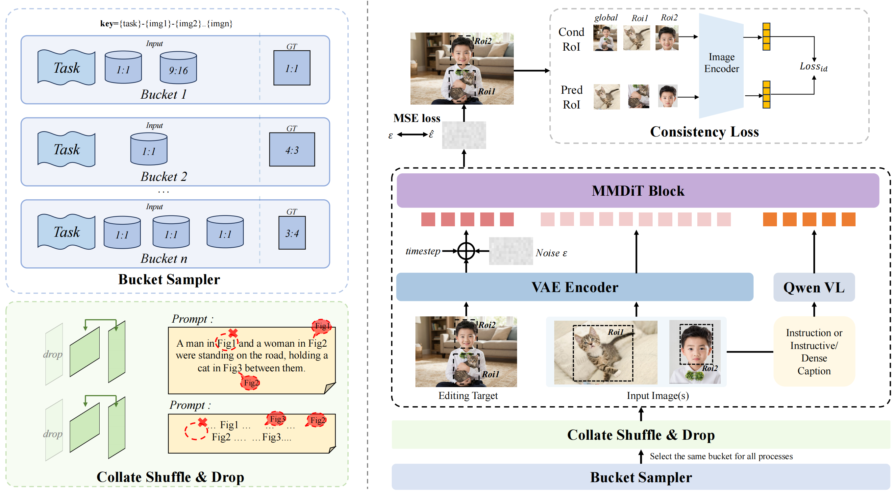

# PAPER: FireRed-Image-Edit — Qwen-Image(20B) 위에 데이터·RL로 쌓아올린 지시문 기반 이미지 편집 SOTA

> ### 🧱 베이스 모델 (가장 먼저 알아둘 것)
>
> **FireRed-Image-Edit 는 밑바닥부터 만든 모델이 아니다.** 이미 공개된 강력한 T2I(Text-to-Image, 텍스트→이미지 생성) 기반 모델인
> **Qwen-Image (Alibaba, ~20B DiT)** 를 **베이스 모델(base model)** 로 그대로 가져와, 그 위에 편집 능력을 학습으로 얹은 파생 모델이다.
>
> - **물려받은 것 (그대로 동결 사용)**: Qwen-Image 의 VAE(이미지 압축기) + 텍스트 인코더(Qwen2.5-VL ~7B)
> - **새로 학습한 것 (편집용 미세조정)**: Qwen-Image 의 생성 엔진인 **DiT(~20B) 단 하나**
> - **근거**: 공식 학습 코드가 Qwen-Image 전용 클래스(`AutoencoderKLQwenImage`, `QwenImageTransformer2DModel`, `Qwen2_5_VL`)를 그대로 로드 (→ 6.1)
>
> 즉 "어떤 T2I 기반 모델을 깔든 같은 레시피로 편집기를 만든다(backbone-agnostic)"는 철학에서, 실제 선택한 백본이 **Qwen-Image** 였다. (왜 하필 Qwen-Image? 한자 텍스트 렌더링 SOTA 라 텍스트 편집에 유리 → Q6/6.3)

## 0. 이 문서를 읽는 법

이 문서는 FireRed-Image-Edit-1.0 기술 보고서(arXiv 2602.13344)와 공식 코드(GitHub `FireRedTeam/FireRed-Image-Edit`)를 함께 뜯어보며, 처음 읽는 사람도 흐름을 놓치지 않게 정리한 리뷰입니다.

핵심 메시지는 하나입니다.

> **FireRed-Image-Edit 는 새 구조를 발명한 게 아니라, 이미 강력한 T2I(Text-to-Image, 텍스트→이미지 생성) 기반 모델인 Qwen-Image(20B)를 그대로 가져와, 데이터 큐레이션(data curation, 데이터 정제) + 3단계 학습(Pretrain→SFT→RL) + 편집 특화 보상으로 "갈고닦아서" 지시문 기반 이미지 편집(instruction-guided image editing) 의 오픈소스 SOTA(state-of-the-art, 최고 성능)를 찍은 모델이다.**

문서 구성:

1. **메타 정보·용어 사전**: 누가/언제/무엇을, 그리고 알아둘 단어들
2. **큰 그림(TL;DR)·핵심 기여**: 왜 "구조가 아니라 데이터·RL"인가
3. **베이스 모델과 전체 구조**: Qwen-Image 20B 를 어떻게 물려받았나
4. **데이터셋 구성**: 학습 코퍼스(비공개 16억→1억) vs 평가 벤치마크(공개 REDEdit)
5. **핵심 알고리즘**: inverse 양방향 학습 + 5가지 기술 + 학습 코드
6. **실험 결과**: ImgEdit / GEdit / REDEdit 수치
7. **재현 가이드**: SFT 실제로 돌리는 법
8. **Q&A**: 대화에서 나온 질문들
9. **한 줄 요약 / 한계 / 관련 링크**

GitHub 렌더링 호환을 위해 수식은 LaTeX 대신 평문 표기를 우선합니다.

---

## 1. 메타 정보

| 항목 | 내용 |
|---|---|
| 논문 | FireRed-Image-Edit-1.0 Technical Report |
| 저자 | The Super Intelligence Team (Changhao Qiao, Chao Hui, Chen Li 외 약 18인) |
| 소속 | Xiaohongshu(샤오훙수, RED, 小红书) Intelligent Creation Team |
| 공개일 | 2026 (arXiv 2602.13344) |
| arXiv abstract | https://arxiv.org/abs/2602.13344 |
| arXiv PDF | https://arxiv.org/pdf/2602.13344 |
| 공식 코드 | https://github.com/FireRedTeam/FireRed-Image-Edit |
| 평가 데이터셋 | HuggingFace: `FireRedTeam/REDEdit-Bench` |
| 분야 | Image Editing(이미지 편집), Diffusion Transformer, Instruction-guided Editing |
| 베이스 모델 | **Qwen-Image** (T2I 기반 모델, DiT **~20B**) |
| 외부 의존 모델 | Qwen2.5-VL (텍스트·이미지 인코더, ~7B, **동결**), Qwen-Image VAE (**동결**) |
| 라이선스 | 코드·가중치 Apache 2.0 / 벤치마크 CC BY-NC-ND 4.0 |
| 버전 | 1.0(범용) · 1.1(인물·합성·텍스트스타일·메이크업 강화) · 1.0-Distilled(경량) |

> ⚠️ 파라미터 "20B"는 베이스 Qwen-Image 의 DiT 규모에서 추론한 값이며, 논문 초록/README 에 명시 숫자로 적혀 있지는 않다 (→ Q8 참조).

---

## 2. 주요 용어 사전 (Glossary)

*다른 절에서 처음 나오는 단어가 헷갈리지 않게 한곳에 모음. 쉬운 한국어 풀이 + 학술 원어를 괄호로 매칭.*

### 과제(task) 관련

| 용어 | 풀이 |
|---|---|
| T2I (Text-to-Image, 텍스트→이미지 생성) | 텍스트만 입력받아 노이즈에서 이미지를 새로 만드는 일. "백지에서 창조" |
| Image Editing(이미지 편집) | **원본 이미지 + 지시문**을 받아 시킨 부분만 고치는 일. "이미 있는 그림 수정" |
| instruction-guided(지시문 기반) | "강아지를 고양이로 바꿔줘" 같은 자연어 명령으로 편집하는 방식 |
| identity preservation(신원 보존) | 편집 후에도 인물 얼굴·안 건드린 영역이 그대로 유지되는 성질. 편집의 핵심 난제 |
| consistency(일관성) | 바꾸라고 안 한 부분이 변하지 않는 것. identity preservation 의 상위 개념 |

### 아키텍처 관련

| 용어 | 풀이 |
|---|---|
| DiT (Diffusion Transformer) | 이미지의 압축 표현(latent, 잠재)을 Transformer 로 노이즈 제거(denoising)하는 생성 엔진 |
| MMDiT (Multimodal DiT) | 텍스트와 이미지를 함께 다루는 DiT. Qwen-Image 가 채택 |
| VAE (Variational AutoEncoder) | 이미지를 작은 latent(잠재)로 압축하고 다시 복원하는 부품 |
| text encoder(텍스트 인코더) | 지시문(과 입력 이미지)을 벡터로 바꾸는 부품. 여기선 Qwen2.5-VL |
| frozen(동결) | 학습하지 않고 고정. FireRed 는 VAE·텍스트 인코더 동결, **DiT 만 학습** |
| backbone-agnostic(백본 비종속) | 특정 T2I 모델에 묶이지 않고, 어떤 T2I 위에든 같은 레시피로 편집기를 만들 수 있다는 설계 철학 |

### 학습 관련

| 용어 | 풀이 |
|---|---|
| Pretrain(사전학습) | 넓은 편집 능력의 기초를 잡는 1단계 |
| SFT (Supervised Fine-Tuning, 지도 미세조정) | 고품질 편집 데이터로 정답을 따라 학습하는 2단계 |
| RL (Reinforcement Learning, 강화학습) | 사람 선호·정밀도를 보상으로 끌어올리는 3단계 |
| flow matching | Qwen-Image/FireRed 가 쓰는 학습 방식. 노이즈→이미지로 흐르는 "속도장(velocity field)"을 맞추는 가중 MSE 손실 |
| inverse instruction(역방향 지시문) | 편집 결과(target) 이미지를 보고 거꾸로 적은 묘사 캡션. 양방향 증강의 핵심 (→ 5.1) |
| CFG (Classifier-Free Guidance) | 추론 때 "텍스트 있는 예측"과 "없는 예측"을 섞어 지시 반영도를 높이는 기법. 학습 때 텍스트를 일부 확률로 빈 문자열로 떨궈(text drop) 준비 |
| DPO (Direct Preference Optimization) | "좋은 결과 vs 나쁜 결과" 쌍으로 사람 선호를 직접 학습하는 RL 계열 기법 |
| DiffusionNFT | 확산 모델용 RL 기법. FireRed 는 여기에 OCR 보상을 결합 (→ 5.2) |
| FSDP / HSDP | 대형 모델을 여러 GPU 에 쪼개 학습하는 분산 방식 (Fully/Hybrid Sharded Data Parallel) |

### 평가 관련

| 용어 | 풀이 |
|---|---|
| REDEdit-Bench (RedBench) | FireRed 가 새로 만든 편집 평가셋. 15개 과제, 중·영 이중언어 (→ 4.2) |
| ImgEdit / GEdit | 기존 공개 편집 벤치마크 |
| VLM judge | 결과 이미지를 거대 비전·언어모델에게 보여 점수를 매기게 하는 자동 채점 방식 |
| G_SC / G_PQ / G_O | GEdit 지표 — 의미 일치(Semantic Consistency) / 품질(Perceptual Quality) / 종합(Overall) |

---

## 3. 큰 그림 (TL;DR) 과 핵심 기여

### 3.1 TL;DR

*왜 이 절을 두나: 논문 전체를 한 문단으로 압축해, 이후 디테일을 어디에 끼워 읽을지 지도를 먼저 준다.*

- **문제**: 지시문 기반 편집은 "시킨 건 바꾸고(편집성) + 안 시킨 건 보존(일관성)"이라는 모순된 두 목표를 동시에 만족해야 한다. 또 편집용 (원본, 결과, 지시문) 삼중쌍 데이터는 구하기 어렵다.
- **해결**: 구조 혁신 대신 ① 거대 T2I 백본(Qwen-Image 20B) 재활용, ② 16억→1억으로 **생성·편집 균형 있게** 거른 데이터, ③ Pretrain→SFT→RL 3단계, ④ 편집 특화 보상(OCR·일관성)과 inverse 양방향 증강.
- **검증**: ImgEdit Overall **4.56**, GEdit Overall EN **7.943** / CN **7.887** 로 오픈소스 1위, 일부 차원에서 상용(Seedream4.5, Nano-Banana-Pro) 초월.

### 3.2 핵심 기여 (Contributions)

1. **대규모 균형 데이터 파이프라인** — 16억 원본(T2I 9억 + 편집 7억)을 세척·계층화·자동라벨링·2단계 필터링으로 1억+ 고품질 샘플로 정제 (→ 4.1)
2. **백본 비종속 3단계 레시피** — Pretrain→SFT→RL 을 어떤 T2I 백본에든 이식 가능하게 설계 (→ 3절 전체)
3. **편집 특화 학습 기법 5종** — Multi-Condition Aware Bucket Sampler / Stochastic Instruction Alignment / Asymmetric Gradient DPO / DiffusionNFT+OCR 보상 / Differentiable Consistency Loss (→ 5.2)
4. **inverse 양방향 학습** — 한 편집 쌍으로 정방향(A→B)·역방향(B→A)을 모두 학습해 데이터 2배 + 생성·편집 균형을 데이터 한 줄에 구현 (→ 5.1, 코드로 확인됨)
5. **REDEdit-Bench 공개** — 15개 과제·중영 1,673쌍(공개 1,542쌍) 벤치마크, beauty·low-level 같은 실사용 시나리오 신설 (→ 4.2)

---

## 4. 데이터셋 구성

*왜 이 절을 두나: 이 논문의 진짜 차별점이 "구조"가 아니라 "데이터"에 있어서, 학습용 코퍼스와 평가용 벤치마크를 정확히 구분해 이해해야 한다.*

데이터는 완전히 다른 두 층위로 나뉜다.

### 4.1 학습용 코퍼스 (모델을 만드는 데 쓴 데이터, **비공개**)

*왜: 편집 모델 성능의 8할은 데이터에서 나오며, 논문이 가장 공들인 부분이다.*

```
원본 수집:  16억 쌍 (1.6B)
  ├─ T2I(생성용):    9억 쌍 (900M)
  └─ 편집용:         7억 쌍 (700M)
        │
        ▼  cleaning(세척) → stratification(계층화)
        │  → auto-labeling(자동 라벨링) → two-stage filtering(2단계 필터링)
        ▼
최종 학습:  1억+ 쌍 (100M+)   ← 약 1/16 압축, 생성:편집 균형
```

핵심 설계 포인트:

- **T2I 와 편집을 처음부터 함께 학습** — 베이스 Qwen-Image 의 생성 능력을 편집 미세조정 중에 잊지 않게(catastrophic forgetting 방지) 하고, 두 능력을 서로 떠받치게 함.
- **"균형(balanced)"이 명시 목표** — 단순히 많이 모은 게 아니라 생성:편집 비율과 과제 분포를 의도적으로 맞춰 1/16로 거름.

⚠️ **공개되지 않은 부분 (초록 수준만 확인 가능)**:
- 단계별 생존율(각 필터 통과 후 잔존 수)
- 데이터 출처 이름/비율
- 학습 코퍼스 안의 **과제별 비율**
- Pretrain / SFT / RL 각 단계 배분량

즉 공식 확인 가능한 건 "16억→1억, T2I 900M + 편집 700M"까지다. 세부 분포는 PDF 본문 데이터 섹션을 봐야 한다.

**외부 공개 데이터 활용**: 코퍼스 자체는 비공개지만, 재료로 쓴 외부 공개 데이터셋은 논문에 명시 — **OmniEdit**, **UnicEdit-10M**(1천만 규모 편집 데이터) 등. 즉 코퍼스를 직접 받을 순 없어도, 이 공개셋들로 비슷하게 구성은 가능.

### 4.1.1 구조화 제어 데이터 생성 (SAM·DWpose) — mask 는 "데이터 공장"에서만

*왜: "mask 를 썼다"는 말이 추론에도 mask 가 필요하다는 오해로 이어지기 쉬워, 정확히 구분한다.*

논문 2.3절(Synthesis of Expert Models via Structured Control): 텍스트로 표현 안 되는 편집(정밀 객체 제거, 자세·표정 변환 등)의 **학습 쌍을 만들기 위해** 보조 인식 모듈로 구조 신호를 뽑는다.

> *"we extract structural priors from auxiliary perception modules such as **SAM** and **DWpose**, including **segmentation masks and pose keypoints**"*

- **SAM** → segmentation mask(분할 마스크): 객체를 정확히 잘라/지정해 제거·국소 편집 학습 쌍 합성
- **DWpose** → pose keypoint(자세 키포인트): 표정·자세 변환 학습 쌍 합성

⭐ **중요**: mask·keypoint 는 **오프라인 데이터 생성 단계에서만** 쓰는 보조 신호다. **최종 모델은 mask-free** — 추론 때 사용자는 **이미지 + 텍스트 명령만** 주면 되고 mask 를 그릴 필요가 없다(전통적 인페인팅/VTON 과의 차이). 비유: 요리사(모델)는 칼자국 없는 완성 요리(데이터)를 보고 배우지만, 그 요리를 만든 주방(데이터 공장)에선 정밀한 칼·자(SAM/pose)를 썼다. 손님(사용자)은 칼이 필요 없다.

### 4.2 평가용 REDEdit-Bench (모델 채점용, **공개**)

*왜: 학습 데이터는 비공개지만, 이 평가셋은 코드·HuggingFace 에 공개되어 과제 분류를 정확히 확인할 수 있다.*

- 인터넷에서 **3,000+ 이미지** 수집 → 전문가 선별 → **1,673쌍**(논문) → 라이선스 정리 후 **공개판 1,542쌍**
- **중·영 이중언어** 지시문, 사람 말투에 가깝게 설계
- 채점: VLM judge 가 **5점 척도 × 3관점**(프롬프트 준수 / 시각적 자연스러움 / 물리·디테일 일관성)으로 자동 평가

**15개 과제 전체 구성 (공개판 1,542쌍 기준):**

| 과제 | 수 | 설명 | 과제 | 수 | 설명 |
|---|---|---|---|---|---|
| adjust | 156 | 속성/톤 보정(Attribute Adjustment) | stylize | 92 | 스타일 변환(Style Transfer) |
| remove | 147 | 객체 제거(Object Removal) | background | 91 | 배경 변경 |
| add | 143 | 객체 추가(Object Addition) | beauty | 79 | 미용 보정(Beauty Enhancement) |
| replace | 140 | 객체 교체(Object Replacement) | motion | 78 | 동작/자세 추가(Motion) |
| text | 123 | **텍스트 편집**(Text Editing) | viewpoint | 50 | 시점 변경(Viewpoint Change) |
| portrait | 102 | 인물 편집(Portrait) | lowlevel | 47 | 저수준 화질(Low-level) |
| compose | 100 | 다중 이미지 합성(Composition) | **합계** | **1,542** | |
| color | 99 | 색상 변경(Color) | | | |

차별점: 기존 벤치마크에 거의 없던 **beauty(미용)·lowlevel(화질 복원)** 같은 실사용 시나리오를 추가했고, **text 123개**로 중국어 한자 편집을 정면 평가한다.

### 4.3 과제별 실제 프롬프트 예시 (REDEdit-Bench 원문)

*왜: "어떤 편집을 학습/평가하나"를 추상어가 아니라 진짜 문장으로 봐야 감이 온다. 아래는 공개 `redbench.jsonl` 원문(중국어 원문/영어 병기).*

| 과제 | 실제 프롬프트 (영어) |
|---|---|
| add | "Add a seven-spotted ladybug on the green plant" |
| replace | "Replace strawberries with blueberries" |
| color | "Change all red cabins to black, and green cabins to white" |
| background | "Keep the palm trees in the foreground and replace the ground with a small oasis in the desert" |
| **text** | "Change '马上享福'(복 누리기) to '马上有福'(복 있기)" — **한자 한 글자만 교체** (享→有) |
| text | "Change 'cherries' to 'apples', with letters composed of apples" — 글자를 사과 모양으로 |
| stylize | "Convert the person to a 3D cartoon style, preserving facial features and background" |
| beauty | "Thicken the eyebrows and remove wrinkles under the eyes" |
| lowlevel | "Restore this old photo... while keeping the original color and lighting unchanged" |
| extract | "Extract the yellow lantern in the image" — 객체만 따내기 |
| motion | "Make the person appear in a friendly greeting state, arm raised, palm open" |
| viewpoint | "Rotate the camera 90 degrees to the right" |
| compose | "Remove the red boat and make the calm water choppy" |

> 관찰: lowlevel 예시처럼 **"보존 조건"이 프롬프트에 직접 명시**된다("keeping the original ... unchanged"). 편집의 "바꾸기 vs 보존" 균형이 데이터 문장 안에 박혀 있다. text 과제가 많은 것이 OCR 보상(→ 5.2) 의 존재 이유와 직결된다.

---

## 5. 핵심 알고리즘

### 5.1 inverse 양방향 학습 (코드로 확인된 메커니즘) ⭐

*왜: "T2I 와 편집을 어떻게 한 모델에서 균형 있게 학습하나"의 실제 구현이 여기 있다. 공개 학습 코드에서 직접 확인됨.*

#### (a) 데이터 한 줄의 형태 (`train/README.md`)

```jsonl
{"source_image": "001.png", "target_image": "001_edit.png",
 "instruction": "Change the sky to sunset.",
 "instruction_cn": "把天空改成日落。",
 "inverse_instruction": "A photo of a landscape with a blue sky.",
 "inverse_instruction_cn": "一张蓝天下的风景照。"}
```

- `source_image` 는 **리스트 가능** → 다중 이미지 합성 지원
- `source_image: null` → 순수 T2I 모드 (`--t2i_mode`)
- `inverse_instruction` 은 편집 명령이 아니라 **결과 이미지를 묘사한 평범한 캡션** (T2I 스타일)

#### (b) 임베딩 추출 — 한 쌍에서 6개 대화 생성 (`extract_vlm_embeds.py`)

inverse 켰을 때 샘플당 6개 VLM 대화를 만들어 임베딩을 미리 저장 (`num_sequences_per_sample = 6`):

| idx | 텍스트 | 조건(condition) 이미지 | 의미 |
|---|---|---|---|
| 0 | instruction (영) | source | 정방향 A→B |
| 1 | instruction (중) | source | 정방향 A→B |
| 2 | "" (빈 텍스트) | source | CFG 무조건 |
| 3 | inverse_instruction (영) | **target** | 역방향 B→A |
| 4 | inverse_instruction (중) | **target** | 역방향 B→A |
| 5 | "" | target | CFG 무조건 |

핵심: idx ≥ 3 부터 조건 이미지가 source 가 아니라 target 으로 바뀐다.

```python
# extract_vlm_embeds.py _build_conversations
condition_images = source_images if idx < 3 else [target_image]
```

저장되는 임베딩 키: `_en`, `_cn`, `_droptext`, `_en_inv`, `_cn_inv`, `_droptext_inv`

#### (c) 학습 — 무작위 방향 선택 + 입출력 스왑 (`data_provider.py prepare()`)

```python
# 정/역 + 언어를 무작위 선택
text, lang, is_inverse = random.choice(text_candidates)
...
if random.random() < self.text_drop_ratio:   # CFG용 텍스트 드롭
    text = ''
...
if is_inverse:
    # 생성 타겟과 조건 이미지를 통째로 맞바꿈!
    edit_image_path, source_image_paths = source_image_paths[0], [edit_image_path]
```

즉 한 샘플을 매번 다음 둘 중 하나로 학습:

- **정방향**: 조건 = A(원본) + "하늘을 노을로" → B(노을) 생성
- **역방향**: 조건 = B(노을) + "파란 하늘 풍경 사진"(inverse 캡션) → **A(원본) 생성**

#### (d) 왜 영리한가

1. **편집 데이터 공짜 2배** — 한 쌍 (A,B) 으로 A→B 와 B→A 둘 다 학습
2. **T2I ↔ 편집 균형이 데이터에 내장** — inverse 캡션은 묘사형(T2I) 이라, 역방향 학습이 순수 캡셔닝 신호를 편집 파이프라인에 주입. 논문이 말한 "생성·편집 균형"의 실체
3. **CFG 무료 지원** — `text_drop_ratio` 로 무조건 분기(`_droptext`) 학습 → 추론 시 guidance 가능
4. **제약** — 역방향은 source 가 정확히 1장일 때만 가능 (`if is_inverse and len(source_image_paths) != 1: raise`). 다중 이미지 compose 는 뒤집을 수 없음

손실은 `forward_step.py` 의 **flow matching(가중 MSE)** — Qwen-Image 가 flow-matching DiT 이기 때문. 학습 시스템 프롬프트도 코드에 박혀 있음: *"입력 이미지의 색·형태·질감·배경을 묘사하고, 지시문이 어떻게 바꿔야 하는지 설명한 뒤, 원본과의 일관성을 유지하며 새 이미지를 생성하라."*

### 5.2 편집 특화 기술 5종 (논문 주장, RL 코드는 비공개)

*왜: 이 5가지가 SFT 만으로는 안 되는 "정밀 편집"을 끌어올리는 논문의 알맹이다. 단, 아래 중 RL 계열(③④⑤)은 코드 미공개라 설명 기반 정리다.*

| # | 기법 | 한 줄 풀이 | 해결하는 문제 |
|---|---|---|---|
| ① | Multi-Condition Aware Bucket Sampler | 입력 조건(원본+참조+텍스트)과 해상도가 제각각인 샘플을 비슷한 것끼리 묶는 배치 구성기 | 가변 해상도 멀티조건 학습 효율 |
| ② | Stochastic Instruction Alignment | 학습 중 프롬프트를 동적으로 재구성/재색인(re-indexing) | 특정 문장 표현 과적합 방지, 말투 일반화 |
| ③ | Asymmetric Gradient Optimization for DPO | 선호학습에서 "좋은/나쁜 샘플"에 **비대칭** 그래디언트 적용 | 대칭 DPO 의 품질 붕괴 방지 |
| ④ | DiffusionNFT + layout-aware OCR reward | 결과를 OCR 로 읽어 "글자가 맞는 위치·내용으로 써졌나"를 보상으로 | 텍스트 편집(특히 한자) 정확도 |
| ⑤ | Differentiable Consistency Loss | 미분 가능한 손실로 안 건드린 영역·얼굴 보존을 직접 제약 | identity preservation(신원 보존) |

> ④가 존재하는 이유는 4.2 의 text 과제 123개, 그리고 베이스 Qwen-Image 가 한자 렌더링 SOTA 라는 점과 맞물린다. "텍스트를 잘 그리는 백본" 위에 "텍스트 편집"을 OCR 보상으로 얹은 조합.

### 5.3 텍스트 생성을 끌어올린 방법 (layout-aware OCR 보상 상세)

*왜: 텍스트 편집(특히 한자)은 "글자 내용 + 위치/크기"를 동시에 맞춰야 해서, 5.2 ④를 따로 자세히 풀어둔다. 어떻게 reward hacking(보상 꼼수)을 막았는지가 핵심.*

텍스트 생성 향상은 세 갈래로 이뤄진다.

**(a) Layout-Aware OCR 보상 (논문 식 5, RL)** — 가장 중요한 장치.

단순히 "OCR 로 읽어 글자 맞으면 +점"만 주면 모델이 **reward hacking(보상 꼼수)** 을 한다 — 글자를 비정상적으로 크게 그리거나 아무 데나 박아 OCR 만 통과시키고 시각적으론 엉망인 결과. 이를 막으려 보상을 두 부분으로 쪼갰다:

- **텍스트 보상(R_text)** — 예측 글자열과 정답 글자열의 **edit distance(편집 거리)** 를 정규화. "글자 내용이 맞나"를 char 단위로 측정.
- **레이아웃 보상(R_layout)** — "글자가 그럴듯한 위치·크기에 있나":
  - 글자 중심 위치 어긋남 페널티 (center-distance, d_i)
  - 글자 크기 비정상 페널티 (scale deviation, Δs_i)
  - **게이팅(gating)**: 글자 **내용이 어느 정도 맞을 때만** 레이아웃 항을 켠다 (틀린 글자에 위치 점수를 주는 모순 방지)

→ "맞는 글자를, 맞는 위치·크기로" 둘 다 만족해야 보상을 받으니, 글자만 통과시키는 꼼수가 막힌다. (DiffusionNFT = paired 선호 데이터 없이 온라인 샘플의 optimality 확률 r∈[0,1] 로 forward process 에 직접 RL)

**(b) 3단계 지시문 캡셔닝 (데이터)** — 명령을 정확히 알아듣게 만들기 위해 지시문을 세 결로 생성:

| 단계 | 내용 |
|---|---|
| Detailed (정밀) | 미세조정 VLM 으로 차이 추론(differential reasoning) 정밀화. 특히 **좌우 방향** 같은 고민감 차원 강조 |
| Concise (간결) | 의도 유지하며 여러 수준으로 단순화. 다양한 어휘로 **템플릿 과적합 방지** |
| User-Like (사용자 말투) | 페르소나·구어체 주입 → 실제 말투부터 정밀 명세까지 **다중 스케일 분포** |

→ 긴 텍스트로 배운 세밀한 시각 추론을 짧은 명령에도 일반화.

**(c) 강한 베이스** — 베이스 Qwen-Image 가 애초에 한자 렌더링 SOTA. "글자를 그릴 줄 아는 백본" 위에 "글자 편집"을 OCR 보상으로 얹은 자연스러운 조합. (성능 수치는 7.4 참조)

### 5.4 다중 이미지 편집과 Virtual Try-on

*왜: 가상 착용(try-on)이 어떻게 되는지, 그리고 "여러 입력 이미지를 모델이 어떻게 구분하나"가 자주 헷갈리는 지점이라 한곳에 모은다.*

#### (a) Try-on 은 전용 task 가 아니다

논문 5.2.4 는 try-on 을 **showcase(시연, Fig.14)** 로만 보여줄 뿐 **별도 학습 절차·전용 데이터·정량 벤치마크가 없다.** 모델은 try-on 을 "옷(garment)을 사람에게 합성하는 **multi-image fusion(다중 이미지 합성)**" 문제로 일반화해 처리한다. 즉 다중 이미지 합성을 학습해 두니 try-on 이 emergent 하게 따라오는 구조. (REDEdit-Bench 에도 try-on 샘플 없음 — 입력이 단일 이미지뿐이라 구조적으로 불가 → Q7)


#### (b) 여러 입력 이미지를 모델이 구분하는 법 — img_shapes + 3D RoPE (`forward_step.py`)

다중 이미지 편집의 핵심 메커니즘. "어느 게 결과물이고 어느 게 참조인가"는 **텍스트 라벨이 아니라 입력 순서 + 위치인코딩(3D Unified RoPE)** 으로 정해진다.

```python
# forward_step.py — 입력을 순서대로 이어붙임 (line 257)
noisy_latents_and_image_latents = torch.cat([noisy_latents, source_latents], dim=1)

# img_shapes — 각 이미지의 "frame id" 리스트 (line 242)
img_shapes = [[
    (1, height//2, width//2),                  # frame 0 = 생성할 결과물(output)
    *[(1, vae_h//.., vae_w//..) for ...],       # frame 1, 2... = 입력 source 이미지들
]]
```

- **frame 0 = noised latent = 생성할 결과물(output)** — 입력 이미지가 아님
- **frame 1, 2... = 입력 source 이미지들** (입력은 frame 1부터)
- 튜플 맨 앞 `1` 이 frame(시간) 차원. Qwen-Image 의 **3D RoPE** 가 이 순서로 각 이미지에 다른 temporal 좌표를 부여 → 이것이 "image id" 의 실체
- 텍스트 인코더(Qwen2.5-VL) 대화에도 source 이미지를 **같은 순서**로 넣음(`forward_step.py` line 68-70) → VLM 순서 = img_shapes 순서 = RoPE frame 순서가 일관 → 지시문의 "Image 1" 이 첫 source(frame 1) 에 정렬

#### (c) 프롬프트↔이미지 매핑의 빈틈 (공개 자료 미명시)

Fig.14 예제: *"Dress **the model** in the onepiece from **Image 1** ... keep the model's pose unchanged."*

- 참조(옷)는 "Image 1" 로 번호를 받지만, 편집 대상(사람)은 "the model" 로 **번호 없이** 지칭됨
- 입력이 사람+옷 두 장이면 둘 다 source(frame 1, 2)여야 하는데, **사람이 어느 frame 에 binding 되는지 프롬프트 표기 규칙이 명시돼 있지 않다.** 일관성을 위해선 사람도 번호(image1/image2)를 줘야 깔끔함
- 추정: 학습 데이터는 모든 입력에 번호(图1/图2)를 줬을 가능성이 크고, "the model" 은 showcase 용 자연어 의역일 것. 번호 없이도 일단 도는 건 VLM 이 "the model" 을 자기가 보는 사람 이미지에 **의미적 grounding** 하기 때문 (단 번호보다 덜 robust → Stochastic Instruction Alignment 의 번호 재색인 증강이 필요한 이유) (→ Q9, §11 한계)

#### (d) 학습·추론 처리

- **학습 conditioning**: source 특징을 하나의 스트림으로 concat + 3D Unified RoPE 로 ref/target 구분 + Stochastic Instruction Alignment(5.2 ②: 참조 **드롭/순서섞기 + 번호 재색인**) 로 입력 개수·순서에 robust + Differentiable Consistency Loss(5.2 ⑤) 로 사람 신원 보존
- **추론 Agent 모듈**(코드에만 존재, 논문 본문엔 없음): 입력 3장 초과 시 ROI 검출(`gemini_agent.py`: Image 0=base, Image 1+=element) → 크롭 → 2~3장 composite 합성 → `recaption.py` 가 합성 후 이미지 번호를 재매핑하고 지시문을 ~512자로 보강. "긴 프롬프트 엔지니어링 없이" try-on 을 쓰게 해주는 부분

---

## 6. 베이스 모델과 전체 구조

*왜: 편집 모델은 무에서 나오지 않는다. 무엇을 물려받고 무엇만 새로 학습했는지가 비용·성격을 결정한다.*

### 6.1 베이스 = Qwen-Image (코드로 확정)

`train/src/model_provider.py` 가 불러오는 클래스가 전부 Qwen-Image 전용:

```python
from diffusers...autoencoder_kl_qwenimage import AutoencoderKLQwenImage      # Qwen-Image VAE
from diffusers...transformer_qwenimage import QwenImageTransformer2DModel     # Qwen-Image DiT
from transformers import Qwen2_5_VLForConditionalGeneration                   # 텍스트 인코더
```

학습 시 `vae.requires_grad_(False)` — **VAE 동결, DiT 만 미세조정**. FSDP 가 `QwenImageTransformerBlock` 을 감싸는 것도 베이스 확정 근거.

### 6.2 구성 요소와 규모

| 구성 요소 | 역할 | 규모 | 학습 |
|---|---|---|---|
| **DiT (Transformer)** | 그림 생성 엔진 | **~20B** | ✅ 미세조정 |
| 텍스트 인코더 (Qwen2.5-VL) | 지시문·이미지 이해 | ~7B | ❌ 동결 |
| VAE | 이미지 ↔ latent 압축/복원 | 작음 | ❌ 동결 |

"이 모델 몇 B?"는 보통 생성 본체인 **DiT = 20B** 를 가리킨다.

### 6.3 계보

```
Qwen-Image (T2I 파운데이션, 20B MMDiT + Qwen2.5-VL + 전용 VAE, 한자 렌더링 SOTA)
        │  ← FireRed 가 통째로 가져옴 (backbone-agnostic)
        ▼
[ Pretrain → SFT → RL ]  편집 데이터로 DiT만 미세조정 + inverse 양방향 + OCR/일관성 보상
        ▼
FireRed-Image-Edit-1.0 / 1.1 / 1.0-Distilled
```



### 6.4 추론·서빙 최적화 (코드/README)

distillation(증류) + quantization(양자화) + static compilation(정적 컴파일) → **30GB VRAM 에서 4.5초** 생성. 입력 이미지가 3장 넘으면 **Agent 모듈**이 관심영역(ROI) 검출 → 크롭 → 2~3장 합성 → 지시문을 LLM(Gemini/MiniMax 등)으로 재작성해 "10개 이상 요소 합성"을 가능케 함.

---

## 7. 실험 결과

*왜: "구조 혁신 없이 데이터·RL 로 SOTA"라는 주장이 실제 수치로 입증되는지 확인하는 절.*

### 7.1 ImgEdit (Overall 및 과제별)

*편집 종합 성능을 상용·오픈소스와 한 표에서 비교하는 메인 결과.*

| 모델 | Overall ↑ | Add | Adjust | Extract | Replace | Remove | BG | Style |
|---|---|---|---|---|---|---|---|---|
| Nano-Banana (상용) | 4.29 | 4.62 | 4.41 | 3.68 | 4.34 | 4.39 | 4.40 | 4.18 |
| Seedream4.5 (상용) | 4.32 | 4.57 | 4.65 | 2.97 | 4.66 | 4.46 | 4.37 | 4.92 |
| Nano-Banana-Pro (상용) | 4.37 | 4.44 | 4.62 | 3.42 | 4.60 | 4.63 | 4.32 | 4.97 |
| Qwen-Image-Edit-2511 (오픈) | 4.51 | 4.54 | 4.57 | 4.13 | 4.70 | 4.46 | 4.36 | 4.89 |
| **FireRed-Image-Edit** | **4.56** | 4.55 | **4.66** | **4.34** | 4.75 | 4.58 | **4.45** | **4.97** |

→ 오픈소스 1위, Extract·Adjust·BG·Style 등에서 상용까지 추월.

### 7.2 GEdit (공식 공개 벤치마크)

*외부 표준 벤치마크에서의 재현성 확인.*

| 모델 | G_O (EN) ↑ | G_O (CN) ↑ |
|---|---|---|
| Seedream4.5 (상용) | 7.820 | 7.800 |
| Nano-Banana-Pro (상용) | 7.738 | 7.799 |
| Qwen-Image-Edit-2511 (오픈) | 7.877 | 7.819 |
| **FireRed-Image-Edit** | **7.943** | **7.887** |

→ EN/CN 모두 1위 (상용 포함).

### 7.3 REDEdit-Bench

*저자 자체 벤치마크에서의 종합 성능.*

- ImgEdit_O **4.56**, GEdit_O EN **7.943** / CN **7.887**, REDEdit EN **4.26** / CN **4.33**
- REDEdit 종합에서 상용 Seedream4.5(4.32) 초월(4.56) 주장. human evaluation 에서도 prompt following·visual consistency 우위.

### 7.4 텍스트 차원 (Table 7) — OCR 보상의 성과

*5.3 의 layout-aware OCR 보상이 실제 텍스트 편집 점수로 이어지는지 확인.*

| 지표 | FireRed | 의미 |
|---|---|---|
| OCR Score | **0.983** | 글자 정확도 (오픈소스 1위, 상용 Nano-Banana-Pro 0.984 에 근접) |
| SuccessEdit | 9.57 / 10 | 시킨 편집 성공 |
| OverEdit | 9.53 / 10 | 과편집 안 함(보존) |
| Style | 9.49 / 10 | 폰트 스타일 일치 |
| Consistency | 9.51 / 10 | 주변 일관성 |

→ 글자 정확도(OCR)와 시각 통합(style·consistency) 사이 균형. showcase 는 논문 5.2.2 / Fig.16-17.

---

## 8. 재현 가이드 — SFT 실제로 돌리는 법

*왜: 공개된 건 SFT 까지이며(RL 코드 미공개), 실제로 돌리려면 2단계 절차를 알아야 한다.*

### 사전 준비
- **8×GPU** 기본 가정 (스크립트 `GPUS_PER_NODE=8`), Qwen-Image 20B 라 메모리 빠듯
- FireRed-Image-Edit-1.0 가중치 + `pip install -r train/requirements.txt` (diffusers 0.36.0, transformers 4.57.1)
- 데이터를 4.1 (a) 형식 JSONL 로 준비

### Step 1 — VLM 임베딩 오프라인 추출
*Qwen2-VL 임베딩을 미리 뽑아 학습 루프에서 VLM 을 떼어내 메모리 절약 (decouple).*

```bash
torchrun --nproc_per_node=8 -m src.extract_vlm_embeds \
  /path/to/data.jsonl \
  --output_jsonl_dir /path/out_jsonl \
  --embeddings_save_dir /path/embeddings \
  --model_path /path/FireRed-Image-Edit-1.0 \
  --batch_size 4
# T2I 전용: --t2i_mode --disable_inverse
# 역방향 끄기: --disable_inverse  (샘플당 6→3 임베딩)
```

### Step 2 — SFT 학습 (accelerate + FSDP)

```bash
accelerate launch --mixed_precision=bf16 --use_fsdp \
  --fsdp_transformer_layer_cls_to_wrap=QwenImageTransformerBlock \
  -m src.sft \
  --pretrained_model_name_or_path=/path/FireRed-Image-Edit-1.0 \
  --train_data_meta_dir=/path/meta_dir \
  --train_data_weights="dataset_a=0.5,dataset_b=1.2,dataset_c=1.0" \
  --train_src_img_num_weights="0=1,1=1,2=1,3=0" \
  --train_batch_size=1 --image_sample_size=512 \
  --learning_rate=2e-05 --lr_scheduler=constant_with_warmup --lr_warmup_steps=100 \
  --max_train_steps=512 --checkpointing_steps=100 \
  --max_grad_norm=0.05 --adam_weight_decay=3e-2 \
  --gradient_checkpointing --uniform_sampling \
  --trainable_modules "."     # 전체 미세조정. LoRA는 train_lora.sh
```

핵심 인자:
- `train_data_meta_dir`: 하위 폴더 1개 = 과제 1개 (각 폴더에 그 과제의 jsonl+임베딩)
- `train_data_weights`: 과제별 샘플링 비중 → 논문의 "균형" 철학을 실전 노브로
- `train_src_img_num_weights="0=1,1=1,2=1,3=0"`: **소스 이미지 개수별** 비중. `0`=T2I, `1/2`=단일·다중소스 편집, `3=0`=비활성 → T2I·편집을 한 배치에서 섞음
- `max_grad_norm=0.05`: 매우 작은 클리핑 → 20B 대형 미세조정 안정화

---

## 9. 💬 Q&A (대화에서 나온 질문 정리)

### Q1. T2I 연구와 Edit 연구의 차이는?

*질문의 핵심: 둘 다 확산 모델로 그림을 만드는데 연구 난제가 어떻게 다른가.*

| 축 | T2I | Edit |
|---|---|---|
| 입력 | 텍스트만 | 원본 + 텍스트 |
| 핵심 난제 | 품질·프롬프트 일치 | **바꾸기 vs 보존의 줄다리기** |
| 평가 | 미적+일치도 | + 신원/배경 보존도 |
| 데이터 | (이미지,캡션) 풍부 | (원본,결과,지시문) 삼중쌍, 합성 필요 |
| 구조 | 원조 | T2I 백본 재활용(요즘) |
| RL 보상 | 미적·일치 | 편집 정확도(OCR·일관성 등 검증가능 보상) |

핵심: **Edit 는 T2I 를 토대로 깔고, 그 위에 '보존'이라는 제약과 '검증 가능한 보상'을 얹는 연구**. FireRed 가 정확히 이 패턴("구조는 그대로, 데이터·RL 로 승부")의 사례.

### Q2. 그 task별 프롬프트 예시는 실제 학습셋에 있는 문장인가?

처음 채팅에서 든 예시("강아지를 고양이로")는 **설명용 창작**이었음. 실제 문장은 4.3 표 — 공개 `redbench.jsonl` 원문(평가셋)이다. 학습 코퍼스의 원문 프롬프트는 비공개이며, 게다가 Stochastic Instruction Alignment(5.2 ②)로 학습 중 동적으로 재구성되므로 "고정된 원문 목록"이라는 개념 자체가 약하다.

### Q3. 베이스 T2I 모델은?

**Qwen-Image (20B DiT)**. 코드가 Qwen-Image 전용 VAE·DiT·텍스트인코더 클래스를 그대로 로드(→ 6.1). VAE·텍스트인코더 동결, DiT 만 학습.

### Q4. 학습 데이터 구성(크기·과제)은?

학습 코퍼스: 16억(T2I 900M + 편집 700M) → 1억+ (비공개, 과제별 비율 미공개). 평가 벤치마크: 15과제·공개 1,542쌍 (→ 4.1 / 4.2).

### Q5. 이 모델 20B 맞나?

실질적으로 맞다. 단 "20B"는 베이스 Qwen-Image DiT 규모에서 추론한 값이며 초록/README 명시 숫자는 아니다. 정확 수치는 체크포인트 config 로 직접 세거나 PDF 본문 모델 섹션 확인 필요 (→ 6.2).

### Q6. 좋은 편집 프롬프트 쓰는 법은?

1) 바꿀 것 + 보존할 것 함께 명시("나머지는 그대로") 2) 위치·개수·크기 구체화 3) 참조 이미지가 있으면 역할 지정. 실제 REDEdit 의 lowlevel 프롬프트도 "keeping original ... unchanged"로 보존을 명시(→ 4.3).

### Q7. Virtual Try-on 은 어떻게 처리되나?

전용 task 가 아니라 **multi-image fusion(다중 이미지 합성)의 사용례**. 별도 학습·전용 데이터·정량 벤치 없이 Fig.14 showcase 로만 존재. REDEdit-Bench 에도 try-on 샘플 없음(입력이 단일 이미지뿐이라 불가). 데이터는 SAM/DWpose 로 자체 합성, 추론은 Agent 가 옷 크롭→합성→지시문 재작성으로 처리 (→ 5.4).

### Q8. mask 를 썼나?

**데이터 생성 단계에서만** 썼다(SAM 분할마스크·DWpose 자세). **최종 모델은 mask-free** — 추론 때 사용자는 이미지+텍스트 명령만 주면 됨 (→ 4.1.1).

### Q9. 다중 이미지에서 "어느 게 어느 이미지"인지 모델이 어떻게 아나? (image id)

텍스트 라벨이 아니라 **입력 순서 + 3D RoPE frame index** 로 구분. `forward_step.py` 가 [결과물(frame0), source1(frame1), source2(frame2)...] 순서로 concat 하고 img_shapes 로 각 frame 좌표를 부여. 텍스트의 "Image 1" 은 첫 source(frame1) 에 순서로 정렬. **단, 편집 대상(사람)을 프롬프트에서 "the model" 로만 부르고 번호를 안 줘서, 다중 입력 시 base 가 어느 frame 인지 표기 규칙이 공개 자료에 명시 안 됨** (→ 5.4 c, §11). 일관성을 위해선 base 도 번호를 주는 게 정합적.

### Q10. 바로 받아 쓸 수 있는 공개 데이터가 있나?

**REDEdit-Bench(평가용)만** 공개 (HF `FireRedTeam/REDEdit-Bench`, 1,542쌍, CC BY-NC-ND 4.0 학술 전용). **학습 코퍼스는 비공개.** 직접 만들려면 train/README 포맷 스펙 + 외부 공개셋(OmniEdit, UnicEdit-10M) 활용 (→ 4.1).

---

## 10. 한 줄 요약 (전체)

> **FireRed-Image-Edit 는 한자 렌더링 SOTA T2I 백본(Qwen-Image 20B)을 통째로 물려받아, 16억→1억으로 생성·편집을 균형 있게 거른 데이터 + inverse 양방향 학습 + 3단계(Pretrain·SFT·RL) + 편집 특화 보상(OCR·일관성)으로 "구조 혁신 없이" 편집 오픈소스 SOTA(ImgEdit 4.56 / GEdit 7.94)를 달성한, 철저히 데이터·엔지니어링 중심의 지시문 기반 이미지 편집 모델이다. 단, 차별점의 핵심인 RL 레시피는 코드 미공개라 공개 재현은 SFT 까지다.**

---

## 11. 한계 / 미해결

- **RL 코드 미공개** — Asymmetric DPO, DiffusionNFT+OCR, Differentiable Consistency Loss 의 구현이 저장소에 없음. 공개 코드는 SFT(+LoRA)까지.
- **학습 데이터 비공개** — 과제별 비율, 단계별 생존율, 출처 미공개. 1.6B→100M 숫자만 확인 가능.
- **파라미터 수 명시 부재** — 20B 는 베이스 추론값.
- **다중 입력 프롬프트 표기 규칙 미명시** — 편집 대상(base)을 "the model" 로만 지칭하고 번호를 안 줘서, 입력이 여러 장일 때 "the model ↔ 어느 frame" binding 규칙이 공개 자료에 불명확 (→ 5.4 c). base 도 번호를 주는 게 정합적.
- **Virtual try-on 정량 평가 부재** — showcase(Fig.14)만 있고 벤치마크·수치 없음.
- **무거운 백본** — 20B DiT 라 학습·추론 자원 요구가 큼(최적화해도 30GB VRAM).

---

## 12. 관련 메모리 / 문서 링크

- 베이스 모델: [PAPER_Qwen-Image.md](PAPER_Qwen-Image.md) — 20B MMDiT, 한자 렌더링 SOTA
- 같은 계열 편집 SOTA 비교: [PAPER_LongCat-Image.md](PAPER_LongCat-Image.md), [PAPER_UniRef-Image-Edit.md](PAPER_UniRef-Image-Edit.md)
- 사전학습 백본 재사용 관점: 메모리 `reference_pretrained_backbone_reuse_landscape`
- RL/증류 기법 참고: [PAPER_DMD2.md](PAPER_DMD2.md)
