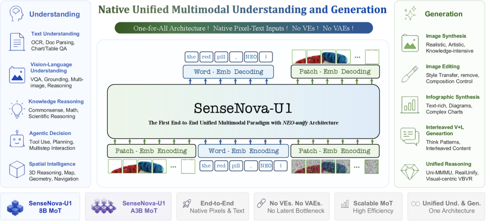
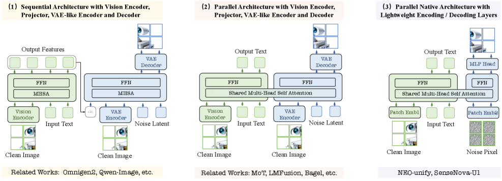
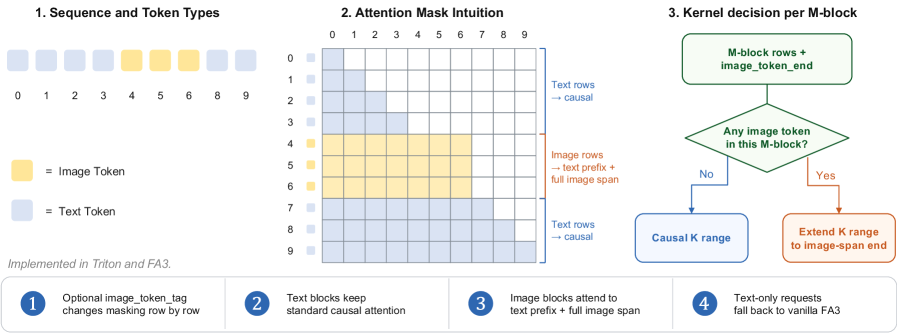
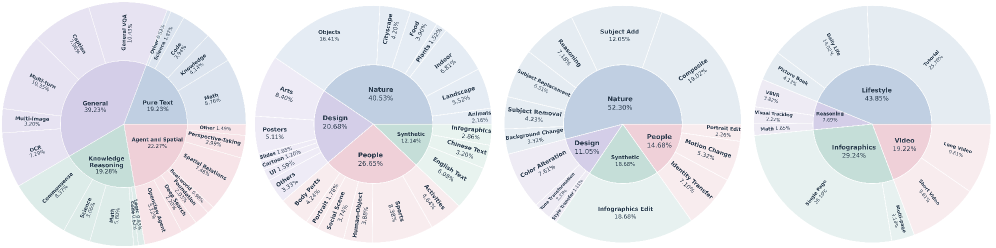
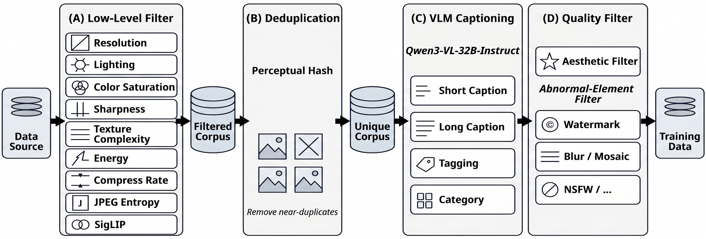
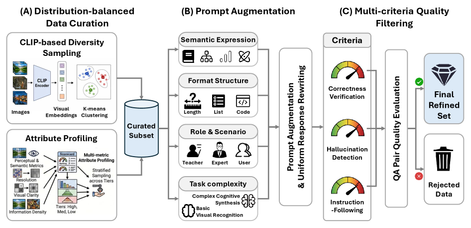
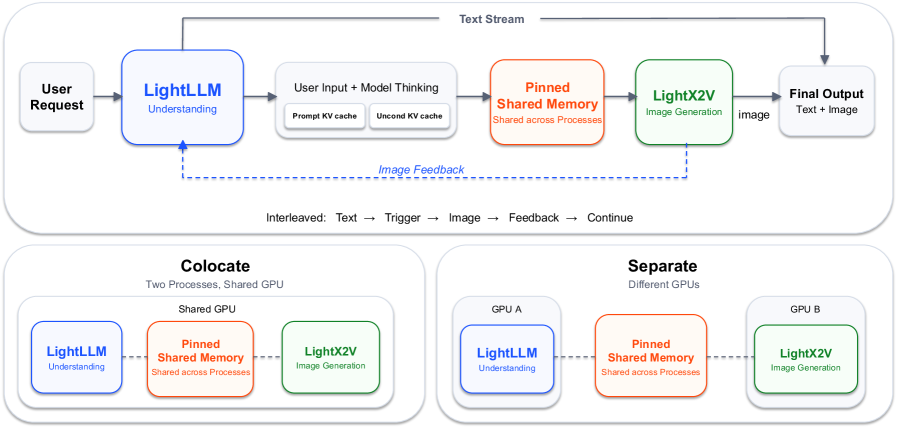
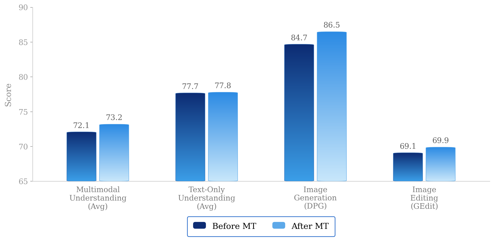
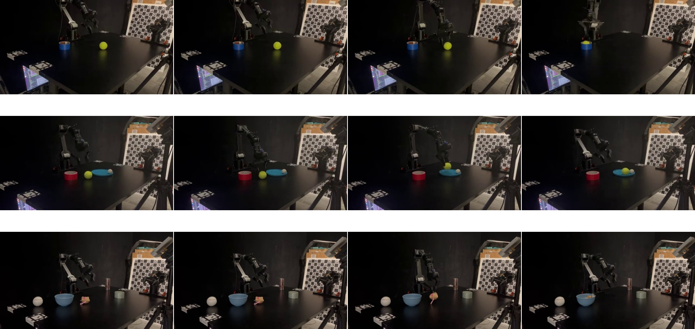
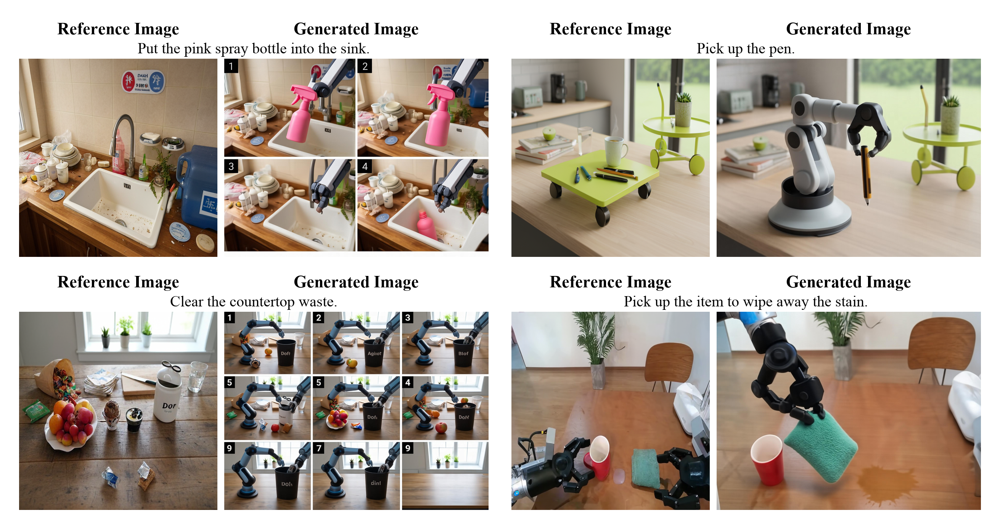

# SenseNova-U1: NEO-unify 아키텍처로 이해와 생성을 하나로 통합한 native 멀티모달 모델

## 📋 메타 정보

| 항목 | 내용 |
|---|---|
| **논문 제목** | SenseNova-U1: Unifying Multimodal Understanding and Generation with NEO-unify Architecture |
| **저자/기관** | Haiwen Diao 외 57인, **SenseTime** (SenseNova 라인) |
| **공개일** | 2026 (arXiv 2605.12500) |
| **분야** | Unified Multimodal(통합 멀티모달) — Understanding(이해) + Generation(생성), Pixel-space(픽셀 공간) Diffusion Transformer |
| **논문 링크** | [arXiv abstract](https://arxiv.org/abs/2605.12500) · [HTML](https://arxiv.org/html/2605.12500v1) · [PDF](https://arxiv.org/pdf/2605.12500) |
| **코드 (공식)** | https://github.com/OpenSenseNova/SenseNova-U1 |
| **체크포인트** | https://huggingface.co/collections/sensenova/sensenova-u1 |
| **데모** | https://unify.light-ai.top/ |
| **Backbone 초기화** | **NEO** (EvolvingLMMs-Lab의 native VLM, https://github.com/EvolvingLMMs-Lab/NEO) |
| **뿌리 LLM(추정)** | 논문 미명시. 크기 표기(8B dense / 30B-A3B MoE)가 Qwen3 계열 구성과 일치 → Qwen3 계열 추정 |
| **추론 엔진** | **LightLLM**(이해) + **LightX2V**(생성) 분리 배포(disaggregated) |

---

## 📖 주요 용어 사전 (Glossary)

> 규칙: 주요 학술 용어는 **영어(한국어)** 순서로 표기. 처음 나올 때만 풀이하고 이후는 영어 단독.

### 아키텍처
- **native(네이티브) 통합 모델**: 부품을 따로 두지 않고, **날 것의 픽셀(raw RGB pixel)을 하나의 Transformer가 직접 받아 이해도 하고 생성도 하는** 방식. (기존 모델은 이해=비전 인코더+LLM, 생성=VAE+diffusion으로 부품이 갈라져 있음)
- **NEO-unify**: 본 논문의 아키텍처 이름. **Visual Encoder(비전 인코더, VE)도 VAE도 없이** 픽셀과 단어를 한 모델 안에서 깊이 얽어(deeply correlated) 처리하는 native VLM 원시 블록(NEO)을 통합 생성까지 확장한 것.
- **MoT (Mixture-of-Transformers, 트랜스포머 혼합)**: ⚠️ MoE(전문가 혼합)와 다름. **모달리티(modality, 입력 종류)별로 가중치를 완전히 분리(full parameter decoupling)**한 Transformer. 텍스트용/이미지용 projection·정규화(normalization)·FFN을 따로 두고 **Q/K/V까지 분리**, 토큰 종류로 라우팅(routing). 단 **self-attention 계산(어텐션 안에서 서로 보는 것)은 공유**.
- **Pre-Buffer(프리버퍼) layer**: 백본 본체 앞에 두는 **얕은 층 몇 개**. raw pixel과 text 입력을 통합 표현(unified representation)으로 바꿔주고, dense 8B 변종에서는 **사전학습된 LLM의 언어·추론 능력을 보존**하는 역할. (A3B 변종에는 없음)
- **Native RoPE(회전 위치 임베딩)**: 시간·공간 위치를 한 표현으로 통합. **텍스트는 시간축(T)**, **이미지는 높이(H)·너비(W) 축**을 사용.
- **visual interface(비주얼 인터페이스)**: 무거운 VAE 대신 이미지를 넣고 빼는 **가벼운 입출력 모듈**. 입력=2층 convolution(합성곱), 출력=이해는 linear, 생성은 MLP.

### 핵심 개념
- **understanding(이해) 스트림 vs generation(생성) 스트림**: 같은 시각 토큰(visual token)을 **다르게 처리하는 두 경로**. 이해=깨끗한(clean) 토큰으로 내용 파악, 생성=노이즈 낀(noise-conditioned) 토큰으로 그림 만들기.
- **hybrid attention mask(혼합 어텐션 마스크)**: 한 시퀀스 안에서 토큰 종류별로 보는 범위를 다르게 줌. 이해=이미지 블록 안은 양방향(bidirectional)+텍스트엔 causal(앞만 보기), 생성=노이즈 토큰이 양방향.
- **resolution-adaptive noise scaling(해상도 적응 노이즈 스케일링, σ_R)**: 해상도가 커져 토큰 수가 늘어도 **토큰 하나당 노이즈 에너지를 일정하게** 유지해서 SNR(신호대잡음비)을 맞추는 트릭.
- **flow matching(플로우 매칭)**: 노이즈에서 진짜 이미지로 가는 곧은 경로를 학습. 본 논문은 픽셀 공간에서 **x-예측(clean 이미지 직접 예측) + v-loss(velocity, 속도 손실)** 사용.

### 학습·후처리
- **Flow-GRPO**: flow matching 모델용 **GRPO(Group Relative Policy Optimization, 그룹 상대 정책 최적화)** — 후보를 여러 개 뽑아 상대 비교로 학습하는 RLHF. 텍스트 렌더링·스타일·미감(aesthetic) 보상.
- **DMD (Distribution Matching Distillation, 분포 일치 증류)**: 많은 스텝(100)짜리 teacher의 생성 분포를 적은 스텝(8)짜리 student가 따라하도록 압축(distillation).

### 평가 지표
- **MMMU / MMBench / OCRBench / MathVista**: 이해 능력 평가. 각각 대학 수준 멀티모달 추론 / 종합 인지 / 글자 읽기(OCR) / 수학+그림.
- **GenEval / DPG-Bench**: 생성 평가. 요청한 구성요소를 정확히 그리는지(compositional) / 빽빽한 프롬프트를 얼마나 충실히 따르는지(dense prompt).
- **CVTG-2K / LongText-Bench / TIIF-Bench**: 이미지 내 복잡한 텍스트 렌더링 / 장문 텍스트 / 지시문 충실도.

---

## 🎯 논문 요약 (TL;DR)

**한 줄 요약**: **VAE도, 별도 비전 인코더도, diffusion 헤드도 다 제거**하고 raw RGB pixel을 얇은 convolution으로 바로 백본에 넣는 native 구조(NEO에서 초기화) 위에서, **understanding(이해)과 generation(생성)을 하나의 과정으로** 통합한 SenseTime의 모델. dense **16.4B**(8B-MoT)와 MoE **38.2B/활성 ~3B**(A3B-MoT) 두 변종을 공개.

**핵심 문제**:
1. 기존 통합 모델은 겉만 통합이고 속은 (비전 인코더+LLM)과 (VAE+diffusion)로 **구조가 파편화(fragmentation)**되어 있음.
2. 이해와 생성이 서로 다른 표현 공간에서 놀아 **시너지(synergy)가 안 남**.

**해결책**:
1. **NEO-unify**: 인코더·VAE 없이 픽셀·텍스트를 한 백본에. 이해와 생성을 "하나의 과정을 보는 두 시선(synergistic views of a single underlying process)"으로 취급.
2. **MoT 백본**: 모달리티별 가중치 완전 분리 + self-attention 공유로, 매 layer에서 이해와 생성이 native하게 상호작용.
3. **가벼운 비주얼 인터페이스**: 입력 2층 conv(32배 다운샘플), 출력은 이해=linear·생성=MLP로 **픽셀 패치 직접 예측**.
4. **6단계 학습 + Flow-GRPO(RL) + DMD(증류, 100→8 step)**.

**검증**:
- 이해: MMMU 80.55·OCRBench 91.9·MathVista 85.3(A3B) — Qwen3-VL-8B 같은 강한 이해 전용 모델과 대등/상회.
- 생성: GenEval 0.91, DPG 88.14, CVTG-2K 0.940 — Qwen-Image·BAGEL급.
- **VLA(vision-language-action)·WM(world model)** 확장까지 예비(preliminary) 증거 제시.

---

## 🚀 핵심 기여 (Contributions)

1. **native 통합 아키텍처 NEO-unify**: 비전 인코더·VAE를 모두 없애고 픽셀·텍스트를 한 백본에서 처리, 이해와 생성을 단일 과정으로 통합.
2. **MoT 백본**: 모달리티별 파라미터를 완전 분리하되 self-attention을 공유해, 지각(perception)과 합성(synthesis)이 매 layer에서 native하게 상호작용.
3. **두 변종 공개**: dense 8B-MoT(16.4B)와 MoE A3B-MoT(38.2B/활성 ~3B). 이해·생성 양쪽에서 강한 성능.
4. **상용급 풀스택 레시피**: 6단계 학습 + Flow-GRPO(RL) + DMD(증류) + 분리형 추론 엔진(LightLLM/LightX2V).
5. **로드맵 제시**: VLA·World Model 시나리오로의 확장 가능성을 예비 실험으로 시사.

---

## 🏗️ 주요 알고리즘 설명

### 0. 큰 그림 — 왜 "부품을 없애는" 설계인가

> *왜 이 절을 두냐: 이 모델의 모든 선택은 "기존 통합 모델의 내부 분리(separation)를 어떻게 없앨까"라는 한 질문에서 나온다. 그 답이 NEO-unify.*

기존 통합 모델은 이렇게 갈라져 있다.
- **이해**: Visual Encoder(비전 인코더) → LLM (이미지를 이해용 특징으로 뽑음)
- **생성**: VAE Encoder → Diffusion → VAE Decoder (이미지를 잠재(latent)로 압축했다 복원)

문제는 두 경로가 **서로 다른 표현 공간**을 써서, 한 모델 안에 있어도 진짜로 협력하지 못한다는 것. NEO-unify는 이 부품들을 다 걷어내고 **raw RGB pixel을 하나의 Transformer가 직접** 다루게 만든다. 이해와 생성은 "같은 과정을 다른 각도에서 본 것"이라는 관점.

이는 native UMM(native Unified Multimodal Model) 계보 — [[paper_tuna_2]](인코더 0개, Conv2d 주입), [[paper_hidream_o1_image]](pixel-level 통합), [[paper_pixeldit]]·[[paper_minit2i]]·[[paper_pid]](VAE 없는 pixel diffusion) — 와 같은 흐름이며, 그중 **이해까지 SOTA로 노리는** 버전이다.

  

> **Figure 3** | SenseNova-U1 개요. 극도로 가벼운 인코딩/디코딩 인터페이스로 픽셀-단어(pixel-word) 대응을 하나의 end-to-end 구조 안에서 처리.

#### 통합 아키텍처의 3분류 (Fig 4가 정리한 taxonomy)

> *왜 이 그림이 중요하냐: "우리가 무엇을 없앴는지"를 경쟁 구조와 나란히 놓아야 native의 의미가 잡힌다.*

  

> **Figure 4** | 통합 멀티모달 아키텍처 세 갈래. SenseNova-U1은 (3)에 해당.

| 갈래 | 구성 | 이미지 입출력 | 대표 모델 |
|---|---|---|---|
| **(1) Sequential** | Vision Encoder + Projector + **VAE 인코더/디코더** | 이해=Vision Encoder, 생성=VAE | Omnigen2, Qwen-Image |
| **(2) Parallel (shared attn)** | Vision Encoder + **VAE** + **shared MHSA** (FFN만 분리) | 이해=Vision Encoder, 생성=VAE | **MoT**(원조), LMFusion, BAGEL |
| **(3) Parallel Native** ⭐ | **가벼운 인코딩/디코딩 층만** (Patch Emb1/Emb2 + MLP Head), shared MHSA | 이해=Patch Emb1(clean 이미지), 생성=Patch Emb2(noise pixel) | **NEO-unify, SenseNova-U1** |

포인트 2가지:
- SenseNova-U1의 "**-MoT**" 이름은 (2)/(3)의 **parallel + shared self-attention** 계보에서 왔다. 즉 MoT는 "attention은 공유하되 FFN 등 모달리티별 가중치를 분리"하는 병렬 백본을 가리키는 말.
- SenseNova-U1의 진짜 기여는 (2)→(3) 이동, 즉 **Vision Encoder와 VAE를 통째로 걷어내고** 가벼운 patch embedding + MLP head로 대체한 것. (Fig 4에서 (3)만 인코더·VAE 상자가 사라진 게 눈에 보인다.)

### 1. Visual Interface — 인코더/디코더 없이 픽셀을 넣고 빼기

> *왜 이 절을 두냐: "VAE를 없앤다"는 말은 곧 "VAE가 하던 압축·복원을 무엇으로 대신하나"라는 질문. 그 답이 이 가벼운 입출력 모듈.*

- **입력(인코딩)**: 2층 convolution(합성곱) + GELU 활성화로 raw 이미지를 시각 토큰(visual token)으로 변환.
  - stride 16×2로 **32배 다운샘플(downsample)** → 32×32 패치 토큰 + 2D 사인파 위치 임베딩(sinusoidal positional encoding).
  - 무거운 VAE encoder가 이 conv 두 층으로 대체됨.
- **출력(디코딩)**:
  - understanding 스트림: **linear projection**으로 다음 텍스트 토큰 예측.
  - generation 스트림: **MLP 헤드가 픽셀 패치를 직접 예측** — 깊은 diffusion 헤드도, VAE decoder도 거치지 않음(bypass).
- **효과**: 32배 압축을 하면서도 semantic(의미)과 pixel-level(픽셀 수준) 충실도(fidelity)를 함께 유지.

### 2. MoT 백본 — 모달리티별 가중치를 나누되 어텐션은 공유

> *왜 이 절을 두냐: "이해와 생성을 한 모델에" 넣을 때 가장 어려운 건 두 작업의 성격이 너무 달라 서로 방해한다는 점. MoT가 이 충돌을 푸는 장치.*

MoT(Mixture-of-Transformers)의 세 요소:
1. **full parameter decoupling(완전 파라미터 분리)**: 각 layer에서 projection·normalization·FFN을 **텍스트용/이미지용으로 따로** 두고, **Q/K/V projection까지 분리**. 토큰 종류(token type)에 따라 동적으로 라우팅.
2. **shared self-attention(공유 self-attention)**: 그럼에도 **어텐션 계산 자체는 한 시퀀스 안에서 공유** — 모든 모달리티가 서로를 본다. hybrid mask로 보는 범위만 조절.
3. **Native RoPE**: 텍스트=시간축(T), 이미지=높이(H)·너비(W) 축으로 위치를 통합.

> 비유: MoT는 "한 회의실(공유 attention) 안에 앉은 **두 전문가(이해 담당·생성 담당)**"다. 각자 자기 노트(분리된 가중치)를 쓰지만, 같은 테이블에서 서로의 말을 듣는다. → HiDream-O1의 "**한 사람이 두 일을 다 함(완전 공유)**"과 대비되는 지점([[paper_hidream_o1_image]]).

### 3. 같은 토큰, 다른 어텐션 — 이해와 생성의 분기

> *왜 이 절을 두냐: 이해와 생성이 "같은 시각 토큰"을 쓴다면, 둘을 가르는 실제 스위치가 무엇인지 밝혀야 한다. 그 스위치가 노이즈 여부 + 어텐션 방향.*

- **understanding(이해)**: 깨끗한(clean) 이미지 토큰이 이미지 블록 안에서 **양방향(bidirectional)**으로 서로 보고, 텍스트에는 **causal(앞만 보기)**로 조건화.
- **generation(생성)**: **노이즈 낀(noise-conditioned) 토큰**이 깨끗한 입력과 다른 노이즈 토큰을 **양방향**으로 봄 → 텍스트를 조건으로 한 확산.
- **resolution-adaptive noise scaling(σ_R)**: 해상도가 바뀌어 토큰 수 N(H,W)=(H·W)/32²가 달라져도 SNR을 일정하게. `σ_R(H,W) = σ₀·√(N(H,W)/N₀)` — √ 스케일링으로 토큰당 노이즈 에너지를 대략 일정하게 유지.

  

> **Figure 6** | 통합 prefill용 hybrid attention. **텍스트 행(text rows)은 표준 causal mask**(앞만 봄), **이미지 행(image rows)은 앞쪽 텍스트 prefix + 이미지 전체 구간(full image span)**을 봄. 오른쪽은 M-block 단위 커널 선택(이미지 토큰이 있으면 K 범위를 이미지 구간 끝까지 확장, 없으면 그냥 causal). Triton·FA3로 구현.

### 4. 학습 목표 (Objective)

> *왜 이 절을 두냐: 성격이 다른 두 손실을 어떻게 한 저울에 올리는지가 통합 학습의 핵심.*

- 텍스트(이해): 표준 cross-entropy(다음 토큰 예측).
- 이미지(생성): **픽셀 공간 flow matching** — rectified-flow 보간 `z_t = t·x + (1−t)·σ_R·ε` (즉 진짜 이미지 x와 노이즈 ε를 t 비율로 섞되 노이즈에 σ_R를 곱함)에서 **x-예측(clean 이미지 직접 예측) + v-loss(velocity MSE)**.
- 합산: `L_total = λ₁·L_Und + λ₂·L_Gen`, 대표값 **λ₁=0.1(이해), λ₂=1.0(생성)** — 생성이 훨씬 어려워 무게를 더 실음.

### 5. 학습 레시피 (6단계) + 후처리

> *왜 이 절을 두냐: native 통합 모델이 이해·생성 둘 다 잘하려면 순서가 중요하다. 어느 능력을 먼저 심고, 언제 합치는지의 지도.*

| 단계 | 초점 | 규모 | 핵심 |
|---|---|---|---|
| 1 | **이해 워밍업** | ~120K step | NEO 백본에서 이어받아 attention 융합 → 전체 학습 |
| 2 | **생성 사전학습** | ~300K step (3 phase) | 256~1024px → 512~2048px → 편집/interleaved |
| 3 | **통합 mid-training** | ~84K step | 이해+생성 섞어 공동 최적화 |
| 4 | **SFT** | ~9K step | 지시문 정렬(instruction alignment) |
| 5 | **RL 후처리** | — | **Flow-GRPO** (텍스트 렌더링·스타일·미감 보상) |
| 6 | **증류** | — | **DMD** 100 step → 8 step |

  

> **Figure 8** | SenseNova-U1 학습 corpus의 계층적 데이터 분포. **왼쪽부터 4개 sunburst = ① 이해(Understanding) ② 생성 T2I(Generation) ③ 편집(Editing) ④ 인터리브(Interleaved)**. 안쪽 고리=대분류, 바깥 고리=세부.

**Fig 8의 4개 차트 상세 분해**

① **이해(Understanding)** — 대분류 4개:
- General 39.23% (General VQA / Captioning / Multi-turn 대화 / Multi-image / OCR ~7.19% / Cognition 등)
- Agent and Spatial 22.27% (Perspective-Taking / Spatial Relations / Grounding / Counting / GUI·Open perception 등 — **공간지능이 두 번째로 큼**)
- Knowledge Reasoning 19.28% (Comprehension / Science / Math)
- Pure Text 19.23% (Math ~5.16% / Knowledge / Code / Other)

② **생성 T2I(Generation)** — 대분류 5개:
- Nature 40.53% (Objects가 최대, Landscape ~5.5% / Cityscape ~4.20% / Animals / Food / Plants / Indoor)
- People 26.65% (English Text / Chinese Text ~3.20% / Human-Object / Sports / Portrait / Social Scene / Body Parts — **텍스트 렌더링이 People 안에 포함**)
- Design 20.68% (Arts ~8.40% / Posters ~5.11% / Slides / Cartoon / UI)
- Synthetic 12.14%
- Infographics 2.06%

③ **편집(Editing)** — 대분류 4개:
- Nature 52.30% (Composite ~19.72% / Subject Add ~12.65% / Color Alteration ~7.81% / Background Change ~3.12% / Portrait Edit ~2.26% / Motion Change ~1.37% / Identity Transfer / Subject Removal·Replacement / Reasoning)
- Synthetic 18.66% (대부분 Infographics Edit)
- People 14.68%
- Design 11.05%

④ **인터리브(Interleaved)** — 대분류 4개:
- Lifestyle 43.85% (튜토리얼·일상·그림책 등)
- Infographics 29.24%
- Video 19.22% (VBRS ~7.42% / 추론 / 롱·숏 비디오)
- Reasoning ~8%

> ⚠️ 세부(바깥 고리) 수치는 그림에서 읽은 근사값이며, 대분류 수치가 논문 본문과 일치하는 확정값.

#### 학습 데이터 상세 구성

> ⚠️ **중요**: 논문은 데이터를 **token(토큰) 예산과 비율(%)로만** 공개하고, **이미지·샘플 절대 개수(count)는 밝히지 않는다.** 아래 절대량 수치는 모두 token 기준이며, "몇 억 장" 같은 이미지 수는 이 논문에서 알 수 없다.

**단계별 token 예산(Table 2)** — 메인 학습 총 **~3.29T token**:

| 단계 | Steps | Tokens | 데이터 믹스 |
|---|---|---|---|
| 1 이해 워밍업 | 120K | 0.75T | 이해 100% |
| 2-I 생성 사전학습 | 120K | 0.25T | 생성 100% (256~1024px) |
| 2-II 생성 사전학습 | 60K | 0.25T | 생성 100% (512~2048px) |
| 2-III 생성 사전학습 | 120K | — | 생성 + 편집 + 인터리브 |
| 3 통합 mid-training | 84K | 0.88T | 이해 33% / T2I 37% / 편집(editing) 24% / 인터리브 6% |
| 4 SFT | 9K | 0.13T | 3단계와 동일 믹스 |

**이해(understanding) corpus 비율**:
- 사전학습: image-text pairs 32% / captions 17% / infographics 14% / pure text 37% (교차소스 중복제거·안전 필터·품질 필터·CLIP 비율 균형 re-captioning)
- mid-training: General 39.2% / Agent·Spatial 22.3% / Knowledge Reasoning 19.3% / Pure Text 19.2%
  - General 세부: visual QA 26.6% / 멀티턴 대화 26.4% / captioning 20.3% / OCR 18.6% / multi-image 8.2%
  - Knowledge Reasoning 세부: 지식형 12.0% / 추론형 7.2%
- SFT: 공간지능(spatial intelligence) ~15% / 일반 멀티모달 이해 ~13% / 추론 ~12% / 일반 NLP ~11% / OCR·문서 ~11% / agentic function calling ~10% / 롱컨텍스트 대화 ~8% / 코드 ~6% / 멀티턴 ~4% / 복합 구성 이해 ~4%

**생성(generation) corpus 비율**:
- T2I 대분류: Nature ~40.5% / People ~26.7% / Design ~20.7% (+ infographics·이중언어 텍스트 렌더링)
- 편집(editing): 자연 장면 ~52.3% / 인물 ~14.7% / 나머지 infographic·합성. 작업 종류 = 추가·제거·배경/색 변경·identity transfer·모션 조작·인물 편집·합성·추론형 변형
- 인터리브(interleaved): lifestyle ~44%(튜토리얼 26%·일상 14%·그림책 4%) / infographics ~29% / video ~19% / reasoning ~8%

#### 데이터 정제 파이프라인 (Fig 7 이해 · Fig 9 생성)

> *왜 이 절을 두냐: "무엇을 얼마나 썼나"(비율)만큼 "어떻게 걸러냈나"(파이프라인)가 품질을 좌우한다. 두 corpus는 정제 철학이 다르다 — 이해는 "다양성·정답성", 생성은 "화질·중복·안전".*

**생성(generation) corpus — 4단계 필터링 (Fig 9)**

  

> **Figure 9** | 생성 corpus 처리 파이프라인. Data Source → (A) 저수준 필터 → Filtered Corpus → (B) 중복제거 → Unique Corpus → (C) VLM 캡셔닝 → (D) 품질 필터 → Training Data.

| 단계 | 하는 일 | 세부 |
|---|---|---|
| **(A) Low-Level Filter(저수준 필터)** | 화질 나쁜 이미지 자동 탈락 | Resolution(해상도)·Lighting(조명)·Color Saturation(채도)·Sharpness(선명도)·Texture Complexity(질감 복잡도)·Energy(에너지)·Compress Rate(압축률)·JPEG Entropy(JPEG 엔트로피)·**SigLIP**(의미 점수) |
| **(B) Deduplication(중복제거)** | 거의 같은 이미지 제거 | **Perceptual Hash(지각 해시)**로 near-duplicate 삭제 → Unique Corpus |
| **(C) VLM Captioning(캡셔닝)** | 이미지마다 설명·태그 자동 생성 | **Qwen3-VL-32B-Instruct**가 Short Caption(짧은 설명)·Long Caption(긴 설명)·Tagging(태그)·Category(분류) 생성 |
| **(D) Quality Filter(품질 필터)** | 미감·유해요소 최종 거름 | Aesthetic Filter(미감 필터) + **Abnormal-Element Filter**(Watermark 워터마크·Blur/Mosaic 흐림·모자이크·NSFW 등) |

→ 핵심 포인트 3가지: ① 캡션을 **Qwen3-VL-32B로 재생성**(원본 alt-text가 아니라 모델이 다시 씀) ② 워터마크·모자이크·NSFW를 명시적으로 제거 ③ SigLIP으로 이미지-텍스트 의미가 안 맞는 것도 저수준에서 컷.

**이해(understanding) corpus — 다양성·정답성 중심 (Fig 7)**

  

> **Figure 7** | 이해 corpus 처리 파이프라인. (A) 분포 균형 큐레이션 → (B) 프롬프트 증강 → (C) 다기준 품질 필터링.

| 단계 | 하는 일 | 세부 |
|---|---|---|
| **(A) Distribution-balanced Curation(분포 균형 큐레이션)** | 편중 없이 다양하게 뽑기 | **CLIP 기반 다양성 샘플링**(CLIP 인코더 → visual embedding → K-means 클러스터링) + **Attribute Profiling**(perceptual·semantic 지표, 해상도, 선명도, 정보 밀도로 High/Med/Low tier 나눠 stratified sampling) |
| **(B) Prompt Augmentation(프롬프트 증강)** | 질문·응답을 다채롭게 재작성 | Semantic Expression(의미 표현)·Format Structure(Length/List/Code 형식)·Role & Scenario(Teacher/Expert/User 역할)·Task complexity(기초 인식↔복합 인지 합성) → Prompt Augmentation & Uniform Response Rewriting(응답 통일 재작성) |
| **(C) Multi-criteria Quality Filtering(다기준 품질 필터)** | 틀린 QA 쌍 버리기 | Correctness Verification(정답 검증)·Hallucination Detection(환각 탐지)·Instruction-Following(지시 준수) 3기준으로 QA Pair 평가 → Final Refined Set / Rejected Data |

→ 생성이 "예쁘고 안 겹치는 이미지"를 고른다면, 이해는 "**골고루 다양하고 정답이 맞는 QA**"를 고른다.

**후처리 데이터·하이퍼파라미터**:
- RL(Flow-GRPO) 텍스트 렌더링: 600 epoch, epoch당 프롬프트 N=48 × 이미지 K=16(=768장), 10-step, guidance 4.0, noise 0.7, 앞 200 epoch 동적해상도 워밍업
- RL(Flow-GRPO) 통합 일반: **8B 1,600 epoch / A3B 200 epoch**, 보상군 2개 교대, lr 1e-5, KL β=0.01
- 증류(DMD2): 100→8 step, generator는 fake-flow 5회당 1회 갱신, generator lr 2e-6·fake-flow 4e-7, Euler·timestep shift 3.0·CFG 4.0

### 6. 추론 인프라 — 분리형 두 엔진

> *왜 이 절을 두냐: 한 모델이라도 이해와 생성은 최적 병렬화 방식이 달라, 실서비스에선 나눠 굴리는 게 유리하다.*

- **LightLLM**: 멀티모달 이해·텍스트 스트리밍·요청 오케스트레이션 담당 (Tensor Parallelism).
- **LightX2V**: 이미지 생성 담당 (CFG Parallelism + sequence parallelism).
- 두 엔진은 pinned shared memory로 상태를 주고받되 **API는 하나로 통일**. 2048×2048 생성 시 5090 GPU·TP2+CFG2에서 스텝당 ~0.415초.

  

> **Figure 5** | 분리형(disaggregated) 추론 구조. LightLLM이 이해·텍스트 스트리밍·제어 흐름을, LightX2V가 이미지 생성을 담당.

---

## 🧪 실험 요약

### 1. Understanding(이해) 벤치마크

| Benchmark | 8B-MoT | A3B-MoT | 의의 |
|---|---|---|---|
| **MMMU** | 74.78 | **80.55** | 대학 수준 멀티모달 추론 |
| **MMBench-EN** | 90.25 | **91.59** | 종합 인지 |
| **OCRBench** | 82.10 | **91.90** | 글자 읽기 강함 |
| **MathVista** | 84.20 | **85.30** | Qwen3-VL-8B 등 상회 |

→ **이해 전용 최상위 모델과 대등하거나 상회**. 특히 수학·텍스트 리치(text-rich) 이해에서 강점.

### 2. Generation(생성) 벤치마크

| Benchmark | SenseNova-U1 | 비교 |
|---|---|---|
| **GenEval** Overall | **0.91** | Qwen-Image 0.87, BAGEL 0.82 상회 |
| **DPG-Bench** (A3B) | 88.14 | Qwen-Image 88.32와 대등 |
| **CVTG-2K** (8B / A3B) | 0.940 / 0.881 | 복잡 텍스트 렌더링 |
| **LongText-Bench EN** (8B) | 0.979 | 장문 텍스트 |
| **TIIF-Bench** (8B) | 최고 | 짧은·긴 지시문 모두 |

→ **이해와 생성을 한 몸으로** 하면서 Qwen-Image·BAGEL급 생성 달성.

### 3. Ablation(제거 실험) 요지

- **5.2.1** native encoder-free 설계가 semantic·pixel 표현을 **둘 다 보존**함을 입증.
- **5.2.2** 이해와 생성이 **MoT 백본에서 시너지**를 냄(서로 도움).
- **5.2.3** native 구조가 **데이터 스케일링 효율**이 높음 — 더 적은 학습 자원으로 인코더 기반 최상위 구조와 대등.

**시너지 실측(Fig 12, 8B-MoT의 mid-training 전/후)** — 통합 학습(MT, mid-training)을 하면 이해·생성·편집 **네 항목이 동시에 오른다**(서로 방해가 아니라 도움):

| 항목 | Before MT | After MT |
|---|---|---|
| Multimodal Understanding (Avg) | 72.1 | **73.2** |
| Text-Only Understanding (Avg) | 77.7 | **77.8** |
| Image Generation (DPG) | 84.7 | **86.5** |
| Image Editing (GEdit) | 69.1 | **69.9** |

  

> **Figure 12** | 8B-MoT 백본에서 이해–생성 공동 학습(co-training) 효과. GEdit 점수는 0–100으로 정규화.

### 4. VLA / World Model 확장

- 논문은 **예비(preliminary) 증거**로 vision-language-action(VLA)과 world model(WM) 시나리오에서 강하다고 주장.
- 다만 구체적 태스크·데이터셋·수치는 제시되지 않음 — "더 넓은 로드맵을 가리킨다"는 방향 제시 수준.
- Fig 14는 **로봇 조작(robotic manipulation) 영상**에서의 vision-language-action 행동을, Fig 15는 **로봇 팔 시점(robotic arm view)의 미래 예측**(world-modeling prediction)을 시각화 — 통합 표현이 행동·미래 예측으로도 뻗을 수 있음을 정성적으로 보여줌.

  

> **Figure 14** | 로봇 조작 영상에서의 vision-language-action(VLA) 행동 시각화.

  

> **Figure 15** | 로봇 팔 시점의 world-modeling(미래 프레임) 예측 시각화.

---

## 💬 Q&A 섹션

### Q1. 이 모델의 실제 크기는? ("8B"가 전체인가?)

이름의 "8B"는 **스트림 하나당 크기**일 뿐, 전체가 아니다. MoT는 이해용·생성용 가중치를 완전 분리하고 Q/K/V까지 나누므로 합산해야 한다.

| 변종 | 저장(total) | 활성(per-token) | 구성 |
|---|---|---|---|
| **8B-MoT** (dense) | **16.4B** | **16.4B** (전부 활성) | 이해 8.2B + 생성 8.2B / 42 layer, hidden 4096, Q head 32·KV head 8 / Pre-Buffer 있음 |
| **A3B-MoT** (MoE) | **38.2B** | **~3B** | 이해 30B(전문가 128, top-8) + 생성 8.2B(전문가 32) / 48 layer, hidden 2048, Q head 32·KV head 4 / Pre-Buffer 없음 |

즉 실질 규모는 **16.4B**와 **38.2B**. "A3B"는 Active 3B(MoE라 토큰당 ~3B만 활성)를 뜻한다.

### Q2. 백본은 무엇이고, 원래(prior) 모델은?

- **직접 백본 = NEO**(EvolvingLMMs-Lab의 native VLM, "from first principles"). 인코더·VAE 없이 픽셀·단어를 한 dense 모델에서 처리하는 원시 블록. 원래 NEO는 2B·9B로 공개.
- 논문 표현: "pretrained NEO에서 초기화한 뒤 효율 개조 2가지 적용."
- **뿌리 LLM은 논문 미명시.** 다만 이해 베이스라인 크기(dense 8B / MoE 30B-A3B·전문가 128·top-8)가 **Qwen3 계열 구성과 거의 일치**해 Qwen3 계열로 **추정**(확정 아님).

### Q3. 가장 닮은 모델과의 비교 — HiDream-O1-Image

> 둘 다 "VAE 없음 + 외부 텍스트 인코더 없음 + 픽셀 직접 + hybrid causal/full 어텐션 + flow matching + GRPO + DMD"를 공유하는 같은 세대 native 통합 생성기. **결정적 차이는 파라미터 통합 방식.**

| 항목 | **SenseNova-U1** | **HiDream-O1-Image** ([[paper_hidream_o1_image]]) |
|---|---|---|
| 출처 | SenseTime, 2026 | HiDream.ai, 2026-05 |
| 핵심 목표 | 이해+생성 통합, **이해 SOTA + VLA/WM**까지 | **생성·편집·IP 통합** (이해는 부차적) |
| 백본 | **NEO** (native VLM) | **Qwen3-VL-8B-Instruct** (이해 모델 재사용) |
| 실제 규모 | **16.4B / 38.2B**(활성 ~3B) | **8B** 단일 / Pro **200B+** |
| VAE | 없음 | 없음 |
| 외부 텍스트 인코더 | 없음 | 없음 |
| 이미지 입력 | **2층 conv로 raw RGB 주입** (조건 이미지까지 통일) | 32×32 patchify(무손실). 단 **참조 이미지는 SigLip-2 인코더** |
| encoder-free 순도 | ✅ 조건까지 conv | △ 참조는 별도 인코더 |
| **파라미터 공유 (급소)** | **MoT — 모달리티별 완전 분리** (Q/K/V까지), attention만 공유 | **single-stream 완전 공유** (같은 Q/K/V weight) |
| 어텐션 | hybrid (이해=블록내 양방향+텍스트 causal / 생성=양방향) | hybrid (AR=causal / generation=full) |
| 생성 loss | flow matching (x-예측 + v-loss) | flow matching + **LPIPS + DINO** |
| RL / 증류 | **Flow-GRPO** / **DMD** 100→8 | **GRPO** / **DMD + GAN** 50→28 |
| 프롬프트 에이전트 | (명시 없음) | **Reasoning Prompt Agent** (Gemma-4-31B, "O1" 유래) |
| 대표 성적 | GenEval 0.91 / MMMU 80.55·OCRBench 91.9 | GenEval 0.90(8B)·0.92(Pro) / LongText EN 0.979 |

**세 줄 결론**:
1. 뼈대는 같은 세대(VAE·텍스트 인코더 제거 + 픽셀 + hybrid attention + flow matching + GRPO + DMD).
2. **급소 차이 = 통합 방식**. HiDream-O1은 "하나의 가중치를 전부 공유"(가벼움, 8B), SenseNova-U1은 "MoT로 이해·생성 가중치 완전 분리"(무거움, 16.4B/38.2B). "진짜 하나(공유) vs 한 몸 안 두 전문가(분리)"의 철학 차이.
3. 지향점: SenseNova-U1은 **이해 SOTA + VLA/WM까지 노리는 범용 멀티모달 두뇌**, HiDream-O1은 **생성·편집·IP 완성도**에 집중한 이미지 생성기. encoder-free 순도도 SenseNova-U1이 더 높음.

### Q4. 다른 리뷰 논문 중 같은 계보는?

- **가장 가까운 형제 = [[paper_tuna_2]]** (인코더 0개 native UMM, Conv2d 주입, decoder-less). SenseNova-U1은 이 철학을 상용 규모로 완성한 버전.
- **[[paper_hidream_o1_image]]**: pixel-level 통합 + hybrid attention이 판박이(Q3 참조).
- 생성 전용이라 절반만 겹침: **[[paper_pixeldit]]**(픽셀 이중레벨), **[[paper_minit2i]]**(noise_scale=σ_R 발상 동일), **[[paper_pid]]**(sigma-aware 노이즈 처리), **[[paper_asymflow]]**(픽셀 flow matching).
- 후처리 정석 공유: DMD 증류는 [[paper_z_image]]·[[paper_qwen_image_2]]·[[paper_dreamlite]], Flow-GRPO는 [[paper_qwen_image_2_rl]]·[[paper_uniref_image_edit]] 라인.

---

## 🧷 한 줄 요약 (전체)

SenseNova-U1은 **NEO의 인코더·VAE 없는 native 철학**([[paper_tuna_2]]) + **HiDream-O1식 pixel-level 통합·hybrid attention**([[paper_hidream_o1_image]]) + **Z-Image/Qwen-Image-2.0식 DMD·GRPO 후처리**를 합쳐, **이해(understanding)와 생성(generation)을 MoT로 한 몸에 담은** SenseTime의 상용 규모 통합 멀티모달 모델(dense 16.4B / MoE 38.2B·활성 ~3B)이며, 이해 SOTA·생성 Qwen-Image급을 동시에 달성하고 VLA·World Model 확장까지 예비 제시한다.

---

## 🔗 관련 메모리 링크

- [[paper_tuna_2]] — 가장 가까운 형제 (인코더 0개 native UMM)
- [[paper_hidream_o1_image]] — pixel-level 통합 + hybrid attention (Q3 상세 비교)
- [[paper_pixeldit]] · [[paper_minit2i]] · [[paper_pid]] · [[paper_asymflow]] — VAE 없는 픽셀 생성 계보
- [[paper_z_image]] · [[paper_qwen_image_2]] — DMD 증류 라인
- [[paper_qwen_image_2_rl]] · [[paper_uniref_image_edit]] — GRPO RL 라인
- [[reference_pretrained_backbone_reuse_landscape]] — 백본 재사용 분기 분류
