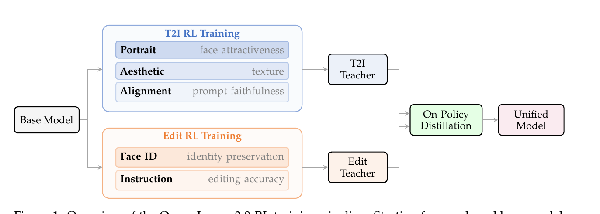
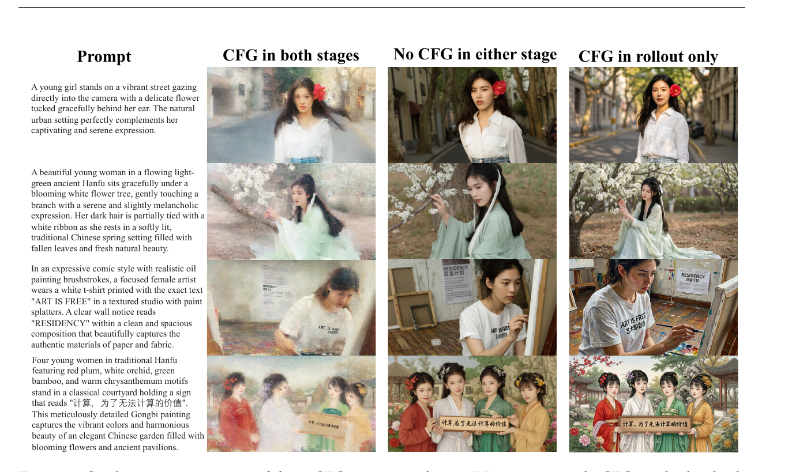

# PAPER: Qwen-Image-2.0-RL — RLHF + On-Policy Distillation 후처리 레시피

## 0. 이 문서를 읽는 법

이 문서는 Qwen-Image-2.0-RL 기술 보고서(arXiv 2606.27608)를 처음 읽는 사람이 흐름을 놓치지 않도록 정리한 리뷰입니다.

핵심을 한 문장으로 먼저 못 박습니다.

> **Qwen-Image-2.0-RL 은 새 모델이 아니라, 이미 공개된 [Qwen-Image-2.0](PAPER_Qwen-Image-2.0.md) 기반 모델(foundation model)을 그대로 가져와 두 단계 후처리(post-training)로 다듬은 "레시피"다. ① 사람 선호 강화학습(RLHF, reinforcement learning from human feedback)으로 화질·지시문 준수를 끌어올리고, ② on-policy distillation(자기 궤적 증류, OPD)으로 작업별 전문 모델 둘을 한 모델로 합친다.**

이 문서는 [PAPER_Qwen-Image-2.0.md](PAPER_Qwen-Image-2.0.md), [PAPER_DMD2.md](PAPER_DMD2.md) 와 같은 구성으로 읽기 쉽게 만들었습니다.

1. **메타 정보·용어 사전**: 누가/언제/무엇을, 그리고 알아둘 단어들
2. **큰 그림(TL;DR)·핵심 기여**: 무엇을 새로 풀었나
3. **보상 모델(reward model)**: RL의 채점관을 어떻게 만드나
4. **RL 학습 프레임워크**: GRPO 이식 + 하이브리드 CFG + 안정화 장치
5. **On-Policy Distillation**: 전문가 둘을 한 모델로
6. **실험 결과**
7. **데이터 구성·Q&A / 한계 / 한 줄 요약 / 관련 링크**

GitHub 렌더링 호환을 위해 수식은 LaTeX 보다 평문 표기를 우선합니다.

> ⚠️ **공개 범위 주의**: 테크니컬 리포트 특성상 학습 데이터 규모·출처, 보상 가중치 실제 값, 학습 스텝 수, 코드·가중치 공개 여부가 모두 **미명시**입니다. 본문에서 "리포트 미공개"로 표기한 칸은 추후 갱신이 필요합니다.

---

## 1. 메타 정보

| 항목 | 내용 |
|---|---|
| 논문 | Qwen-Image-2.0-RL Technical Report |
| 저자 | Yixian Xu, Kaiyuan Gao, Yuxiang Chen 외 (Qwen 팀, 27인) |
| 소속 | Alibaba(알리바바) Qwen 팀 |
| 공개일 | 2026-06-25 (arXiv v1) |
| arXiv abstract | https://arxiv.org/abs/2606.27608 |
| arXiv PDF | https://arxiv.org/pdf/2606.27608 |
| 공식 코드 | 리포트 미공개 |
| 분야 | RLHF for Diffusion, Flow Matching, On-Policy Distillation, Text-to-Image, Image Editing |
| 베이스 모델 | Qwen-Image-2.0 (arXiv 2605.10730, 동결 아님 — 후처리 대상) |
| 외부 의존 모델 | Qwen 계열 VLM(보상 모델로 미세조정), 얼굴인식 임베딩 모델(face ID) |
| 평가 | Qwen-Image-Bench(2605.28091) + T2I/Edit 아레나 Elo |

---

## 2. 주요 용어 사전 (Glossary)

*다른 절에서 처음 나오는 용어가 헷갈리지 않게 한곳에 모아둠. 풀어쓴 한국어 + 학술 원어 괄호 매칭.*

### 강화학습 / 후처리

| 용어 | 풀이 |
|---|---|
| RLHF (reinforcement learning from human feedback) | 사람 선호를 담은 보상(reward)을 기준으로 모델을 직접 최적화하는 강화학습. LLM 정렬에서 성공한 방식을 이미지 확산에 옮긴 것 |
| post-training(후처리) | 사전학습(pre-training)이 끝난 모델을 추가로 다듬는 단계. 본 논문 전체가 후처리 레시피 |
| reward model(보상 모델) | 생성된 이미지가 얼마나 좋은지 점수를 매기는 "채점관". RLHF의 핵심 부품 |
| GRPO (Group Relative Policy Optimization) | 한 프롬프트로 여러 장(group)을 뽑고, 그룹 평균 대비 잘했냐/못했냐(상대 우열)로 학습하는 RL 기법. DeepSeekMath에서 제안 |
| advantage(어드밴티지) | "이 샘플이 평균보다 얼마나 나은가"를 나타내는 값. 양수면 강화(+), 음수면 억제(−) |
| rollout(롤아웃) | 학습 중 모델이 프롬프트로 직접 이미지를 뽑아내는 생성 과정 |
| reward hacking(보상 해킹) | 모델이 진짜 품질이 아니라 보상 모델의 허점만 파고들어 점수만 올리는 현상. RL의 대표적 실패 |

### 확산 / Flow Matching

| 용어 | 풀이 |
|---|---|
| flow matching | 노이즈와 진짜 이미지를 직선으로 잇고(xt = (1−t)·x0 + t·ε), 그 위의 velocity(속도)를 학습하는 생성 방식. Qwen-Image 계열의 기본 |
| velocity field(속도장) | 각 시점 t에서 "어느 방향으로 가야 노이즈가 이미지로 바뀌는가"를 가리키는 벡터. 정답은 v = ε − x0 |
| ODE(상미분방정식) / SDE(확률미분방정식) | 확산 생성 경로. ODE는 결정론적(매번 같음), SDE는 노이즈가 섞여 확률적. RL을 쓰려면 SDE가 필요 |
| CFG (classifier-free guidance) | 조건부 예측과 무조건부 예측을 섞어 프롬프트를 더 강하게 따르게 하는 추론 기법. 이 논문의 핵심 트릭이 여기서 나옴 |
| velocity matching(속도 맞추기) | 학생 모델의 velocity를 교사 모델의 velocity에 가까워지게 학습. OPD의 손실 함수 |

### 보상 / 증류

| 용어 | 풀이 |
|---|---|
| pointwise(점수식) 보상 | 이미지 한 장에 절대점수(예: 5점 만점에 4점)를 매기는 방식. **이 논문 채택** |
| pairwise(쌍대비) 보상 | 두 이미지 중 어느 쪽이 나은지 우열만 매기는 방식. 비교 실험 후 **버림** |
| OPD (On-Policy Distillation, 자기 궤적 증류) | 학생이 **자기 자신이 만든 생성 궤적** 위에서 교사의 velocity를 따라 배우는 증류. 작업별 교사 여럿을 한 학생으로 합칠 때 사용 |
| W2 distance (2-Wasserstein distance) | 두 분포가 얼마나 떨어져 있나를 재는 거리. OPD 손실의 이론적 근거(상한 최소화) |
| Mix-RL | T2I+편집 데이터를 섞어 한 번에 RL하는 단순 대안. OPD가 이걸 이김 |

---

## 3. 큰 그림 (TL;DR) 과 핵심 기여

### TL;DR

확산 모델은 학습 때 "노이즈 잘 지우기(denoising score matching)"만 최적화하는데, 이 목표는 사람이 실제로 좋아하는 것(구도 조화, 질감, 프롬프트 충실도, 스타일 일관성)을 **직접 보지 않는다.** 그래서 사전학습이 끝나도 "사람 취향과의 간극"이 남는다. 이 논문은 그 간극을 **RLHF + OPD** 후처리로 메운다.

전체 파이프라인은 그림 한 장에 다 담겨 있다.



*그림 1: 공유 베이스 모델 → ① T2I 전문 교사(Portrait·Aesthetic·Alignment 보상)와 편집 전문 교사(Face ID·Instruction 보상)를 따로 RL로 키우고 → ② 둘을 On-Policy Distillation으로 한 Unified Model에 합친다.*

### 저자가 짚는 3대 난점 (= 논문의 뼈대)

1. **보상 신호가 작업마다 다르다** — T2I는 전역 미학·프롬프트 준수, 편집은 미세한 얼굴 신원 보존. 하나의 보상으로 안 됨 → **복합·작업별 보상** 필요 (4장).
2. **기존 RL 연구는 대부분 LoRA 미세조정에서만 검증됨** — 여러 보상 + 여러 작업 + 풀파라미터 대규모 학습은 미개척 → **확장 가능한 RL 프레임워크** 필요 (5장).
3. **배포는 모델 하나여야 한다** — 작업별로 따로 RL한 정책을 품질 손해 없이 한 모델로 합쳐야 함 → **OPD** (6장).

### 핵심 기여

1. **VLM 기반 복합 보상 모델** — Qwen 계열 VLM을 미세조정해 채점관을 만들되, **pointwise(점수식)** 가 pairwise(쌍대비)보다 낫다는 걸 실험으로 보임. T2I는 정렬→미학→인물 3층, 편집은 지시준수 + 얼굴신원.
2. **확장 가능한 RL 프레임워크** — GRPO 이식 + **하이브리드 CFG**(rollout에만 CFG) + 비동기 보상 파이프라인 + 프롬프트 큐레이션 + 카테고리별 보상 보정.
3. **On-Policy Distillation** — 작업별 전문 교사를 trajectory-level velocity matching으로 한 학생에 증류. 보상 모델 의존을 없애고 작업 충돌을 피함. 단순 Mix-RL을 **능가**.

---

## 4. 보상 모델 — RL의 "채점관" 만들기

*왜 이 장을 두나: RL은 "좋다/나쁘다"를 알려주는 채점관이 있어야 굴러간다. 채점관이 부실하면 모델은 진짜 품질이 아니라 채점관의 허점만 파고든다(보상 해킹). 그래서 채점관 설계가 RL 성패의 절반이다.*

### 4.1 pointwise vs pairwise — "점수"가 "우열"을 이긴다

*왜: 보상 데이터를 사람이 라벨할 때 두 방식이 있는데, 어느 쪽이 RL 결과를 더 좋게 만드는지 통제 실험으로 가린다.*

두 방식을 같은 평가 차원(미학·질감)·같은 이미지 풀로 통제해 비교했다.

| 방식 | 라벨 형태 | 손실 함수 |
|---|---|---|
| pairwise(쌍대비) | 같은 프롬프트 두 이미지 중 승자/패자 | Bradley-Terry 랭킹 손실: −log σ(R(xw) − R(xl)) |
| **pointwise(점수식)** ✅ | 이미지 한 장에 절대점수 y | 회귀 손실: (R(x) − y)² |

구현 트릭: VLM이 1~5 토큰을 내뱉게 하고, 보상값은 그 토큰 확률의 **기댓값**으로 산출한다.

> R(x, c) = Σ_{s∈{1..5}} s · p(s | x, c)   (즉 점수 1~5에 각 확률을 곱해 더한 부드러운 점수)

**결론: pointwise가 더 좋다.** point wise로 학습한 채점관으로 RL하면 질감·디테일이 더 좋고 아티팩트가 적었다. 이유는 직관적 — 절대점수는 "교정된 척도 위에서 얼마나 좋은지"라는 풍부한 신호를 주지만, 쌍대비는 "둘 중 누가 이겼는지"만 알려준다. 게다가 고품질 모델끼리 비교하면 둘 다 프롬프트 잘 지키고 왜곡 없어서 쌍대비가 사실상 질감 비교로 쪼그라든다.

### 4.2 T2I 보상은 "계층형" — 토대부터 쌓는다

*왜: 내용을 무시한 예쁜 그림은 실패작이다. 그래서 "프롬프트 충실 → 미학 → 인물"의 우선순위로 보상을 쌓는다.*

| 보상 | 무엇을 보나 | 핵심 |
|---|---|---|
| **alignment(정렬)** | 프롬프트 충실도만, 미학 무시 | 위계 채점: ① 물체 존재·개수 → ② 속성(색·크기·모양·재질) → ③ 공간 관계 → ④ 동작·포즈. **최우선 항목 틀리면 점수 상한이 막힘** |
| **aesthetic(미학)** | 구도·조명·질감·예술적 일관성 | 4.1의 pointwise 데이터로 학습 |
| **portrait(인물)** | 얼굴 매력·해부학·피부/머리카락 질감 | 일반 미학으론 부족한 사람 전용. 손가락 개수·얼굴 왜곡 같은 흔한 붕괴를 따로 잡음. 별도 인물 데이터셋 |

### 4.3 편집 보상 — 2종

*왜: 편집은 "지시를 제대로 했나"와 "원본 얼굴을 지켰나"가 핵심인데, VLM 하나로는 미세한 얼굴 변화를 못 잡는다.*

- **instruction-following(지시 준수)**: VLM이 (원본 + 지시 + 결과) 삼중쌍을 받아 지시를 핵심/비핵심 요구로 분해해 ① 핵심 수행 ② 비핵심 처리 ③ 전체 일관성을 채점.
- **face identity(얼굴 신원)**: VLM은 큰 구조 보존은 봐도 **미묘한 얼굴 신원 변화는 못 잡는다.** 그래서 별도의 임베딩 기반 얼굴인식 모델로 원본↔결과 얼굴 벡터 유사도를 직접 잰다(VLM의 의미 수준 평가를 보완).

---

## 5. RL 학습 프레임워크

*왜 이 장을 두나: 채점관이 준비됐어도, 확산 모델은 결정론적 ODE로 생성해서 GRPO를 곧바로 못 쓴다. 또 여러 보상·여러 작업을 풀파라미터로 안정적으로 돌리는 공학이 따로 필요하다.*

### 5.1 토대 — GRPO를 확산에 이식 (Flow-GRPO 방식)

확산의 결정론적 ODE는 확률(likelihood)이 없어 GRPO의 importance ratio를 못 만든다. 그래서 **ODE를 동등한 SDE로 바꿔** 노이즈를 주입한다. Euler-Maruyama 이산화를 하면 각 스텝 전이가 가우시안이 되어 확률 계산이 가능해지고, 표준 GRPO의 클립된 surrogate 목적함수가 그대로 적용된다.

- advantage는 그룹 내 정규화로: A = (R − μ_c) / σ_c   (그룹 평균 μ_c, 표준편차 σ_c)
- (배경에서 DiffusionNFT라는 대안 — SDE 대신 forward 과정으로 양/음 velocity 예측을 만드는 방식 — 도 소개하지만, 본 논문은 Flow-GRPO 계열 채택.)

### 5.2 다중 보상 advantage

K개 보상을 가중합하되, **보상마다 그룹 내에서 따로 정규화**한 뒤 더한다.

> A = Σ_k w_k · (R_k − μ_k) / σ_k,   Σ w_k = 1

핵심은 **per-prompt-group 정규화**: 보상마다 숫자 범위가 다른데, 정규화 안 하면 범위 큰 보상 하나가 advantage를 독식한다. 그룹별 정규화로 절대 스케일 차이에 불변하게 만든다.

### 5.3 ⭐ 하이브리드 CFG — 이 논문의 가장 실용적인 발견

*왜: CFG를 RL의 어디에 쓰느냐에 따라 학습이 붕괴하거나, 모델이 세계지식을 잃는다. 셋 중 안정적인 한 곳을 찾아야 한다.*

CFG를 rollout(샘플 생성)과 training(파라미터 업데이트) 중 어디에 쓸지 3가지를 실험했다.



*그림 3: 왼쪽=둘 다 CFG(붕괴), 가운데=둘 다 안 씀(스타일·세계지식 상실), 오른쪽=rollout에만 CFG(안정+지식 보존, 채택).*

| 전략 | 결과 |
|---|---|
| rollout + training 둘 다 CFG | 학습 불안정 → 이미지가 점점 **완전히 붕괴** |
| 둘 다 CFG 없음 | 보상은 오르는데 **세계지식·스타일 상실**(유명인 얼굴 못 그림, 특정 스타일 생성 불가). 베이스 모델이 추론 때 CFG에 의존해 사전지식을 끌어내기 때문 |
| **rollout에만 CFG** ✅ | CFG로 좋은 후보를 뽑아 신뢰할 보상을 받되, **정책 최적화 목적함수에서는 무조건부 분기를 제외**. 안정 + 지식 보존 + 연산 절감 |

직관: "좋은 그림 뽑는 데(rollout)는 CFG의 힘을 빌리되, 파라미터를 업데이트할 때는 조건부 분기만 학습한다."

### 5.4 안정화 장치 3개

*왜: 풀파라미터 RL은 몇 스텝 만에 보상 해킹으로 망가지기 쉽다. 학습 효율과 안정성을 위한 공학적 장치들.*

| 장치 | 내용 |
|---|---|
| 비동기 보상 파이프라인 | 보상 모델을 별도 원격 API로 띄우고, 이미지 생성(GPU) 뒤 백그라운드 스레드로 점수 요청. 네트워크 지연을 추론 연산 뒤에 숨겨 보상 모델을 여러 개 써도 학습이 안 느려짐 |
| timestep 샘플링 | 40스텝 ODE로 rollout하지만, 40스텝 전부에 RL을 걸면 몇 번 만에 보상 해킹. 그래서 **일부 스텝, 특히 고노이즈(t=1 쪽)** 만 학습. 고노이즈는 전역 구조·의미 배치를 담당해 착취에 강건 |
| 프롬프트 큐레이션 | 각 프롬프트로 G장 뽑아 보상의 **그룹 내 범위(최대−최소)** 를 보고, 범위가 임계값 넘는 프롬프트만 학습에 사용. 모두 똑같이 좋거나 나쁜 프롬프트는 신호가 약하니 버려 연산 집중 |
| 카테고리별 보상 보정 | 프롬프트를 인물/풍경/타이포그래피/일반 등으로 나눠 카테고리마다 보상 가중치를 다르게(인물엔 portrait↑, 타이포엔 alignment↑). 한 지배 스타일로 수렴하는 걸 막음 |

---

## 6. On-Policy Distillation (OPD) — 전문가 둘을 한 모델로

*왜 이 장을 두나: RL을 마치면 T2I 전문 교사와 편집 전문 교사 두 모델이 생긴다. T2I에 특화하면 편집이 나빠지고 반대도 마찬가지(작업 충돌). 배포는 하나여야 하니 품질 손해 없이 합쳐야 한다.*

### 6.1 핵심 아이디어

학생 모델(베이스에서 초기화)이 **자기 자신의 추론 궤적**을 따라 그림을 만들고, 그 궤적 위 각 점에서 **작업에 맞는 교사의 velocity를 모방**한다.

> L_OPD = E[ Σ_n ‖ v_student(x_tn, tn, c) − v_teacher(x_tn, tn, c) ‖² ]   (학생 궤적 위 모든 스텝에서 velocity 차이의 제곱합)

"on-policy"의 뜻이 여기 있다 — 교사가 만든 궤적이 아니라 **학생 자신이 만든 궤적** 위에서 배운다. 그래서 학생이 자기 추론 경로에서 저지르는 실수를 그 자리에서 교정한다(LLM의 GKD와 같은 철학).

### 6.2 멀티 교사 운용

- 배치마다 작업 타입에 따라 해당 교사를 선택.
- GPU 메모리 절약: 활성 교사만 GPU에 올리고 비활성은 CPU로 오프로드.
- 교사는 CFG로 학습됐으니 **교사 velocity 예측엔 CFG 적용, 학생엔 미적용**. OPD가 끝난 뒤 학생에 CFG를 다시 통합.

### 6.3 왜 단순 Mix-RL보다 나은가

T2I+편집을 섞어 한 번에 RL하면(Mix-RL) 경쟁하는 목적을 동시에 만족시키려다 타협이 생긴다(seesaw effect). OPD는 각 작업을 이미 잘하는 전문가에게서 따로 증류하므로 충돌을 피한다. 게다가 증류 단계엔 **보상 모델이 필요 없다**(교사가 곧 정답). 실험적으로 Base → Mix-RL → OPD 순으로 품질이 단조 향상.

### 6.4 이론적 근거 (부록 A)

학생·교사 출력 분포의 거리를 직접 재기 어려우니(ODE로 암묵 정의됨), **2-Wasserstein 거리(W2)** 를 잡고 그 상한을 최소화한다. Benton et al.(2023)의 정리로

> W2(학생, 교사) ≤ (velocity 오차 적분)^½ · exp(∫ 교사 Lipschitz 상수)

가 성립하는데, 지수항은 학습 목표와 무관(구조에만 의존)하므로 결국 **velocity matching 적분만 최소화**하면 된다 — 그게 OPD 손실이다. (동시기 Flow-OPD, DiffusionOPD가 KL→velocity MSE로 비슷한 걸 했지만, 본 논문은 단일보상 T2I가 아니라 **작업별 교사 특화 + W2 상한 유도**가 차별점.)

---

## 7. 실험 결과

*왜 이 장을 두나: 후처리가 실제로 베이스를 얼마나 끌어올렸는지, 자동 벤치마크와 사람 투표 두 축으로 확인한다.*

### 7.1 Qwen-Image-Bench (Q-Judger 판정, 0~100)

*판정자 Q-Judger: 80명 전문 아티스트가 라벨한 13만+ 이미지-프롬프트 쌍으로 학습한 통합 판정 모델.*

| 항목 | Base | RL | 변화 |
|---|---|---|---|
| Quality | 52.29 | 54.39 | +2.10 |
| Aesthetics | 57.10 | 58.67 | +1.57 |
| Alignment | 57.64 | 59.28 | +1.64 |
| Real-world Fidelity | 47.54 | 51.83 | **+4.29** |
| Creative Generation | 58.22 | 64.94 | **+6.72** |
| **Overall** | **55.23** | **57.84** | **+2.61** |

가장 크게 오른 건 창의적 생성(+6.72)과 실사 충실도(+4.29).

### 7.2 아레나 Elo (사람 투표)

| 아레나 | Base | RL | 변화 |
|---|---|---|---|
| Text-to-Image | 1115 | 1193 | +78 (3D 모델링 +93, 포토리얼리즘 +91이 최대) |
| Image Edit | 1256 | 1349 | +93 |

### 7.3 절대 위치 — 정직하게 읽기

같은 벤치 표에서 Overall 기준 상위권은 GPT Image 2(64.69), Nano Banana 2.0(59.82), GPT Image 1.5(59.65), Nano Banana Pro(59.45)로, RL 후 57.84보다 **위**다. 즉 RL은 베이스를 Seedream 5.0(57.22)~4.5(56.78) 사이에서 조금 위로 끌어올린 셈. 이 논문의 기여는 "최강 모델 만들기"가 아니라 **"이미 만든 베이스를 후처리로 또박또박 +2.61 끌어올리는 재현 가능한 레시피"** 임을 기억해야 공정하다.

---

## 8. 💬 Q&A

### Q1. 학습셋(데이터셋)을 공개했나? 구성은?

**공개 언급 없음.** 데이터셋·코드·가중치 어느 것도 다운로드 링크·규모·출처가 명시되지 않았다. 본문에서 읽히는 "구성"은 두 갈래뿐이다.

- **보상 모델 학습용(사람 라벨)**: pointwise 점수 데이터(미학=Quality/Fidelity 2축 5점, 인물=얼굴 전용 데이터셋, 정렬=위계 채점). 편집은 (원본+지시+결과) 삼중쌍. 모두 규모·출처 미명시.
- **RL 본 학습용**: 외부 이미지 데이터셋이 **없다.** 프롬프트 풀만 있고 이미지는 rollout으로 모델이 직접 생성 → 채점관이 점수만 매긴다.

### Q2. RL 학습에 "같은 대상 두 장 + 우열" 쌍이 꼭 필요한가?

**아니다.** "둘 + 우열"은 pairwise 선호학습(DPO·Bradley-Terry)의 그림이고, 이 논문의 GRPO는 다르다.

| | 쌍대비 선호(둘+우열) | GRPO RL (이 논문) |
|---|---|---|
| 비교 개수 | 2개 | 한 프롬프트로 **여러 개(G장)** |
| 우열을 누가? | 사람이 직접 | **보상 모델**이 각 장에 점수 |
| 데이터 | 미리 만든 쌍 | 학습 중 **실시간 rollout** |

"둘 중 누가 나아?" 데이터가 필요한 건 **보상 모델 만들 때**뿐이고, 그마저 이 논문은 **pointwise(한 장에 절대점수)** 를 써서 쌍을 안 만들었다. RL 본 학습은 한 프롬프트로 여러 장 뽑아 채점관 점수로 그룹 내 줄세우기를 할 뿐, 사람이 만든 우열 쌍이 안 들어간다.

비유: 사람이 채점 기준(보상 모델)을 한 번 가르쳐 두면, 그다음부터는 채점관이 학생이 매번 새로 쓴 답안 여러 개를 알아서 채점하고, 학생은 평균보다 잘 쓴 답안 쪽으로 스스로 다듬는다. 시험마다 사람이 두 답안을 비교할 필요가 없다.

### Q3. 데이터의 실제 포맷 예시는? (본문 서술로 재구성, 필드명은 추정)

**보상 모델 학습 — pointwise (미학)**
```json
{ "prompt": "A spectacular late autumn hillside ...", "image": "img.png",
  "quality": 4, "fidelity": 3 }
```
**보상 모델 학습 — 편집 삼중쌍**
```json
{ "source_image": "src.png", "instruction": "Change the shirt to charcoal-grey ...",
  "output_image": "out.png",
  "core_fulfilled": true, "noncore_fulfilled": true, "overall_coherent": true }
```
**RL 본 학습 — 그룹 rollout (사람 없음)**
```json
{ "prompt": "Four young women in Hanfu ...", "category": "typography",
  "weights": {"align": 0.6, "aesthetic": 0.3, "portrait": 0.1},
  "rollouts": [
    {"img": "g0.png", "align": 4.1, "aesthetic": 3.2, "portrait": 2.0},
    {"img": "g1.png", "align": 2.3, "aesthetic": 3.5, "portrait": 2.1}
  ] }
```

### Q4. Qwen-Image-Bench의 포맷이 보상 학습셋 포맷과 같은가?

**아니다.** 철학(VLM이 pointwise로 채점)은 공유하지만 포맷은 다르다.

| | 보상 학습셋 | Qwen-Image-Bench |
|---|---|---|
| 역할 | RL 보상 신호 생성기 학습 | 최종 평가 벤치마크 |
| 점수 | 1~5 정수 | 0~100 |
| 구조 | 2차원(Quality, Fidelity) 평면 | 5 pillar → 56 facet **3레벨 위계** |
| 판정자 | 작업별 미세조정 VLM 여러 개 | 통합 판정 모델 Q-Judger |

둘을 다른 스케일·다른 위계·다른 판정 모델로 분리해 둔 것은 "자기가 최적화한 척도로 자기를 채점"하는 평가 오염을 줄이는 방향이다. 단 둘 다 Qwen 진영 산물이라 완전 독립은 아니고, 그래서 사람 투표 아레나로 교차검증한다.

---

## 9. 한계 (비판적 검토)

- **절대 위치는 아직 SOTA가 아님** — GPT Image 2 / Nano Banana 2.0 등이 위 (7.3 참조).
- **자기네 벤치마크 + 자기네 판정 모델** — Qwen-Image-Bench도 Q-Judger도 Qwen 산물이라 홈그라운드 효과 가능성. 아레나 Elo가 일부 보완.
- **하이퍼파라미터 빈약** — 보상 가중치 실제 값, 학습 스텝, 타임스텝 부분집합 비율, 임계값 등 미명시. 재현 어려움.
- **코드·가중치·데이터 공개 언급 없음.**

---

## 10. 한 줄 요약 (전체)

> **"좋은 베이스(Qwen-Image-2.0)에 ① pointwise 복합 보상 + ② rollout-only 하이브리드 CFG로 안정화한 GRPO + ③ 작업별 교사를 W2-유도 velocity matching으로 한 모델에 증류(OPD) → Qwen-Image-Bench +2.61, 아레나 Elo +78/+93."** 새 모델이 아니라 재현 가능한 확산 RLHF 후처리 레시피.

---

## 11. 관련 링크

- 베이스 모델: [PAPER_Qwen-Image-2.0.md](PAPER_Qwen-Image-2.0.md)
- 전작 생성: [PAPER_Qwen-Image.md](PAPER_Qwen-Image.md)
- 증류 계열: [PAPER_DMD2.md](PAPER_DMD2.md) (DMD2 — 4-step 증류, GRPO와 함께 자주 쓰임)
- 같은 RLHF 후처리 흐름: [PAPER_Z-Image.md], [PAPER_LongCat-Image.md] (메모리 참조)
