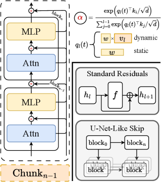

# DAR: Rethinking Cross-Layer Information Routing in Diffusion Transformers

## 메타 정보

| 항목 | 내용 |
|---|---|
| **논문 제목** | Rethinking Cross-Layer Information Routing in Diffusion Transformers |
| **저자** | Chao Xu, Maohua Li, Qirui Li, Yixuan Xu, Yanke Zhou, Yunhe Li, Cuifeng Shen, Hanlin Tang, Kan Liu, Tao Lan, Lin Qu, Shao-Qun Zhang |
| **소속** | Alibaba Group + Nanjing University (arXiv 페이지 기준 추정, 논문 HTML에 명시 제한적) |
| **공개일** | 2026-05-20 (v1), 2026-06-16 (v2) |
| **분야** | cs.CV, cs.AI — Diffusion Transformer 아키텍처 (residual stream 설계) |
| **논문 링크** | [arXiv abs](https://arxiv.org/abs/2605.20708) / [PDF](https://arxiv.org/pdf/2605.20708) / [HTML](https://arxiv.org/html/2605.20708v2) |
| **코드** | **미공개** (2026-07-15 기준. 논문에 공개 계획 언급조차 없음 → Q1 참조) |
| **사용 모델/데이터** | SiT-XL/2 (675M), ImageNet-1K 256², DINOv2-B (REPA 실험), Qwen-Image (DMD 사후학습 실험) |

---

## 주요 용어 사전 (Glossary)

### 아키텍처

| 용어 | 쉬운 설명 |
|---|---|
| **residual stream (잔차 흐름)** | Transformer에서 각 층의 출력을 입력에 계속 "더해서" 쌓아가는 통로. 층 l의 입력 = 처음 입력 + 지금까지 모든 sublayer 출력의 합. 2017년 Transformer 원본 그대로 DiT에 상속됨 |
| **DAR (Diffusion-Adaptive Routing)** | 이 논문의 제안. "무조건 1:1 합산"을 "timestep에 따라 달라지는 학습 가능한 softmax 가중 선택"으로 교체하는 drop-in residual 대체물 |
| **non-incremental aggregation (비증분 집계)** | 직전 상태에 증분을 더하는(incremental) 게 아니라, 매 층마다 과거 층 출력 전체 역사에서 새로 조합해오는 방식 |
| **깊이 방향 attention** | DAR의 본질. 토큰 방향이 아니라 "과거 층 출력들" 방향으로 attention을 한 번 더 거는 것 |
| **chunked aggregation (청크 집계)** | 전 층 출력을 다 들고 있으면 메모리 폭탄 → 깊이를 크기 S 청크로 나누고 지나간 청크는 요약본 하나로 압축 |
| **Pre-Norm dilution (희석)** | Pre-Norm 구조에서 residual 합이 계속 커지면, 뒤쪽 층의 새 기여가 거대한 기존 신호에 묻혀버리는 현상 |

### 진단 지표

| 용어 | 쉬운 설명 |
|---|---|
| **forward magnitude inflation (순방향 크기 팽창)** | 층이 깊어질수록 residual 합의 RMS 크기가 단조 증가하는 증상 (SiT-XL/2에서 100배) |
| **backward gradient decay (역방향 기울기 붕괴)** | 뒤쪽 블록일수록 손실의 gradient가 급감해 최적화 신호를 못 받는 증상 |
| **block-wise redundancy (블록 간 중복)** | 인접 블록 출력의 코사인 유사도가 0.9 이상 = 이웃 층들이 거의 같은 일을 함 = 용량 낭비 |
| **counterfactual importance (반사실적 중요도)** | "이 층 출력을 빼면(게이트로 조이면) 손실이 얼마나 나빠지나"로 재는 층별 중요도 |
| **linear probe (선형 프로브)** | 은닉 상태만 보고 특정 정보(여기선 timestep t)를 선형 회귀로 맞출 수 있는지 검사. R²가 1에 가까우면 그 정보가 은닉 상태에 새겨져 있다는 뜻 |

### 비교 기법

| 용어 | 쉬운 설명 |
|---|---|
| **ReZero / LayerScale / DeepNorm** | residual에 스칼라 게이트·스케일을 붙여 "얼마나 더할지"만 조절하는 선행 연구들 |
| **Hyper-Connections / mHC** | LLM 쪽에서 나온 다중 스트림 + 학습 믹싱 방식 |
| **DenseNet / DenseFormer** | 과거 층 전체에 접근하는 dense 연결 — DAR과 뼈대는 같음 |
| **REPA** | DINOv2 표현 정렬 보조손실로 학습 가속 ([[PAPER_REPA.md]]). DAR과 직교(축이 다름) |
| **SiT-Plus** | "파라미터 늘린 효과 아니냐" 반론 차단용으로 저자들이 만든 파라미터 균형 baseline (752M) |

### 학습/평가

| 용어 | 쉬운 설명 |
|---|---|
| **FID / sFID / IS / Precision / Recall** | 생성 품질 표준 지표 (50K 샘플) |
| **CFG (classifier-free guidance)** | 조건 강조 샘플링 기법. DAR의 이득은 CFG 없는 쪽에서 크고 CFG 쓰면 줄어듦 |
| **DMD (Distribution Matching Distillation)** | 다단계 diffusion을 4-step 등으로 압축하는 증류 ([[PAPER_DMD.md]], [[PAPER_DMD2.md]]) |
| **fused Triton kernel** | 여러 GPU 연산을 하나로 합쳐 메모리 왕복을 줄인 커스텀 커널. DAR 실용성의 핵심 방어막 |

---

## 논문 요약 (TL;DR)

**한 줄**: DiT의 모든 부품(토크나이저, 어텐션, VAE, 목적함수)은 다 갈아엎어졌는데 residual 연결만은 2017년 Transformer 원본 그대로라는 점에 주목해서, "이전 층 출력을 무조건 1:1로 더하는" 방식을 timestep에 따라 달라지는 학습 가능한 softmax 가중 선택(DAR)으로 교체한 논문.

- **핵심 문제**: 고정 계수 1의 residual 합산이 DiT에서 세 가지 병리(크기 팽창 100배, gradient 붕괴, 블록 중복 cos>0.9)를 일으키고, 특히 diffusion에서는 "어느 층 출력이 중요한지"가 denoising timestep마다 다른데 이를 전혀 활용 못 함
- **해결책**: 층마다 query를 두고 과거 층 출력들을 key로 삼아 softmax 가중 집계(깊이 방향 attention) + timestep 주입 + 청크 압축으로 메모리 제어
- **검증**: SiT-XL/2에서 FID 9.67→7.56 (3분의 1 스텝으로), 수렴 8.75배 가속, REPA 위에 얹으면 초반 2배 추가 가속, Qwen-Image DMD 증류에서 고주파 디테일 보존

---

## 핵심 기여 (Contributions)

1. **체계적 진단**: DiT의 residual stream을 깊이×timestep 2축으로 분석해 세 증상(순방향 크기 팽창, 역방향 기울기 붕괴, 블록 간 중복)을 정량화. 특히 "중요한 층이 timestep마다 다르다"는 diffusion 고유 관찰
2. **DAR 제안**: 학습 가능·timestep 적응형·비증분 방식의 깊이 방향 softmax 집계. drop-in residual 대체물
3. **청크 집계 이론**: 최적 청크 크기 S* ≈ √L을 유도하고 실측(S=4 최적)으로 검증. 메모리 O(L·d) → O((S+N)·d)
4. **직교성 증명**: REPA와 축이 달라 시너지(초반 2배 가속). "층 간 routing"이 표현 정렬과 별개의 미개척 설계축임을 제시
5. **실용화 공학**: fused Triton 커널로 forward 11.5배 가속, 활성화 메모리 약 79% 절감

---

## 주요 알고리즘 설명

### 1. 진단: 무엇이 문제인가

> 왜? — 처방(DAR)의 정당성은 전부 이 진단에서 나오므로, 측정 방법부터 명확히 해둔다.

**측정 설정**: 600K 스텝 학습된 SiT-XL/2에서 ImageNet 샘플 4096개를 흘려보내며, 각 블록 k ∈ {1,...,28}의 출력 은닉 상태 $z_k$에 대해 세 통계를 기록.

| 증상 | 측정 지표 | 결과 | 해석 |
|---|---|---|---|
| 순방향 크기 팽창 | $\text{RMS}(z_k)$ | 블록 1 ≈ 15.5 → 블록 28 ≈ 1576 (**100배**) | 합만 쌓이니 신호 크기 단조 증가. Pre-Norm dilution: 뒤쪽 층의 새 기여가 거대한 기존 신호에 희석 |
| 역방향 기울기 붕괴 | $\text{RMS}(\partial \mathcal{L} / \partial z_k)$ | 뒤쪽 블록에서 급감 (~5×10⁻⁷ → 거의 0) | 깊은 층일수록 최적화 신호를 못 받음 |
| 블록 간 중복 | $\cos(z_k, z_{k+1})$ | > 0.9 | 이웃 층들이 거의 같은 일 = 용량 낭비 |

**diffusion 고유 관찰 (Figure 3)**: 기존 모델에 스칼라 게이트를 붙여 반사실적 중요도를 재보니, 어느 층의 출력이 중요한지가 **denoising timestep t에 따라 체계적으로 바뀜**. 노이즈가 많을 때(구도 잡는 단계)와 적을 때(질감 다듬는 단계)에 필요한 정보 소스가 다르다 — 그러니 "고정 계수 1로 전부 합산"은 diffusion에서 특히 아깝다.

> 이 진단 파트는 [[PAPER_MVSplit-DiT.md]]의 Mean Mode Screaming 진단과 정확히 같은 문제의식(residual 누적으로 인한 크기 폭주). MV-Split은 "스트림을 쪼개서" 풀었고, DAR은 "합산 자체를 선택으로 바꿔서" 푼다.

### 2. DAR 본체: 더하지 말고 골라 담기

> 왜? — 진단이 "무조건 합산이 문제"였으니, 처방은 "무엇을 얼마나 가져올지 학습하게 하자"이다.

**표준 residual** (고정 계수 1의 무조건 누적):

$$h_l = h_0 + \sum_{i=0}^{l-1} f_i(h_i; t)$$

**DAR** (Equation 5) — 층 l의 입력을 과거 모든 sublayer 출력 $v_0, \ldots, v_{l-1}$의 softmax 가중합으로 교체:

$$h_l = \sum_{i=0}^{l-1} \alpha_{i \to l}(t) \cdot v_i, \qquad \alpha_{i \to l}(t) = \frac{\exp(q_l(t)^\top k_i / \sqrt{d})}{\sum_{j=0}^{l-1} \exp(q_l(t)^\top k_j / \sqrt{d})}, \qquad k_i = \text{RMSNorm}(v_i)$$

즉 **층과 층 사이에 "깊이 방향 attention"을 한 번 더 거는 셈**. 토큰 방향이 아니라 역사(과거 층 출력들) 방향의 attention이라는 게 포인트. "non-incremental"인 이유: 직전 상태에 증분을 더하는 게 아니라 매 층마다 전체 역사에서 새로 조합해오기 때문.



**Figure 4 읽는 법** — 논문의 구조 개요 그림으로, 왼쪽이 DAR, 오른쪽 아래가 기존 방식 두 가지다:

- **왼쪽 (DAR 블록 스택)**: Attn → MLP가 반복되는 표준 DiT 스택인데, 각 sublayer **입력 자리마다 α 노드(분홍 원)**가 붙어 있다. 이 α 노드가 바로 "골라 담기" 지점 — 위쪽 화살표(block_k, block_{k-1} 등)로 과거 sublayer 출력들을, 아래쪽에서 **Chunk_{n-1}**(지나간 청크의 요약본, → 3절)을 후보로 받아 softmax 가중합으로 그 sublayer의 입력을 조립한다. residual 더하기(⊕)가 α 노드로 전부 교체된 그림.
- **오른쪽 위 (α 수식과 query 두 갈래)**: α는 query와 key 내적의 softmax (Equation 5). 그 아래 중괄호가 query 파라미터화 — **dynamic**은 학습 행렬 W에 직전 출력 v를 곱한 것(t 암묵적), **static**은 학습 벡터 w 하나(+ t 주입 가능).
- **오른쪽 아래 (비교 대상 두 가지)**:
  - **Standard Residuals**: h_l → f → ⊕ → h_{l+1}. 변환 결과를 입력에 **무조건 더하는**(⊕) 증분 방식. 선택권이 없다.
  - **U-Net-Like Skip**: block_0 → block_n처럼 멀리 떨어진 층을 **고정 배선**으로 잇는 long skip (U-Net/UViT 계열). 어디와 어디를 이을지가 설계 시점에 하드코딩되어 있고 timestep과 무관.

한 눈에 요약하면: 기존 두 방식은 "무조건 더하기"(⊕) 아니면 "고정 배선"(skip)인데, DAR은 그 자리를 전부 **학습되는 α(softmax 선택)**로 바꿔서 *어느 층과 이어질지 자체를 데이터와 timestep이 결정*하게 만든 것이다. U-Net skip과 비교하는 이유도 여기 있다 — long skip은 "먼 층 정보가 유용하다"는 같은 직관의 수동 버전이고, DAR은 그 배선을 학습으로 대체한 자동 버전이다.

**query 파라미터화 세 가지** (Equation 6):

| 변형 | query 구성 | 추가 파라미터 |
|---|---|---|
| Static (t 무시) | $q_l(t) = w_l$ (층별 학습 벡터) | 28 × 768 = 21.5K (0.003%) |
| **Static + t 주입** | $q_l(t) = w_l + e(t)$ (기존 timestep embedding 재사용) | **0 추가** |
| Dynamic | $q_l(t) = W_q^{(l)} v_{l-1}$ (직전 출력에 선형변환, t 암묵적) | 28 × 768² = 16.5M (2.4%) |

**timestep이 진짜 핵심 성분이라는 자기 증명** (Table 2, FID): t를 무시한 Static은 400K에서 11.51인데, t 주입만 하면 7.97, Dynamic은 8.10. Dynamic은 초반이 특히 빠름 (100K에서 13.95 vs t주입 17.39).

**Dynamic이 t 명시 주입 없이도 되는 이유** (Figure 5 선형 프로브): 은닉 상태 $v_{l-1}$만 보고 t를 선형 회귀로 맞추면 원본 입력에서 R² ≈ 0.80, 블록 6 이후 R² ≈ 1.0 — **timestep 정보가 은닉 상태에 이미 완전히 새겨져 있어서** 암묵적 t-적응 routing이 가능.

#### 참고 구현 (비공식 재구현)

> 왜? — 공식 코드가 미공개(→ Q1)라, Equation 5~6을 PyTorch로 충실히 옮긴 나이브 버전을 남겨둔다.

```python
import torch, math
import torch.nn as nn
import torch.nn.functional as F

class DARRouter(nn.Module):
    """
    층 l의 입력 h_l 을 과거 sublayer 출력 v_0..v_{l-1} 의
    softmax 가중합으로 조립 (Eq. 5).  Static + t-주입 변형 (Eq. 6).
    """
    def __init__(self, dim):
        super().__init__()
        self.w = nn.Parameter(torch.zeros(dim))   # 층별 학습 query 벡터 w_l
        self.key_norm = nn.RMSNorm(dim)           # k_i = RMSNorm(v_i)

    def forward(self, history, t_emb):
        # history: 과거 출력 리스트, 각 (B, N, d) — l개
        # t_emb:   기존 timestep embedding e(t), (B, d) — 추가 파라미터 0
        V = torch.stack(history, dim=2)           # (B, N, l, d)
        K = self.key_norm(V)                      # (B, N, l, d)
        q = self.w + t_emb                        # (B, d)  ← static + t 주입
        logits = torch.einsum('bd,bnld->bnl', q, K) / math.sqrt(V.shape[-1])
        alpha = logits.softmax(dim=-1)            # 깊이 방향 softmax (가중치 합=1)
        return torch.einsum('bnl,bnld->bnd', alpha, V)   # h_l


class DARBlock(nn.Module):
    """표준 DiT 블록에서 'x = x + f(x)' 를 'h = route(역사); v = f(h)' 로 교체."""
    def __init__(self, dim, num_heads):
        super().__init__()
        self.route_attn, self.route_mlp = DARRouter(dim), DARRouter(dim)
        self.attn = Attention(dim, num_heads)     # 기존 DiT 것 그대로
        self.mlp  = Mlp(dim)
        self.norm1, self.norm2 = nn.LayerNorm(dim), nn.LayerNorm(dim)

    def forward(self, history, t_emb):
        h = self.route_attn(history, t_emb)       # ⊕ 대신 골라 담기
        history.append(self.attn(self.norm1(h)))  # v를 역사에 등록 (더하지 않음!)
        h = self.route_mlp(history, t_emb)
        history.append(self.mlp(self.norm2(h)))
        return history

# 사용: history = [x_embed]  로 시작해서 블록마다 history를 넘김.
# Dynamic 변형은 q = W_q @ history[-1] (토큰별 query, t_emb 불필요)
```

핵심이 표준 블록과 다른 지점은 두 줄: `x = x + attn(...)`이 사라지고, (1) 입력을 `route(history)`로 조립하고 (2) sublayer 출력을 **더하지 않고 history에 append만** 한다.

**읽을 때 주의점 세 가지**:

- **청크 압축(Eq. 7)은 뺐다.** 실제로는 history가 무한정 길어지지 않게 지나간 청크(S=4)를 요약본 하나로 접는데, 요약본을 정확히 어떻게 만드는지(경계에서의 라우팅 결과인지, 별도 풀링인지)는 논문 본문에서 세부가 얇아 재구성이 논문과 다를 수 있어 참고 구현에서는 제외.
- **이 나이브 버전은 느리다.** history 전체를 stack하는 방식이라 논문 벤치마크 기준 forward 22.5ms — 논문은 이걸 fused Triton 커널(온라인 softmax로 소스를 메모리에서 1회만 읽음)로 1.96ms까지 줄였고(→ 4절), 그 커널이 바로 공개 안 된 부분. 학습용으로 진지하게 쓰려면 이 커널 재현이 실질적인 관문.
- **비공식 재구현**이라는 점 — 수식(Eq. 5, 6)과 Figure 4 구조에는 충실하지만, norm 위치나 최종 aggregator 같은 잔디테일은 논문에 명시가 없어 표준 관례로 채움.

### 3. Chunked Aggregation: 메모리 폭탄 처리

> 왜? — 전 층의 출력을 다 들고 있어야 하니 활성화 메모리가 깊이 L에 비례해 커진다. 이걸 이론+실측으로 다스린다.

깊이 L을 크기 S짜리 청크 N개로 분할. 층 l이 보는 소스 집합 (Equation 7):

$$\mathcal{S}_l = \underbrace{\{c_0, \ldots, c_{n-1}\}}_{\text{이전 청크 요약}} \cup \underbrace{\{v_{(n-1)S+1}, \ldots, v_{l-1}\}}_{\text{현재 청크 내 원본}}, \qquad |\mathcal{S}_l| \le S + N$$

메모리: O(L·d) → O((S+N)·d). SiT-XL/2 (L=56 sublayer, S=4, N=14) 기준 활성화 85% 감소.

**최적 청크 크기 이론** (Proposition 1, Equation 9):

$$S^* = \sqrt{L \cdot \frac{1-\alpha}{1+\alpha}}$$

SiT-XL/2 (L=56): α ∈ [0.4, 0.6]에서 S* ∈ [3.7, 4.9] 예측 → 실측(Table 4)과 일치하는 U자 곡선:

| Chunk Size | FID↓ | IS↑ | 해석 |
|---|---|---|---|
| S=1 | 10.41 | 107.2 | 전부 요약본 = 과압축과 반대로 원본 접근이 너무 잘게 끊김 |
| **S=4** | **8.39** | **121.7** | 이론 예측 구간과 일치 |
| S=8 | 11.14 | 103.51 | 과압축 |

### 4. 비용과 실용화

> 왜? — "전 층 출력에 attention"은 나이브하게 짜면 느려서, 실용성 방어가 필수다.

**fused Triton 커널 벤치마크** (Appendix E):

| 메트릭 | 나이브 | fused 커널 | 개선 |
|---|---|---|---|
| Forward 지연 | 22.5 ms | 1.96 ms | **11.5×** |
| Backward 지연 | 115.8 ms | 13.6 ms | **8.5×** |
| Forward 활성화 메모리 | — | −78.7% | |
| Backward 활성화 메모리 | — | −74.6% | |

동작 원리: 온라인 softmax 순환으로 소스를 메모리에서 정확히 1회만 읽고, RMSNorm·query-key 곱·지수 연산을 전부 레지스터에서 유지.

**학습 설정** (SiT와 동일): ImageNet-1K 256², 배치 1024, lr 1e-4, bf16. 평가는 FID/IS/sFID/Precision/Recall 50K 샘플, ODE/SDE 250 NFE. REPA 실험은 DINOv2-B, 정렬 계수 0.5, 8번째 층.

---

## 실험 요약

### 메인 결과 (ImageNet 256², Table 1)

| 모델 | 스텝 | FID (ODE, CFG 없음) | sFID | IS | FID (CFG) |
|---|---|---|---|---|---|
| SiT-XL/2 | 1.75M | 9.67 | 6.40 | 124.1 | 2.15 |
| **DAR Static c4** | **600K** | **7.56** | 5.18 | 131.1 | 2.08 |
| DAR Dynamic c4 | 500K | 8.07 | 5.07 | 129.0 | **2.05** |

- SDE 버전도 유사 개선 (Static c4 SDE w/o CFG: 6.92)
- **3분의 1 스텝으로 baseline을 넘고**, baseline 수렴 품질에는 **8.75배 적은 스텝**으로 도달
- **SiT-Plus 대조**: 파라미터를 맞춘 SiT-Plus(752M, 1M 스텝)가 FID 10.85에 그침 → "그냥 파라미터 늘린 효과 아니냐" 반론 차단

### REPA와의 직교성 (Table 3)

| 스텝 | SiT+REPA | DAR+REPA | 개선 |
|---|---|---|---|
| 100K | 9.89 | **7.09** | 2.80↓ |
| 200K | 6.89 | **5.92** | 0.97↓ |

- DAR+REPA 100K = REPA 200K 수준 (**초반 2배 가속**)
- REPA는 "무엇을 표현할지"(의미 정렬), DAR은 "그 표현을 층 사이에 어떻게 흘릴지" — 축이 달라 시너지
- 단, 200K에서 격차가 0.97로 줄어듦 → **후반 수렴에서도 이득이 유지되는지는 열린 문제**

### 대규모 T2I 사후학습 (Appendix D)

- Qwen-Image MM-DiT에 LoRA(rank 64)로 DAR 부착 + DMD 4-step 증류, 1024², guidance 4.0, lr 5e-6(학생)/2e-6(fake branch)
- 고주파 디테일 보존 개선 보고 — 단 **정성 비교 위주, 정량 수치 빈약** → "예고편" 수준

### 저자 인정 한계 (Appendix F)

- 본격 검증은 깊이 28짜리 SiT-XL/2 한 곳뿐. 진단한 증상은 깊을수록 심해지는 문제라 FLUX(57블록)·초심층에서 더 빛나야 할 텐데 그 검증이 없음
- S* = √L 스케일링이 매우 깊은 모델에서 실제로 성립하는지 미확인
- DMD 실험은 Qwen-Image만, 다른 사후학습 목표(SFT, RL)는 미검증

---

## 기존 연구 대비 위치

> 왜? — "깊이 방향 routing" 아이디어 자체는 새 발명이 아니므로, 이 논문의 진짜 기여가 뭔지 구분해둔다.

| 선행 연구 | 방식 | DAR과의 차이 |
|---|---|---|
| ReZero / LayerScale / DeepNorm | residual에 스칼라 게이트·스케일 | "얼마나 더할지"만 조절, 소스 선택 없음 |
| Highway Networks | 게이트 통과 | 동일 |
| Hyper-Connections / mHC | 다중 스트림 + 학습 믹싱 (LLM) | timestep 축 없음 |
| DenseNet / DenseFormer | 과거 층 전체 접근 / 학습 깊이 집계 | 뼈대는 동일, diffusion 결합 없음 |
| Attention Residuals | 깊이 방향 softmax attention | 가장 근접한 선행, 역시 timestep 축 없음 |

**실제 기여**: "깊이 방향 routing" 발명이 아니라 — (1) diffusion 특유의 timestep 축을 routing에 결합, (2) DiT에서 세 증상을 체계적으로 진단, (3) chunking 이론 + Triton 커널 실용화 + REPA 직교성 증명. **발명보다는 "diffusion으로의 이식 + 진단 + 공학"**으로 읽는 게 정확하다.

---

## 평가 (강점 / 약점)

### 강점

- **진단 → 처방 → 검증의 교과서적 구조**. 특히 "t를 빼면 무너진다"(Table 2)와 "청크 크기 이론 예측 = 실측"(Table 4)은 주장과 증거가 잘 맞물림
- REPA, TREAD, DDT 등 "DiT 학습 가속" 계열이 대부분 손실/토큰 축을 건드리는데, **residual이라는 미개척 축**을 건드리면서 기존 축과 직교함을 증명 — 조합 가능한 부품이 하나 늘어남
- Triton 커널까지 만들어 오버헤드 반론을 미리 방어한 성실함

### 약점·주의점

- **깊이 28에서만 검증**: 증상은 깊을수록 심한데 초심층 검증 부재 (저자도 인정)
- **코드 미공개**: 수식 자체는 재구현 가능하지만, 나이브 구현이 10배 이상 느려서 Triton 커널 없이는 재현 장벽이 실질적으로 높음
- Qwen-Image DMD는 정량 근거가 얇고, from-scratch가 아닌 LoRA 사후 부착이라 "사전학습 DAR"과는 사실상 다른 실험
- **CFG 쓰면 이득 급감** (2.15 → 2.05~2.08): 가치는 최종 SOTA 수치보다 **학습 효율(적은 스텝, 초반 가속)** 쪽

### 우리가 읽어온 논문들과의 연결

- **MV-Split DiT**: 같은 병(residual 누적 병리)에 다른 약. MV-Split은 스트림 분할(초심층용), DAR은 softmax 선택(일반 깊이용). 나란히 읽으면 "residual stream = DiT의 미개척 설계축" 그림 완성
- **직교하는 네 번째 가속 축**: REPA=의미 정렬, TREAD=토큰 routing, DDT=인코더/디코더 분리, **DAR=층 간 routing**
- **SFD/SeFi-Image**의 "timestep마다 필요한 정보가 다르다"(의미 먼저, 질감 나중)는 직관과 상통 — DAR은 그걸 아키텍처 수준의 층 선택으로 구현한 셈

---

## 💬 Q&A

### Q1. 이거 코드 공개되었나?

**아직 공개 안 됐다** (2026-07-15 확인). 논문 본문, arXiv 페이지, Hugging Face Papers 페이지, GitHub 검색까지 확인한 결과:

- 논문 텍스트에 GitHub 링크나 "code will be released" 같은 문구가 없음
- [Hugging Face Papers 페이지](https://huggingface.co/papers/2605.20708)에도 연결된 코드/모델/데모 없음
- GitHub 검색에서도 공식·비공식 구현 모두 안 잡힘

재현 관점에서 특히 아쉬운 점: 이 방법의 실용성이 fused Triton 커널(→ 알고리즘 4절)에 크게 기대고 있다. 수식 자체(softmax 가중 깊이 집계 + 청크 압축)는 논문만 보고 재구현할 수 있는 수준이지만, 커널 없이 나이브하게 구현하면 학습이 상당히 느려져 실전 투입 장벽이 높다. v2 개정(2026-06-16)까지 나온 시점에도 공개가 없는 걸 보면 당분간은 기대하기 어려워 보인다.

논문 수식대로 옮긴 비공식 PyTorch 참고 구현은 → 알고리즘 2절 "참고 구현" 참조.

### Q2. MoE(Mixture of Experts)의 컨셉을 가져온 건가?

**어떤 MoE를 기준으로 보느냐에 따라 답이 달라진다 — 고전적 MoE 기준으로는 "맞다", 요즘의 sparse MoE 기준으로는 "아니다".**

#### 고전 MoE (Jacobs 1991 원조) 기준: 구조적으로 사실상 같다

원조 Mixture of Experts의 수식:

- 출력 = 각 expert 출력에 gating 가중치를 곱해서 합산
- gating 가중치 = gating network가 입력을 보고 만든 softmax

이걸 DAR에 대입하면 정확히 겹친다:

| 고전 MoE | DAR |
|---|---|
| expert i의 출력 | 과거 층 i의 출력 $v_i$ |
| gating network | query를 만드는 부분 (층별 벡터 $w_l$ + timestep embedding $e(t)$) |
| softmax gating 가중치 | $\alpha_{i \to l}(t)$ (query와 key 내적의 softmax) |
| 가중합으로 최종 출력 | $h_l = \sum \alpha_{i \to l}(t) \cdot v_i$ |

즉 **"각 층을 expert로 보고, timestep을 아는 gating network가 softmax로 섞는다"**고 읽으면, DAR은 문자 그대로 soft Mixture of Experts다. 이 관점은 정당하다.

#### 요즘의 sparse MoE (Switch/Mixtral/Nucleus-Image) 기준: 다르다

| | sparse MoE (예: Nucleus-Image) | DAR |
|---|---|---|
| **무엇을 고르나** | 병렬 expert들 = **파라미터** (어느 FFN이 이 토큰을 계산할까) | 과거 층 출력들 = **이미 계산된 activation** (어느 역사를 읽어올까) |
| **방향** | 폭(width) 방향 — 같은 층 안의 옆 갈래들 | 깊이(depth) 방향 — 아래층들의 출력 역사 |
| **선택 방식** | sparse (top-k만 계산, 나머지는 아예 실행 안 함) | dense/soft (전부에 가중치를 주고 섞음, 버리는 것 없음) |
| **목적** | 계산량 고정한 채 **용량 늘리기** (17B 파라미터, 2B만 활성) | 정보 흐름 병리(크기 팽창·gradient 붕괴) **치료** |
| **비용 효과** | FLOPs 절약이 존재 이유 | 오히려 약간 추가됨 (Triton 커널로 방어) |
| **고유 문제** | load balancing, routing collapse | 활성화 메모리 (→ 청크 압축으로 해결) |

핵심 차이를 한 문장으로: sparse MoE는 **"누가 계산할까"**를 고르고(계산 전 분배), DAR은 **"이미 계산된 것 중 무엇을 가져올까"**를 고른다(계산 후 취합). 결정적으로:

1. **expert가 독립 병렬 모듈이 아님** — MoE의 expert는 같은 자리에 나란히 놓인 별도 FFN들이고, DAR의 "expert"는 순차 스택을 거치며 이미 만들어진 중간 산물. 층 5의 출력은 층 3의 출력에 의존한다. 서로 독립인 전문가들이 아니다.
2. **sparse가 아님** — 요즘 MoE의 존재 이유는 top-k만 계산해서 FLOPs를 아끼는 건데, DAR은 전부 계산하고 전부 섞는다. 계산 절약이 없다.
3. **논문 스스로의 계보 주장** — 저자들이 Related Work에서 MoE가 아니라 DenseFormer, Attention Residuals(깊이 방향 attention)를 선행으로 꼽는다 (→ "기존 연구 대비 위치" 참조).

#### 재미있는 접점: timestep 축에서 둘이 만난다

[[PAPER_Nucleus-Image.md]](MoE diffusion)에서는 router가 토큰 내용 대신 **timestep에만 반응해서 expert 선택이 붕괴**하는 게 문제였고, 그래서 timestep을 routing에서 **떼어내는**(decoupled routing) 처방을 했다. 반면 DAR은 정반대로 timestep을 routing의 **핵심 신호로 끌어안는다**(t를 빼면 FID 11.51로 무너지는 게 Table 2의 자기 증명).

모순처럼 보이지만 실은 일관된다. 두 논문 모두 "diffusion에서는 timestep이 routing을 지배할 만큼 강한 신호"라는 같은 사실을 관찰했고 — MoE에서는 그 신호가 expert 다양성을 죽이니 **독**이고, 깊이 방향 집계에서는 "단계마다 필요한 층이 다르다"는 유용한 정보니 **약**인 것. 같은 성질을 어디에 쓰느냐의 차이다.

#### 정리

- **"MoE의 컨셉(gating network로 여러 출처를 골라 섞기)을 가져온 거냐?"** → 네, 그 컨셉 자체는 고전 soft MoE와 동일한 뼈대. "각 층 = expert, timestep 조건 gating"이라는 독해는 정확하다.
- **"요즘 말하는 sparse MoE(용량 스케일링, top-k, expert 병렬)를 가져온 거냐?"** → 아니다. 목적(용량 확장 vs 정보 흐름 치료)과 메커니즘(계산 전 분배 vs 계산 후 취합)이 다르다.

가장 정확한 한 줄: **"softmax gating으로 섞는다는 MoE의 원형 아이디어를, expert 대신 '과거 층 출력들'에 적용한 것"** — MoE의 gating 개념과 attention의 query-key 개념이 만나는 지점에 있는 방법이다.

### Q3. 각 레이어에 대해 residual 할지 안 할지를 고르는 건가?

거의 다 왔는데 한 끗 다르다. **"할지 안 할지"(on/off 이진 선택)가 아니라, "과거 층 출력들을 어떤 비율로 섞을지"(연속적인 배합 조절)다.** 그리고 선택의 대상도 "residual을 켤까 끌까"가 아니라, residual 더하기 자체를 없애고 입력을 새로 조립하는 쪽이다.

세 가지 방식을 나란히 놓으면 차이가 분명해진다:

#### 1) 표준 residual — 선택권 없음

층 l의 입력 = 처음 입력 + 과거 모든 sublayer 출력의 합. 전부 계수 1로 **무조건** 포함된다. 고를 수 있는 게 없다.

#### 2) 게이트 방식 (ReZero, Highway 등) — 질문의 그림에 가장 가까운 것

각 층 출력에 스칼라 게이트 g를 붙여서 "이 층의 기여를 얼마나 넣을까(극단적으로는 넣을까 말까)"를 조절한다. "각 레이어에 대해 residual 할지 말지 고르기"는 정확히 이 계열의 그림인데, 이건 DAR이 아니라 **선행 연구들**이고, 논문은 이 방식으로는 부족하다는 입장이다 (→ "기존 연구 대비 위치" 참조).

#### 3) DAR — 더하기를 없애고 매 층마다 새로 조립

층 l에 들어갈 입력을 이렇게 만든다 (수식은 → 알고리즘 2절):

- 과거 층 출력 $v_0 \sim v_{l-1}$이 전부 후보로 나열됨 (냉장고에 있는 재료들)
- 층 l의 query가 timestep t를 보고 각 후보에 **softmax 가중치**를 매김 — 예: 층 3 출력 45%, 층 7 출력 30%, 층 1 출력 15%, 나머지 10%
- 그 비율대로 섞은 것이 층 l의 입력

포인트 세 가지:

| 포인트 | 내용 |
|---|---|
| **이진이 아니라 연속** | 0/1로 끄고 켜는 게 아니라 0~1 사이 비율. 어떤 층도 완전히 버려지진 않고, 가중치가 작아질 뿐 (soft selection) |
| **층마다 + timestep마다 레시피가 다름** | 층 10과 층 20은 각자 다른 query를 가져서 다른 배합을 뽑고, 같은 층이라도 노이즈 많은 단계와 적은 단계에서 배합이 달라짐. "각 레이어에 대해 고른다"는 부분은 맞음 — 다만 고르는 게 on/off가 아니라 배합표 |
| **softmax라서 가중치 합이 항상 1** | 표준 residual은 합이 계속 쌓여서 크기가 100배까지 팽창했지만, DAR은 "누적"이 아니라 "합이 1인 배분"이라서 크기 팽창 문제가 **구조적으로** 사라짐. 진단했던 병 하나가 수식 형태 자체로 치료되는 셈 |

**비유**: 표준 residual은 지나온 모든 재료를 무조건 다 때려넣어 계속 진해지는 국물이고, DAR은 각 층의 요리사가 냉장고(과거 층 출력 전체)를 열어보고 지금 조리 단계(t)에 맞는 재료를 비율 정해 골라 담는 방식. (실제로는 냉장고가 커지는 걸 막으려고 오래된 재료는 청크 단위 요약본으로만 보관 — 그게 chunked aggregation, → 알고리즘 3절.)

**한 줄**: "residual을 할지 말지"가 아니라 **"residual이라는 고정 레시피를 버리고, 층마다·timestep마다 과거 출력들의 배합 비율을 새로 정하는 것"**이다.

---

## 한 줄 요약 (전체)

아이디어의 씨앗(깊이 방향 routing)은 LLM 쪽에 이미 있었지만, diffusion의 timestep 축과 결합해 진단·이론·공학을 갖춘 완성도 높은 논문 — 다만 검증 범위(깊이 28 한 곳, 코드 미공개)가 주장의 스케일("모든 DiT의 미개척 축")에 아직 못 미친다.

---

## 관련 메모리 링크

- [[PAPER_MVSplit-DiT.md]] — 같은 residual 병리를 스트림 분할로 푼 초심층 DiT
- [[PAPER_REPA.md]] — DAR과 직교·시너지 확인된 표현 정렬 가속
- [[PAPER_TREAD.md]], [[PAPER_DDT.md]] — 다른 축의 DiT 학습 가속 계열
- [[PAPER_SFD.md]], [[PAPER_SeFi-Image.md]] — "timestep마다 필요한 정보가 다르다"는 직관의 손실/latent 수준 구현
- [[PAPER_DMD.md]], [[PAPER_DMD2.md]] — Appendix D 증류 실험의 배경
- [[PAPER_Qwen-Image.md]] — DMD 실험의 베이스 모델
