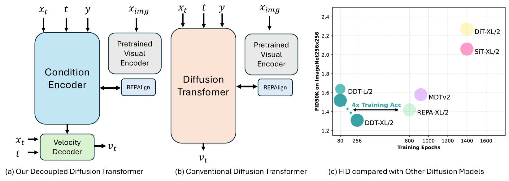
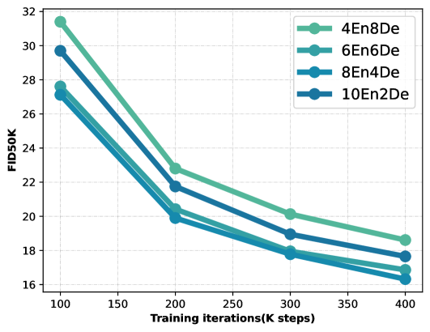
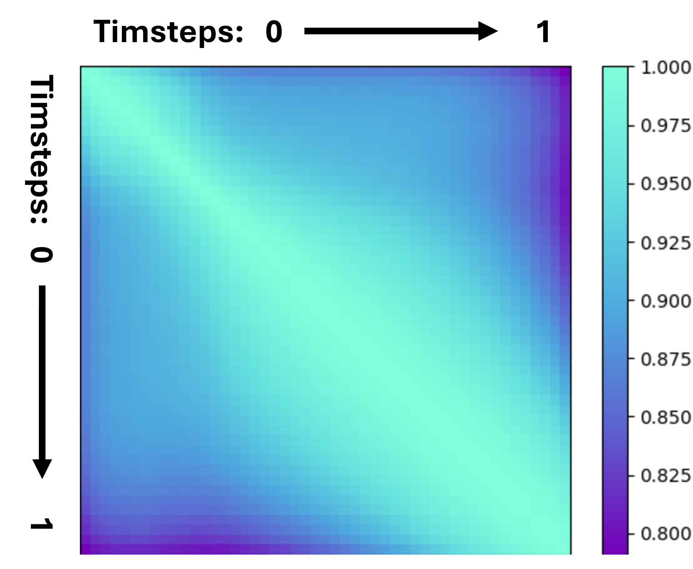

# DDT: Decoupled Diffusion Transformer

## 📑 메타 정보

| 항목 | 내용 |
|---|---|
| **제목** | DDT: Decoupled Diffusion Transformer |
| **저자** | Shuai Wang, Zhi Tian, Weilin Huang, Limin Wang (Nanjing University · ByteDance Seed) |
| **공개일** | 2025-04 (arXiv 2504.05741) |
| **분야** | Class-conditional image generation, Diffusion Transformer 아키텍처 |
| **논문 링크** | [abstract](https://arxiv.org/abs/2504.05741) · [PDF](https://arxiv.org/pdf/2504.05741) · [HTML](https://arxiv.org/html/2504.05741v1) |
| **코드** | [github.com/MCG-NJU/DDT](https://github.com/MCG-NJU/DDT) |
| **외부 모델/데이터** | ImageNet-1K(256²/512²), SD-VAE(잠재 인코딩), DINOv2(REPA 표현 정렬용, 동결) |

---

## 📖 주요 용어 사전 (Glossary)

### 아키텍처
- **DiT / SiT (Diffusion / Scalable interpolant Transformer)** — 이미지를 잠재 공간(latent space)에서 만들어내는 Transformer 기반 diffusion 모델. 이 논문이 개선하려는 baseline(기준 모델).
- **Condition Encoder(조건 인코더)** — DDT가 새로 둔 앞단. 노이즈 낀 이미지에서 "이게 무슨 그림인가" 하는 의미 정보(semantic)를 뽑아 **self-condition(자기 조건)** 벡터로 만든다.
- **Velocity Decoder(속도 디코더)** — DDT의 뒷단. self-condition을 받아 flow matching의 **velocity field(속도장)** 를 예측해 실제 디테일을 복원한다.
- **self-condition(자기 조건)** — 인코더가 뽑아 디코더에 넘겨주는 의미 특징 벡터. 모델이 스스로 만든 조건이라 "self".
- **AdaLN-Zero** — 조건(시간·클래스·self-condition)을 Transformer 블록의 정규화 계수로 주입하는 표준 방식. DDT는 이걸로 self-condition을 디코더에 넣는다.

### 핵심 개념
- **low-frequency / high-frequency(저주파 / 고주파)** — 저주파 = 전체 구도·형태 같은 큰 의미 정보, 고주파 = 털 질감·가장자리 같은 세밀한 디테일.
- **encoding / decoding(인코딩 / 디코딩)** — 여기서 인코딩 = 노이즈에서 저주파 의미 추출, 디코딩 = 고주파 디테일 복원. DDT가 둘로 쪼갠 두 가지 일.
- **optimization dilemma(최적화 딜레마)** — 기존 DiT가 한 몸으로 인코딩과 디코딩을 동시에 하려다 서로 발목 잡는 현상. 이 논문의 출발점.

### 비교·보조 기법
- **REPA (REPresentation Alignment, 표현 정렬)** — diffusion 모델 내부 특징을 DINOv2 같은 사전학습 표현에 맞추도록 보조 손실(auxiliary loss)을 거는 기법. 학습을 크게 가속한다. DDT는 이걸 **인코더에만** 건다.
- **flow matching** — 노이즈에서 이미지로 가는 직선 경로의 속도(velocity)를 학습하는 생성 방식. DiT/SiT 계열의 학습 목표.
- **time-shift / respacing(시간 이동 / 재배치)** — 샘플링 때 어느 타임스텝에 계산을 더 몰아줄지 조절하는 솔버 파라미터. 딜레마를 진단하는 실험 도구로 사용.

### 평가 지표
- **FID (Fréchet Inception Distance)** — 생성 이미지가 진짜 이미지 분포와 얼마나 가까운지. **낮을수록 좋음.**
- **CFG (Classifier-Free Guidance)** — 클래스 조건을 강하게 반영하도록 샘플링을 조정하는 표준 기법.

---

## 🎯 논문 요약 (TL;DR)

**한 줄:** 기존 DiT 한 덩어리가 떠안던 "의미 추출(인코딩)"과 "디테일 복원(디코딩)" 두 상반된 일을 **Condition Encoder + Velocity Decoder로 분리**해서, 학습을 약 4배 빠르게 하고 ImageNet FID 신기록(256²=1.31, 512²=1.28)을 세웠다.

- **핵심 문제:** 표준 DiT는 똑같은 블록 더미가 노이즈에서 의미를 뽑는 일(고주파 억제)과 디테일을 살리는 일(고주파 복원)을 동시에 해야 한다. 두 요구가 정반대라 서로 발목을 잡는 **optimization dilemma(최적화 딜레마)** 가 생긴다.
- **해결책:** 모델을 둘로 쪼갠다. 앞단 **Condition Encoder**는 의미(self-condition)만 뽑고(여기에만 REPA 표현 정렬 감독), 뒷단 **Velocity Decoder**는 그 의미를 받아 velocity field만 예측한다. 게다가 **인코더를 디코더보다 비대칭적으로 더 키우는 게** 큰 모델일수록 유리하다.
- **추론 가속:** 인코더 출력은 이웃 타임스텝끼리 매우 비슷하므로, **dynamic programming(동적 계획법)** 으로 "인코더를 새로 돌릴 최적의 스텝 집합"을 골라 재사용 → 품질 거의 손실 없이 추론 가속.
- **검증:** ImageNet 256²에서 FID 1.31을 REPA 대비 ~4배 적은 epoch로 달성, 512²에서 1.28로 SOTA.

---

## 🏆 핵심 기여 (Contributions)

1. **딜레마 진단** — 표준 diffusion transformer가 인코딩/디코딩을 한 모듈로 처리하며 겪는 **optimization dilemma**를 실험·이론(Lemma 1)으로 드러냄.
2. **구조적 분리 (Decoupling)** — Condition Encoder(의미 전담) + Velocity Decoder(디테일 전담)로 역할을 명확히 나눈 **DDT 아키텍처** 제안.
3. **비대칭 스케일링 법칙** — 모델이 커질수록 **인코더에 층을 더 몰아주는 비대칭 비율**이 유리하다는 ablation 발견.
4. **추론 가속 (Encoder Sharing)** — self-condition의 타임스텝 간 강한 유사성을 활용, **dynamic programming**으로 최적 공유 스케줄을 찾아 품질 손실 최소로 가속.
5. **SOTA 성능** — ImageNet 256² FID 1.31 / 512² FID 1.28, 그리고 REPA 대비 약 4배 빠른 학습 수렴.

---

## 🧠 주요 알고리즘 설명

### 1️⃣ 왜 딜레마가 생기는가 — 문제 진단

> *왜 이 절을 두나: DDT의 모든 설계는 "한 모듈이 두 일을 못 한다"는 진단에서 출발한다. 진단이 틀리면 처방도 의미가 없으므로 먼저 증거를 본다.*

표준 DiT는 노이즈 낀 latent x_t, 타임스텝 t, 클래스 y를 받아 velocity v_t를 내놓는다. 그런데 이 한 모듈이 실제로는 두 가지 상반된 일을 한다.

- **인코딩(저주파 의미 추출):** 노이즈가 많은 초반 스텝에서 "이게 고양이다"라는 큰 구조를 파악 → 이때는 고주파(노이즈 포함)를 **억눌러야** 한다.
- **디코딩(고주파 디테일 복원):** 노이즈가 거의 없는 후반 스텝에서 털 질감 같은 세밀한 부분을 채움 → 이때는 고주파를 **살려내야** 한다.

같은 가중치 한 벌로 "고주파 억제"와 "고주파 복원"을 동시에 잘하라는 건 모순이다. 이것이 **optimization dilemma(최적화 딜레마)**.

**진단 실험:** 저자들은 SiT-XL/2에서 샘플링 솔버의 **time-shift(시간 이동, 그림 4)** 를 조절해 타임스텝별 계산량을 바꿔본다. shift 값을 키워 **노이즈 많은 초반 스텝에 계산을 더 몰아주면 최종 품질이 좋아졌다.** 이는 모델의 병목이 "의미 추출(인코딩)" 쪽에 있다는 신호 — 즉 한 몸 구조가 인코딩 역량을 충분히 못 살리고 있다는 증거다. (이론적으로는 Lemma 1이, 노이즈 입력이 보존할 수 있는 최대 주파수에 한계가 있어 t가 줄수록 복원해야 할 주파수 간극이 커진다는 점을 보인다.)


*(a) DDT: Condition Encoder → self-condition → Velocity Decoder, 인코더에만 REPAlign. (b) 기존 DiT는 한 덩어리. (c) 같은 FID를 훨씬 적은 epoch에 도달.*

### 2️⃣ DDT 아키텍처 — 분리 처방

> *왜 이렇게 하나: 두 일이 모순이라면 모듈을 둘로 나눠 각자 한 가지에만 집중시키면 모순이 사라진다.*

**Condition Encoder(조건 인코더)**
- 입력: 노이즈 latent x_t, 타임스텝 t, 클래스 y
- 출력: **self-condition** z_t (의미 특징)
- DiT/SiT와 같은 Attention+FFN 블록 더미. t·y는 AdaLN-Zero로 주입.
- **REPA 감독을 여기에만** 건다 — 인코더 중간 특징을 동결된 **DINOv2** 표현에 코사인으로 정렬하는 보조 손실. "의미를 제대로 뽑아라"라는 직접 신호.

**Velocity Decoder(속도 디코더)**
- 입력: 노이즈 latent x_t, 타임스텝 t, **self-condition z_t**
- 출력: velocity field v_t (flow matching의 정답)
- 클래스 y를 직접 받지 않는다 — 의미는 z_t 안에 이미 녹아 있다.
- z_t는 **AdaLN-Zero**로 디코더 각 블록에 주입.

> **⭐ self-condition은 "전체에 벡터 1개"가 아니라 "패치별 공간 지도"(spatial)다.** z_t는 노이즈 latent와 같은 토큰 시퀀스 모양(B, N, hidden)이라, 디코더는 패치 위치마다 다른 조건을 AdaLN으로 받는다. 즉 인코더가 만든 "어디에 무엇이 있는지" 공간 의미 지도를 디코더가 그대로 활용한다. (이게 global 벡터 조건을 쓰는 보통 DiT와의 핵심 차이.)

**공식 코드(`MCG-NJU/DDT`) 기준 실제 구조** — 본체는 `src/models/denoiser/decoupled_improved_dit.py`의 `DDT.forward`:
- **인코더·디코더가 하나의 `blocks` 리스트를 깊이로 나눠 쓴다.** 앞 `num_encoder_blocks`개 = 인코더, 나머지 = 디코더이고 **둘 다 같은 `DDTBlock`, hidden 차원도 1152 단일**(폭 비대칭 아님).
- 조건 주입은 전부 **AdaLN-Zero**: 인코더 조건은 `c = silu(t + y)`(타임스텝·클래스), 디코더 조건은 `s = silu(t + 인코더출력)`(spatial self-condition). final layer도 s로 변조.
- 부품은 **RMSNorm + QK-Norm + SwiGLU + 2D RoPE** ("improved DiT" 계열). 원본 DiT의 LayerNorm/MLP가 아님.
- forward에 `s=None`이면 인코더를 실행해 s를 만들고, s가 주어지면 **인코더를 건너뛰고 디코더만** 실행 → 4장의 self-condition 공유(인코더 캐시) 추론의 코드 근거.

> 📌 **참고 — 다른 구현(diffusion-bench `DDT.py`)과의 차이.** diffusion-bench는 공식 DDT를 거의 따르되 두 군데를 변형했다: ① 깊이를 28:2로 더 극단화하고 부족한 디코더 용량을 **폭(2048)** 으로 메움(그래서 1152→2048 projection이 생김), ② 인코더 조건을 AdaLN 대신 **in-context 토큰(t4c8)** 으로 주입. 나머지(분리 철학, spatial self-condition, AdaLN 디코더, RMSNorm/SwiGLU/RoPE, 인코더 캐시)는 공식과 동일하다.

**forward 전체 흐름** (`DDT.forward`, ImageNet 256²·XL 기준: latent 32×32×4, patch=2 → 토큰 256개, hidden 1152, 22En+6De)

```python
# 입력: x (B,4,32,32) 노이즈 latent, t (B,) 타임스텝, y (B,) 클래스

# ① 공통 전처리
x = unfold(x, patch=2)            # (B, 256, 16)   패치 펼침
t = t_embedder(t)                 # (B, 1, 1152)
y = y_embedder(y)                 # (B, 1, 1152)
c = silu(t + y)                   # (B, 1, 1152)   ★인코더 조건 = global 벡터 1개

# ② 인코더(탐정) — blocks[0:22], 조건 = c
if s is None:                     # s가 없을 때만 인코더 실행 (추론 캐시 스위치)
    s = s_embedder(x)             # (B, 256, 1152)  x를 따로 임베딩
    for i in range(22):
        s = blocks[i](s, c, pos)  # DDTBlock, AdaLN(c)
    s = silu(t + s)               # (B, 256, 1152)  ★self-condition = 패치별 spatial 지도

# ③ 디코더(화가) — blocks[22:28], 조건 = s (패치별)
x = x_embedder(x)                 # (B, 256, 1152)  x를 처음부터 다시 임베딩
for i in range(22, 28):
    x = blocks[i](x, s, pos)      # DDTBlock, AdaLN(s) — 위치마다 다른 변조
x = final_layer(x, s)             # (B, 256, 16)    AdaLN(s) + Linear
x = fold(x)                       # (B, 4, 32, 32)  velocity 출력
return x, s                       # ★self-condition s도 반환 → 샘플러가 캐시
```

흐름에서 짚을 점: (1) **x를 두 번 임베딩** — 인코더용 `s_embedder`, 디코더용 `x_embedder`로 같은 노이즈를 다른 눈으로 본다. (2) **조건이 두 종류** — 인코더 조건 c는 global 벡터 1개, 디코더 조건 s는 패치별 spatial. (3) `s=None` 분기가 곧 추론 가속 스위치(→ 4장). (4) 반환이 `(velocity, s)` 두 개라 샘플러가 s를 다음 스텝에 재사용한다.

**학습 목표 (두 손실)**
1. **메인:** 디코더의 flow matching 손실 — 예측 velocity가 정답(데이터−노이즈 방향)에 맞도록.
2. **보조:** 인코더의 REPA 표현 정렬 손실 (DINOv2와 코사인 정렬).

인코더는 보조 손실의 직접 감독 + 디코더 velocity 손실의 간접 감독을 함께 받아 "좋은 의미 벡터"를 만들도록 학습된다.

### 3️⃣ 비대칭 스케일링 — 인코더를 더 키워라

> *왜 중요한가: 분리만으로 끝이 아니라, 두 모듈에 자원(층 수)을 어떻게 배분하느냐가 성능을 가른다. 직관과 다른 답이 나온다.*

인코더:디코더 층 비율을 바꿔가며 실험(그림 8, B/2 기준)한 결과:

- **4En8De**(인코더 적음)가 가장 나쁨 → 의미 추출이 병목임을 재확인.
- **6En6De ~ 8En4De**(인코더를 디코더만큼 또는 더 많이)가 가장 좋음.
- **10En2De**(너무 극단)는 다시 약간 나빠짐 — 디코더가 너무 얇으면 복원이 부족.
- 모델이 **커질수록** 최적점이 인코더 쪽으로 더 치우친다(예: 큰 모델에서 5:1처럼 인코더에 크게 몰아주는 구성이 유리).

핵심 교훈: **"의미 추출이 진짜 어려운 일"이므로 자원을 인코더에 몰아라.** 디코더는 의외로 얇아도 된다.


*B/2 기준. 인코더를 디코더만큼(6En6De) 또는 더(8En4De) 두는 쪽이 4En8De보다 일관되게 낮은 FID.*

### 4️⃣ 추론 가속 — Self-condition 공유 (Dynamic Programming)

> *왜 가능한가: 인코더 출력이 이웃 스텝끼리 거의 똑같다면, 매 스텝 무거운 인코더를 다시 돌리는 건 낭비다.*

**관찰(그림 6):** self-condition z_t의 타임스텝 간 코사인 유사도 행렬을 보면 대각선 근처가 0.8~1.0으로 매우 높다 — **인접 스텝의 의미 벡터가 거의 같다.**

**아이디어:** 전체 N 스텝 중 인코더를 실제로 새로 계산할 K개 스텝 집합 Φ만 고르고, 나머지는 직전 z_t를 재사용한다. 문제는 "어느 K개 스텝을 고를까".

**해법 (dynamic programming):**
- 스텝 간 유사도 행렬 S를 만든다.
- 재사용 구간 안의 유사도 합이 최대가 되도록(=재사용해도 손해가 최소가 되도록) K개 분기점을 고르는 **최소 비용 경로 문제**를 DP로 푼다.
- backtracking으로 최적 Φ 집합을 복원.

**효과:** 균등하게 띄엄띄엄 공유하는 단순 방식보다 품질 손실이 적다. 약 2.6배 가속 시 FID 저하가 0.05 수준에 그친다.

**공식 코드 근거** (`src/diffusion/stateful_flow_matching/sharing_sampling.py`의 `sharing_dp`):
1. 템플릿 배치를 한 번 돌려 각 스텝의 self-condition(`state`)을 모음 → 정규화 후 코사인 유사도 `sim`, **`error_map = 1 − sim`**(비유사도) 계산.
2. prefix-sum으로 누적 비유사도를 만들고, **재계산 횟수 제약(`num_recompute_timesteps`) 아래 누적 비유사도를 최소화**하는 분기점을 DP로 찾아 backtracking으로 복원(`recompute_timesteps`).
3. 추론 루프에서 `if i in recompute_timesteps: state = None` → 모델 `forward`의 `if s is None:` 분기가 그때만 인코더를 재실행, 나머지 스텝은 **캐시된 s로 디코더만** 돈다. (공유 비율은 `state_refresh_rate`로 조절.)


*대각선(인접 스텝) 근처가 밝다(유사도 ≈ 1) → 재사용 가능. 멀리 떨어진 스텝(0↔1)은 어두워(≈0.8) 재계산 필요.*

---

## 📊 실험 요약

### ImageNet 256×256 (Class-conditional, 메인 결과)
> *DDT가 같은 품질을 얼마나 빨리·낮은 FID로 도달하는지 보는 핵심 실험.*

| 모델 | Epoch | FID (CFG) | 비고 |
|---|---|---|---|
| SiT-XL/2 | 1400 | ~2.06 | 기존 baseline |
| REPA-XL/2 | 800 | 1.42 | 강력한 baseline |
| **DDT-XL/2** | **256** | **1.31** | REPA 대비 ~4배 적은 epoch로 더 낮은 FID |
| **DDT-XL/2** | 400 | **1.26** | 더 학습 시 추가 개선 |

### ImageNet 512×512
| 모델 | FID (CFG) |
|---|---|
| REPA-XL/2 | 1.36 |
| **DDT-XL/2** | **1.28** (SOTA) |

### 동일 학습량 비교 (전 사이즈, 같은 step)
> *분리 구조가 모델 크기와 무관하게 일관되게 이득인지 확인.*

| 모델 | DDT FID | Improved-REPA FID |
|---|---|---|
| B/2 | **16.3** | ~19 |
| L/2 | **8.0** | ~9.3 |
| XL/2 | **6.6** | ~8.1 |

→ B/L/XL 전 사이즈에서 DDT가 일관되게 더 낮음.

### 디코더 블록 종류 ablation (B/2, 8En4De)
| 디코더 블록 | FID |
|---|---|
| **Attention + MLP** | **16.3** (기본, 최적) |
| Conv + MLP | ~17.0 (비슷) |
| MLP만 | ~24.1 (약함) |

→ 디코더를 단순화해도 되지만, 표준 Attention 블록이 여전히 가장 좋다.

---

## 💬 Q&A 섹션

### Q1. REPA를 이미 쓰는데 DDT가 추가로 주는 이득이 뭔가?

REPA는 "diffusion 특징을 DINOv2에 정렬하면 학습이 빨라진다"는 보조 손실 기법이지, **구조는 여전히 한 덩어리 DiT**다. 즉 REPA는 인코딩을 도와주지만 디코딩과의 모순 자체는 그대로 남는다. DDT는 그 모순을 **구조적으로** 끊는다(인코더/디코더 분리). 그래서 DDT는 REPA를 인코더 전용 감독으로 흡수하면서, 거기에 더해 같은 FID를 REPA보다 ~4배 적은 epoch에 도달한다.

### Q2. 디코더가 클래스 라벨을 직접 안 받아도 되는 이유는?

클래스 정보가 self-condition z_t 안에 이미 압축돼 들어오기 때문이다. 인코더가 x_t·t·y를 모두 보고 "이건 고양이"라는 의미를 z_t에 담아 넘기므로, 디코더는 z_t만 보면 충분하다. 역할 분리의 자연스러운 결과 — 디코더는 "무엇을 그릴지"가 아니라 "어떻게 디테일을 채울지"에만 집중한다.

### Q3. "인코더를 더 키워라"가 직관에 반하는데 왜 그런가?

보통 인코더-디코더는 대칭으로 둔다. 하지만 DDT의 진단(1장)대로 **진짜 어려운 일은 노이즈에서 의미를 뽑는 인코딩**이다. 디테일 복원(디코딩)은 의미가 주어지면 상대적으로 쉬운 작업이라 얇은 디코더로도 된다. 그래서 자원을 인코더에 몰수록(특히 큰 모델에서) 이득이 커진다. 단 10En2De처럼 디코더를 지나치게 줄이면 복원력이 모자라 다시 나빠진다.

### Q4. self-condition 공유가 품질을 거의 안 떨어뜨리는 근거는?

그림 6의 유사도 행렬이 근거다. 인접 타임스텝의 z_t는 코사인 유사도가 0.8~1.0으로 거의 동일하다 — 즉 매 스텝 다시 계산해도 값이 별로 안 바뀐다. 그래서 재사용해도 잃는 정보가 적다. 단, 멀리 떨어진 스텝끼리는 유사도가 낮으므로 "아무 데서나 재사용"하면 안 되고, **DP로 유사도가 높은 구간을 골라** 재사용하기 때문에 손실이 최소화된다.

### Q5. MM-DiT(Stable Diffusion 3)와는 뭐가 다른가?

둘 다 "트랜스포머를 둘로 나눈다"는 점은 같지만 **나누는 축이 직교**한다. MM-DiT는 **모달리티(텍스트 vs 이미지)** 로 나누고, DDT는 **기능(의미추출 vs 디테일복원)** 으로 나눈다. MM-DiT는 *가로*, DDT는 *세로*로 자르는 셈이라 배타적이지 않다(이론상 결합 가능).

| 축 | **DDT** | **MM-DiT** (SD3) |
|---|---|---|
| 무엇을 분리 | 기능: 인코딩(의미) vs 디코딩(디테일) | 모달리티: 텍스트 스트림 vs 이미지 스트림 |
| 해결 문제 | 한 모듈의 인코딩/디코딩 optimization dilemma | 텍스트·이미지를 한 가중치로 처리 시 상호 간섭 |
| 연결 방식 | **직렬**: 인코더 → self-condition → 디코더 (한 방향) | **병렬**: 두 스트림이 매 블록 joint self-attention (양방향) |
| 가중치 | 같은 `DDTBlock`을 개수로만 분할, hidden 1152 단일 | 텍스트용·이미지용 **별도 2벌**(QKV·MLP·modulation) |
| 조건 주입 | self-condition s를 AdaLN(패치별 spatial) | 텍스트는 토큰으로 attention 참여 + 타임스텝 AdaLN |
| 텍스트 인코더 | 없음 (class label 임베딩만) | 있음 (CLIP×2 + T5) |
| 주 태스크 | class-conditional 생성 (ImageNet) | text-to-image 생성 |
| 대표 모델 | DDT-XL/2 | Stable Diffusion 3, FLUX(하이브리드) |

**메모리·연산 관점** (※ 두 논문 다 메모리를 주력 지표로 측정하진 않음 — 구조적 추론):

| 요소 | DDT | MM-DiT |
|---|---|---|
| Attention 시퀀스 길이 | 이미지 토큰만 → **짧음** | 텍스트+이미지 concat → **김**(길이²로 메모리↑) |
| 파라미터 메모리 | 블록 공유·hidden 단일 → 동급 DiT 수준 | 가중치 2벌 → 같은 깊이 대비 **큼** |
| 추론 캐시 | self-condition s 캐시 → **인코더 22블록 통째 skip**(메모리·연산 둘 다 절약) | 텍스트 KV 캐시 정도, 구조적 블록 skip 없음 |
| 핵심 절감 | 인코더 캐시로 **FLOPs·속도** 위주 절감(메모리는 덤) | 별도 절감 메커니즘 없음(품질 우선) |

정리: **메모리·연산 효율은 DDT가 유리**(단일 스트림·짧은 시퀀스·인코더 캐시)하지만, 이는 DDT가 텍스트 인코더 없는 더 쉬운 태스크(class-conditional)를 풀기 때문이기도 하다. MM-DiT의 추가 비용은 "텍스트 이해"라는 기능값이다. DDT식 인코더 캐시를 MM-DiT에 이식하면 추론 메모리를 일부 깎을 여지가 있다.

---

## 🧷 한 줄 요약 (전체)

DDT는 **"표준 DiT 한 모듈이 의미 추출과 디테일 복원을 동시에 못 한다"는 진단**에서 출발해, **Condition Encoder(REPA로 의미 전담) + Velocity Decoder(디테일 전담)로 구조를 분리**하고, **인코더를 비대칭적으로 더 키우는 스케일링**과 **DP 기반 self-condition 공유 가속**을 더해 ImageNet 256²=1.31 / 512²=1.28 FID를 REPA 대비 약 4배 빠른 수렴으로 달성한 논문이다.

---

## 🔗 관련 메모리 링크

- [[paper_pixeldit]] · [[paper_pid]] — "의미(패치DiT)와 질감(픽셀PiT)을 분리"하는 같은 철학의 이중 레벨 구조. DDT는 그 분리를 latent 공간의 인코더/디코더 분리로 구현.
- [[paper_min_snr]] · [[paper_asymflow]] — flow matching / 학습 가속 계열. DDT의 학습 목표·time-shift 진단과 맞닿음.
- [[reference_pretrained_backbone_reuse_landscape]] — DDT는 백본 재사용형이 아니라 처음부터 학습하는 class-conditional 생성 모델(분기 외부).
