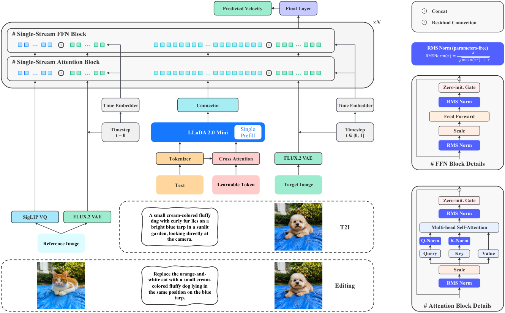
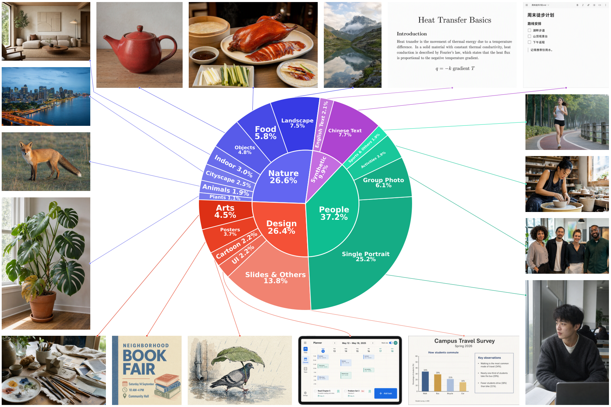
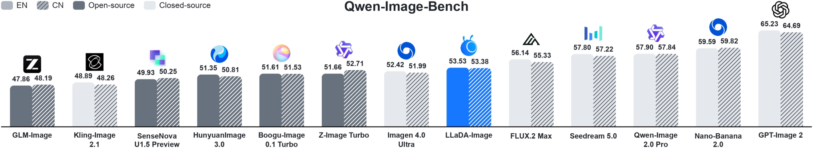

# LLaDA-Image: Building Strong Image Generators with Fully Open Training Recipes

---

## 1️⃣ 메타 정보

| 항목 | 내용 |
|---|---|
| **논문 제목** | LLaDA-Image: Building Strong Image Generators with Fully Open Training Recipes |
| **저자** | Chuyan Chen, Haoxing Chen, Kun Chen, Zhenglin Cheng, … Jun Xie (총 30명, 성 알파벳순) |
| **소속** | AGI Research Center, **Inclusion AI** (Ant Group 계열) |
| **공개일** | 2026-09-03 (arXiv v1), 저장소 공개 2026-09-04 |
| **분야** | Text-to-Image generation(텍스트→이미지 생성), Image editing(이미지 편집), Diffusion Transformer |
| **arXiv abstract** | https://arxiv.org/abs/2609.03796 |
| **arXiv PDF** | https://arxiv.org/pdf/2609.03796 |
| **arXiv HTML** | https://arxiv.org/html/2609.03796v1 |
| **코드** | https://github.com/inclusionAI/LLaDA-Image (**추론 코드만**, 2,895줄) |
| **체크포인트** | HF `inclusionAI/LLaDA-Image`, `-FP8`, `-Turbo`, `-Turbo-FP8` (4종) |
| **논문 라이선스** | CC BY-SA 4.0 (arXiv) |
| **코드/가중치 라이선스** | **없음** — 저장소에 LICENSE 파일 없음, HF 카드 4종 모두 `license: None` |
| **재사용한 외부 부품** | LLaDA 2.0 Mini (dLLM 백본, 동결) / SigLIP-VQ (동결) / **FLUX.2 VAE** (동결) / VeOmni (학습 프레임워크, Acknowledgements) |
| **선행 자사 논문 4편** | IOMM (CVPR 2026, 이미지-only 사전학습) / TwinFlow (ICLR 2026, 증류) / DuMo (듀얼 헤드) / TBSM (RL 미세조정) |

---

## 2️⃣ 주요 용어 사전 (Glossary)

### 아키텍처 관련

| 용어 | 쉬운 설명 |
|---|---|
| **DiT (Diffusion Transformer)** | 노이즈를 걷어내며 그림을 그리는 본체. 여기서는 dim 3840, 30층, 헤드 30개. 실측 **6.54B** |
| **dLLM (diffusion Large Language Model)** | 왼→오른쪽 순서대로가 아니라, 가려진 토큰들을 **한꺼번에 복원**하며 문장을 만드는 언어모델. 일반 LLM(autoregressive, 자기회귀)과 대비됨. LLaDA 2.0 Mini가 여기 해당 |
| **VLM (Vision-Language Model)** | 이미지와 텍스트를 함께 이해하는 모델. 여기서는 **완전히 얼려서(frozen)** 텍스트 인코더로만 씀 |
| **MoE (Mixture-of-Experts)** | 전문가 여러 명 중 소수만 골라 쓰는 구조. LLaDA 2.0 Mini는 전문가 256명 중 **top-8 + 공유 1명**만 활성 → 저장은 16.3B, 계산은 ~1.4B |
| **single-stream(단일 스트림)** | 텍스트 토큰과 이미지 토큰을 **한 줄로 이어 붙여** 같은 Transformer 블록에 통과시키는 방식. 반대는 dual-stream(각자 다른 블록) |
| **RQA (Residual Query Adapter, 잔차 질의 어댑터)** | 학습 가능한 질의 토큰(learnable query token) 256개가 입력을 훑어보고(cross-attention), 그 결과를 원래 입력 **뒤에 덧붙이는** 작은 모듈. 얼린 VLM에서 "생성에 쓸모 있는 정보"를 끌어내는 장치 |
| **connector(커넥터)** | VLM이 뱉은 특징 벡터를 DiT가 알아들을 수 있는 형태로 번역하는 6층 Transformer |
| **refiner(정련 블록)** | 합치기 전에 각 모달리티(이미지/텍스트/참조이미지)를 **따로** 2층씩 다듬는 블록. Lumina 계열 Next-DiT의 특징. **논문 본문에는 언급이 없고 코드에만 존재** |
| **sandwich norm(샌드위치 정규화)** | 어텐션/FFN의 **입력과 출력 양쪽 모두**에 정규화를 넣는 방식. 깊은 모델의 발산을 막음 |
| **parameter-free RMSNorm** | 정규화는 하되 학습 가능한 scale/bias(affine 파라미터)를 **두지 않는** RMSNorm. 코드에서 `elementwise_affine=False` |
| **adaLN (adaptive Layer Norm)** | 시간(timestep) 정보를 scale/gate로 바꿔 블록마다 주입하는 표준 기법. 여기서는 입력 차원을 **256으로 낮춰서**(`ADALN_EMBED_DIM=256`) 파라미터를 절약 |
| **SigLIP-VQ** | 이미지를 의미 벡터로 바꾸고 동시에 코드북(16,384개) 인덱스로 양자화하는 인코더. 40층, hidden 1536, 실측 1.30B |

### 학습·생성 관련

| 용어 | 쉬운 설명 |
|---|---|
| **flow matching** | "노이즈 → 진짜 이미지"로 가는 **직선 경로의 방향(velocity, 속도)** 을 학습하는 방식. 여기 규약은 x_t = (1−t)·x + t·z (t가 클수록 노이즈가 많음) |
| **image-only pre-training(이미지-only 사전학습)** | 캡션 없이 **이미지만으로** 학습. 얼린 VLM이 그 이미지 자신에서 조건을 뽑아내므로 텍스트가 필요 없음 |
| **masked self-conditioning(마스킹 자기조건화)** | 그냥 자기 이미지를 조건으로 주면 "그대로 베끼기(identity mapping)"만 배우므로, 조건 이미지 토큰 일부를 **가려서** 성긴 것→조밀한 것 예측 과제로 바꾸는 것 |
| **mid-training(중간학습)** | 사전학습과 SFT 사이에 끼우는 완충 단계. 여기서는 **해상도만 올리고 감독 방식은 그대로** 유지 |
| **SFT (Supervised Fine-tuning, 지도 미세조정)** | 이미지-텍스트 쌍으로 실제 사용 조건(텍스트 프롬프트)에 맞추는 단계 |
| **aspect-ratio bucket(종횡비 버킷)** | 화소 예산은 비슷하게 두고 가로세로 비율만 다른 해상도 묶음 41개. 정사각형 강제 크롭을 피함 |
| **logit-normal timestep sampling** | 시간 t를 균등하게 뽑지 않고 sigmoid로 변환해 **고노이즈 구간에 학습을 몰아주는** 샘플링. P_mean=0.8, P_std=0.8 |
| **checkpoint merging(체크포인트 병합)** | 수렴 근처 여러 스텝의 가중치를 평균내 벤치마크 점수 진동을 없애는 기법 |
| **DMD / DMD2 (Distribution Matching Distillation)** | 여러 스텝 모델을 몇 스텝짜리로 압축하는 증류. 진짜 점수(real score)와 가짜 점수(fake score)의 **차이**를 gradient로 씀 → [[PAPER_DMD2.md]] |
| **TwinFlow** | 가짜 점수 네트워크를 따로 두지 않고, **시간의 부호(+t / −t)** 로 역할을 나눠 한 백본이 두 역할을 겸하게 하는 증류법 (Cheng et al., ICLR 2026) |
| **backward simulation(역방향 시뮬레이션)** | 학습 입력을 학생 모델의 실제 추론 궤적과 맞추기 위해 4스텝을 미리 굴려보는 기법 |
| **CFG (Classifier-Free Guidance)** | 조건부 예측과 무조건부 예측의 차이를 증폭해 프롬프트 반영을 강하게 만드는 표준 추론 기법 |

### 평가 지표

| 지표 | 쉬운 설명 |
|---|---|
| **Qwen-Image-Bench** | 창작자 관점 벤치마크. 프롬프트 1,000개를 Quality(품질)/Aesthetics(미학)/Alignment(프롬프트 일치)/**Real-world Fidelity(실세계 충실도)**/Creative Generation(창의 생성) 5축으로 채점. EN·ZH 두 트랙 |
| **GenEval** | 객체 중심 진단. 단일 객체/두 객체/개수 세기(counting)/색/위치/속성 결합 6개 항목 |
| **DPG-Bench** | 길고 조밀한 프롬프트를 얼마나 따르는지 |
| **LongText-Bench / CVTG-2K** | 긴 문자열 렌더링 / 여러 영역에 나뉜 텍스트 렌더링 정확도 |
| **GEdit-Bench** | 편집 벤치마크 606케이스. G_SC(의미 일관성·지시 이행), G_PQ(지각 품질), G_O(종합) |

---

## 3️⃣ 논문 요약 (TL;DR)

**한 줄**: **"이미지만으로 사전학습한 6B DiT + 얼린 확산 언어모델(dLLM) 텍스트 인코더"** — 새로운 구조 논문이 아니라 **레시피 공개(recipe) 논문**이다.

- **핵심 문제**: 기존 학습 패러다임은 가장 계산이 많이 드는 초기 단계부터 image–text pair(이미지-텍스트 쌍)를 요구한다. 그런데 캡션은 비싸고 손실이 크다 — 낮은 학습 해상도에서 이미지를 통째로 줄이면 캡션이 언급한 디테일이 사라져 **이미지와 캡션이 어긋난다**. 반대로 합성 이미지-텍스트 쌍은 초반 수렴은 빠르지만 아티팩트가 전파되어 장기 사실감의 천장이 낮다.
- **해결책**: visual prior(시각 사전지식) 학습과 language alignment(언어 정렬)를 **시간축으로 분리**한다. 먼저 캡션 없이 이미지만으로 256²→512² 사전학습·중간학습을 하고, 그다음에야 쌍 데이터로 512²→1024² 정렬을 한다. 조건은 얼린 VLM이 **그 이미지 자신에서** 뽑으므로 캡션 정렬 제약이 사라지고, 고해상도 원본을 통째로 줄이는 대신 **크롭해서 살짝만 줄이면** 된다.
- **검증**: Qwen-Image-Bench에서 EN 53.53 / ZH 53.38로 **오픈소스 1위**. 단, 아래 §8·§10에서 보듯 "같은 스텝 수끼리" 비교하면 이야기가 달라진다.
- **논문의 태도**: Scope 절에서 스스로 "모든 부품이 보편적으로 최적이라 주장하지 않으며, 모든 아키텍처·데이터 혼합을 망라 비교하지도 않는다"고 선을 긋는다.

> 최근 정리한 [[PAPER_i1.md]]와 같은 장르. i1이 "공개 데이터만"에 집중했다면 LLaDA-Image는 **"캡션 없이 이미지만으로"** 에 집중한다.

---

## 4️⃣ 핵심 기여 (Contributions)

1. **이미지-only 사전학습·중간학습을 T2I 파운데이션 규모에서 실증** — 220M 생성 학습 샘플 중 **90% 이상이 이미지-only**, **98%가 진짜 사진(real image)**. 사전학습/중간학습은 진짜 사진만, SFT 쌍 데이터도 진짜 비율 70% 이상.
2. **dLLM 기반 이해 + 생성 + 편집을 한 체크포인트에** — RQA + 커넥터로 얼린 dLLM VLM을 단일 스트림 DiT에 연결. 편집 시 참조 이미지는 **VLM을 우회**하고 DiT로 직접 들어간다.
3. **안정적인 real-data 우위 점진 학습 파이프라인** — 파라미터 없는 RMSNorm + Muon 옵티마이저로 장기 학습 안정화. 해상도 변화와 감독 방식 변화를 **동시에 겪지 않게** 중간학습을 끼움.
4. **TwinFlow 증류로 2~4스텝 추론** — 가짜 점수 네트워크를 따로 두지 않고 시간 부호로 역할 분리 + 듀얼 헤드.
5. **가중치·코드·레시피 공개** — 단, §9에서 보듯 **학습 코드는 아직 미공개**다(초록의 주장과 저장소 상태가 어긋남).

---

## 5️⃣ 모델 구조

*모델이 어떤 부품으로 이루어져 있고, 논문 그림·본문·실제 코드가 어디서 갈라지는지를 먼저 확정해야 이후 학습 레시피와 성능 해석이 제자리를 찾는다.*



### 5.1 실제 규모 — "6B"의 함정

*논문·README가 일관되게 "6B"라고 부르지만 실제로 내려받아 GPU에 올려야 하는 양은 전혀 다르므로, 배포를 검토한다면 이 표를 먼저 봐야 한다.*

HF 저장소의 실제 파일 크기(safetensors) 실측:

| 부품 | 역할 | 실측 크기(BF16) | 파라미터 | 학습 여부 |
|---|---|---:|---:|---|
| **text_encoder** (LLaDA 2.0 Mini MoE) | 눈+입 | 32.65 GB | **16.32B** | 동결 |
| **transformer** (DiT) | 그림 그리는 몸통 | 13.08 GB | **6.54B** | **학습** |
| **sigvq** (SigLIP-VQ) | 참조 이미지 의미 인코더 | 2.59 GB | 1.30B | 동결 |
| **text_projection** (커넥터) | 다리 | 0.65 GB | 0.33B | **학습** |
| **queryformer** (RQA) | 질의 어댑터 | 0.10 GB | 0.05B | **학습** |
| **vae** (FLUX.2 VAE) | 압축기 | 0.17 GB | 0.08B | 동결 |
| **합계** | | **49.24 GB** | **≈24.6B** | 학습분 **6.92B** |

- 논문의 "6B"는 **DiT만**이다. 실측 6.54B (`transformer/…index.json`의 `total_size` = 13,080,460,032 바이트 ÷ 2). 반올림이 아니라 절삭에 가깝다.
- **텍스트 인코더가 본체보다 2.5배 크다.** MoE라 활성 파라미터는 ~1.4B지만 **VRAM에는 16.3B 전부 올라간다**.
- FP8 버전도 27.58 GB (text_encoder 17.35 + transformer 6.71 + 나머지는 BF16 유지). 즉 **80GB 카드 1장은 필요하고, 24GB 소비자 카드는 오프로드 없이 불가**.
- 이 "6B라 부르지만 실제 상주는 수 배" 패턴은 [[PAPER_SenseNova-U1.md]] 때 짚었던 규모 함정과 동일하다.
- 학습되는 건 DiT + 커넥터 + RQA = 6.92B, 나머지 17.7B는 전부 동결 → [[reference_pretrained_backbone_reuse_landscape]]의 **B분기(동결 백본 + 새 DiT)**. Qwen-Image가 Qwen2.5-VL을 얼려 쓴 것과 같은 자리인데, **얼린 백본이 자기회귀 LLM이 아니라 확산 LLM(dLLM)** 이라는 점만 다르다.

**LLaDA 2.0 Mini 실제 설정** (`text_encoder/config.json`):

```
num_hidden_layers 20 | hidden_size 2048 | num_attention_heads 16 (GQA, kv 4)
num_experts 256 | num_experts_per_tok 8 | num_shared_experts 1 | moe_intermediate_size 512
first_k_dense_replace 1 (첫 층만 dense, intermediate 5120)
vocab_size 173,568 | max_position_embeddings 16,384 | rope_theta 600,000
mrope_section [16,24,24] (3D RoPE) | score_function sigmoid | routed_scaling_factor 2.5
```

### 5.2 세 부품

*논문 §2가 말하는 "이해 → 다리 → 생성" 3단 구성이 코드에서 어떻게 구현되는지 확인한다.*

**(A) dLLM 기반 VLM (동결)** — LLaDA 2.0 Mini + SigLIP-VQ 비전 인코더. 텍스트 프롬프트/편집 지시문을 해석한다. 논문은 "정적 임베딩만 뱉는 기존 텍스트 인코더와 달리 멀티모달 문맥을 함께 추론할 수 있는 통합 인터페이스"라고 주장한다. **편집 시 참조 이미지는 이 단계에서 의도적으로 배제된다.**

**(B) 이해→생성 커넥터** — 두 조각.

- **RQA (Residual Query Adapter)**: 학습 가능한 질의 토큰 **256개**(`num_queries: 256`)가 입력 시퀀스에 cross-attention(식 2) → 결과를 원본 시퀀스를 **대체하지 않고 뒤에 이어붙여** 얼린 VLM에 **한 번의 prefill**(식 3)로 통과시킨다. 1층, hidden 2048.
  - **코드 확인**: `pipeline_llada_image.py:195-204`에서 RQA는 VLM hidden state가 아니라 **임베딩 레이어 출력**(`get_input_embeddings()(input_ids)`)에 붙는다. 논문의 "prefill 이전에"와 일치.
  - attention mask에서 `[:text_length, text_length:]`를 막아 **텍스트는 질의를 못 보고 질의만 텍스트를 본다**.
- **커넥터**: 6층 Transformer, hidden 2048 → projection_dim 2560. 326M. VLM 표현공간을 DiT 조건공간으로 번역(식 4).

**(C) 단일 스트림 DiT** (`transformer/config.json`):

```
dim 3840 | n_layers 30 | n_heads 30 (head_dim 128) | n_refiner_layers 2
in_channels 128 | cap_feat_dim 2560 | semantic_feat_dim 4096
axes_dims [32,48,48] (합 128 = head_dim) | axes_lens [32768,1024,1024]
rope_theta 256.0 | qk_norm true | norm_eps 1e-5
```

노이즈 낀 이미지 latent x_t, 시간 t, 조건 h_cond를 받아 velocity(속도장)를 예측한다(식 5).

### 5.3 DiT 내부 — 코드로 확인한 실제 블록 구조

*논문 본문이 "순수 단일 스트림"이라 못 박은 부분이 코드와 어긋나므로, 실제 계산 순서를 그대로 옮긴다.*

```
[T2I]
  이미지 토큰 ──► noise_refiner   ×2 (시간 변조 O) ─┐
  텍스트 토큰 ──► context_refiner ×2 (변조 X)      ─┴─► merge ─► layers ×30 ─► final layer

[Editing]
  (source clean + target noisy) ──► noise_refiner   ×2 ─┐
  지시문 토큰 ×2벌               ──► context_refiner ×2 ─┼─► merge ─► layers ×30 ─► final layer
  SigLIP-VQ 참조 토큰            ──► sigvq_refiner   ×2 ─┘
```

**블록 내부** (`LLaDAImageTransformerBlock`, Lumina Next-DiT의 sandwich norm 구조):

```
h ← h + tanh(gate_msa) · RMSNorm₂( Attn( RMSNorm₁(h) · (1+scale_msa) ) )
h ← h + tanh(gate_mlp) · RMSNorm₂( FFN(  RMSNorm₁(h) · (1+scale_mlp) ) )

# 모든 RMSNorm은 elementwise_affine=False (파라미터 없음)
# scale/gate는 Linear(256 → 4·3840) 하나에서 chunk(4)로 갈라짐
# FFN 폭 = int(dim/3*8) = 10240, SwiGLU (w1,w2,w3)
```

**파라미터 분해 (직접 계산 → 실측과 일치)**

| 항목 | 계산 | 파라미터 |
|---|---|---:|
| 블록 1개 · 어텐션 | 4 × 3840² | 59.0M |
| 블록 1개 · FFN | 3 × 3840 × 10240 | 118.0M |
| 블록 1개 · adaLN | 256 × 4 × 3840 | 3.9M |
| **블록 1개 소계** | | **180.9M** |
| main layers ×30 | | 5.427B |
| **refiner ×6** (noise 2 + context 2 + sigvq 2) | | **1.070B** |
| 임베더류 (x/cap/semantic/sigvq/t/final) | | 0.043B |
| **합계** | | **≈6.54B** ✅ 실측 일치 |

> ⚠️ **급소**: refiner 6개 블록이 **1.07B — DiT 전체의 16%** 를 차지한다. 논문 §2.3은 *"조건 스트림과 이미지 스트림을 따로 두는 구조와 대조적으로, 우리 DiT의 모든 블록이 직접 상호작용한다"* 고 명시하지만, 앞 2층은 명백히 분리 스트림이다. 그리고 논문은 refiner의 존재를 **본문에서도 Fig. 3에서도 단 한 번도 언급하지 않는다.** → §9, §10-Q3 참조

> ⚠️ **계보 미표기**: `noise_refiner` / `context_refiner` / `cap_embedder` / sandwich RMSNorm / zero-init(tanh) 게이트 / 저차원 adaLN(`ADALN_EMBED_DIM=256`) / FFN 폭 `dim/3*8` / 3D RoPE — 이 조합은 [[PAPER_Lumina-Next.md]]와 [[PAPER_Lumina-Image-2.0.md]]의 **Next-DiT 그 자체**다. 변수명까지 거의 같다. 그런데 논문은 구조 인용으로 **DiT 원논문(Peebles & Xie 2023) 하나만** 단다. Lumina-Image 2.0은 벤치마크 표의 비교 대상 한 줄로만 등장하고, Lumina-Next는 참고문헌에 아예 없다.
> → 따라서 **Recipe #1의 정직한 서술은 "Next-DiT에서 affine 파라미터를 뺐다"** 이다.

### 5.4 편집 경로 — 의미 + 픽셀 이중 조건

*지시문만으로는 "바꾸지 말아야 할 부분"을 지킬 수 없어서, 참조 이미지를 두 갈래로 나눠 넣는다.*

논문의 설계는 두 경로가 상보적이라는 것:

- **의미 경로(식 6·7)**: 참조 이미지 → SigLIP-VQ → 전용 embedder + Transformer 2층(= `sigvq_refiner`) → 조건 토큰. VLM을 거치지 않는다.
- **픽셀 경로(식 8)**: 참조 이미지 → FLUX.2 VAE → 깨끗한 latent → 노이즈 낀 타겟 latent와 concat.

**코드 실측으로 확인한 실제 동작** (`_prepare_editing_sequences`):

| 논문 서술 | 실제 코드 |
|---|---|
| 식 (8) "깨끗한 latent를 노이즈 타겟 latent와 concat해 DiT 입력 임베더에 넣는다" | **채널 concat 아님**. `in_channels = out_channels = 128` 고정 → 채널이 늘지 않는다. source와 target을 **별개 토큰 그룹**으로 만들어 **시퀀스 방향으로** 이어붙인다. (Fig. 3의 ⊙ Concat 표기는 코드와 일치 — 어긋나는 건 식 8의 문장) |
| — (본문에 없음) | 각 토큰에 `noise_mask` 0/1을 붙이고, 블록마다 `_select_per_token`이 **토큰별로 다른 시간 임베딩**을 적용. 깨끗한 참조 토큰은 t=0 변조, 노이즈 타겟 토큰은 t 변조. (Fig. 3에는 Time Embedder가 2개로 그려져 있으나 본문·수식에는 서술 없음) |
| — (본문에 없음) | **지시문 토큰이 두 벌 복제**되어 들어간다 (하나는 clean 역할, 하나는 noisy 역할) |
| 식 (7) "참조 토큰을 텍스트 조건과 통합" | 실제 시퀀스 순서는 `[caption ×2, source+target 이미지, sigvq]` — **참조 토큰이 맨 뒤** |
| — (본문에 없음) | RoPE는 source/target이 **축 0(프레임 축)만 다르고 h·w 좌표는 둘 다 0부터** 시작 → [[PAPER_Any2AnyTryon.md]]의 condspa와 같은 "공간 좌표 공유" 트릭 |

**편집 시퀀스 길이 계산 (1024² 기준)**

```
FLUX.2 VAE: 8× 다운샘플 → pipeline의 _patchify_latents 2×2 → 총 16×
  latent 격자 = 1024/16 = 64 → 64×64 = 4,096 토큰

  타겟 이미지          4,096
  소스(참조) 이미지    4,096
  SigLIP-VQ 참조      (1024/2)/16 = 32 → 32×32 = 1,024
  지시문 ×2벌          2 × (프롬프트 길이 + 256 질의 토큰)
  ─────────────────────────────────
  합계                 ≈ 9,200+ 토큰
```

→ **9.2K 토큰 full attention × 30층 × 50스텝 × CFG 2회.** 논문에 지연 시간·처리량 수치가 하나도 없는 것이 우연 같지 않다.

### 5.5 코드에만 있는 것들 (논문 미기재)

*재현하려는 사람에게 결정적인 숫자들이 논문이 아니라 코드에만 있어서 따로 모은다.*

| 항목 | 내용 | 위치 |
|---|---|---|
| **커스텀 sigma 스케줄** | `schedule = (1 − (1 − s^1.17)^0.8)^1.1`, `sigmas = 1 − schedule` (s는 0.001~1.0 균등 분할). 논문에는 "50스텝"만 있고 이 **지수 3개는 어디에도 없다** | `pipeline_llada_image.py:557-560` |
| **편집 CFG의 비대칭** | 무조건부 분기에서 SigLIP-VQ 의미 특징은 **빈 텐서로 지우는데**, 참조 VAE latent는 **그대로 복제해 유지**한다. 즉 CFG가 "의미 참조 + 텍스트"만 증폭하고 픽셀 증거는 증폭하지 않는다. 의도적이면 좋은 설계인데 설명이 없다 | `pipeline_llada_image.py:588-595` |
| **negative prompt 기본값** | `negative_prompt=None`이면 빈 문자열이 아니라 `"…Generate an image.\n…<IMAGE1>"`라는 **내용 없는 일반 프롬프트**가 무조건부로 쓰인다 | `pipeline_llada_image.py:179-182` |
| **`glm_` 접두사 잔재** | 변수명·docstring에 `glm_features`, `glm_cap_feats`, "GLM/SigVQ features", "GLM SigVQ component"가 남아 있다. GLM 계열 코드베이스에서 옮겨온 흔적 | 파일 전역 |
| **비디오용 죽은 코드** | `all_f_patch_size`, `f_patch_size`, 프레임 축 — 전부 1 고정 | `transformer_llada_image.py` |
| **하드코딩 중복** | `generate_vq_tokens`의 `image_token_offset = 157184`가 config에도 같은 값으로 있는데 코드에 다시 박혀 있음 | `pipeline_llada_image.py:281` |
| **최종 레이어 정규화** | `LLaDAImageFinalLayer`는 RMSNorm이 아니라 파라미터 없는 **LayerNorm**. "모든 정규화를 RMSNorm으로"라는 Recipe #1 문장과 엄밀히는 어긋남 | `transformer_llada_image.py:263` |

---

## 6️⃣ 학습 레시피 — 이 논문의 실제 가치

*여기가 논문이 실제로 기여하는 부분이다. 각 단계가 왜 그 순서여야 하는지가 명확하게 쓰여 있다.*

### 전체 경로

```
[이해] CoT SFT (512², 백본 갱신 — 유일)
          ↓ (이후 백본 완전 동결)
[생성] 이미지-only PT (256²)
          ↓ 해상도만 바꿈
       이미지-only MT (512², 종횡비 버킷)
          ↓ 감독 방식만 바꿈
       SFT 512² 정렬 (T2I 쌍)
          ↓ 해상도만 바꿈
       SFT 1024² 확장
          ↓
       정련 (텍스트·인물 집중)
          ↓
       편집 합동학습 (T2I:I2I = 1:1)
          ↓ checkpoint merging
       LLaDA-Image (50스텝)
          ↓ TwinFlow 증류 + TBSM RL
       LLaDA-Image Turbo (2~4스텝)
```

### 6.1 CoT SFT — 이해 백본 준비

*"이해 능력이 좋으면 생성도 좋아진다"는 선행 연구를 따라, 생성 학습을 시작하기 전에 백본을 먼저 다듬는다. 백본을 건드리는 **유일한** 단계다.*

| 설정 | 값 |
|---|---|
| 학습 샘플 | ~2.6M packed sequence (각 16,384 토큰) |
| 에폭 | 4 |
| 해상도 | 512² |
| Global batch | 512 |
| 감독 | masked answer token (block diffusion, b=32) |
| 데이터 비율 | Gen : Und : Text = **9 : 9 : 2** |
| 옵티마이저 | AdamW (β₁=0.9, β₂=0.95), LR 1e-5 → 1e-6, cosine decay, warmup 1% linear, WD 0.1, clip 1.0 |

**목적함수의 요령**: 마스킹 비율은 ρ = cos(rπ/2), r ~ U(0,1). 시스템 프롬프트·질문·모든 visual token은 **마스킹도 감독도 하지 않고**, `<think>` 추론 흔적과 답변에만 cross-entropy를 건다. 마스크 하나가 응답의 일부만 덮으므로 **한 배치를 마스크와 그 여집합으로 두 번 소비**해 2번의 optimizer step으로 처리한다 → 모든 응답 토큰이 감독받되 매 forward는 부분적으로 깨끗한 문맥을 본다. loss는 블록 단위로 정규화. FSDP2 full sharding + gradient checkpointing.

### 6.2 이미지-only 사전학습 (256²) — 이 논문의 심장

*가장 계산이 많이 드는 단계에서 캡션을 아예 빼버리는 것이 이 논문의 핵심 도박이다.*

> **Recipe #3**: 대규모 image–text pair는 LLaDA-Image 사전학습에 **필요 없다.** 이미지만으로 강한 visual generative prior를 배우기에 충분한 감독이 나온다.

**(a) resolution-aware image sampling(해상도 인지 이미지 샘플링)** — 부수 이득이 영리하다.

- 캡션으로 학습하면 캡션이 이미지 **전체**를 묘사하므로 이미지 전체를 256²로 줄여야 한다 → 고해상도 원본은 심하게 뭉개져 디테일이 날아가고, 결국 **이미지와 캡션이 어긋난다**.
- 이미지-only는 조건이 **샘플된 이미지 자신**에서 나오므로 이 제약이 없다. 원본에서 **256² 정도 또는 약간 더 큰 영역을 크롭**해서 살짝만 줄이면 된다.
- 결과: 같은 화소 예산으로 **국소 디테일을 훨씬 많이** 보게 된다.

**(b) masked self-conditioning(마스킹 자기조건화)** — 식 (9):

```
c_img = v(y)                          # 얼린 SigLIP-VQ가 뽑은 N개 패치 특징
m ~ Bernoulli(1 − ρ_img)^N            # 유지 확률 1−ρ_img 인 이진 마스크
c̃_img = c_img ⊙ m
c = concat(c_aux, c̃_img)              # c_aux = "Generate an image identical to the reference image."
```

*왜 마스킹하나*: 모든 이미지 특징을 그대로 조건으로 주면 정답을 거의 다 알려주는 셈이라 모델이 **그대로 베끼기(identity mapping)** 만 배운다. 일부를 가려서 **성긴 것 → 조밀한 것 예측** 과제로 바꿔야 문맥·구성 구조를 배운다.

**(c) flow matching 목적함수** — 식 (10):

```
x_t = (1 − t)·x + t·z          z ~ N(0, I),  t ~ U(0,1)
L_FM = E[ ‖ F_θ(x_t, t, h_cond) − (z − x) ‖² ]
```

(즉 진짜 이미지와 노이즈를 t 비율로 섞은 값을 넣고, 노이즈에서 이미지를 뺀 방향을 맞히게 한다.)

**갱신 대상**: 생성기 F_θ, RQA q_ψ, 커넥터 c_φ **만**. SigLIP-VQ(v)와 VLM(g)은 전 구간 동결.

> 💡 중요한 설계 미덕: 이 단계는 **입력 시퀀스 c를 어떻게 구성하는가만 바꾼다.** RQA → 얼린 VLM → 커넥터 경로는 downstream 조건부 생성과 **완전히 동일**하다. 그래서 나중에 텍스트 조건으로 갈아탈 때 경로가 흔들리지 않는다.

### 6.3 이미지-only 중간학습 (512²) — 완충 단계

*"해상도가 바뀌는 충격"과 "감독 방식이 바뀌는 충격"을 동시에 맞지 않게 하려고 끼운 단계.*

사전학습과 똑같은 공식(자기조건화 + 마스킹 + flow matching)을 유지한 채 **화소 예산만 256² → 512²** 로 올린다. 조건이 여전히 이미지 자신에서 나오므로 캡션 불일치가 생길 여지가 없다.

> 논문의 논거: 256² 이미지-only에서 곧바로 고해상도 image–text pair로 넘어가면 **공간 분포와 감독의 출처가 동시에 바뀐다.** 중간학습은 이 둘을 분리해서, 익숙한 이미지 유래 조건 아래 512² 예산에 먼저 적응시킨 뒤 SFT에서 텍스트 감독으로 넘어가게 한다.

**aspect-ratio-bucketed variable-resolution training(종횡비 버킷 가변 해상도 학습)** — 여기서 도입해 이후 모든 SFT 단계에 유지.

- 화소 예산은 거의 같고 종횡비만 다른 버킷 **41개**(0.25 ~ 4.00)를 미리 정의. 부록 A에 512²·1024² 두 세트 전부 공개.
- 이미지가 들어오면 종횡비가 가장 가까운 버킷에 배정 → 비율 유지한 채 축소 → 버킷을 덮어야 하므로 한 변이 조금 남는데 그 **넘침만 잘라낸다**(보통 경계 몇 픽셀).
- 실익 3가지: ① rank마다 모양이 달라도 화소 예산이 거의 일정 → 메모리 피크·straggler 없음 ② 정사각 강제 리사이즈의 기하 왜곡과 center crop의 내용 손실을 동시에 회피 ③ 다양한 종횡비 생성 능력이 그냥 따라온다.

### 6.4 SFT — 언어 정렬과 편집

*이제서야 텍스트 조건을 붙인다. 추론 시 실제 사용 조건에 맞추되, 이미지-only에서 얻은 visual prior를 깨뜨리지 않는 것이 목표.*

**logit-normal timestep sampling** — 식 (11):

```
ε ~ N(0,1)
t = sigmoid(P_mean + P_std · ε)      P_mean = 0.8, P_std = 0.8
```

*왜*: 규약상 t가 클수록 노이즈가 많다. 고노이즈 구간은 이미지 구조가 아직 안 잡혀 예측이 불안정하고, 여기서 낸 오차가 이후 궤적 전체로 전파된다. 반면 저노이즈 구간은 이미 대부분 정해져 있어 남은 보정이 작다. 그래서 **고노이즈 쪽에 학습 예산을 몰아준다.**

**단계별 진행**

| 단계 | 내용 |
|---|---|
| **512² 정렬** | 중간학습에서 이미 이 화소 예산에 적응했으므로 **해상도 분포는 그대로 두고 감독만** 이미지 유래 → 텍스트 쌍으로 바꾼다. 목적은 이미지 합성을 다시 배우는 게 아니라, 텍스트 개념·속성·공간 관계를 이미 잘 형성된 visual prior에 **연결**하는 것 |
| **1024² 확장** | 정렬을 마친 뒤 화소 예산만 올림. 고해상도 생성과 텍스트 정렬을 동시에 도입하지 않는다 |
| **정련(refinement)** | 텍스트 밀집 예제와 인물 중심 예제 비중을 올려 두 가지 어려운 능력(정확한 텍스트 렌더링, 고품질 인물)을 강화. 동시에 합성 데이터를 의도적으로 제한해 **진짜 사진 비율 70% 이상 유지** |
| **편집 합동학습** | T2I : I2I = **1:1** |

> **Recipe #4**: 합성 데이터 위주보다 **진짜 사진 비중이 큰 쪽이 표준 벤치마크에서 초반 수렴은 느리지만, 충분히 학습하면 최종 사실감이 훨씬 좋아진다.**

**편집 합동학습에서 T2I를 1:1로 섞는 이유** — 편집 데이터는 대규모 T2I 코퍼스보다 분포가 좁다. 편집만 계속 학습하면 편집 목적함수에 과적합되어 개방형 생성 품질이 떨어지고 앞 단계의 visual prior 일부를 잊는다. T2I를 매 단계 섞는 것이 **capability replay(능력 복습)** 역할을 해서, 넓은 의미 커버리지·시각 품질·텍스트 정렬 쪽으로 계속 규제한다. 둘이 같은 백본을 쓰므로 개선이 두 과제 사이에서 **전이**된다.

**checkpoint merging(체크포인트 병합)** — 데이터 로더가 전역 비율은 통제해도 개별 스텝이 보는 조합은 흔들린다. 성능 고원에 도달하면 인접 체크포인트 점수가 계속 진동하는데, 하나만 고르면 스텝별 편향이 그대로 남는다. 그래서 수렴한 체크포인트 여러 개의 가중치를 평균낸다(weight averaging, Izmailov et al. 2018).

### 6.5 학습 설정 전체 (논문 Table 2)

| 설정 | PT | MT | SFT 512² 정렬 | SFT 512²→1024² | 정련 | 편집 | 증류 |
|---|---|---|---|---|---|---|---|
| **샘플 수** | ← 220M 누적 (단계별 배분 미공개) → | | | | | | |
| **해상도** | 256² | 512² 버킷 | 512² 버킷 | 1024² 버킷 | 1024² 버킷 | 1024² 버킷 | — |
| **Global batch** | 24,576 | 6,400 | 4,608 | 2,048 | 2,880 | 2,688 | 256 |
| **감독** | image-only | image-only | 쌍 | 쌍 | 쌍 | 쌍 | — |
| **데이터 비율** | image-only | image-only | T2I only | T2I only | T2I:I2I=1:1 | T2I:I2I=1:1 | — |
| **옵티마이저** | ← **Muon** (전 생성 단계) → | | | | | | |
| **LR** | 4e-4 | 2e-4 | 5e-5 | 5e-5 | 3e-5 | 3e-5 | 5e-6 |
| **Weight decay** | ← 0.0 → | | | | | | |
| **Grad clip** | ← 1.0 → | | | | | | |
| **EMA** | – | – | – | – | 0.9995 | 0.9995 | 0.995 |
| **샘플링 스텝** | – | – | ← 50 → | | | | 2–4 |

> **Recipe #1**: DiT의 **모든 정규화 층을 파라미터 없는 RMSNorm**으로 교체. 장기 학습에서 최적화 안정성이 크게 개선된다. + **Muon** 옵티마이저.

### 6.6 데이터

*"진짜 사진 위주"가 이 논문의 두 번째 도박이라, 어떻게 걸러냈는지가 곧 주장의 근거다.*

> **Recipe #2**: 진짜 이미지-only 데이터는 최종 생성 품질을 올리고, 캡션 없이 대규모 visual-prior 학습을 가능하게 한다.



**구성**: 220M 생성 학습 샘플 중 **98% 진짜 사진**, **90% 이상 이미지-only**. PT/MT는 진짜 사진만, SFT 쌍 데이터도 **진짜 70% 이상**. SFT 데이터는 자연(nature)/디자인(design)/인물(people)/합성(synthetic) 4개 그룹. 합성 이미지는 주로 텍스트 렌더링용.

**필터링 3단**

| 단계 | 기준 |
|---|---|
| 메타데이터 | 총 화소 수 > 1024², 파일크기/화소 비율 ≥ **0.15 바이트/픽셀** |
| 미학 | ArtiMuse 점수 < **60** 컷 |
| 품질 | DeQA-Score < **4.0** 컷 |

**캡션 생성·검수**: Qwen3.6-35B-A3B와 Qwen3-VL-235B-A22B-Instruct가 **이미지 내용만 보고** 캡션 생성(보이는 주체·속성·동작·공간관계·장면·스타일을 충실히 서술, 보이는 텍스트는 원래 언어·철자 그대로 전사). 이후 Qwen3.6-35B-A3B가 캡션과 원본을 대조해 **객체/속성/관계/텍스트 환각을 걸러내고**, 형식 오류·거절 응답·반복·개인정보·워터마크 신호도 폐기. 편집 데이터는 품질 필터링 후 **지시문 일관성 검사**(변화를 올바른 방향으로 기술하고 근거 없는 내용이 없는 쌍만 유지).

---

## 7️⃣ TwinFlow 증류 — 2~4스텝

*50스텝 모델을 실배포하기엔 비싸서 몇 스텝짜리로 압축하는데, 여기서 쓰는 방식이 DMD2 대비 영리하다.*

**핵심 아이디어**: DMD2는 학생 분포를 쫓아가는 **fake-score(가짜 점수) 네트워크를 별도로** 둬야 한다. TwinFlow는 그 대신 **시간의 부호로 역할을 나눠** 한 백본이 두 역할을 겸한다.

```
+t ∈ [0, 1]   → generator(생성기) 갱신
−t ∈ [−1, 0]  → fake-score(가짜 점수) 추정기 갱신
```

**목적함수** (F_base = 원본 다중 스텝 모델의 동결 사본, F_θ = 증류 대상):

```
(12) x̂ = z − F_θ(z, +1, h_cond)                      # 노이즈 → 깨끗한 샘플 1스텝 직결

(13) x̃_t = (1−t)·sg(x̂) + t·z′                        # 학생 샘플을 분리(detach)해 다시 노이즈 주입
(14) L_fake(θ) = E[ ‖ F_θ(x̃_t, −t, h_cond) − (z′ − sg(x̂)) ‖² ]   # 음의 시간 분기만 갱신

(15) x̂_t = (1−t)·x̂ + t·z′                            # gradient 유지한 채 재노이즈
     s_t = −[ x̂_t + (1−t)·v̂_t ] / t                  # velocity → score 변환
       · F_base 를 +t 에 적용 → s_real
       · F_θ    를 −t 에 적용 → s_fake
(16) L_DMD(θ) = E[ w(t) · ⟨ sg(s_fake − s_real), x̂_t ⟩ ]        # 양의 시간 생성기만 갱신
```

(sg = stop-gradient. 두 점수를 모두 detach하므로 식 16은 생성기만, 식 14는 가짜 점수 분기만 갱신 → 둘을 번갈아 돌리면 하나의 모델 안에서 DMD 최적화가 완성된다.)

**구현 선택 3가지**

| 항목 | 내용 |
|---|---|
| **듀얼 헤드 (DuMo 착안)** | 공유 DiT 백본에 출력 헤드 2개. fake-score 헤드(−t)와 DMD 헤드(+t). **추론 시 DMD 헤드만 남기고 fake-score 헤드는 버림** → 추론 오버헤드 0 |
| **4-step backward simulation** | 학습 입력을 학생의 실제 추론 궤적과 정렬 |
| **1:2 갱신 스케줄** | 생성기 : 가짜 점수 = 1:2. [[PAPER_DMD2.md]]의 **1:5보다 가짜 점수 갱신을 줄여** 학습 효율 개선 |
| **후처리** | 증류 후 TBSM(Three-body scattering) 기반 강화학습 미세조정 |

> ✅ **실측 검증**: Turbo 체크포인트의 transformer가 Base와 **바이트 단위로 동일한 13.080 GB** — fake-score 헤드가 실제로 제거되어 있다. **논문 주장과 코드가 맞아떨어지는 드문 지점**이라 기록해 둔다.

---

## 8️⃣ 실험 요약

*"오픈소스 SOTA"라는 주장이 어떤 조건에서 성립하는지를 표와 함께 확인한다.*



**평가 조건**: 베이스라인은 각 모델이 보고한 원 수치. LLaDA-Image Turbo는 전 벤치마크 **4스텝**으로 평가. **프롬프트 확장·thinking·test-time 프롬프트 재작성 결과는 전부 제외**하여 생성 모델 자체의 표준 추론 설정을 비교.

### 8.1 Qwen-Image-Bench (주력 주장) — EN 트랙

| Type | Model | Quality | Aesth. | Align. | **Real-world Fidelity** | Creative | **Overall** |
|---|---|---:|---:|---:|---:|---:|---:|
| 비공개 | GPT-Image 2 | 59.09 | 68.48 | 65.78 | 59.40 | 75.34 | **65.23** |
| 비공개 | GPT-Image 1.5 | 55.78 | 62.87 | 61.39 | 55.86 | 67.06 | 60.42 |
| 비공개 | Nano-Banana 2.0 | 54.86 | 62.63 | 61.11 | 54.66 | 64.49 | 59.59 |
| 비공개 | Qwen-Image 2.0 Pro | 55.16 | 60.36 | 57.86 | 53.06 | 63.59 | 57.90 |
| 비공개 | Seedream 5.0 | 54.01 | 59.96 | 58.63 | 53.86 | 63.64 | 57.80 |
| 비공개 | FLUX.2 Max | 53.99 | 58.77 | 57.31 | 50.69 | 57.79 | 56.14 |
| 비공개 | Imagen 4.0 Ultra | 51.16 | 55.64 | 53.75 | 46.00 | 51.32 | 52.42 |
| **오픈** | **LLaDA-Image (50스텝)** | **53.22** | **58.22** | **54.77** | 43.90 | **51.09** | **53.53** |
| 오픈 | Z-Image Turbo (4스텝) | 51.25 | 54.87 | 53.61 | 44.08 | 49.20 | 51.66 |
| 오픈 | Boogu-Image 0.1 Turbo | 51.30 | 53.91 | 53.37 | **46.52** | 48.90 | 51.61 |
| 오픈 | HunyuanImage 3.0 | 50.76 | 54.66 | 53.16 | 45.33 | 48.33 | 51.35 |
| 오픈 | Qwen-Image 2512 | 51.84 | 54.40 | 51.44 | **47.80** | 47.75 | 51.32 |
| 오픈 | Boogu-Image 0.1 Base | 50.38 | 53.90 | 52.62 | 46.54 | 47.52 | 51.00 |
| **오픈** | **LLaDA-Image Turbo (4스텝)** | 51.89 | 55.22 | 52.49 | 42.08 | 45.75 | **50.98** |
| 오픈 | Z-Image (50스텝) | 49.42 | 53.88 | 53.41 | 43.44 | 46.93 | 50.52 |
| 오픈 | SenseNova U1.5 Preview | 49.14 | 52.02 | 52.46 | 45.22 | 47.23 | 49.93 |
| 오픈 | Qwen-Image | 48.45 | 51.18 | 50.04 | 43.45 | 45.37 | 48.48 |
| 오픈 | GLM-Image | 49.86 | 49.98 | 47.49 | 44.25 | 44.67 | 47.86 |

### 8.2 Qwen-Image-Bench — ZH 트랙 (오픈소스만 발췌)

| Model | Quality | Aesth. | Align. | Real-world Fidelity | Creative | **Overall** |
|---|---:|---:|---:|---:|---:|---:|
| **LLaDA-Image** | **52.92** | **56.92** | **54.87** | 44.86 | 52.10 | **53.38** |
| Z-Image Turbo | 52.30 | 55.24 | 53.76 | 45.38 | **52.32** | 52.71 |
| Qwen-Image 2512 | 51.76 | 54.74 | 52.72 | **47.00** | 50.19 | 52.06 |
| Z-Image | 50.53 | 54.47 | 54.45 | 44.70 | 49.92 | 51.78 |
| Boogu-Image 0.1 Turbo | 51.24 | 53.50 | 53.54 | 46.11 | 48.91 | 51.53 |
| **LLaDA-Image Turbo** | 51.29 | 52.02 | 52.32 | 42.91 | 47.14 | **50.27** |

(참고: 비공개 1위는 GPT-Image 2의 64.69)

### 8.3 나머지 벤치마크

| 벤치마크 | LLaDA-Image | LLaDA-Image Turbo | 오픈소스 1위 | 순위/비고 |
|---|---:|---:|---|---|
| **LongText-Bench EN/ZH** | 0.923 / 0.913 | 0.899 / 0.919 | Qwen-Image 2512 0.956 / Boogu Turbo 0.977 | 7위권 |
| **CVTG-2K** 단어정확도(평균) | **0.875** | 0.840 | SenseNova U1.5 0.887 | **2위** |
| **CVTG-2K** NED / CLIPScore | **0.945 / 0.818** | 0.938 / **0.818** | — | **NED·CLIPScore 1위** |
| **GenEval** Overall | 0.85 | 0.82 | LLaDA 2.0 Uni · SenseNova 0.89 | 8위 |
| ↳ 세부 | 단일1.00 / 두객체0.98 / **개수0.53** / 색0.93 / 위치0.78 / 속성**0.84** | 개수 0.42 | — | **counting이 발목** |
| **DPG-Bench** Overall | 87.48 | **88.55** | — | **Turbo가 전체 1위, Base는 7위** |
| **GEdit-Bench EN** G_SC/G_PQ/G_O | 8.043 / **7.182** / 7.336 | 7.533 / 7.200 / 7.024 | FireRed-Image-Edit 7.943 | **14개 중 12위, G_PQ는 표 최하위** |
| **GEdit-Bench CN** G_SC/G_PQ/G_O | 7.707 / 7.594 / 7.294 | 7.252 / 7.292 / 6.898 | SenseNova U1.5 8.051 | 12위 |

### 8.4 CoT SFT의 이해 능력 효과 (부록 Table 11) — 논문의 유일한 비교 실험

| 항목 | LLaDA 2.0 Uni | + CoT SFT | 변화 |
|---|---:|---:|---|
| MMStar | 64.1 | 64.1 | = |
| MMBench dev-EN | 81.5 | **86.1** | ▲ +4.6 |
| MMBench dev-CN | 81.2 | **86.2** | ▲ +5.0 |
| HallusionBench | 50.2 | 51.3 | ▲ |
| RealWorldQA | 66.7 | 64.1 | ▼ −2.6 |
| SimpleVQA | 44.0 | 42.1 | ▼ −1.9 |
| MMMU val | 50.1 | 51.3 | ▲ |
| MathVista mini | 68.1 | 68.4 | ▲ |
| MathVision mini | 26.7 | 24.3 | ▼ −2.4 |
| We-Math | 29.3 | 30.9 | ▲ |
| ChartQA | 80.1 | 82.8 | ▲ |
| DocVQA val | 89.5 | 88.2 | ▼ |
| InfoVQA | 70.1 | 70.4 | ▲ |
| OCRBench | 75.7 | 77.6 | ▲ |
| AI2D test | 82.0 | 80.4 | ▼ |
| CountBenchQA | 86.0 | 84.2 | ▼ |
| VL-RewardBench | 47.8 | **55.7** | ▲ +7.9 |
| V* | 61.8 | 61.8 | = |

**개선 9 / 하락 6 / 동률 3.** 게다가 **기준선은 LLaDA 2.0 Uni 리포트에서 그대로 가져오고, +CoT SFT만 자체 평가** — 프로토콜이 다른 비교다. 그리고 이 표는 **이해 능력**을 잴 뿐, CoT SFT가 **생성 품질**을 올렸다는 측정은 논문 어디에도 없다.

---

## 9️⃣ 논문 ↔ 코드 대조 검증표

*논문만 읽고 재현하려는 사람이 어디서 막힐지를 미리 표로 정리한다.*

| # | 논문 주장 | 코드 실측 | 판정 |
|---|---|---|---|
| 1 | "6B Diffusion Transformer" | DiT 실측 **6.54B**, 체크포인트 전체 **49.24 GB / ≈24.6B** | ⚠️ 부분 사실 (DiT만) |
| 2 | Recipe #1 "DiT의 **모든** 정규화를 파라미터 없는 RMSNorm으로" | 모든 RMSNorm이 `elementwise_affine=False` ✅. 단 최종 레이어만 파라미터 없는 **LayerNorm** | ✅ 사실상 확인 (미세 예외) |
| 3 | §2.3 "조건/이미지 스트림을 분리하는 구조와 **대조적인** 순수 단일 스트림" | `noise_refiner`/`context_refiner`/`sigvq_refiner` 각 2층 = **분리 스트림 6블록, 1.07B(16%)**. 본문·Fig. 3 모두 미언급 | ❌ **불일치** |
| 4 | 구조 인용은 DiT 원논문 하나 | sandwich RMSNorm + zero-init 게이트 + 저차원 adaLN(256) + noise/context refiner + 3D RoPE + FFN `dim/3*8` = **Next-DiT (Lumina) 그 자체** | ❌ **계보 미표기** |
| 5 | 식 (8) "깨끗한 latent를 노이즈 타겟 latent와 concat" | `in_channels=out_channels=128` → 채널 concat 아님. **시퀀스 concat + 토큰별 이중 시간 변조**(Fig. 3과는 일치, 식 문장과 불일치) | ⚠️ 서술 오해 유발 |
| 6 | 식 (7) "참조 토큰을 텍스트 조건과 통합" | 실제 순서 `[caption×2, source+target, sigvq]` — 참조가 맨 뒤 | ⚠️ 순서 상이 |
| 7 | 지시문 토큰 처리 | **두 벌 복제**(clean 역할 / noisy 역할) — 논문 미기재 | ⚠️ 미기재 |
| 8 | 추론 설정 "50 sampling steps" | 커스텀 sigma 스케줄 `(1−(1−s^1.17)^0.8)^1.1` — 지수 3개 논문 미기재 | ⚠️ 재현 필수 정보 누락 |
| 9 | 편집 CFG | 무조건부 분기에서 SigVQ 특징은 지우고 **참조 VAE latent는 유지** — 논문 미기재 | ⚠️ 미기재 |
| 10 | 증류 후 fake-score 헤드 제거 | Turbo transformer = Base와 **동일한 13.080 GB** | ✅ **확인** |
| 11 | RQA는 VLM prefill **이전**에 적용 | `get_input_embeddings()` 출력에 cross-attention 후 append | ✅ 확인 |
| 12 | 초록 "we release … **training code** …" | 저장소 Opensource Plan: `[ ] Training code (coming soon)` | ❌ **불일치** |
| 13 | "Fully Open" (제목) | LICENSE 파일 없음, HF 카드 4종 `license: None`, 데이터 비공개 | ❌ 미충족 |

---

## 🔟 💬 Q&A

### Q1. "6B"라는데 실제로 얼마나 큰 모델인가?

**논문·초록·README 전부 "6B"라고 부르지만, 실제로 받아야 하는 체크포인트는 49.24 GB / ≈24.6B다.** 상세 표는 §5.1 참조. 요점만:

- 논문의 "6B"는 **DiT만**. 실측 6.54B이므로 반올림이 아니라 절삭에 가깝다.
- 텍스트 인코더(LLaDA 2.0 Mini MoE)가 본체보다 **2.5배** 크다(16.32B). MoE라 **활성 파라미터는 ~1.4B**지만 **VRAM에는 16.3B 전부 올라간다**.
- FP8 버전도 27.58 GB. **80GB 카드 1장은 필요하고, 24GB 소비자 카드는 오프로드 없이 불가.**
- T2I 추론 1회에 실제로 계산되는 양은 대략 DiT 6.54B(50스텝 × CFG 2회) + RQA·커넥터 0.38B + dLLM prefill 1회 ~1.4B ≈ **8.3B**. 그러나 **상주는 24.6B**. 편집이면 SigLIP-VQ 1.3B가 추가로 깨어난다.

### Q2. "오픈소스 SOTA"를 어떻게 읽어야 하나?

**세 가지 층위로 읽어야 한다.**

**① 오픈소스 1위는 사실이다.** EN 53.53 / ZH 53.38, 프롬프트 재작성이나 thinking 파이프라인 없이. Quality·Aesthetics·Alignment 세 항목 모두 오픈소스 1등이고, Creative Generation은 EN 1위·ZH 2위다.

**② 그러나 동급 비교로는 진다.** 논문이 말하는 "+1.87점"은 자사 **50스텝 Base** vs 경쟁 **4스텝 Turbo** 비교다. (Z-Image Turbo가 차순위 오픈소스라는 서술 자체는 사실이지만, 읽는 사람은 동급 비교로 오해하기 쉽다.)

| 비교 조건 | LLaDA-Image | 상대 | 결과 |
|---|---:|---|---|
| **50스텝 vs 50스텝 (EN)** | 53.53 | Z-Image 50.52 | **+3.01 승** |
| **50스텝 vs 50스텝 (ZH)** | 53.38 | Z-Image 51.78 | **+1.60 승** |
| **4스텝 vs 4스텝 (EN)** | 50.98 | Z-Image Turbo 51.66 | **−0.68 패** |
| **4스텝 vs 4스텝 (ZH)** | 50.27 | Z-Image Turbo 52.71 | **−2.44 패** |

→ 정확한 요약은 **"베이스는 강하고 증류는 약하다"**.

**③ 가장 아픈 곳 — Real-world Fidelity.** EN 43.90은 **오픈소스 11개 중 8위**(ZH 44.86은 5위)로, **이 모델의 최약점 항목**이다.

```
EN Real-world Fidelity 오픈소스 순위:
  47.80 Qwen-Image 2512
  46.54 Boogu Base    46.52 Boogu Turbo
  45.33 HunyuanImage  45.22 SenseNova   44.25 GLM-Image
  44.08 Z-Image Turbo
  43.90 LLaDA-Image  ← 8위
  43.45 Qwen-Image    43.44 Z-Image     42.08 LLaDA-Image Turbo
```

논문 전체를 관통하는 **Recipe #4가 "진짜 사진 비중을 높이면 사실감이 크게 좋아진다"** 인데, 정작 사실감 계열 지표에서 합성 데이터를 많이 쓴 모델들에게 밀린다.

공정하게 말하면 이 항목은 실물 재현보다 **실세계 지식·고유명사 충실도**를 재는 쪽에 가까울 수 있고, 논문 결론부도 "더 넓은 세계 지식"을 남은 과제로 인정한다. 그래도 **Recipe #4를 뒷받침하는 정량 증거가 논문에 0건**이라는 사실은 남는다.

**나머지 벤치마크의 읽을 거리** (수치는 §8.3):

- **GenEval 0.85 (8위)** — Counting **0.53** 하나가 끌어내린다(Turbo는 0.42로 더 나쁨). 자사 LLaDA 2.0 Uni가 0.89로 더 높다. 논문은 이를 숨기지 않고 "특정 구성적 약점을 드러낸다"고 명시하며, 순위를 일반 생성 품질의 충실한 척도로 해석하지 말라고 덧붙인다 — **정직한 서술이다.**
- **DPG-Bench**: Turbo 88.55로 **전체 1위**, 그런데 Base는 87.48(7위). **증류 모델이 원본을 이기는 역전**인데 논문은 언급조차 하지 않는다. 설명 없는 이상 신호.
- **GEdit-Bench**: 종합 7.336/7.294로 14개 중 **12위**. 특히 **G_PQ(지각 품질) 7.182는 표 전체 최하위**. 사실적 이미지 생성을 내세운 모델의 편집 결과 품질이 꼴찌라는 건 뼈아프다. 논문도 "전문 편집 모델과의 지각 품질 격차를 좁히는 것이 향후 과제"라고 인정한다.

### Q3. 급소는 무엇인가?

**① 초록과 저장소가 서로 다른 말을 한다.**
초록: *"we release our model weights, **training code**, and detailed recipes"*
저장소 Opensource Plan: `[ ] Training code (coming soon)`
제목이 **"Fully Open Training Recipes"** 인데 **정작 학습 코드가 없다.** 공개된 건 추론 파이프라인 2,895줄뿐이다.

**② ablation이 0건이다.** 논문 전문에 "ablation"이라는 단어가 **한 번도 나오지 않는다.** Recipe #1~4는 전부 **통제 실험 없는 주장**이다.

| Recipe | 주장 | 논문 내 증거 |
|---|---|---|
| #1 파라미터 없는 RMSNorm + Muon | 장기 학습 안정성 개선 | 안정성 곡선 한 장 없음 |
| #2 진짜 이미지-only가 최종 품질을 올림 | — | 비교 없음 |
| #3 쌍 데이터 없이도 사전학습 가능 | 이 논문의 심장 | "쌍 데이터로 했으면 어땠나" 비교 없음. 근거는 자사 선행논문 IOMM에 외주 |
| #4 진짜 데이터 우위 | 초반 느림, 수렴 시 사실감 우수 | 비교 곡선 없음. 오히려 정황 증거(Real-world Fidelity 8위)는 반대 방향 |

**③ 계산 비용이 완전히 비어 있다.** GPU 시간, 노드 수, 학습 스텝 수, 처리량, 추론 지연 — **전부 0건.** 220M도 "누적"이라 단계별 배분을 모른다. LR 워밍업/감쇠 스케줄도 생성 단계는 미기재(피크 LR만). **"재사용 가능한 레시피"를 표방하는 논문에서 가장 재사용이 필요한 숫자가 없다.** [[PAPER_i1.md]]가 300+ 실험과 Findings 1~9를 낸 것과 대비된다.

**④ dLLM 백본을 쓰는 이유가 증명되지 않았다.** T2I 추론 코드(`_encode_text`)를 보면 이 VLM은 **prefill 한 번 돌려 hidden state를 뽑는 평범한 텍스트 인코더**로만 쓰인다. thinking도, 생성도, 이미지 입력도 없다(추론 시 편집 이미지는 VLM을 우회하고, text/vq 모드는 `check_inputs`가 이미지 입력 자체를 금지). 그렇다면 §4.1 CoT SFT는 왜 하는가? **CoT SFT가 생성 품질을 올렸다는 측정이 논문에 없다.**

- 유일한 관련 표(부록 Table 11, §8.4)는 **이해 벤치마크 18개**이고 개선 9 / 하락 6 / 동률 3인 데다, 기준선과 실험군의 **평가 프로토콜이 다르다.**
- dLLM을 **생성기로 실제 쓰는 유일한 경로는 VQ 모드**(`generate_bd_image_logic`, block_length 32, steps 8, cfg_scale 2.0으로 이미지 VQ 토큰을 직접 생성 → SigVQ가 임베딩 → DiT 조건)인데, **이 모드에 대한 벤치마크가 논문에 단 한 줄도 없다.**

**⑤ 라이선스가 없다.** 저장소에 LICENSE 파일 없음, HF 카드 4개 전부 `license: None`, 있는 건 중국어 우선 면책 고지(LEGAL.md)뿐. 코드 헤더의 Apache 2.0은 HuggingFace 템플릿에서 복사된 것이다. **상업적 사용 판단이 불가능하다.**

**⑥ 편집 시퀀스 비용이 크다.** 1024² 편집이면 약 **9.2K 토큰 full attention × 30층 × 50스텝 × CFG 2회**(계산 근거는 §5.4). 지연 시간 수치가 논문에 없는 게 우연 같지 않다.

### Q4. 그래서 이 논문의 값어치는? 누가 읽으면 좋은가?

**진짜 기여 (인정할 것)**

1. **이미지-only 사전학습을 T2I 파운데이션 규모에서 실증했다.** "얼린 VLM이 이미지 자신에서 조건을 뽑는다 → 캡션 정렬 제약이 사라진다 → 크롭해서 살짝만 줄이면 된다"는 논리 사슬은 깔끔하고, 뒤따라 하기 좋다.
2. **256²(이미지-only) → 512²(이미지-only) → 512²(쌍) → 1024²(쌍)** 로 "해상도 변화"와 "감독 방식 변화"를 분리한 커리큘럼 설계는 실용적인 통찰이다.
3. **TwinFlow의 부호 시간 트릭** — 가짜 점수 네트워크를 별도로 안 두고 시간 부호로 역할 분리 + 듀얼 헤드. Turbo 체크포인트 크기가 Base와 정확히 같다는 실측으로 검증된다. DMD2 계열을 아는 사람이면 이 부분이 제일 재밌을 것이다.
4. **부록이 성실하다** — 41개 종횡비 버킷 전체(부록 A), 캡션·필터링 프롬프트 원문(부록 D), 이해 벤치마크 18종(부록 B).

**한계 (감안할 것)**

1. 제목의 "Fully Open"은 **아직 사실이 아니다** (학습 코드 미공개, 데이터 비공개, 라이선스 부재).
2. **4개의 "Recipe"는 실험이 아니라 경험담이다.** 근거가 전부 같은 연구실 선행 논문 4편(IOMM / TwinFlow / DuMo / TBSM)에 외주되어 있다. 이 논문은 사실상 **그 4편의 대규모 통합 시연 보고서**다.
3. 구조는 **Next-DiT의 affine 제거 변형**이고, 그 계보가 표기되지 않았다.
4. **"6B"는 DiT만**이며 실제 배포 footprint는 49GB(BF16) / 27.6GB(FP8)다.

**읽을 만한 사람**

| 대상 | 추천 |
|---|---|
| 캡션 없는 이미지 코퍼스로 생성 모델을 부트스트랩하려는 사람 | **§4.2·§4.3만 읽어도 값어치 있음** (본 문서 §6.2·§6.3) |
| DMD2 계열 few-step 증류를 파는 사람 | **§4.5.1 TwinFlow** (본 문서 §7) |
| Next-DiT / Lumina / Z-Image 계열 코드를 만지는 사람 | 저장소 코드가 깨끗하고 diffusers 스타일로 잘 정리되어 참고용으로 좋음. 단 **논문 식 (7)(8)은 믿지 말고 코드를 볼 것** |
| 지금 당장 쓸 모델을 찾는 사람 | **Z-Image Turbo가 더 가볍고 4스텝 비교에서 더 강함.** 편집이 필요하면 Qwen-Image-Edit이나 [[PAPER_FireRed-Image-Edit.md]]가 확실히 나음 |

### Q5. 추론은 어떻게 쓰나?

세 가지 모드가 있다. 텍스트/VQ 모드는 height·width가 **16의 배수**, 편집은 **32의 배수**여야 한다.

| 모드 | 설명 | Base | Turbo |
|---|---|---|---|
| `text` | 순수 텍스트 → 이미지 | 50스텝, guidance 5.0 | 4스텝, guidance 1.0 |
| `vq` | **dLLM이 먼저 이미지 VQ 토큰을 생성**하고 SigVQ가 임베딩한 뒤 확산. 입력 이미지 금지. 논문에 벤치마크 없음 | 50스텝, guidance 5.0 | 4스텝, guidance 1.0 |
| `editing` | 참조 이미지 필수 | 50스텝, guidance 5.0 | 4스텝, guidance 1.0 |

```python
import torch
from src import LLaDAImagePipeline

pipe = LLaDAImagePipeline.from_pretrained(
    "inclusionAI/LLaDA-Image", torch_dtype=torch.bfloat16, device="cuda",
)
image = pipe(
    prompt="A cinematic photograph of a red fox standing in fresh snow, "
           "soft winter light, detailed fur, shallow depth of field",
    generation_mode="text", height=1024, width=1024,
    num_inference_steps=50, guidance_scale=5.0,
    generator=torch.Generator("cuda").manual_seed(42),
).images[0]
```

환경: Python 3.11 / PyTorch 2.8.0 / transformers 4.57.6 / **diffusers 0.39.0** / flash-attn 2.8.3.
(주의: 체크포인트 config의 `_diffusers_version`은 **0.40.0.dev0**으로 requirements와 어긋난다. 커스텀 클래스를 저장소 `src/`에서 로드하므로 동작하지만, `use_uniform_sigmas` 같은 옵션은 파이프라인이 직접 우회 처리하고 있다.)

---

## 1️⃣1️⃣ 한 줄 요약 (전체)

**LLaDA-Image = "캡션 없이 진짜 사진만으로 시각 사전지식을 먼저 만들고, 언어 정렬은 나중에" 라는 커리큘럼을 T2I 파운데이션 규모에서 처음 실증한 레시피 논문.** 구조 자체는 Lumina 계열 Next-DiT에서 affine 파라미터만 뺀 6.54B DiT이고, 텍스트 인코더로 붙인 확산 언어모델(LLaDA 2.0 Mini MoE, 16.3B)이 본체보다 2.5배 커서 실제 배포는 49GB짜리다. Qwen-Image-Bench 오픈소스 1위(EN 53.53 / ZH 53.38)는 사실이지만 **4스텝끼리 붙이면 Z-Image Turbo에 진다.** 그리고 제목의 "Fully Open"과 달리 **학습 코드·데이터·라이선스가 모두 없고, ablation은 0건**이라 4개의 "Recipe"는 증거가 아니라 경험담으로 남아 있다.

---

## 1️⃣2️⃣ 관련 메모리 / 문서 링크

**같은 계보 (구조)**
- [[PAPER_Lumina-Next.md]] — Next-DiT 원형: sandwich norm + tanh-adaLN + 2D RoPE. LLaDA-Image DiT의 실질적 조상
- [[PAPER_Lumina-Image-2.0.md]] — noise/context refiner + single-stream. 코드가 거의 그대로 이어짐
- [[PAPER_Z-Image.md]] — 같은 계보의 6B single-stream. **본 논문의 최대 경쟁자이자 4스텝 비교 승자**

**같은 장르 (오픈 레시피)**
- [[PAPER_i1.md]] — 공개 데이터만으로 T2I. Findings 1~9로 ablation을 성실히 낸 대조 사례
- [[PAPER_Nucleus-Image.md]] — 완전 오픈소스 MoE diffusion

**증류**
- [[PAPER_DMD.md]] / [[PAPER_DMD2.md]] — TwinFlow가 딛고 선 토대. 1:5 → 1:2 갱신 비율 변경의 맥락

**동결 백본 재사용**
- [[reference_pretrained_backbone_reuse_landscape]] — B분기(동결 백본 + 새 DiT) 분류
- [[PAPER_Qwen-Image.md]] — 동결 Qwen2.5-VL 텍스트 인코더의 선례
- [[PAPER_SenseNova-U1.md]] — 규모 함정("8B-MoT=실제 16.4B")의 선례

**편집**
- [[PAPER_Any2AnyTryon.md]] — RoPE 공간 좌표 공유 트릭
- [[PAPER_FireRed-Image-Edit.md]] — GEdit-Bench 편집 오픈소스 SOTA
