# PAPER: Mage-Flow — VAE를 갈아끼워 병목을 없앤 4B 생성·편집 스택

## 0. 이 문서를 읽는 법

이 문서는 Mage-Flow 논문(arXiv 2607.19064)과 공개된 추론 코드(github.com/microsoft/Mage)를 함께 읽고 정리한 리뷰입니다.

핵심 주장은 하나입니다.

> **Mage-Flow는 모델을 키우는 대신, tokenizer(토크나이저)–backbone(백본)–system(시스템)을 함께 설계해서 4B 규모로 20B급 모델과 겨루는 생성+편집 스택이다.**

읽는 순서는 이렇게 잡았습니다.

1. **큰 그림**: 왜 VAE가 병목이었나
2. **Mage-VAE**: 이 논문의 실질적 기여
3. **NR-MMDiT**: 백본 구조 (논문에 없는 수치는 코드에서 보충)
4. **시스템**: CUDA kernel fusion(커널 융합)이 실제로 얼마나 기여했나
5. **데이터 · 후처리(RL, distillation)**
6. **실험 결과**: 숫자를 어떻게 읽어야 하나
7. **코드 리뷰**: 논문에 한 줄도 없는 것들 (워터마크, 콘텐츠 필터, RoPE 이슈)
8. **FLUX.2-Klein-4B와의 전면 비교**: 알고리즘 · 블록 내부 · 벤치마크 (§13)
9. **Q&A**와 총평

특히 §13은 이 문서에서 가장 긴 장입니다. 같은 4B·같은 4-step인 **FLUX.2-Klein-4B**를 대조군으로 두면 Mage-Flow의 설계 판단이 훨씬 선명해지기 때문입니다. 여기서 논문에 없는 사실 하나가 나옵니다 — **Mage-Flow의 Transformer는 FLUX 계보가 아니라 Qwen-Image의 축소판입니다.**

수식은 GitHub에서 깨지지 않도록 LaTeX 대신 일반 텍스트로 적었습니다.

```text
복잡한 LaTeX 대신:
L(theta) = E[ || v_theta(z_t, t, tau) - (z - eps) ||^2 ]
z_t = (1-t)*z + t*eps
```

---

## 1. 메타 정보

| 항목 | 내용 |
|---|---|
| 논문 | Mage-Flow: An Efficient Native-Resolution Foundation Model for Image Generation and Editing |
| 저자 | Xinjie Zhang, Peng Zhang, Shicheng Zheng, Jinghao Guo, Zhaoyang Jia, Yifei Shen, Xun Guo, Yuxuan Luo, Jiahao Li, Wenxuan Xie, Fanyi Pu, Xiaoyi Zhang, Kaichen Zhang, Zongyu Guo, Tianci Bi, Dongnan Gui, Zhening Liu, Zimo Wen, Zihan Zheng, Senqiao Yang, Xiao Li, Jinglu Wang, Bin Li, Yan Lu (총 24명, Microsoft) |
| 공개일 | 2026-07-21 (v1), 2026-07-22 (v2) |
| arXiv | https://arxiv.org/abs/2607.19064 |
| HTML | https://arxiv.org/html/2607.19064v2 |
| 코드 | https://github.com/microsoft/Mage (MIT License) |
| Hugging Face | `microsoft/Mage-Flow-Base`, `Mage-Flow`, `Mage-Flow-Turbo`, `Mage-Flow-Edit-Base`, `Mage-Flow-Edit`, `Mage-Flow-Edit-Turbo` (총 6종) |
| 분야 | Text-to-Image, Instruction-based Image Editing, VAE/Tokenizer, System Optimization |
| 외부 모델 사용 | Qwen3-VL-4B-Instruct (text encoder, 동결), FLUX.2-VAE (anchor latent), Qwen3-VL-32B (captioning), Qwen3.5-9B (편집 데이터 심사), Qwen3.5-27B (보상 모델), PaddleOCR-VL-1.5 (OCR 보상), DINOv2 + CLIP (adversarial guidance) |
| 공개 범위 | **추론 코드(4,372줄)와 가중치만 공개.** 학습 코드, VAE 학습 코드, 융합 CUDA 커널, RL/증류 코드, 데이터셋, 총 학습 compute 전부 비공개. `mage_vl/`(이해 모델)은 "coming soon" |

---

## 2. 주요 용어 사전 (Glossary)

처음 보는 용어가 많아서, 본문보다 먼저 정리합니다.

### 2.1 tokenizer(토크나이저) 관련

| 용어 | 쉬운 설명 |
|---|---|
| **VAE (Variational AutoEncoder, 변분 오토인코더)** | 이미지를 작은 숫자 덩어리(latent)로 압축하는 encoder(인코더)와, 그걸 다시 이미지로 되돌리는 decoder(디코더)의 쌍. diffusion 모델은 픽셀이 아니라 이 압축 공간에서 작업해서 비용을 아낌 |
| **latent(잠재 표현)** | 이미지를 압축한 결과. Mage-VAE는 가로세로를 16배 줄이고 채널을 128개로 만듦 → 1024x1024 이미지가 64x64x128 덩어리가 됨 |
| **global attention(전역 어텐션)** | 이미지의 모든 위치가 서로를 다 쳐다보는 연산. 정확하지만 픽셀 수의 제곱으로 비용이 커져서, 4K 이미지에서 터짐. 기존 VAE들이 이걸 갖고 있는 게 문제였음 |
| **anchor latent(기준 잠재 분포)** | Mage-VAE가 흉내 낼 목표. 여기서는 FLUX.2-VAE가 만드는 latent의 분포. "강하지만 비싼 선배의 출력 공간을 그대로 베낀다"는 뜻 |
| **KL regularization(KL 정규화)** | 인코더가 만드는 분포를 특정 목표 분포 쪽으로 당기는 손실 항. 보통은 표준 정규분포로 당기지만, Mage-VAE는 anchor latent 쪽으로 당김 |
| **patchify(패치화)** | latent를 2x2씩 묶어 하나의 토큰으로 만드는 것. Mage-VAE는 이 단계를 아예 VAE 안으로 흡수함 |
| **kMACs/px** | 픽셀 하나를 처리하는 데 드는 곱셈-누산 연산량(천 단위). 낮을수록 쌈 |
| **CoD-Lite** | 같은 저자들이 먼저 만든 "학습된 이미지 코덱(learned image codec)". Mage-VAE 디코더의 원형 |
| **compression-oriented pre-training(압축 목적 사전학습)** | 이미지를 잘 "복원"하도록 먼저 학습시키는 것. 생성 목적 사전학습보다 코덱으로 전이가 잘 된다는 게 CoD-Lite의 발견 |

### 2.2 backbone(백본) 관련

| 용어 | 쉬운 설명 |
|---|---|
| **DiT (Diffusion Transformer)** | U-Net 대신 Transformer로 만든 diffusion 모델 |
| **MMDiT (Multimodal DiT)** | SD3가 만든 블록 구조. 텍스트와 이미지가 **각자의 정규화·투영 레이어**를 갖되, attention은 둘을 이어붙여 **함께(joint self-attention)** 수행. "따로 생각하고 같이 본다" |
| **dual-stream(이중 흐름)** | 텍스트 줄기와 이미지 줄기가 각각의 가중치를 갖는 구조. 반대는 single-stream(가중치 공유, Z-Image가 사용) |
| **rectified flow matching(정류 흐름 매칭)** | 노이즈에서 이미지로 가는 경로를 직선으로 두고, 그 직선의 velocity(속도)를 예측하도록 학습하는 방식 |
| **multi-step(멀티스텝)** | 노이즈에서 목표까지 **여러 번 나눠서** 가는 것. 조금 가고 방향을 다시 물어보고 또 조금 가고... 를 20~50번 반복. 매번 방향을 새로 계산하니 정확하지만 느림. 자세한 설명은 §6.2 |
| **one-step(원스텝)** | 한 번 물어보고 그 방향으로 **끝까지 직진**. 빠르지만 처음부터 이걸로 학습시키면 여러 정답의 평균 같은 흐릿한 결과가 나옴. 그래서 보통 "멀티스텝으로 배운 뒤 원스텝으로 증류"하는 2단계를 씀 |
| **double block (= dual-stream block)** | §2.2b 참조 |
| **native-resolution packing(원본 해상도 패킹)** | 이미지를 미리 정한 크기 bucket(버킷)에 맞춰 자르거나 늘리지 않고, **원래 크기 그대로** 토큰 시퀀스로 만들어 여러 장을 한 배치에 이어붙이는 것 |
| **pixel budget(픽셀 예산)** | "긴 변을 512로 맞춘다"가 아니라 **총 픽셀 수를 512² 근처로 맞추고 종횡비는 원본대로** 두는 방식. 비율이 어떻든 토큰 수가 거의 일정해져서 packing이 성립함. 자세히는 §9.2 |
| **bucket-based training(버킷 기반 학습)** | 기존 방식. 512x512, 768x1024 같은 정해진 크기 목록에 이미지를 배정. 매 스텝이 하나의 버킷만 봄 |
| **varlen kernel(가변 길이 커널)** | FlashAttention이 제공하는, 길이가 제각각인 시퀀스를 padding(패딩) 없이 한 번에 처리하는 커널. `cu_seqlens`(누적 길이 배열)로 샘플 경계를 표시해서 서로 섞이지 않게 함 |
| **RoPE (Rotary Positional Embedding, 회전 위치 임베딩)** | 토큰의 위치를 벡터 회전으로 표현하는 방법. Mage-Flow는 (frame, height, width) 3축을 씀 |
| **frame 축** | 편집에서 "몇 번째 이미지인가"를 나타내는 축. 타깃 이미지 0, 참조 이미지 1, 2, ... |
| **AdaLN (Adaptive Layer Normalization, 적응형 층 정규화)** | timestep(시간 단계) 같은 조건을 받아 정규화의 scale/shift/gate 값을 만들어 주입하는 장치 |
| **CFG (Classifier-Free Guidance)** | 조건부 예측과 무조건부 예측을 각각 구한 뒤, 그 차이를 증폭해서 프롬프트를 더 강하게 따르게 만드는 기법. 계산이 2배 듦 |
| **packed CFG** | 그 두 번의 forward(순전파)를 하나의 varlen 시퀀스에 넣어 한 번에 처리하는 최적화 |
| **MFU (Model FLOPs Utilization)** | GPU의 이론 성능 대비 실제로 쓴 비율. 높을수록 효율적 |

### 2.2b §13 비교에서 추가로 필요한 용어

*왜: FLUX.2-Klein-4B와 대조하려면 Mage-Flow에는 없는 장치들의 이름을 알아야 하기 때문입니다.*

| 용어 | 쉬운 설명 |
|---|---|
| **double block (= MM-DiT block, 이중 블록)** | 텍스트와 이미지가 **각자의 가중치**를 갖고, attention에서만 만나는 블록. 표현력이 좋지만 파라미터가 2배 |
| **single block (단일 블록)** | FLUX.1이 도입. 텍스트와 이미지를 **하나의 시퀀스로 이어붙여 가중치를 공유**하는 블록. "앞쪽 몇 층에서 두 모달리티가 이미 같은 공간으로 정렬됐으니, 그 뒤로는 따로 둘 필요가 없다"는 가정. 깊이를 싸게 사는 장치 |
| **parallel block (병렬 블록)** | ViT-22B가 제안한 형태. attention과 MLP를 **순차가 아니라 동시에** 계산하고, 두 투영(projection)을 하나의 큰 행렬곱으로 융합. GPU 효율이 좋음. FLUX.2의 single block이 이 형태 |
| **shared modulation (공유 변조)** | AdaLN의 shift/scale/gate를 **블록마다 만들지 않고 모델 전체에서 한 번만 만들어 모든 블록이 같은 값을 쓰는** 방식. 파라미터를 크게 아낌. FLUX.2가 채택, Mage-Flow는 미채택 |
| **SwiGLU** | 요즘 LLM 표준 활성함수. 입력을 반으로 갈라 한쪽에 SiLU를 씌우고 다른 쪽과 곱함(게이팅). 같은 파라미터에서 GELU보다 효율적이라고 알려짐 |
| **MSRoPE (Multi-Scale RoPE)** | Qwen-Image가 쓰는 위치 인코딩. **좌표 원점을 이미지 중앙**에 두어(음수·양수 주파수를 반씩 사용), 세로로 길든 가로로 길든 중심 기준 상대 좌표가 일관되게 유지됨. Mage-Flow가 이걸 그대로 씀 (`scale_rope=True`) |
| **dynamic shifting (동적 시프트)** | 시퀀스 길이(= 해상도)에 따라 noise schedule의 시프트 값을 바꾸는 것. SD3 이후 표준. FLUX.2는 채택, Mage-Flow는 **상수 6.0 고정** |
| **KV cache (참조 토큰 캐시)** | 편집에서 참조 이미지 토큰의 Key/Value를 한 번만 계산해 두고 매 denoising 스텝마다 재사용하는 최적화. FLUX.2에는 있고 Mage-Flow에는 없음 |

### 2.3 후처리 관련

| 용어 | 쉬운 설명 |
|---|---|
| **SFT (Supervised Fine-Tuning, 지도 미세조정)** | 엄선한 고품질 데이터로 마지막에 한 번 더 학습시키는 단계 |
| **RLHF / RL 정렬** | 사람(또는 사람 대신 심사하는 모델)의 선호에 맞게 모델을 조정하는 강화학습 단계 |
| **Diffusion-NFT (Negative-aware Fine-Tuning)** | 이 논문이 쓴 RL 방법. 역과정(reverse process)을 건드리지 않고 **forward process(순방향 과정)** 에서 좋은 샘플은 끌어당기고 나쁜 샘플은 밀어내는 방식. 우도(likelihood) 추정도, 특정 solver(솔버)도 필요 없음 |
| **Flow-GRPO** | 비교 대상. ODE sampler(결정적 샘플러)를 SDE(확률적)로 바꿔야 RL이 가능해지는 방식 |
| **distillation(증류)** | 큰/느린 teacher(교사) 모델의 행동을 작은/빠른 student(학생) 모델에게 옮기는 것. 여기서는 스텝 수를 30 → 4로 줄이는 데 사용 |
| **DMD (Distribution Matching Distillation)** | student의 출력 **분포**를 teacher의 분포에 맞추는 증류. 픽셀 단위로 베끼는 게 아님 |
| **Decoupled DMD** | DMD의 개선판. CFG 증강 항(CA)과 분포 매칭 항(DM)을 분리하고, 두 항에 **서로 다른 noise schedule(노이즈 일정)** 을 줌 |
| **adversarial perceptual guidance(적대적 지각 유도)** | 동결된 DINOv2/CLIP의 특징 공간에서 진짜/가짜를 구분하는 discriminator(판별자)를 두어, 4스텝 압축으로 잃기 쉬운 디테일을 되살리는 보조 손실 (SenseFlow 방식) |
| **VFM (Vision Foundation Model)** | DINOv2, CLIP처럼 대규모로 학습된 범용 시각 모델 |

### 2.4 평가 지표

| 지표 | 무엇을 재나 |
|---|---|
| **GenEval** | 프롬프트를 지시대로 따랐는가 (객체 개수, 위치, 색, 속성 결합). 0~1 |
| **DPG-Bench** | 길고 조밀한 프롬프트를 얼마나 잘 따르는가. 0~100 |
| **TIIF-Bench** | 짧은/긴 프롬프트 각각에서의 지시 따르기. 0~100 |
| **CVTG-2K** | 이미지 안 **여러 영역에 영어 글자**를 정확히 렌더링하는가. 0~1 |
| **LongText EN/CN** | 긴 영어/중국어 텍스트 렌더링. 0~1 |
| **OneIG EN/CN** | 세밀한 생성 품질(영어/중국어 프롬프트). 0~1 |
| **ImgEdit-Bench** | 편집을 9개 유형(추가/조정/추출/교체/제거/배경/스타일/복합/동작)별로 GPT-4.1이 채점. 0~5 |
| **GEdit-Bench** | 편집 평가. **G_SC**(의미 일관성 = 지시를 지켰나), **G_PQ**(지각 품질 = 그림이 예쁜가), **G_O**(종합). 각 0~10 |
| **TextEdit-Bench** | 글자 편집 전용. Synthetic(합성) / Real-World(실사) 두 분할, 각 0~25 |
| **PSNR / SSIM / LPIPS** | VAE 재구성 품질. PSNR·SSIM은 높을수록, LPIPS(지각 거리)는 낮을수록 좋음 |
| **rFID** | 재구성 이미지의 분포 거리 (이 논문은 미보고) |

---

## 3. 논문 요약 (TL;DR)

> **한 줄**: 모델 크기를 늘리는 대신 VAE를 20배 싸게 다시 만들고 학습 시스템을 최적화해서, 4B로 생성과 편집을 모두 커버한 스택.

**핵심 문제.** 요즘 오픈소스 이미지 생성 모델은 6B(Z-Image), 20B(Qwen-Image), 32B(FLUX.2), 80B(HunyuanImage-3.0)로 계속 커지고 있습니다. 절대 품질은 좋지만 추론·미세조정·ablation(제거 실험)·도메인 적응 비용이 다 같이 뜁니다. "가중치를 공개했다"와 "실제로 연구하고 배포할 수 있다" 사이에 간극이 생긴 겁니다.

**해결책.** 세 층에서 동시에 비용을 깎습니다.

1. **Mage-VAE** — tokenizer를 "오토인코더"가 아니라 **학습된 코덱(learned codec)** 으로 다시 봄. 인코딩 12.3배, 디코딩 22.3배 싸짐
2. **NR-MMDiT** — resolution bucket을 없애고 원본 해상도 그대로 packing. CFG도 한 번의 forward로
3. **stack-level CUDA kernel fusion** — VAE·텍스트 인코더·DiT의 반복 블록에서 메모리 바운드 연산을 융합

**검증.** 1024 해상도 A100 한 장에서 Mage-Flow-Turbo 0.59초/장, Mage-Flow-Edit-Turbo 1.02초/장, 최대 메모리 18~20GB(비교 모델 중 최저). GenEval 0.90(오픈소스 1위), GEdit-Bench 중국어 8.264(오픈소스 1위).

---

## 4. 핵심 기여 (Contributions)

1. **Mage-VAE** — one-step diffusion(원스텝 확산) 형식의 encoder/decoder + **anchor-latent KL**. FLUX.2-VAE급 재구성 품질을 유지하면서 연산량을 12~22배 줄임. 게다가 FLUX.2-VAE와 **서로 바꿔 껴도 성능이 유지**됨(드롭인 교체 가능)
2. **NR-MMDiT** — native-resolution packing + varlen attention + packed CFG. 체크포인트 하나로 512~2048 임의 해상도·비율(4:1 포함) 지원
3. **stack-level kernel fusion** — MFU 13.88% → 29.28%, 학습 스텝 2.48배 가속
4. **완전한 모델 패밀리** — 생성/편집 각각 Base·RL·Turbo 3종, 총 6개 체크포인트를 하나의 공유 스택에서 파생

---

## 5. 큰 그림 — 왜 VAE가 병목인가

*이 절을 두는 이유: 이 논문의 모든 선택이 "VAE가 진짜 병목"이라는 한 문장에서 출발하기 때문입니다.*

논문이 던지는 숫자 하나가 동기 전부를 설명합니다.

> FLUX.2-Klein-4B로 1K 이미지를 4스텝 생성할 때, **VAE 디코딩이 전체 시간의 14%**를 차지한다.

왜 이런 일이 생길까요. 지금 공개된 VAE들(SD-VAE, SD-3.5-VAE, FLUX-VAE, FLUX.2-VAE)은 전부 2021년 LDM/VQGAN 오토인코더 뼈대를 물려받았습니다. 그 안에는 **global attention(전역 어텐션)** 블록이 들어 있습니다. 256x256 이미지에서는 아무 문제가 없지만, 1K·2K·4K로 가면 토큰 수의 제곱으로 비용이 폭발합니다.

여기에 두 가지 트렌드가 겹칩니다.

- **스텝 수가 줄었다**: 4-step distillation(4스텝 증류)이 표준이 되면서 DiT 쪽 비용이 확 줄었고, 상대적으로 VAE 비중이 커졌습니다
- **편집 모델이 늘었다**: 편집은 소스 이미지를 매번 인코딩해야 합니다. 인코더 비용이 반복적으로 붙습니다

그래서 저자들은 "DiT만 최적화하는 건 부족하다"고 판단하고 tokenizer부터 다시 만듭니다.

---

## 6. Mage-VAE — 이 논문의 실질적 기여

*이 절을 두는 이유: Mage-Flow에서 딱 하나만 가져간다면 이거고, 다른 FLUX.2 계열 모델에도 바로 이식할 수 있기 때문입니다.*

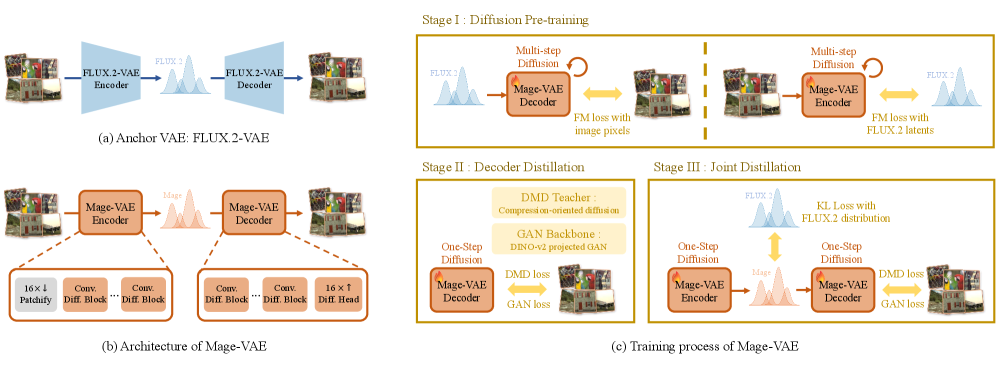
*Figure 6 — (a) anchor VAE인 FLUX.2-VAE, (b) 대칭형 one-step encoder/decoder 구조, (c) 3단계 학습 과정*

### 6.1 세 가지 설계 원칙

#### (1) decoder = 완전 convolution(합성곱) 기반 one-step pixel diffusion(원스텝 픽셀 확산)

*왜: global attention을 없애야 고해상도에서 비용이 선형으로 유지되기 때문.*

저자들의 선행 연구 **CoD-Lite**(학습된 이미지 코덱)를 그대로 가져옵니다. CoD-Lite의 핵심 관찰은 두 가지입니다.

- 작은 규모에서는 **생성 목적 사전학습보다 압축 목적 사전학습**이 코덱으로 더 잘 전이된다
- distillation(증류) + adversarial training(적대적 학습)을 거치면, global attention 없는 가벼운 fully-convolutional(완전 합성곱) decoder로도 충분하다

Mage-VAE decoder는 이 원칙대로 **convolutional diffusion block(합성곱 확산 블록)** 을 쌓고, 마지막에 **decoupled pixel diffusion head(분리된 픽셀 확산 헤드)** 를 붙여 latent에서 RGB 픽셀을 바로 복원합니다. 디코딩 비용이 해상도에 거의 선형으로 늘어납니다.

> 📌 **논문 서술의 정밀화 (코드 확인)**: 논문은 Mage-VAE가 "global attention을 피한다(avoids global attention)"고 쓰는데, `mage_vae.py`의 `_Decoder`(latent → 조건 특징을 만드는 CoD Decoder 부분)를 보면 실제로는 attention이 **있습니다**.
>
> ```python
> self.block = nn.Sequential(
>     ResnetBlock(in_channels=out_ch, out_channels=out_ch),
>     AttnBlock(out_ch, patch_size=32),      # <- attention 존재
>     ResnetBlock(in_channels=out_ch, out_channels=out_ch),
>     AttnBlock(out_ch, patch_size=32),      # <- attention 존재
>     ResnetBlock(in_channels=out_ch, out_channels=out_ch),
> )
> ```
>
> 다만 `AttnBlock`이 특징 맵을 **32x32 윈도우로 잘라서** 각 윈도우 안에서만 attention을 계산합니다(`to_patches` 후 `torch.bmm`). 그래서 비용이 토큰 수의 제곱이 아니라 **선형**입니다. 게다가 이 연산은 픽셀 격자가 아니라 **16배 다운샘플된 latent 격자** 위에서 돕니다 — 4096x4096 입력이면 256x256 격자를 8x8=64개 윈도우로 나누는 정도입니다.
>
> 정확한 서술은 **"attention이 없다"가 아니라 "global attention을 windowed attention(윈도우 어텐션)으로 바꿨다"** 입니다. 픽셀 공간 경로(`_DConvDenoiser`)는 진짜로 완전 합성곱이 맞습니다.

#### (2) encoder = decoder의 구조적 dual(쌍대)

*왜: 생성 모델은 디코딩만이 아니라 인코딩도 반복적으로 하기 때문 (학습 데이터 준비 + 편집 시 소스 인코딩).*

발상이 깔끔합니다.

> decoder를 "latent를 조건으로 픽셀을 만드는 생성기"라고 본다면,
> encoder는 **"픽셀을 조건으로 latent를 만드는 생성기"** 다.

그래서 encoder도 똑같이 patch embedding(패치 임베딩) 한 층 + convolutional diffusion block 쌓기로 만듭니다. 결과적으로 인코딩이 디코딩만큼 싸집니다.

일반적인 이미지 코덱 논문은 디코딩 속도만 신경 쓰는데(사용자는 다운로드해서 볼 뿐이니까), 생성 모델에서는 인코딩도 병목이라는 지적이 타당합니다.

#### (3) anchor-latent KL — 가장 실용적인 트릭

*왜: 싼 VAE를 새로 만들면 latent 공간이 달라져서 기존 생성 모델과 호환이 깨지는데, 그걸 막기 위해서.*

보통 VAE는 사후분포 q(z|x)를 **표준 정규분포** 쪽으로 당깁니다(Gaussian prior KL). Mage-VAE는 대신 **FLUX.2-VAE가 만드는 latent 분포(= anchor latent)** 쪽으로 당깁니다.

```text
z_anchor = Patchify( FLUX2_Encoder(x) )          ... (식 2)
L_KL = E_x[ KL( q_phi(z|x) || q_anchor(z|x) ) ]  ... (식 11)
```

즉 **"강하지만 비싼 VAE의 latent 기하 구조를 증류로 흉내 내는 싼 VAE"** 입니다.

여기에 영리한 디테일이 하나 더 있습니다. FLUX.2-VAE는 32채널·8배 다운샘플인데, DiT에 넣을 때 보통 2x2 patchify를 한 번 더 합니다(→ 128채널·16배 효과). Mage-VAE는 **그 patchify를 아예 VAE 안으로 내재화**해서 처음부터 16배 다운샘플·128채널 latent를 뱉습니다. 결과적으로 형상과 분포가 모두 맞아떨어져서 **드롭인 교체**가 됩니다.

### 6.2 3단계 학습

*왜: 멀티스텝 확산으로 먼저 잘 배운 뒤 원스텝으로 압축하는 게, 처음부터 원스텝으로 학습하는 것보다 안정적이기 때문.*

#### 그 전에 — "멀티스텝 flow matching"이 뭔가요?

*왜 이 설명을 먼저 두는가: Stage I을 이해하려면 이 개념이 먼저 필요하고, 같은 논리가 §10.2의 Mage-Flow 본체 증류에서도 그대로 반복되기 때문입니다.*

**한 줄로**: **"쓸 때 여러 번 굴려야 하는 모델"** 이라는 뜻입니다. 학습 방식이 아니라 **완성된 모델에 붙는 꼬리표**입니다.

**먼저 flow matching 자체부터.** 깨끗한 목표(`y_0`)와 무작위 노이즈(`eps`)를 `t` 비율로 섞어놓고, 모델에게 이렇게 묻습니다.

> "지금 이 섞인 상태에서 목표 쪽으로 가려면, **어느 방향으로 얼마나** 가야 하니?"

이때 배우는 방향을 **velocity(속도)** 라고 부릅니다. 학습할 때 `t`를 0부터 1까지 골고루 뽑기 때문에, 모델은 **모든 노이즈 수준에서의 방향**을 알게 됩니다.

> ⚠️⚠️ **가장 헷갈리는 지점 — "멀티스텝으로 학습한다"는 말은 틀린 표현입니다**
>
> flow matching **학습 자체에는 스텝이라는 개념이 없습니다.** 매 학습 iteration마다 `t`를 무작위로 **하나** 뽑아, 그 지점에서의 방향을 맞히는 **회귀 문제**를 풀 뿐입니다. 반복해서 걸어가는 과정은 **학습 중에 일어나지 않습니다.**
>
> 그러면 논문의 "multi-step flow-matching pre-training"은 무슨 뜻일까요?
>
> | | |
> |---|---|
> | ❌ 오해 | 멀티스텝으로 **학습한다** |
> | ✅ 정확 | **멀티스텝으로 써야 하는 모델**을 만드는 사전학습 |
>
> 즉 멀티스텝/원스텝은 **학습 방식이 아니라 추론 방식**의 구분입니다.

**증거 — 두 단계 모두 학습 루프에 반복이 없습니다.**

```python
# Stage I 학습, 한 iteration
y0   = 진짜 목표
t    = random()              # 매번 무작위로 딱 하나
eps  = randn()
y_t  = (1-t)*y0 + t*eps      # 목표와 노이즈를 t 비율로 섞음
loss = || model(y_t, t) - y0 ||^2
# forward 한 번. 반복문 없음.

# Stage II 학습, 한 iteration
x_hat = student(z)           # forward 한 번
loss  = L1 + LPIPS + 0.01*GAN + 0.1*DMD
# 여기도 forward 한 번. 반복문 없음.
```

**차이는 학습 방식이 아니라 "무엇을 배우느냐"입니다.**

| | 배우는 것 | 그래서 쓸 때 |
|---|---|---|
| Stage I 모델 | "**아무 지점**에 뚝 떨어뜨려도, 거기서의 방향" | 방향만 아니까 조금 가고 다시 물어야 함 → **여러 번** |
| Stage II 모델 | "**출발점에서 목적지까지** 한 번에" | 바로 도착 → **한 번** |

#### 비유 — 나침반과 직행 지도

> **Stage I 모델 = 나침반**
> 지도 위 어디에 서 있든 "지금 여기서는 저쪽"을 알려줍니다.
> **학습법**: 지도 위 **아무 지점에나 뚝 떨어뜨려 놓고** "여기서 어느 쪽?"을 맞히게 하기를 수없이 반복. ← 이게 무작위 `t` 샘플링입니다. **걸어다니는 게 아니라 순간이동해서 찍어보는 것.**
>
> **Stage II 모델 = 직행 지도**
> 출발점만 주면 목적지를 바로 찍어줍니다.
> **학습법**: 이미 만든 나침반을 선생으로 두고, 학생이 한 번에 목적지를 찍도록 훈련.

**그럼 나침반은 왜 여러 번 물어야 할까요?** 나침반은 **그 자리에서의 방향**만 압니다. 길이 휘어 있으면 그 방향으로 끝까지 직진했을 때 엉뚱한 곳에 도착합니다. 그래서 조금 가서 다시 묻고, 또 조금 가서 다시 묻고를 20~50번 반복해야 목적지에 닿습니다.

**그래서 갈리는 지점은 추론(생성)입니다.**

| | 어떻게 | 장단점 |
|---|---|---|
| **multi-step(멀티스텝)** | 순수 노이즈에서 출발 → 조금 가고 → **방향을 다시 물어보고** → 조금 가고 … 를 20~50번 반복 | 매번 방향을 새로 계산하니 정확. 대신 그만큼 느림 |
| **few-step(소수 스텝)** | 같은 방식이되 4~8번만 | 절충. 증류로 만들어냄 |
| **one-step(원스텝)** | 한 번 물어보고 그 방향으로 **끝까지 직진** | 압도적으로 빠름. 대신 품질이 무너지기 쉬움 |

**원스텝을 처음부터 학습시키면 왜 안 될까요?** 목표 분포가 복잡할 때 "한 방에 도달하는 방향"이라는 게 애매하기 때문입니다. 같은 노이즈에서 갈 수 있는 그럴듯한 결과가 여러 개인데, 한 방향만 내놓으라고 하면 모델은 **그 여러 정답의 평균**을 뱉습니다. 결과는 흐릿한 이미지죠. 그래서 나침반을 먼저 만들고, 그 나침반이 **실제로 데려다주는 곳**을 학생에게 베끼게 합니다.

**그래서 2단계로 갑니다.**

```text
Stage I  : "멀티스텝으로 써야 하는 모델" 을 제대로 학습시킨다   <- 나침반을 만든다
Stage II : 그 모델을 "1스텝으로 써도 되는 모델" 로 바꾼다      <- 직행 지도로 요약한다
```

Stage II가 바로 **distillation(증류)** 입니다. 잘 배운 멀티스텝 모델을 teacher(교사)로 두고, student(학생)가 한 번에 같은 곳에 도달하도록 훈련시킵니다.

**최종 정리:**

| | 학습 중 반복? | 추론 중 반복? | 부르는 이름 |
|---|---|---|---|
| Stage I 모델 | ❌ 없음 | ✅ 20~50번 | "멀티스텝 모델" |
| Stage II 모델 | ❌ 없음 | ❌ 1번 | "원스텝 모델" |

**같은 구조가 Mage-Flow 본체에도 그대로 있습니다** — 30스텝 Base(멀티스텝) → 4스텝 Turbo(§10.2 증류). 규모만 다르고 논리는 동일합니다.

#### 멀티스텝과 distillation은 어떤 관계인가

*왜 이걸 짚는가: "멀티스텝은 증류에서 쓰는 방식인가?"로 오해하기 쉽기 때문입니다.*

**아닙니다. 멀티스텝은 증류가 쓰는 방식이 아니라, 증류가 없애려는 대상입니다.**

```text
                 [ teacher ]              [ student ]
  Mage-VAE  :  멀티스텝 확산   --증류-->   1스텝      (진짜 원스텝)
  Mage-Flow :  20~30스텝       --증류-->   4스텝      (few-step)
                 ↑                          ↑
            증류가 없애려는 대상        증류의 결과물
```

정확한 역할 배분은 이렇습니다.

| | 무엇 | 스텝 개념이 있나 |
|---|---|---|
| flow matching **학습** | 무작위 `t` 하나에서 방향을 맞히는 회귀 | **없음** |
| flow matching **추론** | 학습된 방향을 20~50번 따라가며 적분 | **멀티스텝** |
| **distillation** | 그 멀티스텝 teacher의 행동을 소수 스텝 student에 옮기는 별도 학습 | teacher는 멀티스텝, student는 4스텝 |

즉 **"멀티스텝"은 증류 이전 단계의 성질**이고, 증류는 그걸 줄이는 작업입니다.

> 📌 **뉘앙스 하나**: student가 반드시 1스텝인 건 아닙니다. Mage-Flow-Turbo는 **4스텝**이고, 이건 DMD2 이후 표준이 된 **multi-step student** 방식입니다. 1스텝으로 완전히 압축하면 품질 손실이 크기 때문에, 4스텝 정도를 남겨 절충합니다. 그래서 이 계열을 "one-step distillation"이 아니라 **"few-step distillation(소수 스텝 증류)"** 이라고 부릅니다(§10.2 제목이 그렇습니다).
>
> 반대로 **Mage-VAE의 student는 진짜 1스텝**입니다(§6.2 Stage II). 재구성은 생성보다 목표가 훨씬 결정적이라 1스텝으로 압축해도 버티기 때문입니다.

> 📌 그리고 **배포된 코드에서는 그 원스텝조차 확산이 아닙니다.** 노이즈 입력이 상수 0이고 timestep도 0 고정이라, 결정적인 순전파 한 번입니다(§12.1). 확산은 **좋은 컨브넷을 얻기 위한 학습 방법**이었을 뿐입니다.

#### 공개 코드에서 멀티스텝은 어디에 남아 있나

*왜 이걸 확인하는가: "멀티스텝은 추론에서만 일어난다"는 주장이 맞다면, 공개된 추론 코드에 그 흔적이 정확히 어디 있는지 셀 수 있어야 하기 때문입니다.*

저장소 전체를 뒤지면 **timestep 루프는 딱 3곳뿐**입니다.

| 위치 | 무엇 |
|---|---|
| `pipeline.py:341` | `generate_images` — 텍스트→이미지 |
| `pipeline.py:551` | `generate_edits` — 편집 |
| `pipeline.py:624` | `invert_to_noise` — 워터마크 탐지용 **역방향** 멀티스텝 (§12.2) |

```python
# pipeline.py:341
scheduler = _get_scheduler(model, steps, device, static_shift)
for si, t in enumerate(scheduler.timesteps):          # <- 이게 멀티스텝
    pred = _velocity(model.transformer, img, ctx, scheduler.sigmas[si].item())
    img  = scheduler.step(pred, t, img, return_dict=False)[0]
```

`steps=30`이면 30번, `steps=4`면 4번 도는 **같은 코드**입니다. Base / RL / Turbo가 코드 분기 없이 숫자만 바뀝니다.

**반면 `mage_vae.py`(651줄)에는 timestep 루프가 0개입니다.**

```python
@torch.no_grad()
def decode(self, z):
    cond  = self.decoder_model.y_embedder.decoder(z)
    noise = torch.zeros(B, 3, H, W)      # 노이즈 자리에 0
    t     = torch.zeros(B)               # timestep 도 0 고정
    return self.decoder_model.forward(noise, t, cond)   # 호출 한 번. 끝.
```

> ⚠️ **헷갈리기 쉬운 지점 — 두 종류의 `for` 문**
>
> `mage_vae.py`에도 `for` 문은 많습니다(`for block in self.blocks:`). 하지만 그건 **층을 지나가는 루프**이지 **시간을 되감는 루프**가 아닙니다.
>
> | 루프 종류 | 코드 | 의미 |
> |---|---|---|
> | **층 루프** | `for block in self.blocks:` | forward **한 번** 안에서 21개 층을 통과 (공간적) |
> | **timestep 루프** | `for si, t in enumerate(scheduler.timesteps):` | forward를 **여러 번** 호출하며 궤적을 적분 (시간적) |
>
> 멀티스텝이란 후자를 말합니다. VAE에는 후자가 없습니다.

**정리하면:**

```text
                        멀티스텝 teacher        코드에 루프가?
  Mage-VAE     Stage I  (멀티스텝 확산)   ->   ❌ 미공개. 증류된 1스텝 student 만 공개
                                              게다가 그 student 도 noise=0, t=0 고정 (§12.1)
  Mage-Flow    Base/RL  (20~30스텝)       ->   ✅ pipeline.py:341 에 그대로 있음
               Turbo    (4스텝)            ->   ✅ 같은 루프, steps 숫자만 4
```

VAE 쪽에 남은 "멀티스텝이었던 흔적"은 이겁니다 — `decode`가 `t` 인자를 받고 내부에 `TimestepEmbedder`가 있지만, 항상 0만 들어옵니다. 그래서 생성자의 `_freeze_adaln_cache()`가 그 경로를 통째로 상수로 접어버립니다(37M 파라미터 소멸). **멀티스텝 시절에는 필요했지만 이제는 죽은 배관**입니다.

> 📌 증류 **학습** 중에도 멀티스텝 롤아웃은 돌지 않습니다. Decoupled DMD는 teacher를 `tau_ca`, `tau_dm` 두 개의 **단일 노이즈 지점**에서만 평가하지, 궤적 전체를 굴리지 않습니다(§10.2 식 15). 진짜 멀티스텝 궤적을 굴리는 건 progressive distillation이나 DMD2의 backward simulation 같은 다른 계열입니다. 단, 학습 코드가 비공개라 이건 **논문 수식 기준의 판단**이고 코드로 확인한 건 아닙니다.

#### 3단계 표

| 단계 | 무엇을 | 손실 |
|---|---|---|
| **Stage I** — Diffusion Pre-training | encoder/decoder를 **따로**, **멀티스텝** flow matching으로 학습. decoder는 픽셀 복원, encoder는 "patchify된 FLUX.2 latent" 예측 | `L_I = L_FM,dec + L_FM,enc` (식 6) |
| **Stage II** — Decoder Distillation | decoder를 **원스텝으로 증류** | `L_II = L1 + LPIPS + 0.01*L_GAN(DINO) + 0.1*L_DMD` (식 9) |
| **Stage III.1** — Encoder Warm-up | decoder 고정, encoder만 학습 | `L_III.1 = L_II + 0.1*L_KL` (식 13) |
| **Stage III.2** — Joint | encoder·decoder **동시 최적화** | `L_III.2 = L_II + 0.1*L_KL` (식 14) |

#### Stage I은 "일반 flow matching"과 무엇이 다른가

*왜 이걸 짚는가: 앞에서 "학습 절차는 표준 flow matching과 같다"고 했으니, 그럼 대체 뭐가 Mage-VAE만의 것인지 명확히 구분해야 하기 때문입니다.*

**뼈대는 동일하고, 세 군데가 다릅니다.** 논문의 식을 나란히 놓고 보겠습니다.

**Mage-Flow 본체 (DiT) — §7.1**

```text
z_t = (1-t)*z + t*eps                                   ... (식 2)
L   = E[ || v_theta(z_t, t, tau) - (z - eps) ||^2 ]     ... (식 1)
                    ↑                    ↑
              velocity 를 예측      정답도 velocity
```

**Mage-VAE Stage I**

```text
y_t = (1-t)*y_0 + t*eps                                 ... (식 3)
   (즉 깨끗한 목표 y_0 와 무작위 노이즈 eps 를 t 비율로 섞은 값)

L   = E[ || X_theta(y_t, t | c) - y_0 ||^2 ]            ... (식 4)
                    ↑                ↑
              원본 y_0 를 예측    정답은 원본 그 자체

v_theta(y_t, t | c) = ( y_t - X_theta(y_t, t | c) ) / t  ... (식 5)
   (나중에 필요하면 x0-prediction 을 velocity 형태로 변환)
```

**섞는 방식(식 2 = 식 3)은 완전히 같습니다.** 둘 다 선형 보간이고, 무작위 `t` 하나 뽑아서 회귀 문제를 푸는 구조도 같습니다.

**차이 1 — 예측 대상(parameterization)이 다릅니다**

| | 무엇을 맞히나 | 이름 |
|---|---|---|
| **Mage-Flow DiT** | `z - eps` (방향) | **v-prediction** |
| **Mage-VAE Stage I** | `y_0` (원본 자체) | **x0-prediction** |

둘은 **수학적으로 동치**입니다. 식 5가 그 변환 공식이고요 — x0를 맞혔으면 거기서 velocity를 계산해낼 수 있습니다.

그런데 **학습 난이도는 다릅니다.** 노이즈가 거의 없는 구간(`t`이 0에 가까움)에서 식 5의 분모 `t`가 0으로 가면서 값이 폭발합니다. 그래서 보통 x0-prediction은 노이즈가 적은 구간에서 안정적이고 많은 구간에서 불안정하며, v-prediction은 전 구간 균형이 좋아 생성 모델의 표준입니다.

Mage-VAE가 x0을 고른 건 자연스럽습니다. **재구성 작업이라 목표가 하나로 딱 정해져 있어서**, "정답 이미지를 직접 맞혀라"가 더 직관적이고 LPIPS·GAN 같은 픽셀 손실과 붙이기도 쉽습니다. 실제로 Stage II 손실(식 9)이 전부 `x_hat`(복원 이미지) 기준입니다. (파라미터화 통합 관점은 [[paper_min_snr]] 참조)

**차이 2 — "목표"가 이미지가 아닐 수 있습니다**

여기가 Mage-VAE의 진짜 특이점입니다. `y_0` 자리에 뭐가 들어가는지가 encoder와 decoder에서 정반대입니다.

| | 조건 `c` | 목표 `y_0` | 한 문장 |
|---|---|---|---|
| **decoder** | latent | **RGB 픽셀** | latent를 보고 픽셀을 만든다 |
| **encoder** | RGB 픽셀 | **patchify된 FLUX.2 latent** | 픽셀을 보고 latent를 만든다 |

일반적인 flow matching은 항상 "노이즈 → 이미지"인데, **Mage-VAE의 encoder는 "노이즈 → latent"입니다.** 목적지가 이미지가 아니라 남의 VAE가 만든 latent예요.

이게 §6.1-(2)의 **"encoder는 decoder의 구조적 dual"**의 실제 내용입니다. 확산 모델을 뒤집어서 압축기로 쓰는 거죠. 그리고 그 목적지가 FLUX.2-VAE의 latent이기 때문에 §6.1-(3)의 anchor 정렬이 자동으로 따라옵니다. 식 6이 두 손실을 그냥 더하는 것도 이 때문입니다 — 서로 독립된 두 개의 확산 모델이라 각자 학습됩니다.

```text
L_I = L_FM,dec + L_FM,enc      ... (식 6)
      ↑ 픽셀 목표    ↑ latent 목표
```

**차이 3 — 조건을 넣는 방식**

| | 조건 |
|---|---|
| 표준 T2I flow matching | 텍스트 임베딩 (cross-attn 또는 joint attn) |
| Mage-Flow DiT | 텍스트 임베딩 `tau` (+편집이면 소스 latent) |
| Mage-VAE decoder | latent를 conv 특징으로 변환해 **공간적으로 주입** (`s_embedder`가 픽셀 패치와 concat) |
| Mage-VAE encoder | 픽셀을 patch embed해서 **공간적으로 주입** (`patch_cond_embed` → `fuse_proj`) |

VAE 쪽은 조건이 텍스트처럼 "떠 있는 벡터"가 아니라 **격자에 정렬된 특징 맵**입니다. 그래서 attention 없이 conv만으로 조건을 반영할 수 있고, §6.1-(1)의 완전 합성곱 설계가 성립합니다.

**정리**

| 항목 | 표준 flow matching | Mage-Flow DiT | Mage-VAE Stage I |
|---|---|---|---|
| 보간식 | `(1-t)·목표 + t·노이즈` | 동일 | 동일 |
| 학습 구조 | 무작위 `t` 하나 → 회귀 | 동일 | 동일 |
| **예측 대상** | v 또는 ε 또는 x0 | **v-prediction** | **x0-prediction** |
| **목표(`y_0`)** | 이미지 | 이미지 latent | dec=픽셀 / **enc=anchor latent** |
| **조건** | 텍스트 | 텍스트 | 공간 정렬된 특징 맵 |
| 학습 루프 반복 | 없음 | 없음 | 없음 |

**한 줄로**: 학습 알고리즘 자체는 표준 flow matching 그대로이고, **무엇을 목표로 삼고 무엇을 예측하게 하느냐만 바꿔 끼운 것**입니다.

> ⚠️ **논문이 안 밝힌 것 두 가지**
>
> 1. **`t` 샘플링 분포** — 균등분포인지 logit-normal(SD3 이후 표준, Qwen-Image도 채택)인지 한 줄도 없습니다. 학습 코드도 비공개라 확인 불가입니다. 추론 쪽 `static_shift 6.0`(§13.10)만 알 수 있습니다.
> 2. **velocity 부호 규약이 두 절에서 반대입니다.** 식 1의 정답은 `z - eps`인데, 식 5를 풀면 `v = eps - y_0`가 나옵니다(부호 반대). 각 절이 자기 샘플러와 짝이 맞으면 실무상 문제는 없지만, 두 식을 같이 읽으면 헷갈립니다. 논문 표기의 느슨함으로 보입니다.

#### 학습 레시피를 Qwen-Image와 비교하면

*왜: §13.3에서 블록 구조가 Qwen-Image에서 왔다는 걸 확인했으니, 학습 쪽도 물려받았는지 확인할 차례입니다.*

**레시피의 뼈대는 놀랄 만큼 같고, 재료와 인프라는 다릅니다.**

**같은 것:**

| 항목 | Qwen-Image | Mage-Flow |
|---|---|---|
| 학습 목적함수 | flow matching (Rectified Flow) | 동일 |
| 텍스트 인코더 | **동결된 VLM** (Qwen2.5-VL-7B) | **동결된 VLM** (Qwen3-VL-4B) |
| **해상도 커리큘럼** | **256 → 640 → 1328** | **256² → 512 → 1024** |
| 후처리 구성 | pre-train → SFT → RL | pre-train → SFT → RL |
| 블록 구조 | dual-stream MM-DiT, 블록별 modulation | 동일 (§13.3) |
| RoPE | MSRoPE, 중심 원점 | 동일 |

해상도 커리큘럼이 특히 닮았습니다. 둘 다 256에서 시작해 중간 해상도를 거쳐 1K대로 올리는 3단 구조인데, 우연이라기엔 §13.3의 코드 계보와 방향이 같습니다.

**다른 것:**

| 항목 | Qwen-Image | Mage-Flow |
|---|---|---|
| **VAE** | 자체 텍스트 특화 VAE (16ch @ 8×) | **Mage-VAE** (128ch @ 16×, FLUX.2 앵커) |
| **텍스트 RoPE** | 적용 | **제거** |
| **해상도 처리** | 버킷 방식 | **native packing (varlen)** |
| **RL 알고리즘** | DPO + GRPO | **Diffusion-NFT** |
| **증류** | 없음 (본체 기준) | Decoupled DMD 4스텝 |
| **학습 인프라** | (별도 언급 없음) | **커스텀 CUDA 커널 융합** (§8) |
| **`t` 샘플링 분포** | **logit-normal** (명시) | **논문 미기재** |
| 규모 | 20B / 60층 | 4B / 12층 |

특히 세 가지가 큽니다.

1. **latent 공간이 다릅니다.** 이미지 쪽이 보는 숫자의 분포가 아예 달라서, **가중치를 물려받을 수 없는 이유**이기도 합니다(§13.3.1)
2. **해상도 처리 철학이 반대입니다.** 논문이 §7.1에서 "버킷의 문제"를 길게 비판하는데, 그 비판 대상에 자기 조상인 Qwen-Image도 들어갑니다
3. **시스템 최적화가 Mage-Flow만의 것입니다.** varlen 커널, `cu_seqlens` 배관, 커널 융합, packed CFG는 Qwen-Image에 없습니다 — 이 논문의 실제 기여 중 하나죠(§8)

> **한 줄로**: 레시피(recipe)는 물려받았고, 재료(ingredients)와 주방(infra)은 새로 짰습니다. 그리고 논문은 이 유사성을 **어디에서도 언급하지 않습니다** — SD3만 인용합니다.

### 6.3 결과 — 재구성 품질과 비용 (Table 1)

*왜: "싸졌다"는 주장은 품질이 유지된다는 증거가 함께 있어야 의미가 있기 때문.*

| 모델 | 파라미터 Enc/Dec (M) | kMACs/px Enc/Dec | CLIC PSNR↑ | CLIC SSIM↑ | CLIC LPIPS↓ | FFHQ PSNR↑ | FFHQ SSIM↑ | FFHQ LPIPS↓ |
|---|---|---|---|---|---|---|---|---|
| SD-VAE | 34 / 49 | 2130 / 4796 | 30.10 | 0.8156 | 0.0565 | 33.00 | 0.8662 | 0.0461 |
| SD-3.5-VAE | 34 / 50 | 2132 / 4797 | 32.79 | 0.8896 | 0.0271 | 36.23 | 0.9330 | 0.0189 |
| FLUX-VAE | 34 / 50 | 2132 / 4797 | 34.80 | 0.9264 | 0.0188 | 38.43 | 0.9587 | 0.0129 |
| **FLUX.2-VAE** | 34 / 50 | 2134 / 4798 | **36.88** | 0.9447 | **0.0139** | 40.47 | 0.9682 | **0.0102** |
| Qwen-Image-VAE | 54 / 73 | 3378 / 5423 | 34.95 | 0.9129 | 0.0571 | 38.75 | 0.9515 | 0.0422 |
| HunyuanVideo-VAE | 100 / 146 | 6198 / 14096 | 36.14 | 0.9305 | 0.0250 | 39.86 | 0.9610 | 0.0205 |
| HunyuanImage-3.0-VAE | 389 / 871 | 28053 / 49836 | 33.80 | 0.8864 | 0.0546 | 36.84 | 0.9259 | 0.0468 |
| **Mage-VAE** | 49 / 52 | **173 / 215** | 36.61 | **0.9450** | 0.0148 | **40.67** | **0.9708** | 0.0107 |

연산량이 **인코딩 12.3배, 디코딩 22.3배** 줄었는데, 재구성 품질은 CLIC(일반 도메인 2K 이미지)에서 0.27dB 손해, FFHQ(인물)에서는 오히려 0.20dB 이득. 실질적으로 무손실입니다.

참고로 파라미터 수 자체는 크게 줄지 않았습니다(49M/52M vs 34M/50M). **줄어든 건 연산량**입니다. global attention을 없애고 해상도가 낮은 곳(16배 다운샘플된 latent 격자)에서 대부분의 연산을 하기 때문입니다.

### 6.4 결과 — 고해상도 지연시간 (Table 17)

*왜: 실제 병목은 kMACs가 아니라 벽시계 시간이고, 차이는 고해상도에서 극적으로 벌어지기 때문.*

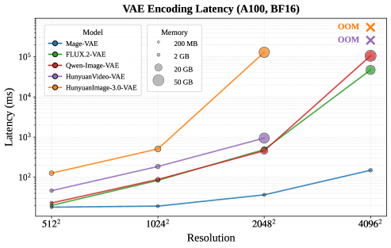 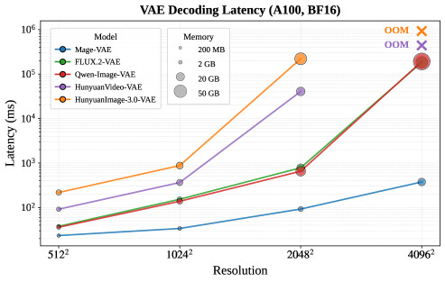
*Figure 7 — 해상도별 VAE 인코딩/디코딩 지연시간과 메모리 (A100 80GB, bf16). 점의 크기가 메모리*

인코딩 / 디코딩 지연시간 (ms, 낮을수록 좋음):

| 해상도 | Mage-VAE | FLUX.2-VAE | Qwen-Image-VAE | HunyuanVideo-VAE | HunyuanImage-3.0-VAE |
|---|---|---|---|---|---|
| 512² | **18.0 / 23.4** | 19.9 / 37.8 | 22.9 / 36.0 | 46.4 / 91.7 | 126.6 / 217.8 |
| 1024² | **19.1 / 33.8** | 83.8 / 153.3 | 88.3 / 137.9 | 185.7 / 364.3 | 508.2 / 877.1 |
| 2048² | **36.5 / 92.4** | 491 / 782 | 458 / 654 | 948 / 40705 | 129803 / 220498 |
| 4096² | **149.6 / 375.0** | 47323 / 183920 | 106695 / 192042 | OOM | OOM |

4096²에서 FLUX.2-VAE가 디코딩에 **184초**를 쓰는 동안 Mage-VAE는 **0.375초**. 500배 가까이 차이 납니다. HunyuanVideo-VAE와 HunyuanImage-3.0-VAE는 아예 메모리 부족(OOM)으로 죽습니다.

> ⚠️ **여기는 걸러 읽어야 합니다.** 이 측정은 타일링(tiling, 이미지를 조각내서 처리) 없이 전체 이미지를 한 번에 통과시킨 값으로 보입니다. 실무에서 4K를 뽑을 땐 대부분 타일 디코딩을 쓰기 때문에 47초/184초 같은 숫자가 그대로 나오진 않습니다. 다만 **"타일 이음새(seam) 없이, 통짜로, 0.4초"** 라는 점 자체는 진짜 장점입니다.

### 6.5 교차 호환성 — anchor 정렬이 실제로 됐다는 증거 (Table 2)

*왜: anchor-latent KL이 이론적으로만 그럴듯한 게 아니라 정말 latent 기하 구조를 보존했는지 확인하려면, 백본을 고정하고 VAE만 바꿔봐야 하기 때문.*

**(a) 생성**

| 백본 | tokenizer | GenEval | DPG | TIIF-S | TIIF-L | CVTG-2K | OneIG-EN | LongText-CN |
|---|---|---|---|---|---|---|---|---|
| Mage-Flow-Turbo | Mage-VAE | 0.88 | 85.48 | 83.58 | 84.16 | 0.873 | 0.523 | 0.801 |
| Mage-Flow-Turbo | FLUX.2-VAE | 0.88 | 85.49 | 81.18 | 81.09 | 0.869 | 0.523 | 0.800 |
| FLUX.2-Klein-4B | FLUX.2-VAE | 0.83 | 85.53 | 78.91 | 79.04 | 0.628 | 0.500 | 0.068 |
| FLUX.2-Klein-4B | **Mage-VAE** | 0.83 | 85.52 | 77.40 | 79.43 | 0.623 | 0.502 | 0.068 |

**(b) 편집**

| 백본 | tokenizer | ImgEdit | GEdit-EN | GEdit-CN | TextEdit-Syn | TextEdit-Real |
|---|---|---|---|---|---|---|
| Mage-Flow-Edit-Turbo | Mage-VAE | 4.38 | 8.271 | 8.264 | 12.77 | 15.41 |
| Mage-Flow-Edit-Turbo | FLUX.2-VAE | 4.34 | 8.098 | 8.112 | 12.85 | 15.26 |
| FLUX.2-Klein-4B | FLUX.2-VAE | 4.01 | 7.717 | 7.750 | 11.84 | 14.46 |
| FLUX.2-Klein-4B | **Mage-VAE** | 3.95 | 7.734 | 7.672 | 11.65 | 14.46 |

**남의 모델(FLUX.2-Klein-4B)에 Mage-VAE를 그냥 꽂아도 성능이 유지됩니다.** 이게 anchor-latent KL의 진짜 검증이고, 이 논문에서 재사용 가치가 가장 높은 부분입니다. FLUX.2 계열 모델을 쓰고 있다면 VAE만 갈아끼워도 고해상도 병목이 사라집니다.

(사소한 단서: FLUX.2-Klein-4B에 Mage-VAE를 꽂으면 TIIF-Short가 78.91 → 77.40으로 1.5포인트 정도 떨어집니다. 완전 무손실은 아닙니다.)

> **Finding 1 (논문 원문 요지)**: anchor-latent 감독은 생성 준비된(generation-ready) latent 공간을 깨지 않으면서 효율적인 VAE 증류를 가능하게 한다.

---

## 7. NR-MMDiT — 백본

*이 절을 두는 이유: VAE를 아무리 싸게 만들어도 백본이 해상도 버킷에 묶여 있으면 유연성과 효율을 못 살리기 때문입니다.*

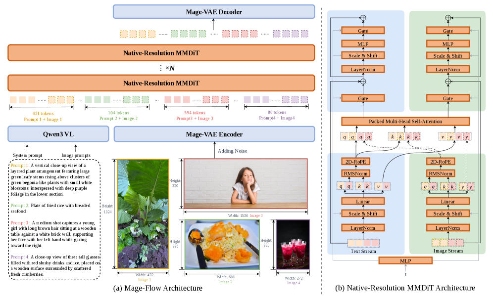
*Figure 5 — 왼쪽: 서로 다른 해상도의 이미지 4장과 프롬프트 4개가 하나의 가변 길이 시퀀스로 packing되어 NR-MMDiT를 통과. 오른쪽: MMDiT 블록 (파란색 = 텍스트 stream, 초록색 = 이미지 stream, 가운데 Packed Multi-Head Self-Attention에서 만남)*

### 7.1 논문이 말하는 것

- **SD3식 MMDiT dual-stream 블록**: 텍스트/이미지가 각자 정규화·투영 레이어를 갖되, attention은 이어붙여 함께 수행
- **텍스트 인코더**: 동결된 **Qwen3-VL-4B-Instruct**
- **native-resolution packing** (NiT 계열 아이디어): 해상도 버킷을 없애고, 서로 다른 크기·비율 이미지를 가변 길이 시퀀스로 한 배치에 넣음. FlashAttention varlen 커널 + 샘플별 2D RoPE로 샘플 간 attention을 격리
- 텍스트도 padding 없이 packing (길이가 제각각인 프롬프트를 최대 길이로 늘리지 않음)
- **512~2048 임의 해상도**, 512x2048 같은 4:1 극단 비율까지 체크포인트 하나로 커버
- 학습 목표는 rectified flow matching

```text
L(theta) = E[ || v_theta(z_t, t, tau) - (z - eps) ||^2 ]   ... (식 1)
z_t = (1-t)*z + t*eps,   eps ~ N(0, I)
   (깨끗한 latent z 와 노이즈 eps 를 t 비율로 섞고,
    네트워크가 "z 에서 eps 를 뺀 방향"(= velocity)을 맞히도록 학습)
```

**bucket 방식과 뭐가 다른가?** 기존에는 이미지를 512x512, 768x1024 같은 정해진 목록에 배정하고, 매 optimization step(최적화 스텝)이 **하나의 버킷만** 봅니다. 그래서 (a) 원본 해상도 분포가 이산화되고, (b) 한 스텝 안의 비율 다양성이 사라지고, (c) 극단적으로 넓거나 긴 출력은 버킷을 명시적으로 추가해야만 지원됩니다. native packing은 이 세 문제를 한 번에 없앱니다.

> **Finding 2 (논문 원문 요지)**: native-resolution packing은 해상도 다양성을 학습 신호로 바꾼다 — 버킷 제약을 없애면 매 업데이트가 이질적인 크기·비율을 섞어 보게 되고, 동시에 packed CFG 추론도 가능해진다.

### 7.2 편집 모델 — 같은 백본, 조건만 바꿈

*왜: 편집 전용 모듈을 새로 붙이지 않고 생성 모델에서 바로 초기화하기 위해서.*

Mage-Flow-Edit은 **동일한 Mage-VAE latent 공간과 동일한 NR-MMDiT**를 씁니다. 바뀌는 건 조건(conditioning) 형식뿐입니다.

- Qwen3-VL이 **편집 지시문 + 소스 이미지**를 함께 인코딩해서 멀티모달 조건 tau를 만듦
- Mage-VAE가 소스와 타깃을 각각 z_src, z_tgt로 인코딩
- NR-MMDiT 입력 시퀀스 = `[ tau ] + [ z_src ] + [ 노이즈 낀 z_tgt ]`
- **frame-aware RoPE**: 2D RoPE에 frame 축을 추가해 3D 위치 인덱스 (h, w, f)로. f가 이미지 번호(타깃 0, 소스 1, 2, ...)라서 "이 토큰이 어느 이미지 소속인지"를 표시하면서도 소스-타깃 간 공간 대응은 그대로 보존
- **손실은 타깃 토큰에만 계산** → 별도 모듈 없이 Mage-Flow에서 바로 초기화 가능

### 7.3 packed CFG — 추론 최적화 (Table 3)

*왜: 학습을 위해 만든 packing 장치를 추론에서도 공짜로 재활용할 수 있기 때문.*

CFG는 조건부/무조건부 두 번의 forward가 필요합니다. packing이 있으면 이 둘을 하나의 가변 길이 시퀀스에 넣어 **커널 한 번**으로 처리할 수 있습니다. `cu_seqlens`가 두 분기를 격리하므로 **수치적으로 완전히 동일**하고, 커널 실행 횟수만 절반이 됩니다.

| 모델 | 스텝 | Separate CFG | Packed CFG | 가속 |
|---|---|---|---|---|
| Mage-Flow-Base | 30 | 7.5089s | 6.5159s | 1.15× |
| Mage-Flow | 20 | 5.0076s | 4.3680s | 1.15× |
| Mage-Flow-Edit-Base | 30 | 11.5463s | 10.5582s | 1.09× |
| Mage-Flow-Edit | 30 | 11.5985s | 10.5475s | 1.10× |

### 7.4 ⭐ 코드에서만 알 수 있는 실제 구조 (논문에 없음)

*왜: 논문 전체를 뒤져도 레이어 수와 폭이 한 번도 안 나오는데, 이건 모델을 이해하고 재현하는 데 가장 기본적인 정보이기 때문.*

Hugging Face `microsoft/Mage-Flow`의 `transformer/config.json`:

```json
{
  "hidden_size": 3072,      "depth": 12,        "num_heads": 24,
  "axes_dim": [16, 56, 56], "context_in_dim": 2560,
  "in_channels": 128,       "out_channels": 128, "patch_size": 1,
  "apply_text_rotary_emb": false,
  "schedule_mode": "z-image", "static_shift": 6.0,
  "depth_single_blocks": 0
}
```

**해석:**

| 항목 | 값 | 의미 |
|---|---|---|
| depth | **12** | dual-stream 블록 12개. single-stream 블록은 0개 |
| hidden_size | 3072 | 폭 |
| num_heads | 24 | head_dim = 3072/24 = **128** |
| axes_dim | [16, 56, 56] | RoPE 축별 차원 배분. frame 16 + height 56 + width 56 = 128 |
| context_in_dim | 2560 | Qwen3-VL-4B의 hidden size |
| patch_size | 1 | latent를 추가 patchify하지 않음 (Mage-VAE가 이미 했으므로) |

파라미터를 직접 계산해보면 딱 맞습니다.

```text
블록 1개당:
  attention  = (to_q,k,v,out) 4*3072^2 + (add_q,k,v, to_add_out) 4*3072^2 = 75.5M
  img_mlp    = 3072 -> 12288 -> 3072                                      = 75.5M
  txt_mlp    = 동일                                                        = 75.5M
  img_mod + txt_mod = 2 * (3072 * 6*3072)                                 = 113M
  ------------------------------------------------------------------------
  합계 약 340M

340M x 12 블록 = 약 4.08B  ->  "4B" 와 일치
```

**이건 상당히 특이한 형태입니다.** FLUX는 19(dual) + 38(single) 블록, Qwen-Image는 60블록인데 Mage-Flow는 **12층짜리 아주 얕고 넓은** 모델입니다. 게다가 파라미터의 약 1/3(113M/340M)이 AdaLN modulation에 들어갑니다. 왜 이 형태를 골랐는지에 대한 ablation은 논문에 없습니다.

**추가로 코드에서 확인된 것들:**

| 발견 | 내용 |
|---|---|
| **텍스트에는 RoPE를 안 검** | `apply_text_rotary_emb: false`. 코드 주석도 "Text tokens are NOT rotated, so no text RoPE is computed". 그런데 **논문 Figure 5의 블록 다이어그램에는 텍스트 stream에도 2D-RoPE 상자가 그려져 있습니다** — 그림과 공개 코드가 어긋납니다 |
| **시간 시프트를 Z-Image에서 차용** | `schedule_mode: "z-image"`, `static_shift: 6.0`. 논문 미언급 |
| **"4B"는 DiT만** | 동결 Qwen3-VL-4B 텍스트 인코더가 별도 4B. 실제 디스크/메모리는 약 8B. 메모리 18~20GB와 정확히 맞음 (4B DiT bf16 8GB + 4B 인코더 8GB + VAE) |
| **블록의 실제 출처는 Qwen-Image** | `MageFlowEmbedRope`가 diffusers `QwenEmbedRope`의 near-verbatim 복사(전부 대문자 주석까지 동일). `axes_dim [16,56,56]` / `theta 10000` / `heads 24` / `head_dim 128`이 Qwen-Image와 전부 일치. 논문은 "SD3 MMDiT"만 언급 → **§13.3** |
| **중심 원점 RoPE** | `scale_rope=True`로 좌표 원점이 이미지 중앙. 512x2048 같은 극단 비율이 되는 실제 메커니즘인데 논문 미설명 → **§13.9** |

Qwen-Image가 "20B"로 세면서 7B 텍스트 인코더를 안 세는 것과 같은 관행이긴 하지만, **"4B로 20B를 이겼다"** 를 읽을 때는 감안해야 합니다.

> 📌 이 절의 발견들은 §13에서 FLUX.2-Klein-4B와 나란히 놓고 훨씬 자세히 다룹니다. 특히 **파라미터의 33%가 블록별 modulation에 묶여 있다**는 점(§13.7.2)과 **single block이 0개인 이유**(§13.8)가 "왜 12층인가"에 대한 답입니다.

---

## 8. 시스템 — CUDA kernel fusion

*이 절을 두는 이유: 이 논문이 자랑하는 2.5배 학습 가속의 출처를 분해해보면, 진짜 기여가 무엇인지 드러나기 때문입니다.*

### 8.1 무엇을 융합했나

학습 스텝을 지배하는 반복 모듈은 셋입니다: Mage-VAE의 convolution 확산 블록, 동결 Qwen3-VL의 Transformer 블록, 4B NR-MMDiT 블록.

이들의 주 연산은 convolution·행렬곱·attention이지만, 그 사이사이에 **memory-bound(메모리 대역폭에 묶인) 연산 사슬**이 잔뜩 있습니다: 정규화, adaptive modulation, RoPE 적용, gating(게이트), 활성화, 잔차 덧셈. 이들을 개별 CUDA 커널로 실행하면 큰 activation(활성값) 텐서를 반복해서 읽고 쓰게 되고, 커널 실행 오버헤드도 쌓입니다.

- Mage-VAE: 정규화–활성–잔차 사슬 융합
- Qwen3-VL과 NR-MMDiT: adaptive normalization, RoPE 적용, gated residual 갱신 융합

융합하면 중간값이 on-chip memory(칩 내부 메모리)에 머물고 최종 결과만 써내려갑니다.

### 8.2 결과와 분해 (Table 4)

측정 조건: B200 8장 1노드, FlashAttention-4, 글로벌 배치 8(GPU당 packed 샘플 1개), 팩당 고정 50,000 토큰.

| tokenizer | VAE 융합 | 텍스트 융합 | DiT 융합 | 메모리(GB) | MFU | 시간(s) | 가속 |
|---|---|---|---|---|---|---|---|
| FLUX.2-VAE | – | – | – | 175.45 | 13.88% | 1.9285 | 1.00× |
| Mage-VAE | – | – | – | 175.47 | 17.44% | 1.3647 | 1.41× |
| Mage-VAE | ✓ | – | – | 175.47 | 17.41% | 1.3609 | 1.42× |
| Mage-VAE | ✓ | ✓ | – | 175.47 | 17.88% | 1.3258 | 1.45× |
| Mage-VAE | ✓ | ✓ | ✓ | **141.44** | **29.28%** | **0.7775** | **2.48×** |

**분해해서 읽으면 실제 기여는 딱 두 개입니다.**

1. **가벼운 VAE 교체**: 1.00 → 1.41배 (이게 절반)
2. **DiT 커널 융합**: 1.45 → 2.48배 (이게 나머지 절반)
3. VAE 융합 + 텍스트 융합: 1.41 → 1.45배 (**합쳐서 3%**)

논문도 "4B 백본이 학습 스텝을 지배하기 때문"이라고 솔직하게 씁니다. 그리고 메모리가 175GB → 141GB로 줄어든 것도 오직 DiT 융합에서 나옵니다.

> ⚠️ MFU 13.88%라는 출발점은 사실 낮은 편입니다(잘 튜닝된 DiT 학습은 30~40%가 흔함). 29.28%도 특별히 높진 않습니다. **그리고 이 커널 코드는 공개되지 않았습니다.**

> **Finding 3 (논문 원문 요지)**: 효율적인 native-resolution 생성은 모델과 학습 시스템의 공동 설계를 요구한다 — 가벼운 tokenizer가 산술 비용을 줄이고, stack-level 커널 융합이 memory-bound 오버헤드를 제거한다.

---

## 9. 데이터 수집과 큐레이션

*이 절을 두는 이유: 4B라는 작은 모델이 20B와 겨루려면 데이터 품질이 크기를 대신해야 하기 때문입니다.*

### 9.0 학습 단계별 데이터셋 총정리 (개수 포함)

*왜 이 절을 맨 앞에 두는가: 논문은 데이터 정보를 본문·Table 5·Figure 8·Figure 9·Figure 14·부록에 흩어 놓았습니다. **어느 단계에서 무엇을 몇 장 썼는지**를 한 곳에 모아두면 이후 §9.1~§10.2를 훨씬 쉽게 따라갈 수 있습니다.*

> 📌 **표기 규약**: 비율은 논문(Figure 9·14) 값이고, **장수는 그 비율을 총량에 곱해 낸 파생값**입니다. 논문이 절대 장수를 밝힌 곳은 Table 18(SciForma)뿐입니다.

#### 한눈에 보는 전체 흐름

```text
[데이터 준비]
  생성 : 10B ──필터·중복제거·재캡션·합성──> 1.3B image-text pairs   (7.7배 폐기)
  편집 : 90M ──Qwen3.5-9B 3인 투표(2/3)───> 45M triples             (2배 폐기)

[Mage-VAE]  학습 데이터 ❌미공개 ──3단계──> Mage-VAE (enc 49M / dec 52M params)

[생성]  1.2B -> 600M -> 300M -> 150M -> 20K -> 200K
        └Base(30step)      └Mage-Flow(20step)  └Turbo(4step)

[편집]  Mage-Flow-Base 초기화
        70M -> 30M -> 30K -> 250K
        └Edit-Base(30step) └Edit(30step) └Edit-Turbo(4step)
```

#### 9.0.1 데이터 준비 — 생성용 (10B → 1.3B)

| 순서 | 단계 | 방법 | 남는 양 |
|---|---|---|---|
| ① | 원본 수집 | 오픈소스 이미지 데이터셋 | **10,000M (10B)** |
| ② | 파일 정보 필터 | 깨진 파일 · 파일 크기 · 해상도 · 종횡비 · 회전 메타 | ↓ |
| ③ | 이미지 내용 필터 | 채도·밝기·흑백·흐림·텍스처·워터마크·NSFW·미학·OCR·엔트로피 | ↓ |
| ④ | 교차 샘플 중복제거 | SSCD + FAISS, 코사인 **0.9 이상** 그룹 → 최고 품질 1장 | ↓ |
| ⑤ | 다중 세분화 캡션 | Qwen3-VL-32B-Instruct, 1회 호출로 4층 JSON (§9.1.1) | ↓ |
| ⑥ | 개념 인식 합성 | 긴 텍스트·희귀 객체·구조 레이아웃 보충 후 재필터 | **~1,300M (1.3B)** |
| | **총 폐기** | | **약 8,700M (87%)** |

#### 9.0.2 데이터 준비 — 편집용 (90M → 45M)

| 순서 | 출처 / 단계 | 개수 |
|---|---|---|
| ① | 오픈소스 편집 데이터셋 취합 | **50M** |
| ① | 인하우스 합성 — 저수준 이미지 처리 | **10M** |
| ① | 인하우스 합성 — 일반 의미 편집 | **30M** |
| | **원본 합계** | **90M** |
| ② | Qwen3.5-9B **3인 투표** (각기 다른 system prompt, 2/3 통과) | — |
| | └ 생존: 오픈소스 | **20M** (통과율 **40%**) |
| | └ 생존: 인하우스 합성 | **25M** (통과율 **62.5%**) |
| ③ | 19카테고리 태깅 + 리밸런싱 | **45M** |
| | **총 폐기** | **45M (50%)** |

**인하우스 합성의 통과율(62.5%)이 오픈소스(40%)보다 높습니다** — 자체 파이프라인으로 만든 게 더 깨끗했다는 뜻입니다.

#### 9.0.3 생성 모델 — 사전학습 + SFT

| 단계 | 이미지 수 | 직전 대비 | 해상도 | 종횡비 | 산출물 |
|---|---|---|---|---|---|
| **Pre-train 1** | **1,200M** | — | 256×256 고정 | ❌ 정사각형 강제 | — |
| **Pre-train 2** | **600M** | **−50%** | 512 픽셀 예산 | ✅ 원본 유지 | — |
| **Pre-train 3** | **300M** | **−50%** | 1024 픽셀 예산 | ✅ 원본 유지 | — |
| **SFT** | **150M** | **−50%** | 1024 픽셀 예산 | ✅ 원본 유지 | **Mage-Flow-Base** |

**매 단계 정확히 절반씩 줄입니다.** 그리고 필터 임계값이 단조적으로 조여지므로 **중첩 부분집합**입니다(150M ⊂ 300M ⊂ 600M ⊂ 1.2B) — 새 데이터를 넣는 게 아니라 계속 걸러냅니다. 단계별 임계값은 §9.1-(a) 참조.

#### 9.0.4 생성 모델 — 후처리 (RL → 증류)

| 단계 | 데이터 | **개수** | 세부 | 산출물 |
|---|---|---|---|---|
| **RL (Diffusion-NFT)** | 프롬프트 풀 | **~20,000** | 텍스트 렌더링 **10,000**<br>의미 **6,000**<br>미학 **4,000** | **Mage-Flow** |
| | 배치 48 × 200스텝 | **~9,600 rollout** | 1단계 140스텝 (1:1:1)<br>2단계 60스텝 (2:4:1) | |
| **증류 (Decoupled DMD)** | ImageGen | **~200,000** 쌍 | 구성은 §10.2.1 | **Mage-Flow-Turbo** |

> ⚠️ **RL은 이미지가 아니라 프롬프트만 필요합니다.** 모델이 직접 rollout을 만들고 보상 모델이 채점하니까요. 배치 48 × 200스텝 = **약 9,600개 샘플만 보고 GenEval이 0.79 → 0.90으로 뛴 셈**입니다(§11.2-a).

#### 9.0.5 편집 모델 — 전체 단계

| 단계 | 편집 | 생성 | **합계** | 비율 | 산출물 |
|---|---|---|---|---|---|
| **초기화** | — | — | — | Mage-Flow-Base에서 시작 | — |
| **Edit Stage 1** | **35M** | **35M** | **70M** | 1 : 1 | — |
| **Edit Stage 2** | **20M** | **10M** | **30M** | 2 : 1 | **Mage-Flow-Edit-Base** |
| **RL** | 프롬프트 **~30,000** | 인터리브 | 배치48 × 300스텝<br>= **~14,400 rollout** | 4 : 1 | **Mage-Flow-Edit** |
| **증류** | **~187,500** | ~62,500 | **~250,000** | 3 : 1 | **Mage-Flow-Edit-Turbo** |

- 두 Stage 모두 **다중 이미지 편집은 편집 데이터의 0.5% 이하** (Stage 1 기준 최대 175K장)
- 편집 학습에 쓴 편집 데이터 총합 **55M(35+20)이 정제된 45M보다 많은데**, 이는 **중복 샘플링(카테고리 리밸런싱)** 결과입니다

#### 9.0.6 생성 사전학습 코퍼스 구성 (1.3B 기준)

| 대분류 | 비율 | **장수** | 세부 | 비율 | **장수** |
|---|---|---|---|---|---|
| **Object & Products** | 31.3% | **407M** | **Apparel & Accessories** | 16.8% | **218M** |
| | | | Furniture | 5.8% | 75M |
| | | | Packaging | 3.5% | 46M |
| | | | Electronics | 2.8% | 36M |
| | | | Vehicles | 2.4% | 31M |
| **Scene & Place** | 26.1% | **339M** | Landscape | 14.3% | **186M** |
| | | | Indoor | 7.7% | 100M |
| | | | Cityscape | 4.0% | 52M |
| **People** | 19.0% | **247M** | Person | 7.2% | 94M |
| | | | Appearance | 6.2% | 81M |
| | | | Portrait | 5.7% | 74M |
| Living & Food | 9.0% | 117M | Food & Drink / Plants / Animals | 4.1 / 2.5 / 2.4% | 53 / 33 / 31M |
| Design | 8.8% | 114M | Poster & UI / Cartoon / Arts | 5.0 / 2.1 / 1.8% | 65 / 27 / 23M |
| **Synthetic** | 5.8% | **75M** | **English Text** | 1.9% | **25M** |
| | | | **Chinese Text** | 1.8% | **23M** |
| | | | Others | 2.1% | 27M |

**의류·액세서리 단일 항목이 2억 1,800만 장**으로 최대입니다. 합성 텍스트는 영어 2,500만 + 중국어 2,300만 = **4,800만 장**이고, 이것이 CVTG-2K 0.887의 데이터 기반입니다(§9.1.2).

#### 9.0.7 생성 증류셋 구성 (200K 기준)

| 대분류 | 비율 | **개수** | 세부 | 비율 | **개수** |
|---|---|---|---|---|---|
| **People** | **39.8%** | **79,600** | **Clothing Accessories** | 22.2% | **44,400** |
| | | | Human Body | 7.3% | 14,600 |
| | | | Facial Portrait | 5.3% | 10,600 |
| | | | Appearance | 5.0% | 10,000 |
| Scene & Place | 25.4% | 50,800 | Natural Scenery | 13.9% | 27,800 |
| | | | Indoor / Cityscape | 7.6 / 3.9% | 15,200 / 7,800 |
| Objects & Products | 13.4% | 26,800 | Home Items / Packaging / Electronics / Vehicles | 5.3 / 3.3 / 2.7 / 2.1% | 10,600 / 6,600 / 5,400 / 4,200 |
| Living & Food | 8.4% | 16,800 | Food / Plants / Animals | 4.0 / 2.2 / 2.2% | 8,000 / 4,400 / 4,400 |
| Design & Text | 7.2% | 14,400 | Graphics / Documents | 5.1 / 2.1% | 10,200 / 4,200 |
| **Synthetic** | 5.8% | **11,600** | English / Chinese / Others | 1.9 / 1.8 / 2.1% | 3,800 / 3,600 / 4,200 |

#### 9.0.8 편집 사전학습 구성 (45M 기준)

| 대분류 | 비율 | **개수** | 세부 | 비율 | **개수** |
|---|---|---|---|---|---|
| **Scene & Spatial** | 20.5% | **9.23M** | **Viewpoint Shift** | 15.0% | **6.75M** |
| | | | Background Change | 5.5% | 2.48M |
| **Attribute Editing** | 20.3% | **9.14M** | Attribute Tweak | 8.6% | 3.87M |
| | | | Portrait Retouch | 5.4% | 2.43M |
| | | | Recolor / Action&Pose / Material | 2.6 / 2.2 / ~2.2% | 1.17 / 0.99 / 0.99M |
| **Text Editing** | 18.6% | **8.37M** | Poster | 6.2% | 2.79M |
| | | | Other Text | 5.5% | 2.48M |
| | | | Text Replacement | 4.5% | 2.03M |
| | | | Text Addition / Removal | 1.61 / 0.87% | 0.72 / 0.39M |
| Object Editing | 15.7% | 7.07M | Removal / Replacement / Addition / Count | 5.7 / 4.5 / 4.2 / 1.3% | 2.57 / 2.03 / 1.89 / 0.59M |
| Global Stylization | 10.4% | 4.68M | Style Transfer / Tone & Lighting | 8.4 / 2.0% | 3.78 / 0.90M |
| Low Level | 9.3% | 4.19M | Other / Depth / Old Photo / Normal / Canny / Color | 4.4 / 2.1 / 0.90 / 0.69 / 0.63 / 0.61% | 1.98 / 0.95 / 0.41 / 0.31 / 0.28 / 0.27M |
| **Reference & Composition** | 5.0% | **2.25M** | **Multi Reference** | 2.1% | **0.95M** |
| | | | Subject Extraction / Composition | 2.0 / 0.91% | 0.90 / 0.41M |

#### 9.0.9 편집 증류셋 구성 (250K 기준)

| 대분류 | 비율 | **개수** | 세부 | 비율 | **개수** |
|---|---|---|---|---|---|
| **Control maps** | **21.2%** | **53,000** | **Depth & Normal** | 10.4% | **26,000** |
| | | | Edge / Colorization / Segmentation / Others | 4.5 / 2.5 / 2.0 / 1.8% | 11,300 / 6,300 / 5,000 / 4,500 |
| Object | 18.8% | 47,000 | Addition / Removal / Replacement / Extraction / Counting | 6.1 / 5.7 / 3.8 / 1.6 / 1.6% | 15,300 / 14,300 / 9,500 / 4,000 / 4,000 |
| Scene & Viewpoint | 18.2% | 45,500 | Background / Viewpoint·Camera | 10.5 / 7.7% | 26,300 / 19,300 |
| Text | 17.1% | 42,800 | Replace / Remove / Restyle / Add | 7.7 / 4.3 / 2.7 / 2.4% | 19,300 / 10,800 / 6,800 / 6,000 |
| Appearance | 15.7% | 39,300 | Color·Material / Stylization / Human retouch / Restoration | 6.3 / 4.6 / 2.7 / 2.1% | 15,800 / 11,500 / 6,800 / 5,300 |
| **Complex (Multi-step)** | **9.0%** | **22,500** | — | — | — |

> ⚠️ Figure 14(b)가 250K 전체가 아니라 **편집분(187.5K)만** 나타낸다면 위 개수에 **0.75를 곱해야** 합니다. 논문이 명시하지 않습니다.

#### 9.0.10 Mage-VAE — 학습 데이터가 공개되지 않았습니다

| 단계 | 학습 대상 | 손실 | 데이터 |
|---|---|---|---|
| Stage I | encoder·decoder 따로, 멀티스텝 | 식 6 | **❌ 미기재** |
| Stage II | decoder 원스텝 증류 | 식 9 | **❌ 미기재** |
| Stage III.1 | encoder 워밍업 (decoder 고정) | 식 13 | **❌ 미기재** |
| Stage III.2 | 공동 최적화 | 식 14 | **❌ 미기재** |

**논문 전체에서 Mage-VAE의 학습 데이터를 한 번도 밝히지 않습니다.** CLIC 2020 테스트셋과 FFHQ val 10k가 등장하지만 **둘 다 평가용**입니다(§6.3). 생성용 1.3B 코퍼스를 재사용했는지, 별도 데이터를 썼는지 알 수 없습니다.

#### 9.0.11 부록 SciForma — 논문이 절대 장수를 밝힌 유일한 표

| 출처 | **이미지 수** | **Packs** | 가중치 |
|---|---|---|---|
| SciFormaData-700K (1024px) | **646,132** | 161,536 | 50% |
| SciFormaData-700K (768px) | **663,353** | 82,944 | 20% |
| 자연 풍경 | **357,009** | 74,269 | 15% |
| 텍스트 렌더링 | **74,866** | 15,360 | 10% |
| 포스터 디자인 | **38,290** | 10,084 | 5% |
| **합계** | **1,779,650** | **344,193** | 100% |

130k 스텝, B200 8장, 팩 20,480 토큰. **절반이 도메인 데이터, 절반이 일반 능력 유지용**이라는 배합이 핵심입니다(§11.5).

#### 9.0.12 ⭐ "87% 폐기"의 실체 — 버려진 이유를 유형별로 나누면

*왜 이걸 짚는가: "10B 중 87%를 버렸다"를 "원본이 그만큼 저품질이었다"로 읽기 쉬운데, 실제로는 **버린 이유의 성격이 제각각**입니다.*

| 유형 | 해당 필터 | 이게 "저품질"인가? |
|---|---|---|
| **기술적 결함** | 깨진 파일, 파일 크기 <1KB | ✅ **진짜 저품질** |
| **규격 미달** | 해상도 <256², 짧은 변 <128, 종횡비 | ⚠️ 품질이 아니라 **크기** 문제 — 좋은 썸네일도 탈락 |
| **중복** | SSCD + FAISS (코사인 0.9) | ❌ 품질 무관. **정보가 겹칠 뿐** — 오히려 인기 있는 좋은 이미지가 중복이 많음 |
| **안전·법적** | NSFW ≤0.1, 워터마크 <0.5 | ❌ 품질이 아니라 **정책**. 워터마크 붙은 스톡 사진은 화질이 훌륭한 경우가 많음 |
| **용도 불일치** | OCR 텍스트 영역 ≤0.3, 영역 ≤5 | ❌ 품질이 아니라 **다른 용도** — 게다가 나중에 합성으로 **되메웁니다** |
| **미적 판단** | 미학 ≥4.5 | ⚠️ **예측기의 주관** (§9.0.13) |

**"저품질이라 버렸다"에 정확히 해당하는 건 첫 줄뿐**이고 비중이 작습니다. 가장 크게 자른 두 축의 성격을 보면:

- **중복제거**: 같은 이미지가 100번 나오면 99장을 버립니다. 그 99장이 나쁜 게 아니라 **이미 있는 것**입니다
- **미학 예측기**: 나쁜 사진을 버리는 게 아니라 **"모델이 예쁘다고 판단하지 않은"** 사진을 버립니다

> ⚠️ **논문은 어느 필터가 몇 %를 잘랐는지 전혀 밝히지 않습니다.** 위 성격 분류는 필터 정의에서 도출한 것이고, 주범은 **미학 ≥4.5와 중복제거**로 추정됩니다.

**업계 맥락 — 오히려 덜 버린 편입니다.**

| 사례 | 원본 | 남긴 것 | 비율 |
|---|---|---|---|
| LAION-5B → Aesthetics 5+ | 5.85B | ~600M | 약 10% |
| LAION-5B → Aesthetics 6+ | 5.85B | ~12M | 약 0.2% |
| LAION-5B → Aesthetics 6.5+ | 5.85B | ~625K | 약 0.01% |
| **Mage-Flow 정제 코퍼스** | **10B** | **1.3B** | **13%** |
| **Mage-Flow SFT** | **10B** | **150M** | **1.5%** |

(LAION 수치는 널리 인용되는 값이고 예측기 버전이 달라 직접 비교는 어렵습니다. 방향만 참고.)

**핵심 — 87%는 "바닥 청소"이고 진짜 큐레이션은 그 뒤입니다.**

```text
10,000M  ──87.0% 폐기──>  1,300M   "쓸 만한"   (워터마크 <0.5 = 절반은 통과, 미학 ≥4.5)
10,000M  ──98.5% 폐기──>    150M   "정예"      (워터마크 <0.05, 미학 ≥6.5)  <- 원본의 1.5%
```

학습은 이 깔때기를 **순서대로 통과**합니다 — 넓게 배우고(1.2B), 점점 좋은 것만 다시 보는(150M) 구조입니다.

#### 9.0.13 ⭐ 미학 점수는 어떤 알고리즘인가

*왜 이걸 파고드는가: 12억 장의 성격을 사실상 이 하나가 결정하는데, 논문에 설명이 없습니다.*

**논문은 Table 5에 `Aesthetic-V2.5 score`라는 이름만 적고 인용 번호조차 붙이지 않았습니다.**

이름이 정확히 일치하는 공개 모델이 있습니다 — **Aesthetic Predictor V2.5** (discus0434).

| 항목 | 내용 |
|---|---|
| 베이스 | **SigLIP** 기반 비전 인코더 |
| 출력 | **1 ~ 10점** |
| V2 대비 | "일러스트 등 **더 넓은 이미지 도메인**을 평가하도록 개선" |
| 제작자 기준 | ⭐ **"5.5+ is considered to be a great aesthetic score"** |

> ⚠️ 논문이 인용을 안 했으므로 **이름 일치에 근거한 추정**입니다. 다만 명칭·스케일이 정확히 맞습니다.
> 출처: [aesthetic-predictor-v2-5 (GitHub)](https://github.com/discus0434/aesthetic-predictor-v2-5)

**알고리즘의 실체는 단순합니다.**

```text
이미지
  -> [동결된 비전 인코더]   (V2.5 = SigLIP, LAION V2 = CLIP ViT-L/14)
  -> 임베딩 벡터
  -> [작은 MLP 회귀 헤드]   <- 여기만 학습됨
  -> 1 ~ 10 점수 하나
```

이미지를 "이해"해서 채점하는 게 아니라, **임베딩 공간에서 "사람들이 높게 준 이미지들이 모여 있는 방향"** 을 학습한 것입니다.

**⭐ 제작자 기준을 알면 Mage-Flow 임계값이 다시 읽힙니다.**

| 단계 | 임계값 | 이미지 수 | 제작자 기준(5.5 = 좋음)으로 보면 |
|---|---|---|---|
| **정제 코퍼스 / Pre-train 1** | **≥4.5** | 1.3B / 1.2B | ⚠️ **"좋음" 문턱 미달** |
| Pre-train 2 | **≥5.5** | 600M | ✅ **딱 "좋음"의 시작점** |
| Pre-train 3 | ≥6.0 | 300M | ✅ 좋음 |
| **SFT** | **≥6.5** | 150M | ⭐ 확실히 좋음 |

**§9.0.12에서 "1.3B는 고품질이 아니다"라고 한 것의 정량적 근거가 이겁니다.** 그리고 Pre-train 2가 정확히 5.5인 건 우연 같지 않습니다 — **공개 가이드라인의 "좋음" 기준선을 그대로 단계 경계로 삼은 것**으로 보입니다.

**알려진 편향 — 이게 데이터 전체 성격을 정합니다.**

| 편향 | 결과 |
|---|---|
| 평가자 취향이 그대로 들어감 | 소수 자원봉사자의 평점을 회귀한 것 |
| 밝고 채도 높고 얕은 심도 선호 | 스톡 포토·인스타그램풍이 고득점 |
| 임베딩이 못 잡는 건 못 봄 | 구도의 미묘함, 서사성, 의미적 흥미로움 |
| **비사진 도메인에 박함** | V2.5가 "일러스트 개선"을 내세웠다는 건, 뒤집으면 **V2가 일러스트·다이어그램·디자인에 낮은 점수를 줬다**는 뜻 |

마지막 항목이 중요합니다. **Design 범주가 8.8%밖에 안 되는 것**(§9.0.6)이 OCR 필터만의 결과가 아니라, **미학 예측기 자체의 사진 편향**이 겹친 결과일 수 있습니다.

**⭐ 아이러니 — 저자들이 RL 단계에서는 이 방식을 거부했습니다.**

같은 "미학"인데 필터와 보상이 완전히 다릅니다.

| | 데이터 필터 | RL 보상 (§10.1.1) |
|---|---|---|
| 모델 | SigLIP + MLP | **Qwen3.5-27B** |
| 출력 | **단일 스칼라 1~10** | **8개 이진 Yes/No의 평균** |
| 해석 가능성 | ❌ 왜 4.3인지 알 수 없음 | ✅ 어느 항목에서 떨어졌는지 보임 |

부록 D의 서술:

> Grading quality as many focused yes/no items, **rather than eliciting a single opaque score**, yields a **stable and less reward-hackable** signal.

**"단일 불투명 점수" 방식을 명시적으로 배격**하면서, 데이터 필터링에서는 정확히 그 방식을 12억 장에 적용했습니다. RL 기준 8개 중 5개가 인체 해부학(손가락 개수 등)인데, SigLIP+MLP 스칼라로는 절대 잡을 수 없는 것들입니다.

> 📌 **읽는 법**: 필터의 미학은 **"볼 만한가"**, RL의 미학은 **"틀린 데가 없는가"**. 이름만 같고 재는 게 다릅니다.

**다만 미학 점수가 결정하지 *못한* 것도 분명합니다.** 미학 6.5로 거른 150M으로 SFT했는데도 편집 G_PQ는 하위권(7.495~7.970)입니다. **데이터의 미학 점수가 곧 생성 화질이 되지는 않습니다** — 화질은 §13.6의 12층이라는 구조 한계에서 발목이 잡힙니다.

| 미학 점수가 정한 것 | 정하지 못한 것 |
|---|---|
| ✅ **무엇을 볼지** (12억 장의 성격) | ❌ 얼마나 잘 그릴지 (구조가 결정) |
| ✅ 커리큘럼 단계 경계 (4.5→6.5) | ❌ 지시 준수 (RL이 결정) |
| ✅ 데이터의 미적 편향 | ❌ 텍스트 렌더링 (합성 데이터가 결정) |

#### 9.0.14 주제(사람·동물·풍경 …)는 어떻게 자동 분류하나

*왜: 구성비 표(§9.0.6~9)가 어떻게 만들어졌는지 알아야 그 숫자를 제대로 읽을 수 있습니다.*

**생성과 편집이 완전히 다른 방식**을 씁니다.

**(1) 생성 — phrase-level 캡션 재활용 (자동)**

> Then, we use **phrase-level captions** to estimate the concept distribution of the combined corpus, as shown in Fig. 9(a).

§9.1.1의 4층 캡션 중 **Phrase 층**을 그대로 씁니다.

```text
Phrase 층 예시:
"four pigeons, urban scene, wet pavement, puddle reflection,
 green fence, overcast lighting, concrete steps, muted colors"
   ↓ 이 키워드들로 개념 분포 추정
Object & Products / Scene & Place / People / Living & Food / Design / Synthetic
```

**캡션을 만들면서 분류 라벨까지 공짜로 얻는 구조**라 별도 분류기가 필요 없습니다.

> ⚠️ **키워드 → 6개 대분류 매핑 방법은 논문에 없습니다.** 사전 매칭인지, 임베딩 클러스터링인지, LLM 분류인지 전혀 밝히지 않습니다.

**(2) 편집 — 데이터셋 단위 수동 매핑 (VLM 태깅을 명시적으로 거부)**

> **Instead of tagging each sample independently with a VLM**, we determine the annotation unit from the organization of each data source … We then **manually map every unit** to one of the 19 edit categories.

단위 결정 규칙 세 가지:

| 규칙 | 조건 | 단위 |
|---|---|---|
| ① | 데이터셋 전체가 **일관된 편집 작업** | 데이터셋 하나 = 1단위 |
| ② | 의미적으로 일관된 **하위 데이터셋**으로 조직됨 | 각 하위 데이터셋 = 1단위 |
| ③ | 명시적 **edit-type 필드**가 있음 | 같은 값끼리 = 1단위 |

**왜 이게 되냐면** — 편집 데이터는 애초에 "배경 교체용", "객체 제거용" 식으로 **목적을 갖고 만들어진** 것이라 출처가 곧 라벨입니다. 4,500만 개를 하나씩 볼 필요가 없고, 비용도 0에 가까우며 라벨 노이즈도 없습니다.

**(3) 참고 — OCR은 주제 분류가 아닙니다**

`OCR 텍스트 영역 비율 ≤0.3`, `OCR 영역 개수 ≤5`는 **문서형 이미지를 걸러내는 필터 신호**입니다. 주제 분류에서 텍스트에 해당하는 건 `Synthetic > English/Chinese Text`이고, 이건 합성으로 만든 데이터라 분류가 애초에 확정돼 있습니다.

**(4) ⚠️ 분류 체계가 단계마다 다릅니다**

두 원형 차트의 세부 항목을 맞춰보면 taxonomy 자체가 바뀌었습니다.

| 사전학습 (Fig 9a) | 증류셋 (Fig 14a) | 비고 |
|---|---|---|
| **Object & Products > Apparel & Accessories 16.8%** | **People > Clothing Accessories 22.2%** | ⭐ **사물 → 사람으로 이동** |
| Object & Products > Furniture 5.8% | Objects & Products > Home Items 5.3% | 이름 변경 |
| People > Person 7.2% | People > Human Body 7.3% | 이름 변경 |
| People > Portrait 5.7% | People > Facial Portrait 5.3% | 이름 변경 |

이 때문에 단계 간 대분류 비교에 착시가 생깁니다 — 자세한 정정은 **§10.2.1** 참조.

#### 9.0.15 미학 필터의 주제 쏠림과 그 대응

*왜: 미학 점수로 자르면 주제가 특정 방향으로 쏠릴 수밖에 없는데, 논문이 이걸 어떻게 다루는지 확인합니다.*

**논문도 문제를 인정합니다.**

> The resulting distribution **remains long-tailed** … During training, we apply **concept-aware sampling to reduce the dominance of frequent objects, natural scenes, and common photorealistic styles.**

**3중 대응 장치:**

| 장치 | 위치 | 하는 일 |
|---|---|---|
| **① 개념 인식 합성** | 필터 **전** | 부족한 개념(긴 텍스트·희귀 객체·드문 속성·구조 레이아웃·소외된 스타일)을 만들어 주입 |
| **② 개념 인식 샘플링** | **학습 중** | phrase 캡션으로 개념 분포를 추정 → 흔한 객체·자연 풍경·평범한 포토리얼 스타일의 **지배력을 낮춤** |
| **③ 단계별 강화** | 전 과정 | 후반으로 갈수록 재가중을 더 세게 |

> ⭐⭐ **중요한 정정 — Figure 9는 "코퍼스 분포"이지 "모델이 본 분포"가 아닙니다.**
>
> ```text
> Figure 9(a)  = 코퍼스에 무엇이 몇 % 있는가          <- 재가중 전
> 모델이 본 것  = 거기에 개념 인식 샘플링을 적용한 결과   <- 재가중 후
> ```
>
> §9.0.6의 "Apparel & Accessories 2억 1,800만 장" 같은 수치는 **보유량**이지 **노출량**이 아닙니다. 그리고 **재가중 비율이 미공개**라 실제 노출 분포는 알 수 없습니다.

**대응책의 구조적 한계 — 순서가 문제입니다.**

```text
10B ──[미학 필터]──> 1.3B ──[학습 중 재가중]──> 모델
        ↑                        ↑
    여기서 지움              여기서 비율만 조정
```

**재가중은 "있는 것의 비율"만 바꿉니다. 필터가 이미 지운 건 되살릴 수 없습니다.** 미학 4.5 미만이라 잘려나간 개념(저조도 사진, 의료·공학 이미지, 평범한 일상 스냅, 화질 낮은 희귀 지역 사진)은 코퍼스에 0장이므로 가중치를 아무리 올려도 나타나지 않습니다.

게다가 보충 데이터도 **"same filtering and quality-control pipeline"** 을 통과시킵니다 — **같은 미학 필터를 다시 겪습니다.**

**실제로 쏠린 증거 — Figure 9(a)를 미학 관점으로 다시 보면:**

| 미학 점수가 **높게 나오는** 유형 | 비중 |
|---|---|
| 제품 사진 (Apparel 16.8 + Furniture 5.8 + Packaging 3.5) | 26.1% |
| 풍경 (Landscape 14.3) | 14.3% |
| 인물 포트레이트 (Portrait 5.7 + Appearance 6.2) | 11.9% |
| 음식 (Food & Drink 4.1) | 4.1% |
| **소계** | **약 56%** |

| 미학 점수가 **낮게 나오는** 유형 | 비중 |
|---|---|
| 포스터·UI / 카툰 / 예술 | **8.8%** (Qwen-Image는 **27%**) |

**그리고 이게 벤치마크에 나타납니다.**

| 지표 | Mage-Flow | Qwen-Image | 해석 |
|---|---|---|---|
| **LongText-CN** | 0.823 | **0.946** | 자연스러운 중국어 문서·포스터 맥락 부족 |
| **OneIG-CN** | 0.505 | **0.548** | 동일 |
| CVTG-2K (통제된 영어 텍스트) | **0.887** | 0.829 | 합성으로 조준한 부분은 이김 |

**"통제 가능한 것은 합성으로 이기고, 자연스러운 맥락이 필요한 것은 진다"** 는 패턴입니다.

**왜 이 문제가 잘 안 드러나느냐 — 주제 커버리지를 재는 벤치마크가 없습니다.**

| 벤치마크 | 재는 것 | 주제 다양성? |
|---|---|---|
| GenEval / DPG / TIIF | 지시 준수 | ❌ |
| CVTG / LongText | 텍스트 렌더링 | ❌ |
| ImgEdit / GEdit | 편집 능력 | ❌ |
| OneIG **Diversity** | 같은 프롬프트의 **변형** 다양성 | ⚠️ 부분적 |

모든 주요 벤치마크가 "주어진 프롬프트를 얼마나 잘 따르는가"를 잽니다. **"얼마나 넓은 주제를 다룰 수 있는가"는 안 잽니다.** 그래서 주제 쏠림은 점수에 안 나타나고 실사용에서만 드러납니다.

#### 9.0.16 Klein · Qwen-Image와의 데이터 비교

*왜: 1.3B가 많은 건지 적은 건지, 이 정도 공개가 흔한 건지 판단하려면 비교 대상이 필요합니다.*

**먼저 — 공개 수준이 3단계로 갈려서 규모 비교 자체가 성립하지 않습니다.**

| | Mage-Flow | Qwen-Image | FLUX.2-Klein |
|---|---|---|---|
| 기술 보고서 | ✅ arXiv 논문 | ✅ arXiv 논문 | ❌ **없음** (블로그만) |
| **원본 수집량** | ✅ **10B** | ⚠️ "billions" (수치 없음) | ❌ |
| **정제 후 규모** | ✅ **1.3B** | ❌ | ❌ |
| **단계별 수량** | ✅ 1.2B/600M/300M/150M | ❌ | ❌ |
| 구성비 | ✅ **소수점까지** | ⚠️ 4대분류 근사치 | ❌ |
| 필터 임계값 | ✅ **Table 5 수치** | ⚠️ 필터 **종류만** | ❌ |
| RL / 증류 데이터 | ✅ 20K / 200K·250K | ❌ | ❌ |
| 편집 데이터 | ✅ 90M → 45M | ❌ | ❌ |

> ⚠️ **흔한 오해 주의**: 검색하면 "FLUX.1 학습 데이터 = CC12M 1,099,776장"이 나오는데, 이건 **MLPerf 벤치마크용 파인튜닝 데이터셋**이지 BFL의 원 학습 데이터가 아닙니다. BFL은 FLUX 시리즈의 학습 데이터를 **한 번도 공개한 적이 없습니다.**

**비교 가능한 유일한 축 — 구성비** (분류 체계가 달라 매핑 필요)

| 대분류 | **Qwen-Image** | **Mage-Flow** | 차이 |
|---|---|---|---|
| 자연·사물·장면 | ~55% | **66.4%** | Mage +11.4%p |
| **디자인** | **~27%** | **8.8%** | ⭐ **Qwen +18.2%p (3.1배)** |
| 사람 | ~13% | **19.0%** | Mage +6.0%p |
| 합성 텍스트 | ~5% | 5.8% | 거의 동일 |

(Mage-Flow의 "자연" = Object & Products 31.3 + Scene & Place 26.1 + Living & Food 9.0)

Qwen-Image가 Design을 27%나 유지한 이유를 논문이 밝힙니다.

> These types of data often contain **rich textual elements, complex layouts** … particularly important for enhancing the model's capabilities in following intricate prompts about **artistic styles, text rendering, and layout design**.

**데이터 정책의 결정적 차이 — AI 생성 이미지**

Qwen-Image가 명시적으로 선을 긋습니다.

> the synthetic data discussed here **does not include images generated by other AI models** … which often introduce significant risks such as visual artifacts, text distortions, biases, and hallucinations. We adopt a **conservative stance**.

| 모델 | AI 생성 이미지 정책 |
|---|---|
| LongCat-Image | ✅ 적극 차단 (핵심 기여로 명시) |
| Qwen-Image | ✅ 합성 데이터에서 명시적 배제 |
| **Mage-Flow** | ❌ **언급 없음** (필터 목록에 AIGC 탐지 없음) |
| FLUX.2-Klein | ❌ 알 수 없음 |

**필터링 파이프라인 비교**

| | Mage-Flow | Qwen-Image |
|---|---|---|
| 구조 | **4단계** (해상도 커리큘럼 연동) | **7단계** (S1~S7, 점진 적용) |
| **임계값 공개** | ✅ **전부** | ❌ **없음** (종류만) |
| **정렬 필터** | ⚠️ **없음** | ✅ **Chinese-CLIP + SigLIP2**로 미스매치 제거 |
| 캡션 전략 | 4층 다중 세분화 (전량 재캡션) | **3분할** (Raw / Recaption / Fused) |
| 합성 투입 시점 | 처음부터 | **Stage 4부터** (모델 안정 후) |

**Qwen-Image 쪽 강점 두 가지:**

1. **CLIP 계열 정렬 필터** — Mage-Flow에는 이미지와 캡션이 실제로 맞는지 검증하는 단계가 **없습니다**
2. **Raw 캡션 보존** — Qwen-Image는 원본 웹 캡션을 일부러 남깁니다. 이유가 명확합니다 — "**식물 이름, 카툰 IP** 같은 실세계 지식이 합성 캡션에는 없다". Mage-Flow는 **전량 재캡션**해서 이 지식을 잃었을 가능성이 있습니다

**품질 검증의 공백 3가지 (Mage-Flow)**

| 공백 | 내용 |
|---|---|
| **① 미학 점수는 자동 예측기** | 사람이 본 게 아님. 예측기 편향이 그대로 데이터 분포가 됨 |
| **② 캡션 정합성 검증 없음** | 이미지는 걸렀지만 **캡션이 맞는지는 안 봤습니다**. Qwen3-VL-32B 출력을 검증 없이 사용 |
| **③ AIGC 필터 없음** | 2026년 웹 데이터라면 AI 생성 이미지가 상당량 섞였을 텐데 언급 없음 |

②가 특히 중요합니다 — **"이미지 품질"은 걸렀지만 "이미지-텍스트 정합성"은 안 걸렀습니다.** 생성 모델 학습에서는 후자가 더 치명적일 수 있습니다.

**종합**

| 축 | 판정 |
|---|---|
| **절대 데이터 규모** | ⚠️ **비교 불가** |
| **공개 투명성** | 🥇 **Mage-Flow** ≫ Qwen-Image ≫ Klein(전무) |
| 디자인·레이아웃 데이터 | 🥇 Qwen-Image (27% vs 8.8%) |
| 인물 데이터 | 🥇 Mage-Flow (19% vs 13%) |
| 데이터 정합성 검증 | 🥇 Qwen-Image (CLIP 필터 + Raw 캡션 보존) |
| AIGC 오염 대응 | 🥇 Qwen-Image (Mage-Flow는 침묵) |

**Mage-Flow의 데이터 쪽 강점은 양이 아니라 "얼마나 밝혔는가"입니다.** 그리고 이건 §12.6의 "학습 재현 경로 전무"와 묘하게 대비됩니다 — **데이터는 자세히 설명하면서 코드와 compute는 안 밝히는** 구조입니다.

#### 9.0.17 ⭐ 합성 텍스트 데이터 — 몇 장을, 어떤 형태로

*왜: 텍스트 렌더링이 이 모델의 최대 강점(CVTG-2K 0.887)인데, 그 연료가 얼마나 되는지가 본문에 없습니다.*

**본문의 서술은 이게 전부입니다.**

> we construct targeted supplemental data for these long-tail concepts, including **synthetic text-rendering samples with diverse fonts, layouts, languages, colors, and backgrounds**, as well as additional image–text pairs covering rare concepts and compositional cases.

**(1) 개수 — 직접 명시 없음, Figure 9(a)로 역산**

| Synthetic 세부 | 비율 | **장수 (1.3B 기준)** | 성격 |
|---|---|---|---|
| **English Text** | 1.9% | **약 25M** | ✅ 텍스트 렌더링 합성 |
| **Chinese Text** | 1.8% | **약 23M** | ✅ 텍스트 렌더링 합성 |
| Others | 2.1% | 약 27M | ⚠️ 희귀 개념·구성 케이스 + 기타 언어로 추정 |
| **합계** | **5.8%** | **약 75M** | |

**텍스트 렌더링 합성은 약 4,800만 장**(영 25M + 중 23M)이 최선의 추정입니다. "Others"가 텍스트인지는 논문이 명확히 하지 않습니다.

**(2) 타입(단어/문장/문단) — 논문에 전혀 없습니다**

그리고 눈에 띄는 게 있습니다. **다양화했다고 나열한 축 5개에 "길이"가 빠져 있습니다.**

| 명시된 다양화 축 | 상태 |
|---|---|
| fonts (폰트) | ✅ |
| layouts (레이아웃) | ✅ |
| languages (언어) | ✅ |
| colors (색) | ✅ |
| backgrounds (배경) | ✅ |
| **length / 단어 수** | ❌ **언급 없음** |

**부족한 능력으로 지목한 게 "long-text rendering"인데, 정작 다양화 축에는 길이가 없습니다.** 논문 서술의 공백입니다.

공개되지 않은 것들: 텍스트 길이 분포 · 폰트 개수 · 레이아웃 종류 · 지원 언어 목록 · 이미지당 텍스트 영역 개수 · 합성 방법(렌더링 엔진? 템플릿?) — **전부 없습니다.**

**(3) 간접 추론 — 벤치마크에서 역추적**

| 벤치마크 | 텍스트 형태 | 성적 |
|---|---|---|
| **CVTG-2K** | 여러 영역에 **짧은 문구** (2~5영역) | **0.887** (오픈소스 2위) |
| **LongText-EN** | **긴 영어 문단** | **0.911** |
| LongText-CN | 긴 중국어 문단 | 0.823 (약세) |

짧은 다중 영역과 긴 문단 양쪽에서 성적이 나오므로 **두 형태를 모두 합성했다고 보는 게 합리적**입니다. 다만 길이 축을 언급하지 않았다는 건, 폰트·레이아웃·배경 조합만큼 체계적으로 다루지는 않았을 가능성을 시사합니다.

**언어별 균형**: 영어 25M vs 중국어 23M으로 **8% 차이**뿐인데, 결과는 LongText-EN 0.911 vs CN 0.823으로 **11% 차이**가 납니다. 데이터 양만으로는 설명이 안 되고, ① 한자의 구조적 난이도(자소 수·획 복잡도) ② **자연스러운 중국어 문서 맥락 부족**(Design 8.8%, Qwen-Image의 1/3, §9.0.15)이 더 큰 요인으로 보입니다.

**(4) ⭐ 합성만이 연료가 아닙니다 — 웹 텍스트 이미지의 캡션도 "렌더링 지시문"으로 변환**

> For **text-rich images**, the captioner is explicitly prompted to **recognize visible text and convert it into rendering instructions**.

§9.1.1의 Photographic 층 `any recognized text (OCR)` 스펙보다 한 발 더 나갑니다. "글자가 보인다"가 아니라 **"이 글자를 이렇게 그려라"는 형태의 지시문**으로 바꿔 캡션에 넣습니다.

```text
[이미지] 포스터
[캡션]   … The word 'MARIANNA' is printed in uppercase serif font
         at the top center …          <- 사실상 렌더링 명세
```

**추론 시 사용자가 "상단 중앙에 MARIANNA를 세리프 대문자로"라고 쓰면 학습 분포와 정확히 맞습니다.** CVTG-2K 0.887의 진짜 메커니즘은 합성 4,800만 장 + **웹 텍스트 이미지 캡션의 지시문 표준화**, 두 축입니다.

#### 9.0.18 개수가 공개되지 않은 항목

| 항목 | 상태 |
|---|---|
| **Mage-VAE 학습 데이터 종류·수량** | ❌ 전혀 없음 |
| 생성 데이터 출처(어떤 공개 데이터셋인지) | ⚠️ "open-source image dataset"으로만 |
| 캡션 4층의 **학습 중 샘플링 비율** | ❌ 없음 |
| RL 프롬프트 출처·작성 방법 | ❌ 없음 |
| 증류셋 200K/250K **선별 기준** | ❌ "curated"로만 |
| **총 학습 스텝 수 / GPU 시간** | ❌ 없음 (SciForma 부록만 130k 스텝 명시) |
| 편집 증류셋 250K가 전체인지 편집분인지 | ❌ 불명확 |

---

### 9.1 생성 데이터 (최종 약 1.3B 페어)

**(a) 샘플 단위 필터링** — 단계별로 임계값을 점점 조입니다 (Table 5).

| 필터 | 256² 단계 | 512² 단계 | 1024² 단계 | SFT 단계 |
|---|---|---|---|---|
| 픽셀 수 (h×w) | ≥256² | ≥512² | ≥1024² | ≥1024² |
| 짧은 변 min(h,w) | ≥128 | ≥256 | ≥512 | ≥512 |
| 종횡비 | [0.1, 10.0] | [0.1, 10.0] | [0.1, 10.0] | [0.1, 10.0] |
| **워터마크 점수** | <0.5 | <0.3 | <0.1 | **<0.05** |
| **미학 점수 (Aesthetic-V2.5)** | ≥4.5 | ≥5.5 | ≥6.0 | **≥6.5** |
| NSFW 점수 | ≤0.1 | ≤0.1 | ≤0.1 | ≤0.1 |
| OCR 텍스트 영역 비율 | ≤0.3 | ≤0.3 | ≤0.3 | ≤0.3 |
| OCR 영역 개수 | ≤5 | ≤5 | ≤5 | ≤5 |

이 외에도 밝기/채도(과다·과소 노출 제거), 흑백/흐림, 엔트로피/텍스처(내용 없는 이미지와 무의미한 무늬 제거) 필터가 붙습니다.

**(b) 중복 제거** — 이미지를 SSCD(복사 탐지) 디스크립터로 인코딩하고 FAISS로 최근접 이웃 탐색. 코사인 유사도 0.9 이상을 한 그룹으로 묶고 **품질이 가장 높은 대표 하나만** 남김.

**(c) 다중 세분화 captioning(캡션 생성)** — Qwen3-VL-32B-Instruct로 한 이미지에 **네 층위의 캡션**을 만듦. 상세는 §9.1.1.

#### 9.1.1 ⭐ 캡션 구성 — 부록 C 프롬프트 전문 분석

*왜 이 절을 두는가: 이 논문에서 텍스트 렌더링 능력의 뿌리가 모델 구조가 아니라 **캡션 프롬프트 한 줄**에 있기 때문입니다. HTML판에서는 프롬프트 상자가 비어 있어(LaTeXML 변환 실패) PDF에서만 읽을 수 있습니다.*

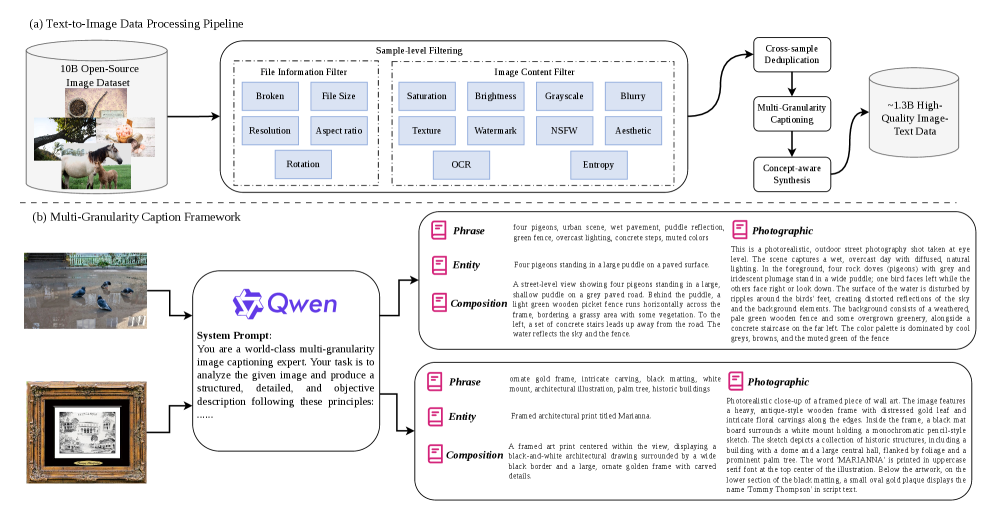
*Figure 8 — (a) 텍스트-이미지 데이터 처리 파이프라인, (b) 다중 세분화 캡션 프레임워크*

**파이프라인에서의 위치 (Figure 8a):**

```text
10B Open-Source Image Dataset      <- 출발점이 100억 장
  -> Sample-level Filtering
       File Info : Broken / File Size / Resolution / Aspect ratio / Rotation
       Content   : Saturation / Brightness / Grayscale / Blurry / Texture
                   Watermark / NSFW / Aesthetic / OCR / Entropy
  -> Cross-sample Deduplication
  -> Multi-Granularity Captioning   <- 이 절의 주제
  -> Concept-aware Synthesis
  -> ~1.3B High-Quality Image-Text Data
```

**출발점이 10B(100억 장)이고 최종이 1.3B — 약 7.7배를 버렸습니다.** 이 숫자는 논문 본문에 없고 Figure 8에만 있습니다.

**핵심 설계 — 4층을 "한 번의 호출로 JSON" 생성**

Qwen3-VL-32B-Instruct에게 **system prompt 하나**를 주고, **one pass로 4개 층위를 JSON 객체**로 받습니다. 4번 따로 부르지 않습니다. 부록 C가 이유를 직접 밝힙니다.

> The prompt fixes the objectivity and consistency principles, a step-by-step captioning procedure, the JSON output schema for the four layers, and a style guide, **so that the four granularities stay mutually consistent.**

**4층이 서로 모순되지 않게** 하려는 겁니다. 따로 뽑으면 같은 이미지에 대해 층마다 다른 소리를 할 수 있으니까요. 덤으로 비용도 1/4입니다.

**프롬프트 4부 구성 (1) — Core Principles 5개**

| 원칙 | 내용 |
|---|---|
| **Absolute Objectivity** | 눈에 보이는 것만. **"beautiful", "sad" 같은 주관어 금지.** 미적 특성은 색·빛·그림자·구도의 구체적 묘사로 표현 |
| **Physical/Logical Consistency** | 그림자가 광원과 맞아야 하고, 물체가 자연스럽게 놓여 있어야 함 |
| **Structured Description** | 전체 장면 → 배경 → 중경 → 전경 순. "left side", "center", "background" 같은 **방향어로 공간 배치 명시** |
| **Present Tense** | 현재형 (`"A man stands"`, `"Light falls on…"`) |
| **Rich and Specific Language** | 수량·크기·형태·색·질감에 정확한 형용사. 모호한 표현 금지 |

**(2) Steps — 5단계 절차**

1. 가장 중요한 부분 식별 — 주체, 색, **수량**, 위치
2. 배경 묘사 — 환경 유형(산/바다/도시/실내 카페), 조명, 분위기
3. 구도·스타일 — 매체, 시점, 양식(유화/애니메/포토리얼)
4. 주체 정보를 **구(phrase)로 추출**
5. 종합 요약

**(3) Output Format — 4층 JSON 스키마 (핵심)**

| 층위 | 스펙 (프롬프트 원문 요지) |
|---|---|
| **Entity** | 주요 객체/장면을 **짧은 구**로 명명. 예: `'Hollywood Sign in Los Angeles'`, `'A vibrant mosaic artwork'` |
| **Phrase** | 속성·색·형태·관련 객체를 **쉼표 구분 키워드**로. 예: `'iconic landmark, Hollywood Sign, cloudy sky, modern house, natural surroundings'`. ⭐ **"Very similar phrase only appear once"** — 중복 방지를 명시 |
| **Composition** | **딱 한 문장.** 주체 + 맥락(배경/환경)만 객관적으로. ⭐ **조명·시점·질감·주관적 해석은 넣지 말 것** |
| **Photographic** | 여러 문장. 이미지 카테고리, 추론된 스타일(재강조), ⭐ **인식된 텍스트(OCR)**, 주 개체, 고유명사, 조명·색 조건, 카메라 구도, 촬영 기법 |

**(4) Style Guide — 4개**

- 이미지 내용에서 스타일 추론 (photorealistic / cinematic / anime / oil painting / minimalist / cyberpunk)
- **불분명하면 photorealistic이 기본값**
- Composition과 Photographic 층에 **일관되게** 적용
- Photographic에 스타일을 명시하고, 조명·시점·분위기 묘사로 재강조

#### ⭐ 텍스트 렌더링의 데이터적 뿌리가 여기 있습니다

Photographic 층 스펙에 **`any recognized text (OCR)`** 를 넣으라고 명시합니다. Figure 8(b)의 실제 출력 예시가 이걸 보여줍니다.

> The word **'MARIANNA'** is printed in **uppercase serif font** at the **top center** of the illustration. Below the artwork, on the lower section of the black matting, a small oval gold plaque displays the name **'Tommy Thompson'** in **script text**.

**글자 내용 + 폰트 종류 + 위치 + 대소문자까지** 캡션에 들어갑니다. 학습 데이터에 "이 이미지에는 이 글자가 이 폰트로 여기에 있다"가 통째로 들어간다는 뜻입니다.

**CVTG-2K 0.887(오픈소스 2위, §11.2-d)이라는 성적이 모델 구조가 아니라 이 한 줄의 프롬프트 스펙에서 상당 부분 나온 셈입니다.** §9.1.2의 합성 텍스트 데이터 3.7%와 함께 두 축을 이룹니다.

#### 4층으로 나눈 이유 — 학습에서의 역할

실사용 프롬프트는 길이가 제각각입니다. "고양이" 두 글자부터 문단짜리까지요. 같은 이미지에 **길이·구체성이 다른 4개 캡션**을 붙여두면 모델이 양극단 모두에 대응하게 됩니다.

| 층위 | 대응하는 사용자 프롬프트 |
|---|---|
| Phrase | 키워드 나열형 (`"고양이, 창가, 햇빛"`) |
| Entity | 한 줄 요청 (`"창가의 고양이"`) |
| Composition | 배치 지정 (`"왼쪽에 고양이, 배경에 창문"`) |
| Photographic | 상세 연출 지정 (조명·렌즈·스타일까지) |

TIIF-Bench가 short/long 분할로 평가하는데 **Mage-Flow가 둘 다 강한 것(83.58 / 84.16)** 이 이 설계와 맞아떨어집니다. Klein-4B는 78.91 / 79.04로 둘 다 낮습니다(§13.16-d).

#### 영리한 부분 — Composition과 Photographic의 역할 강제 분리

- Composition: **"조명·시점·질감을 넣지 마라"**
- Photographic: **"조명·색·카메라 구도·기법을 넣어라"**

이렇게 안 하면 두 층이 사실상 같은 문단이 되어버립니다. 층위를 나눈 의미가 사라지죠.

#### 한계 — 논문이 안 밝힌 것

| 항목 | 상태 |
|---|---|
| 학습 중 4층을 **어떤 비율로 샘플링**했는지 | ⚠️ **샘플링한다는 사실은 명시**("the model samples from these descriptive caption channels") — **비율만 미공개** |
| 캡션 **품질 검증**(할루시네이션 필터링) | ❌ 언급 없음 |
| **다국어 캡션** 처리 (중국어 프롬프트는?) | ❌ 없음 |
| 캡션 생성 **비용** (수십억 장 × 32B 추론) | ❌ 없음 |

특히 첫 번째가 아쉽습니다. 논문은 "학습 중 이 캡션 채널들에서 샘플링해서 **길이와 구체성이 다른 프롬프트를 따르도록 배운다**"고 목적까지 밝히면서, 정작 **비율은 침묵합니다.**

그리고 텍스트 관련 추가 장치가 하나 더 있습니다 — **텍스트가 많은 이미지는 캡셔너가 글자를 인식해 "렌더링 지시문"으로 변환**하도록 별도 지시받습니다(§9.0.17-(4)).

그리고 **Qwen3-VL-32B 한 모델에만 의존**하므로 그 모델의 편향(특정 스타일 선호, 특정 개념 오인)이 1.3B 데이터 전체에 그대로 전이됩니다.

**(d) 개념 인식 균형(concept-aware balancing)** — 웹 데이터에는 긴 텍스트 렌더링, 희귀 객체, 드문 속성, 구조화된 레이아웃이 부족합니다. 폰트·레이아웃·언어·색·배경을 다양화한 합성 텍스트 샘플 등을 만들어 보충하고, phrase-level 캡션으로 개념 분포를 추정해 흔한 객체·자연 풍경의 비중을 낮춥니다.

#### 9.1.2 ⭐ 실제 데이터 구성 (Figure 9a) — 논문 본문에 없는 표

*왜 이 절을 두는가: 논문 본문은 "long-tailed 분포"라고만 쓰고 넘어가는데, Figure 9의 원형 차트에 **소수점 단위 구성비**가 다 들어 있습니다. 어떤 능력이 왜 강하고 약한지가 여기서 설명됩니다.*

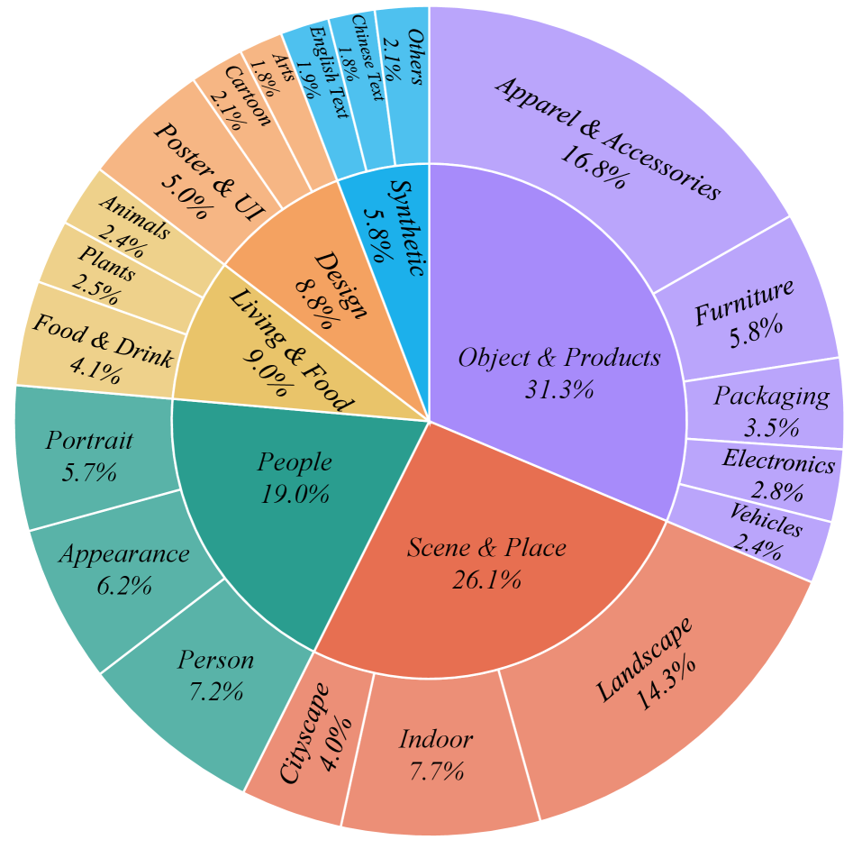
*Figure 9(a) — 생성 사전학습 데이터 구성 (약 1.3B pairs)*

| 대분류 | 비중 | 세부 |
|---|---|---|
| **Object & Products** | **31.3%** | Apparel & Accessories 16.8 · Furniture 5.8 · Packaging 3.5 · Electronics 2.8 · Vehicles 2.4 |
| **Scene & Place** | **26.1%** | Landscape 14.3 · Indoor 7.7 · Cityscape 4.0 |
| **People** | **19.0%** | Person 7.2 · Appearance 6.2 · Portrait 5.7 |
| Living & Food | 9.0% | Food & Drink 4.1 · Plants 2.5 · Animals 2.4 |
| Design | 8.8% | Poster & UI 5.0 · Cartoon 2.1 · Arts 1.8 |
| **Synthetic** | **5.8%** | **English Text 1.9 · Chinese Text 1.8** · Others 2.1 |

**읽어야 할 두 가지:**

1. **의류·액세서리 하나가 16.8%로 최대 단일 항목**입니다. 커머스 데이터가 대량으로 들어간 것으로 보입니다
2. **합성 텍스트가 3.7%뿐**(영어 1.9 + 중국어 1.8)입니다. §9.1-(d)의 "긴 꼬리 보충"이 바로 이 조각이고, CVTG-2K 0.887(§11.2-d)이라는 성적이 이 3.7%에서 나옵니다. 중국어가 영어보다 적은 것(1.8 vs 1.9)이 LongText-CN 약세(§11.2-b)와 방향이 맞습니다

### 9.2 생성 학습 커리큘럼

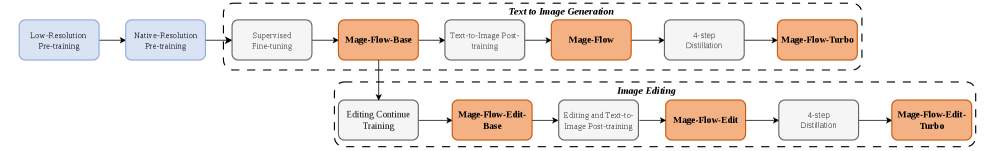
*Figure 11 — 전체 학습 파이프라인 개요*

| 단계 | 해상도 규칙 | **종횡비** | 데이터 | 목적 |
|---|---|---|---|---|
| Pre-train 1 | **256×256 고정** | ❌ **안 지킴** (정사각형 강제) | 1.2B | 낮은 비용으로 넓은 시각-언어 정렬 |
| Pre-train 2 | 512픽셀 **예산** | ✅ 원본 유지 | 600M | 고품질 부분집합으로 이동 |
| Pre-train 3 | 1024픽셀 **예산** | ✅ 원본 유지 | 300M | 세부 묘사, 레이아웃 충실도, 텍스트 렌더링, 미학 |
| **SFT** | 1024픽셀 예산 | ✅ 원본 유지 | 150M | 더 엄격한 필터 + 능력 표적 데이터 가중 → **Mage-Flow-Base** |

논문 원문(§5.1)이 이 구분을 명확히 합니다.

> First, we train on 1.2B pairs at a **fixed 256×256 resolution** …
> Second, we move to a 600M subset under a **512-pixel native-aspect-ratio regime**, where each sample keeps an approximately **512² pixel budget while preserving its original aspect ratio**.
> Third, … the **1024-pixel native-aspect-ratio regime** …

#### 핵심은 "긴 변"이 아니라 "픽셀 예산(pixel budget)"입니다

*왜 이걸 짚는가: `512-pixel regime`을 "긴 변을 512로 맞춘다"로 읽으면 §7.1의 packing이 왜 성립하는지 설명이 안 되기 때문입니다.*

**"긴 변 512"가 아니라 "총 픽셀 수를 512² = 262,144개 근처로 맞추고, 비율은 원본 그대로"** 입니다.

같은 예산으로 비율만 다르게 하면 이렇게 됩니다.

| 원본 비율 | 결과 크기 | 총 픽셀 |
|---|---|---|
| 1:1 | 512 × 512 | 262,144 |
| 4:3 | 592 × 444 | 262,848 |
| 16:9 | 683 × 384 | 262,272 |
| 4:1 (극단) | 1024 × 256 | 262,144 |

**세로로 긴 사진이든 파노라마든 "계산량은 같게, 모양은 원본대로"** 가 되는 겁니다.

#### 왜 이렇게 하냐면 — packing 때문입니다

이게 §7.1의 native-resolution packing과 딱 맞물립니다. Mage-VAE가 16배 다운샘플하므로:

```text
512 픽셀 예산  ->  latent 격자 32×32  ->  1,024 토큰
1024 픽셀 예산 ->  latent 격자 64×64  ->  4,096 토큰
```

**비율이 어떻든 토큰 수가 거의 일정**합니다. 그래서 "고정 토큰 예산으로 팩을 채운다"는 전략이 성립합니다.

실제 숫자로 확인하면:

| 학습 설정 | 팩 크기 | 1024² 기준 몇 장 |
|---|---|---|
| §8.2 커널 융합 ablation | 50,000 토큰 | 약 12장 |
| §11.5 SciForma 미세조정 | 20,480 토큰 | 5장 |

만약 "긴 변 512" 방식이었다면 4:1 이미지가 512×128(= 65,536 픽셀)이 되어 토큰 수가 4배 차이 나고, 팩 채우기가 훨씬 불규칙해집니다.

#### 그럼 1단계는 왜 정사각형 고정인가

**비용 때문입니다.** 12억 장을 봐야 하는 단계라 여기서의 효율이 전체를 지배합니다. 256×256 고정이면:

- 모든 샘플이 정확히 16×16 = **256 토큰**으로 동일
- packing이나 varlen 커널 없이 평범한 배치로 처리 가능
- 이 단계의 목표는 "넓은 시각-언어 정렬"이지 레이아웃 충실도가 아님

**비율 다양성은 2단계부터 배웁니다.** 즉 커리큘럼이 해상도만 올리는 게 아니라 **"정사각형 → 임의 비율"이라는 축도 같이 올립니다.**

#### 커리큘럼은 3축으로 동시에 진행됩니다

```text
해상도 :  256²        ->  512 예산   ->  1024 예산  ->  1024 예산
비율   :  정사각 고정  ->  원본 유지  ->  원본 유지  ->  원본 유지
품질   :  느슨        ->  중간      ->  엄격      ->  최엄격 (SFT)
데이터 :  1.2B        ->  600M      ->  300M      ->  150M
```

품질 축의 구체적 임계값은 §9.1 Table 5 참조(워터마크 0.5 → 0.3 → 0.1 → 0.05, 미학 4.5 → 5.5 → 6.0 → 6.5).

#### 추론 때와의 관계 — 학습에서 본 적 없는 크기로도 나갑니다

학습에서 본 건 512·1024 예산이지만, 추론은 **512~2048 임의 크기**를 지원합니다(README 기준). 이걸 가능하게 하는 게 §13.9의 **중심 원점 MSRoPE**입니다 — 좌표 원점이 이미지 한가운데라 크기가 달라져도 상대 좌표 체계가 일관됩니다.

> ⚠️ 다만 **2048²는 학습 예산(1024²)의 4배**입니다. 고해상도로 갈수록 학습 분포에서 멀어지는데, 논문은 이 외삽(extrapolation) 한계를 따로 검증하지 않습니다. §13.10에서 지적한 **"해상도 무관 static shift 6.0"** 과도 맞물리는 지점입니다 — 시퀀스 길이가 4배 늘어도 노이즈 일정이 그대로이기 때문입니다.

### 9.3 편집 데이터 (90M → 45M)

*왜: 편집 데이터는 "지시대로 안 바뀐 것", "엉뚱한 곳이 바뀐 것" 같은 오염이 심해서 걸러내지 않으면 학습이 망가지기 때문.*

원본 풀은 약 90M triple(소스 이미지, 지시문, 타깃 이미지):
- 오픈소스 편집 데이터셋 취합 약 50M
- 인하우스 합성 약 40M (저수준 이미지 처리 10M + 일반 의미 편집 30M)

**VLM 투표 필터**: 각 triple을 **Qwen3.5-9B 전문가 3명**이 평가. 세 전문가는 서로 다른 system prompt와 부분적으로 겹치는 평가 기준을 받아서 판단이 서로 보완적이 되게 설계. 각자 (1) 요청된 편집이 제대로 실행됐는가, (2) 무관한 영역이 보존됐는가, (3) 결과가 시각적으로 그럴듯한가를 확인하고 pass/fail로 변환. **3명 중 2명 이상 통과**만 유지 → 오픈소스 20M + 합성 25M = **45M**.

이후 **19개 편집 카테고리** 분류 체계를 수작업으로 정의하고, 데이터셋 단위로 카테고리에 매핑한 뒤 샘플링 비율을 조정해서 흔한 편집 유형이 gradient(기울기)를 독점하지 않게 합니다.

#### 9.3.1 ⭐ 편집 데이터 구성 (Figure 9b) — 역시 본문에 없는 표

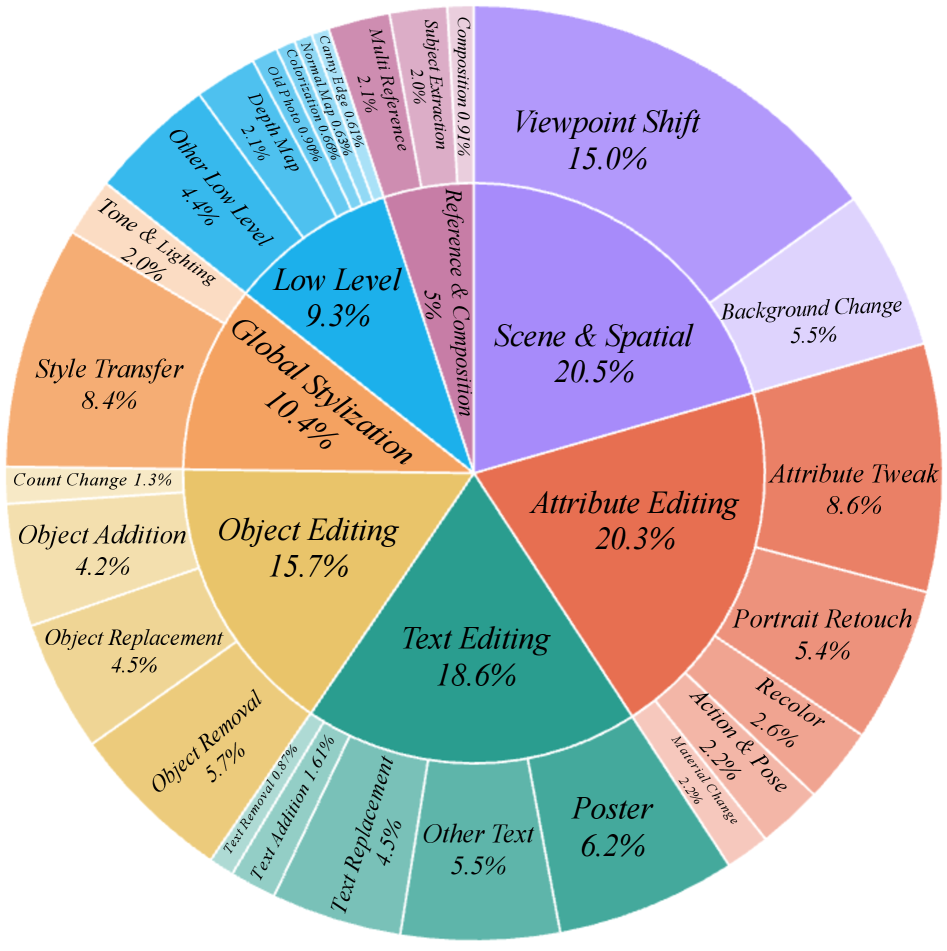
*Figure 9(b) — 편집 사전학습 데이터 구성 (45M triples)*

| 대분류 | 비중 | 세부 |
|---|---|---|
| **Scene & Spatial** | **20.5%** | **Viewpoint Shift 15.0** · Background Change 5.5 |
| **Attribute Editing** | **20.3%** | Attribute Tweak 8.6 · Portrait Retouch 5.4 · Recolor 2.6 · Action & Pose 2.2 · Material Change ~2.2 |
| **Text Editing** | **18.6%** | Poster 6.2 · Other Text 5.5 · Text Replacement 4.5 · Text Addition 1.61 · Text Removal 0.87 |
| Object Editing | 15.7% | Object Removal 5.7 · Object Replacement 4.5 · Object Addition 4.2 · Count Change 1.3 |
| Global Stylization | 10.4% | Style Transfer 8.4 · Tone & Lighting 2.0 |
| Low Level | 9.3% | Other 4.4 · Depth Map 2.1 · Old Photo 0.90 · Normal Map 0.69 · Canny 0.63 · Colorization 0.61 |
| Reference & Composition | 5.0% | Multi Reference 2.1 · Subject Extraction 2.0 · Composition 0.91 |

(세부 비율은 원형 차트에서 읽은 값이라 대분류 합과 반올림 오차가 있습니다.)

**Viewpoint Shift 15.0%가 단일 최대**입니다. 그리고 **Multi Reference가 2.1%뿐** — §9.3 본문의 "다중 이미지 편집 0.5% 이하"와 맞물려, 다중 참조 편집이 왜 곁다리인지 두 군데서 확인됩니다.

**편집 학습 2단계:**

| 단계 | 편집 데이터 | 생성 데이터 | 목적 |
|---|---|---|---|
| 1 | 35M | 35M | 소스 조건부 지시 따르기 습득 |
| 2 | 20M | 10M | 충실도 향상 |

편집 모델은 **Mage-Flow-Base에서 초기화**됩니다(별도 편집 모듈 없이, §7.2의 frame-aware RoPE만 추가).

> ⚠️ **다중 이미지 편집은 사실상 곁다리입니다.** 논문은 "두 단계 모두에서 multi-image editing 예제가 편집 데이터의 **0.5%를 넘지 않고**, 대부분은 단일 이미지 편집"이라고 명시합니다. README와 `pipeline.py`는 참조 이미지를 여러 장 받을 수 있게 열어두었지만(`ref_images[i]`에 리스트 전달), 학습 노출이 0.5%뿐이라 **품질을 기대하기 어렵습니다.** 코드 docstring도 "trained with up to 3, but more are accepted"라고만 씁니다.

생성 데이터를 섞는 이유는 **텍스트 렌더링·구성 능력·열린 생성 능력을 잃지 않기 위해서**입니다 (효과는 §11.3 Table 7 참조).

---

## 10. 후처리 — RL 정렬과 few-step 증류

*이 절을 두는 이유: Base 체크포인트만으로는 벤치마크 상위권에 못 가고, 실사용 속도도 안 나오기 때문입니다.*

### 10.1 Diffusion-NFT (RL 정렬)

*왜 이 방법인가: flow matching은 ODE 샘플링이 결정적이라 확률적 행동 분포가 없어서 표준 RL을 적용하기 어렵습니다. Flow-GRPO는 이걸 SDE로 바꿔서 푸는데, Diffusion-NFT는 아예 역과정을 건드리지 않고 순방향에서 푸는 방식이라 solver에 독립적입니다.*

```text
L_NFT(theta) = E[ r_i * || v_theta_plus(x_i,t, t, c) - v_i,t ||^2
              + (1 - r_i) * || v_theta_minus(x_i,t, t, c) - v_i,t ||^2 ]

  r_i        : 후보 샘플 i 의 보상을 [0,1] 로 정규화한 "최적일 확률"
  v_i,t      : 순방향 과정의 목표 velocity
  v_theta_plus / minus : Diffusion-NFT 가 정의하는 암묵적 positive / negative 정책
```

읽는 법: 보상이 높은 샘플(r이 1에 가까움)은 **positive 분기**로 끌어당기고, 보상이 낮은 샘플(r이 0에 가까움)은 **negative 분기**로 밀어냅니다. 우도(likelihood) 추정도, 특정 solver도 필요 없습니다.

**보상 라우팅 — 능력별로 심사관이 다름:**

| 능력 | 심사관 | 무엇을 보나 |
|---|---|---|
| 텍스트 렌더링 | PaddleOCR-VL-1.5 | 생성된 이미지를 읽어서 목표 문자열과 대조 (OCR 충실도) |
| 미학 | Qwen3.5-27B | 사진적 품질, 조명, 구도, 색 조화, 질감, 예술적 스타일 |
| 의미 이해 | Qwen3.5-27B | 구성적 추론, 객체 속성, 공간 관계, 개수 세기, 동작, 다중 개념 |
| 편집 | RationalRewards | 다차원 비평을 먼저 만든 뒤 스칼라 선호도 산출 (지시 준수, 소스 보존, 그럴듯함, 텍스트 품질) |

보상은 심사관 종류별로 **따로** 정규화합니다(척도가 다르니까). 각 RL 프롬프트에는 **능력 태그**가 붙어 있어 **정확히 하나의 평가자에게만** 라우팅되고, 한 프롬프트 안에서 서로 다른 평가자의 보상이 섞이는 일은 없습니다.

#### 10.1.1 ⭐ 보상 함수 상세 (부록 D)

*왜 이 절을 두는가: "Qwen으로 채점한다"는 한 줄로는 왜 이 RL이 작동했는지 알 수 없습니다. 부록 D에 실제 채점식과 프롬프트가 있고, **reward hacking(보상 해킹)을 막는 설계**가 꽤 정교합니다.*

**(1) 텍스트 렌더링 — 편집거리 기반 (식 15)**

단순 일치/불일치가 아닙니다.

```text
타겟 문자열을 공백 제거 + 소문자화 -> t̃
OCR 결과를 줄/구두점으로 분할, 같은 정규화 -> 집합 S

p(t) = 1                              (t̃ 가 어떤 s 의 부분문자열이면)
     = max(1 - d(t)/|t̃|, 0)           (아니면)
       d(t) = min_s min(Lev(s, t̃), |t̃|)     <- 타겟 길이로 캡

r_ocr = 타겟들의 평균      ... (식 15)
```

논문이 예시까지 답니다 — `"First Place Winner"`(정규화 `firstplacewinner`, 길이 16)에서 정확히 읽히면 **1점**, 한 글자 빠지면(`"First Place Winer"`) **1 − 1/16 ≈ 0.94**, 아예 없으면 **0점**.

**편집거리를 타겟 길이로 캡한 이유**가 명시돼 있습니다 — 없거나 심하게 뭉개진 문자열의 페널티가 **한 타겟 길이 이상 커지지 않게** 막기 위해서입니다. 안 그러면 긴 문자열 하나를 실패했을 때 보상이 음수 방향으로 폭주합니다.

OCR 호출은 **시스템 프롬프트 없이** 이미지 + 리터럴 지시문 `OCR:` 만 주고 **greedy, temperature 0**으로 디코딩합니다.

**(2) 미학 품질 — 단일 점수가 아니라 이진 질문 다발**

Qwen3.5-27B에게 **"1 또는 0만 출력하라"**고 지시하고, **기준 하나당 한 번씩 따로** 호출합니다. 보상은 답변들의 평균입니다.

```text
System: You are evaluating whether an AI-generated image satisfies the following
        visual quality criterion. ... Your job is to return 1 if the image fully
        satisfies the criterion, or 0 if it clearly fails.
        Do not explain or elaborate. Only output: 1 or 0.
```

논문이 밝힌 설계 의도가 중요합니다.

> Grading quality as many focused yes/no items, rather than eliciting a single opaque score, yields a **stable and less reward-hackable** signal.

**품질 기준 8개 (전문):**

| 기준 | 내용 |
|---|---|
| Naturalness | 사실적 사진처럼 보이는가 — 원근, 자연스러운 그림자, 물리적으로 타당한 조명 |
| Detail and Clarity | 질감·경계·세부가 선명하고 일관적인가 — 번짐·노이즈·블러 없음 |
| No Artifacts | 왜곡·워터마크·렌더링 글리치·불가능한 기하 없음 |
| **Face and Eye Anatomy** | 얼굴이 보이면 두 눈이 해부학적으로 정확한가 — 홍채 있는 동공 2개, 대칭 배치, 뒤틀림·중복·누락 없음. **얼굴이 없으면 1점** |
| **Hand and Finger Correctness** | 손이 보이면 손가락이 정확히 5개, 융합·과다·누락 없음, 관절 구조와 길이가 타당. **손이 없으면 1점** |
| **Body Proportions and Limbs** | 몸이 보이면 팔 2 + 다리 2, 관절 가동이 타당, 머리-몸 비율 합리적. **몸이 없으면 1점** |
| **Skin Texture Realism** | 피부가 보이면 모공·미세한 톤 차이 등 자연스러운 변화. 플라스틱·밀랍 같은 과도한 매끄러움 금지. **피부가 없으면 1점** |
| **Pose Coherence** | 포즈가 물리적으로 타당한가 — 팔다리가 불가능하게 교차하지 않고, 무게 분배가 말이 되고, 떠 있는 팔다리 없음. **사람이 없으면 1점** |

> 📌 **8개 중 5개가 인체 관련**입니다. 그리고 전부 **"해당 없으면 1점"** 규약을 씁니다. §10.2.1에서 본 **생성 증류셋의 People 39.8%**와 방향이 정확히 일치합니다 — 인물 품질을 RL과 증류 양쪽에서 동시에 밀어붙인 겁니다.

**(3) 의미 이해 — 같은 이진 방식, 기준만 교체**

미학과 **완전히 동일한 시스템 프롬프트·사용자 템플릿**을 쓰고, 기준만 "품질"에서 "프롬프트 정합성"으로 바꿉니다. 보상은 "yes" 비율.

| 검사 항목 | 내용 |
|---|---|
| Objects | 프롬프트가 지명한 모든 객체가 있는가, 빠진 것 없는가 |
| Attributes | 각 객체가 지정된 색·재질·형태·상태를 갖는가 |
| Counts | 정확한 개수인가 — 적지도 많지도 않게 |
| Spatial relations | 객체 간 위치·배치가 프롬프트대로인가 |
| Actions and interactions | 묘사된 동작·포즈·상호작용이 올바르게 그려졌는가 |
| Scene and setting | 배경·환경·전체 구도가 프롬프트와 맞는가 |
| **Faithfulness** | **프롬프트가 요청하지 않은 환각 객체·속성·변경이 없는가** |

논문의 근거: "정합성을 세밀한 충실도 검사로 분해하면 다중 객체 장면에 대해 **조밀하고 해석 가능한** 신호를 얻는다."

> ⚠️ **이 7개 항목이 GenEval의 평가 축과 거의 그대로 겹칩니다** (객체·속성·개수·공간 관계). §11.2-(a)에서 지적한 "GenEval 0.90은 RL 조준의 결과"라는 판단의 직접적 근거입니다. Position이 0.63 → 0.93으로 뛴 게 우연이 아닙니다.

**(4) 편집 — RationalRewards (식 16)**

소스 이미지 + 지시문 + 편집 결과를 함께 보고, **4개 측면을 1~4점 척도**로 평가하는 reasoning 보상 모델입니다.

| 측면 | 내용 |
|---|---|
| (i) text faithfulness | 편집 지시를 얼마나 따랐는가 |
| (ii) image faithfulness | 편집 영역 **바깥**의 원본 내용이 보존됐는가 |
| (iii) physical and visual quality | 그럴듯함, 아티팩트 없음 |
| (iv) text rendering | 편집된 글자의 가독성 (**글자가 없는 편집이면 not-applicable**) |

```text
ā = (1/|A|) * sum_{j in A} a_j        A = 해당되는 측면들의 집합
r_edit = clip( (ā - 1) / 3, 0, 1 )    ... (식 16)
```

전부 4점이면 1, 전부 1점이면 0으로 선형 매핑됩니다.

> 📌 (i)과 (ii)가 **정확히 GEdit-Bench의 G_SC(의미 일관성)와 대응**합니다. §11.3에서 본 **G_SC 8.965로 전체 1위 / G_PQ 하위권**이라는 비대칭이, 보상 함수 4개 중 화질이 (iii) 하나뿐이라는 구성과 맞아떨어집니다.

**학습 규모:**

| 항목 | 생성 | 편집 |
|---|---|---|
| 글로벌 배치 | 48 | 48 |
| 프롬프트 풀 | 약 20K (텍스트 10K, 미학 4K, 의미 6K) | 약 30K (편집 작업 전반 균등) |
| 스케줄 | 1단계 140스텝 (미학:텍스트:의미 = 1:1:1) → 2단계 60스텝 (2:4:1, 어려운 텍스트 강조) | 300스텝, 편집:생성 = 4:1 인터리브 |

RL 스텝 수가 200 / 300스텝으로 **매우 짧다**는 점이 눈에 띕니다. 배치 48이니 실제로 본 샘플은 1만 장 안팎 수준입니다.

### 10.2 few-step distillation (4스텝 증류)

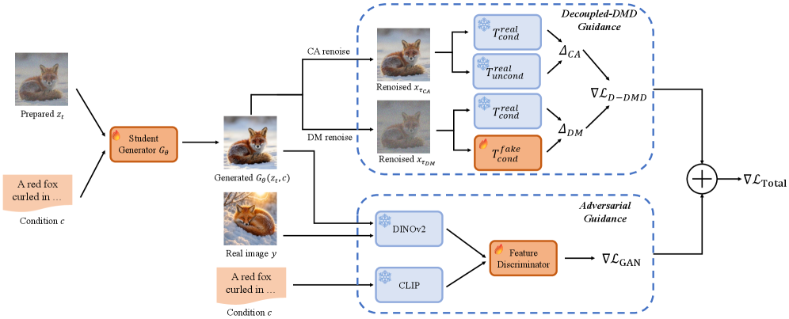
*Figure 13 — Student Generator가 만든 이미지를 두 갈래로 평가. 위: Decoupled-DMD Guidance (CA 항과 DM 항이 서로 다른 노이즈 수준에서 계산됨). 아래: Adversarial Guidance (동결 DINOv2/CLIP 특징 공간의 Feature Discriminator)*

*왜: 30스텝을 4스텝으로 줄이면 지각 품질이 급격히 취약해지는데, 분포 매칭만으로는 디테일이 뭉개지기 때문에 적대적 신호를 보조로 얹습니다.*

student는 대응하는 **동결 teacher 체크포인트(= RL 정렬된 모델)** 에서 초기화됩니다.

```text
grad L_Total = ( Delta_CA + Delta_DM )  +  lambda_GAN * grad L_GAN    ... (식 15)
               \_____ grad L_D-DMD _____/

Delta_CA = (w - 1) * ( T_cond_real(x at tau_ca) - T_uncond_real(x at tau_ca) )
   (teacher 의 조건부/무조건부 예측 차이 = CFG 방향을 student 에 주입)

Delta_DM = T_cond_real(x at tau_dm) - T_cond_fake(x at tau_dm)
   (teacher 예측과 학습 가능한 fake-score 네트워크 예측의 차이 = 분포 매칭)

tau_ca 와 tau_dm 는 서로 독립적인 노이즈 수준  <- Decoupled DMD 의 핵심
```

| 하이퍼파라미터 | 값 |
|---|---|
| guidance scale w | 7.5 |
| adversarial weight lambda_GAN | 0.13 |
| discriminator : generator 업데이트 비율 | 5 : 1 |
| student 스텝 수 | 4 |
| 증류 데이터 (생성) | 약 200K 엄선 프롬프트-이미지 쌍 |
| 증류 데이터 (편집) | 약 250K, 편집:생성 = 3:1 |

#### 10.2.1 ⭐⭐ 증류셋은 사전학습과 분포가 다릅니다 (Figure 14)

*왜 이 절이 중요한가: 논문 본문은 증류 데이터를 "약 200K / 250K"라는 **수량으로만** 언급하고 구성은 말하지 않습니다. 그런데 Figure 14를 펼치면 **사전학습과 분포가 크게 다르고**, 그 차이가 §11.3 벤치마크 결과를 거의 그대로 설명합니다.*

**생성 증류셋 (ImageGen, 200K)**

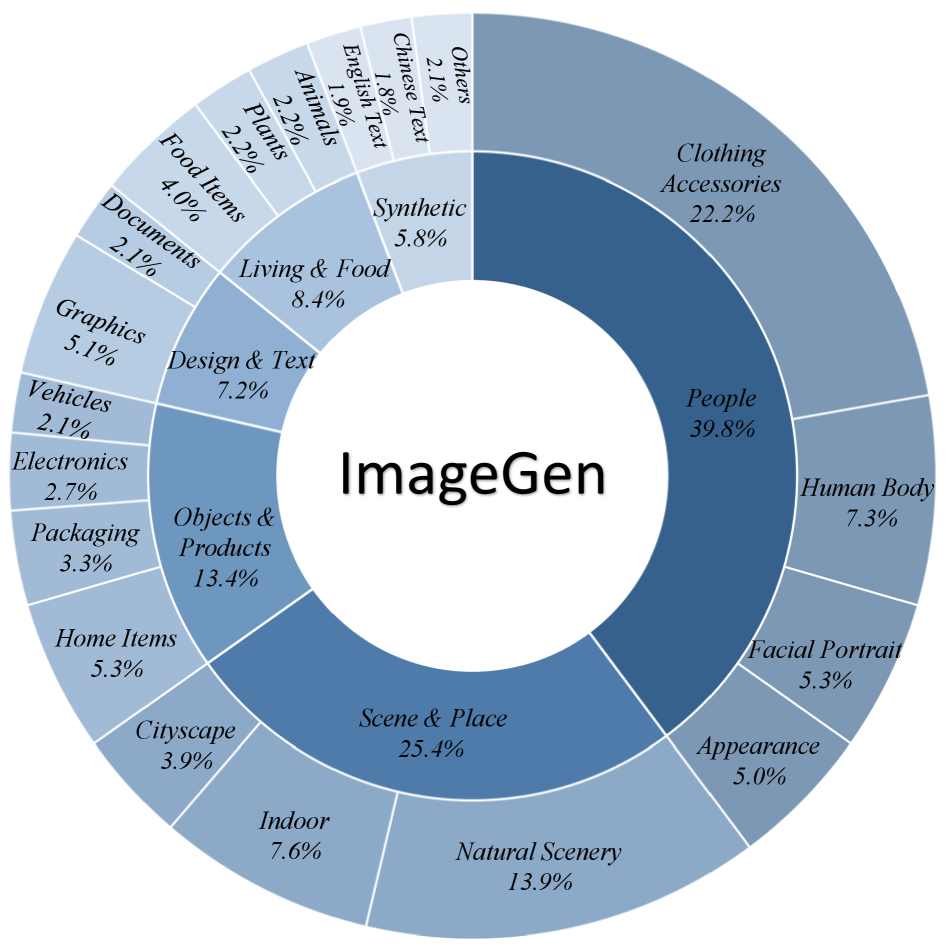
*Figure 14(a) — 생성 증류셋 구성*

| 대분류 | 사전학습 (§9.1.2) | **증류셋** | 겉보기 변화 |
|---|---|---|---|
| **People** | 19.0% | **39.8%** | +20.8%p (2.1배) |
| Scene & Place | 26.1% | 25.4% | −0.7 |
| **Object & Products** | 31.3% | **13.4%** | −17.9%p (0.43배) |
| Living & Food | 9.0% | 8.4% | −0.6 |
| Design (& Text) | 8.8% | 7.2% | −1.6 |
| **Synthetic** | 5.8% | **5.8%** | **동일** |

> ⚠️⚠️ **위 표는 그대로 읽으면 안 됩니다 — 분류 체계가 바뀌었습니다.**
>
> 세부 항목을 맞춰보면 **의류·액세서리가 "사물"에서 "사람"으로 재분류**됐습니다(§9.0.14-(4)).
>
> | 사전학습 (Fig 9a) | 증류셋 (Fig 14a) |
> |---|---|
> | **Object & Products > Apparel & Accessories 16.8%** | **People > Clothing Accessories 22.2%** |
> | Object & Products > Furniture 5.8% | Objects & Products > Home Items 5.3% |
> | People > Person 7.2% | People > Human Body 7.3% |
> | People > Portrait 5.7% | People > Facial Portrait 5.3% |

**항목별로 맞춘 실제 변화:**

| 실제 대응 | 사전학습 | 증류셋 | 변화 |
|---|---|---|---|
| 신체 (Person → Human Body) | 7.2% | 7.3% | — |
| 얼굴 (Portrait → Facial Portrait) | 5.7% | 5.3% | 소폭 ↓ |
| 외모 (Appearance) | 6.2% | 5.0% | 소폭 ↓ |
| **사람 본체 소계** | **19.1%** | **17.6%** | **거의 동일 (오히려 감소)** |
| **의류 (Apparel → Clothing)** | **16.8%** | **22.2%** | **1.32배 ↑** |
| **합계** | **35.9%** | **39.8%** | **1.11배** |

**정정된 결론:**

| | |
|---|---|
| ❌ 부정확 | "사람 데이터를 2.1배로 늘렸다" |
| ✅ 정확 | **"의류·액세서리를 1.32배 늘리고, 그걸 사물에서 사람 범주로 옮겼다"** |

다른 범주까지 맞춰보면 변화는 훨씬 온건합니다.

| 대분류 | 사전학습 | 증류셋 | 실제 변화 |
|---|---|---|---|
| Scene & Place | 26.1% | 25.4% | 거의 동일 |
| Living & Food | 9.0% | 8.4% | 거의 동일 |
| Synthetic | 5.8% | 5.8% | **동일** |
| Design | 8.8% | 7.2% | 소폭 감소 |
| 사물 (**의류 제외**) | **14.5%** | 13.4% | **거의 동일** |
| **의류** | 16.8% | **22.2%** | ⭐ **유일한 실질 증가** |

**생성 증류셋의 유일한 실질적 변화는 "의류를 1.3배 늘린 것"입니다.** 나머지는 사실상 그대로입니다. 그리고 **합성 텍스트 5.8%가 소수점까지 동일**하게 유지된 것(English 1.9 / Chinese 1.8 / Others 2.1)은, 텍스트 렌더링 능력을 4스텝 압축에서 잃지 않으려는 의도로 읽힙니다.

(편집 쪽 분석은 taxonomy가 겹치지 않아 영향받지 않습니다 — 아래 그대로 유효합니다.)

**편집 증류셋 (ImageEdit, 250K)**

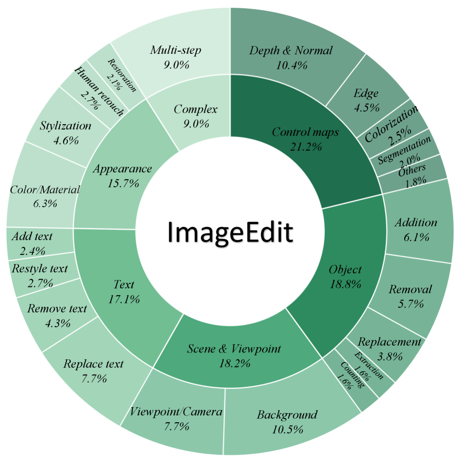
*Figure 14(b) — 편집 증류셋 구성*

| 대분류 | 사전학습 (§9.3.1) | **증류셋** | 변화 |
|---|---|---|---|
| **Control maps** (= Low Level) | 9.3% | **21.2%** | **+11.9%p (2.3배)** |
| Object | 15.7% | 18.8% | +3.1 |
| Scene & Viewpoint | 20.5% | 18.2% | −2.3 |
| Text | 18.6% | 17.1% | −1.5 |
| **Appearance** (Attribute + Stylization) | 30.7% | **15.7%** | **−15.0%p (0.51배)** |
| **Complex (Multi-step)** | — | **9.0%** | **신설** |

세부: Control maps = Depth & Normal 10.4 · Edge 4.5 · Colorization 2.5 · Segmentation 2.0 · Others 1.8 / Object = Addition 6.1 · Removal 5.7 · Replacement 3.8 · Extraction 1.6 · Counting 1.6 / Text = Replace 7.7 · Remove 4.3 · Restyle 2.7 · Add 2.4 / Appearance = Color·Material 6.3 · Stylization 4.6 · Human retouch 2.7 · Restoration 2.1

**두 가지가 눈에 띕니다.**

1. **Control maps를 2.3배로 증폭** — 사전학습에서 9.3%였던 저수준 작업(depth/normal/edge/segmentation)을 증류에서 21.2%까지 올렸습니다
2. **Multi-step(복합 편집) 9.0%를 새로 넣음** — 사전학습에는 없던 범주입니다

#### 10.2.2 이 분포 이동이 벤치마크 결과를 설명합니다

| 관찰 (§11.3) | 데이터 구성으로 본 원인 |
|---|---|
| ImgEdit **Style 4.91**로 자체 최고 | Style Transfer 8.4% + Stylization 4.6% |
| ImgEdit **Extract 3.94** (Klein 2.04 대비 **+1.90**) | Subject Extraction 2.0% + 증류 Extraction 1.6% — Klein엔 이 범주 자체가 없을 것 |
| ImgEdit **Hybrid 3.58**로 자체 최약 | Multi-step이 **증류셋에만 9%**, 사전학습엔 0% |
| **Turbo가 Base보다 ImgEdit 높음** (4.38 vs 4.28) | 증류셋이 Control maps·Multi-step을 보강했기 때문 (편집 쪽은 taxonomy 변경 없음) |
| **TextEdit만 Turbo가 나쁨** (12.77 vs 14.14) | 편집 증류셋 Text 17.1%로 사전학습 18.6%보다 **줄었음** |
| 다중 이미지 편집 약함 | Multi Reference 2.1% → 증류셋엔 **아예 없음** |

특히 마지막에서 두 번째가 깔끔합니다. **Turbo가 다른 편집 지표는 다 이기는데 TextEdit만 지는 이유**(§11.3)가, 증류셋에서 텍스트 비중을 줄인 것과 정확히 맞아떨어집니다.

> ⚠️ **논문이 말하지 않는 것 4가지**
>
> 1. **증류셋이 사전학습과 분포가 다르다는 사실 자체**를 본문에서 언급하지 않습니다. Figure 14 캡션도 "Composition of the distillation sets" 한 줄뿐입니다
> 2. People 19% → 39.8% 재배분의 **의도나 근거**를 설명하지 않습니다
> 3. 각 조각의 **절대 장수**가 없습니다 (비율만)
> 4. 생성 데이터의 **출처**를 "web data"로만 씁니다 (편집 쪽은 오픈소스/인하우스 구분이 있음)

**adversarial perceptual guidance의 효과 (Table 6):**

(a) 생성

| 모델 | GenEval | DPG | TIIF-S | TIIF-L | CVTG-2K | OneIG-EN | OneIG-CN | LongText-EN | LongText-CN |
|---|---|---|---|---|---|---|---|---|---|
| Mage-Flow-Turbo | 0.88 | **85.48** | **83.58** | **84.16** | **0.873** | **0.523** | **0.491** | **0.911** | **0.801** |
| w/o Adversarial | **0.89** | 85.37 | 80.99 | 82.03 | 0.847 | 0.518 | 0.486 | 0.882 | 0.783 |

(b) 편집

| 모델 | ImgEdit | GEdit-EN | GEdit-CN | TextEdit-Syn | TextEdit-Real |
|---|---|---|---|---|---|
| Mage-Flow-Edit-Turbo | **4.38** | **8.271** | **8.264** | **12.77** | **15.41** |
| w/o Adversarial | 4.29 | 8.003 | 8.025 | 11.64 | 14.77 |

생성 쪽 이득이 명확합니다(TIIF-Short +2.6, CVTG-2K +0.026, LongText-EN +0.029). GenEval만 0.89 → 0.88로 소폭 역전.

> **Finding 4 (논문 원문 요지)**: adversarial perceptual guidance는 4스텝이라는 강하게 압축된 궤적에서 생성 품질과 텍스트 편집 품질을 지키는 데 가장 유효하며, 일반 편집 벤치마크에서의 이득은 균일하지 않고 벤치마크에 따라 다르다.

이런 솔직한 서술은 좋습니다.

---

## 11. 실험 결과 — 숫자를 어떻게 읽어야 하나

*이 절을 두는 이유: 이 논문의 표는 그대로 읽으면 오해하기 쉬운 지점이 세 군데 있기 때문입니다.*

### 11.1 속도·메모리 프론티어 (Figure 4)

*왜: 이 논문의 진짜 주장은 절대 품질이 아니라 "품질 대비 비용"이기 때문.*

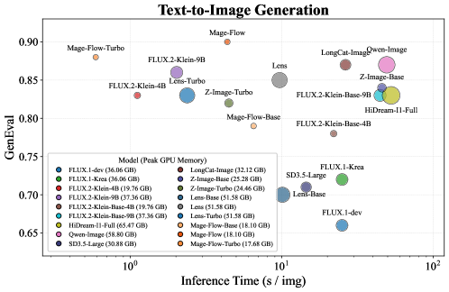
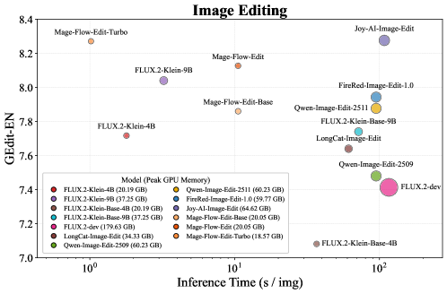
*Figure 4 — 가로축 = 이미지 1장 추론 시간(로그), 세로축 = 벤치마크 점수, 점 크기 = 최대 GPU 메모리. A100 1장 (FLUX.2-dev만 2장)*

Figure 4에서 읽어낸 최대 GPU 메모리:

| 생성 모델 | 메모리 | 편집 모델 | 메모리 |
|---|---|---|---|
| HiDream-I1-Full | 65.47 GB | FLUX.2-dev | **179.63 GB** (2장 합) |
| Qwen-Image | 58.80 GB | JoyAI-Image-Edit | 64.62 GB |
| Lens 계열 | 51.58 GB | Qwen-Image-Edit-2511 | 60.23 GB |
| FLUX.2-Klein-9B | 37.36 GB | FireRed-Image-Edit-1.0 | 59.77 GB |
| FLUX.1-dev / Krea | 36.06 GB | LongCat-Image-Edit | 34.33 GB |
| LongCat-Image | 32.12 GB | FLUX.2-Klein-9B | 37.25 GB |
| SD3.5-Large | 30.88 GB | FLUX.2-Klein-4B | 20.19 GB |
| Z-Image-Base / Turbo | 25.28 / 24.66 GB | **Mage-Flow-Edit(-Base)** | **20.05 GB** |
| FLUX.2-Klein-4B | 19.76 GB | **Mage-Flow-Edit-Turbo** | **18.57 GB** |
| **Mage-Flow(-Base)** | **18.10 GB** | | |
| **Mage-Flow-Turbo** | **17.68 GB** | | |

**추론 시간** (1024², A100 1장): Mage-Flow-Base 6.52초(30스텝) / Mage-Flow 4.37초(20스텝) / Mage-Flow-Turbo **0.59초**(4스텝). 편집은 Mage-Flow-Edit 10.55초(30스텝) / Mage-Flow-Edit-Turbo **1.02초**(4스텝).

**24GB 소비자급 GPU 한 장에 올라가는 유일한 축**이라는 게 이 그림의 요지입니다.

### 11.2 생성 벤치마크 (Table 8)

| 유형 | 모델 | 파라미터 | 스텝 | GenEval | DPG | TIIF-S | TIIF-L | CVTG-2K | OneIG-EN | OneIG-CN | LongText-EN | LongText-CN |
|---|---|---|---|---|---|---|---|---|---|---|---|---|
| 비공개 | Seedream 4.0 | – | – | 0.84 | 88.63 | – | – | 0.892 | 0.573 | 0.554 | 0.936 | 0.946 |
| 비공개 | GPT-Image-1 | – | – | 0.84 | 85.15 | 89.15 | 88.29 | 0.857 | 0.533 | 0.474 | 0.956 | 0.619 |
| 비공개 | Nano-Banana-Pro | – | – | 0.83 | 87.16 | – | – | 0.779 | 0.580 | 0.570 | 0.981 | 0.949 |
| 통합 | InternVL-U | 4B | 20 | 0.85 | 85.18 | 74.90 | 73.90 | 0.623 | 0.500 | 0.500 | 0.738 | 0.860 |
| 통합 | Ovis-U1 | 3.6B | 50 | 0.89 | 83.72 | 66.70 | 68.20 | 0.093 | 0.340 | 0.340 | 0.030 | 0.051 |
| 전문 | FLUX.1-dev | 12B | 50 | 0.66 | 83.84 | 71.09 | 71.78 | 0.496 | 0.434 | 0.245 | 0.607 | 0.005 |
| 전문 | FLUX.2-dev | 32B | 50 | 0.87 | 87.57 | **88.82** | **88.10** | **0.893** | **0.551** | 0.516 | **0.963** | 0.757 |
| 전문 | FLUX.2-Klein-4B | 4B | 4 | 0.83 | 85.53 | 78.91 | 79.04 | 0.628 | 0.500 | 0.364 | 0.649 | 0.068 |
| 전문 | FLUX.2-Klein-9B | 9B | 4 | 0.86 | 86.20 | 85.22 | 84.13 | 0.424 | 0.538 | 0.406 | 0.872 | 0.226 |
| 전문 | Qwen-Image | 20B | 50 | 0.87 | **88.32** | 86.14 | 86.83 | 0.829 | 0.539 | **0.548** | 0.943 | 0.946 |
| 전문 | HunyuanImage-3.0 | 80B | 50 | 0.72 | 86.10 | – | – | 0.765 | – | – | – | – |
| 전문 | LongCat-Image | 6B | 50 | 0.87 | 86.80 | 80.93 | 81.30 | 0.866 | 0.516 | 0.518 | 0.885 | **0.956** |
| 전문 | Z-Image-Base | 6B | 50 | 0.84 | 88.14 | 80.20 | 83.04 | 0.867 | 0.546 | 0.535 | 0.935 | 0.936 |
| 전문 | Lens-Turbo | 3.8B | 4 | 0.83 | 87.13 | 82.20 | 81.81 | 0.882 | 0.520 | 0.489 | 0.909 | 0.860 |
| **전문** | **Mage-Flow-Base** | **4B** | 30 | 0.79 | 86.26 | 82.50 | 83.19 | 0.851 | 0.542 | 0.509 | 0.904 | 0.792 |
| **전문** | **Mage-Flow** | **4B** | 20 | **0.90** | 86.49 | 82.19 | 84.70 | 0.887 | 0.536 | 0.505 | 0.944 | 0.823 |
| **전문** | **Mage-Flow-Turbo** | **4B** | 4 | 0.88 | 85.48 | 83.58 | 84.16 | 0.873 | 0.523 | 0.491 | 0.911 | 0.801 |

**⚠️ 짚어야 할 세 가지**

**(a) GenEval 0.90은 RL로 직접 조준한 결과입니다.**

Base 0.79 → RL 0.90은 무려 11포인트 점프인데, GenEval 세부(Table 9)를 보면 출처가 분명합니다.

| | Single | Two | Counting | Colors | **Position** | Attr.Bind | Overall |
|---|---|---|---|---|---|---|---|
| Mage-Flow-Base | 0.99 | 0.88 | 0.68 | 0.90 | 0.63 | 0.65 | 0.79 |
| **Mage-Flow** | 1.00 | 0.97 | 0.89 | 0.89 | **0.93** | 0.73 | **0.90** |
| Mage-Flow-Turbo | 1.00 | 0.97 | 0.80 | 0.88 | 0.90 | 0.73 | 0.88 |

Position이 0.63 → **0.93**, Counting이 0.68 → 0.89, Two-object가 0.88 → 0.97. 그런데 GenEval의 평가 축(위치·개수·색·속성 결합)은 RL 보상 심사관의 "의미 이해" 항목(구성적 추론, 객체 속성, 공간 관계, 개수 세기)과 **거의 그대로 겹칩니다.**

이게 부정행위라는 뜻은 아닙니다. 하지만 **"GenEval 오픈소스 1위"를 일반 능력 우위로 읽으면 안 됩니다.** 실제로 같은 RL을 거친 뒤에도 **DPG는 86.49**로 Qwen-Image 88.32, Z-Image-Base 88.14, Lens-RL 88.19보다 낮습니다. DPG는 길고 조밀한 프롬프트를 다루는 벤치라 RL로 단기 조준하기 어렵습니다.

**(b) 중국어 긴 텍스트가 약합니다.**

LongText-CN 0.823은 Qwen-Image 0.946, LongCat-Image 0.956, JoyAI-Image 0.963에 확실히 뒤집니다. 논문도 "중국어 분할은 데이터 보강 여지가 남아 있다"고 인정합니다.

다만 FLUX.2 계열(0.068~0.227), FLUX.1(0.002~0.005)에 비하면 압도적입니다. **"서구권 오픈모델 중에서는 중국어가 되는 편"** 정도의 위치입니다.

**(c) Turbo가 Base보다 높습니다** (GenEval 0.88 vs 0.79).

증류 대상이 Base가 아니라 **RL 정렬된 체크포인트**이고, CFG가 student에 내재화되기 때문입니다. 정상적인 현상이지만 "4스텝이 30스텝보다 좋다"로 오독되기 쉬운 표기입니다.

**(d) CVTG-2K는 확실히 강합니다.**

Mage-Flow 0.887은 오픈소스 중 FLUX.2-dev(32B) 0.893에 이은 2위이고, Lens-Turbo 0.882·Z-Image 0.867·LongCat 0.866보다 앞섭니다. 영역별로 보면 2영역 0.902, 3영역 0.902, 4영역 0.902, 5영역 0.850으로 **영역 수가 늘어도 잘 버팁니다**(FLUX.2-Klein-9B는 0.464 → 0.399로 급락). 여러 영역에 영어 글자를 넣는 작업에는 확실히 좋은 선택지입니다.

**(e) ⚠️ 표에 잘 안 보이는 약점 — OneIG Diversity가 전체 최하위입니다.**

Table 8은 OneIG를 Overall 하나로만 싣지만, 세부(Table 12)를 펼치면 **Diversity(다양성)** 항목에서 Mage-Flow가 26개 비교 모델 중 **꼴찌**입니다.

| | Base | → RL | → Turbo |
|---|---|---|---|
| Mage-Flow (OneIG-EN Diversity) | 0.159 | 0.124 | **0.105** ← 전체 최하위 |
| Mage-Flow (OneIG-CN Diversity) | 0.163 | 0.119 | **0.099** ← 전체 최하위 |
| 참고: Kolors 2.0 / Lens-Base / Nano-Banana-Pro | 0.300 / 0.262 / 0.250 | | |

RL·증류가 다양성을 좁히는 건 다른 모델도 마찬가지지만(Lens 0.262→0.160, Z-Image 0.194→0.139), Mage-Flow는 **Base 단계부터 이미 가장 낮습니다.** §12.2의 워터마크 부호 고정과 연결될 가능성이 있는데 인과는 단정할 수 없습니다. 전체 비교표와 논의는 **§13.16-(f)** 참조.

### 11.3 편집 벤치마크 (Table 13, 15) — 여기가 가장 흥미롭습니다

| 유형 | 모델 | 파라미터 | 스텝 | ImgEdit | GEdit-EN | GEdit-CN | TextEdit-Syn | TextEdit-Real |
|---|---|---|---|---|---|---|---|---|
| 비공개 | Seedream 4.0 | – | – | 4.30 | 7.701 | 7.692 | 14.90 | 18.54 |
| 비공개 | Nano-Banana-Pro | – | – | 4.37 | 7.738 | 7.799 | – | – |
| 통합 | Emu3.5 | 34B | – | 4.41 | – | – | 9.34 | 14.05 |
| 전문 | Step1X-Edit-v1.2 | 19B | 50 | 3.95 | 7.480 | 7.467 | 9.26 | 12.02 |
| 전문 | FLUX.1-Kontext-dev | 12B | 28 | 3.71 | 6.462 | 1.857 | 12.14 | 14.31 |
| 전문 | FLUX.2-dev | 32B | 50 | 4.35 | 7.413 | 7.278 | 11.86 | 14.71 |
| 전문 | FLUX.2-Klein-9B | 9B | 4 | 4.18 | 8.040 | 8.055 | 12.73 | 15.75 |
| 전문 | Z-Image-Edit | 6B | 50 | 4.30 | 7.570 | 7.540 | – | – |
| 전문 | Qwen-Image-Edit-2511 | 20B | 50 | 4.51 | 7.877 | 7.819 | 13.53 | 16.81 |
| 전문 | LongCat-Image-Edit | 6B | 50 | 4.45 | 7.748 | 7.731 | 12.46 | 14.89 |
| 전문 | FireRed-Image-Edit-1.0 | 20B | 50 | **4.56** | 7.943 | 7.887 | **15.19** | **17.23** |
| 전문 | JoyAI-Image-Edit | 16B | 50 | 4.46 | **8.276** | 8.125 | 14.80 | **17.23** |
| **전문** | **Mage-Flow-Edit-Base** | **4B** | 30 | 4.28 | 7.860 | 7.970 | 13.63 | 15.57 |
| **전문** | **Mage-Flow-Edit** | **4B** | 30 | 4.34 | 8.127 | 8.123 | 14.14 | 16.26 |
| **전문** | **Mage-Flow-Edit-Turbo** | **4B** | 4 | 4.38 | 8.271 | **8.264** | 12.77 | 15.41 |

**⭐ GEdit을 분해하면 그림이 완전히 달라집니다 (Table 15).**

| 모델 | EN G_SC(의미일관성)↑ | EN G_PQ(지각품질)↑ | EN G_O(종합)↑ |
|---|---|---|---|
| Seedream 4.5 (비공개) | 8.268 | 8.167 | 7.820 |
| Nano-Banana-Pro (비공개) | 8.102 | **8.344** | 7.738 |
| FireRed-Image-Edit | 8.363 | 8.245 | 7.943 |
| JoyAI-Image-Edit | 8.829 | 8.120 | 8.276 |
| Qwen-Image-Edit-2511 | 8.297 | 8.202 | 7.877 |
| LongCat-Image-Edit | 8.128 | 8.177 | 7.748 |
| FLUX.2-Klein-9B | 8.592 | 7.993 | 8.040 |
| **Mage-Flow-Edit-Base** | 8.685 | **7.495** | 7.860 |
| **Mage-Flow-Edit** | 8.893 | **7.766** | 8.127 |
| **Mage-Flow-Edit-Turbo** | **8.965** | **7.970** | 8.271 |

**Mage-Flow-Edit은 "지시는 압도적으로 잘 따르지만, 결과 이미지의 화질 자체는 하위권"입니다.**

- G_SC(의미 일관성)는 비공개 모델 포함 **전체 1위** (8.965)
- G_PQ(지각 품질)는 비교 대상 중 **사실상 꼴찌권** (7.50~7.97 vs 경쟁 모델 8.0~8.34)
- 종합 점수가 높은 건 SC가 워낙 높아서 평균이 끌어올려진 결과

4B 백본에 12층이라는 얕은 구조를 생각하면 납득 가는 trade-off(절충)이고, RL 보상이 "지시 준수"를 겨냥한 결과이기도 합니다. **실사용 인상은 종합 점수보다 낮게 느껴질 수 있습니다.**

**TextEdit에서는 Turbo가 명확히 손해입니다.**

| | TextEdit-Syn | TextEdit-Real |
|---|---|---|
| Mage-Flow-Edit (30스텝) | **14.14** | **16.26** |
| Mage-Flow-Edit-Turbo (4스텝) | 12.77 | 15.41 |

다른 지표에서는 Turbo가 다 이기는데 글자 편집만 반대입니다. 실용적 결론: **글자 편집이 필요하면 Turbo 말고 RL 30스텝 버전을 쓰세요.**

**ImgEdit 카테고리별 (Table 14):** Mage-Flow-Edit-Turbo 4.38은 FireRed 4.56, Qwen-Image-Edit-2511 4.51, LongCat 4.45보다 낮습니다. 강한 곳은 Style 4.91, Adjust 4.48, Replace 4.48이고, 약한 곳은 Hybrid(복합 편집) 3.58과 Extract(추출) 3.94입니다.

### 11.4 편집 학습에 생성 데이터를 섞는 효과 (Table 7)

*왜: "생성 데이터를 섞으면 생성 능력을 보존한다"는 주장이 실제로 편집 성능에도 도움이 되는지 확인하는 실험.*

| 모델 | 생성 데이터 | ImgEdit | GEdit-EN | GEdit-CN | TextEdit-Syn | TextEdit-Real |
|---|---|---|---|---|---|---|
| Mage-Flow-Edit | ✓ | 4.34 | 8.127 | 8.123 | 14.14 | 16.26 |
| Mage-Flow-Edit | – | 4.34 | 7.991 | 8.062 | 14.29 | 15.95 |
| Mage-Flow-Edit-Turbo | ✓ | **4.38** | 8.271 | 8.264 | 12.77 | 15.41 |
| Mage-Flow-Edit-Turbo | – | 4.20 | 7.984 | 8.050 | 12.66 | 15.20 |

전체 스텝 모델(30스텝)에서는 차이가 미미합니다(ImgEdit 동일, TextEdit-Syn은 오히려 살짝 손해). 반면 **4스텝 Turbo에서는 ImgEdit 4.20 → 4.38로 확실히 개선**됩니다.

> **Finding 5 (논문 원문 요지)**: 편집 학습에 생성 데이터를 섞는 것은 4스텝 모델의 폭넓은 편집 강건성(ImgEdit로 측정)에 가장 뚜렷한 효과가 있고, GEdit은 비슷한 수준으로 균일하게 개선되지는 않는다.

### 11.5 부록 — SciForma 미세조정 (Table 18, 19)

*왜: "연구 친화적 베이스라인"이라는 주장의 유일한 실증이라 중요합니다.*

과학 다이어그램 생성으로 downstream fine-tuning(하류 미세조정) 가능성을 검증합니다.

**데이터 혼합 (단일 단계):**

| 출처 | 이미지 수 | Packs | 가중치 |
|---|---|---|---|
| SciFormaData-700K (1024px) | 646,132 | 161,536 | 50% |
| SciFormaData-700K (768px) | 663,353 | 82,944 | 20% |
| 자연 풍경 | 357,009 | 74,269 | 15% |
| 텍스트 렌더링 | 74,866 | 15,360 | 10% |
| 포스터 디자인 | 38,290 | 10,084 | 5% |
| **합계** | **1,779,650** | **344,193** | 100% |

**학습 설정**: B200 8장, 130k 스텝, 1024픽셀 native 비율, 시퀀스 패킹 20,480 토큰 고정, AdamW, 학습률 1e-5 상수, 500스텝 warmup, EMA decay 0.99(100스텝마다).

**결과 (SciFormaBench-2K, 0~100):**

| 모델 | 파라미터 | Component | Arrow | Text | Overall |
|---|---|---|---|---|---|
| FLUX.2-klein-Base (zero-shot) | 4B | 50.04 | 18.45 | 10.95 | 27.05 |
| FLUX.2-klein-Base (zero-shot) | 9B | 51.50 | 25.20 | 23.60 | 33.87 |
| Mage-Flow-Base (zero-shot) | 4B | 56.79 | 35.82 | 28.17 | 40.80 |
| **Mage-Flow-SciForma** | 4B | **70.49** | **60.52** | **52.60** | **61.61** |

zero-shot 40.80 → 61.61(+20.81), 특히 Arrow(화살표 방향 정확도)가 +24.70. 9B 도메인 특화 모델(SciForma-9B-Base)과 정성적으로 동급이라고 보고합니다. **파인튜닝 베이스로서의 가치는 이 실험이 뒷받침합니다.**

---

## 12. 코드 리뷰 — 논문에 없는 것들

*이 절을 두는 이유: 이 저장소에는 논문에 한 줄도 언급되지 않은, 사용에 직접 영향을 주는 장치가 두 개 들어 있기 때문입니다.*

공개된 건 **추론 코드 4,372줄뿐**입니다.

| 파일 | 줄 수 | 역할 |
|---|---|---|
| `mage_flow/pipeline.py` | 762 | t2i / 편집 파이프라인, packed CFG, 워터마크 삽입/검출 |
| `mage_flow/models/modules/mage_layers.py` | 725 | MMDiT 블록, RoPE, varlen attention |
| `mage_flow/models/modules/text_encoder.py` | 707 | Qwen3-VL 래퍼 + 콘텐츠 스크리닝 |
| `mage_flow/models/modules/mage_vae.py` | 651 | Mage-VAE 인코더/디코더 |
| `mage_flow/models/mage_flow.py` | 364 | 모델 조립 |
| `mage_flow/models/modules/mage_text.py` | 259 | 콘텐츠 정책 프롬프트 |
| `mage_flow/models/modules/mage_latent.py` | 119 | **Gaussian Shading 워터마크** |
| 기타 (app/inference/utils/attn) | 785 | Gradio, CLI |

### 12.1 ⭐ "one-step diffusion"의 실체

`mage_flow/models/modules/mage_vae.py`의 실제 추론 경로입니다.

```python
# encode: z_t 는 0 텐서, t = 0
z_t = torch.zeros(B, z_ch, H//ps, W//ps)
t   = torch.zeros(B)
out = self.dconv_encoder.forward_pred(z_t, t, x)

# decode: noise 도 0 텐서, t = 0
noise = torch.zeros(B, 3, H, W)
t     = torch.zeros(B)
return self.decoder_model.forward(noise, t, cond)
```

**추론 시에는 확산이 아닙니다.** 노이즈 입력이 상수 0이고 timestep도 항상 0이라, 완전히 결정적인 feedforward(순전파) 1패스입니다.

더 결정적으로, 생성자에서 이런 최적화가 돕니다.

```python
# adaLN modulation 은 t 에만 의존하고 우리는 항상 t=0 에서 돈다.
# 미리 계산해서 MLP 를 통째로 버린다 (약 37M 파라미터 절약)
self._freeze_adaln_cache()
```

**AdaLN MLP 37M 파라미터가 상수로 접혀서 사라집니다.** 확산 형식(diffusion formulation)은 순전히 학습 장치였고, 배포된 Mage-VAE는 **"확산 목적함수로 학습된 convolution 코덱"** 입니다.

이게 나쁘다는 게 아닙니다 — 오히려 이래서 빠릅니다. 다만 "one-step diffusion encoding/decoding"이라는 명명이 실제보다 화려하게 들린다는 점은 알아두는 게 좋습니다.

### 12.2 ⭐⭐ 강제 워터마크 (논문에 한 줄도 없음)

`mage_flow/pipeline.py`의 생성 루프:

```python
x = get_noise(..., seed=seeds[i])                    # <- 만들고
x = encode_noise(tuple(x.shape[1:]), key=gs_key_int, # <- 즉시 버림
                 seed=seeds[i], device=dev, dtype=torch.bfloat16)
```

초기 노이즈가 `randn`(무작위 정규분포)이 **아니라 Gaussian Shading 워터마크 노이즈**입니다. `get_noise` 결과는 곧바로 덮어써지는 죽은 코드입니다. 토글 옵션은 없습니다 — 파이프라인 docstring에도 "Real outputs always carry a Gaussian-Shading watermark in the initial noise (**no toggle**)"라고 적혀 있습니다.

**동작 원리** (`mage_latent.py`):

```text
msg       = SHA-256 으로 payload "MageFlow" 를 256비트로 확장   (payload 에만 의존)
pad, pos  = key 로 시드된 난수 -> 원소별 XOR 마스크와 메시지 인덱스  (key 에만 의존)
half      = msg[pos] XOR pad                                   (= 0 또는 1)
u         = Uniform(0,1)  샘플                                  (seed 에 의존)
z         = ndtri( (half + u) / 2 )      # ndtri = 정규분포 누적함수의 역함수
```

**⚠️ 직접 검증해본 결과, 여기에 주목할 성질이 있습니다.**

- `half = 0`이면 `ndtri`의 인자가 (0, 0.5) 구간 → z가 **항상 음수**
- `half = 1`이면 인자가 (0.5, 1) 구간 → z가 **항상 양수**
- 그런데 `half`는 **key와 payload로만 결정되고 seed와 무관**합니다

즉 **모든 latent 원소의 부호(sign)가 seed와 상관없이 고정**되어 있고, seed는 크기(magnitude)만 바꿉니다. 1024x1024 생성이면 128×64×64 = 524,288개 원소의 부호 패턴이 매 생성마다 **동일**합니다.

(직접 계산으로 확인: 기본 키 `20260720`에서 +1 부호 비율 0.5015로 균형은 맞음. 원소별 주변 분포(marginal distribution)도 여전히 N(0,1)을 유지합니다 — 모델 입장에서 "이상한 노이즈"는 아닙니다.)

**함의**: 시드를 바꿔서 얻는 **diversity(다양성)** 가 진짜 가우시안 샘플링보다 줄어들 여지가 있습니다. 부호가 고정되고 크기만 변하는 셈이니까요. 논문·README 어디에도 이 설계에 대한 설명이 없고, **벤치마크 수치가 이 워터마크 노이즈로 측정된 것인지, 학습 시 노이즈 분포와 어떻게 맞췄는지**도 불명확합니다.

**키 관리**: 기본 키 `20260720` 하드코딩. 환경변수 `MAGEFLOW_GS_KEY` 또는 `~/.mageflow/gs_key` 파일로 교체 가능.

**탐지**: `invert_to_noise`가 flow ODE를 역전(빈 프롬프트, cfg=1, Tree-Ring/Gaussian-Shading 표준 설정)해 초기 노이즈를 복원하고, 부호를 다수결로 읽어 payload를 복구합니다. 이 부분은 잘 만들어져 있습니다(Binomial 정규근사로 p-value까지 계산).

### 12.3 ⭐⭐ 강제 콘텐츠 필터 (논문에 한 줄도 없음)

모든 프롬프트가 **conditioning(조건)을 만드는 것과 동일한 Qwen3-VL 가중치로** 정책 분류를 거칩니다. 옵트아웃 없고, **fail-closed**(스크리닝 중 어떤 오류가 나도 차단). 차단되면 **순백색 이미지**가 반환됩니다(카테고리나 이유는 이미지에 표시되지 않고 콘솔에만 출력).

`mage_text.py`의 정책 프롬프트는 6개 범주(sexual / hate / self_harm / violence / copyright / public_figure)이고, 매우 광범위합니다.

| 범주 | 특징적인 부분 |
|---|---|
| copyright | Disney·Marvel·DC·Nintendo·Pokémon·Netflix 등 프랜차이즈와 캐릭터 이름이 하드코딩. "**이름이 언급되면 스타일이 아무리 generic해도 위반**" |
| public_figure | 각국 정상·연예인·운동선수 실명 나열. 인식 가능하게 요청되면 위반 |
| self_harm | 범위가 특히 넓음. **"안개 낀 절벽 끝에 등 돌리고 선 사람"**, **"다리 난간 위 실루엣"**, **"어두운 책상에서 노트의 목록을 내려다보는 흐릿한 형체"** 가 모두 차단 예시로 명시 |
| violence | "documentary / grim / cinematic / historical" 같은 연출 프레이밍은 면제 사유가 안 됨 |

**편집은 멀티모달 심사**입니다. 결정적 규칙이 이렇게 적혀 있습니다.

> 소스 이미지의 대상을 실존 공인이나 저작권 캐릭터로 **인식하거나 이름을 댈 수 있다면, 그 인식 자체가 위반**이다. "요청된 편집이 배경/스타일/색 변경뿐이니 괜찮다"는 논리는 허용되지 않는다.

즉 **소스 이미지에 유명인이나 캐릭터가 있으면 "배경만 바꿔줘"여도 차단**됩니다.

**연구 관점에서의 함의 두 가지:**

1. **벤치마크 재현 시 거부율이 개입**할 수 있습니다. 차단된 프롬프트는 백색 이미지로 채점에 들어갑니다
2. **논문의 0.59초 지연에는 이 스크리닝 시간이 포함되어 있지 않습니다.** Qwen3-VL로 최대 160~192 토큰을 생성하는 별도 패스가 매 프롬프트마다 돕니다

### 12.4 ⚠️ 배치 구성에 따라 결과가 달라짐 (재현성 함정)

RoPE의 frame 인덱스가 **shape 리스트에서의 위치**로 결정됩니다.

```python
# mage_layers.py — MageFlowEmbedRope._compute_video_freqs 호출부
for idx, fhw in enumerate(video_fhw):
    freqs_frame = freqs_pos[0][idx : idx + frame]
```

그런데 `pipeline.py`에서 여러 샘플을 pack에 넣으면 shape들이 **평평한 하나의 리스트**로 이어붙습니다.

```python
# generate_edits 안
shape_seq.append((1, gh, gw))              # 주석: "target frame idx 0"
shape_seq.extend(s[0] for s in ref_shapes) # 주석: "ref_j frame idx j"
```

주석은 "타깃은 frame 0"이라고 되어 있지만, 첫 샘플이 [타깃 0, 참조 1]을 쓰면 **두 번째 샘플의 타깃은 frame 인덱스 2**를 받습니다. 생성(t2i)도 마찬가지로 샘플 i가 frame 인덱스 i를 받습니다.

결과적으로 **같은 프롬프트·같은 시드라도 혼자 돌릴 때와 배치로 돌릴 때 출력이 달라집니다.**

학습 시 packing도 같은 코드 경로였다면 모델이 이 변동에 강건하게 학습됐을 수 있으므로 "버그"라고 단정하지는 않겠습니다. 다만 **벤치마크를 재현하거나 결과를 비교할 때는 배치 크기 1로 고정하는 게 안전합니다.**

### 12.5 자잘한 것들

| 항목 | 내용 |
|---|---|
| 죽은 코드 1 | `txt_vec = torch.zeros(...)`를 만들어 `temb`에 더함 (`mage_flow.py`). 아무 효과 없음. HF config의 `vec_in_dim: 0` / `vec_type: null`이 그 짝 |
| 죽은 코드 2 | `img_ids`를 파이프라인에서 정성껏 계산하지만 `_velocity`가 트랜스포머에 넘기지 않음. RoPE는 `img_shapes`에서만 계산됨 |
| **죽은 config 필드 다수** | `depth_single_blocks`, `mlp_ratio`, `theta`, `qkv_bias`, `guidance_embed`, `rope_type`, `double_block_type`, `vec_*`, `time_type`이 전부 `load_from_repo`의 `_meta` 폐기 목록에 있음 — **읽히지 않음.** FLUX 계열 config 스키마의 잔재이고, `depth_single_blocks: 0`이 "single block을 안 쓴다"가 아니라 "그런 코드가 없다"는 뜻임을 보여줌 → **§13.8.2** |
| **마지막 블록의 텍스트 MLP** | 12번째 블록이 갱신한 `encoder_hidden_states`는 뒤에 attention이 없어 출력에 전혀 기여하지 않음. `txt_mlp`(75.5M) 몫이 매 스텝·CFG 2배로 버려짐 → **§13.8.4** |
| 보안 대응 흔적 | `_safe_subpath`로 경로 순회(CWE-22 / CodeQL `py/path-injection`) 방어. 사내 보안 리뷰를 거친 코드로 보임 |
| bf16 재현성 | `get_timestep_embedding`을 diffusers 것 대신 vendoring(직접 포함)함. 주파수 테이블을 bf16으로 내림하는 방식으로 학습했기 때문에, diffusers의 fp32 버전을 쓰면 출력이 미묘하게 나빠진다고 주석에 명시 |
| 의존성 | torch 2.13, transformers 5.5, diffusers 0.38, flash-attn 2.8.3으로 매우 최신에 고정 |
| 라이선스 | MIT. 다만 README는 "research purposes only", "controlled research settings"라고 명시. 상용 사용 전 HF 모델 카드 확인 필요 |
| 편집 전처리 | VL 조건 이미지의 긴 변을 **384**로 제한(`vl_cond_long_edge`). 학습 전처리와 맞추기 위함. VAE 경로는 전체 해상도 유지 |

### 12.6 공개 / 비공개 정리

| 항목 | 상태 |
|---|---|
| 추론 코드 (t2i / 편집 / Gradio / CLI) | ✅ 공개 (4,372줄) |
| 6종 체크포인트 | ✅ 공개 |
| Mage-VAE 가중치 | ✅ 공개 (FLUX.2-VAE 드롭인 교체 가능) |
| DiT 학습 코드 | ❌ |
| Mage-VAE 3단계 학습 코드 | ❌ |
| 융합 CUDA 커널 | ❌ |
| Diffusion-NFT / 증류 코드 | ❌ |
| 데이터셋 (필터 임계값 외 상세) | ❌ |
| **총 학습 compute** | ❌ **논문에 아예 없음** |
| Mage-VL (이해 모델) | 🔜 "coming soon" |

Z-Image가 314K H800시간, i1이 300건 이상의 실험 Findings를 공개한 것과 비교하면, **"연구 친화적 베이스라인"을 표방하면서 학습 재현 경로가 전혀 없다**는 게 이 논문의 가장 큰 아이러니입니다. 실제로 제공하는 건 "싸게 파인튜닝할 수 있는 4B 체크포인트"이지 "재현 가능한 레시피"가 아닙니다. (§11.5 SciForma 실험이 그 파인튜닝 가능성 주장의 유일한 증거입니다.)

---

## 13. FLUX.2-Klein-4B와의 전면 비교

*이 장을 두는 이유: 절대 점수만 보면 Mage-Flow의 설계 판단이 잘 안 보입니다. **같은 4B, 같은 dual-stream MMDiT 계열, 같은 4-step 증류**인 FLUX.2-Klein-4B를 옆에 놓으면 "무엇을 포기하고 무엇을 샀는지"가 드러납니다. 게다가 Klein-4B는 §6.5에서 Mage-VAE를 서로 바꿔 끼워본 바로 그 상대입니다.*

### 13.1 짝 맞추기

| Mage 쪽 | FLUX.2 쪽 | 비교 성격 |
|---|---|---|
| Mage-Flow-Base (30스텝) | FLUX.2-Klein-**Base**-4B (50스텝) | 증류 전 · RL 전 → **순수 아키텍처+데이터 비교** |
| Mage-Flow (RL, 20스텝) | — | Klein에 대응물 없음 |
| Mage-Flow-**Turbo** (4스텝) | FLUX.2-Klein-4B (4스텝) | **가장 공정한 비교** |

### 13.2 한눈에 보는 전체 대조

| 구성요소 | FLUX.2-Klein-4B | Mage-Flow (4B) |
|---|---|---|
| tokenizer | `AutoencoderKLFlux2` — 32ch @ 8× + patch [2,2] | Mage-VAE — 128ch @ 16× 직접 |
| **유효 latent 기하** | **128ch @ 16×** | **128ch @ 16×** ← 동일 |
| 텍스트 인코더 | Qwen3-4B (**텍스트 전용**, FP8) | Qwen3-VL-4B-Instruct (**멀티모달**) |
| 텍스트 특징 추출 | **9·18·27층 hidden state 3개를 이어붙임** → 7680차원 | **마지막 층 1개만** → 2560차원 |
| DiT 토폴로지 | **double 5 + single 20 = 25층** | **double 12 + single 0 = 12층** |
| hidden / heads / head_dim | 3072 / 24 / 128 | 3072 / 24 / 128 (동일) |
| mlp_ratio | 3.0 | 4.0 |
| FF 활성함수 | SwiGLU | GELU (approximate) |
| modulation | **모델 전체에서 공유** | **블록마다 개별** |
| bias | 전부 `bias=False` | 전부 `bias=True` |
| RoPE 축 | **4축 [32,32,32,32]**, theta 2000 | **3축 [16,56,56]**, theta 10000, 중심 원점 |
| 텍스트에 RoPE | 적용 | **미적용** |
| 노이즈 스케줄 | **dynamic shift** (seq 256~4096 → shift 0.5~1.15, exponential) | **static shift 6.0** (해상도 무관) |
| patch_size (DiT) | 1 | 1 |
| 참조 이미지 KV 캐시 | **있음** (`Flux2KVCache`) | 없음 |
| 가변 길이 packing | 없음 (일반 배치) | **있음** (varlen + scatter) |
| RL 정렬 단계 | **없음** | Diffusion-NFT |
| 증류 | `is_distilled: true`, 방법 비공개 | Decoupled DMD + DINOv2/CLIP 적대적 유도 (문서화) |

출처: [HF FLUX.2-klein-4B](https://huggingface.co/black-forest-labs/FLUX.2-klein-4B) config, [HF microsoft/Mage-Flow](https://huggingface.co/microsoft/Mage-Flow) config, diffusers `transformer_flux2.py` / `transformer_qwenimage.py`, [FLUX.2 Text Encoders (DeepWiki)](https://deepwiki.com/black-forest-labs/flux2/3.2-text-encoders)

### 13.3 ⭐ 계보 — Mage-Flow의 DiT는 Qwen-Image의 축소판입니다

*왜 이 절이 중요한가: 논문은 "SD3의 MMDiT 블록 설계를 따른다"고만 씁니다. 하지만 실제 코드의 출처는 Qwen-Image이고, 이걸 알면 §13.7~13.8의 설계 선택이 전부 설명됩니다.*

Mage-Flow는 **latent 공간만 FLUX.2를 따르고, Transformer 자체는 Qwen-Image에서 왔습니다.**

| 항목 | Qwen-Image | **Mage-Flow** | FLUX.2-Klein-4B |
|---|---|---|---|
| 블록 구성 | dual-stream **60층**, single 0 | dual-stream **12층**, single 0 | double 5 + **single 20** |
| head_dim / heads | 128 / 24 | **128 / 24** | 128 / 24 |
| axes_dims_rope | **[16, 56, 56]** | **[16, 56, 56]** | [32, 32, 32, 32] |
| rope theta | **10000** | **10000** | 2000 |
| RoPE 구현 클래스 | `QwenEmbedRope` | `MageFlowEmbedRope` | Flux2 RoPE |

`mage_layers.py`의 `MageFlowEmbedRope`는 diffusers의 `QwenEmbedRope`를 **거의 그대로 복사한 것**입니다. 근거:

```python
pos_index = torch.arange(4096)
neg_index = torch.arange(4096).flip(0) * -1 - 1
...
# DO NOT USING REGISTER BUFFER HERE, IT WILL CAUSE COMPLEX NUMBERS LOSE ITS IMAGINARY PART
```

저 전부 대문자 주석은 diffusers `transformer_qwenimage.py`에 **글자 그대로** 존재하는 문장입니다. `scale_rope` 플래그, 양수/음수 주파수를 반씩 잘라 붙이는 MSRoPE 로직도 동일합니다.

**즉 Mage-Flow = Qwen-Image 구조(60층 → 12층) + FLUX.2 latent 공간 + Qwen3-VL 인코더** 조합입니다.

**Qwen-Image에서 의도적으로 바꾼 것 두 가지:**

| | Qwen-Image | Mage-Flow | 이유 (추정) |
|---|---|---|---|
| 텍스트 RoPE | 적용 (`txt_freqs`로 txt_query/key 회전) | **제거** | 텍스트를 위치 없는 집합으로 취급 → 가변 길이 packing이 단순해짐 |
| patch_size | 2 (64ch latent를 2x2로 묶음) | **1** | Mage-VAE가 이미 patchify를 내재화 |

> ⚠️ 논문 Figure 5의 블록 다이어그램에는 **텍스트 stream에도 2D-RoPE 상자가 그려져 있습니다.** 하지만 공개된 config는 `apply_text_rotary_emb: false`이고 코드 주석도 "Text tokens are NOT rotated"입니다. **그림과 배포 코드가 어긋납니다.**

#### 13.3.1 그럼 가중치도 Qwen-Image에서 가져온 걸까? — 아닙니다

*왜 이 절이 필요한가: "블록을 그대로 가져왔다"는 말이 "가중치도 물려받았다"로 오해되기 쉽기 때문입니다. **코드 복사와 가중치 상속은 별개**입니다.*

**결론: 가중치는 from scratch(무작위 초기화)가 거의 확실합니다.**

| 근거 | 설명 |
|---|---|
| **학습 커리큘럼이 from-scratch의 전형** | 256x256 고정 해상도에서 **12억 쌍**으로 시작합니다(§9.2). 이미 학습된 60층 모델에서 가중치를 가져왔다면 256²부터 12억 장을 다시 볼 이유가 없습니다 |
| **latent 공간이 완전히 다름** | Qwen-Image는 16채널 VAE(patchify 후 64채널), Mage-Flow는 Mage-VAE 128채널. **이미지 쪽 가중치가 보는 숫자의 분포가 아예 다릅니다** |
| **텍스트 인코더가 다름** | Qwen-Image는 Qwen2.5-VL-7B(3584차원), Mage-Flow는 Qwen3-VL-4B(2560차원). `txt_in` 투영 모양부터 안 맞고, 텍스트 임베딩의 의미 공간도 다릅니다 |
| **텍스트 RoPE를 제거함** | Qwen-Image는 텍스트 토큰도 회전시키는데 Mage-Flow는 뺐습니다. 가중치를 상속했다면 이 변경 하나로 텍스트 경로가 망가집니다 |
| **깊이가 60 → 12** | 앞 12층만 잘라 쓸 수는 있지만, 60층 중 앞부분은 저수준 정렬만 담당하도록 학습된 가중치입니다. 그것만 떼서 12층 완결 모델로 쓰는 건 이점이 거의 없습니다 |

**다만 흥미로운 건, 블록 자체는 모양이 완전히 호환된다는 점입니다.**

| | Qwen-Image | Mage-Flow |
|---|---|---|
| hidden | 3072 | 3072 |
| heads / head_dim | 24 / 128 | 24 / 128 |
| mlp_ratio / 활성함수 | 4 / GELU-approx | 4 / GELU-approx |
| **블록 텐서 모양** | **동일** | **동일** |

즉 `transformer_blocks.0~11`의 가중치는 **기술적으로는 그대로 로드 가능**합니다. 안 맞는 건 입출력 투영(`img_in`, `txt_in`, `proj_out`)뿐이죠. 그래서 "물려받았을 가능성"을 100% 배제할 수는 없습니다.

**논문이 뭐라고 하냐면 — 아무 말도 안 합니다.** "from scratch"라는 표현은 **Mage-VAE에 대해서만** 두 번 나오고, DiT의 초기화에 대한 서술은 한 줄도 없습니다. 반면 파생 관계는 명시합니다.

- 편집 모델 → "initialized from Mage-Flow-Base"
- Turbo → "initialized from the corresponding frozen teacher checkpoint"

**이 둘은 밝히면서 Mage-Flow-Base 자체의 출발점은 침묵합니다.** 관행상 언급이 없으면 무작위 초기화로 읽는 게 맞고, 위 5가지 정황도 그쪽을 가리킵니다.

> 🔬 **확실히 검증하는 법**: HF에서 `microsoft/Mage-Flow-Base`와 `Qwen/Qwen-Image`의 `transformer_blocks.0.attn.to_q.weight`를 받아 상관계수를 재보면 됩니다. 물려받았다면 아무리 오래 학습해도 0이 아닌 상관이 남습니다. (두 체크포인트의 해당 shard만 받으면 됨)

**한 줄로**: 설계도(코드)는 Qwen-Image에서 베꼈고, 벽돌(가중치)은 새로 쌓은 것으로 보입니다.

### 13.4 tokenizer 비교 — 왜 서로 바꿔 끼워지는가

*왜: §6.5의 교차 호환 실험이 "운 좋게 됐다"가 아니라 **형상이 애초에 같아서 된 것**임을 config가 증명합니다.*

| | Klein-4B의 VAE | Mage-VAE |
|---|---|---|
| 공간 축소 | 8× | 16× |
| latent 채널 | 32 | 128 |
| DiT 앞 patchify | `patch_size: [2, 2]` | 없음 (VAE에 내재화) |
| **DiT가 보는 것** | **128ch @ 16×** | **128ch @ 16×** |

**둘이 DiT에 넘기는 텐서의 형상이 완전히 같습니다.** anchor-latent KL(§6.1-(3))은 그 형상 안의 **분포까지** 맞춘 것이고, 그래서 드롭인 교체가 됩니다.

**내부 구조는 정반대입니다.**

| | `AutoencoderKLFlux2` | Mage-VAE |
|---|---|---|
| 형태 | 4단 계층 컨브넷 (128→256→512→512) + ResBlock | 균일한 conv diffusion block 스택 |
| attention | `mid_block_add_attention: true` → **전역 attention** | **32x32 윈도우 attention만** (latent 격자 위, §6.1 참조) |
| 정규화 | GroupNorm + BatchNorm (`batch_norm_eps` 존재) | LayerNorm2d / GroupNorm |
| 추가 층 | `use_quant_conv`, `use_post_quant_conv` | 없음 |
| 정밀도 | **`force_upcast: true`** (fp32 강제) | bf16 그대로 |
| 학습 목적 | 재구성 (KL-VAE) | 확산 목적 + 압축 teacher 증류 + anchor KL |

`force_upcast: true` 하나도 실전에서 큽니다 — FLUX.2-VAE는 fp32로 올려서 디코딩해야 해서, 4096²에서 184초가 걸리는 원인 중 하나입니다(§6.4).

#### 13.4.1 ⭐ 실제로 Klein-4B에 Mage-VAE를 이식하려면

*왜 이 절을 두는가: "드롭인 교체 가능"이 논문의 핵심 셀링 포인트인데, **공개된 diffusers 파이프라인으로는 바로 안 됩니다.** 무엇을 고쳐야 하는지 코드 수준에서 정리합니다.*

**먼저 논문이 증명한 것 (Table 2, Klein-4B 행만 발췌)**

생성:

| tokenizer | GenEval | DPG | TIIF-S | TIIF-L | CVTG-2K | OneIG-EN | LongText-EN |
|---|---|---|---|---|---|---|---|
| FLUX.2-VAE (원본) | 0.83 | 85.53 | **78.91** | 79.04 | 0.628 | 0.500 | 0.649 |
| **Mage-VAE** | 0.83 | 85.52 | **77.40** | 79.43 | 0.623 | 0.502 | 0.654 |
| Δ | 0 | −0.01 | **−1.51** | +0.39 | −0.005 | +0.002 | +0.005 |

편집:

| tokenizer | ImgEdit | GEdit-EN | GEdit-CN | TextEdit-Syn | TextEdit-Real |
|---|---|---|---|---|---|
| FLUX.2-VAE (원본) | **4.01** | 7.717 | **7.750** | 11.84 | 14.46 |
| **Mage-VAE** | 3.95 | 7.734 | 7.672 | 11.65 | 14.46 |
| Δ | −0.06 | +0.017 | −0.078 | −0.19 | 0 |

**14개 지표 중 TIIF-Short(−1.51)만 유의미하게 떨어지고 나머지는 ±0.5% 이내.** 재학습 없이 zero-shot 교체입니다.

#### 그런데 공개 코드로는 "바로" 안 됩니다

논문 실험은 저자들이 **내부 코드에서 맞춰서** 낸 것입니다. diffusers `pipeline_flux2.py`의 실제 경로를 보면 이유가 드러납니다.

```python
# 인코딩 (pipeline_flux2.py:610~617)
image_latents = retrieve_latents(self.vae.encode(image), sample_mode="argmax")
image_latents = self._patchify_latents(image_latents)   # [B,32,H/8,W/8] -> [B,128,H/16,W/16]
latents_bn_mean = self.vae.bn.running_mean.view(1,-1,1,1)
latents_bn_std  = torch.sqrt(self.vae.bn.running_var.view(1,-1,1,1) + self.vae.config.batch_norm_eps)
image_latents = (image_latents - latents_bn_mean) / latents_bn_std   # <- 채널별 정규화!
image_latents = self._pack_latents(image_latents)

# 디코딩 (pipeline_flux2.py:1016~1023)
latents = self._unpack_latents_with_ids(latents, latent_ids)
latents = latents * latents_bn_std + latents_bn_mean
latents = self._unpatchify_latents(latents)
image = self.vae.decode(latents, return_dict=False)[0]
```

⭐ **결정적 발견 — FLUX.2는 DiT에 넣기 전 latent를 채널별로 정규화합니다.** `self.vae.bn`은 128채널짜리 BatchNorm 모듈이고, 그 running statistics로 표준화합니다. §13.4 표의 `batch_norm_eps` / `batch_norm_momentum`이 이걸 위한 것이었습니다.

**그런데 Mage-Flow 자신의 파이프라인에는 이 정규화가 아예 없습니다.**

```python
# mage_flow.py compute_vae_encodings
latents = self.vae.encode(img)                # [B, 128, H/16, W/16]
rearrange(latents, "b c h w -> b (h w) c")    # 끝. 정규화 없음.
```

#### 그냥 바꿔 끼우면 어디서 죽는가

| 파이프라인이 부르는 것 | `AutoencoderKLFlux2` | `MageVAE` | 결과 |
|---|---|---|---|
| `retrieve_latents(vae.encode(x), sample_mode="argmax")` | `.latent_dist.mode()` 반환 | **텐서를 바로 반환** | ❌ AttributeError |
| `self.vae.bn.running_mean` | BatchNorm 모듈 보유 | **`.bn` 속성 없음** | ❌ AttributeError |
| `self._patchify_latents(z)` | 32ch → 128ch | 이미 128ch인데 → **512ch** | ❌ shape 불일치 |
| `self.vae.decode(z, return_dict=False)` | 지원 | 시그니처가 `decode(self, z)` | ❌ TypeError |
| `in_channels // 4 = 32`로 노이즈 생성 | 맞음 | Mage는 128ch를 직접 원함 | ❌ 경로 자체가 다름 |

**다행히 조용히 망가지는 게 아니라 시끄럽게 죽습니다.** 잘못된 이미지가 나오는 게 아니라 실행이 안 됩니다.

#### 고쳐야 할 3가지 — 확실성이 서로 다릅니다

| 수정 항목 | 뭘 해야 하는지 아나? | 어떻게 정하나 |
|---|---|---|
| ① **patchify 제거** | ✅ **확실** — 항등함수로 바꾸면 끝 | 이미 정해짐 |
| ② **채널 순서** | ❓ **모름** — 같을 수도, 치환됐을 수도 | 128×128 상관행렬 한 번 |
| ③ **bn 정규화** | ❓ **모름** — 적용인지 생략인지 | 채널별 통계 비교 한 번 |

②는 FLUX.2의 patchify가 `permute(0,1,3,5,2,4)` → 채널 index `c*4 + ph*2 + pw` 순서인데, Mage-VAE의 128채널이 이 순서와 같은지 알 수 없기 때문입니다.

③은 논문 식 2가 `z^a = P(E_FLUX(x))`로 **patchify만** 표기하고 bn을 언급하지 않아 생기는 불확실성입니다.

| 경우 | Mage-VAE가 학습한 목표 | Klein에 꽂을 때 |
|---|---|---|
| **(a)** | raw patchified FLUX.2 latent | Klein의 bn 정규화를 **그대로 적용** |
| **(b)** | 이미 bn 정규화된 latent | Klein의 bn 정규화를 **생략** |

> ⚠️ **③을 틀리면 그때는 조용히 망가집니다.** 채널별 스케일이 어긋난 latent가 들어가도 에러 없이 통과하고, 결과 이미지 품질만 무너집니다.

**중요한 건 ②③이 "추측해서 여러 번 시도"하는 게 아니라는 점입니다.** 둘 다 한 번 재면 **답이 유일하게 나옵니다.** 시행착오가 아니라 측정 → 확정입니다.

#### 판정 스크립트 (DiT 없이 VAE 둘만 있으면 가능)

```python
# 이미지 수백 장에 대해
z_mage = mage_vae.encode(x)                                  # [N, 128, h, w]
z_flux = flux2_vae._patchify_latents(flux2_vae.encode(x))    # [N, 128, h, w]

# ③ 정규화 공간 판정
print(z_mage.mean((0,2,3))[:8], z_mage.std((0,2,3))[:8])
print(flux2_vae.bn.running_mean[:8],
      flux2_vae.bn.running_var.sqrt()[:8])
#  -> z_mage 통계가 bn 통계와 비슷하면  (a) raw 공간   -> bn 적용 필요
#  -> z_mage 통계가 대략 0 / 1 이면      (b) 정규화 공간 -> bn 생략

# ② 채널 순서 판정
C = corrcoef(z_mage.flatten(2), z_flux.flatten(2))           # 128 x 128
#  -> 대각선이 1 에 가까우면 순서 일치
#  -> 치환 행렬 모양이면 그 행렬이 곧 정답 순서
```

#### 어댑터 (약 50줄)

```python
class MageVAEForFlux2(nn.Module):
    """MageVAE 를 AutoencoderKLFlux2 인터페이스로 위장"""
    def __init__(self, mage_vae, bn_mean, bn_std):
        self.vae = mage_vae
        self.bn = FakeBN(bn_mean, bn_std)      # 파이프라인이 참조하는 통계
        self.config = SimpleNamespace(batch_norm_eps=0.0, ...)

    def encode(self, x):
        z = self.vae.encode(x)                 # [B, 128, H/16, W/16]
        return Wrapped(z)                      # .latent_dist.mode() 로 z 반환

    def decode(self, z, return_dict=False):
        return (self.vae.decode(z),)

# 파이프라인 쪽 2줄 패치
pipe._patchify_latents   = lambda z: z         # Mage-VAE 가 이미 했으므로
pipe._unpatchify_latents = lambda z: z
```

#### 안전망 — ③을 규명 못 해도 우회 가능

Klein의 DiT가 기대하는 입력은 "bn 정규화를 거친 128채널 latent", 즉 **채널별 평균 0 / 표준편차 1 근처**입니다. 그러니 Mage-VAE latent의 통계를 직접 재서 거기에 맞추면 됩니다.

```python
mu, sigma = z_mage.mean((0,2,3)), z_mage.std((0,2,3))
z_in = (z_mage - mu) / sigma          # DiT 가 기대하는 분포로 표준화
```

단 **순서가 있습니다** — 채널이 치환돼 있으면 affine 보정만으로는 안 되므로, **② 먼저 풀고 ③을 적용**해야 합니다.

#### 유리한 정보 하나

Klein-4B의 `vae/config.json`에 이렇게 적혀 있습니다.

```json
"_name_or_path": "black-forest-labs/FLUX.2-dev"
```

**Klein-4B는 FLUX.2-dev의 VAE를 그대로 씁니다.** 논문이 anchor로 쓴 "FLUX.2-VAE"와 같은 물건일 가능성이 높아, ③의 (a)/(b) 판정이 깔끔하게 나올 공산이 큽니다.

#### 얻는 것

논문이 짚은 동기가 바로 Klein이었습니다 — "FLUX.2-Klein-4B로 1K 4스텝 생성 시 VAE 디코딩이 전체의 **14%**"(§5).

| 해상도 | FLUX.2-VAE (enc/dec) | Mage-VAE (enc/dec) | 절감 |
|---|---|---|---|
| 1024² | 83.8 / 153.3 ms | 19.1 / 33.8 ms | **약 4.5배** |
| 2048² | 491 / 782 ms | 36.5 / 92.4 ms | 약 10배 |
| 4096² | 47,323 / **183,920** ms | 149.6 / **375** ms | **약 490배** |

1024² 4스텝이면 전체의 14%가 3% 수준으로 줄어 **약 11% 가속**. 편집은 소스 인코딩까지 매번 하니 이득이 더 큽니다. 진짜 차이는 고해상도 — **Klein으로 4K를 타일링 없이 뽑는 게 가능해집니다**(184초 → 0.4초).

#### 정리

| 질문 | 답 |
|---|---|
| 원리적으로 호환되나? | ✅ **네.** 유효 latent 기하가 둘 다 128ch@16× |
| 성능이 유지되나? | ✅ 대체로. TIIF-Short −1.5, ImgEdit −0.06, 나머지 ±0.5% 이내 |
| 재학습이 필요한가? | ❌ 불필요 (Table 2가 zero-shot 교체) |
| 가중치만 바꿔 끼우면 되나? | ❌ **아니요.** 즉시 에러 |
| 3개 고치면 되나? | ✅ **네.** 원리적 장벽 없음 |
| 지금 바로 고칠 수 있나? | ⚠️ **①만.** ②③은 **측정 후** 확정 |
| 측정이 어려운가? | ❌ 이미지 수백 장 + 5분. **답이 유일하게 나옴** |
| 총 소요 | 어댑터 50줄 + 파이프라인 2줄 + 측정 2회 = 반나절 |

**한 문장으로**: "바로 적용 가능"은 아니고, **"재학습 없이 반나절 작업으로 적용 가능"** 입니다. 논문이 증명한 건 후자이고, 남은 건 측정 두 번과 어댑터 한 개입니다.

### 13.5 텍스트 조건 경로 — 가장 대조적인 설계

| | Klein-4B | Mage-Flow |
|---|---|---|
| 모델 | Qwen3-4B (`Qwen3ForCausalLM`, 텍스트 전용) | Qwen3-VL-4B-Instruct (비전 포함) |
| 추출 방식 | **9층 + 18층 + 27층을 concat** | **마지막 층 하나** (`hidden_states[-1]`) |
| DiT 입력 차원 | 7680 (= 2560 × 3) | 2560 |
| 프롬프트 템플릿 | 없음 (raw) | 있음 — 시스템 프롬프트 후 **앞 34토큰 잘라냄** (편집은 64) |
| 편집 시 소스 이미지 | **못 봄** (텍스트 전용) | **봄** (긴 변 384px로 리사이즈해서 입력) |

**두 가지 철학의 차이입니다.**

- **Klein**: "LLM의 여러 깊이에서 뽑으면 표층 문법부터 심층 의미까지 다 얻는다" → **폭**(3배 차원)으로 승부
- **Mage**: "마지막 층 하나면 되고, 대신 인코더가 **이미지를 볼 수 있어야** 한다" → **모달리티**로 승부

Mage 쪽 프롬프트 템플릿도 알고리즘의 일부입니다.

```text
<|im_start|>system
Describe the image by detailing the color, shape, size, texture, quantity,
text, spatial relationships of the objects and background:<|im_end|>
<|im_start|>user
{프롬프트}<|im_end|>
<|im_start|>assistant
```

시스템 프롬프트로 LLM을 "이미지 묘사 모드"에 넣은 뒤, 그 부분의 토큰(34개)은 잘라내고 나머지 hidden state만 DiT에 넘깁니다. Klein에는 이런 장치가 없습니다.

### 13.6 DiT 토폴로지 — 깊이 25 vs 12

같은 4B인데 파라미터를 **완전히 다르게 배분**했습니다.

```text
FLUX.2-Klein-4B  (총 25층)
 ├ double  ×  5 :  텍스트/이미지 각자 가중치 + joint attention
 └ single  × 20 :  텍스트+이미지를 이어붙여 가중치 공유 (parallel block)

Mage-Flow        (총 12층)
 └ double  × 12 :  전부 텍스트/이미지 분리 가중치
```

층당 파라미터 추정 (d = 3072, d² = 9.44M):

| 블록 종류 | 계수 | 층당 | 층수 | 소계 |
|---|---|---|---|---|
| Klein double (mlp 3.0, mod 외부) | 26 d² | ~245M | 5 | 1.23B |
| Klein single (mlp 3.0, parallel) | 13 d² | ~123M | 20 | 2.45B |
| Klein 공유 modulation | 15 d² | – | – | 0.14B |
| | | | | **≈ 3.85B** ✓ |
| **Mage** double (mlp 4.0, mod 내부) | 36 d² | ~340M | 12 | **≈ 4.08B** ✓ |

(계수는 diffusers 구현 기준 추정치입니다. 두 경우 모두 공표된 "4B"와 맞아떨어지므로 배분의 큰 그림은 신뢰할 만합니다.)

**함의:**

| 축 | Klein-4B | Mage-Flow | 실전 영향 |
|---|---|---|---|
| attention 통과 횟수 | **25번** | 12번 | Klein이 표현 정제를 2배 많이 함 |
| 층당 폭 | 얇음 (single 123M) | **두꺼움 (340M)** | Mage는 층 하나에 더 많은 변환 |
| 텍스트-이미지 가중치 | 20층이 **공유** | 전 층 **분리** | Mage가 모달리티 통계 분리는 잘 하지만 파라미터가 비쌈 |
| 순차 지연 | 25단계 | **12단계** | Mage가 커널 호출 depth가 짧음 → **4스텝 추론에 유리** |

이게 §11.3의 결과 패턴을 상당 부분 설명합니다. **깊이는 반복적 정제(= 화질, 전역 구성)에 유리하고, 폭은 한 번에 하는 변환(= 조건 반영, 지시 준수)에 유리**합니다. Mage-Flow가 G_SC(지시 준수) 1위, G_PQ(화질) 하위권이고, DPG의 Global 항목만 Klein에 밀리는 것과 방향이 맞습니다.

그리고 **12층이라는 얕은 깊이가 0.59초의 진짜 출처**이기도 합니다. VAE가 빨라진 것보다 이쪽 기여가 큽니다.

### 13.7 ⭐ MM-DiT 블록 내부 대조

*왜: "MM-DiT 구조는 같은가?"에 대한 답이 여기 있습니다. **뼈대는 같고, 안쪽 세 군데가 다릅니다.***

#### 13.7.1 같은 부분 — 잔차/정규화 위상은 한 줄씩 대응됩니다

두 저장소가 변수 이름을 다르게 쓰기 때문에 그대로 놓으면 비교가 어렵습니다. 그래서 **양쪽을 같은 변수 이름으로 바꿔서** 나란히 놓았습니다 (실제 이름 대응표는 표 아래에).

- `x` = 이미지 스트림, `c` = 텍스트 스트림
- `h` = 정규화·변조를 거친 임시값
- `shift1/scale1/gate1` = attention용 변조 3종, `shift2/scale2/gate2` = MLP용 변조 3종

| 단계 | Mage-Flow (`mage_layers.py`) | FLUX.2 (`transformer_flux2.py`) | 이 줄이 하는 일 |
|---|---|---|---|
| ⓪ **변조값 확보** | `shift1,scale1,gate1,shift2,scale2,gate2 = img_mod(temb).chunk(6)` <br>→ **블록 안에서 직접 만듦** | `(shift1,scale1,gate1),(shift2,scale2,gate2) = split(temb_mod_img)` <br>→ **모델이 미리 만든 값을 넘겨받기만 함** | ⭐ **최대 차이.** Mage는 블록마다 전용 MLP를 갖고, FLUX.2는 모델 전체가 하나를 공유 (§13.7.2) |
| ① 이미지 정규화 | `h = norm1(x)` | `h = norm1(x)` | 학습 파라미터 없는 LayerNorm. 뒤에서 조건으로 scale/shift를 주입할 것이므로 affine을 끔 |
| ② 변조 | `h = h * (1 + scale1) + shift1` <br>※ 앞에서 `scale1 = scale1.repeat_interleave(lengths)`로 **토큰마다 늘려 붙임** | `h = h * (1 + scale1) + shift1` | timestep에서 온 shift/scale을 곱하고 더함. **Mage만 varlen 때문에 샘플별 길이만큼 펼치는 단계가 하나 더 붙음** |
| ③ joint attention | `a_x, a_c = attn(h, h_c, rope)` | `a_x, a_c = attn(h, h_c, rope)` | 텍스트와 이미지를 이어붙여 한 번에 self-attention. **양쪽 다 `[텍스트, 이미지]` 순서.** 단 Mage는 varlen이라 `torch.cat` 대신 인덱스 산포(scatter)로 조립 (§13.14) |
| ④ 게이트 잔차 | `x = x + gate1 * a_x` | `x = x + gate1 * a_x` | AdaLN-Zero. gate가 0에서 시작해 학습 초반에는 블록이 항등사상이 되게 함 |
| ⑤ 두 번째 정규화 | `h = norm2(x)` | `h = norm2(x)` | MLP 앞 pre-norm |
| ⑥ 두 번째 변조 | `h = h * (1 + scale2) + shift2` | `h = h * (1 + scale2) + shift2` | 변조 두 번째 세트 사용 |
| ⑦ MLP + 게이트 잔차 | `x = x + gate2 * mlp(h)` | `x = x + gate2 * mlp(h)` | 줄은 같지만 **`mlp` 내용물이 다름** — Mage는 GELU(ratio 4), FLUX.2는 SwiGLU(ratio 3) (§13.7.3) |
| ⑧ 텍스트 스트림 | ①~⑦을 `c`에 대해 그대로 반복 | ①~⑦을 `c`에 대해 그대로 반복 | 대칭 구조. 텍스트도 자기 norm·변조·MLP로 똑같이 갱신됨 |
| ⑨ fp16 보호 | `clip(-65504, 65504)` — **`x`와 `c` 둘 다** | `clip(-65504, 65504)` — **`c`만** | fp16 오버플로 방지. 사소한 차이 |
| ⑩ 반환 | `return c, x` | `return c, x` | **반환 순서까지 동일** (텍스트가 먼저) |

**실제 변수 이름 대응표** (위 표에서 통일한 이름 ↔ 각 저장소의 진짜 이름):

| 통일한 이름 | Mage-Flow 실제 이름 | FLUX.2 실제 이름 |
|---|---|---|
| `x` | `hidden_states` | `hidden_states` |
| `c` | `encoder_hidden_states` | `encoder_hidden_states` |
| `h` | `img_normed` / `img_modulated` | `norm_hidden_states` |
| `h_c` | `txt_modulated` | `norm_encoder_hidden_states` |
| `a_x`, `a_c` | `img_attn_output`, `txt_attn_output` | `attn_output`, `context_attn_output` |
| `norm1`, `norm2` | `img_norm1`, `img_norm2` | `norm1`, `norm2` |
| (텍스트 쪽 norm) | `txt_norm1`, `txt_norm2` | `norm1_context`, `norm2_context` |
| `mlp` | `img_mlp` (`FeedForward`) | `ff` (`Flux2FeedForward`) |
| (텍스트 쪽 mlp) | `txt_mlp` | `ff_context` |
| `shift1/scale1/gate1` | `img_mod1`을 `chunk(3)` 한 것 | `shift_msa / scale_msa / gate_msa` |
| `shift2/scale2/gate2` | `img_mod2`를 `chunk(3)` 한 것 | `shift_mlp / scale_mlp / gate_mlp` |
| 변조 생성기 | `self.img_mod`, `self.txt_mod` (**블록 소유**) | `double_stream_modulation_img/txt` (**모델 소유**) |

공통 요소를 정리하면:

| 항목 | 양쪽 공통 |
|---|---|
| 정규화 | `nn.LayerNorm(dim, elementwise_affine=False, eps=1e-6)` |
| 변조 방식 | shift / scale / gate 3종 × 2세트 (attn용, FF용) |
| 잔차 | pre-norm + gate 곱한 뒤 더하기 (AdaLN-Zero) |
| qk 정규화 | `RMSNorm(head_dim)` — RoPE 적용 **전에** |
| joint attention 순서 | **`[텍스트, 이미지]`** |
| 스트림 분리 | 텍스트/이미지가 각자 norm·proj·FF를 가짐 |
| 반환 순서 | `(encoder_hidden_states, hidden_states)` |

**이 정도로 같은 이유**는 둘 다 SD3 MM-DiT를 조상으로 하기 때문입니다. 다만 Mage-Flow 쪽은 SD3에서 직접 온 게 아니라 §13.3에서 본 대로 **Qwen-Image의 `QwenImageTransformerBlock`을 거의 그대로 가져온 것**입니다 — `img_mod = nn.Sequential(nn.SiLU(), nn.Linear(dim, 6*dim))`, `chunk(2)` 후 `chunk(3)`, `FeedForward(activation_fn="gelu-approximate")`, 반환 순서, fp16 clip 위치까지 전부 일치합니다.

#### 13.7.2 ⭐ 차이 1 — modulation을 블록마다 만드느냐, 하나로 공유하느냐

**여기가 결정적입니다.**

**Mage-Flow (= Qwen-Image 방식): 블록마다 자체 modulation**

```python
class MageFlowTransformerBlock(nn.Module):
    def __init__(self, dim, ...):
        self.img_mod = nn.Sequential(nn.SiLU(), nn.Linear(dim, 6*dim, bias=True))
        self.txt_mod = nn.Sequential(nn.SiLU(), nn.Linear(dim, 6*dim, bias=True))
```

12개 블록이 **각자** 자기 modulation MLP를 갖습니다.

**FLUX.2: 모델 전체에서 딱 하나씩 공유**

```python
# Flux2Transformer2DModel.__init__ (transformer_flux2.py, line 1126)
# 3. Modulation (double stream and single stream blocks share modulation parameters, resp.)
self.double_stream_modulation_img = Flux2Modulation(inner_dim, mod_param_sets=2, bias=False)
self.double_stream_modulation_txt = Flux2Modulation(inner_dim, mod_param_sets=2, bias=False)
self.single_stream_modulation     = Flux2Modulation(inner_dim, mod_param_sets=1, bias=False)

# forward (line 1243) — timestep당 딱 한 번 계산하고 모든 블록에 그대로 넘김
double_stream_mod_img = self.double_stream_modulation_img(temb)
double_stream_mod_txt = self.double_stream_modulation_txt(temb)
single_stream_mod     = self.single_stream_modulation(temb)
```

**5개 double 블록 전부가 똑같은 shift/scale/gate 값을 받습니다.** 블록끼리 구별되는 건 오직 attn/FF 가중치뿐입니다.

**파라미터 예산으로 보면 충격적입니다** (d = 3072, d² = 9.44M):

| | Mage-Flow | FLUX.2-Klein-4B |
|---|---|---|
| modulation 모듈 수 | 12블록 × 2스트림 = **24개** | **3개** (전체) |
| modulation 파라미터 | 144 d² ≈ **1.36B** | 15 d² ≈ **141M** |
| 전체 대비 비중 | **약 33%** | **약 3.7%** |

**Mage-Flow는 4B 중 1.36B, 즉 3분의 1을 토큰을 전혀 섞지 않는 timestep 변조기에 씁니다.** FLUX.2는 그 비용을 의도적으로 설계해서 없앴습니다.

**함의**: 만약 Mage-Flow가 FLUX.2식 공유 modulation을 썼다면, 같은 4B 예산으로 **12층 대신 16~17층**을 쓸 수 있었습니다. §13.6의 "깊이 12 vs 25"의 원인 절반이 여기에 있습니다. 논문은 이 선택을 논의하지 않습니다 — Qwen-Image에서 블록을 그대로 가져오면서 딸려온 설계로 보입니다.

(부수적으로 bias도 다릅니다. FLUX.2는 modulation·attn·FF 전부 `bias=False`, Mage-Flow는 `bias=True`.)

#### 13.7.3 차이 2 — FeedForward

| | Mage-Flow | FLUX.2-Klein-4B |
|---|---|---|
| 클래스 | diffusers `FeedForward` | `Flux2FeedForward` |
| 활성함수 | **GELU (approximate)** | **SwiGLU** (`SiLU(x[..., :half]) * x[..., half:]`) |
| mlp_ratio | 4.0 → inner 12288 | 3.0 → inner 9216 |
| 첫 선형층 | d → inner (12288) | d → **inner × 2** (18432, 게이트용 절반 포함) |
| bias | True | False |
| 스트림당 파라미터 | ~75.5M | ~84.9M |

FLUX.2는 요즘 LLM 표준인 SwiGLU를 쓰고, Mage-Flow는 SD3/Qwen-Image 계열의 GELU를 씁니다. 게이팅이 있는 SwiGLU가 일반적으로 같은 파라미터에서 더 효율적이라고 알려져 있는데, Mage-Flow는 그 대신 mlp_ratio를 3.0 → 4.0으로 키워 **폭으로 보상**하는 형태입니다.

`Flux2SwiGLU`가 "linear projection을 FF 첫 층에 융합해서 **학습 파라미터가 없는 모듈**"인 점도 미세한 커널 최적화입니다.

#### 13.7.4 차이 3 — 블록의 80%가 아예 다른 종류

MM-DiT 블록끼리는 비슷하지만, **Klein-4B는 25층 중 5층만 MM-DiT입니다.**

```text
FLUX.2-Klein-4B
 ├ Flux2TransformerBlock       ×  5  <- MM-DiT (13.7.1에서 비교한 것)
 └ Flux2SingleTransformerBlock × 20  <- 완전히 다른 물건

Mage-Flow
 └ MageFlowTransformerBlock    × 12  <- 전부 MM-DiT
```

`Flux2SingleTransformerBlock`은 **ViT-22B 스타일 parallel block**입니다. 코드 주석이 직접 밝힙니다.

```python
# Note that the MLP in/out linear layers are fused with the attention QKV/out projections,
# respectively; this is often called a "parallel" transformer block.
# See the [ViT-22B paper](https://arxiv.org/abs/2302.05442) for a visual depiction
# of this type of transformer block.
```

MM-DiT 블록과의 차이:

| | MM-DiT double 블록 | FLUX.2 single 블록 |
|---|---|---|
| attn과 MLP 순서 | **순차** (attn → 잔차 → norm → MLP) | **병렬** (동시에 계산, 한 번에 잔차) |
| 텍스트/이미지 가중치 | 분리 | **공유** (하나로 이어붙여 처리) |
| norm 개수 | 4개 (스트림당 2개) | **1개** |
| modulation 세트 | 2세트 | **1세트** |
| 투영 | qkv / out 따로, MLP 따로 | **qkv와 MLP-in 융합, out과 MLP-out 융합** |

병렬 블록은 커널 실행 횟수가 줄고 GEMM(행렬곱)이 커져서 GPU 효율이 좋습니다. 즉 Klein은 **"앞 5층은 모달리티를 정성껏 분리하고, 뒤 20층은 싸고 빠른 블록으로 깊이를 산다"**는 전략입니다. Mage-Flow는 그 반대로 **"12층 전부 비싼 블록"** 입니다.

### 13.8 ⭐ single block이 하나도 없는 이유

*왜 이 절을 따로 두는가: §13.7.4의 차이가 워낙 커서 "왜 안 썼나"가 자연스럽게 나오는데, **논문에 이유도 ablation도 없습니다.** 그래서 코드에서 역추적합니다.*

#### 13.8.1 짧은 답 — 만들 능력 자체가 없습니다

`MageFlowParams` 데이터클래스가 받는 인자 전부입니다.

```python
@dataclass
class MageFlowParams:
    in_channels: int
    out_channels: int
    context_in_dim: int
    hidden_size: int
    num_heads: int
    depth: int          # <- 블록 개수 인자는 이거 하나뿐
    axes_dim: list[int]
    checkpoint: bool
    patch_size: int = 1
```

```python
self.transformer_blocks = nn.ModuleList([
    MageFlowTransformerBlock(...) for _ in range(params.depth)
])
```

single block 클래스가 저장소에 **존재하지 않습니다.** HF config의 `depth_single_blocks: 0`은 "0개로 설정했다"가 아니라 **읽히지도 않는 값**입니다.

#### 13.8.2 증거 — config의 절반이 죽은 필드입니다

`pipeline.py`의 `load_from_repo`가 config를 걸러내는 목록입니다.

```python
# Keys of the checkpoint config that are NOT MageFlowParams constructor args
# (legacy/unused fields). Everything else becomes model_structure.
_meta = {"_class_name", "txt_max_length", "max_sequence_length", "param_dtype",
         "packing", "schedule_mode", "static_shift", "use_time_shift",
         "rope_type", "apply_text_rotary_emb",
         "mlp_ratio", "depth_single_blocks", "theta", "qkv_bias", "guidance_embed",
         "vec_in_dim", "vec_type", "time_type", "double_block_type"}
structure = {k: v for k, v in tcfg.items() if k not in _meta}
```

HF config에 있던 값들의 실제 운명:

| config 키 | 값 | 실제 |
|---|---|---|
| `depth_single_blocks` | 0 | **버려짐** — single block 코드 없음 |
| `mlp_ratio` | 4.0 | **버려짐** — diffusers `FeedForward` 기본값 mult=4가 우연히 일치 |
| `theta` | 10000 | **버려짐** — `MageFlowEmbedRope(theta=10000, ...)`에 하드코딩 |
| `qkv_bias` | true | **버려짐** — `Attention(bias=True)` 하드코딩 |
| `double_block_type` | "double_stream" | **버려짐** — 선택지가 없음 |
| `rope_type` | "msrope" | **버려짐** |
| `vec_type` / `time_type` / `vec_in_dim` | null / "qwen_proj" / 0 | **버려짐** |
| `guidance_embed` | false | **버려짐** |

`vec_in_dim: 0`과 `vec_type: null`은 §12.5에서 본 죽은 코드(`txt_vec = torch.zeros(...)`)의 짝입니다. 원래 pooled 텍스트 벡터를 받는 경로가 있었는데 제거하면서 흔적만 남았습니다.

**즉 이 config 파일은 FLUX 계열 스키마 템플릿입니다.** `depth_single_blocks`, `guidance_embed`, `qkv_bias`, `vec_in_dim`은 전부 FLUX.1의 `FluxParams` 필드 이름 그대로입니다. 코드베이스는 FLUX 스타일 저장소에서 출발했는데, 실제 모델 클래스는 §13.3에서 확인한 대로 Qwen-Image 블록을 가져다 쓰면서 **single block 경로가 통째로 잘려나간 것**으로 보입니다. Qwen-Image에는 single block 개념이 애초에 없으니까요(60층 전부 dual).

#### 13.8.3 single block은 원래 왜 생겼나 — 그리고 계보별 3분류

FLUX.1이 도입한 이유는 명확합니다. **dual-stream은 파라미터가 2배**입니다 — 텍스트와 이미지가 각자 attention 투영, 각자 MLP, 각자 modulation을 갖습니다.

여기 깔린 가정은 이겁니다.

> 초반 몇 층에서 텍스트와 이미지가 **공통 표현 공간으로 정렬되고 나면**, 그 뒤로는 별도 가중치가 필요 없다. 하나의 시퀀스로 합쳐 가중치를 공유해도 된다.

그래서 깊이를 싸게 삽니다.

**중요한 건, single block은 SD3가 아니라 FLUX.1이 만든 것**이라는 점입니다. MM-DiT 계열은 블록 구성으로 세 갈래로 갈립니다.

| 분류 | 구성 | 해당 모델 | 층수 |
|---|---|---|---|
| **A. 전부 double** | 텍스트/이미지가 끝까지 각자 가중치 | SD3 / SD3.5, **Qwen-Image**, **Mage-Flow** | SD3.5-L 38, Qwen-Image **60**, Mage-Flow **12** |
| **B. 하이브리드** | 앞은 double, 뒤는 가중치 공유 single | FLUX.1-dev, **FLUX.2-Klein**, LongCat-Image | 19+38, **5+20**, 19+38 |
| **C. 전부 공유** | 처음부터 하나의 시퀀스, 완전 공유 | Z-Image, Lumina-Image 2.0 | — |

**Qwen-Image에 single block이 없는 건 이상한 게 아니라 A 계열의 정석입니다.** diffusers `transformer_qwenimage.py`(966줄)를 직접 확인하면 블록 클래스가 `QwenImageTransformerBlock` 하나뿐이고, 파일 전체에 `single`이라는 문자열이 **0건**입니다.

```python
num_layers: int = 60,
...
self.transformer_blocks = nn.ModuleList(
    QwenImageTransformerBlock(...)
    for _ in range(num_layers)      # 60개, 전부 같은 종류
)
```

> ⚠️ **용어 함정**: "single"이 두 가지 뜻으로 쓰입니다.
> - **B의 single block** (FLUX) = 앞쪽 double 블록이 따로 있고, **뒤쪽 일부만** 합치는 블록
> - **C의 single-stream DiT** (Z-Image, Lumina) = double 블록이 **아예 없이** 처음부터 끝까지 공유하는 아키텍처
>
> [[paper_z_image]]의 "6B Single-Stream DiT"는 C이지 B가 아닙니다. 헷갈리기 쉬우니 주의.

#### 13.8.3b ⭐ 그래서 문제를 다시 정의해야 합니다 — "Qwen-Image의 1/5 축소판"

*왜 이 절을 추가하는가: 13.8.1~13.8.2의 진단("single block이 없어서 손해")이 절반만 맞기 때문입니다. 한 층 더 들어가면 더 정확한 그림이 나옵니다.*

여기서 결정적인 계산이 나옵니다.

| | 블록당 파라미터 | 층수 | 총합 |
|---|---|---|---|
| Qwen-Image | ~340M | **60** | **20.4B** ("20B") |
| **Mage-Flow** | **~340M** (동일) | **12** | **4.08B** ("4B") |

블록의 hidden(3072), heads(24), mlp_ratio(4), GELU, **블록별 modulation까지 전부 같으니 층당 비용도 같습니다.** 즉:

> **Mage-Flow는 Qwen-Image를 정확히 1/5로 자른 모델입니다.** 60층 → 12층.

그러면 진단을 이렇게 고쳐야 합니다.

| | 진단 |
|---|---|
| ❌ 부정확 | "single block을 안 쓴 게 문제" |
| ✅ 정확 | **"60층 규모를 전제로 설계된 비싼 블록을 12층 예산에 그대로 가져다 쓴 것"이 문제** |

A 계열 모델들은 블록이 비싼 대신 **전부 깊습니다** — SD3.5-Large 38층, Qwen-Image 60층. 블록당 33%가 modulation에 들어가도, 층이 충분히 많으면 그 비용을 감수할 만합니다.

**Mage-Flow만 A 계열인데 12층입니다.** 같은 4B 예산에서 선택지를 비교하면:

| 전략 | 결과 깊이 |
|---|---|
| A 계열 블록 유지 (실제 선택) | **12층** |
| B 계열 채택 (FLUX식 공유 modulation + single block) | **20~25층** |
| C 계열 채택 (완전 공유) | 더 깊게 가능 |

**같은 4B에서 Klein-4B가 25층, Mage-Flow가 12층인 이유가 이겁니다.** 60층짜리 옷을 12층 몸에 그대로 입힌 셈이죠.

계보도로 보면 긴장 지점이 선명합니다.

```text
SD3 (전부 double)
 ├─ Qwen-Image  60층 20B   <- 깊이로 비싼 블록 값을 함
 │   └─ Mage-Flow  12층 4B  <- 같은 블록, 1/5 깊이   ⚠️ 여기가 긴장 지점
 └─ SD3.5-Large 38층 8B

FLUX.1 (double + single 하이브리드 도입)
 ├─ FLUX.2-Klein-4B  5+20 = 25층 4B   <- 싼 블록으로 깊이를 삼
 └─ LongCat-Image    19+38 = 57층 6B
```

**Mage-Flow는 "작게 만들기"를 층수 줄이기로만 해결했고, 블록 자체를 싸게 만드는 선택지(공유 modulation, single block, SwiGLU)는 하나도 쓰지 않았습니다.** Qwen-Image 코드를 그대로 가져온 결과로 보이고, 논문은 이 지점을 논의하지 않습니다.

§13.8.1~13.8.2의 결론("single block이 없는 건 구현 계보 때문")은 그대로 맞지만, 그 위에 한 층이 더 있습니다 — **가져온 계보 자체가 "깊게 쓰는 걸 전제로 한 계보"였다**는 점입니다.

(참고로 Mage-Flow의 12층은 Klein의 dual 구간 5층보다는 오히려 **깁니다.** 구조적으로 Mage-Flow는 "FLUX의 정렬 구간만 있고 그 뒤가 없는 모델"이기도 합니다.)

#### 13.8.4 안 쓴 대가 — 네 겹으로 쌓입니다

**대가 (1) — modulation이 2배**

dual 블록은 스트림마다 modulation이 필요합니다. §13.7.2의 33%가 여기서 나옵니다.

| | 블록당 modulation |
|---|---|
| Mage dual 블록 | `img_mod` 6d² + `txt_mod` 6d² = **12d²** |
| FLUX single 블록 | 3d² (그것도 전역 공유라 블록당 실질 0) |

**대가 (2) — ⭐ 파라미터의 절반이 텍스트 스트림입니다**

블록 하나(340M)를 스트림별로 쪼개면:

| | 이미지 전용 | 텍스트 전용 |
|---|---|---|
| attention 투영 | `to_q/k/v/out` 4d² = 37.7M | `add_q/k/v` + `to_add_out` 4d² = 37.7M |
| MLP | `img_mlp` 75.5M | `txt_mlp` 75.5M |
| modulation | `img_mod` 56.6M | `txt_mod` 56.6M |
| **소계** | **169.8M** | **169.8M** |

12층 전체로는 **텍스트 스트림 전용이 약 2.04B — 모델의 절반**입니다.

그런데 최종 출력을 보면:

```python
for _index_block, block in enumerate(self.transformer_blocks):
    txt, img = block(...)

# Use only the image part (hidden_states) from the dual-stream blocks
img = self.norm_out(img, temb, cu_seqlens=img_cu_seqlens)
img = self.proj_out(img)
return img
```

**텍스트 스트림은 마지막에 통째로 버려집니다.** 물론 낭비는 아닙니다 — 갱신된 텍스트가 다음 블록 attention의 K/V로 들어가 이미지에 영향을 주니까요. 하지만 FLUX가 single block으로 옮긴 이유가 정확히 "그 영향을 주기 위해 별도 가중치 세트를 끝까지 유지할 필요는 없다"는 판단입니다.

**대가 (3) — 마지막 블록의 텍스트 처리는 진짜 죽은 연산**

12번째 블록의 forward 끝부분입니다.

```python
txt_normed2 = self.txt_norm2(encoder_hidden_states)
txt_modulated2, txt_gate2 = self._modulate(txt_normed2, txt_mod2, cu_lens=txt_cu_lens)
txt_mlp_output = self.txt_mlp(txt_modulated2)          # <- 12번째 블록에서는 무의미
encoder_hidden_states = encoder_hidden_states + txt_gate2 * txt_mlp_output
return encoder_hidden_states, hidden_states             # <- 이 txt는 아무도 안 씀
```

12번째 블록이 갱신한 텍스트는 그 뒤에 attention이 없으므로 **출력에 전혀 기여하지 않습니다.** `txt_mlp`(75.5M) + `txt_norm2`/`txt_mod2` 몫이 매 스텝, CFG 때문에 2배로, 통째로 버려집니다.

FLUX.1은 이걸 알고 마지막 double 블록 뒤에 single 블록을 붙여 처리합니다. 큰 손실은 아니지만(전체의 2% 남짓), **single block 부재가 만든 구조적 잉여의 가장 깨끗한 사례**입니다.

**대가 (4) — scatter/gather 왕복 12번**

§13.14에서 볼 varlen 처리를 미리 보면:

```python
# 매 블록마다: 텍스트 조각과 이미지 조각을 하나의 joint 버퍼에 흩뿌림
joint_query[txt_dest_indices] = txt_query
joint_query[img_dest_indices] = img_query
...
joint_attn_output = flash_attn_varlen_func(joint_query, joint_key, joint_value, ...)
# 그리고 다시 뜯어냄
txt_attn_output = joint_attn_output[txt_dest_indices]
img_attn_output = joint_attn_output[img_dest_indices]
```

**Mage-Flow는 블록마다 joint 시퀀스를 조립했다가 attention 직후 다시 분해합니다.** 12번 반복하죠.

single block이었다면 그 joint 상태를 **그대로 유지한 채** MLP까지 통과시키면 됩니다. 이미 `joint_cu_lens`로 샘플별 `[텍스트, 이미지]` 연속 배치까지 만들어 놓았는데, attention에만 쓰고 버리는 셈입니다. 기술적 장벽이 있어서 안 한 게 아니라, **애초에 그 선택지가 코드에 없었던 것**으로 보입니다.

#### 13.8.5 공정하게 — 이점도 있습니다

전부 dual인 게 순손실은 아닙니다.

| 이점 | 설명 |
|---|---|
| **모달리티 통계 분리** | 텍스트 임베딩과 latent는 스케일·분포가 다릅니다. 12층 내내 별도 정규화·투영을 유지하면 이 차이를 끝까지 존중합니다 |
| **얇은 텍스트 표현 보완** | Mage는 Qwen3-VL 마지막 층 하나(2560차원)만 씁니다. Klein은 3개 층 concat(7680차원). 정보량이 3분의 1인 텍스트 조건을 층마다 정제해서 쓰는 전략일 수 있습니다 |
| **편집에서의 안전성** | 편집 시 텍스트 조건이 멀티모달(이미지 포함)이라 성격이 다릅니다. 이미지 토큰과 가중치를 공유하면 간섭 위험이 있습니다 |
| **순차 지연 짧음** | 12단계는 25단계보다 커널 호출 depth가 절반. 4스텝 추론에서 유리 |

그리고 결과가 이 방향과 맞습니다 — **지시 준수(G_SC 전체 1위)는 텍스트 조건을 끝까지 정제한 효과로 읽을 수 있고, 화질·전역 구성 열세(G_PQ 하위권, DPG Global 80.88)는 깊이 부족으로 읽을 수 있습니다.** 다만 이건 **사후 해석**입니다. 논문에 근거가 없습니다.

#### 13.8.6 정리

| 질문 | 답 |
|---|---|
| 왜 single block이 0개인가? | **논문에 설명 없음, ablation 없음** |
| 코드가 말하는 것 | single block 클래스가 존재하지 않음. `depth_single_blocks: 0`은 FLUX 스키마에서 상속된 **죽은 config 키** |
| 가장 유력한 실제 이유 | **구현 계보** — Qwen-Image 블록을 가져오면서 single block 개념이 딸려오지 않음 (Qwen-Image 자체가 A 계열이라 single block이 아예 없음) |
| 더 정확한 재정의 | **"60층용 비싼 블록을 12층 예산에 그대로 썼다"** — Mage-Flow는 Qwen-Image의 정확히 1/5 축소판 (§13.8.3b) |
| 대가 | modulation 2배(모델의 33%), 텍스트 전용 파라미터 2.04B(50%), 마지막 블록 텍스트 처리 낭비, scatter/gather 왕복 12회 |
| 만약 B 계열을 채택했다면 | 같은 4B로 **20~25층**은 가능했을 것 |

### 13.9 위치 인코딩

| | Klein-4B | Mage-Flow |
|---|---|---|
| 축 개수 | **4축** | 3축 (frame, h, w) |
| 차원 배분 | 32 / 32 / 32 / 32 (균등) | **16 / 56 / 56** (공간에 몰빵) |
| theta | 2000 | 10000 |
| 좌표 원점 | 좌상단 (추정) | **이미지 중심** (`scale_rope=True`) |
| 텍스트 회전 | 적용 | 미적용 |

**Mage의 `scale_rope=True`가 native-resolution의 숨은 핵심입니다.** 이 플래그가 켜지면 좌표를 이렇게 만듭니다.

```text
높이 H 인 경우:
  앞쪽 (H - H//2) 개  <- 음수 주파수 (뒤에서부터)
  뒤쪽 (H//2)    개  <- 양수 주파수 (앞에서부터)
  => 원점이 이미지 한가운데
```

원점이 중앙이면 512x2048이든 2048x512든 **중심 기준 상대 좌표가 일관**되게 유지됩니다. 좌상단 원점이면 세로로 긴 이미지의 아래쪽 토큰이 학습 중 본 적 없는 인덱스를 받게 되죠. 논문이 "체크포인트 하나로 4:1 비율까지"라고 자랑하는 부분(§7.1)의 실제 메커니즘이 이겁니다 — 그런데 **논문 본문에 이 설명이 없습니다.**

차원 배분도 대조적입니다. Mage는 h/w에 각각 56차원을 주고 이미지 인덱스 축에는 16만 줍니다(공간 해상도 우선). Klein은 4축에 32씩 균등 배분해서 참조 이미지를 여러 장 다루는 데 여유를 둡니다.

### 13.10 노이즈 스케줄 — 논리적 긴장이 있는 지점

| | Klein-4B | Mage-Flow |
|---|---|---|
| 방식 | **dynamic shifting** | **static shift** |
| 파라미터 | base_shift 0.5 → max_shift 1.15, seq len 256 → 4096 기준, exponential 보간 | shift = **6.0** 고정 |
| 해상도 의존성 | **있음** | **없음** |

SD3 이후의 표준은 "시퀀스가 길수록(= 해상도가 높을수록) 노이즈 일정을 더 밀어준다"입니다. 토큰 수가 많아지면 같은 노이즈 레벨에서 신호 대 잡음비가 달라지기 때문입니다. Klein은 이 표준을 따릅니다.

**그런데 Mage-Flow는 "임의 해상도"를 핵심 셀링 포인트로 내세우면서 정작 노이즈 일정은 해상도와 무관한 상수 6.0을 씁니다.** 512x512든 2048x2048이든 같은 스케줄입니다. config에 `use_dynamic_shifting: false`, `use_time_shift: false`로 명시되어 있습니다.

또 shift 6.0은 **꽤 공격적**입니다(SD3 기본 3.0, FLUX dev 계열 약 3.0). shift가 크면 고노이즈 구간에 스텝을 더 많이 배분해서 전역 구조를 잡는 데 시간을 씁니다. 12층짜리 얕은 모델이 전역 구성을 잡으려면 필요했을 법한 선택인데 — **논문은 시간 스케줄을 단 한 줄도 다루지 않습니다.** config의 `schedule_mode: "z-image"`만이 Z-Image에서 가져왔음을 알려줍니다.

### 13.11 학습 시 해상도 처리

| | Klein-4B | Mage-Flow |
|---|---|---|
| 학습 방식 | 비공개 (스케줄러가 seq 256~4096 대응인 걸로 보아 다중 해상도) | **native packing** (문서화, §7.1) |
| 배치 구성 | 비공개 | 고정 토큰 예산 (ablation 50,000 / SciForma 20,480) |
| attention 커널 | 비공개 | FlashAttention **varlen** + `cu_seqlens` |
| 텍스트 패딩 | 비공개 | **없음** (텍스트도 packing) |

여기는 Mage 쪽이 명확히 더 투명하고, 방법론적으로도 진전입니다. 다만 §12.4에서 지적한 대로 **frame RoPE 인덱스가 팩 내 위치를 따라가서 배치 구성에 따라 출력이 달라지는** 부작용이 있습니다. Klein은 샘플을 배치 축으로 쌓는 평범한 방식일 테니 이 문제가 없습니다.

### 13.12 편집 조건 방식 — G_SC 격차의 알고리즘적 원인

| | Klein-4B (편집) | Mage-Flow-Edit |
|---|---|---|
| 소스 이미지 경로 | **VAE 하나** | **VAE + VL 인코더 둘** |
| 지시문 해석 시 소스 참조 | 불가 (텍스트 전용 인코더) | **가능** (Qwen3-VL이 이미지+지시문 동시 입력) |
| 이미지 구분 | 4축 RoPE 중 인덱스 축 | 3축 RoPE의 frame 축 (타깃 0, 참조 1·2·…) |
| 손실 범위 | 비공개 | 타깃 토큰만 |
| VL 조건 해상도 | 해당 없음 | 긴 변 **384px**로 축소 |

Mage-Flow-Edit의 시퀀스는 이렇게 생겼습니다.

```text
[ Qwen3-VL(지시문 + 소스이미지@384px) 토큰 ]   <- 의미 경로
[ Mage-VAE(소스이미지@풀해상도) 토큰, frame=1 ] <- 픽셀 경로
[ 노이즈 낀 타깃 토큰,               frame=0 ] <- 생성 대상
```

**"의미는 VLM이 보고, 디테일은 VAE가 나른다"** 는 이중 경로입니다. Query-Kontext나 Step1X-Edit과 같은 계열이고, Klein은 이걸 안 합니다.

이게 §11.3의 결과를 잘 설명합니다.

| 관찰 | 알고리즘적 원인 |
|---|---|
| G_SC +0.82 (지시 준수 압승) | VL 인코더가 소스를 직접 보고 지시를 해석 + Diffusion-NFT가 준수를 보상 |
| ImgEdit Extract +1.90 (객체 추출) | "이 이미지에서 X만 뽑아라"는 소스를 봐야만 되는 작업 |
| G_PQ −0.07 (화질 열세) | 12층 얕은 백본, 반복 정제 부족 |
| Add/Background/Action은 Klein 우세 | 소스 이해가 덜 필요하고 생성 품질이 지배하는 작업 |

대가는 비용입니다. 편집 1건마다 Qwen3-VL-4B 멀티모달 순전파가 추가로 돌고(§12.3의 콘텐츠 스크리닝까지 포함하면 두 번), 편집 Turbo가 1.02초로 생성 Turbo 0.59초보다 느린 이유이기도 합니다.

### 13.13 후처리 파이프라인 — 단계 수가 다릅니다

```text
Klein-4B :  pretrain --> [증류] --> Klein-4B
                         (방법 비공개)

Mage-Flow:  pretrain --> SFT --> [Diffusion-NFT RL] --> [Decoupled DMD + 적대적] --> Turbo
                                  (문서화)               (문서화)
```

| | Klein-4B | Mage-Flow |
|---|---|---|
| RL 정렬 | **없음** | Diffusion-NFT (배치 48, 200스텝) |
| 보상 모델 | – | PaddleOCR-VL-1.5 / Qwen3.5-27B ×2 / RationalRewards |
| 증류 알고리즘 | 비공개 (`is_distilled: true`만 표기) | Decoupled DMD + DINOv2/CLIP feature discriminator |
| 증류 하이퍼파라미터 | 비공개 | w=7.5, λ_GAN=0.13, D:G = 5:1 |

**벤치마크 격차의 상당 부분은 아키텍처가 아니라 이 "한 단계 더"에서 옵니다.** GenEval 0.83 → 0.88 중 대부분이 RL 조준의 결과라는 게 §11.2에서 확인한 내용이고, Klein에는 대응하는 단계 자체가 없습니다.

**공정하게 말하면**: Klein-Base-4B ↔ Mage-Flow-Base 비교(둘 다 RL/증류 전)가 순수 아키텍처+데이터 비교에 가깝습니다. 거기서 GenEval은 0.78 vs 0.79로 **사실상 동률**이고, 격차는 텍스트 렌더링(CVTG 0.656 vs 0.851, LongText-CN 0.071 vs 0.792)에 집중되어 있습니다. 그건 아키텍처가 아니라 **데이터 큐레이션의 승리**입니다.

### 13.14 서로에게만 있는 것

#### Klein에만 — 참조 이미지 KV 캐시

FLUX.2에는 `Flux2KVCache` / `Flux2KVLayerCache` / `Flux2KVAttnProcessor`가 있고, `kv_cache_mode="extract"`로 **참조 이미지 토큰의 K/V를 한 번 계산해 캐시**합니다. 참조 토큰용 modulation을 고정 timestep으로 따로 만들어 블렌딩하는 코드까지 있습니다(`transformer_flux2.py` line 1257~1264).

Mage-Flow-Edit에는 이게 없습니다. `pipeline.py`의 편집 루프를 보면:

```python
for si, t in enumerate(scheduler.timesteps):
    parts = []
    for k in range(na):
        parts.append(targets[k]); parts.append(refs[k])   # 참조를 매 스텝 다시 붙임
    img = torch.cat(parts, dim=1)
    vel = _velocity(model.transformer, img, ctx, sigma)   # 12층 전부 다시 통과
```

**참조 이미지 토큰이 매 denoising 스텝마다 12개 블록을 전부 다시 통과합니다.** 참조가 소스 1장이면 시퀀스가 2배, 3장이면 4배가 되고 그 비용이 스텝 수만큼 곱해집니다.

이게 편집 Turbo가 1.02초로 생성 Turbo 0.59초보다 **73% 느린** 이유의 상당 부분입니다. 같은 4스텝인데 시퀀스가 2배니까요.

#### Mage에만 — varlen packing 경로

반대로 Mage-Flow의 attention processor에는 Klein에 없는 배관이 있습니다.

```python
# MageDoubleStreamAttnProcessor — torch.cat 대신 인덱스 산포(scatter)
joint_query = torch.empty((total_tokens, *txt_query.shape[1:]), ...)
joint_query[txt_dest_indices] = txt_query
joint_query[img_dest_indices] = img_query
...
joint_attn_output = flash_attn_varlen_func(
    joint_query, joint_key, joint_value,
    cu_seqlens_q=joint_cu_lens, cu_seqlens_k=joint_cu_lens, ...)
```

Klein은 `torch.cat([encoder_query, query], dim=1)` 후 일반 배치 attention을 씁니다. Mage는 샘플마다 텍스트/이미지 길이가 다르므로, 텍스트 조각과 이미지 조각을 하나의 평평한 버퍼에 **계산된 목적지 인덱스로 흩뿌린 뒤** `cu_seqlens`로 경계를 표시합니다.

modulation 적용도 같은 이유로 다릅니다.

```python
lengths = cu_lens[1:] - cu_lens[:-1]
shift_t = shift.repeat_interleave(lengths, dim=0)   # 샘플별 길이만큼 늘려서 붙임
```

`repeat_interleave`가 블록마다, 스트림마다, norm마다 돌기 때문에 **§8의 CUDA 커널 융합이 겨냥한 대상이 바로 이 부분**입니다. 융합 없이는 이 방식이 오히려 느립니다.

### 13.15 파라미터 예산 비교 (추정)

| 항목 | Mage-Flow | 비중 | FLUX.2-Klein-4B | 비중 |
|---|---|---|---|---|
| attention | ~906M | 22% | double 378M + single 1.70B | 54% |
| FeedForward | ~1.81B | 44% | double 849M + single 754M | 42% |
| **modulation** | **~1.36B** | **33%** | **~141M** | **3.7%** |
| 텍스트 입력 투영 | 7.9M (2560→3072) | 0.2% | 23.6M (7680→3072) | 0.6% |
| **합계** | **≈4.08B** | | **≈3.85B** | |

(FLUX.2 single 블록의 융합 투영은 attn/MLP 몫을 비율로 나눈 추정치입니다. 총합이 공표된 "4B"와 맞아떨어지므로 배분의 큰 그림은 신뢰할 만합니다.)

**한 줄로**: Mage-Flow는 예산의 3분의 1을 timestep 변조에, FLUX.2는 예산의 절반 이상을 attention에 씁니다.

### 13.16 벤치마크 전면 비교

*왜: 위의 알고리즘 차이가 실제 점수로 어떻게 나타나는지 확인하는 절입니다.*

#### (a) 생성 종합 (Table 8)

| 지표 | Klein-Base-4B<br>(50스텝) | Mage-Flow-Base<br>(30스텝) | Δ | Klein-4B<br>(4스텝) | Mage-Flow-Turbo<br>(4스텝) | Δ |
|---|---|---|---|---|---|---|
| GenEval | 0.78 | 0.79 | +0.01 | 0.83 | **0.88** | **+0.05** |
| DPG | 83.02 | 86.26 | +3.24 | **85.53** | 85.48 | −0.05 |
| TIIF-Short | 79.94 | 82.50 | +2.56 | 78.91 | **83.58** | **+4.67** |
| TIIF-Long | 80.01 | 83.19 | +3.18 | 79.04 | **84.16** | **+5.12** |
| CVTG-2K | 0.656 | 0.851 | +0.195 | 0.628 | **0.873** | **+0.245** |
| OneIG-EN | 0.485 | 0.542 | +0.057 | 0.500 | **0.523** | +0.023 |
| OneIG-CN | 0.366 | 0.509 | +0.143 | 0.364 | **0.491** | +0.127 |
| LongText-EN | 0.554 | 0.904 | +0.350 | 0.649 | **0.911** | +0.262 |
| LongText-CN | 0.071 | 0.792 | +0.721 | 0.068 | **0.801** | **+0.733** |

**DPG 하나만 동률이고 나머지는 전부 Mage-Flow 우세**입니다. 특히 텍스트 렌더링 계열(CVTG-2K, LongText)의 격차가 압도적인데, LongText-CN은 0.068 → 0.801로 **12배**입니다. Klein은 중국어를 사실상 못 씁니다.

#### (b) GenEval 세부 (Table 9)

| | Single | Two | Counting | Colors | Position | Attr.Bind | **Overall** |
|---|---|---|---|---|---|---|---|
| Klein-Base-4B | 0.99 | 0.87 | 0.81 | 0.90 | 0.53 | 0.59 | 0.78 |
| Mage-Flow-Base | 0.99 | 0.88 | 0.68 | 0.90 | 0.63 | 0.65 | 0.79 |
| Klein-4B (4스텝) | 1.00 | 0.92 | **0.88** | 0.86 | 0.67 | 0.64 | 0.83 |
| **Mage-Flow-Turbo** (4스텝) | 1.00 | **0.97** | 0.80 | **0.88** | **0.90** | **0.73** | **0.88** |

Turbo의 우위는 거의 전부 **Position(+0.23)**과 **Two-object(+0.05)**에서 나옵니다. 반대로 **Counting은 Klein-4B가 0.88로 앞섭니다(−0.08)**. Mage-Flow-Base는 Counting이 0.68로 오히려 Klein-Base보다 0.13 낮은데, RL이 이걸 0.89까지 끌어올린 것(§11.2)이 Turbo의 0.80으로 이어진 구조입니다.

#### (c) DPG 세부 (Table 9)

| | Global | Entity | Attribute | Relation | Other | **Overall** |
|---|---|---|---|---|---|---|
| Klein-Base-4B | 91.61 | 88.72 | 90.30 | **91.23** | 88.48 | 83.02 |
| Mage-Flow-Base | **92.66** | **92.38** | 89.34 | 88.33 | **91.87** | **86.26** |
| Klein-4B (4스텝) | **86.54** | 90.18 | 91.80 | 90.85 | **91.51** | **85.53** |
| Mage-Flow-Turbo (4스텝) | 80.88 ↓ | 89.42 | **91.87** | **91.34** | 91.19 | 85.48 |

4스텝 동률(85.53 vs 85.48)의 내막은 **Global 항목**입니다. Mage-Flow-Turbo가 80.88로 Klein-4B 86.54보다 5.7포인트 낮습니다. Global은 이미지 전체의 분위기·스타일 같은 전역 속성을 재는 항목인데, Base 92.66 → Turbo 80.88로 **증류 과정에서 11.8포인트가 날아갔습니다**. 나머지 4개 항목은 Turbo가 Base보다 오히려 좋거나 비슷합니다. §13.6의 "깊이 부족"과 §13.10의 "공격적인 static shift 6.0"이 함께 작용하는 지점으로 보입니다.

#### (d) TIIF 세부 (Table 10)

| | Basic Following | Advanced Following | Designer | **Short / Long** |
|---|---|---|---|---|
| Klein-Base-4B | 84.83 | 74.38 | 93.33 / 80.00 | 79.94 / 80.01 |
| Mage-Flow-Base | **90.50** | **79.90** | 86.67 / 83.33 | 82.50 / 83.19 |
| Klein-4B (4스텝) | 80.00 | 79.34 | 76.67 / 73.33 | 78.91 / 79.04 |
| **Mage-Flow-Turbo** (4스텝) | **92.00** | **84.50** | **86.67 / 80.00** | **83.58 / 84.16** |

4스텝끼리 붙으면 전 항목에서 Mage-Flow-Turbo가 앞섭니다. Basic Following 80.00 → 92.00(+12), Designer 76.67 → 86.67(+10)로 격차가 큽니다.

#### (e) CVTG-2K — 영역별 텍스트 렌더링 (Table 11)

| | 2영역 | 3영역 | 4영역 | 5영역 | Avg | NED | CLIP |
|---|---|---|---|---|---|---|---|
| Klein-Base-4B | 0.679 | 0.653 | 0.667 | 0.636 | 0.656 | 0.825 | 0.757 |
| Mage-Flow-Base | 0.908 | 0.878 | 0.866 | 0.789 | 0.851 | 0.933 | 0.815 |
| Klein-4B (4스텝) | 0.637 | 0.641 | 0.639 | 0.601 | 0.628 | 0.829 | 0.773 |
| **Mage-Flow-Turbo** (4스텝) | **0.892** | **0.883** | **0.878** | **0.851** | **0.873** | **0.945** | **0.831** |

영역이 2개에서 5개로 늘 때 Klein-4B는 0.637 → 0.601, Mage-Flow-Turbo는 0.892 → 0.851. 둘 다 완만하게 떨어지지만 **출발점 자체가 0.25 이상 차이**납니다. 참고로 32B FLUX.2-dev는 0.893으로, Mage-Flow-Turbo(0.873)가 8배 큰 상위 모델에 근접합니다.

#### (f) ⭐ OneIG 세부 — Diversity에서 판도가 뒤집힙니다 (Table 12)

**OneIG-EN**

| | Alignment | Text | Reasoning | Style | **Diversity** | Overall |
|---|---|---|---|---|---|---|
| Klein-Base-4B | 0.830 | 0.688 | 0.262 | 0.414 | **0.230** | 0.485 |
| Mage-Flow-Base | 0.863 | **0.950** | **0.305** | **0.431** | 0.159 | **0.542** |
| Klein-4B (4스텝) | 0.862 | 0.779 | 0.272 | **0.420** | **0.169** | 0.500 |
| Mage-Flow-Turbo (4스텝) | 0.861 | **0.949** | **0.307** | 0.391 | **0.105** | **0.523** |

**OneIG-CN**

| | Alignment | Text | Reasoning | Style | **Diversity** | Overall |
|---|---|---|---|---|---|---|
| Klein-Base-4B | 0.744 | 0.211 | 0.240 | 0.384 | **0.250** | 0.366 |
| Mage-Flow-Base | **0.800** | **0.904** | **0.279** | **0.396** | 0.163 | **0.509** |
| Klein-4B (4스텝) | 0.794 | 0.208 | 0.247 | 0.386 | **0.183** | 0.364 |
| Mage-Flow-Turbo (4스텝) | **0.803** | **0.909** | **0.281** | 0.363 | **0.099** | **0.491** |

Text 항목이 압도적(0.779 → 0.949, 중국어는 0.208 → 0.909)이라 Overall이 뒤집히는데, **Diversity(다양성) 하나는 Klein이 항상 이깁니다.** 그리고 Mage-Flow-Turbo의 0.105 / 0.099는 표에 실린 **26개 모델 전체 중 최하위**입니다.

전체 표에서의 Diversity 순위 (OneIG-EN):

| 상위 | | 하위 | |
|---|---|---|---|
| Kolors 2.0 | 0.300 | Z-Image-Turbo | 0.139 |
| Lens-Base | 0.262 | Klein-4B | 0.169 |
| Nano-Banana-Pro | 0.250 | Mage-Flow-Base | 0.159 |
| InternVL-U | 0.250 | **Mage-Flow** | **0.124** |
| Klein-Base-4B | 0.230 | **Mage-Flow-Turbo** | **0.105** |

**해석에 주의가 필요합니다.** RL과 증류를 거치면 다양성이 떨어지는 건 잘 알려진 현상이고, 다른 모델도 같은 패턴을 보입니다.

| | Base | → RL | → Turbo |
|---|---|---|---|
| Lens | 0.262 | 0.162 | 0.160 |
| Z-Image | 0.194 | — | 0.139 |
| FLUX.2-Klein-4B | 0.230 | — | 0.169 |
| **Mage-Flow** | 0.159 | 0.124 | **0.105** |

다만 Mage-Flow는 **Base 단계부터 이미 가장 낮고(0.159), 최종적으로도 가장 낮습니다.** §12.2에서 확인한 **워터마크 노이즈의 부호 고정**(seed를 바꿔도 latent 부호 패턴이 동일)이 여기에 기여했을 가능성이 있습니다 — 다만 벤치마크가 워터마크 활성 상태로 측정됐는지 논문이 밝히지 않아서 **인과를 단정할 수는 없습니다.** RL/증류만으로도 설명 가능한 폭이긴 합니다.

실용적으로는: **같은 프롬프트로 여러 변형을 뽑아야 하는 작업이라면 Mage-Flow는 좋은 선택이 아닐 수 있습니다.**

#### (g) 편집 종합 (Table 13)

| 지표 | Klein-Base-4B<br>(50스텝) | Mage-Flow-Edit-Base<br>(30스텝) | Δ | Klein-4B<br>(4스텝) | Mage-Flow-Edit-Turbo<br>(4스텝) | Δ |
|---|---|---|---|---|---|---|
| ImgEdit | 3.80 | **4.28** | +0.48 | 4.01 | **4.38** | +0.37 |
| GEdit-EN | 7.081 | **7.860** | +0.779 | 7.717 | **8.271** | +0.554 |
| GEdit-CN | 7.102 | **7.970** | +0.868 | 7.750 | **8.264** | +0.514 |
| TextEdit-Syn | 11.01 | **13.63** | +2.62 | 11.84 | **12.77** | +0.93 |
| TextEdit-Real | 13.79 | **15.57** | +1.78 | 14.46 | **15.41** | +0.95 |

편집은 **전 지표 완승**입니다. 격차도 생성보다 일관됩니다.

#### (h) ImgEdit 카테고리별 (Table 14)

| | Add | Adjust | **Extract** | Replace | **Remove** | Background | Style | Hybrid | **Action** | Overall |
|---|---|---|---|---|---|---|---|---|---|---|
| Klein-Base-4B | **4.40** | 4.04 | 1.96 | 4.00 | 3.10 | **4.23** | 4.76 | 3.14 | **4.74** | 3.80 |
| Mage-Flow-Edit-Base | 4.28 | 4.22 | **4.08** | **4.45** | **4.39** | 4.01 | **4.82** | **3.40** | 4.21 | **4.28** |
| Klein-4B (4스텝) | **4.45** | 4.37 | 2.04 | 4.21 | 3.93 | **4.29** | 4.87 | 3.49 | **4.89** | 4.01 |
| Mage-Flow-Edit-Turbo (4스텝) | 4.38 | **4.48** | **3.94** | **4.48** | **4.39** | 4.26 | **4.91** | **3.58** | 4.48 | **4.38** |

**차이의 거의 전부가 Extract 한 칸에서 나옵니다.** 2.04 → 3.94로 **+1.90**. Extract(이미지에서 특정 객체만 뽑아내기)는 Klein이 구조적으로 못 하는 작업으로 보입니다(Base 1.96, 증류 후에도 2.04). §13.12의 "소스를 VLM이 직접 본다"가 여기서 결정적입니다.

Extract를 빼고 나머지 8개 평균을 내보면 Klein-4B 4.31 vs Mage-Flow-Edit-Turbo 4.44로 격차가 0.13까지 줄어듭니다. 그리고 **Add·Background·Action 3개는 Klein-4B가 앞섭니다.**

#### (i) ⭐ GEdit 분해 — 판도가 뒤집히는 지점 (Table 15)

| | EN G_SC<br>(의미일관성) | EN G_PQ<br>(지각품질) | EN G_O | CN G_SC | CN G_PQ | CN G_O |
|---|---|---|---|---|---|---|
| Klein-Base-4B | 7.574 | 7.640 | 7.081 | 7.526 | 7.759 | 7.102 |
| Mage-Flow-Edit-Base | **8.685** | 7.495 ↓ | 7.860 | **8.772** | 7.584 ↓ | 7.970 |
| Klein-4B (4스텝) | 8.142 | **8.041** | 7.717 | 8.119 | **8.101** | 7.750 |
| Mage-Flow-Edit-Turbo (4스텝) | **8.965** | 7.970 ↓ | **8.271** | **8.948** | 8.002 ↓ | **8.264** |

**G_SC는 +0.82로 압승, G_PQ는 −0.07로 패배**입니다. 종합 점수 우위(+0.554)는 전적으로 SC에서 나옵니다.

Base끼리 비교하면 더 극명합니다: Mage-Flow-Edit-Base는 SC가 +1.11인데 **PQ는 −0.145로 Klein-Base보다도 낮습니다.** 즉 "지시는 훨씬 잘 따르는데 그림은 더 못 그린다"가 Base 단계부터 일관된 성격이고, RL이나 증류로 생긴 게 아니라 **구조에서 나온 것**입니다.

#### (j) TextEdit 분해 (Table 16)

**Synthetic (합성 이미지 글자 편집)**

| | IF | TA | VC | **LP** | SE | Overall |
|---|---|---|---|---|---|---|
| Klein-Base-4B | 1.62 | 1.82 | 2.20 | 4.12 | 1.25 | 11.01 |
| Mage-Flow-Edit-Base | **2.53** | **2.55** | **2.65** | 4.20 | **1.70** | **13.63** |
| Klein-4B (4스텝) | 1.84 | 1.90 | 2.39 | **4.21** | 1.51 | 11.84 |
| Mage-Flow-Edit-Turbo (4스텝) | **2.26** | **2.31** | **2.52** | 3.98 ↓ | **1.69** | **12.77** |

**Real-World (실사 이미지)**

| | IF | TA | VC | **LP** | SE | Overall |
|---|---|---|---|---|---|---|
| Klein-Base-4B | 2.48 | 2.62 | 3.06 | 4.54 | 1.10 | 13.79 |
| Mage-Flow-Edit-Base | **3.18** | **3.14** | **3.41** | **4.61** | **1.23** | **15.57** |
| Klein-4B (4스텝) | 2.58 | 2.76 | 3.30 | **4.60** | 1.22 | 14.46 |
| Mage-Flow-Edit-Turbo (4스텝) | **3.17** | **3.11** | **3.42** | 4.56 ↓ | 1.15 ↓ | **15.41** |

(IF = 지시 따르기, TA = 텍스트 정확도, VC = 시각 일관성, LP = 레이아웃 보존, SE = 구조 편집)

IF·TA·VC에서는 Mage-Flow가 확실히 앞서지만, **LP(레이아웃 보존)는 4스텝끼리 붙으면 Klein-4B가 이깁니다**(4.21 vs 3.98, 4.60 vs 4.56). 원래 글자의 위치·크기를 그대로 유지하는 능력은 Turbo 증류에서 손해를 봅니다. 30스텝 Mage-Flow-Edit(4.48 / 4.74)을 쓰면 이 항목도 우세로 돌아섭니다.

#### (k) 효율 (Figure 4)

| | Klein-Base-4B | Mage-Flow-Base | Klein-4B | Mage-Flow-Turbo |
|---|---|---|---|---|
| 스텝 | 50 | 30 | 4 | 4 |
| 최대 메모리 (생성) | 19.76 GB | **18.10 GB** | 19.76 GB | **17.68 GB** |
| 최대 메모리 (편집) | 20.19 GB | **20.05 GB** | 20.19 GB | **18.57 GB** |
| 추론 시간 (1024²) | — | 6.52초 | 그림상 약 2초 | **0.59초** |

메모리는 **2GB 정도밖에 차이 안 납니다.** 둘 다 4B DiT이고 텍스트 인코더도 각각 4B(Qwen3-4B vs Qwen3-VL-4B)라서 총량이 비슷합니다. Mage-VAE의 이득은 메모리보다 **고해상도 지연시간**에서 나옵니다(§6.4).

추론 시간은 논문이 Klein 수치를 표로 주지 않아서 Figure 4에서 눈으로 읽은 값입니다 — 정확한 비교는 어렵습니다.

#### (l) 파인튜닝 출발점 성능 (Table 19, SciForma)

| | 파라미터 | Component | Arrow | Text | Overall |
|---|---|---|---|---|---|
| FLUX.2-klein-Base (zero-shot) | 4B | 50.04 | 18.45 | 10.95 | 27.05 |
| FLUX.2-klein-Base (zero-shot) | 9B | 51.50 | 25.20 | 23.60 | 33.87 |
| **Mage-Flow-Base (zero-shot)** | 4B | **56.79** | **35.82** | **28.17** | **40.80** |
| Mage-Flow-SciForma (미세조정) | 4B | 70.49 | 60.52 | 52.60 | 61.61 |

과학 다이어그램 zero-shot에서 **Mage-Flow-Base 4B가 Klein-Base 9B(33.87)보다도 높습니다(40.80).** Text 항목이 10.95 → 28.17로 2.6배인데, 텍스트 렌더링 강점이 도메인 전이에서도 그대로 나타납니다.

#### (m) tokenizer 교체 (Table 2) — 서로의 VAE를 바꿔 끼웠을 때

| 백본 | tokenizer | GenEval | TIIF-S | CVTG-2K | ImgEdit | GEdit-EN |
|---|---|---|---|---|---|---|
| Mage-Flow-Turbo | Mage-VAE | 0.88 | **83.58** | 0.873 | 4.38 | 8.271 |
| Mage-Flow-Turbo | FLUX.2-VAE | 0.88 | 81.18 ↓ | 0.869 | 4.34 | 8.098 ↓ |
| Klein-4B | FLUX.2-VAE | 0.83 | **78.91** | 0.628 | 4.01 | 7.717 |
| Klein-4B | Mage-VAE | 0.83 | 77.40 ↓ | 0.623 | 3.95 | 7.734 |

교체는 양방향 모두 대체로 무해하지만, **각자 자기 VAE에서 TIIF가 1.5~2.4포인트 높습니다.** 완전 무손실 교체는 아니고, 백본이 학습 중 본 tokenizer에 약간 맞춰져 있다는 뜻입니다.

### 13.17 종합 — 알고리즘 축별 요약

| 축 | Klein-4B의 선택 | Mage-Flow의 선택 | 어느 쪽이 유리한가 |
|---|---|---|---|
| **파라미터 배분** | 깊이 25층 (얇게 많이) | 폭 12층 (두껍게 적게) | 화질·전역구성 = Klein / 지시준수·저지연 = Mage |
| **modulation** | 전역 공유 (3.7%) | 블록마다 (33%) | 효율은 Klein, 표현력은 Mage(미검증) |
| **FeedForward** | SwiGLU, ratio 3 | GELU, ratio 4 | 파라미터 효율은 Klein |
| **블록 종류** | 20%만 MM-DiT | 100% MM-DiT | 깊이는 Klein, 모달리티 분리는 Mage |
| **텍스트 조건** | 3개 층 concat (폭) | 마지막 층 + VLM (모달리티) | 편집은 Mage 압승, 생성은 무승부 |
| **tokenizer** | 계층 컨브넷 + 전역 attn + fp32 | 균일 conv + 윈도우 attn + bf16 | 고해상도는 Mage 압승 |
| **위치 인코딩** | 4축 균등, 좌상단 원점 | 3축 공간 몰빵, **중심 원점** | 극단 비율은 Mage |
| **노이즈 스케줄** | 해상도 적응 (dynamic) | 상수 6.0 | 원리적으로 Klein이 정석, Mage는 미설명 |
| **해상도 처리** | 비공개 | native packing (varlen) | Mage가 투명하고 유연, 단 배치 의존성 부작용 |
| **참조 처리** | KV 캐시 | 매 스텝 재계산 | 멀티 레퍼런스 편집은 Klein |
| **후처리 단계** | 증류 1단계 | SFT + RL + 증류 3단계 | Mage (벤치마크 격차의 주요 출처) |
| **다양성 보존** | — | RL 2단계가 mode를 좁힘 | Klein (OneIG Diversity 0.169 vs 0.105) |

**성능 축별 승자 요약:**

| 축 | 승자 | 격차 |
|---|---|---|
| 텍스트 렌더링 (CVTG / LongText / OneIG-Text) | **Mage-Flow** | 압도적 (중국어는 12배) |
| 지시 따르기 (TIIF / GenEval Position) | **Mage-Flow** | 큼 |
| 편집 지시 준수 (G_SC) | **Mage-Flow** | +0.82 |
| 편집 Extract | **Mage-Flow** | +1.90 |
| 파인튜닝 출발점 (SciForma) | **Mage-Flow** | Klein 9B도 상회 |
| DPG (긴 프롬프트) | 무승부 | −0.05 (Global 항목은 Klein 우세) |
| GenEval Counting | Klein-4B | −0.08 |
| 편집 화질 (G_PQ) | Klein-4B | −0.07 |
| 편집 Add / Background / Action | Klein-4B | −0.03~−0.41 |
| TextEdit 레이아웃 보존 (LP) | Klein-4B | −0.23 (4스텝 기준) |
| **생성 다양성 (OneIG Diversity)** | **Klein-4B** | **−0.064 (표 전체 최하위)** |
| 메모리 | Mage-Flow | −2GB (미미) |

**두 문장으로**:

> Klein-4B는 **깊고 얇은 FLUX 계보 + 텍스트를 폭으로 읽는 설계**이고, Mage-Flow는 **얕고 두꺼운 Qwen-Image 계보 + 이미지를 볼 줄 아는 인코더 + 싼 tokenizer**입니다.
>
> 글자를 넣고 지시를 정확히 따르는 일이면 Klein-4B를 쓸 이유가 없고, 그림 자체의 품질·전역 스타일·같은 프롬프트의 변형 다양성이 중요하면 Klein-4B가 아직 유효합니다.

### 13.18 부록 — 세 모델의 원본 config 원문

*왜 이 부록을 두는가: 위 비교표의 모든 수치가 여기서 나왔습니다. 논문에 아키텍처 수치가 없으므로 **이 파일들이 1차 사료**입니다. 나중에 다시 확인하거나 다른 모델과 비교할 때 출발점으로 쓰기 위해 원문 그대로 남깁니다.*

받는 법: `curl -s https://huggingface.co/{repo}/raw/main/transformer/config.json`

#### (a) `microsoft/Mage-Flow` — `transformer/config.json`

```json
{
  "in_channels": 128,          "out_channels": 128,
  "vec_in_dim": 0,             "context_in_dim": 2560,
  "hidden_size": 3072,         "mlp_ratio": 4.0,
  "num_heads": 24,             "depth": 12,
  "depth_single_blocks": 0,
  "axes_dim": [16, 56, 56],    "theta": 10000,
  "patch_size": 1,             "qkv_bias": true,
  "guidance_embed": false,     "checkpoint": false,
  "rope_type": "msrope",       "time_type": "qwen_proj",
  "double_block_type": "double_stream",  "vec_type": null,
  "apply_text_rotary_emb": false,
  "_class_name": "MageFlow",
  "txt_max_length": 2048,      "max_sequence_length": 2048,
  "param_dtype": "bfloat16",   "packing": true,
  "schedule_mode": "z-image",  "static_shift": 6.0,
  "use_time_shift": false
}
```

**읽는 법**: 굵게 볼 것은 `depth: 12` / `hidden_size: 3072` / `num_heads: 24` / `axes_dim` / `context_in_dim: 2560`. 나머지 중 `mlp_ratio`, `theta`, `qkv_bias`, `guidance_embed`, `rope_type`, `time_type`, `double_block_type`, `vec_*`, `depth_single_blocks`, `schedule_mode`, `static_shift`, `use_time_shift`, `packing`, `max_sequence_length`, `param_dtype`는 **전부 `load_from_repo`에서 폐기됩니다**(§13.8.2).

`model_index.json`:

```json
{
  "_class_name": "MageFlowPipeline",
  "_mage_flow_version": "0.1.0",
  "transformer":   ["mage_flow", "MageFlow"],
  "vae":           ["mage_flow", "MageVAE"],
  "text_encoder":  ["transformers", "Qwen3VLForConditionalGeneration"],
  "tokenizer":     ["transformers", "AutoProcessor"],
  "scheduler":     ["diffusers", "FlowMatchEulerDiscreteScheduler"],
  "_text_encoder_path": "text_encoder",
  "_vae_source": "vae/diffusion_pytorch_model.safetensors"
}
```

#### (b) `black-forest-labs/FLUX.2-klein-4B` — `transformer/config.json`

```json
{
  "_class_name": "Flux2Transformer2DModel",
  "attention_head_dim": 128,
  "axes_dims_rope": [32, 32, 32, 32],
  "eps": 1e-06,
  "guidance_embeds": false,
  "in_channels": 128,
  "joint_attention_dim": 7680,
  "mlp_ratio": 3.0,
  "num_attention_heads": 24,
  "num_layers": 5,
  "num_single_layers": 20,
  "out_channels": null,
  "patch_size": 1,
  "rope_theta": 2000,
  "timestep_guidance_channels": 256
}
```

**읽는 법**: `num_layers: 5` + `num_single_layers: 20` = 25층(§13.6). `joint_attention_dim: 7680` = Qwen3-4B hidden 2560 × 3층 concat(§13.5). `rope_theta: 2000`은 Mage-Flow의 10000과 다름(§13.9). `in_channels: 128`이 Mage-Flow와 같은 이유는 VAE가 32ch를 2×2 patchify하기 때문(§13.4).

`model_index.json` (핵심만):

```json
{
  "_class_name": "Flux2KleinPipeline",
  "is_distilled": true,
  "text_encoder": ["transformers", "Qwen3ForCausalLM"],
  "tokenizer":    ["transformers", "Qwen2TokenizerFast"],
  "transformer":  ["diffusers", "Flux2Transformer2DModel"],
  "vae":          ["diffusers", "AutoencoderKLFlux2"],
  "scheduler":    ["diffusers", "FlowMatchEulerDiscreteScheduler"]
}
```

`vae/config.json` (핵심만) — §13.4의 근거:

```json
{
  "_class_name": "AutoencoderKLFlux2",
  "_name_or_path": "black-forest-labs/FLUX.2-dev",
  "latent_channels": 32,
  "patch_size": [2, 2],
  "block_out_channels": [128, 256, 512, 512],
  "layers_per_block": 2,
  "mid_block_add_attention": true,
  "use_quant_conv": true,  "use_post_quant_conv": true,
  "force_upcast": true,
  "norm_num_groups": 32,
  "batch_norm_eps": 0.0001, "batch_norm_momentum": 0.1,
  "act_fn": "silu", "sample_size": 1024
}
```

`scheduler/scheduler_config.json` — §13.10의 근거:

```json
{
  "_class_name": "FlowMatchEulerDiscreteScheduler",
  "num_train_timesteps": 1000,
  "shift": 3.0,
  "use_dynamic_shifting": true,      <- Mage-Flow 는 false
  "base_shift": 0.5,  "max_shift": 1.15,
  "base_image_seq_len": 256,  "max_image_seq_len": 4096,
  "time_shift_type": "exponential",
  "shift_terminal": null,  "invert_sigmas": false,
  "stochastic_sampling": false
}
```

#### (c) `Qwen/Qwen-Image` — `transformer/config.json` (계보 비교용)

```json
{
  "_class_name": "QwenImageTransformer2DModel",
  "attention_head_dim": 128,
  "axes_dims_rope": [16, 56, 56],
  "guidance_embeds": false,
  "in_channels": 64,
  "joint_attention_dim": 3584,
  "num_attention_heads": 24,
  "num_layers": 60,
  "out_channels": 16,
  "patch_size": 2,
  "pooled_projection_dim": 768
}
```

**읽는 법**: `axes_dims_rope`, `attention_head_dim`, `num_attention_heads`가 Mage-Flow와 **완전히 일치**합니다(§13.3). 다른 건 `num_layers` 60 vs 12, `in_channels` 64 vs 128(VAE 차이), `joint_attention_dim` 3584(Qwen2.5-VL-7B) vs 2560(Qwen3-VL-4B), `patch_size` 2 vs 1.

#### (d) 세 config 나란히 보기

| 키 | Mage-Flow | FLUX.2-Klein-4B | Qwen-Image |
|---|---|---|---|
| hidden (= head_dim × heads) | 3072 | 3072 | 3072 |
| heads / head_dim | 24 / 128 | 24 / 128 | 24 / 128 |
| **double 블록 수** | **12** | **5** | **60** |
| **single 블록 수** | **0** (필드 자체가 죽음) | **20** | **0** (필드 없음) |
| mlp_ratio | 4.0 (폐기됨, 기본값 4와 일치) | 3.0 | 4 (기본값) |
| RoPE 축 / theta | [16,56,56] / 10000 | [32,32,32,32] / 2000 | [16,56,56] / 10000 |
| DiT in_channels | 128 | 128 | 64 |
| DiT patch_size | 1 | 1 | 2 |
| 텍스트 조건 차원 | 2560 | 7680 (2560×3) | 3584 |
| 시프트 방식 | static 6.0 | dynamic 0.5~1.15 | (별도) |

**세 줄 요약**: Mage-Flow는 hidden/heads/RoPE가 **Qwen-Image와 완전히 같고**, latent 형상(in_channels 128, patch_size 1)은 **Klein과 같습니다.** 딱 그 중간에 서 있는 모델입니다.

---

## 14. 💬 Q&A

### Q1. Mage-VAE가 "one-step diffusion"이라는데, 그럼 실제로 확산 과정을 도는 건가요?

아닙니다. **학습할 때만** 확산이고, 추론할 때는 확산이 아닙니다.

- **Stage I(사전학습)** 에서는 진짜로 멀티스텝 확산으로 학습합니다
- **Stage II** 에서 이걸 원스텝으로 증류합니다
- **배포된 코드**에서는 노이즈 입력이 상수 0, timestep도 0으로 고정입니다. 즉 결정적 순전파 한 번

증거로, timestep에만 의존하는 AdaLN modulation MLP 약 37M 파라미터가 모델 생성 시점에 상수로 접혀 사라집니다(§12.1). 확산 형식은 "좋은 코덱을 얻기 위한 학습 방법"이었고, 결과물은 **convolution 코덱**입니다.

### Q2. anchor-latent KL이 왜 중요한가요? 그냥 좋은 VAE를 새로 만들면 안 되나요?

새로 만들면 **latent 공간의 좌표계가 달라집니다.** 그러면 그 위에서 학습된 기존 생성 모델(FLUX.2 계열 등)과 호환이 깨져서, 모델을 통째로 다시 학습해야 합니다.

anchor-latent KL은 **"싼 VAE가 비싼 VAE와 같은 좌표계를 쓰게 강제"** 합니다. 그 결과 Table 2에서 보듯 서로 바꿔 껴도 성능이 유지됩니다. 즉:

- Mage-Flow는 처음부터 이 latent 공간에서 학습했으니 당연히 잘 됨
- **FLUX.2-Klein-4B 같은 남의 모델도 VAE만 갈아끼우면 그대로 동작**

두 번째가 진짜 가치입니다. 4096² 이미지 디코딩이 184초에서 0.4초가 되는 걸 **재학습 없이** 얻을 수 있습니다.

### Q3. GenEval 0.90이면 오픈소스 1등인데, 진짜 최고 모델인가요?

아닙니다. 벤치마크별로 나눠서 봐야 합니다.

| 능력 | Mage-Flow 위치 | 근거 |
|---|---|---|
| **속도 / 메모리** | **압도적 1위** | 0.59초, 17.68GB (경쟁 모델 대비 절반~1/3) |
| **GenEval 류 구성 정확도** | 1위 (0.90) | 단, RL이 직접 조준한 축 (§11.2 (a)) |
| **다중 영역 영어 텍스트** | 오픈소스 2위 (CVTG-2K 0.887) | 32B FLUX.2-dev 0.893에만 뒤짐 |
| **긴 프롬프트 따르기** | 중상위 (DPG 86.49) | Qwen-Image 88.32, Z-Image 88.14보다 낮음 |
| **중국어 긴 텍스트** | 하위 (LongText-CN 0.823) | Qwen-Image 0.946, LongCat 0.956에 크게 뒤짐 |
| **편집 지시 준수** | **전체 1위** (G_SC 8.965) | 비공개 모델 포함 |
| **편집 화질** | 하위권 (G_PQ 7.77~7.97) | 경쟁 모델 8.0~8.34 |

**요약하면**: "같은 비용에서 가장 좋은 모델"이지, "가장 좋은 모델"은 아닙니다. 논문의 주장도 정확히 그것(품질-속도-메모리 frontier)입니다.

### Q4. Turbo(4스텝)가 Base(30스텝)보다 점수가 높은데, 그럼 Base는 왜 있나요?

증류 대상이 Base가 아니라 **RL 정렬된 중간 체크포인트**이기 때문에 생기는 착시입니다.

```text
Mage-Flow-Base  --(Diffusion-NFT RL)-->  Mage-Flow  --(4-step 증류)-->  Mage-Flow-Turbo
   GenEval 0.79                            0.90                            0.88
```

Turbo는 Base가 아니라 RL 모델의 자식입니다. 그러니 Base보다 높은 게 당연합니다. Base는 **파인튜닝의 출발점**으로서 존재 가치가 있습니다(§11.5 SciForma가 Base에서 시작).

그리고 Turbo가 항상 이기는 것도 아닙니다. **TextEdit(글자 편집)에서는 30스텝 RL 모델이 확실히 낫습니다** (14.14 vs 12.77).

### Q5. 워터마크가 있으면 실제로 뭐가 문제가 되나요?

세 가지를 알아두면 됩니다.

**(1) 끌 수 없습니다.** 파이프라인에 토글이 없고, `randn`으로 만든 노이즈는 즉시 버려집니다. 코드를 직접 고쳐야 합니다.

**(2) 시드가 바꾸는 게 절반뿐입니다.** latent 원소의 부호는 key와 payload로만 결정되고, 시드는 크기만 바꿉니다(§12.2에서 직접 검증). 원소별 분포는 여전히 N(0,1)이지만, 서로 다른 시드로 뽑은 두 noise 벡터가 **부호 패턴을 100% 공유**합니다. 생성 다양성에 영향이 있을 수 있습니다.

**(3) 논문에 없습니다.** 그래서 벤치마크 수치가 이 조건에서 나온 건지, 학습 노이즈 분포와 어떻게 맞췄는지 알 수 없습니다.

**대응**: 다양성이 중요한 실험이라면 `encode_noise` 호출을 `get_noise` 결과로 되돌려 비교해보는 게 좋습니다. 워터마크가 필요하다면 `MAGEFLOW_GS_KEY`로 키를 바꿔 자기만의 서명을 쓸 수 있습니다.

### Q6. "4B"라는 숫자는 정확한가요?

**DiT만 4B**입니다. 계산은 §7.4에 있습니다(12블록 × 340M ≈ 4.08B).

여기에 동결된 Qwen3-VL-4B-Instruct 텍스트 인코더가 별도로 4B 붙습니다. 그래서 실제 디스크/메모리 점유는 **약 8B**입니다.

이건 업계 관행과 일치합니다. Qwen-Image도 "20B"라고 하면서 7B Qwen2.5-VL 인코더는 안 세고, Z-Image도 "6B"라고 하면서 Qwen3-4B를 안 셉니다. 다만 **"4B로 20B를 이겼다"** 는 서술을 읽을 때는 양쪽 다 인코더를 안 센다는 점을 감안하면 됩니다.

메모리 수치(18.10GB)는 오히려 이 8B 구성과 정확히 맞아떨어집니다: 4B DiT bf16 8GB + 4B 인코더 bf16 8GB + Mage-VAE + activation ≈ 18GB.

### Q7. Diffusion-NFT는 Flow-GRPO와 뭐가 다른가요?

핵심은 **"확률성을 어디서 조달하느냐"** 입니다.

| | Flow-GRPO | Diffusion-NFT |
|---|---|---|
| 문제 인식 | flow matching의 ODE 샘플링은 결정적이라 "행동 분포"가 없어서 정책 경사(policy gradient)를 못 씀 | 동일 |
| 해결 | ODE sampler를 **주변 분포가 같은 SDE로 변환**해서 확률성을 만듦 | **역과정을 아예 안 씀.** 순방향(forward) 과정에서 회귀 문제로 풂 |
| 필요한 것 | 특정 SDE solver, 우도 추정 | 없음 (solver 독립) |
| 손실 형태 | 정책 경사 | 보상 가중 회귀: `r*||v_plus - v_target||^2 + (1-r)*||v_minus - v_target||^2` |

Diffusion-NFT 쪽이 구현이 단순하고 기존 flow matching 학습 루프를 거의 그대로 재사용할 수 있습니다. Mage-Flow가 이걸 고른 이유일 겁니다.

### Q8. native-resolution packing이 bucket 방식보다 정확히 뭐가 나은가요?

세 가지입니다.

| bucket 방식의 문제 | packing이 해결하는 방식 |
|---|---|
| 원본 해상도 분포가 **이산화**됨 (연속적인 이미지 크기를 유한한 목록에 매핑 → quantization mismatch) | 원본 크기 그대로 토큰화 |
| 한 스텝이 **하나의 버킷만** 봄 → 그 업데이트에서 비율 다양성 없음 | 한 스텝에 서로 다른 크기·비율이 섞여 들어감 |
| 극단적 비율(512x2048 등)은 버킷을 **명시적으로 추가**해야 지원 | 체크포인트 하나로 임의 비율 |

보너스로, 텍스트도 padding 없이 packing하고, 추론에서는 CFG의 두 분기를 한 forward에 넣어 1.09~1.15배 공짜 가속을 얻습니다(§7.3).

### Q9. 이 논문에서 실무에 바로 쓸 수 있는 건 뭔가요?

우선순위대로 셋입니다.

1. **Mage-VAE를 FLUX.2 계열 파이프라인에 드롭인 교체.** 재학습 없이 고해상도 인코딩/디코딩 병목이 사라집니다. Table 2가 이걸 실측으로 뒷받침합니다
2. **packed CFG.** 조건부/무조건부 분기를 varlen 시퀀스 하나로 합치는 아이디어는 어떤 CFG 파이프라인에도 적용 가능하고, 수치적으로 동일합니다. 1.1배 정도 공짜
3. **anchor-latent KL 개념.** 새 tokenizer를 만들 때 "표준 정규분포로 정규화" 대신 "기존 강한 VAE의 latent 분포로 정규화"하면 하위 호환성을 얻습니다

반대로 **재현할 수 없는 것**은 학습 커리큘럼, 커널 융합, RL·증류 파이프라인 전부입니다.

---

### Q10. MM-DiT 블록 구조는 FLUX.2와 동일한가요?

**뼈대는 같고, 안쪽 세 군데가 다릅니다.**

| | 판정 |
|---|---|
| 거시 구조 (pre-norm + AdaLN-Zero 게이팅 + dual stream + joint attention + 반환 순서) | **동일** — 둘 다 SD3 MM-DiT 계보 |
| modulation을 어디서 만드는가 | **완전히 다름** (블록마다 vs 전역 공유) |
| FeedForward | 다름 (GELU ratio 4 vs SwiGLU ratio 3) |
| 블록 종류 구성 | 다름 (Mage 100% double vs Klein 20% double + 80% parallel single) |

줄 단위 대조표와 파라미터 영향은 **§13.7** 참조. Mage-Flow 쪽 블록의 실제 출처가 SD3가 아니라 Qwen-Image라는 근거는 **§13.3** 참조.

### Q11. Mage-Flow에는 single block이 하나도 없던데, 왜인가요?

**논문에 이유도 ablation도 없습니다.** 코드를 보면 `MageFlowParams`에 블록 개수 인자가 `depth` 하나뿐이고, single block 클래스 자체가 저장소에 존재하지 않습니다. HF config의 `depth_single_blocks: 0`은 읽히지도 않는 죽은 키입니다.

가장 유력한 실제 이유는 **구현 계보** — Qwen-Image 블록을 가져오면서 single block 개념이 딸려오지 않은 것으로 보입니다. Qwen-Image 자체가 60층 전부 double이고, diffusers 소스에 `single`이라는 문자열이 아예 없습니다.

다만 한 층 더 정확한 진단은 이겁니다: **블록당 파라미터(~340M)가 Qwen-Image와 완전히 같아서, Mage-Flow는 60층 20B를 12층 4B로 자른 "정확히 1/5 축소판"입니다.** A 계열(전부 double)은 원래 깊게 쓰는 계보인데(SD3.5-L 38층, Qwen-Image 60층) Mage-Flow만 12층입니다. 문제는 "single block을 안 쓴 것"이 아니라 **"60층용 비싼 블록을 12층 예산에 그대로 쓴 것"** 입니다.

대가는 네 겹입니다: modulation 2배(모델의 33%), 텍스트 전용 파라미터 2.04B(50%), 마지막 블록 텍스트 처리는 아예 죽은 연산, scatter/gather 왕복 12회. 3계보 분류(A/B/C), 자세한 계산, 반론(이점)은 **§13.8.3 ~ §13.8.5** 참조.

### Q12. 멀티스텝 flow matching이 뭔가요?

노이즈에서 목표까지 가는 길을 **여러 번 나눠서 걸어가는** 방식입니다. 모델은 "지금 이 섞인 상태에서 목표 쪽으로 가려면 어느 방향으로 얼마나 가야 하는가(= velocity)"를 배우고, 추론할 때 그 방향을 20~50번 다시 물어보며 조금씩 갑니다.

원스텝(한 번 묻고 직진)은 빠르지만 처음부터 그렇게 학습시키면 여러 정답의 평균이 나와 흐릿해집니다. 그래서 **"멀티스텝으로 배운 뒤 원스텝으로 증류"** 하는 2단계를 씁니다. Mage-VAE의 Stage I → Stage II가 정확히 이 구조이고, Mage-Flow 본체의 30스텝 Base → 4스텝 Turbo도 같은 논리입니다.

전체 설명(왜 원스텝 직접 학습이 안 되는지, 배포 코드에서는 그 원스텝조차 확산이 아닌 이유 포함)은 **§6.2 도입부** 참조.

### Q14. 멀티스텝은 distillation에서 쓰는 방식인가요?

**아닙니다. 멀티스텝은 distillation이 쓰는 방식이 아니라, distillation이 없애려는 대상입니다.**

```text
                 [ teacher ]              [ student ]
  Mage-VAE  :  멀티스텝 확산   --증류-->   1스텝      (진짜 원스텝)
  Mage-Flow :  20~30스텝       --증류-->   4스텝      (few-step)
                 ↑                          ↑
            증류가 없애려는 대상        증류의 결과물
```

또 하나 헷갈리기 쉬운 점 — **flow matching 학습 자체에는 스텝 개념이 없습니다.** 매 iteration마다 무작위 `t` 하나를 뽑아 그 지점의 방향을 맞히는 회귀 문제일 뿐입니다. "멀티스텝"은 **학습 방식이 아니라 추론 방식**의 구분입니다. 논문의 "multi-step flow-matching pre-training"은 "추론 시 멀티스텝으로 써야 하는 평범한 확산 모델로 학습한다"는 뜻입니다.

student가 반드시 1스텝인 것도 아닙니다 — Mage-Flow-Turbo는 4스텝이고, 이건 DMD2 이후 표준이 된 multi-step student 방식입니다. 그래서 §10.2의 이름이 "one-step"이 아니라 **few-step distillation**입니다. 자세한 역할 배분표는 **§6.2**의 "멀티스텝과 distillation은 어떤 관계인가" 참조.

### Q15. Stage I 학습은 일반 flow matching과 동일한가요?

**뼈대는 동일하고, 세 군데가 다릅니다.**

| | 표준 flow matching | Mage-Flow DiT | Mage-VAE Stage I |
|---|---|---|---|
| 보간식 / 학습 구조 | `(1-t)·목표 + t·노이즈`, 무작위 `t` 하나 회귀 | 동일 | 동일 |
| **예측 대상** | v / ε / x0 중 택1 | **v-prediction** (식 1) | **x0-prediction** (식 4) |
| **목표(`y_0`)** | 이미지 | 이미지 latent | dec=픽셀 / **enc=anchor latent** |
| **조건** | 텍스트 | 텍스트 | 공간 정렬된 특징 맵 |

가장 특이한 건 두 번째입니다 — **Mage-VAE의 encoder는 "노이즈 → latent"를 학습합니다.** 목적지가 이미지가 아니라 FLUX.2-VAE가 만든 latent예요. 이게 §6.1-(2)의 "encoder는 decoder의 dual"이고, anchor 정렬이 자동으로 따라오는 이유입니다.

논문이 안 밝힌 것 2건(`t` 샘플링 분포, velocity 부호 규약 불일치)과 전체 설명은 **§6.2**의 "Stage I은 일반 flow matching과 무엇이 다른가" 참조.

### Q16. 학습할 때 종횡비를 유지하면서 해상도를 올리나요?

**1단계는 아니고, 2단계부터입니다.**

| 단계 | 해상도 | 종횡비 |
|---|---|---|
| Pre-train 1 (1.2B) | 256×256 **고정** | ❌ 정사각형 강제 |
| Pre-train 2 (600M) | 512픽셀 **예산** | ✅ 원본 유지 |
| Pre-train 3 (300M) / SFT (150M) | 1024픽셀 **예산** | ✅ 원본 유지 |

핵심은 **"긴 변"이 아니라 "픽셀 예산"** 이라는 점입니다. 512 regime은 "긴 변 512"가 아니라 **총 픽셀을 512²(=262,144) 근처로 맞추고 비율은 원본대로** 둡니다. 그래서 1:1이면 512×512, 4:1이면 1024×256이 되고 — **비율이 뭐든 토큰 수가 거의 같아집니다**(각각 1,024 토큰). 이래야 §7.1의 고정 토큰 예산 packing이 성립합니다.

1단계만 정사각형인 건 비용 때문입니다. 12억 장을 봐야 하니 모든 샘플을 256 토큰으로 통일해서 varlen 없이 평범한 배치로 돌립니다. 즉 커리큘럼은 해상도만이 아니라 **비율·품질·데이터량 4축이 동시에** 움직입니다. 계산 예시와 3축 그림은 **§9.2** 참조.

### Q17. 캡션은 어떻게 구성했나요?

**Qwen3-VL-32B-Instruct에게 system prompt 하나를 주고, 한 번의 호출로 4개 층위를 JSON으로 받습니다.** 4번 따로 부르지 않는 이유는 부록 C가 밝힙니다 — **4층이 서로 모순되지 않게** 하려는 것입니다.

| 층위 | 스펙 |
|---|---|
| **Entity** | 주요 객체/장면을 짧은 구로 명명 |
| **Phrase** | 쉼표 구분 키워드. "매우 비슷한 구는 한 번만" 명시 |
| **Composition** | **딱 한 문장.** 조명·시점·질감·주관 해석 **금지** |
| **Photographic** | 여러 문장. 스타일 + **인식된 텍스트(OCR)** + 조명·색 + 카메라 구도 + 촬영 기법 |

⭐ **텍스트 렌더링의 뿌리가 여기 있습니다.** Photographic 층 스펙에 `any recognized text (OCR)`를 넣으라고 명시하고, 실제 예시를 보면 **글자 내용 + 폰트 종류(serif/script) + 위치 + 대소문자**까지 캡션에 들어갑니다. CVTG-2K 0.887이라는 성적이 모델 구조가 아니라 이 프롬프트 스펙에서 상당 부분 나옵니다.

프롬프트는 Core Principles 5 + Steps 5 + JSON 스키마 + Style Guide 4로 구성됩니다. 전문 분석과 한계는 **§9.1.1** 참조. (HTML판에서는 프롬프트 상자가 비어 있어 PDF에서만 읽을 수 있습니다.)

### Q18. 10B 중 87%를 버렸다는데, 원래 저품질이 그렇게 많았나요?

**"저품질이라 버린 것"은 일부입니다.** 버린 이유를 성격별로 나누면:

| 유형 | 저품질인가? |
|---|---|
| 깨진 파일·파일 크기 | ✅ 진짜 저품질 |
| 해상도·종횡비 미달 | ⚠️ 품질이 아니라 **크기** |
| **중복** (코사인 0.9) | ❌ 품질 무관, **이미 있는 것** |
| NSFW·워터마크 | ❌ 품질이 아니라 **정책** |
| OCR 문서형 | ❌ **다른 용도** (나중에 합성으로 되메움) |
| **미학 <4.5** | ⚠️ **예측기의 주관** |

그리고 **남은 1.3B가 고품질인 것도 아닙니다.** 워터마크 <0.5는 "절반은 통과", 미학 ≥4.5는 예측기 제작자 기준 "좋음(5.5)"에도 못 미칩니다. **진짜 정예는 SFT 150M — 원본의 1.5%**입니다. 자세히는 **§9.0.12**, **§9.0.13** 참조.

### Q19. 미학 점수는 어떤 알고리즘인가요?

**동결 SigLIP 인코더 + 작은 MLP 회귀**입니다. 논문은 `Aesthetic-V2.5`라는 이름만 적고 **인용조차 안 했는데**, 이름이 일치하는 공개 모델(discus0434의 Aesthetic Predictor V2.5)이 있습니다. 1~10 스케일이고 **제작자 기준 5.5+가 "좋음"** 입니다.

그래서 Mage-Flow의 단계 경계(4.5 → **5.5** → 6.0 → 6.5)가 그 가이드라인을 그대로 쓴 것으로 보입니다.

⭐ **아이러니**: 저자들은 RL 보상에서 **"단일 불투명 점수"를 reward-hackable하다며 명시적으로 거부**하고 8개 이진 기준으로 바꿨습니다(§10.1.1). 그러면서 데이터 필터링에서는 정확히 그 단일 스칼라를 12억 장에 적용했습니다. 자세히는 **§9.0.13**.

### Q20. 미학 점수로 자르면 주제가 특정 방향으로 쏠리지 않나요?

**쏠립니다. 그리고 논문도 알고 있어서 대응책을 넣었습니다** — 개념 인식 **합성**(필터 전) + **샘플링**(학습 중).

다만 **순서에 구조적 한계**가 있습니다.

```text
10B ──[미학 필터]──> 1.3B ──[학습 중 재가중]──> 모델
        ↑ 여기서 지움           ↑ 여기서 비율만 조정
```

**재가중은 "있는 것의 비율"만 바꿉니다. 필터가 지운 건 되살릴 수 없습니다.**

실제로 Design 범주가 8.8%로 Qwen-Image(27%)의 1/3이고, 이게 LongText-CN 약세(0.823 vs 0.946)와 이어집니다. 그런데 **주제 커버리지를 재는 벤치마크가 없어서** 점수로는 잘 안 드러납니다. 자세히는 **§9.0.15**.

> ⭐ 관련 정정: **Figure 9는 "코퍼스 분포"이지 "모델이 본 분포"가 아닙니다.** 재가중 비율이 미공개라 실제 노출 분포는 알 수 없습니다.

### Q21. 주제(사람·동물 등)는 어떻게 자동 분류하나요?

**생성과 편집이 완전히 다른 방식**입니다.

| | 방법 | 비용 |
|---|---|---|
| **생성** | **phrase-level 캡션 재활용** (자동) — 4층 캡션 중 Phrase 층의 키워드로 개념 분포 추정 | 캡션 생성에 포함, 추가 0 |
| **편집** | **데이터셋 단위 수동 매핑** — "샘플마다 VLM으로 태깅하지 **않는다**"고 명시. 출처가 곧 라벨 | 사람 작업이나 단위가 커서 저렴 |

참고로 **OCR은 주제 분류가 아니라 문서형 이미지를 걸러내는 필터 신호**입니다.

⚠️ 그리고 **분류 체계가 사전학습과 증류셋에서 다릅니다** — 의류가 "사물"에서 "사람"으로 옮겨갔습니다. 이 때문에 생기는 착시는 **§10.2.1** 참조. 방법 상세는 **§9.0.14**.

### Q22. 텍스트 렌더링용 합성 데이터는 몇 장이고 어떤 형태인가요?

**개수는 직접 명시가 없고**, Figure 9(a)로 역산하면 **약 4,800만 장**(영어 25M + 중국어 23M)입니다.

**형태(단어/문장/문단)는 논문에 전혀 없습니다.** 다양화했다고 나열한 축이 **폰트·레이아웃·언어·색·배경 5개인데 "길이"가 빠져 있습니다** — 정작 부족한 능력으로 지목한 게 "long-text rendering"인데도요.

⭐ **합성만이 연료가 아닙니다.** 텍스트가 많은 이미지는 캡셔너가 글자를 인식해 **"렌더링 지시문"으로 변환**합니다. 그래서 웹 데이터의 텍스트 이미지도 "상단 중앙에 세리프 대문자로 MARIANNA" 같은 형태로 표준화됩니다. 자세히는 **§9.0.17**.

### Q23. Qwen-Image와 학습 환경이 같은 건가요?

**레시피는 물려받았고, 재료와 인프라는 새로 짰습니다.**

| 같은 것 | 다른 것 |
|---|---|
| flow matching 목적함수 | VAE (16ch 자체 vs 128ch Mage-VAE) |
| 동결 VLM 텍스트 인코더 | 텍스트 RoPE (적용 vs 제거) |
| **3단 해상도 커리큘럼** (256→640→1328 vs 256²→512→1024) | 해상도 처리 (버킷 vs native packing) |
| pre-train → SFT → RL 구성 | RL 알고리즘 (DPO+GRPO vs Diffusion-NFT) |
| 블록 구조 · MSRoPE | 증류 (없음 vs Decoupled DMD 4스텝) |
| | 학습 인프라 (커스텀 CUDA 커널 융합) |
| | `t` 분포 (logit-normal 명시 vs **미기재**) |

해상도 커리큘럼이 특히 닮았고, §13.3의 코드 계보와 방향이 같습니다. 다만 latent 공간이 달라서 **가중치는 물려받을 수 없습니다**(§13.3.1). 전체 대조는 **§6.2**의 "학습 레시피를 Qwen-Image와 비교하면" 참조.

### Q13. Qwen-Image 블록을 가져왔으면 가중치도 물려받은 건가요?

**아닙니다. 코드 복사와 가중치 상속은 별개이고, 가중치는 from scratch가 거의 확실합니다.**

핵심 근거는 학습 커리큘럼입니다 — 256×256에서 **12억 쌍**으로 시작하는 건(§9.2) 처음부터 학습할 때의 전형이지, 이미 학습된 모델을 이어받을 때의 모습이 아닙니다. 여기에 latent 공간(16ch vs 128ch), 텍스트 인코더 차원(3584 vs 2560), 텍스트 RoPE 제거까지 겹칩니다.

단, 블록 텐서 모양 자체는 완전히 호환되므로 이론상 이식은 가능했습니다. 논문은 DiT 초기화를 한 줄도 언급하지 않습니다(편집 모델과 Turbo의 초기화는 명시하면서). 근거 5가지와 검증 방법은 **§13.3.1** 참조.

---

## 15. 계보 정리

*이 절을 두는 이유: 어떤 부분이 새로운 발명이고 어떤 부분이 조립인지 구분하면 논문의 기여를 정확히 평가할 수 있기 때문입니다.*

```text
Mage-VAE   <- CoD-Lite (같은 팀의 학습 코덱, 디코더 원형)
           <- FLUX.2-VAE (anchor latent 제공 + 유효 latent 기하 128ch@16x 그대로 계승)
           <- DMD (원스텝 증류)
           <- DINOv2 GAN + LPIPS (지각 손실)
           +  anchor-latent KL          <- ⭐ 새로 만든 것
           +  encoder = decoder 의 dual  <- ⭐ 새로 만든 것

NR-MMDiT   <- Qwen-Image  ★★ 실제 직계 조상 (§13.3)
           |    - QwenImageTransformerBlock 을 거의 그대로 (블록별 modulation, GELU FF,
           |      반환 순서, fp16 clip 위치까지 일치)  ※ 코드만, 가중치는 from scratch (§13.3.1)
           |    - QwenEmbedRope -> MageFlowEmbedRope (전부 대문자 주석까지 복사)
           |    - axes_dim [16,56,56] / theta 10000 / heads 24 / head_dim 128 동일
           |    - 블록당 ~340M 도 동일 -> 60층 20B 를 12층 4B 로 = 정확히 1/5 축소 (§13.8.3b)
           |    - 텍스트 RoPE 제거, patch_size 2 -> 1
           <- SD3 MMDiT (Qwen-Image 를 통한 간접 조상. 논문은 이쪽만 언급)
           <- NiT (native-resolution packing)
           <- Z-Image (static shift 6.0 시간 스케줄, config 의 schedule_mode="z-image")
           <- FLUX (config 스키마 잔재만. depth_single_blocks / qkv_bias /
                    guidance_embed / vec_in_dim 은 전부 죽은 필드, §13.8.2)

MM-DiT 블록 구성 3계보 (§13.8.3)
  A. 전부 double  : SD3/SD3.5(38) - Qwen-Image(60) - Mage-Flow(12)  <- 원래 깊게 쓰는 계보
  B. 하이브리드    : FLUX.1(19+38) - FLUX.2-Klein(5+20) - LongCat(19+38)
  C. 전부 공유    : Z-Image, Lumina-Image 2.0
  => Mage-Flow 만 A 계열인데 12층. 비싼 블록 + 얕은 깊이 조합이 이 모델의 구조적 긴장.

RL         <- Diffusion-NFT (그대로)
증류        <- Decoupled DMD + SenseFlow (VFM adversarial guidance) (그대로)
```

**새로 만든 건 anchor-latent KL과 인코더-디코더 쌍대 구조 하나**이고, 나머지는 잘 고른 기성 부품의 조립입니다. 다만 조립 품질과 시스템 최적화가 이 논문의 실제 가치입니다.

> ⭐ **혈통 정정**: 이름이 "Mage-**Flow**"이고 FLUX.2 latent 공간을 쓰기 때문에 FLUX 계열로 읽히기 쉽지만, **Transformer의 직계 조상은 Qwen-Image입니다.** 논문은 "SD3의 MMDiT 블록 설계를 따른다"고만 쓰고 Qwen-Image를 구조적 출처로 언급하지 않습니다. 이 사실을 알면 §13.7~13.8의 설계 선택(블록별 modulation, single block 부재, GELU FF, 중심 원점 MSRoPE)이 전부 한 번에 설명됩니다.

**비슷한 철학의 다른 논문들과 비교:**

| 논문 | 같은 문제의식 | 접근 차이 |
|---|---|---|
| [[paper_z_image]] | 작은 모델 + 좋은 파이프라인 | 6B single-stream DiT, 314K H800h 공개. VAE는 기존 것 사용 |
| [[paper_pid]] | VAE 디코더가 병목 | VAE 디코더를 4스텝 픽셀 확산으로 **대체**. Mage는 코덱으로 **경량화** |
| [[paper_pixeldit]] | VAE 자체를 없앰 | 픽셀 공간에서 직접 확산. Mage는 latent 유지 |
| [[paper_dreamlite]] | 소형화 + DMD2 4스텝 | 0.39B로 훨씬 작고, 폰 배포가 목표 |
| [[paper_i1]] | 공개 재료만으로 재현 | i1은 300건 Findings를 공개. Mage는 학습 재현 경로 없음 |
| **FLUX.2-Klein-4B** | **같은 4B·같은 4스텝 직접 경쟁자** | 깊이 25층(5 double + 20 parallel single), 공유 modulation, SwiGLU, 텍스트 3개 층 concat. **전면 비교는 §13** |
| [[paper_qwen_image]] | — (조상) | **블록 구조의 직계 출처.** 같은 블록(~340M)을 60층 쓴 게 Qwen-Image 20B, 12층 쓴 게 Mage-Flow 4B |

---

## 16. 한 줄 요약 (전체)

> **Mage-Flow는 "VAE가 진짜 병목이었다"를 증명하고 그걸 12~22배 싸게 다시 만든 논문이며, VAE는 다른 모델에 그대로 이식할 수 있는 진짜 기여지만, 백본과 학습 레시피 쪽은 재현 경로가 없어서 "연구 친화적 개방형 베이스라인"이라는 자기 규정은 절반만 사실이다.**

**살 만한 것**
1. **Mage-VAE 단독으로 값어치가 있음.** FLUX.2 계열 드롭인 교체 가능(실측 검증), 4K를 타일링 없이 0.4초에 디코딩. 유효 latent 기하가 128ch@16×로 애초에 같아서 되는 것(§13.4)
2. **4B / 18~20GB로 생성+편집을 다 함.** 24GB 소비자급 GPU 한 장에 올라가는 유일한 축
3. **편집 지시 준수(G_SC)가 20B 모델들보다 높음.** VL 인코더가 소스 이미지를 직접 보는 이중 경로 설계의 성과(§13.12). 정확한 편집이 필요한 파이프라인에 매력적
4. **다중 영역 영어 텍스트 렌더링이 강함** (CVTG-2K 0.887, 영역 5개까지 잘 버팀)
5. **중심 원점 MSRoPE**가 512~2048 임의 비율을 실제로 가능하게 함(§13.9) — 논문은 설명 안 하지만 잘 작동하는 장치
6. Finding 4, 5에서 "효과가 균일하지 않다"고 솔직하게 쓴 점

**깎아야 할 것**
1. **GenEval 0.90은 RL 조준의 결과.** DPG에서는 Qwen-Image / Z-Image에 여전히 2포인트 밀림. 순수 아키텍처 비교(Base 대 Base)에서는 Klein-4B와 GenEval 0.79 vs 0.78로 사실상 동률(§13.13)
2. **편집 화질(G_PQ)이 명확히 낮음.** 종합 점수만 보면 안 됨. Base 단계부터 일관된 성격이라 구조에서 오는 것
3. **논문에 아키텍처 기본 수치(12층 / 3072폭)가 없고**, 왜 이 얕고 넓은 구조인지 ablation도 없음
4. **파라미터의 33%가 블록별 modulation에 묶여 있음**(§13.7.2). FLUX.2식 공유 modulation을 썼다면 같은 4B로 더 깊게 갈 수 있었음
5. **구조의 핵심 긴장 — Qwen-Image의 정확히 1/5 축소판**(§13.8.3b). 블록당 ~340M이 Qwen-Image와 동일해서, 60층 20B를 12층 4B로 자른 형태입니다. **A 계열(전부 double) 모델은 원래 깊게 씁니다**(SD3.5-L 38층, Qwen-Image 60층). Mage-Flow만 A 계열인데 12층이고, 블록을 싸게 만드는 선택지(공유 modulation·single block·SwiGLU)를 하나도 쓰지 않았습니다. B 계열을 택했다면 같은 4B로 20~25층이 가능했습니다
6. **"임의 해상도"를 내세우면서 노이즈 스케줄은 해상도 무관 상수 6.0**(§13.10). 논리적 긴장인데 논문이 시간 스케줄을 아예 안 다룸
7. **학습 재현 경로 전무.** compute 총량조차 안 밝힘
8. **데이터 검증에 세 가지 공백**(§9.0.16) — ① 미학 점수가 자동 예측기(논문에 인용조차 없는 커뮤니티 MLP)라 그 편향이 12억 장에 그대로 전이 ② **캡션 정합성 검증이 없음**(Qwen-Image는 CLIP 필터 사용) ③ **AIGC 오염 필터 없음**(Qwen-Image·LongCat-Image는 명시적 대응). 그리고 저자들은 RL 보상에서 "단일 불투명 점수"를 reward-hackable하다며 거부해놓고, 데이터 필터링에서는 정확히 그 방식을 씀
9. **강제 워터마크와 강제 콘텐츠 필터가 논문에 전혀 언급되지 않음.** 특히 워터마크는 초기 노이즈의 부호를 고정시키는 설계인데 어디에도 설명이 없고, 벤치마크가 이 조건에서 측정됐는지도 불명확. **OneIG Diversity가 26개 모델 중 최하위**(0.105)인 것과 연결될 가능성(§13.16-f)
10. **"one-step diffusion VAE"는 추론 시 확산이 아님** — 명명이 과함
11. 논문 Figure 5는 텍스트 stream에도 RoPE를 그려놨지만 공개 코드는 비활성화 — 그림과 코드 불일치
12. **논문이 밝히지 않은 혈통** — Transformer의 직계 조상은 SD3가 아니라 Qwen-Image(§13.3)

---

## 17. 관련 메모리 링크

- [[paper_z_image]] — 6B로 효율 설계, Decoupled DMD의 원 출처 계열
- [[paper_pid]] — VAE 디코더 병목을 픽셀 확산으로 대체하는 다른 해법
- [[paper_pixeldit]] — VAE 자체를 제거하는 접근
- [[paper_dreamlite]] — 더 작은 규모(0.39B)의 모바일 지향 소형화
- [[paper_i1]] — 완전 공개 재현 레시피의 대조군
- [[paper_qwen_image]] / [[paper_qwen_image_2]] — 20B 비교 대상, 중국어 텍스트 렌더링 강자
- [[paper_firered_image_edit]] — ImgEdit 오픈소스 최고점(4.56) 편집 모델
- [[paper_longcat_image]] — 6B 비교 대상
- [[paper_dmd]] / [[paper_dmd2]] — 증류 계보
- [[reference_pretrained_backbone_reuse_landscape]] — 동결 VLM을 텍스트 인코더로 재사용하는 분기 분류
