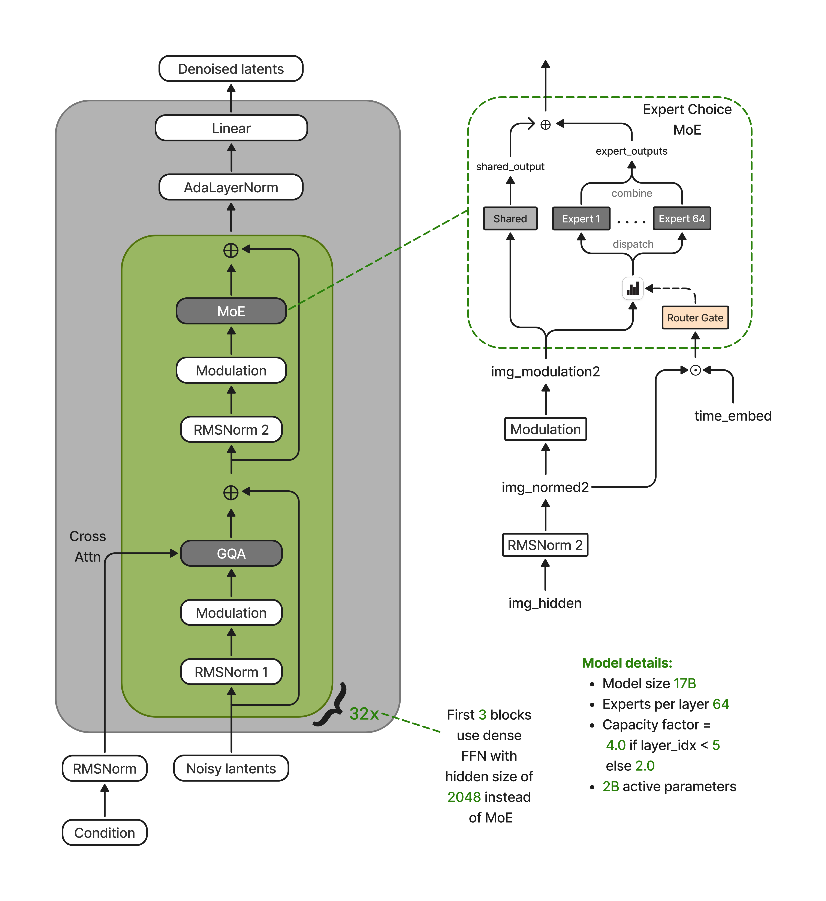

# Nucleus-Image: Sparse MoE for Image Generation

## 메타 정보

| 항목 | 내용 |
|---|---|
| 제목 | Nucleus-Image: Sparse MoE for Image Generation |
| 저자 | Chandan Akiti, Ajay Modukuri, Murali Nandan Nagarapu, Gunavardhan Akiti, Haozhe Liu |
| 공개일 | 2026-04 (arXiv 2604.12163) |
| 분야 | Text-to-Image Generation, Sparse Mixture-of-Experts, Diffusion Transformer |
| Abstract | https://arxiv.org/abs/2604.12163 |
| PDF | https://arxiv.org/pdf/2604.12163 |
| HTML | https://arxiv.org/html/2604.12163v1 |
| 외부 재사용 모델 | Qwen3-VL-8B-Instruct (텍스트 인코더), Qwen-Image VAE (16채널 latent) |
| 정체성 | 이 품질대 **최초의 완전 오픈소스 MoE diffusion 모델** |

> 한 줄: 전체 17B parameter를 갖되 한 번 계산에 약 2B(12%)만 켜는 **sparse MoE(희소 전문가 혼합)** 를 diffusion 이미지 생성에 제대로 이식한 논문. 핵심 기여는 단순한 "MoE 붙이기"가 아니라, diffusion 특유의 **timestep(노이즈 단계)발 routing 붕괴**를 진단하고 분리 설계로 고친 것.

---

## 주요 용어 사전 (Glossary)

처음 보는 용어가 많을 수 있어, 본문 들어가기 전에 카테고리별로 풀어둔다.

### 아키텍처

- **MoE (Mixture of Experts, 전문가 혼합)**: 신경망 한 층의 FFN(피드포워드 신경망)을 **여러 개로 복제해 전문가 여럿**으로 만들고, 토큰마다 그중 **소수만 켜서** 계산하는 구조. "큰 지식 + 작은 계산"을 노린다.
- **Expert (전문가)**: MoE 층에서 복제된 FFN 하나. 이 논문은 층마다 **routed expert(라우팅 전문가) 64개 + shared expert(공유 전문가) 1개**.
- **shared expert(공유 전문가)**: 토큰이 무엇이든 **항상 켜지는** 전문가 1개. 분야 안 가리는 공통 처리를 담당.
- **Router (라우터)**: 토큰을 보고 "어느 전문가가 맞나"를 점수로 매기는 작은 선형 신경망.
- **FFN (Feed-Forward Network, 피드포워드 신경망)**: Transformer 한 층의 "지식 창고" 역할 부분. MoE는 이 부분만 여러 개로 쪼갠다.
- **single-stream DiT**: 이미지 토큰을 하나의 흐름으로 처리하는 Diffusion Transformer 형태(텍스트를 별도 stream으로 같이 굴리는 dual-stream/MMDiT와 대비).
- **GQA (Grouped-Query Attention, 그룹 쿼리 어텐션)**: query head는 많고 key/value head는 적게(여기선 16:4) 묶어 메모리를 아끼는 attention.
- **QK-Norm**: attention 전에 query·key에 RMSNorm을 걸어 학습을 안정화하는 기법.
- **mRoPE (multi-dimensional Rotary Position Embedding)**: 시간·높이·너비 축을 분리한 회전 위치 임베딩. 해상도 일반화에 유리.

### 핵심 개념 (이 논문의 알맹이)

- **Expert-Choice Routing(전문가 선택 라우팅)**: 흔한 "토큰이 전문가를 고르는(token-choice)" 방식을 **뒤집어, 전문가가 자기 정원만큼 토큰을 골라 데려가는** 방식. 부하 쏠림이 구조적으로 불가능해진다.
- **capacity factor(용량 계수)**: 전문가 한 명이 데려갈 토큰 정원을 정하는 손잡이. 크면 덜 희소(안정), 작으면 더 희소(효율).
- **decoupled routing(분리 라우팅)**: router에는 **변조 안 한 깨끗한 토큰**을, expert에는 **timestep 변조된 진짜 데이터**를 따로 주는 설계. diffusion에서 routing이 붕괴하는 걸 막는 이 논문의 핵심 한 수.
- **adaptive modulation(적응 변조)**: diffusion timestep(노이즈 단계)에 따라 토큰 표현의 크기·위치를 조절하는 연산.

### 비교/기반 기법

- **rectified flow(정류 흐름)**: 노이즈에서 이미지로 가는 **velocity field(속도장)** 를 직선에 가깝게 예측하도록 학습하는 방식. 이 논문의 메인 loss.
- **Muon optimizer**: 최근 대규모 학습에서 뜨는 옵티마이저. 여기선 attention·expert 가중치에 적용.
- **WSM (Warmup-Stable-Merge)**: 워밍업 → 학습률 고정 → 마지막 체크포인트들 병합으로 마무리하는 스케줄. EMA를 대체.

### 평가 지표

- **GenEval**: 객체 개수·색·위치 등 프롬프트 충실도를 채점하는 T2I 벤치마크.
- **DPG-Bench**: 길고 복잡한 프롬프트(dense prompt) 따르기를 보는 벤치마크.
- **OneIG-Bench**: 다면적 이미지 생성 품질 벤치마크.

---

## 논문 요약 (TL;DR)

- **한 줄**: sparse MoE를 diffusion 이미지 생성에 옮길 때 생기는 핵심 함정을 고쳐, 17B 중 2B만 켜고도 큰 모델급 성능을 낸 최초의 완전 오픈소스 MoE diffusion 모델.
- **핵심 문제**: LLM에선 표준이 된 MoE가 diffusion엔 잘 안 옮겨졌다. timestep마다 토큰 표현 크기가 자릿수 단위로 출렁여서, router가 토큰 **내용**이 아니라 **"지금 몇 번째 timestep이냐"** 만 보고 전문가를 골라버린다(**routing 붕괴**).
- **해결책**: ① **decoupled routing** — 배정 기준(router 입력)과 처리 데이터(expert 입력)를 분리. ② **Expert-Choice Routing** — 전문가가 정원만큼 토큰을 데려가 부하 쏠림을 구조적으로 제거(보조 균형 loss 불필요). ③ **텍스트를 backbone에서 제외** + timestep 간 text KV 공유로 효율화.
- **검증**: GenEval / DPG-Bench / OneIG-Bench 평균에서, 더 큰 parameter 모델들과 **계산-성능 Pareto frontier(파레토 경계)** 상 동등 이상. (단 논문은 수치 표가 아닌 Figure 4 그래프로 제시 — 6장 참조.)

---

## 핵심 기여 (Contributions)

1. **Decoupled routing** — diffusion에서 timestep 변조가 일으키는 routing 붕괴를 진단하고, router 입력과 expert 입력을 분리해 해결. (이 논문의 가장 독창적 부분)
2. **Expert-Choice Routing의 diffusion 적용** — 전문가가 토큰을 데려가는 방식으로 부하 균형을 자동 달성, auxiliary load-balancing loss 제거.
3. **텍스트 backbone 제외 + timestep 간 text KV 공유** — 50스텝 denoising 동안 텍스트 쪽 계산을 1회로 재사용하는 효율 설계.
4. **progressive expert sparsification(점진적 전문가 희소화)** — capacity factor를 8.0→4.0→2.0으로 조이며 저해상도→고해상도로 안정적으로 희소화하는 학습 커리큘럼.
5. **완전 오픈소스** — 이 품질대 최초 공개 MoE diffusion 모델. post-training(RL/DPO/선호 튜닝) **없이** 순수 사전학습만으로 달성.

---

## 주요 알고리즘 설명

### 0. 구조 한눈에

> 왜 이 표부터 두냐면, 숫자 골격을 먼저 보면 뒤의 설명이 "어디에 붙는 얘기"인지 잡히기 때문이다.

| 항목 | 값 |
|---|---|
| backbone | single-stream DiT, 32층 |
| hidden dim | 2,048 |
| attention | query head 16 / key-value head 4 (GQA 4:1), head dim 128 |
| MoE 층 | 32층 중 **29층** (앞 3층은 dense FFN) |
| 전문가 수 | routed expert 64 + shared expert 1 / 층 |
| expert FFN | hidden 1,344, SwiGLU |
| total / active | **17B 총량 / ~2B 활성 (≈12%)** |
| 위치 인코딩 | mRoPE (시간·높이·너비 분리) |
| 정규화 | QK-Norm + pre-norm + 적응 변조 |
| VAE | Qwen-Image VAE (16채널 latent) |
| 텍스트 인코더 | Qwen3-VL-8B-Instruct |

### 0-1. 전체 구조도 (Figure 10) 따라 읽기

> 왜 이 그림을 먼저 따라가냐면, 위 표의 숫자들이 실제로 **어떤 순서로 데이터가 흐르며** 붙는지를 보면 decoupled routing(분리 라우팅)이 "어디에서" 일어나는지 한눈에 잡히기 때문이다.



*Figure 10. 왼쪽: cross-attention(GQA) + modulation + MoE로 이뤄진 transformer block 한 개, 32번 반복(앞 3개는 MoE 대신 hidden 2048 dense FFN). 오른쪽: 64 routed expert + 1 shared expert의 Expert-Choice MoE 모듈. router는 **변조 안 한 입력(unmodulated) + timestep**을 보고 토큰을 고른다.*

**왼쪽 — transformer block 한 개의 데이터 흐름 (아래→위)**

> 왜 두 갈래 입력이냐면, 만들 이미지(noisy latent)와 조건(텍스트 등 condition)이 따로 들어와 attention에서 만나기 때문이다.

```
   Denoised latents (노이즈 한 단계 걷어낸 결과)  ↑
        Linear
     AdaLayerNorm
          ⊕ ←─────────┐
         MoE          │ (잔차)   ← 오른쪽에서 확대
      Modulation      │
      RMSNorm 2 ──────┘
          ⊕ ←─────────┐
     GQA (Cross Attn) │ (잔차)   ← Condition이 key/value로 들어와 참조
      Modulation      │
      RMSNorm 1 ──────┘
     Noisy latents ↑        Condition → RMSNorm (왼쪽 별도 입력)

          이 초록 block을 32번 반복 (앞 3개만 dense FFN)
```

1. **입력 2갈래**: 아래에서 `Noisy latents`(노이즈 낀 이미지 잠재)와 `Condition`(조건)이 각각 들어와 `RMSNorm`으로 정규화. 만들 이미지와 조건이 따로 들어온다.
2. **Cross Attention(GQA)**: `Noisy latents` → `RMSNorm 1` → `Modulation`(timestep 변조) → `GQA`. 이때 왼쪽의 `Condition`이 GQA에 key/value로 들어와 **이미지가 조건을 참조**(cross-attention) — "프롬프트를 보면서 그린다"가 여기서 일어난다. 결과는 잔차로 더함(⊕).
3. **MoE**: 그 출력 → `RMSNorm 2` → `Modulation` → **`MoE`**(오른쪽에서 확대) → 다시 잔차 ⊕.
4. 이 초록 block을 **32번 반복**(앞 3개만 MoE 대신 dense FFN).
5. 마지막: `AdaLayerNorm` → `Linear` → **`Denoised latents`**(노이즈를 한 단계 걷어낸 잠재) 출력.

**오른쪽 — Expert-Choice MoE 모듈 확대 (여기가 핵심)**

> 왜 이 박스가 알맹이냐면, decoupled routing이 그림으로 드러나는 유일한 곳이기 때문이다 — **router에 들어가는 선과 expert에 들어가는 선이 서로 다르다.**

```
            shared_output      expert_outputs
                 ↑                  ↑
              ┌─────┐      ┌──────────combine──────────┐
              │Shared│     │ Expert 1  ···  Expert 64  │
              └─────┘      └─────────dispatch──────────┘
                                ↑              ↑
                          img_modulation2   Router Gate
                            (변조 O)         (변조 X 입력)
                                ↑              ↑
                            Modulation    img_normed2 ⊙ time_embed
                                ↑              ↑
                            img_normed2 ───────┘  ← 여기서 선이 갈린다!
                                ↑
                            RMSNorm 2
                                ↑
                            img_hidden
```

- `img_hidden` → `RMSNorm 2` → **`img_normed2`**(정규화만 된, 변조 **안** 된 표현). **여기서 선이 두 갈래로 갈린다:**

| 가는 곳 | 받는 데이터 | 의미 |
|---|---|---|
| **Expert(전문가)** | `img_modulation2` = 변조**된** 표현 | 실제 계산은 timestep 정보 살려서 |
| **Router Gate(라우터)** | `img_normed2` + `time_embed` = 변조 **안 된** 표현 | 누구를 부를지는 깨끗한 내용으로 |

- 이 **두 선이 다르다는 게 바로 decoupled routing**이다. 그림으로 보면 명백 — router로 가는 선(변조 전)과 expert로 가는 선(변조 후)이 `img_normed2`에서 갈라진다. "배정 기준과 처리 데이터를 분리"가 이 갈림길(상세 이유는 알고리즘 3장).
- `Router Gate` → `dispatch`(전문가가 점수 높은 토큰을 정원만큼 데려감, Expert-Choice) → `Expert 1 … Expert 64` → `combine`(점수 비율로 합침) → `expert_outputs`.
- 동시에 항상 켜지는 `Shared`(공유 전문가) → `shared_output`. 둘을 ⊕로 더해 최종 MoE 출력 → 왼쪽 block으로 돌아감.

**오른쪽 아래 Model details 박스 (그림에 명시된 값)**

| 항목 | 값 |
|---|---|
| Model size | 17B |
| Experts per layer | 64 |
| **Capacity factor** | **layer_idx < 5 이면 4.0, 아니면 2.0** |
| Active parameters | 2B |

> 그림의 capacity factor 규칙(앞쪽 층 4.0 / 나머지 2.0)은 학습 5장의 1024 단계 층별 스케줄(층 3–4: 4.0, 층 5–31: 2.0)과 같은 얘기다.

### 1. MoE 층의 동작 — router → 선택 → 혼합

> 왜 이걸 먼저 보냐면, MoE의 모든 트릭이 이 세 단계 위에서 벌어지기 때문이다.

1. **채점**: router(작은 선형망)가 토큰 하나를 받아 전문가 64명 각각에 대한 **점수 64개**를 뱉는다. softmax로 확률처럼 정규화.
2. **선택**: 점수를 기준으로 소수의 전문가만 켠다 → **이 논문은 Expert-Choice 방식**(아래 3번).
3. **혼합**: 켜진 전문가들의 결과를 점수 비율대로 가중합. + 항상 켜지는 shared expert 결과를 더함. (이름이 *Mixture* of Experts인 이유)

같은 토큰이라도 점수는 **내용에 따라 매번 달라지므로**, 토큰마다 켜지는 전문가 조합이 다르다. 학습이 진행되면 전문가들이 "얼굴 담당", "질감 담당"처럼 **저절로 전문화(specialization)** 된다.

> 64개 FFN을 메모리에 **갖고만** 있고, 토큰마다 그중 일부만 실제로 **계산**한다. 그래서 저장은 17B, 계산은 2B.

### 2. Expert-Choice Routing — 전문가가 토큰을 데려간다

> 왜 뒤집었냐면, "토큰이 전문가를 고르면" 인기 전문가에 쏠려서 균형 보조 loss가 필요해지기 때문이다.

- 일반 token-choice: 토큰이 점수 높은 상위 k명을 고름 → **쏠림 → 정원 초과 → 토큰 버림(drop)** + 균형 벌점 필요.
- **Expert-Choice (이 논문)**: 각 전문가가 **자기에게 점수 높은 토큰을 정원(capacity)만큼 위에서부터 데려감**. 모든 전문가가 정확히 같은 수의 토큰을 처리 → 쏠림이 **구조적으로 불가능**, 균형 loss 불필요, 버려지는 토큰 없음.
- **계산량은 (정원 × 64)로 통제**되어 token-choice와 같게 맞춘다. "64명이 다 켜져서 64배"가 아니라, 각자 작은 토막만 처리. (자세한 직관은 Q&A Q5)
- 부수 효과: 토큰당 붙는 전문가 수가 고정이 아니라 가변 → 복잡한 토큰엔 여러 전문가, 단순한 토큰엔 적게 붙어 계산을 알뜰히 배분.

### 3. Decoupled Routing — 이 논문의 핵심 한 수

> 왜 필요하냐면, diffusion에선 timestep에 따라 토큰 표현 크기가 자릿수 단위로 출렁여 router가 내용 대신 timestep만 보게 되기 때문이다.

- 문제: adaptive modulation 때문에 t=0.01과 t=0.99의 표현 norm이 **한 자릿수 이상 차이**. 그대로 router에 넣으면 routing이 "지금 몇 시냐(timestep)" 기준으로 붕괴 → 의미 기반 전문화가 사라짐.
- 해법(분리):
  - **router 입력** ← 변조 안 한 깨끗한 토큰 + timestep 임베딩 (누구를 부를지는 **내용 기반**으로 안정적으로)
  - **expert MLP 입력** ← 완전히 변조된 표현 (실제 계산은 **timestep 정보 살려서**)
- 효과: routing 안정성과 timestep 인지를 둘 다 챙김.

### 4. 텍스트 조건 — backbone에서 빼고 KV 재사용

> 왜 빼냐면, 같은 텍스트로 50스텝을 도는데 텍스트 계산을 매 스텝 반복할 이유가 없기 때문이다.

- 이미지 query가 (이미지 + 텍스트) key/value에 함께 attention(**joint attention**)하되, **텍스트 토큰은 transformer backbone 연산에서 제외**.
- 텍스트의 key/value는 **모든 timestep에서 1회만 계산해 재사용**(text KV sharing across timesteps).
- 텍스트 인코더는 Qwen3-VL-8B-Instruct를 그대로 사용.

### 5. 학습 레시피 (Training)

> 왜 단계를 나누냐면, 저해상도는 토큰이 적어 전문가별 gradient가 불안정해서, 정원을 넉넉히 줬다가 점점 조여야 안정적이기 때문이다.

- **데이터**: 700M 고유 이미지 → 1.5B 이미지-캡션 쌍. 3단 필터링(포맷·기하 → 히스토그램·방향 → GPU 안전성·워터마크·미적 점수) + SHA-256·pHash 중복 제거. 미적 등급 A1~A5.
- **progressive resolution(점진적 해상도)**: 256 → 512 → 1024, multi-aspect-ratio bucketing.
- **progressive expert sparsification**: capacity factor를 단계별로 조임.
  - Stage 1 (256px): global batch 4,096, CF **8.0**
  - Stage 2 (512px): global batch 1,024, CF **4.0**
  - Stage 3 (1024px): global batch 256, 층별 스케줄(층 3–4: CF 4.0, 층 5–31: CF 2.0)
- **optimizer**: Muon(attention·expert FFN, momentum 0.95) + AdamW(변조·출력 투영).
- **schedule**: WSM — 1,000스텝 linear warmup → LR 1e-4 고정. EMA 대신 **마지막 N개 체크포인트를 역제곱근 가중 병합**.
- **loss 4종**:
  - rectified flow (velocity field MSE) — 메인
  - z-loss (5e-7) — router logit 폭발 방지
  - orthogonal loss (1e-7) — 전문가 routing 다양성, 직접 weight 업데이트로 적용
  - wavelet loss (0.1, 1024 단계만) — 고주파 디테일 강조
- **timestep 샘플링**: logit-normal(해상도 의존 shift μ 0.5@256px → 1.15@4096토큰) + 10% uniform 혼합.
- **post-training 없음**: RL/DPO/선호 튜닝 미사용 — 순수 사전학습 성능임을 강조.

---

## 실험 요약

> 왜 표가 비어 보이냐면, 논문이 수치 표 대신 그래프로 결과를 제시하기 때문이다. 솔직하게 그대로 적는다.

- **평가 벤치마크**: GenEval, DPG-Bench, OneIG-Bench. 세 점수 평균으로 종합 성능 산출(Figure 4).
- **추론 설정**: 1024×1024, **50 steps, CFG 8.0**.
- **결과 형태**: Figure 4의 **계산-성능 Pareto frontier** 상에 위치. "약 2B만 활성화하고도 더 큰 parameter 모델과 동등 이상"이 핵심 메시지.
- **주의(한계 표기)**: GenEval per-category 점수, DPG/OneIG 절대 수치를 **본문 수치 표로 제공하지 않음**. 정확한 숫자는 그래프 판독 또는 후속 자료 필요.

---

## 💬 Q&A 섹션

대화 중 실제로 나온 질문들. 각 답변은 자기 완결적이되, 위 알고리즘 섹션과 중복되지 않게 **직관·비유 위주**로 둔다.

### Q1. MoE가 대체 뭔가? (쉬운 설명)

**출발점 — 보통 신경망은 "모든 일을 한 명이 다 한다".** 일반 Transformer 한 층에선 토큰이 들어오면 **하나의 거대한 FFN(지식 창고)**을 통째로 거친다. 문제는 창고를 키우면(파라미터↑) 똑똑해지지만 **모든 토큰이 그 큰 창고를 다 거쳐야 해서 계산비용도 똑같이 커진다** — "똑똑함"과 "계산비용"이 한 몸으로 묶여 있다.

**MoE의 아이디어 — 병원 비유** (이 비유 하나로 압축):

- **일반 신경망 = 만능 의사 한 명**: 모든 환자(토큰)가 이 한 명에게 가서 모든 분야(내과·외과·피부과…)를 다 받는다. 환자가 많아지면 혼자 다 봐야 해 버겁다.
- **MoE = 전문의 64명 + 접수처(router) 1명**: 환자가 오면 접수처가 "당신은 2번·17번 전문의에게" 하고 배정. 환자는 **64명 전부가 아니라 배정된 소수에게만** 진료받는다.

여기서 핵심이 일어난다 — 병원 전체 지식(전문의 64명분)은 **엄청 크지만(똑똑함)**, 환자 한 명이 실제로 만나는 의사는 **2명뿐(계산은 쌈)**. 즉 **똑똑함과 계산비용을 드디어 분리**한 것. 이게 "17B 보유 / 2B 활성"의 정체다.

또 하나 — 학습이 진행되면 처음엔 다 무지하던 전문의들이, 접수처가 비슷한 환자를 같은 의사에게 계속 보내면서 **저절로 분업(전문화)** 된다. 아무도 안 시켰는데 "얼굴 담당", "질감 담당"이 생긴다. → 메커니즘은 알고리즘 1장.

### Q2. 전문가가 64개면 FFN이 64개인가?

**그렇다.** 일반 층엔 FFN 1개인데, MoE는 그 자리에 **FFN을 64개 복제**해 나란히 둔다(전문가 1명 = FFN 1개). 이 논문 MoE 층 하나엔 실제로 **FFN 65개**(routed 64 + shared 1).

- **구조(설계도)는 64개 모두 동일**(입력 2048 → hidden 1344 → 2048, SwiGLU). 단 **안의 가중치 값은 제각각**이라 학습하며 분야가 갈린다(똑같은 빈 노트 64권에 다른 내용이 채워짐).
- 주의: **64배 되는 건 FFN 부분뿐.** attention은 1개로 공유, 임베딩·입출력도 1개. (그래서 Q4의 "정확히 64배는 아니다"로 이어짐)

### Q3. 64개 전문가를 그때그때 어떻게 선택하나?

라우터는 거창한 게 아니라 **작은 선형 신경망 한 개**다. 하는 일은 딱 하나 — 토큰을 받아 전문가 64명 각각에 대한 **점수 64개**를 뱉는다.

```
어떤 토큰 → 라우터 → [1번: 0.1, 2번: 8.3, 3번: 0.2, ..., 17번: 7.9, ..., 64번: 0.4]
                        ↓ softmax (합이 1인 확률처럼)
              [2번 45%, 17번 40%, 나머지 합쳐 15%]
```

- **① 채점·정규화**: 위처럼 점수를 매기고 softmax로 확률처럼 변환.
- **② 선택**:
  - **일반 방식(token-choice)**: 토큰이 점수 높은 **상위 k명**을 고름(예: 2번·17번).
  - **이 논문(Expert-Choice)**: 거꾸로 전문가가 점수 높은 토큰을 **정원만큼 데려감**. → 비교는 알고리즘 2장 / Q8.
- **③ 혼합**: 뽑힌 전문가 결과를 점수 비율대로 가중합. 예) `최종 = 0.53 × (2번 결과) + 0.47 × (17번 결과)`. 이래서 이름이 *Mixture*(혼합).
- **"그때그때 다른" 이유**: 점수가 **토큰 내용**에 따라 매번 달라지므로. 얼굴 픽셀 토큰엔 얼굴 담당이, 하늘 배경 토큰엔 다른 전문가가 높은 점수를 받는다 → 토큰마다 켜지는 조합이 바뀐다.

### Q4. 전문가 64개면 메모리가 64배 커지는 것 아닌가?

**저장 메모리는 실제로 크게 늘어난다. 그게 MoE의 본질적 거래다.** 단 정확히 64배는 아니다.

- MoE가 줄이는 건 **계산량(FLOPs)**, 늘리는 건 **메모리**다. 표로:

| 항목 | 일반 2B 모델 | 이 MoE |
|---|---|---|
| 저장 메모리(VRAM 상주) | 2B어치 | **17B어치 (≈8.5배)** |
| 토큰당 계산량 | 2B어치 | 2B어치 (동일) |

- 왜 64배가 아닌가: ① **FFN만** 64배, attention·임베딩은 1개 그대로 ② 32층 중 **29층만** MoE ③ 전문가 FFN을 **슬림하게**(hidden 1,344) 설계. → 그래서 전체는 2B→17B(약 8.5배)에서 멈춤.
- 거래의 본질: **메모리는 한 번 내는 고정비, 계산은 매번 드는 변동비.** 큰 도서관(17B)을 짓되 매번 필요한 책 2권만 꺼내 읽는(2B) 식.
- 실무 함의: **VRAM 부자에겐 이득(빠름), 빈자에겐 부담(못 올림).** 그래서 MoE는 서버용, 폰엔 작은 dense 모델([[paper_dreamlite]])이 유리.

### Q5. Expert-Choice면 64명이 다 일하니 느리고 비효율 아닌가?

가장 헷갈리는 지점. **64명이 다 켜지는 건 맞지만, 각자 "모든 토큰"이 아니라 "정원만큼의 작은 토막"만 처리한다. 총 계산량은 거의 동일하다.**

- 숫자로: 토큰 1000개, 전문가 64명일 때
  - token-choice top-2: 1000 × 2 = **2000번** (토큰-전문가) 처리
  - expert-choice: 같게 맞추면 정원 ≈ 2000 ÷ 64 ≈ **31개/전문가** → 64 × 31 = **2000번**
- 즉 계산량을 정하는 건 **전문가 수(64)가 아니라 "정원 × 전문가 수" = 총 배정 횟수.** 이건 양쪽 다 같게 맞춘다.
- 오히려 더 효율적인 이유: 토큰을 안 버리고(drop 없음), 전문가를 안 놀려(64명 균등 가동), 비싸게 만든 17B를 빈틈없이 활용. 균형 보조 loss도 불필요.
- 그 "정원"이 곧 **capacity factor** — 후반에 2.0으로 조이는 게 "더 희소·더 빠르게"(알고리즘 5장 progressive sparsification).

### Q6. 어떤 전문가도 안 데려간 토큰(0명 배정)은 그냥 사라지나?

**안 사라진다.** 안전망 두 개가 받친다.

- **잔차 연결(residual connection)**: MoE 층은 "나가는 값 = 들어온 값(원본) + MoE가 더한 값" 구조. 아무도 안 데려가면 더한 값이 0 → **나가는 값 = 원본**. 사라지는 게 아니라 "이번 MoE 층은 처리 없이 통과(skip)". 정보 손실 없음.
- **shared expert(공유 전문가)**: 항상 켜져 **모든 토큰을 무조건** 기본 처리. routed 64명에게 누락돼도 공통 처리는 받음.
- 게다가 MoE 층은 **29개**라 매 층 새로 채점 → 한 층 누락이 영구 누락이 아님(다음 64명에게 다시 뽑힐 기회).

### Q7. 정원(capacity)을 줄이면 품질이 떨어지지 않나?

방향은 맞다(너무 줄이면 떨어짐). **비결은 "언제 줄이느냐" — 전문가가 충분히 자란 뒤에 조인다.**

| 시점 | capacity factor | 이유 |
|---|---|---|
| 초반 (256px) | **8.0 (넉넉)** | 토큰이 적어(~256개) 전문가별 데이터 부족 → 넉넉히 줘서 **안정적으로 전문화를 키움** |
| 후반 (1024px) | **2.0 (빡빡)** | 이미 학습된 전문가들이 소수 정예 토큰만 봐도 됨 → 품질 유지하며 **계산만 절감** |

처음부터 빡빡하면 전문가가 덜 자란 채 굶어 품질이 망가지지만, 다 키운 뒤 조이면 품질 유지 + 효율 ↑. 약간의 누락은 Q6 안전망이 흡수. → 5장 progressive sparsification과 같은 얘기.

### Q8. Token-Choice vs Expert-Choice 한눈에 비교

> 토큰 1000개, 전문가 64명, 총계산 2000번(양쪽 동일) 기준.

```
[A] TOKEN-CHOICE ── "토큰이 전문가를 고른다"
   토큰마다 점수 top-2 선택 → 고정 2명/토큰
   결과: 전문가7 ████████ 인기 쏠림(정원초과→drop) / 전문가40 · 놀고먹음
   ▸ 쏠림·낭비 발생 ▸ 균형 보조 loss 강제 ▸ but 토큰당 전문가 수는 공평(2명)

[B] EXPERT-CHOICE ── "전문가가 토큰을 데려간다" (이 논문)
   전문가마다 정원 31개씩 균등하게 데려감
   결과: 토큰A ●●●● 복잡(4명) / 토큰D (0명→Q6 안전망)
   ▸ 쏠림 구조적 불가 ▸ drop 없음 ▸ 균형 loss 불필요 ▸ 알뜰 배분
   ▸ but 토큰당 전문가 수는 가변(0~여러명)

★ 무엇을 '고정'하느냐만 정반대:
  A = 토큰당 전문가 수 고정 / 전문가 부하 들쭉날쭉 → 낭비
  B = 전문가당 부하 고정   / 토큰당 전문가 수 들쭉날쭉 → 알뜰
  총 계산량(2000번)은 동일.
```

### Q9. 17B면 실제 메모리(VRAM)는 얼마나 차지하나?

**핵심: MoE 메모리는 활성 2B가 아니라 전체 17B가 결정한다.** 어느 2B가 켜질지 모르므로 64 전문가를 전부 메모리에 상주시켜야 함(계산만 희소, 메모리는 통째 보유).

**추론(inference) — 가중치만, 정밀도별:**

| 정밀도 | 17B 메모리 | 비고 |
|---|---|---|
| FP32 | 68 GB | 거의 안 씀 |
| **BF16/FP16** | **~34 GB** | 추론 표준 |
| FP8 | ~17 GB | 양자화 |
| INT4 | ~8.5 GB | 공격적 양자화 |

**추론 — 같이 올라가는 식구 포함 (BF16):**

| 구성요소 | 메모리 |
|---|---|
| MoE backbone (17B) | ~34 GB |
| 텍스트 인코더 Qwen3-VL-8B | ~16 GB |
| VAE (Qwen-Image) | ~0.3 GB |
| activation 등 | 수 GB |
| **합계** | **~55–60 GB** (80GB GPU 1장급) |

**dense 2B와 비교:** dense 2B는 BF16 ~4GB. MoE는 ~34GB(약 **8.5배**) — 속도는 비슷한데 메모리만 큼(= MoE 거래의 정체, Q4).

**학습(training):** 가중치(34GB) + gradient(34GB) + optimizer 상태(AdamW FP32 ~136GB) = **200GB+** → GPU 1장 불가, **expert parallelism(64 전문가를 여러 GPU에 분산)** 필수.

---

## 한 줄 요약 (전체)

> Nucleus-Image는 **"전문가(FFN)를 64개 갖되 토큰마다 소수만 켜서, 메모리를 더 내는 대신 계산량은 그대로 두고 똑똑해지는" sparse MoE를 diffusion에 이식**한 모델이다. 진짜 기여는 화려한 신규 backbone이 아니라, MoE를 diffusion에 옮길 때 깨지는 한 지점 — **timestep 변조발 routing 붕괴** — 을 **decoupled routing**으로 정확히 짚어 고친 엔지니어링이다. Z-Image/Lumina 계보가 "구조·distillation"으로 효율을 봤다면, 이쪽은 **sparsity(희소성)** 라는 다른 축으로 효율을 본다.

---

## 관련 메모리 링크

- [[reference_pretrained_backbone_reuse_landscape]] — Qwen3-VL·Qwen-Image VAE 재사용 (B분기)
- [[paper_z_image]] — distillation 축 효율화와 대비되는 sparsity 축
- [[paper_lumina_image_2]] — single-stream + joint attention 계보 비교
- [[paper_dreamlite]] — 메모리 부담 때문에 MoE 대신 작은 dense를 택하는 반대 사례
