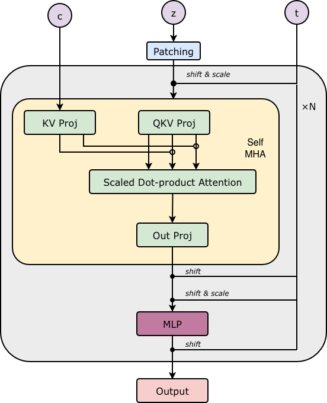
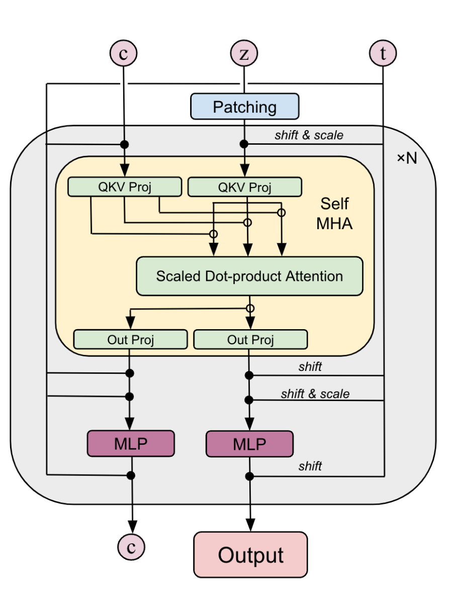

# PRX (Photoroom eXperimental) — 논문 없는 오픈소스 T2I 연구

## 메타 정보

| 항목 | 내용 |
|---|---|
| **프로젝트명** | PRX (Photoroom eXperimental) |
| **기관** | Photoroom (프랑스, 사진 편집 앱 회사) |
| **공개 시기** | 2025년 말 ~ 2026년 (블로그 시리즈 연재 중) |
| **논문** | **없음** — Hugging Face 블로그 시리즈가 논문 역할 (의도적 선택) |
| **블로그** | [공개 발표(허브)](https://huggingface.co/blog/Photoroom/prx-open-source-t2i-model) · [Part 1 아키텍처](https://huggingface.co/blog/Photoroom/prx-part1-architectures) · [Part 2 학습 설계](https://huggingface.co/blog/Photoroom/prx-part2) · [Part 3 24시간 스피드런](https://huggingface.co/blog/Photoroom/prx-part3) · Part 4(7B)·Part 5(post-training) 예고 |
| **코드** | [github.com/Photoroom/PRX](https://github.com/Photoroom/PRX) (Apache 2.0, 학습 프레임워크 전체) |
| **체크포인트** | [HF PRX 컬렉션](https://huggingface.co/collections/Photoroom/prx) — 256/512/1024px × base/SFT/증류, Diffusers 공식 통합(`PRXPipeline`) |
| **데모** | [PRX-1024 베타 Space](https://huggingface.co/spaces/Photoroom/PRX-1024-beta-version) |
| **모델 규모** | 1.3B (메인) / 7.3B 설정 준비됨 (`prx_base.yaml`, Part 4 예고) |
| **학습 비용** | 1024px 본학습: H200 32장 × 10일 미만 (1.7M 스텝) / 스피드런: H200 32장 × 24시간 ≈ **$1,500** |
| **외부 모델 사용** | T5-Gemma-2B-2B-UL2 (텍스트 인코더) · Flux VAE 또는 DC-AE (잠재공간) · DINOv2/v3 (REPA teacher) · Qwen3 (인코더 옵션) |
| **데이터 (24h 런)** | 합성 8.7M장: FLUX 생성 1.7M + FLUX-Reason-6M + Midjourney-v6 1M (Gemini 재캡셔닝) |

---

## 주요 용어 사전 (Glossary)

### 아키텍처

| 용어 | 쉬운 설명 |
|---|---|
| **DiT (Diffusion Transformer)** | 디퓨전의 노이즈 제거기를 U-Net 대신 트랜스포머로 만든 구조. 텍스트는 cross-attention(교차 주의)으로 주입 |
| **MMDiT (Multimodal DiT)** | 텍스트와 이미지가 **각자 별도 가중치 스트림**을 가지고, attention에서만 만나 **양쪽 모두 갱신**되는 구조 (SD3, Flux 계열) |
| **DiT-Air** | DiT의 단순함과 MMDiT의 멀티모달 표현력을 절충한 single-stream 변형 |
| **U-ViT** | U-Net처럼 skip connection(건너뛰기 연결)을 가진 ViT. 조건을 토큰으로 이어붙임 |
| **PRX 블록** | 이 프로젝트의 고안. MMDiT에서 **텍스트 갱신을 제거**한 구조 — 텍스트는 K/V만 내고 Q가 없어서 블록을 지나도 변하지 않음 (→ 5.1절) |
| **AdaLN (adaptive LayerNorm)** | timestep 임베딩으로 정규화의 shift/scale/gate를 조절하는 조건 주입 방식 |
| **RoPE (Rotary Position Embedding)** | 토큰 좌표를 회전 행렬로 인코딩하는 위치 표현. PRX는 이미지 토큰에만 2D RoPE 적용 |
| **QK-Norm** | attention의 query/key를 RMSNorm으로 정규화해 수치 폭주를 막는 안정화 장치 |
| **bottleneck (병목) 입력층** | 픽셀 학습 시 3×32×32=3072차원 패치를 256차원으로 압축 후 hidden으로 보내는 2단 Linear |

### 학습 기법 (ablation 대상)

| 용어 | 쉬운 설명 |
|---|---|
| **Flow Matching** | 노이즈에서 이미지로 가는 직선 경로의 속도(velocity = noise − image)를 배우는 학습 방식 |
| **REPA (Representation Alignment)** | 모델 중간층 특징을 동결된 DINO 특징에 정렬시키는 보조 손실. **의미 표현 형성을 앞당기는 초반 가속기** |
| **REPA-E** | REPA를 VAE 잠재공간까지 확장 — VAE도 같이 미세조정하며 정렬 |
| **iREPA** | REPA의 projector를 MLP 대신 RoPE 달린 attention으로 바꾼 개선판 |
| **burn-in (예열) 효과** | REPA의 이득이 학습 초반에만 나타나고 ~20만 스텝 후 사라지는 현상 (→ Q1) |
| **TREAD (token routing)** | 중간 블록 구간에서 토큰 일부(50%)를 빼돌렸다가(routing) 끝에서 복원 — 계산량 절감 |
| **SPRINT** | TREAD의 변형 (코드에서 Tread 클래스를 상속) |
| **self-guidance** | CFG의 "빈 프롬프트" 대신 "토큰 빠진 패스"를 약한 모델로 쓰는 가이던스: `routed + scale × (full − routed)` |
| **Contrastive Flow Matching** | 내 예측이 배치 내 **남의 정답**과 비슷해지면 벌점(음수 MSE)을 주는 다양성 손실 |
| **x-prediction (JiT 방식)** | 속도 대신 **깨끗한 이미지 자체**를 예측. VAE 없는 픽셀 학습을 안정화 ("Back to Basics", arXiv 2511.13720) |
| **Muon** | 2차원 가중치 행렬의 업데이트를 Newton-Schulz 반복으로 직교화하는 옵티마이저 |
| **EMA (지수이동평균)** | 가중치의 이동평균 사본을 따로 유지해 추론에 사용 (smoothing 0.999) |
| **LPIPS / Perceptual DINO** | 픽셀 학습 시 추가하는 지각 손실 — 사람 눈 기준 유사도(LPIPS)와 의미 신호(DINO) |
| **mixed precision (혼합 정밀도)** | 가중치 원본은 FP32로 두고 연산만 BF16으로 하는 표준 기법 (→ Q5) |

### 평가 지표

| 용어 | 쉬운 설명 |
|---|---|
| **FID** | 생성 분포와 실제 분포의 거리 (Inception v3 특징 기준). 낮을수록 좋음 |
| **CMMD** | CLIP 임베딩 기준 분포 거리 — FID보다 의미 정합성에 민감 |
| **DINO-MMD** | DINO 임베딩 기준 분포 거리 |

### 인프라

| 용어 | 쉬운 설명 |
|---|---|
| **MosaicML Composer** | 학습 루프에 "Algorithm"이라는 플러그인을 이벤트 훅으로 끼워 넣는 학습 프레임워크. PRX 조립식 설계의 토대 |
| **FSDP** | 가중치/그래디언트를 GPU들에 쪼개 담는 분산 학습 방식 |
| **Hydra** | yaml 조합으로 실험 설정을 관리하는 도구. 블로그 ablation 표 한 줄 = yaml 한 개 |
| **MDS (MosaicML Streaming)** | 학습 데이터 스트리밍 포맷. 종횡비 버킷으로 구성 |

---

## 논문 요약 (TL;DR)

> **"1.3B 모델을 H200 32장으로 10일(스피드런은 24시간, $1,500)에 학습하는 전 과정을 — 실패 사례까지 — 레시피째 공개한 프로젝트."**

- **핵심 문제**: 대형 T2I 모델 학습 레시피는 가중치만 공개되고 과정(아키텍처 선택 근거, ablation, 함정)은 블랙박스다.
- **해결책**: ① MMDiT를 단순화한 효율 구조(PRX 블록), ② 최신 학습 기법(REPA/TREAD/Muon/JiT 등)을 한 코드베이스에서 공정 비교한 ablation, ③ 전부 Apache 2.0으로 공개(코드+가중치+블로그).
- **검증**: 256px 비교에서 MMDiT(3.1B) 대비 파라미터 1/3·메모리 44%로 FID 우위. 24시간 스피드런으로 1024px 모델 학습 성공.

---

## 핵심 기여 (Contributions)

1. **PRX 블록**: MMDiT에서 텍스트 스트림 갱신을 제거한 비대칭 attention 구조 — 품질 유지하며 처리량 1.4배, 메모리 절반.
2. **공개 ablation 공장**: REPA/REPA-E/TREAD/Muon/contrastive FM/캡션 길이/bf16 함정 등을 동일 베이스라인에서 1:1 비교한 실험 노트 — **부정적 결과 포함**.
3. **24시간 $1,500 스피드런 레시피**: VAE 없는 픽셀 x-prediction + 지각 손실 + TREAD + REPA burn-in + Muon 조합으로 1024px 모델 학습.
4. **완전 재현 가능한 인프라**: 훅 기반 플러그인 설계의 학습 프레임워크 + Hydra 설정 + Diffusers 통합 + 체크포인트 전 변형 공개.

---

## 주요 알고리즘 설명

### 5.1 PRX 블록 — "텍스트는 읽기 전용"

> 왜 이 절이 필요한가: PRX라는 이름이 붙은 유일한 새 구조이며, MMDiT 대비 효율 이득이 전부 여기서 나온다.



*그림 1: PRX 블록. 텍스트 조건 c는 KV Proj만 거치고, 이미지 z만 QKV를 모두 만든다. 출력도 이미지 토큰만.*



*그림 2: 비교 대상인 MMDiT 블록. c와 z 양쪽 모두 QKV·Out Proj·MLP를 거치며 갱신되고, c도 다음 블록으로 흘러간다.*

**아이디어**: 텍스트 토큰 $c$는 디퓨전 내내 변하지 않아도 된다. 그렇다면 텍스트의 query·출력 투영·MLP를 전부 없애자.

$$\text{Attn} = \text{softmax}\!\left(\frac{Q_{img}\,[K_{txt};K_{img}]^\top}{\sqrt{d}}\right)[V_{txt};V_{img}]$$

- attention 행렬이 $(L_{img}+L_{txt})^2$ 이 아니라 $L_{img}\times(L_{img}+L_{txt})$ — 계산·메모리 절감.
- 텍스트가 고정이므로 추론 시 **스텝마다 텍스트 투영을 캐시** 가능.

**코드 매핑** ([prx_layers.py](https://github.com/Photoroom/PRX/blob/main/prx/models/prx_layers.py)):

```python
# 이미지: Q,K,V 셋 다 / 텍스트: K,V만 (Q 없음 = 갱신 없음)
self.img_qkv_proj = nn.Linear(hidden_size, hidden_size * 3, bias=False)
self.txt_kv_proj  = nn.Linear(hidden_size, hidden_size * 2, bias=False)

# attention: 쿼리는 이미지만
k = torch.cat((txt_k, img_k), dim=2)
v = torch.cat((txt_v, img_v), dim=2)
attn = _sdpa(img_q, k, v, attn_mask=attn_mask)
```

**구성 요소** (대부분 Flux에서 차용, 주석에 명시):
- 2D RoPE — **이미지 토큰에만** 적용 (텍스트는 위치 인코딩 없음)
- QK-Norm (RMSNorm), GELU-gated MLP (gate/up/down 3-Linear)
- AdaLN modulation 6-way (attention·MLP 각각 shift/scale/gate)
- **zero-init**: modulation Linear와 최종 출력층은 가중치 0으로 초기화 — 학습 시작 시 블록이 항등함수에서 출발
- timestep과 무관한 연산(`txt_in`, patchify, RoPE)은 `process_inputs()`로 분리 ([prx.py:163](https://github.com/Photoroom/PRX/blob/main/prx/models/prx.py)) — 캐싱 가능 구조

**모델 설정** (configs/yamls/model/):

| 설정 | 파라미터 | hidden | depth | heads | 용도 |
|---|---|---|---|---|---|
| prx_small | 1.24B | 1792 | 16 | 28 | 공개 체크포인트 전부 |
| prx_jit_32_small | 1.24B | 1792 | 16 | 28 | 픽셀 학습: in_channels=3, patch 32, bottleneck 256, identity VAE |
| prx_base | **7.3B** | 3584 | 24 | 28 | Part 4 스케일링 (진행 중) |

### 5.2 학습 파이프라인 — flow matching과 x-prediction

> 왜 이 절이 필요한가: 24시간 스피드런의 핵심인 "VAE 없는 픽셀 학습"이 손실 한 줄 변환으로 구현돼 있다.

기본은 표준 flow matching이다 ([fm_pipeline.py](https://github.com/Photoroom/PRX/blob/main/prx/pipeline/fm_pipeline.py)): 타깃 = `noise − latents`, logit-normal timestep 샘플링, timestep shift(픽셀 1024px는 3.0), caption dropout 10%(CFG용).

**x-prediction (JiT 방식)**: 모델이 깨끗한 이미지 $\hat{x}_0$를 직접 예측하되, **손실은 velocity 공간으로 환산**해 계산한다:

```python
# fm_pipeline.py — "Back to Basics" (arXiv 2511.13720) 방식
def convert_x_to_v(self, prediction, target, noised_latents, timesteps):
    t = torch.clamp(timesteps.view(-1,1,1,1), min=0.05)  # 0 나누기 방지
    prediction = (noised_latents - prediction) / t
    target     = (noised_latents - target) / t
    return prediction, target
```

$t$가 작을수록(깨끗한 쪽) 나누기로 손실이 증폭 → x-prediction이지만 가중치는 flow matching과 등가. 픽셀 학습 전환은 yaml 3줄: 모델을 `prx_jit_32_small`로, VAE를 `identity`로, 스케줄러를 `euler_x_prediction_shifted`로 교체.

### 5.3 훅 기반 플러그인 설계 — 이 코드베이스의 정체성

> 왜 이 절이 필요한가: 블로그의 ablation 공장이 어떻게 가능했는지에 대한 답이며, 이 저장소에서 가장 배울 점이다.

모든 학습 기법이 Composer `Algorithm` 클래스 + PyTorch forward hook으로 구현되어, **모델 코드를 한 줄도 수정하지 않고** 탈부착된다. 기법을 끌 때 모델이 전혀 변하지 않으므로 ablation의 비교가 깨끗하다.

**TREAD** ([algorithm/tread.py](https://github.com/Photoroom/PRX/blob/main/prx/algorithm/tread.py), 614줄):

```
route_start 블록 pre-hook : 토큰 50% gather → stash(보관), 보이는 토큰만 통과
중간 블록들 pre-hook      : 쪼개진 RoPE(visible_pe)를 계속 주입
route_end 블록 post-hook  : stash한 토큰을 원래 자리에 scatter 복원
```

- activation checkpointing이 forward를 재계산해도 같은 토큰이 뽑히도록 **배치별 결정적 시드** 사용 (golden-ratio 믹싱).
- **self-guidance**: 평가 시 `model.generate`를 감싸서 `routed + scale × (full − routed)` 가이던스로 교체 — 학습 때 쓴 열화 메커니즘을 CFG 대용으로 재활용.

**REPA** ([algorithm/repa.py](https://github.com/Photoroom/PRX/blob/main/prx/algorithm/repa.py)): 8번째 블록에 hook을 걸어 중간 특징을 MLP projector로 사영 후 DINOv3 특징과 정렬 (가중치 0.5). iREPA는 projector를 RoPE attention으로 교체.

**TREAD × REPA 상호작용**: TREAD가 토큰을 빼돌리면 8번째 블록엔 토큰 절반만 있다. TREAD가 REPA 모듈에 pre-hook으로 `tread_visible_idx`(지금 보이는 토큰 목록)를 주입하고, REPA는 **보이는 토큰만** 정렬한다.

**Contrastive Flow Matching** ([algorithm/contrastive_flow_matching.py](https://github.com/Photoroom/PRX/blob/main/prx/algorithm/contrastive_flow_matching.py)) — 알맹이는 3줄:

```python
rolled_target = outputs["target"].roll(1, dims=0)   # 배치를 한 칸 밀어 "남의 정답"
contrastive_loss = -lambda_weight * F.mse_loss(outputs["prediction"], rolled_target)
return base_loss + contrastive_loss                  # 남과 비슷하면 벌점
```

**주의점**: 이 설계의 대가는 디버깅 난이도 — `model.loss` 몽키패치, `model.generate` 바꿔치기, hook의 kwargs 주입이 코드만 봐서는 실행 흐름에 안 보인다. TREAD 614줄 중 절반이 훅 상태 관리(stash 청소 타이밍)다.

### 5.4 Muon 옵티마이저

> 왜 이 절이 필요한가: 옵티마이저 교체만으로 FID 2.6점을 번, 비용 대비 효과가 가장 큰 변경이다.

직접 구현하지 않고 `muon_fsdp2` 패키지 사용. 분류 규칙이 명쾌하다 ([training/optimizer.py:83](https://github.com/Photoroom/PRX/blob/main/prx/training/optimizer.py)):

| 그룹 | 대상 | 설정 |
|---|---|---|
| **Muon** | 이름에 `blocks` 포함 + 2차원 행렬 | lr 1e-4, momentum 0.95, nesterov, ns_steps 5 |
| **Adam** | 나머지 전부 (임베딩·norm·1차원) | lr 1e-4, betas (0.9, 0.95) |

### 5.5 24시간 스피드런 종합 레시피 (Part 3)

> 왜 이 절이 필요한가: 위 부품들이 실전에서 어떻게 조합되는지 보여주는 결정판이다.

| 구성 요소 | 선택 | 비고 |
|---|---|---|
| 공간 | **픽셀 (VAE 없음)** | x-prediction + 32px 패치 + bottleneck 256 → 1024px에서 1,024 토큰 |
| 지각 손실 | LPIPS (0.1) + DINOv2 (0.01) | 패치 단위가 아닌 전체 이미지에, 모든 노이즈 레벨에서 |
| TREAD | 50%, 2번째→끝-1 블록 | self-guidance 포함 |
| REPA | DINOv3, 8번째 블록, 0.5 | **512px 단계만** (→ Q1) |
| 옵티마이저 | Muon + Adam | 5.4절 |
| EMA | 0.999, 10배치마다 | |
| 스케줄 | 512px 100K스텝(bs 1024) → 1024px 20K스텝(bs 512, REPA 끔) | |
| 데이터 | 합성 8.7M장 | 전부 AIGC — LongCat-Image의 오염 차단과 정반대 선택 |
| 하드웨어 | H200 32장 × 24h | ≈ $1,500 |

---

## 실험 요약

### Part 1 — 아키텍처 비교 (256px, 1M장, 블록 16·헤드 28·차원 1792 고정)

| 모델 | 파라미터 | MSE ↓ | FID ↓ | CMMD ↓ | 처리량 ↑ | 메모리 ↓ |
|---|---|---|---|---|---|---|
| DiT | 867M | 0.536 | 14.02 | 0.253 | 1046.6 | 27.2GB |
| DiT-Air | 689M | 0.534 | 13.16 | 0.244 | 972.5 | 25.4GB |
| MMDiT | 3.1B | 0.53 | 13.81 | **0.19** | 761.3 | 54.3GB |
| **PRX** | **1.2B** | **0.53** | **13.16** | 0.217 | **1059.9** | **23.8GB** |
| U-ViT | 696M | 0.535 | 14.6 | 0.239 | 914.7 | 25.2GB |

⚠️ 파라미터 수는 통제 안 됨(블록 구성만 고정) — "구조의 승리"로 읽을 땐 보수적으로.

### Part 2 — 학습 기법 ablation (베이스라인: 순수 FM, FID 18.2)

| 기법 | FID 변화 | 처리량 영향 | 판정 |
|---|---|---|---|
| REPA (DINOv3) | 18.2 → **14.64** | 3.95 → 3.46 b/s | 채택 — 단 **초반 burn-in만** (~200K 스텝 후 효과 소멸) |
| REPA (DINOv2) | 18.2 → 16.6 | 3.66 b/s | 균형형 대안 |
| REPA-E (잠재공간 정렬) | 18.2 → **12.08** | 3.39 b/s | 최대 개선 폭 |
| Muon | 18.2 → **15.55** | 미미 | 채택 — 공짜 점심 |
| TREAD @256px | 미미 + 품질 저하 | — | 기각 (저해상도) |
| TREAD @1024px | 17.42 → **14.10** | **+23%** | 채택 — 고해상도 전용 |
| Contrastive FM | CMMD 0.41→0.40 | 무시 가능 | 소폭 채택 |
| JiT x-pred (잠재) | FID↑ but CMMD↓ | — | 잠재공간에선 보류 |
| JiT x-pred (픽셀 1024²) | FID 17.42 달성 | 256² 잠재 대비 ~3배 | 채택 — 픽셀 학습 가능케 함 |
| 짧은 캡션 | 18.2 → **36.84** | — | ❌ 캡션 품질이 어떤 트릭보다 중요 |
| **bf16 가중치 저장** | 18.2 → **21.87** | — | ❌ 함정 — FP32 master + BF16 autocast가 정답 (→ Q5) |
| Alchemist SFT (3,350장, 20K스텝) | 구도·완성도 향상 | — | 마무리 "style layer" |

### Part 3 — 24시간 결과

정량 벤치마크(GenEval 등) 미공개. 자평: "프롬프트 추종 강함, 미학 일관적, 남은 결함은 구조 문제가 아닌 학습 부족." 목적이 SOTA 경쟁이 아니라 **재현 가능한 저예산 레퍼런스**.

### 공개 체크포인트

| 모델 | 해상도 | VAE | SFT | 증류 |
|---|---|---|---|---|
| prx-1024-t2i-beta | 1024 | Flux | – | – |
| prx-512-t2i / -sft / -sft-distilled | 512 | Flux | ✓ | 8-step, cfg=1.0 |
| prx-512-t2i-dc-ae 계열 | 512 | DC-AE (×32) | ✓ | ✓ |
| prx-256-t2i / -sft | 256 | Flux | ✓ | – |

기본 추론: 28 스텝, cfg 5.0, bf16. **저장소에 없는 것**: 증류(LADD) 학습 코드, DPO 등 post-training 코드, 24h 데이터 자체.

---

## 💬 Q&A

### Q1. "REPA가 후반에 효과가 죽는다"는 건 후반에 REPA를 제거했다는 뜻인가?

맞다. 두 층위가 있다.

- **실험 발견 (Part 2)**: REPA를 켠 모델과 끈 모델이 약 20만 스텝 후 **수렴**한다 — 초반 가속(burn-in) 효과만 있고, 그 뒤로는 켜둬도 더 좋아지지 않는다.
- **실제 적용 (Part 3)**: 이 발견대로 512px 단계(10만 스텝)는 REPA를 켜고, 1024px 마무리 단계(2만 스텝)는 **아예 뺐다**. 효용 0에 비용(teacher forward, 처리량 12%↓)은 실재하므로 빼면 같은 시간에 스텝을 더 돈다.

코드 차원에서도 REPA는 Composer 플러그인이라 yaml 한 줄 제거로 꺼지는 구조여서, 단계별 켰다 끄기가 자연스럽다.

### Q2. SFT 단계에서도 REPA를 제거했나?

**명시적 문서는 없다.** SFT 모델 카드와 Part 2 모두 "Alchemist 3,350장 × 2만 스텝"만 공개하고 세부 레시피는 Part 5(post-training 편)로 미뤄둔 상태다. 다만 정황상 제거가 거의 확실하다:

1. **순서**: 1024px 단계에서 이미 뺐고, SFT는 그보다 뒤다. 자기 발견(Q1)을 따르면 다시 켤 이유가 없다.
2. **목적 충돌**: SFT는 좁은 분포(3,350장)로 미적 스타일을 입히는 작업 — DINO 정렬은 표현을 "일반적 의미" 쪽으로 당기는 제약이라 방향이 다르다.
3. **코드 구조**: REPA projector는 별도 학습 모듈로, 배포된 추론 체크포인트에 포함되지 않는 보조 장치다.

### Q3. 왜 고해상도에서는 REPA를 제거해야 하나? REPA의 특징 때문인가?

정확히는 **"고해상도라서"가 아니라 "고해상도 단계에 도달했을 때쯤 REPA의 일이 끝나 있어서"**다. 세 가지가 겹친다:

1. **가르치는 것과 배우는 것의 불일치**: REPA가 정렬시키는 DINO 특징은 의미·구도(저주파) 정보다. 질감·털·모공 같은 고주파 디테일은 DINO 특징에 거의 없다(그런 걸 버리도록 학습된 인코더다). 고해상도 단계가 배우는 건 정확히 그 디테일 — 선생이 줄 게 없는 영역이다.
2. **burn-in 시점 경과**: 해상도를 올려도 의미 표현은 리셋되지 않고 이어진다(그래서 저→고 해상도 커리큘럼이 성립). 1024px 시작 시점의 모델은 이미 의미가 형성된 상태라 가속 효과가 나올 구간이 아니다.
3. **고해상도에서 커지는 비용**: teacher forward 추가 비용 + DINO 인코더의 학습 해상도(224~518px급)와의 불일치로 정렬 신호 질도 떨어진다.

비유: REPA는 의미 **비계(scaffolding)**다. 골조(의미 표현) 올릴 때는 필수지만, 내장 공사(디테일, 스타일) 단계에선 걷어내는 게 수순이다.

### Q4. REPA가 "의미"를 가르친다면, 디테일 배우는 동안 의미가 무너지지 않게 오히려 남겨둬야 하지 않나?

이 반론의 전제 — "손실을 끄면 의미가 사라진다" — 가 성립하지 않는다.

1. **손실 제거 ≠ 지식 제거**: 10만 스텝 동안 배운 의미 구조는 가중치에 새겨져 있다. 과외를 끊는다고 배운 수학이 지워지지 않는다.
2. **의미 유지는 생성 손실이 알아서 한다**: "사자"라는 프롬프트로 올바른 이미지를 만들려면 의미를 똑바로 유지해야만 하므로, flow matching 손실 자체가 의미에 대한 **암묵적 감독**이다. 망각은 "다른 과제"로 갈아탈 때 생기는데, 여기는 같은 과제·같은 분포에서 해상도만 올린다.
3. **실험이 답을 줬다**: burn-in 발견(Q1)의 의미는 "끄면 나빠진다"가 아니라 "**켜둬도 더 좋아지지 않는다**"이다.
4. **남기는 쪽의 리스크**: REPA의 요구는 "의미를 유지해라"가 아니라 "네 특징을 **DINO처럼** 유지해라"다. 둘은 다르다 — 모델이 생성에 더 유리한 자기만의 표현으로 이동하려 할 때 REPA는 그 이동을 잡아당기는 끈이 된다.

### Q5. "bf16 가중치 저장 함정"이란 무엇인가?

**bf16의 약점**: 표현 범위는 FP32와 같지만 유효숫자가 십진수 약 2~3자리. 큰 수에 아주 작은 수를 더하면(예: 0.123 + 0.00001) 반올림으로 **덧셈이 통째로 증발**한다.

**왜 학습이 망가지나**: 경사하강의 매 스텝이 정확히 그 덧셈이다 — `새 가중치 = 기존 가중치 + 학습률×그래디언트`. 한 스텝의 변화량은 가중치 크기의 백만분의 일 수준인 경우가 흔해서, 가중치를 bf16으로 저장하면 미세 업데이트들이 조용히 버려진다. **에러 없이** 학습이 돌고 손실도 내려가지만 더 나쁜 지점으로 수렴한다 — Photoroom 측정으로 FID 18.2 → 21.87.

**올바른 방법**: 가중치 원본(master weights)은 **FP32로 저장**하고, 연산만 BF16 autocast — 속도·메모리 이득은 대부분 연산 쪽에서 나오므로 그대로 챙긴다. 메모리 아끼려고 `model.to(torch.bfloat16)`을 통째로 하는 흔한 실수를 수치로 경고한 부정적 결과 공개 사례. EMA(0.999)나 옵티마이저 모멘트처럼 "미세한 누적"이 있는 곳은 전부 같은 함정이 있다.

---

## 한 줄 요약

> **"논문 없는 연구지만 코드와 블로그가 논문보다 정직하다 — MMDiT에서 텍스트 갱신을 뺀 1.3B 모델로, REPA는 초반 비계·TREAD는 고해상도 전용·Muon은 공짜 점심·bf16 가중치 저장은 지뢰라는 것을 같은 베이스라인에서 실증하고, 24시간 $1,500 레시피까지 통째로 공개한 프로젝트."**

---

## 관련 메모리 링크

- [[paper-pixeldit]] — REPA가 VAE의 의미 정리를 대체한다는 관찰 (REPA=의미 비계 해석의 근거)
- [[paper-ddt]] — REPA 대비 4배 수렴 가속 주장 (REPA=초반 가속기 결론과 일관)
- [[paper-asymflow]] — 픽셀 flow matching 부활 흐름 (PRX 24h 픽셀 학습과 같은 계보)
- [[paper-longcat-image]] — AIGC 데이터 오염 차단 (PRX의 100% 합성 데이터와 정반대 선택)
- [[paper-z-image]] — 풀스택 학습 레시피 공개의 상업판 (314K H800h vs PRX $1,500)
