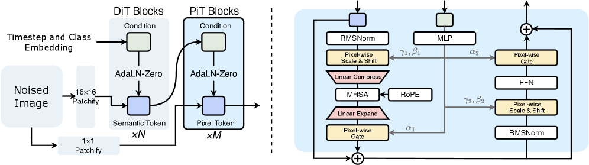
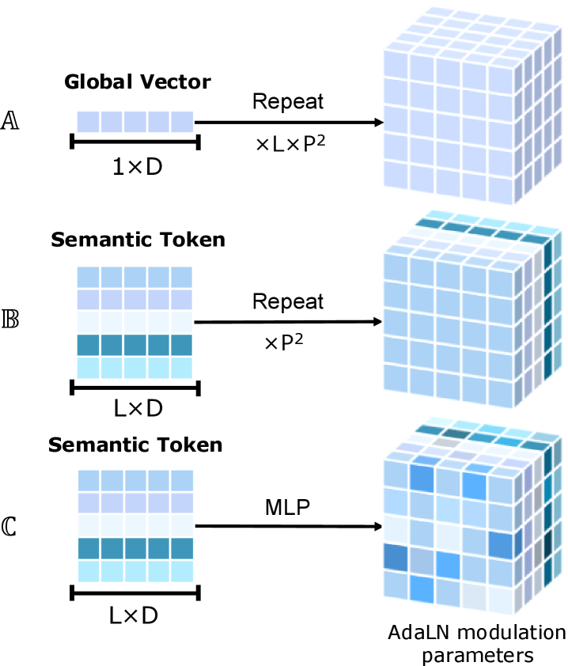

# PixelDiT: Pixel Diffusion Transformers for Image Generation

## 📋 메타 정보

| 항목 | 내용 |
|---|---|
| **제목** | PixelDiT: Pixel Diffusion Transformers for Image Generation |
| **저자** | Yongsheng Yu, Wei Xiong, Weili Nie, Yichen Sheng, Shiqiu Liu, Jiebo Luo |
| **소속** | NVIDIA + University of Rochester |
| **공개일** | 2025-11-25 (v1) / 2026-04-16 (v2) |
| **학회** | CVPR 2026 |
| **분야** | 이미지 생성(image generation), pixel-space diffusion(픽셀 공간 확산) |
| **arXiv** | [abs](https://arxiv.org/abs/2511.20645) · [pdf](https://arxiv.org/pdf/2511.20645) · [html](https://arxiv.org/html/2511.20645v2) |
| **코드** | [NVlabs/PixelDiT](https://github.com/NVlabs/PixelDiT) |
| **외부 모델/데이터** | DINOv2(표현 정렬용, 동결) · ImageNet-1K · 26M 이미지-텍스트 쌍(T2I) |

---

## 📖 주요 용어 사전 (Glossary)

### 아키텍처
- **pixel-space diffusion(픽셀 공간 확산)**: 이미지를 VAE로 압축하지 않고 원본 RGB 픽셀(raw RGB pixel) 그대로 확산 학습을 돌리는 방식. (대부분의 모델은 VAE가 만든 잠재 공간(latent space)에서 작업)
- **autoencoder/VAE(오토인코더)**: 이미지를 작은 잠재 표현으로 압축(encode)했다가 다시 복원(decode)하는 모듈. 기존 latent diffusion(잠재 확산)의 1단계. PixelDiT는 이걸 **없앤다**.
- **dual-level(이중 레벨) 구조**: 큰 단위(patch, 패치)와 작은 단위(pixel, 픽셀) 두 층의 Transformer를 쌓아, 의미는 패치에서·디테일은 픽셀에서 따로 처리하는 PixelDiT의 핵심 설계.
- **DiT Block(패치 레벨 블록)**: 16×16 패치 토큰들끼리 global attention(전역 어텐션)을 거는 표준 DiT 블록. 전역 의미·구도 담당.
- **PiT Block(픽셀 레벨 블록)**: 패치 안 개별 픽셀을 다듬는 블록. Pixel Transformer. 질감(texture) 담당.
- **pixel token compaction(픽셀 토큰 압축)**: 패치 1개 안의 p² 픽셀을 어텐션 직전에 토큰 1개로 압축(Linear Compress)했다가 어텐션 후 펼치는(Linear Expand) 기법. 어텐션 비용을 패치 크기의 네제곱만큼 절감.
- **pixel-wise AdaLN(픽셀별 적응 정규화)**: 패치 의미 정보를 픽셀 레벨로 흘릴 때, 패치 안 픽셀마다 **제각각 다른** modulation(변조) 파라미터를 만들어 주입하는 방식. (일반 AdaLN은 토큰 하나에 변조값 하나)

### 핵심 개념
- **Rectified Flow(직선 흐름)**: 노이즈와 이미지를 직선으로 잇고 그 위의 velocity(속도)를 맞추도록 학습하는 flow matching(흐름 정합) 계열 방법.
- **REPA (REpresentation Alignment, 표현 정렬)**: 학습 중 모델 내부 특징을 동결된 외부 인코더(DINOv2)의 의미 특징과 닮도록 끌어당기는 보조 손실. PixelDiT에선 **선택이 아니라 필수**(아래 Q2).
- **AdaLN-Zero**: DiT의 표준 조건 주입 방식. 조건(timestep, class)으로 LayerNorm의 scale·shift·gate를 만들되 초기엔 0으로 두어 안정 학습.

### 비교 기법
- **PixelFlow / JiT / FractalMAR**: 기존 pixel-space 생성 모델들. PixelDiT가 비교·추월 대상으로 삼음.
- **RAE / REPA(latent)**: 잠재 공간 기반 최상위 baseline. PixelDiT가 "코앞까지 따라붙은" 상대.

### 평가 지표
- **FID (gFID, 낮을수록 좋음)**: 생성 분포와 실제 분포의 거리. 이미지 품질·다양성 종합 지표.
- **IS (Inception Score, 높을수록 좋음)** / **Recall(높을수록 다양)**.
- **GenEval / DPG-bench**: text-to-image(T2I)에서 프롬프트를 얼마나 정확히 따르는지 측정.

---

## 🎯 논문 요약 (TL;DR)

**한 줄**: VAE(오토인코더)를 완전히 없애고 원본 픽셀에서 바로 학습하는 단일 단계(single-stage) 확산 Transformer를, "패치+픽셀 이중 레벨" 구조 하나로 효율화해 ImageNet 256 FID **1.61**을 달성 — 모든 pixel-space 모델을 추월하고 최상위 latent 모델 바로 아래까지 도달.

**핵심 문제**: 기존 이미지 생성은 ①VAE로 압축 → ②잠재 공간에서 확산, 이라는 2단계다. VAE는 (a) 압축·복원 시 디테일이 깨지는 lossy(손실) 문제와 (b) 미리 동결돼 생성 목표에 맞춰 함께 학습되지 못하는(joint optimization 불가) 문제를 안고 있다. 그렇다고 픽셀에서 직접 하면 토큰 수가 폭발해(1024²면 백만 토큰) 어텐션 비용이 감당 불가.

**해결책**: 픽셀을 두 층으로 나눠 처리한다. 패치 레벨(DiT)은 적은 수의 패치 토큰끼리만 전역 어텐션을 걸어 의미·구도를 잡고, 픽셀 레벨(PiT)은 픽셀을 압축(compaction)해 어텐션 길이를 패치 수준으로 유지하면서 질감을 다듬는다. 둘은 **픽셀별 AdaLN**으로 연결한다. 여기에 DINOv2 표현 정렬(REPA)을 붙여 픽셀 공간에서 사라진 "의미 정리" 역할을 보강한다.

**검증**: ImageNet 256 FID 1.61 / 512 FID 1.81, T2I GenEval 0.78(512²). 단 797M 파라미터·311 GFLOPs로, 더 크고 무거운 pixel 모델들(JiT-G 2B·766 GFLOPs, PixelFlow 5818 GFLOPs)을 능가.

---

## 🔑 핵심 기여 (Contributions)

1. **VAE 없는 단일 단계 픽셀 확산**: 오토인코더를 제거해 lossy 복원·error accumulation(오차 누적)을 원천 차단하고, 전체를 end-to-end로 합동 최적화 가능하게 만듦.
2. **이중 레벨 Transformer 구조**: 패치 레벨 DiT(의미) + 픽셀 레벨 PiT(질감)의 분업으로, 픽셀 공간 학습의 계산량 문제를 구조적으로 해결.
3. **픽셀 토큰 압축(pixel token compaction)**: 어텐션 시퀀스 길이를 H×W에서 패치 수 L로 줄여 어텐션 비용을 패치 크기의 네제곱만큼 절감.
4. **픽셀별 AdaLN(pixel-wise AdaLN)**: 패치 의미를 픽셀 단위로 차등 주입해 디테일 복원을 결정적으로 개선(ablation에서 FID 3.50→2.36).
5. **효율 우위 실증**: pixel 모델 중 최소 자원으로 최고 품질. 이미지 편집(editing)에서도 VAE 부재 덕에 배경 보존 우수(FlowEdit MSE 0.0015 vs FLUX 0.009).

---

## 🧩 주요 알고리즘 설명

### 1️⃣ 전체 구조 — 패치 레벨(DiT) → 픽셀 레벨(PiT)

*픽셀을 통째로 Transformer에 넣으면 토큰이 너무 많아 어텐션이 폭발하므로, "큰 단위로 의미 잡고 → 작은 단위로 디테일 다듬는" 두 단계로 쪼갠다.*

입력 노이즈 이미지(noised image)는 두 경로로 patchify(패치화)되어 각각 토큰이 만들어지고, 그 토큰을 Transformer 블록이 가공한다. **patchify는 입력 토큰을 만드는 단계이고, DiT/PiT Block이 그 토큰을 처리하는 단계** — 둘을 헷갈리지 말 것.

데이터 흐름:
1. Noised Image → **16×16 patchify → Semantic Token(의미 토큰)** 생성. 이 토큰이 **DiT Block ×N에 입력**되어 가공됨(패치 토큰끼리 global attention으로 전역 의미·구도 정리).
2. Noised Image → **1×1 patchify → Pixel Token(픽셀 토큰)** 생성. 이 토큰이 **PiT Block ×M에 입력**됨. 픽셀 단위 질감 담당. 픽셀 토큰의 차원(D_pix)은 패치 토큰 차원 D보다 훨씬 작게(~16) 둬서 메모리를 아낌.
3. DiT Block이 가공한 Semantic Token이 → **PiT Block의 condition(조건)으로 전달**(그림에서 Semantic Token 박스 → PiT Blocks의 Condition으로 가는 화살표). PiT Block은 이 조건으로 픽셀을 pixel-wise AdaLN 변조(§3️⃣).
4. timestep·class 임베딩이 condition으로 두 블록 모두에 AdaLN-Zero로 주입.

> **왜 16×16 토큰을 "Semantic(의미)"이라 부르나?** patchify 연산 자체가 의미를 만드는 건 아니다(단지 16×16 픽셀 블록을 벡터 하나로 선형 투영). "Semantic"은 **연산이 아니라 그 토큰이 맡는 역할을 가리키는 이름**이다 — ① 1×1 **Pixel Token(질감 담당)**과 짝을 이루는 대비적 명명으로, 256픽셀을 한 단위로 묶은 큰 토큰이 상대적으로 넓은 맥락을 담기에 "의미" 쪽을 맡고, ② 이 경로가 DiT Block ×N + **REPA(DINOv2 정렬, §4️⃣·Q2)**를 거치며 실제로 의미 표현을 담도록 학습되기 때문. 즉 patchify 직후엔 "raw 패치 임베딩"이지만, 그 슬롯이 의미를 맡도록 정해져 있어 미리 그렇게 부른다.

**두 patchify의 역할 대비** — 같은 노이즈 이미지를 서로 다른 입자 크기로 토큰화해 "넓게 보는 눈"과 "세밀하게 보는 눈"을 나눠 만든다.

| | **16×16 patchify** | **1×1 patchify** |
|---|---|---|
| 하는 일 | 16×16 픽셀 블록을 벡터 1개로 묶음 | 픽셀 1개를 토큰 1개로 |
| 만드는 토큰 | **Semantic Token**(의미 토큰) | **Pixel Token**(픽셀 토큰) |
| 토큰 수 (1024² 기준) | 적음 — 64×64 = 4,096개 | 많음 — 픽셀 전체(백만 단위) |
| 토큰 차원 | 큼 (D) | 작음 (D_pix ≈ 16) |
| 들어가는 경로 | DiT Block ×N | PiT Block ×M |
| 담당 | **전역 의미·구도** (대상 위치, 전체 배치) | **국소 질감·디테일** (털 결, 엣지) |

- **16×16 = 효율 담당**: 패치로 묶으면 토큰 수가 256배 줄어, 비싼 global attention(토큰 수의 제곱 비용)을 감당 가능하게 만든다. 넓은 영역을 한 단위로 보니 전체 구도를 잡기에도 자연스럽다.
- **1×1 = 디테일 담당**: 픽셀을 그대로 토큰화해야 미세 질감이 안 뭉개진다. 대신 토큰 폭발 문제는 차원을 작게(~16) 두고 §2️⃣의 **픽셀 토큰 압축(Linear Compress/Expand)**으로 어텐션 길이를 패치 수준까지 줄여 해결.
- 둘 중 하나만으론 안 된다: 16×16만 쓰면(=일반 latent DiT) 패치 안 디테일이 뭉개지고, 1×1만 쓰면 토큰 폭발로 학습 불가. **"의미는 큰 단위에서, 디테일은 작은 단위에서"** 분업이 이중 레벨 구조의 출발점.

### 2️⃣ PiT Block 내부 — 압축 어텐션 + 픽셀별 변조

*픽셀 토큰은 수가 많으므로(패치당 256개), 그대로 어텐션하면 비싸다. 압축해서 어텐션하고 다시 펼친다.*

위 그림 오른쪽 블록 다이어그램 흐름:
- `RMSNorm → Pixel-wise Scale & Shift → **Linear Compress** → MHSA(+RoPE) → **Linear Expand** → Pixel-wise Gate → (+residual)`
- 이어서 `RMSNorm → Pixel-wise Scale & Shift → FFN → Pixel-wise Gate → (+residual)`
- **Linear Compress/Expand**가 바로 pixel token compaction: 패치 안 p² 픽셀을 토큰 1개로 압축해 어텐션 시퀀스 길이를 H×W → L=(H/p)(W/p)로 유지. 어텐션 비용 p⁴배 절감.
- 변조(scale/shift/gate, γ·β·α)는 모두 **Pixel-wise** — 패치 의미 토큰을 MLP로 받아 픽셀마다 다른 값을 생성.

### 3️⃣ 픽셀별 AdaLN — 의미를 픽셀에 차등 주입

*"패치 하나의 의미를 그 안 256개 픽셀에 똑같이 뿌리면" 디테일이 뭉개진다. 픽셀마다 다르게 줘야 질감이 산다.*

세 가지 조건 주입 방식 비교(C가 PixelDiT 채택):
- **(A) Global Vector**: 전역 벡터 하나를 모든 픽셀에 그대로 반복(repeat). 가장 단순, 디테일 약함.
- **(B) Semantic Token repeat**: 패치별 의미 토큰을 패치 안 픽셀에 반복. 패치 간 차이는 생기나 패치 *내부* 픽셀은 동일.
- **(C) Semantic Token → MLP → pixel-wise AdaLN modulation parameters** ✅: 의미 토큰을 MLP로 변환해 **패치 안 픽셀마다 다른** AdaLN 파라미터 생성. 조건 사상 Φ: ℝ^D → ℝ^(p²·6·D_pix)로 픽셀별 6종(scale/shift/gate × 2) 변조값을 한 번에 산출.

### 4️⃣ 학습 손실 — Rectified Flow + REPA

*픽셀 공간은 질감 같은 저수준 통계가 압도적이라 모델이 의미를 못 잡기 쉽다. velocity 손실만으론 부족해 DINOv2로 의미를 보강한다.*

- 주 손실: Rectified Flow의 velocity-matching — 예측 속도장과 목표 속도장의 차이를 최소화(평이하게: 노이즈→이미지 직선 위의 진행 방향을 맞춤).
- 보조 손실: REPA — 패치 특징을 동결 DINOv2 특징과 정렬. 가중치 λ_repa = 0.5.
- 최종 = velocity 손실 + 0.5 × REPA 손실. (REPA 효과는 Q2 참조)

### 5️⃣ 학습·추론 설정

*하이퍼파라미터는 한 곳에만 모아 둔다.*

| 구분 | ImageNet | Text-to-Image |
|---|---|---|
| 데이터 | ImageNet-1K | 26M 이미지-텍스트 쌍 |
| 1단계 | 512², 320 epoch (lr 1e-4 → 160ep부터 1e-5) | from scratch 512², 400K iter (bs 1024, shift α=3.0) |
| 2단계 | — | 1024² finetune 100K iter (bs 768, shift α=4.0, lr 2e-5) |
| 공통 | bs 256, EMA 0.9999, AdamW(0.9,0.999), bf16 | — |
| 추론 | FlowDPMSolver 100 step, CFG 3.25(256)/2.75 | 25 step |

> 참고: T2I의 2단계는 **단순 해상도 적응(resolution adaptation)**이며, SFT·RLHF 같은 사후학습(post-training)은 전혀 없음(Q1 참조).

---

## 📊 실험 요약

### ImageNet 256×256 (Class-conditional)
*VAE 없는 픽셀 모델이 같은 자원에서 기존 픽셀·잠재 모델을 따라잡는지 확인하는 메인 실험.*

| 모델 | 종류 | gFID↓ | GFLOPs | 파라미터 |
|---|---|---|---|---|
| FractalMAR-H | pixel | 6.15 | — | — |
| PixelFlow-XL | pixel | 1.98 | 5,818 | — |
| JiT-G | pixel | 1.82 | 766 | 2B |
| **PixelDiT-XL (320ep)** | **pixel** | **1.61** (IS 292.7, Recall 0.64) | **311** | **797M** |
| REPA | latent | 1.42 | — | — |
| RAE-XL | latent | 1.13 | — | — |

→ pixel 모델 중 **압도적 1위**, 동시에 자원은 최소. latent 최상위(RAE 1.13)와는 아직 격차.

### ImageNet 512×512
*고해상도에서도 압축 트릭이 통하는지, latent baseline을 넘는지 확인.*

- PixelDiT: gFID **1.81**, IS 278.6, Recall 0.67 → latent baseline REPA(2.08) **추월**.

### Text-to-Image
*실제 프롬프트 따르기 성능 확인.*

| 해상도 | GenEval↑ | DPG↑ | 처리량 |
|---|---|---|---|
| 512² | 0.78 | 83.7 | 1.07 samples/s |
| 1024² | 0.74 | 83.5 | 0.33 samples/s |

### Ablation — 구조 기여도 (ImageNet 256, 80ep)
*어떤 설계가 점수를 끌어내렸는지 분해.*

| 구성 | gFID↓ |
|---|---|
| vanilla DiT/16 | 9.84 |
| + RoPE, RMSNorm | 8.53 |
| + 이중 레벨 + 픽셀 압축 | **3.50** (결정타) |
| + 픽셀별 AdaLN | **2.36** → (320ep) **1.61** |
| REPA 제거 시 | 6.58 (vs 2.36) |

### 편집(Editing)
*VAE 제거가 실용 작업에서 이득을 주는지 확인.*

- FlowEdit 배경 보존 MSE: PixelDiT **0.0015** vs FLUX 0.009 → **약 6배 우수**(미편집 영역 보존).

---

## 💬 Q&A

### Q1. 이 연구는 SFT(지도 미세조정) 같은 사후학습을 하나?
*아니요. PixelDiT는 순수 지도학습으로 끝나며, 보상 기반 정렬이 없다.*

- 최근 모델들([[paper_qwen_image_2]], [[paper_z_image]], [[paper_longcat_image]])이 거의 다 **사전학습 → SFT → RLHF(DPO/GRPO)** 3단인 것과 달리, PixelDiT는 그 단계가 **전혀 없음**.
- ImageNet 모델: 완전 단일 단계(320 epoch 한 번).
- T2I 모델: 2단계지만 둘 다 그냥 지도학습. 2단계("finetune")는 사람 선호·보상 모델이 개입하는 SFT가 아니라 **512²→1024² 해상도 적응**일 뿐(데이터·손실 동일).
- 의미: 이 논문은 "새 백본 구조가 잘 된다"를 증명하는 게 목적이라 post-training을 의도적으로 배제. 따라서 GenEval 0.74도 RLHF로 끌어올린 게 아닌 순수 구조·데이터의 결과 → 거꾸로 DPO/GRPO를 얹으면 더 오를 여지가 남음.

### Q2. REPA(DINOv2) 의존도가 왜 큰가?
*VAE가 하던 "의미 정리" 일을 픽셀 공간에선 아무도 안 해주기 때문. 그 빈자리를 DINOv2가 메운다.*

- **latent 모델**: VAE 인코더가 단순 압축기가 아니라, 의미적으로 잘 정돈된 표현을 미리 만들어 줌. 확산 모델은 "반쯤 의미 정리된 공간"에서 출발. → REPA는 원래 latent에선 **있으면 좋은 수렴 가속기** 수준.
- **픽셀 모델(PixelDiT)**: 입력이 날것의 RGB. ① 질감·엣지 등 저수준 통계가 데이터를 압도해, velocity 손실만 보면 모델이 "질감 베끼기"에만 매몰되고 전역 의미를 안 배움. ② 의미 표현을 0부터 자력으로 짜내야 해 느리고 어려움.
- **REPA의 역할**: 동결 DINOv2(대규모 자기지도학습으로 의미 구조를 이미 아는 모델)의 특징과 패치 특징을 정렬 → 사라진 VAE의 "의미 정리" 역할을 외부에서 주입.
- **증거**: REPA 제거 시 80ep FID 6.58(질감만 배운 상태) vs 포함 시 2.36. latent에선 "가속기"였던 게 픽셀에선 "생명줄"로 격상.
- **해석**: 약점이라기보다 "VAE를 없앤 대가". 의미 정리를 VAE가 하느냐(latent) DINOv2가 하느냐(pixel)의 차이 → "순수 픽셀 자력 학습"이라 부르기엔 단서가 붙음.

---

## 📝 한 줄 요약 (전체)

VAE를 없앤 단일 단계 픽셀 확산을, "패치(의미)+픽셀(질감) 이중 레벨 Transformer + 픽셀 토큰 압축 + 픽셀별 AdaLN" 세 장치로 효율화하고 DINOv2 표현 정렬로 의미를 보강해, **797M·311 GFLOPs라는 작은 자원으로 ImageNet 256 FID 1.61을 달성** — 모든 pixel-space 모델을 추월하고 최상위 latent 모델 바로 아래까지 도달한 CVPR 2026 논문.

---

## 🔗 관련 메모리

- [[paper_pid]] — 같은 NVIDIA 계열. VAE 디코더만 픽셀 확산으로 교체(부분) vs PixelDiT는 전체를 픽셀로(완전)
- [[paper_asymflow]] — 픽셀 공간 flow matching 부활 흐름
- [[reference_pretrained_backbone_reuse_landscape]] — DINOv2 같은 외부 표현 재사용 관점
- [[paper_qwen_image_2]], [[paper_z_image]], [[paper_longcat_image]] — 대조군: SFT/RLHF 풀스택 post-training을 쓰는 모델들 (PixelDiT는 안 씀)
