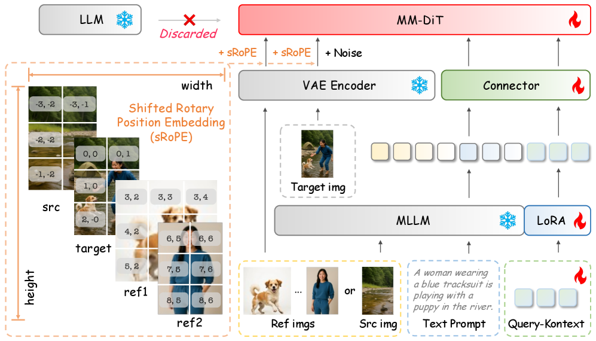

# Query-Kontext: VLM에 추론을, 디퓨전에 합성을 — 128개 쿼리 토큰으로 잇는 통합 생성·편집 모델

## 1. 메타 정보

| 항목 | 내용 |
|---|---|
| 논문 제목 | Query-Kontext: An Unified Multimodal Model for Image Generation and Editing |
| 저자/소속 | Yuxin Song, Wenkai Dong, Shizun Wang, Qi Zhang, Song Xue, Tao Yuan, Hu Yang, Haocheng Feng, Hang Zhou, Xinyan Xiao, Jingdong Wang — **Baidu** |
| 공개일 | 2025-09 (arXiv 2509.26641) |
| 분야 | unified multimodal generation(통합 멀티모달 생성) — text-to-image(텍스트→이미지) + image editing(편집) + customization(피사체 맞춤) + multi-subject composition(다중 피사체 합성) |
| 논문 링크 | [arXiv abstract](https://arxiv.org/abs/2509.26641) · [PDF](https://arxiv.org/pdf/2509.26641) · [HTML](https://arxiv.org/html/2509.26641v1) |
| 코드/모델 | **현재 미공개** (논문에 repo·체크포인트 명시 없음). 백본 MMDiT도 인하우스 — 재현 난도 높음 |
| 베이스(재활용) | MLLM = **Qwen2.5-VL-7B**(동결 재활용) · diffusion = **인하우스 MMDiT ~10B**(처음부터 학습) · VAE = SD 계열(8× 압축) |
| 사용한 외부 데이터 | T2I 30M(영, ShareGPT-4o-Image·BLIP-3o)+170M(중) · 편집 3M(NHR-Edit·GPT-Edit·OmniEdit)+2M(영상유래) · 맞춤 ~1.8M(Subject-200K 등) · 다중피사체 40K+(MUSAR-Gen 등) |

> 전체 구조 (논문 Fig.2): MLLM이 텍스트 표현 + Query-Kontext 토큰을 만들고, VAE 인코더의 저수준 단서와 함께 Connector를 거쳐 MM-DiT로 들어간다.
> 

> 한 모델이 다루는 네 과제 (논문 Fig.1): 생성 / 피사체 맞춤 / 지시 기반 편집 / 다중 피사체 합성.
> 

---

## 2. 주요 용어 사전 (Glossary)

> 왜 먼저 두는가? 이 논문은 VLM 용어(MLLM·LoRA)와 diffusion 용어(MMDiT·VAE·RoPE)가 한 파이프라인에 섞여 있어, 용어를 먼저 풀어두지 않으면 본문 흐름이 끊긴다.

### 아키텍처
- **MLLM (Multimodal Large Language Model, 멀티모달 거대 언어모델)**: 이미지+텍스트를 함께 읽고 이해하는 LLM. 여기선 **Qwen2.5-VL-7B**를 가져와 "무엇을 어떻게 그릴지 판단하는 두뇌"로 쓴다.
- **MMDiT (Multi-Modal Diffusion Transformer, 멀티모달 확산 트랜스포머)**: 텍스트·이미지 토큰을 하나의 attention(어텐션)에서 섞는 확산 트랜스포머. 여기선 인하우스 **~10B** 모델이 "고화질 합성 담당".
- **VAE (Variational Auto-Encoder, 변분 오토인코더)**: 이미지를 작은 latent(잠재) 텐서로 압축/복원. 여기선 두 가지 역할 — ① MMDiT가 작업하는 latent 공간 제공, ② 입력 이미지의 **저수준 단서(low-level)** 추출(아래 참조).
- **Connector (커넥터)**: MLLM이 뱉은 토큰을 diffusion이 알아먹는 latent 공간으로 변환하는 **2층 MLP(~50M 파라미터)**. ⚠️ **텍스트 인코더가 아니다** — 텍스트 인코딩은 VLM이 겸하고, Connector는 VLM 출력 공간 ↔ diffusion latent 공간을 맞춰주는 **정렬용 어댑터(통역사)**. 가져온 VLM·diffusion을 잇는 다리라 사전학습본이 없어 **처음부터 새로 만들어 학습**(kontext 토큰도 마찬가지). 자세히 Q4.
- **Diffusion Head (디퓨전 헤드)**: 1단계 학습에서 본진 MMDiT 대신 쓰는 **가벼운 작은 디퓨전(~870M)**. "개념을 싸게 빨리 잡는 연습용 합성기".

### 핵심 개념 (이 논문의 차별점)
- **Query-Kontext / kontext 토큰**: MLLM이 출력하는 **고정 길이 128개(K=128) 쿼리 토큰**. ① 텍스트에서 온 **semantic cue(의미 단서)** = "무엇을 그릴지" + ② 입력 이미지에서 온 **visual condition(시각 조건)** = "어떤 시각 단서를 반영할지" 를 한 묶음에 압축. 이게 VLM↔diffusion을 잇는 다리. ("Kontext"는 FLUX-Kontext처럼 입력 이미지를 맥락 조건으로 쓴다는 뜻, "Query"는 학습형 쿼리 토큰이라는 뜻.)
- **discarded(폐기) 경로**: 그림 Fig.2 좌상단의 LLM 출력 중 **언어 생성용(다음 단어 예측) 출력은 버리고**, kontext 쿼리 토큰의 hidden state(은닉 표현)만 diffusion으로 넘긴다는 표시. 즉 VLM을 "텍스트를 뱉는 기계"가 아니라 "조건 토큰을 뽑는 인코더"로 쓴다.
- **low-level image encoder(저수준 이미지 인코더)**: 마지막 단계에 추가되는 VAE 기반 경로. kontext 토큰이 약한 **픽셀 단위 질감·정체성(fine-grained structural/textural cue)** 을 보강. 의미는 kontext 토큰, 디테일은 VAE로 **역할을 또 한 번 분리**.
- **Shifted 2D RoPE (이동 2차원 회전 위치 임베딩)**: 입력 이미지를 두 종류로 구분해 위치 좌표를 다르게 부여. **source(편집 대상, 픽셀까지 그대로 보존)** 는 좌표를 음수 방향(−i, −j)으로, **reference(참조, 정체성만 유지)** 는 양수 방향(이미지마다 i+w·n, j+h·n)으로 이동. "이건 베껴야 할 그림 vs 특징만 가져올 그림"을 모델이 헷갈리지 않게 함.

### 학습/정렬
- **LoRA (Low-Rank Adaptation, 저랭크 적응)**: 큰 모델 가중치는 동결하고 작은 보조 행렬만 학습하는 미세조정. 여기선 MLLM(1단계)과 diffusion(3단계, rank 256)에 사용.
- **progressive training(점진적 학습)**: 작은 헤드로 시작 → 큰 MMDiT로 확장 → 디테일 보강, 3단계로 키우는 전략. 큰 diffusion을 처음부터 학습하는 비용의 **~10%** 만 든다.

### 평가 지표
- **GenEval / DPG**: 일반 T2I 능력(개수·색·위치 등) 평가.
- **GEdit-Bench**: 지시 기반 편집 품질 벤치(영·중).
- **DINO / CLIP-I / CLIP-T**: 피사체 맞춤 평가 — DINO·CLIP-I는 참조 이미지와 **정체성 유사도**, CLIP-T는 텍스트 지시 **반영도**.

---

## 3. 논문 요약 (TL;DR)

**한 줄**: "이미지 생성에 필요한 '머리쓰기(multimodal generative reasoning)'는 강력한 VLM에게, '그림 그리기(visual synthesis)'는 diffusion에게 분업시키고, 그 둘을 128개짜리 Query-Kontext 토큰으로 잇는다 — 생성·편집·맞춤·합성을 한 모델로."

- **핵심 문제**: 기존 통합 모델은 두 갈래 모두 약점. ① VLM이 픽셀까지 직접 책임지면(autoregressive 이미지 토큰) 추론은 좋아도 **화질이 약함**. ② diffusion에 텍스트만 흘려주면 화질은 좋아도 **복잡한 멀티모달 지시(여러 참조 조합·편집)를 이해하는 추론력이 약함**.
- **해결책**: 역할을 명확히 나눈다. VLM(Qwen2.5-VL-7B)이 모든 멀티모달 입력을 읽고 **의미+시각 조건을 담은 128개 kontext 토큰**을 뽑아 주면, diffusion은 그 조건만 받아 고화질 합성에 전념. 추가로 **저수준 VAE 인코더**로 디테일을 보강하고, **shifted RoPE**로 편집용/참조용 이미지를 구분.
- **검증**: GenEval **0.88**(BAGEL과 동률), GEdit-Bench 영 **7.66**/중 **7.65**(Qwen-Image·GPT-Image 상회), DreamBooth 단일 피사체 DINO **0.786**(MetaQuery 0.737 능가). 단 photorealism(사실감) 점수는 RL/SFT 후처리를 안 해서 아직 약하다고 인정.

---

## 4. 핵심 기여 (Contributions)

1. **역할 분리형 통합 설계**: "추론 = VLM, 합성 = diffusion"을 **128개 Query-Kontext 토큰**(semantic cue + visual condition 통합)으로 연결. 단순 텍스트 쿼리가 아니라 멀티모달 조건 캐리어인 점이 MetaQuery 계열과의 차별점.
2. **3단계 점진적 학습 레시피**: 작은 헤드(~870M) → 본진 MMDiT(~10B) → 저수준 인코더 추가. 큰 diffusion을 scratch 학습하는 비용의 **~10%** 로 통합 능력 확보.
3. **저수준 VAE 인코더의 늦은 합류**: 의미(kontext 토큰)와 디테일(VAE)을 **이중으로 분리** — 정체성 보존·편집 충실도 향상.
4. **Shifted 2D RoPE**: source(편집)와 reference(참조) 이미지를 위치 좌표로 분리해, 편집·맞춤·다중합성을 한 구조에 자연스럽게 통합.
5. **대규모 멀티태스크 데이터 파이프라인**: 생성·편집·맞춤·다중피사체 4과제용 데이터를 오픈소스 + 합성(SAM·Grounding-DINO·FLUX-Kontext·UNO-FLUX·GPT-Image 등)으로 구축.

---

## 5. 주요 알고리즘 설명

### 5.1 전체 데이터 흐름

> 왜? 이 모델이 "VLM과 diffusion을 어디서 끊고 어디서 잇는지"를 한눈에 보기 위해.

```
[텍스트 지시 + 참조/편집 이미지들]
        │
        ▼
   MLLM (Qwen2.5-VL-7B)                 ← 멀티모달 입력을 읽고 "무엇을 어떻게"를 판단
        │
        ├─ 언어 생성용 출력 ……………………… Discarded(폐기)
        │
        ├─ Query-Kontext 토큰 (K=128)  ── 의미 단서 + 시각 조건을 압축
        │        │
        │        ▼
        │   Connector (2층 MLP, ~50M)  ── diffusion latent 공간으로 정렬
        │        │
입력 이미지 ─ VAE Encoder(저수준 단서) ─┤   ← 3단계에서 추가: 픽셀 질감·정체성 보강
        │        │
   텍스트 임베딩 ─┘
        │
        ▼  (모두 concat, shifted 2D RoPE로 src/ref 위치 구분)
     MM-DiT (~10B)  ──▶ 고화질 이미지 합성
```

핵심은 **MLLM의 출력 중 "다음 단어 예측(언어 생성)"은 버리고(Fig.2의 "Discarded"), "이해한 중간 표현(hidden state)"만 가져다 쓴다**는 점이다. 그 hidden state가 곧 **텍스트 임베딩 + kontext 토큰 128개**이고, 둘을 (3단계부턴 VAE 저수준 토큰까지) concat해 MM-DiT에 넣는다. 즉 버리는 출력(언어 생성)과 쓰는 출력(hidden state)은 서로 다른 것 — 자세한 ①/② 구분은 Q4. VLM을 "텍스트 생성기"가 아니라 "조건 인코더"로 재정의한 셈이다.

### 5.2 Query-Kontext 토큰 — 다리의 정체

> 왜? VLM과 diffusion은 표현 공간이 다른데, 그 간극을 고정 길이 토큰 묶음으로 메우는 게 이 논문의 심장이기 때문.

MLLM이 출력하는 **128개 쿼리 토큰** Q = {q₁, …, q₁₂₈} 안에 두 정보가 함께 들어간다.
- **무엇을 그릴지** — 텍스트 프롬프트에서 온 semantic cue(의미 단서).
- **어떻게 시각 단서를 반영할지** — 입력 이미지에서 온 visual condition(시각 조건).

이 128개는 입력 길이와 무관하게 **고정**이라, 참조 이미지가 1장이든 여러 장이든 diffusion에 들어가는 조건 길이가 일정하다. Connector(2층 MLP)가 이를 diffusion latent로 변환하고, 텍스트 임베딩과 concat(이어붙임)되어 MMDiT로 들어간다.

### 5.3 Shifted 2D RoPE — 편집용 vs 참조용 구분

> 왜? 같은 "입력 이미지"라도, 편집 대상은 픽셀까지 보존해야 하고 참조 인물은 특징만 가져오면 된다. 둘을 같은 위치 좌표로 넣으면 모델이 역할을 혼동한다.

- **source(편집 대상)**: 좌표를 음수 방향으로 이동 → (i′ₛᵣc, j′ₛᵣc) = (−i, −j). 타겟과 좌표를 어긋나게 두어 "원본 픽셀을 그대로 참조"하게 유도.
- **reference(참조 이미지, n번째)**: 좌표를 양수 방향으로 이미지마다 이동 → (iⁿ_ref, jⁿ_ref) = (i + w·n, j + h·n). 여러 참조가 서로 겹치지 않게 분리.

어블레이션(논문 Table 9)에서 source 처리 시 DINO **0.865** / CLIP-I **0.914**, reference 처리 시 **0.786** / **0.858** 로 — 픽셀 보존이 필요한 편집(source)에서 정체성 유사도가 더 높게 나오는 걸 확인.

### 5.4 3단계 점진적 학습

> 왜? 화질 좋은 큰 diffusion을 처음부터 통합 학습시키면 비싸고 불안정하다. 작게 시작해 키우면 싸고 안정적이다.

| 단계 | step / batch | 학습 대상 | 동결 | 과제·목적 |
|---|---|---|---|---|
| **1단계 (개념 잡기)** | 72K / 512 | MLLM의 **LoRA** + 가벼운 헤드(~870M) + Connector + kontext 토큰 | MLLM 본체 | T2I·이미지 복원·이미지 변환 — "생성적 추론력"을 깨우고 instruction 이해·grounding·시각 참조 능력을 기름 |
| **2단계 (규모 키우기)** | 420K / 1024 | kontext 토큰 + Connector + **MMDiT 전체(~10B)** | MLLM **완전 동결**(LoRA 병합) | T2I·복원으로 빠른 정렬. ⚠️ 이 규모에선 diffusion을 통째로 동결하면 정렬 실패 → diffusion은 풀어 full 학습 |
| **3단계 (디테일 보강)** | 30K / 512 | kontext 토큰 + Connector + diffusion **LoRA(rank 256)** + **저수준 VAE 인코더** 투입 | MLLM 동결 | 편집·맞춤·다중피사체 등 실전 과제 전부 커버 |
| 해상도 업스케일 | +3K | — | — | 1024×1024 고해상도 적응 |

학습 자원: NVIDIA **H100 192장** (VLM은 tensor parallelism, diffusion은 ZeRO Stage-2 + BF16). 전체 비용은 큰 diffusion을 scratch 학습하는 것의 **약 10%**.

---

## 6. 실험 요약

> 왜? "분업 설계가 실제로 4과제 모두에서 경쟁력 있는가"를 수치로 확인하는 부분.

### 6.1 생성·편집

| 벤치마크 | 지표 | Query-Kontext | 비교 |
|---|---|---|---|
| GenEval | Overall | **0.88** | BAGEL 0.88과 동률 |
| GenEval | Counting(개수) | 0.81 | — |
| GEdit-Bench (EN) | Overall | **7.66** | Qwen-Image 7.56, GPT-Image 7.53 상회 |
| GEdit-Bench (CN) | Overall | **7.65** | Qwen-Image 7.52 상회 |

### 6.2 피사체 맞춤·다중 합성

| 벤치마크 | 지표 | Query-Kontext | 비교 |
|---|---|---|---|
| DreamBooth (단일) | DINO | **0.786** | MetaQuery 0.737, UNO-FLUX 0.760 상회 |
| DreamBooth (단일) | CLIP-I | **0.858** | MetaQuery 0.851 상회 |
| DreamBench (다중) | CLIP-T | **0.336** | 일반화 모델 중 최상위권 |
| DreamBench (다중) | DINO | 0.532 | 경쟁력 있음 |

### 6.3 한계 (저자 인정)
- **photorealism(사실감) 점수가 약함** — 화질·사실감을 끌어올리는 **RL(강화학습)이나 SFT 후처리 단계를 아직 안 넣었기 때문**. (Qwen-Image·LongCat 등이 쓰는 DPO/GRPO 류 정렬을 추후 과제로 남김.)
- 백본 MMDiT가 인하우스이고 코드·체크포인트 미공개 → **외부 재현이 어려움**.

---

## 7. 💬 Q&A

### Q1. MetaQuery와 뭐가 다른가?

> 왜 묻나? 둘 다 "VLM에서 학습형 쿼리 토큰을 뽑아 diffusion에 넘긴다"는 큰 틀이 같아서.

| | MetaQuery | Query-Kontext |
|---|---|---|
| 쿼리 토큰이 담는 것 | 주로 텍스트/의미 조건 | **의미 단서 + 시각 조건을 통합** (멀티모달) |
| 입력 이미지 디테일 | 약함 | **저수준 VAE 인코더로 별도 보강** |
| 편집/참조 구분 | 없음 | **shifted RoPE로 source/reference 분리** |
| 결과(DreamBooth DINO) | 0.737 | **0.786** |

핵심 차이는 "쿼리 토큰을 의미 전달용을 넘어 **멀티모달 조건 캐리어**로 키우고, 부족한 픽셀 디테일은 VAE로 따로 메웠다"는 점.

### Q2. 전용 텍스트 인코더(T5)가 없다? 그럼 Connector가 그 역할인가?

> 왜 묻나? "텍스트 인코더 자리를 Connector가 대체한다"고 오해하기 쉬워서.

아니다. 둘은 역할이 완전히 다르다.

- **텍스트 인코딩** → **VLM(Qwen2.5-VL)이 겸한다.** T5 같은 전용 텍스트 인코더를 따로 두지 않고, 두뇌인 VLM이 텍스트도 같이 읽어 인코딩한다.
- **Connector** → VLM 출력을 diffusion이 받을 수 있게 **공간을 맞춰주는 정렬용 어댑터**(2층 MLP, ~50M). 내용을 새로 만드는 게 아니라 형식만 바꾸는 **통역사** 역할.

학습 관점: VLM은 이미 학습된 걸 가져와 동결 재활용, diffusion은 인하우스 학습, **Connector(+kontext 토큰)는 사전학습본이 없어 처음부터 새로 만들어 학습**한다.

### Q3. VLM에서 나온 텍스트 임베딩과 kontext 토큰을 왜 둘 다 concat하나?

> 왜 묻나? kontext 토큰 하나로 충분해 보이는데 굳이 텍스트 임베딩까지 같이 넘기는 이유가 안 보여서.

VLM **한 곳에서 나온 두 출력**을 나란히 이어붙인다(3단계부턴 VAE 저수준 토큰도 추가). 둘이 **보완 관계**라서다.

| 출력 | 성격 | 담당 |
|---|---|---|
| 텍스트 임베딩 | 프롬프트를 단어별로 풀어놓은 길고 세밀한 표현 | **원본 디테일 보존** ("빨간", "3개" 같은 세부) |
| Query-Kontext 토큰 128개 | 텍스트+참조이미지를 종합·추론해 압축한 요약 | **멀티모달 종합 판단** (이미지 조건 녹임) |

- kontext 토큰만 쓰면 → 128개로 압축하며 **긴 프롬프트의 세밀한 단어 정보가 새어나감**.
- 텍스트 임베딩만 쓰면 → **참조 이미지를 종합한 멀티모달 추론이 빠짐**(편집·맞춤·합성 불가).
- 둘 다 주면 어느 한쪽의 빈틈을 서로 메운다.

**왜 더하지(add) 않고 concat하나?** MM-DiT는 attention 기반이라, 토큰을 한 줄로 나란히 늘어놓으면 모델이 그때그때 "어디를 볼지" 스스로 고른다(in-context). 더해 섞으면 정보가 뭉개지지만, concat하면 텍스트·kontext·VAE 각각의 정체성이 보존된 채 필요한 걸 골라 쓴다. 길이가 달라도 되는 것도 장점.

### Q4. 왜 MLLM의 언어 출력을 버리나(Discarded)? — concat한다며 왜 버려?

> 왜 묻나? "concat한다"(Q3)와 "버린다"가 모순처럼 보여서. 핵심은 **버리는 출력과 concat하는 출력이 애초에 서로 다른 것**이라는 점.

LLM은 입력을 처리하며 **두 종류 출력**을 만든다. 이 둘을 헷갈리면 안 된다.

| LLM 출력 | 정체 (비유) | 처리 |
|---|---|---|
| ① **hidden state(은닉 표현)** | 입력을 이해한 중간 벡터 = "머릿속 생각" | **concat** — 텍스트 임베딩도, kontext 토큰 128개도 전부 이 hidden state다 → diffusion으로 |
| ② **다음 단어 예측** | 언어 헤드(LM head)로 실제 글을 뱉는 출력 = "입으로 말하기" | **Discarded(버림)** |

즉 concat하는 건 ①, 버리는 건 ②다. **같은 걸 넣었다 뺐다 하는 게 아니라 처음부터 다른 출력**이다.

**왜 ②를 버리나?** 이 모델의 목표는 그림 합성이지 텍스트 생성이 아니다. VLM은 원래 "읽고 이해한 뒤 → 글을 써내는" 기계인데, 여기선 **"이해한 결과(① hidden state)"만 꺼내** diffusion에 주고 **"글 쓰는 기능(② 다음 단어 생성)"은 꺼버린다.** 머릿속 생각만 빌려 쓰고 입은 막는 셈 — VLM을 "텍스트 기계"에서 "조건 인코더"로 재정의한 것.

### Q5. 사전학습 백본 재사용 풍경에서 어디에 속하나?

[[reference_pretrained_backbone_reuse_landscape]] 기준 **"동결 VLM을 조건 인코더로 쓰고 diffusion을 합성기로 두는 분기"** 의 전형. 같은 계보로 MetaQuery·BLIP-3o·[[paper_ovis_image]] 가 있다. 차별점은 §4의 5개 기여(특히 멀티모달 kontext 토큰 + 저수준 인코더 + shifted RoPE).

---

## 8. 한 줄 요약 (전체)

**"추론은 동결 VLM(Qwen2.5-VL-7B), 합성은 인하우스 MMDiT(~10B)에게 맡기고, 둘을 '의미+시각 조건'을 담은 128개 Query-Kontext 토큰으로 연결 — 저수준 VAE 인코더로 디테일을 보강하고 shifted RoPE로 편집/참조를 구분해, 큰 diffusion scratch 학습의 ~10% 비용으로 생성·편집·맞춤·다중합성을 한 모델에 통합한 통합 멀티모달 모델. GenEval 0.88·GEdit 7.66로 경쟁력 있으나 사실감은 RL/SFT 후처리 부재로 아직 약함."**

---

## 9. 관련 메모리 링크

- [[reference_pretrained_backbone_reuse_landscape]] — VLM 조건 인코더 + diffusion 합성기 분기
- [[paper_ovis_image]] — 동결 이해용 LLM을 텍스트 인코더로 쓰는 같은 계보(7B DiT)
- [[paper_qwen_image_2]] · [[paper_uniref_image_edit]] · [[paper_firered_image_edit]] — 생성+편집 통합 / 편집 SOTA 비교군
- [[paper_unicustom]] — 멀티 레퍼런스 맞춤 생성(grounding-binding) 비교군
