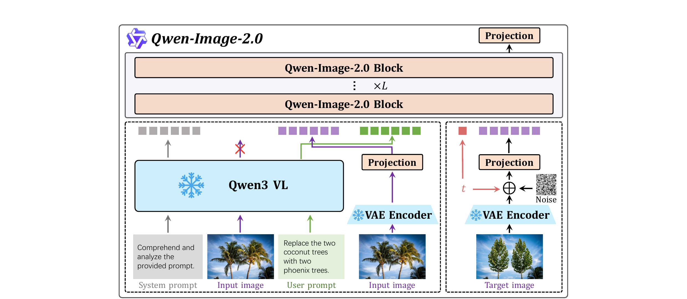

# PAPER: Qwen-Image-2.0 — 생성·편집을 한 모델에 합친 omni 이미지 기반 모델

## 0. 이 문서를 읽는 법

이 문서는 Qwen-Image-2.0 기술 보고서(arXiv 2605.10730)를 처음 읽는 사람이 흐름을 놓치지 않도록 정리한 리뷰입니다.

핵심 목표는 하나입니다.

> **Qwen-Image-2.0 은 전작의 "생성 모델(Qwen-Image)"과 "편집 모델(Qwen-Image-Edit)"을 하나로 합친(omni-capable) 통합 모델로, 텍스트 인코더를 Qwen3-VL 로 업그레이드하고 f16c64 초고압축 VAE 를 새로 달아, "글자가 빽빽한 이미지(슬라이드·포스터·인포그래픽·만화)"와 다국어 타이포그래피·고해상도 포토리얼리즘까지 한 모델로 그려내는 기반 모델 (foundation model) 이다.**

이 문서는 [PAPER_Qwen-Image.md](PAPER_Qwen-Image.md), [PAPER_Lumina-Image-2.0.md](PAPER_Lumina-Image-2.0.md) 와 같은 구성으로 읽기 쉽게 만들었습니다.

1. **메타 정보·용어 사전**: 누가/언제/무엇을, 그리고 알아둘 단어들
2. **큰 그림(TL;DR)·핵심 기여**: 무엇을 새로 풀었나
3. **모델 구조**: Qwen3-VL 인코더 + f16c64 VAE + MMDiT + Prompt Enhancer
4. **데이터 파이프라인 — 캡션 4종 + closed-loop**: 진짜 차별점
5. **학습 단계**: pre-training → continual → SFT → GRPO → DMD 증류
6. **편집(통합) 설계**
7. **실험 결과**
8. **Q&A / 한계 / 전작 대비 변화 / 관련 링크**

GitHub 렌더링 호환을 위해 수식은 LaTeX 보다 평문 표기를 우선합니다.

> ⚠️ **공개 범위 주의**: 본 리포트는 테크니컬 리포트 특성상 파라미터 수, 경쟁작 대비 정량 벤치 표, 학습 데이터 규모 등 일부 핵심 숫자를 명시하지 않습니다. 이 문서에서 "리포트 미공개"로 표기한 칸은 추후 정식 HTML/코드 공개 시 갱신이 필요합니다.

---

## 1. 메타 정보

| 항목 | 내용 |
|---|---|
| 논문 | Qwen-Image-2.0 Technical Report |
| 저자 | Qwen Team (Bing Zhao, Chenfei Wu, Deqing Li, Hao Meng, Jiahao Li 외, 총 75 인) |
| 소속 | Alibaba(알리바바) Qwen 팀 |
| 공개일 | 2026-05-11 (arXiv v1) |
| arXiv abstract | https://arxiv.org/abs/2605.10730 |
| arXiv PDF | https://arxiv.org/pdf/2605.10730 |
| 공식 코드 | https://github.com/QwenLM/Qwen-Image (전작 기준, 2.0 통합 예정) |
| 분야 | Text-to-Image, Image Editing, Diffusion Transformer, Text Rendering |
| 외부 의존 모델 | Qwen3-VL (조건 인코더, **동결**) |
| 백본 규모 | MMDiT (리포트 미공개) |
| 라이선스 | CC BY 4.0 |

---

## 2. 주요 용어 사전 (Glossary)

*다른 절에서 처음 등장하는 용어가 헷갈리지 않게 한곳에 모아둠. 풀어쓴 한국어 + 학술 원어 괄호 매칭.*

### 아키텍처

| 용어 | 풀이 |
|---|---|
| MMDiT (Multimodal Diffusion Transformer) | 텍스트와 이미지를 같은 Transformer 안에서 함께 모델링하는 DiT. 2.0 은 조건(condition)과 생성 대상(target)을 한 시퀀스로 이어붙여 처리하는 **joint condition-target** 방식 |
| condition encoder(조건 인코더) | 사용자 입력(텍스트·편집할 이미지)에서 의미 특징(semantic feature)을 뽑아 백본에 넘기는 모듈. 2.0 은 **동결된 Qwen3-VL** 사용 |
| Qwen3-VL | 알리바바가 공개한 vision-language(이미지·텍스트·비디오 이해) 모델. 원래 최대 256K 토큰까지 받음. 2.0 은 이 모델을 **얼려서(frozen)** 조건 인코더로만 재활용 |
| VAE (Variational AutoEncoder) | 이미지를 작은 latent(잠재)로 압축하고 다시 복원하는 모듈 |
| f16c64 VAE | 2.0 의 새 VAE. **공간 16배 다운샘플(f16) + 채널 64개(c64)** 의 초고압축. residual autoencoder(잔차 오토인코더) 구조 + semantic alignment loss(의미 정렬 손실)로 압축률을 올리면서도 확산 학습에 잘 맞게 보정 |
| latent(잠재) | 이미지를 VAE 가 압축한 작은 벡터 표현. 확산 모델은 이 잠재 공간에서 디노이징 |
| MSRoPE (Multimodal Scalable RoPE) | 텍스트와 이미지를 한 좌표계에 얹어 위치를 알려주는 교차모달(cross-modal) 위치 인코딩. 전작에서 이어짐 |
| bias-free multiplicative modulation | 흔한 affine(곱+더하기) 변조 대신 **곱셈만** 쓰는 변조(modulation). 더하기 항(bias)을 빼서 안정성·단순화를 노림 |
| SwiGLU | Transformer 의 활성화(activation) 모듈. 학습 중 활성값 크기를 잘 관리함 |
| QK-Norm (RMSNorm) | 어텐션의 Query·Key 벡터를 RMSNorm 으로 정규화해 깊은 모델 학습을 안정화 |

### 핵심 개념 / 학습

| 용어 | 풀이 |
|---|---|
| omni-capable(통합) | 생성(text-to-image)과 편집(instruction-based editing)을 **한 모델**이 모두 하는 것 |
| dense text(텍스트 밀집) | 한 이미지에 글자가 촘촘히 들어찬 상태(슬라이드·인포그래픽·만화·PDF 문서). 글자가 많아질수록 모양 일그러짐(glyph distortion)·글자 누락(character omission)·배치 붕괴(layout collapse)가 발생 |
| ultra-long text rendering(초장문 텍스트 렌더링) | dense text 를 이미지 안에 정확히 박는 것. 한두 단어가 아니라 슬라이드 한 장 분량의 문단·표·라벨을 다룸 |
| Prompt Enhancer (PE) | 짧고 모호한 사용자 입력을 레이아웃·관계·위계가 명시된 구조적·디테일 풍부한 긴 프롬프트로 재작성하는 모듈. Qwen3.5-9B 기반, SFT→GRPO 2단계 학습 |
| semantic alignment loss(의미 정렬 손실) | VAE 잠재 공간을 의미 표현과 정렬시켜 "확산으로 모델링하기 쉬운(diffusable)" 잠재를 만드는 손실. VA-VAE 방식 |
| multilingual typography(다국어 타이포그래피) | 언어별 글자 정확도 + 복잡한 조판(글자 배치·줄바꿈·정렬) |
| 1K token instruction | 최대 1,000 토큰 길이의 긴 지시문. 슬라이드·포스터·인포그래픽 같은 텍스트 빽빽 이미지를 한 번에 지시 |
| GRPO (Group Relative Policy Optimization) | 한 프롬프트에 여러 샘플 묶음(G개)을 생성해 묶음 내 상대 점수로 advantage(이득)를 계산하는 RL 방식 |
| composite reward(합성 보상) | 여러 평가 축(미적·정렬·인물·지시따르기·일관성)을 합쳐 만든 보상 신호 |
| Hybrid CFG | RL 정책 최적화에서 무조건(unconditional) 분기를 빼서 계산을 줄이는 기법. CFG = Classifier-Free Guidance |
| DMD (Distribution Matching Distillation) | 40-step 교사(teacher)의 분포를 4-step 학생(student)이 흉내 내도록 압축하는 distillation(증류). [[paper_dmd2]] 계열 |
| NFE (Number of Function Evaluations) | 추론 시 모델을 몇 번 호출하는가. 4-NFE = 4번만에 이미지 완성 |
| closed-loop data system | 모델이 실패한 케이스를 자동 분류해 학습 트랙으로 되돌려보내는 데이터 피드백 고리 |

---

## 3. 큰 그림 (TL;DR) 과 핵심 기여

### 3.1 TL;DR

*독자가 가장 먼저 잡아야 할 한 문장과, 그게 왜 어려운 문제인지를 먼저 깐다.*

- **한 줄**: 전작의 생성·편집 두 모델을 하나로 통합하고, 인코더를 Qwen3-VL 로, VAE 를 f16c64 초압축으로 갈아끼워 "긴 글자 빽빽 이미지 + 다국어 + 고해상도"를 한 모델로 푼다.
- **핵심 문제**: 전작 Qwen-Image 가 이미 이미지 속 글자(특히 한자) 렌더링 SOTA 였지만, ① 슬라이드 분량의 **초장문 텍스트**, ② **다국어 조판**, ③ **고해상도 포토리얼리즘**, ④ **1K 토큰 긴 지시문** 이라는 더 어려운 4개 벽이 남아 있었다.
- **해결책**: (구조) Qwen3-VL 조건 인코더 + f16c64 VAE + joint MMDiT / (데이터) closed-loop 큐레이션 / (학습) 다단계 pretrain→SFT→GRPO→DMD 증류.
- **검증**: 주로 사람 평가(human evaluation)로 전작 대비 생성·편집 모두 확실한 우위. 공개 지표로는 **LMArena 글로벌 9위·중국 모델 1위·ELO 1168**.

### 3.2 핵심 기여 (Contributions)

1. **생성·편집 통합(omni)**: 분리돼 있던 Qwen-Image(생성) + Qwen-Image-Edit(편집)를 단일 MMDiT 로 합침. 조건 인코더가 Qwen3-VL 이라 "입력 이미지 이해(편집)"가 자연스럽게 따라옴.
2. **f16c64 초압축 VAE**: 16배 다운샘플·64채널 + residual autoencoder + semantic alignment loss. 고해상도·긴 시퀀스를 적은 토큰으로 감당하는 핵심 열쇠.
3. **1K 토큰 지시문 + 초장문 텍스트 렌더링**: 슬라이드·포스터·인포그래픽·만화를 한 번의 긴 프롬프트로 생성.
4. **closed-loop 데이터 시스템**: 실패 케이스를 RL/사전학습/프롬프트 트랙으로 자동 라우팅하는 데이터 피드백 고리.
5. **GRPO + Hybrid CFG + DMD 증류**: 후처리 정렬(5종 합성 보상)과 4-NFE 가속을 한 파이프라인에 통합.

---

## 4. 모델 구조

*왜 이렇게 짰나: 편집까지 한 모델로 하려면 "입력 이미지를 이해하는 능력"과 "긴 텍스트를 이해하는 능력"이 한 인코더에 모두 필요한데, 그걸 한 번에 주는 게 Qwen3-VL 이다. 동시에 글자 빽빽·고해상도 이미지를 다루려면 잠재를 더 압축해야 해서 VAE 를 새로 짠다.*

전체는 **"동결 조건 인코더 + MMDiT 백본 + 초압축 VAE"** 세 덩어리.

### 4.0 Figure 8 — 아키텍처 한눈에 보기

*왜 이 그림부터 보나: 글로 된 세 모듈 설명을 따라가기 전에, "입력이 어떻게 토큰으로 바뀌어 한 시퀀스로 합쳐지고, 어디서 노이즈를 제거하는지"의 데이터 흐름을 그림 한 장으로 먼저 잡으면 나머지가 쉽게 읽힌다.*

> 원문 Figure 8: *Overview of the Qwen-Image-2.0 architecture.* (arXiv 2605.10730, p.10)

그림은 **위쪽의 본체(Qwen-Image-2.0 Block ×L)** 와, 그 아래 **두 개의 점선 상자(왼쪽 = 조건 인코딩, 오른쪽 = 노이즈 낀 타깃)** 로 읽습니다. 색깔 토큰의 의미부터 잡으면 전체가 풀립니다.

**색깔 토큰(맨 윗줄 작은 사각형들) 읽는 법**

| 색 | 정체 | 어디서 오나 |
|---|---|---|
| 회색(gray) | 시스템 프롬프트(system prompt) 표현 | Qwen3-VL 이 "이미지를 이해·분석하라"는 지시를 인코딩 |
| 보라(purple) | 텍스트 표현 h_y (사용자 프롬프트) | Qwen3-VL 이 user prompt 를 인코딩 |
| 초록(green) | 조건 이미지(편집할 입력 이미지)의 깨끗한 잠재 | VAE Encoder → Projection 거쳐 토큰화 |
| 빨강(red) 1개 | timestep(시간 t) / 노이즈 레벨 토큰 | 오른쪽 상자의 t 신호 |

**왼쪽 점선 상자 — 조건(condition) 만들기**

1. 입력 3종(System prompt · Input image · User prompt)이 **동결된 Qwen3-VL** 로 들어가 의미 표현이 됩니다.
2. ⚠️ **빨간 X 표시의 의미**: Qwen3-VL 이 뽑은 *시각(visual) 표현 h_x 는 버립니다.* 그림 속 X 가 바로 "이미지에 대한 VLM 의 hidden state 를 쓰지 않는다"는 표시예요. 대신 같은 입력 이미지를 **VAE Encoder → Projection** 으로 통과시킨 잠재 E(x)(초록 토큰)로 **대체(replace)** 합니다.
   - 즉 *텍스트는 Qwen3-VL 표현(보라)*, *이미지는 VAE 잠재(초록)* 를 쓰는 역할 분담. (수식 1: h = Concat(E(x), h_y) — 둘을 이어붙임)
3. 결과적으로 보라(텍스트) + 초록(조건 이미지) 토큰이 본체로 올라갑니다.

**오른쪽 점선 상자 — 타깃(target) 만들기 = 실제로 디노이징할 대상**

1. 만들어낼 정답 이미지(Target image)를 **VAE Encoder** 로 잠재화한 뒤,
2. **t(시간) 신호에 맞춰 Noise 를 ⊕(더함)** → 노이즈 낀 잠재를 만들고 **Projection** 으로 토큰화(보라/빨강 토큰).
3. 본체는 "조건(왼쪽)을 보고 이 노이즈 낀 타깃(오른쪽)에서 노이즈를 걷어내라"를 학습합니다. (flow matching 디노이징)

**위쪽 본체 — Qwen-Image-2.0 Block ×L**

- 왼쪽·오른쪽에서 올라온 모든 토큰(회색·보라·초록·빨강)을 **한 시퀀스로 이어붙여 같은 Transformer 블록 L개**에 통과(joint condition-target).
- 블록 내부 3대 장치: **MSRoPE**(위치 인코딩) · **bias-free 곱셈 변조**(수식 2: h' = αh, 더하기 β 제거) · **SwiGLU MLP**(수식 3, 활성값 폭주로 인한 뉴런 조기 포화 방지).
- 마지막 **Projection** 으로 디노이징된 잠재를 내보내고, VAE Decoder(그림 밖)가 이미지로 복원.

> 한 문장 요약: **"텍스트는 Qwen3-VL 표현으로, 이미지는 VAE 잠재로 토큰화해 한 줄로 잇고(왼쪽 조건 + 오른쪽 노이즈 타깃), 같은 MMDiT 블록 L개로 노이즈를 걷어낸다."** 빨간 X = VLM 의 이미지 표현을 안 쓰고 VAE 잠재로 갈아끼운다는 표시.

### 4.1 조건 인코더 — 동결 Qwen3-VL

- 전작은 Qwen2.5-VL(7B)을 얼려서 텍스트 인코더로 썼으나, 2.0 은 더 강한 **Qwen3-VL** 로 교체.
- 동결(frozen)이라 학습은 하지 않고 의미 특징(semantic feature)만 추출.
- Qwen3-VL 은 텍스트·이미지·비디오를 섞어 최대 256K 토큰까지 받는 모델이라, **"긴 지시문 이해(생성)" + "입력 이미지 이해(편집)"** 를 한 인코더가 동시에 담당 → 이것이 통합(omni) 설계의 근원.

### 4.2 백본 — MMDiT (joint condition-target)

- VAE 가 뽑은 이미지 latent(잠재)와 텍스트 표현을 **이어붙여(concat) 같은 Transformer 에서 함께 처리**. 조건(condition)과 생성 대상(target)을 한 시퀀스로 공동 모델링.
- 안정화·현대화 설계:
  - **MSRoPE** — 텍스트·이미지를 한 좌표계에 얹는 교차모달 위치 인코딩(전작 계승)
  - **bias-free multiplicative modulation** — 곱셈만 쓰는 변조(더하기 bias 제거)
  - **SwiGLU** 활성화
  - **QK-Norm (RMSNorm)** 으로 Query·Key 정규화, 그 외에는 LayerNorm

### 4.3 VAE — f16c64 초고압축

*왜 새로 짰나: 초장문 텍스트는 작은 글자가 촘촘해서, 압축→복원 과정에서 글자가 뭉개지면 렌더링이 실패한다. 압축은 세게 하되 글자 디테일은 살리는 VAE 가 필요하다.*

**표기 뜻**: `f16c64` 는 Latent Diffusion(Stable Diffusion) 계열 관습 표기.
- **f16** = factor 16, **공간(가로·세로)을 각각 16배 다운샘플**. 잠재 한 칸이 원본 16×16 픽셀 블록을 담당.
- **c64** = channel 64, **잠재 한 칸마다 숫자(채널) 64개**.
- 기존 표준은 **f8c16**(8배 압축·16채널). 2.0 은 이를 f16c64 로 교체.

**구체 수치 (1024×1024 이미지 기준)**

| | 잠재 모양 H'×W'×C | 잠재 칸(토큰) 수 | 칸당 채널 | **총 숫자 개수** |
|---|---|---|---|---|
| f8c16 (표준) | 128×128×16 | 16,384 | 16 | **262,144** |
| **f16c64 (2.0)** | 64×64×64 | **4,096** | 64 | **262,144** |

여기서 두 가지가 핵심:

- **① bottleneck 보존 — 정보 총량은 동일**: f16 은 면적이 1/4(각 차원 1/2)로 줄지만 채널을 16→64(4배)로 늘려, **전체 잠재 숫자 개수(262,144)가 f8c16 과 정확히 같다**. → "더 세게 압축했지만 담는 정보 총량은 그대로" 라서 복원 충실도를 지킬 수 있음.
- **② DiT 토큰은 1/4 → 계산 급감**: DiT 는 잠재 **칸(토큰) 수**만큼 계산하는데 f16 은 16,384 → 4,096 으로 **1/4**. attention 은 토큰 수 제곱에 비례하므로 attention 비용은 대략 **16배 절감**. → 고해상도·1K 토큰 긴 시퀀스를 현실적 계산량으로 다루게 되는 결정적 이유.
- **세 가지 trade-off 관리**: 압축률 ↔ 복원 충실도(reconstruction fidelity) ↔ diffusability(잠재를 확산으로 모델링하기 쉬운 정도). 이를 위해:
  - **residual autoencoder(잔차 오토인코더)** — 비모수(non-parametric) shortcut 연결로 미세한 공간 디테일 보존(복원 병목 완화)
  - **semantic alignment loss(VA-VAE 방식)** — 초반엔 강하게 걸어 diffusable 한 잠재를 만들고, 후반엔 점차 완화(dynamic schedule)해 복원-확산 균형을 잡음
  - **adversarial loss 제거** — 대규모 VAE 에선 거의 불필요하다고 보고 빼서 학습 안정화
- **텍스트 밀집 전용 학습**: 실제 문서(PDF·슬라이드·포스터) + 합성 문단을 모은 text-rich 코퍼스(영어·한자 모두)로 VAE 를 추가 학습 → dense text 복원 품질을 끌어올림.

**VAE 성능 (Table 1 요약)**: 16배 압축임에도 ImageNet 256×256 / 텍스트 256×256 의 PSNR·SSIM 에서 f8c16 베이스라인(SD-3.5, Wan2.1, FLUX.1-dev, Qwen-Image 등)을 제치고 SOTA. → "더 세게 압축했는데 복원은 더 좋다"가 핵심 결과.

### 4.4 Prompt Enhancer (PE) — 짧은 입력을 1K 토큰으로 펼치기

*왜 필요한가: 인포그래픽·포스터·다단 만화처럼 복잡한 이미지는 레이아웃·객체 관계·시각 위계를 프롬프트가 구체적으로 지정해야 잘 나온다. 그런데 실제 사용자 입력은 짧고 모호해서, 이 간극이 고난도 생성의 핵심 병목이다.*

PE 는 사용자 질의를 **구조적이고 디테일이 풍부한 프롬프트로 재작성(rewrite)** 하는 모듈입니다. 사용자가 직접 1K 토큰을 쓰지 않아도 PE 가 그만큼 펼쳐 줍니다.

**학습 데이터 — 역공학(reverse-engineering) 파이프라인**
- 상세 주석 Pfine 을 LLM 으로 4종(General·Portrait·Text·Complex Text)으로 분류 → 종류별 적합한 **degradation(열화) 전략** 적용.
- 전략 예: 문체 단순화·구어체화·조명/질감/배치/배경 정보 삭제. 확률적으로 일부만 적용해 현실 사용자 입력의 long-tail 분포를 흉내 → 짧고 모호한 Pshort 생성.
- 각 degradation 의 **역과정을 Chain-of-Thought(CoT)** 로 기록 → **(Pshort, CoT, Pfine) 삼중쌍**으로 학습. 즉 "짧은 입력에서 조명·재질·공간·스타일을 추론해 펼치는 과정" 자체를 배움.
- 편집(TI2I)은 입력 이미지가 이미 시각 맥락을 주므로, 열화 없이 MLLM 으로 긴 주석을 간결한 편집 지시로 요약.

**PE 학습** — Qwen3.5-9B 에서 초기화, 2단계:
1. **SFT** — next-token 예측으로 안정적 재작성 능력 확보(의도 보존·장면 풍부화·구성 정리).
2. **RL (GRPO)** — PE 가 만든 후보 프롬프트를 동결된 생성기에 넣어, MLLM 기반 시각 일관성·미적 품질 + 규칙 기반 텍스트 제약 보상으로 정렬. → 텍스트 감독만으론 못 잡는 "실제 생성 품질"을 end-to-end 로 최적화.

---

## 5. 데이터 파이프라인 — closed-loop

*왜 이 절이 중요한가: "글자가 빽빽한 이미지"는 모델 구조보다 데이터 품질이 8할이다. 깨끗하고 다양한 텍스트 이미지를 모으고, 모델이 틀리는 케이스를 골라 다시 학습에 먹이는 고리가 진짜 차별점이다.*

### 5.1 캡션 4종 — 무엇을 학습 라벨로 줄까

*왜 중요한가: 모델이 "긴 글 + 배치"를 배우려면 라벨(캡션) 자체가 그 정보를 담아야 한다. 그래서 이미지 종류에 따라 캡션을 4종으로 나눈다.*

| 캡션 종류 | 무엇을 담나 | 텍스트 렌더링 기여 |
|---|---|---|
| General caption | 객체·장면·공간관계 + 보이는 텍스트 의미까지, 다국어·가변 길이 | 기본 |
| **Text caption** | 슬라이드·만화·포스터·교재의 **dense text 내용 + 레이아웃 구조 + 시각 기호 + 의미 관계**를 정확 추출 | ⭐ 초장문/밀집 텍스트의 핵심 라벨 |
| Knowledge caption | 이미지 관련 배경지식·맥락을 주입해 world knowledge 강화 | 보조 |
| **Structured caption** | 관계그래프·플로차트·다이어그램을 **엔티티-속성-관계로 구조화** | ⭐ 복잡 레이아웃 표현 |

### 5.2 6단계 순차 필터링

깨진 파일 → 해상도 → 중복제거(dedup) → NSFW → 회전(rotation) → 엔트로피 → CLIP 필터 → 토큰 길이 → 화질 → 미적(aesthetic) → 압축 → 분포 정렬, 순서로 데이터를 걸러냄. (Stage 1 = 256P T2I 사전학습용 8개 필터로 깨끗한 토대 확보, 이후 단계별로 분포를 점진 정제)

### 5.3 closed-loop(닫힌 고리) 시스템

모델이 실패한 케이스를 자동 분류해 적절한 트랙으로 되돌려보냄:

| 실패 유형 | 라우팅 대상 |
|---|---|
| 정렬(alignment) 문제 | **RL 트랙** |
| 지식(knowledge) 부족 | **사전학습(pre-training) 트랙** |
| 지시 이해(instruction) 실패 | **프롬프트 엔지니어링 트랙** |

→ "무엇이 틀렸는지"에 따라 고치는 방법을 분기시키는 자동 피드백 루프.

---

## 6. 학습 단계

*왜 다단계인가: 넓게 배우고(pretrain) → 약점 보강(continual) → 사람 취향 맞추기(SFT) → 미세 정렬(RL) → 빠르게(증류) 순으로 단계를 나눠야 각 목표가 서로 간섭하지 않는다.*

**3단계 핵심 설정 (Table 2)**

| 단계 | Steps | 해상도 | T2I:TI2I 비율 | 학습률 | 목표 |
|---|---|---|---|---|---|
| Pre-training | 700K | 256/512 | 9:1 | 1e-4 | 기초 의미 표현 학습(낮은 해상도로 throughput ↑) |
| Continual Pre-training | 250K | 512/1024/**2048** | 7:3 | 2e-5 | 고해상도 적응 + 편집(TI2I) 강화 |
| SFT | ~10K | 512/1024/2048 | 7:3 | 1e-5 | 미적 품질 ↑(엄격 필터+수작업 큐레이션) |

1. **대규모 사전학습 (pre-training)** — 256/512 저해상도로 기초 표현을 빠르게 학습.
2. **지속 사전학습 (continual pretraining)** — 해상도를 **2048까지 점진 상승**(작은 글자가 픽셀상 살아남게) + TI2I 비율 0.1→0.3으로 편집·텍스트 케이스 강화.
3. **SFT (Supervised Fine-Tuning)** — 사람이 고른 고품질 데이터로 미적 품질 미세조정(world knowledge 보존 위해 lr 추가 인하).
4. **RLHF — GRPO**:
   - **합성 보상(composite reward) 5종**: 미적 품질 / 이미지-텍스트 정렬 / 인물(portraiture) / 지시 따르기 / 시각적 일관성.
   - **Hybrid CFG**: 정책 최적화에서 무조건(unconditional) 분기를 제외해 RL 효율화.
5. **DMD 증류 (distillation)** — [[paper_dmd2]] 계열로 **4-NFE 학생 모델** 생성. 40-step 교사와 "눈으로 구별 안 되는" 품질로 추론 가속.

---

## 7. 편집(통합) 설계

*왜 별도 편집 모델이 필요 없어졌나: 조건 인코더 Qwen3-VL 이 입력 이미지를 이해하므로, 편집할 이미지를 조건으로 넣으면 같은 MMDiT 가 생성과 편집을 모두 처리한다.*

- 전작은 생성(Qwen-Image)과 편집(Qwen-Image-Edit)을 **별도 모델**로 분리했으나, 2.0 은 **단일 모델**이 text-to-image 와 instruction-based editing 을 모두 지원.
- 입력 이미지를 Qwen3-VL 이 의미 특징으로 변환 → MMDiT 의 condition 시퀀스에 합류 → 지시(instruction)에 따라 편집 결과 생성.

---

## 8. 실험 결과

*왜 사람 평가 중심인가: "글자 빽빽·다국어·포토리얼리즘"은 자동 지표로 잡기 어려운 품질이라, 저자들은 human evaluation 과 공개 아레나 ELO 를 주 근거로 삼는다.*

| 항목 | 결과 |
|---|---|
| LMArena (T2I) 순위 | **글로벌 9위, 중국 모델 1위** |
| LMArena ELO | **1168** |
| 전작 대비 | 사람 평가에서 생성·편집 모두 "확실히 우위" |
| 경쟁작(Seedream/GPT-Image/Nano Banana) 정량 표 | 리포트 미공개 |

---

## 9. 💬 Q&A

### Q1. 전작 Qwen-Image 1.0 과 2.0 의 핵심 차이는?

| 항목 | **Qwen-Image 1.0** (2025-08) | **Qwen-Image-2.0** (2026-05) |
|---|---|---|
| 포지셔닝 | 생성 전용 + 편집 별도 모델 | **생성+편집 단일 통합(omni)** |
| 조건 인코더 | 동결 Qwen2.5-VL (7B) | **동결 Qwen3-VL** |
| 백본 | 20B double-stream MMDiT | MMDiT joint condition-target |
| 파라미터 | 20B | 리포트 미공개 |
| VAE | 텍스트 특화 VAE (8× 압축, 16ch) | **f16c64**(16× 압축, 64ch) + residual + 의미정렬 |
| 변조/정규화 | 표준 | **bias-free 곱셈 변조** + SwiGLU + QK-RMSNorm |
| 지시문 길이 | 일반 | **최대 1K 토큰** |
| 후처리 | DPO/GRPO | **GRPO + Hybrid CFG** (합성 보상 5종) |
| 추론 가속 | — | **DMD 4-NFE 증류** |
| 데이터 | 풀스택 합성/커리큘럼 | 6단계 필터 + **closed-loop 자동 라우팅** |
| 대표 성능 | GenEval 0.91 · ChineseWord 58.30 · 편집 SOTA | **LMArena 9위 · 중국 1위 · ELO 1168** |

→ 본질은 ① 분리→통합, ② 저압축→f16c64 초압축 VAE, ③ 평가 기준이 정량 벤치(GenEval)→아레나 ELO·human eval 로 이동.

### Q2. "f16c64" 가 왜 중요한가?

긴 텍스트·고해상도 이미지는 latent(잠재) 토큰 수가 폭증한다. 16배 압축(f16)으로 토큰 수를 크게 줄이고, 줄어든 정보량을 64채널(c64)로 보충한다. 여기에 residual autoencoder + semantic alignment loss 를 더해, 압축을 세게 해도 복원 품질과 확산 학습 적합성을 유지한다. → 1K 토큰 지시문·슬라이드급 이미지를 현실적인 계산량으로 다루는 토대.

### Q3. 통합(omni) 모델이 분리 모델보다 좋은 점은?

- **유지보수 단순화**: 모델 하나만 학습·서빙.
- **능력 전이**: 생성에서 배운 텍스트 렌더링·포토리얼리즘이 편집에도 그대로 쓰임(반대도 성립).
- **근원**: 조건 인코더 Qwen3-VL 이 입력 이미지를 이해하므로, 편집을 위해 별도 이미지 인코더를 붙일 필요가 없음.

### Q4. 계보상 어디에 위치하나?

- **직계**: Qwen-Image 1.0(생성) + Qwen-Image-Edit(편집) → 2.0 에서 통합 + Qwen3-VL + f16c64 + GRPO + DMD.
- **흐름**: VLM 을 동결 조건 인코더로 쓰고 단일 스트림으로 합치는 최근 추세([[paper_lumina_image_2]], [[paper_dreamlite]] 와 같은 계열).

### Q5. "1K 토큰 지시문 + 초장문 텍스트(dense text) 렌더링"을 어떻게 가능하게 했나?

단일 기법이 아니라 **서로 다른 병목을 푸는 5개 축**이 맞물린 결과다. (각 축의 상세는 본문 참조)

| 축 | 푸는 병목 | 어떻게 | 본문 |
|---|---|---|---|
| ① **Qwen3-VL 인코더** | 긴 지시문 "이해" | 원래 256K 토큰까지 받는 long-context 모델 → 1K 토큰은 여유 범위 | §4.1 |
| ② **f16c64 VAE** | 촘촘한 글자 "복원" | bottleneck 보존(16ch→64ch) + 문서/슬라이드 text-rich 코퍼스로 추가 학습 → 글자 안 뭉개짐 | §4.3 |
| ③ **텍스트/구조 캡션** | 학습 "라벨" | Text/Structured caption 으로 dense text 내용·레이아웃·관계를 라벨에 담음 | §5.1 |
| ④ **Prompt Enhancer** | 모호한 입력 "펼치기" | 역공학 CoT 학습으로 짧은 입력을 1K 토큰급 구조적 프롬프트로 재작성 | §4.4 |
| ⑤ **점진적 고해상도** | 작은 글자 "표현" | continual pretrain 에서 2048까지 상승 → 작은 글자가 픽셀상 생존 | §6 |

> 한 줄: **긴 입력은 Qwen3-VL이 이해하고, 촘촘한 글자는 f16c64 VAE가 복원하며, 모호한 입력은 Prompt Enhancer가 펼치고, 작은 글자는 2048 고해상도 학습이 살린다.**

---

## 10. 한계 / 미확인 사항

*왜 적어두나: 리포트가 자랑(결과) 위주라 레시피·숫자가 흐린 부분이 있어, 인용·재현 시 주의가 필요하다.*

- **파라미터 수 미공개** — 백본 규모 불명.
- **경쟁작 정량 비교 부재** — Seedream/GPT-Image/Nano Banana 와의 표 수치 없음(human eval·ELO 중심).
- **학습 데이터 규모·구성 미상세**.
- **공식 코드/가중치** — 전작 저장소 기준이며 2.0 통합 시점은 추후 확인 필요.

---

## 11. 한 줄 요약 (전체)

> **Qwen-Image-2.0 = (생성+편집 통합) + (Qwen3-VL 조건 인코더) + (f16c64 초압축 VAE) + (closed-loop 데이터) + (GRPO·DMD 후처리) 로, 글자 빽빽·다국어·고해상도 이미지를 한 모델로 그려 LMArena 중국 1위(ELO 1168)를 찍은 omni 기반 모델.**

---

## 12. 관련 링크 / 메모리

- 전작 본체: [PAPER_Qwen-Image.md](PAPER_Qwen-Image.md)
- 같은 계열: [PAPER_Lumina-Image-2.0.md](PAPER_Lumina-Image-2.0.md), [PAPER_DreamLite.md](PAPER_DreamLite.md)
- 증류: [PAPER_DMD2.md](PAPER_DMD2.md)
- 관련 메모리: [[paper_qwen_image]], [[paper_dmd2]], [[paper_lumina_image_2]], [[reference_pretrained_backbone_reuse_landscape]]
- 외부: [arXiv 2605.10730](https://arxiv.org/abs/2605.10730), [Moonlight 리뷰](https://www.themoonlight.io/en/review/qwen-image-20-technical-report)
</content>
</invoke>
