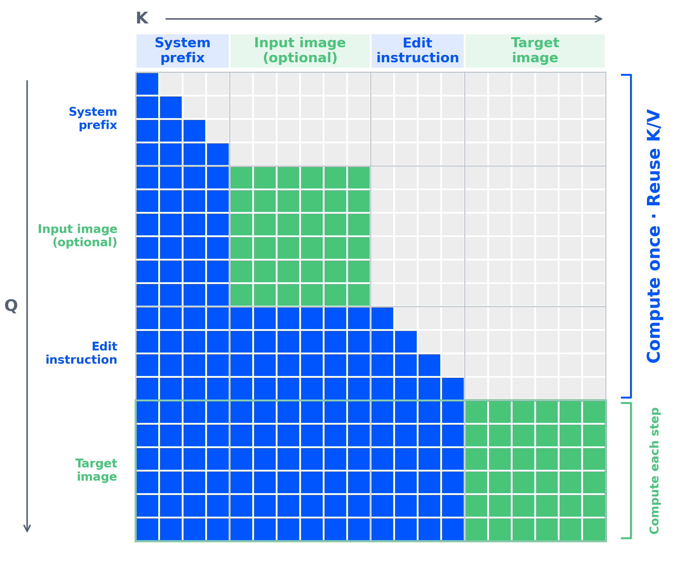
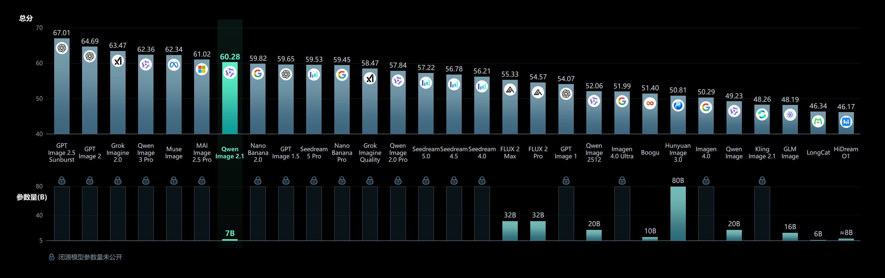

# PAPER: Qwen-Image-2.1 — 2.0 설계를 처음 공개한 7B single-stream 생성·편집 모델

## 0. 이 문서를 읽는 법

이 문서는 Qwen-Image-2.1 의 **블로그 + HF 가중치 + GitHub 저장소 + diffusers 추론 코드**를 직접 대조한 리뷰입니다. 2.1 은 기술 리포트(논문)가 없어서, 구조는 **가중치 헤더 실측**과 **코드**에서 복원했습니다.

> **Qwen-Image-2.1 은 2.0 기술 리포트의 설계(동결 Qwen3-VL + single-stream DiT + f16c64 VAE)를 처음으로 공개한 가중치이자, block-causal 마스크 + prefix KV cache 로 다중 참조 편집을 가속하고 RGBA(투명 배경)까지 한 모델에 넣은 7B DiT 이다. 단 라이선스는 비상업으로 바뀌었다.**

1. **메타 정보·용어 사전**
2. **큰 그림(TL;DR)·핵심 기여**
3. **모델 구조**: 가중치 실측 + 코드에서 드러난 설계 6가지
4. **1.x(2512) vs 2.1 코드 비교**: "20B → 7B" 의 실체
5. **KV cache 의 실제 효과**
6. **실험(벤치마크)**
7. **Q&A**: 2.0 리포트와의 관계 / 급소
8. **한 줄 요약 / 관련 링크**

> ⚠️ **공개 범위 주의**: 학습 코드·데이터·레시피·ablation·편집 벤치·속도 수치는 전부 미공개. 아래 수치 중 "실측"은 safetensors 헤더로 직접 센 값, "추정"은 코드 크기로 직접 계산한 값이다.

---

## 1. 메타 정보

| 항목 | 내용 |
|---|---|
| 모델 | Qwen-Image-2.1 |
| 소속 | Alibaba Qwen 팀 (라이선스 주체: Hangzhou Tongyi Laboratory) |
| 공개일 | 2026-09-20 (HF 저장소 생성 2026-09-14, diffusers PR 머지 2026-09-18) |
| 논문 | **없음** (블로그만) |
| 블로그 | https://qwen.ai/blog?id=qwen-image-2.1 |
| GitHub | https://github.com/QwenLM/Qwen-Image-2.1 — **README + `prompt_rewrite/` 뿐**, 모델 코드 없음 |
| 가중치 | https://huggingface.co/Qwen/Qwen-Image-2.1 · PE: `Qwen/Qwen-Image-2.1-PE-T2I`, `Qwen/Qwen-Image-2.1-PE-I2I` |
| 추론 코드 | diffusers `QwenImage21Pipeline` ([PR #14804](https://github.com/huggingface/diffusers/pull/14804)): `transformer_qwenimage21.py`, `pipeline_qwenimage21.py`, `autoencoder_kl_qwenimage21.py` |
| 분야 | Text-to-Image, Image Editing, 투명 배경(RGBA) 생성 |
| 외부 의존 모델 | Qwen3-VL-8B (조건 인코더, 동결), Qwen3.5 계열 9B (Prompt Enhancer) |
| 설계 원논문 | Qwen-Image-2.0 Technical Report (arXiv 2605.10730) → [PAPER_Qwen-Image-2.0.md](PAPER_Qwen-Image-2.0.md), Q1 참고 |
| 라이선스 | **Qwen Research License — 비상업 전용** (1.x 계열은 Apache 2.0) |

---

## 2. 주요 용어 사전 (Glossary)

*본문에 처음 나오는 용어가 헷갈리지 않게 한곳에 모아둠.*

### 아키텍처

| 용어 | 풀이 |
|---|---|
| single-stream DiT | 텍스트 토큰과 이미지 토큰이 **같은 가중치**(attention·MLP)를 공유하며 한 줄 시퀀스로 흐르는 Diffusion Transformer. 반대는 dual-stream(모달리티마다 가중치를 따로 가짐, 1.x·FLUX 방식) |
| modulation(변조) | timestep(노이즈 수준) 정보를 각 층 활성값에 곱하거나 더해 주입하는 장치(adaLN). 2.1 은 **곱셈(scale)·gate 만** 쓰고, 32층 전체가 **한 벌을 공유** |
| block-causal mask | attention 규칙 `(q ≥ kv) 또는 같은 이미지 블록`. 텍스트는 LLM 처럼 앞만 보고(causal), 이미지 한 장 안에서는 양방향으로 본다 |
| causal_condition | 텍스트·조건 이미지 토큰을 **t=0(깨끗한 상태)** 로 modulation 하는 설정. prefix 계산이 스텝과 무관해져 캐시가 가능해짐 |
| prefix KV cache | 앞쪽(시스템 프롬프트·참조 이미지·지시문)의 Key/Value 를 첫 스텝에 한 번 계산해 저장하고, 이후 스텝은 타깃 이미지 토큰만 계산하는 방식. LLM 의 prefill/decode 와 같은 구조 |
| mixed-granularity attention | 블로그 용어. 텍스트는 토큰 단위(token-level), 이미지는 덩어리 단위(chunk-level) 마스크를 섞는다는 뜻 = block-causal mask |
| f16c64 VAE | 공간 16배 다운샘플 + 잠재 64채널 VAE. 2.1 은 입출력을 **RGBA 4채널**로 확장 |
| patch_size | 잠재 몇 칸을 토큰 1개로 묶는가. 1.x 는 2(2×2 묶기), 2.1 은 1(안 묶음) |
| MSRoPE | 텍스트·이미지를 한 좌표계에 얹는 3축(frame·height·width) RoPE(회전 위치 인코딩) |

### 추론 / 학습

| 용어 | 풀이 |
|---|---|
| CFG (Classifier-Free Guidance) | 조건 있는 예측과 없는 예측을 섞어 조건을 강하게 따르게 하는 기법. 스텝마다 모델을 두 번 호출 |
| guidance-free(CFG 없음) | 2.1 기본값 `true_cfg_scale=1.0`. CFG 효과를 학습 때 모델 안에 흡수시켜 한 번 호출로 끝냄 |
| NFE (Number of Function Evaluations) | 이미지 한 장에 모델을 몇 번 호출하는가. 2.1 기본 40스텝 × CFG 없음 = 40 NFE |
| Prompt Enhancer(PE) | 짧은 사용자 입력을 긴 구조적 프롬프트로 재작성하는 LLM. 2.1 은 T2I 용·편집용 두 개를 공개 |
| dynamic shifting | 해상도(토큰 수)에 따라 노이즈 스케줄을 밀어주는 기법. 큰 이미지일수록 고노이즈 구간에 스텝을 더 배분 |

---

## 3. 큰 그림 (TL;DR) 과 핵심 기여

### 3.1 TL;DR

- **한 줄**: 2.0 리포트 설계(동결 Qwen3-VL + single-stream DiT + f16c64 VAE)를 7B DiT 로 공개하고, block-causal 마스크 + prefix KV cache 로 다중 참조 편집을 가속, RGBA 를 통합한 모델.
- **핵심 문제**: 1.x 는 생성(Qwen-Image)·편집(Edit)·투명 배경(Layered)이 **별도 모델**이고 DiT 만 20B 로 무거웠다. 참조 이미지가 늘수록 매 스텝 전체 시퀀스를 다시 계산하는 비용도 컸다.
- **해결책**: (구조) 중복 가중치 제거로 DiT 20.4B → 7.1B / (추론) prefix KV cache / (기능) RGBA VAE + 최대 10장 참조 + 마스크 편집.
- **검증**: 자사 Qwen-Image-Bench 60.28 로 7위 (2.0 Pro 57.84 보다 위). 편집·속도 수치는 없음.

### 3.2 핵심 기여 (Contributions)

1. **2.0 설계의 첫 공개 가중치**: DiT 7.12B + Qwen3-VL-8B + VAE 0.34B, diffusers·vLLM-Omni·SGLang·ComfyUI Day-0 지원.
2. **block-causal + causal_condition → prefix KV cache**: 참조 이미지·지시문을 한 번만 계산하고 재사용.
3. **통합**: T2I + 편집 + 투명 배경 생성·편집 + 사진에서 피사체를 RGBA 로 추출, 한 모델.
4. **편집 입력 다양화**: 참조 최대 10장, 원·페인트 표시·**원본+별도 마스크** 두 장 입력으로 영역 지정.
5. **Prompt Enhancer 공개**: Qwen3.5 계열 9B thinking 모델 2종 + 재작성 코드 (2.0 에선 비공개였던 부분).

---

## 4. 모델 구조

*리포트가 없으므로 "무엇이 들어 있나"를 가중치 헤더로 먼저 세고, "어떻게 도나"를 코드로 확인한다.*

### 4.1 부품별 파라미터 (실측)

| 부품 | 실측 | 내용 |
|---|---|---|
| DiT | **7.115B** (bf16, 14.23GB) | 32층, 폭 4096, 32헤드(head_dim 128), SwiGLU(×3), bias 없음 |
| text/vision encoder | **8.767B** (Qwen3-VL-8B) | **DiT 보다 큼** |
| VAE | **0.338B** (encoder 79M, decoder 259M, fp32) | 4채널(RGBA) 입력, z=64, 16배 공간 압축, residual 구조 |
| **합계** | **약 16.2B, bf16 약 32.5GB** | "7B" 는 전체 파이프라인의 44% |

**DiT 7.115B 내역**

| 모듈 | 크기 | 비중 |
|---|---|---|
| attention (q/k/v/out) | 32 × 67.1M = 2.15B | 30% |
| MLP (SwiGLU: gate·proj·out) | 32 × 151M = 4.83B | 68% |
| **modulation** | **67M, 딱 한 벌** (`modulation.1.weight` [16384, 4096]) | **0.9%** |
| 나머지 (img_in, txt_in, timestep embedder, norm_out, proj_out) | 약 0.07B | 1% |

### 4.2 블로그 그림 — mixed-granularity attention

*KV cache 가 왜 성립하는지는 마스크 모양 하나로 설명된다.*



> 블로그 그림: *Qwen-Image-2.1 mixed-granularity attention architecture*

- 세로(Q) = 질의 토큰, 가로(K) = 참조되는 토큰. 색칸 = 볼 수 있음, 회색 = 못 봄.
- 시퀀스 순서: **[System prefix → Input image(선택) → Edit instruction → Target image]**.
- 파랑(텍스트)은 계단 모양 = 토큰 단위 causal. 초록(이미지)은 블록 안이 꽉 참 = 이미지 한 장 안에서 양방향.
- 타깃 이미지가 맨 뒤라 **앞쪽 prefix 는 타깃을 볼 수 없다** → prefix 는 스텝이 바뀌어도 그대로 → "Compute once · Reuse K/V". 타깃만 "Compute each step".

### 4.3 코드에서 드러난 설계 6가지

**① modulation 을 32개 블록이 완전히 공유**
- 가중치 모양 [16384, 4096] 에서 16384 = 4 × 4096 → scale1·gate1·scale2·gate2 네 벡터가 정확히 한 벌.
- 블록마다 `mod1, mod2 = modulation.chunk(2)` 로 **똑같은 값**을 받는다. shift(더하기 항)는 없고 곱셈만, gate 에는 tanh.
- 블록별 학습 벡터조차 없어서 PixArt 의 adaLN-single 보다 더 극단적이다.
- ⚠️ docstring 은 "every block slices its own scales and gates" 라고 쓰지만 **코드와 가중치 모양 모두 그 설명과 다르다** → 문서 오류.

```python
# transformer_qwenimage21.py (요약)
self.modulation = nn.Sequential(nn.SiLU(), nn.Linear(4096, 4 * 4096, bias=False))  # 전 블록 공유 1벌
# block.forward
mod1, mod2 = modulation.chunk(2, dim=-1)          # 모든 블록이 같은 값
scale, gate = mod1.chunk(2, dim=-1)
x = x + gate.tanh() * attn(norm1(x) * (1 + scale))  # h' = αh, shift 없음
```

**② 진짜 single-stream**
- 가중치에 `txt_mlp` 가 없고 `img_mlp` 하나뿐 → 텍스트도 이미지와 같은 MLP 통과.
- 텍스트는 입구 `txt_in` (ZeroCenter RMSNorm → Linear → GELU → Linear) 한 번만 거친 뒤 이미지와 섞임.

**③ VLM 의 이미지 특징은 버리고 VAE 잠재로 갈아 끼움**
- Qwen3-VL 에서 이미지 칸(`<|image_pad|>`) 1개 = 32×32px (patch 16 × merge 2).
- 이 칸을 VAE 잠재 토큰 2×2(16px 네 개)로 늘린 뒤 **그 자리를 VAE 잠재로 덮어씀**:

```python
repeats = torch.where(img_mask, 4, 1)[0]                       # 이미지 칸은 4배로
joint_hidden_states = joint_hidden_states.repeat_interleave(repeats, dim=1)
joint_hidden_states[:, image_pad_mask] = hidden_states         # VLM 값 → VAE 잠재로 덮어쓰기
```

- 따라서 VLM 이 이미지를 "이해한 결과"는 **이미지 뒤에 오는 지시문 토큰에만** 간접적으로 남는다 (2.0 리포트 Fig 8 의 빨간 X 와 동일).
- VLM 입력은 마지막 층의 **정규화(RMSNorm) 전** hidden state. transformers 5.x 는 정규화 후 값을 돌려주므로 파이프라인이 forward hook 으로 정규화를 무력화한다 (주석: 빼면 "글자 렌더링부터 망가진다").

**④ block-causal 마스크 + causal_condition → KV cache**

```python
allowed = ((q_idx >= kv_idx) | same_image_block) & key_valid[b, kv_idx]
```

- `causal_condition=True`: timestep 배열 끝에 t=0 행을 하나 더 붙이고, 타깃이 아닌 토큰은 그 행의 modulation 을 읽는다 → prefix 활성값이 스텝과 무관.
- 첫 스텝 `kv_cache_mode="extract"` 로 prefix K/V 저장, 이후 `"cached"` 로 타깃 query 만 계산.
- 계보: 1.x **Edit-2511 에 이미 `zero_cond_t: true`** (조건 이미지를 t=0 으로 modulation) 가 있었다. 2.1 은 여기에 causal 마스크를 더해 **캐시 가능성**을 얻었다.

**⑤ RoPE 좌표 배치**
- 3축 (frame 16 + height 56 + width 56 = 128), theta 10000.
- 텍스트는 세 축 모두 같은 위치로 전진. 이미지는 frame 축을 직전 텍스트 위치에 고정하고, height·width 를 **0 중심 격자**로 배치.
- → 참조 이미지와 타깃이 **같은 공간 좌표를 공유** (Any2AnyTryon 의 condspa 와 같은 발상). 이미지끼리는 frame 값으로 구분.

**⑥ CFG 없이 샘플링**
- `true_cfg_scale` 기본 1.0, docstring "Qwen-Image 2.1 is meant to be sampled without guidance". SGLang 예시도 `--guidance-scale 1`.
- 2.0-RL 리포트의 "CFG is also integrated into the student model after OPD" 와 맞아떨어짐 (→ Q1).

### 4.4 추론 설정 (코드 기본값)

| 항목 | 값 |
|---|---|
| 스텝 | 40 (Euler, flow matching) |
| 노이즈 스케줄 | `sigmas = linspace(1, 1/40, 40)` + dynamic shift (base 0.5 @256 토큰 → max 0.9 @8192 토큰, exponential, shift_terminal 0.02) |
| 기본 해상도 | **1024²** (`output_resolution=1024`) — README 의 "기본 2048²" 와 다름 (→ Q2) |
| 권장 2K 크기 | 1:1 2048², 16:9 2752×1536 등 7종 |
| 조건 이미지 | 면적 1024² 로 리사이즈 (VLM 과 VAE 가 같은 크기 사용), RGBA 는 VLM 쪽만 흰 배경 합성 |
| 투명 생성 프롬프트 | `This is an RGBA image with transparency. <설명>. The image has alpha channel and the background is transparent.` |

---

## 5. 1.x(2512) vs 2.1 코드 비교 — "20B → 7B" 의 실체

*파라미터가 1/3 이 됐다는 숫자가 곧 "3배 빠르다"는 뜻인지 확인하려는 절.*

| 항목 | Qwen-Image 1.x (2512) | **Qwen-Image 2.1** |
|---|---|---|
| DiT 파라미터 (실측) | **20.43B** | **7.12B** |
| 층 × 폭 | 60 × 3072 | 32 × 4096 |
| stream 구조 | dual (텍스트·이미지가 attention 가중치·MLP 를 각각 따로) | single (전부 공유) |
| modulation | 블록마다, stream 마다 6벡터(shift·scale·gate ×2), bias 있음 → **6.80B (33%)** | 전 블록 공유 4벡터, bias 없음 → **0.067B (0.9%)** |
| MLP | GELU, 4배 확장 | SwiGLU, 3배 확장 |
| text encoder | Qwen2.5-VL-7B | Qwen3-VL-8B |
| VAE | f8, 16채널 (+ patch 2) | f16, 64채널 (patch 1), RGBA |
| 토큰 1개가 담당하는 픽셀 | 16×16 | 16×16 (**같음**) |
| attention 마스크 | 양방향 전체 | block-causal |
| 편집 / 투명 | 별도 모델 (Edit-2509/2511, Layered) | 통합 |
| 라이선스 | **Apache 2.0** | **비상업** |

### 5.1 핵심 계산: 토큰당 계산량은 거의 같다

1.x 20.43B 실측 내역: attention 4.53B · 이미지 MLP 4.53B · 텍스트 MLP 4.53B · modulation 6.80B.

- 이미지 토큰 하나가 실제로 거치는 가중치 = 이미지용 attention(절반) + 이미지 MLP ≈ **2.27B + 4.53B = 6.8B**.
- 2.1 은 모든 토큰이 전 가중치를 거침 → **6.98B**.
- 토큰 1개 = 16×16px 도 동일 (1.x: f8 VAE × patch 2, 2.1: f16 VAE × patch 1).
- → **같은 해상도에서 선형층 계산량은 거의 같다.**
- attention 계산량(층 수 × 폭에 비례)만 보면 1.x 60 × 3072 vs 2.1 32 × 4096 → 2.1 이 약 **71%**.

> 한 줄: 13B 가 사라진 이유는 **텍스트 전용 가중치 복사본 제거 + 블록별 modulation 제거**. T2I 한 스텝 속도는 크게 달라지지 않고, 대신 VRAM 이 준다 (DiT 40.9GB → 14.2GB). 실제로 빨라지는 곳은 다중 참조 편집이며 그 이유는 KV cache (→ §6).

---

## 6. KV cache 의 실제 효과 (추정 계산)

*블로그가 "빠르고 메모리도 줄인다"고만 하고 수치를 안 주므로, 코드 크기로 직접 계산해 본다.* 참조 이미지는 기본값대로 면적 1024² (= 4,096 토큰/장) 가정.

| 상황 | 캐시 없을 때 스텝당 토큰 | 캐시 있을 때 스텝당 query | 선형층 계산 절감 | 캐시 메모리 (bf16, 32층) |
|---|---|---|---|---|
| T2I 2048² | 약 16.6K | 약 16.4K | **약 1%** | 작음 |
| 편집, 참조 1장 → 1024² | 약 8.4K | 4.1K | 약 2배 | 약 2.3GB |
| 편집, 참조 10장 → 1024² | 약 45K | 4.1K | **약 11배** | **약 22GB** |

- KV cache 는 **사실상 편집 전용 가속**. T2I 는 prefix 가 텍스트 수백 토큰뿐이라 효과가 거의 없다.
- 메모리 계산: 41.3K 토큰 × 4096 × (K+V) 2 × 2바이트 ≈ 677MB/층 × 32층 ≈ 22GB.
- 블로그는 "reduce memory usage" 라고 하지만 diffusers 구현은 prefix K/V 를 40스텝 내내 들고 있어야 해서 **상주 메모리가 오히려 늘어난다**. vLLM-Omni 가 "FP8 prefix KV 저장"을 따로 내세우는 이유로 보인다.
- docstring: `use_kv_cache` 를 켜고 끄면 **bf16 에서 같은 시드라도 다른 그림**이 나온다 (반올림 차이가 32층 × 40스텝 증폭). 재현성이 필요하면 이 값을 고정.

---

## 7. 실험 결과

*공개된 정량 수치가 이 그림 한 장뿐이라, 무엇을 말하고 무엇을 말하지 않는지 함께 본다.*



> 블로그 그림: *Qwen-Image-Bench evaluation comparison* (위 = 총점, 아래 = 파라미터 수, 자물쇠 = 비공개 모델 규모 미공개)

| 순위 | 모델 | 총점 | 비고 |
|---|---|---|---|
| 1 | GPT Image 2.5 Sunburst | 67.01 | 비공개 |
| 4 | Qwen Image 3 Pro | 62.36 | Qwen 내부 비공개 |
| **7** | **Qwen-Image-2.1** | **60.28** | **7B (DiT)** |
| 8 | Nano Banana 2.0 | 59.82 | 비공개 |
| 9 | GPT Image 1.5 | 59.65 | 비공개 |
| 13 | Qwen Image 2.0 Pro | 57.84 | 비공개 |
| — | FLUX 2 Max / Pro | 55.33 / 54.57 | 32B |
| — | Qwen Image 2512 | 52.06 | 20B |
| — | Qwen Image (1.0) | 49.23 | 20B |
| — | HiDream O1 | 46.17 | ≈8B |

- Qwen-Image-Bench (arXiv 2605.28091) 는 **Qwen 이 만든 자사 벤치**.
- 바로 아래 Nano Banana 2.0 과 **0.46점 차**, 신뢰구간 없음.
- 편집 벤치(GEdit·ImgEdit), GenEval·DPG, 속도 수치는 **없음**. (제3자 블로그의 "10장 편집 1.59초"는 공식 본문에서 확인되지 않음)

---

## 8. 💬 Q&A

### Q1. 2.0 기술 리포트와 얼마나 관련 있나? (2.0 코드와 비교해 줘)

*2.0 은 가중치·코드가 끝내 공개되지 않았고, 2.1 은 반대로 가중치·코드는 있지만 리포트가 없다. 둘을 맞대어 서로의 빈칸을 채우려는 질문.*

**먼저 — "2.0 코드"는 존재하지 않는다**
- [QwenLM/Qwen-Image](https://github.com/QwenLM/Qwen-Image) 저장소의 코드·가중치는 전부 **1.x 계열** (Qwen-Image, Edit-2509/2511, 2512, Layered; 20B dual-stream MMDiT + Qwen2.5-VL + f8 16채널 VAE).
- 2.0 은 2026-02 블로그·Qwen Chat 으로만 나왔고 `huggingface.co/api/models/Qwen/Qwen-Image-2.0` 은 401.
- 그래서 비교는 ① 코드↔코드 (1.x ↔ 2.1, → §5), ② 리포트↔코드 (2.0 리포트 ↔ 2.1) 두 갈래.

**결론**: 2.1 은 **2.0 기술 리포트가 설명한 모델 계열을 처음으로 공개한 구현체**로 보는 게 맞다. 2.0 리포트는 사실상 **2.1 의 빠진 기술 문서**. 다만 Qwen 이 공식적으로 "2.1 은 2.0 기반"이라고 밝힌 적은 없다 — 2.1 블로그·README 는 2.0 을 한 번도 언급하지 않고, 전작으로는 Qwen-Image-Layered 만 언급한다.

**① 결정적 증거: VAE 파라미터 수가 똑같다**

| | encoder | decoder | 설정 |
|---|---|---|---|
| 2.0 리포트 Table 1 | 79M | 259M | f16c64, residual |
| 2.1 가중치 실측 | **78.68M** | **259.04M** | f16c64 (z=64, 16배), `is_residual: true` |

- 디코더를 인코더보다 훨씬 크게 만드는 비대칭 구조까지 같다.
- 같은 표의 다른 f16 VAE 들은 수치가 다르다: Wan2.2(150M/555M), Stepvideo(110M/389M), HunyuanImage-3.0(389M/871M).
- → **2.1 의 VAE 는 2.0 VAE 를 RGBA(4채널) 입출력으로 확장한 것**으로 보는 게 가장 자연스럽다. 채널을 하나 늘려도 첫 conv 와 마지막 conv 만 조금 커져 파라미터 수는 거의 변하지 않는다.

**② 리포트 문장 ↔ 2.1 코드 1:1 대조**

| 2.0 리포트 원문 | 2.1 코드/가중치 | 일치 |
|---|---|---|
| "frozen Qwen3-VL" 조건 인코더 | Qwen3-VL-8B, 추론 시 hidden state 만 사용 | ✅ |
| "visual representation hₓ is **replaced** by the VAE latent" (식 1) | `joint_hidden_states[:, image_pad_mask] = hidden_states` | ✅ 문장 그대로 구현 |
| "h′ = αh", bias 제거한 곱셈 변조 (식 2) | `hidden_states * (1 + scale)`, shift 없음, 전 층 `bias=False` | ✅ |
| SwiGLU (식 3) | `QwenImage21SwiGLUFeedForward` | ✅ |
| QK-Norm 은 RMSNorm, 나머지는 LayerNorm | `norm_q/norm_k = RMSNorm`, `img_norm1/2 = LayerNorm` | ✅ 정규화 종류까지 일치 |
| MSRoPE 합동 위치 계산 | 3축 RoPE (16/56/56), 1.x 설정값과도 같음 | ✅ |
| "**unified stream**", "**shared** transformer backbone" | `txt_mlp` 없음, 모든 토큰이 가중치 공유 | ✅ (이름은 "MMDiT" 지만 실제 single-stream) |
| PE 는 Qwen3.5-9B 에서 초기화 | 공개 PE 2종이 `Qwen3_5ForConditionalGeneration`, 32층, 폭 4096 | ✅ |
| 2.0-RL 리포트: "CFG is also **integrated into the student** after OPD" | `true_cfg_scale` 기본 1.0, "guidance 없이 샘플링하도록 설계" | ✅ CFG 없이 도는 이유 |

→ 2.1 코드는 리포트의 식 1~3 과 Figure 8 캡션의 문장들을 **하나도 빠짐없이** 구현한다.

**③ 2.1 에서 새로 생긴 것 (2.0 리포트에는 없음)**

| 항목 | 2.0 리포트 | 2.1 |
|---|---|---|
| attention 마스크 | 언급 없음 (양방향으로 추정) | **block-causal** |
| 조건 토큰의 timestep | 언급 없음 | **t=0 고정** (`causal_condition`, Edit-2511 `zero_cond_t` 계승) |
| prefix KV cache | 없음 | 있음 |
| modulation 구조 | "bias 제거"만 서술 | **32층 전체가 한 벌 공유** (67M) |
| 투명 배경 | 없음 | VAE RGBA 확장, Layered 기능 흡수 |
| 참조 이미지 수 | "interleaved multi-image" | 최대 10장, 원본+별도 마스크 입력 |
| 4-NFE distillation(증류)판 | 있음 (Qwen-Image-2.0-Distillation) | **공개 안 됨** (40스텝만) |
| 파라미터 수 | 미공개 | 7.12B (DiT) |

변화를 한 줄로: **"2.0 블록 설계는 그대로 두고, 마스크와 시간 조건을 바꿔 LLM 식 캐시가 가능하도록 개조했다."** 블록 내부 가중치 구조는 그대로이고 attention 이 서로를 보는 규칙만 바뀌었다. 그래서 2.0 체크포인트를 이어서 학습했을 가능성도 있다 (근거는 없음).

벤치마크에서 **2.1(60.28) > 2.0 Pro(57.84)** → "2.0 설계 계열의 후속 체크포인트"로 보는 게 맞다.

**④ 관련도 판정**

| 관점 | 관련도 |
|---|---|
| 구조 (블록, 인코더, VAE, PE) | **매우 높음.** 서술과 코드가 1:1 대응, VAE 파라미터 수 일치 |
| 학습 레시피 (Pretrain → SFT → GRPO → OPD/CFG 통합) | **높음 (추정).** 2.1 은 레시피 미공개지만 CFG 없는 기본값이 2.0-RL 서술과 맞음 |
| 추론 방식 | **다름.** block-causal 과 KV cache 는 2.1 신규 |
| 공식 연결 | **없음.** Qwen 은 2.1 을 2.0 과 연결 짓는 말을 하지 않음 |

2.1 을 공부할 때 역할 분담:
- **2.0 리포트(+ 2.0-RL 리포트)**: 왜 이렇게 만들었는지, 어떻게 학습했는지 → [PAPER_Qwen-Image-2.0.md](PAPER_Qwen-Image-2.0.md), [PAPER_Qwen-Image-2.0-RL.md](PAPER_Qwen-Image-2.0-RL.md)
- **2.1 코드(이 문서)**: 실제로 어떻게 도는지, 새로 추가된 마스크와 캐시

(이 대조로 2.0 문서의 §4.2·§4.3·Q1·Q2 일부를 정정했다 — 정정 목록은 2.0 문서 Q6.)

### Q2. 쓰기 전에 알아야 할 급소는?

*공식 문서만 믿고 쓰면 막히거나 오해하는 지점들.*

| # | 급소 | 내용 |
|---|---|---|
| 1 | **벤치마크가 자사 벤치 하나** | Qwen-Image-Bench 7위, Nano Banana 2.0 과 0.46점 차, 신뢰구간 없음. "대부분의 비공개 모델 능가"는 이 차이에 기댐. 편집을 핵심 기능으로 내세우면서 편집 벤치 수치 0개 |
| 2 | **파라미터 막대 기준이 섞임** | 2.1(7B)·Qwen-Image(20B)·LongCat(6B)은 DiT 만, HiDream-O1(≈8B)은 인코더 포함 통합 모델. 2.1 도 인코더 포함하면 16.2B |
| 3 | **README 와 코드의 기본 해상도가 다름** | README 표 "기본 2048×2048" ↔ 파이프라인 `output_resolution=1024` → width/height 안 주면 **1024²**. Quick Start 예제도 1024² 로 생성. 2K 는 명시해야 함 |
| 4 | **PE 코드가 README 대로 안 돎 (재현 확인)** | README 는 `--ckpt Qwen/Qwen-Image-2.1-PE-T2I` (Hub ID) 를 안내하지만 `load_system_prompt` 가 이를 로컬 경로로 보고 `SystemExit: no system prompt` 로 종료. 우회: `--system-prompt prompts/system_prompt_t2i.txt` (HF 파일과 바이트 동일 확인). 메인 README 의 `client.py` 예시도 `--system-prompt` 누락으로 같은 이유로 실패 |
| 5 | **같은 환경에 설치 불가** | 메인 모델 `transformers>=5.17` ↔ PE `transformers==5.4.0` 고정 → 가상환경 2개 필요 |
| 6 | **배치 ≠ 단일 추론** | 길이가 다른 프롬프트를 한 배치로 돌리면 짧은 프롬프트 뒤 padding 칸도 RoPE 위치를 차지 → 타깃 이미지 위치가 단독 실행과 달라짐 |
| 7 | **라이선스 후퇴** | 1.x 전 라인은 Apache 2.0 → 2.1·PE 는 "FOR NON-COMMERCIAL PURPOSES ONLY", 상업 사용은 별도 계약 (model-business@notice.qwencloud.com) |

추가로:
- PE 는 thinking 모델이라 `max_new_tokens` 가 T2I 16,256 / 편집 24,000 — 재작성 한 번이 길다. T2I 는 `presence_penalty=1.5`, 편집은 0 (서로 바꾸면 조용히 분포가 달라짐).
- `use_kv_cache` 토글 시 같은 시드도 다른 그림 (→ §6).

---

## 9. 한계 / 미확인 사항

*블로그·README 중심 릴리스라 인용·재현 시 주의가 필요한 부분.*

- **기술 리포트 없음** — 학습 데이터·단계·RL·증류 방법은 2.0 리포트로 추정할 뿐.
- **학습 코드 없음** — LoRA 학습은 ModelScope DiffSynth-Studio 쪽 지원에 의존.
- **ablation 0건** — 공유 modulation·block-causal 이 품질에 주는 영향 근거 없음.
- **4-NFE 증류판 미공개** — 40스텝만 제공.
- **속도·편집 정량 수치 없음**.

---

## 10. 한 줄 요약 (전체)

> **Qwen-Image-2.1 = 2.0 리포트 설계(동결 Qwen3-VL + single-stream + f16c64 VAE)의 첫 공개 가중치. 중복 가중치를 걷어내 DiT 20B → 7B (토큰당 계산량은 거의 같음), block-causal + t=0 조건 + prefix KV cache 로 다중 참조 편집 가속, RGBA 통합. 단 자사 벤치 한 장·레시피 비공개·비상업 라이선스라 "무료 업그레이드"는 아니다.**

---

## 11. 관련 링크 / 메모리

- 설계 원논문: [PAPER_Qwen-Image-2.0.md](PAPER_Qwen-Image-2.0.md), 후처리: [PAPER_Qwen-Image-2.0-RL.md](PAPER_Qwen-Image-2.0-RL.md)
- 1.x: [PAPER_Qwen-Image.md](PAPER_Qwen-Image.md), 투명 배경 선행: Qwen-Image-Layered
- 같은 계열(single-stream): [PAPER_Z-Image.md](PAPER_Z-Image.md), [PAPER_Lumina-Image-2.0.md](PAPER_Lumina-Image-2.0.md)
- 관련 메모리: [[paper_qwen_image_2]], [[paper_qwen_image_2_rl]], [[paper_qwen_image]], [[paper_z_image]], [[paper_any2anytryon]]
- 외부: [블로그](https://qwen.ai/blog?id=qwen-image-2.1), [HF](https://huggingface.co/Qwen/Qwen-Image-2.1), [GitHub](https://github.com/QwenLM/Qwen-Image-2.1), [diffusers PR #14804](https://github.com/huggingface/diffusers/pull/14804), [Qwen-Image-Bench (arXiv 2605.28091)](https://arxiv.org/html/2605.28091v1), [2.0 리포트](https://arxiv.org/pdf/2605.10730), [2.0-RL 리포트](https://arxiv.org/pdf/2606.27608)
