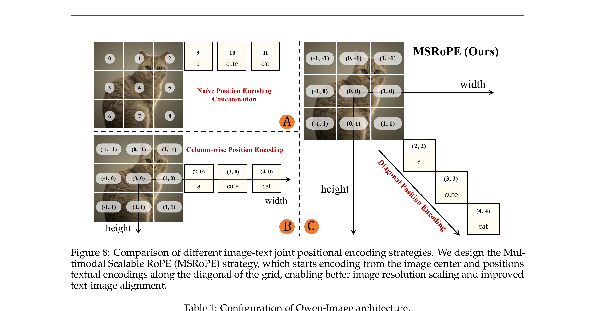
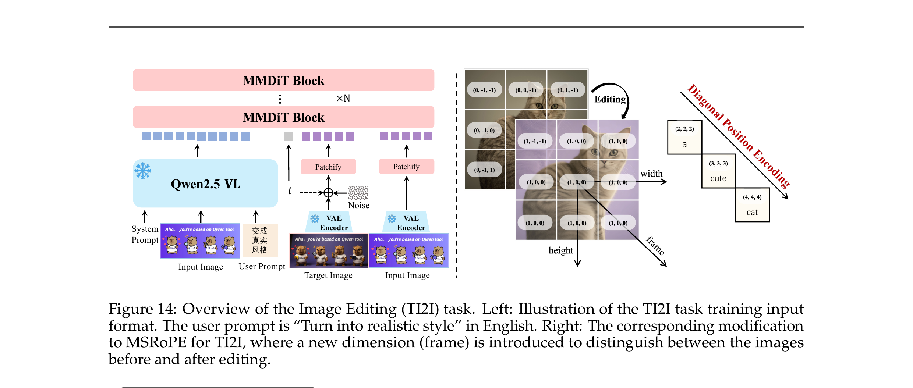

# PAPER: Qwen-Image — 20B MMDiT 텍스트 렌더링 특화 이미지 생성 기반 모델

## 0. 이 문서를 읽는 법

이 문서는 Qwen-Image 기술 보고서(arXiv 2508.02324)를 처음 읽는 사람이 흐름을 놓치지 않도록 정리한 리뷰입니다.

핵심 목표는 하나입니다.

> **Qwen-Image 는 20B MMDiT 한 모델로, 그동안 모두가 약했던 "이미지 안에 글자 정확히 쓰기"(text rendering, 텍스트 렌더링) — 특히 한자(漢字) — 를 데이터·커리큘럼·VAE·평가까지 풀스택으로 갈아넣어 정복하고, 덤으로 편집(editing)·일반 생성까지 오픈소스 SOTA 를 찍은 기반 모델 (foundation model) 이다.**

이 문서는 [PAPER_LongCat-Image.md](PAPER_LongCat-Image.md), [PAPER_Lumina-Image-2.0.md](PAPER_Lumina-Image-2.0.md) 와 같은 구성으로 읽기 쉽게 만들었습니다.

1. **메타 정보·용어 사전**: 누가/언제/무엇을, 그리고 알아둘 단어들
2. **큰 그림(TL;DR)·핵심 기여**: 왜 텍스트 렌더링인가
3. **모델 구조**: VLM + VAE + MMDiT 삼각형과 MSRoPE
4. **데이터 파이프라인**: 진짜 차별점이 이 안에 있음
5. **학습 단계**: pre-training(flow matching) → SFT → RL(DPO/GRPO)
6. **편집(TI2I) — Dual-Encoding**
7. **실험 결과**
8. **Q&A / 한계 / 관련 링크**

GitHub 렌더링 호환을 위해 수식은 LaTeX 보다 평문 표기를 우선합니다.

---

## 1. 메타 정보

| 항목 | 내용 |
|---|---|
| 논문 | Qwen-Image Technical Report |
| 저자 | Qwen Team (Chenfei Wu, Jiahao Li, Jingren Zhou 외 36 인) |
| 소속 | Alibaba(알리바바) Qwen 팀 |
| 공개일 | 2025-08-05 (arXiv v1: 2025-08-04) |
| arXiv abstract | https://arxiv.org/abs/2508.02324 |
| arXiv PDF | https://arxiv.org/pdf/2508.02324 |
| 공식 코드 | https://github.com/QwenLM/Qwen-Image |
| 가중치 | HuggingFace: `Qwen/Qwen-Image`, ModelScope: `Qwen/Qwen-Image` |
| 분야 | Text-to-Image, Image Editing, Diffusion Transformer, Text Rendering |
| 외부 의존 모델 | Qwen2.5-VL (텍스트 인코더, 7B, **동결**), Wan2.1-VAE (VAE 베이스) |
| 백본 규모 | MMDiT **20B** (실제 학습 대상) |

---

## 2. 주요 용어 사전 (Glossary)

*다른 절에서 처음 등장하는 용어가 헷갈리지 않게 한곳에 모아둠. 풀어쓴 한국어 + 학술 원어 괄호 매칭.*

### 아키텍처

| 용어 | 풀이 |
|---|---|
| DiT (Diffusion Transformer) | 이미지의 압축 표현(latent, 잠재)을 Transformer 로 디노이징하는 구조. UNet 대체 표준 |
| MMDiT (Multimodal Diffusion Transformer) | 텍스트와 이미지를 함께 모델링하는 DiT. Stable Diffusion 3, FLUX 가 채택. Qwen-Image 는 **double-stream(이중 스트림)** — 텍스트 스트림과 이미지 스트림이 각자 가중치를 갖고 self-attention(자기 어텐션) 에서 만남 |
| VLM (Vision-Language Model) | 이미지+텍스트를 함께 이해하는 모델. 여기선 Qwen2.5-VL 을 텍스트 조건 인코더로 재활용 |
| VAE (Variational AutoEncoder) | 이미지를 작은 latent(잠재) 로 압축하고 다시 복원. Qwen-Image 는 8×8 압축, 채널 16 |
| frozen(동결) | 가중치를 학습하지 않고 고정. Qwen-Image 는 VLM 전체와 VAE 인코더를 동결, **VAE 디코더와 MMDiT 만 학습** |
| QK-Norm | 어텐션의 Query·Key 벡터를 정규화해 학습 안정화. 여기선 RMSNorm 사용 |
| MSRoPE (Multimodal Scalable RoPE) | 본 논문이 내세운 위치 인코딩. 텍스트를 이미지 격자의 **대각선(diagonal)** 에 놓아 해상도 스케일링과 텍스트-이미지 정렬을 동시에 잡음. 단 "대각선 오프셋" 발상 자체는 **UnoPE(UNO)가 선행** (→ 5.4 / 5.4.1 참조) |
| UnoPE (Universal Rotary Position Embedding) | UNO(ByteDance, ICCV 2025)가 제안. **참조 이미지들을 RoPE 좌표 대각선으로 오프셋**해 다중 subject 의 속성 혼동을 막음. MSRoPE 와 같은 계열의 선행 연구 (→ 5.4.1) |

### 핵심 개념 / 학습

| 용어 | 풀이 |
|---|---|
| flow matching | 노이즈에서 이미지로 가는 velocity field(속도장) 을 예측하도록 학습하는 방식. diffusion 의 한 변형 |
| Rectified Flow | flow matching 의 한 형태. 깨끗한 잠재와 노이즈를 timestep t 비율로 선형 보간하고, 목표 속도를 둘의 차로 둠 |
| velocity field(속도장) | 각 시점에서 "어느 방향·세기로 이미지를 향해 움직여야 하는가"를 나타내는 벡터 |
| curriculum learning(커리큘럼 학습) | 쉬운 것부터 어려운 것 순으로 단계적으로 학습. 여기선 무텍스트 → 단어 → 문단 순 |
| SFT (Supervised Fine-Tuning) | 사람이 고른 고품질 데이터로 약점을 보완하는 지도 학습 |
| DPO (Direct Preference Optimization) | 명시적 보상 모델 없이 선호 쌍(win/lose) 만으로 정렬하는 RL 변형. 여기선 flow matching 기준으로 재정식화, **대규모 offline** 용 |
| GRPO (Group Relative Policy Optimization) | 한 프롬프트에 여러 샘플 묶음(G 개) 생성 → 묶음 내 상대 점수로 advantage(이득) 계산. 여기선 **소규모 정밀 보정** 용, Flow-GRPO 방식 |
| Producer-Consumer(생산자-소비자) | 데이터 전처리(VAE/VLM 인코딩)를 Producer 가, 모델 학습을 Consumer(GPU 클러스터) 가 분담해 비동기로 굴리는 인프라 구조 |

### 편집 / 평가

| 용어 | 풀이 |
|---|---|
| T2I / TI2I / I2I | 텍스트→이미지 / (텍스트+이미지)→이미지(=편집) / 이미지→이미지(재구성) |
| Dual-Encoding(이중 인코딩) | 원본 이미지를 VLM(의미)과 VAE(픽셀 디테일) 두 갈래로 동시에 인코딩하는 편집 메커니즘 (→ 7장) |
| GenEval / DPG / OneIG-Bench / TIIF | 일반 T2I 평가 — 속성 결합·개수·공간 관계(GenEval), 밀집 프롬프트 따르기(DPG), 다차원 종합(OneIG), 복잡 명령 따르기(TIIF) |
| CVTG-2K / ChineseWord / LongText-Bench | 텍스트 렌더링 평가 — 영어 가독성(CVTG-2K), **중국어 한자 정확도(ChineseWord, 본 논문 신규)**, 긴 텍스트(LongText) |
| GEdit / ImgEdit / GSO | 편집 평가 — 실사용자 명령 편집(GEdit), 9 종 편집(ImgEdit), 새 시점 합성(GSO novel view synthesis) |
| AI Arena | 본 논문이 만든 Elo 기반 사람 평가 플랫폼. 익명 두 모델 결과를 사람이 비교 투표 |

---

## 3. TL;DR (한 줄 요약)

> **Qwen-Image 는 "MMDiT + 동결 Qwen2.5-VL + flow matching"이라는 검증된 레시피 위에, 텍스트 렌더링이라는 한 가지 약점을 데이터 합성·커리큘럼·텍스트 특화 VAE·전용 벤치마크로 끝까지 갈아넣어, 일반 생성·편집은 오픈소스 SOTA 급, 중국어 한자 렌더링은 상용 모델을 20점 이상 압도하는 20B 기반 모델이다.**

핵심 네 가지:

```text
동결 Qwen2.5-VL(7B) 텍스트 인코더  ← 언어·비전이 이미 정렬됨 + 편집 확장성
  + 텍스트 특화 VAE (디코더만 미세조정)  ← 작은 글자 디테일 복원 = 텍스트 렌더링의 토대
  + 20B double-stream MMDiT + MSRoPE  ← 대각선 RoPE 오프셋 계열(cf. UnoPE)을 텍스트-이미지에 적용
  + 데이터 합성 3종 + 7단계 필터 + 커리큘럼  ← 한자 롱테일 정복의 진짜 비결
  = GenEval 0.91 / 중국어 ChineseWord 58.30 (2위 36 대비 압도) / 편집 SOTA
```

이 모델의 성격은 **"혁신"보다 "완성도"** 입니다. 새 패러다임이 아니라, 한 축(텍스트 렌더링)을 시대보다 한 칸 끌어올린 엔지니어링 총합입니다.

---

## 4. 핵심 기여 (Contributions)

1. **Superior Text Rendering(압도적 텍스트 렌더링)**: 다중행 레이아웃, 문단 수준 의미, 미세 디테일까지. 영어(알파벳)와 중국어(logographic, 표어문자) 모두 고충실도.
2. **Consistent Image Editing(일관된 이미지 편집)**: T2I + TI2I + I2I 멀티태스크 + Dual-Encoding 으로 의미 보존과 시각 충실도를 동시에 달성.
3. **Strong Cross-Benchmark Performance(범용 강성능)**: 생성·편집 다수 벤치마크에서 일관되게 SOTA 급, 오픈소스 진영의 새 레퍼런스.

---

## 5. 모델 구조

*왜 이 구조인가: 텍스트를 잘 "이해"하려면 강력한 텍스트 인코더가, 작은 글자를 잘 "그리려면" 디테일을 살리는 VAE 가, 둘을 잘 "결합"하려면 위치 인코딩이 필요하다. Qwen-Image 는 이 셋을 각각 해결한다.*

전체는 세 덩어리의 협업입니다.

```text
   [사용자 프롬프트(+이미지)]
            │
   ┌────────┴────────┐
   │  Qwen2.5-VL 7B  │  ← 텍스트 조건 인코더 (frozen, 동결)
   │  (마지막 층 hidden state)
   └────────┬────────┘
            │ 텍스트 스트림
            ▼
   ┌─────────────────────────────┐        ┌──────────────┐
   │   20B double-stream MMDiT    │◄───────│  VAE Encoder │ ← 이미지 잠재
   │   ×60 layers, MSRoPE+QK-Norm │        │ (8×8, ch16)  │
   └────────────┬────────────────┘        └──────────────┘
                ▼
          [VAE Decoder] → 최종 이미지
```

### 5.1 텍스트 인코더 — 왜 순수 LLM 이 아니라 Qwen2.5-VL 인가

*왜 이 선택인가: T2I 에는 "언어를 이해하면서 동시에 시각 개념과 정렬된" 인코더가 유리하기 때문.*

논문은 세 가지 이유를 명시합니다.

1. **언어-비전 공간이 이미 정렬(align)** 되어 있어, 순수 언어모델(Qwen3) 보다 T2I 에 적합.
2. 언어 모델링 능력 저하가 거의 없음.
3. **멀티모달 입력을 받으니 편집(editing) 까지 한 모델로 확장 가능** — 이게 7장 편집의 복선.

Qwen2.5-VL **전체를 동결**하고, language backbone 마지막 층의 hidden state 를 조건으로 씁니다. T2I 용과 편집(TI2I) 용 system prompt(시스템 프롬프트) 를 따로 설계합니다.

> 메모리의 [[reference_pretrained_backbone_reuse_landscape]] 기준으로, VLM 가중치를 텍스트 조건 인코더로 재활용하는 분기의 정석 사례. [[paper_longcat_image]] 도 같은 Qwen2.5-VL-7B 를 텍스트 인코더로 씀.

### 5.2 VAE — 디코더만 미세조정해 "작은 글자"를 살린다

*왜 이렇게 하나: 텍스트 렌더링의 성패는 결국 "작은 글자 획이 복원되느냐"에 달려 있는데, 이는 VAE 의 재구성 품질이 천장(upper bound) 이기 때문.*

- **single-encoder, dual-decoder** 구조: Wan2.1-VAE(이미지+비디오 공용) 를 가져와 **인코더는 동결, 이미지 디코더만 미세조정**. (미래 비디오 모델의 백본으로도 쓰기 위함)
- 디코더 학습 데이터를 일부러 **텍스트가 빽빽한 이미지**(PDF·PPT·포스터 + 합성 문단, 영어/중국어) 로 채움.
- 두 가지 실측 관찰:
  - 재구성손실 + perceptual loss(지각 손실) 균형 → 덤불 같은 반복 텍스처의 **격자 아티팩트(grid artifact)** 감소.
  - 재구성 품질이 올라가면 **adversarial loss(GAN 손실) 가 무용지물** — 판별기가 더는 유의미한 신호를 못 줌. → 재구성 + perceptual 만 사용, 비율을 학습 중 동적 조정.
- 결과(Table 2): 이미지 처리 시 enc 19M / dec 25M 만 활성하면서도 PSNR·SSIM 전 항목 SOTA.

### 5.3 아키텍처 설정값 (Table 1)

| 구성 | VLM (ViT / LLM) | VAE (Enc / Dec) | MMDiT |
|---|---|---|---|
| # Layers | 32 / 28 | 11 / 15 | **60** |
| # Heads (Q/KV) | 16/16 / 28/4 | – | 24 / 24 |
| Head Size | 80 / 128 | – | 128 |
| Intermediate | 3,456 / 18,944 | – | 12,288 |
| Patch / Scale | 14 / – | 8×8 / – | 2 / – |
| Channel | – / – | 16 / 16 | – |
| # Params | **7B** | 54M / 73M | **20B** |

#### 5.3.1 왜 double-stream 블럭만 60층인가 — single 블럭이 없는 이유

*왜 이 절을 두는가: FLUX 계열에 익숙하면 "dual 몇 층 + single 몇 층" 을 기대하게 되는데, Qwen-Image 에는 single 블럭이 아예 없어서 그 빈자리의 의미를 짚어야 하기 때문.*

Table 1 의 60층은 **전부 double-stream** 이다. 실제 diffusers 구현도 `QwenImageTransformerBlock` 한 종류를 60번 쌓은 게 전부라 single 블럭은 정말 없다.

**먼저 솔직한 부분** — **논문은 "왜 single 을 안 썼는지" 를 설명하지 않는다.** ablation 도 없고 언급 자체가 없다. 이건 11장 한계 1번("구조적 신규성이 약하다 — 검증된 레시피의 조립")과 같은 맥락이다. 그러니 아래는 ① 계보상 사실 + ② 구조에서 나오는 합리적 추론으로 나눠 읽어야 한다.

**single 블럭이 뭐였는지 (FLUX 계보)**

| 블럭 | 처리 방식 | 대표 |
|---|---|---|
| **double(dual)** | 텍스트용 가중치 세트와 이미지용 가중치 세트가 **따로** 있고, attention 에서만 만남 | SD3 / MMDiT 원형, Qwen-Image |
| **single** | 텍스트+이미지를 한 줄로 이어붙여 **가중치 하나로 같이** 처리 | FLUX (dual 19 + single 38) |

single 의 명분은 "앞쪽 dual 층에서 이미 텍스트·이미지가 섞였으니, 뒤쪽은 굳이 두 벌 가중치를 둘 필요 없다 → 같은 파라미터 예산으로 층을 더 깊게" 라는 **효율 논리**다. 즉 성능을 위한 게 아니라 **비용을 위한 선택**이다.

**Qwen-Image 가 안 쓴 이유 (추론)**

1. **목표가 텍스트 렌더링이라 텍스트 스트림을 끝까지 살려야 함** — Qwen-Image 의 전 재산은 한자 획을 정확히 그리는 능력이다. 그러려면 텍스트 조건이 마지막 층까지 **자기 전용 modulation·FFN 으로 계속 정제·재주입**되는 게 유리하다. single 로 넘어가면 텍스트 토큰이 이미지 토큰과 같은 가중치를 공유하면서 이미지 쪽에 흡수·희석되는 방향이 된다.
2. **텍스트 인코더가 동결이라 DiT 가 그 부담을 대신 짐** — Qwen2.5-VL 7B 를 통째로 얼려서([5.1](#51-텍스트-인코더--왜-순수-llm-이-아니라-qwen25-vl-인가)) LLM hidden state 를 날것으로 받는다. "LLM 언어 공간 → 이미지 생성 조건" 변환을 아무도 안 해주니 **DiT 의 텍스트 스트림이 그 어댑터 역할**을 60층 내내 해야 한다. 텍스트 전용 가중치를 뺄 여유가 없는 구조다.
3. **20B 는 애초에 효율을 포기한 모델** — single 의 이점이 파라미터 절약인데, Qwen-Image 의 철학은 정반대다. 11장 한계 3번대로 "20B 는 무겁다"를 감수하고 규모로 미는 노선이라 절약 트릭을 쓸 동기가 약하다. 게다가 60층이 전부 같은 모양이면 파이프라인 병렬·Producer-Consumer 학습 인프라(→ 8장)가 훨씬 단순해진다.
4. **순수 MMDiT 는 SD3 계보의 "검증된 안전패"** — 20B 스케일에서 실패하면 손실이 큰데, 굳이 검증 덜 된 하이브리드 비율(19:38 같은 숫자)을 새로 튜닝할 이유가 없다.

**다만 — 이게 정답은 아니라는 반례**

10장 Q5 표가 스스로 반증한다. **LongCat-Image 는 6B 에 dual 19 + single 38 하이브리드**인데 ChineseWord 90.7 로 Qwen-Image 58.30 보다 높다 (집계 기준이 달라 직접 비교는 조심해야 하지만). 즉 **"텍스트 렌더링 = 순수 double 필수"는 성립하지 않고**, 실제 성능은 이 문서의 결론대로 데이터 합성·VAE 디코더·커리큘럼에서 나온다. Qwen-Image 의 all-double 은 "필요해서"라기보다 **규모로 밀어붙이는 노선에서 굳이 아낄 이유가 없었던 기본값**에 가깝다.

**스펙트럼으로 보면**

```
텍스트 스트림을 얼마나 살리나 (왼쪽일수록 많이 살림)

완전 분리          하이브리드              완전 공유            텍스트 갱신 제거
all double    →   dual + single   →   single-stream    →   text update 없음
Qwen-Image        FLUX, LongCat       Lumina-Image 2.0      PRX
(60층 전부)       (19 + 38)           Z-Image
```

→ [[paper_longcat_image]], [[paper_lumina_image_2]], [[paper_z_image]], [[paper_prx]] 참조.

### 5.4 MSRoPE — 텍스트를 대각선에 놓는 위치 인코딩

*왜 필요한가: 텍스트 토큰과 이미지 토큰의 위치를 한 좌표계에 같이 넣어야 하는데, 기존 방식은 해상도를 키우거나 텍스트-이미지를 구분할 때 문제가 생긴다.*

> ⚠️ **선행 연구 주의**: MSRoPE 를 "완전히 새로운 기여"로 보면 안 된다. "RoPE 좌표를 대각선으로 오프셋해 토큰 출처를 구분"하는 상위 아이디어는 **UNO 의 UnoPE (ByteDance, ICCV 2025, 2025-04, Qwen-Image 보다 4개월 선행)** 가 먼저 제시했다. 자세한 관계는 [5.4.1](#541-msrope-vs-unope--사실상-같은-계열) 참조.



> **그림 8** — 세 가지 결합 위치 인코딩 전략 비교. **(A)** Naïve Concatenation, **(B)** Column-wise(Seedream 의 Scaling RoPE), **(C/D)** MSRoPE(제안). 화면 속 좌표 `(행, 열)` 쌍이 각 토큰에 부여되는 위치 ID 다.

#### 먼저, RoPE 가 뭐고 왜 위치 ID 가 중요한가

*왜 이 배경을 까는가: 그림의 `(-1,-1)`, `(0,0)` 같은 좌표쌍이 무슨 의미인지 알아야 세 방식의 차이가 보이기 때문.*

RoPE(Rotary Position Embedding, 회전 위치 인코딩) 는 각 토큰에 "좌표"를 주고, 그 좌표만큼 벡터를 **회전**시켜 위치 정보를 심는 방식입니다. 이미지는 2차원이라 토큰마다 `(height 좌표, width 좌표)` 두 숫자를 줍니다. 핵심 성질은 **어텐션(attention) 이 두 토큰의 좌표 "차이"에만 반응**한다는 점 — 즉 좌표가 비슷한 두 토큰은 가깝다고 느낍니다. 그래서 **텍스트 토큰과 이미지 토큰이 우연히 같은 좌표를 받으면 모델이 둘을 혼동**하게 됩니다. 이게 아래 (B) 의 함정입니다.

#### 세 방식 그림 읽기 (A → B → C)

**(A) Naïve Position Encoding Concatenation — 그림 좌상단**
이미지 격자(0~8 번)를 한 줄로 펴고(flatten), 그 **뒤에 텍스트 토큰("a", "cute", "cat")을 9, 10, 11 번으로 단순히 이어 붙임**.
- 문제: 이미지 위치를 1차원으로 펴버려서, 해상도를 키워(격자가 커져) 학습/추론하면 **숫자 범위가 달라져 위치 인코딩이 깨짐**. 해상도 스케일링에 취약.

**(B) Column-wise Position Encoding — 그림 좌하단 (Seedream 3.0 의 Scaling RoPE)**
이미지 좌표를 **중앙 기준**으로 다시 매김 → `(-1,-1) ... (0,0) ... (1,1)` 처럼 중심이 원점. 그리고 텍스트를 `[1, L]` 모양 2D 로 보고 한 "열(column)"에 세움 → "a"=`(2,0)`, "cute"=`(3,0)`, "cat"=`(4,0)`.
- 좋은 점: 중심 기준이라 해상도를 키워도 좌표 범위가 안정적 → **해상도 스케일링에 유리**.
- 치명적 함정: 텍스트의 **0번째 행 좌표**(`(2,0),(3,0),(4,0)` 의 둘째 값 0)가 **이미지 중앙 행(0번 행)과 똑같아짐(isomorphic, 동형)**. 그림에서 텍스트 열과 이미지 중앙 가로줄이 같은 0 좌표를 공유 → 모델이 "이게 글자인지 그림 픽셀인지" 구분하기 어려워짐. 게다가 "텍스트를 이미지의 몇 번째 행에 붙여야 하나?"라는 답 없는 선택 문제도 생김.

**(C/D) MSRoPE (Ours) — 그림 우측**
텍스트를 2D 텐서로 보되 **두 축에 똑같은 위치 ID** 를 줍니다 → "a"=`(2,2)`, "cute"=`(3,3)`, "cat"=`(4,4)`. 즉 텍스트 토큰들이 **이미지 격자의 대각선(diagonal)** 을 따라 한 칸씩 내려가며 박힙니다(그림의 "Diagonal Position Encoding" 계단 모양).
- 왜 대각선인가: 두 축 좌표가 항상 같으면(`(k,k)`), 텍스트끼리의 위치 관계는 **1D-RoPE 와 정확히 동일**해집니다 → 텍스트는 글자 순서만 깔끔하게 유지.
- 동시에 이미지 쪽은 (B) 처럼 **중심 기준 좌표**라 해상도 스케일링 이점도 그대로.
- 그리고 텍스트가 이미지의 **특정 행에 겹치지 않고** 대각선으로 비켜나 있어, (B) 의 "0번 행 동형 충돌"과 "어느 행에 붙일지" 문제가 **둘 다 사라짐**.

#### 한 줄 정리

| 방식 | 해상도 스케일링 | 텍스트-이미지 구분 | "붙일 행" 고민 |
|---|---|---|---|
| (A) Naïve Concat | ❌ 깨짐 | ⭕ (그냥 뒤에 붙임) | – |
| (B) Scaling RoPE | ⭕ 좋음 | ❌ 0번 행 동형 충돌 | ❌ 있음 |
| **(C) MSRoPE** | ⭕ 좋음 | ⭕ 대각선으로 분리 | ⭕ 없음 |

> 핵심 통찰: **"텍스트는 두 축에 같은 ID(=대각선)"** 단 한 줄의 트릭으로, 이미지의 해상도 스케일링 이점과 텍스트의 1D 순서성을 **동시에** 챙긴 것. 비용 0 의 우아한 설계.

**편집(TI2I) 확장**: 여기에 **frame(프레임) 차원** 을 하나 더 추가(height·width 외 셋째 축)해 "편집 전 이미지"와 "편집 후 이미지"를 구분합니다 (Figure 14). 여러 장의 이미지를 한 시퀀스에 넣어도 서로 안 섞이게 하는 장치입니다.

### 5.4.1 MSRoPE vs UnoPE — 사실상 같은 계열

*왜 이 절을 두는가: MSRoPE 가 "독자적 신규 기여"처럼 읽히지 않도록, 4개월 먼저 나온 UNO 의 UnoPE 와 정직하게 비교해 위치를 잡아두기 위함.*

**UnoPE** (UNO, "Less-to-More Generalization", ByteDance, ICCV 2025, arXiv 2504.02160) 는 **여러 참조 이미지(reference image)** 를 한 번에 넣을 때 생기는 **속성 혼동(attribute confusion)** 을 막으려고 만든 위치 인코딩이다. 좌표 배정은 다음과 같다.

```text
텍스트 토큰        : (0, 0) 고정
타깃(노이즈) 이미지 : 원래 RoPE 좌표 (i, j),  i∈[0,너비-1], j∈[0,높이-1]
N번째 참조 이미지   : (i + 너비×(N-1),  j + 높이×(N-1))   ← 참조 이미지를 대각선으로 밀어냄
```

즉 참조 이미지들을 **확장된 좌표 평면의 대각선** 으로 차례차례 밀어내, 타깃·다른 참조와 좌표가 겹치지 않게 한다. (그러면 모델이 참조의 원래 배치를 베끼지 못하고 레이아웃은 텍스트에서 가져오게 됨 = 텍스트 제어성 유지.)

#### 같은 점 / 다른 점

| 항목 | UnoPE (2025-04, 선행) | MSRoPE (2025-08) |
|---|---|---|
| 상위 아이디어 | **RoPE 좌표를 대각선 오프셋해 토큰 출처 구분** | **동일** |
| 무엇을 대각선에 놓나 | **참조 이미지들** (텍스트는 (0,0) 고정) | **텍스트 토큰** (이미지는 중심 기준) |
| 푸는 문제 | 다중 참조 이미지의 속성 혼동 (subject-driven) | 텍스트↔이미지 구분 + 해상도 스케일링 |
| 적용 맥락 | image→image 커스터마이징 | 기본 text→image |

→ **가장 닮은 지점**: Qwen-Image 의 **편집(TI2I) frame 차원 확장**(여러 이미지를 좌표로 분리, [Figure 14](#8-편집ti2i--dual-encoding-의-진짜-의미) 오른쪽)은 UnoPE 의 "참조 이미지 대각선 오프셋"과 **사실상 같은 발상**이다. 차이는 Qwen 이 별도 frame 축을, UnoPE 가 같은 평면 오프셋을 쓴다는 정도.

#### 평가

- Qwen-Image 논문은 **UnoPE/UNO 를 인용하지 않고** MSRoPE 를 Seedream 의 Scaling RoPE 와만 비교하며 독자 기여로 제시한다.
- 그러나 "대각선 오프셋으로 출처 구분"이라는 **핵심 발상은 UnoPE 가 선행**했다. 따라서 MSRoPE 의 정확한 위치는 *"기존 대각선 오프셋 RoPE 계열(UnoPE 등)을 텍스트-이미지 결합이라는 새 맥락에 맞게 변형·재발견한 것"* 이다. **완전한 신규는 아님.** (→ [11장 한계](#11-한계-비판적-시각) 2번 항목)

---

## 6. 데이터 — 사실상 이 논문의 절반

*왜 데이터에 이렇게 공을 들이나: 한자처럼 **롱테일(long-tail)** 이 심한 글자는 자연 데이터에 저빈도 글자가 거의 안 나오므로, 데이터 설계 없이는 학습 자체가 불가능하기 때문.*

### 6.1 데이터 수집 — 4대 도메인 (양보다 균형)

| 도메인 | 비율 | 내용 | 역할 |
|---|---|---|---|
| Nature(자연) | ~55% | 사물·풍경·도시·동식물·실내·음식 | 사실적·다양한 일반 생성의 토대 |
| Design(디자인) | ~27% | 포스터·UI·슬라이드·예술 | **글자·레이아웃이 풍부 → 텍스트 렌더링 핵심 공급원** |
| People(인물) | ~13% | 초상·스포츠·활동 | 사람 이미지 품질 |
| Synthetic(합성) | ~5% | 통제된 텍스트 렌더링 합성 | 한자 롱테일 보강 |

⭐ 중요: 여기서 합성 데이터는 **다른 AI 가 만든 이미지가 아니다.** AI 생성 이미지는 아티팩트·텍스트 왜곡·환각·편향 위험이 있어 **의도적으로 배제** — 일반화 능력을 해칠 수 있다는 보수적 입장.

### 6.2 7단계 필터링 (S1–S7) — 점진 적용

| 단계 | 핵심 |
|---|---|
| S1 초기 정제 | 256p, 깨진 파일/저해상도/중복/NSFW 제거 |
| S2 화질 향상 | 회전·흐림(clarity)·노출(luma)·채도·엔트로피·텍스처 필터 |
| S3 이미지-텍스트 정렬 | Raw/Recaption/Fused 3분할 + Chinese-CLIP·SigLIP2 로 미스매치 제거 |
| **S4 텍스트 렌더링 강화** | 영어/중국어/기타/무텍스트 4분할 + **합성 텍스트 투입 시작** + 과밀·초소형 글자 제거 |
| S5 고해상도 정제 | 640p + 워터마크/QR/바코드 제거 + 미학 필터 |
| S6 카테고리 균형 | General/Portrait/Text 재분류 + 인물 증강 |
| S7 멀티스케일 | **640p·1328p 동시 학습** + WordNet 식 계층 분류로 롱테일 균형 |

### 6.3 텍스트 합성 3종 (영리한 부분)

*왜 합성하나: 6장 도입의 한자 롱테일 문제를 자연 데이터만으로는 해결할 수 없어, 저빈도 글자를 강제로 노출시키기 위함.*

| 전략 | 방법 | 목표 |
|---|---|---|
| Pure Rendering(순수 렌더링) | 깨끗한 배경에 코퍼스 문단 렌더링. **한 글자라도 폰트 없어 실패하면 문단 전체 폐기** | 글자 자체 학습 |
| Compositional Rendering(맥락 합성) | 종이·나무판에 쓴 글자를 실제 배경에 합성, Qwen-VL 로 캡션 생성 | 실제 환경 속 글자 |
| Complex Rendering(복잡 렌더링) | PPT·UI 템플릿의 placeholder 를 규칙기반 치환 | 복잡 레이아웃·다중행·폰트/색 제어 |

---

## 7. 학습

*왜 점진적으로 학습하나: 해상도·텍스트 난이도·데이터 품질을 한꺼번에 올리면 불안정하므로, 쉬운 것부터 단계적으로 올려 안정적으로 수렴시키기 위함.*

### 7.1 Pre-training — flow matching

Rectified Flow 로 velocity field(속도장) 를 예측하도록 MSE 학습합니다.

```text
x_t = t·x0 + (1−t)·x1        (깨끗한 잠재 x0 와 노이즈 x1 을 t 비율로 섞은 값)
v_t = dx_t/dt = x0 − x1       (목표 속도 = 둘의 차이)
L   = E[ ‖ vθ(x_t, t, h) − v_t ‖² ]   (모델 예측 속도와 목표 속도의 거리)
```

여기서 h 는 Qwen2.5-VL 이 뽑은 텍스트 조건, t 는 logit-normal 분포에서 샘플.

**4가지 점진 축이 동시에 진행:**

| 축 | From → To |
|---|---|
| 해상도 | 256 → 640 → 1328 |
| 텍스트 | 무텍스트 → 텍스트 (먼저 일반 시각, 나중에 글자) |
| 데이터 품질 | 대량 → 정제 |
| 데이터 분포 | 불균형 → 균형 / 실제 → 합성 보강 |

### 7.2 인프라

- **Producer-Consumer(생산자-소비자)** 구조 (Ray 영감): Producer 가 VAE/VLM 인코딩·I/O, Consumer(GPU 클러스터) 가 MMDiT 학습만 전담. HTTP 전송층으로 비동기 zero-copy.
- Megatron-LM + **head-wise parallelism(헤드 단위 병렬화)** + 4-way 텐서병렬.
- 실측 결정: **activation checkpointing 끔** — 메모리 11.3%(71→63GB) 아끼지만 iteration 이 3.75배(2초→7.5초) 느려져, 분산 옵티마이저만 사용. all-gather 는 bfloat16, gradient reduce-scatter 는 float32.

### 7.3 Post-training — SFT + RL

- **SFT**: 사람이 고른 선명·디테일·실사 이미지로 약점 보완.
- **RL 2종 분업:**
  - **DPO** — flow matching 기준으로 재정식화한 offline 선호학습(win/lose 쌍). 계산 효율적, **대규모** 로 사용.
  - **GRPO** — Flow-GRPO 방식 on-policy, **소규모 정밀 보정**. flow 샘플링에 무작위성이 없어 탐색이 안 되는 문제를 **SDE 샘플링으로 재정식화**하고, KL 발산을 **닫힌 형식(closed-form)** 으로 풀어냄.

> RL 의 closed-form KL 식은 메모리 [[paper_uniref_image_edit]] 의 MSGRPO 와 같은 계열 — flow matching 에 GRPO 를 얹는 공통 기법.

---

## 8. 편집(TI2I) — Dual-Encoding 의 진짜 의미

*왜 두 갈래로 인코딩하나: 편집은 "무엇을 바꿀지 이해"(의미)와 "나머지 디테일 보존"(픽셀)을 동시에 잡아야 하는데, 한 인코더로는 둘을 다 못 잡기 때문.*

편집의 두 난제:
- **시각 일관성(visual consistency)**: 머리색만 바꾸고 얼굴은 보존.
- **의미 일관성(semantic coherence)**: 포즈를 바꿔도 정체성·장면 유지.

> **편집은 구조 선택 단계부터 의도됐다.** [5.1](#51-텍스트-인코더--왜-순수-llm-이-아니라-qwen25-vl-인가) 에서 본 "왜 순수 LLM(Qwen3)이 아니라 Qwen2.5-VL 인가"의 **세 번째 이유가 바로 편집**이다. Qwen2.5-VL 은 멀티모달 입력(이미지+텍스트)을 받으므로, 같은 백본으로 "이미지를 조건으로 받는" 편집까지 자연스럽게 확장된다. 즉 편집 능력은 사후에 끼워 넣은 게 아니라 텍스트 인코더 선택에 처음부터 깔려 있던 복선이다.



> **그림 14** — 편집(TI2I) 태스크 개요. **왼쪽**: TI2I 학습 입력 포맷(사용자 프롬프트 예시 "Turn into realistic style" = "사실적 스타일로 바꿔줘"). **오른쪽**: 편집을 위한 MSRoPE 수정 — 편집 전/후 이미지를 구분하려고 **frame(프레임) 차원**을 새로 추가.

#### 그림 14 왼쪽 읽기 — 입력이 어떻게 흘러가나

*왜 입력 흐름을 보는가: 같은 원본 이미지가 "세 군데"로 들어간다는 게 Dual-Encoding 의 핵심이라, 화살표를 따라가야 이해된다.*

원본 이미지(Input Image)가 **서로 다른 세 경로**로 들어가는 것을 보세요.

```text
                      ┌──────────────► [Qwen2.5-VL] ──► 텍스트 스트림 (의미/semantic)
 [Input Image] ───────┤   + System Prompt + User Prompt("변成 真实 风格")
   (원본)             │
                      └──► [VAE Encoder] ──► Patchify ──► 이미지 스트림에 concat (픽셀 디테일)

 [Target Image] ──► [VAE Encoder] ──► Patchify ──► (+Noise) ──► 이미지 스트림  ← 학습 때 정답
   (편집 결과)
```

- **경로 ①**: 원본이 **Qwen2.5-VL** 로 들어감(텍스트 프롬프트와 함께) → "이게 뭘 그린 그림이고 무엇을 바꿔야 하는가"라는 **의미(semantic)** 를 텍스트 스트림에 실어줌.
- **경로 ②**: 같은 원본이 **VAE Encoder** 로도 들어감 → 픽셀 디테일을 뽑아 이미지 스트림에 **나란히 붙임(concat)**.
- **경로 ③ (학습 시)**: 편집 정답인 **Target Image** 도 VAE 로 인코딩 후 **노이즈를 섞어** 이미지 스트림에 넣음 → 모델이 이걸 디노이징하도록 학습.

즉 **원본은 의미(VLM)와 디테일(VAE) 두 갈래로 동시 인코딩**되고, 정답(Target)은 노이즈가 낀 채로 들어가 학습 타깃이 됩니다.

| 갈래 | 인코더 | 표현 | 어디로 | 효과 |
|---|---|---|---|---|
| 의미 | Qwen2.5-VL | semantic(의미) | 텍스트 스트림에 concat | **지시 따르기(instruction following) 향상** |
| 디테일 | VAE | reconstructive(재구성) | 노이즈 잠재와 시퀀스 방향 concat (이미지 스트림) | **시각 충실도·구조 보존 향상** |

#### 그림 14 오른쪽 읽기 — frame 차원이 왜 필요한가

*왜 차원을 추가하나: 원본과 정답 두 장의 이미지가 같은 시퀀스에 들어가는데, MSRoPE 의 기존 좌표(height, width)만으로는 둘을 구분할 수 없기 때문.*

[5.4 MSRoPE](#54-msrope--텍스트를-대각선에-놓는-위치-인코딩) 에서 본 대각선 위치 인코딩을 떠올려 보세요. 그리고 이 frame 차원 확장은 [5.4.1](#541-msrope-vs-unope--사실상-같은-계열) 에서 다룬 **UnoPE 의 참조 이미지 대각선 오프셋과 사실상 같은 발상**입니다. 원래는 한 장의 이미지를 다루니 좌표가 `(height, width)` 두 개였습니다. 그런데 편집은 **원본 + 정답 두 장**을 한 시퀀스에 넣습니다. 두 장의 픽셀이 같은 `(height, width)` 좌표를 공유하면 모델이 "이 픽셀이 편집 전 거야, 후 거야?"를 헷갈립니다.

→ 해법: **frame(프레임) 차원**을 좌표에 하나 더 추가 → 좌표가 `(frame, height, width)` 세 개가 됨. 그림 오른쪽에서 좌표가 `(-1,-1,-1)`, `(0,0,0)` 처럼 **숫자가 세 개**로 늘어난 게 이것입니다. 편집 전 이미지는 frame=0, 후 이미지는 frame=1 식으로 **첫 좌표만 다르게** 줘서 같은 위치의 픽셀이라도 "다른 프레임"으로 분리합니다. (텍스트는 여전히 대각선 `Diagonal Position Encoding` 으로 들어감.)

> 비유: 영화 필름에서 같은 화면 위치라도 **몇 번째 프레임**인지로 구분하는 것과 같음. 이 frame 축 덕분에 원본·정답뿐 아니라 **여러 참조 이미지**를 넣어도 서로 안 섞입니다.

#### 8.1 멀티태스크 학습 — 편집을 따로 학습하지 않는다

*왜 묶어서 학습하나: 편집만 따로 학습하면 생성 능력과 분리돼 잠재 공간이 어긋나므로, 생성·편집·재구성을 한 틀에서 정렬시키기 위함.*

학습은 **T2I + TI2I + I2I 세 태스크를 한데 묶어** 진행합니다.

| 태스크 | 입력 → 출력 | 역할 |
|---|---|---|
| **T2I** | 텍스트 → 이미지 | 기본 생성 |
| **TI2I** | 텍스트 + 이미지 → 이미지 | **편집 본체** |
| **I2I** | 이미지 → 이미지 (재구성) | Qwen2.5-VL 과 MMDiT 의 잠재 공간을 **정렬하는 접착제** |

또한 편집 전용 **system prompt(Figure 15)** 를 따로 설계합니다 — *"입력 이미지의 특징(색·모양·크기·질감·객체·배경)을 먼저 묘사한 뒤, 사용자 지시에 따라 어떻게 바꿀지 설명하고, 원본과의 일관성을 유지하며 새 이미지를 생성하라"* 는 템플릿. 이미지 입력은 ViT(Vision Transformer) 로 패치 인코딩되어 텍스트 토큰과 이어 붙습니다.

핵심 통찰: **"의미는 VLM 이, 디테일은 VAE 가"** 역할 분담 — 둘 다 넣어야 균형이 잡힘(실증).

#### 8.2 지원하는 편집 종류 (Figure 4)

스타일 변환, **텍스트 편집(이미지 속 글자 수정)**, 배경 변경, 객체 추가·제거·교체, 포즈 조작 등. 특히 text editing 은 Qwen-Image 의 텍스트 렌더링 강점(→ [9.2](#92-텍스트-렌더링-압도적인-곳))이 그대로 편집으로 이어지는 부분 — 이미지 안의 글자를 정확히 바꾸는 건 다른 편집 모델이 가장 약한 영역이다.

#### 8.3 편집을 "통합 태스크"로 확장 (Figure 5)

*왜 넓게 보나: 입력 이미지를 조건으로 새 이미지를 내놓는 작업은 모두 TI2I 한 틀로 묶을 수 있어, 편집 모델 하나가 비전 태스크 전반을 흡수할 수 있기 때문.*

Qwen-Image 는 편집의 범위를 좁은 "수정"을 넘어 넓게 봅니다. **detection(검출)·segmentation(분할)·depth/canny 추정·novel view synthesis(새 시점 합성)·super-resolution(초해상도)** 까지 전부 **"편집의 특수한 형태"** 로 흡수 — 모두 입력 이미지를 조건으로 새 이미지를 생성한다는 점에서 동일한 TI2I 입니다.

> 편집 성능 수치(GEdit·ImgEdit·GSO·depth)는 중복을 피해 [9.3 편집(TI2I)](#93-편집-ti2i) 에 한곳에 모아 정리합니다. 요약: **GEdit·ImgEdit 편집 SOTA, GSO 새 시점은 일반모델 중 최고, depth 는 전문모델급.**

---

## 9. 실험 결과

*왜 이렇게 많은 벤치마크인가: 일반 생성·텍스트 렌더링·편집 세 축을 모두 검증해야 "범용+특화"를 동시에 입증할 수 있기 때문.*

### 9.1 일반 생성 (T2I)

| 벤치마크 | Qwen-Image | 비교 | 비고 |
|---|---|---|---|
| **DPG** (Overall) | **88.32** | Seedream 88.27, GPT 85.15 | 1위 |
| **GenEval** (Overall) | base 0.87 → **RL 0.91** | GPT 0.84, Seedream 0.84 | **유일하게 0.9 돌파** |
| OneIG-EN (Overall) | **0.539** | GPT 0.533 | 1위, Text·Alignment 항목 1위 |
| OneIG-ZH (Overall) | **0.548** | Seedream 0.528 | 1위 |
| TIIF | 2위 | GPT 1위 | 명령 따르기 강함 |

### 9.2 텍스트 렌더링 (압도적인 곳)

| 벤치마크 | Qwen-Image | 2위 | 격차 |
|---|---|---|---|
| 영어 CVTG-2K (Word Acc) | 0.8288 | GPT 0.8779 | 사실상 동급 (GPT가 약간 위) |
| **중국어 ChineseWord (Overall)** | **58.30** (L1 97.29 / L2 40.53 / L3 6.48) | GPT 36.14, Seedream 33.05 | **20점+ 압도** |
| LongText-Bench EN | 0.943 | GPT 0.956 | 2위 |
| **LongText-Bench ZH** | **0.946** | Seedream 0.878 | 1위 |

### 9.3 편집 (TI2I)

| 벤치마크 | Qwen-Image | 비교 | 비고 |
|---|---|---|---|
| GEdit-Bench-EN (Overall) | **7.56** | GPT 7.53 | 1위 |
| GEdit-Bench-CN (Overall) | **7.52** | — | 1위 |
| ImgEdit (Overall) | **4.27** | GPT 4.20, FLUX Kontext 4.00 | 1위 |
| GSO 새 시점 합성 (PSNR) | **15.11** | FLUX Kontext 14.50, BAGEL 13.78 | 일반 모델 중 최고 |
| Depth estimation | 전문 모델급 | — | "편집의 일종"으로 흡수 |

### 9.4 사람 평가 (AI Arena, Elo)

폐쇄형 상용 API 5종(Imagen 4 Ultra, Seedream 3.0, GPT Image 1, FLUX.1 Kontext, Ideogram 3.0)과 경쟁:

- **전체 3위, 오픈소스 중 유일**.
- 1위 Imagen 4 Ultra 에 ~30 Elo 뒤지지만, **GPT Image 1·FLUX.1 Kontext 보다는 30+ Elo 앞섬**.
- 단, 상용 API 가 중국어 텍스트를 못 하니 공정성 위해 **중국어 텍스트 프롬프트는 제외**하고 측정.

---

## 10. 💬 Q&A

### Q1. Qwen-Image 의 "진짜" 차별점은 무엇인가? MSRoPE 인가?

아니다. 그리고 **MSRoPE 조차 "완전한 신규"는 아니다.** 성능의 본질은 데이터·VAE·커리큘럼이다.
- 구조(MMDiT + 동결 Qwen2.5-VL + flow matching + DPO/GRPO)는 모두 검증된 레시피의 정교한 조립.
- MSRoPE 의 "대각선 오프셋" 발상은 **UnoPE(UNO, 4개월 선행)가 이미 제시** — Qwen 은 그것을 텍스트-이미지 맥락에 변형한 셈 (→ [5.4.1](#541-msrope-vs-unope--사실상-같은-계열)).
- 중국어 렌더링 압도(58.30 vs 36)는 ① 텍스트 합성 3종 ② 텍스트 특화 VAE 디코더 ③ 무텍스트→문단 커리큘럼 ④ ChineseWord 전용 벤치마크 설계의 합작품.
- 즉 "혁신"보다 **"완성도"의 논문**.

### Q2. 왜 VLM 과 VAE 를 둘 다 동결(frozen)하나?

VLM 은 이미 언어-비전이 정렬돼 있어 그대로 쓰는 게 유리하고(학습 비용·안정성), VAE 인코더는 잠재 공간을 흔들면 MMDiT 학습이 불안정해진다. **VAE 는 디코더만 미세조정**해 작은 글자 복원력만 끌어올리고, 실제 생성 능력은 MMDiT 20B 에 집중시킨다.

### Q3. Dual-Encoding 에서 VLM 만 쓰거나 VAE 만 쓰면 안 되나?

논문의 실증: **VLM 의미 임베딩만 → 지시 따르기는 좋지만 픽셀 디테일·구조 보존이 약함**, **VAE 픽셀 임베딩 추가 → 시각 충실도·구조 일관성 강화**. 즉 둘은 보완 관계라 **둘 다 넣어야** 의미 보존과 디테일 보존이 균형을 이룬다.

### Q4. GenEval 0.91 은 어떻게 나왔나? base 와 RL 차이는?

base 모델만으로도 이미 0.87 로 Seedream·GPT 를 추월. 여기에 **RL(DPO 대규모 + GRPO 소규모)** 을 얹어 0.91 로 끌어올렸고, 리더보드에서 **0.9 를 넘은 유일한 기반 모델**이 됐다. 특히 Position(0.76→0.87), Attribute Binding(0.77→0.83) 항목에서 RL 의 이득이 컸다.

### Q5. 같은 Qwen2.5-VL-7B 를 쓰는 LongCat-Image 와 무엇이 다른가?

| | Qwen-Image | LongCat-Image |
|---|---|---|
| 백본 규모 | 20B | 6B (효율 중심) |
| 구조 | double-stream MMDiT | dual19 + single38 하이브리드 |
| RL | DPO + GRPO | DPO + GRPO + **MPO(자체 제안)** |
| 중국어 | ChineseWord 58.30 | ChineseWord 90.7 (Level별 정의·집계가 달라 직접 비교 주의) |
| 강조점 | 규모로 범용+텍스트 정복 | 작은 모델로 동급 성능 |

→ 자세한 비교는 [[paper_longcat_image]] 참조. 두 모델은 "중국어 텍스트 렌더링"이라는 같은 전장을 다른 철학(규모 vs 효율)으로 공략.

### Q6. 왜 double-stream 블럭만 60층이고 single 블럭이 없나?

**논문은 이유를 밝히지 않는다.** 추론하면 ① 텍스트 렌더링이 목표라 텍스트 스트림을 마지막 층까지 전용 가중치로 살려야 하고, ② 텍스트 인코더가 동결이라 DiT 텍스트 스트림이 어댑터 역할까지 떠맡으며, ③ 20B 는 애초에 파라미터 절약(= single 의 명분)을 포기한 노선이고, ④ 순수 MMDiT 가 SD3 계보의 검증된 안전패이기 때문. 다만 Q5 의 LongCat-Image(하이브리드 6B, ChineseWord 90.7)가 "순수 double 이 텍스트 렌더링의 필수 조건은 아님"을 반증한다. 자세한 내용은 [5.3.1](#531-왜-double-stream-블럭만-60층인가--single-블럭이-없는-이유) 참조.

---

## 11. 한계 (비판적 시각)

1. **구조적 신규성이 약하다** — MMDiT·동결 Qwen2.5-VL·flow matching·DPO/GRPO 모두 검증된 레시피의 조립. 새 패러다임은 아님.
2. **MSRoPE 의 선행 연구 미인용** — "RoPE 좌표 대각선 오프셋으로 토큰 출처 구분"이라는 핵심 발상은 **UnoPE(UNO, ICCV 2025, 2025-04)가 4개월 선행**했는데, Qwen-Image 는 이를 인용하지 않고 Seedream Scaling RoPE 와만 비교하며 독자 기여로 제시한다. MSRoPE 는 신규라기보다 **기존 계열의 텍스트-이미지 변형**으로 보는 게 정확 (→ [5.4.1](#541-msrope-vs-unope--사실상-같은-계열)).
3. **20B 는 무겁다** — 메모리의 [[paper_dreamlite]](0.39B)·[[paper_z_image]](6B+증류) 같은 경량 흐름과 반대 방향. 추론 비용·배포 부담 큼.
4. **ChineseWord Level-3 가 6.48** 로 여전히 낮음 → 초저빈도 한자는 미해결.
5. **AI Arena 에서 중국어 프롬프트 제외** 후 3위 → 정작 최대 강점(중국어)이 사람 평가엔 반영 안 되는 묘한 구도.
6. **VLM 동결의 득실**(편집 유연성 vs 텍스트 이해 상한)에 대한 ablation 부족.

---

## 12. 한 줄 요약 (전체)

> **Qwen-Image 는 새로운 패러다임을 제시한 모델은 아니지만, 검증된 20B MMDiT 위에 데이터 합성·텍스트 특화 VAE·커리큘럼·전용 벤치마크를 풀스택으로 쌓아 "텍스트 렌더링(특히 중국어)"이라는 한 축에서 시대를 한 칸 끌어올린, 오픈소스 진영의 새 레퍼런스다.**

---

## 13. 관련 메모리 / 논문 링크

- [[paper_longcat_image]] — 같은 Qwen2.5-VL-7B 텍스트 인코더, 6B 효율 중심 경쟁 모델 (중국어 한자 SOTA)
- [[paper_lumina_image_2]] — 통합 single-stream 계열, 중국어 강조 계보
- [[paper_z_image]] — 6B + 증류로 효율 추구 (Qwen-Image 의 반대 방향)
- [[paper_dreamlite]] — 0.39B 초경량 (배포 관점 대척점)
- [[paper_uniref_image_edit]] — flow matching + GRPO closed-form KL 같은 계열
- **UNO (UnoPE)** — arXiv 2504.02160, ICCV 2025, ByteDance. MSRoPE 의 "대각선 RoPE 오프셋" 선행 연구 (→ 5.4.1). 코드: github.com/bytedance/UNO
- [[reference_pretrained_backbone_reuse_landscape]] — VLM→조건인코더 재활용 분기 분류
- [[feedback_paper_summary_format]] · [[feedback_beginner_friendly_tone]] · [[feedback_chapter_why_intro]] — 본 문서 작성 규칙
