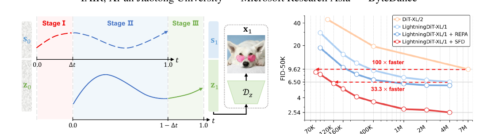
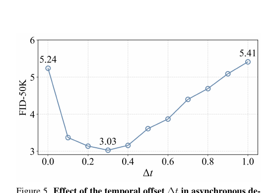

# SFD: Semantics Lead the Way — 의미를 텍스처보다 먼저 디노이징하기

## 메타 정보

| 항목 | 내용 |
|---|---|
| **논문 제목** | Semantics Lead the Way: Harmonizing Semantic and Texture Modeling with Asynchronous Latent Diffusion |
| **저자** | Yueming Pan, Ruoyu Feng, Qi Dai, Yuqi Wang, Wenfeng Lin, Mingyu Guo, Chong Luo, Nanning Zheng |
| **소속** | ¹IAIR, 시안교통대(Xi'an Jiaotong University) · ²Microsoft Research Asia · ³ByteDance (제1저자 Pan은 MSRA 인턴 중 수행) |
| **공개일** | 2025-12 (arXiv v2: 2025-12-05) |
| **분야** | Latent Diffusion, class-conditional 이미지 생성, 학습 효율화 |
| **논문 링크** | [arXiv abstract](https://arxiv.org/abs/2512.04926) / [PDF](https://arxiv.org/pdf/2512.04926) |
| **코드/프로젝트** | https://yuemingpan.github.io/SFD.github.io/ |
| **사용한 외부 모델** | DINOv2-B with registers(의미 인코더, 동결), SD-VAE f16d32(텍스처 인코더), LightningDiT(백본), REPA(보조 손실), AutoGuidance(가이던스) |
| **후속 논문** | [[paper_sefi_image]] — 같은 SFD 방법을 T2I 파운데이션 규모(1B~5B)로 확장한 자매 논문. 핵심 저자(Ruoyu Feng 등) 공유 |

> **한 줄 위치**: 이 논문이 **SFD 방법의 원논문**이다. ImageNet 256² class-conditional에서 방법을 증명했고, 후속 SeFi-Image가 이걸 텍스트→이미지 실전 규모로 검증했다. 본 문서는 [[paper_sefi_image]] (PAPER_SeFi-Image.md)와 상호 참조 관계.

---

## 주요 용어 사전 (Glossary)

### 핵심 개념
| 용어 | 뜻 |
|---|---|
| **Semantic-First Diffusion (SFD)** | 의미(semantic) latent를 텍스처(texture) latent보다 시간축에서 Δt만큼 **먼저** 디노이징하는 latent diffusion 패러다임. 텍스처는 항상 "자기보다 깨끗한 의미 앵커"를 조건으로 받으며 생성됨 |
| **Semantic latent (s)** | 사전학습 vision encoder(DINOv2)가 뽑은 feature를 SemVAE로 압축한 잠재 표현. "무엇이 어디에" — 물체·레이아웃·구도 담당. **최종 이미지 디코딩엔 안 쓰이고 버려짐** |
| **Texture latent (z)** | SD-VAE가 픽셀 디테일을 압축한 잠재 표현. 최종 이미지는 이것만 디코딩 |
| **Composite latent(합성 잠재)** | 의미+텍스처 latent를 **채널 방향으로 concat**한 하나의 텐서 (48채널). 두 스트림이 같은 공간 격자를 공유 |
| **Temporal offset (시간 오프셋) Δt** | 의미가 텍스처보다 앞서가는 시간 간격. ImageNet 실험 최적값 **0.3** |
| **Asynchronous denoising(비동기 디노이징)** | 의미와 텍스처에 서로 다른 timestep을 주어, 둘을 같은 노이즈 레벨이 아니라 Δt만큼 어긋나게 디노이징하는 것 |
| **coarse-to-fine(거친→세밀)** | 확산모델이 원래 큰 구조(의미)를 먼저, 세부 질감(텍스처)을 나중에 만드는 자연스러운 성질. SFD는 이 순서를 방관하지 말고 **명시적으로 강제**하자는 발상 |

### 아키텍처
| 용어 | 뜻 |
|---|---|
| **Semantic VAE (SemVAE)** | DINOv2 feature를 채널 압축하는 초경량 Transformer VAE (인코더 4블록, 겨우 **29M** 파라미터). 토큰 배치는 유지하고 채널만 16차원으로 압축 |
| **Dual timestep(이중 타임스텝)** | DiT가 의미용 timestep t_s와 텍스처용 timestep t_z 두 개를 동시에 입력받아, 두 스트림의 velocity(속도)를 각각 예측 |
| **LightningDiT** | 본 논문이 백본으로 쓴 DiT 변형([hustvl/LightningDiT](https://github.com/hustvl/LightningDiT)). VA-VAE·REPA를 결합해 수렴을 빠르게 한 DiT |

### 비교 기법 (모두 "의미로 diffusion 강화")
| 기법 | SFD와의 차이 |
|---|---|
| **REPA** | DiT 중간 feature를 DINOv2 feature에 정렬하는 보조 손실. SFD와 배타가 아니라 **합산 관계**로 함께 씀 |
| **VA-VAE** | VAE latent 공간을 vision foundation model에 정렬해 의미를 풍부하게. 단 재구성 품질이 살짝 희생됨 |
| **ReDi / REG** | DINOv2 feature(PCA 압축 등)를 텍스처 latent와 concat해 함께 모델링. 단 **동시(synchronous)** 디노이징 |
| **RAE** | latent 공간을 순수 vision encoder 표현으로 교체. 재구성이 texture-deficient(질감 부족)해짐 |
| **공통 한계** | 위 넷 다 의미를 latent에 "넣기만" 하고 **같은 노이즈 레벨에서 동시에 디노이징**. SFD는 여기서 "의미를 먼저 처리"라는 순서를 추가 |

### 평가 지표
| 지표 | 뜻 |
|---|---|
| **FID / sFID** | 생성 이미지 현실성 / 공간 구조 정합성 (낮을수록 좋음) |
| **IS / Precision / Recall** | 클래스별 다양성 / 샘플 충실도 / 분포 커버리지 |
| **rFID / PSNR / LPIPS / SSIM** | VAE 재구성 품질 지표 (rFID·LPIPS는 낮을수록, PSNR·SSIM은 높을수록 좋음) |

---

## 논문 요약 (TL;DR)

**"확산모델은 원래 의미를 먼저 잡는다 — 그 순서를 방관 말고 규칙으로 강제했더니 학습이 100배 빨라지고 ImageNet FID 1.04 SOTA."**

- **핵심 문제**: REPA·VA-VAE·ReDi 등은 사전학습 인코더의 의미 정보를 latent에 넣어 diffusion 학습을 가속했다. 그런데 의미를 넣어놓고도 **의미와 텍스처를 똑같은 노이즈 레벨에서 동시에 디노이징**한다. 확산모델의 "의미 먼저, 텍스처 나중"이라는 자연스러운 순서(coarse-to-fine)를 살리지 않는다.
- **해결책**: 의미 latent를 텍스처보다 Δt만큼 **먼저** 디노이징하는 **Semantic-First Diffusion (SFD)**. 텍스처가 매 순간 "자기보다 깨끗한 의미 앵커"를 조건으로 받게 만든다. 방 꾸미기 전 설계도부터 그리는 원리.
- **검증**: ImageNet 256² class-conditional에서 LightningDiT 백본으로 **FID 1.06(675M) / 1.04(1.0B, SOTA)**. 가이던스 없이도 DiT-XL 대비 **100배**, LightningDiT 대비 **33.3배** 빠른 수렴. ReDi에 얹어도 개선(5.33→4.41)되어 방법의 일반성 입증.

---

## 아주 쉬운 설명 (초보자용)

> 왜 이 절이 있나: 수식·용어 전에 논문 전체를 비유 하나로 잡아두면 뒤가 훨씬 쉽게 읽힌다.

**한 문장**: "밑그림 먼저, 색칠은 반 박자 늦게" — 화가라면 다 아는 이 순서를 AI에게 규칙으로 박아줬더니 훨씬 싸게 좋은 그림 AI가 됐다.

### ① 기존 방식의 허점: 밑그림과 색칠을 "동시에" 한다
그림 생성 AI는 노이즈(지지직 화면)에서 시작해 조금씩 그림을 드러낸다. 그런데 기존 방식은 **구도 잡기(어디에 개, 어디에 잔디)와 질감 그리기(털 한 올, 빛 반사)를 한꺼번에** 진행한다. 최근 연구들이 "구도 감각(DINOv2 같은 사전학습 인코더의 의미 정보)"을 재료로 넣어주긴 했는데, 넣어놓고도 밑그림과 색칠을 같은 타이밍에 그린다. 밑그림 없이 완성본을 그려나가는 셈 — 천재(대형 모델)면 몰라도 보통 실력(작은 모델)엔 너무 어렵다.

### ② SFD의 해법: 밑그림 필름을 반 박자 먼저 완성한다
한 사진을 투명 필름 두 장으로 나눈다.
- **필름 A = 밑그림 층(의미 latent s)**: "개가 가운데, 잔디가 뒤에" 배치 정보만
- **필름 B = 질감 층(텍스처 latent z)**: 털, 색, 빛 같은 디테일

규칙 하나 추가: **필름 A를 항상 Δt(=0.3)만큼 먼저 완성해 나간다.** 그러면 필름 B(색칠)는 매 순간 "이미 꽤 선명해진 밑그림"을 컨닝하면서 칠하면 된다. 백지에 그리기보다 밑그림 위에 칠하기가 훨씬 쉽다 — 이게 제목의 **Semantics Lead the Way**(의미가 앞장선다)다. 다 그리면 밑그림 필름은 버리고 색칠 필름만 최종 그림이 된다.

### ③ 결과: 다윗이 골리앗을 이긴 시험
- **학습 속도**: DiT-XL이 700만 스텝 걸려 낸 성적을, SFD는 **7만~12만 스텝**에 달성 → 100배·33배 빠름
- **최종 품질**: ImageNet FID 1.04로 당시 SOTA
- **일반성**: 이 "밑그림 먼저" 규칙을 다른 방법(ReDi)에 얹어도 좋아짐 → SFD만의 요행이 아니라 원리

### ④ 정직한 한계
Δt(밑그림이 얼마나 앞서갈지)는 손으로 튜닝해야 하고(여기선 0.3), ImageNet 클래스 조건 생성에서만 증명했다. "그럼 진짜 T2I 대형 모델에서도 통하나?"는 후속작 [[paper_sefi_image]]가 이어받았다.

---

## 핵심 기여 (Contributions)

1. **Composite latent 설계**: SemVAE로 뽑은 의미 latent 와 SD-VAE로 뽑은 텍스처 latent를 채널 concat. SemVAE는 사전학습 인코더의 고수준 feature를 압축하면서 의미 무결성·공간 배치를 보존.
2. **Semantic-first 비동기 디노이징**: 의미가 먼저 진화하고 이어서 텍스처를 유도하는 **3단계 스케줄** 제안. 확산의 coarse-to-fine 성질을 latent 표현 수준에서 명시적으로 구현한 최초 사례.
3. **SOTA + 극적 가속**: ImageNet 256² FID **1.04**, DiT/LightningDiT 대비 **100× / 33.3×** 빠른 수렴.
4. **일반성 검증**: SFD를 기존 동시 디노이징 방법(ReDi, VA-VAE)에 이식해도 성능 향상 → 범용 원리임을 입증.

---

## 주요 알고리즘 설명

### 1. 전체 그림 — 3단계 비동기 스케줄

> 왜 이 절이 있나: SFD의 심장은 "의미와 텍스처가 서로 다른 시계로 움직이는 3단계 스케줄"이므로, 이 그림 하나면 논문의 8할이 이해된다.

왼쪽: 의미(점선)와 텍스처(실선)의 디노이징 궤적이 Δt만큼 어긋나 있다. 이 논문 표기는 **t=0이 순수 노이즈, t=1이 깨끗한 상태**(통상과 반대 방향 주의).

| 단계 | 조건 | 동작 |
|---|---|---|
| **Stage I 의미 초기화** | t_s ∈ [0, Δt), t_z = 0 | 의미만 디노이징 → 전역 레이아웃 확립 (텍스처는 순수 노이즈로 대기) |
| **Stage II 비동기 생성** | t_s ∈ [Δt, 1], t_z ∈ [0, 1−Δt) | 둘 다 디노이징하되 의미가 Δt 앞서가며 텍스처를 유도 |
| **Stage III 텍스처 완성** | t_s = 1, t_z ∈ [1−Δt, 1] | 의미 완성·동결, 텍스처 디테일만 마무리 |

오른쪽 수렴 곡선: LightningDiT-XL/1 + SFD(빨강)가 같은 FID를 훨씬 적은 iteration에 도달. 완료 후 **텍스처 latent만 디코딩**(그림의 D_z)하고 의미 latent s₁은 버린다.

### 2. Composite Latent 구성 — 의미 인코더 SemVAE

> 왜 이 절이 있나: DINOv2 feature는 채널이 너무 커서 그대로 diffusion 대상으로 삼기 어렵다. 이를 diffusion이 다루기 좋은 매끈한 잠재로 눌러주는 어댑터가 SemVAE다.

이미지 x를 두 갈래로 인코딩한다:

$$s_1 = \mathcal{E}_s(f_s), \quad f_s = f(x) \;(\text{DINOv2-B, 동결}), \qquad z_1 = \mathcal{E}_z(x) \;(\text{SD-VAE})$$

- **SemVAE 구조**: 입력 linear proj → Transformer 4블록 → LayerNorm → 출력 linear. 인코더 출력을 평균·분산으로 쪼개 reparameterization으로 s₁ 샘플링. 디코더는 대칭 구조로 원래 DINOv2 feature를 복원.
- **SemVAE 학습 손실** (한 번 학습 후 동결):

$$\mathcal{L}_{\text{SemVAE}} = \mathcal{L}_{\text{MSE}} + \mathcal{L}_{\text{cos}} + \lambda_{kl}\mathcal{L}_{\text{KL}}, \qquad \lambda_{kl} = 10^{-7}$$

(MSE = feature 복원 충실도, cos = 방향 정렬, KL = 잠재 정규화. KL 가중치가 거의 0이라 사실상 복원 극대화)

- **합성**: 두 latent를 채널 방향으로 이어붙인다. 텍스처 32채널 + 의미 16채널 = **48채널**, 256×256 이미지당 256토큰.

$$c = [\,s_1, z_1\,] \in \mathbb{R}^{L \times (C_s + C_z)}$$

### 3. 비동기 타임스텝 샘플링 (학습)

> 왜 이 절이 있나: "의미가 항상 텍스처보다 덜 오염되게" 만드는 것이 SFD 학습의 전부다. 그 장치가 이 세 줄 수식이다.

의미 timestep을 넓은 구간에서 뽑고, 텍스처는 거기서 Δt만큼 뒤처지게 한 뒤 둘 다 [0,1]로 자른다:

$$t_s \sim \mathcal{U}(0,\, 1+\Delta t), \qquad t_z = \max(0,\, t_s - \Delta t), \qquad t_s = \min(t_s,\, 1)$$

이러면 항상 t_s ≥ t_z (의미가 더 깨끗함) 보장. 범위를 1+Δt까지 늘려 뽑는 이유는 **"밑그림은 이미 100%인데 질감만 마무리하는 막판 상황"까지 골고루 연습시키기 위해서**. (같은 clamp 트릭의 자세한 케이스별 표는 [[paper_sefi_image]] 알고리즘 1절 참조)

**DiT는 이중 타임스텝으로 forward** — 노이즈 낀 합성 latent + 두 timestep + 클래스 라벨 y를 받아 두 velocity를 예측:

$$[\hat{v}_s, \hat{v}_z] = v_\theta([s_{t_s}, z_{t_z}],\, [t_s, t_z],\, y)$$

**학습 손실** = 두 스트림 velocity 예측 + REPA 정렬:

$$\mathcal{L}_{\text{pred}} = \mathbb{E}\big[\|\hat{v}_z - (z_1 - z_0)\|^2 + \beta\|\hat{v}_s - (s_1 - s_0)\|^2\big], \qquad \mathcal{L}_{\text{total}} = \mathcal{L}_{\text{vel}} + \lambda\mathcal{L}_{\text{REPA}}$$

- 여기서 REPA는 변형된 형태: DiT hidden state를 **노이즈 낀 의미 latent를 깨끗한 표현으로 복원**하도록 정렬. 원본 REPA(VFM의 분석 능력을 증류)보다 학습 목표가 더 명확(tractable)하다고 주장.
- 하이퍼파라미터: β=2.0, Δt=0.3, λ=1.0, REPA alignment depth 2.

### 4. 3단계 스케줄의 구현 — 이진 마스크 (추론)

> 왜 이 절이 있나: 추가 스텝 없이 3단계를 구현하는 비결이 이진 마스크다.

각 단계마다 의미/텍스처 velocity 업데이트를 이진 마스크 M_s, M_z로 켜고 끈다:

$$[M_s, M_z] = \begin{cases} [1, 0], & t_s \in [0, \Delta t),\; t_z = 0 \\ [1, 1], & t_s \in [\Delta t, 1],\; t_z \in [0, 1-\Delta t) \\ [0, 1], & t_s = 1,\; t_z \in [1-\Delta t, 1] \end{cases}$$

$$\hat{v} = [M_s \odot \hat{v}_s,\; M_z \odot \hat{v}_z]$$

**추가 비용 0의 비결**: 타임스텝 범위가 Δt만큼 늘어난 대신 **스텝 간격을 비례해서 벌려 총 추론 스텝 수는 그대로**. (후속 SeFi-Image 코드에서는 이 마스크를 별도 텐서 없이 clamp로 대체 구현 — [[paper_sefi_image]] 알고리즘 3절 참조)

### 5. 실험 설정

| 항목 | 값 |
|---|---|
| 백본 | LightningDiT (B/L/XL/XXL) |
| 데이터 | ImageNet-1K, 256×256 |
| 배치 / LR / 옵티마이저 | 256 / 1e-4 (또는 2e-4) / AdamW |
| 텍스처 VAE | SD-VAE f16d32 (32채널, 16배 공간 압축) |
| 의미 인코더 | DINOv2-B with registers → SemVAE(29M) → 16채널 |
| 솔버 / 가이던스 | dopri5 적응 스텝 / AutoGuidance (DiT-B degradation model) |
| 평가 | FID·sFID·IS·Precision·Recall, 50K 샘플, ADM 파이프라인 |

---

## 실험 요약

### 핵심 실험 ①: 시간 오프셋 Δt (Figure 5) — 논문의 심장

> 왜 이 절이 있나: "의미를 얼마나 먼저 보낼까"가 유일한 핵심 다이얼이고, 이 곡선이 논문 주장을 가장 강하게 증명한다.

| Δt | FID-50K | 의미 |
|---|---|---|
| 0.0 | 5.24 | 동시 디노이징 (기존 ReDi·REG와 동치) |
| **0.3** | **3.03** | **최적** — 의미가 살짝 앞서 명확한 가이드 제공 |
| 1.0 | 5.41 | teacher-forcing 순차 생성 (의미 완전 완성 후 텍스처 시작) → 학습-추론 불일치로 악화 |

→ **"조금" 앞서는 게 정답.** 완전 동시(0)도, 완전 분리(1)도 아닌 중간(0.3)이 최적인 U자 곡선. Δt 0.3을 넘어서면 협력이 깨지며 점진적으로 나빠진다.

### 핵심 실험 ②: 컴포넌트 분해 (Table 3)

> 왜 이 절이 있나: "의미를 넣는 것"과 "의미를 먼저 처리하는 것" 중 무엇이 진짜 효과인지 가른다.

| REPA | SemVAE | Semantic-First | FID-50K |
|:---:|:---:|:---:|---|
| ✗ | ✗ | ✗ | 8.17 |
| ✓ | ✗ | ✗ | 7.08 |
| ✓ | ✓ | ✗ | 5.24 |
| ✓ | ✓ | ✓ | **3.03** |

→ SemVAE로 의미를 넣으면 7.08→5.24. 하지만 **의미-우선(비동기) 스케줄이 5.24→3.03으로 가장 큰 도약**. 즉 "의미를 넣는 것"보다 "의미를 **먼저** 처리하는 것"이 더 중요하다는 결정적 증거.

### 핵심 실험 ③: 수렴 가속 (Table 1, 가이던스 없음)

| 모델 | 파라미터 | Iter | FID |
|---|---|---|---|
| DiT-XL/2 | 675M | 7M | 9.62 |
| LightningDiT-XL/1 + REPA | 675M | 4M | 5.84 |
| **+ SFD (Ours)** | 675M | **400K** | **3.53** |
| **+ SFD (Ours)** | 675M | 4M | **2.54** |
| LightningDiT-B/1 + REPA → + SFD | 130M | 400K | 21.45 → **10.40** |
| LightningDiT-L/1 + REPA → + SFD | 458M | 400K | 7.48 → **3.89** |

→ SFD 400K(3.53)가 REPA 4M(5.84)을 **학습량 10%로** 능가. DiT-XL 7M(9.62)을 70K/120K만에 따라잡아 **100× / 33.3×** 가속.

### 핵심 실험 ④: SOTA 비교 (Table 2, 가이던스 있음)

| 모델 | Epoch | 파라미터 | FID↓ | sFID↓ | IS↑ |
|---|---|---|---|---|---|
| DiT-XL | 1400 | 675M | 2.27 | 4.60 | 278.2 |
| DDT | 400 | 675M | 1.26 | — | 310.6 |
| REPA-E | 800 | 675M | 1.12 | — | 302.9 |
| **SFD (XL)** | **80** | 675M | 1.30 | 3.87 | 233.4 |
| **SFD (XL)** | 800 | 675M | **1.06** | 3.87 | 267.0 |
| **SFD (XXL)** | 800 | **1.0B** | **1.04** | **3.75** | 264.2 |

→ SFD-XL이 **80 epoch만에 FID 1.30** — DiT-XL이 1400 epoch 걸려 낸 2.27을 가볍게 넘음. SFD-XXL 1.04는 당시 SOTA.

### 부가 실험: 일반성 · 압축 · 재구성

| 실험 | 결과 | 의미 |
|---|---|---|
| **일반성 (Table 5)** | ReDi 5.33 → +Semantic-First **4.41** | SFD만의 요행 아님. 다른 동시 디노이징 방법에도 얹으면 개선 |
| **의미 압축 방식 (Table 4)** | PCA 4.06 vs **SemVAE 3.03** | ReDi식 PCA 차원축소보다 SemVAE가 우수 — 의미 완결성 보존이 중요 |
| **재구성 (Table 6)** | SD-VAE rFID **0.26** / PSNR **28.59** (VA-VAE 0.28/27.96, RAE 0.57/18.86) | SFD는 텍스처에 SD-VAE를 그대로 써 **재구성 품질을 희생하지 않음**. VA-VAE(latent 정렬로 재구성 저하)·RAE(순수 인코더로 질감 부족)의 딜레마를 회피 |

### 비판적으로 볼 지점

1. **Δt 자동 튜닝 없음** — 데이터셋·조건마다 최적 Δt가 달라질 텐데 원리적 결정법은 미제시. 여기선 실험으로 0.3.
2. **범위가 ImageNet class-conditional** — 텍스트→이미지 같은 복잡한 조건에서의 일반성은 범위 밖 (→ 후속 [[paper_sefi_image]]가 담당).
3. **이론적 설명은 약함** — "왜 Δt=0.3이 최적인가"는 U자 곡선(경험적)과 직관 비유로만 뒷받침, 이론 유도 없음.
4. **부품 재사용 기반** — DINOv2·SD-VAE·REPA·LightningDiT·AutoGuidance 모두 기존 부품. 신규성은 "의미를 먼저 처리한다"는 스케줄 아이디어에 집중.

---

## 💬 Q&A

### Q1. SFD가 flow matching을 대체하는 건가?

**아니다. flow matching 위에 얹힌 스케줄링 규칙이다.** 학습 목표는 그대로 velocity 예측(식 16), 추론도 그대로 velocity 적분. SFD가 바꾼 건 딱 두 가지: ① latent를 의미/텍스처로 나눠 각각 독립 flow matching 경로 배정, ② 시계를 둘로 쪼개 의미가 항상 Δt 앞서게 함. REPA·AutoGuidance 같은 flow matching 생태계 도구가 전부 그대로 호환된다는 사실 자체가, SFD가 대체물이 아니라 그 위의 얇은 층이라는 증거. (더 자세한 위치 비교는 [[paper_sefi_image]] Q2 참조)

### Q2. 왜 의미를 "먼저" 처리하면 학습이 빨라지나?

**어려운 문제 하나를 쉬운 문제 둘로 분해하기 때문.** 일반 diffusion은 "노이즈 → 구도+질감 전부"라는 넓은 분포를 통째로 학습한다. SFD는 (1) 의미 latent 생성(작고 매끈한 공간이라 작은 모델도 잘 배움) → (2) 텍스처 생성(**이미 Δt 먼저 깨끗해진 의미 앵커를 조건으로 받는** 조건부 생성)으로 나눈다. 조건이 풍부할수록 커버할 분포가 좁아진다 — "아무거나 그려" 대신 "이 밑그림대로 칠해". Table 3의 5.24→3.03(의미를 넣기만 vs 먼저 처리)이 직접 증거.

### Q3. SeFi-Image와 뭐가 다른가?

**같은 방법(SFD), 다른 규모·다른 과제.**

| | 본 논문 (SFD 원논문) | [[paper_sefi_image]] (후속) |
|---|---|---|
| 과제 | ImageNet 256² class-conditional | 텍스트→이미지 (T2I) |
| 규모 | 130M~1.0B | 1B / 2B / 5B |
| 의미 인코더 | DINOv2-**B** | DINOv2-**Large** |
| 텍스처 VAE | SD-VAE f16d32 | FLUX.2 VAE(미세조정) |
| 조건 | 클래스 라벨 | Qwen3-VL LLM 텍스트 임베딩 |
| 최적 Δt | 0.3 | 0.2 → 0.1 (해상도별) |
| 기여 | **방법 제안·증명** | **스케일 검증·풀스택 레시피·모델 릴리스** |

본 논문이 "밑그림 먼저"라는 아이디어를 장난감 세팅에서 증명했고, SeFi가 "그게 진짜 대형 T2I에서도 통하나?"를 확인했다.

---

## 한 줄 요약 (전체)

**확산모델이 원래 갖는 "의미 먼저, 텍스처 나중"(coarse-to-fine) 성질을 방관하지 말고, 의미 latent를 텍스처보다 Δt(=0.3)만큼 명시적으로 먼저 디노이징하도록 강제한 SFD. latent에 의미를 "넣는" 데서 한 발 더 나아가 "언제 처리하느냐(순서)"를 설계 변수로 승격시켜, 추가 비용 거의 없이 ImageNet FID 1.04 SOTA + 학습 100배 가속을 달성한 원논문. Table 3의 5.24→3.03 도약이 주장을 가장 강하게 뒷받침한다.**

---

## 관련 메모리 링크

- [[paper_sefi_image]] — 같은 SFD를 T2I 파운데이션 규모로 확장한 자매 논문 (PAPER_SeFi-Image.md)
- [[paper_repa]] — SFD가 보조 손실로 함께 쓰는 표현 정렬 기법
- [[paper_ddt]] — 유사 문제의식(인코딩/디코딩 분리)을 네트워크 구조로 푼 접근
- [[reference_pretrained_backbone_reuse_landscape]] — DINOv2·SD-VAE 동결 재사용 패턴 분류
