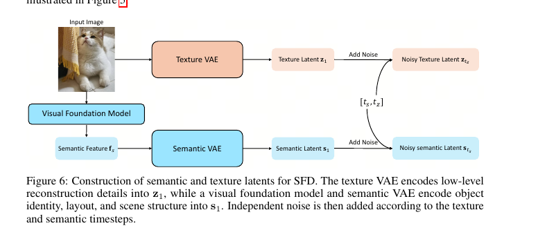
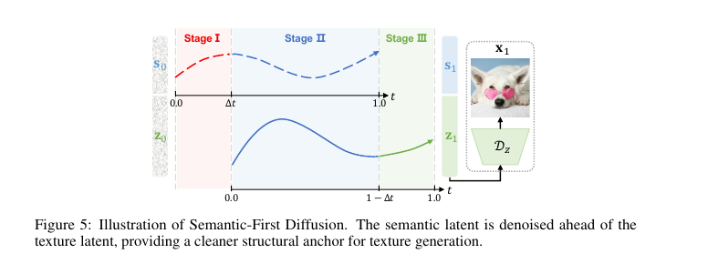
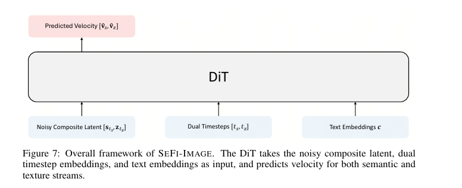
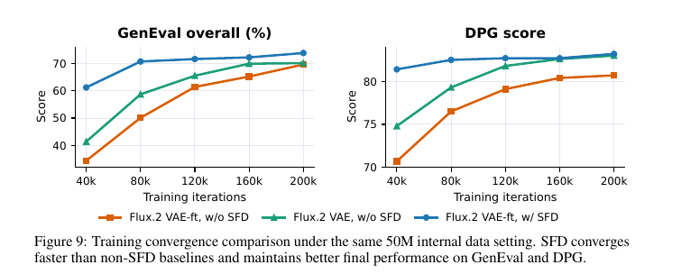
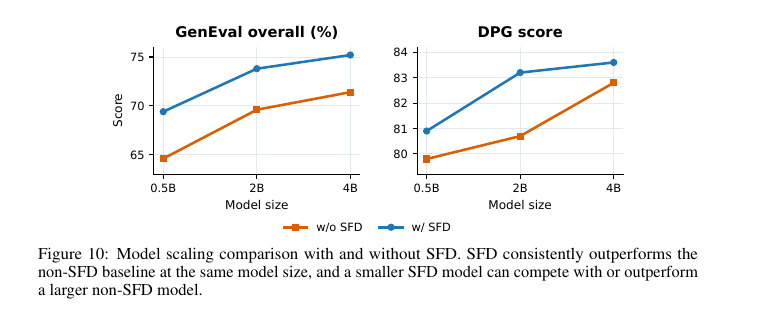

# SeFi-Image: A Text-to-Image Foundation Model with Semantic-First Diffusion

## 메타 정보

| 항목 | 내용 |
|---|---|
| **논문 제목** | SeFi-Image: A Text-to-Image Foundation Model with Semantic-First Diffusion |
| **저자** | SeFi Team (Core: Ruoyu Feng, Jinming Liu — 소속 불명) |
| **공개일** | 2026-06 (arXiv v3: 2026-06-26) |
| **분야** | Text-to-Image 생성, Latent Diffusion, 학습 효율화 |
| **논문 링크** | [arXiv abstract](https://arxiv.org/abs/2606.22568) / [PDF](https://arxiv.org/pdf/2606.22568) |
| **코드** | [github.com/jmliu206/SeFi-Image](https://github.com/jmliu206/SeFi-Image) — **추론 전용** (학습 코드 없음) |
| **가중치** | [HuggingFace SeFi-Image](https://huggingface.co/SeFi-Image) — 1B/2B/5B × Base/RL/Turbo, **gated(승인 필요)** |
| **사용한 외부 모델** | DINOv2-Large(의미 인코더, 동결), Qwen3-VL-2B/4B LLM(텍스트 인코더, 동결), FLUX.2 VAE(미세조정), Qwen3.5-2B(재캡션), DMD2(증류), DiffusionNFT(RL) |
| **선행 논문** | SFD 원논문 (Pan, Feng et al., "Semantics Lead the Way", 2025) — 핵심 저자 공유 |

---

## 주요 용어 사전 (Glossary)

### 핵심 개념
| 용어 | 뜻 |
|---|---|
| **Semantic-First Diffusion (SFD)** | 의미(semantic) latent를 텍스처(texture) latent보다 시간축에서 Δt만큼 **먼저** 디노이징하는 latent diffusion 패러다임. 텍스처 생성이 항상 "자기보다 깨끗한 의미 앵커"를 조건으로 받게 됨 |
| **Semantic latent (s)** | DINOv2 feature를 SemVAE로 압축한 잠재 표현. 물체 정체성·레이아웃·구도 담당. **최종 이미지 디코딩에는 쓰이지 않고 버려짐** |
| **Texture latent (z)** | FLUX.2 VAE(미세조정판)가 픽셀 디테일을 압축한 잠재 표현. 최종 이미지는 이것만 디코딩 |
| **Composite latent** | 의미+텍스처 latent를 **채널 방향으로 concat**한 하나의 텐서. 두 스트림이 같은 공간 격자·같은 RoPE 좌표를 공유 |
| **Δt (temporal offset)** | 의미가 텍스처보다 앞서가는 시간 간격. 사전학습 초반(256/512px) 0.2 → 이후 0.1 |
| **3-phase denoising** | 추론 시 ①의미 초기화 → ②비동기 동시 생성 → ③텍스처 마무리의 3단계 스케줄 |
| **재구성-생성 트레이드오프 (reconstruction-generation trade-off)** | VAE가 정보를 많이 보존하면 재구성은 좋지만 diffusion이 배우기 어렵고, 압축하면 그 반대가 되는 딜레마 |

### 아키텍처
| 용어 | 뜻 |
|---|---|
| **SemVAE (Semantic VAE)** | DINOv2 feature를 채널 압축하는 초경량 VAE (Transformer 4블록). 토큰 배치는 유지하고 채널만 압축. 8×A800 48시간이면 학습 완료 |
| **Dual timestep embedding** | 의미/텍스처 타임스텝을 각각 임베딩한 뒤 concat하여 기존 단일 timestep 임베딩 자리에 넣는 것. AdaLN modulation 경로는 수정 없이 그대로 사용 |
| **Double/Single-stream DiT** | FLUX.2-klein 스타일 백본. double-stream(이미지/텍스트 스트림 분리 + joint attention) 블록 뒤에 single-stream(concat 후 공유 처리) 블록 |

### 학습·후처리
| 용어 | 뜻 |
|---|---|
| **REPA** | DiT 중간 feature를 DINOv2 feature에 정렬시키는 보조 loss. SFD와 배타가 아니라 **합산 관계**로 같이 씀 |
| **DMD2** | 4-step 증류 방법. 교사=동결 SFT 모델. 증류 시에도 Δt=0.1 오프셋 유지 |
| **DiffusionNFT** | RL 후처리. 생성 이미지를 다시 인코딩한 clean 타겟 기반, positive/implicit-negative 보간 loss (Tstars-Tryon에서도 사용된 방법) |
| **Timestep shift** | t' = αt/(1+(α−1)t) 변형. base/RL 모델 기본 α=0.3 — 고노이즈 구간에 스텝을 몰아주는 SD3식 트릭 (논문엔 없고 코드에만 있음) |
| **AutoGuidance** | CFG의 무조건(uncond) 예측 대신 **더 작은/약한 모델의 예측**을 기준선으로 쓰는 Karras식 가이던스 (논문엔 없고 코드에 완전 구현) |

### 평가 지표
| 용어 | 뜻 |
|---|---|
| **GenEval / DPG** | 구도·배치·속성(개수, 색, 위치) 정합성 벤치마크 |
| **LongTextBench / CVTG-2K** | 긴 텍스트 프롬프트 이행 / 글자 단위 텍스트 렌더링 정확도 |
| **OneIG (EN/ZH)** | 정렬·텍스트·추론·스타일·다양성 종합 이중언어 벤치마크 |

---

## 논문 요약 (TL;DR)

**"Semantic-First Diffusion을 처음으로 진짜 T2I 파운데이션 모델 규모로 검증한 논문"**

- **핵심 문제**: REPA·RAE·VA-VAE·SFD 등 "의미 정보로 diffusion 학습 가속" 연구들은 전부 ImageNet 256², class-conditional, 1B 미만의 장난감 세팅에서만 검증됨. 실전 T2I(고해상도, 텍스트 렌더링, 복잡한 지시문)에서도 통하는가?
- **해결책**: SFD(의미 latent를 Δt 먼저 디노이징) 위에 1B/2B/5B T2I 모델 풀스택(데이터→사전학습→SFT→RL→증류)을 구축
- **검증**: 5B를 **A800 125K GPU시간**(Z-Image의 10~20%)으로 학습해 GenEval 0.88(1위), LongTextBench 0.978(1위), OneIG-EN 0.5606(1위). **1B가 GenEval에서 20B Qwen-Image와 동점(0.87)**. 2B+SFD가 4B(SFD 없음)를 능가

---

## 핵심 기여 (Contributions)

1. **SFD의 스케일 검증**: 의미 유도 diffusion이 1B~5B, 1024px, 실전 T2I에서도 유효함을 최초로 입증 (방법론 자체는 동일 저자의 선행 논문 [15])
2. **재구성-생성 트레이드오프의 재해석**: 의미 앵커가 텍스처 모델링 부담을 덜어주므로, VAE를 재구성 쪽으로 극한까지 미세조정해도 됨 (FLUX.2 VAE Kodak PSNR 33.18 → **36.40**)
3. **파라미터 효율**: 2B+SFD > 4B(w/o SFD). 1B도 GenEval에서 20B급
4. **풀스택 레시피 공개**: 데이터 파이프라인(재캡션·합성 텍스트 렌더링·VLM 필터링 프롬프트 전문), 4단계 학습 + DMD2 4-step Turbo + DiffusionNFT RL
5. **실용 모델 릴리스**: 1B/2B/5B × Base/RL/Turbo 추론 코드·가중치 공개 (단, HF gated)

---

## 주요 알고리즘 설명

### 1. SFD: 두 개의 잠재 공간, 두 개의 시계

> 왜 이 절이 있나: SFD의 전부는 "latent를 둘로 나누고, 타임스텝을 두 개로 쪼갠다"이므로 이 두 가지를 정확히 이해하면 나머지는 표준 flow matching이다.



이미지 하나를 두 갈래로 인코딩한다:

$$s_1 = \mathcal{E}_s(\Phi(x)) \quad (\Phi = \text{DINOv2-Large, 동결}), \qquad z_1 = \mathcal{E}_z(x) \quad (\text{FLUX.2 VAE 미세조정판})$$

**노이즈 경로는 표준 flow matching 직선 보간** (이 논문 표기는 t=0이 순수 노이즈, t=1이 깨끗한 상태 — 통상과 반대 방향 주의):

$$s_{t_s} = (1-t_s)s_0 + t_s s_1, \qquad z_{t_z} = (1-t_z)z_0 + t_z z_1$$

**타임스텝 샘플링** — 의미가 항상 Δt만큼 덜 오염되게:

$$t_s \sim \mathcal{U}(0,\, 1+\Delta t), \qquad t_z = \max(0,\, t_s - \Delta t), \qquad t_s = \min(t_s,\, 1)$$

**학습 loss** = 두 스트림의 velocity 예측 + REPA:

$$\mathcal{L}_{\text{pred}} = \mathbb{E}\left[\|\hat{v}_z - (z_1 - z_0)\|^2 + \beta\,\|\hat{v}_s - (s_1 - s_0)\|^2\right], \qquad \mathcal{L}_{\text{total}} = \mathcal{L}_{\text{pred}} + \lambda\,\mathcal{L}_{\text{REPA}}$$

- Δt: 256/512px 단계 0.2 → 768px 이후 0.1 / β: 사전학습 2 → continual·SFT 1
- REPA 타겟 y*는 SemVAE 입력과 같은 DINOv2 feature — SFD와 REPA가 **합산 관계**로 공존

### 2. 3-phase 추론 스케줄

> 왜 이 절이 있나: SFD의 추론이 "추가 스텝 없이" 돌아가는 비결이 이 스케줄에 있다.



| 단계 | 조건 | 동작 |
|---|---|---|
| ① 의미 초기화 | t_s ∈ [0, Δt), t_z = 0 | 의미만 디노이징 (텍스처는 순수 노이즈 대기) |
| ② 비동기 동시 생성 | t_s ∈ [Δt, 1], t_z ∈ [0, 1−Δt) | 둘 다 디노이징, 의미가 Δt 앞서감 |
| ③ 텍스처 마무리 | t_s = 1, t_z ∈ [1−Δt, 1] | 의미 완성·동결, 텍스처 디테일만 채움 |

타임스텝 범위가 Δt만큼 늘어난 대신 **스텝 간격을 비례해서 벌려 총 추론 스텝 수는 그대로** (추가 비용 0). 완료 후 **texture latent만 디코딩**하고 semantic latent는 버린다.

### 3. 코드 매핑 — 논문 수식이 코드에서 어떻게 구현됐나

> 왜 이 절이 있나: 공개 저장소(추론 전용, 총 ~2,500줄)를 분석하면 논문이 생략한 구현 디테일과 "SFD의 정체"가 명확해진다.



**저장소 구조:**
```
sefi/
├── runner.py (793줄)               ★ SFD 3-phase 디노이징 루프 — 심장부
├── builder.py (301줄)              모델 조립 + 스케일 프리셋 (0.5B~9B)
├── pipeline.py                     HF에서 받아 조립하는 사용자용 래퍼
├── registry.py                     체크포인트 이름에서 family(base/rl/turbo)·스케일 자동 추론
└── modeling/
    ├── flux2_sefi_transformer.py   ★ diffusers Flux2 백본 + dual timestep 개조
    ├── qwen3vl_text_encoder.py     Qwen3-VL 다층 hidden state concat
    ├── texture_latent_codec.py     FLUX.2 VAE 인코딩/디코딩 + 정규화
    └── texture_vae_factory.py      VAE 로더 (sd1.5/flux1/flux2 지원)
```

**SFD 구성요소별 코드 존재 여부:**

| SFD 구성요소 | 코드 존재 여부 |
|---|---|
| 비동기 dual timestep 스케줄 (3-phase) | ✅ `runner.py:657-695` — 핵심 |
| Dual timestep 임베딩 | ✅ `flux2_sefi_transformer.py:24-56` |
| Semantic+Texture 합성 latent (채널 concat) | ✅ runner.py 곳곳 (`semantic_channels`로 split) |
| **SemVAE, DINOv2, REPA, 학습 loss** | ❌ 없음 (학습 코드 미공개) |

SemVAE가 없는 이유: **생성 시 semantic latent는 이미지에서 인코딩하는 게 아니라 순수 노이즈에서 출발해 DiT가 직접 만들어내고, 마지막에 버려진다.** SemVAE 인코더는 학습 때 정답을 만들 때만 필요하고 디코더는 어디서도 안 쓰인다:

```python
# runner.py:788-792 — 루프 종료 후
texture_latents = latents[:, self.semantic_channels:]   # semantic 부분은 그냥 버림
decoded = self.texture_codec.decode_texture(texture_latents, ...)
```

**DiT = diffusers Flux2 백본의 "최소 침습 개조" (딱 2가지만 수정):**

1. `time_guidance_embed`를 `nn.Identity()`로 무력화 (FLUX guidance 임베딩 제거)
2. `SEFIDualTimestepEmbeddings` 부착 — 의미/텍스처 타임스텝을 각각 sinusoidal 투영 → 각자의 MLP → **절반 차원씩 만들어 concat**. 결과가 기존 단일 timestep 임베딩과 같은 차원이라 백본의 AdaLN modulation 경로를 **한 줄도 안 고치고** 재사용

**생성 flow (`runner.py generate_batch`):**

```
프롬프트 → Qwen3-VL 인코딩 (chat template, hidden layer 9/18/27 concat)
   ↓
노이즈 latent 생성: (B, sem+tex 채널, H/16, W/16) ← 두 스트림 모두 순수 노이즈에서 시작
   ↓
스케줄 구성:
   u = linspace(0, 1, steps+1)                    ← 진행률 좌표
   u ← α·u / (1+(α−1)·u)                          ← timestep shift (base/RL 기본 α=0.3)
   u_sem_raw = u × (1 + Δt)                       ← ★ 의미 축을 1+Δt로 확장
   ↓
매 스텝마다:
   u_tex = clamp(u_sem_raw − Δt, 0, 1)            ← 텍스처는 Δt 뒤처짐
   u_sem = clamp(u_sem_raw, max=1)
   → 각각 scheduler에서 (timestep, sigma) 조회     ← 타임스텝 2개!
   → DiT 1회 forward: 전체 채널의 velocity 예측
   → CFG: 빈 프롬프트로 한 번 더 forward 후 결합 (또는 AutoGuidance)
   → velocity를 sem/tex로 split
   → lat_sem += (σ_sem_next − σ_sem_cur) × vel_sem   ← 스트림별 Euler 적분
   → lat_tex += (σ_tex_next − σ_tex_cur) × vel_tex
   ↓
루프 종료 → semantic 채널 버리고 texture만 FLUX.2 VAE 디코딩 → 이미지
```

**제일 재밌는 발견 — 논문의 "마스크"는 코드에 없다. clamp가 대신한다:**

논문 식 9~10은 3단계마다 이진 마스크 M_s/M_z로 업데이트를 제어한다고 썼는데, 코드에는 마스크 텐서가 아예 없다. clamp가 같은 일을 자동으로 한다:

- **1단계** (u_sem_raw < Δt): u_tex가 현재도 다음도 0에 clamp → dt_tex = σ 차이 = **0** → 텍스처가 저절로 안 움직임 (= 마스크 0과 동치)
- **3단계** (u_sem_raw > 1): u_sem이 1에 clamp → dt_sem = 0 → 의미 동결, 텍스처만 마무리

수학적으로 동치이면서 구현은 훨씬 단순한 우아한 처리. `--debug_assert_schedule` 옵션으로 "u_sem ≥ u_tex, σ_sem ≤ σ_tex" 불변식을 매 스텝 검증하는 코드도 있음.

**합성 latent의 실제 모양:**
- Texture: FLUX.2 VAE(32ch, 8배 다운) → 2×2 패치화로 채널 ×4 = **128ch**, 공간은 픽셀의 1/16
- Semantic: `semantic_channels`는 체크포인트 config에서 읽음 (HF gated라 정확한 값 미확인)
- 최종 latent는 `(B, sem+128, H/16, W/16)` **하나의 텐서**. 두 스트림이 같은 공간 격자·같은 RoPE 좌표(img_ids)를 공유하는 **토큰별 채널 결합**
- FLUX.2 VAE 특유 처리: latent 정규화를 scaling factor가 아니라 VAE 내장 BatchNorm 통계(running mean/std)로 수행

**논문에 없는데 코드에서 드러나는 것들:**

1. **Timestep shift (α=0.3 기본)**: base/RL 모델은 t' = 0.3t/(1−0.7t) 변형 사용 — 고노이즈 구간에 스텝을 몰아주는 SD3식 트릭
2. **AutoGuidance 완전 구현**: 작은 모델용 텍스트 인코더가 다르면 별도 로드까지 지원. 후속 실험 중이거나 릴리스 예정 기능으로 추정
3. **Limited-interval guidance**: σ 구간 [lo, hi]에서만 가이던스를 켜는 옵션
4. **Δt는 추론 때 조절 가능한 다이얼**: config에 delta_t_min/max 범위 저장, `--delta-t`로 override (기본 delta_t_max). 학습을 Δt "범위"로 했을 가능성 시사 — 논문은 고정값처럼 기술
5. **스케일 프리셋 0.5B~9B 9종**: 공개는 1B/2B/5B지만 3B/4B/6B/8B/9B 설정도 실험한 흔적
6. **Turbo는 4/8/10 스텝 지원**, guidance 1.0 강제

### 4. 아키텍처 구성 (Table 1)

| 모델 | 텍스트 인코더 | 내부 차원 | 헤드 | Double | Single | 파라미터 |
|---|---|---|---|---|---|---|
| 1B | Qwen3-VL-2B | 2048 | 16 | 4 | 12 | ~1.18B |
| 2B | Qwen3-VL-2B | 2560 | 20 | 4 | 16 | ~2.18B |
| 5B | Qwen3-VL-4B | 3328 | 26 | 6 | 21 | ~4.97B |

- **텍스트 인코더**: Qwen3-VL의 LLM 부분만 (비전 타워는 로드 후 즉시 `del`). 프롬프트를 **chat template**(user 메시지 + generation prompt, thinking 비활성)로 감싸 인코딩. 기본 hidden layer (9, 18, 27) 3개 층 concat → 텍스트 차원 = hidden×3 (2B: 2048×3=6144, 4B: 2560×3=7680 = DiT의 joint_attention_dim과 정확히 일치)
- **Texture VAE 미세조정**: L_MSE + 0.1·L_LPIPS + 10⁻¹²·L_KL (KL 사실상 0 = 재구성 극대화), GAN loss 없음. 8×A800 12시간
- **SemVAE**: Transformer 4블록, L_MSE + L_cos + 10⁻⁷·L_KL. 8×A800 48시간. 두 VAE 모두 전체 시스템에서 거의 공짜

### 5. 학습 파이프라인 (Table 4)

```
사전학습 (750K iter, 450M+28M 데이터)          ← 기초 생성 능력
  256px: 250K iter (batch 768, LR 1e-4, Δt=0.2, β=2)
  512px: 300K iter (batch 768, LR 5e-5, Δt=0.2, β=2)
  768px: 100K iter (batch 384, LR 2e-5, Δt=0.1, β=2)
 1024px: 100K iter (batch 192, LR 2e-5, Δt=0.1, β=2)
        ↓
Continual (180K iter, 9M 데이터, 1024px, LR 1e-5, β=1)   ← 품질·지시이행 강화
        ↓
★ SFT (10K iter, 650K 데이터, 1024px, LR 1e-5, β=1)      ← 분포 좁히기 (전체의 ~1%)
        ↓                    ↓
  RL (DiffusionNFT)      DMD2 증류 (4-step Turbo)         ← SFT 체크포인트가 공통 출발점
```

- EMA decay 0.9999 전 단계 적용. 종횡비 버킷 7종(16:9~9:16) free-aspect-ratio 학습
- SFT에서 텍스트 인코더 컨텍스트 512 → 1024로 확장
- **RL (DiffusionNFT)**: 이터레이션당 프롬프트 400그룹 × 12장 = 4,800장. 보상 분산 낮은 그룹 폐기 + top-bottom 선택. 프롬프트마다 능력 태그(공간 배치/텍스트 렌더링/아티팩트)를 달아 해당 차원 보상만 부여
- **DMD2 증류**: 교사 = 동결 SFT 모델(50-step). 핵심 적응은 학생의 4스텝에서도 **Δt=0.1 오프셋 유지** (3-phase 스케줄 보존). 1B 증류는 30K 스텝, 2B/5B는 5K 스텝에 수렴 — 작은 모델일수록 교사 분포에서 멀리 시작하기 때문

---

## 실험 요약

### SFD 자체 검증 (50M 데이터 ablation)




- **수렴 가속**: "재구성 강화 VAE + SFD" 조합이 GenEval/DPG 수렴 속도·최종 성능 모두 최고 → 재구성-생성 트레이드오프가 실제로 깨짐
- **스케일링**: 0.5B/2B/4B 전 구간에서 SFD 우위. **2B+SFD > 4B(w/o SFD)**
- **VAE 재구성**: Kodak PSNR 33.18→36.40, OmniDoc-TokenBench에서 Qwen-Image-VAE-2.0 제치고 PSNR/LPIPS/FID/NED 전부 1위 (텍스트 특화 학습 없이)

### 메인 벤치마크 (5B, RL 적용판)

| 벤치마크 | SeFi-5B | 비교 |
|---|---|---|
| GenEval | **0.88** (1위) | Qwen-Image 0.87, FLUX.2-Klein-9B 0.85, Z-Image 0.84 |
| DPG | 87.27 | Qwen 88.32, Z-Image 88.14 — **유일하게 밀림** |
| LongTextBench | **0.978** (1위) | JoyAI 0.963, Qwen-2512 0.960 |
| CVTG-2K WordAcc | **0.895** (1위) | Z-Image 0.867, Qwen 0.829 |
| OneIG-EN | **0.5606** (1위) | Z-Image 0.5460, Qwen 0.5390 |
| OneIG-ZH | 0.5379 | Qwen 0.5480에 밀림, Z-Image 근소 우위 |

- **1B가 GenEval 0.87로 20B Qwen-Image와 동점**. 반면 LongTextBench는 1B/2B가 0.85 수준으로 급락 — 긴 텍스트는 용량 필요
- **RL ablation**: 텍스트 렌더링 확실히 상승 (LongText 0.967→0.978, CVTG WordAcc 0.878→0.895), 대신 **DPG Global 93.06→88.24 급락**, OneIG Alignment 소폭 하락 — RL은 공짜가 아니라 능력 재분배
- **Turbo(4-step)**: 구도 계열 거의 무손실(GenEval −0.01, DPG −1), 텍스트 계열 크게 손실. 의미 브랜치가 역과정 초반에 구조를 확정하므로 스텝을 줄여도 구도는 안전 — SFD 구조와 논리적으로 부합

### 비판적으로 볼 지점

1. **방법론 신규성은 얇음** — SFD·REPA·DMD2·DiffusionNFT·FLUX.2 전부 기존 부품. 기여는 조립+스케일 검증+공개
2. **"Z-Image의 10~20% 컴퓨트"는 다듬어 들을 것** — A800-40G vs H800 환산 불명확 + 동결 백본(DINOv2/Qwen3-VL/FLUX.2 VAE) 비용은 계산에서 제외 (전형적인 사전학습 백본 재사용 패턴)
3. **비교 세대 문제** — 더 최신인 Qwen-Image-2.0과의 비교 없음
4. **본문/부록 수치 불일치** — 본문은 RL판, 부록은 양쪽 병기인데 표기가 느슨함. 인용 시 주의
5. **저자 소속 불명** — "SeFi Team", 450M 데이터도 internal
6. **편집 미검증** — 재구성 충실도가 가장 빛날 이미지 편집은 미평가 (저자도 한계로 인정)

---

## 💬 Q&A

### Q1. 이 코드에서 Semantic-First Diffusion 관련 부분 코드 있어?

**있다. 단 "추론 쪽 절반"만.** 스케줄(runner.py)·dual timestep 임베딩(flux2_sefi_transformer.py)·채널 concat은 구현돼 있고, 학습 쪽(SemVAE, DINOv2, REPA, loss)은 미공개. 상세 매핑과 clamp 기반 마스크 구현의 발견은 → **알고리즘 3절 참조**. 재현 가능 범위는 FireRed-Image-Edit와 비슷한 반쪽 공개 패턴("추론 검증까지만").

### Q2. SFD가 flow matching을 대체하는 거야?

**아니다. flow matching 위에 얹힌 스케줄링 규칙이다.**

- 학습 목표가 그대로 flow matching: 식 1이 직선 보간 경로, loss가 표준 velocity 예측 — **flow matching 손실 두 개를 나란히 돌리는 것**뿐 (의미용+텍스처용, β 가중 합산)
- 추론도 그대로: diffusers의 `FlowMatchEulerDiscreteScheduler`를 그대로 로드하고 교과서적 Euler 적분 (`lat += dt × vel`)
- SFD가 바꾼 건 딱 두 가지: ① latent를 의미/텍스처로 나눠 각각 독립 flow matching 경로 배정, ② 시계를 두 개로 쪼개 의미가 항상 Δt 앞서게 함

**비유**: flow matching이 "노이즈에서 데이터까지 직선으로 이동한다"는 물리 법칙이라면, SFD는 "스케치 차량이 먼저 출발하고 채색 차량이 Δt 뒤에 따라간다"는 운행 시간표. 법칙은 안 건드리고 시간표만 짠 것.

**위치 비교** — 같은 질문을 다른 방법들에 대입하면:

| 방법 | flow matching(diffusion)을 건드리나? |
|---|---|
| REPA | 아니오 — 보조 loss만 추가 |
| DDT | 아니오 — 네트워크를 인코더/디코더로 분리 |
| RAE | 아니오 — 모델링할 latent 공간을 교체 |
| **SFD** | **아니오 — 타임스텝 스케줄을 스트림별로 분리** |
| DMD/DMD2 | 이건 다름 — 학습 목표 자체를 분포 매칭으로 교체 |

DMD2 증류·DiffusionNFT RL·CFG·timestep shift 같은 flow matching 생태계 도구가 전부 그대로 호환됐다는 사실 자체가, SFD가 대체물이 아니라 그 위의 얇은 층이라는 가장 실용적인 증거.

### Q3. 저용량인데 성능이 좋은 이유는?

비결은 4겹. **모델이 똑똑해서가 아니라 문제를 쉽게 만들어놔서다.**

**① 어려운 문제 하나를 쉬운 문제 둘로 분해 (SFD의 본질)**
- 일반 diffusion: "노이즈 → 완성 이미지의 모든 것(구도+질감)"이라는 넓은 분포를 통째로 학습
- SFD: 1단계 의미 latent 생성(용량 작고 매끈한 공간이라 작은 모델도 잘 배움) → 2단계 텍스처 생성(**이미 Δt 먼저 깨끗해진 의미 앵커를 조건으로 받는 조건부 생성**)
- 조건이 풍부할수록 커버할 분포가 좁아짐. "아무 이미지나 그려" 대신 "이 스케치대로 채색해". Figure 10의 "2B+SFD > 4B"가 직접 증거

**② 지식을 배우지 않고 빌려온다 (동결 백본 3종)**

| 담당 | 빌려온 모델 (전부 동결) | DiT가 안 배워도 되는 것 |
|---|---|---|
| 의미 공간 | DINOv2-Large | "고양이란 무엇인가" 같은 시각 개념 |
| 언어 이해 | Qwen3-VL-2B LLM | 문장 파싱, 관계, 개수, 이중언어 |
| 픽셀 복원 | FLUX.2 VAE(미세조정) | 저수준 질감·압축 |

"1B 모델"은 DiT만의 크기. 시스템 전체로는 수 B의 사전학습 지식 위에 얹혀 있고, DiT는 잘 정리된 공간들 사이의 변환만 배우면 됨. REPA로 지식 주입 한 번 더.

**③ 벤치마크 성격이 SFD 강점과 겹침 (냉정하게 볼 부분)**
- GenEval/DPG가 재는 것 = 구도·배치·속성 — 정확히 의미 branch 전담 영역. 작은 모델의 약점이 안 드러나는 시험지
- 용량이 진짜 필요한 과제에선 무너짐: LongTextBench 5B 0.978 vs **1B/2B 0.85 급락**, CVTG WordAcc 5B 0.895 → 2B 0.77 → 1B 0.72
- 정확한 결론: "의미·구도 과제에서는 용량 부족을 SFD가 보상, 글자 렌더링 같은 고밀도 과제에서는 보상 안 됨"

**④ 데이터 품질로 스텝당 학습 신호 극대화**
- 450M 전량 재캡션(정확·객관·선택적 상세함) — 캡션이 정확할수록 샘플당 감독 신호가 깨끗해져 같은 GPU 시간에 더 많이 배움 (DALL-E 3 이후 정설)

단, A800 40G 메모리 제약으로 5B에서 멈췄고, 순수 용량이 필요한 축의 한계는 그대로 드러난다는 것까지가 정직한 전체 그림.

### Q4. 학습셋 구성은 어떻게 했어? 공개?

**단계별 구성** (상세 스케줄은 알고리즘 5절 참조):

**사전학습 — 450M + 합성 28M**
- 내부 450M (자연 이미지 위주): 전량 Qwen3.5-2B로 재캡션. 원칙 3가지 — 정확성, 객관성, "선택적 상세함"(중요한 건 다 덮되 과잉 묘사로 인한 환각 방지). **중국어+영어 × dense/short = 이미지당 4종**, dense:short = 4:1 샘플링
- 합성 텍스트 렌더링 28M — "글자↔이미지는 1:1 대응이라 사전학습에선 의미 연관성 불필요, 글자 다양성만 중요"라는 커리큘럼 논리:
  - Part 1 (8M): PIL로 512² 캔버스에 글자만. 내용은 450M 캡션 코퍼스에서 샘플링 (4버킷×2M)
  - Part 2 (20M): 다중 블록 구조적 레이아웃, 5가지 종횡비, 랜덤 템플릿 슬롯. 프롬프트에 글자+위치+색+상대크기. ZH 8M + EN 8M + 혼합 4M
  - 품질 관리: 글자 단위 정합 검증, 오버플로/바운딩박스 검사

**Continual — 9M**: Fine-T2I(공개 데이터셋) + 내부 수집(자연 풍경, UI, 그래픽 디자인, 애니메이션 등)

**SFT — 650K**: 일부 오픈소스 + 중국어 텍스트 리치 200K + 내부 고미학 샘플
- VLM 2단계 주석: 1차 구조적 메타데이터(카테고리·태그·NSFW·워터마크·위치/스타일 포함 OCR·품질) + 초벌 캡션 → 2차 정밀화. "보이는 OCR 문자열은 4개 캡션 모두에 따옴표로 원문 그대로" 같은 엄격한 규칙
- 8차원 점수 하드 필터(미학·기술품질·구도·주체명확성·캡션가능성·학습가치·아티팩트·정치민감성, 1~5점) + 규칙 필터 + 중복 제거

**RL**: 데이터가 아니라 프롬프트 셋 — "일관되게 평가 가능한 것"만 선별 + 능력 태그별 보상

**공개 여부 — 사실상 비공개:**

| 항목 | 공개? |
|---|---|
| 사전학습 450M | ❌ 내부 데이터 |
| 합성 28M | ❌ (생성 방식은 재현 가능한 수준으로 기술) |
| Fine-T2I | ⭕ 원래 제3자 공개 데이터셋 |
| SFT 650K | ❌ |
| 캡션/주석 **프롬프트** | ⭕ 부록 B 전문 공개 — 실질적으로 가장 쓸모 있는 공개물 |
| RL 프롬프트/보상 모델 | ❌ |

공개 범위 전체: 추론 코드 ⭕ / 가중치 △(HF gated) / 학습 코드 ❌ / 데이터 ❌. "we publicly release our code, weights"라는 초록 문구보다 실제 공개 폭은 좁고, Qwen-Image·FireRed와 같은 "레시피는 논문으로, 재료는 비공개" 패턴.

### Q5. SFT 시점은 언제야? 베이스가 어느 정도 학습된 후에 하는 거야?

**"베이스가 거의 다 만들어진 뒤, 맨 마지막에 아주 짧게."** 사전학습 750K + continual 180K = 930K 스텝을 다 거친 체크포인트에서 시작하고, SFT 자체는 **10K 스텝 — 전체의 약 1%**.

샘플 수로 환산:

| 단계 | 소비 샘플 수 (iter × batch) | 데이터 대비 |
|---|---|---|
| 사전학습 | 약 4.8억 장 | 450M을 약 1 에폭 |
| Continual | 약 3,500만 장 | 9M을 약 4 에폭 |
| SFT | **약 190만 장** | 650K를 약 3 에폭 |

왜 이 시점·이 짧기인가 — 각 단계의 역할이 다름:
- 사전학습: 세상의 다양한 이미지를 "그릴 줄 알게" (분포 넓게)
- Continual: 어려운 캡션·고품질 데이터로 지시 이행 강화
- SFT: 능력을 새로 가르치는 게 아니라 **"항상 고품질·고미학 쪽으로만 출력하도록 분포를 좁히는" 취향 교정**. 그래서 양(650K)보다 질, LR도 1e-5로 낮게 유지. 길게 돌리면 다양성이 죽는 부작용이 있어 짧게 끊는 것이 LLM·T2I 공통 관례

이 SFT 체크포인트가 **이후 두 갈래의 공통 출발점**: RL(DiffusionNFT)도 여기서 시작, Turbo 증류도 동결 SFT 모델을 교사로 사용. 벤치마크의 SeFi-Image-5B는 SFT 후 RL까지 거친 버전. Qwen-Image·Z-Image 등 최근 T2I 파운데이션 모델 공통의 "대규모 사전학습 → 소규모 고품질 SFT → RL/증류" 3막 구조.

### Q6. GPU 8개 × 배치 12 (글로벌 96)이면 논문 대비 스텝 수는?

**환산 공식**: 필요 스텝 = 논문 스텝 × (논문 배치 ÷ 96)

| 단계 | 논문 (배치 × 스텝) | 본 샘플 수 | **배치 96 환산 스텝** |
|---|---|---|---|
| 사전학습 256px | 768 × 250K | 1.92억 | **2.0M** (×8) |
| 사전학습 512px | 768 × 300K | 2.30억 | **2.4M** (×8) |
| 사전학습 768px | 384 × 100K | 0.38억 | **400K** (×4) |
| 사전학습 1024px | 192 × 100K | 0.19억 | **200K** (×2) |
| Continual | 192 × 180K | 0.35억 | **360K** (×2) |
| SFT | 192 × 10K | 190만 | **20K** (×2) |
| **합계** | 940K 스텝 | 약 5.2억 장 | **약 540만 스텝** |

**현실 체크 — 스텝 수보다 벽시계 시간이 문제.** 배치를 줄여도 총 연산량(FLOPs)은 그대로다. 논문 5B가 A800 125K GPU시간이므로 GPU 8개로 나누면:
- 5B 전체 재현: 125,000 ÷ 8 ≈ 15,600시간 ≈ **1.8년** (A800급 가정) → 포기 ❌
- 1B이라도 대략 1/4~1/5 → 수개월
- **Continual (360K 스텝)**: 1~2달 각오하면 가능 △
- **SFT (20K 스텝)**: 1024px 기준 며칠 — 충분히 가능 ✅ → **공개 체크포인트 + SFT가 현실적인 선**

기술적 주의점 2가지:
1. **LR**: 배치 768→96 (1/8)이면 linear scaling rule로는 LR도 1/8 (Q7 참조)
2. **Gradient accumulation 8**을 쌓으면 유효 배치 768로 논문 스텝 수·LR 그대로 사용 가능. 단 optimizer 스텝당 forward 8번이라 **총 시간은 동일** — 지름길이 아니라 재현 정확도를 위한 선택지

### Q7. LR 조정, 이 연구에서는 했어?

**했다. 단 "배치 크기 선형 스케일링"이 아니라 "학습 성숙도를 따라가는 계단식 감쇠"다.** Table 4를 배치와 나란히 보면:

| 단계 | 배치 | LR | 배치 변화 | LR 변화 |
|---|---|---|---|---|
| 256px | 768 | 1e-4 | — | — |
| 512px | 768 | 5e-5 | **그대로** | **절반** ← 배치 안 변했는데 LR 감소 |
| 768px | 384 | 2e-5 | 절반 | 0.4배 |
| 1024px | 192 | 2e-5 | 절반 | **그대로** ← 배치 절반인데 LR 유지 |
| Continual | 192 | 1e-5 | 그대로 | 절반 |
| SFT | 192 | 1e-5 | 그대로 | 유지 |

읽히는 것 2가지:

**① LR 감소는 배치가 아니라 학습 성숙도를 따른다.** 배치가 같은데 LR을 반으로 줄인 구간(256→512px)도, 배치가 반토막인데 LR을 유지한 구간(768→1024px)도 있으므로 선형 스케일링 규칙과 무관. "뒤 단계일수록 이미 배운 걸 깨지 않게 보수적으로"라는 통상적 감쇠.

**② 배치 감소의 진짜 이유는 토큰 수 균형(+메모리).** 해상도가 오르면 이미지당 latent 토큰이 4배씩 늘어나는데, 스텝당 총 토큰 수를 계산하면:

- 256px: 768 × 256토큰 ≈ 20만
- 512px: 768 × 1,024토큰 ≈ **79만**
- 768px: 384 × 2,304토큰 ≈ **88만**
- 1024px: 192 × 4,096토큰 ≈ **79만**

512px부터 **스텝당 토큰 수가 약 80만으로 거의 일정**. 즉 "배치를 줄인" 게 아니라 A800 40G 한도 안에서 **토큰 기준 배치를 일정하게 유지**한 설계. 그래서 768→1024px에서 LR을 안 건드린 것도 자연스러움 — 토큰 관점에선 배치가 안 변했으니까.

**배치 96 사용자에게 적용하면**: 1024px에서 스텝당 토큰이 논문의 절반(약 39만)이므로,
- 보수적: 논문 LR 그대로 (SFT면 1e-5) — 논문의 768→1024px 선례를 따르는 것
- 더 안전: 절반(5e-6) — 작은 배치의 그래디언트 노이즈 감안
- 추천 순서: **1e-5로 시작 → loss가 출렁이면 5e-6으로**. gradient accumulation 2를 쓰면 유효 배치 192가 되어 이 고민 자체가 사라짐 (SFT 규모에선 시간 2배 부담도 작음)

---

## 한 줄 요약 (전체)

SeFi-Image는 flow matching을 대체하는 것이 아니라 그 위에서 "의미 latent가 텍스처보다 Δt 먼저 디노이징되도록 시계를 두 개로 쪼갠" SFD 스케줄과 동결 백본 3종(DINOv2·Qwen3-VL·FLUX.2 VAE)의 지식 차용으로, A800 125K GPU시간(Z-Image의 10~20%)·5B만으로 GenEval/LongTextBench/OneIG-EN 1위를 달성하고 1B조차 GenEval에서 20B Qwen-Image와 동점을 만든 — "문제를 쉽게 만들어서 작은 모델로 이기는" 스케일 검증 논문이다 (단 글자 렌더링은 여전히 용량이 필요하고, 학습 코드·데이터는 비공개).

---

## 관련 메모리 링크

- [[paper-sefi-image]] — 이 논문의 메모리 포인터
- [[paper-z-image]] — 비교 대상 (314K H800h, Decoupled DMD)
- [[paper-qwen-image]] — 비교 대상 (20B, GenEval 동점의 기준점)
- [[paper-repa]] — SFD와 합산 관계로 같이 쓰이는 보조 loss
- [[paper-ddt]] — 같은 "의미 먼저" 철학의 직교 구현 (네트워크 공간 분리 vs SFD의 시간축 분리)
- [[paper-dmd2]] — Turbo 증류 방법
- [[paper-lpips]] — Texture VAE 미세조정 loss
- [[paper-firered-image-edit]] — 같은 반쪽 공개 패턴
- [[reference-pretrained-backbone-reuse-landscape]] — 동결 백본 재사용 분기 분류
