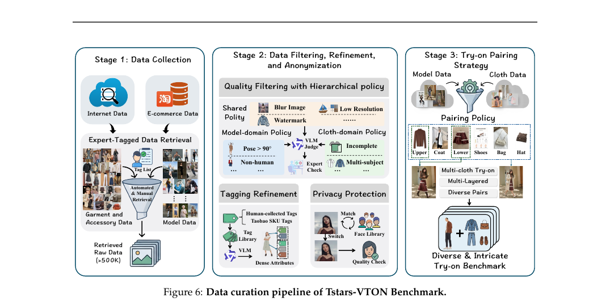
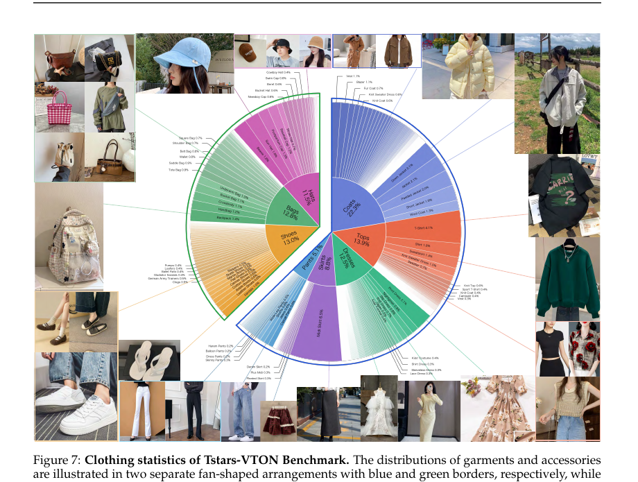
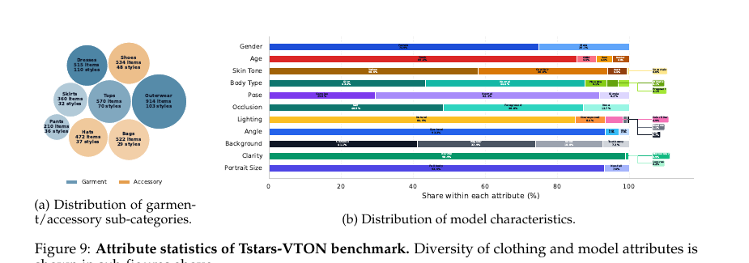

# Tstars-Tryon 1.0 정리

> 상용 가상 피팅(Virtual Try-On)을 "인페인팅"이 아니라 "통합 이미지 편집"으로 재정의하고, 최대 6장 참조·8개 카테고리를 한 모델로 처리하면서 거의 실시간(3.92초/6.74초) 속도를 달성한 알리바바의 **풀스택 시스템 기술 리포트**.

---

## 0. 메타 정보

| 항목 | 내용 |
|---|---|
| **제목** | Tstars-Tryon 1.0: Robust and Realistic Virtual Try-On for Diverse Fashion Items |
| **저자** | Pailitao Team (알리바바 타오바오 검색팀), Project Lead: Mengting Chen / 교신: Bo Zheng — 저자 알파벳순 |
| **소속** | Alibaba Group |
| **공개일** | 2026-05-12 (arXiv v3, 2026-05-10) |
| **분야** | Virtual Try-On, Image Editing, Diffusion Transformer |
| **논문** | arXiv:2604.19748 — [abs](https://arxiv.org/abs/2604.19748) / [pdf](https://arxiv.org/pdf/2604.19748) |
| **벤치마크** | Tstars-VTON Bench (HuggingFace / ModelScope 공개 예정) |
| **모델 공개** | ❌ 가중치·코드 비공개. **벤치마크만 공개** |
| **베이스 모델** | MMDiT(SD3 계열) 구조. 베이스 출처는 **비공개** (→ Q&A 참조) |
| **배포** | 타오바오 앱 "AI Try-On" 정식 서비스 (수백만 사용자, 수천만 요청) |

> ⚠️ **성격**: 학술 논문이 아니라 **기술 리포트(Tech Report)**. 전체 시스템 설계·벤치마크·결과는 풍부하지만, 모델 내부 구조(참조 주입 방식·RoPE·보상 모델 세부 등)는 **거의 공개하지 않음** → 재현 불가.

---

## 1. 주요 용어 사전 (Glossary)

> 왜 여기 두나? 본문에 영어 약어가 많아, 처음 보는 사람이 위에서 한 번에 훑고 들어가게 하기 위함.

**아키텍처 / 핵심 개념**
- **VTON (Virtual Try-On)**: 사람 사진 위에 다른 옷을 입혀 보여주는 가상 피팅.
- **MMDiT (Multimodal Diffusion Transformer)**: 텍스트·이미지 토큰을 한 시퀀스로 이어 붙여 self-attention으로 함께 처리하는 구조. Stable Diffusion 3(Esser et al. 2024)가 정립. → [[paper_lumina_image_2]], [[paper_qwen_image]]의 single-stream 계보와 같은 흐름.
- **인페인팅(Inpainting) 방식 vs 편집(Editing) 방식**: 전자는 옷 영역을 마스크로 가리고 그 안만 다시 그림. 후자는 마스크 없이 전체 맥락을 이해해 옷을 갈아입힘. 이 논문은 **편집 방식**을 택함.
- **레이어링(Layering)**: 상의 위에 외투를 "열어서(open)" 겹쳐 입는 등의 겹침 구성. 다중 의상 피팅의 핵심 난제.

**학습 / 가속**
- **SFT (Supervised Fine-Tuning)**: 고품질 도메인 데이터로 지도 미세조정.
- **RL (Reinforcement Learning)**: 보상(reward)을 기준으로 좋은 생성 궤적을 강화. → [[paper_z_image]], [[paper_uniref_image_edit]]의 RL과 같은 맥락.
- **DiffusionNFT (Zheng et al. 2025)**: forward process 기반 온라인 diffusion RL. 양의 궤적을 음의 궤적보다 선호하도록 정책 최적화.
- **CFG 증류 (Classifier-Free Guidance Distillation)**: CFG의 2배 연산을 1배로 줄이는 증류. CFG-free 추론 가능.
- **스텝 증류 (Step Distillation)**: 수십 스텝을 소수 스텝으로 줄임. DMD(Yin et al. 2024) 계열. → [[paper_dmd]], [[paper_dmd2]].
- **Data Packing (Patch n' Pack, NaViT)**: 가변 해상도 이미지를 패딩 없이 한 시퀀스에 빽빽이 채워 연산 낭비 제거.

**평가**
- **GSB (Good/Same/Bad)**: 두 모델 결과를 사람이 직접 비교해 승/무/패를 매기는 쌍대 평가.
- **기하평균(Geometric Mean)**: 여러 점수를 곱해 제곱근. 산술평균과 달리 **가장 낮은 점수("약한 고리")에 민감** → 모든 차원의 균형을 강제.
- **VITON-HD / DressCode**: 기존 학술 VTON 벤치마크. 배경이 단조롭고 카테고리가 제한적.

---

## 2. 논문 요약 (TL;DR)

- **한 줄**: 인페인팅을 버리고 통합 MMDiT 편집으로 재정의 → 다중 의상 레이어링과 실시간 속도를 동시에 잡은 상용 가상 피팅 시스템.
- **핵심 문제**: 가상 피팅을 진짜 서비스에 올리려면 ① 강건성(in-the-wild 사진) ② 사실성(텍스처·로고 보존) ③ 유연성(다중 의상 레이어링) ④ 속도(실시간) 네 벽을 **동시에** 넘어야 하는데, 학술 모델도 범용 편집 모델(GPT-Image, Nano Banana 등)도 못 넘음. 특히 **다중 의상으로 가면 범용 모델이 붕괴**함.
- **해결책**: 데이터→아키텍처→학습→추론을 풀스택으로 재구성. 통합 MMDiT + 자동 데이터 엔진 + 5단계 학습(편집 사전학습→해상도→SFT→RL→증류) + 5B 슬림화 + 증류 가속.
- **검증**: 자체 Tstars-VTON 벤치마크에서 단일/다중 의상 모두 종합 1위, 휴먼 평가에서 의상 수가 늘수록 우위 확대, VITON-HD/DressCode 제로샷 SOTA, 타오바오 앱 실배포.

---

## 3. 핵심 기여 (Contributions)

1. **관점 전환**: VTON을 인페인팅이 아니라 **통합 이미지 편집 태스크**로 보고, 여러 참조 이미지를 동시에 조율하는 단일 MMDiT로 처리.
2. **다중 의상 처리**: 최대 6장 참조 + 8개 카테고리(상의·하의·치마·원피스·외투·신발·가방·모자)를 한 모델로. 범용 모델이 무너지는 레이어링·가림에서 안정성 유지.
3. **실시간 가속**: 5B 슬림화 + CFG/스텝 증류로 단일 3.92초·다중 6.74초 (오픈소스는 ~200초). "비용 vs 품질" 트레이드오프 해결.
4. **상용급 벤치마크 공개**: Tstars-VTON Bench (1,780 페어, 465 세부 스타일, 1~6 아이템, VLM 4차원 평가).
5. **실배포 입증**: 타오바오 "AI Try-On"으로 수백만 사용자 서비스 — 역대 최대 규모급 VTON 프로덕션 배포.

---

## 4. 주요 알고리즘 / 시스템 설계

### 4.1 아키텍처 — 인페인팅 대신 편집

> 왜 이게 핵심? "마스크 안만 채운다"를 버려야 전신 교체·레이어링·가림 같은 복잡한 조합을 맥락 이해로 풀 수 있기 때문.

- **통합 MMDiT** (Esser et al. 2024, SD3 계열) 사용. 사람 사진 + 여러 참조 의상 + 텍스트 지시문을 **하나의 시퀀스로 동시에 처리·조율**.
- 마스크 인페인팅이 아니라 전체 맥락 이해 → "외투를 열어서 안감이 보이게(keep open, revealing the inner layer)" 같은 공간 논리 지시까지 수행.
- ⚠️ **참조 이미지를 어떻게 토큰화·주입하는지, RoPE 설계, mask-free 여부 등 구체 메커니즘은 비공개.** [[paper_any2anytryon]](RoPE 3채널 재해석)처럼 구조를 밝힌 논문과 대조적.

### 4.2 데이터 엔진 (학습 데이터)

> 왜 필요? 다중 의상 피팅 데이터가 세상에 거의 없어서, 데이터부터 직접 만들어야 함.

**자동 구축 파이프라인** (서론 Data Engine bullet):
- **이미지 요소 분해(image element decomposition)** + **검색 기반 recall**로 대규모 데이터 풀 구성.
- **전용 캡셔너(customized captioner)**로 전문가급 설명 생성.
- **지식 강화 VLM 후처리 필터링(knowledge-enhanced VLM post-filtering)** + 광범위한 **지각 메트릭 스크리닝(perceptual metric screening)**.

**학습 데이터 구성 전략** (학습 전략 bullet에 흩어져 있음):
- 사전학습: **task-balanced + content-balanced** 데이터 + **점진적 난이도 스케일링(progressive difficulty)**.
- SFT: **수직 도메인(피팅) 데이터 큐레이션·균형** + 메트릭 모니터링.

> ⚠️ **중요 — 학습 데이터의 정량 정보는 전무**: 별도의 Data 섹션이 본문에 없고, 위 bullet이 전부. **총 개수·카테고리별 비율·페어 수 등 수치를 일절 공개하지 않음**. 아래 5장의 상세한 수치들은 전부 **벤치마크(평가셋)** 통계이지 학습셋이 아님 — 혼동 주의. (→ Q3)

### 4.3 학습 인프라

> 왜? 참조 이미지 개수·해상도가 제각각이라, 기존 bucketing은 연산 낭비가 큼.

- **가변 해상도 + 임의 개수 참조 이미지** 네이티브 지원.
- Data Parallelism + Tensor Parallelism + **Data Packing(NaViT의 Patch n' Pack을 DiT에 적용)**으로 bucketing 낭비 제거.

### 4.4 학습 전략 — 5단계 파이프라인 (Figure 4)

> 왜 단계를 나누나? "일반 편집 능력 → 고해상도 → 피팅 특화 → 보상 정렬 → 속도"를 순차적으로 쌓아야 각 능력이 안정적으로 축적됨.

| 단계 | 목적 | 핵심 |
|---|---|---|
| ① 일반 편집 사전학습 | 세계 지식·편집 능력 | task/content 균형 데이터 + 점진적 난이도 |
| ② 점진적 해상도 연속 학습 | 고해상도 합성 | Progressive Resolution |
| ③ 수직 도메인 SFT | 피팅 특화 | 도메인 데이터 큐레이션·균형 + 메트릭 모니터링 |
| ④ 다중 보상 RL | 일관성·안정성 | group 궤적 샘플링 + 다차원 보상 + **DiffusionNFT** → CFG-free |
| ⑤ CFG·스텝 증류 | 속도 | 화질 손실 없이 소수 스텝 |

- **프롬프트 재작성기(Rewriter)**: 사용자 입력 → 피팅 편집 과정을 정확히 묘사하는 최적화 프롬프트로 변환해 의미 가이드 강화. ([[paper_hidream_o1_image]]의 Reasoning Prompt Agent와 유사)

### 4.5 추론 가속

> 왜? C-end 서비스라 실시간이 필수. 오픈소스는 같은 작업에 ~200초가 걸려 서비스 불가.

- 주력 DiT를 **5B로 슬림화(streamlined)**.
- **CFG 증류 + 스텝 증류** 결합 → **단일 의상 3.92초 / 다중 의상(평균 5장) 6.74초** (H200 기준).
- 비교: QwenEdit-2511, FLUX.2-dev은 **~200초**.

---

## 5. Tstars-VTON 벤치마크 (데이터 구성)

> 왜 새로 만들었나? 기존 학술 벤치마크는 실세계와 괴리가 커서, 상용 성능을 못 잴. **이 장의 수치는 모두 평가셋이며, 논문에서 데이터 정보가 가장 상세한 곳.**

### 5.1 기존 벤치마크의 한계

VITON-HD·DressCode는 ① 배경 단조·카테고리 제한(상/하의/원피스), ② 대부분 단일 의상, ③ 참조 의상이 깔끔한 **플랫레이(flat-lay)**라고 가정 — 실사용자 사진(복잡 배경, 타인 in-the-wild 사진)과 다름. DressCode-MR이 다중 의상을 시도했지만 참조 의상을 원본 모델 사진에서 인위 추출.

### 5.2 4대 설계 원칙

> 왜? 실세계 상용 시나리오를 평가에 그대로 반영하기 위함.

1. **다중 의상/액세서리** — 1~6개 자유 조합 + 레이어링.
2. **세밀 속성 기반 다양성** — 인터넷+이커머스에서 수집, **모델 11개 태그 차원 / 의상 13개 태그 차원**으로 균형 샘플링.
3. **프라이버시 보호** — 모든 초상을 라이선스 얼굴 DB의 유사 모델로 **얼굴 스왑(face swap)** 익명화.
4. **유연한 unpaired 설정** — 모델 DB와 의상 DB를 분리해 조합 다양성 극대화.

### 5.3 3단계 구축 파이프라인 (Figure 6)

| 단계 | 내용 |
|---|---|
| **① 수집(Collection)** | 인터넷+이커머스. 전문가가 다차원 태그 체계 설계 → **하이브리드 검색(자동 추출 + 수동 수집)**. 검색 원본 풀 **>500K** |
| **② 필터·정제·익명화** | 세밀 규칙 필터(흐림·저해상도·워터마크·비인간·다중주체 등) + VLM 판정 + 전문가 확인. 태그: SKU 메타데이터 → 수동검증 → VLM 정제·보강 → 최종 수동확인. 얼굴 스왑(피부톤·성별·나이 매칭) |
| **③ 페어링(Pairing)** | 다양성 최대화 + 물리/의미 규칙. 성별 매칭 넘어 **레이어링 로직 + 이미지 고유 사용 + 공존 프로토콜**로 물리적으로 타당한 레이어드 착장 동적 생성 |

### 5.4 데이터 통계 (Figure 7·9)

> ⚠️ **이 장의 모든 수치는 벤치마크(평가셋) 통계임. 학습셋이 아님.** (학습셋 규모는 비공개 → Q3)

**벤치마크(평가셋) 전체 규모**: **1,780 평가 페어** / 5 의상 + 3 액세서리 카테고리 / **465 세부 스타일** / **1~6 아이템/샘플**

- 구조: **아이템 풀 약 4,097개**(의상 2,569 + 액세서리 1,528)에서 unpaired로 조합 → **1,780개 평가 페어**로 샘플링.
- 규모 참고: 평가셋은 사람 GSB + VLM 채점이 필요해 작은 게 정상. VITON-HD 2,032 / DressCode 5,400과 같은 평가셋 스케일대.

**카테고리별 아이템·스타일 수**:

| 의상 | 아이템 | 스타일 | | 액세서리 | 아이템 | 스타일 |
|---|---|---|---|---|---|---|
| 외투(Outerwear) | 914 | 103 | | 신발(Shoes) | 534 | 48 |
| 상의(Tops) | 570 | 70 | | 가방(Bags) | 522 | 29 |
| 원피스(Dresses) | 515 | 110 | | 모자(Hats) | 472 | 37 |
| 치마(Skirts) | 360 | 32 | | | | |
| 바지(Pants) | 210 | 36 | | | | |

**모델 속성 분포 (11차원, in-the-wild 강조)**:

| 차원 | 분포 |
|---|---|
| 성별 | 여 74.9% / 남 25.1% |
| 나이 | 청년 85.4% / 아동 5.5% / 시니어 4.6% / 청소년 4.5% |
| 피부톤 | Yellow 58.0% / Cool fair 36.0% / Dark 5.4% / 불명 0.6% |
| 체형 | 보통 44.4% / 슬림 43.4% / 플러스 6.1% / 운동형 3.1% / **임산부 3.1%** |
| 포즈 | 보통 62.2% / **복잡 29.6%** / 단순 8.2% |
| 가림(Occlusion) | Self 48.5% / Foreground 38.8% / 없음 12.7% |
| 조명 | 자연 84.9% / **과노출 8.4%** / 컬러필터 4.9% / 그림자 1.1% / 흑백 0.7% |
| 각도 | Eye-level 93.3% / Low 4.0% / High 2.8% |
| 배경 | **복잡 41.1%** / 보통 32.9% / 단색 18.8% / 텍스트 많음 7.2% |
| 선명도 | 정상 98.9% / 모션블러 0.9% / 저해상 0.2% |
| 인물 크기 | 전신 93.0% / 비전신 7.0% |

→ **복잡 포즈 29.6% + 복잡 배경 41.1% + 과노출 8.4%**로, 일부러 어려운 in-the-wild 케이스를 대거 포함한 것이 핵심.

### 5.5 평가 메트릭 — VLM 4차원

> 왜 VLM? FID 같은 자동지표는 미세 결함을 못 잡아서, 사람 선호에 맞춘 해석 가능한 채점이 필요.

각 1~10점, **2회 독립 API 호출**로 분리 채점:
- **Stage 1 (의상 인지: 사람+참조+결과 제공)**: Identity Consistency(얼굴·포즈·체형 — 참조 의상 맥락 보고 실루엣 변화가 옷 때문인지 신원 훼손인지 구분), Garment Fidelity(아이템별 개별 채점)
- **Stage 2 (의상 비인지: 사람+결과만)**: Background Preservation(단순/복잡 배경 분류 후 차등), Physical & Structural Logic(해부학·관통/메시 클리핑 체크, 복잡 포즈는 2차 검증)
- **종합 = 기하평균** → 한 차원만 망쳐도 크게 깎임(약한 고리 민감). 모든 차원 균형 강제.

---

## 6. 실험 요약

> 왜 표 중심? 모델 간 우열이 숫자로 명확히 드러나기 때문.

### 6.1 정량 — 종합점수 (자체 벤치마크, ↑)

| 모델 | 단일 의상 | 다중 의상 |
|---|---|---|
| 학술 SOTA (CatVTON 등) | 5.1~6.7 | ~6.0 |
| FireRed-Image-Edit-1.1 | 8.86 | **4.82 (붕괴)** |
| QwenEdit-2511 | 8.12 | 6.44 |
| GPT-Image-2 | 9.20 | 9.11 |
| Nano Banana Pro | 9.23 | 8.54 |
| Seedream5 lite | 9.30 | 8.91 |
| **Tstars-Tryon 1.0** | **9.37** | **9.17** |

- **핵심 발견**: 범용 편집 모델은 단일→다중 의상에서 **붕괴**(의상 누락, 레이어링 실패, 신원·구조 와해). Tstars는 다중에서도 안정 유지.

### 6.2 정량 — 학술 벤치마크 (제로샷, unpaired)

| | VITON-HD FID↓ | VITON-HD KID↓ | DressCode FID↓ | DressCode KID↓ |
|---|---|---|---|---|
| FastFit (직전 SOTA) | 8.629 | 0.665 | 4.397 | 0.553 |
| **Tstars-Tryon 1.0** | **8.485** | **0.528** | **4.541** | **0.458** |

- VITON-HD/DressCode 데이터를 **전혀 학습 안 했는데도** SOTA → 강한 제로샷 일반화.

### 6.3 휴먼 평가 (GSB)

| 상대 | 종합 Win율 | 무승부 | Loss |
|---|---|---|---|
| Nano Banana Pro | 41.1% | 41.6% | 17.3% |
| GPT-Image-2 | 41.9% | 42.6% | 15.5% |
| Seedream5 lite | **54.4%** | — | 9.0% |

- **결정적 패턴**: 의상 수가 늘수록 우위 급증. vs Nano Banana Pro Win율 1벌 33.6% → 5벌 54.8%, vs Seedream5 lite 1벌 46.1% → 5벌 **70.2%**.

### 6.4 배포

- 타오바오 앱 **"AI Try-On"** — 수백만 사용자, 수천만 요청. 향후 전체 사용자 확대 시 하루 수천만 건 예상.

---

## 7. 💬 Q&A

### Q1. 이거 외부 모델을 가져다 파인튜닝한 건가?

**결론: 논문은 "어떤 외부 모델을 가져다 파인튜닝했다"고 명시하지 않음.** 오히려 "일반 편집용 사전학습"부터 시작하는 **자체 파운데이션 구축**으로 포지셔닝.

- **자체 1단계 사전학습 존재**: "QwenEdit 가져와 SFT" 같은 얇은 파인튜닝이 아니라, 1단계에서 범용 편집 능력을 직접 학습한 뒤 피팅을 얹음.
- **단, 완전 밑바닥도 아닐 정황**:
  - 아키텍처는 **MMDiT(SD3 계열)** 명시 — 구조 자체는 독창이 아님.
  - "primary DiT를 5B로 **streamlined(슬림화)**" → 보통 **더 큰 모델에서 pruning/증류로 줄였다**는 뉘앙스. ([[paper_dreamlite]]의 SDXL-pruned, [[paper_sana_1_5]]의 Block Pruning과 같은 발상)
- **베이스 출처 비공개**: 같은 알리바바라 [[paper_qwen_image]] 계열을 베이스로 썼을 법한데도 끝까지 밝히지 않음. 같은 회사 [[paper_firered_image_edit]]가 "Qwen-Image 20B 백본 통째 재사용"을 명시한 것과 대조적.
- **가장 정확한 표현**: "SD3식 MMDiT 위에, 자체 일반 편집 사전학습 → 피팅 특화 SFT/RL/증류를 거친 모델"이며, 그 사전학습이 밑바닥인지 기존 베이스 슬림화인지는 **비공개**.

### Q2. 멀티플 레퍼런스 입력은 어떻게 넣나?

**논문이 내부 구현(토큰 구분·위치 인코딩)은 비공개.** 명시되는 것과 추정되는 것을 구분하면:

**① 명시 — 텍스트 프롬프트에서 번호로 지칭**
참조 이미지를 그냥 던지지 않고, 지시문에서 **"[Image1], [Image2]..."로 각 이미지를 명시적으로 가리킴**. 보통 Image1 = 사람 사진, Image2~N = 각 의상/액세서리. 텍스트가 "어느 이미지의 무엇을 → 몸의 어디에" 바인딩을 담당 → "외투는 열어서 안감 보이게", "가방은 메고" 같은 공간 논리 지시 가능.
- 예: "[Image1] 모델 하의를 [Image3] 반바지로 바꾸고, [Image2] 면 재킷을 열어서 걸쳐라. 신발·포즈·배경은 유지."

**② 명시 — 통합 MMDiT + Data Packing**
사람 사진 + 여러 참조 + 텍스트를 **하나의 통합 트랜스포머가 함께 처리**(별도 cross-attention 주입 아님). **Data Packing(NaViT Patch n' Pack)**으로 1~6장을 패딩 낭비 없이 한 시퀀스에 채워 임의 개수 지원.

**③ 추정 (비공개) — 같은 계보([[paper_lumina_image_2]], [[paper_qwen_image]], [[paper_unicustom]]) 기준**
각 참조를 VAE 인코딩 → 토큰화 → `[텍스트]+[사람]+[참조1]+...+[참조N]+[노이즈]`를 한 시퀀스로 concat → joint self-attention 한 번으로 상호작용. 텍스트의 "[Image3]의 반바지"가 참조3 토큰과 attention으로 묶임.
- ⚠️ **어느 토큰이 몇 번째 이미지인지 구분하는 방식**(위치 인코딩 오프셋·이미지 인덱스 임베딩·RoPE 채널 분리 등)이 멀티 레퍼런스의 진짜 기술 포인트인데 **비공개**. [[paper_qwen_image]](MSRoPE), [[paper_any2anytryon]](RoPE 3채널)가 밝힌 것과 대조.

| 구분 | 내용 |
|---|---|
| 사용자 입력 | 사람 사진 1장 + 의상 여러 장 + **"[ImageN]" 번호 지칭 텍스트** |
| 모델 내부(명시) | 통합 MMDiT 한 시퀀스 동시 처리, Data Packing으로 1~6장 |
| 모델 내부(비공개) | 참조 토큰 구분·바인딩 정밀 설계(위치 인코딩 등) |

### Q3. 전체 학습셋 개수는?

**미공개.** 데이터 엔진 설계(분해→검색 recall→VLM 필터링)는 설명하지만 "총 몇 장/페어로 학습"인지 수치를 밝히지 않음.

- 혼동 주의 — 논문의 큰 숫자는 전부 학습셋이 **아님**:
  - **>500K** = 벤치마크 구축용 "Retrieved Raw Data" (평가셋 재료)
  - **1,780 페어** = 최종 벤치마크 (평가셋)
  - **수백만 사용자/수천만 요청** = 배포 트래픽
- 학습 데이터 관련 유일한 언급: "우리 학습셋은 VITON-HD/DressCode를 전혀 포함 안 함"(제로샷 근거) — **존재만 언급, 규모 비공개**.
- **대략적 수치조차 없음**: 본문은 "large-scale"·"high-quality" 형용사만 반복, 자릿수 힌트도 없음. Figure 6의 ">500K"도 벤치마크용이라 학습 규모 추정 근거 못 됨.

**평가셋(1,780)으로 학습셋을 역산할 수 있나? → 불가.**
- "train:test = 10:1" 같은 비율 역산(→ 학습셋 ~1.8만)은 **이 경우 성립 안 함.** 평가셋은 학습셋을 쪼갠 split이 아니라, ">500K 풀에서 따로 큐레이션한 독립 평가 전용 셋"(5.3). 학습 데이터는 별개 파이프라인(4.2 데이터 엔진)으로 생성.
- 평가셋이 작은 건 **비율이 아니라 채점 비용**(GSB+VLM) 때문. 학습셋 크기와 무관.

**오히려 학습셋이 평가셋보다 수백~수천 배 크다는 정황**:
1. 자동 데이터 엔진을 따로 구축 — 1~2만 규모면 자동화 불필요.
2. 5B 모델을 **일반 편집 사전학습부터** 돌림 — 사전학습은 본질적으로 수백만~수천만 필요.
3. **Data Packing + TP + DP 대규모 분산 인프라** 강조 — 소규모엔 불필요.
4. 벤치마크 raw pool만 >500K — 학습용 풀은 그보다 훨씬 클 수밖에.

- (논문 근거 아닌 거친 추정) 위 정황 종합 → 학습셋은 **최소 수백만 페어, 사전학습 포함 수천만~억 단위** 추측. 정확 수치는 비공개.
- 정확한 상태 = "학습셋이 적다"가 아니라 "**학습셋은 크되 논문이 크기를 안 밝혔다**". 데이터 투명성이 [[paper_uniref_image_edit]](UniRef-40k 공개), [[paper_firered_image_edit]]("16억→1억 큐레이션" 명시) 대비 특히 낮음.

---

## 8. 한 줄 요약 (전체)

> Tstars-Tryon 1.0 = **학술적 신규성보다 "상용 가상 피팅을 풀스택으로 완성한 모범 사례."** 인페인팅→통합 MMDiT 편집 전환으로 다중 의상 레이어링을, 5B 슬림화+증류로 실시간 속도를 잡아 GPT-Image·Nano Banana 등 최강 상용 모델을 제침. 단 모델·베이스 비공개라 우리가 가져갈 수 있는 건 **벤치마크와 설계 철학**뿐.

---

## 9. 관련 메모리 링크

- 백본 재사용 분류: [[reference_pretrained_backbone_reuse_landscape]]
- VTON/편집 계보: [[paper_any2anytryon]], [[paper_firered_image_edit]], [[paper_uniref_image_edit]], [[paper_unicustom]]
- 같은 회사 편집 모델: [[paper_qwen_image]], [[paper_qwen_image_2]], [[paper_firered_image_edit]]
- 증류/RL 기법: [[paper_dmd]], [[paper_dmd2]], [[paper_z_image]]
- 구조 계보: [[paper_lumina_image_2]], [[paper_hidream_o1_image]]
