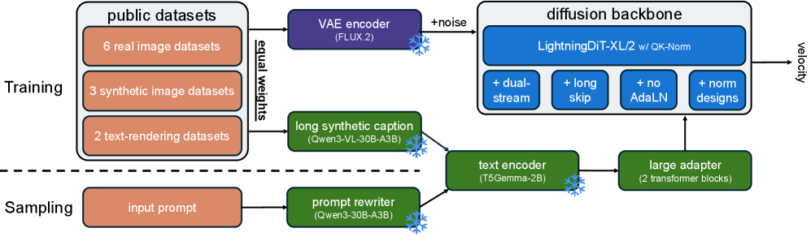
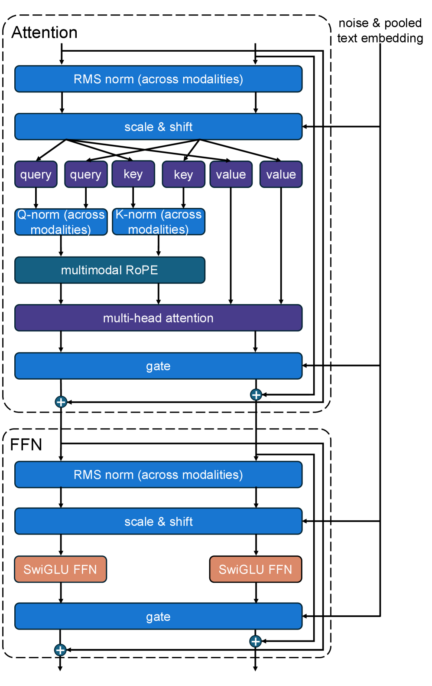

# PAPER: i1 — 공개 재료만으로 강한 Text-to-Image를 만드는 "레시피" 논문

## 0. 이 문서를 읽는 법

이 문서는 i1 논문(arXiv 2606.11289)과 공개 코드(zlab-princeton/i1)를 처음 읽는 사람이 흐름을 놓치지 않도록 정리한 리뷰입니다.

핵심은 한 문장입니다.

> **i1은 "새 기법"을 제안하는 논문이 아니라, 공개된 재료(데이터·인코더·VAE)만으로 강한 text-to-image diffusion(텍스트→이미지 확산) 모델을 만드는 "레시피"를 300번 넘는 통제 실험으로 검증하고, 그 결과물(3B 모델)과 모든 것(가중치·코드·데이터)을 공개한 논문이다.**

그래서 이 문서는 "어떤 멋진 모듈을 발명했나"가 아니라 **"무엇을 실험으로 확인했고(Findings 1~9), 그 결론을 어떻게 한 모델에 모았나"**를 뼈대로 삼습니다.

사용자가 특히 자세히 요청한 **데이터 구성(§7)**과 **공개 여부(§9)**는 따로 큰 장으로 뺐습니다.

읽는 순서:

1. **메타 정보 / 용어 사전**(§1~§3): 배경 깔기
2. **한 줄 요약 + 기여**(§4~§5): 논문이 무엇을 주장하나
3. **아키텍처**(§6): 3B 모델이 어떤 부품으로 조립됐나
4. **데이터 구성**(§7) ⭐: 어떤 공개 데이터를 어떻게 섞고 다시 캡션했나
5. **학습/추론 레시피**(§8): 해상도 단계, sampler, prompt rewriting
6. **공개 여부**(§9) ⭐: 무엇이 지금 열려 있고 무엇이 "예정"인가
7. **핵심 실험 결론 9가지**(§10): 논문의 진짜 알맹이
8. **벤치마크**(§11)
9. **Q&A**(§12): 대화에서 나온 질문들

---

## 1. 메타 정보

| 항목 | 내용 |
|---|---|
| 논문 | i1: A Simple and Fully Open Recipe for Strong Text-to-Image Models |
| 저자 | Boya Zeng, Tianze Luo, Shu Pu, Jucheng Shen, Taiming Lu, Gabriel Sarch, Zhuang Liu |
| 소속 | Princeton University (ZLab) |
| arXiv | https://arxiv.org/abs/2606.11289 |
| PDF | https://arxiv.org/pdf/2606.11289 |
| 프로젝트 | https://zlab-princeton.github.io/i1/ |
| 공식 코드 | https://github.com/zlab-princeton/i1 |
| 모델 가중치 | https://huggingface.co/zlab-princeton/i1-3B (PyTorch + JAX) |
| 데이터(캡션) | https://huggingface.co/datasets/zlab-princeton/i1-captions |
| 분야 | Text-to-Image, Diffusion Transformer, 데이터 큐레이션, 재현성(reproducibility) |
| 모델 크기 | 3B (1B 버전은 "coming soon") |
| 실험 규모 | 300+ 통제 실험, 누적 700K+ TPU v6e 시간 |
| 공개 범위 | 가중치·추론 코드·데이터 파이프라인·캡션 공개 / **GPU 학습 코드·1B 모델은 미공개("coming soon")** |

---

## 2. 한 문장 요약

> **i1은 공개 데이터 12종(약 167M 이미지)만으로 학습한 3B text-to-image 모델로, "완전 공개(fully open)" 모델 중 SOTA이며(기존 최고 완전공개 대비 평균 +29.5%p), FLUX.1-dev(12B)·HiDream-I1(17B) 같은 훨씬 큰 "가중치만 공개" 모델과 1024 해상도에서 경쟁한다.**

조금 더 풀어 말하면:

> **최근 T2I 모델들은 "우리 레시피로 SOTA 찍었다"고 하지만, 정작 어떤 설계·데이터 선택이 성능을 만들었는지 분리해 보여주지 않았다. i1은 그 선택지 하나하나를 300번 넘게 통제 실험으로 떼어내 측정하고(Findings 1~9), 그 결론을 한 모델로 모은 뒤 전부 공개한다.**

가장 헷갈리지 않는 관점 하나(이 문서를 꿰는 핵심):

> **i1의 기여는 "모델"이 아니라 "실증된 레시피 + 재현 가능한 공개"다.** 부품 하나하나(듀얼스트림 MMDiT, T5Gemma 인코더, FLUX.2 VAE, flow matching)는 이미 알려진 것들이고, 새로운 건 "이 조합이 왜 좋은지를 ablation으로 증명"하고 "공개 재료만으로도 된다"를 보인 것이다.

---

## 3. 주요 용어 사전 (Glossary)

처음 등장하는 용어를 미리 풀어둡니다. 본문에서는 약식으로만 씁니다.

**아키텍처**
- **MMDiT(Multimodal Diffusion Transformer, 멀티모달 확산 트랜스포머)**: 텍스트 토큰과 이미지 토큰을 함께 처리하는 DiT. FLUX·SD3 계열의 표준 구조.
- **dual-stream(듀얼스트림)**: 텍스트와 이미지를 각자 별도 가중치 스트림으로 처리하다가 attention에서 합치는 방식. 반대는 single-stream(둘을 하나로 합쳐 처리).
- **long skip connection(긴 스킵 연결)**: U-Net처럼 앞쪽 층의 출력을 뒤쪽 층에 바로 더해주는 지름길. 깊은 DiT의 학습을 도움.
- **text encoder(텍스트 인코더)**: 프롬프트 문장을 벡터로 바꾸는 모듈. i1은 T5Gemma-2B를 동결(freeze)해 사용.
- **adapter(어댑터)**: 동결된 텍스트 인코더의 출력을 DiT가 쓰기 좋은 형태로 변환하는 작은 학습 모듈. i1은 이걸 트랜스포머 2블록으로 키운 게 핵심 발견.
- **VAE(Variational Autoencoder, 변분 오토인코더)**: 이미지를 작은 latent(잠재) 텐서로 압축/복원하는 모듈. i1은 FLUX.2 VAE를 그대로 재사용.
- **AdaLN(Adaptive LayerNorm, 적응형 층 정규화)**: timestep(노이즈 단계) 같은 조건을 정규화 파라미터로 주입하는 흔한 방식. i1은 이걸 **뺐다**(효과 미미).
- **RoPE(Rotary Position Embedding, 회전 위치 임베딩)** / **sinusoidal(사인파 위치 임베딩)**: 토큰 위치 정보를 넣는 두 방법. i1은 둘을 결합.

**핵심 개념**
- **flow matching(흐름 맞추기)**: 노이즈에서 이미지로 가는 "직선 경로의 속도"를 예측하도록 학습하는 방식. diffusion의 한 변형.
- **recaptioning(재캡션)**: 원본 데이터셋의 (부정확한) 캡션을 버리고, VLM(이미지+텍스트 이해 모델)으로 이미지를 다시 묘사해 새 캡션을 만드는 것.
- **VLM(Vision-Language Model, 시각-언어 모델)**: 이미지를 보고 글을 쓰는 모델. i1은 Qwen3-VL-30B-A3B로 재캡션.
- **equal weighting(동일 가중)**: 크기가 제각각인 데이터셋들을 섞을 때, 크기 비례가 아니라 각 데이터셋에서 같은 수만큼 뽑아 섞는 전략. i1의 핵심 데이터 발견.
- **prompt rewriting(프롬프트 재작성)**: 사용자의 짧은 입력을 추론 직전에 LLM이 긴 묘사로 늘려주는 것. 긴 캡션으로 학습한 모델의 약점을 메움.

**평가 지표(벤치마크)**
- **GenEval**: 객체 개수·색·위치 등 구성 정확도.
- **DPG(DPG-Bench)**: 길고 복잡한 프롬프트 충실도.
- **PRISM**: 종합 품질 평가.
- **CVTG-2K** / **LongText-Bench**: 이미지 안 **글자 렌더링(text rendering)** 정확도. i1의 강점 영역.

**공개 수준 구분**
- **open-weight(가중치만 공개)**: 추론용 가중치만 풀고 데이터·학습코드는 비공개 (예: FLUX.1-dev, HiDream-I1).
- **fully open(완전 공개)**: 가중치 + 코드 + 데이터(파이프라인/캡션)까지 공개. i1이 표방하는 수준.

---

## 4. 핵심 기여 (Contributions)

1. **300+ 통제 실험으로 T2I 설계 공간을 체계적으로 분해**: 텍스트 인코더 개수, 어댑터 크기, AdaLN 유무, 스킵 연결, 듀얼/싱글 스트림, 캡션 VLM 선택, 캡션 길이, 데이터 혼합비, 데이터 반복 등을 하나씩 통제하며 측정.
2. **9가지 실증 결론(Findings) 정리**(→ §10): "무엇이 실제로 성능을 만드는가"를 분리. 특히 ⑥캡션 VLM 선택의 중요성, ⑧동일 가중 혼합이 핵심.
3. **공개 재료만으로 만든 3B 모델 i1**: 완전 공개 모델 중 SOTA, 큰 open-weight 모델과 경쟁.
4. **전면 공개**: 가중치(PyTorch+JAX), 코드, 데이터 파이프라인, 167M 캡션 데이터셋(여러 변형 포함)까지 공개해 재현성 확보(→ §9).

---

## 5. 큰 그림 (한 장 다이어그램)

*먼저 전체 파이프라인을 한눈에 잡아두면, 이후 각 장이 이 그림의 어느 부분인지 바로 연결됩니다.*



*▲ Figure 4 (논문 원본). i1의 전체 파이프라인 한 장 요약. 위쪽 **Training(학습)**: 공개 데이터(public datasets) → VAE encoder로 latent 압축 → diffusion backbone(확산 백본)이 학습. 텍스트는 큰 텍스트 인코더(large text encoder)를 거쳐 들어감. 아래쪽 **Sampling(추론)**: 입력 프롬프트(input prompt) → prompt rewriter(프롬프트 재작성)로 길게 늘린 뒤 → 같은 백본으로 이미지 생성. 캡션의 핵심 메시지: "새 네트워크 모듈을 도입하기보다, 신중히 고른 모델링·데이터 선택을 조합해 단순하고 강한 모델을 만들었다"(=이 논문의 정체성).*

아래는 같은 흐름을 글자로 더 자세히 편 것입니다.

```
[공개 데이터 12종 ~167M]
   │  (§7-A 이미지 다운로드)
   ▼
[Qwen3-VL-30B-A3B 재캡션]  ── 긴 캡션 1~5개/이미지
   │  (§7-B)
   ▼
[동일 가중 혼합 equal weighting, 임계 1.2M]
   │  (§7-C)
   ▼
┌─────────── 학습 (flow matching) ───────────┐
│ 프롬프트 ─▶ T5Gemma-2B(동결) ─▶ 어댑터 2블록 │
│                                    │         │
│ 이미지 ─▶ FLUX.2 VAE ─▶ latent ─┐  ▼         │
│                                 dual-stream  │
│                                 MMDiT (3B)   │  ← AdaLN 제거, long skip, sinusoidal+RoPE
│                                    │         │
│                       256→512→1024 점진 해상도 │  (§8)
└────────────────────────────────────┬────────┘
                                      ▼
[추론] 짧은 프롬프트 ─▶ Qwen3-4B 재작성 ─▶ i1 ─▶ 250-step Euler, CFG=12 ─▶ 1024² 이미지
```

---

## 6. 아키텍처

*왜 이 장을 두나: i1의 부품은 전부 기존에 알려진 것들이라, "무엇을 골랐고 무엇을 뺐나"가 곧 논문의 모델링 결론(Findings 1~5)을 그대로 반영하기 때문이다.*

| 구성요소 | i1의 선택 | 근거가 된 Finding |
|---|---|---|
| 백본(backbone) | **dual-stream MMDiT + long skip connection** | F3·F4 (듀얼스트림이 성능/파라미터 최적, 긴 스킵이 효율적) |
| 텍스트 인코더 | **T5Gemma-2B** (encoder-decoder, 동결) | F1 (강한 단일 인코더가 여러 개보다 나음) |
| 텍스트 어댑터 | **트랜스포머 2블록** (블록당 약 17.2M, 기본 MLP는 2.6M) | F2 (어댑터를 키우면 적은 파라미터로 큰 이득) |
| VAE | **FLUX.2 VAE** (재사용) | — (외부 공개 VAE 그대로) |
| 위치 임베딩 | sinusoidal + RoPE 결합 | — |
| 제거한 것 | **AdaLN noise conditioning 제거** | F5 (AdaLN 이득 미미 → 빼서 단순화) |
| 학습 목적 | flow matching | — |
| 총 파라미터 | **3B** | — |

> 공식 config(`jax/models/dual_stream_backbone.py`)로 확인한 본체 크기: 모델 라벨 **`DiT-XL_2016`** = **depth 29(층), hidden_size 2016, num_heads 28, mlp_ratio 4.0**. "XL"은 베이스 폭 라벨일 뿐이고 `_2016`은 hidden을 2016으로 키운 변형이다. dual-stream이라 image/text가 q·k·v(`qkv_image`/`qkv_text`)와 SwiGLU FFN(`mlp_image`/`mlp_text`)을 **각각 따로** 가져 파라미터가 사실상 2배 → 이래서 "XL" 라벨인데도 총 3B가 된다. config 추가 플래그: `use_adaln=False`(F5 확정), `use_sandwich_norm=True`, `use_qknorm=True`, `position="sinusoidal_and_rope"`.

#### dual-stream 블록의 내부 (Figure 29)

*왜 이 그림을 보나: "dual-stream(듀얼스트림)"이 말로는 와닿지 않는데, 이 그림 한 장이 "무엇을 modality별로 나누고 무엇을 합치는지"를 정확히 보여준다.*



*▲ Figure 29 (논문 원본, Appendix A.2 — ablation에 쓴 baseline의 dual-stream 변형 블록). 한 블록은 위쪽 **Attention**과 아래쪽 **FFN(피드포워드)** 두 부분.*

그림 읽는 법(핵심만):
- **무엇을 modality별로 나누나(=dual-stream)**: `query / key / value`가 **각각 2개씩**, `SwiGLU FFN`도 **2개**다. 즉 텍스트 토큰과 노이즈 이미지 토큰이 **서로 다른 가중치**로 q·k·v를 만들고 FFN을 통과한다(modality-specific, 각자 스트림).
- **무엇을 합치나**: 두 modality의 토큰을 시퀀스 차원으로 이어 붙여(concat) **multi-head attention은 하나로 함께** 수행한다. 그래서 "분리된 스트림인데 attention에서 정보가 섞이는" 구조. `RMS norm`·`Q/K-norm`도 "across modalities"라 두 modality에 공통 적용.
- **조건(condition) 주입**: 오른쪽 화살표의 **noise & pooled text embedding(노이즈 단계 + 요약 텍스트 임베딩)**이 `scale & shift`와 `gate`를 만들어 블록을 변조한다 — 이것이 AdaLN(adaptive LayerNorm) 계열 변조다.
- **잔차(residual)**: Attention·FFN 각각 끝에서 `gate`를 거쳐 입력에 더해진다(그림의 ⊕).

> ⚠️ 주의: 이 그림은 **ablation용 baseline의 dual-stream 변형**이라 noise conditioning(`scale & shift`/`gate`)이 그려져 있다. 최종 i1은 실험 결과 이 **AdaLN 계열 noise conditioning의 이득이 미미함을 확인하고 단순화/제거**했다(→ F5, §10). 즉 "토큰을 modality별로 나눠 처리하되 attention에서 합친다"는 dual-stream 골격은 최종 모델과 같고, 조건 주입 방식만 더 단순해졌다고 보면 된다.

핵심을 풀어 말하면:

- **"강한 인코더 하나 + 큰 어댑터"**: 여러 텍스트 인코더(예: T5 + CLIP)를 붙이는 흔한 관행 대신, T5Gemma-2B 하나를 동결해 쓰되 그 출력을 다듬는 어댑터(adapter)를 MLP(2.6M)에서 **트랜스포머 2블록(약 34M)**으로 키웠다. 인코더 자체는 동결이라 추가 학습 비용이 거의 없으면서, 어댑터만 키워 성능을 끌어올린 게 영리한 지점.
- **AdaLN 제거**: 보통 DiT는 timestep(노이즈 단계)을 AdaLN으로 주입하는데, i1은 이게 성능에 거의 기여하지 않음을 확인하고 빼서 구조를 단순화했다.
- **재사용 철학**: 텍스트 인코더(T5Gemma)도 VAE(FLUX.2)도 새로 학습하지 않고 공개된 것을 그대로 가져온다. 즉 i1이 새로 학습하는 건 **MMDiT 본체 + 어댑터**뿐이다.

> 계보 메모: 동결 텍스트 인코더 + 어댑터, 듀얼스트림 MMDiT, 외부 VAE 재사용은 [[paper_qwen_image]] · [[paper_lumina_image_2]] 와 같은 "사전학습 백본 재사용" 패러다임([[reference_pretrained_backbone_reuse_landscape]] B분기)에 속한다. i1의 차별점은 모델이 아니라 **데이터·실험·공개**에 있다.

---

## 7. 데이터 구성 ⭐ (사용자 요청 포인트)

*왜 이 장을 따로 크게 두나: i1의 진짜 무기는 모델이 아니라 데이터 큐레이션이고, "어떤 공개 데이터를, 어떻게 다시 캡션하고, 어떻게 섞었나"가 성능과 재현성을 모두 결정하기 때문이다.*

### 7-A. 무엇으로 학습했나 — 공개 데이터 12종 (약 167M 쌍)

전부 공개 데이터셋이며, 종류별로 세 묶음이다.

**실사 이미지(real-image, 7종)** — 일반 시각 다양성 담당
- ImageNet-22K, **YFCC100M(약 98M, 전체의 절반 이상)**, RedCaps, Megalith-10M, Pexels, iNaturalist 2024, Places365-Challenge

**합성 이미지(synthetic, 3종)** — 미적 품질·프롬프트 정렬 담당
- GPT-Image-Edit-1.5M, FLUX-Reason-6M, Midjourney v6

**텍스트 렌더링(text-rendering, 2종)** — 이미지 안 글자 그리기 담당 (i1의 강점 원천, 상세는 §7-D)
- RenderedText, TextAtlas5M

공개된 캡션 데이터셋(`i1-captions`) 기준 실제 쌍 수(상위):

| 소스 데이터셋 | 이미지-캡션 쌍 | 캡션 변형 수 |
|---|---|---|
| YFCC | 97.9M | 2 |
| ImageNet-22K | 13.7M | 9 |
| RenderedText | 12.0M | 5 |
| Megalith-10M | 9.4M | 1 |
| Places365 | 7.2M | 1 |
| FLUX-Reason | 5.9M | 5 |
| TextAtlas | 5.4M | 5 |
| RedCaps | 4.8M | 5 |
| iNaturalist | 4.8M | 1 |
| GPT-Edit | 1.6M | 5 |
| Midjourney v6 | 1.2M | 5 |

(합계 약 167M. Pexels는 논문 본문의 12종에 포함되나 위 공개 카드 표에는 별도로 명시되지 않음 — 표는 상위 항목 위주.)

### 7-B. 재캡션(recaptioning) 파이프라인 — 캡션을 통째로 새로 쓴다

*왜 다시 캡션하나: 원본 데이터셋의 alt-text·태그는 짧고 부정확해서, 모델이 "긴 문장 ↔ 그림" 대응을 배우기 어렵다. 그래서 이미지를 보고 VLM이 한 문단짜리 묘사를 새로 쓴다.*

- **재캡션 모델**: **Qwen3-VL-30B-A3B (FP8 정밀도)**
- **프롬프트**: "Describe the image in detail using one paragraph." (한 문단으로 자세히 묘사)
- **전처리**: 이미지를 정사각으로 center-crop(가운데 자르기) 후 512보다 크면 512×512로 축소해 입력
- **개수**: 데이터셋마다 캡션 1~5개 생성 (ImageNet-22K는 변형 9종, Places·Megalith·iNaturalist는 1개 등)
- **변형 보관**: 비교 실험용으로 **짧은 캡션 버전**, 그리고 **다른 VLM(Qwen2-VL, Qwen2.5-VL 등)이 만든 캡션**도 함께 공개 → "캡션 VLM 선택이 성능을 좌우한다(F6)"는 결론을 남들이 재현할 수 있게 함.

### 7-C. 어떻게 섞나 — equal weighting(동일 가중)이 핵심 발견

*왜 중요한가: 데이터셋 크기가 YFCC 98M부터 Midjourney 1.2M까지 80배 차이라, 크기대로 섞으면 YFCC가 학습을 지배해 합성·텍스트 데이터의 장점이 묻힌다.*

- **전략**: 크기 비례가 아니라, **반복을 포함해 각 데이터셋에서 같은 수의 이미지를 뽑아 섞는다**(임계값 약 1.2M = 모든 데이터셋에 동일 가중).
- **결과**: 어떤 데이터셋을 따로 upweight(가중 상향)해도 "정확한 동일 가중"을 못 이김. iNaturalist는 오히려 빼는 게 전 벤치마크에서 더 좋았음.
- **반복(repetition) 내성**: 데이터가 다양하기만 하면, 작은 데이터셋을 여러 번 반복 학습해도 성능 저하가 미미함(F9) → 큰 데이터셋에 맞춰 작은 것을 반복해도 안전.

### 7-D. 텍스트 렌더링(text rendering) 데이터셋 상세

*왜 따로 정리하나: i1의 두드러진 강점(CVTG-2K 0.853 / LongText 0.922)이 전적으로 이 두 데이터셋 + 동일 가중 혼합에서 나오기 때문이다. i1은 글자 전용 모델 모듈(glyph encoder 등)을 새로 만들지 않았고, "데이터로 해결"한다.*

이미지 안에 또렷한 글자를 그리려면 일반 사진 데이터(YFCC 등)만으론 부족해서, 글자 전용 공개 데이터 2종을 명시적으로 넣었다. 둘은 성격이 **상보적**이다.

**(1) RenderedText — 손글씨 합성 대량 데이터** (기본기 담당)

| 항목 | 내용 |
|---|---|
| 제작 | Stability AI + LAION |
| 규모 | 1,200만 장, 1024×1024 (i1-captions 기준 약 1,198만 쌍, 캡션 변형 5) |
| 성격 | 합성(synthetic) — 손글씨 스타일 텍스트를 3D 종이 위에 렌더링 |
| 생성 방식 | Blender geometry nodes + Cycles. 폰트 크기·색·회전·조명 무작위 |
| 폰트/텍스트 | 폰트 약 8,000종(Urban Fonts, Font Space) / 텍스트는 Wikipedia·Project Gutenberg |
| 부가 자원 | Poly Haven HDRI 643개, Ambient CG 머티리얼 1,837개 (모두 CC0) |
| 어노테이션 | 줄·문자 단위 bounding box, 텍스트 내용, 문자 인덱스, 폰트, 색, 회전각 (JSON) |
| 라이선스 | HF 카드에 명시적으로 안 잡힘(주의) — 사용 자원은 CC0 |
| 공개 링크 | https://huggingface.co/datasets/wendlerc/RenderedText |

**(2) TextAtlas5M — 밀집·긴 텍스트 현실 데이터** (응용력 담당)

| 항목 | 내용 |
|---|---|
| 제작 | CSU-JPG (Central South University 계열) 외, arXiv 2502.07870 |
| 규모 | 약 539만 장(5,398,826), 1.2TB, 10개 서브셋 (i1-captions 기준 약 540만 쌍, 캡션 변형 5) |
| 성격 | 합성 + 실제 혼합 — 밀집/긴 텍스트(dense/long text) 전용 |
| 주요 서브셋 | CleanTextSynth 1.91M, LongWordsSubset-M 1.25M, TextVisionBlend 547k, StyledTextSynth 426k, Paper2Text 357k, PPT2Details 299k, LongWordsSubset-A 260k, CoverBook 208k, PPT2Structured 96.4k, TextScenesHQ 48.9k |
| 실제 소스 | 책 표지, PPT 슬라이드, 논문 페이지 등 |
| 동반 벤치마크 | TextAtlasEval (긴 텍스트 렌더링 평가용) |
| 라이선스 | MIT (상업·연구 자유) |
| 공개 링크 | 데이터 https://huggingface.co/datasets/CSU-JPG/TextAtlas5M · 논문 https://arxiv.org/abs/2502.07870 · 프로젝트 https://textatlas5m.github.io/ |

**둘의 분업**
- RenderedText = "글자 하나하나를 또렷하게 그리는 기본기" (대량·단순·손글씨)
- TextAtlas5M = "긴 문장·복잡한 배치(표지·문서·인포그래픽)를 그리는 응용력" (현실·밀집·인쇄)

**i1이 글자 렌더링을 잘하기 위해 한 일 — 4가지 (전용 모듈 無, 데이터·혼합·평가로 해결)**
1. **글자 전용 데이터 명시적 포함**: 위 두 데이터셋을 학습 세트에 넣음.
2. **동일 가중(equal weighting)으로 안 묻히게 섞음** ⭐ 가장 결정적: 크기대로면 YFCC(98M)가 지배해 글자 데이터가 무시됨 → 각 데이터셋 동일 비중(F8)으로 글자 데이터가 사진 데이터와 동등하게 학습됨.
3. **긴 재캡션이 "이미지 속 글자 내용"까지 담음**: Qwen3-VL이 이미지를 한 문단으로 묘사할 때 화면의 글자 내용도 캡션에 들어가, "프롬프트 단어 ↔ 그릴 글자" 대응을 더 정확히 학습.
4. **글자 벤치마크로 검증·최적화**: 평가에 CVTG-2K·LongText를 포함해, 300+ ablation에서 글자에 유리한 선택이 살아남음. (1024 고해상도 학습·고품질 FLUX.2 VAE도 간접 기여.)

> 대비점: [[paper_qwen_image]]·[[paper_longcat_image]]가 한자 렌더링을 위해 데이터 합성·커리큘럼·전용 처리를 정교하게 쌓은 것과 달리, i1은 "공개 글자 데이터 2개를 동등 비중으로 넣는다"는 단순 처방만으로 영어 글자 렌더링 경쟁력을 얻었다.

---

## 8. 학습 / 추론 레시피

*왜 이 장을 두나: 같은 데이터·모델이라도 "어떤 순서로 키우고, 어떻게 뽑아내나"가 최종 품질을 좌우하므로, 재현하려면 이 수치들이 필요하다.*

### 8-A. 학습 — 3단계 해상도 스케줄 (공식 config 실측)

*아래 수치는 부록 산문이 아니라 공식 repo의 실제 학습 config 3개(`jax/configs/i1_training/{256,512,1024}_resolution.py`)에서 직접 읽은 값이다(부록보다 정확).*

i1 학습은 **flow matching 하나로 256→512→1024 해상도를 이어서(continued) 올리는 단일 스케줄**이다. 별도 SFT·RLHF 단계가 아니라, 같은 loss·구조·optimizer를 유지한 채 데이터·해상도·batch만 바꾼다(→ 사후학습 없음, Q5 참조).

| 단계 | config | total_steps(누적) | 이 단계 step | batch | 해상도 | 데이터셋 수 | timestep shift |
|---|---|---|---|---|---|---|---|
| 사전학습 | 256_resolution | 2.0M | 2.0M | 512 | 256² | **11개**(전체) | 0.0 |
| 고해상도 1 | 512_resolution | 2.5M | +0.5M | 512 | 512² | **10개**(YFCC 제외) | 0.0 |
| 고해상도 2 | 1024_resolution | 2.8M | +0.3M | **128** | 1024² | **5개** | **0.3** |

읽는 포인트:
- **고해상도는 짧고 작다**: 256(2.0M) 대비 512는 +0.5M(25%), 1024는 +0.3M(15%)뿐. 1024는 batch도 512→128로 줄임(메모리). → "넓은 고해상도 커버리지 불필요"가 config로 확인됨.
- **갈수록 데이터를 좁힌다(11→10→5)**: 1024에 남는 5개는 **FluxReason · TextAtlas · GPTEdit · MidjourneyV6 · RedCaps**. 즉 고해상도 원본이 풍부한 합성·고품질 셋만 남기고 웹 노이즈 셋(YFCC 등)을 버린다. (주의: 글자 데이터 중 **RenderedText는 1024에서 빠지고 TextAtlas만** 남으며, **RedCaps는 실사(Reddit)** 데이터 — "합성만 남김"이 아니라 "고해상도 원본이 많은 셋만 남김"이 정확.)
- **512가 텍스트·품질의 진짜 동력**: 부록에 따르면 512 학습이 LongText **0.75→0.92**, PRISM를 크게 끌어올리고, 1024 학습 효과는 작다(512 체크포인트와 거의 비슷). 작은 글자는 고해상도라야 표현되기 때문.
- **누적 스케줄 해석**: 세 config 모두 `resume=""`(빈칸)이고 total_steps가 2.0→2.5→2.8M로 누적이라, 256→512→1024를 이전 체크포인트에서 이어 학습하는 누적 스케줄로 읽힌다(resume은 실행 시점 지정으로 보임 — config만으론 100% 단정은 아님).

**공통 하이퍼파라미터 (3단계 동일, config 실측)**

| 항목 | 값 |
|---|---|
| optimizer | Adam(`scale_by_adam`), b1=0.9, **b2=0.95**, mu_dtype=bf16 |
| weight decay | **없음**(wd=None) |
| learning rate | **1e-4 고정**(warmup·decay 없음, pos_embed만 별도 multiplier) |
| grad clip | 1.0 |
| EMA decay | 0.9999 |
| timestep | **velocity prediction** + lognorm(μ=0, σ=1) 샘플링 |
| ckpt 주기 | 5000 step |
| 텍스트 어댑터 | num_blocks=2 |
| 데이터 혼합 | 전 단계 equal weighting (256=1/11 … 1024=1/5) |

- **연구 총 규모**: 위는 i1-3B 본 학습 스케줄이고, 별개로 300+ ablation 실험에 누적 **700K+ TPU v6e 시간**이 쓰였다(controlled experiment는 모두 256², 500K step — 부록 Table 9).
- **미확정 값**: 고해상도 각 단계의 정확한 **이미지 장수**(config엔 비율만), warmup 부재 여부는 데이터 메타가 없어 config만으론 확정 불가.

### 8-B. 추론 (inference)

- **sampler**: 250-step Euler 적분기
- **CFG(classifier-free guidance) scale**: 12
- **prompt rewriting(프롬프트 재작성)**: 짧은 입력을 **Qwen3-4B**가 긴 묘사로 확장.
  - 메타 프롬프트(요지): "짧은 프롬프트 {prompt}를 자세한 문단으로 늘리되, 원래 언급된 항목이 결과 이미지에 모두 분명히 들어가도록 하라."
  - 이유: i1은 긴 캡션으로 학습돼서 짧은 프롬프트에 약함(F7) → 추론 단계에서 길이를 맞춰 약점을 메움.

---

## 9. 공개 여부 ⭐ (사용자 요청 포인트)

*왜 이 장을 따로 두나: i1의 정체성이 "fully open(완전 공개)"이라, 항목별로 지금 정말 열려 있는지 / "coming soon(예정)"인지를 구분하는 게 실제 활용·재현에 직결되기 때문이다.*

"완전 공개"를 표방하지만, 항목별로 **현재 공개 / 예정**이 갈린다.

### 9-A. 모델 가중치 (HF `zlab-princeton/i1-3B`)
- ✅ 3B 가중치: **PyTorch + JAX 두 포맷 모두** 공개
- ⏳ 1B 버전: coming soon
- ⏳ Multi-Aspect-Ratio(다양한 가로세로비) 체크포인트: coming soon

### 9-B. 코드 (GitHub, 3개 디렉토리)
- ✅ `data_processing`: 이미지 다운로드 + 재캡션 + TFRecord 생성 파이프라인
- ✅ `jax`: TPU용 학습/추론 코드 (ablation 실험 + i1-3B 본체)
- ✅ `torch_inference`: PyTorch 추론 (PyTorch 2.6.0 / transformers 4.57.1 / diffusers 0.35.1)
- ⏳ **JAX/GPU 학습** 및 **PyTorch/GPU 학습** 코드: coming soon (현재 학습 코드는 TPU 기준만)

### 9-C. 데이터 (HF `zlab-princeton/i1-captions`)
- ✅ **캡션은 전량 공개**: Parquet 포맷, 약 153GB, **약 167M 쌍**, 짧은 버전·대체 VLM 캡션 등 **여러 변형 포함**
- ⚠️ **이미지 원본은 미포함**: 라이선스 때문에 직접 호스팅하지 않고, 각 소스에서 받아오는 다운로드 파이프라인을 제공. 라이선스는 **원 데이터셋 각각을 따름**(통합 라이선스 없음).

### 9-D. 정리 — "완전 공개"의 실제 의미와 단서

| 항목 | 상태 |
|---|---|
| 3B 가중치 (PyTorch/JAX) | ✅ 공개 |
| 추론 코드 (TPU/GPU) | ✅ 공개 |
| TPU 학습 코드 | ✅ 공개 |
| GPU 학습 코드 | ⏳ 예정 |
| 1B 모델 / 다중 비율 | ⏳ 예정 |
| 캡션 데이터(+변형) | ✅ 공개 |
| 이미지 원본 | ⚠️ 직접 다운로드(파이프라인 제공) |

실무 단서 두 가지:
1. **이미지를 직접 받아야** 한다 (캡션만 호스팅). 라이선스도 소스별로 따로 확인 필요.
2. **GPU 학습 코드와 1B 모델은 아직** 안 나왔다 (현재는 TPU 학습만).

그래도 가중치·혼합비·재캡션 모델·하이퍼파라미터·캡션 변형까지 다 공개돼, 현존 T2I 중 **재현성 최상위급**인 건 분명하다.

---

## 10. 핵심 실험 결론 9가지 (Findings) — 논문의 진짜 알맹이

*왜 이 장이 중심인가: i1이라는 모델은 "이 9가지 결론을 한 군데 모은 결과물"일 뿐이라, 결론 자체가 논문의 본체다.*

**모델링(Modeling) — F1~F5**

| # | 결론 | 한 줄 풀이 |
|---|---|---|
| F1 | 강한 단일 텍스트 인코더 > 여러 인코더 | 인코더를 늘리기보다 하나 좋은 걸 쓰는 게 낫다 |
| F2 | 어댑터를 키우면 적은 파라미터로 큰 이득 | MLP 대신 트랜스포머 2블록 어댑터 |
| F3 | dual-stream이 성능/파라미터 최적 | single-stream보다 트레이드오프 우수 |
| F4 | long skip connection이 효율적 | 같은 성능을 더 적은 파라미터로 |
| F5 | AdaLN 이득 미미 → 제거 | 구조 단순화해도 성능 유지 |

**데이터(Data) — F6~F9**

| # | 결론 | 한 줄 풀이 |
|---|---|---|
| F6 | **캡션 VLM 선택이 다운스트림 성능을 크게 좌우** | 어떤 VLM으로 재캡션하느냐가 결정적 |
| F7 | 긴 캡션 학습 + 추론 재작성 > 짧은 캡션 학습 | 길게 배우고, 짧은 입력은 추론에서 늘림 |
| F8 | **동일 가중(equal weighting)이 최선** | 크기 비례·선택적 상향보다 우수 |
| F9 | 데이터가 다양하면 반복 학습 저하 미미 | 작은 데이터셋 반복해도 안전 |

가장 영향력 큰 둘은 **F6(캡션 모델)**과 **F8(동일 가중)** — 둘 다 "모델"이 아니라 "데이터를 어떻게 준비/혼합하나"에 관한 것이라, i1이 데이터 중심 논문임을 다시 보여준다.

---

## 11. 벤치마크

*왜 보나: "공개 재료 3B"가 실제로 큰 비공개·open-weight 모델과 붙는지를 숫자로 확인하기 위함.*

i1-3B 점수:

| GenEval | DPG | PRISM | CVTG-2K | LongText |
|---|---|---|---|---|
| 0.84 | 86.73 | 70.1 | 0.8531 | 0.922 |

- **완전 공개 모델 중 SOTA**: 기존 최고 완전공개 모델 대비 **평균 +29.5%p**.
- **큰 open-weight과 경쟁**: 3B인데 1024 해상도에서 **FLUX.1-dev(12B)·HiDream-I1(17B)**와 경쟁.
- **강점은 글자 렌더링**: CVTG-2K·LongText가 높음 → 전용 데이터(RenderedText·TextAtlas)를 동일 가중으로 섞은 효과.
- **유의점**: GenEval 0.84는 최상위권(0.9+, 예: [[paper_qwen_image]] 0.91)보다는 약간 낮다. i1의 우위는 "절대 최강"이 아니라 **"완전 공개 + 작은 크기" 대비 강함**에 있다.

---

## 12. 💬 Q&A (대화에서 나온 질문)

### Q1. 이 논문이 제안하는 "새 기법"은 뭔가?
거의 없다 — 그게 핵심이다. 부품(MMDiT, T5Gemma, FLUX.2 VAE, flow matching)은 다 기존 것이고, 새로운 건 **"이 조합이 왜 좋은지를 300+ 실험으로 증명"**하고 **"공개 재료만으로도 강한 모델이 된다"**를 보인 것. 모델 논문이 아니라 **레시피·재현성 논문**으로 읽어야 한다.

### Q2. 데이터는 진짜 다 공개됐나? 바로 학습 돌릴 수 있나?
캡션(약 167M, 변형 포함)은 전량 공개되지만, **이미지 원본은 직접 받아야** 한다(라이선스 때문에 캡션만 호스팅, 다운로드 파이프라인 제공). 또 현재 학습 코드는 **TPU 기준**이고 **GPU 학습 코드는 "coming soon"**이라, 지금 당장 GPU로 전체 재학습하기는 어렵다. 추론은 PyTorch로 바로 가능.

### Q3. "fully open"이 FLUX·HiDream과 뭐가 다른가?
FLUX.1-dev·HiDream-I1은 **가중치만** 푼 open-weight라 데이터·학습법을 모른다. i1은 거기에 더해 **데이터 파이프라인·캡션·학습 코드·혼합비·하이퍼파라미터**까지 공개해, 원리상 처음부터 따라 만들 수 있게 한다(재현성).

### Q4. 왜 글자(텍스트 렌더링)를 잘하나?
글자 전용 모듈을 만든 게 아니라 **데이터·혼합·평가로 해결**했다. 글자 전용 데이터(RenderedText, TextAtlas5M)를 넣고(①), 큰 데이터(YFCC)에 묻히지 않게 동일 가중으로 섞고(②), 재캡션에 글자 내용을 담고(③), 글자 벤치마크로 검증(④)했다. → 데이터셋 상세와 4가지 처방은 **§7-D 참조**.

### Q5. 700K TPU 시간이면 누구나 재현 가능한가?
아니다. 그 수치는 **300+ ablation 전체** 누적이고, i1-3B 한 번 학습은 그보다 훨씬 적다. 그래도 학계 기준으로는 큰 자원이라 "완전 자력 재현"은 현실적으로 자원 있는 곳만 가능. 다만 **설계 근거(Findings)와 데이터 레시피를 그대로 가져다 쓸 수 있다**는 게 핵심 가치.

### Q6. i1에 사후학습(post-training)이 있나? SFT 없이 어떻게 품질을 내나?
**전형적 사후학습은 하나도 없다.** RLHF·DPO·GRPO 같은 선호/강화학습은 논문이 "omitted(생략)"이라 명시하고 future work로 남겼고, few-step distillation(증류)도 없으며(250-step Euler 그대로), GenEval 점수를 부풀리는 BLIP3o-60K식 미세조정도 일부러 안 했다.
- **흔히 사후학습으로 오해하기 쉬운 고해상도 학습(512/1024)은 사후학습이 아니다.** config로 확인하면 loss(velocity)·구조·optimizer가 256 단계와 동일하고 데이터·해상도·batch만 바뀌므로 **continued pre-training(사전학습의 연장)**이다(→ §8-A).
- **그럼 품질은 어디서?** 오직 사전학습 데이터 구성에서 온다 — ①고품질 합성 데이터(GPTEdit·FluxReason·MJv6)를 사전학습 mix에 동일 가중으로 포함 + ②512 고해상도 단계가 텍스트·품질을 크게 끌어올림(LongText 0.75→0.92).
- **그 대가**: SFT/RLHF로 다듬은 모델 대비 일반 정렬 지표가 낮다(GenEval 0.84 vs 최상위 0.9+). 즉 i1은 "사후학습 없이 데이터 구성만으로 낼 수 있는 품질의 천장"을 보여주는 순수 사전학습 baseline이다.

### Q7. 어디에 써먹나 / 무엇이 부족한가?
- **쓸모**: 데이터 큐레이션·캡션 전략·혼합비 설계의 검증된 레퍼런스. 작은 모델로 강한 T2I를 만드는 출발점.
- **부족**: GPU 학습 코드·1B 모델 미공개, 이미지 직접 수집 필요, 일반 생성 정확도(GenEval)는 최상위 대비 약간 낮음, 편집(editing) 기능 없음(순수 T2I), 사후학습(RLHF/증류) 없음.

---

## 13. 한 줄 요약 (전체)

> **i1은 공개 데이터 12종(약 167M)을 Qwen3-VL로 재캡션하고 동일 가중으로 섞어, 동결 T5Gemma 인코더 + FLUX.2 VAE 위에 3B dual-stream MMDiT를 flow matching으로 학습한 모델이다. 300+ 실험으로 "무엇이 성능을 만드는가(Findings 1~9, 특히 캡션 VLM·동일 가중)"를 분리 증명하고 가중치·코드·데이터를 공개해, 완전 공개 T2I의 SOTA이자 재현성의 새 기준점을 제시한다.**

---

## 14. 관련 메모리 링크

- [[reference_pretrained_backbone_reuse_landscape]] — 동결 인코더·VAE 재사용 패러다임 분류 (i1 = B분기)
- [[paper_qwen_image]] · [[paper_lumina_image_2]] — 같은 백본 재사용 계열, 텍스트 렌더링·MMDiT 비교 대상
- [[paper_z_image]] — "작은 모델로 SOTA" 효율 노선 비교 (i1은 공개·데이터 노선, Z-Image는 증류·RL 노선)
- [[feedback_paper_summary_format]] · [[feedback_beginner_friendly_tone]] · [[feedback_chapter_why_intro]] — 본 문서 작성 규칙
