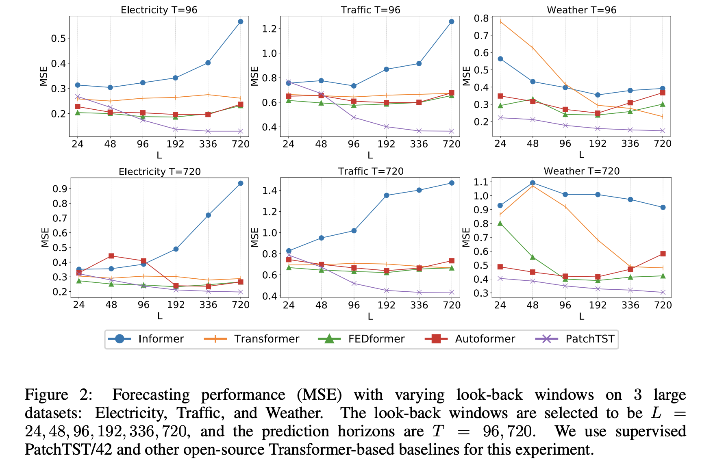
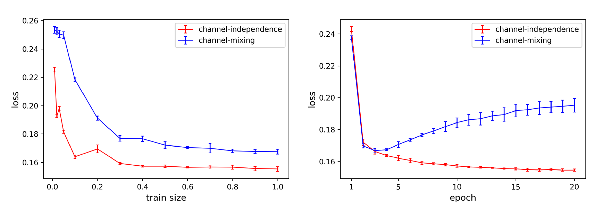

# PatchTST: A Time Series is Worth 64 Words

## 📑 메타 정보

| 항목 | 내용 |
|---|---|
| **제목** | A Time Series is Worth 64 Words: Long-term Forecasting with Transformers |
| **저자** | Yuqi Nie(Princeton), Nam H. Nguyen, Phanwadee Sinthong, Jayant Kalagnanam (IBM Research) — 앞의 두 명 공동 1저자 |
| **공개일** | 2022-11-27 (v1) / 2023-03-05 (v2), **ICLR 2023 채택** |
| **분야** | Long-term Time Series Forecasting(장기 시계열 예측), Self-supervised Representation Learning(자기지도 표현학습) |
| **논문 링크** | [abstract](https://arxiv.org/abs/2211.14730) · [PDF](https://arxiv.org/pdf/2211.14730) |
| **코드** | [github.com/yuqinie98/PatchTST](https://github.com/yuqinie98/PatchTST) (Apache-2.0) |
| **외부 모델/데이터** | 데이터: Weather / Traffic / Electricity / ILI / ETTh1·h2·m1·m2 (Autoformer 배포판). 코드 기반: LTSF-Linear, Informer2020, Autoformer, FEDformer, Pyraformer, RevIN, tsai |

> ⚠️ **arXiv ID 주의** — `2211.14731`은 BALF(블러 이미지 특징점 검출)라는 **전혀 다른 논문**이다. PatchTST는 **2211.14730**.

---

## 📖 주요 용어 사전 (Glossary)

### 핵심 설계 용어

- **patching(패칭)** — 시계열을 한 시점씩 쪼개지 말고 **연속된 여러 시점을 한 덩어리(subseries, 부분 시계열)로 묶어** Transformer의 입력 토큰으로 쓰는 것. ViT가 이미지를 16×16 조각으로 자른 것과 같은 발상.
- **patch length P / stride S(패치 길이 / 보폭)** — 몇 개 시점을 한 패치로 묶을지(P=16), 다음 패치를 몇 칸 옮겨서 뜰지(S=8). S < P이면 패치끼리 겹친다(overlapping).
- **look-back window L(과거 참조 구간)** — 예측에 쓸 과거 길이(= 입력 길이). 코드 `--seq_len`. PatchTST/42는 L=336, PatchTST/64는 L=512. 짝이 되는 개념이 **prediction length T(예측 길이, horizon)** = 몇 스텝 앞까지 맞힐 것인가(코드 `--pred_len`). → 상세 Q10
- **channel(채널)** — 다변량 시계열(multivariate time series)에서의 **변수 하나**. 예: 날씨 데이터의 "온도", "습도", "풍속" 각각이 한 채널. Traffic 데이터는 채널이 862개.
- **channel-independence(채널 독립)** — 채널들을 하나의 벡터로 섞지 않고, **각 채널을 독립된 단변량(univariate) 시계열로 따로 Transformer에 통과**시키는 것. 단, Transformer 가중치는 모든 채널이 공유한다.
- **channel-mixing(채널 혼합)** — 반대 방식. 시점 t의 모든 변수를 한 벡터로 묶어 토큰 하나를 만든다. Informer / Autoformer / FEDformer가 쓰던 기존 방식.
- **PatchTST/42, PatchTST/64** — 뒤의 숫자는 **패치(=토큰) 개수**. 제목의 "64 Words"가 바로 이것.

### 구조 부품

- **Transformer encoder(트랜스포머 인코더)** — 어텐션 + 피드포워드로 이루어진 표준 블록 더미. PatchTST는 이걸 3층 쓴다.
- **flatten + linear head(평탄화 + 선형 예측 헤드)** — 인코더가 뱉은 `[d_model × 패치수]` 특징을 일렬로 펴서(flatten) 선형층 한 장으로 미래 T스텝을 **한 번에** 뽑는 마지막 단계. autoregressive(한 스텝씩 순차 생성)가 아니라 **direct multi-step(한 방에 전부 출력)**.
- **StandardScaler(표준화)** — 데이터셋 수준 정규화. 학습 구간의 평균·표준편차로 **채널마다 따로** 평균 0·표준편차 1로 맞춘다. 논문은 언급하지 않지만 **채널 독립을 성립시키는 것이 실은 이것**이다 (→ §2.4).
- **Instance Normalization(IN, 인스턴스 정규화)** — 샘플 하나의 채널 하나마다 따로 평균·표준편차를 내어 정규화하는 방식(Ulyanov et al. 2016, 원래 이미지 스타일 변환용). 시계열에서는 시간축만 평균 낸다. **되돌리는 기능은 없다** (→ §2.4 부록).
- **RevIN (Reversible Instance Normalization, 되돌릴 수 있는 인스턴스 정규화)** — 입력 구간마다 평균·표준편차를 빼고 나눠 정규화한 뒤, 예측 결과에 그 통계를 **다시 더해서 원래 스케일로 복원**하는 기법. 학습 구간과 테스트 구간의 분포가 달라지는 **distribution shift(분포 이동)** 를 완화한다. StandardScaler와 역할이 다르다 (→ §2.4).
- **non-stationarity(비정상성)** — 시계열의 평균·분산 같은 통계적 성질이 시간에 따라 변하는 것. RevIN이 겨냥하는 문제.
- **BatchNorm vs LayerNorm(배치 정규화 / 층 정규화)** — PatchTST 인코더는 LayerNorm 대신 BatchNorm을 쓴다(논문 각주로 명시, 근거는 Zerveas et al. 2021). 어느 축으로 평균을 내느냐가 전부이고, RevIN까지 셋을 나란히 놓은 비교는 → §2.4 부록.
- **residual attention(잔차 어텐션)** — softmax를 거치기 전의 어텐션 점수를 **다음 층으로 넘겨 더해주는** 변형(RealFormer, He et al. 2020). ⚠️ 코드에는 기본 켜져 있으나 논문에는 언급이 없다 (→ §4.1).

### 자기지도 학습

- **masked autoencoder(마스킹 자기부호화기, MAE)** — 입력의 일부를 가려놓고(mask) 원래 값을 복원하도록 학습시켜 표현(representation)을 얻는 방식. BERT·MAE(He et al. 2021)의 시계열판.
- **mask ratio(마스킹 비율)** — PatchTST는 패치의 **40%** 를 0으로 덮는다.
- **linear probing(선형 프로빙)** — 사전학습된 몸통은 얼려두고(freeze) 마지막 선형 헤드만 학습해 표현의 품질을 재는 방법.
- **fine-tuning(미세조정)** — 사전학습 가중치를 출발점 삼아 전체 네트워크를 다시 학습.
- **transfer learning(전이 학습)** — A 데이터셋에서 사전학습한 모델을 B 데이터셋에 옮겨 쓰는 것. PatchTST는 Electricity(채널 321개) → Weather(21개)처럼 **채널 수가 달라도** 전이가 된다.

### 평가 지표·기타

- **MSE / MAE (Mean Squared / Absolute Error)** — 예측 오차. **낮을수록 좋음.** 이 벤치마크는 표준화(standardize)된 스케일에서 계산한다.
- **DLinear** — Zeng et al. 2022가 제안한 **선형층 한 장짜리** 예측 모델. "Transformer는 시계열에 쓸모없다"는 주장을 낳은 이 논문의 진짜 경쟁자.
- **drop_last** — DataLoader에서 마지막 미완성 배치를 버리는 옵션. 테스트 로더에 켜져 있으면 **평가 샘플 수가 배치 크기에 따라 달라진다** (→ §4.3).

---

## 🎯 논문 요약 (TL;DR)

**한 줄:** 어텐션을 손대지 말고 **입력 토큰을 고쳐라** — 시계열을 16개씩 묶어 토큰으로 쓰고(patching), 변수들을 섞지 말고 하나씩 따로 넣으면(channel-independence), **바닐라 Transformer 인코더만으로** 장기 예측 SOTA가 된다.

- **핵심 문제:** 2022년 DLinear가 "선형층 한 장이 Informer/Autoformer/FEDformer를 전부 이긴다"고 보여주면서 Transformer 무용론이 퍼졌다. 기존 논문들은 전부 **어텐션 메커니즘 자체**를 고치려 했다(ProbSparse, AutoCorrelation, Fourier 강화 등).
- **진단:** 문제는 어텐션이 아니라 **토큰**이었다. 온도 21.3도라는 시점 하나에는 문장 속 단어 같은 의미가 없다. 의미는 "지난 4시간 완만한 상승" 같은 **구간(subseries)** 단위에 있다.
- **해결책 2가지:** ① **patching** — 구간을 토큰으로. 토큰 수가 L에서 L/S로 줄어 어텐션 비용이 S² 배 감소하고, 같은 예산으로 더 긴 과거를 볼 수 있다. ② **channel-independence** — 각 변수를 따로 처리(가중치는 공유).
- **검증:** 8개 표준 데이터셋에서 기존 Transformer 대비 MSE 약 20% 감소, DLinear도 대부분 앞선다. 추가로 **마스킹 자기지도 사전학습**이 지도학습(supervised)을 능가하고, 다른 데이터셋으로 전이도 된다.

---

## 🏆 핵심 기여 (Contributions)

1. **patching 도입** — 시계열 Transformer의 입력 단위를 점(point)에서 구간(subseries)으로 바꿔, ① 지역 의미 보존 ② 어텐션 비용 S² 배 감소 ③ 더 긴 look-back window 활용을 동시에 달성.
2. **channel-independence 도입** — Transformer 계열에 최초로 적용. CNN·선형 모델에서만 통하던 설계가 Transformer에서도(오히려 더) 유효함을 보임.
3. **channel-independence가 왜 더 좋은지에 대한 실증 분석** (부록 A.7) — 적응성 / 데이터 요구량 / 과적합 세 축으로 학습 곡선까지 제시.
4. **설계 원칙의 일반성 증명** (부록 A.7.2) — 채널 독립을 Informer·Autoformer·FEDformer에 **이식하면 전부 좋아진다**는 표를 제시. 자기 모델 자랑을 넘어선 기여.
5. **마스킹 자기지도 학습 레시피** — 패치 단위 마스킹(점 단위가 아님) + 채널 공유 가중치로, 지도학습을 능가하고 채널 수가 다른 데이터셋 간 전이까지 가능하게 함. **오늘날 시계열 foundation model의 표준 골격**이 됨.

---

## 1️⃣ 문제 정의 — 왜 이 논문이 나왔나

*"어텐션을 아무리 고쳐도 선형층 한 장한테 지는 상황"에서, 무엇을 잘못 건드리고 있었는지를 먼저 짚어야 이 논문의 처방이 이해되기 때문이다.*

### 1.1 DLinear 충격

Zeng et al.(2022)이 던진 결과: `Linear(L → T)` 한 줄짜리 모델이 정교한 Transformer 변형들을 전부 이긴다. 논문은 이 공격을 정면으로 받는다.

### 1.2 진단 — point-wise token(점 단위 토큰)의 한계

| 도메인 | 토큰 단위 | 시계열의 기존 방식 |
|---|---|---|
| NLP (BERT) | subword(부분 단어) — character 아님 | — |
| CV (ViT) | 16×16 patch — pixel 아님 | — |
| Speech (wav2vec) | conv로 뽑은 구간 특징 — sample 아님 | — |
| **시계열 (Informer 등)** | — | **시점 하나 = 토큰 하나** ❌ |

다른 모든 도메인이 "원자 단위보다 한 단계 위"를 토큰으로 쓰는데 시계열만 원자 단위를 고집했다는 것이 논문의 지적이다.

### 1.3 Table 1 — 세 문장으로 정리되는 사례 연구 (Traffic, 예측 96스텝)

*논문의 논증이 가장 잘 짜인 부분이라 여기서만 다룬다.*

| 설정 | look-back L | 토큰 수 N | patch | MSE |
|---|---:|---:|:---:|---:|
| 채널 독립, 최근 96스텝 | 96 | 96 | ✗ | 0.518 |
| 채널 독립, **380스텝을 4칸마다 샘플링** | 380 | 96 | ✗ | **0.447** |
| 채널 독립, 336스텝 전부 점 단위 | 336 | 336 | ✗ | 0.397 |
| **PatchTST/42** | 336 | 42 | ✓ | **0.367** |
| PatchTST/42 + 자기지도 | 336 | 42 | ✓ | **0.349** |
| channel-mixing FEDformer | 336 | 336 | ✗ | 0.597 |
| DLinear | 336 | 336 | — | 0.410 |

읽는 법 세 단계:
1. **2행 vs 1행** — 토큰 수가 똑같이 96인데도 더 긴 과거를 본 쪽이 낫다 → "긴 과거에 정보가 있다".
2. **그럼 값을 버리지 않고 긴 과거를 보려면?** → 패칭. 4행이 3행보다 좋으면서 토큰은 336 → 42로 줄었다.
3. 같은 L=336에서 channel-mixing FEDformer는 0.597. → 채널을 섞는 것이 손해.

부수 결과: 패칭으로 인한 학습 시간 단축이 Traffic 22배, Electricity 19배, Weather 4배.

---

## 2️⃣ 주요 알고리즘

*논문의 서술과 실제 저장소 코드를 나란히 놓아, "무엇이 진짜 구현되어 있는가"를 한 곳에 모아두기 위한 절이다.*


*그림 1 (논문 Figure 1). (a) 다변량 입력을 채널별로 쪼개 같은 Transformer에 독립적으로 통과 → 결과를 다시 합침. (b) 지도학습 백본: Instance Norm → Patching → 선형 투사 + 위치 임베딩 → Transformer 인코더 → Flatten + Linear Head. (c) 자기지도 백본: 헤드를 제거하고 마스킹된 패치를 복원하는 선형층을 붙임.*

### 2.1 Patching — 구간을 토큰으로

*Transformer가 "의미 있는 덩어리"를 보게 만들면서 동시에 시퀀스 길이를 줄이는, 이 논문의 1번 장치.*

#### 구체적으로 무엇이 달라지나 (Weather 데이터셋의 온도 채널)

원본 데이터:

```
시각 :  1시   2시   3시   4시   5시   6시   7시   8시   9시  10시 ...
온도 : 20.1  20.3  20.6  21.0  21.5  22.1  22.6  23.0  23.3  23.5 ...
```

**기존 방식 (point-wise token, Informer/Autoformer)** — 토큰 1개 = 시점 1개:

```
토큰 1 = [20.1]  →  선형층 →  128차원 벡터
토큰 2 = [20.3]  →  선형층 →  128차원 벡터
토큰 3 = [20.6]  →  선형층 →  128차원 벡터
   ...
토큰 336 = [...]                          ← look-back 336이면 토큰 336개
```

여기가 문제다. attention(어텐션)이 하는 일은 "토큰끼리 얼마나 닮았나"를 재는 것인데, `20.1`이라는 **숫자 하나**와 `20.3`이라는 숫자 하나를 비교해봐야 나오는 정보가 "값이 비슷하다" 뿐이다. 온도가 20.1도라는 사실 자체에는 의미가 없다. 시계열에서 의미는 **"오르고 있는 중인지, 꺾이는 중인지, 매일 반복되는 아침 패턴인지"** 에 있는데 그건 한 점으로는 표현되지 않는다.

논문이 다른 도메인과 비교한 것이 정확히 이 지점이다 (§1.2 표 참조) — "나는 학교에 간다"를 `ㄴ/ㅏ/ㄴ/ㅡ/ㄴ/ㅎ/ㅏ/...` 로 잘라서 Transformer에 넣던 상황이었다는 것.

**PatchTST 방식 (P=16, S=8)** — 토큰 1개 = 연속된 16개 시점:

```
패치 1 = [20.1, 20.3, 20.6, 21.0, 21.5, 22.1, 22.6, 23.0, 23.3, 23.5, ...]   ← 1~16시
                                                                       (16개)
         → 선형층 Linear(16 → 128) → 128차원 벡터 1개
```

이제 토큰 하나가 **"완만히 상승하는 오전 구간"이라는 모양 전체**를 담는다. 어텐션이 패치 A와 패치 B를 비교하면 "이 상승 패턴이 어제 이맘때 패턴과 닮았다" 같은 것이 나온다.

**stride 8 = 8칸씩 옮기며 뜬다 (절반 겹침)**:

```
시점  1 ─────────────── 16                          ← 패치 1 (1~16시)
시점          9 ─────────────── 24                  ← 패치 2 (9~24시)  ※ 9~16이 겹침
시점                  17 ─────────────── 32         ← 패치 3 (17~32시)
시점                           25 ─────────────── 40 ← 패치 4
   ...
```

겹치게 뜨는 이유는 **패치 경계에 걸친 패턴을 놓치지 않기 위해서**다. 딱 붙여서(S=P=16) 자르면 16시~17시 사이에 걸쳐 일어난 급변이 어느 패치에도 온전히 담기지 않는다.

**얻는 것 3가지:**

| | 효과 |
|---|---|
| 의미 | 토큰 하나가 "구간의 모양"을 담음 |
| 연산량 | 어텐션은 토큰 수의 제곱 비용 → 336² = 112,896 에서 42² = 1,764 로 **64배 감소** |
| 시야 | 아낀 예산으로 look-back을 96 → 336 → 512로 늘릴 수 있음 |

#### 패치 개수 공식

패치 개수 공식 (논문 §3.1):

$$N = \left\lfloor \frac{L - P}{S} \right\rfloor + 2$$

**각 기호의 의미:**

| 기호 | 이름 | 뜻 | 코드 인자 | PatchTST/42 값 |
|---|---|---|---|---:|
| **L** | look-back window(과거 참조 구간) | 모델에 넣는 **입력 시계열의 길이**. 몇 개의 과거 시점을 볼 것인가 | `--seq_len` (내부 `context_window`) | 336 |
| **P** | patch length(패치 길이) | **한 패치에 몇 개 시점을 담을지**. 이 P개가 묶여 토큰 1개가 된다 | `--patch_len` | 16 |
| **S** | stride(보폭) | **다음 패치를 뜰 때 몇 칸 옮길지**. S < P 이면 패치끼리 겹친다 | `--stride` | 8 |
| **N** | number of patches(패치 수) | 결과로 나오는 **토큰 개수**. 모델 이름의 숫자가 바로 이것 | 내부 `patch_num` | **42** |
| **⌊ ⌋** | floor(내림) | 나눗셈 결과에서 소수점을 버린다 | `int(...)` | — |

함께 쓰이는 기호(이 공식에는 없지만 이후 절에서 계속 등장): **T** = prediction length(예측 길이, `--pred_len`), **M** = 채널 수(`--enc_in`), **D** = d_model(토큰 차원, `--d_model`).

##### "+2"를 둘로 쪼개면

*왜 하필 +2인지가 공식에서 가장 안 읽히는 부분이라 나눠 본다.*

**첫 번째 +1 — 슬라이딩 윈도우의 기본**

패치를 몇 개 뜰 수 있는지는 "첫 패치 하나 + 그 뒤로 몇 번 더 옮길 수 있나"다.

```
길이 L 안에서 길이 P 짜리 창을 S칸씩 옮긴다

  첫 창             : [0 ... P-1]                  ← 무조건 1개
  옮길 수 있는 횟수  : ⌊(L − P) / S⌋                ← 남은 (L−P)칸을 S로 나눔
  ────────────────────────────────────────────
  합계              : ⌊(L − P) / S⌋ + 1
```

L=336, P=16, S=8이면 ⌊320/8⌋ + 1 = **41개**.

**두 번째 +1 — 뒤쪽 패딩**

마지막 값을 S번 복제해 뒤에 덧붙이므로 길이가 L → **L+S**가 되고, ⌊(L+S−P)/S⌋ + 1 = ⌊(L−P)/S⌋ + **2**. 패딩 폭이 정확히 stride이므로 **항상 정확히 패치 1개**가 늘어난다.

**코드 매핑** — [`layers/PatchTST_backbone.py:35-38, 68-71`](https://github.com/yuqinie98/PatchTST/blob/main/PatchTST_supervised/layers/PatchTST_backbone.py)

```python
patch_num = int((context_window - patch_len)/stride + 1)
if padding_patch == 'end':
    self.padding_patch_layer = nn.ReplicationPad1d((0, stride))   # 마지막 값 S번 복제
    patch_num += 1
...
z = self.padding_patch_layer(z)
z = z.unfold(dimension=-1, size=self.patch_len, step=self.stride)  # [bs, nvars, patch_num, patch_len]
```

**✅ 검증**: 여러 설정에서 논문식과 코드가 항상 일치함을 확인했다.

| 설정 | 논문식 | 코드 | 일치 | (L−P) mod S |
|---|---:|---:|:---:|---:|
| PatchTST/42 (L=336, P=16, S=8) | 42 | 42 | O | 0 |
| PatchTST/64 (L=512, P=16, S=8) | 64 | 64 | O | 0 |
| ILI 스크립트 (L=104, P=24, S=2) | 42 | 42 | O | 0 |
| 가상: L=100, P=16, S=8 | 12 | 12 | O | 4 |
| 가상: L=336, P=16, S=16 (겹침 없음) | 22 | 22 | O | 0 |

##### 실제로 잘린 모습 (L=336, P=16, S=8)

값 자리에 시점 번호를 넣고 돌려본 결과:

```
L=336, P=16, S=8  →  패딩 후 길이 344,  패치 42개

  패치 0 : 시점 [  0 ...  15]
  패치 1 : 시점 [  8 ...  23]      ← 8칸 이동, 절반 겹침
  패치 2 : 시점 [ 16 ...  31]
   ...
  패치39 : 시점 [312 ... 327]
  패치40 : 시점 [320 ... 335]      ← 여기서 원본이 끝난다
  패치41 : 시점 [328 ... 335]      ← 마지막(패딩 포함)

마지막 패치의 실제 값:
  [328, 329, 330, 331, 332, 333, 334, 335, 335, 335, 335, 335, 335, 335, 335, 335]
   └────── 진짜 시점 328~335 ──────┘ └──── x[335] 를 8번 복제 ────┘
```

**42번째 패치는 절반이 진짜, 절반이 복제값**이다.

##### 그런데 이 패딩은 기본 설정에서 필요가 없다 ⚠️

패딩의 원래 목적은 **꼬리를 놓치지 않는 것**인데, PatchTST 기본 설정에서는 이미 꼬리가 덮여 있다. 위치 기준으로 커버리지를 세어보면:

```
PatchTST/42 : L=336, P=16, S=8   ((L-P) mod S = 0)
  패딩 X: 패치 41개 | 덮이지 않은 시점 0개 | 마지막 시점 등장횟수 1
  패딩 O: 패치 42개 | 덮이지 않은 시점 0개 | 마지막 시점 등장횟수 2

가상        : L=100, P=16, S=8   ((L-P) mod S = 4)
  패딩 X: 패치 11개 | 덮이지 않은 시점 4개 [96, 97, 98, 99] | 마지막 시점 등장횟수 0
  패딩 O: 패치 12개 | 덮이지 않은 시점 0개 | 마지막 시점 등장횟수 1
```

- **(L−P) mod S ≠ 0인 경우**: 패딩이 없으면 마지막 4개 시점이 **아예 모델에 안 들어간다.** 패딩이 필수.
- **(L−P) mod S = 0인 경우** (PatchTST/42·/64·ILI 모두 해당): 41개 패치만으로 336 시점이 이미 전부 덮인다. **42번째 패치는 새 정보를 0 추가**하고, 대신 마지막 8개 시점의 등장 횟수를 1→2로 늘리며 복제값 8개를 얹는다.

즉 논문의 대표 설정에서 "+2"의 두 번째 +1은 **커버리지가 아니라 꼬리 강조 + 토큰 1개 추가**다. 이것이 도움이 되는지에 대한 절제 실험은 논문에 없다.

##### 자기지도 버전은 공식이 다르다

같은 저장소인데 자기지도 쪽은 **패딩 대신 앞을 잘라낸다** ([`patch_mask.py:73-84`](https://github.com/yuqinie98/PatchTST/blob/main/PatchTST_self_supervised/src/callback/patch_mask.py)).

```python
num_patch = (max(seq_len, patch_len) - patch_len) // stride + 1   # ← +1 만, 패딩 없음
tgt_len   = patch_len + stride*(num_patch-1)
s_begin   = seq_len - tgt_len
xb = xb[:, s_begin:, :]                                           # ← 앞쪽을 버린다
```

L=512, P=S=12이면 `num_patch = (512-12)//12 + 1 = 42`, `tgt_len = 12 + 12×41 = 504`, `s_begin = 8` → **가장 오래된 8개 시점을 버린다.**

| | 지도학습 | 자기지도 |
|---|---|---|
| 공식 | ⌊(L−P)/S⌋ + **2** | ⌊(L−P)/S⌋ + **1** |
| 길이가 안 맞을 때 | **뒤에 패딩** (마지막 값 복제) | **앞을 잘라냄** (데이터 버림) |
| L=512에서 | 64 (P=16, S=8) | 42 (P=S=12) |

자기지도가 겹치지 않게 자르는 이유는 §2.6에 있듯 **마스킹 정답 누출 방지**다.

##### 왜 하필 42와 64인가 — 그리고 ILI의 진짜 이유

```
L=336, P=16, S=8  →  ⌊320/8⌋ + 2 = 40 + 2 = 42     → PatchTST/42
L=512, P=16, S=8  →  ⌊496/8⌋ + 2 = 62 + 2 = 64     → PatchTST/64  ← 제목의 "64 Words"
```

모델 이름의 숫자가 곧 이 공식의 출력이다. 그리고 §4.2에서 지적한 ILI의 이상한 설정을 이 공식에 넣으면 의도가 드러난다.

```
논문이 명시한 설정  P=16, S=8 → ⌊(104-16)/8⌋ + 2 = 11 + 2 = 13 패치
실제 스크립트      P=24, S=2 → ⌊(104-24)/2⌋ + 2 = 40 + 2 = 42 패치   ← 정확히 42
```

ILI는 데이터가 짧아(L=104) 논문 설정으로는 토큰이 **13개뿐**이다. stride를 2로 줄여 **거의 완전 중첩(16칸 중 14칸 겹침)** 으로 토큰 수를 3배 이상 늘려 42에 맞춘 것으로 보인다. 논문은 이 조정을 언급하지 않는다.

##### 엣지 케이스

`int()`는 0 방향으로 자르므로 **L < P일 때** 파이썬 `int()`와 수학적 floor가 갈린다.

```
L=10, P=16, S=8 :  (10-16)/8 = -0.75
   코드  int(-0.75 + 1) = int(0.25) = 0   → patch_num = 0, 패딩 후 1
   논문  ⌊-0.75⌋ + 2 = -1 + 2 = 1
```

수치는 우연히 맞지만 `unfold`가 실패한다. 실전에서 L ≥ P는 항상 성립하므로 문제되지 않고, **L ≥ P인 모든 경우 두 식은 정확히 일치**한다(위 검증표).

투사(projection)는 선형층 한 장 — `nn.Linear(patch_len, d_model)`. 즉 길이 16짜리 실수 벡터를 128차원 토큰으로 올린다. 위치 임베딩은 학습 가능한 `[N, d_model]` 파라미터(`pe='zeros'`, uniform(-0.02, 0.02) 초기화).

### 2.2 Channel-independence — 변수를 배치로 밀어넣기

*채널을 섞으면 왜 손해인지는 §3.5에서 실증하고, 여기서는 "어떻게 구현되는가"만 본다.*

#### 표를 가로로 자르느냐, 세로로 자르느냐

Weather 데이터에서 변수 3개만 뽑아 보자 (실제로는 21개).

| 시각 | 온도 | 습도 | 풍속 |
|---|---|---|---|
| 1시 | 20.1 | 65 | 2.1 |
| 2시 | 20.3 | 64 | 2.3 |
| 3시 | 20.6 | 62 | 2.6 |
| 4시 | 21.0 | 61 | 3.0 |

**기존 방식 (channel-mixing)** — 토큰 1개 = 한 시점의 모든 변수를 묶은 벡터. 표를 **가로로** 자른다:

```
토큰 1 = [20.1, 65, 2.1]   ← 1시의 "날씨 상태 전체"  (3차원)
토큰 2 = [20.3, 64, 2.3]   ← 2시의 날씨 상태
토큰 3 = [20.6, 62, 2.6]
토큰 4 = [21.0, 61, 3.0]
         ↓ 선형층 Linear(3 → 128)  ← 온도·습도·풍속이 여기서 뭉개져 한 벡터로 섞임
```

문제 두 가지: ① **첫 선형층에서 이미 섞여버린다.** 이후 Transformer는 "온도의 흐름"과 "습도의 흐름"을 분리해서 볼 수단이 없다. ② **모든 변수가 하나의 어텐션 패턴을 공유한다.** 온도는 하루 주기가 강하고 풍속은 훨씬 불규칙한데 어텐션 맵은 하나뿐이다. Traffic이면 862개 시계열이 전부 같은 "과거를 보는 방식"을 강요당한다.

**PatchTST 방식 (channel-independence)** — 표를 **세로로** 자른다:

```
온도 시계열 : [20.1, 20.3, 20.6, 21.0, ...]  (길이 336)  →  패치 42개  →  Transformer
습도 시계열 : [  65,   64,   62,   61, ...]  (길이 336)  →  패치 42개  →  Transformer  ← 같은 가중치!
풍속 시계열 : [ 2.1,  2.3,  2.6,  3.0, ...]  (길이 336)  →  패치 42개  →  Transformer  ← 같은 가중치!
```

핵심은 **"따로 통과시키되, 통과시키는 모델은 하나"** 라는 점이다. 여기가 헷갈리기 쉬운데:

- ❌ 변수마다 다른 모델을 21개 만드는 것이 **아니다** (그러면 파라미터 21배 + 데이터 부족)
- ✅ **모델은 하나**고, 21개 변수가 각각 그 모델을 통과한다

비유하면: **21명의 목소리를 한 마이크에 합쳐 녹음하고 분석하느냐(channel-mixing)** vs **21명을 따로 녹음하되 분석하는 사람은 한 명이냐(channel-independence)** 의 차이다.

#### 텐서 모양의 흐름 (배치 128, 변수 21개)

```
입력            [128, 336,  21]          B, 시간, 변수
  ↓ permute
                [128,  21, 336]          B, 변수, 시간
  ↓ unfold (패칭)
                [128,  21,  42, 16]      B, 변수, 패치수, 패치길이
  ↓ Linear(16 → 128)
                [128,  21,  42, 128]     B, 변수, 패치수, d_model
  ↓ reshape     ★ 여기가 channel-independence의 전부
                [2688,     42, 128]      (128×21), 패치수, d_model
  ↓ Transformer 3층                      ← 2688개를 독립 시퀀스로 처리
                [2688,     42, 128]
  ↓ reshape 되돌리기
                [128,  21,  42, 128]
  ↓ Flatten + Linear(42×128=5376 → 96)
출력            [128,  21,  96]          B, 변수, 예측길이
```

Transformer 입장에서는 **"배치 2688개짜리 단변량(univariate) 시계열 예측"** 을 하고 있을 뿐이고, 자기가 다변량 데이터를 다루고 있다는 사실을 모른다.

구현은 `reshape` 한 줄이다 — [`PatchTST_backbone.py:164`](https://github.com/yuqinie98/PatchTST/blob/main/PatchTST_supervised/layers/PatchTST_backbone.py)

```python
# x: [bs, nvars, patch_num, d_model]
u = torch.reshape(x, (x.shape[0]*x.shape[1], x.shape[2], x.shape[3]))   # (B*M, N, D)
```

채널 차원 M을 배치 차원 B에 흡수시킨다. 별도 연산자(custom operator)가 전혀 필요 없고, 표준 Transformer 구현 아무거나 그대로 쓸 수 있다는 것이 논문 A.1.5의 자랑이다.

#### 그림 1(a)의 split과 Concatenate의 정체 — 둘 다 `reshape` 한 줄 ⭐

*그림 1(a)에 "Concatenate" 상자가 그려져 있어 뭔가 융합·취합하는 것처럼 보이지만, 실제로는 파라미터도 연산도 없는 모양 복원일 뿐이라 짚어둔다.*

```
x ∈ R^(M×L)
   │  split                       ← reshape 한 줄 (PatchTST_backbone.py:164)
   ↓
x⁽¹⁾, x⁽²⁾, ..., x⁽ᴹ⁾  ∈ R^(1×L)
   │  각각 Transformer 통과        ← ★ 모델은 M개가 아니라 "하나"
   ↓
x̂⁽¹⁾, x̂⁽²⁾, ..., x̂⁽ᴹ⁾  ∈ R^(1×T)
   │  Concatenate                 ← reshape 한 줄 (PatchTST_backbone.py:169)
   ↓
x̂ ∈ R^(M×T)
```

```python
# split  (채널 → 배치로 접기)
u = torch.reshape(x, (x.shape[0]*x.shape[1], x.shape[2], x.shape[3]))   # [B, M, N, D] → [B*M, N, D]

#  ... Transformer 3층 ...

# concat (배치 → 채널로 펴기)
z = torch.reshape(z, (-1, n_vars, z.shape[-2], z.shape[-1]))            # [B*M, N, D] → [B, M, N, D]
```

**정정 ① — "따로"는 맞지만 모델은 하나다.** 채널마다 별도 모델을 M개 두는 것이 아니라 하나의 Transformer(가중치 공유)를 M번 통과시키는 것이고, 물리적으로는 배치로 접어 **한 번에** 계산한다. "따로 M번 돈다"는 개념적 설명이다.

**정정 ② — Concatenate는 아무것도 하지 않는다.** 실측 2건:

```
① 5채널 통째 실행  vs  한 채널씩 5번 실행 후 내가 직접 torch.cat
   최대 차이 : 9.8e-07

② 입력 채널을 [3,0,4,1,2] 순으로 섞어 넣었을 때
   출력도 같은 순서로 섞였나? 최대 차이 : 7.7e-07
```

- **①**: 모델 내부의 concat과 **바깥에서 손으로 붙인 concat이 같다** (1e-6은 float32 누적 순서 차이) → concat 단계가 하는 일이 없다는 증거
- **②**: 채널 순서를 바꿔 넣으면 출력도 정확히 같은 순서로 바뀐다(**permutation equivariance**) → 채널 간 상호작용이 0이고, 출력 i번이 입력 i번에 대응한다는 보장

**정정 ③ — "각 채널의 속성을 추론"하는 것이 아니다.** 모델이 추론하는 것은 그 채널의 **미래 값 T개**이지 "이 채널은 온도구나" 같은 정체성이 아니다. §2.4에서 보듯 RevIN을 거치면 모든 채널이 평균 0·표준편차 1인 무명의 수열이 되어 모델은 어느 채널인지 알지 못한다. 채널마다 다른 어텐션 맵이 나오는 것(논문 Figure 6)은 채널을 알아서가 아니라 **입력 모양이 달라서**다.

| 그림 1(a)의 단계 | 실제 구현 | 파라미터 | 채널 섞임 |
|---|---|---:|---|
| **split** (M개로 쪼갬) | `reshape` [B,M,…] → [B*M,…] | 0 | 없음 |
| **Transformer backbone** | 가중치 **하나**를 공유, 배치로 병렬 1회 | 40만 개 | 없음 (추론 시) |
| **Concatenate** | `reshape` [B*M,…] → [B,M,…] | 0 | 없음 |

즉 그림 1(a) 전체가 **"쪼개기 → 하나의 모델 → 다시 쌓기"** 이고, 실제로 뭔가 일어나는 곳은 가운데 Transformer 하나뿐이다.

**대가 — 어텐션 비용이 M배가 된다.** 채널 혼합은 토큰 N개짜리 시퀀스 1개를 처리하지만, 채널 독립은 같은 시퀀스를 M개 처리한다. Traffic(M=862)에서 배치 24를 쓰면 Transformer가 실제로 보는 시퀀스는 **24 × 862 = 20,688개**다. 그래서 저장소 스크립트의 배치 크기가 데이터셋마다 다르다:

| 데이터셋 | 채널 M | 스크립트 배치 | 실질 시퀀스 수 |
|---|---:|---:|---:|
| Traffic | 862 | 24 | 20,688 |
| Electricity | 321 | 32 | 10,272 |
| Weather | 21 | 128 | 2,688 |
| ETTh1/h2/m1/m2 | 7 | 128 | 896 |

**패칭으로 아낀 것(S²=64배)을 채널 독립이 상당 부분 도로 쓴다**는 점은 논문이 명시하지 않는다.

#### 입력 배치가 1이어도 Transformer 내부 배치는 M이다

*"실시간 예측 하나만 하면 가볍겠지"라는 기대가 어긋나는 지점이라 실측해둔다.*

배치 크기 1(= 윈도우 하나)을 넣어도 채널이 배치 축에 접히므로 Transformer가 실제로 처리하는 시퀀스는 **1 × M**개다. RTX 6000 Ada 실측:

| 데이터셋 | 채널 M | 입력 배치 | → Transformer 실제 배치 | 1회 지연(ms) |
|---|---:|---:|---:|---:|
| ETTh1 | 7 | 1 | 7 | 1.7 |
| Weather | 21 | 1 | 21 | 1.7 |
| Electricity | 321 | 1 | 321 | 7.1 |
| Traffic | 862 | 1 | **862** | **20.6** |

어텐션 행렬 장수도 함께 늘어난다 (= 실제 배치 × 헤드 수):

```
ETTh1        배치1 입력 → 42×42 어텐션 행렬      28장  (= 7 채널 × 4 헤드)
Weather      배치1 입력 → 42×42 어텐션 행렬     336장  (= 21 채널 × 16 헤드)
Electricity  배치1 입력 → 42×42 어텐션 행렬   5,136장  (= 321 채널 × 16 헤드)
Traffic      배치1 입력 → 42×42 어텐션 행렬  13,792장  (= 862 채널 × 16 헤드)
```

**해석 3가지:**

- **지연시간을 지배하는 것은 배치가 아니라 채널 수다.** Traffic은 단일 윈도우 예측인데도 20.6ms — ETTh1의 12배.
- **작은 데이터셋은 GPU가 논다.** ETTh1(7채널)과 Weather(21채널)가 똑같이 1.7ms인 것은 계산량이 아니라 3층분 커널 실행 오버헤드가 바닥을 이루기 때문이다.
- **학습 배치 크기는 채널 수로 나눠 읽어야 한다.** 위 표의 "실질 시퀀스 수"가 그 이유이고, Traffic만 배치 24인 것도 그래서다.

**단, 배치 1이 문제를 일으키지는 않는다.** 최악의 경우(단변량 M=1 + 배치 1 → 내부 배치도 진짜 1)를 학습 모드로 돌려도 정상 동작한다:

```
M=1, 배치1, train 모드 → 정상 동작. 출력 (1, 1, 96)
  BatchNorm1d 입력 [N,C,L] = [1, 16, 42]
  → BatchNorm 은 N과 L 양쪽으로 평균 → 특징당 표본 1×42 = 42개 확보 (배치1이어도 붕괴 안 함)
```

BatchNorm이 배치 축뿐 아니라 패치 축으로도 평균을 내기 때문에(→ §2.4 부록), 배치 1에서도 통계가 성립한다.

#### 채널 독립은 어디까지 참인가 — 저장소 코드 실측 ⭐

*"채널 독립"이라는 이름이 정확히 어디까지 성립하는지는 논문 서술만으로는 알 수 없어, 저장소 모델을 직접 불러 세 가지를 측정했다.*

**(1) 채널 수에 의존하는 파라미터가 하나도 없다**

```
c_in=   1 -> params 921,187
c_in=   7 -> params 921,187
c_in=  21 -> params 921,187
c_in= 321 -> params 921,187
c_in= 862 -> params 921,187
```

기본 설정(`--affine 0 --individual 0`)에서는 **채널 수에 의존하는 파라미터가 단 하나도 없다.** `enc_in=21`이라고 알려주긴 하지만 사실상 아무 데도 쓰이지 않는다. 이것이 Electricity(321채널) 사전학습 모델을 Weather(21채널)에 그대로 전이할 수 있는 이유이고(§3.6), 오늘날 시계열 foundation model이 전부 이 구조를 쓰는 이유다.

**(2) 추론 시에는 완벽히 독립이다**

같은 학습된 모델에 ① 21채널을 통째로 넣고 0번(온도) 결과만 꺼낸 것과 ② 온도 채널 하나만 넣은 것을 비교:

```
[eval ] 21채널 중 0번 예측  vs  0번만 넣은 예측  최대차이 = 0.000e+00
```

**부동소수점 오차조차 없이 완전히 같다.** 채널끼리 정보가 오갈 경로가 실제로 하나도 없다는 뜻이다. 어텐션 맵을 꺼내보면 더 명확하다:

```
어텐션 맵 shape : (84, 16, 42, 42)
                   ↑    ↑   ↑   ↑
        배치4×채널21  헤드16  패치42  패치42
```

행렬 한 장이 **42 × 42, 즉 "패치 × 패치"** 다. 채널 × 채널이 아니다. 채널 21은 배치 축(84 = 4×21) 안으로 흡수되어 어텐션 계산에 등장조차 하지 않는다. 온도 채널만 넣으면 `(4, 16, 42, 42)`가 되는데 행렬 크기는 그대로 42×42다.

**(3) 학습 시에는 BatchNorm을 통해 채널끼리 간섭한다** ⚠️

같은 비교를 `train` 모드에서 하면 결과가 달라진다 (dropout은 0으로 고정):

```
[eval ] 21채널 vs 1채널  차이 = 0.000e+00
[train] 21채널 vs 1채널  차이 = 1.664e-01     (예측값 자체의 크기는 0.459)
```

예측 크기 대비 **약 36%**나 차이난다. 원인을 찾으려고 인코더만 떼어내 정규화 방식을 바꿔봤다:

```
[encoder only] norm=BatchNorm  train | 21ch vs 1ch = 3.687e-01
[encoder only] norm=LayerNorm  train | 21ch vs 1ch = 0.000e+00
```

**범인은 BatchNorm이다.** 이유는 위 텐서 흐름의 `reshape`다. 채널이 배치 차원에 흡수된 뒤 BatchNorm이 **배치 차원 전체에 걸쳐 평균과 분산**을 내므로, 온도의 통계와 습도의 통계가 한 솥에 들어간다.

즉 **"channel-independence"는 추론 시에만 엄밀히 참이고, 학습 시에는 정규화 통계를 통해 채널끼리 섞인다.** 논문은 이 점을 언급하지 않는다.

다만 이것은 문제라기보다 성질로 보는 것이 맞다:
- 정답이 새는 정보 누출(leakage)이 아니라 **정규화 통계 공유**일 뿐이다
- 실제 학습에서는 항상 전 채널을 함께 넣으므로 일관된다
- 오히려 배치 통계가 M배 많은 샘플로 계산되어 **더 안정적**이다 (Weather 배치 128이면 BatchNorm은 2,688개 샘플로 통계를 낸다)
- 단, **"배치에 어떤 채널이 함께 있었는지"가 학습 결과에 영향을 준다**는 뜻이므로, 채널을 쪼개서 학습하면 다른 모델이 나온다

### 2.3 인코더 내부 — "vanilla"라고 하기엔

*논문이 "바닐라 Transformer 인코더를 쓴다"고 서술하지만 코드는 그렇지 않아, 실제 부품을 따로 적어둔다.*

| 부품 | 실제 코드 기본값 | 비고 |
|---|---|---|
| 층 수 | 3층 (`e_layers=3`) | 모든 스크립트 공통 |
| d_model / n_heads / d_ff | 128 / 16 / 256 (대형), **16 / 4 / 128** (ILI·ETTh1·ETTh2) | 작은 데이터셋은 과적합 방지용 축소 |
| 정규화 | **BatchNorm** (`norm='BatchNorm'`) | 논문 각주로 명시 ✅ · 세 정규화 비교는 §2.4 부록 |
| 정규화 위치 | **post-norm** (`pre_norm=False`) | Figure 1(b)의 Add & Norm과 일치 |
| 활성화 | GELU (지도학습) / **ReLU** (자기지도) | 논문 A.1.4는 GELU만 언급 ⚠️ |
| 어텐션 | **residual attention 켜짐** (`res_attention=True`) | 논문 미언급, 끄는 CLI 옵션도 없음 ⚠️ |
| attn_dropout | 0 | |

### 2.4 정규화 2겹 — 채널 독립을 성립시키는 숨은 전제 ⭐

*채널마다 단위와 스케일이 제각각인데(기압 1013 mbar vs 강수량 0.03 mm) 가중치 하나를 공유한다는 것이 어떻게 가능한지가 이 절의 주제다. 답은 정규화가 두 겹으로 들어가 있기 때문이고, 그중 한 겹은 논문이 언급조차 하지 않는다.*

#### 정규화를 안 하면 실제로 얼마나 망가지나

Weather 스타일 5개 채널(스케일 제각각)을 만들어 **공유 가중치 하나**로 통과시킨 뒤, Transformer에 들어가기 직전(패치 투사층 `Linear(16→128)` 직후) 활성값의 크기를 실측했다.

원본 스케일:

```
기압(mbar)   평균 1012.97   범위 [ 975.20, 1045.31]
온도(degC)   평균    9.47   범위 [ -31.51,   43.22]
습도(%)      평균   76.01   범위 [  -1.63,  137.63]
풍속(m/s)    평균    2.10   범위 [  -3.87,    8.46]
강수량(mm)   평균    0.04   범위 [  -1.09,    1.24]
```

패치 투사층 통과 직후 채널별 활성값 크기:

```
정규화 없음            439.71    5.74   33.47    1.13    0.18   ← 최대/최소 2,410배 ❌
StandardScaler만         0.47    0.47    0.46    0.47    0.48   ← 1.0배 ✅
StandardScaler+RevIN     0.48    0.47    0.47    0.47    0.47   ← 1.0배 ✅
```

**2,410배 차이**다. 이 상태로 학습하면:

- **gradient를 기압 채널이 독점한다.** 손실이 활성값 크기에 비례하니 강수량 채널의 오차는 기압의 1/2400이라 사실상 무시된다.
- **attention softmax가 포화된다.** 점수가 수백 단위면 softmax 출력이 0 아니면 1로 굳어 학습이 안 된다.
- **BatchNorm 통계가 오염된다.** §2.2에서 봤듯 채널이 배치에 섞여 들어가는데 기압 하나가 배치 평균을 지배한다.

#### 1층 — 데이터셋 수준 StandardScaler (논문 미언급)

[`data_provider/data_loader.py:59-61`](https://github.com/yuqinie98/PatchTST/blob/main/PatchTST_supervised/data_provider/data_loader.py):

```python
if self.scale:
    train_data = df_data[border1s[0]:border2s[0]]   # ★ 학습 구간만 잘라내서
    self.scaler.fit(train_data.values)              # ★ 여기에만 fit  (누출 없음)
    data = self.scaler.transform(df_data.values)    # 전체(train/val/test)에 적용
```

sklearn의 `StandardScaler`는 **열(=채널)마다 따로** 평균과 표준편차를 계산한다. 기압은 기압대로, 강수량은 강수량대로 자기 통계로 정규화된다.

```
기압      평균  0.011   표준편차 0.999
온도      평균  0.002   표준편차 1.001
습도      평균 -0.002   표준편차 1.000
풍속      평균  0.008   표준편차 1.001
강수량    평균  0.002   표준편차 1.000
```

**전부 평균 0, 표준편차 1로 통일된다.** 위 실측에서 활성값 배율이 2410배 → 1.0배가 된 것이 이 단계의 효과다. 통계를 학습 구간에서만 뽑으므로 **테스트 정보 누출도 없다.**

**논문 본문은 이 단계를 아예 언급하지 않는다.** Autoformer/Informer 코드베이스에서 물려받은 것이라 "당연한 전처리"로 취급되지만, **채널 독립을 성립시키는 것은 사실 이 StandardScaler다.**

#### 2층 — RevIN (윈도우별 정규화)

*PatchTST 고유 기여는 아니고 Kim et al. 2022를 가져다 쓴 것.*

그럼 StandardScaler가 다 해결했는데 RevIN은 왜 필요한가? **StandardScaler는 전 구간 하나의 평균만 쓰기 때문**이다. 시계열은 시간이 지나며 통계가 변한다(non-stationarity, 비정상성). 3년에 걸쳐 서서히 증가하는 전력 사용량 채널로 실험하면:

```
데이터셋 StandardScaler 만 적용했을 때, 두 윈도우의 통계
   학습 구간 윈도우 : 평균 -0.995   표준편차 0.544
   테스트 구간 윈도우: 평균 +2.521   표준편차 0.512   ← 평균이 통째로 이동
   → 차이 3.52 = 표준편차의 6.5배.  모델이 학습 때 본 적 없는 입력 범위

   RevIN 후 학습 구간 윈도우 : 평균 +0.000   표준편차 1.000
   RevIN 후 테스트 구간 윈도우: 평균 -0.000   표준편차 1.000   ← 정렬됨 ✅
```

RevIN은 **입력 윈도우 336개 안에서** 다시 평균·표준편차를 낸다. 패칭 **전에** 채널별로 정규화하고, 예측이 나온 **후에** 통계를 되돌린다.

```python
# 입력:  x ← (x - mean) / std          (mean, std는 그 입력 구간에서 계산, detach)
# 출력:  ŷ ← ŷ * std + mean
```

**"되돌린다(Reversible)"가 핵심**이다. 입력의 평균을 빼버렸으니 예측도 평균이 빠진 상태로 나온다 — "지금 평균보다 얼마나 높을지"만 예측하는 셈이다. 그래서 예측이 나온 뒤 빼놨던 통계를 다시 더해준다. 이것이 이름의 "Reversible".

저장소 기본값은 `--revin 1 --affine 0 --subtract_last 0` (학습 가능한 affine 파라미터는 끈 상태).

#### RevIN의 통계 단위 — 채널별이면서 동시에 (입력 윈도우)별 ⭐

*"채널마다 다른 스케일로 정규화하는 것인가?"에 대한 답. 맞지만 한 단계 더 잘게 쪼갠다.*

```python
def _get_statistics(self, x):
    dim2reduce = tuple(range(1, x.ndim-1))     # x: [bs, seq_len, nvars] → ndim=3 → (1,)
    self.mean  = torch.mean(x, dim=dim2reduce, keepdim=True).detach()
    self.stdev = torch.sqrt(torch.var(x, dim=dim2reduce, keepdim=True, unbiased=False) + eps).detach()
```

`dim2reduce = (1,)` — **시간축만 평균 내고 배치 축과 채널 축은 그대로 남긴다.** 실측하면:

```
입력 shape          : (3, 336, 5)   [배치, 시간, 채널]
계산된 mean  shape  : (3, 1, 5)
계산된 stdev shape  : (3, 1, 5)
→ 통계 쌍의 개수    : 배치 3 × 채널 5 = 15개
```

실제 학습(Weather, 배치 128, 채널 21)이면 한 스텝마다 **2,688쌍의 (평균, 표준편차)** 가 만들어진다. 실제 값:

```
                      기압              온도              습도              풍속            강수량
샘플0 mean :      1013.880           8.575          77.600           2.100           0.042
샘플0 std  :         8.425           8.822          17.053           1.561           0.306

샘플1 mean :      1014.253          20.843          56.913           3.004           0.517   ← 같은 채널인데 다름
샘플1 std  :         7.831           7.799          15.797           1.508           0.305

샘플2 mean :      1012.850           9.808          75.221           2.063           0.041
샘플2 std  :         8.586           8.743          15.770           1.365           0.294
```

두 방향으로 다르다.

- **가로로**: 기압 1013.880 vs 강수량 0.042 → **채널마다 다른 스케일**
- **세로로**: 온도가 샘플0에서 8.575, 샘플1에서 20.843 → **같은 채널이라도 어느 시간대 윈도우냐에 따라 다름** (샘플1은 여름 구간이라고 가정한 것)

정규화 후 모든 채널이 평균 0·표준편차 1이 되고, denorm은 각 채널이 **자기 통계로** 되돌린다(복원 오차 1.9e-06, float32 정밀도 한계).

**알아둘 옵션 3가지:**

| 옵션 | 기본값 | 하는 일 |
|---|---|---|
| `--affine` | **0 (끔)** | 켜면 채널별 학습 가능한 스케일·바이어스 `(C,)` 를 추가. 논문 실험은 끈 상태 |
| `--subtract_last` | **0 (끔)** | 켜면 평균 대신 **윈도우의 마지막 값**을 뺀다 (NLinear 방식). 표준편차 나눗셈은 그대로 |
| `.detach()` | — | 통계에는 gradient가 흐르지 않는다. 평균·표준편차는 **학습 대상이 아니라 입력에서 계산되는 상수** |

마지막 항목이 중요하다. 통계가 학습되는 값이 아니라 **입력에서 즉석 계산**되기 때문에, 학습 때 본 적 없는 채널이나 처음 보는 시계열을 넣어도 스케일이 자동으로 맞는다. §2.2에서 확인한 "파라미터가 채널 수와 완전히 무관(921,187 고정)"이 성립하는 이유 중 하나다.

**구현상의 함정 하나**: `self.mean`, `self.stdev`를 **모듈 속성에 저장**하므로 norm과 denorm이 같은 forward 안에서 짝지어져야 한다. 중간에 다른 입력으로 norm을 또 부르면 앞의 통계가 덮어써진다(재진입 불가).

#### 두 층의 역할 분리

| | StandardScaler | RevIN |
|---|---|---|
| **적용 단위** | 데이터셋 전체 × 채널별 | **입력 윈도우 336개** × 채널별 |
| **통계 출처** | 학습 구간 전체 | **그 입력 구간 자체** |
| **해결하는 문제** | **채널 간 스케일 차이** (기압 1013 vs 강수량 0.03) | **시간에 따른 분포 이동** (학습 때 −1, 테스트 때 +2.5) |
| **되돌리나?** | 안 되돌림 (평가도 정규화 스케일에서 수행) | 되돌림 |
| **논문 언급** | ❌ 없음 | ✅ §3.1 "Instance Normalization" |

①은 "가로 방향(채널 간)" 정렬, ②는 "세로 방향(시간 간)" 정렬이라 서로 대체할 수 없다.

#### 두 정규화가 적용되는 순서와 위치 — 실제 파이프라인 ⭐

*"먼저 정규화하고 그 다음에 RevIN을 거는 것인가?"에 대한 답. 맞다. 다만 둘은 서로 다른 장소·다른 시점에서 일어난다.*

```
원본 CSV (°C, %, mbar ...)
   │
   │  ① StandardScaler        ← data_loader.py, Dataset 만들 때 딱 1회
   │     scaler.fit(학습구간)  →  scaler.transform(전체)
   ↓
self.data_x / self.data_y   ← 이미 표준화된 값이 메모리에 저장됨
   │
   │  DataLoader 가 배치로 잘라서 꺼냄
   ↓
batch_x, batch_y            ← 둘 다 ①공간의 값
   │
   ├──────────────────────────────────────────────┐
   │  ② RevIN 'norm'          ← forward 안, 매 스텝  │
   ↓                                              │
 패칭 → Transformer → 선형 헤드                    │  batch_y 는 여기 안 들어옴
   │                                              │  (RevIN 안 걸림)
   │  ② RevIN 'denorm'        ← RevIN 만 되돌림     │
   ↓                                              │
예측값 (①공간)  ←────────── loss ──────────────────┘
```

핵심은 **`denorm`이 되돌리는 것은 RevIN뿐**이라는 점이다. StandardScaler는 끝까지 되돌리지 않는다.

**숫자로 따라가기** (온도 채널, 3년치에 상승 추세가 있는 경우):

```
원본 °C          : 윈도우 평균  20.485   표준편차  8.570
① StandardScaler : 윈도우 평균   0.754   표준편차  0.945   ← 여전히 0 근처가 아님(추세 때문)
② RevIN norm     : 윈도우 평균   0.000   표준편차  1.000   ← 이제 0/1
   (RevIN 이 기억한 통계: mean 0.7540, stdev 0.9451  ← ①공간의 값)

모델 출력(RevIN 공간) 0.0  →  denorm  →  0.7540  = ①공간
정답 y (①공간) 첫 값                       :  1.4679
```

여기서 두 가지가 보인다.

**(a) ①만으로는 부족하다.** StandardScaler를 거쳤는데도 이 윈도우의 평균이 0이 아니라 **0.754**다. 전체 3년 평균으로 맞췄는데 이 구간은 뒤쪽(더워진 시기)이라 위로 치우쳐 있기 때문이다. RevIN이 이것을 0으로 끌어내린다.

**(b) RevIN은 ①공간 위에서 작동한다.** RevIN이 기억한 통계(0.7540 / 0.9451)는 **원본 °C 값이 아니라 표준화된 값**이다. RevIN 입장에서는 앞에 StandardScaler가 있었는지조차 모르고 그냥 들어온 숫자로 평균을 낸다. 두 단계가 완전히 독립적으로 포개져 있다.

그리고 되돌아온 예측이 정답과 **같은 공간**에 있으므로 loss가 성립한다.

#### 귀결 — 논문에 실린 MSE는 °C가 아니다 ⚠️

평가도 ①공간에서 한다. `Dataset` 클래스에 `inverse_transform`이 정의되어 있지만 **`exp_main.py`에서 한 번도 호출되지 않는다.**

```python
# exp_main.py test() — 표준화된 값 그대로 metric 계산
mae, mse, rmse, mape, mspe, rse, corr = metric(preds, trues)
```

같은 예측의 MSE를 두 공간에서 재보면:

```
① 공간 (논문에 실리는 값)  :  1.1334
원본 °C 로 되돌리면        : 93.1921     ← 82배 차이
```

따라서:

- 논문 Table 3의 `Weather 96 → 0.152` 같은 숫자는 **표준편차 단위**이지 물리 단위가 아니다.
- **데이터셋끼리 MSE를 비교하는 것은 무의미하다.** ILI가 1.5, Electricity가 0.13인 것은 ILI가 12배 어렵다는 뜻이 아니라 표준화 후 분산 구조가 다를 뿐이다. (그래서 §3.2도 항상 데이터셋 **안에서만** 비교한다.)
- 실무에서 "몇 도 틀렸나"를 알고 싶으면 `inverse_transform`을 직접 붙여야 한다.

#### 논문 A.4.4의 "RevIN 빼도 된다"는 말의 진짜 의미

논문은 부록에서 *"instance normalization은 성능을 약간만 올린다. 없어도 대부분 데이터셋에서 다른 Transformer를 이긴다"* 고 쓴다. 이것이 "정규화 없이도 된다"로 읽히면 오해다.

```
RevIN 끔        =  StandardScaler 만 있는 상태  ✅ 채널 스케일은 이미 정렬됨
정규화 전부 끔  =  활성값 2,410배 차이         ❌ 학습 불가
```

RevIN을 꺼도 되는 이유는 **1층이 이미 채널 스케일을 다 맞춰놨기 때문**이다. 저장소에는 `scale`을 끄는 CLI 옵션조차 사실상 없다(`Dataset` 클래스의 `scale=True` 기본값).

#### 부수 효과 — 정규화가 채널 간 "공통 화폐"를 만든다

정규화는 채널 독립을 **가능하게 만드는 것**을 넘어 **더 좋게 만드는** 역할도 한다. 단위가 지워지면서 채널 간에 "모양"이라는 공통 화폐가 생기기 때문이다.

```
기압 [1013.2 → 1009.8 → 1011.5]  ─정규화→  [+0.4 → -0.6 → -0.1]  ┐
온도 [  20.1 →   23.5 →   21.5]  ─정규화→  [-1.2 → +1.4 → -0.3]  │ 전부 같은
습도 [    65 →     45 →     58]  ─정규화→  [+1.1 → -1.5 → +0.2]  ┘ 언어가 됨
```

mbar도 °C도 %도 사라지고 **"올랐다 꺾이는 모양"** 만 남는다. 그래서 습도에서 본 패턴이 온도 예측 능력을 훈련시키는 데 쓰일 수 있고, Q7에서 계산하는 **Traffic 862배 데이터 증강**이 성립한다. 정규화가 없으면 862개 채널이 862개의 서로 다른 단위로 흩어져 있어 가중치 공유 자체가 무의미해진다.

#### 이 방식의 한계

| 한계 | 내용 |
|---|---|
| **절대 수준 정보 상실** | RevIN이 윈도우 평균을 빼버리므로 모델은 "지금이 여름인지 겨울인지"를 모른다. 상대적 변화만 본다 |
| **평균 회귀 편향** | 예측이 항상 "입력 윈도우의 평균 근처"로 되돌아오는 경향이 생긴다. 강한 추세가 이어질 때 과소 예측 |
| **짧은 윈도우에서 불안정** | 336개로 표준편차를 추정하는데, 그 구간이 유난히 평탄하면 표준편차가 작아져 나눗셈이 증폭된다 |
| **채널 정체성 소실** | 정규화 후엔 모델이 온도인지 습도인지 구분할 수 없다 → 채널별 특화 불가 (Q6 참조) |

#### 부록 — Instance Norm vs BatchNorm vs LayerNorm (그리고 RevIN) ⭐

*PatchTST 안에는 성격이 다른 정규화가 여러 종류 언급된다. 어느 축으로 평균을 내느냐가 전부라서, 실제 텐서 모양으로 한자리에 놓는다.*

##### 먼저 — 순수 Instance Normalization(IN)이란

*RevIN을 IN과 같은 것으로 뭉뚱그리기 쉬운데 둘은 별개다. IN이 무엇인지 먼저 세우고 RevIN이 무엇을 더했는지 본다.*

**IN은 시계열용이 아니라 이미지 스타일 변환용으로 나왔다** (Ulyanov, Vedaldi, Lempitsky 2016 — *"Instance Normalization: The Missing Ingredient for Fast Stylization"*). PatchTST 논문 §3.1도 RevIN(Kim et al. 2022)과 **나란히** 이 논문을 인용한다.

**정의**: 이미지 텐서 `[N, C, H, W]`에서 **공간축 (H, W)만 평균**을 낸다. 즉 **샘플 하나의 채널 하나마다** 자기 평균·표준편차를 갖는다 → 통계 N×C개.

**원래 목적이 RevIN과 정반대에 가깝다.**

| | 순수 IN | RevIN |
|---|---|---|
| 왜 정규화하나 | 인스턴스별 대비·색조 정보를 **씻어내려고** | 인스턴스별 통계를 **잠시 빼뒀다 돌려주려고** |
| 스타일 변환에서의 역할 | 원본 그림의 명암을 지워야 새 스타일이 입혀진다 | — |
| 되돌리나 | ❌ **없음** | ✅ **핵심 기능** |

**정규화 4형제 안에서의 위치** — 이미지 텐서 `[N, C, H, W]` 기준, 어느 축을 평균 내느냐만 다르다.

| | 평균 내는 축 | 통계 개수 | GroupNorm으로 보면 |
|---|---|---|---|
| **BatchNorm** | N, H, W | C개 | — |
| **LayerNorm** | C, H, W | N개 | G = 1 |
| **InstanceNorm** | **H, W** | **N×C개** | **G = C** |
| GroupNorm | C/G, H, W | N×G개 | — |

**IN은 "가장 잘게 쪼갠" 정규화**다. LayerNorm(G=1)과 IN(G=C)이 GroupNorm의 양 극단이다. 시계열 `[N, C, L]`로 옮기면 시간축 L만 평균 → **(샘플, 채널)쌍마다 통계**가 되고, 이는 위에서 본 RevIN의 통계 단위와 정확히 같다.

**실측 — RevIN의 정규화 부분은 IN과 동일한 연산이다:**

```
① nn.InstanceNorm1d  vs  ② RevIN의 norm 단계
   최대 차이 : 7.2e-06

차이는 그 다음에 생긴다:
   순수 IN  : 되돌리는 기능 없음 → 출력 첫 값 = 0.0000      (정규화 공간, 원래 단위 아님)
   RevIN    : denorm 으로 복원  → 출력 첫 값 = 1013.8798   (입력 윈도우의 평균)
```

**RevIN = IN + 3가지**

| 추가된 것 | 내용 |
|---|---|
| **① denorm (되돌리기)** | 결정적 차이. 이것이 없으면 예측이 정규화 공간에 갇힌다 |
| **② 통계 `.detach()`** | IN은 통계를 통해 gradient가 흐르지만 RevIN은 차단한다 |
| **③ affine 역적용** | denorm에서 `(x − bias) / weight` 로 벗겨낸다 |

**공통점**: 둘 다 **train/eval 동작이 같다.** `nn.InstanceNorm1d`의 `track_running_stats`가 기본 `False`라 running stats를 쓰지 않고, RevIN도 매번 입력에서 계산한다. BatchNorm과 갈리는 지점이다.

아래 비교에서 **Instance Norm 열은 RevIN 기준**으로 적는다(PatchTST가 실제로 쓰는 것이 RevIN이므로). 되돌리기 항목만 순수 IN에서는 ❌라고 읽으면 된다.

##### 먼저 눈으로 — 어느 칸끼리 묶어서 평균 내나

작은 예(표본 2 × 패치 3 × 특징 4)에서 **같은 글자끼리 하나의 평균·표준편차를 공유**한다.

```
① BatchNorm : 특징(열) 하나를 잡고, 모든 표본·모든 패치를 통틀어 평균   [세로]
                 특징0    특징1    특징2    특징3
  표본0 패치0       A       B       C       D
  표본0 패치1       A       B       C       D
  표본0 패치2       A       B       C       D
  표본1 패치0       A       B       C       D
  표본1 패치1       A       B       C       D
  표본1 패치2       A       B       C       D
  → 그룹 4개 (= 특징 수). 그룹 하나가 6칸을 삼킨다

② LayerNorm : 표본·패치(행) 하나를 잡고, 그 안의 특징끼리만 평균        [가로]
                 특징0    특징1    특징2    특징3
  표본0 패치0       A       A       A       A
  표본0 패치1       B       B       B       B
  표본0 패치2       C       C       C       C
  표본1 패치0       D       D       D       D
  표본1 패치1       E       E       E       E
  표본1 패치2       F       F       F       F
  → 그룹 6개 (= 행 수). 그룹 하나가 4칸만 본다
```

**BatchNorm은 세로줄, LayerNorm은 가로줄.** 표를 자르는 방향이 90도 다르다. 그래서 실제 규모에서 통계 개수가 128 vs 112,896으로 정반대가 된다.

**RevIN은 이 표에 아예 없다.** 이 표는 모델 *내부*의 특징 벡터이고, RevIN은 모델에 들어가기 *전* 원시 시계열에 걸린다. 층이 다르다.

##### 비유 — 성적표

축이 정확히 대응하는 비유. **행 = 학생, 열 = 과목, 시험은 매달 본다**고 하자.

| | 무엇을 기준으로 삼나 | 성적표에서 |
|---|---|---|
| **BatchNorm** | 과목 하나를 잡고 **전교생·전회차** 평균 | "수학은 전체 평균 60, 편차 15더라. 내 85점은 +1.67" ← **과목별 상대평가** |
| **LayerNorm** | 학생·회차 하나를 잡고 **그 사람의 그 시험 5과목** 평균 | "이번 시험에서 내 5과목 평균은 70. 수학 85는 나한테 잘 본 과목" ← **개인 내 밸런스** |
| **RevIN** | 학생·과목 하나를 잡고 **최근 336회** 평균 | "내 수학은 원래 평균 78점대였는데 이번엔 85" ← **개인의 그 과목 기준선** |

세 문장을 나란히 읽으면 차이가 분명하다.

- BatchNorm은 **남과 비교**한다 (전교생이 필요)
- LayerNorm은 **내 안에서 비교**한다 (나 혼자면 됨)
- RevIN은 **내 과거와 비교**한다 (내 이력이 필요)

##### 실용적으로 제일 중요한 구분 — "옆 사람이 바뀌면 내 값도 바뀌나" ⭐

표의 "배치 크기 의존" 항목이 실제로 무슨 뜻인지 실측했다. **표본0은 그대로 두고 나머지 표본만 전부 다른 값으로 교체**한 뒤 표본0의 출력이 변하는지 봤다.

```
BatchNorm  : 표본0 출력 변화 = 3.6037   ← 옆 표본이 바뀌면 내 값도 바뀐다 ❌
LayerNorm  : 표본0 출력 변화 = 0.0000   ← 옆 표본과 무관 ✅
RevIN      : 표본0 출력 변화 = 0.0000   ← 옆 표본과 무관 ✅
```

**BatchNorm만 "내 계산 결과가 남에 의해 오염"된다.** 성적표 비유로는, 다른 학생들이 시험을 망치면 내 점수는 그대로인데 **내 상대평가 등급이 올라가는** 것과 같다.

**그리고 이것이 §2.2에서 측정한 채널 독립 붕괴의 정체다.** PatchTST는 채널을 배치 축에 접어 넣으므로 **"옆 표본"이 곧 "옆 채널"** 이다.

```
[128, 21, 42, 128]  → reshape →  [2688, 42, 128]
                                    ↑ 온도, 습도, 풍속... 이 전부 여기 섞여 있음
                                      BatchNorm 은 이 2688개를 통틀어 평균
```

| | 결과 |
|---|---|
| 만약 LayerNorm이었다면 | 채널 독립이 학습에서도 **완벽히** 유지됐을 것 |
| 실제 BatchNorm이라서 | 학습 시 온도의 정규화 결과가 습도·풍속에 영향받음 → **§2.2에서 측정한 차이 0.166** |

인코더만 떼어 잰 값이 정확히 이것을 보여준다.

```
[encoder only] norm=BatchNorm  train | 21ch vs 1ch = 3.687e-01   ← 섞임
[encoder only] norm=LayerNorm  train | 21ch vs 1ch = 0.000e+00   ← 안 섞임
```

##### 이제 정밀하게 — 실제 텐서와 비교표

**같은 모델 안에서 세 가지가 다루는 텐서** (배치 128, 채널 21, 패치 42, d_model 128):

```
RevIN      입력 (128, 336, 21)  --reduce 시간축(336)-->      통계 (128, 1, 21)
           통계 2,688쌍  |  1쌍당 표본 336개

BatchNorm  입력 (2688, 128, 42) --reduce 배치2688+패치42-->  통계 (128,)
           통계 128쌍   |  1쌍당 표본 112,896개  ← 채널·배치·패치 전부 섞임

LayerNorm  입력 (2688, 42, 128) --reduce d_model(128)-->     통계 (2688, 42)
           통계 112,896쌍 | 1쌍당 표본 128개  ← 표본마다 완전 독립
```

**BatchNorm과 LayerNorm은 정확히 정반대다.** 하나는 통계 128개를 11만 표본으로 만들고, 다른 하나는 통계 11만 개를 128표본으로 만든다. RevIN은 아예 다른 축(원시 시계열의 시간축)에 있다.

| 항목 | **Instance Norm (RevIN)** | **BatchNorm** | **LayerNorm** |
|---|---|---|---|
| **한 줄 요약** | "이 구간의 평균·변동폭으로 맞춘다" | "이 특징 차원은 데이터 전반에서 이 정도 크기" | "이 토큰 하나 안의 값들을 고르게" |
| **적용 위치** | 모델 **바깥**, 원시 시계열 입력 | Transformer 블록 **안** (Add & Norm) | Transformer 블록 **안** |
| **텐서 모양** | `[B, L, M]` | `[B*M, D, N]` | `[B*M, N, D]` |
| **평균 내는 축** | 시간 `L` | **배치 `B*M` + 패치 `N`** | **특징 `D`** |
| **살아남는 축** | 배치, 채널 | 특징 `D` | 배치, 패치 |
| **통계 개수** | 2,688 | **128** (가장 적음) | **112,896** (가장 많음) |
| **1통계당 표본** | 336 | **112,896** (가장 많음) | **128** (가장 적음) |
| **배치 크기 의존** | ❌ 없음 | ✅ **강함** | ❌ 없음 |
| **표본 간 독립** | ✅ (샘플·채널별) | ❌ **다른 표본과 섞임** | ✅ 완전 독립 |
| **학습/추론 동작** | 동일 | **다름** (train=배치통계, eval=running stats) | 동일 |
| **학습 파라미터** | 선택 `affine (C,)`, 기본 끔 | `weight/bias (D,)` | `weight/bias (D,)` |
| **되돌리나(denorm)** | ✅ **핵심 기능** (순수 IN은 ❌ — 이것이 RevIN이 더한 것) | ❌ | ❌ |
| **주 목적** | **분포 이동 완화** | 학습 안정화·가속 | 학습 안정화 |
| **전형적 사용처** | 스타일 전이, 시계열 | CNN (ResNet 등) | NLP Transformer (BERT/GPT) |
| **PatchTST에서** | ✅ 사용 (`--revin 1`) | ✅ **인코더 기본값** | ⚠️ 코드에 있으나 **전달 안 됨** (→ §4.5) |

특히 **RevIN만 "되돌린다"** 는 점이 결정적이다. BatchNorm/LayerNorm은 중간 표현을 정돈하는 장치라 되돌릴 필요가 없지만, RevIN은 **출력 스케일 자체를 바꿔버리므로** 반드시 denorm으로 복원해야 예측값이 정답과 같은 공간에 놓인다.

**왜 Transformer인데 LayerNorm이 아니라 BatchNorm인가**

NLP Transformer의 표준은 LayerNorm인데 PatchTST는 BatchNorm을 쓴다. 논문이 각주 1에서 근거를 밝힌다.

> *"Zerveas et al. (2021)은 시계열 Transformer에서 BatchNorm이 LayerNorm을 능가함을 보였다."*

인용된 이유는 **이상치(outlier) 억제**다. 시계열에는 순간적인 스파이크가 흔한데, LayerNorm은 그 시점의 특징 벡터 128개 **안에서만** 정규화하므로 스파이크가 그대로 살아남는다. BatchNorm은 11만 개 표본의 통계를 쓰므로 개별 스파이크가 희석된다.

성적표 비유로 돌아가면 — 어떤 학생이 수학에서 **200점**(입력 오류)을 받았다고 하자.

- **LayerNorm**: 그 학생의 5과목 안에서만 보므로 200점이 그대로 튄 채 남는다
- **BatchNorm**: 전교생 통계에 묻혀 희석된다

**즉 장점과 단점이 하나의 성질에서 동시에 나온다.**

```
          "남과 섞인다"
         ╱              ╲
   장점: 이상치 희석      단점: 채널 독립 붕괴(0.166)
         (그래서 채택)          배치 크기 의존
                                train/eval 불일치
```

대가를 정리하면:

| 대가 | 내용 |
|---|---|
| **채널 독립이 학습 시 깨짐** | 채널이 배치 축에 접혀 있어 BatchNorm 통계를 공유 (§2.2 실측: 차이 0.166) |
| **배치 크기 의존** | Traffic은 배치 24여도 내부 2만 개라 괜찮지만, 작은 데이터셋에서는 배치가 통계 품질을 좌우 |
| **train/eval 불일치** | 학습은 배치 통계, 추론은 running stats. §2.2에서 eval 차이 0 / train 차이 0.166이 갈린 이유 |

그리고 §4.5에서 확인했듯 **`norm` 인자가 인코더로 전달되지 않아** `norm='LayerNorm'`을 줘도 항상 BatchNorm이 만들어진다. 즉 이 저장소로는 두 방식을 비교하는 절제 실험 자체를 할 수 없다.

##### 한 줄씩 요약

> - **BatchNorm** = 남들과 비교 (세로줄) → 이상치에 강하지만 남에게 오염됨
> - **LayerNorm** = 내 안에서 비교 (가로줄) → 깨끗하지만 이상치를 못 누름
> - **Instance Norm** = 내 과거와 비교 (다른 층, 가장 잘게 쪼갬) → 원래는 인스턴스 정보를 **버리는** 용도
> - **RevIN** = IN + **되돌리기** → 버렸던 정보를 예측에 다시 붙인다. 이 한 가지가 시계열 예측에서 IN을 쓸모 있게 만든 차이

### 2.5 예측 헤드 — 파라미터의 90%가 여기 있다 ⭐

*이 논문에서 가장 중요한데 논문이 스스로 말하지 않는 사실이라, 실제 코드로 파라미터를 세어 여기 한 번만 정리한다.*

헤드는 `Flatten` + `Linear(d_model × N → T)` 한 장이고, 기본적으로 **모든 채널이 공유**한다(`individual=0`).

저장소 코드를 그대로 불러 실측한 파라미터 수:

| 설정 | 총 파라미터 | Transformer 백본 | Flatten+Linear 헤드 | **헤드 비중** |
|---|---:|---:|---:|---:|
| d_model=128, L=336, pred=96 | 921,229 | 404,995 | 516,192 | 56.0% |
| d_model=128, L=336, pred=720 | 4,276,477 | 404,995 | 3,871,440 | **90.5%** |
| d_model=128, L=512(/64), pred=720 | 6,306,813 | 407,811 | 5,898,960 | **93.5%** |
| d_model=16 (ETTh1), L=336, pred=720 | 501,697 | 17,123 | 484,560 | **96.6%** |
| *(참고) DLinear 336→720 선형층* | *242,640* | — | *242,640* | — |

**3층 Transformer 인코더 전체가 40만 개인데, 마지막 선형 헤드 한 장이 590만 개다.** 구조적으로 PatchTST는 *"작은 Transformer 특징 추출기 + 거대한 선형 예측 헤드"* 이고, 예측 방식도 direct multi-step이므로 **DLinear의 선형 사상을 비선형으로 감싼 형태**에 가깝다.

추가로 저장소의 모든 스크립트가 `--head_dropout 0`이다 → **파라미터의 90%를 차지하는 헤드에 정규화가 전혀 없다.**

이 관점에서 보면 던져야 할 질문이 하나 남는다: *"작은 Transformer"와 "거대 선형 헤드" 중 어느 쪽이 성능을 만드는가?* 논문에는 이 절제 실험이 **없다** (→ Q3).

### 2.6 자기지도 학습 — 패치 단위 마스킹

*"왜 점 단위가 아니라 패치 단위로 가려야 하는가"가 이 설계의 전부다.*

논문의 논거 두 가지:
1. **점 하나만 가리면 앞뒤 값으로 보간(interpolation)해서 맞출 수 있다.** 전체 신호를 이해할 필요가 없어져 표현 학습이라는 목적에서 벗어난다. 패치를 통째로 가려야 어렵다.
2. **기존 방식(Zerveas et al. 2021)의 출력층이 비대해진다.** 모든 L개 시점의 표현을 M개 변수 × T스텝으로 사상하려면 `(L·D) × (M·T)` 크기 행렬이 필요하다. PatchTST는 헤드를 `Linear(D → P)` 한 장으로 대체한다.

설정: L=512, **P=S=12(겹치지 않음)** → 패치 42개, **마스킹 비율 40%**, 마스킹된 패치는 0으로 채움.

**겹치지 않게 자르는 이유**가 중요하다 — 겹치면 관측된 패치 안에 가려진 패치의 값이 들어가 **정답이 새어나간다(leakage)**.

손실은 마스킹된 패치에서만 계산한다 — [`src/callback/patch_mask.py:67-70`](https://github.com/yuqinie98/PatchTST/blob/main/PatchTST_self_supervised/src/callback/patch_mask.py)

```python
loss = (preds - target) ** 2
loss = loss.mean(dim=-1)
loss = (loss * self.mask).sum() / self.mask.sum()   # 가려진 곳만 평균
```

이후 두 가지 downstream 방식:
- **linear probing** — 헤드만 20 epoch 학습
- **fine-tuning** — linear probing 10 epoch → 전체 20 epoch (Kumar et al. 2022의 2단계 전략) — 코드 `learn.fine_tune(n_epochs=20, freeze_epochs=10)`과 정확히 일치 ✅

---

## 3️⃣ 실험 요약

*논문이 주장하는 수치가 실제로 그 수치인지, 그리고 어디서 나오는지를 분해해 본다.*

### 3.1 지도학습 메인 결과 + 감소율 재계산

> ⚠️ **아래 모든 MSE/MAE는 StandardScaler 공간의 값**이지 물리 단위(°C, %, 대수)가 아니다. `inverse_transform`은 코드에서 호출되지 않는다. 따라서 **데이터셋 간 수치 비교는 무의미**하고 같은 데이터셋 안에서만 읽어야 한다 (→ §2.4 "귀결").

논문 주장: *"최고 Transformer baseline 대비 PatchTST/64가 MSE 21.0% / MAE 16.7% 감소, /42는 20.2% / 16.4% 감소."*

Table 3의 32개 행(8 데이터셋 × 4 예측 길이)을 전부 입력해 다시 계산했다.

| 집계 방식 | MSE↓ (/64) | MSE↓ (/42) | MAE↓ (/64) | MAE↓ (/42) |
|---|---:|---:|---:|---:|
| 행별 비율의 평균 (mean of ratios) | 19.7% | 18.7% | 16.8% | 16.5% |
| 전체 평균의 비 (ratio of means) | 26.4% | 24.9% | 17.7% | 16.8% |
| **논문 주장** | **21.0%** | **20.2%** | **16.7%** | **16.4%** |

**MAE는 거의 정확히 재현되지만 MSE는 논문 값이 두 계산치 사이에 낀다.** 논문이 집계 방식을 명시하지 않아 정확한 재현이 불가능하다. 방향과 규모는 맞으므로 조작이 아니라 **서술 부정확** 수준.

### 3.2 진짜 경쟁자 DLinear와의 데이터셋별 분해 ⭐

*평균 하나로는 안 보이는 것 — 우위가 어디서 나오는지.*

PatchTST/42 기준, 4개 예측 길이 평균 MSE:

| 데이터셋 | PatchTST/42 | DLinear | 최고 Transformer | vs DLinear | vs Transformer | DLinear 대비 승 |
|---|---:|---:|---:|---:|---:|:---:|
| ILI | 1.538 | 2.169 | 2.296 | **+28.8%** | +28.4% | 4/4 |
| ETTh2 | 0.331 | 0.431 | 0.388 | **+20.0%** | +14.9% | 4/4 |
| Traffic | 0.396 | 0.434 | 0.603 | +8.8% | +34.4% | 4/4 |
| Weather | 0.230 | 0.246 | 0.310 | +7.8% | +27.2% | 4/4 |
| Electricity | 0.162 | 0.166 | 0.207 | +3.0% | +22.5% | 4/4 |
| ETTm2 | 0.258 | 0.267 | 0.291 | +2.9% | +11.4% | 4/4 |
| ETTm1 | 0.352 | 0.357 | 0.382 | +1.5% | +8.1% | 4/4 |
| **ETTh1** | 0.417 | 0.423 | 0.428 | **+1.1%** | +2.4% | **2/4** |

**해석:** Transformer baseline 대비 20%는 진짜다. 하지만 DLinear 대비로는 전체 평균 **9.2%** 이고, 그 상당 부분이 **ILI와 ETTh2** 두 데이터셋에서 나온다. ETTh1은 사실상 무승부(2승 2패). ILI는 전체 966 타임스텝, 테스트 샘플 134~170개짜리 초소형 데이터셋인데, 하필 **논문에 적힌 것과 다른 하이퍼파라미터로 튜닝**되어 있다 (→ §4.2).

### 3.3 Ablation — patching과 channel-independence 분해 (논문 Table 7)

*두 장치가 각각 얼마나 일하는지 확인하는 실험.*

Weather 96스텝 MSE 기준:

| 구성 | Weather-96 | Weather-720 | Electricity-96 | Traffic-96 |
|---|---:|---:|---:|---:|
| **P + CI (전체 PatchTST/42)** | **0.152** | **0.320** | **0.130** | **0.367** |
| CI만 (P=S=1) | 0.164 | 0.327 | 0.136 | 0.397 |
| P만 (채널 혼합 + 패칭) | 0.168 | 0.351 | 0.196 | 0.595 |
| 둘 다 없음 (원조 TST) | 0.177 | 0.340 | 0.205 | OOM |
| FEDformer | 0.238 | 0.389 | 0.186 | 0.576 |

둘 다 기여하고, 대형 데이터셋일수록 **channel-independence의 기여가 압도적**이다(Electricity 0.196 → 0.130, Traffic 0.595 → 0.367).

⚠️ **단, "CI만"의 구현이 P=S=1이라 토큰 수가 336개로 늘어난다** — 연산 예산이 다른 조건이라 순수한 patching 절제라고 보기는 어렵다. "P만"도 임베딩 입력 차원이 P에서 M·P로 바뀐다.

### 3.4 look-back window를 늘리면 좋아지는가 (논문 Figure 2)

*"Transformer는 과거를 길게 줘도 못 쓴다"는 DLinear의 지적에 대한 직접 반박.*


*그림 2 (논문 Figure 2). L = 24, 48, 96, 192, 336, 720으로 늘려가며 측정. PatchTST(빨강)만 단조 감소하고, 기존 Transformer들은 오히려 나빠지거나 평평하다.*

수치로도 확인된다 (Table 9, PatchTST/42 MSE):

| 데이터셋-예측 | L=24 | L=96 | L=336 | L=720 |
|---|---:|---:|---:|---:|
| Weather-96 | 0.222 | 0.178 | 0.152 | **0.147** |
| Traffic-96 | 0.766 | 0.477 | 0.367 | **0.365** |
| Electricity-96 | 0.268 | 0.174 | 0.130 | 0.130 |

### 3.5 왜 channel-independence가 이기는가 (논문 부록 A.7) ⭐

*직관적으로는 채널 상관을 볼 수 있는 쪽이 유리해 보이는데 결과가 반대라, 논문이 별도 부록으로 원인을 파고든 부분. 본문보다 알차다.*


*그림 3 (논문 Figure 7, Weather / 예측 96 / 5개 시드). **왼쪽**: 학습 데이터 비율을 늘려가며 본 test loss — 채널 독립(빨강)이 훨씬 적은 데이터로 수렴한다. **오른쪽**: epoch별 test loss — 채널 혼합(파랑)은 3 epoch 만에 반등(과적합)하지만 채널 독립은 계속 내려간다.*

세 가지 근거:

| 근거 | 내용 |
|---|---|
| **adaptability(적응성)** | 채널마다 자기 어텐션 맵을 가진다. 채널을 섞으면 862개 시계열이 하나의 패턴을 공유해야 한다. Figure 6에서 비슷한 계열(11, 25, 81번)은 비슷한 맵을, 무관한 계열은 다른 맵을 학습함을 보임. |
| **데이터 요구량** | 채널 간 상관까지 배우려면 데이터가 훨씬 많이 필요한데, 이 벤치마크 데이터셋들은 그만큼 크지 않다. (그림 3 왼쪽) |
| **과적합 저항** | 채널 혼합은 몇 epoch 만에 test loss가 반등. (그림 3 오른쪽) |

그리고 A.7.2 — **채널 독립을 다른 모델에 이식**:

| Weather-96 MSE | 원본 | +채널 독립 |
|---|---:|---:|
| Informer | 0.300 | **0.174** |
| Autoformer | 0.266 | **0.227** |
| FEDformer | 0.217 | **0.214** |
| *(참고) PatchTST/42* | — | *0.152* |

**이게 이 논문의 가장 값어치 있는 표다.** "우리 모델이 좋다"가 아니라 "이 설계 원칙 자체가 일반적이다"를 보여준다.

### 3.6 자기지도 학습 · 전이 학습

*"Transformer는 표현학습을 할 수 있지만 선형 모델은 못 한다"가 DLinear에 대한 두 번째 반박이다.*

| Weather-96 / Traffic-96 / Electricity-96 (MSE) | Weather | Traffic | Electricity |
|---|---:|---:|---:|
| PatchTST fine-tuning | **0.144** | **0.352** | **0.126** |
| PatchTST linear probing | 0.158 | 0.399 | 0.138 |
| PatchTST 지도학습 (from scratch) | 0.152 | 0.367 | 0.130 |
| DLinear | 0.176 | 0.410 | 0.140 |

- **linear probing만으로도 DLinear를 이긴다** — 몸통을 얼려두고 헤드만 학습했는데도.
- **fine-tuning이 지도학습보다 낫다** — 대형 데이터셋에서 일관되게.
- **전이 학습** (Electricity로 사전학습 → 다른 데이터셋): Weather-96 0.145로 자체 사전학습(0.144)과 거의 동일. 채널 수가 321 → 21로 달라도 되는 이유는 가중치가 채널에 걸쳐 공유되기 때문이다.
- **다른 자기지도 기법과 비교** (ETTh1, linear probing만): BTSF/TS2Vec/TNC/TS-TCC 대비 34.5~48.8% 개선.

---

## 4️⃣ 검증 급소 — 논문↔코드 불일치, 저장소 버그, 평가 프로토콜

*저장소를 직접 받아 코드를 읽고 수치를 재계산하며 확인한 사항들. 재현하려는 사람이 반드시 먼저 알아야 하는 부분이다.*

### 4.1 논문 서술과 코드가 다른 곳

| # | 논문 서술 | 실제 코드 | 영향 |
|---|---|---|---|
| 1 | "We use a **vanilla** Transformer encoder" (§3.1) | `res_attention=True` 기본값 — **RealFormer식 residual attention**. 끄는 CLI 옵션조차 없어 지도학습 경로에서 **항상 켜짐** | 논문 미언급 + 절제 실험 없음. "바닐라"라는 주장의 근거가 약해짐 |
| 2 | A.1.4: 활성화 **GELU** | 자기지도 경로는 `act='relu'`, `res_attention=False` 하드코딩 | 지도학습 백본과 자기지도 백본이 **서로 다른 모델** |
| 3 | §4.2: 사전학습 **100 epoch** | `--n_epochs_pretrain` 기본값 **10** | README 예시 명령이 이 값을 넘기지 않음 |
| 4 | §3.1: $W_V \in \mathbb{R}^{D \times D}$ | $D \times d_v$ 여야 함 | 단순 오타 |

### 4.2 하이퍼파라미터 — 논문 서술과 다른 ILI

논문은 두 변형 모두 **"P=16, S=8"** 이라고 못박는다. 그런데 `scripts/PatchTST/illness.sh`는:

```bash
--patch_len 24 --stride 2 --lradj 'constant' --learning_rate 0.0025
```

**P=24, S=2** (거의 완전 중첩)에 학습률은 다른 데이터셋의 **25배**다. 그리고 §3.2에서 봤듯 **ILI는 DLinear 대비 마진이 가장 큰(28.8%) 데이터셋**이다.

더불어 데이터셋마다 배치(16/24/32/128), 드롭아웃(0.2/0.3), LR 스케줄(`type3` / `TST`=OneCycleLR / `constant`), patience(없음/10/20)가 전부 개별 튜닝되어 있다. 반면 baseline 수치는 Zeng et al.에서 인용했다. (저자들이 FEDformer·Autoformer·Informer에 대해 look-back 6종을 돌려 최선을 골라준 성의는 인정할 만하다.)

### 4.3 평가 프로토콜 — 테스트 로더의 `drop_last=True` ⭐

[`data_provider/data_factory.py:17-20`](https://github.com/yuqinie98/PatchTST/blob/main/PatchTST_supervised/data_provider/data_factory.py):

```python
if flag == 'test':
    shuffle_flag = False
    drop_last = True        # ← 테스트에서도 마지막 미완성 배치를 버린다
```

Informer/Autoformer 계보에서 물려받은 설정이다. **배치 크기가 다르면 평가하는 테스트 샘플 수가 달라진다.** PatchTST는 ETT/Weather에서 배치 128, DLinear 스크립트는 8/16/32를 쓴다:

| 데이터셋 | pred | 전체 테스트 샘플 | PatchTST 실평가(bs=128) | DLinear 실평가 | 차이 |
|---|---:|---:|---:|---:|---:|
| ETTh1 | 96 | 2785 | 2688 | 2784 (bs=32) | 96 |
| ETTh1 | 336 | 2545 | 2432 | 2528 | 96 |
| **ETTh1** | **720** | **2161** | **2048** | **2144** | **96 (4.4%)** |
| Weather | 192 | 10348 | 10240 | 10336 (bs=16) | 96 |
| ETTm1 | 192 | 11329 | 11264 | 11328 (bs=8) | 64 |

**같은 표 안의 두 모델이 서로 다른 테스트 집합에서 측정된 숫자다.** 시계열 테스트셋의 끝부분은 시간적으로 가장 나중 구간이라 분포가 다를 수 있어, 무작위 오차가 아니라 **체계적 편향**이다.

차이가 3~5% 수준이라 "PatchTST > DLinear"라는 결론이 뒤집힐 규모는 아니다. 하지만 §3.2에서 ETTh1 격차가 1.1%, ETTm1이 1.5%인 것을 생각하면 **그 두 데이터셋의 순위는 이 문제 하나로도 흔들릴 수 있다.** 이후 TFB 등 벤치마크 논문들이 이 코드베이스 계열의 공통 문제로 지적했고, 지금 재실험한다면 반드시 꺼야 한다.

✅ **누출은 없다**: 학습 루프가 매 epoch `test_loss`를 계산·출력하지만, early stopping과 체크포인트 저장은 `vali_loss` 기준이라 **모델 선택에 테스트 정보가 새지 않는다.**

### 4.4 저장소 실행 관점의 버그 (자기지도 학습 경로)

*논문의 핵심 주장 하나("자기지도가 지도학습을 이긴다")가 걸린 경로에 함정이 몰려 있다.*

| # | 문제 | 근거 | 결과 |
|---|---|---|---|
| 1 | README의 `--dset ettm1`은 **존재하지 않는 인자** | 실제 인자는 `--dset_pretrain` / `--dset_finetune`, 두 스크립트 모두 `parse_args()` 사용 | argparse가 `unrecognized arguments`로 즉시 종료 |
| 2 | 인자명을 고쳐도 **파인튜닝이 안 돎** | `is_finetune`·`is_linear_probe` 기본값이 둘 다 0 → `else` 분기로 빠져 **없는 체크포인트를 test** | `--is_finetune 1`을 직접 줘야 함 |
| 3 | pretrain `d_ff=512` vs finetune `d_ff=256` **기본값 불일치** | `transfer_weights`가 shape 불일치 레이어를 **예외 없이 조용히 건너뜀** | **FFN 가중치가 전이되지 않고 랜덤 초기화된 채 파인튜닝**. 로그엔 `check unmatched_layers:` 한 줄만. 체크포인트 파일명에 d_ff가 없어 추적도 안 됨 |
| 4 | 파인튜닝 LR은 지정값이 아니라 **LR finder가 결정** | `suggested_lr = find_lr(...)` → `finetune_func(suggested_lr)` | `--lr`이 사실상 무시됨. 논문에 이 절차 언급 없음 |

문제 3의 코드:

```python
for name, param in model.state_dict().items():
    if exclude_head and 'head' in name: continue
    if name in new_state_dict:
        matched_layers += 1
        input_param = new_state_dict[name]
        if input_param.shape == param.shape: param.copy_(input_param)
        else: unmatched_layers.append(name)     # ← 그냥 담고 넘어간다
```

### 4.5 자잘한 코드 이슈

- **`fc_dropout`은 죽은 코드다.** 모든 공식 스크립트가 `--fc_dropout 0.2` 또는 `0.3`을 넘기지만, 이 값은 `pretrain_head=True`일 때만 쓰이고 `run_longExp.py`에는 그 플래그가 **아예 없다**. 효과 0.
- **`norm` 인자도 전달되지 않는다.** `PatchTST_backbone`이 `norm`을 인자로 받기만 하고 `TSTiEncoder` 호출부에 넘기지 않는다 — 인코더가 자기 기본값 `'BatchNorm'`을 쓴다.

  ```python
  # PatchTST_backbone.py:41-45 — TSTiEncoder 호출부에 norm= 이 없다
  self.backbone = TSTiEncoder(c_in, patch_num=..., patch_len=..., max_seq_len=...,
                          n_layers=..., d_model=..., n_heads=..., d_k=..., d_v=..., d_ff=d_ff,
                          attn_dropout=..., dropout=..., act=act, ...,   # ← norm 이 빠져 있음
                          pe=pe, learn_pe=learn_pe, verbose=verbose, **kwargs)
  ```

  ```
  PatchTST_backbone(..., norm='LayerNorm') 로 만든 모델의 실제 1층:
    Sequential(Transpose(), BatchNorm1d(128, ...), Transpose())    ← BatchNorm
  ```

  PatchTST는 어차피 BatchNorm을 쓰려던 것이라 결과에 해가 되진 않지만, **이 클래스로 LayerNorm vs BatchNorm 절제 실험을 하면 두 조건 모두 조용히 BatchNorm으로 돌아간다.** (§2.2의 (3) 실험은 이 때문에 `TSTiEncoder`를 직접 만들어 측정했다.)
- **RevIN denorm의 나눗셈**: `x / (affine_weight + eps*eps)`에서 eps 제곱은 1e-10이라 사실상 보호 장치가 아니다. 다만 저장소 기본값이 `--affine 0`이라 실전에서는 발동하지 않는다.
- **`decomposition` 옵션**(DLinear의 추세/잔차 분해)이 코드에 있지만 기본값 0이고 논문 결과에도 쓰이지 않는다.

---

## 5️⃣ 계보와 영향

*이 논문이 왜 지금까지 중요한지 — 성능 숫자가 아니라 후속 연구의 골격이 되었기 때문이다.*

| 축 | 흐름 |
|---|---|
| **직전** | Informer(2021) → Autoformer(2021) → FEDformer(2022): **어텐션을 고치는** 시대 → **DLinear(2022)**: "Transformer 무용론" |
| **PatchTST(2023)** | 어텐션이 아니라 **토큰과 채널 배치**를 고침 |
| **직후** | **iTransformer**(채널을 아예 토큰으로 뒤집어 어텐션이 채널×채널이 되게 함 → `PAPER_iTransformer.md`), **Crossformer**(채널 상관을 다시 명시적으로), **TimeMixer**, **TSMixer**(Transformer를 MLP로 대체해도 비슷 — §2.5의 파라미터 분포가 이유를 설명) |
| **파운데이션 모델** | **Moirai, Chronos(→ `PAPER_Chronos.md`), TimesFM, Lag-Llama** 등이 patching + 채널 공유 가중치 골격을 그대로 계승. 특히 "채널 수가 달라도 전이 가능"(§3.6)이 대규모 사전학습의 전제 조건이 됨 |
| **생태계** | GluonTS, NeuralForecast(Nixtla), tsai에 모두 공식 통합 |

### 5.1 iTransformer와의 대조 — "뒤집기가 이겼다"는 서사를 검산하면 ⭐

*PatchTST를 정면으로 반박한 후속작이 iTransformer이고 흔히 "iTransformer가 이겼다"로 요약되는데, 두 논문의 수치를 실제로 나란히 놓으면 조건이 붙는다. 옆 문서 `PAPER_iTransformer.md`가 지적만 하고 수치는 병치하지 않은 부분이라 여기서 정리한다.*

#### (1) iTransformer의 우위는 **lookback 96 고정**이라는 조건에 얹혀 있다

iTransformer의 메인 표(Table 1)는 **모든 모델의 입력 길이를 96으로 고정**한다. 그런데 **PatchTST의 핵심 주장 자체가 "우리는 긴 look-back을 쓸 수 있다"**(§3.4)이므로, 이 조건은 PatchTST를 자기 최적점 밖에서 평가한 것이다. 옆 문서 `PAPER_iTransformer.md`도 그 문서 §7.3에서 *"긴 lookback에서 유리해지는 경쟁자(PatchTST, DLinear 계열)와의 비교가 각자 최적 조건이 아닌 지점에서 이뤄진 셈"* 이라고 지적한다.

두 논문의 숫자를 병치하면 (4개 예측 길이 평균 MSE, 낮을수록 좋음):

| 데이터셋 (변량) | iTransformer (L=96) | PatchTST @L=96 *(iTr 논문 인용)* | **PatchTST/42 @L=336** *(원논문 Table 3)* |
|---|---:|---:|---:|
| Traffic (862) | 0.428 | 0.481 | **0.396** |
| Electricity/ECL (321) | 0.178 | *(미표기)* | **0.162** |
| Weather (21) | 0.258 | 0.259 | **0.230** |
| PEMS (300~900) | **0.119** | 0.217 | *(원논문 벤치마크에 없음)* |

**Traffic·ECL·Weather 세 곳 모두, PatchTST를 자기 설정(L=336)으로 돌린 원논문 수치가 iTransformer보다 낮다.**

⚠️ **단 이것은 서로 다른 프로토콜의 숫자를 나란히 놓은 것**이므로 "PatchTST가 iTransformer를 이긴다"는 결론이 아니다. 정확한 진술은 이것이다 — **"iTransformer의 우위 주장은 입력 길이를 96으로 묶었다는 조건에 의존하며, 그 조건은 하필 PatchTST가 반박하려던 바로 그 지점이다."** 같은 조건에서 둘을 다시 붙인 제3자 벤치마크가 필요한 사안이다.

PEMS는 예외로, PatchTST 원논문 벤치마크에 없어 비교 자체가 불가능하다. 다만 변량이 300~900개인 데이터에서 iTransformer가 0.119 vs 0.217로 압도한 것은 **채널 상관이 실제로 존재하는 영역에서는 채널 독립이 명백히 손해**라는 §2.2·Q7의 결론과 일치한다.

#### (2) 그리고 iTransformer의 절제 실험이 PatchTST의 슬로건도 함께 흔든다

iTransformer Table 3 (평균 MSE) 중 관련 행만 옮기면:

| 설계 | 변량축 | 시간축 | ECL | Traffic | Weather | Solar |
|---|---|---|---:|---:|---:|---:|
| iTransformer | Attention | FFN | **0.178** | **0.428** | 0.258 | **0.233** |
| **어텐션 완전 제거** | **FFN** | **FFN** | 0.182 | 0.599 | **0.248** | 0.269 |
| vanilla 배치 | FFN | Attention | 0.202 | 0.863 | 0.258 | 0.285 |

두 가지가 읽힌다.

1. **시간축을 Attention에서 FFN으로 바꾸면 크게 좋아진다** (Traffic 0.863 → 0.428). 즉 이득의 상당 부분이 "변량 어텐션을 추가해서"가 아니라 **"시간축 어텐션을 없애서"** 나왔다.
2. **Weather에서는 어텐션을 하나도 안 쓴 순수 MLP 구성이 1등**(0.248)이다.

이는 §2.5에서 실측한 **"PatchTST도 파라미터의 90% 이상이 선형 헤드이고 Transformer 백본은 6.5%"** 라는 사실, 그리고 TSMixer 계열이 Transformer를 MLP로 갈아끼워도 비슷한 성능을 낸다는 후속 결과와 **같은 방향의 증거**다. → Q3

⚠️ 다만 iTransformer의 "시간축 Attention" 구성은 **시점 단위 토큰**에 어텐션을 거는 것이라, PatchTST의 **패치 단위 어텐션**과 동일하지 않다. 따라서 PatchTST에 대한 직접 반증은 아니고 **정황 증거**로 읽어야 한다.

#### (3) 그래서 실무 선택 기준

| 조건 | 권장 |
|---|---|
| 변량 100개 이상 + 채널 상관이 실재 (Traffic, ECL, PEMS류) | **iTransformer** 계열 |
| 변량 7~20개 (ETT, Exchange, OHLCV류) | iTransformer도 답이 아님 — **변량 7~8개에서는 선형 모델(RLinear/DLinear)에 진다.** PatchTST 또는 선형 baseline부터 |
| 긴 look-back이 실제로 도움되는 데이터 | **PatchTST** (§3.4의 단조 감소) |
| 채널 수가 달라지는 전이·사전학습 | **PatchTST 골격** (§3.6, 파라미터가 채널 수와 무관) |

---

## 💬 Q&A

### Q1. 왜 하필 패치 길이 16, stride 8인가? 민감한가?

논문 A.4.1이 P = 2, 4, 8, 12, 16, 24, 32, 40으로 바꿔가며 측정했고(L=336 고정, 겹치지 않게 S=P), **결론은 "MSE가 크게 변하지 않는다"** — 하이퍼파라미터 강건성(robustness)이 있다는 뜻이다. 전반적으로 패치가 길수록 성능과 연산량 양쪽에 이득이고, **P는 8~16이 무난**하다고 권고한다.

메인 실험에서 S=8(즉 절반 겹침)을 쓴 것은 A.4.1의 조건(S=P)과 다르다. 겹침의 효과에 대한 별도 절제 실험은 논문에 없다.

#### 원문에서 stride가 언급되는 곳은 세 군데뿐이고, 셋 다 겹침을 지지하지 않는다 ⭐

**(a) §3 정의 — 선택지로만 제시**

> *"Each input univariate time series is first divided into patches which **can be either overlapped or non-overlapped**. Denote the patch length as P and the stride ... as S, then ... N = ⌊(L−P)/S⌋ + 2."*

"겹칠 수도 있고 안 겹칠 수도 있다"가 전부다. **왜 겹치는지에 대한 문장이 없다.**

**(b) §3 복잡도 — 오히려 stride를 *키우라*는 방향**

> *"the number of input tokens can reduce from L to approximately L/S. This implies the memory usage and computational complexity of the attention map are **quadratically decreased by a factor of S**."*

논문은 stride를 **비용 절감 손잡이**로 프레이밍한다. 이 논리대로면 S가 클수록 좋다. S=8은 S=16 대비 **일부러 절감을 절반 포기한** 선택인데, 그 대가로 뭘 얻는지는 안 쓴다.

**(c) 부록 A.4.1 — 유일한 패치 절제 실험을 겹침 없이 돌렸다**

> *"We fix the look-back window to be 336 and vary the patch lengths P=[4,8,16,24,32,40]. **The stride length is set the same as patch length, meaning no overlapping between patches.**"*

**즉 stride 8 vs stride 16을 비교한 실험이 논문에 하나도 없다.** 겹침의 효과는 측정된 적이 없다.

#### 그럼 S=8은 어디서 나왔나 — 남는 설명 둘

**(가) 토큰 수 확보.** 논문 공식 `N = ⌊(L−P)/S⌋ + 2` 로 계산하면:

| lookback | P=16, **S=8** | P=16, S=16 |
|---|---|---|
| 336 | **42** | 22 |
| 512 | **64** | 33 |

L=336에서 겹침을 끄면 토큰이 **22개**다. 3층 Transformer에 시퀀스 22개는 짧아서 어텐션이 할 일이 별로 없고 모델이 MLP에 가까워진다.

**단 반론이 있다.** 같은 논문 A.4.1이 **P=8, S=8**(겹침 없이 43토큰)도 실험했고 "P ∈ {8, 16} 둘 다 좋다"고 결론냈다. 토큰 42개는 **겹침 없이도 얻을 수 있었고**, 논문 자신의 절제 실험이 그 조합의 성능이 비슷하다고 말한다.

**(나) 제목.** 논문 제목이 *"A Time Series is Worth **64** Words"* 이고 본문은 이렇게 쓴다.

> *"**PatchTST/64** implies the number of input patches is 64, which uses the look-back window L=512. **PatchTST/42** means the number of input patches is 42 ... Both of them use patch length P=16 and stride S=8."*

**모델 이름이 토큰 개수다.** 그리고 L=512, P=16에서 64가 나오려면 **S=8이어야 한다**(S=16이면 33 → "PatchTST/33"). 제목의 숫자가 stride 선택에 걸려 있다.

> **정리: S=8의 근거는 논문에 없고, 남는 설명은 "짧은 lookback에서 토큰을 늘리려고" + "명명/브랜딩" 정도다. 겹침 자체가 검증된 설계 결정이 아니다.**

#### 다른 모델들은 어떻게 하나 — 겹치는 쪽이 예외다

| 모델 | patch | stride | 겹침 |
|---|---|---|---|
| **ViT** (patch의 원조) | 16×16 | 16 | ❌ |
| **Chronos-Bolt / Chronos-2** | 16 | 16 | ❌ |
| **TimesFM 2.5** | 32 | (stride 항목 없음) | ❌ |
| **Moirai** | 8/16/32/64/128 (빈도별) | — | ❌ |
| **MOMENT** | 8 | **8** | ❌ |
| **PatchTST 지도학습** | 16 | **8** | ✅ **여기만** |
| **PatchTST 자기지도 사전학습** | 12 | **12** | ❌ |

마지막 두 줄이 같은 저장소 안에 있다.

```
PatchTST_supervised/scripts/PatchTST/weather.sh   --patch_len 16  --stride 8    ← 겹침
PatchTST_self_supervised/patchtst_pretrain.py     patch_len 12    stride 12     ← 겹침 없음
```

**저자들도 마스킹 사전학습을 할 때는 겹침을 끈다.** 이유는 명백하다 — 겹치면 패치 2를 마스킹해도 정답의 절반 이상이 이웃 패치(패치 1의 뒤쪽, 패치 3의 앞쪽)에 그대로 노출되어 **과제 자체가 무의미해진다**(→ 2.6).

사전학습 모델이 겹치지 않는 나머지 이유(비용 4배, 출력 패치 대칭 제약, 랜덤 윈도우로 경계 해소)는 `PAPER_Chronos.md` §3.6에 정리했다.

### Q2. 채널 독립이면 변수 간 상관을 완전히 못 보는 것 아닌가?

**맞다. 완전히 못 본다.** 그게 이 설계의 명시적 한계이고 논문도 결론에서 future work로 인정한다. §2.2의 실측(21채널 입력과 1채널 입력의 예측 차이 = 0.000e+00)이 이를 증명한다.

주의할 오해 하나: **"가중치를 공유하니 상관도 간접적으로 배우지 않겠나"는 틀렸다.** 가중치 공유로 얻는 것은 상관이 아니라 **"공통 패턴 사전"** 이고, 이 둘은 다른 것이다. 논문 Figure 6에서 비슷한 계열끼리 비슷한 어텐션 맵이 나오는 것도 **모델이 그 채널들의 관계를 알아서가 아니라 입력 패턴이 닮아서** 같은 맵이 나오는 것이다.

→ 상세는 **Q7**(무엇을 배우고 무엇을 포기하는지, 862배 데이터 증강 계산), **Q8**(한 채널 안에서 어떻게 계산되는지 단계별 추적), **Q9**(상관이 정말 필요한 도메인의 경우) 참조.

Traffic처럼 862개 센서가 물리적 도로망으로 연결된 데이터에서는 명백한 정보 손실이고, 이 지점을 iTransformer와 Crossformer가 파고들었다(§5).

### Q3. "Transformer가 시계열에 유효하다"는 이 논문의 슬로건은 증명되었나?

**부분적으로만.** 논문이 증명한 것과 증명하지 않은 것을 나눠 보면:

| 증명된 것 | 증명되지 않은 것 |
|---|---|
| patching + channel-independence가 성능을 크게 올린다 (Table 7) | Transformer 인코더 자체가 얼마나 기여하는지 |
| 이 설계가 다른 Transformer에도 이식된다 (Table 15) | 인코더를 MLP나 항등함수로 바꿨을 때의 성능 |
| Transformer는 자기지도 표현학습이 되고 선형 모델은 안 된다 (Table 4, 6) | — |

§2.5에서 봤듯 **파라미터의 90% 이상이 마지막 선형 헤드**인데, "작은 Transformer vs 거대 선형 헤드" 절제 실험이 없다. 논문의 슬로건을 직접 검증하는 실험이 빠져 있는 셈이고, 실제로 이후 TSMixer 계열이 Transformer를 MLP로 갈아끼워도 비슷한 성능을 보고했다.

**방증 하나** — iTransformer의 절제 실험(§5.1 (2))에서 ① 시간축을 Attention에서 FFN으로 바꾸자 Traffic이 0.863 → 0.428로 크게 좋아졌고 ② Weather에서는 **어텐션을 하나도 안 쓴 순수 MLP 구성이 1등**(0.248)이었다. 축 배치가 PatchTST와 달라 직접 반증은 아니지만, "시간축 어텐션의 기여가 생각보다 작다"는 같은 방향의 정황 증거다.

**단, 자기지도 학습 결과(§3.6)는 이 슬로건의 유효한 근거다.** 선형 모델로는 마스킹 사전학습·전이가 불가능하고, PatchTST는 그것으로 지도학습을 넘어섰다.

### Q4. 재현하려면 무엇부터 고쳐야 하나?

*아래는 §4를 실행 체크리스트로 압축한 것이다.*

1. **`data_factory.py`의 테스트 로더 `drop_last`를 `False`로** — 비교 대상 모든 모델에 동일 적용 (§4.3)
2. **자기지도 학습은 `--dset_pretrain` / `--dset_finetune` + `--is_finetune 1`** 로 실행 (§4.4)
3. **pretrain과 finetune의 `--d_ff`를 명시적으로 맞춰서 전달** — 안 그러면 FFN 가중치가 조용히 버려진다 (§4.4)
4. **`--n_epochs_pretrain 100`** 을 명시 (기본 10) (§4.1)
5. `--fc_dropout`은 넘겨도 효과가 없으므로 정규화가 필요하면 `--dropout` / `--head_dropout`을 쓸 것 (§4.5)
6. ILI 결과를 인용할 때는 논문의 P=16, S=8이 아니라 **스크립트의 P=24, S=2** 라는 점을 병기 (§4.2)

### Q5. PatchTST와 DLinear의 관계를 한마디로?

**적대적 관계처럼 소개되지만, 구조적으로는 오히려 사촌에 가깝다.**

| | DLinear | PatchTST |
|---|---|---|
| 채널 처리 | 채널 독립 (또는 채널별 개별 선형) | 채널 독립 (가중치 공유) |
| 정규화 | 마지막 값 빼기(NLinear) / 추세 분해 | RevIN (평균·표준편차) |
| 예측 방식 | direct multi-step | direct multi-step |
| L → T 사상 | 선형층 한 장 | **작은 Transformer + 큰 선형층 한 장** |
| 파라미터 (336→720) | 242,640 | 4,276,477 (그중 헤드가 3,871,440) |

즉 PatchTST는 DLinear를 부정한 것이 아니라, **DLinear가 옳게 짚었던 것(채널 독립, direct multi-step, 정규화)을 받아들이고 그 위에 patching + Transformer를 얹은 것**이다. 논문이 채널 독립을 소개하며 "CNN과 선형 모델에서는 이미 잘 통했지만 Transformer에는 적용된 적이 없다"고 쓴 대목이 그 계승을 그대로 드러낸다.

### Q6. 추론할 때 온도만 예측하고 싶으면 온도 시퀀스만 넣으면 되나?

**네, 됩니다.** §2.2의 실측 (2)에서 확인했듯 21채널을 통째로 넣었을 때의 온도 예측과 온도만 넣었을 때의 예측이 **차이 0.000e+00**로 완전히 같다. 추론 시 `[배치, 336, 1]` 짜리 온도 시계열만 넣으면 된다. 파라미터도 채널 수와 무관하다(921,187 고정).

다만 두 가지를 알고 써야 한다.

**(a) 학습은 전 채널로 하는 것이 이득이다.** 채널을 쪼개 학습하면 데이터 증강 효과(Q7)와 BatchNorm 통계 안정화를 모두 잃는다.

**(b) 모델은 자기가 온도를 보는지 습도를 보는지 모른다.** 채널 ID 임베딩이 없고, 게다가 RevIN이 각 채널을 평균 0·분산 1로 정규화해서 넣으므로 모델 입장에서 온도든 습도든 풍속이든 **전부 똑같이 생긴 무명의 수열**이다.

```
온도 [20.1, 20.3, 20.6, ...]  →  RevIN  →  [-1.2, -1.0, -0.7, ...]
습도 [  65,   64,   62, ...]  →  RevIN  →  [ 1.3,  1.0,  0.4, ...]
                                            ↑ 둘 다 그냥 "정규화된 수열"
```

- **장점**: 채널 수가 달라도, 심지어 처음 보는 종류의 시계열이라도 넣을 수 있다. 스케일도 RevIN이 자동으로 맞춘다.
- **단점**: 채널별 특화가 불가능하다. "온도는 하루 주기가 강하니 24시간 전을 더 봐야 한다"를 채널마다 다르게 학습할 수 없고, 오직 **입력 숫자의 모양만 보고** 판단한다. (논문 Figure 6에서 채널마다 어텐션 맵이 다른 것은 채널을 알아서가 아니라 **입력 패턴이 달라서** 다른 맵이 나오는 것이다.)

채널별로 다르게 하려면 `--individual 1` 옵션이 있으나, **마지막 예측 헤드만 채널마다 따로** 두는 것이고 백본은 여전히 공유한다. 게다가 §2.5에서 본 "파라미터의 90%인 헤드"가 채널 수만큼 복제되므로 Traffic(862채널)에서는 헤드만 33억 개가 되어 현실적으로 못 쓴다. 그래서 저장소 기본값이 0이다.

**실무 정리:**

| 상황 | 답 |
|---|---|
| 추론 때 온도만 예측 | **온도 시퀀스만 넣으면 됨.** 21채널 넣은 것과 결과 동일 |
| 학습도 온도만으로? | **비추천.** 전 채널로 학습해야 샘플이 21배가 되고 BatchNorm 통계도 안정적 |
| 학습 때 본 적 없는 새 센서를 추론에? | **구조적으로 가능** (파라미터가 채널 수와 무관, RevIN이 스케일 자동 정렬). 다만 패턴이 이질적이면 성능 보장 없음 |
| 채널마다 다르게 학습 | `--individual 1` (헤드만 분리). 채널이 많으면 파라미터 폭발 |

### Q7. 온도·습도를 따로 학습하면 둘의 연관성은 어떻게 배우나?

**배우지 않습니다. 포기합니다.** 이것이 PatchTST의 가장 논쟁적인 지점이고 논문도 결론에서 한계로 인정한다.

#### (1) 정말로 못 배우는 것이 맞다

§2.2의 실측이 이미 증명한다 — 습도 값이 온도 예측에 조금이라도 영향을 준다면 차이가 0.000e+00일 수 없다. **"습도가 62%로 떨어지는 중이니 온도는 3시간 뒤 23도까지 오를 것"** 같은 추론은 PatchTST가 **원리적으로 불가능**하다.

#### (2) 가중치 공유로 배우는 것은 "상관"이 아니라 "공통 문법"이다

이 둘은 완전히 다른데 자주 혼동된다.

| | channel-mixing이 배우는 것 | channel-independence가 배우는 것 |
|---|---|---|
| 종류 | **상관(correlation)** — "A가 이러면 B는 저렇다" | **공통 패턴 사전** — "이런 모양 다음엔 저런 모양" |
| 예시 | "**습도** 하락 → 3시간 뒤 **온도** 상승" | "(어떤 채널이든) **자기** 과거가 완만히 오르다 꺾였으면 **자기** 미래는 하락" |
| 채널 정보 | 필요 (어느 게 온도인지 알아야 함) | 불필요 (모양만 봄) |
| PatchTST | ❌ 불가능 | ✅ 가능 |

오른쪽 예시는 **처음부터 끝까지 한 채널 안에서** 일어난다. 그래서 채널 독립과 충돌하지 않는다 (Q8에서 단계별로 추적).

비유하면: **channel-mixing** = 21개 악기 소리를 한 스피커로 합쳐 듣고 다음 소절을 예측(합주의 화성을 배움). **channel-independence** = 악보를 파트별로 따로 보되, **"악보 읽는 법"은 21개 파트를 다 읽어보며 익힌 한 사람**이 담당.

즉 얻는 것은 상관이 아니라 **data augmentation(데이터 증강)** 효과다.

#### (3) 데이터 증강 효과가 실제로 얼마나 큰가

각 데이터셋의 학습 샘플 수를 계산하면:

| 데이터셋 | 채널 M | **다변량 학습 윈도우** | **채널 독립이 보는 단변량 시퀀스** |
|---|---:|---:|---:|
| ETTh1 | 7 | 8,209 | 57,463 |
| Weather | 21 | 36,456 | **765,576** |
| Electricity | 321 | 17,981 | **5,771,901** |
| Traffic | 862 | 11,849 | **10,213,838** |

Traffic을 보라. channel-mixing 모델에게는 **11,849개**짜리 작은 데이터셋이지만, channel-independence 모델에게는 **1,021만 개**짜리 큰 데이터셋이다. **862배**다.

여기에 파라미터 쪽은 반대로 움직인다. 입력 투사층을 보면:

```
채널 독립  :  Linear(16      → 128)  =      2,048 개
채널 혼합  :  Linear(862×16  → 128)  =  1,765,376 개   ← 862배
```

즉 Traffic에서 channel-mixing은 **파라미터는 862배 늘리면서 학습 샘플은 862분의 1로 줄이는** 거래다. 과적합이 안 나는 것이 이상하다. 논문 Figure 7 오른쪽(§3.5 그림 3)이 딱 이 그림이다.

#### (4) 그런데 그 상관이 정말 필요한 것이 맞나

예측에서 실제로 필요한 것은 **동시점 상관**이 아니라 **"A의 과거가 B의 미래를 알려주는가"**(lead-lag, 선행-후행)다. 그런데 이 벤치마크 데이터셋들은 채널들이 **거의 동기화되어 움직인다.**

- **Traffic**: 862개 센서가 전부 같은 출퇴근 주기를 따른다
- **Electricity**: 321명 고객이 전부 같은 일/주 주기를 따른다
- **Weather**: 온도·습도·기압이 모두 같은 24시간 주기를 공유한다

이 경우 **다른 채널을 봐서 얻는 추가 정보가 거의 없다.** 습도가 알려주는 "지금이 오후 3시쯤이고 하강 국면"이라는 정보는 온도 자신의 과거 336스텝 안에 이미 다 들어 있다.

정리하면 논문의 주장은 "상관은 중요하지 않다"가 아니라 **"이 데이터셋들에서는 상관을 배우려는 시도의 비용(파라미터 862배, 샘플 862분의 1, 과적합)이 이득보다 컸다"** 는 실증적 관찰이다.

#### (5) 언제 이 설계가 실패하나

채널이 동기화되어 있지 **않을 때** 무너진다.

| 상황 | 예시 | PatchTST |
|---|---|---|
| **강한 lead-lag** | A 도로가 막히면 30분 뒤 B 도로가 막힘 | ❌ 자기 과거만으로는 못 잡음 |
| **exogenous(외생) 변수** | "오늘 프로모션 진행" 신호가 내일 판매량을 결정 | ❌ 그 채널을 봐야 하는데 못 봄 |
| **명확한 물리 인과** | 상류 수위가 하류 수위를 결정 | ❌ |
| **채널 수가 매우 적음** | 변수 3개짜리 데이터 | ⚠️ 데이터 증강 효과도 작아 이득이 줄어듦 |

논문도 결론에서 인정한다: *"channel-independence는 채널 간 상관을 반영하도록 더 발전시킬 수 있다. cross-channel dependency를 제대로 모델링하는 것이 중요한 다음 단계가 될 것이다."*

**한 문장 요약:** PatchTST는 채널 간 상관을 배우지 않는다. 대신 그 자리를 **"모든 채널에서 모은 862배 많은 샘플로 시계열 읽는 법 하나를 잘 배우기"** 로 채운다. 이 벤치마크의 채널들이 대부분 같은 주기로 동기화되어 있어서 그 거래가 남는 장사였던 것이다.

### Q8. "완만히 오르다 꺾인 뒤엔 하락"은 채널 독립인데 어떻게 계산되나?

*Q7 표의 오른쪽 열이 정말로 한 채널 안에서만 계산되는지를 단계별로 추적한다.*

ETTh/Traffic 기준으로 숫자가 예쁘게 떨어진다. **L=336시간(14일), P=16시간, S=8시간 → 패치 42개.** stride가 8시간이니 **하루 = 정확히 3패치**이고, 42 = 14일 × 3이다.

```
패치  1 : 14일 전 00~16시   ─┐
패치  2 : 14일 전 08~24시    │ 14일 전 하루
패치  3 : 13일 전 00~16시   ─┘
패치  4 : 13일 전 08~24시
   ...
패치 40 : 어제
패치 41 : 어제~오늘
패치 42 : ★ 가장 최근 16시간  ← 여기가 "완만히 오르다 꺾인" 구간
```

**1단계 — 패치를 벡터로**

```
패치 42 = [20.1, 20.3, 20.6, 21.0, 21.5, 22.1, 22.6, 23.0, 23.3, 23.5, 23.4, 23.1, 22.7, 22.2, 21.8, 21.5]
                 └────────── 상승 ──────────┘  └── 꼭짓점 ──┘ └──── 하강 시작 ────┘
              ↓  Linear(16 → 128)
          128차원 벡터 하나 = "완만한 상승 후 꺾임"이라는 모양의 인코딩
```

숫자 16개가 **모양 하나**로 압축된다. 점 단위 토큰이었다면 `[20.1]`이라는 스칼라 하나여서 "꺾였다"는 정보가 애초에 표현될 수 없었다.

**2단계 — 어텐션이 과거에서 비슷한 모양을 찾음**

```
패치 42 (query) → 패치 1~41 (key) 와 유사도 계산

  패치 39 (이틀 전 같은 시간대): 유사도 0.18  ← 비슷한 모양!
  패치 36 (사흘 전 같은 시간대): 유사도 0.15  ← 비슷한 모양!
  패치 40 (어제 새벽):          유사도 0.02  ← 다른 모양
```

14일치 중 **매일 같은 시간대에 나타난 비슷한 모양들**이 높은 점수를 받는다. 그 패치들의 value가 가중합되어 패치 42의 표현에 섞이면서 **"이 모양은 과거에 이런 맥락에서 나왔던 모양이다"** 라는 정보가 붙는다.

**3단계 — 헤드가 미래로 사상**

```
42개 패치 × 128차원  →  Flatten (5376)  →  Linear(5376 → 96)  →  96시간 예측
```

"과거 14일이 이런 모양들의 나열이었을 때 다음 96시간은 이렇더라"를 학습 데이터에서 통째로 외운 선형 사상이다. §2.5에서 본 대로 파라미터의 90%가 여기 있다.

**이 세 단계 어디에도 습도가 등장하지 않는다.** 그런데도 "오르다 꺾였으니 내려간다"는 판단이 가능하다.

#### 그럼 가중치 공유는 대체 무슨 역할인가 — 학습과 추론을 분리하라

| | 무엇이 일어나나 | 다른 채널이 쓰이나 |
|---|---|---|
| **추론(inference)** | 온도 과거 336개 → 온도 미래 96개 | ❌ **안 쓰임** (실측 차이 0) |
| **학습(training)** | "이 모양 다음엔 저 모양"이라는 **판단 규칙 자체**를 만듦 | ✅ **21개 채널이 전부 기여** |

즉 다른 채널은 **예측할 때 참고하는 정보**가 아니라, **그 예측 능력을 만들 때 쓰인 훈련 예제**다.

**의사 비유:**

```
의사가 수천 명 환자의 X-ray를 보며
   "이런 음영 패턴 = 폐렴"이라는 판독 능력을 쌓았다        ← 학습 (21개 채널 전부 기여)

지금 환자 A를 진단할 때는 A의 X-ray만 본다.
   옆 환자 B의 X-ray를 들여다보지 않는다.                  ← 추론 (채널 독립)

그런데 A를 정확히 판독하는 능력은 수천 명에게서 왔다.      ← 가중치 공유의 이득
```

**"습도 하락 → 온도 상승"** 은 이 비유로 치면 **"환자 A를 진단하려고 지금 환자 B의 X-ray를 들여다보는 것"** 이다. PatchTST는 이걸 못 한다. **B(학습 기여)가 된다고 해서 A(추론 시 참조)가 되는 것이 아니다.**

#### 그림으로

```
                    ┌─────────────────────────────────────┐
   온도 과거 336  ──→│                                     │──→ 온도 미래 96
   습도 과거 336  ──→│   같은 가중치 (Transformer 3층 +    │──→ 습도 미래 96
   풍속 과거 336  ──→│   선형 헤드), 각각 따로 통과        │──→ 풍속 미래 96
        ...       ──→│                                     │──→   ...
                    └─────────────────────────────────────┘
                              ↑
                     학습 때만 21개 채널의 오차가
                     여기로 모여 가중치를 함께 갱신
```

- **가로 방향(추론)**: 각 채널이 자기 길만 감. 서로 만나지 않음 → "습도 → 온도" 불가능
- **세로 방향(학습)**: 21개 채널의 학습 신호가 하나의 가중치로 모임 → "모양 사전"이 21배 풍부해짐

### Q9. 주식처럼 변수 간 상관이 중요한 데이터에는 못 쓰나?

*Q7 (5)의 "언제 실패하나"를 가장 자주 나오는 사례로 구체화한다.*

#### (1) 논문이 금융 데이터를 의도적으로 제외했다

부록 A.1.1 원문:

> *"Exchange-rate 데이터셋이 추가로 있지만, **금융 데이터는 일반적으로 다른 분야의 시계열과 성질이 다르다** — 예를 들면 예측 가능성(predictability)이 그렇다. 시장이 효율적이라면 x_t에 대한 최선의 예측은 그냥 x_(t−1)이라는 것이 잘 알려져 있다 (Fama, 1970). Rossi(2013)는 환율 예측에서 가장 이기기 힘든 기준선이 drift 없는 random walk라고 논한다. 또한 Zeng et al.(2022)은 **look-back 구간의 마지막 값을 그냥 반복하기만 해도** exchange-rate에서 최고 성능과 비슷하거나 더 낫다는 것을 보였다. 따라서 우리는 이 데이터셋을 벤치마크에 넣는 데 신중을 기했다."*

즉 **"우리 모델이 못 해서 뺀 게 아니라, 이 벤치마크의 어떤 모델도 마지막 값 복사를 못 이겨서 뺐다"** 는 것이다.

#### (2) 주식에서 "상관"이 가리키는 것이 4가지다

| 종류 | 예시 | 실제로 존재하나 | 예측에 쓸 수 있나 | PatchTST |
|---|---|---|---|---|
| **(a) 동시점 상관** | 삼성전자와 하이닉스가 같은 날 같이 오름 | ✅ 매우 강함 | ❌ **거의 무용** | ❌ 못 함 |
| **(b) lead-lag** | A가 오르면 **내일** B가 오름 | ⚠️ 있어도 매우 약함 | ✅ 진짜 알파 | ❌ 못 함 |
| **(c) 변동성 동조** | 한 종목이 출렁이면 다 같이 출렁임 | ✅ 강하고 지속적 | ✅ 리스크 관리에 | ❌ 못 함 |
| **(d) 팩터 구조** | 시장 팩터, 섹터 팩터 | ✅ 매우 강함 | ✅ 리스크 모델링에 | ❌ 못 함 |

핵심은 **(a)가 예측에 거의 쓸모없다**는 점이다. 오늘 하이닉스가 3% 올랐다는 것을 알아도 그 시점에 삼성전자 주가는 **이미 결정되어 있다.** 상관은 강하지만 **동시에 일어나므로 예측 정보가 아니다.** 예측에 쓸 수 있는 것은 (b)뿐인데, 효율적 시장에서는 발견되는 즉시 차익거래로 소멸한다. 그런데 channel-mixing 모델이 학습에서 쉽게 잡아내는 것은 (a)이고, 그것은 도움이 안 되면서 파라미터만 잡아먹는다.

#### (3) 반전 — 주식에서는 오히려 채널 독립이 정답에 가깝다

"종목 수천 개를 채널로 묶어 channel-mixing하자"를 숫자로 따지면:

```
KOSPI 2,000 종목, 20년 일봉 ≈ 5,000 거래일, look-back 336

채널 혼합:  입력 투사층 Linear(2000×16 → 128) = 4,096,128 개 파라미터
            학습 윈도우 = 5,000 − 336 − 96 ≈ 4,568 개
  → 파라미터 400만 개를 샘플 4,568개로 학습  ❌ 재앙

채널 독립:  입력 투사층 Linear(16 → 128) = 2,048 개 파라미터
            학습 시퀀스 = 4,568 × 2,000 ≈ 9,136,000 개
  → 파라미터 2,048개를 샘플 913만 개로 학습  ✅
```

**파라미터는 2,000분의 1, 샘플은 2,000배**다. 그리고 이것은 퀀트 업계가 원래 하던 방식과 같다 — 종목마다 모델을 따로 만들지 않고 **모든 종목이 하나의 모델을 공유하며 종목 간에 가중치를 나누는(cross-sectional pooling)** 것이 표준이다. PatchTST의 채널 독립은 **금융에서는 오히려 자연스럽고 검증된 설계**다.

#### (4) 실무의 답 — 예측과 상관 추정을 분리한다

```
1단계  종목별 수익률 예측      ← 여기서 채널 독립 모델 사용 (PatchTST 같은)
          ↓  종목별 알파 점수
2단계  공분산 행렬 추정        ← 여기서 상관을 따로 다룸
          ↓  (Ledoit-Wolf shrinkage, 팩터 모델, DCC-GARCH 등)
3단계  포트폴리오 최적화        ← 알파 + 공분산으로 비중 결정
```

수익률 예측에 필요한 상관과 리스크 관리에 필요한 상관은 성질이 다르고, 하나의 신경망이 둘을 동시에 잘하기가 매우 어렵기 때문이다. 공분산 추정은 그 자체로 수십 년 연구가 쌓인 별개 분야이고 신경망보다 shrinkage 추정량 같은 통계 기법이 더 안정적인 경우가 많다.

#### (5) 진짜 문제는 상관이 아니다

| 장벽 | 내용 |
|---|---|
| **SNR(신호 대 잡음비)** | 이 벤치마크들은 R² 0.9 이상이 나온다. 주식 수익률 예측은 **R² 0.01(1%)만 나와도 훌륭한** 수준이다. 100배가 넘는 차이 |
| **non-stationarity** | Weather의 24시간 주기는 100년 뒤에도 같다. 주식의 통계적 성질은 **몇 달 단위로 바뀐다.** RevIN이 스케일은 맞춰주지만 관계 자체가 변하는 것은 못 잡는다 |
| **목표 변수** | 가격(price level) 예측은 무의미하다 — random walk라 마지막 값 복사가 최강. **수익률(return)** 로 바꿔야 하는데 그러면 난이도가 급등 |
| **평가 지표** | MSE가 낮아도 돈은 못 번다. IC(정보 계수), Sharpe ratio, 거래 비용 차감 후 수익 등으로 봐야 한다 |
| **레짐 변화** | 학습 데이터에 없던 국면(코로나, 금리 인상기)이 오면 전부 무너진다 |

**채널 상관을 못 배우는 것은 주식 예측에서 PatchTST의 문제점 목록 중 다섯 번째쯤**이다.

#### (6) "변수"가 종목이 아니라 한 종목의 지표들이라면

OHLCV + 기술적 지표처럼 채널이 5~50개이고 실제로 강하게 얽혀 있는 경우는 얘기가 다르다.

- **OHLC(시고저종)** 끼리는 정의상 거의 같은 시계열이라 서로 보태주는 정보가 적다 → 채널 독립으로 처리해도 손해가 작다
- **거래량**은 가격과 성질이 완전히 달라 진짜 정보가 있다. "가격은 안 움직이는데 거래량이 급증" 같은 신호는 **채널을 함께 봐야만** 잡힌다 → 채널 독립이 손해
- **exogenous 변수**(금리, 환율, 유가, 뉴스 감성 점수)도 마찬가지

이런 경우의 선택지:

| 방법 | 접근 |
|---|---|
| **iTransformer** | 축을 뒤집어 채널 하나 전체를 토큰 하나로 → 어텐션이 그대로 채널 간 상관 행렬이 됨. ⚠️ **단 우위는 변량 100개 이상에서만** — 변량 7~8개인 ETT·Exchange에서는 오히려 선형 모델에 진다(→ `PAPER_iTransformer.md` §4.1). OHLCV 5개짜리라면 도움이 안 될 가능성이 높다 |
| **Crossformer** | 시간 축 어텐션 + 채널 축 어텐션 2단 |
| **GNN 계열** | 종목/변수 관계를 그래프로 명시적으로 주입 |
| **PatchTST + 외생변수 주입** | 타깃은 채널 독립으로 처리하되, 외생 변수만 별도 경로로 condition(조건)으로 넣기 |

### Q10. look-back window란 정확히 무엇인가?

*논문 전체에서 가장 자주 나오는 축인데 정의가 본문에 따로 없어 정리한다.*

**예측을 하기 위해 모델에게 보여주는 과거의 길이.** 논문 기호 `L`, 코드 `--seq_len`.

```
        ← 과거 L개 (입력) →   ← 미래 T개 (예측) →
  ...  ●●●●●●●●●●●●●●●●●●●●  ○○○○○○○○○○
       └── look-back ──┘      └─ prediction length ─┘
        L = 336                    T = 96
```

- **L (look-back / seq_len)**: 몇 개의 과거 시점을 보고 판단할 것인가 → **입력 길이**
- **T (prediction length / horizon / pred_len)**: 몇 스텝 앞까지 예측할 것인가 → **출력 길이**

#### 실제로 얼마나 되는 시간인가

데이터셋마다 **한 스텝의 물리적 길이가 다르다.** 같은 L=336도 데이터셋마다 전혀 다른 기간이다.

| 데이터셋 | 한 스텝 | L=336이 뜻하는 기간 | L=512(/64) | T=96 | T=720 |
|---|---|---|---|---|---|
| ETTh1 / ETTh2 | 1시간 | **14일** | 21일 | 4일 | 30일 |
| ETTm1 / ETTm2 | 15분 | **3.5일** | 5.3일 | 1일 | 7.5일 |
| Weather | 10분 | **2.3일** | 3.6일 | 16시간 | 5일 |
| Traffic | 1시간 | **14일** | 21일 | 4일 | 30일 |
| Electricity | 1시간 | **14일** | 21일 | 4일 | 30일 |
| ILI | 1주 | *(L=104 사용)* **2년** | — | *(T=24)* 반년 | *(T=60)* 1년 2개월 |

예컨대 **Traffic에서 PatchTST/42는 "지난 14일간의 도로 통행량을 보고 앞으로 4일치를 예측"** 하는 것이다.

#### 학습 샘플이 만들어지는 방식 (sliding window)

`L`과 `T`가 정해지면 전체 시계열을 **한 칸씩 밀면서** 학습 샘플을 찍어낸다.

```
전체 데이터:  ▓▓▓▓▓▓▓▓▓▓▓▓▓▓▓▓▓▓▓▓▓▓▓▓▓▓▓▓▓▓▓▓▓▓▓▓ ... (예: 17,420 시점)

샘플 1:  [입력 1~336      ] [정답 337~432   ]
샘플 2:      [입력 2~337      ] [정답 338~433   ]     ← 1칸 이동
샘플 3:          [입력 3~338      ] [정답 339~434   ]
  ...
```

**샘플 개수 = 전체 길이 − L − T + 1.** §4.3의 테스트 샘플 수와 Q7의 학습 샘플 수가 모두 이 공식에서 나온다.

```
ETTh1 테스트 구간(3,216 시점), L=336, T=720
  →  3216 − 336 − 720 + 1 = 2,161 개 샘플
```

부수 효과 하나: **L이나 T를 키우면 샘플 수가 줄어든다.** L=336에서 720으로 늘리면 샘플이 384개 사라진다 — 과거를 길게 보는 대신 학습할 예제가 줄어드는 거래다.

#### 왜 이것이 이 논문의 핵심 쟁점인가

상식적으로는 과거를 길게 볼수록 예측이 좋아져야 한다. 그런데 Zeng et al.(DLinear)이 지적한 것은 기존 Transformer들이 그렇지 않다는 것이었다 — L을 96 → 336 → 720으로 늘려주면 성능이 오히려 나빠지거나 제자리. **"과거를 더 줬는데 못 쓴다"는 것은 시간적 정보를 제대로 못 다룬다는 증거**다. 그래서 기존 Transformer 논문들은 전부 기본값을 **L=96**(ETTh 기준 4일)이라는 짧은 값으로 두고 실험했다.

PatchTST의 반박이 §3.4의 Figure 2와 Table 9다. 그리고 **patching이 이것을 가능하게 만든 장치**다 — L을 512로 늘려도 토큰은 64개뿐이라 어텐션 비용이 감당된다. 점 단위 토큰이면 L=512에서 토큰 512개, 어텐션 26만 칸이 된다.

#### 관련 용어 연결

- **PatchTST/42 vs /64** — 뒷숫자는 패치 개수이고 이는 곧 look-back이다(`/42`는 L=336, `/64`는 L=512). 두 버전을 만든 이유는 **DLinear가 L=336을 기본으로 쓰기 때문에 공정 비교용으로 /42를, 성능 한계를 보려고 /64를** 둔 것.
- **"look-back의 마지막 값을 그냥 반복"**(Q9) — 입력 구간의 맨 마지막 값을 미래 T칸에 그대로 복사하는 것. 환율 데이터에서는 이 무식한 방법이 최신 모델들과 비슷하거나 낫다.
- **ILI만 L=104인 이유** — 전체 데이터가 966주(약 18.6년)뿐이라 L=336을 쓰면 샘플이 거의 안 남는다.

---

## 📌 한 줄 요약 (전체)

> **어텐션을 고치던 시대를 끝내고 "입력 토큰을 고쳐라"로 방향을 튼 논문.** 시계열을 16개씩 묶어 토큰으로 쓰고(patching) 변수를 섞지 않으면(channel-independence), 3층짜리 평범한 Transformer로 SOTA가 되고 마스킹 자기지도 사전학습까지 가능해진다 — 다만 실제 파라미터의 90% 이상은 마지막 선형 헤드에 있어서, **"Transformer의 승리"보다는 "입력 표현의 승리 + 큰 선형 헤드"** 라고 읽는 편이 코드가 보여주는 실체에 가깝다.

---

## 🔗 관련 메모리 링크

- [[paper_itransformer]] / `PAPER_iTransformer.md` — PatchTST의 채널 독립을 정면으로 뒤집은 후속작. **단 우위는 변량 100개 이상 조건부**이고, 이득의 대부분이 "변량 어텐션 추가"가 아니라 "시간축 어텐션 제거"에서 나온다는 절제 실험(Table 3)이 핵심
- [[paper_chronos]] / `PAPER_Chronos.md` — PatchTST의 "채널 수 무관 + 공유 가중치" 골격을 계승한 시계열 foundation model 계열
- [[feedback_paper_summary_format]] — 이 문서의 구조 규칙
- [[feedback_beginner_friendly_tone]] — 표현 톤 규칙
- [[reference_pretrained_backbone_reuse_landscape]] — 사전학습 백본 재사용 관점에서 PatchTST는 "C. scratch 학습 + 자체 자기지도 사전학습" 분기
