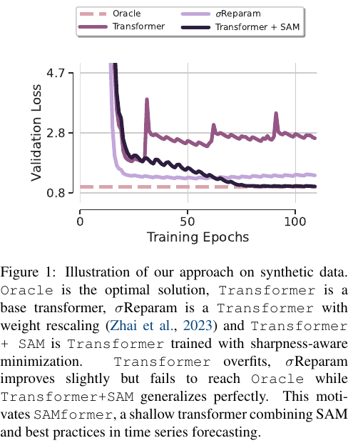
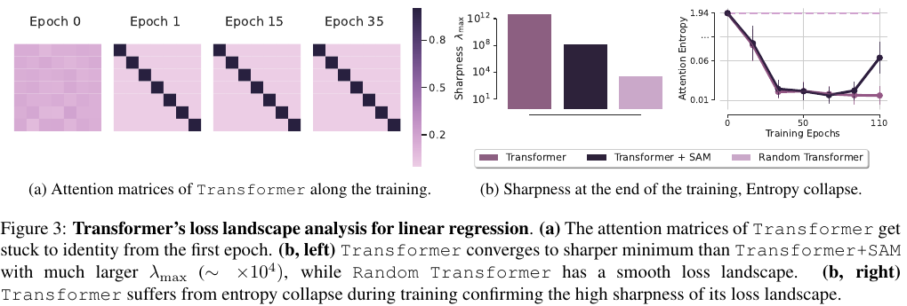
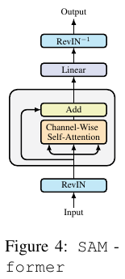
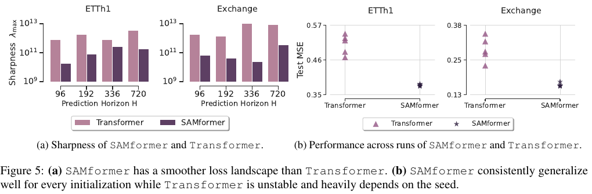
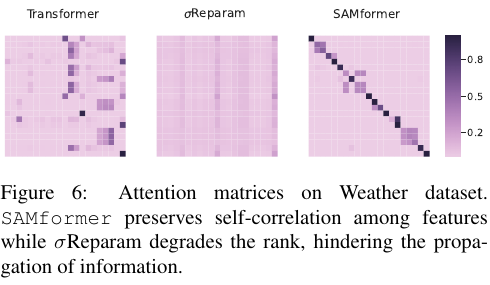

# SAMformer — Transformer가 선형 모델에 지는 건 능력이 아니라 학습 탓이다 (라는 가설)

## 📌 메타 정보

| 항목 | 내용 |
|---|---|
| **논문 제목** | SAMformer: Unlocking the Potential of Transformers in Time Series Forecasting with Sharpness-Aware Minimization and Channel-Wise Attention |
| **저자** | Romain Ilbert*, Ambroise Odonnat*, Vasilii Feofanov, Aladin Virmaux, Giuseppe Paolo, Themis Palpanas, Ievgen Redko (*공동 1저자) |
| **소속** | Huawei Noah's Ark Lab (Paris) / LIPADE, Paris Descartes University |
| **공개일** | 2024-02-15 (arXiv v1) → 2024-06-03 (v3, 최종) |
| **학회** | **ICML 2024 Oral** (PMLR 235) |
| **분야** | Multivariate long-term time series forecasting(다변량 장기 시계열 예측), optimization(최적화) |
| **arXiv abstract** | https://arxiv.org/abs/2402.10198 |
| **arXiv PDF** | https://arxiv.org/pdf/2402.10198 |
| **공식 코드** | https://github.com/romilbert/samformer (TensorFlow 본체 + `samformer_pytorch/` 별도 구현, MIT) |
| **사용한 데이터** | ETTh1/ETTh2/ETTm1/ETTm2, Electricity, Exchange, Traffic, Weather (+ 장난감 합성 데이터) |
| **새로 만든 부품** | 없음. RevIN + channel-wise attention(채널 축 어텐션) + SAM이라는 **기존 부품의 조합** |
| **검증 스크립트** | [code_samformer_verify.py](code_samformer_verify.py) (버그 수치 확인 + ETTh1 재현) |
| **리뷰 시점** | 2026-09-22. 논문 v3 전문 + 저장소 전체 코드 읽음, ETTh1에서 직접 재현 실험 |

---

## 📖 주요 용어 사전 (Glossary)

*이 논문은 "모델 구조"보다 "학습이 어디서 막히는가"를 다룹니다. 그래서 **손실 지형(loss landscape)** 관련 용어를 먼저 잡는 게 중요합니다.*

### 시계열 예측의 기본

| 용어 | 풀이 |
|---|---|
| **look-back window(과거 참조 구간), L** | 예측에 쓰는 과거 길이. 이 논문은 **L=512** 고정 |
| **prediction horizon(예측 길이), H** | 몇 스텝 앞까지 맞히나. {96, 192, 336, 720} |
| **channel / feature(변수), D** | 동시에 기록되는 값의 개수. ETTh1은 7개, Traffic은 862개 |
| **channel-independent(채널 독립)** | 변수마다 따로 예측하고 서로 섞지 않는 방식. DLinear, PatchTST가 이렇다 |
| **RevIN(Reversible Instance Normalization, 되돌릴 수 있는 인스턴스 정규화)** | 입력 창마다 변수별 평균을 빼고 표준편차로 나눠 모델에 넣은 뒤, 출력에 다시 곱하고 더해 되돌림. 시간에 따라 값의 수준이 바뀌는 문제(distribution shift, 분포 이동)를 완화 |

### 모델 부품

| 용어 | 풀이 |
|---|---|
| **channel-wise attention(채널 축 어텐션)** | 어텐션 행렬이 시간×시간(L×L)이 아니라 **변수×변수(D×D)**. 토큰 하나 = 변수 하나의 과거 512칸 전체. iTransformer와 같은 축 |
| **temporal attention(시간 축 어텐션)** | 보통의 Transformer. 토큰 하나 = 시점 하나 |
| **d_m (model dimension, 모델 차원)** | Q, K, V를 만들 때 줄이는 크기. 이 논문은 16 |
| **Oracle(정답 해)** | 장난감 실험에서 최소제곱법(least squares)으로 구한 진짜 최적해 |
| **Random Transformer** | 어텐션 가중치를 무작위로 얼리고 마지막 선형층만 학습한 대조군 |

### 손실 지형과 최적화

| 용어 | 풀이 |
|---|---|
| **loss landscape(손실 지형)** | 가중치를 가로축, 손실을 높이로 본 "산". 학습 = 이 산에서 낮은 곳 찾기 |
| **sharp minimum(날카로운 최솟값)** | 바늘 끝처럼 좁은 골짜기. 조금만 옆으로 가도 손실이 급증 → 일반화가 나쁨 |
| **flat minimum(평평한 최솟값)** | 넓은 분지. 주변 어디든 손실이 낮음 → 일반화가 좋음 |
| **sharpness, λmax(날카로움, 헤시안 최대 고유값)** | 곡률이 가장 급한 방향의 휘어짐 정도. 클수록 날카로움 |
| **entropy collapse(엔트로피 붕괴)** | 어텐션이 한 곳에만 몰려(거의 원-핫) 분포의 엔트로피가 0 근처로 떨어지는 현상 |
| **rank collapse(랭크 붕괴)** | 어텐션 행렬의 행이 전부 비슷해져 사실상 rank 1이 되는 현상. 모든 변수가 똑같은 평균만 받음 |
| **nuclear norm(핵 노름)** | 특이값의 합. rank를 부드럽게 대신 재는 지표 |
| **SAM (Sharpness-Aware Minimization, 날카로움 인지 최소화)** | "내 발밑"이 아니라 "반경 ρ 안의 최악 지점"의 손실을 줄이도록 학습. 평평한 최솟값을 찾음 |
| **ρ (neighborhood size, 이웃 반경)** | SAM이 둘러보는 반경. ρ=0이면 보통의 학습과 같음 |
| **σReparam (sigma reparameterization)** | Zhai et al.(2023). 가중치 행렬을 자기 스펙트럴 노름(최대 특이값)으로 나누고 학습 가능한 스칼라 γ를 곱해, 어텐션 엔트로피 붕괴를 막는 기법 |

### 비교 대상

| 용어 | 풀이 |
|---|---|
| **DLinear** | 추세와 나머지로 분해하고 선형층 두 장만 쓰는 모델. 이 논문의 출발점 → Q3 |
| **TSMixer** | Google의 MLP 기반 모델. 이 논문의 주 경쟁자 |
| **PatchTST / iTransformer** | 16칸 묶음 토큰 Transformer / 변수 축 Transformer. 비교표에는 인용 수치로만 등장 |
| **MOIRAI** | Salesforce의 시계열 파운데이션 모델(사전학습 대형 모델). zero-shot(학습 없이 적용) 수치와 비교 |

---

## 📝 논문 요약 (TL;DR)

**한 줄:** 층 하나짜리 채널 축 Transformer도 **SAM으로 학습하면** 선형·MLP 모델을 이긴다.

- **문제:** 시계열 예측에서 Transformer가 단순한 선형 모델(DLinear)보다 못하다. 표현력 부족이 원인인가?
- **진단:** 정답이 완전히 선형인 장난감 문제에서도 Transformer는 정답에 못 가고, 어텐션을 얼리면 오히려 좋아진다. 원인은 어텐션이 만드는 **날카로운 손실 지형과 엔트로피 붕괴** → 학습이 나쁜 최솟값에 갇힘.
- **처방:** RevIN + channel-wise attention 1층 + 선형층, 그리고 **SAM**. σReparam은 오히려 어텐션 rank를 무너뜨려 실패한다고 주장.
- **검증 주장:** 8개 데이터셋 중 7개 1위, TSMixer 대비 14.33% 개선, 파라미터 약 4배 적음, MOIRAI와 동급.
- **리뷰 결론:** SAM이 어텐션의 학습 불량을 고친다는 **핵심은 재현됨**(ETTh1: 0.398 → 0.374). 그러나 σReparam 비판, sharpness 수치, 파라미터 수는 **코드 버그·누락 위에** 있고, SOTA 주장은 비교 조건이 불공정함 → 🔍 급소.

---

## 🎯 핵심 기여 (Contributions)

1. **진단:** 정답을 표현할 수 있는(명제 2.1) 초간단 Transformer조차 장난감 선형 문제에서 일반화에 실패함을 보이고, 원인을 어텐션으로 좁힘.
2. **처방 비교:** 기존 해결책 두 가지(SAM, σReparam)를 비교해 SAM만 통한다고 보고. σReparam이 어텐션 rank를 떨어뜨린다는 명제 2.2 제시.
3. **모델:** SAMformer = RevIN + channel-wise attention 1층 + 선형 예측층 + SAM. 모든 데이터셋에서 같은 구조.
4. **실험:** 8개 벤치마크, 5 seed 평균, TSMixer와 TSMixer+SAM까지 직접 돌려 비교. MOIRAI와의 비교.

---

## 🧩 주요 알고리즘 설명

### 3.1 장난감 실험 — 정답을 아는 문제로 범인 찾기

*실데이터에서는 "Transformer가 왜 지나"를 가려낼 수 없으니, 정답이 선형으로 정해진 문제를 만들어 모델 탓인지 학습 탓인지 분리한다.*

데이터 생성 (L=512, H=96, D=7, 학습 1만 개 + 검증 5천 개):

```
Y = X · W_toy + ε        (X, W_toy, ε 모두 표준정규 난수)
```
(즉 입력의 각 변수에 같은 선형 변환을 적용하고 노이즈를 조금 더한 것이 정답)

이 문제에 맞춘 Transformer (식 3, 4):

```
f(X) = [ X + A(X) · X · W_V · W_O ] · W
A(X) = softmax( X W_Q W_Kᵀ Xᵀ / √d_m )      ∈ R^(D×D)
```
(즉 입력에 "어텐션이 변수끼리 섞은 값"을 더한 뒤, 마지막 선형층 W로 미래 96칸을 만든다)

W_O=0이면 `f(X) = X·W`가 되어 **선형 모델 그 자체**가 된다. 그래서 명제 2.1: 어텐션 부분을 고정했을 때 `P·W = X·W_toy`를 만족하는 W가 존재할 조건은 rank 조건이고, 이 실험에서는 성립한다. 표현력은 충분하다는 뜻이다.



*Figure 1: 장난감 문제의 검증 손실. Transformer는 과적합하고, σReparam은 조금 나아지지만 Oracle에 못 가며, Transformer+SAM만 Oracle에 도달한다고 논문은 보고.*



*Figure 3: (a) 어텐션이 첫 epoch부터 단위행렬에 고정됨. (b) Transformer의 λmax가 가장 크고 엔트로피가 급락. 단 (b)의 λmax 수치는 측정 코드에 버그가 있음 → 🔍 급소 7.2.*

### 3.2 SAMformer 구조와 텐서 흐름

*장난감 실험에서 쓴 Transformer에 두 가지(RevIN, SAM)만 더한 것이 SAMformer다. 새 모듈은 없다.*



텐서 흐름 (ETTh1, 배치 n):
```
x (n, 7, 512) ─RevIN→ Q=K=(n,7,16), V=(n,7,16)
  softmax(QKᵀ/4) : (n,7,7)   ← 변수끼리의 어텐션
  ×V → W_O(16→512) → +x      : (n,7,512)
  Linear(512→96)             : (n,7,96) ─RevIN⁻¹→ 예측
```

TF 코드 매핑 ([models/base_model.py](https://github.com/romilbert/samformer/blob/main/models/base_model.py)):

```python
self.rev_norm = RevNorm(axis=-2)                                        # 시간축 통계 → 변수별 평균·표준편차
self.attention_layer = layers.MultiHeadAttention(num_heads=1, key_dim=16)  # W_Q, W_K, W_V (512→16), W_O (16→512)
self.dense = layers.Dense(pred_len)                                     # W (512→H)

x = self.rev_norm(x, mode='norm'); x = tf.transpose(x, [0, 2, 1])      # (n, D, L)
x = x + self.attention_layer(x, x)                                      # 채널 축 어텐션 + 잔차
outputs = self.rev_norm(tf.transpose(self.dense(x), [0, 2, 1]), mode='denorm')
```

채널 축을 쓰는 이유 (논문 주장): ① 변수 순서를 바꿔도 결과가 같으므로 positional encoding(위치 인코딩)이 필요 없다. ② 대부분의 데이터에서 D ≤ L이라 어텐션 비용이 작다.

**하이퍼파라미터 (논문 부록 A.1):** Adam, 배치 32, 코사인 스케줄, 300 epoch + early stopping(patience 5), lr은 ETT·Exchange 1e-3 / Electricity·Traffic·Weather 1e-4, d_m=16. ρ는 데이터×horizon별 표 4 값.

### 3.3 SAM — "주변까지 둘러보고 걷기"

*보통의 학습은 발밑 경사만 보니 좁은 골짜기에 빠진다. SAM은 주변의 최악 지점을 기준으로 걸어서 넓은 분지로 간다.*

목적 함수 (식 13):
```
L_SAM(ω) = max_{‖ε‖ ≤ ρ} L_train(ω + ε)
```
(즉 반경 ρ 안에서 가장 나쁜 방향으로 밀었을 때의 손실을 줄인다)

1차 근사로 최악 방향은 `ε̂ = ρ · ∇L / ‖∇L‖`이고, 한 스텝은 두 번의 forward·backward로 이뤄진다.

```python
# samformer_pytorch/samformer/samformer.py:98-106
loss.backward();  optimizer.first_step(zero_grad=True)    # ① 기울기 방향으로 ρ만큼 가중치를 밀기 (w → w+ε)
loss = criterion(network(x), y)
loss.backward();  optimizer.second_step(zero_grad=True)   # ② 밀린 지점의 기울기로, 원래 w에서 Adam 한 걸음
```

논문 관찰: 시계열에서는 컴퓨터 비전(보통 ρ=0.05)보다 **훨씬 큰 ρ(0.5~1.0)**가 필요하다.

### 3.4 σReparam과 명제 2.2 (논문의 주장)

*"다른 처방(σReparam)은 왜 안 되나"를 설명하려는 절. 다만 실험 근거는 구현 버그로 무너진다 → 🔍 급소 7.1.*

σReparam은 각 가중치를 `Ŵ = γ · W / ‖W‖₂`로 바꾼다 (식 5). 명제 2.2: `W_Q W_Kᵀ`가 대칭 양반정치(PSD)라고 가정하면

```
‖X W_Q W_Kᵀ Xᵀ‖_* ≤ ‖W_Q W_Kᵀ‖₂ · ‖X‖_F²
```
(즉 σReparam이 가중치의 스펙트럴 노름을 줄이면 어텐션 점수 행렬의 nuclear norm 상한도 줄어 rank가 낮아진다)

가정(W_Q W_Kᵀ가 대칭 PSD)은 W_Q=W_K일 때나 성립하는 강한 조건이다.

---

## 📊 실험 요약

### 4.1 메인 결과 (Table 1 발췌, test MSE, 5 seed 평균)

*논문의 SOTA 주장의 근거. 단 SAMformer·TSMixer·Transformer만 직접 돌렸고 나머지는 인용 수치다.*

| 데이터 | H | SAMformer | TSMixer+SAM | Transformer | TSMixer | iTrans† | PatchTST† | FED* |
|---|---|---:|---:|---:|---:|---:|---:|---:|
| ETTh1 | 96 | 0.381 | 0.388 | 0.509 | 0.398 | 0.386 | 0.414 | **0.376** |
| ETTh1 | 720 | **0.427** | 0.440 | 0.601 | 0.498 | 0.503 | 0.500 | 0.469 |
| ETTm2 | 96 | 0.181 | 0.190 | 0.200 | 0.211 | 0.180 | **0.175** | 0.180 |
| Electricity | 96 | **0.155** | 0.171 | 0.182 | 0.173 | − | − | 0.186 |
| Exchange | 96 | 0.161 | 0.233 | 0.292 | 0.343 | **0.086** | 0.088 | 0.139 |
| Traffic | 96 | 0.407 | 0.409 | 0.420 | 0.409 | **0.395** | 0.462 | 0.576 |
| Weather | 96 | 0.197 | 0.189 | 0.227 | 0.214 | **0.174** | 0.177 | 0.238 |

†: Liu et al.(2024)에서 인용 (L=96), *: Chen et al.(2023)에서 인용.
논문이 밝힌 전체 개선율: TSMixer+SAM 대비 5.25%, TSMixer 14.33%, Transformer 16.96%, iTransformer 3.94%, PatchTST 11.13%, FEDformer 12.36%.

### 4.2 보조 결과

*메인 표 외에 "왜 좋은가"를 받치려는 실험들.*

| 실험 | 논문 주장 | 리뷰 판정 |
|---|---|---|
| Fig 5a sharpness | SAMformer의 λmax가 한 자릿수 이상 작음 | 측정 공식 버그 → 7.2 |
| Fig 5b seed 안정성 | Transformer는 seed마다 흔들리고 SAMformer는 안정 | 우리 재현에서도 SAM이 분산을 줄임 ✓ |
| Fig 6, 7 어텐션 모양 | SAMformer는 대각선 강조, σReparam은 rank 1 | σReparam 부분은 구현 버그 → 7.1 |
| Table 2 vs MOIRAI | 평균 1.1~7.6% 우위 | full-shot vs zero-shot 비교 → 7.9 |
| Table 9 시간 축 어텐션 | 채널 축이 MSE 12.97% 우위 | 유효. 단 SAM 없는 Transformer끼리 비교 |
| Table 10 Identity Attention | 어텐션을 단위행렬로 고정하면 11.93% 나쁨 | SAM 적용 여부 불명, 분산 이상 → 7.9 |
| Fig 14 ρ 민감도 | ρ ≥ 0.7이면 TSMixer보다 낮음 | y축이 test MSE → 7.6 |



*Figure 5: (a) 논문의 sharpness 비교 — 10⁹~10¹³ 규모의 수치 자체가 측정 버그의 흔적. (b) seed별 test MSE.*



*Figure 6: Weather의 어텐션 행렬. 가운데 σReparam의 "행이 전부 같은" 모양은 구현 버그로 재현되는 모양이다 (7.1 실측).*

---

## 🔍 급소 — 확인된 문제들

*저장소를 직접 받아 읽고 수치를 재계산·재실험해서 확인한 것들. 이 논문을 인용하거나 재현하기 전에 먼저 알아야 한다.*

### 7.1 [코드 버그] σReparam 구현이 가중치가 아니라 입력을 나눈다 ⭐⭐

*논문의 "σReparam은 실패한다" 결론 전체가 이 구현에 기대고 있어서 가장 중요하다.*

[models/utils/spectral_norm.py:61-64](https://github.com/romilbert/samformer/blob/main/models/utils/spectral_norm.py)
```python
query = self._normalize_weights(query) * self.gamma   # query는 입력 텐서 x
key   = self._normalize_weights(key)   * self.gamma
value = self._normalize_weights(value) * self.gamma
```

원래 σReparam은 W_Q, W_K 같은 **가중치 행렬**을 자기 스펙트럴 노름으로 나눈다. 이 코드는 **입력 x (n, 7, 512)**를 배치 전체의 최대 특이값 하나로 나누고, 가중치는 건드리지 않는다.

ETTh1 배치로 실측한 결과:

| | attention entropy(어텐션 엔트로피) | nuclear norm | 행 안의 최대−최소 |
|---|---:|---:|---:|
| 정상 입력 | 1.40 | 2.62 | 0.43 |
| 저장소의 σReparam | **1.9459** (균일분포 = log 7 = 1.9459) | **1.00** (rank 1) | 0.0003 |

배치 최대 특이값이 약 46이라 어텐션 logit이 약 46²배 줄어든다. 그래서 **어텐션이 완전히 균일해지고**, value도 같이 줄어 어텐션 출력이 사실상 사라진다. 논문이 "σReparam은 행이 거의 같은 rank-1 어텐션을 만든다"(Fig 6, 12b)고 보고하고 명제 2.2로 설명한 현상이 바로 이 버그로 설명된다. γ가 학습 가능해 이론상 보상할 수 있지만 1에서 출발한다. "학습시간이 크게 늘어난다"(Fig 11)도 배치마다 입력 전체를 SVD한 비용으로 보인다. 원래 σReparam은 power iteration 한 번이면 된다.

→ **Fig 1, 6, 7, 8, 11, 12의 σReparam 비교 결론은 모두 근거를 잃는다.** 명제 2.2의 수학 자체는 별개지만, 그것을 받치던 실험 증거가 사라진다.

### 7.2 [코드 버그] sharpness(λmax) 측정 공식이 틀렸다 ⭐

*"SAMformer가 더 평평하다"는 핵심 서사의 직접 증거가 이 수치라서 중요하다.*

[utils/model_utils.py `power_iteration`](https://github.com/romilbert/samformer/blob/main/utils/model_utils.py):
- 고유값 추정(Rayleigh quotient)은 v와 Hv의 내적이어야 하는데, 코드는 **기울기 g와 Hv의 내적**을 쓴다.
- `tf.keras.losses.mean_squared_error`는 마지막 축만 평균하므로 손실이 스칼라가 아닌 (N, D) 텐서가 되고, gradient 계산 때 **샘플 수만큼 합산**된다.

헤시안을 정확히 아는 선형 회귀로 실측: 참 λmax 0.343, 저장소 공식 4,757 → **약 13,883배**. Fig 3b와 5a의 10⁹~10¹³ 같은 값은 이렇게 나온 숫자다. 게다가 g에 비례하므로 학습 끝의 기울기 크기가 "평평함"에 섞여 들어가 모델 간 상대 비교도 믿기 어렵다.

### 7.3 [코드] 분석 그림은 실제 SAMformer로 그린 것이 아니다

*그림이 보여주는 모델과 표의 모델이 다르면 그림으로 표를 설명할 수 없다.*

```python
use_revin = not (args.data == 'toy' or args.add_results)
'use_revin': use_revin and args.model != 'transformer_random'
```
어텐션 행렬·sharpness를 저장하는 `-a` 플래그를 켜면 **RevIN이 꺼진다.** README 예시(`-u -a`)도 이 상태다. 따라서 Fig 3, 5a, 6, 7, 12는 RevIN 없는 모델이다. Random Transformer는 실데이터에서도 항상 RevIN 없이 돈다.

### 7.4 [코드] TSMixer 기준선이 원본과 다르다

*주 경쟁자가 약화된 채 비교되면 개선율이 부풀려진다.*

[models/tsmixer_rev_in.py:48-52](https://github.com/romilbert/samformer/blob/main/models/tsmixer_rev_in.py)에서 Dense, BatchNorm 층을 `__init__`에서 한 번만 만들고 `res_block`마다 재사용한다. 결과적으로 **모든 블록이 가중치를 공유**한다. 원본 TSMixer(functional API)는 블록마다 새 층을 만든다.

### 7.5 [논문 오류] 파라미터 표(Table 8)에서 어텐션이 빠졌다

*"약 4배 가볍다"는 셀링 포인트의 근거.*

| H | 논문 SAMformer | 실제 (Keras MHA + Dense + RevIN) | Linear만 |
|---|---:|---:|---:|
| 96 | 50,272 | **82,590** | 49,248 |
| 192 | 99,520 | **131,838** | 98,496 |
| 336 | 173,392 | **205,710** | 172,368 |
| 720 | 369,904 | **402,702** | 369,360 |

논문 수치에서 Linear만 빼면 1,024개가 남는데(H=720에서는 544개로 일관성도 없음), 어텐션 Q/K/V/O의 **33,328개**(= 3 × (512×16+16) + (16×512+512))가 통째로 빠져 있다. 실제 수치로 다시 계산하면 "TSMixer보다 3.72배 적다"는 **2.68배**가 되고, 조합에 따라 1.10배까지 내려간다. 논문의 TSMixer 수치도 저장소 코드로는 재현되지 않는다. temporal Dense 하나만 512×512로 26만 개다.

### 7.6 [실험 설계] 비교 조건이 공정하지 않다 ⭐

*SOTA 주장이 성립하는지는 "같은 조건에서 비교했나"에 달려 있다.*

**① lookback 길이가 다르다.** SAMformer는 L=512인데 iTransformer·PatchTST 수치는 Liu et al.(2024)에서 **L=96으로 돌린 것을 인용**했다. 긴 과거를 보는 게 장점인 PatchTST를 자기 최적 조건 밖에서 비교한 셈이다. 각자 논문의 L=336 수치와 비교하면:

| H=96 MSE | Weather | Traffic | Electricity |
|---|---:|---:|---:|
| SAMformer (L=512) | 0.197 | 0.407 | 0.155 |
| PatchTST/42 (L=336) | **0.152** | **0.367** | **0.130** |
| DLinear (L=336) | 0.176 | 0.410 | **0.140** |

**선형 모델 DLinear가 Weather·Electricity에서 SAMformer를 이긴다.** 논문은 DLinear를 출발점으로 삼았고 코드에 `linear` 모드도 있는데 Table 1에 선형 기준선이 없다.

**② Table 1이 본문 주장과 맞지 않는다.**
- "iTransformer는 Exchange 말고는 다 진다" → 표 자체에서 Traffic-96, Weather-96, Weather-192는 iTransformer가 이김.
- "Exchange 말고는 모든 칸에서 1~2위" → ETTm2-96은 4위(PatchTST 0.175), Weather-192는 5위.
- iTransformer의 Electricity 칸이 "−". 원논문에는 있고, 평균 0.178로 SAMformer 평균 0.181보다 좋다.

**③ 개선율을 재계산하면 맞지 않는다.** TSMixer+SAM 대비 5.25%는 "합계의 비율" 방식으로 정확히 재현된다. 같은 방식으로 iTransformer는 **2.06%**(논문 3.94%), Exchange를 빼면 **6.19%**(논문 8.38%). Exchange를 빼면 TSMixer+SAM 대비 개선도 **2.70%**로 줄어든다.

**④ ρ를 테스트 세트로 고른 것으로 보인다.** Table 4의 "최고 성능을 낸 ρ"는 데이터×horizon 32칸마다 다르고, ρ 스윕을 보여주는 Fig 14의 y축은 **test MSE**다. 검증 세트로 골랐다는 언급이 없다. "하이퍼파라미터가 적다"는 주장과도 충돌한다.

### 7.7 [논문 ↔ 코드 괴리] 설정 불일치

*재현하려는 사람이 논문 부록만 믿으면 다른 실험을 하게 된다.*

| 항목 | 논문 | 코드 |
|---|---|---|
| epoch | 300 | 기본값 100 (run_script가 값을 넘기지 않음) |
| ρ | 데이터×horizon별 최적값 (Table 4) | 0.7 고정 |
| 코사인 스케줄 | "cosine annealing" | **5 epoch 주기로 재시작** (`epoch % 5`) |
| 5 seed | 5회 반복 | `num_runs=1`, `--seed`는 toy 데이터 말고는 안 쓰임 |
| 분할 (ETT 외) | 70/20/10 | 70/**10/20** (코드가 표준, 논문 서술이 틀림) |

### 7.8 [코드] PyTorch 버전은 다른 모델이다

*README가 PyTorch 구현을 공식처럼 소개하므로, 이걸 쓰는 사람은 논문과 다른 모델을 돌리게 된다.*

[samformer_pytorch/samformer/samformer.py:19-22](https://github.com/romilbert/samformer/blob/main/samformer_pytorch/samformer/samformer.py)는 `compute_values = Linear(L, L)`이고 W_O가 없다. 파라미터가 **328,334개**(H=96)로 논문 구조의 4배이고, 논문의 TSMixer보다도 크다. 데모 프로토콜도 다르다: 배치 256, weight decay 1e-5, 100 epoch 고정, 검증·early stopping·스케줄러 없음. 이 데모 그대로 돌린 결과는 선형 모델보다 나쁘다 → 8장.

### 7.9 [사소] 그 밖의 문제

- "모든 결과가 RevIN 사용"이라 해놓고, A.3에서는 Exchange 기준선이 원논문 수치(RevIN 없음)라고 밝혀 자기모순.
- MOIRAI 비교는 full-shot(해당 데이터로 직접 학습)과 zero-shot(학습 없이 적용)의 비교다.
- Identity Attention(Table 10)은 거의 선형인 모델인데 표준편차가 ±0.059~0.107로 이상하게 크다. SAM을 썼는지도 적혀 있지 않다.

---

## 🛠 재현 실험 (ETTh1, H=96, seed 3개)

*논문의 핵심 인과("어텐션이 학습을 망치고 SAM이 고친다")가 실제로 성립하는지, 그리고 논문에 빠진 선형 기준선과 비교하면 어떤지 확인한다.*

**설정 A — 논문 구조 그대로:** W_V 512×16, W_O 16×512, Adam lr 1e-3, 배치 32, 검증 기반 early stopping(patience 5), 최대 100 epoch. [code_samformer_verify.py](code_samformer_verify.py) `faithful` 모드.

| 모델 | seed별 test MSE | 평균 |
|---|---|---:|
| 선형 + RevIN | 0.3794 / 0.3817 / 0.3779 | 0.380 |
| 선형 + RevIN + SAM (ρ=0.5) | 0.3811 / 0.3834 / 0.3801 | 0.382 |
| 선형 + RevIN + SAM (ρ=0.9) | 0.3827 / 0.3848 / 0.3819 | 0.383 |
| Transformer (SAM 없음) | 0.3972 / 0.3956 / 0.4011 | 0.398 |
| **SAMformer (ρ=0.5)** | 0.3739 / 0.3738 / 0.3729 | **0.374** |
| **SAMformer (ρ=0.9)** | 0.3744 / 0.3744 / 0.3724 | **0.374** |
| (논문 보고 SAMformer) | | 0.381 |

**설정 B — 저장소 PyTorch 데모 그대로** (`samformer_pytorch/run_demo.py`의 하이퍼파라미터):

| 모델 | 평균 test MSE |
|---|---:|
| 데모 SAMformer, SAM 없음 (ρ=0) | 0.471 |
| 데모 SAMformer, ρ=0.5 | 0.417 |
| 같은 프로토콜의 선형 + RevIN (ρ=0 / 0.5) | **0.371** / 0.372 |

**해석:**
- 어텐션을 붙이면 나빠지고(0.380 → 0.398), SAM이 그 손상을 고친 뒤 선형보다 조금 나아진다(0.374). **논문의 진짜 기여이고, 재현됐다.**
- SAM은 선형 모델에는 효과가 없다. 선형은 손실 지형이 원래 평평하니 논문의 설명과 맞는다.
- 선형 대비 이득은 **1.6%** 정도. 논문의 SAMformer 수치(0.381)는 선형 + RevIN(0.380)과 거의 같다.
- PyTorch 데모는 논문 결과를 재현하는 코드가 아니다.
- 한계: 데이터셋 1개, horizon 1개, seed 3개의 좁은 확인이다.

---

## 💬 Q&A

### Q1. ETTh1이 뭐야?

시계열 예측 논문에서 거의 빠지지 않고 쓰는 **표준 벤치마크 데이터셋**이다.

#### 이름 풀이

**E**lectricity **T**ransformer **T**emperature, **h**ourly, **1**번 = 전력 변압기 온도, 1시간 간격, 1번 관측소

여기서 Transformer는 딥러닝 모델이 아니라 **전봇대에 달린 변압기**다. SAMformer 논문에 "Transformer"가 두 뜻으로 나오는 셈이라 헷갈리기 쉽다.

#### 무엇이 들어 있나

중국의 한 지역 변압기에서 2016년 7월 1일부터 2018년 6월 26일까지 약 2년 동안 **1시간마다 기록한 값 7개**. 행은 17,420개.

| 열 | 뜻 |
|---|---|
| HUFL, HULL | 고압(High) 쪽 부하. 유효(Useful)와 무효(Useless) 전력 |
| MUFL, MULL | 중간(Middle) 부하. 유효와 무효 |
| LUFL, LULL | 저압(Low) 부하. 유효와 무효 |
| **OT** | **Oil Temperature**, 변압기 기름 온도. 원래 예측하려던 목표 |

실제 첫 줄:
```
2016-07-01 00:00:00, 5.83, 2.01, 1.60, 0.46, 4.20, 1.34, 30.53
```

#### 형제 데이터셋

| 이름 | 관측소 | 간격 | 행 수 |
|---|---|---|---:|
| ETTh1 / ETTh2 | 1번 / 2번 | 1시간 | 17,420 |
| ETTm1 / ETTm2 | 1번 / 2번 | 15분 | 69,680 |

네 개를 묶어 "ETT"라고 부른다. 원출처는 Informer 논문(Zhou et al., AAAI 2021).

#### 이 논문과 연결하면

- **D=7, L=512, H=96의 뜻:** 변수 7개의 과거 512시간(약 21일)을 보고 다음 96시간(4일)을 7개 변수 모두 예측. 채널 어텐션 행렬이 7×7이었던 이유다.
- **데이터 분할:** 앞 12개월 학습, 다음 4개월 검증, 그다음 4개월 테스트.
- **평가 기준:** MSE는 학습 구간 기준으로 표준화한 값에서 잰 것이다. 그래서 0.38 같은 숫자는 원래 단위(온도, 부하)가 아니라 "표준편차 단위"의 오차다.
- **작은 데이터라는 점:** 변수 7개에 학습 샘플이 약 8천 개뿐이다. 그래서 큰 모델이 과적합하기 쉽고, 선형 모델이 강한 대표적인 데이터셋이다. 재현 실험에서 선형 + RevIN이 0.380으로 버틴 이유와 이어진다.

### Q2. "Transformer가 DLinear보다 못한 건 표현력이 아니라 학습이 나쁜 최솟값에 갇히기 때문"이라는 가설을 쉽게 예를 들어 설명해줘

#### 1. 두 가지 가능한 설명

Transformer가 DLinear보다 성적이 나쁠 때 떠올릴 수 있는 원인은 두 가지다.

| 가설 | 비유 | 뜻 |
|---|---|---|
| **expressiveness(표현력) 부족** | 계산기에 루트 버튼이 아예 없다 | 이 모델로는 정답 함수를 만들 수가 없다 |
| **trainability(학습 가능성) 문제** | 루트 버튼은 있는데 사용자가 못 찾았다 | 만들 수는 있는데 학습이 거기까지 못 간다 |

논문은 두 번째라고 주장한다.

#### 2. 왜 표현력 문제가 아니라고 할 수 있나

SAMformer의 구조를 말로 쓰면:

> 출력 = (입력 + 어텐션이 섞은 값) × 선형층

어텐션 쪽 가중치 W_O를 전부 0으로 두면 "어텐션이 섞은 값"이 0이 되어

> 출력 = 입력 × 선형층

이 되는데, 이건 **선형 모델 그 자체**다.

즉 Transformer는 선형 모델을 **특수한 경우로 품고 있다.** 선형 모델이 할 수 있는 건 전부 할 수 있으니 이론상 선형 모델보다 나쁠 수 없다. 그런데 실제로는 나쁘다. 그렇다면 남는 설명은 "정답이 모델 안에 있는데 학습이 그걸 못 찾았다"뿐이다.

#### 3. 논문의 장난감 실험: 정답을 아는 문제

이 가설을 확인하려고 논문은 **정답이 완전히 선형인 가짜 데이터**를 만든다 (방식 → 3.1).

1. 무작위 입력 X를 만든다
2. 정해둔 행렬 W_toy를 곱하고 노이즈를 조금 더해 Y를 만든다
3. 모델에게 X를 주고 Y를 맞히게 한다

| 모델 | 결과 |
|---|---|
| Oracle (정답) | 가장 낮은 오차 |
| Transformer (전부 학습) | **정답에 못 감. 과적합** |
| Random Transformer (어텐션을 무작위로 얼리고 선형층만 학습) | 더 나음 |

학습할 수 있는 부분을 **줄였더니 오히려 좋아졌다.** 표현력이 문제였다면 정반대 결과가 나와야 한다. 그래서 논문은 "어텐션이 학습을 방해한다"고 결론 내린다.

#### 4. "나쁜 최솟값에 갇힌다"는 게 무슨 뜻인가

**산속에서 눈 가리고 제일 낮은 곳 찾기.** 학습(gradient descent, 경사하강법)은 **눈을 가리고 발밑 경사만 느끼면서 계속 내리막으로 걷는 것**과 같다. loss landscape(손실 지형)가 산이고, 손실이 낮을수록 땅이 낮다.

```
 날카로운 골짜기 (sharp minimum)      넓은 분지 (flat minimum)

        \      /                      \                    /
         \    /                        \                  /
          \  /                          \________________/
           \/  ← 바늘 끝처럼 좁음            ← 넓고 평평함
```

- **선형 모델의 지형:** 사발 하나처럼 생겨서 어디서 출발해도 바닥에 도착한다. 갇힐 곳이 없다.
- **Transformer의 지형:** 어텐션의 softmax 때문에 울퉁불퉁하고 **좁고 날카로운 골짜기**가 많다. 처음 떨어진 골짜기에 그냥 주저앉는다.

**날카로운 골짜기가 왜 나쁜가.** 학습 데이터와 테스트 데이터는 조금 다르다. 이건 **지형이 옆으로 살짝 밀리는 것**과 같다.

- **넓은 분지**에 있으면 지형이 밀려도 여전히 바닥 근처다. 테스트 오차도 낮다.
- **바늘 끝 골짜기**에 있으면 조금만 밀려도 절벽 중턱이 된다. 테스트 오차가 튄다.

시험공부에 비유하면, 날카로운 최솟값은 **기출문제 답을 통째로 외운 상태**다. 숫자 하나만 바뀌어도 틀린다. 넓은 최솟값은 **원리를 이해한 상태**다.

**어텐션이 어떻게 가두나: softmax 포화(saturation).** 논문은 학습 첫 epoch부터 어텐션 행렬이 단위행렬(자기 자신만 보는 상태)에 붙어서 움직이지 않는다고 관찰한다(entropy collapse, Fig 3a). softmax로 예를 들면:

| 어텐션 점수 | softmax 결과 |
|---|---|
| [1, 0, 0] | [0.58, 0.21, 0.21] ← 점수를 바꾸면 결과도 잘 바뀜 |
| [10, 0, 0] | [0.9999, 0.00005, 0.00005] ← 점수를 좀 바꿔도 결과가 거의 안 바뀜 |

두 번째 상태가 되면 기울기가 거의 0이 된다. 발밑 경사가 안 느껴지니 **거기서 더 걸어 나갈 수가 없다.** 이게 "갇힌다"의 실체다.

#### 5. 처방: SAM은 "주변까지 둘러보고 걷기"

보통 학습은 "내 발밑이 낮은가?"만 본다. SAM은 **"내 주변 반경 ρ 안에서 가장 높은 곳도 낮은가?"**를 기준으로 걷는다 (식과 코드 → 3.3).

- 바늘 끝 골짜기는 한 발짝만 옆이 절벽이라 SAM 기준으로 나쁜 자리다. 그래서 떠난다.
- 넓은 분지는 주변 어디든 낮으니 좋은 자리로 판단하고 머문다.

한 걸음마다 먼저 "가장 나쁜 방향으로 살짝 가보고", 그 지점의 경사로 실제 걸음을 정한다. 그래서 계산이 두 배 든다.

#### 6. 재현 실험으로 보면 (ETTh1, 논문 구조 그대로)

| 모델 | test MSE | 해석 |
|---|---:|---|
| 선형 + RevIN | 0.380 | 사발 지형이라 잘 찾음 |
| Transformer (SAM 없음) | **0.398** | 선형을 품고 있는데도 **더 나쁨** → 학습 실패 |
| Transformer + SAM | **0.374** | 갇힌 곳을 빠져나오자 선형보다 조금 나음 |
| 선형 + SAM | 0.382 | 원래 갇힐 곳이 없으니 효과 없음 |

네 줄이 가설과 딱 맞게 나온다. 특히 **"SAM이 Transformer에는 듣고 선형에는 안 듣는다"**가 가장 좋은 증거다. 문제가 모델의 능력이 아니라 학습 과정(지형)에 있었다는 뜻이기 때문이다. (seed별 수치 → 재현 실험 절)

#### 7. 다만 주의할 점

- 논문이 "날카롭다"의 직접 증거로 내민 sharpness 수치(λmax)는 **측정 코드가 틀렸다**(→ 7.2). 그래서 "지형이 날카롭다"는 직접 측정이 아니라 "SAM이 효과가 있다"는 간접 증거로 받쳐지는 가설이다.
- 학습을 고쳐도 선형 대비 이득은 1.6% 정도다. "Transformer가 잠재력이 크다"기보다 **"Transformer가 선형보다 못했던 건 학습 탓이었고, 고치면 선형과 비슷하거나 조금 낫다"** 정도로 읽는 게 정확하다.

### Q3. DLinear가 뭐야?

#### 한 줄 정의

**DLinear = Decomposition(분해) + Linear(선형층).** 시계열을 **trend(추세)**와 **seasonal(나머지, 계절성)** 두 조각으로 나누고, 조각마다 **선형층 하나씩**을 붙여 예측한 뒤 더하는 모델. 은닉층도 어텐션도 없다.

출처는 Zeng et al., *"Are Transformers Effective for Time Series Forecasting?"* (AAAI 2023). 제목 자체가 "Transformer가 정말 효과가 있나?"라는 도발이다.

#### 동작을 예로 보기

어느 도시의 기온을 1시간 간격으로 336시간(2주) 보고, 다음 96시간(4일)을 맞힌다고 하자.

**① 분해: moving average(이동평균)로 추세를 뽑는다**

```
원래 기온:   ~~/\~~/\~~/\~~/\   (하루 주기로 오르내리면서 전체는 서서히 상승)
              │
              ├─ 이동평균(25칸) →  추세:      ______/‾‾‾   (서서히 오르는 큰 흐름)
              │
              └─ 원래 − 추세    →  나머지:    /\/\/\/\/\   (하루 주기의 출렁임)
```

이동평균은 앞뒤 25시간의 평균이라 빠른 출렁임은 지워지고 느린 흐름만 남는다. 원래 값에서 추세를 빼면 출렁임만 남는다.

**② 조각마다 선형층 하나**

- 추세 336칸 → Linear → 추세 예측 96칸
- 나머지 336칸 → Linear → 나머지 예측 96칸

선형층은 "미래 각 시점 = 과거 336개 값의 가중합"이다. 예를 들면 "내일 오후 3시 기온 = 오늘 오후 3시 × 0.6 + 어제 오후 3시 × 0.3 + …" 같은 식이고, 이 가중치를 학습한다.

**③ 더하기**

> 최종 예측 = 추세 예측 + 나머지 예측

#### 코드로 보면 거의 이게 전부

```python
trend    = moving_avg(x, kernel=25)     # (배치, 336, 변수 수)
seasonal = x - trend
out = Linear_trend(trend) + Linear_seasonal(seasonal)   # 시간축 336 → 96
```

**파라미터 수:** L=336, H=96이면 선형층 두 개로 약 **6.5만 개**. SAMformer는 8.3만 개, Transformer 계열 예측 모델은 보통 수백만 개.

#### 특징 두 가지

| 특징 | 뜻 |
|---|---|
| **channel-independent(채널 독립)** | ETTh1의 7개 변수를 각각 따로 예측. 기온을 예측할 때 부하 값은 보지 않는다. 기본 설정에서는 7개 변수가 같은 선형층을 공유 |
| **시간축 선형** | 시간 방향으로만 가중합. 비선형 함수가 하나도 없다 |

#### 왜 유명해졌나

당시(2022년) 시계열 예측은 Informer, Autoformer, FEDformer 같은 Transformer 변형이 주류였다. DLinear는 선형층 두 장으로 **그들을 대부분의 벤치마크에서 20~50% 이겼다.** 더 날카로운 관찰도 있었다.

- 과거를 **더 길게 보여주면** 선형 모델은 좋아지는데 Transformer들은 오히려 나빠지거나 그대로였다.
- 정보를 더 줬는데 못 쓴다는 건, Transformer가 긴 과거에서 패턴을 뽑는 게 아니라 **과적합하고 있다**는 신호다.

#### 그 뒤의 흐름: DLinear에 대한 반박들

| 논문 | 반박 방식 |
|---|---|
| **PatchTST** (2023) | 점 하나가 아니라 **16칸 묶음(patch)**을 토큰으로 쓰고 채널 독립을 가져다 쓰자 Transformer가 다시 이김 |
| **iTransformer** (2024) | 어텐션을 **변수 축**으로 돌림 |
| **SAMformer** (2024) | 문제는 구조가 아니라 **학습**이다. SAM으로 고치면 된다 |

7.6에서 "DLinear가 Weather·Electricity에서 SAMformer보다 좋다"고 한 게 이 맥락이다. 반박 논문이 정작 **출발점이 된 선형 모델**과의 공정 비교를 빠뜨린 셈이다.

#### 참고: 같은 논문의 형제들 (LTSF-Linear)

- **Linear:** 분해 없이 선형층 하나
- **NLinear:** 입력에서 **마지막 값을 빼고** 선형층을 적용한 뒤 다시 더함. 값의 수준이 바뀌는 분포 이동에 강함
- **DLinear:** 추세와 나머지로 분해한 뒤 선형층 두 개

NLinear의 "빼고 다시 더하기"는 SAMformer에 쓰인 RevIN(평균을 빼고 표준편차로 나눈 뒤 다시 되돌리기)과 같은 발상의 간단한 버전이다. 그래서 재현 실험의 "선형 + RevIN"은 사실상 NLinear나 DLinear와 같은 계열의 기준선이다.

---

## 🎓 무엇을 가져갈 것인가

*인용하거나 설계에 참고할 때 무엇을 믿고 무엇을 걸러야 하는지 정리한다.*

| 남는 것 | 무너지는 것 |
|---|---|
| 얕은 어텐션 모델은 학습이 나쁜 최솟값에 갇히고, SAM이 이를 실제로 고친다 (재현됨) | σReparam 비판: 구현이 입력을 나누는 버그 (7.1) |
| 채널 축 어텐션은 가볍고 위치 인코딩이 필요 없다 | sharpness 수치: g·Hv에 샘플 합산까지 겹친 공식 (7.2) |
| 장난감 문제로 원인을 좁혀가는 진단 방식 | "4배 적은 파라미터": 어텐션 누락, 실제 2.68배 (7.5) |
| 시계열에서는 ρ가 비전보다 훨씬 커야 한다는 관찰 | SOTA 주장: lookback 불일치, 선형 기준선 누락, 표↔본문 불일치, test로 ρ 선택 의심 (7.6) |

**실무 결론:** "어텐션을 쓸 거라면 SAM을 같이 써라"는 교훈으로 유효하다. 하지만 모델 자체는 선형 + RevIN에 작은 채널 혼합을 더한 정도이고, 공정 조건에서는 PatchTST에 뒤지며 DLinear와 비슷한 수준으로 보는 게 맞다.

---

## 🧾 한 줄 요약 (전체)

**SAMformer는 "Transformer가 선형 모델에 지는 건 능력이 아니라 학습 탓"이라는 가설을 SAM으로 입증한 논문이다. 그 핵심 인과는 재현되지만(ETTh1: 0.398 → 0.374, 선형 0.380), σReparam 비판·sharpness 수치·파라미터 수는 코드 버그와 누락 위에 서 있고 SOTA 주장은 불공정한 비교에 기댄다.**

---

## 🔗 관련 문서 / 메모리

- [PAPER_PatchTST.md](PAPER_PatchTST.md) — L=336/512 수치, 채널 독립 원조
- [PAPER_iTransformer.md](PAPER_iTransformer.md) — 같은 변수 축 어텐션, lookback 96 고정 문제
- [PAPER_TimesFM.md](PAPER_TimesFM.md), [PAPER_Chronos.md](PAPER_Chronos.md) — 시계열 파운데이션 모델 쪽 흐름 (MOIRAI 비교 맥락)
- [code_samformer_verify.py](code_samformer_verify.py) — 7.1, 7.2, 7.5 실측과 재현 실험 스크립트
