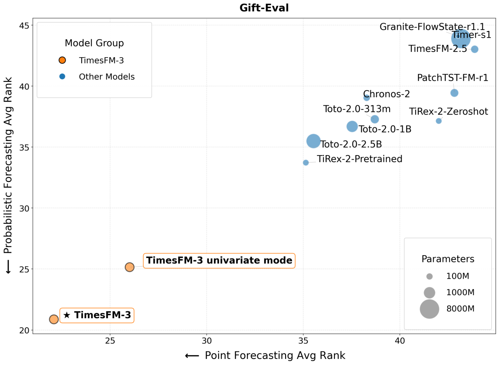
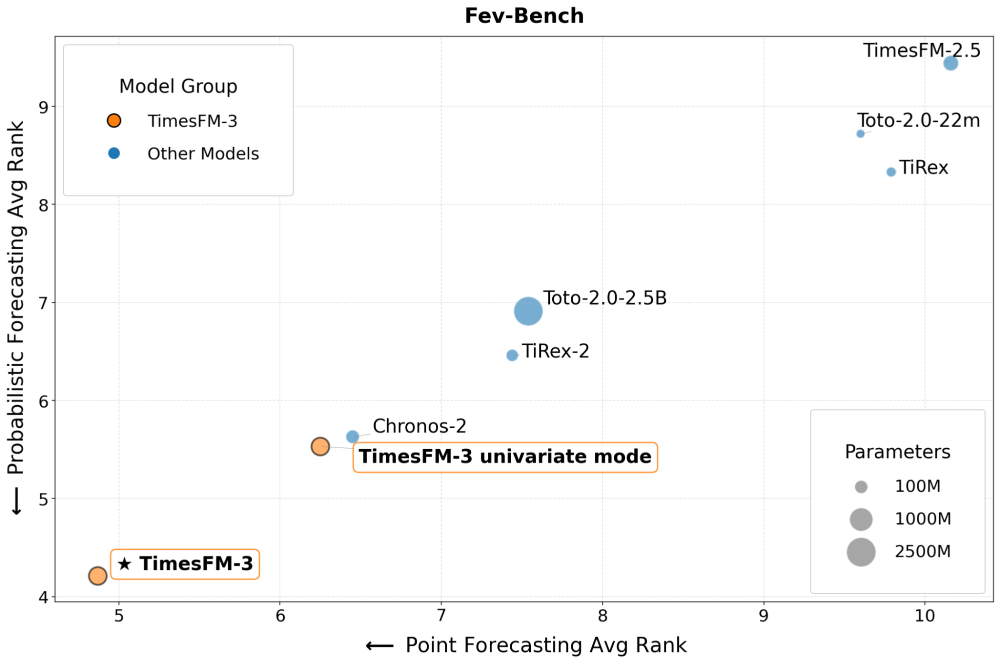
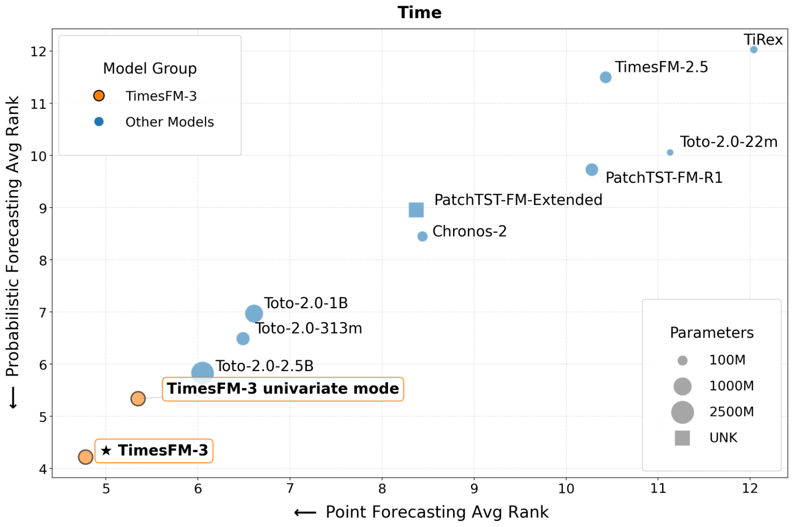
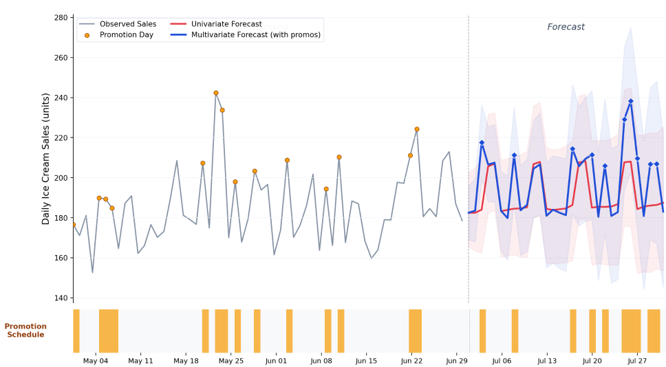

# TimesFM 3.0 — 공식 블로그 · 저장소 코드 · 벤치마크 원시 결과 교차 검증

> 3.0은 **논문도 technical report도 없다.** 공식 블로그 1편(2026-08-31), 공식 저장소 코드, 공개 벤치마크 원시 CSV를 서로 맞대어 만든 문서다.
> 1.0 논문(2310.10688)과 In-Context Fine-Tuning(ICF, 2410.24087) 정리는 [PAPER_TimesFM.md](PAPER_TimesFM.md).

---

## 📋 메타 정보

| 항목 | 내용 |
|---|---|
| **제목** | TimesFM-3: A zero-shot foundation model for multivariate forecasting |
| **저자** | Ayush Jain, Rajat Sen (Google Research). 공동 작업: Yichen Zhou, Petros Mol, Abhimanyu Das, Samet Oymak |
| **공개일** | 2026-08-31 (블로그) |
| **문서 성격** | 블로그뿐 — 논문·ablation(제거 실험)·학습 하이퍼파라미터 0건 |
| **블로그** | https://research.google/blog/timesfm-3-a-zero-shot-foundation-model-for-multivariate-forecasting/ |
| **코드** | https://github.com/google-research/timesfm — 분석 커밋 `8cb0628` (2026-09-09, 패키지 `timesfm 3.0.2`). 이전 분석 커밋 `8cb7eda` 이후 변경은 MLX 백엔드뿐 |
| **체크포인트** | [google/timesfm-3.0-pytorch](https://huggingface.co/google/timesfm-3.0-pytorch) — HF 승인제(gated), snapshot `43046b8` |
| **실측 파라미터** | **330,710,976 (330.71M)**, FP32 1.32GB — safetensors 헤더 파싱 + 무작위 초기화 모델 카운트 일치 |
| **학습 데이터 (모델 카드)** | GiftEvalPretrain(fev-bench 중복 제외) + Wikipedia Pageviews(~2023-11) + Google Trends(~2022년 말) + 합성·증강. 블로그: 총 **1조(1 trillion) 시점 이상** |
| **라이선스** | 코드 Apache-2.0 / 가중치 **TimesFM Non-Commercial License v1.0** (비상업·비프로덕션 전용, 배포 금지) |
| **벤치마크 제출** | GIFT-Eval: 2026-08-31 (PR #203) · fev-bench: 2026-08-28 (PR #177) — 둘 다 저자 계정 `ayujain25` |
| **외부 참조** | TiRex (NXAI, 2505.23719, NeurIPS 2025) — Contiguous Patch Masking 원출처 · GIFT-Eval · fev-bench · TIME |

---

## 📖 주요 용어 사전 (Glossary)

### 예측 문제 설정
- **univariate(단변량) / multivariate(다변량)**: 시계열 하나의 과거만 보고 예측 / 여러 시계열을 함께 보고 예측. 2.5까지는 단변량 전용이었다.
- **target(예측 대상)**: 실제로 미래를 맞혀야 하는 시계열. 3.0은 여러 개를 동시에 받는다.
- **covariate(공변량)**: 예측을 돕는 보조 시계열. 3.0은 두 종류를 구분한다.
  - **past covariate(과거 전용 공변량)**: 과거 값만 아는 것 (예: 지난 유동인구)
  - **past-future covariate(미래까지 아는 공변량, dynamic covariate)**: 미래 값까지 미리 아는 것 (예: 판촉 일정, 날씨 예보, 공휴일)
- **quantile(분위) 예측**: "10% 확률로 이보다 낮다 … 90% 확률로 이보다 낮다" 같은 9개 값(10~90%)을 함께 내는 확률 예측(probabilistic forecasting). 중앙값(median, 50%)이 점예측(point forecast) 역할.
- **zero-shot(무학습 예측)**: 타깃 데이터로 추가 학습 없이 바로 예측. 단 벤치마크마다 "zero-shot" 정의가 다르다(§5.5).

### 아키텍처
- **patching(패치화)**: 연속 32시점을 묶어 token(토큰) 1개로 만드는 것.
- **temporal attention(시간축 어텐션)**: 한 시계열 안에서 시점끼리 쳐다보기. 3.0은 causal(인과적) — 과거만 본다.
- **variate attention(변수축 어텐션)**: 같은 시점에서 서로 다른 시계열끼리 쳐다보기. 3.0의 신규 부품이고 파라미터의 40%.
- **alternating attention(교대 어텐션)**: 층마다 시간축 → 변수축 → FFN을 번갈아 쌓는 구조. 코드 이름은 `MixingTransformer`.
- **non-autoregressive decoding(비자기회귀 디코딩)**: 미래 구간 자리에 빈칸 토큰을 깔아 두고 forward 한 번으로 전부 채우는 것. 반대는 한 조각씩 이어 뽑는 autoregressive(자기회귀).
- **Contiguous Patch Masking (CPM, 연속 패치 가리기)**: 연속된 패치 여러 개를 통째로 가리고 한 번에 복원하게 하는 기법. TiRex에서 온 이름이다. 3.0 코드에서는 "미래 구간 패치 표시(`patch_cpm_mask`)"와 그 위치의 정규화 보정(CPM iterative RevIN)에 쓰인다.
- **RevIN (Reversible Instance Normalization, 되돌릴 수 있는 인스턴스 정규화)**: 입력을 평균·표준편차로 표준화해 넣고, 출력은 원래 스케일로 되돌리는 기법.
- **running RevIN(누적 통계 정규화)**: 패치 i의 통계를 패치 0~i의 누적값으로만 계산하는 causal 정규화.
- **stitching(이어붙이기)**: 출력 패치(64)가 입력 패치(32)보다 길어 이웃 예측이 겹치는 구간을 1→0 선형 가중치로 섞는 후처리.
- **linear detrending(선형 추세 제거)**: 문맥에 직선을 맞춰 빼고 예측한 뒤 다시 더하는 전처리. 조건부로만 적용.
- **symmetric averaging(부호 대칭 평균)**: 입력 x와 −x로 두 번 추론해 평균내는 test-time augmentation(추론 시 증강). 연산 2배.
- **`patch_is_target`**: 변량마다 "미래를 모르는가(True)"를 표시하는 불리언. 타깃·과거 전용 공변량은 True, 미래 공변량은 False.

### 평가
- **MASE / CRPS**: 계절 naive로 정규화한 절대오차 / 확률 예측 정확도. GIFT-Eval의 두 기준.
- **SQL / WQL**: 분위 손실을 스케일 정규화한 확률 예측 지표. fev-bench의 기준.
- **average rank(평균 순위)**: 태스크마다 모델 순위를 매겨 평균낸 값. **작은 차이의 승리를 많이 쌓으면 격차가 커 보이는** 성질이 있다(§5.2).
- **GIFT-Eval / fev-bench / TIME**: 블로그가 1위를 주장한 공개 벤치마크 3종.
- **GIFT-Eval model_type**: 제출자가 스스로 신고하는 분류. `pretrained`는 GIFT-Eval 학습 split 사용 가능, `zero-shot`은 "GIFT-Eval 데이터 풀과 겹치는 데이터셋이 사전학습에 없음"(§5.5).
- **replication code(재현 코드)**: 리더보드에 평가 코드가 공개됐는지 표시하는 칸. 에이전트/앙상블 제출은 대부분 "No".

### 파인튜닝
- **LoRA (Low-Rank Adaptation)**: 원래 가중치는 얼리고, Linear 층 옆에 작은 저랭크 행렬만 붙여 학습하는 기법.
- **PEFT**: HuggingFace의 LoRA 등 경량 파인튜닝 라이브러리.
- **pinball loss(분위 손실)**: 분위 예측용 손실. 분위 q에서 과소예측은 q배, 과대예측은 (1−q)배로 벌점.
- **Derivative(파생물)**: 3.0 라이선스 용어. 파인튜닝한 모델도 여기에 포함된다.

---

## 🎯 논문 요약 (TL;DR)

> ⚠️ **읽기 전에** — 이 "논문"은 블로그다. 구조 설명은 코드와 일치해 정직하지만, 벤치마크 메시지는 평균 순위라는 지표가 부풀린 면이 있고, 라이선스·학습 데이터·추론 비용은 한 줄도 없다.

**한 줄**: 2.5의 200M 골격에 **변수축 어텐션(131M)** 을 붙이고 자기회귀를 버려, 다변량·공변량을 새 모듈 없이 **토큰 레이아웃 하나로** 흡수한 330M 시계열 foundation model.

**핵심 문제**: 실제 예측 문제는 대부분 다변량이다. 아이스크림 매출은 과거 매출만으로 안 되고, 콘·시럽 같은 관련 상품 매출, 과거 유동인구, 미리 아는 판촉·날씨·휴일을 함께 봐야 한다. 2.5까지는 시계열 하나만 볼 수 있었다.

**해결책**:
1. 예측 대상 여러 개 + 과거 전용 공변량 + 미래 공변량을 전부 **대등한 변량**으로 한 텐서에 넣는다.
2. 층마다 **시간축(causal) → 변수축(full)** 어텐션을 번갈아 건다.
3. 미래 구간에 빈칸 토큰을 깔고 **forward 한 번**에 9분위를 전부 채운다.

**검증 (블로그 주장)**: GIFT-Eval·fev-bench·TIME 3종에서 사전학습 foundation model 중 점예측·확률예측 모두 1위. 단변량 모드만으로도 경쟁 모델과 대등 이상.

**검증 (본 문서 재집계)**:
- 재현 가능한 foundation model 중 **1위는 사실**이다.
- 하지만 실제 오차 차이는 **2위 대비 1.6~2.4%** 다.
- **단변량 데이터에서는 TiRex-2와 점예측이 동률**이고, 우위는 다변량 데이터에서만 난다(3.6~4.5%).
- fev-bench 공변량 태스크에서는 공변량을 무시하는 2.5와 기하평균이 거의 같다.
- 추론 시간은 Chronos-2의 3.3배다.

**⚠️ 다만**:
- 부품 4개(variate attention / 단일 패스 / CPM 되먹임 / 조건부 detrending)의 기여도 ablation 0건.
- 가중치 비상업 라이선스 → 상업 사용은 2.5(Apache) 또는 BigQuery 경로뿐.
- 공식 파인튜닝 경로 없음(기술적으로는 가능 — Q5·Q6).

---

## 🏆 핵심 기여 (Contributions)

### 블로그가 주장하는 것
1. **네이티브 다변량 사전학습** — 여러 target 동시 예측 + past covariate + past-future covariate를 zero-shot으로 지원.
2. **교대 어텐션 구조** — 시간축 causal attention과 변수축 full attention을 층마다 번갈아 배치.
3. **비자기회귀 단일 패스 디코딩** — Contiguous Patch Masking으로 전체 horizon을 한 번에 생성, 9분위 출력.
4. **3대 벤치마크 1위** — 단변량 모드에서도 경쟁 모델과 대등 이상, 다변량 모드에서 추가 도약.

### 본 문서가 코드·원시 데이터로 확인한 것
5. **구조 설명은 코드와 일치** — 미래 공변량 토큰 `[p_i | p_i+1 | p_i+2]` = 입력 폭 192, 출력 576 = 64×9 (§3.4).
6. **covariate 지원이 모듈이 아니라 토큰 레이아웃** — 미래 슬롯 64칸 + `patch_is_target` 불리언 한 줄로 누출 차단 (§3.4).
7. **1위의 실체** — 재현 가능 FM 47개 중 1위 확인, 단 우위의 출처는 다변량 데이터 (§5.2~5.4).
8. **3.0도 미분 가능** — `forward()`에 gradient 차단이 없어 무작위 초기화 모델에서 전 파라미터 gradient 도달 확인 (§6-⑥).

---

## 🔬 주요 알고리즘 설명

### 3.1 전체 구조 — 블로그 아키텍처 그림

*블로그 그림 한 장이 3.0의 모든 부품을 담고 있어, 코드 설명 전에 그림으로 전체 흐름부터 잡는다.*


*블로그 아키텍처 그림 — 왼쪽: 32시점 패치화, T1·T2(파랑)=예측 대상, P1(보라)=과거 전용 공변량, F1(초록)=미래 공변량. 노란 Horizon 칸에서 T1·T2는 "?"(모름), P1은 빈칸, F1만 값이 있다. 가운데: 가로 화살표=causal temporal attention, 세로 화살표=full variate attention이 격자를 이룬다. 아래: T·P 토큰은 `[p_i]`, F 토큰은 `[p_i | p_i+1 | p_i+2]` → i/p residual block → N층(시간+변수 어텐션+FFN) → o/p residual block.*

**코드와 대조 결과: 일치.** F1 토큰의 "현재 패치 + 다음 두 패치" = 32 + 64 = 96개 값, 여기에 마스크 96개 → 입력 폭 192(§3.4). 출력 576 = 64시점 × 9분위.

### 3.2 실측 파라미터 분해

*"330M"이 어디에 쓰였는지 알면 3.0이 2.5에서 무엇을 더했는지가 한눈에 보인다.*

| 구성 | 계산 | 파라미터 |
|---|---|---|
| 층당 seq attention | q·k·v·out = 4 × 1280 × 1280 | 6,553,600 |
| 층당 **variate attention** | 4 × 1280 × 1280 | **6,553,600** |
| 층당 FFN | ff0 + ff1 = 2 × 1280 × 1280 | 3,276,800 |
| 층당 norm·scale | RMSNorm 6×1280 + qk_ln 4×80 + per_dim_scale 2×80 | 8,160 |
| **층 소계 × 20** | 16,392,160 × 20 | 327,843,200 |
| 입력 residual block | 1280×192×2 + 1280×1280 | 2,129,920 |
| 출력 head | 576×1280 + 576 | 737,856 |
| **합계** | | **330,710,976** ✅ |

> 💡 **읽어야 할 지점**: variate attention이 층당 6.55M × 20층 = **131M, 모델의 40%** 다. 이걸 빼면 약 199.6M — **TimesFM 2.5 본체(203.4M)와 거의 겹친다.** 즉 3.0 = "2.5 크기 + 변량 어텐션 가지 하나"로 읽으면 된다.

### 3.3 Mixing Transformer — 교대 어텐션

*다변량 예측과 covariate를 별도 모듈 없이 한 메커니즘으로 처리하기 위한 구조.*

텐서 모양이 `(b=배치, v=변량, n=패치, d=1280)` 이고 각 층이 **순서대로 3단**:

```
1. sequence attention : (b,v,n,d) → (b·v, n, d) 로 펴서, 시간 축 causal attention  (RoPE 적용)
2. variate  attention : (b,v,n,d) → (b·n, v, d) 로 펴서, 변수 축 non-causal attention (RoPE 없음)
3. FFN (ReLU)
   — 각 단은 pre-RMSNorm → 연산 → post-RMSNorm → residual add
   — attention 은 QK-norm(RMSNorm) + per-dim scale, bias 없음
```

타깃 변량과 covariate의 구분은 오직 **`patch_is_target` 불리언 하나**로만 이뤄진다. 구조적으로는 전부 대등한 변량이다. 변수축에 RoPE를 끈 것(`use_rope_var=False`)은 "변수의 순서에는 의미가 없다"는 iTransformer 계열의 상식과 같은 논리다.

### 3.4 입력 토큰이 192차원인 이유 (= covariate 지원의 정체)

*블로그가 "lookahead 전략"이라 부른 것의 실제 구현. 미래 공변량을 어떻게 모델에 보여 주는지가 여기서 결정된다.*

```
2 × (input_patch_len + output_patch_len) = 2 × (32 + 64) = 192
```

| 슬롯 | 폭 | 내용 |
|---|---|---|
| values | 32 | 현재 패치의 값 (RevIN 정규화 후) |
| values_fcov | 64 | **roll 로 만든 "미래 패치"** — 미래를 아는 covariate가 여기 들어감 |
| masks | 32 + 64 | 위 둘 각각의 유효/무효 표시 |

누출 차단이 코드 한 줄이다:

```python
masks_fcov = masks_fcov_raw | patch_is_target.unsqueeze(-1) | wrap_mask
```

`patch_is_target`이 True면 미래 마스크가 무조건 켜진다. **covariate 지원이 별도 모듈이 아니라 토큰 레이아웃 자체**로 구현된 게 이 설계의 미덕이다. (2.5까지 토큰 입력은 값 32 + 마스크 32 = 64차원이었다.)

#### 실측 텐서 예제 — 모델에 후크를 걸어 찍은 값

**입력**: 타깃 3 + past-only covariate 1 + past-future covariate 1, 문맥 96, horizon 64

```
values      : (1, 5, 5, 32)   ← (배치, 변량 5, 패치 5, 32시점)
masks       : (1, 5, 5, 32)
patch_is_tgt: 변량별 [True, True, True, True, False]
cpm_mask    : 패치별 [False, False, False, True, True]
logits      : (1, 5, 5, 64, 9)
최종 반환   : (1, 5, 64, 9)
```

- **늘어난 축 ①: 변량** — `3(타깃) + 1(past-only) + 1(past-future) = 5`. 타깃과 past-only가 True(=미래를 모름), past-future만 False(=미래를 앎).
- **늘어난 축 ②: horizon 패치** — `3(문맥) + 2(미래) = 5`. 값 0, 마스크 전부 True인 **빈 칸을 미리 붙여 놓는다.** BERT가 `[MASK]` 자리를 깔고 한 번에 채우는 것과 같다(§3.5).

| 변량 | 패치 2의 미래슬롯 마스크 합 | 의미 |
|---|---|---|
| 타깃 (v=0) | **64 / 64** | 전부 가려짐 — 자기 미래를 못 봄 |
| past-future covariate (v=4) | **0 / 64** | 하나도 안 가려짐 — 미래값을 그대로 실음 |

> ⚠️ **반환값 주의**: `(1, 5, 64, 9)` — **변량 5개 전부**에 대한 예측이 나온다. covariate 자리 예측까지 들어 있고, 상위 `forecaster`가 `[:num_targets]`로 잘라낸다. `TimesFM3Torch.decode()`를 직접 부르면 covariate 예측이 섞여 나온다.

### 3.5 autoregressive 를 버린 단일 패스 디코딩 ⭐

*1.0의 핵심 아이디어(출력 패치를 길게 해서 AR 단계를 줄이자)를 3.0은 아예 폐기했다. horizon을 호출 시점에 이미 알기 때문이다(Q2).*

`decode()`는 **문맥 패치 + horizon 패치(값 0, 마스크 True)** 를 한 시퀀스로 이어붙여 **forward를 단 한 번** 돈다.

```python
# model.py forward() 의 핵심 한 줄
effective_patch_mask = torch.cumprod(transformer_patch_mask.int(), dim=2).bool()
```

`cumprod`(누적곱)를 쓰면 **맨 앞의 연속된 마스크(왼쪽 패딩)만 남고**, 유효 패치가 한 번 나온 뒤부터는 전부 0이 된다. 즉 뒤쪽의 "값이 없는 horizon 패치"들은 마스킹되지 않아 **문맥을 attention으로 볼 수 있다.**

미래 패치 개수 계산 (stitching 켠 기본값):

```
extract_len          = min(2 × 32, 64) = 64,   overlap = 64 − 32 = 32
num_forecast_patches = max(ceil((horizon − 32) / 32), 1)
num_horizon_patches  = num_forecast_patches + rolls(=2) − 1
```

### 3.6 running RevIN + CPM 반복 보정

*1.0은 "첫 패치 통계"로 고정 정규화했는데, 문맥이 16k로 길어지면 앞부분 통계가 뒷부분과 안 맞는다. 그래서 통계를 누적 갱신하고, 관측이 없는 horizon 구간은 예측으로 메운다.*

**(1) running stats** — 패치 i의 정규화 통계는 패치 0~i의 누적 평균·표준편차. `get_running_stats()`.

**(2) 문제** — horizon 패치는 관측값이 없으니(전부 마스크) 통계 갱신이 문맥 끝에서 멈춘다. 긴 horizon일수록 스케일이 실제와 어긋난다.

**(3) 해법 (CPM iterative refine)** — 모델이 뱉은 **median quantile(중앙값 분위)을 관측값처럼 취급**해 통계를 계속 갱신한다:

```python
# cpm_revin_refine.py 의 루프 (패치 i 마다)
predicted_values_step = <이전 anchor 예측에서 이번 패치 구간을 꺼냄>
new_n, new_mu, new_sigma = update_running_stats(carry_n, carry_mu, carry_sigma,
                                                predicted_values_step, step_masks)
out_mu    = torch.where(is_cpm, new_mu,    actual_mu)      # CPM 위치만 교체
out_sigma = torch.where(is_cpm, new_sigma, actual_sigma)
step_predicted_values = util.revin(current_step_logits, out_mu, out_sigma, reverse=True)
```

예측 → 통계 → 다시 예측 역정규화로 이어지는 **되먹임(feedback) 구조**다.

> 💡 **완전히 새로운 아이디어는 아니다.** 2.5가 긴 horizon을 자기회귀로 이어 뽑을 때 이미 **예측값으로 누적 통계를 갱신**했다(`timesfm_2p5_torch.py` decode의 AR 루프). 3.0은 그걸 단일 패스 구조로 옮긴 것이다. 효과 크기는 ablation이 없어 알 수 없고, horizon ≤ 64에서는 아예 작동하지 않는다(§6-⑤).

### 3.7 stitching 과 조건부 linear detrending

*예측 경계에서 값이 튀는 것과, 강한 직선 추세를 모델이 따라가지 못하는 것을 막는 후처리 두 개.*

**stitching**: output_patch_len 64, input_patch_len 32이므로 이웃 예측이 32시점 겹친다. 겹침 구간을 **1→0 선형 가중치**로 섞는다(`stitch_patches`).

**linear detrending**: 문맥에 최소제곱 직선을 적합해 빼고 예측한 뒤 다시 더한다. 단, **무조건이 아니라 조건부**다:

```python
apply_detrend = std_det < self.linear_detrending_threshold * std_orig   # threshold = 0.5
```

"추세를 뺐더니 표준편차가 원래의 절반 미만이 되는가" — 즉 **변동의 절반 이상이 직선 추세로 설명될 때만** 적용하는 휴리스틱이다. 미래를 아는 covariate에도 같은 추세를 빼서 정합을 맞춘다.

---

## 🏗️ 버전별 차이 (코드 기준)

*같은 `timesfm` 이름으로 네 세대가 공존하고, 모델 카드·README와 실제 코드가 다른 곳이 많아 저장소 코드와 HF 체크포인트로 전부 다시 확인했다. (✏️ = 카드·README만 보고 만든 첫 표에서 틀렸거나 새로 확인된 칸)*

| 항목 | **1.0** (200M) | **2.0** (500M) | **2.5** (200M) | **3.0** (330M) |
|---|---|---|---|---|
| **코드 위치** | `v1/` (`pip install timesfm==1.3.0`) | `v1/` (1.0과 같은 코드) | `src/timesfm` (현재 패키지) | `src/timesfm3` (현재 패키지) |
| **프레임워크** | PAX(JAX) + PyTorch | PAX(JAX) + PyTorch | PyTorch + Flax (+HF Transformers 포트) | ✏️ PyTorch + **MLX**. Flax 코드는 없음 |
| **파라미터** | ✏️ 203.57M (2.0과 같은 구조로 산출) | ✏️ **498.83M** 실측 | ✏️ **231.29M** 실측 = 본체 203.4M + 분위 head 27.9M | 330.71M 실측 |
| **층 × 폭 × 헤드** | 20 × 1280 × 16 | 50 × 1280 × 16 | 20 × 1280 × 16 | 20 × 1280 × 16 |
| **최대 문맥** | 512 | 2,048 | ✏️ 문맥 + 예측 길이 합이 16,384 이하 | 15,360 |
| **토큰 입력 폭** | 64 (값 32 + 마스크 32) | 64 | 64 | **192** (+미래 공변량 슬롯) |
| **입력/출력 패치** | 32 / 128 | 32 / 128 | 32 / 128 (+연속 분위 head 1,024) | 32 / 64 |
| **위치 인코딩** | sinusoidal 절대 위치 | NoPE (끔) | RoPE | RoPE (시간축만. 변수축은 없음) |
| **빈도 임베딩** (3종) | ✅ 모든 토큰에 더함 | ✅ | ❌ | ❌ |
| **attention 블록** | ✏️ 앞에만 RMSNorm, per-dim scale, causal | 1.0과 같음 | ✏️ **앞뒤 RMSNorm**, QK-norm, QKV 융합, bias 없음 | 앞뒤 RMSNorm, QK-norm, 층마다 **시간 → 변수 → FFN** 3단 |
| **FFN** | ✏️ **LayerNorm** + ReLU (bias 있음) | 1.0과 같음 | ✏️ RMSNorm + **Swish** | ✏️ RMSNorm + **ReLU** (다시 ReLU로) |
| **정규화** | ✏️ 유효값 **3개 이상**인 첫 패치의 통계로 고정 | 1.0과 같음 | ✏️ **패치별 누적 통계**(running RevIN). 긴 예측의 반복 단계에서는 예측값으로 통계 갱신 | 누적 통계 + **CPM 되먹임**(한 번에 예측하는 방식에서 미래 칸 통계를 예측값으로 갱신) |
| **디코딩** | ✏️ 128씩 자기회귀. **KV cache 없이** 매 스텝 전체를 다시 계산 | 1.0과 같음 | ✏️ prefill + **KV cache** 자기회귀. **예측 길이 128 이하면 1회** | 미래 칸을 깔고 1회 + stitching |
| **확률 예측** | 같은 head에서 평균+9분위 (README가 "보정 안 됨" 명시) | 1.0과 같음 | 점예측 head와 **별도 연속 분위 head**(선택), 분위 교차 보정 | 64 × 9분위 단일 head + 분위 정렬 |
| **기본 후처리** | 이동평균 추세 분해 (`window_size`) | 1.0과 같음 | ✏️ **부호 대칭 기본 켜짐**(연산 2배), 양수 강제 기본 켜짐. 추세 분해는 "TODO" 미구현 | 선형 detrending (조건부), forecaster 기본은 대칭 끔 / evaluator 기본은 켬 |
| **결측 처리** | 앞쪽 NaN 제거 + 선형 보간 | 1.0과 같음 | 1.0과 같음 | 선형 보간 |
| **다변량** | ❌ | ❌ | ❌ | ✅ variate attention (evaluator에서 1회 32개 청크) |
| **공변량** | ✏️ **XReg** (정적·동적, 범주·수치. ridge 선형회귀 2가지 모드) | ✏️ **XReg** | XReg (2025-10 복원) | 네이티브 (과거 전용 / 미래까지 아는 것) |
| **파인튜닝** | ✏️ PAX: 전체·linear probing·LoRA·**DoRA** / PyTorch: 전체(DDP, MSE·분위 손실) | 1.0과 같음 | HF Transformers + PEFT LoRA 예제 | ✏️ 공식 없음. **단 forward는 미분 가능** (§6-⑥, Q5) |
| **torch 요구** | 제한 없음 | 제한 없음 | 자체 RMSNorm이라 구버전도 동작 | ✏️ `nn.RMSNorm` 때문에 **2.4 이상 필요** (pyproject에는 2.0 이상으로 적힘) |
| **가중치 라이선스** | Apache-2.0 | Apache-2.0 | Apache-2.0 | **비상업 전용** (HF 승인제) |

**ICF**(In-Context Fine-Tuning)는 저장소 전체를 검색해도 구분자나 in-context 구현이 **0건**이라 표에서 뺐다. 논문만 있는 가지다([PAPER_TimesFM.md](PAPER_TimesFM.md)).

### 흐름을 한 줄씩 읽으면

- **1.0 → 2.0:** 구조는 그대로 두고 **깊이(20층→50층)와 문맥(512→2,048)만 키웠다.**
- **2.0 → 2.5:** 다시 **200M으로 줄이면서** 문맥을 16k로 늘렸다. 빈도 인디케이터를 빼고 확률 예측을 제대로 보정했다. 실무용 완성판이자 오픈 가중치 중 마지막 Apache 버전.
- **2.5 → 3.0:** 2.5 골격에 **변수축 어텐션(131M, 전체의 40%)을 붙여 다변량·공변량을 흡수**했고, 자기회귀를 버렸다. 대신 라이선스가 비상업으로 닫혔다.

### 코드를 보고 바뀐 해석 4가지

1. **공변량은 3.0에서 처음 생긴 기능이 아니다.** 1.0/2.0부터 XReg가 있었다. 다만 모델 밖에서 선형회귀로 보정하는 방식이었고, 3.0은 이걸 모델 안(토큰 레이아웃)으로 가져왔다.
2. **3.0의 CPM 되먹임도 완전히 새로운 아이디어가 아니다.** 2.5가 긴 예측을 반복 생성할 때 이미 예측값으로 누적 통계를 갱신했다(§3.6).
3. **"200M"은 2.5의 본체 크기다.** 1,024길이 연속 분위 head 27.9M을 합치면 231M. README의 "optional 30M quantile head"와 맞는다.
4. **2.5도 기본값에서 이미 연산이 2배다.** `force_flip_invariance=True`가 기본이라 x와 −x로 두 번 추론한다. 반면 3.0 forecaster는 기본이 꺼져 있고 벤치마크용 evaluator만 켠다.

---

## 📊 실험 요약

### 5.1 블로그가 보여 준 벤치마크 차트

*블로그의 1위 주장은 평균 순위 산점도 3장이 근거의 전부다. 수치는 그림에서 읽은 근사치다.*


*GIFT-Eval — x: 점예측 평균 순위, y: 확률예측 평균 순위(둘 다 낮을수록 좋음), 원 크기=파라미터 수. TimesFM-3 약 (22, 21), univariate mode 약 (26, 25), TiRex-2-Pretrained 약 (35, 34), Toto-2.0-2.5B 약 (35.5, 35.5), Chronos-2 약 (38, 39), TimesFM-2.5 약 (44, 43).*


*fev-bench — TimesFM-3 약 (4.85, 4.2), univariate mode 약 (6.25, 5.5), Chronos-2 약 (6.45, 5.6), TiRex-2 약 (7.45, 6.5), Toto-2.0-2.5B 약 (7.55, 6.9), TimesFM-2.5 약 (10.15, 9.45). **단변량 모드 TimesFM-3과 Chronos-2가 사실상 붙어 있다.***


*TIME — TimesFM-3 약 (4.8, 4.2), univariate mode 약 (5.35, 5.3), Toto-2.0-2.5B 약 (6.05, 5.8), Chronos-2 약 (8.45, 8.45), TimesFM-2.5 약 (10.45, 11.5). TIME은 원시 데이터를 받을 경로가 없어 검증하지 못했다. 이 그림의 HTML alt 텍스트는 "추론 시간·효율 비교 차트"로 되어 있어, 효율 차트가 기획됐다 빠진 흔적으로 보인다(추정).*

### 5.2 GIFT-Eval 원시 결과 재집계

*차트는 순위만 보여 주므로, 리더보드 원시 CSV(129개 모델 × 97개 설정)를 받아 실제 오차로 다시 계산했다. 오차는 seasonal naive 대비 비율의 기하평균(낮을수록 좋음).*

**전체 129개 모델**: TimesFM-3는 확률예측 순위 **10위**(점예측 평균 순위 27.4 / 확률 25.7). 앞의 9개는 **전부 에이전트/앙상블 시스템이고 재현 코드가 없다.** 블로그가 "사전학습 foundation model 중"·"재현 가능한" 한정어를 붙인 건 정직한 표현이다.

**재현 가능 + 누설 없음 + foundation model(zero-shot/pretrained) 47개**:

| 모델 | 점예측 MASE | 확률예측 CRPS | 평균 순위 (MASE / CRPS) |
|---|---|---|---|
| **TimesFM-3** | **0.667** | **0.456** | **7.8 / 7.0** |
| Granite-PatchTST-FM-r2 | 0.685 | 0.467 | 12.0 / 11.2 |
| TiRex-2-Pretrained | 0.678 | 0.467 | 13.0 / 13.1 |
| Toto-2.0-2.5B | 0.696 | 0.476 | 13.4 / 13.5 |
| TiRex-2-Zeroshot | 0.697 | 0.478 | 16.0 / 14.4 |
| Chronos-2 | 0.698 | 0.485 | 14.5 / 15.1 |
| TimesFM-2.5 | 0.705 | 0.490 | 17.8 / 17.8 |

순위는 7 대 13으로 큰 차이처럼 보이지만, **실제 오차 차이는 TiRex-2 대비 1.6~2.4%** 다. 평균 순위는 근소한 승리를 많이 쌓으면 격차가 크게 보이는 지표다. 2.5 → 3.0 개선은 MASE 5.4%, CRPS 6.9%. 2위 Granite-PatchTST-FM-r2는 TimesFM-3와 같은 날(2026-08-31) 제출돼 블로그 차트에 없다.

### 5.3 우위는 다변량 데이터에서만 나온다 ⭐

*GIFT-Eval 97개 설정 중 54개는 시계열이 1개뿐이다. 거기서는 variate attention이 볼 상대가 없어 다변량 모드도 할 일이 없으므로, 둘을 나눠 보면 3.0의 이득이 어디서 오는지 분리된다.*

| 구간 | TimesFM-3 | TiRex-2-Pretrained | 차이 |
|---|---|---|---|
| 단변량 54개, 점예측 | 0.658 | **0.657** | **동률 (TiRex가 근소 우위)** |
| 단변량 54개, 확률예측 | 0.479 | 0.482 | 0.6% |
| 다변량 43개, 점예측 | **0.679** | 0.704 | 3.6% |
| 다변량 43개, 확률예측 | **0.428** | 0.448 | 4.5% |

다변량 43개는 ETT(7변수)·jena_weather(21)·bizitobs·bitbrains 계열이다. **"univariate mode에서도 이미 경쟁 모델을 이긴다"는 블로그 문장은, 단변량 데이터 기준 점예측 오차로 보면 성립하지 않는다.** 순위로만 이긴다.

게다가 블로그 차트의 "univariate mode" 점은 **원시 결과가 어느 벤치에도 공개되지 않았다.** GIFT-Eval·fev 저장소 모두 다변량 모드 결과 하나만 올라가 있어 검증할 수 없다.

### 5.4 fev-bench 원시 결과 재집계 — 공변량 효과와 추론 비용

*fev-bench는 100개 중 42개가 공변량 태스크라 "공변량을 쓰면 정확해진다"를 직접 볼 수 있다. 17개 모델 원시 CSV로 계산했다(seasonal naive 대비 기하평균).*

**전체 100개 태스크**:

| 모델 | SQL (확률) | MASE (점) | 평균 순위 (SQL) | 총 추론 시간 |
|---|---|---|---|---|
| **TimesFM-3** | **0.513** | **0.626** | **4.15** | 9,033초 |
| Chronos-2 | 0.527 | 0.645 | 5.61 | 2,738초 |
| TiRex-2 | 0.545 | 0.663 | 6.38 | 968초 |
| Toto-2.0-2.5B | 0.556 | 0.675 | 6.17 | 13,835초 |
| TimesFM-2.5 | 0.533 | 0.644 | 7.69 | 3,455초 |

**공변량 태스크 42개** — 가장 흥미로운 비교 대상은 **공변량을 아예 무시하는 TimesFM-2.5**다(fev 래퍼가 2.5를 `as_univariate=True`로 강제 변환).

| 공변량 태스크 42개 | SQL (확률) | MASE (점) | 평균 순위 |
|---|---|---|---|
| TimesFM-3 (공변량 사용) | **0.518** | 0.606 | **3.8** |
| TimesFM-2.5 (공변량 무시) | 0.522 | **0.601** | 7.1 |
| Chronos-2 (공변량 사용) | 0.530 | 0.621 | 4.6 |

공변량을 쓰는 3.0이 공변량을 버리는 2.5와 기하평균으로는 거의 같고, 점예측은 오히려 2.5가 낫다. **아이스크림 판촉 예시가 보여 주는 "공변량 덕분에 좋아진다"는 효과가 벤치 평균에서는 뚜렷하지 않다.** 순위 차이(3.8 대 7.1)는 태스크별 승패 분포가 만든 것이다.

**공변량 없는 58개**: TimesFM-3 SQL 0.510 vs Toto-2.0-2.5B 0.518 (1.5%) — 여기서도 근소한 1위.

**추론 비용 (블로그가 뺀 부분)** — TimesFM-3 9,033초는 Chronos-2의 **3.3배**, TiRex-2의 **9.3배**, TimesFM-2.5의 **2.6배**. fev 래퍼와 GIFT-Eval 노트북 모두 `use_symmetric_averaging=True`(2배 연산) 상태의 수치다.

### 5.5 "zero-shot" 라벨이 경쟁사와 다르게 신고됨

*같은 학습 조건인데 리더보드 분류가 달라, 필터를 켜는 방식에 따라 격차가 달라 보이는 문제.*

| 모델 | 학습 데이터 | GIFT-Eval 신고 |
|---|---|---|
| TimesFM-3 | 모델 카드: **GiftEvalPretrain** 포함 | **zero-shot** |
| TiRex-2-Pretrained | 모델 카드: GiftEvalPretrain + lotsa + chronos_datasets | **pretrained** |

GIFT-Eval README 정의: `zero-shot` = "사전학습 데이터가 GiftEval 데이터 풀(train·test)과 공통 데이터셋이 없음", `pretrained` = "GIFT-Eval train split을 포함할 수 있음". GiftEvalPretrain은 원래 평가 데이터와 겹치지 않게 만든 코퍼스라 **규칙 위반이라고 단정하기는 어렵다.** 하지만 같은 조건에서 신고가 다르게 됐고, 리더보드에서 "zero-shot만 보기" 필터를 켜면 TiRex-2-Pretrained·Chronos-2·Toto-2.0이 사라져 TimesFM-3의 격차가 실제보다 커 보인다. 블로그 차트 자체는 이들을 포함했으므로 차트는 공정하다.

### 5.6 판촉 예시 그래프의 약점

*블로그가 다변량 효과를 설명하려고 든 유일한 사례라, 무엇을 보여 주고 무엇을 안 보여 주는지 짚는다.*


*블로그 판촉 예시 — 회색=관측 매출, 주황 점=판촉일, 빨강=단변량 예측, 파랑=판촉 일정을 미래 공변량으로 넣은 다변량 예측, 아래 주황 막대=판촉 일정. 파란 선이 판촉일마다 약 20% 튄다.*

- 본문이 "Imagine…"으로 시작하는 **가상 시나리오**다. 합성 데이터로 보인다.
- 예측 구간에 **실제 정답선이 없다.** 파란 선이 튀는 건 모델 출력일 뿐, "더 정확한 예측"은 그림으로 증명되지 않는다.
- 과거 구간에서 판촉일과 매출 급등이 거의 1:1로 겹친다. 공변량 효과를 보여 주기에 가장 쉬운 사례다.
- 판촉일의 파란 불확실성 띠는 오히려 더 넓다(상단 약 275).

---

## 🧪 직접 검증 (본 문서 실측)

*블로그·README의 수치를 그대로 옮기지 않고, 체크포인트를 받아 실제로 돌려 확인한 결과.*

**환경**: RTX 6000 Ada (49GB) / torch 2.2.2+cu121 (`nn.RMSNorm`이 없어 동일 수식 shim을 주입해야 실행됨 — 급소 ①) / FP32

### ① 예측 품질 — 합성 시계열 (주기 24·168 + 추세 + 노이즈 σ=0.3, 문맥 512 / horizon 96)

| 방법 | MAE |
|---|---|
| **TimesFM 3.0 (median)** | **0.296** |
| seasonal naive (24) | 0.941 |
| last-value naive | 2.460 |

노이즈 σ가 0.3인데 MAE 0.296 → **사실상 이론 한계에 붙은 값**. 0.1~0.9 분위 구간의 실제 커버리지 **0.89**(목표 0.8), 분위 단조성 위반 **0건**.

### ② 지연시간 (GPU)

| 배치 | 변량 | 문맥 | horizon | 패치 수 | 지연 |
|---|---|---|---|---|---|
| 1 | 1 | 512 | 96 | 19 | 47 ms |
| **32** | 1 | 512 | 96 | 19 | **49 ms** |
| 1 | **32** | 512 | 96 | 19 | 49 ms |
| 1 | 1 | 2048 | 96 | 67 | 87 ms |
| 1 | 1 | **15360** | 96 | 483 | **433 ms** |
| 32 | 1 | 15360 | 96 | 483 | 1,406 ms |

> 배치 1과 32가 47 vs 49ms → **GPU 연산이 아니라 파이썬 오버헤드가 지배**한다.

### ③ 성능 급소 — running stats 루프가 22배 낭비

16k 문맥(483패치)에서 **`get_running_stats()` 한 함수가 GPU 163ms**, 전체 433ms의 **38%** 를 먹는다. 원인은 패치 개수만큼 도는 파이썬 `for` 루프다. 마스크가 있어도 누적 평균·분산은 **cumsum 3줄로 닫힌 형태**로 계산된다:

```python
def vectorized(values, masks):                       # (b,v,n,p)
    legit = (~masks).float()
    cnt = legit.sum(-1).cumsum(-1)                   # (b,v,n)
    s   = (values * legit).sum(-1).cumsum(-1)
    s2  = ((values**2) * legit).sum(-1).cumsum(-1)
    mu  = s / cnt.clamp_min(1)
    var = (s2 / cnt.clamp_min(1) - mu**2).clamp_min(0)
    return cnt, mu, var.sqrt()
```

| | 시간 | 오차 |
|---|---|---|
| 원본 루프 | 243.3 ms | — |
| cumsum 버전 | **11.0 ms (22배)** | mu 2.2e-8 / sigma 1.1e-6 (fp32 노이즈 수준) |

### ④ variate 청킹의 실제 영향

| 설정 | MAE | solo 대비 최대 차이 |
|---|---|---|
| 실제 변량 2개만 | 0.2242 | — |
| + **동일 변량 30개 복제**(evaluator의 tile 패딩 흉내) | 0.2242 | **0.0000** |
| + 무관한 noise 변량 5개 | 0.2209 | 0.0468 |

> 💡 **왜 복제는 영향이 0인가**: attention에서 key·value가 **완전히 동일한** 항목들은 softmax 질량만 나눠 가질 뿐 가중평균 결과가 변하지 않는다. 수학적으로 no-op이다.
> ⚠️ **그런데 문제는 남는다**: evaluator의 tile 소스가 "그 청크"가 아니라 **전체 변량 목록의 앞부분**이라, 마지막 짧은 청크에는 **다른 청크의 변량이 섞여 들어간다.** 남의 변량이 섞이면 예측이 흔들린다(최대 0.047).

### ⑤ horizon 64 이하에서는 CPM 이 아예 작동하지 않는다 ⭐

*§3.6의 CPM 되먹임이 실제로 언제 켜지는지를 측정했다.*

horizon을 바꿔가며 (a) 예측에 실제로 쓰이는 패치 인덱스와 (b) `use_iterative_cpm_revin`을 켜고 끈 출력 차이를 잰 결과 (문맥 512 = 패치 16개, 마지막 문맥 패치가 15번):

| horizon | 붙인 horizon 패치 | 예측에 실제 쓰는 패치 | CPM 지정 패치 | 겹침 | **CPM on/off 최대차** |
|---|---|---|---|---|---|
| 32 | 2 | [15] | [16, 17] | 없음 | **0.000** |
| **64** | 2 | [15] | [16, 17] | 없음 | **0.000** |
| 65 | 3 | [15, 16] | [16, 17, 18] | [16] | 0.041 |
| 96 | 3 | [15, 16] | [16, 17, 18] | [16] | 0.041 |
| 128 | 4 | [15, 16, 17] | [16~19] | [16, 17] | 0.080 |
| 256 | 8 | [15~21] | [16~23] | [16~21] | 0.229 |

**⒜ horizon ≤ 64면 CPM 되먹임이 결과에 0의 영향을 준다.** 출력이 비트 단위로 동일하다. 예측을 마지막 **문맥** 패치 하나(15번)에서만 뽑는데 CPM은 16번 이후에만 적용되기 때문이다. horizon이 길어질수록 영향이 커진다(0.041 → 0.229) — 스케일 표류를 막는 장치라는 해석과는 부합한다.

**⒝ 어떤 horizon에서도 마지막 2개 패치는 출력에 쓰이지 않는다.** 붙이는 개수가 항상 `예측용 패치 수 + 1`이라 계산이 그렇게 떨어진다. 시간 축 어텐션이 causal이라 뒤쪽 패치는 앞쪽에 영향을 줄 수 없으므로 **순수한 낭비**다. 문맥 96·horizon 64 예제(§3.4)에서는 전체 5패치 중 2패치, 즉 **40%가 헛돌고 있다.**

### ⑥ 3.0 은 미분 가능한가 — 무작위 초기화 backward 테스트

*"추론 전용"이라는 독스트링이 기술적 한계인지 공개 범위의 문제인지 가르기 위한 실험(Q5).*

무작위 초기화한 `TimesFM3Torch()`에 배치 2 × 변량 3(타깃 2 + 공변량 1) × 8패치를 넣고 `forward()` → 9분위 pinball loss → backward → AdamW 1스텝.

| 확인 항목 | 결과 |
|---|---|
| 파라미터 | 330,710,976개 (체크포인트 실측과 일치) |
| forward 출력 | `(2, 3, 8, 64, 9)`, `requires_grad=True` |
| gradient 없는 파라미터 | **0개** |
| gradient가 전부 0인 파라미터 | **0개** (variate attention 포함, 변수축 grad norm 102.2) |
| AdamW 한 스텝 | 정상 |
| 최대 메모리 | 6.63 GB |

**미분이 된다는 것만 확인했다. 파인튜닝하면 성능이 오른다는 증거는 아니다.** 실제 체크포인트로 LoRA 비교 실험은 스크립트만 준비하고 실행하지 않았다(Q6).

---

## 🚨 급소 정리

*블로그·README만 읽어서는 보이지 않고 코드·원시 데이터를 봐야 드러나는 문제들.*

| # | 급소 | 상세 |
|---|---|---|
| ① | **의존성 버그** | `pyproject.toml`은 `torch>=2.0.0`인데 코드가 `nn.RMSNorm` 사용 → **torch 2.4 미만에서 모델 생성이 AttributeError로 죽는다.** 2.2.2에서 재현, shim을 심어야 돌았다 |
| ② | **running stats 22배 낭비** | §🧪-③. 16k 문맥 지연의 38% |
| ③ | **covariate를 조용히 버림** | `evaluator.py`: 총 변량 > 32면 `np.random.default_rng(42)`로 **covariate를 무작위 부분추출**. 경고 없음 |
| ④ | **"모든 시계열을 본다"의 실체** | 블로그는 "데이터셋의 모든 시계열"이라 하지만 evaluator는 **1회 32개 청크**. 교차 변량 attention이 청크 안에서만 일어나고 경계에 따라 결과가 달라짐 (§🧪-④) |
| ⑤ | **죽은 설정값** | config·체크포인트 `config.json`에 `max_variates: 32`가 있지만 **코드 어디서도 읽지 않는다.** 실제 제한은 evaluator 상수 `_MAX_VARIATES_PER_FORWARD = 32`. `TimesFM3Forecaster`를 직접 쓰면 33변량도 경고 없이 통과 |
| ⑥ | **벤치 조건** | GIFT-Eval 노트북·fev 래퍼 모두 `use_symmetric_averaging=True`(2배 연산) + `make_positive=True`. 추론 시간 Chronos-2의 3.3배 (§5.4) |
| ⑦ | **라벨 불일치** | 같은 GiftEvalPretrain 학습인데 TimesFM-3는 zero-shot, TiRex-2는 pretrained로 신고 (§5.5) |
| ⑧ | **univariate mode 원시 결과 미공개** | 블로그 차트의 단변량 점은 어느 저장소에도 없음 → 검증 불가 (§5.3) |
| ⑨ | **정규화 설명 누락** | 블로그는 "2.5와 비슷한 per-series 정규화"라 하지만 실제는 running RevIN + CPM 되먹임. 모델 카드가 간판으로 내건 부품인데 블로그엔 없음 (§3.6) |
| ⑩ | **CPM 출처 표기** | "Contiguous Patch Masking"은 TiRex(NXAI)의 이름·발상. 블로그는 하이퍼링크로만 출처 표시, TiRex-2는 같은 차트의 직접 경쟁 모델 |
| ⑪ | **CPM이 짧은 horizon에서 무효** | horizon ≤ 64면 CPM을 켜나 끄나 출력이 비트 단위로 동일 (§🧪-⑤⒜) |
| ⑫ | **항상 2패치를 헛돌린다** | 문맥 96·horizon 64에서 전체 패치의 40% (§🧪-⑤⒝) |
| ⑬ | **공식 파인튜닝 경로 없음** | `model.py` 독스트링 "inference only", `decode`는 `@torch.no_grad()`, forecaster는 `eval()`+`inference_mode()`. 손실·옵티마이저·학습 레시피·HF Transformers 포트 전무 (단 미분은 가능 — §🧪-⑥) |
| ⑭ | **라이선스** | 가중치 비상업 전용, 파인튜닝 결과(Derivative)도 동일 제약, 배포 금지. 블로그는 언급 0 |
| ⑮ | **로컬 파일 로드 시 설정 불일치 (코드상, 실행 미검증)** | `.safetensors` **파일 경로**로 로드하면 `_make_torch_model`의 기본 config를 쓰는데 거기서 `use_rope_var=True`. 체크포인트 `config.json`은 `False`. HF repo·디렉토리로 로드하면 config.json을 따르므로 문제없음 |
| ⑯ | **모델 카드 오류** | Quantiles 항목이 값 없이 비어 있음("median at index 4"만). 실제 값은 `config.json`에 0.1~0.9 |

---

## 💬 Q&A

### Q1. 블로그 설명과 실제 코드가 어긋나는 곳은?

*구조 그림은 코드와 일치하지만, 문장으로 설명한 부분과 빠진 부분에서 차이가 난다.*

| 블로그 표현 | 실제 (코드·공식 평가 스크립트) |
|---|---|
| "데이터셋의 **모든** 시계열을 본다" | 한 번에 **32개까지만**. GIFT-Eval 노트북과 fev 래퍼 모두 32개 청크로 쪼갭니다. 공변량이 넘치면 seed 42로 무작위로 버리고 경고도 없습니다 |
| 정규화는 "2.5와 비슷하게" | 실제는 누적 통계 정규화(running RevIN)에, 예측값을 다시 통계에 되먹이는 CPM 반복 보정입니다. 모델 카드가 간판으로 내건 부품인데 블로그는 언급하지 않습니다 |
| "Contiguous Patch Masking" | 이름과 발상은 **TiRex**(NXAI, NeurIPS 2025)의 것입니다. 블로그는 하이퍼링크로만 출처를 표시했는데, TiRex-2는 같은 차트에 나오는 직접 경쟁 모델입니다 |
| "이전 버전은 한 패치씩 생성해 오차가 누적" | 1.0 논문의 핵심이 애초에 "출력 패치를 길게 해 반복 횟수를 줄이자"였고, 2.5는 예측 길이 128 이하면 이미 1회로 끝나므로 약간 과장된 대비입니다 |
| (언급 없음) | 공식 벤치 제출이 모두 `use_symmetric_averaging=True`입니다. 입력 x와 −x로 두 번 추론하는 설정이라 **연산이 2배**입니다 |
| (언급 없음) | 가중치는 **비상업 라이선스**이고, HF 저장소는 **승인제(gated)** 입니다. 학습 코드도 없습니다 |

### Q2. 1.0 의 "출력 패치를 길게"가 3.0 에서 폐기됐다면, 원래 아이디어는 틀렸던 건가?

틀린 게 아니라 **전제가 바뀌었다.**

- 1.0의 전제: horizon을 미리 모르므로 autoregressive로 계속 이어 뽑아야 한다 → AR 단계 수를 줄이는 게 이득
- 3.0의 전제: 어차피 `decode()` 호출 시점에 horizon을 인자로 받는다 → **필요한 만큼의 horizon 슬롯을 미리 깔고 한 번에 채우면 된다**

3.0은 output_patch_len을 128에서 **64로 줄였는데**, AR을 안 하니 길게 잡을 이유가 없어졌고 대신 stitching용 겹침(32시점)을 확보하는 쪽이 나았기 때문으로 읽힌다. 다만 설계 변경의 근거가 문서화되지 않아 **추론일 뿐**이다.

### Q3. 3.0 의 다변량 지원은 실무에서 믿고 써도 되나?

**변량 32개 이하면 그렇다.** 그 이상이면 세 가지를 알고 써야 한다.

1. covariate가 31개를 넘으면 **말없이 무작위로 버려진다**(seed 42 고정) — 어떤 게 남았는지 직접 확인해야 함
2. 타깃이 쪼개지면 교차 변량 attention이 청크 내부로 국한 → "전체를 함께 본다"가 아니게 됨
3. 마지막 짧은 청크에는 앞쪽 변량이 padding으로 섞인다 (§🧪-④)

`TimesFM3Evaluator` 대신 `TimesFM3Forecaster`를 직접 쓰면 청킹 자체가 없지만, 이번엔 32 초과 변량이 **학습 분포 밖인데도 경고 없이 통과**한다(급소 ⑤). 그리고 벤치 평균으로 보면 공변량 효과 자체가 크지 않다는 점도 감안해야 한다(§5.4).

### Q4. 2.5 와 3.0 중 무엇을 쓰나?

| 상황 | 선택 |
|---|---|
| **상업·프로덕션** | **2.5 밖에 없다** (3.0 오픈 가중치는 라이선스 금지). 블로그가 BigQuery 통합을 안내하는 건 사실상 상업 경로가 Google Cloud라는 뜻 |
| 파인튜닝이 필요 | **2.5** (공식 LoRA 예제 + Apache). 3.0은 직접 짜야 하고 비상업 연구용만 (Q5·Q6) |
| 단변량만 있음 | 3.0의 이득이 거의 없음(§5.3). 2.5나 TiRex-2가 훨씬 빠르고 오차는 비슷 |
| 변수 여러 개가 함께 움직임 (센서, ETT, 날씨류) | **3.0**이 실제로 3~5% 이득 (비상업 한정) |
| 공변량 활용 | 3.0 네이티브 / 2.5는 XReg 사후 선형회귀. 벤치 평균 차이는 작음(§5.4) |
| 아주 긴 문맥 | 2.5 문맥+예측 16,384, 3.0 15,360으로 비슷. 단 3.0은 §🧪-③ 루프 문제 |

### Q5. 3.0 은 파인튜닝이 안 되나?

코드로 확인한 결과 두 가지가 동시에 참이다.

**공식적으로는 파인튜닝 경로가 없다.**
- `TimesFM3Torch` 독스트링이 "inference only"다.
- `decode()`에 `@torch.no_grad()`, forecaster에는 `eval()`과 `inference_mode()`가 걸려 있다.
- 저장소 어디에도 손실 함수, 옵티마이저, 데이터로더, 학습 레시피가 없다.
- HF Transformers에도 3.0 포트가 없다. `timesfm`과 `timesfm2_5`만 있어서 2.5 같은 PEFT LoRA 예제를 쓸 수 없다.

**기술적으로는 학습이 된다.** `forward()`에는 gradient 차단이 없다. 무작위 초기화한 3.0 모델로 직접 돌려 보니 **모든 파라미터(variate attention 포함)에 0이 아닌 gradient가 도달**했고 AdamW 스텝도 정상이었다(§🧪-⑥). config에도 `training: true`, `dropout`, `use_remat: true` 같은 학습용 필드가 남아 있다. 내부에는 학습 코드가 있는데 공개만 안 한 것으로 보인다.

다만 이 테스트는 **"미분이 된다"는 것만 확인했고, 파인튜닝하면 성능이 오른다는 증거는 아니다.** 직접 해 보려면 네 가지를 스스로 정해야 한다.

1. **손실 함수.** 공식 손실이 공개되지 않았다. 9분위 pinball 손실이 자연스러운 추정일 뿐이다.
2. **학습과 추론 조건 맞추기.** 추론 때는 미래 칸을 붙이고 CPM 마스크를 준다. 학습도 같은 방식으로 하지 않으면 두 조건이 어긋난다.
3. **후처리.** stitching, detrending, symmetric averaging은 추론 단계 래퍼라 학습 루프 밖에 있다.
4. **라이선스.** 가중치가 비상업 전용이라, 파인튜닝한 가중치도 제약을 받는다(Q6에서 원문 확인).

### Q6. 2.5 공식 LoRA 레시피를 그대로 3.0 에 적용할 수 있나?

**가능하다.** 2.5 공식 예제(`timesfm-forecasting/examples/finetuning/finetune_lora.py`)의 모든 요소가 3.0에 대응된다.

| 2.5 레시피 요소 | 2.5 구현 | 3.0에서 대응 |
|---|---|---|
| 모델 로드 | HF `TimesFm2_5ModelForPrediction` | HF 클래스 없음 → `TimesFM3Forecaster.from_pretrained().model` |
| 손실 내장 forward | `future_values`를 넣으면 손실 계산 | 없음. `decode()`는 `@torch.no_grad()`만 씌워져 있어 `decode.__wrapped__`로 호출하면 gradient가 흐름. 내부가 전부 torch 연산이고 원 스케일 예측 `(배치, 변량, horizon, 9)`를 반환 |
| 손실 함수 | 정규화 공간에서 "중앙값 MSE + 나머지 분위 pinball" | 10줄이면 이식 가능 |
| LoRA 주입 | `get_peft_model(target_modules="all-linear")` | HF 모델이 아니라서 `peft.inject_adapter_in_model`에 Linear 이름을 직접 지정 |
| 학습 데이터 | 무작위 (문맥, 예측) 윈도우 | 동일. 3.0은 같은 윈도우에 미래를 아는 공변량도 넣을 수 있음 |
| 환경 | transformers + peft | torch 2.4 이상(또는 `nn.RMSNorm` shim) |

**2.5 레시피의 세부값** (예제 코드 기준): LoRA r=4 / alpha=8 / dropout 0.05 / all-linear(약 1.4M, 전체의 0.6%), bf16, AdamW lr 1e-4 · weight decay 0.01 · cosine, grad clip 1.0, 10 epoch, 배치 32, 무작위 윈도우 5,000개, 문맥 64 / horizon 13. 데이터는 Chronos-2 quickstart와 같은 retail_sales(매장 1,115개 × 주간 120점, 테스트 13주).

**2.5 HF 구현의 손실** (`modeling_timesfm2_5.py`):

```python
normalized_targets = self.model._revin(future_values, mu_global, sigma_global, reverse=False)
mse_loss = F.mse_loss(normalized_preds[:, :, decode_index], normalized_targets)   # 중앙값
quantile_loss = self._quantile_loss(나머지 분위, normalized_targets)               # pinball 평균
loss = mse_loss + quantile_loss
```

**라이선스 (체크포인트 동봉 LICENSE 원문)**:
- "Derivative"에 **"customized, fine-tuned, retrained, or otherwise adapted version"** 이 명시돼 있고, Non-Commercial Purpose(테스트·평가·수익과 무관한 연구) 안에서는 **Derivative 생성이 허용**된다.
- 모델과 Derivative의 **배포는 금지**다.
- 결과를 상업적 의사결정·고객 산출물·유료 서비스에 쓰는 것도 Non-Commercial Purpose에서 제외된다.

**2.5 예제의 결함.** 검증용 "마지막 윈도우"가 학습 윈도우 후보에 항상 포함된다. 학습 윈도우 시작점이 0 ~ (길이 − 77) 중 무작위인데, 검증 윈도우가 정확히 그 끝점에서 시작한다. 그래서 best 체크포인트를 고르는 val loss가 낙관적으로 나온다. (최종 평가는 test split을 쓰므로 그 부분은 깨끗하다.)

**준비한 비교 실험 (미실행)** — [code_timesfm3_lora_ft.py](code_timesfm3_lora_ft.py)
- 2.5 레시피를 3.0에 그대로 이식, 손실도 2.5 HF 구현과 같은 구성
- 비교 4갈래: 단변량 / 공변량 4개(Open·Promo·SchoolHoliday·StateHoliday, 미래를 아는 값) × zero-shot / LoRA
- 평가: 1,115개 매장 전체의 **실제 미래 13주**(test split) MAE·WQL + naive 기준선. 예제의 새는 검증 윈도우는 쓰지 않음
- 학습 전 점검: `decode.__wrapped__` 출력이 공식 `forecaster.predict`(후처리 끈 상태)와 같은지 먼저 확인
- 예상 규모: VRAM 7~10GB, 갈래당 약 1,560 스텝 (추정)
- 실행 보류 사유: 2026-09-14 당시 GPU 4장 전부 다른 분산 학습이 사용 중

### Q7. "1조(1 trillion) 시점 학습"은 공식 수치인가?

**블로그(2026-08-31)가 공식화했다** — "pre-trained on a real-world and synthetic time-series corpus comprising more than 1 trillion time points". 모델 카드에는 총량 없이 구성만 적혀 있다(GiftEvalPretrain + Wikipedia Pageviews + Google Trends + 합성·증강). 참고로 1.0 논문 표 1을 합산하면 Wikipedia만 약 3,743억 시점이라 규모 자체는 자연스럽다. 다만 **실데이터와 합성 데이터의 비율은 여전히 비공개**다.

---

## 📌 한 줄 요약 (전체)

**TimesFM 3.0은 2.5의 200M 골격에 변수축 어텐션 131M을 붙이고 자기회귀를 버려 다변량·공변량을 토큰 레이아웃 하나로 흡수한 330M 모델이며, 재현 가능한 foundation model 중 벤치마크 1위는 사실이지만 그 우위는 2~5%이고 다변량 데이터에서만 나오며, 논문·ablation·학습 코드 없이 비상업 가중치로만 공개됐다.**

---

## 🔗 관련 메모리 링크

- [PAPER_TimesFM.md](PAPER_TimesFM.md) — 1.0 논문(2310.10688) + ICF(2410.24087) + PatchTST/iTransformer 비교
- [PAPER_Chronos.md](PAPER_Chronos.md) — Chronos-2: fev-bench 공변량 태스크의 직접 경쟁자(§5.4)
- [PAPER_iTransformer.md](PAPER_iTransformer.md) — variate attention의 원류, 변수축 RoPE를 끈 논리의 출처
- [PAPER_PatchTST.md](PAPER_PatchTST.md) — patching·channel-independence 원조
- [[paper_timesfm]] — 계보 메모리
- [[feedback_paper_summary_format]] · [[feedback_beginner_friendly_tone]] · [[feedback_chapter_why_intro]] · [[feedback_update_verbatim]]
