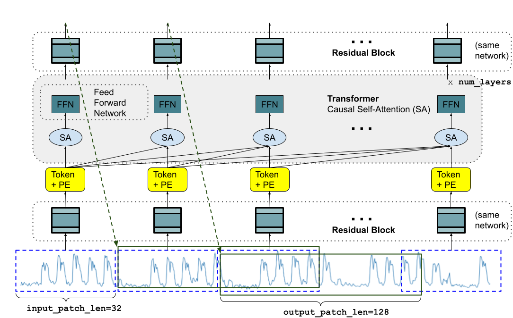
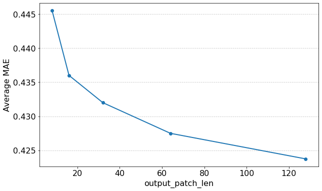
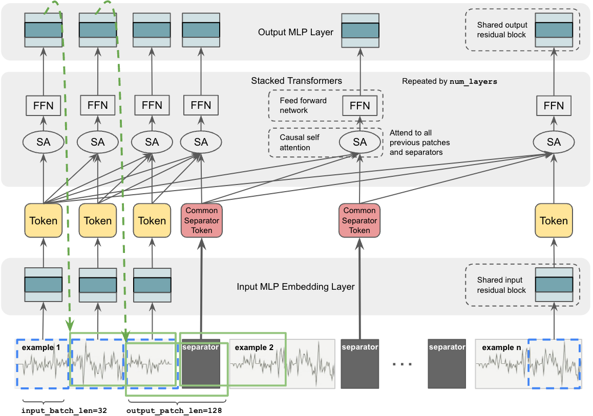
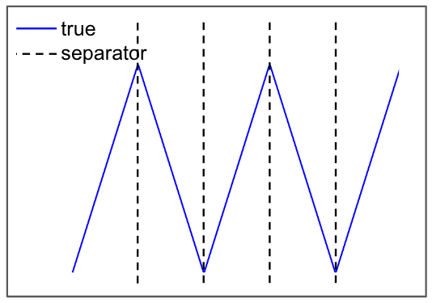

# TimesFM — 시계열 foundation model(기반 모델) 계보 정리

> 논문 2편 + 공식 저장소(현재 **TimesFM 3.0**) 를 한 문서로 묶은 리뷰.
> **TimesFM 3.0 전용 문서가 따로 있다** → [PAPER_TimesFM-3.md](PAPER_TimesFM-3.md) (공식 블로그 리뷰, GIFT-Eval·fev-bench 원시 결과 재집계, 코드 기준 버전별 차이 표, 3.0 파인튜닝). 3.0 관련 최신 내용은 그쪽이 기준이다.
> **주의**: 사용자가 처음 지정한 `arXiv:2410.11136` 은 TimesFM 과 **무관한 논문**(Gibbs sampler 의 mixing time, math.PR). arXiv API 로 원본 메타데이터 직접 확인함. 아래 두 편이 실제 TimesFM 논문이다.

---

## 📋 메타 정보

### 논문 ①  TimesFM 본편

| 항목 | 내용 |
|---|---|
| **제목** | A decoder-only foundation model for time-series forecasting |
| **저자** | Abhimanyu Das, Weihao Kong, Rajat Sen, Yichen Zhou (알파벳 순) |
| **소속** | Google Research |
| **공개일** | 2023-10-14 (v1) / **2024-04-17 (v4, 최종판)** · **ICML 2024** (arXiv 주 분류는 특이하게 cs.CL) |
| **arXiv** | [abs](https://arxiv.org/abs/2310.10688) · [ar5iv html](https://ar5iv.labs.arxiv.org/html/2310.10688) |
| **모델 규모** | 200M (20층 / model_dim 1280 / head 16) |
| **학습 비용** | TPUv5e 16 tensor-core × 2일, 1.5M step, global batch 4096 |
| **블로그** | [Google Research blog](https://research.google/blog/a-decoder-only-foundation-model-for-time-series-forecasting/) — 2024-02-02 게시, 2024-05-08 수정(ICML 채택·가중치 공개 공지). 논문과 숫자가 어긋나는 곳은 §📊 블로그 절 |

### 논문 ②  In-Context Fine-Tuning (ICF)

| 항목 | 내용 |
|---|---|
| **제목** | In-Context Fine-Tuning for Time-Series Foundation Models |
| **저자** | Abhimanyu Das, Matthew Faw (UT Austin, 인턴), Rajat Sen, Yichen Zhou |
| **소속** | Google Research |
| **공개일** | 2024-10-31 |
| **arXiv** | [abs](https://arxiv.org/abs/2410.24087) · [html](https://arxiv.org/html/2410.24087v1) |
| **관계** | 논문 ①의 base checkpoint 를 continued pretraining(이어서 사전학습) 한 파생 모델 |
| **코드/가중치** | ❌ **공개 없음** (저장소 전체 grep 결과 구현 0건 — §6-⑧) |

### 저장소 (실측 기준)

| 항목 | 내용 |
|---|---|
| **URL** | https://github.com/google-research/timesfm |
| **분석 커밋** | `8cb7eda` (2026-09-07, 3.0 분석) → **`8cb0628` (2026-09-09, 재확인 + v1·2.5 분석 추가, §🗂️)**. 사이 커밋 2개는 버전 올림과 MLX 임포트 수정뿐 |
| **패키지 버전** | `timesfm 3.0.2`. 1.0·2.0 체크포인트는 구버전 `pip install timesfm==1.3.0` 으로만 로드 |
| **현재 최신 모델** | **TimesFM 3.0** — 논문 없음 |
| **체크포인트** | [google/timesfm-3.0-pytorch](https://huggingface.co/google/timesfm-3.0-pytorch) (2026-09-02 갱신) |
| **실측 파라미터** | **330,710,976 (330.71M)**, FP32 445 텐서 = 1.32 GB — safetensors 헤더 직접 파싱 |
| **라이선스** | 코드 Apache-2.0 / **2.5 까지 가중치 Apache-2.0 / 3.0 가중치만 `timesfm-non-commercial-license-v1.0` (상업·프로덕션 금지)** |
| **디렉토리** | `v1/` = 1.0·2.0 (논문 ①에 대응하는 유일한 코드) · `src/timesfm/` = 2.5 · `src/timesfm3/` = 3.0 (torch / mlx) |

---

## 📖 주요 용어 사전 (Glossary)

### 시계열 예측 기본
- **context(문맥) / horizon(호라이즌)**: context 는 모델이 보는 과거 구간 길이, horizon 은 예측해야 할 미래 구간 길이. 논문 표기로 각각 L, H.
- **granularity(시간 단위)**: 데이터가 찍히는 간격. 시간별(hourly)·일별(daily)·주별·월별 등. 시계열 foundation model 이 어려운 이유 중 하나가 **같은 모델이 이 전부를 다뤄야** 한다는 것.
- **zero-shot(무학습 예측)**: 타깃 데이터로 추가 학습(gradient update) 없이 바로 예측하는 것. TimesFM 계열의 존재 이유.
- **covariate(공변량)**: 예측 대상 외에 함께 주어지는 보조 변수. 미래까지 아는 것(past-and-future, 예: 공휴일·할인율)과 과거만 아는 것(past-only, 예: 재고)으로 나뉜다.
- **naive baseline(단순 기준선)**: 마지막 관측값을 그대로 반복하는 예측. 데이터셋마다 스케일이 달라 지표를 비교할 수 없을 때 **이걸로 나눠서 정규화**한다(scaled MAE).

### 아키텍처
- **patching(패치화)**: 연속된 시점 여러 개(TimesFM 은 32개)를 한 덩어리로 묶어 Transformer 의 **token(토큰)** 하나로 취급. 언어모델의 단어 토큰에 해당하는 시계열판 발명.
- **decoder-only(디코더 전용)**: encoder-decoder 구조 대신 "앞을 보고 다음을 예측"만 하는 LLM 형태. 한 번의 forward 로 여러 문맥 길이를 동시에 학습할 수 있는 게 핵심 이점.
- **input_patch_len / output_patch_len**: 입력 토큰이 담는 시점 수(32) / 그 토큰 하나가 예측하는 미래 시점 수(1.0 은 128, 3.0 은 64). **둘이 다른 게 TimesFM 의 정체성**(§3.1-③).
- **residual block(잔차 블록)**: 은닉층 1개짜리 MLP + skip connection(우회 연결). TimesFM 에서 "패치 32개 숫자 → 1280차원 벡터" 변환과 그 역변환을 담당.
- **RevIN (Reversible Instance Normalization, 되돌릴 수 있는 인스턴스 정규화)**: 시계열마다 스케일이 천차만별이라, 입력을 평균·표준편차로 표준화해 모델에 넣고 출력에서 다시 원래 스케일로 되돌리는 기법. **어떤 구간의 통계로 정규화하느냐**가 버전마다 다르다(§3.3-③).
- **RoPE (rotary positional embedding, 회전 위치 임베딩)** / **NoPE (위치 인코딩 없음)**: 위치 정보를 query·key 회전으로 넣는 방식 / 아예 안 넣는 방식. 1.0 은 sinusoidal 절대 위치, ICF 는 NoPE, 3.0 은 RoPE.
- **variate attention(변량 어텐션)**: 3.0 의 신규 부품. 시간 축이 아니라 **변수 축(여러 시계열 채널 사이)** 으로 attention 을 한 번 더 거는 것. 다변량 예측과 covariate 처리를 같은 메커니즘으로 해결.
- **causal attention(인과 어텐션)**: 각 토큰이 자기와 자기보다 앞 토큰만 보도록 점수표의 위쪽 삼각형을 가린 attention. TimesFM 이 decoder-only 인 이유이자 누출 차단의 핵심 → Q9.
- **teacher forcing(교사 강요)**: 정답 시퀀스를 입력에 통째로 넣고 causal mask 로 가려, 모든 위치의 "다음 예측" 문제를 한 번의 forward 로 동시에 학습하는 방식. 논문 ①이 창 하나로 문제 16개를 푸는 원리.
- **KV cache(키·값 캐시)**: 자기회귀 생성 시 이전 토큰의 key/value 를 저장해 새 토큰만 계산하는 가속 기법. causal 이라서 가능. **1.0 코드는 안 쓰고 2.5 는 쓴다**(§🗂️-3⒝).
- **flip invariance(부호 뒤집기 불변성)**: f(−x) = −f(x) 가 성립하는 성질. TimesFM 은 첫 패치 정규화 덕분에 f(ax+b) = a·f(x)+b (a>0)는 저절로 성립하지만 a<0 은 아니다. 2.5 는 x 와 −x 로 두 번 추론해 강제한다(`force_flip_invariance`, 기본 켜짐).

### 비교 기법 (관련 연구 — §🆚)
- **PatchTST** (arXiv 2211.14730, ICLR 2023, Princeton + IBM Research): "A Time Series is Worth 64 Words". TimesFM 이 patching 을 빌려온 원조. 두 기둥이 **patching(패치 16시점, stride 8 로 겹치게)** 과 **channel-independence(채널 독립 — 변수마다 forward 를 완전히 따로 돌리되 가중치는 공유)**. masked patch 복원 방식의 자기지도 사전학습도 함께 제안.
- **channel-independence(채널 독립)**: 다변량 데이터를 변수별 단변량 시계열 여러 개로 쪼개 각각 예측하는 것. 변수 간 상관을 **일부러 포기**하는 대신 과적합을 줄인다. PatchTST 의 선택.
- **iTransformer** (arXiv 2310.06625, ICLR 2024 Spotlight, 칭화대 + Ant Group): Transformer 부품은 하나도 바꾸지 않고 **차원만 뒤집은(inverted)** 모델. 시계열 하나 전체가 토큰 1개(**variate token, 변량 토큰**)가 되어 attention 은 변수 사이에서, FFN 은 시간 표현 학습에 쓰인다. 위치 인코딩을 아예 쓰지 않는다(변수의 순서에는 의미가 없으므로).
- **lookback(되돌아보는 길이)**: PatchTST·iTransformer 문헌에서 context 길이를 부르는 이름. 표기는 L 또는 T.
- **RLinear / DLinear**: 선형 계층 하나로 예측하는 초경량 baseline. "Transformer 가 정말 필요한가"를 묻는 대조군으로 두 논문 모두에 등장.

### ICF 전용
- **in-context example(문맥 내 예시)**: 예측 대상의 과거뿐 아니라, **관련된 다른 시계열들**을 프롬프트처럼 문맥 창에 함께 넣어주는 것. LLM 의 few-shot prompting(소수 예시 프롬프팅)에 해당.
- **separator token(구분자 토큰)**: 예시와 예시 사이에 끼워 넣는 학습 가능한 임베딩 1개(1280차원). 이게 없으면 서로 다른 시계열이 하나로 이어붙어 보인다(§3.2-①).
- **continued pretraining(이어서 사전학습)**: 이미 학습된 checkpoint 에서 출발해, 구조를 살짝 바꾼 뒤 새로운 형태의 데이터로 사전학습을 계속하는 것. fine-tuning 보다 규모가 크고 목적이 범용.
- **catastrophic forgetting(파국적 망각)**: 작은 데이터로 파인튜닝하면 원래 알던 패턴을 잊어버리는 현상. ICF 가 파인튜닝을 이기는 이유로 저자들이 지목.

### 3.0 코드 전용 (논문 없음 — 코드에서만 확인 가능)
- **CPM mask / CPM iterative RevIN refine**: horizon 구간 패치는 관측값이 없어 정규화 통계를 못 만든다. 그래서 **모델이 예측한 median(중앙값)을 관측값처럼 취급해 통계를 이어 갱신**하는 되먹임 장치. `cpm_revin_refine.py`.
- **stitching(이어붙이기)**: output_patch_len(64) > input_patch_len(32) 이라 이웃 예측이 32시점 겹친다. 그 겹침 구간을 1→0 선형 가중치로 섞어 매끄럽게 잇는 것.
- **linear detrending(선형 추세 제거)**: 문맥에 최소제곱 직선을 적합해 빼고 예측한 뒤 다시 더하는 전처리. **조건부**로만 적용(§3.3-④).
- **symmetric averaging(부호 대칭 평균)**: 입력 x 와 −x 로 **두 번 추론**해 quantile(분위)을 뒤집어 평균내는 test-time augmentation(추론 시 증강). 벤치마크 스크립트 기본값이 켜짐 = 연산량 2배.

### 평가 지표·벤치마크
- **MAE / MASE / WQL / CRPS**: 절대오차 평균 / 계절 naive 로 정규화한 절대오차 / 가중 분위 손실 / 확률 예측 정확도. 뒤 세 개는 확률 예측 시대의 표준.
- **Monash / Darts / ETT(Informer)**: 논문 ①②가 쓴 zero-shot 평가 3종. Monash 30개(필터 후 18개), Darts 8개 단일 시계열, ETT 4개(전력 변압기 온도).
- **GM / AM(기하평균 / 산술평균)**: 여러 데이터셋의 scaled MAE 를 하나로 합치는 두 방식. 논문 ①은 본문에 GM, 부록에 AM 을 싣는데 **둘의 1위가 다르다**(§📊 재검토).
- **GIFT-Eval / fev-bench / TIME**: 3.0 이 1위를 주장하는 최신 벤치마크 3종. GIFT-Eval 은 **전용 사전학습 코퍼스(GiftEvalPretrain)** 를 따로 제공한다는 점이 중요(§6-⑥).

---

## 🎯 논문 요약 (TL;DR)

> ⚠️ **이 문서를 읽기 전에 알아야 할 한 가지** — **논문과 코드가 2년 어긋나 있다.** 논문 ①은 1.0(2023), 논문 ②는 그 파생(2024)을 설명하는데, 오늘 `pip install timesfm` 으로 받는 것은 **3.0** 이다. 3.0 은 논문도, technical report 도, ablation(제거 실험)도 **하나도 없다.** 3.0 을 이해하려면 코드를 역설계하는 수밖에 없고, §3.3 이 그 결과다.

**한 줄**: TimesFM 은 "시계열에도 LLM 처럼 한 번 학습해 아무 데나 쓰는 모델이 되는가"에 **된다**고 답한 논문이고, 그 답의 열쇠는 **patching(패치화) + decoder-only(디코더 전용) + 출력 패치를 입력 패치보다 길게** 라는 세 줄이었다.

**핵심 문제**: 시계열에는 언어처럼 정해진 vocabulary(어휘)도 grammar(문법)도 없고, 데이터마다 context 길이·horizon 길이·granularity(시간 단위)가 전부 다르며, 텍스트만큼 방대한 공개 데이터도 없다.

**해결책 (논문 ①)**: ① 32시점을 한 토큰으로 묶고 ② decoder-only 로 "다음 패치 예측"을 학습해 문맥 길이 유연성을 확보하고 ③ 출력 패치를 128로 길게 잡아 autoregressive(자기회귀) 단계를 1/4 로 줄이고 ④ 배치마다 앞부분을 무작위로 가려(patch masking) 1~512 모든 문맥 길이를 학습에서 보게 만든다. 데이터는 Wikipedia Pageviews(약 3,700억 시점) + Google Trends + **합성 데이터(synthetic data)**.

**해결책 (논문 ②)**: 타깃 도메인 파인튜닝의 이득을 gradient update 없이 회수하기 위해, 문맥 창에 **관련 시계열 예시 n개(최대 50)를 separator token 으로 구분해** 함께 넣고 그 형태로 continued pretraining 한다.

**검증**: 논문 ①은 Monash(scaled MAE 기하평균) 1위를 주장하지만 N-BEATS 와 통계적 동률이고 산술평균으론 N-BEATS 가 앞선다. llmtime 대비 29.5% 개선은 사실. ETT 에서는 지도학습 PatchTST 와 동급 — 단 **같은 데이터로 사전학습한 PatchTST(ZS)가 TimesFM 보다 좋다**(§📊 재검토). 논문 ②는 Monash 에서 base 대비 7% 개선 + **데이터셋별 실제 파인튜닝 모델보다 3% 더 좋음**(파인튜닝 115분 vs 추론 4분).

**⚠️ 다만**:
- 논문 ①의 Monash 평가셋 18개 중 **traffic 2개는 사전학습 데이터와 같은 원천**(862 × 17,544 시점 일치). 둘을 빼면 N-BEATS 가 역전한다 (§📊 재검토 ①).
- 논문 ①의 **사전학습 코드·데이터 혼합·합성 데이터 생성기는 저장소에 없다** — 공개된 건 가중치·추론·파인튜닝뿐 (§🗂️-2).
- 논문 ②는 **코드·체크포인트가 공개되지 않아 재현 불가**.
- 3.0 의 실질적 기여(variate attention / CPM RevIN / 비자기회귀 단일 패스 / stitching / 조건부 detrending)는 **문서도 ablation 도 0건**.
- 3.0 가중치는 **비상업 라이선스**라 실무 도입이 막힌다.
- 벤치마크 1위 수치는 **연산량 2배 설정(symmetric averaging)** 에서 나온 값.

---

## 🏆 핵심 기여 (Contributions)

### 논문 ① (2310.10688)
1. **시계열 foundation model 의 설계 원칙 4개를 확립** — patching / decoder-only / output_patch_len > input_patch_len / random patch masking. 이후 대부분의 후속 모델이 이 골격을 따른다.
2. **"출력 패치를 길게" 라는 절충안** — 전체 horizon 을 한 번에 뽑는 one-shot decoding 은 정확하지만 horizon 을 미리 알아야 하고, 토큰 단위 autoregressive 는 유연하지만 부정확하다. 그 사이를 output_patch_len 이라는 **하나의 하이퍼파라미터**로 연속적으로 조절 가능하게 만들었다.
3. **합성 데이터의 역할을 실험으로 규명** — "합성 데이터는 학습 데이터에 드문 granularity 를 메운다"(§5 dataset ablation).
4. **200M / O(100B) 시점이면 충분하다**는 실증 — LLM(GPT-3, LLaMA-2)을 시계열 예측에 쓰는 llmtime 계열 대비 압도적으로 작고 정확.

### 논문 ② (2410.24087)
5. **시계열판 few-shot prompting 의 정의와 구현** — "시계열 모델에게 예시를 준다"가 무슨 뜻인지 처음으로 조작 가능한 형태(separator + cross-example attention + NoPE)로 정의.
6. **"긴 문맥"과 "구분된 여러 예시"가 다르다는 것을 분리 증명** — 문맥만 2048로 늘린 모델(LH)은 1% 개선, ICF-50예시는 7% 개선, **총 문맥 길이를 동일하게 맞춘 4예시 버전도 3%** (§4-실험). 이득의 원천이 길이가 아니라 **구분**임을 보인 것.
7. **zero-shot 이 파인튜닝을 이길 수 있음**을 보임 — 작은 데이터셋에서 파인튜닝의 catastrophic forgetting 을 ICF 가 회피.

### 저장소 (3.0, 논문 없음 — 본 문서가 코드에서 역설계)
8. **variate attention 으로 다변량·covariate 를 한 메커니즘으로 통합** (§3.3-①)
9. **autoregressive 를 버린 단일 패스 디코딩** — 1.0 의 3번 원칙을 스스로 폐기 (§3.3-②)
10. **CPM iterative RevIN** — 예측값을 정규화 통계에 되먹여 긴 horizon 의 스케일 표류(drift)를 막음 (§3.3-③)

---

## 🔬 주요 알고리즘 설명

### 3.1 논문 ① — 설계 4원칙

*시계열에는 토큰도 문법도 없고 입출력 길이가 데이터마다 다르다. 이 4개는 그 세 가지 결핍을 각각 메우는 처방이다.*


*Figure 1 — 아래에서 위로: 시계열 → 32시점 패치 → Residual Block 으로 1280차원 토큰화 → +위치 인코딩(PE) → causal self-attention(SA) 20층 → Residual Block → 다음 128시점 예측. 파란 점선이 input_patch_len=32, 초록 실선이 output_patch_len=128 — **둘의 길이가 다른 것**이 그림의 핵심.*

#### ① patching (패치화)
32개 연속 시점을 묶어 토큰 1개로 만든다. 언어모델의 단어 토큰에 대응하는 발명이고, 부수 효과로 **Transformer 에 들어가는 토큰 수가 1/32** 이 되어 추론이 빨라진다. 다만 무한정 키우면 안 된다 — patch 길이를 context 길이까지 늘리면 decoder-only 가 아니라 encoder-decoder 학습이 되어버린다.

```
context 512 시점  →  patch 32  →  토큰 16개  (LLM 으로 치면 "16 단어 문장")
```

#### ② decoder-only (디코더 전용)
"이전 패치들을 보고 다음을 예측"만 학습한다. LLM 과 동일하게 **한 번의 forward 에서 모든 접두사(prefix) 길이에 대한 학습 신호가 동시에** 생긴다. 토큰 j 의 출력 o_j 는 y_1 부터 y_(p·j) 까지의 정보를 담고, 그것으로 다음 h 시점을 맞힌다.

```
o_1 → y_33..y_160  예측   (32시점 보고)
o_2 → y_65..y_192  예측   (64시점 보고)
o_3 → y_97..y_224  예측   (96시점 보고)   ... 한 배치에서 전부 동시에
```

#### ③ output_patch_len > input_patch_len ⭐ (논문 ①의 정체성)
입력 32, 출력 128. horizon 512를 예측할 때 출력 패치가 32면 16번 autoregressive 를 돌아야 하지만, 128이면 **4번**이면 된다.


*Figure 3(b) — ETT 4개 데이터셋, horizon 512 예측 시 output_patch_len 을 8→128 로 키울수록 평균 MAE 가 단조 감소(0.4455 → 0.4238). 다만 무한정 키우면 월별·연별처럼 **전체 길이가 output_patch_len 보다 짧은 시계열**을 다룰 수 없어진다는 trade-off 가 있다.*

#### ④ random patch masking (무작위 패치 가리기)
*그냥 패치를 쓰면 모델이 "32의 배수 길이 문맥"만 잘하게 된다. 그래서 앞부분을 무작위로 가린다.*

배치의 시계열마다 0~31 사이 난수 r 을 뽑아 앞 r개 시점을 마스킹한다. **이 한 줄로 1~512 모든 문맥 길이가 학습에 등장한다**:

```
r = 4 인 경우:
  o_1 은  28(=32−4) 시점을 보고 예측하도록 최적화
  o_2 는  28+32 = 60 시점을 보고 예측
  o_3 은  28+64 = 92 시점 ...
r 을 0~31 전부 훑으면 → 1~512 의 모든 길이가 커버된다
```

#### ⑤ 정규화와 손실
- **정규화**: RevIN 의 표준화 부분만 사용하되, 통계를 **문맥 전체가 아니라 "첫 입력 패치"** 에서 뽑는다. 이유는 미래 정보 누출 방지(§🧩-3).
- **손실**: 모든 토큰 위치의 MSE(평균 제곱 오차) 평균. 논문은 확률 예측을 "향후 과제"로 남겼다 — 하지만 공개 체크포인트는 그렇지 않았다(아래).

> 🔎 **→ 코드 확인** (`v1/src/timesfm/pytorch_patched_decoder.py`, 커밋 `8cb0628`, 직접 실행 검증 §🧪-⑥) — 논문 서술과 다른 부품 수준 세부:
>
> | 논문 | 코드 |
> |---|---|
> | "Transformer 층에 layer norm" | attention 앞은 **RMSNorm**, FFN 앞은 **LayerNorm** — 두 종류 혼용 (둘 다 pre-norm) |
> | 표준 multi-head attention | query 에 **학습형 차원별 스케일**(`_per_dim_scaling`, softplus)을 곱한다. 고정 1/√d 가 아님 |
> | Residual Block = 은닉층 1개 MLP + skip | 맞음. 활성화는 **SiLU(swish)**, Transformer FFN 은 **ReLU** (논문 미기재) |
> | 식 2: 값 × (1−마스크) | 값 32 + 마스크 32 를 **이어붙여 64차원** 입력 (§🧩-2) |
> | 입력은 시계열 하나 | **freq 임베딩**(3종)이 모든 토큰에 더해짐 (§🧩-6) |
> | 점 예측, MSE | 출력이 `128 × (평균 1 + 분위 9)` |
> | 첫 패치로 정규화 | "**유효값 3개 이상**인 첫 패치" (코드 `arr >= 3`, 독스트링은 "more than three" 라 서로 어긋남). 그런 패치가 없으면 마지막 패치 |
> | 추론 시 L 이 32 배수가 아니면 "0을 append" | 실제로는 **왼쪽**에 채우고 위치 인코딩을 밀어 첫 진짜 패치를 0번으로 (§🧩-5) |
> | 결측 표시 = 마스크 | 값이 **`1123581321.0`**(피보나치 수를 이어붙인 매직 넘버)인 칸도 패딩으로 간주 |
> | 가려진 칸 점수 = −∞ | **−0.7 × 자료형 최댓값**, 마스크끼리는 `minimum` 으로 합침 → 전부 가려진 행도 NaN 없음 |
>
> 실측 파라미터 **203.57M** = Transformer 196.84M(층당 9.84M × 20) + 출력 블록 4.92M + 입력 블록 1.81M + freq 임베딩 3,840. 논문 "200M" 과 부합.

#### ⑥ 사전학습 데이터 — Table 1 다시 합산

*본문("O(100B)")·표·블로그("100B")의 숫자가 서로 달라서, 원표를 직접 더해 실제 구성을 확인한다.*

| 원천 | 시점 수 | 비중 |
|---|---|---|
| Wiki Pageviews(시간/일/주/월) | 374.5B | **98.2%** |
| synthetic data(합성 데이터, 300만 개 × 2048) | 6.1B | 1.6% (단 샘플링 비율은 **20%**) |
| Google Trends | 0.54B | 0.14% |
| M4, Electricity, Traffic, Weather, Favorita, LibCity | 약 0.2B | 미미 |
| **합계** | **381B** | |

- **숫자가 문서마다 다르다.** 본문은 "O(100B)", Wiki 만 "약 300B", 블로그는 "실세계 100B". 표를 합치면 실데이터만 375B 다.
- **블로그 표현이 실제 비중과 안 맞는다.** "대부분이 Google Trends 와 Wikipedia"라지만 Trends 는 0.14% — 사실상 **Wikipedia 한 원천을 여러 시간 단위로 집계한 데이터**다.
- **Favorita Sales(1.39억 시점)** 는 표에만 있고 본문 설명이 없다.
- **혼합 규칙**: 실데이터 80% / 합성 20%. 실데이터는 "시간 이하·일·주·월" 네 그룹 동일 가중. 최대 문맥은 주 단위 256, 월 이상 64 → 짧은 시계열이 적게 학습되며 tourism 부진(§📊 재검토 ③)과 연결된다.
- **Traffic 15,122,928 = 862 × 17,544** — Monash `traffic_hourly` 와 같은 원천 (§📊 재검토 ①).
- **합성 생성기**(부록 A.8): 구간별 선형 추세(2~8조각) + ARMA(p, q ≤ 8) + 주기 4 ~ (최대 문맥/2) 의 sin·cos, 네 성분을 무작위로 켜고 끈 뒤 무작위 가중합. 추세는 50% 확률로 곱셈형.

---

### 3.2 논문 ② — 본편에서 바뀐 3가지뿐

*파인튜닝을 하면 성능이 오르지만 zero-shot 이라는 매력이 깨진다. 그럼 학습 대신 "문맥에 예시를 넣어" 같은 효과를 내보자는 것이 이 논문의 전부다. 바꾼 것도 딱 3군데다.*


*Figure 4 — 노란 Token(패치)들 사이에 빨간 **Common Separator Token** 이 끼어 있고, causal self-attention 이 이전 패치 **및 구분자 전부**를 본다. 입출력 residual block 은 모든 예시가 공유(shared).*

#### ① separator token (구분자) — 왜 필요한가


*Figure 3(a) — 파란 선은 "여러 개의 서로 다른 선형 추세" 예시들을 이어붙인 것이고 검은 점선이 구분자 위치다. 구분자가 없으면 모델 눈에는 이게 **삼각파(triangular wave) 하나**로 보인다. 이 그림 하나가 separator 의 존재 이유를 전부 설명한다.*

구현은 지극히 단순하다 — **model_dim(1280) 짜리 학습 가능한 임베딩 벡터 1개**를 각 예시 끝에 삽입하고, 그 위치는 절대 마스킹하지 않는다.

#### ② cross-example attention (예시 간 어텐션)
구분자를 포함해 이전 모든 패치를 causal(인과적)하게 본다. 저자들의 해석이 흥미롭다 — 입력단에서는 모든 구분자가 **똑같은 벡터**지만, 층을 거치며 그 위치의 출력 토큰은 "직전 예시 전체의 요약" 역할을 하게 된다. 즉 구분자가 **예시 단위 pooling(집약) 슬롯**으로 진화한다는 것. (검증 실험은 없다.)

#### ③ NoPE (위치 인코딩 제거)
base checkpoint 자체를 **위치 인코딩 없이** 다시 만들었다. 이유가 둘:
1. **length generalization(길이 일반화)** 이 좋다 — 예시를 붙이면 프롬프트가 훨씬 길어지므로 중요.
2. 절대 위치 인코딩을 쓰면 base 학습 때의 "위치 5"와 ICF 학습 때의 "위치 5"가 의미가 달라져 continued pretraining 이 꼬인다.

논문은 "위치 인코딩을 빼도 원 논문과 같은 정확도를 냈다"고 명시한다. 근거는 causal attention 자체가 층이 2개 이상이면 위치 정보를 인코딩한다는 선행 연구(NoPE 논문).

#### ④ 학습 데이터 구성 (여기가 실무적으로 제일 유용)
- 예시 1개 길이 **T = 640** (= 학습 최대 문맥 512 + output_patch_len 128), 문맥당 예시 **n = 50개**
- 예시 생성: shift 1 짜리 sliding window. 조합이 폭발하므로 전수(N choose n) 대신 **20N 개만 무작위 샘플링**
- 그룹핑 2종을 **동일 비중**으로 — time-series level(한 시계열을 잘라서) / dataset level(같은 데이터셋 아무 구간). 둘 다 "서로 비슷한 패턴을 빌려올 수 있음"을 보장하기 위한 장치
- **Wikipedia 데이터는 제외** — 수백만 개 문서가 서로 무관해서 "관련 예시"라는 전제가 깨지기 때문. (저자들도 클러스터링해서 쓰면 좋겠다고 인정하며 future work 로 남김)
- 실데이터 90% / 합성 10% (본편은 80/20)
- 짧은 시계열 패딩 규칙: 길이 l < p(32) 면 **왼쪽에 k 를 채워 p < k+l < 2p** 가 되게 한다 — 두 번째 패치에 loss 가 걸려야 모델이 "첫 패치만 보고 예측"을 학습하기 때문. 그 다음 오른쪽을 640까지 채운다. 오른쪽이 잘린 패치는 **뒤따르는 예시들이 attention 하지 못하게** 막는다.

---

### 3.3 저장소 TimesFM 3.0 — 코드에서 역설계

*3.0 은 논문이 없다. 아래는 `src/timesfm3/torch/` 를 읽고 체크포인트를 직접 돌려 확인한 내용이며, 1.0 대비 무엇이 바뀌었는지에 초점을 맞춘다.*

#### 실측 파라미터 분해 (safetensors 헤더 파싱)

| 구성 | 계산 | 파라미터 |
|---|---|---|
| 층당 seq attention | q·k·v·out = 4 × 1280 × 1280 | 6,553,600 |
| 층당 **variate attention** | 4 × 1280 × 1280 | **6,553,600** |
| 층당 FFN | ff0 + ff1 = 2 × 1280 × 1280 | 3,276,800 |
| 층당 norm·scale | RMSNorm 6×1280 + qk_ln 4×80 + per_dim_scale 2×80 | 8,160 |
| **층 소계 × 20** | 16,392,160 × 20 | 327,843,200 |
| 입력 residual block | 1280×192×2 + 1280×1280 | 2,129,920 |
| 출력 head | 576×1280 + 576 | 737,856 |
| **합계** | | **330,710,976** ✅ |

> 💡 **읽어야 할 지점**: variate attention 이 층당 6.55M × 20층 = **131M, 모델의 40%** 다. 이걸 빼면 약 199.6M — **TimesFM 2.5 의 200M 과 정확히 겹친다.** 즉 3.0 = "2.5 크기 + 변량 어텐션 가지 하나"로 읽으면 된다.

#### ① Mixing Transformer — variate attention

*다변량(multivariate) 예측과 covariate 를 별도 모듈 없이 한 메커니즘으로 처리하기 위한 구조.*

텐서 모양이 `(b=배치, v=변량, n=패치, d=1280)` 이고 각 층이 **순서대로 3단**:

```
1. sequence attention : (b,v,n,d) → (b·v, n, d) 로 펴서, 시간 축 causal attention  (RoPE 적용)
2. variate  attention : (b,v,n,d) → (b·n, v, d) 로 펴서, 변수 축 non-causal attention (RoPE 없음)
3. FFN
   — 각 단은 pre-RMSNorm → 연산 → post-RMSNorm → residual add
```

타깃 변량과 covariate 의 구분은 오직 **`patch_is_target` 불리언 하나**로만 이뤄진다. 구조적으로는 전부 대등한 변량이다.

#### ② autoregressive 를 버린 단일 패스 디코딩 ⭐

*1.0 의 핵심 아이디어(출력 패치를 길게 해서 AR 단계를 줄이자)를 3.0 은 아예 폐기했다.*

`decode()` 는 **문맥 패치 + horizon 패치(값 0, 마스크 True)** 를 한 시퀀스로 이어붙여 **forward 를 단 한 번** 돈다.

```python
# model.py forward() 의 핵심 한 줄
effective_patch_mask = torch.cumprod(transformer_patch_mask.int(), dim=2).bool()
```

`cumprod`(누적곱) 를 쓰면 **맨 앞의 연속된 마스크(왼쪽 패딩)만 남고**, 유효 패치가 한 번 나온 뒤부터는 전부 0 이 된다. 즉 뒤쪽의 "값이 없는 horizon 패치"들은 마스킹되지 않아 **문맥을 attention 으로 볼 수 있다.** BERT 의 [MASK] 자리에 해당하는 슬롯을 미리 깔아두고 한 번에 채우는 방식이다.

#### ③ 러닝 RevIN + CPM 반복 보정 ⭐ (3.0 에서 가장 독창적)

*1.0 은 "첫 패치 통계"로 고정 정규화했는데, 문맥이 16k 로 길어지면 앞부분 통계가 뒷부분과 안 맞는다. 그래서 통계를 누적 갱신하고, 관측이 없는 horizon 구간은 예측으로 메운다.*

**(1) running stats** — 패치 i 의 정규화 통계는 패치 0~i 의 누적 평균·표준편차. `get_running_stats()`.

**(2) 문제** — horizon 패치는 관측값이 없으니(전부 마스크) 통계 갱신이 문맥 끝에서 멈춘다. 긴 horizon 일수록 스케일이 실제와 어긋난다.

**(3) 해법 (CPM iterative refine)** — 모델이 뱉은 **median quantile(중앙값 분위)을 관측값처럼 취급**해 통계를 계속 갱신한다:

```python
# cpm_revin_refine.py 의 루프 (패치 i 마다)
predicted_values_step = <이전 anchor 예측에서 이번 패치 구간을 꺼냄>
new_n, new_mu, new_sigma = update_running_stats(carry_n, carry_mu, carry_sigma,
                                                predicted_values_step, step_masks)
out_mu    = torch.where(is_cpm, new_mu,    actual_mu)      # CPM 위치만 교체
out_sigma = torch.where(is_cpm, new_sigma, actual_sigma)
step_predicted_values = util.revin(current_step_logits, out_mu, out_sigma, reverse=True)
```

예측 → 통계 → 다시 예측 역정규화 로 이어지는 **되먹임(feedback) 구조**다. 긴 horizon 에서 스케일 표류(drift)를 막는 장치로 읽히지만, **논문도 ablation 도 없어 효과 크기는 알 수 없다.**

#### ④ stitching 과 조건부 linear detrending

**stitching**: output_patch_len 64, input_patch_len 32 이므로 이웃 예측이 32시점 겹친다. 겹침 구간을 **1→0 선형 가중치**로 섞는다(`stitch_patches`). 예측 경계에서 값이 튀는 걸 막는 후처리.

**linear detrending**: 문맥에 최소제곱 직선을 적합해 빼고 예측한 뒤 다시 더한다. 단, **무조건이 아니라 조건부**다:

```python
apply_detrend = std_det < self.linear_detrending_threshold * std_orig   # threshold = 0.5
```

"추세를 뺐더니 표준편차가 원래의 절반 미만이 되는가" — 즉 **변동의 절반 이상이 직선 추세로 설명될 때만** 적용하는 휴리스틱이다. 미래를 아는 covariate 에도 같은 추세를 빼서 정합을 맞춘다.

#### ⑤ 입력 토큰이 192차원인 이유 (= covariate 지원의 정체)

```
2 × (input_patch_len + output_patch_len) = 2 × (32 + 64) = 192
```

| 슬롯 | 폭 | 내용 |
|---|---|---|
| values | 32 | 현재 패치의 값 (RevIN 정규화 후) |
| values_fcov | 64 | **roll 로 만든 "미래 패치"** — 미래를 아는 covariate 가 여기 들어감 |
| masks | 32 + 64 | 위 둘 각각의 유효/무효 표시 |

타깃 변량은 미래 슬롯이 통째로 마스킹된다(`masks_fcov = ... | patch_is_target`). **covariate 지원이 별도 모듈이 아니라 토큰 레이아웃 자체**로 구현된 게 이 설계의 미덕이다.

---

## 🧩 입력 파이프라인 해부 (예제로)

*§3 이 "왜 이런 설계 원칙인가"를 다뤘다면, 이 장은 **텐서가 실제로 어떻게 생겼는가**만 본다. 코드 인용과 텐서 모양은 전부 저장소·체크포인트에서 직접 확인한 실측이다.*

TimesFM 의 입력 설계는 **네 가지 결정**으로 이뤄져 있고, 그 넷이 전부 하나의 제약에서 파생된다 — **"이 모델은 decoder-only 다."**

| 결정 | 내용 | PatchTST 와 비교 |
|---|---|---|
| ① 패치 | 32시점, **겹치지 않음** | 16시점, stride 8 로 **절반 겹침** |
| ② 마스크 | 값 옆에 **같이 넣음** (32+32=64차원) | 마스크 개념 없음 |
| ③ 정규화 | **첫 패치 통계**로만 | 문맥 전체 통계 (RevIN) |
| ④ 채널 | **아예 안 받음** (단변량 전용) | channel-independence (받되 따로 처리) |

### 🧩-1. Patching — 겹치지 않게 자른다

*겹침 여부는 사소해 보이지만, PatchTST 와 정반대 선택이라 이유를 짚고 갈 값어치가 있다.*

```
시각 :  1시   2시   3시  ...  32시  33시  34시 ...
온도 : 20.1  20.3  20.6  ...  19.4  19.2  19.5 ...

패치 1 = [20.1, 20.3, 20.6, ... , 19.4]   ← 1~32시   (32개)
패치 2 = [19.2, 19.5, 20.1, ... , 18.8]   ← 33~64시  ※ 겹침 없음
패치 3 = [18.9, 19.0, ... ]               ← 65~96시
...
패치 16                                    ← 481~512시
```

논문 표현 그대로 *"contiguous **non-overlapping** patches"* 다. PatchTST 가 절반씩 겹치게 뜬 것(P=16, S=8)과 정반대다.

**왜 안 겹치는가** — 논문은 이유를 한 줄도 쓰지 않는다. 가장 타당한 해석은 **"겹치면 연산이 약 2배인데, 논문의 입력 패치 크기 실험(16 대 32)이 경계를 촘촘히 해도 성능은 그대로임을 보였기 때문"** 이다. 흔한 오해("겹치면 정답이 샌다")가 왜 틀렸는지, 경계 문제는 무엇이 대신 푸는지, Chronos 와는 왜 이유가 다른지는 → Q10.

**결과: 토큰 수**

```
look-back 512, P=32, S=32  →  512/32 = 16개
(PatchTST 같은 512 에서 P=16, S=8  →  64개)
```

**같은 문맥에서 토큰이 1/4 이다.** 어텐션 쌍은 16²=256 대 64²=4,096 으로 16배, 토큰 수에 비례하는 선형층(Q/K/V 투영·FFN) 비용은 4배다. 토큰이 수십 개 수준이면 선형층 비용이 지배하므로 실제 체감은 "약 4배" 쪽이다. TimesFM 이 파라미터를 200M(PatchTST 의 수십~수백 배)까지 키울 수 있었던 예산이 여기서 나온다.

### 🧩-2. 마스크를 값 **옆에** 붙인다

*PatchTST 에 아예 없는 개념이라 따로 둔다. 시간 단위가 제각각인 데이터를 한 배치에 섞으려면 반드시 필요하다.*

PatchTST 는 데이터셋 하나를 붙잡고 학습하므로 시계열 길이가 다 같다. TimesFM 은 **월별 데이터(길이 60)와 15분 데이터(길이 수만)를 한 배치에 섞어야** 한다. 짧은 시계열은 왼쪽을 0으로 채워 512로 맞추는데, 그러면 모델이 "그 0이 진짜 관측된 0인지, 채워 넣은 가짜인지" 알 방법이 없다.

그래서 값 32개 옆에 "진짜/가짜" 32개를 **나란히 이어붙여 64차원**으로 만든다:

```python
patched_inputs = patched_inputs * (1.0 - patched_pads)          # 가짜 자리는 0으로
concat_inputs  = torch.cat([patched_inputs, patched_pads], -1)  # 32 + 32 = 64
model_input    = self.input_ff_layer(concat_inputs)             # Linear(64 → 1280)
```

길이 20짜리 월별 시계열을 넣으면 첫 두 패치가 이렇게 생긴다:

```
패치 1 값     = [ 0,  0,  0, ...,  0,  0]              ← 32칸 전부 채움
패치 1 마스크 = [ 1,  1,  1, ...,  1,  1]              ← 전부 "가짜"
패치 2 값     = [ 0, ..., 0, 12.4, 13.1, ..., 15.0]    ← 12칸 채움 + 진짜 20개
패치 2 마스크 = [ 1, ..., 1,    0,    0, ...,    0]
                          ↑ 여기가 경계
```

**2.5 까지도 토큰 입력이 정확히 64차원**이다(2.5 config 의 `tokenizer.input_dims = 64`).

**패치 단위 마스킹 규칙**은 별도다:

```python
patched_padding = torch.min(patched_pads, dim=-1)[0]   # 1.0
patch_mask_bvn  = masks_cat.all(dim=3)                 # 3.0, 같은 규칙
```

**"한 칸이라도 진짜면 그 토큰은 살린다."** 위 예에서 패치 1은 죽고(전부 가짜) 패치 2는 산다(20개가 진짜). 이 규칙은 1.0부터 3.0까지 바뀌지 않았다.

### 🧩-3. 정규화를 "첫 패치"로만 하는 이유 ⭐

*TimesFM 입력 설계에서 가장 중요하면서, 논문에 설명이 가장 없는 부분이다.*

**기존 방식(PatchTST 의 RevIN)** 은 문맥 512개 **전체**의 평균·표준편차로 표준화한다. PatchTST 는 이래도 된다 — **양방향 encoder 이고 예측은 맨 끝 head 가 한 번만** 하니까. 512개를 다 본 뒤 예측하므로 512개의 통계를 쓰는 게 자연스럽다.

**TimesFM 은 첫 32개만 쓴다** (`_masked_mean_std`: 정확히는 "유효값이 3개 이상인 첫 패치").

**왜? — decoder-only 에서 전체 통계는 미래 정보 누출(leakage)이기 때문.** decoder-only 는 토큰마다 예측을 시킨다:

```
토큰 1  (1~32시 봄)   → 33~160시 예측
토큰 2  (1~64시 봄)   → 65~192시 예측
...
토큰 16 (1~512시 봄)  → 513~640시 예측
```

정규화에 512개 전체의 통계를 쓰면 **토큰 1의 입력값이 이미 400시 이후의 정보를 담게 된다.** 토큰 1은 33~160시를 맞혀야 하는데 그 구간을 포함한 통계로 스케일된 값을 받는 셈이다. 학습 때 정답을 훔쳐보는 것이고, 추론 때는 그런 통계가 없으니 학습-추론 불일치까지 생긴다. 첫 패치 통계는 **모든 토큰이 공평하게 이미 본 구간**이라 누출이 없다.

> 📌 **이 해석의 근거**: TimesFM 3.0 이 이 원칙을 훨씬 명시적으로 밀어붙였다. `get_running_stats()` 는 **패치 i 의 통계를 패치 0~i 의 누적으로만** 계산한다 — 완벽하게 causal 이다. 관측이 끝난 horizon 구간에서는 **예측값으로 통계를 이어가되**(CPM, §3.3-③) 역시 앞에서 뒤로만 흐른다. 정규화 통계 전체가 causal 하게 설계돼 있고, 1.0 의 "첫 패치"는 그 causal 설계의 가장 단순한 형태다.
> 논문은 이유를 한 줄도 쓰지 않는다. 그냥 *"context of each time-series is scaled by the context mean and standard deviation of the first input patch"* 라고만 한다.

**대가**: 첫 32개가 이상하면 전체가 망가진다. 512시점 중 앞 32개가 하필 결측 직후이거나 이상치 구간이면 그 스케일로 나머지 480개를 전부 나눈다. 코드의 "유효값 3개 이상" 조건이 그 최소한의 방어이고(논문에 없는 규칙, §6-⑦), 3.0 의 running stats 는 이 취약점을 정면으로 고친 것이다.

### 🧩-4. 채널 — "따로 처리"가 아니라 "아예 안 받는다"

*PatchTST 의 channel-independence 를 끝까지 밀면 도달하는 지점이고, 사전학습이 가능해진 이유이기도 하다.*

```
PatchTST     입력 [128, 336, 21]  →  reshape  →  [2688, 42, 128]   ← 다변량을 받아서 쪼갬
TimesFM 1.0  입력 [B, 512]                                          ← 애초에 변수 축이 없음
```

함수 시그니처가 `f: y[1:L] → ŷ[L+1:L+H]` 로, 다변량이라는 개념이 문제 정의에 들어 있지 않다. 21개 변수를 예측하려면 **21번 따로 호출**한다. 덕분에 위키 페이지뷰 시계열 6,800만 개와 M4 월별 4만 8천 개를 "전부 그냥 단변량 시계열"로 한 통에 부어 학습할 수 있다 — 채널 수가 파라미터에 안 들어가니까.

**대가**는 명확하다. 변수 간 상관을 볼 수단이 0이다. 그래서 3.0 이 변량 축을 되살렸고(§🆚-4), covariate 를 위한 슬롯을 토큰 안에 팠다(§🧩-8). 버전별로 다변량이 언제 들어왔는지는 → Q11.

### 🧩-5. 위치 인코딩을 **굴린다**

*작지만 예쁜 디테일. 왼쪽 패딩 때문에 위치 0이 가짜 패치로 가는 걸 막는다.*

```python
pos_emb = self.position_emb(model_input.shape[1])
pos_emb = _shift_padded_seq(patched_padding, pos_emb)   # 첫 유효 패치를 0번으로
model_input += pos_emb
```

```
패딩 있는 경우:   [가짜] [가짜] [진짜] [진짜] [진짜] ...
위치 인코딩:      [ 14 ] [ 15 ] [  0 ] [  1 ] [  2 ] ...
                                  ↑ 여기가 0
```

이게 없으면 "길이 100짜리 시계열"과 "길이 512짜리 시계열의 마지막 100"이 모델에게 다르게 보인다. ICF 논문이 아예 위치 인코딩을 버린(NoPE, §3.2-③) 배경에도 이런 번거로움이 있다.

### 🧩-6. 논문에 없는 입력 — freq 임베딩

*공개 체크포인트에만 있는 세 번째 입력. 논문의 문제 정의와 충돌하므로 짚어 둔다.*

```python
self.freq_emb = nn.Embedding(num_embeddings=3, ...)   # 고/중/저 빈도
f_emb = self.freq_emb(freq)   # B x 1 x D
model_input += f_emb          # 모든 토큰에 동일하게 더함
```

사용자가 "이건 시간별(0)/일별(1)/월별(2) 데이터"라고 알려주면 그 임베딩이 모든 토큰에 더해진다. 논문의 문제 정의는 *"데이터셋 특화 covariate 를 가질 수 없다"* 고 못 박는데, 릴리스에는 사실상 데이터셋 힌트가 들어 있는 셈이다. 2.5 에서 삭제됐다(README 가 "gets rid of the frequency indicator" 라고 명시).

### 🧩-7. 학습 시 입력 — 무작위 시프트가 마지막 조각

*§3.1-④ 를 입력 텐서 관점에서 다시 본다. 요점은 "데이터가 아니라 마스크만 바꾼다"는 것.*

```python
r ~ Uniform(0, 31)
m[1:r] = 1        # 앞 r개를 "가짜"로 표시
```

그런데 §🧩-2 의 규칙(한 칸이라도 진짜면 토큰은 살림) 덕분에 첫 토큰은 여전히 살아 있고, 다만 32−r 개의 값만 보게 된다:

```
r=4  → 토큰1은 28시점 보고 예측, 토큰2는 60시점, 토큰3은 92시점 ...
r=17 → 토큰1은 15시점 보고 예측, 토큰2는 47시점 ...
```

PatchTST 는 이게 필요 없다 — look-back 이 336 으로 고정이고 그 길이로만 추론하니까. TimesFM 은 사용자가 47시점만 줄 수도 있어 반드시 필요하다.

### 🧩-8. TimesFM 3.0 의 입력 — 세 축으로 늘어난다

*3.0 은 논문이 없으므로, 실제로 모델에 후크를 걸어 들어가는 텐서를 찍었다.*

**입력**: 타깃 3 + past-only covariate 1 + past-future covariate 1, 문맥 96, horizon 64

```
values      : (1, 5, 5, 32)   ← (배치, 변량 5, 패치 5, 32시점)
masks       : (1, 5, 5, 32)
patch_is_tgt: 변량별 [True, True, True, True, False]
cpm_mask    : 패치별 [False, False, False, True, True]
logits      : (1, 5, 5, 64, 9)
최종 반환   : (1, 5, 64, 9)
```

**늘어난 축 ①: 변량** — `3(타깃) + 1(past-only) + 1(past-future) = 5`. 전부 대등한 변량으로 한 텐서에 들어가고, 구분은 `patch_is_target` 불리언 한 줄뿐이다. 타깃과 past-only 가 True(=미래를 모름), past-future 만 False(=미래를 앎)인 게 실측에 그대로 보인다.

**늘어난 축 ②: horizon 패치** — `3(문맥) + 2(미래) = 5`. 값 0, 마스크 전부 True 인 **빈 칸을 미리 붙여 놓는다.** BERT 가 `[MASK]` 자리를 깔고 한 번에 채우는 것과 같고, 1.0 이 자기회귀로 한 칸씩 밀던 것과 정반대다(§3.3-②).

**늘어난 폭: 64 → 192차원** (§3.3-⑤ 의 표를 실측으로 검증한 것)

| 변량 | 패치 2의 미래슬롯 마스크 합 | 의미 |
|---|---|---|
| 타깃 (v=0) | **64 / 64** | 전부 가려짐 — 자기 미래를 못 봄 |
| past-future covariate (v=4) | **0 / 64** | 하나도 안 가려짐 — 미래값을 그대로 실음 |

누출 차단이 코드 한 줄이다:

```python
masks_fcov = masks_fcov_raw | patch_is_target.unsqueeze(-1) | wrap_mask
```

`patch_is_target` 이 True 면 미래 마스크가 무조건 켜진다. **§🧩-3 의 "첫 패치 정규화"에서 시작된 누출 차단 원칙이, 3.0 에서는 토큰 레이아웃 자체에 새겨진 셈이다.**

> ⚠️ **반환값 주의**: `(1, 5, 64, 9)` — **변량 5개 전부**에 대한 예측이 나온다. covariate 자리(v=3, v=4)의 예측까지 들어 있고, 상위 `forecaster` 가 `[:num_targets]` 로 잘라낸다. `TimesFM3Torch.decode()` 를 직접 부르면 covariate 예측이 섞여 나온다.

### 🧩-9. 얻는 것과 대가

| 얻는 것 | 설명 |
|---|---|
| **토큰당 학습 신호** | 문맥 512 에서 토큰 16개가 **각각** 미래를 예측 → 윈도우 하나에서 학습 신호 16개. PatchTST 는 flatten head 하나라 윈도우당 1개 |
| **연산량** | 같은 512 문맥에서 토큰 64개(PatchTST) → 16개, 어텐션 16배 절약. 이 예산이 200M 파라미터로 감 |
| **길이 자유** | 마스크 + 무작위 시프트 덕에 문맥 1~512, horizon 임의. PatchTST·iTransformer 는 길이가 Linear 차원에 박혀 있어 바뀌면 재학습 |
| **데이터 통합** | 채널 개념이 없으니 위키 6,800만 시계열과 M4 4만 시계열을 한 통에 부어 학습 가능 |
| **누출 차단** | 정규화·미래 슬롯이 전부 causal → 학습과 추론의 조건이 정확히 일치 |

| 대가 | 설명 |
|---|---|
| **첫 패치 의존** | 앞 32개가 이상하면 전체 스케일이 망가짐. 3.0 의 running stats 가 이걸 고침 |
| **변수 간 상관 상실** | 1.0 은 수단 자체가 없음. 3.0 이 되살렸으나 **변량 32개 상한**(§6-③④) |
| **패치 경계 문제** | 겹치지 않으므로 경계에 걸친 급변이 한 토큰에 온전히 안 담긴다. 창 위치의 다양성과 attention 의 이웃 결합으로 완화될 뿐, 효과를 따로 잰 실험은 없다 (Q10) |
| **큰 모델이 강제됨** | 토큰이 적어 토큰당 정보량이 큼(32시점을 1280차원에 압축). 작은 모델로는 소화가 안 됨 — 17M/70M/200M 스케일링이 단조 개선을 보인 이유 |
| **3.0 의 낭비** | horizon 패치를 항상 2개 더 붙이는데 출력에 안 쓰임. horizon ≤ 64 면 CPM 도 전혀 작동 안 함 (§🧪-⑤) |

### 🧩-10. 한 문장 요약

**PatchTST 가 "표를 세로로(변수별) 자른 뒤 16칸씩 겹치게 묶어라"였다면, TimesFM 은 "세로줄 하나만 받아서 32칸씩 겹치지 않게 묶되, 값 옆에 진짜/가짜 표시를 나란히 붙이고, 정규화조차 첫 묶음의 통계만 써서 어떤 토큰도 자기 미래를 엿보지 못하게 하라"다.** 그리고 3.0 은 여기에 변량 축과 미래 전용 슬롯 64칸을 더해, 다변량과 covariate 를 **새 모듈 없이 토큰 폭을 64에서 192로 넓히는 것만으로** 흡수했다.

---

## 🏗️ 버전 계보 한눈에

*같은 이름으로 3세대가 공존해 혼동하기 쉬우므로, 무엇이 언제 바뀌었는지 한 표로 정리한다.*

| | **1.0** (논문 ①) | **ICF** (논문 ②) | **2.5** | **3.0** (현재) |
|---|---|---|---|---|
| 문서 | ICML 2024 | arXiv 2024-10 | ❌ 없음 | ❌ 없음 |
| 코드 위치 | `v1/` | ❌ **없음** | `src/timesfm/` | `src/timesfm3/` |
| 파라미터 | 200M | 200M | 200M (2.0의 500M→축소) | **330.71M (실측)** |
| 최대 문맥 | 512 | 640 × 50예시 | 16,384 | 15,360 (forecaster 상한) |
| 입력/출력 패치 | 32 / 128 | 32 / 128 | 32 / 128 (+분위 1024) | 32 / **64** |
| 위치 인코딩 | sinusoidal 절대 | **NoPE** | RoPE | RoPE (시간축만) |
| 정규화 | 첫 패치 고정 (유효값 3개 이상) | 동일 | **running stats** (패치 0~i 누적) | **running + CPM 되먹임** |
| 디코딩 | AR, **KV cache 없음**, **평균** head 되먹임 | autoregressive | AR + **KV cache**, **중앙값** head 되먹임 | **비AR 단일 패스** |
| 확률 예측 | ❌(논문) / ✅(코드) | ❌ | ✅ 전용 head | ✅ 9 분위 |
| 다변량 | ❌ | ❌ | ❌ (XReg 로 우회) | ✅ **variate attention** |
| covariate | ❌ 논문 / 코드는 XReg 사후 회귀 (2024-12 추가, 1.0·2.0 공용) | ❌ | 사후 선형회귀(XReg) | ✅ **네이티브** |
| freq 인디케이터 | ✅ (코드에만) | — | 제거됨 | 없음 |
| 라이선스(가중치) | Apache-2.0 | 비공개 | Apache-2.0 | ⚠️ **비상업 전용** |
| 파인튜닝 | ✅ (`v1/peft/`) | — | ✅ LoRA 예제 | ❌ **추론 전용** |
| 부호 뒤집기 평균 | ❌ | — | ✅ **기본 켜짐** (`force_flip_invariance`, decode 2회) | 옵션 (`use_symmetric_averaging`, 벤치 스크립트만 켬) |
| 사전학습 코드 | ❌ | ❌ | ❌ | ❌ |

> 2.0(500M, 50층, 문맥 2048)은 별도 논문 없이 1.0 코드(`v1/`)를 그대로 쓰는 체크포인트다.

---

## 📊 실험 요약

### 논문 ① zero-shot 결과

*"단 하나의 사전학습 모델이, 데이터셋마다 따로 학습한 지도학습 모델을 따라잡는가"를 보는 메인 실험.*

| 벤치마크 | 논문 주장 | 부록 표로 다시 본 실상 (본 문서 재계산) |
|---|---|---|
| **Monash** (18개, scaled MAE) | GM 0.6846 으로 1위, llmtime 대비 25%↑ | N-BEATS(0.7005)와 통계적 동률, AM 은 N-BEATS 가 앞섬(0.7844 vs 0.8005). 18개 중 **1위는 4개**, **naive 보다 나쁜 곳 4개**(bitcoin, tourism yearly, cif 2016, saugeenday), tourism 3종은 15개 모델 중 12~13위. llmtime 대비 개선은 GM 29.5% / AM 24.4% |
| **Darts** (8개) | 최상위와 유의차 없음 | GM·AM 모두 **3위**(ARIMA, llmtime 다음). 1위는 Sunspots 1개뿐 |
| **ETT** (4개 × horizon 96/192) | TimesFM 1위, PatchTST 가 유의차 내 | 평균 MAE TimesFM 0.364, 지도학습 PatchTST 0.373. 그런데 **부록의 PatchTST(ZS) 0.349 가 TimesFM 보다 좋음** |

- Monash 5개 데이터셋(tourism, cif, covid, bitcoin)은 **학습 구간 끝을 검증셋 삼아 문맥 길이를 32/64/최대 중에서 골랐다.** 논문은 "DL baseline 도 데이터셋별로 문맥 길이를 다르게 쓴다"며 공정하다고 주장하지만, 순수 zero-shot 이라기보다 "추론 시 튜닝 한 번"이 들어간 셈이다.
- ETT 는 llmtime 비용 때문에 **마지막 테스트 창 하나만** 평가한다. 숫자 8개로 순위를 매기므로 잡음이 크다(ETTm1: horizon 96 에서 0.19, 192 에서 0.26).

### 논문 ① ablation — 이 논문에서 가장 값진 부분

| 실험 | 결과 | 해석 |
|---|---|---|
| **scaling** (17M/70M/200M) | FLOPs(log) 대비 오차 단조 감소 | 경향은 보이지만 엄밀한 scaling law 는 아니다 — cosine 스케줄 **도중 체크포인트 7점**, 데이터 양 고정, 17M·70M 은 둘 다 10층이라 **폭만** 다름 |
| **output_patch_len** (8→128) | MAE 0.4455 → 0.4238 단조 감소 | §3.1-③ Figure 3(b) |
| **input_patch_len** (8→128) | p=16, 32 가 최적, 양끝은 악화 | p=8은 3배 느리고 p=128은 encoder-decoder 화 → **p=32 가 실용적 선택** |
| **합성 데이터 제거** ⭐ | ETTh(시간별)는 **차이 없음**, ETTm(15분)은 **확실히 악화** | 합성 데이터의 역할 = **학습에 드문 granularity 보충**. 가설과 결과가 정확히 일치하는 깔끔한 절제 |

### 논문 ① 파인튜닝 (부록 A.3, GPT4TS 프로토콜)

*"학습 데이터 10%만 써서 파인튜닝하면 어디까지 가는가" — foundation model 가중치의 가치를 재는 실험.*

| 평균 MAE (96~720) | TimesFM(FT) | GPT4TS(FT) | 차이 |
|---|---|---|---|
| ETTh1 | **0.426** | 0.525 | 18.9% 개선 |
| ETTm1 | **0.388** | 0.441 | 12% 개선 |
| ETTh2 | **0.410** | 0.421 | 2.6% 개선 |
| ETTm2 | 0.334 | 0.335 | **사실상 동률** (horizon 336 에서는 짐) |

입출력 Residual Block 만, 학습 데이터 10% 로 튜닝했다. GPT-2 백본을 파인튜닝한 GPT4TS 대비 우위는 "시계열로 사전학습한 작은 모델 > 언어모델 전용(轉用)" 주장의 근거다. Electricity/Traffic/Weather 는 사전학습 데이터에 들어 있어 제외했는데, 이 제외 자체는 올바르다.

### 논문 ① 재검토 — 본문 주장보다 약한 지점 ⭐

*본문·블로그의 헤드라인은 부록 표에서 나왔는데, 그 표를 다시 계산하면 결론이 달라지는 곳이 있어 따로 모은다. 심각한 순.*

**① Monash traffic 은 사실상 학습 데이터다.** 논문은 평가 데이터를 "의도적으로 사전학습에서 뺐다"고 쓴다. 그런데:
- Table 1 의 Traffic 시점 수 **15,122,928 = 862 × 17,544** 이다.
- Monash `traffic_hourly` 도 **862개 시계열 × 17,544 시점**, 같은 캘리포니아 PeMS 원천이다. `traffic_weekly` 는 이를 주 단위로 집계한 것.
- TimesFM 은 이 두 데이터셋에서 **1위와 2위**다.
- 둘을 빼고 반올림된 표 숫자로 재계산하면 **GM 이 TimesFM 0.712 vs N-BEATS 0.684 로 역전**된다. 표 값이 반올림돼 정확한 수치는 아니지만 방향은 분명하다(반올림 표로 18개 전체를 계산해도 이미 0.693 vs 0.695 로 동률).

**② "decoder-only 가 핵심"이라는 주장에 통제된 증거가 없다.**
- 같은 데이터·같은 FLOPs 로 사전학습한 **PatchTST(ZS)** 가 ETT 에서 TimesFM 보다 좋다(0.349 vs 0.364).
- Monash 에서는 PatchTST(ZS) 가 naive 보다도 나쁘다(GM 1.056). 하지만 저자 스스로 원인을 "데이터 로더가 문맥 512 위주였고, 같은 FLOPs 에서 반복 횟수가 적었다"고 설명한다 — **공정한 비교가 아니라고 인정**한 셈이다.
- 이 결과는 부록 A.4 에만 있고 본문 Figure 2c 에서는 빠져 있다.

**③ 짧은 시계열·낮은 빈도에 약하다.** tourism yearly/quarterly/monthly, cif 2016 에서 naive 보다 나쁘거나 하위권이다. 월 이상 단위는 최대 문맥 64 로만 학습했고(§3.1-⑥), 출력 패치 128 이 짧은 시계열에 불리하다는 trade-off(§3.1-③)가 겹친다.

**④ 본문·블로그 표현이 표보다 강하다.** 블로그는 "PatchTST 와 대등", 본문은 "TimesFM 이 가장 좋다". 부록 표에서는 PatchTST(ZS) 가 더 좋다.

**⑤ baseline 조건이 섞여 있다.** llmtime 은 Monash/Darts 에서는 저자가 미리 계산한 **GPT-3** 결과를 쓰고, ETT 에서는 GPT-3 서비스 종료로 **GPT-3.5-Turbo** 로 새로 돌렸다(부록 각주). 블로그는 Monash 에서도 GPT-3.5 라고 적어 서로 다르다.

#### 논문 내 단순 오류

1. **A.9**: "AirPassengers 에서 TimesFM 이 최고 MAE" — Table 3 에서는 62.51 로 **8개 중 7위**(1위 ARIMA 24.03)
2. **Table 2 캡션**: 출처를 [ZZP+21](Informer) Table 13 이라 썼지만 실제는 [ZNW+23](GPT4TS)
3. **§6.1 Informer 문단**: "Figure 2b" 는 2c 의 오기. 합성 데이터 ablation 의 "Figure 3" 도 3d
4. **A.5.2**: 문맥 길이 목록에 "tourism monthly" 가 두 번 — 하나는 quarterly 로 추정
5. **§4 Inference**: L 이 32 의 배수가 아니면 "0을 append" 한다고 썼지만, 학습은 앞쪽만 가리므로 오른쪽 append 는 학습 분포 밖이다. 코드는 왼쪽에 채운다(§3.1-⑤ 코드 확인)

### 블로그가 논문에 더해 주는 것

*같은 저자의 대중용 설명(2024-02-02 게시, 2024-05-08 수정)이라 논문과 함께 읽히는데, 숫자가 어긋나는 곳이 있어 짚어 둔다.*

- 새로운 기술 내용은 없고, 동기와 설명을 쉽게 풀어 준다.
- "synthetic data(합성 데이터)는 시계열의 **문법**을 가르치고, 실제 데이터는 **현실의 맛**을 더한다"는 데이터 철학 설명이 좋다. 합성 데이터 ablation 과 잘 맞는다.
- 출력 패치를 길게 잡는 이유를 논문보다 직접적으로 "**오차 누적 감소**"라고 말한다.
- 2024-05 수정판에서 ICML 채택과 HuggingFace/GitHub 공개를 알린다.
- 반면 데이터 규모(100B)와 구성("대부분 Trends 와 Wiki")은 논문 표와 맞지 않는다(§3.1-⑥).

### 논문 ② 결과

| 실험 | 결과 |
|---|---|
| **Monash** | TimesFM-ICF 1위 → base(2위) 대비 **7%**, N-BEATS(지도학습) 대비 7% |
| **ETT** (rolling validation) | 최근접 baseline 대비 **25%+** — ETT 는 모든 시계열이 T=640 을 채울 만큼 길어서 예시가 온전함. 반면 Monash 는 **18개 중 9개가 길이 512 미만** (데이터셋별 상세 수치 → §🆚-5) |
| **vs 데이터셋별 파인튜닝** ⭐ | ICF 가 FT-Full 보다 **3% 우수** (FT-Full 자체는 base 대비 4% 개선). 비용: FT(LP) 115분 vs ICF 추론 **4분** (TPUv5e 8코어) |
| **예시 개수** (1→50) | ETTh 에서 단조 개선 |
| **vs 긴 문맥 모델** ⭐ | LH(문맥 2048) +1% / ICF-4예시 +3% / ICF-50예시 **+7%** — 이득의 원천이 "길이"가 아니라 "구분"임을 증명 |

### 저장소 3.0 벤치마크 (저장소 동봉 CSV 를 직접 집계)

*README 의 "3대 벤치마크 1위" 주장을 원시 데이터로 확인.*

| 벤치마크 | 태스크 수 | 집계 (본 문서 계산) |
|---|---|---|
| **fev-bench** | 100 (그중 **42개가 covariate 태스크**) | SQL 기하평균 0.802 · MASE 기하평균 0.986 · WQL 기하평균 0.117 · 총 추론 9,033초 |
| **GIFT-Eval** | 97 행 | MASE 기하평균 0.936 · CRPS 기하평균 0.116 |

> ⚠️ **두 벤치마크 스크립트 모두 `use_symmetric_averaging=True`** — 입력 x 와 −x 로 두 번 추론하는 **연산량 2배 설정**이다. README 의 사용 예제는 `False` 로 써 놨다. 상대 모델이 1패스라면 동등 비교가 아니다. (다만 평가 스크립트와 원시 CSV 를 모두 공개한 점은 오히려 모범적이다.)

---

## 🆚 관련 연구 비교 — PatchTST / iTransformer

*TimesFM 을 "어디에 놓인 모델인지" 알려면 같은 시기 두 라이벌 노선과 나란히 놓아야 한다. 셋은 같은 문제를 **서로 다른 축**으로 잘랐다.*

> ⚠️ **먼저 짚을 것**: **TimesFM 두 논문 모두 iTransformer 를 단 한 번도 언급하지 않는다** (본편 0회, ICF 0회 / 반면 PatchTST 는 각각 24회, 8회 언급). 아래 비교는 본 문서가 구성한 것이며, 숫자는 전부 각 논문 원표에서 뽑았다.

### 🆚-1. 한 줄 정체성

| 모델 | 한 줄 |
|---|---|
| **PatchTST** (ICLR 2023, Princeton+IBM) | 시간 축을 패치로 자르고 **채널은 서로 안 보게** 한다 (channel-independence) |
| **iTransformer** (ICLR 2024, 칭화대+Ant) | 어텐션 축을 **뒤집는다** — 시계열 하나 전체가 토큰 하나, 어텐션은 변수들 사이에서 |
| **TimesFM** (ICML 2024, Google) | PatchTST 의 patching 을 가져와 **decoder-only + 대규모 사전학습**으로 zero-shot 예측기를 만든다 |

### 🆚-2. "토큰이 무엇인가" — 여기가 갈림길

문맥 512시점, 변수 7개짜리 데이터를 넣었을 때 각 모델이 만드는 토큰:

```
PatchTST      : 변수마다 따로  [16시점 패치] × 64개  → 어텐션은 시간 축, 변수 간 소통 없음
                (7개 채널이 같은 가중치를 공유하되 forward 는 완전 독립)

iTransformer  : 변수당 토큰 1개 [512시점 통째]  × 7개  → 어텐션은 변수 축, 시간은 FFN 이 담당

TimesFM 1.0   : 변수 1개만     [32시점 패치] × 16개  → causal 어텐션, 다변량 개념 자체가 없음

TimesFM 3.0   : 변수마다      [32시점 패치] × 16개  → 층마다 시간 축 → 변수 축 어텐션을 순서대로 둘 다
```

TimesFM 3.0 은 **PatchTST 의 시간 축 어텐션과 iTransformer 의 변수 축 어텐션을 한 층 안에 직렬로 쌓은 것**이다. 코드의 `MixingTransformer` 가 정확히 그 순서(seq attention → variate attention → FFN)로 돼 있다 (§3.3-①).

### 🆚-2b. iTransformer 의 입력 파이프라인 (예제)

*"시계열 한 줄 전체가 토큰 하나"라는 말이 텐서 수준에서 무슨 뜻인지 확인해 둔다. TimesFM 의 입력(§🧩)과 나란히 놓으면 두 설계의 분기점이 선명해진다.*

**예제 설정** — ETTh1: 변수 7개, lookback T=96, horizon S=96, token dim D=512, 블록 L=3.

원본은 (96시점 × 7변수) 짜리 표다:

```
          HUFL   HULL   MUFL   MULL   LUFL   LULL    OT
 t=1      5.83   2.06   1.60   0.46   4.20   1.34   30.5
 t=2      5.72   2.08   1.49   0.43   4.26   1.40   30.4
  ...      ...    ...    ...    ...    ...    ...    ...
 t=96     6.94   2.61   2.11   0.71   4.83   1.62   31.8
```

**단계별 텐서 모양** (논문 Algorithm 1 + 공식 코드 `thuml/iTransformer`):

```
① 입력                    (B, 96, 7)
   ↓ 변수별로 시간축 평균·표준편차 표준화 (use_norm 플래그)
② transpose               (B,  7, 96)    ← ⭐ 여기가 "뒤집기(inverted)"
   ↓ nn.Linear(96 → 512)  ※ 7개 변수가 같은 가중치 공유
③ variate token           (B,  7, 512)   ← 시계열 한 줄 전체가 벡터 하나
   ↓ Transformer 블록 × 3
   │   · self-attention : 토큰 7개 사이  → 어텐션 맵이 7×7
   │   · FFN            : 토큰마다 따로
   │   · LayerNorm      : 토큰(512차원)마다
④ 출력 표현               (B,  7, 512)
   ↓ nn.Linear(512 → 96)
⑤                         (B,  7, 96)
   ↓ transpose + 역표준화
⑥ 예측                    (B, 96, 7)
```

**어텐션 맵이 7×7 이 된다** — "기름온도(OT)를 예측할 때 어떤 센서를 얼마나 참고할까"가 그대로 읽힌다. 기존 Transformer 는 96×96(시점끼리)이라 물리적 의미가 흐렸다. 논문의 지적이 이 지점이다 — 한 시점의 여러 변수를 한 토큰에 뭉치면 전압과 온도처럼 단위도 의미도 다른 값이 한 벡터에 섞이고, 인과가 시차를 두고 나타나는 경우(delayed events) 같은 타임스탬프로 묶는 것 자체가 틀린다.

**같은 입력을 네 모델이 어떻게 자르는가**

| | 토큰 1개 = | 토큰 개수 | 어텐션 맵 크기 | 반복 횟수 |
|---|---|---|---|---|
| 기존 Transformer | t시점의 7개 변수값 묶음 | 96 | 96 × 96 | 1회 |
| **PatchTST** | 한 변수의 16시점 패치 | 11 (stride 8) | 11 × 11 | **변수마다 7회** |
| **iTransformer** | **한 변수의 96시점 전체** | **7** | **7 × 7** | 1회 |
| **TimesFM 3.0** | 한 변수의 32시점 패치 | 3 × 7변수 | 3×3(시간) + 7×7(변수) | 1회, 층마다 둘 다 |

**이 형태에서 따라 나오는 결과들**

1. **lookback 을 늘려도 어텐션 비용이 안 늘어난다.** 96→512 로 늘려도 커지는 건 `Linear(96→512)` 가 `Linear(512→512)` 가 되는 것뿐, 토큰은 여전히 7개이고 어텐션은 7×7 이다. 초록의 "임의의 lookback 을 잘 활용한다"가 이 뜻. (기존 Transformer 는 96→512 면 어텐션이 96²→512², 28배)
2. **대신 변수가 많아지면 비용이 제곱으로 큰다.** Traffic 은 862변수 → 862×862. 대신 그 영역에서 성능이 압도적이다(§🆚-4).
3. **위치 인코딩이 필요 없다.** 변수의 순서에는 의미가 없으니까. 그럼 시간 순서는 어디 있나 — `Linear(96→512)` 의 **입력 뉴런 순서**에 있다(1번 뉴런이 t=1, 96번이 t=96). 논문 표현 그대로 *"순서는 feed-forward network 의 뉴런 배열에 암묵적으로 저장된다."*
4. **그래서 lookback/horizon 이 바뀌면 모델을 다시 만들어야 한다.** 96 이 Linear 의 입력 차원에 **하드코딩**돼 있다. §🆚-3 표의 "horizon 바뀌면 → 다시 학습"이 여기서 나온다.
5. **반대로 변수 개수는 자유롭다.** 토큰 개수 = 변수 개수인데 Transformer 는 시퀀스 길이에 무관하니까. 논문 Figure 5 가 이걸 실험으로 보인다 — **변수의 20% 만으로 학습한 모델이 전체 변수를 예측**해도 성능이 유지된다. 저자들이 여기서 *"iTransformer 위에 foundation model 을 지을 여지가 있다"*고 직접 언급하는데, TimesFM 3.0 의 variate attention 이 사실상 그 방향이다.
6. **LayerNorm 의 역할이 달라진다.** 토큰 = 변수이므로 LayerNorm 이 **변수 하나하나를 정규화**한다 → 전압(수백)과 온도(수십)의 스케일 불일치가 줄어든다. 기존 구조에서는 "한 시점의 여러 변수"를 정규화하게 되는데, 논문은 그게 시계열을 **과하게 매끄럽게(oversmooth)** 만든다고 지적한다.

#### ⚠️ 공식 코드에서 발견한 논문↔코드 불일치 2건

**⒜ 논문은 "MLP"라는데 코드는 단일 Linear 한 장이다.** 본문은 *"Embedding 과 Projection 모두 multi-layer perceptron(MLP)으로 구현"* 이라 쓰지만 실제로는 은닉층이 없다:

```python
self.value_embedding = nn.Linear(c_in, d_model)      # layers/Embed.py:130
self.projector       = nn.Linear(d_model, pred_len)  # model/iTransformer.py:39
```

**⒝ covariate 는 논문에 한 글자도 없지만 코드는 지원한다.** 본문에서 "covariate" 라는 단어가 **0회** 등장하는데, 코드는 타임스탬프 특징(`x_mark`)을 **변수 토큰으로 그냥 이어붙이고** 출력에서 잘라낸다:

```python
x = self.value_embedding(torch.cat([x, x_mark.permute(0,2,1)], 1))  # 토큰으로 추가
...
dec_out = self.projector(enc_out).permute(0,2,1)[:, :, :N]          # 출력에서 covariate 제거
```

즉 iTransformer 의 covariate 처리는 "그냥 변수 하나 더"다. 타깃인지 covariate 인지 모델이 구분하지 못하고, **미래를 아는 covariate**(공휴일 같은 것)를 미래 구간까지 넣을 방법도 없다. TimesFM 3.0 이 토큰 안에 미래 슬롯 64칸을 따로 판 것(§🧩-8)과 대비되는 지점이다.

### 🆚-3. 설계 비교표

| 축 | **PatchTST** | **iTransformer** | **TimesFM 1.0** | **TimesFM 3.0** |
|---|---|---|---|---|
| 논문 | arXiv 2211.14730 · ICLR 2023 | arXiv 2310.06625 · ICLR 2024 Spotlight | arXiv 2310.10688 · ICML 2024 | ❌ 논문 없음 |
| **학습 패러다임** | 데이터셋별 **지도학습** | 데이터셋별 **지도학습** | **사전학습 → zero-shot** | 사전학습 → zero-shot |
| 토큰 = | 한 변수의 16시점 패치 | **한 변수의 전체 시계열** | 한 변수의 32시점 패치 | 한 변수의 32시점 패치 |
| 패치 겹침 | stride 8 (**겹침 있음**) | 패치 개념 없음 | 겹침 없음 | 겹침 없음(출력만 겹침) |
| 어텐션 축 | 시간 | **변수** | 시간 (causal) | **시간 + 변수** |
| 변수 간 상호작용 | ❌ 없음 (독립) | ✅ 어텐션으로 | ❌ 없음 | ✅ variate attention |
| 방향성 | 양방향 (encoder-only) | 양방향 (encoder-only) | **단방향 causal** | 단방향(시간) + 양방향(변수) |
| 위치 인코딩 | 학습형 절대 | ❌ **없음** (변수 순서에 의미 없으니까) | sinusoidal 절대 | RoPE(시간축) + ❌(변수축) |
| 정규화 | RevIN (instance norm) | **변수 축 LayerNorm** + RevIN | RevIN, 첫 패치 통계 | running RevIN + CPM 되먹임 |
| 예측 방식 | flatten + linear head, **horizon 고정** | linear projection, **horizon 고정** | AR, **horizon 자유** | 단일 패스, horizon 자유 |
| horizon 바뀌면 | **모델 다시 학습** | **모델 다시 학습** | 그대로 사용 | 그대로 사용 |
| 새 데이터셋이면 | **다시 학습** | **다시 학습** | 그대로 사용 | 그대로 사용 |
| 규모 | 3층 / d_model 128 급 (수 M) | 2~4층 / d 256~512 (수 M) | 20층 / 1280 = **200M** | 20층 / 1280 = **330.71M** |
| covariate | ❌ | ⚠️ 논문 언급 0회 / 코드는 지원(변수 토큰으로 붙임, 구분 없음 — §🆚-2b⒝) | ❌ | ✅ 네이티브 (미래 covariate 슬롯 별도) |
| 확률 예측 | ❌ | ❌ | 코드에만 있음 (§6-⑦) | ✅ 9분위 |
| 자기지도 사전학습 | ✅ **masked patch 복원** | ❌ | (지도학습식 사전학습) | — |
| 라이선스 | Apache-2.0 | MIT | Apache-2.0 | ⚠️ 비상업 |

> 💡 **주목**: iTransformer 가 위치 인코딩을 안 쓰는 이유("변수의 순서에는 의미가 없다")와 TimesFM 3.0 이 `use_rope_var=False` 로 **변수 축에만 RoPE 를 끈 것**이 정확히 같은 논리다. 3.0 에 논문이 없지만 이 설계는 iTransformer 계열의 상식을 따른 것으로 읽힌다.

> 📌 PatchTST ↔ TimesFM 1.0 두 모델만 놓고, 차이마다 **"왜 달라졌나"** 까지 붙인 표는 → Q8.

#### "어텐션 축" 이 뜻하는 것 (표 읽는 법)

attention 은 한 마디로 **"누구와 누구를 서로 쳐다보게 할 것인가"** 다. 데이터가 표 모양이라 쳐다보는 방향이 둘 있고, 그걸 축이라 부른 것이다. 변수 3개(기온·전력·습도) × 시점 512개 데이터로 보면:

```
            t=1   t=2   t=3   ...   t=512
  기온      18.2  18.5  19.0  ...   21.3
  전력      430   445   470   ...   610
  습도      55    54    52    ...   48
```

- **시간 축 어텐션 (가로로 쳐다봄)**: 같은 변수 안에서 **시점들끼리** 비교. "지금 전력을 예측하려는데 지난주 같은 요일·같은 시각이 제일 참고할 만하네". 기온 줄은 기온 줄끼리만 본다.
- **변수 축 어텐션 (세로로 쳐다봄)**: 같은 시점에서 **변수들끼리** 비교. "기온이 오르면 전력도 같이 오르는구나, 습도는 상관없구나".
- **causal(인과적)**: 시간 축인데 **오른쪽(미래)을 못 보게 가린 것**. t=100 은 t=1~100 까지만 본다. LLM 이 다음 단어를 예측할 때 쓰는 방식이고, TimesFM 이 decoder-only 인 이유가 이것이다. 반대로 PatchTST·iTransformer 는 문맥 전체를 이미 알고 시작하므로 가릴 이유가 없어 양방향이다.

iTransformer 가 "변수"만인 게 이상해 보일 수 있는데, 그 모델은 **시계열 한 줄 전체(512시점)가 토큰 1개**라 가로 방향에 비교할 대상이 아예 없다. 512개 숫자가 이미 한 벡터로 뭉쳐 있으니까. 그래서 시간 패턴은 FFN 이 벡터 안에서 처리하고 attention 은 세로로만 쓴다 — "차원을 뒤집었다(inverted)"는 제목이 이 뜻이다.

### 🆚-4. "채널을 섞을까 말까" — iTransformer 논문 Table 1 이 답을 준다

*채널 독립(PatchTST) 대 채널 혼합(iTransformer) 중 무엇이 맞는지를 가르는, 같은 논문·같은 프로토콜(lookback 96, horizon 96/192/336/720 평균) 숫자.*

| 데이터셋 | **변수 수** | iTransformer MSE/MAE | PatchTST MSE/MAE | 승자 |
|---|---|---|---|---|
| ETT 평균 | **7** | 0.383 / 0.399 | **0.381 / 0.397** | PatchTST (근소) |
| Exchange | **8** | **0.360** / 0.403 | 0.367 / 0.404 | 무승부급 |
| Weather | 21 | **0.258 / 0.278** | 0.259 / 0.281 | 무승부급 |
| Solar-Energy | 137 | **0.233 / 0.262** | 0.270 / 0.307 | **iTransformer 압승** |
| ECL | 321 | **0.178 / 0.270** | 0.205 / 0.290 | **iTransformer 압승** |
| Traffic | **862** | **0.428 / 0.282** | 0.481 / 0.304 | **iTransformer 압승** |

**변수 개수와 승패가 거의 단조로 붙어 있다.** 변수가 7~21개면 채널을 섞을 이유가 없고(오히려 PatchTST 가 이긴다), 수백 개가 되면 변수 간 상관을 어텐션으로 잡는 게 확실히 이긴다. ETT 만 보고 "iTransformer 가 PatchTST 보다 좋다"고 말하면 틀린다 — **그 논문 자신의 표에서 지고 있다.**

이건 TimesFM 3.0 을 평가하는 기준도 된다: 3.0 은 variate attention 에 파라미터의 **40%(131M)** 를 썼는데, **변수 32개가 상한**이라 iTransformer 가 이기던 영역(ECL 321, Traffic 862)은 청킹으로 쪼개야 한다(§6-③④). **정작 이득이 큰 구간이 구조적으로 막혀 있는 셈이다.**

### 🆚-5. TimesFM vs PatchTST — 같은 프로토콜 직접 비교

*ICF 논문 Table 3. 저자들이 PatchTST 를 **직접 돌려** 같은 rolling validation 으로 맞춘 값이라 비교가 유효하다. 지표는 MAE(낮을수록 좋음).*

| 데이터셋 | horizon | PatchTST (지도학습) | TimesFM base (zero-shot) | TimesFM-ICF (zero-shot) |
|---|---|---|---|---|
| ETTh1 | 96 | 0.401 | 0.398 | **0.263** |
| | 192 | 0.429 | 0.427 | **0.330** |
| ETTh2 | 96 | 0.337 | 0.350 | **0.206** |
| | 192 | 0.376 | 0.392 | **0.265** |
| ETTm1 | 96 | 0.346 | 0.369 | **0.207** |
| | 192 | 0.370 | 0.405 | **0.265** |
| ETTm2 | 96 | 0.256 | 0.274 | **0.152** |
| | 192 | 0.296 | 0.323 | **0.201** |
| **평균** | 96 | 0.335 | 0.348 | **0.207** |
| **평균** | 192 | 0.368 | 0.387 | **0.265** |

읽는 법이 두 단계다:
- **TimesFM base vs PatchTST**: 0.348 vs 0.335 — **지도학습이 근소 우세.** 즉 zero-shot 이 "따라잡았다"는 것이지 이긴 게 아니다. (본편 논문 부록 표에서는 오히려 같은 데이터로 사전학습한 PatchTST(ZS) 가 TimesFM 보다 좋다 — §📊 재검토 ②)
- **ICF vs PatchTST**: 0.207 vs 0.335 — **38% 개선.** 문맥에 예시 50개를 넣는 것만으로 뒤집힌다. gradient 업데이트는 **0회**다.

### 🆚-6. ⚠️ 숫자를 비교할 때 조심할 것

*세 논문의 ETT 프로토콜이 전부 다르다. 표를 가로질러 숫자를 옮기면 안 된다.*

| | lookback | 평가 구간 | horizon | 지표 |
|---|---|---|---|---|
| PatchTST 논문 | 336 또는 **512** | test 전체 rolling | 96/192/336/720 | MSE+MAE |
| iTransformer 논문 | **96 고정** | test 전체 rolling | 96/192/336/720 | MSE+MAE |
| TimesFM 본편 | 512 | **마지막 윈도우 1개만** | 96/192 | MAE |
| TimesFM ICF | 512 | test(뒤 1/5) rolling | 96/192 | MAE |

iTransformer 가 lookback 을 96 으로 묶은 것은 "짧은 문맥에서도 되는가"를 보려는 의도지만, PatchTST 의 장기는 **긴 lookback 을 잘 쓰는 것**(96→336 에서 MSE 0.518→0.397)이라 PatchTST 에 다소 불리한 설정이기도 하다.

### 🆚-7. 계보

```
PatchTST (2022)           iTransformer (2023)
  patching                  변수 축 어텐션
  channel-independence      변수 축 LayerNorm
  RevIN                     위치 인코딩 제거
     │                            │
     └────────┬───────────────────┘
              ▼
   TimesFM 1.0 (2023) ── patching + RevIN 계승, decoder-only + 대규모 사전학습 추가
   TimesFM 3.0 (2026) ── 여기에 변수 축 어텐션까지 흡수 (단, 32변수 상한)
```

PatchTST 는 TimesFM 본편이 **명시적으로 출발점이라 밝힌** 논문이다("patch 기반 모델링의 성공에서 영감"). 결정적 차이 하나는 **decoder-only 여부**로, 논문이 직접 이렇게 쓴다 — *"PatchTST 와의 핵심 차이는 우리가 decoder-only 모드로 학습한다는 것."* 그래야 한 번의 forward 로 모든 문맥 길이를 학습할 수 있고, 그게 zero-shot 유연성의 원천이다(§3.1-②④).

### 🆚-8. 실무 선택

| 상황 | 선택 |
|---|---|
| 데이터가 충분하고 태스크가 고정 (변수 수십 개 이하) | **PatchTST** — 수 M 파라미터로 330M 모델과 대등, 학습·추론 다 가볍다 |
| 변수가 수백 개, 변수 간 상관이 중요 | **iTransformer** — Traffic/ECL 에서 확실한 우위 |
| 학습 파이프라인을 만들 여력이 없다 / 데이터가 적다 / 시계열이 수시로 늘어난다 | **TimesFM** — 학습 0회로 지도학습 근처까지 |
| 관련 시계열을 예시로 줄 수 있다 | **ICF 방식이 최고** — 다만 코드가 없어 직접 구현해야 함(§Q4) |
| horizon 이 자주 바뀐다 | **TimesFM** — 나머지 둘은 horizon 마다 모델을 다시 학습해야 함 |

---

## 🗂️ 저장소 해부 — 논문 ①의 코드는 어디에, 얼마나 남아 있나

*논문 ①을 코드로 확인하려는 사람이 가장 먼저 헤매는 곳이 "어느 폴더가 어느 버전인가"와 "무엇이 아예 없는가"라서, 저장소 전체를 버전 축으로 정리한다. (커밋 `8cb0628`, 2026-09-09, 총 381 커밋)*

### 🗂️-1. 폴더 = 버전

| 폴더 | 모델 | 프레임워크 | 무엇이 들어 있나 | 가중치 라이선스 |
|---|---|---|---|---|
| `v1/` | **1.0** (200M, 문맥 512) · **2.0** (500M, 50층, 문맥 2048) | PAX(JAX) · PyTorch | 추론(`timesfm_base/torch/jax`), 파인튜닝(`finetuning/`, `peft/` + `adapter/` LoRA·DoRA), XReg covariate(`xreg_lib.py`), 벤치 스크립트(`experiments/`) | Apache-2.0 |
| `src/timesfm/` | **2.5** (200M, 문맥 16,384) | PyTorch · Flax | 추론, XReg, 테스트(`tests/`) | Apache-2.0 |
| `src/timesfm3/` | **3.0** (330.71M) | PyTorch · **MLX**(Apple silicon) | 추론 전용, 벤치(`timesfm3-usage/`) | ⚠️ 비상업 |
| `timesfm-forecasting/` | — | — | AI 에이전트용 `SKILL.md` + 예제(이상탐지·covariate·LoRA 파인튜닝) | — |

- 1.0·2.0 은 현재 패키지로 못 불러온다. 구버전 `pip install timesfm==1.3.0` 을 따로 설치해야 한다(README).
- `tests/` 는 **2.5 만** 검사한다(1.0 은 `v1/tests/`, 3.0 은 `src/timesfm3/torch/*_test.py` 로 흩어져 있음). 게다가 GitHub Actions(`main.yml`)는 **패키지 빌드만 하고 테스트를 돌리지 않는다.**

### 🗂️-2. 저장소에 **없는** 것 — 논문 ① 재현이 막히는 지점 ⭐

*공개 범위는 "가중치 + 추론 + 파인튜닝"까지이고, 논문의 핵심 기여가 담긴 학습 쪽은 통째로 비어 있다.*

| 논문 ① 요소 | 저장소 |
|---|---|
| 사전학습 루프·손실(모든 토큰 MSE) | ❌ 없음 |
| 무작위 마스킹 r (§3.1-④) | ❌ 없음 — 파인튜닝 데이터셋은 패딩을 전부 0 으로 넣음 |
| 데이터 혼합(실 80/합성 20, 시간 단위 4그룹 동일 가중) | ❌ 없음 |
| 합성 데이터 생성기(ARMA·sin/cos·추세, 부록 A.8) | ❌ 없음 (`synthetic` 검색 결과는 예제 데모뿐) |
| Monash/Darts/ETT 논문 표 재현 스크립트 | ❌ 없음 — `v1/experiments/` 는 논문 이후의 **다른 벤치**(Chronos 팀 extended benchmark, ETT 비중첩 rolling) |
| ICF(논문 ②) | ❌ 없음 (급소 ⑧) |

### 🗂️-3. 1.0 코드가 논문과 다르게 **동작**하는 점

*§3.1-⑤ 의 표가 "부품이 다르다"였다면, 여기는 "돌려 보면 다르게 동작한다"는 것만 모은다.*

**⒜ 기본 점 예측은 "보정 안 된" 분위 head 에서 나온다.**

```python
point_forecast_mode: Literal["mean", "median"] = "median"   # v1/src/timesfm/timesfm_base.py:180
```

논문은 MSE 로 **평균**을 학습했다고 쓰고, v1 README 는 분위 head 가 *"사전학습 후 보정(calibrate)되지 않았다"* 고 경고한다. 그런데 기본값은 그 분위 head 의 **0.5 분위**를 점 예측으로 돌려준다. 반면 자기회귀 되먹임에는 **평균 head**(`fprop_outputs[:, -1, :output_patch_len, 0]`)를 쓴다 → **반환하는 값과 다음 단계 입력으로 넣는 값이 서로 다른 head** 다.

**⒝ 자기회귀 디코딩에 KV cache 가 없다.**

```python
def decode(...):
    """Auto-regressive decoding without caching."""   # pytorch_patched_decoder.py:722
```

attention 모듈에 `kv_cache` 인자는 있지만 `decode()` 가 넘기지 않는다 → 매 스텝 **문맥 전체를 다시 계산**한다. 누적 길이가 `max_len` 을 넘으면 `final_out[:, -max_len:]` 로 앞을 잘라내므로, 스텝마다 첫 패치(= 정규화 통계)도 바뀐다. 2.5 는 `DecodeCache` 로 캐시를 쓰고, 되먹임도 **중앙값**(`decode_index=5`)으로 바꿨다.

**⒞ 파인튜닝 손실은 논문의 decoder-only 손실이 아니다.**

```python
last_patch_pred = predictions_mean[:, -1, :]           # v1/src/finetuning/finetuning_torch.py:266
loss = self.loss_fn(last_patch_pred, x_future.squeeze(-1))
```

**마지막 토큰 하나**만 손실에 넣는다. 논문의 핵심 이점(창 하나로 토큰 16개 문제를 동시에 학습, Q9-4)을 파인튜닝에서는 쓰지 않고, 무작위 마스킹도 없어 **파인튜닝에 쓴 문맥 길이에만 맞춰질** 위험이 있다.

**⒟ 아핀 변환에는 불변, 부호 뒤집기에는 아니다.** 첫 패치 정규화 + 역정규화 덕분에 `f(3x+7) = 3f(x)+7` 이 정확히 성립하지만 `f(−x) ≠ −f(x)` 다(§🧪-⑥). 2.5 는 이걸 **추론을 두 번 해서 강제**한다:

```python
force_flip_invariance: bool = True                      # src/timesfm/configs.py:57 — 기본값이 켜짐
flipped_pf_outputs, ... = self.model.decode(horizon, -inputs, masks)
pf_outputs = (pf_outputs - flipped_pf_outputs) / 2
```

즉 **2.5 는 기본 설정에서 연산이 2배**다. 3.0 의 `use_symmetric_averaging`(기본 꺼짐, 벤치 스크립트만 켬, §📊 3.0 벤치)과 같은 아이디어가 2.5 에서는 기본값이었다.

### 🗂️-4. 버전을 거치며 논문 ① 원칙이 어떻게 됐나

*논문 ①을 읽고 오늘의 코드를 열면 "논문과 다르다"는 느낌이 드는 이유를 원칙 단위로 추적한다.*

| 논문 ① 원칙 | 2.5 | 3.0 |
|---|---|---|
| patching 32, 겹침 없음 | 유지 | 유지 |
| decoder-only causal | 유지 | 시간축 유지 + 변수축 양방향 추가 |
| 출력 패치 128 + 자기회귀 | 유지 (+KV cache) | **폐기** — 출력 64, 단일 패스 (Q2) |
| 첫 패치 정규화 | **폐기** → running stats | running + CPM 되먹임 |
| 절대 위치 인코딩 | **폐기** → RoPE | RoPE (시간축만) |
| 점 예측 (MSE) | 분위 head + 최대 1024 길이 연속 분위 head | 9 분위 |
| 단변량 | 유지 (+XReg 사후 회귀) | **폐기** → 다변량 |

살아남은 건 **patching · causal · 값 옆에 마스크 붙이기(64차원 → 3.0 은 192차원)** 이고, 정규화·위치 인코딩·디코딩은 전부 갈아엎었다. **논문 ①은 오늘 저장소의 출발점이지 설명서가 아니다.**

---

## 🧪 직접 검증 (본 문서 실측)

*논문·README 의 수치를 그대로 옮기지 않고, 체크포인트를 받아 실제로 돌려 확인한 결과.*

**환경**: RTX 6000 Ada (49GB) / torch 2.2.2+cu121 (아래 ③ 때문에 `nn.RMSNorm` 을 직접 주입해야 실행됨) / FP32

### ① 예측 품질 — 합성 시계열 (주기 24·168 + 추세 + 노이즈 σ=0.3, 문맥 512 / horizon 96)

| 방법 | MAE |
|---|---|
| **TimesFM 3.0 (median)** | **0.296** |
| seasonal naive (24) | 0.941 |
| last-value naive | 2.460 |

노이즈 σ 가 0.3인데 MAE 0.296 → **사실상 이론 한계에 붙은 값**. 0.1~0.9 분위 구간의 실제 커버리지 **0.89**(목표 0.8), 분위 단조성 위반 **0건** — 확률 예측이 제대로 학습돼 있다.

### ② 지연시간 (GPU)

| 배치 | 변량 | 문맥 | horizon | 패치 수 | 지연 |
|---|---|---|---|---|---|
| 1 | 1 | 512 | 96 | 19 | 47 ms |
| **32** | 1 | 512 | 96 | 19 | **49 ms** |
| 1 | **32** | 512 | 96 | 19 | 49 ms |
| 1 | 1 | 2048 | 96 | 67 | 87 ms |
| 1 | 1 | **15360** | 96 | 483 | **433 ms** |
| 32 | 1 | 15360 | 96 | 483 | 1,406 ms |

> 배치 1과 32가 47 vs 49ms → **GPU 연산이 아니라 파이썬 오버헤드가 지배**한다. 짧은 문맥에서는 배치를 키우는 게 거의 공짜다.

### ③ 성능 급소 — running stats 루프가 22배 낭비

16k 문맥(483패치)에서 **`get_running_stats()` 한 함수가 GPU 163ms**, 전체 433ms 의 **38%** 를 먹는다. 원인은 패치 개수만큼 도는 파이썬 `for` 루프다. 그런데 마스크가 있어도 누적 평균·분산은 **cumsum 3줄로 닫힌 형태**로 계산된다. 동치성과 속도를 직접 검증했다:

```python
def vectorized(values, masks):                       # (b,v,n,p)
    legit = (~masks).float()
    cnt = legit.sum(-1).cumsum(-1)                   # (b,v,n)
    s   = (values * legit).sum(-1).cumsum(-1)
    s2  = ((values**2) * legit).sum(-1).cumsum(-1)
    mu  = s / cnt.clamp_min(1)
    var = (s2 / cnt.clamp_min(1) - mu**2).clamp_min(0)
    return cnt, mu, var.sqrt()
```

| | 시간 | 오차 |
|---|---|---|
| 원본 루프 | 243.3 ms | — |
| cumsum 버전 | **11.0 ms (22배)** | mu 2.2e-8 / sigma 1.1e-6 (fp32 노이즈 수준) |

CPM 반복 보정 루프는 예측이 되먹임되므로 순차가 불가피하지만, **이건 순수한 손실**이다. 긴 문맥으로 3.0 을 쓸 계획이면 이 패치를 직접 넣는 걸 권한다.

### ④ variate 청킹의 실제 영향 (직접 실험)

| 설정 | MAE | solo 대비 최대 차이 |
|---|---|---|
| 실제 변량 2개만 | 0.2242 | — |
| + **동일 변량 30개 복제**(evaluator 의 tile 패딩 흉내) | 0.2242 | **0.0000** |
| + 무관한 noise 변량 5개 | 0.2209 | 0.0468 |

> 💡 **왜 복제는 영향이 0인가**: attention 에서 key·value 가 **완전히 동일한** 항목들은 softmax 질량만 나눠 가질 뿐 가중평균 결과가 변하지 않기 때문. 수학적으로 no-op 이다.
> ⚠️ **그런데 문제는 남는다**: evaluator 의 tile 소스가 "그 청크"가 아니라 **전체 변량 목록의 앞부분**이라, 마지막 짧은 청크에는 **다른 청크의 변량이 섞여 들어간다.** 세 번째 행이 보여주듯 남의 변량이 섞이면 예측이 흔들린다(최대 0.047).

### ⑤ horizon 64 이하에서는 CPM 이 아예 작동하지 않는다 ⭐

*§3.3-③ 에서 "3.0 에서 가장 독창적"이라고 소개한 CPM 되먹임이 실제로 언제 켜지는지를 측정했다.*

horizon 을 바꿔가며 (a) 예측에 실제로 쓰이는 패치 인덱스와 (b) `use_iterative_cpm_revin` 을 켜고 끈 출력 차이를 잰 결과 (문맥 512 = 패치 16개, 마지막 문맥 패치가 15번):

| horizon | 붙인 horizon 패치 | 예측에 실제 쓰는 패치 | CPM 지정 패치 | 겹침 | **CPM on/off 최대차** |
|---|---|---|---|---|---|
| 32 | 2 | [15] | [16, 17] | 없음 | **0.000** |
| **64** | 2 | [15] | [16, 17] | 없음 | **0.000** |
| 65 | 3 | [15, 16] | [16, 17, 18] | [16] | 0.041 |
| 96 | 3 | [15, 16] | [16, 17, 18] | [16] | 0.041 |
| 128 | 4 | [15, 16, 17] | [16~19] | [16, 17] | 0.080 |
| 256 | 8 | [15~21] | [16~23] | [16~21] | 0.229 |

**⒜ horizon ≤ 64 면 CPM 되먹임이 결과에 0의 영향을 준다.** 출력이 비트 단위로 동일하다. 예측을 마지막 **문맥** 패치 하나(15번)에서만 뽑는데 CPM 은 16번 이후에만 적용되기 때문이다. 반대로 horizon 이 길어질수록 영향이 커진다(0.041 → 0.229) — 스케일 표류를 막는 장치라는 해석과는 부합한다.

**⒝ 어떤 horizon 에서도 마지막 2개 패치는 출력에 쓰이지 않는다.** 붙이는 개수가 항상 `예측용 패치 수 + 1` 이라 계산이 그렇게 떨어진다. 시간 축 어텐션이 causal 이라 뒤쪽 패치는 앞쪽에 영향을 줄 수 없으므로 **순수한 낭비**다. 문맥이 짧을수록 비율이 크다 — §🧩-8 예제(문맥 96, horizon 64)에서는 전체 5패치 중 2패치, 즉 **40% 가 헛돌고 있다.**

### ⑥ TimesFM 1.0 코드 동작 실측 (`v1/`, 체크포인트 없이 구조만)

*논문 ①의 서술(누출 없는 causal, 첫 패치 정규화)이 코드에서 실제로 성립하는지, 가중치 없이 구조만으로 확인할 수 있는 것들을 돌렸다. 기본 크기 모델은 파라미터 수만 세고, 동작 검증은 2층·폭 32 소형 설정에 무작위 가중치로 했다.*

**환경 메모**: v1 파일은 `torch.Tensor | None` 표기를 써서 **Python 3.10 미만에서 import 자체가 실패**한다(v1 pyproject 가 3.10~3.11 을 요구하므로 버그는 아님). 3.9 환경에서는 `from __future__ import annotations` 를 앞에 붙여 실행했다.

| 검증 | 방법 | 결과 |
|---|---|---|
| 파라미터 수 | `TimesFMConfig()` 기본값으로 생성 | **203.57M** (Transformer 196.84M = 층당 9.84M × 20, 출력 블록 4.92M, 입력 블록 1.81M, freq 3,840) |
| "유효값 3개" 규칙 | 첫 패치에 유효값 정확히 3개 / 2개 | 3개면 첫 패치 통계 사용, 2개면 **다음 패치로 넘어감** → 규칙은 "3개 이상" |
| NaN | 첫 패치 전체 + 둘째 패치 일부를 패딩 | NaN **0건** (−0.7×최댓값 마스킹 덕분) |
| causal 누출 | 4·5번 패치 구간 값에 +100 | 진짜 토큰 2·3 의 출력 변화 **0.0** ✅ / 토큰 4·5 는 당연히 변함 |
| 완전 패딩 토큰의 행 | 위와 같음 | 토큰 1(전부 패딩)의 출력은 **0.77 변함** — 볼 수 있는 칸이 없어 모든 칸(미래 포함)을 균등하게 보기 때문. 진짜 토큰은 이 토큰을 key 로 못 보고 출력도 안 쓰이므로 **무해** |
| 패딩 칸의 값 | 패딩 구간 값을 999 로 | 진짜 토큰 출력 변화 **0.0** ✅ |
| 아핀 불변 | `f(3x+7)` vs `3f(x)+7` | **정확히 일치** ✅ |
| 부호 뒤집기 | `f(−x)` vs `−f(x)` | 최대 차이 **15.0** — 불변 아님 (2.5 가 추론 2회로 강제하는 이유, §🗂️-3⒟) |

---

## 🚨 급소 정리

*논문·README 만 읽어서는 보이지 않고 코드를 봐야 드러나는 문제들.*

| # | 급소 | 상세 |
|---|---|---|
| ① | **의존성 버그** | `pyproject.toml` 은 `torch>=2.0.0` 인데 코드가 `nn.RMSNorm` 사용 → **torch 2.4 미만에서 모델 생성이 AttributeError 로 죽는다.** 실제로 2.2.2 에서 재현했고, RMSNorm 을 직접 심어야 돌았다. **3.0.2(커밋 `8cb0628`)에서도 그대로** |
| ② | **running stats 22배 낭비** | §🧪-③. 16k 문맥 지연의 38% |
| ③ | **covariate 를 조용히 버림** | `evaluator.py`: 총 변량 > 32 이면 `rng = np.random.default_rng(42)` 로 **covariate 를 무작위 부분추출**. 경고 한 줄 없음 |
| ④ | **"네이티브 다변량"의 한계** | 변량 33개 이상이면 타깃을 청크로 쪼개므로 **교차 변량 attention 이 청크 안에서만** 일어난다. 청크 경계에 따라 결과가 달라짐 (§🧪-④) |
| ⑤ | **죽은 설정값** | config 와 체크포인트 `config.json` 에 `max_variates: 32` 가 있지만 **코드 어디서도 읽지 않는다.** 실제 제한은 evaluator 의 별도 상수 `_MAX_VARIATES_PER_FORWARD = 32`. `TimesFM3Forecaster` 를 직접 쓰면 33변량도 경고 없이 통과 |
| ⑥ | **평가 조건** | 벤치마크 1위 수치가 symmetric averaging(연산 2배) 설정. 또한 모델 카드가 **GiftEvalPretrain 학습을 명시** — GIFT-Eval 규칙상 허용되는 코퍼스지만, 논문 ①이 말하던 "평가 데이터를 완전히 배제한 zero-shot"과는 성격이 다르다. (fev-bench 와 겹치는 것만 제외했다고 명시) |
| ⑦ | **논문 ① ↔ v1 코드 불일치 2건** | 공개 체크포인트에 논문에 **없는** 것이 둘: **(a)** `freq_emb = nn.Embedding(3, ...)` — 고/중/저 빈도 인디케이터, 논문 어디에도 없음 **(b)** 분위 head — 출력이 `horizon_len × (1 + 9)`. 논문은 "확률 예측은 향후 과제"라 써 놓고 릴리스에는 이미 들어 있었다. 반대로 정규화는 논문대로 첫 패치 통계가 맞으나, "**유효값 3개 이상인 첫 패치**"(코드 `>= 3`, 독스트링은 "more than three")라는 세부 규칙은 코드에만 있다. freq 인디케이터는 2.5에서 삭제됨 |
| ⑧ | **논문 ② 코드 부재** | 저장소 전체 grep 결과 separator·in-context 구현 **0건**. `xreg_lib.py` 의 "in-context" 는 완전히 다른 것(covariate 선형 회귀). ICF 는 **재현 불가** |
| ⑨ | **3.0 은 추론 전용** | `model.py` 독스트링 "inference only", `decode` 는 `@torch.no_grad()`. 학습 코드·손실 함수·파인튜닝 경로 없음. LoRA 예제는 **2.5 전용**(`google/timesfm-2.5-200m-transformers`) |
| ⑩ | **라이선스** | 3.0 가중치만 비상업 전용. **상업·프로덕션 사용 금지**. 2.5 는 Apache-2.0 |
| ⑪ | **모델 카드 오류** | 카드의 Quantiles 항목이 값 없이 비어 있음("median at index 4"만). 실제 값은 `config.json` 에 0.1~0.9 |
| ⑫ | **CPM 이 짧은 horizon 에서 무효** | horizon ≤ 64 면 CPM 되먹임을 켜나 끄나 출력이 **비트 단위로 동일**. 3.0 의 간판 부품이 GIFT-Eval 의 흔한 짧은 horizon 태스크에서는 아무 일도 하지 않는다 (§🧪-⑤⒜) |
| ⑬ | **항상 2패치를 헛돌린다** | horizon 패치를 `예측용 + 1` 개 붙이는데 마지막 2개의 출력은 causal 구조상 어디에도 쓰이지 않음. 문맥 96·horizon 64 예제에서 **전체 패치의 40%** (§🧪-⑤⒝) |
| ⑭ | **v1 기본 점 예측 = 보정 안 된 분위 head** | `point_forecast_mode="median"` 이 기본. README 가 "보정 안 됨"이라 경고한 head 의 0.5 분위를 반환하면서, 자기회귀 되먹임은 평균 head 로 한다 (§🗂️-3⒜) |
| ⑮ | **v1 디코딩에 KV cache 없음** | 독스트링 "without caching". horizon 이 128 을 넘으면 매 스텝 문맥 전체를 재계산 (§🗂️-3⒝) |
| ⑯ | **v1 파인튜닝 ≠ 논문 학습** | 마지막 토큰만 손실, 무작위 마스킹 없음 (§🗂️-3⒞) |
| ⑰ | **논문 ① 사전학습 재현 불가** | 사전학습 루프·데이터 혼합·합성 생성기·논문 표 재현 스크립트 전무 (§🗂️-2) |
| ⑱ | **2.5 기본 연산 2배** | `force_flip_invariance=True` 기본 → decode 를 x, −x 로 두 번 (§🗂️-3⒟) |
| ⑲ | **테스트가 CI 에서 안 돈다** | `main.yml` 은 빌드만 수행. `tests/` 는 2.5 전용 (§🗂️-1) |

---

## 💬 Q&A

### Q1. 왜 `arXiv:2410.11136` 을 찾을 수 없었나?

해당 번호는 **"Comparison Theorems for the Mixing Times of Systematic and Random Scan Dynamics"** (Gaitonde & Mossel, 2024-10-14 / v2 2025-07-21, math.PR·cs.DS·stat.CO) — Gibbs sampler 에서 좌표 갱신 순서(무작위 스캔 vs 체계적 스캔)가 mixing time 에 미치는 영향을 다룬 확률론 논문이다. TimesFM 과 접점이 없다. `2410.` 접두사가 같은 점으로 미루어 **논문 ②(2410.24087)** 를 의도했을 가능성이 높다.

### Q2. 1.0 의 "출력 패치를 길게"가 3.0 에서 폐기됐다면, 원래 아이디어는 틀렸던 건가?

틀린 게 아니라 **전제가 바뀌었다.**

- 1.0 의 전제: horizon 을 미리 모르므로 autoregressive 로 계속 이어 뽑아야 한다 → AR 단계 수를 줄이는 게 이득
- 3.0 의 전제: 어차피 `decode()` 호출 시점에 horizon 을 인자로 받는다 → **필요한 만큼의 horizon 슬롯을 미리 깔고 한 번에 채우면 된다**

3.0 은 output_patch_len 을 128에서 **64로 줄였는데**, AR 을 안 하니 길게 잡을 이유가 없어졌고 대신 stitching 용 겹침(32시점)을 확보하는 쪽이 나았기 때문으로 읽힌다. 다만 이런 설계 변경의 근거가 문서화되지 않아 **추론일 뿐**이다.

### Q3. 3.0 의 다변량 지원은 실무에서 믿고 써도 되나?

**변량 32개 이하면 그렇다.** 그 이상이면 세 가지를 알고 써야 한다.

1. covariate 가 31개를 넘으면 **말없이 무작위로 버려진다**(seed 42 고정) — 어떤 게 남았는지 직접 확인해야 함
2. 타깃이 쪼개지면 교차 변량 attention 이 청크 내부로 국한 → "전체를 함께 본다"가 아니게 됨
3. 마지막 짧은 청크에는 앞쪽 변량이 padding 으로 섞인다 (§🧪-④)

`TimesFM3Evaluator` 대신 `TimesFM3Forecaster` 를 직접 쓰면 청킹 자체가 없지만, 이번엔 32 초과 변량이 **학습 분포 밖인데도 경고 없이 통과**한다(급소 ⑤).

### Q4. ICF 를 지금 쓰고 싶으면?

**직접 구현해야 한다.** 저장소에 없다. 다행히 구현 난이도 자체는 낮다 — 필요한 건 (a) model_dim 짜리 학습 가능한 벡터 1개, (b) 예시 경계를 넘는 causal attention 허용, (c) 위치 인코딩 제거, (d) T=640 단위 예시 패킹 데이터로더뿐이다. 다만 **continued pretraining 을 돌려야** 하므로 base checkpoint 를 학습 가능한 형태로 다시 만들어야 하고, 3.0 은 추론 전용이라 2.5 이하에서 출발해야 한다.

대안: 3.0 의 **variate attention 슬롯에 "관련 시계열"을 covariate 처럼 넣는 것**이 ICF 의 값싼 근사가 된다. 다만 (a) 최대 32개 제한, (b) 구분자 없이 변량 축으로 처리되므로 ICF 의 "예시 요약" 메커니즘과는 다른 것, 두 가지를 감수해야 한다.

### Q5. 2.5 와 3.0 중 무엇을 쓰나?

| 상황 | 선택 |
|---|---|
| **상업·프로덕션** | **2.5 밖에 없다** (3.0 가중치 라이선스 금지) |
| 파인튜닝이 필요 | **2.5** (LoRA 예제 제공, 3.0 은 추론 전용) |
| 다변량·covariate 가 핵심 | 3.0 (비상업 한정). 2.5 는 XReg 사후 선형회귀로 우회하는 방식 |
| 아주 긴 문맥 | 2.5 가 16,384, 3.0 이 15,360 으로 비슷. 단 3.0 은 §🧪-③ 루프 문제 있음 |
| 단순 단변량 zero-shot | 둘 다 무방. 3.0 이 분위 보정이 잘 돼 있음(§🧪-①) |

### Q6. "1 trillion 시점 학습"이라는 외부 기사 표현은 맞나?

모델 카드에는 **총 시점 수가 적혀 있지 않다.** 카드가 밝히는 건 구성뿐이다 — GiftEvalPretrain(fev-bench 중복 제외) + Wikipedia Pageviews(2023-11 컷오프) + Google Trends(2022년 말 컷오프) + 합성·증강 데이터. 참고로 논문 ①의 표 1 을 합산하면 Wikipedia 만 약 3,743억 시점이므로 조 단위 주장이 불가능한 규모는 아니지만, **공식 출처로 확인되지 않는다.**

### Q7. 이 계보에서 재사용할 만한 교훈은?

1. **"토큰 단위를 키워라"** — patching 은 시계열 밖에서도 통하는 발상. 입력 해상도를 낮추지 않고 시퀀스 길이만 줄인다
2. **"출력 단위와 입력 단위를 분리하라"** — 한 토큰이 자기 크기보다 큰 미래를 예측하게 하면 AR 단계와 정확도를 동시에 조절할 수 있다
3. **"합성 데이터는 빈틈을 메우는 용도"** — 논문 ①의 dataset ablation 은 "합성 데이터가 좋다"가 아니라 **"실데이터에 드문 조건을 합성으로 메우면 그 조건에서만 이득이 난다"** 를 보인 것. 가설–실험–결과가 정확히 맞물린 모범 사례
4. **"길이보다 구분"** — 논문 ②의 LH vs ICF 비교. 문맥을 늘리는 것과 문맥을 구조화하는 것은 다른 일이고, 후자가 훨씬 효율적일 수 있다

### Q8. PatchTST 연구와의 차이점을 한 테이블로?

TimesFM 은 PatchTST 의 patching 을 그대로 가져왔다. 대신 **"데이터셋 하나 전용 모델"을 "아무 시계열에나 쓰는 모델"로 바꾸려고** 나머지 설계를 거의 다 뒤집었다. (PatchTST 쪽 수치 — 파라미터 실측, BatchNorm, StandardScaler, drop_last — 는 [PAPER_PatchTST.md](PAPER_PatchTST.md) 의 코드 분석, 대결 수치는 TimesFM 논문 부록 Table 2·4·5.)

| 항목 | PatchTST (ICLR 2023, IBM) | TimesFM (ICML 2024, Google) | 왜 달라졌나 |
|---|---|---|---|
| **목표** | 데이터셋마다 따로 학습하는 장기 예측 SOTA | 한 번 학습해 처음 보는 데이터에 zero-shot 적용 | foundation model 이 목적 |
| **패치** | 16개씩, 8칸 보폭으로 **겹치게** (L=336 이면 42토큰, 512 면 64토큰) | 32개씩 **안 겹치게** (512 면 16토큰) | 겹치면 연산이 약 2배인데 논문의 패치 크기 실험상 이득이 보이지 않음(Q10). PatchTST 도 자기지도 학습 때는 안 겹치게 자름 — 그땐 가린 패치 값이 이웃 패치로 새기 때문 |
| **패치를 벡터로** | Linear 한 장 (16 → 128) | Residual MLP 블록. 코드는 값 32개와 결측표시 32개를 이어붙인 64 → 1280 | 길이가 다른 시계열을 한 배치에 섞으려면 "채운 0"과 "진짜 0"을 구분해야 함 |
| **어텐션 방향** | 양방향 encoder (모든 패치가 서로 봄) | **causal decoder** (앞 패치만 봄) | 문맥 길이가 달라져도 한 모델로 받기 위해서 |
| **규모** | 3층, 폭 128(작은 데이터셋은 16). 백본 약 0.4M | 20층, 폭 1280. **200M** | 수천억 시점을 소화할 용량이 필요 |
| **파라미터가 몰린 곳** | **예측 헤드가 56~93%** (백본 0.4M, 헤드 최대 5.9M) | 대부분 Transformer 몸통 | PatchTST 는 사실상 "작은 특징추출기 + 거대 선형 헤드" |
| **층 정규화** | BatchNorm, post-norm, 코드에 residual attention 이 켜져 있음 | LayerNorm·RMSNorm pre-norm (Residual 블록에는 없음) | BatchNorm 은 배치 안 다른 시계열·다른 위치에 따라 값이 바뀌어, 잡다한 데이터를 섞는 causal 사전학습에 부적합 |
| **스케일 맞추기** | 데이터셋 전체 StandardScaler(논문 미언급) + RevIN(입력 구간 **전체** 통계) | **첫 패치 통계만** 사용 | 모든 토큰이 각자 미래를 예측하므로, 전체 통계를 쓰면 앞 토큰이 뒤쪽 정보를 훔쳐봄 |
| **변수(채널) 처리** | 다변량을 받아 채널을 배치 축으로 접어 따로 처리. 단 학습 시 BatchNorm 이 채널을 섞음 | **변수 축 자체가 없음** (단변량만) | 사전학습 데이터 대부분이 단변량 (Q11) |
| **위치 인코딩** | 학습형(learnable) | 고정 sin/cos. 코드는 왼쪽 패딩만큼 밀어서 첫 진짜 패치를 0번으로 맞춤 | 짧은 시계열도 같은 위치 체계로 보이게 하려고 |
| **출력 방식** | 모든 토큰을 펴서 Linear 한 장으로 T스텝을 **한 번에** | 토큰마다 128스텝 예측, 모자라면 **자기회귀로 이어붙임** | horizon 을 미리 알 수 없어서 |
| **예측 길이 유연성** | horizon 마다 **모델을 따로 학습** (96/192/336/720 → 4개) | 모델 하나로 임의 길이 | 헤드 크기가 T 에 묶여 있느냐 아니냐 |
| **입력 길이 유연성** | 고정 (헤드 크기가 토큰 수에 묶임) | 1~512 무엇이든 (첫 패치를 무작위로 가리는 마스킹) | 사용자가 47시점만 줄 수도 있으니까 |
| **학습 신호** | 창 하나당 예측 1번 (MSE) | 창 하나당 **토큰 수만큼** 예측 (16번의 MSE 평균) | decoder-only 의 효율: 문맥 길이별 문제를 한 번에 학습 |
| **사전학습** | 선택 사항: 대상 데이터셋에서 패치 40% 가리고 복원(masked autoencoder). 이후 linear probing 이나 fine-tuning | 필수: 다음 패치 예측. 약 381B 시점(Wiki 98%) + 합성 20% 샘플링 | "그 데이터셋 이해"에서 "시계열 일반 이해"로 |
| **확률 예측** | 없음 | 논문은 점 예측만. 공개 체크포인트에는 분위수 head 가 들어 있음 | |
| **평가** | 8개 LTSF 데이터셋, 테스트 구간 **전체를 굴려서**, 표준화된 MSE/MAE | Monash·Darts 는 naive 대비 scaled MAE, ETT 는 **마지막 창 1개** | llmtime 비교 비용 때문에 평가가 얇아짐 |
| **학습 비용** | GPU 한 장으로 데이터셋당 수십 분~수 시간 | TPU 16코어로 2일 | |
| **직접 대결 (TimesFM 논문 기준)** | ETT 평균 MAE: 지도학습 0.373. **TimesFM 데이터로 사전학습한 PatchTST(ZS)는 0.349** | ETT 0.364 (PatchTST(ZS)에 짐). Monash 는 PatchTST(ZS)가 1.056 으로 naive 보다 나쁘고 TimesFM 은 0.685. 10% 미세조정은 ETT 4종 모두 TimesFM 우세 | 긴 문맥에서는 구조 차이가 크지 않고, 짧고 제각각인 문맥에서 decoder-only 가 이긴다. 다만 저자도 PatchTST(ZS) 비교가 공정하지 않다고 인정 |
| **코드에서 드러난 급소** | 헤드가 파라미터 90%, BatchNorm 이 채널을 섞음, StandardScaler 미언급, 테스트 `drop_last` 로 평가 샘플 수가 달라짐 | 논문에 없는 freq 힌트와 분위수 head, Monash traffic 데이터가 사전학습에 포함, 사전학습 코드 부재 | |

**표를 읽는 핵심**

1. **공통점은 patching 하나뿐이다.** TimesFM 논문도 patching 은 PatchTST 에서 가져왔다고 밝히고, 차이를 "decoder-only"라고 내세운다.
2. **나머지 차이는 대부분 "길이가 제각각인 남의 데이터"를 받기 위한 대가다.** 첫 패치로만 정규화하고, 결측 마스크를 붙이고, causal attention 을 쓰는 것은 모두 **정답 누출을 막거나 가변 길이를 받기 위한** 선택이다. PatchTST 는 한 데이터셋 안에서 길이가 고정이라 이런 장치가 필요 없었다.
3. **"decoder-only 가 더 낫다"는 아직 반쯤만 증명됐다.** 같은 데이터로 사전학습한 PatchTST 가 긴 문맥(ETT)에서는 TimesFM 을 이겼다. TimesFM 의 우위는 **짧고 들쭉날쭉한 문맥**(Monash)에서만 확인됐고, 그 비교는 저자 스스로 공정하지 않다고 인정했다.

### Q9. causal attention 개념을 자세히?

**한 줄 정의**: **각 토큰이 자기 자신과 자기보다 앞에 있는 토큰만 볼 수 있게, 뒤쪽(미래)을 가린 attention** 이다. "causal(인과)"은 원인이 결과보다 앞에 온다는 뜻 — 과거가 미래에 영향을 줄 수는 있어도, 미래가 과거에 영향을 줄 수는 없게 만든다.

#### 1. 먼저 attention 복습

attention 은 토큰마다 "다른 토큰을 얼마나 참고할지"를 정하는 장치다.

1. 토큰마다 세 벡터를 만든다: Query(질문), Key(찾아보기용 이름표), Value(실제 내용).
2. 토큰 i 의 Query 와 토큰 j 의 Key 를 내적해 **점수표**를 만든다. 토큰이 N 개면 N×N 표.
3. 각 행에 softmax 를 걸어 합이 1인 **참고 비율**로 바꾼다.
4. 그 비율로 Value 들을 섞은 것이 토큰 i 의 새 표현이다.

TimesFM 에 대입하면, 512시점을 32개씩 자른 **패치 16개가 토큰 16개**이고 점수표는 16×16 이다.

#### 2. Causal 은 점수표의 위쪽 삼각형을 가린 것

토큰 4개로 줄여서 보면 (행 = 보는 토큰, 열 = 참고 대상):

**양방향 attention (PatchTST, BERT)**
```
            토큰1  토큰2  토큰3  토큰4
토큰1 이 봄   ✓     ✓     ✓     ✓
토큰2 이 봄   ✓     ✓     ✓     ✓
토큰3 이 봄   ✓     ✓     ✓     ✓
토큰4 이 봄   ✓     ✓     ✓     ✓
```

**Causal attention (GPT, TimesFM)**
```
            토큰1  토큰2  토큰3  토큰4
토큰1 이 봄   ✓     ✗     ✗     ✗
토큰2 이 봄   ✓     ✓     ✗     ✗
토큰3 이 봄   ✓     ✓     ✓     ✗
토큰4 이 봄   ✓     ✓     ✓     ✓
```
대각선 위쪽이 전부 ✗ 인 **아래 삼각형 모양**이다.

#### 3. 어떻게 가리나: softmax 전에 점수를 음의 무한대로

가릴 칸의 점수를 softmax **전에** 음의 무한대(또는 아주 큰 음수)로 바꾼다. 지수함수를 거치면 0 이 되므로 그 칸의 참고 비율은 정확히 0 이 된다.

**숫자 예시**: 토큰3 의 점수가 [토큰1 2.0, 토큰2 1.0, 토큰3 0.5, 토큰4 3.0] 이라고 하자.

| | 토큰1 | 토큰2 | 토큰3 | 토큰4(미래) |
|---|---|---|---|---|
| 가리지 않으면 | 0.232 | 0.085 | 0.052 | **0.631** |
| causal 로 가리면 | **0.629** | 0.231 | 0.140 | **0** |

가리지 않으면 토큰3 은 **미래 토큰4 를 63% 나 참고**한다. 가리면 그 몫이 사라지고, 남은 과거 토큰끼리 비율을 다시 나눠 갖는다.

```python
scores = Q @ K.transpose(-1, -2) / sqrt(d)          # [N, N] 점수표
causal = torch.tril(torch.ones(N, N, dtype=bool))   # 아래 삼각형만 True
scores = scores.masked_fill(~causal, float('-inf')) # 위쪽 삼각형 가리기
weights = scores.softmax(dim=-1)                    # 미래 칸은 정확히 0
out = weights @ V
```

TimesFM 1.0 코드의 실제 구현(`causal_mask`)은 −∞ 대신 **−0.7 × 자료형 최댓값**을 `row < col` 칸에 넣고, 패딩 마스크와는 더하지 않고 `minimum` 으로 합친다(§3.1-⑤ 코드 확인).

#### 4. 왜 쓰나: TimesFM 에서의 이유 세 가지

**이유 ① 정답을 훔쳐보지 못하게 한다.** TimesFM 은 **토큰마다 각자의 미래를 예측**한다.
```
토큰5 출력: 1~160 시점을 본 상태 → 161~288 예측해야 함
토큰6 입력: 161~192 시점의 실제 값 ← 토큰5가 맞혀야 할 정답의 앞부분
```
양방향이면 토큰5 가 토큰6 을 참고할 수 있다. **답안지를 보면서 시험을 치는 셈**이다. 학습 손실은 쉽게 떨어지지만 모델은 "옆 칸 베끼기"만 배우고, 추론 때는 미래 토큰이 존재하지 않으니 성능이 무너진다. causal mask 는 토큰5 가 1~5번만 보도록 강제해 이 누출을 막는다.

**이유 ② 창 하나로 문제 16개를 동시에 학습한다.** causal 덕분에 한 번의 forward 로 이런 문제들을 **병렬로** 푼다.
```
토큰1 (32개 봄)   → 33~160 예측
토큰2 (64개 봄)   → 65~192 예측
...
토큰16 (512개 봄) → 513~640 예측
```
16개의 MSE 를 평균한 것이 손실이다. 반면 PatchTST 는 양방향이라 토큰끼리 서로 다 보므로, 마지막에 전체를 펴서 **예측을 한 번만** 한다. 같은 창에서 얻는 학습 신호가 16배 차이 난다. 이렇게 "정답 시퀀스를 입력에 통째로 넣고 마스크로 가려 모든 위치를 한 번에 학습"하는 방식이 **teacher forcing(교사 강요)** 이다 — GPT 가 문장 하나로 다음 단어 예측 문제 수천 개를 동시에 학습하는 원리와 같다. (단 공개된 v1 **파인튜닝** 코드는 마지막 토큰만 손실에 넣어 이 이점을 쓰지 않는다 — §🗂️-3⒞.)

**이유 ③ 문맥 길이가 달라져도 모델 하나로 된다.** 토큰5 의 출력은 **토큰 1~5 에만** 의존한다. 그래서 "학습 때 512개 중 앞 160개를 본 토큰5"와 "추론 때 사용자가 160개만 준 시계열의 마지막 토큰"은 **모델 입장에서 똑같은 계산**이다. 짧은 문맥용 모델을 따로 만들 필요가 없다. 양방향이면 토큰5 의 출력이 뒤 토큰들에 따라 달라져 이 성질이 깨진다.

#### 5. attention 만 막아서는 부족하다: 다른 누출 경로

causal mask 는 **attention 경로**만 막는다. 다른 부품이 미래 정보를 섞으면 소용없다.

| 누출 경로 | 무엇이 문제인가 | TimesFM 의 대응 |
|---|---|---|
| **"다음 패치"를 정답으로 삼기 + 패치 겹침** | 토큰 j 의 정답을 패치 j+1 로 잡으면, 겹칠 때 그 절반이 이미 입력에 있음 | 정답을 "본 구간 끝 바로 다음부터"로 정의하므로 **겹쳐도 누출은 없다**. 안 겹치게 자른 이유는 누출이 아니라 비용 (Q10) |
| **정규화 통계** | 512개 전체의 평균·표준편차를 쓰면 토큰1 입력에 뒤쪽 정보가 스며듦 | **첫 패치 통계만** 사용 |
| **BatchNorm** | 학습 시 모든 위치를 묶어 평균을 내므로 미래 위치가 과거 토큰 값에 영향 | 토큰 하나 안에서만 정규화하는 **LayerNorm·RMSNorm** 사용 |
| **FFN, Residual 블록** | 토큰별로 따로 계산하므로 문제 없음 | 그대로 사용 |

"causal"은 attention 한 곳의 설정이 아니라 **모델 전체가 지켜야 하는 원칙**이다.

#### 6. 결측 마스크와 합치기

TimesFM 은 짧은 시계열을 왼쪽에 0 을 채워 512 로 맞춘다. 채워 넣은 가짜 패치도 봐서는 안 되므로 **마스크 두 개를 AND 로 합친다.** 토큰1·2 가 전부 가짜인 경우:
```
            토큰1  토큰2  토큰3  토큰4  토큰5
토큰3 이 봄   ✗     ✗     ✓     ✗     ✗
토큰4 이 봄   ✗     ✗     ✓     ✓     ✗
토큰5 이 봄   ✗     ✗     ✓     ✓     ✓
              ↑가짜  ↑가짜   (causal ✗는 미래)
```

**구현상 주의점**: 가짜 토큰1 의 행은 볼 수 있는 칸이 하나도 없다. −∞ 만으로 softmax 를 하면 0÷0 이 되어 **NaN** 이 나온다. TimesFM 1.0 코드는 −∞ 대신 유한한 큰 음수를 써서 NaN 이 생기지 않는다(실측 0건, §🧪-⑥). 대신 그 행은 모든 칸의 점수가 똑같이 아주 작아져 **미래까지 균등하게** 보게 되는데(실측: 뒤쪽 값을 바꾸면 이 토큰의 출력이 0.77 변함), 진짜 토큰은 이 토큰을 key 로 못 보고 출력도 쓰이지 않으므로 무해하다.

#### 7. 추론: 자기회귀와 KV cache

문맥 256개로 256시점을 예측하는 경우:
```
1단계: 토큰 8개 입력 → 마지막 토큰이 257~384 예측
2단계: 예측한 128개를 패치 4개로 잘라 붙임 → 토큰 12개 → 385~512 예측
```
causal 에는 추론 속도 보너스가 있다. **새 토큰을 뒤에 붙여도 기존 토큰들의 계산 결과는 바뀌지 않는다**(앞 토큰은 뒤를 안 보니까). 그래서 기존 토큰의 Key/Value 를 저장해 두고 새 토큰만 계산하는 **KV cache** 가 원리적으로 가능하다. 양방향이면 토큰 하나만 붙어도 모든 토큰의 출력이 바뀌어 전부 다시 계산해야 한다.

단서: 최대 문맥을 넘겨 앞부분을 잘라내면 위치 인코딩이 밀리고 첫 패치 정규화 통계도 바뀌므로 캐시를 그대로 쓸 수 없다. 실제로 **공개된 1.0 코드는 KV cache 를 쓰지 않고** 매 스텝 전체를 재계산하며, **2.5 는 `DecodeCache` 로 쓴다**(§🗂️-3⒝).

#### 8. causal 의 대가

1. **학습 연산은 줄지 않는다.** 16×16 점수표를 다 계산한 뒤 절반을 버리는 셈이다. FlashAttention 같은 전용 커널이 버려질 칸을 건너뛰어 완화한다.
2. **앞쪽 토큰은 불리한 문제를 푼다.** 토큰1 은 32개만 보고 128개를 맞혀야 하므로 손실이 크고, 이 어려운 문제들이 전체 손실에 섞인다.
3. **뒤를 못 보는 만큼 표현력이 줄어든다.** 긴 문맥이 다 주어지면 양방향이 유리할 수 있다. TimesFM 논문 부록에서 **같은 데이터로 사전학습한 PatchTST(양방향)가 문맥 512짜리 ETT 에서 TimesFM 을 이긴 것**(0.349 대 0.364)이 이와 맞아떨어진다.
4. **자기회귀는 오차가 쌓인다.** 후속 3.0 은 미래 자리에 빈 토큰을 미리 깔아 두고 **한 번에 채우는 방식**으로 바꿔 자기회귀를 버렸다(§3.3-②).

**한 줄**: causal attention 은 **점수표의 위쪽 삼각형을 softmax 전에 가려 "앞만 보게" 만드는 장치**다. TimesFM 은 이것으로 ① 정답 누출을 막고 ② 창 하나로 16개 문제를 동시에 학습하고 ③ 어떤 길이의 문맥이든 모델 하나로 처리한다. 대신 이 원칙을 지키려고 전체 통계 정규화·BatchNorm 처럼 **미래를 섞는 다른 부품까지 함께 버려야 했다.**

### Q10. TimesFM 은 왜 패치를 안 겹치게 잘랐나?

**결론부터**: **논문은 이유를 한 줄도 쓰지 않았다.** 입력층 설명에 "contiguous non-overlapping patches(연속되고 겹치지 않는 패치)"라는 한 구절뿐이고, 겹침 여부를 비교한 ablation 도 없다. 아래는 논문에 있는 간접 근거와 해석을 구분해서 정리한 것이다.

#### 0. 흔한 오해: "겹치면 정답이 샌다"

이건 **정답(target)을 어떻게 정하느냐에 따라 달라지는 문제**라서, 겹침 자체의 필연적인 결함이 아니다. 32개씩, 16칸 보폭으로 겹치게 자른다고 가정하면:
```
패치1: 1~32
패치2: 17~48
패치3: 33~64
```
- **정답을 "다음 토큰의 패치"로 잡으면 (GPT식 한 칸 밀기)**: 토큰1 의 정답은 패치2(17~48). 그런데 17~32 는 토큰1 이 **이미 본 값**이라 절반은 베끼기 문제가 된다. 이 경우는 누출이 맞다.
- **정답을 "본 구간의 끝 바로 다음부터"로 잡으면 (TimesFM 방식)**: 토큰1 은 33~160, 토큰2 는 49~176 을 예측한다. 토큰 j 가 보는 가장 늦은 시점은 패치 j 의 끝이므로 **겹쳐도 누출이 없다.**

TimesFM 은 원래 후자로 정답을 정의하므로, 겹침을 막은 이유가 누출일 수는 없다. **진짜 누출이 생기는 경우는 PatchTST 의 자기지도 학습**이다 — 양방향으로 가린 패치를 복원할 때 이웃 패치가 겹치면 가린 값이 그대로 보이기 때문에, PatchTST 저자들도 그때만은 12칸씩 안 겹치게 자른다. (참고로 안 겹쳐도 토큰1(33~160)과 토큰2(65~192)의 정답은 96칸 겹친다 — 정답 구간 중복은 긴 출력 패치의 성질이지 입력 겹침의 결과가 아니다.)

#### 1. 가장 유력한 이유: 비용이 2배인데 이득이 안 보였다

512시점 기준 토큰 수:

| 자르는 방식 | 토큰 수 | 층마다 선형 연산 | 어텐션 쌍 수 |
|---|---|---|---|
| 32개, 안 겹침 (TimesFM) | 16 | 1배 | 256 |
| 32개, 16칸 보폭 겹침 | 31 | **약 1.9배** | 961 (3.75배) |

TimesFM 은 토큰이 16~31개로 아주 적어서, 어텐션의 제곱 비용보다 **선형층(Q/K/V 투영, FFN) 비용이 압도적**이다. 그래서 실제 부담은 "약 2배"로 보면 된다. ([PAPER_Chronos.md](PAPER_Chronos.md) §3.6 의 "4배"는 토큰이 수백~수천 개일 때 맞는 이야기다.) 2배라도 가볍지 않다 — 200M 모델을 150만 스텝 돌리는 데 2일이 걸렸으니, 겹치면 4일 가까이 걸린다.

**논문 안의 간접 근거 (Fig 3c, 70M 모델)**
- 입력 패치 16(토큰 32개)과 32(토큰 16개)의 **성능이 비슷**했다.
- 그런데 16 은 학습이 **거의 2배 느렸고**, 저자는 이 이유로 32 를 택했다고 쓴다.

16칸 보폭으로 겹치면 토큰 수가 패치 16일 때와 같아지므로 **패치 16과 같은 비용**을 낸다. 논문 결과가 "경계를 16칸마다 두는 것은 비용만큼의 이득이 없었다"를 보여주니, 겹침도 같은 판단으로 버렸다고 보는 것이 자연스럽다. 다만 겹침 자체를 따로 실험한 결과는 아니므로 **간접 근거**다.

#### 2. 겹침이 풀던 문제를 다른 방식으로 이미 풀었다 (해석)

PatchTST 가 겹치게 자른 이유는 크게 둘로 볼 수 있다.

**(가) 토큰이 너무 적어진다.** PatchTST 는 문맥 336 을 16개씩 안 겹치게 자르면 토큰이 21~22개뿐이다. 그런데 TimesFM 은 토큰이 **16개로 오히려 더 적다.** 그러니 "토큰 부족"은 TimesFM 의 판단 기준이 아니었다. 토큰을 거칠게 줄여도 괜찮다는 걸 Fig 3c 로 확인했고, 20층·폭 1280 의 큰 몸통이 토큰 하나에 32시점을 담아낼 여유가 있다.

**(나) 급변이 패치 경계에 걸리면 어느 토큰에도 온전히 안 담긴다.** TimesFM 에서는 두 방식으로 완화된다.
- **학습 데이터 쪽**: 논문은 "시계열의 모든 창(window)을 훑는다"고 쓴다. 창의 시작 위치가 매번 달라, 같은 일일 주기 패턴이 패치 격자의 **여러 위치(위상)** 에 걸린 채로 반복 등장한다. 데이터 전체로 보면 경계 위치가 자연스럽게 섞인다. (무작위 마스킹 r 은 첫 패치의 유효 길이만 줄일 뿐 경계 위치 33, 65, … 는 그대로라서, 경계 다양성의 출처가 아니다.)
- **모델 쪽**: causal attention 이 이웃 토큰을 결합하므로, 경계에 걸친 패턴도 두 토큰을 함께 보면 복원된다.

게다가 50% 겹침은 경계를 **없애는 게 아니라 16칸마다 한 번으로 촘촘하게 할 뿐**이다. 2배 비용을 내고 얻는 것이 "경계 절반"이라면 수지가 맞지 않는다.

#### 3. 시점과 토큰이 1대1로 딱 떨어져 설계가 단순해진다

안 겹치면 **"토큰 j = 앞에서부터 32×j 개를 본 상태"** 로 정확히 대응한다. 그 위에 TimesFM 의 다른 장치들이 깔끔하게 올라간다.

| 장치 | 안 겹칠 때 | 겹칠 때 |
|---|---|---|
| **무작위 마스킹** (첫 패치 앞 r개 가리기) | 첫 토큰만 부분적으로 가려짐 | r 이 16 보다 크면 토큰2 도 부분적으로 가려짐. "가짜 토큰" 판정이 여러 토큰에 걸침 |
| **패딩** | 32 의 배수로만 맞추면 됨 | "32 + 16의 배수" 길이로 맞춰야 함 |
| **각 시점의 입력 횟수** | 한 번 | 두 번 (이웃 토큰끼리 절반씩 중복) |
| **첫 패치 정규화** | 첫 토큰 = 첫 32개 | 두 번째 토큰도 첫 패치 절반을 공유해 통계 경계가 흐려짐 |

어느 것도 겹침을 **불가능하게** 만들지는 않는다. 모두 규칙을 한 겹씩 복잡하게 만들 뿐이다.

#### 4. Chronos 와 결정적으로 다른 점

Chronos 정리본의 결론은 "**구조적으로 금지돼 있다**"였다. Chronos 는 입력·출력 패치 크기가 같아야 한다는 assert 가 코드에 있고, 출력 패치는 겹치면 같은 구간을 두 번 예측하게 되므로 입력도 겹칠 수 없다.

**TimesFM 에는 이 논리가 적용되지 않는다.**
- 입력 32, 출력 128 로 크기가 원래 다르다.
- 학습 중에는 토큰마다 정답이 크게 겹친다(토큰1 은 33~160, 토큰2 는 65~192). 출력 쪽 겹침은 이미 허용하고 있다.

그러니 TimesFM 에서 입력 겹침은 **가능했는데 선택하지 않은 것**이고, 그 무게는 "비용 대비 이득 판단(1)"에 실린다.

#### 5. 검증되지 않은 부분

- **겹침만 따로 비교한 실험은 없다.** 부록 A.4 의 PatchTST(ZS)는 16칸 보폭 **겹침**을 썼고 ETT 에서 TimesFM 보다 좋았다(0.349 대 0.364). 하지만 encoder 구조·펼침 헤드 같은 다른 차이가 한꺼번에 섞여 있어 겹침의 효과인지 알 수 없다.
- **후속 버전과 업계 흐름은 안 겹침으로 수렴했다.** TimesFM 2.5·3.0 도 32개씩 안 겹치고, MOMENT·Moirai·Chronos-Bolt·Chronos-2 등 사전학습 모델 대부분이 안 겹친다. 겹침은 PatchTST 지도학습 설정에만 남아 있다.
- 다만 이런 수렴은 "다들 그렇게 한다"는 증거일 뿐, **"겹치면 손해"라는 실험 증거는 아니다.**

**한 줄**: TimesFM 이 겹치지 않은 이유는 누출 때문이 아니다. **겹치면 연산이 약 2배인데**, 논문의 패치 크기 실험(16 대 32)이 "경계를 촘촘히 해도 성능은 그대로"를 보여줬고, 경계 문제는 **창 위치의 다양성과 attention 이 대신 풀어주기** 때문이라고 보는 것이 가장 타당하다. 논문이 이 선택을 직접 실험한 적은 없다.

### Q11. TimesFM 은 다변량이 아닌가? 3.0 의 특징이 다변량이라던데, 그럼 1.0 은 아니지 않나?

**논문의 TimesFM(1.0)은 단변량(univariate) 전용이다.** 다변량이 3.0 의 대표 특징으로 소개되는 것도 바로 1.0 부터 2.5 까지 없던 기능이기 때문이다.

| 버전 | 변수 간 관계를 보나 | covariate(보조 변수) |
|---|---|---|
| **1.0 (이 논문)** | ❌ 입력에 변수 축 자체가 없음 | ❌ 논문 / 코드는 2024-12 에 XReg 사후 회귀 추가 |
| ICF (후속 논문) | ❌ | ❌ (관련 시계열을 "예시"로 넣는 방식, 코드 미공개) |
| 2.0 / 2.5 | ❌ (1.0 과 같음) | 예측 뒤에 선형회귀로 보정 (XReg) |
| **3.0 (현재 저장소)** | ✅ **variate attention** (층마다 변수끼리 attention 한 번 더) | ✅ 네이티브 지원 (논문은 없음) |

#### 1. 용어부터 구분

- **여러 시계열(many series)**: 위키 페이지 6,800만 개처럼 서로 독립된 한 줄짜리 시계열이 많은 것. TimesFM 1.0 도 배치로 잔뜩 처리한다.
- **다변량(multivariate)**: 같은 시간축 위에서 **함께 움직이는 여러 변수**를 같이 보는 것. 온도·습도·풍속이 서로 영향을 주고받는 경우.
- **covariate(보조 변수)**: 예측 대상은 아니지만 도움이 되는 변수. 휴일 여부나 가격처럼 **미래 값을 미리 아는** 경우도 있다.

TimesFM 1.0 은 첫 번째만 된다.

#### 2. 1.0 이 단변량이라는 근거

- **논문 문제 정의 (식 1)**: "과거 한 줄 y1~yL 을 받아 미래 한 줄을 내는 함수". 입력이 한 줄이다.
- **입력 텐서 모양**: TimesFM 1.0 은 `[배치, 512]` — 변수 축이 없다. PatchTST 는 `[배치, 변수 수, 336]`.
- **다변량 데이터를 넣으면?** 사용자가 변수마다 한 줄씩 잘라 **서로 다른 시계열처럼** 배치에 넣는다. ETT(변수 7개)라면 7줄을 각각 따로 예측하고, 변수끼리 정보가 오가는 경로는 **0** 이다.

**"넣을 수 있다"와 "다변량 모델이다"는 다르다.** 7줄로 쪼개 넣으면 예측은 나오지만, 모델은 그 7줄이 같은 데이터에서 온 줄 모르고 서로 다른 위키 페이지 7개를 예측할 때와 똑같이 계산한다. 온도가 오르면 부하도 오르는 식의 **변수 간 관계는 전혀 쓰지 않는다.**

**PatchTST 의 채널 독립과 같은가? 겉모양은 같지만 속은 다르다.**

| | PatchTST | TimesFM 1.0 |
|---|---|---|
| 누가 변수를 쪼개나 | 모델이 내부에서 reshape 로 접음 | 사용자가 밖에서 쪼개서 넣음 |
| 학습 중 변수 간 섞임 | BatchNorm 이 같은 배치의 변수 통계를 섞음 | 없음 |
| 모델이 "다변량"을 아는가 | 입력으로는 다변량을 받음 | 개념 자체가 없음 |

#### 3. 왜 단변량으로 만들었나

1. **사전학습 데이터가 거의 전부 한 줄짜리다.** 381B 시점 중 98% 가 Wikipedia 페이지뷰(페이지 하나 = 한 줄), Google Trends 도 검색어 하나가 한 줄이다. "함께 움직이는 변수 묶음"이 붙은 대규모 데이터가 없었다.
2. **데이터셋마다 변수의 수와 의미가 다르다.** ETT 7개(변압기 부하·온도), Weather 21개(기상 요소), Traffic 862개(도로 센서). 변수 3번이 데이터셋마다 전혀 다른 의미라 **모든 데이터에 공통인 입력 형식**을 만들 수 없다. 한 줄로 쪼개면 이 문제가 사라진다.
3. **저자들도 한계로 인정했다.**
   - §3: "사전학습 모델이므로 데이터셋별 covariate 를 학습에 쓸 수 없다."
   - 부록 A.7: 요일·월 같은 날짜 특징도 넣을 수 있지만 이번에는 넣지 않았다.
   - 부록 A.1: 의미 있는 covariate 가 붙은 대규모 데이터가 없고 공통 표현 방법도 필요하다며 대안 두 가지를 제안 — (i) zero-shot 예측의 **잔차를 covariate 로 선형회귀**(→ 코드의 XReg 가 이 아이디어를 구현), (ii) 파인튜닝할 때 covariate 를 입출력 Residual 블록에 넣기.

#### 4. 약점이 논문 평가에서 안 드러난 이유 (해석)

§🆚-4(iTransformer Table 1)에 따르면 **변수가 수백 개일 때만** 변수 간 관계를 보는 것이 확실히 이득이다(ETT 7개·Weather 21개는 채널 독립이 손해 없음, ECL 321·Traffic 862 는 섞는 쪽 압승). 그런데 TimesFM 논문의 zero-shot 평가셋은 Monash(원래 단변량 모음), Darts(단변량 8개), ETT(변수 7개) — **변수를 섞지 않아도 손해가 없는 데이터만** 있다. 약점이 드러났을 Electricity(321)와 Traffic(862)은 **사전학습 데이터에 들어가 평가에서 빠졌다.** 그래서 1.0 의 "변수 간 관계를 못 본다"는 약점은 **검증될 기회가 없었다.**

#### 5. 3.0 에서 다변량이 어떻게 들어왔나

구조(층마다 시간축 causal attention → 변수축 양방향 attention → FFN, 변수축 attention 이 131M = 모델의 40%)는 §3.3-①, covariate 를 위한 192차원 토큰 레이아웃은 §3.3-⑤·§🧩-8 에 있다. 여기서는 두 가지만 덧붙인다.

- **변수축 attention 에 causal 이 없는 이유**: 변수 사이에는 "앞뒤(시간 순서)"가 없다. 같은 시점의 온도와 습도는 서로 봐도 누출이 아니다.
- **이득 크기** (벤치 원시 CSV 재집계): GIFT-Eval 단변량 데이터셋에서는 경쟁 모델(TiRex-2)과 동률이고, 우위는 다변량 데이터셋에서만 3.6~4.5% 수준이다. fev-bench 의 covariate 태스크에서는 **covariate 를 아예 안 쓰는 2.5 와 거의 같은 점수**였다.

실무 주의점 — **한 번에 변수 32개까지만** 함께 보므로 수백 변수 데이터에서는 32개씩 나눠 보게 되고(묶음이 다른 변수끼리는 여전히 서로 못 봄), covariate 가 31개를 넘으면 경고 없이 무작위로 버려진다 — 은 → Q3.

**한 줄**: **논문의 TimesFM 1.0 은 한 줄짜리 시계열만 받는 단변량 모델이고, 다변량 데이터는 변수별로 쪼개 따로 예측할 뿐 변수 간 관계는 전혀 보지 않는다.** 사전학습 데이터가 한 줄짜리뿐이었고 변수 구성이 데이터셋마다 달라 공통 형식을 만들 수 없었기 때문이다. 다변량은 논문이 없는 **3.0 에서 변수축 attention(모델의 40%)으로** 들어왔지만, 32변수 상한 때문에 정작 이득이 큰 수백 변수 데이터에서는 제약이 있다.

---

## 📌 한 줄 요약 (전체)

**TimesFM 은 "패치화 + decoder-only + 출력 패치를 입력보다 길게" 세 줄로 시계열 foundation model 을 성립시킨 논문(1.0)이고, ICF 는 "문맥을 늘리는 것보다 구분자로 나눈 예시를 넣는 게 7배 낫다"를 보인 파생 논문이며, 정작 오늘 돌아가는 3.0(330.71M, variate attention 이 40%)은 논문도 ablation 도 없이 코드만 있고 가중치는 비상업 라이선스다. 그리고 논문 ①의 벤치 우위는 본문보다 약하며(Monash traffic 오염·ETT 에서 PatchTST(ZS)에 패배), 그 학습 코드는 저장소 어디에도 없다.**

---

## 🔗 관련 메모리 링크

- [[feedback_paper_summary_format]] — 본 문서 구조 규칙
- [[feedback_beginner_friendly_tone]] — 표현 톤
- [[feedback_chapter_why_intro]] — 각 장 "왜?" 도입부
- [[paper_gemma_3]] / [[paper_gemma_4]] — 같은 Google 계열의 "효율 설계 모음집" 성격 리포트. **ablation 부재 + 릴리스 노트화**라는 동일한 약점을 공유
- [[reference_pretrained_backbone_reuse_landscape]] — TimesFM 은 "사전학습 백본 재사용" 분기와 반대로 **시계열 전용 from-scratch** 노선. llmtime·GPT4TS(LLM 전용) 대비 우위를 논문 ①이 직접 논증
- [PAPER_Chronos.md](PAPER_Chronos.md) — 같은 시기 AWS의 시계열 FM. **반대 노선**(LM 구조 + 토큰화)으로 출발했으나 Bolt/Chronos-2를 거치며 패치화·직접 다중스텝·variate attention 으로 TimesFM 쪽에 수렴. Chronos-1 §5.6의 "LLM 초기화 무용" 결과가 TimesFM 의 from-scratch 선택을 사후 지지
- [PAPER_iTransformer.md](PAPER_iTransformer.md) — variate attention 의 원류(ICLR 2024). TimesFM 3.0 이 파라미터 40% 를 여기 쓰는 이유의 배경
