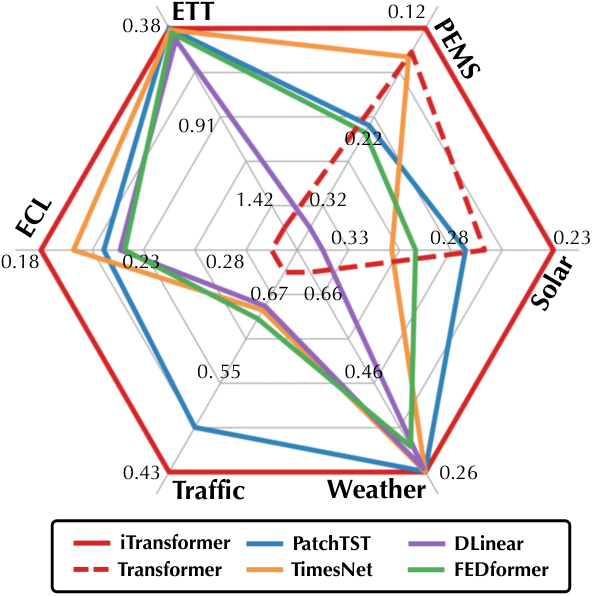
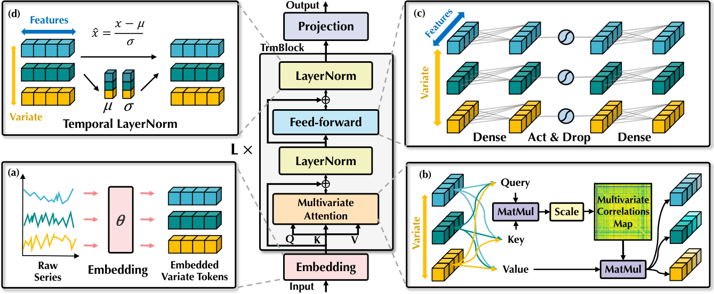
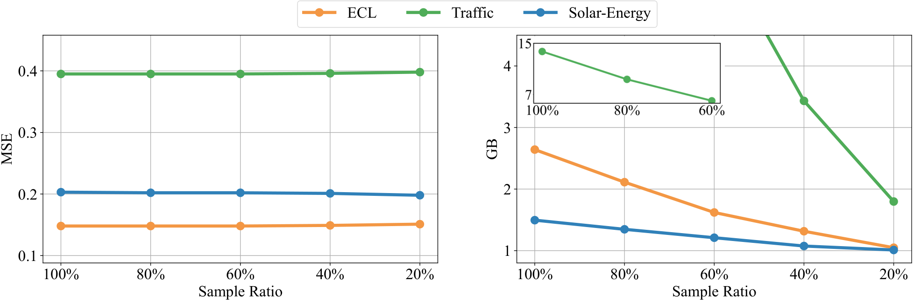
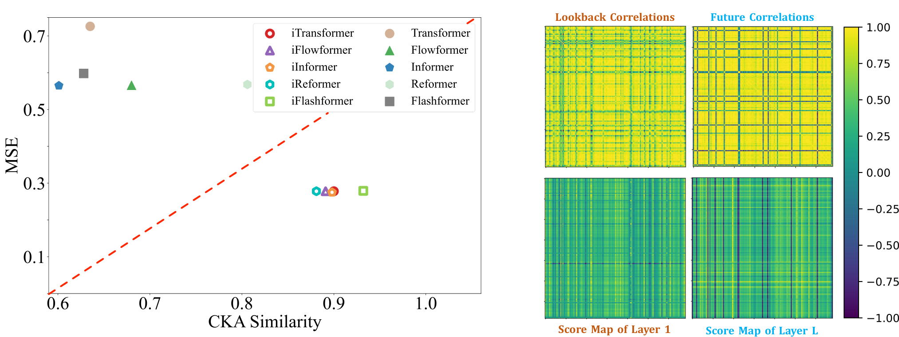

# iTransformer — Transformer를 고치지 않고, 어느 축에 쓰는지만 뒤집었다

## 📌 메타 정보

| 항목 | 내용 |
|---|---|
| **논문 제목** | iTransformer: Inverted Transformers Are Effective for Time Series Forecasting |
| **저자** | Yong Liu*, Tengge Hu*, Haoran Zhang*, Haixu Wu, Shiyu Wang, Lintao Ma, Mingsheng Long (*공동 1저자) |
| **소속** | Tsinghua University (School of Software, BNRist) / Ant Group |
| **공개일** | 2023-10-10 (arXiv v1) → 2024-03-09 (v3, 최종) |
| **학회** | **ICLR 2024 Spotlight** |
| **분야** | Multivariate Time Series Forecasting(다변량 시계열 예측), Transformer architecture(구조 재설계) |
| **OpenReview** | https://openreview.net/forum?id=JePfAI8fah |
| **arXiv abstract** | https://arxiv.org/abs/2310.06625 |
| **arXiv HTML (v3)** | https://arxiv.org/html/2310.06625v3 |
| **공식 코드** | https://github.com/thuml/iTransformer |
| **비공식 재구현** | https://github.com/lucidrains/iTransformer |
| **사용한 데이터** | ECL, ETT(4종), Exchange, Traffic, Weather, Solar-Energy, PEMS(4종) + Market(Alipay 서버 부하, 6종·비공개) |
| **새로 만든 부품** | **없음** (Transformer 기본 부품을 그대로 씀 — 이게 논문의 셀링 포인트) |
| **리뷰 시점** | 2026-09-08. OpenReview는 봇 차단(challenge) 상태라 리뷰어 코멘트 미확보, 본문은 arXiv v3 전문 기준 |

---

## 📖 주요 용어 사전 (Glossary)

*이 논문은 새 용어를 거의 만들지 않습니다. 대신 "기존 용어를 어느 축(axis)에 적용하느냐"를 뒤집기 때문에, **축이 무엇인지**만 정확히 잡으면 논문 전체가 읽힙니다.*

### 시계열 데이터의 두 축

| 용어 | 풀이 |
|---|---|
| **variate(변량) / channel(채널)** | 동시에 기록되는 서로 다른 계측값 하나하나. 예: 발전소 센서 137개면 변량 137개. 이 논문에서 가장 중요한 단어. |
| **time step(시점)** | 시간축 위의 한 칸. 예: 10분 간격이면 한 칸이 10분. |
| **lookback window(과거 관측 구간)** | 모델에 입력으로 넣는 과거 길이. 논문 주 실험은 **96칸 고정**. |
| **prediction length(예측 길이, horizon)** | 앞으로 몇 칸을 맞힐지. 논문은 96/192/336/720의 평균으로 보고. |
| **multivariate forecasting(다변량 예측)** | 여러 변량을 동시에 예측하는 문제. 변량끼리 서로 영향을 주고받는다는 게 핵심 가정. |

### 토큰화(tokenization) — 이 논문의 전장(戰場)

| 용어 | 풀이 |
|---|---|
| **temporal token(시각 토큰)** | 기존 방식. **같은 시각의 모든 변량을 묶어** 토큰 1개로 만든다. 전압·온도·유량이 한 벡터로 압착된다. |
| **variate token(변량 토큰)** | 이 논문의 방식. **한 변량의 lookback 전체를** 토큰 1개로 만든다. 토큰 개수 = 변량 개수. |
| **patching(패치)** | 시간축을 몇 칸씩 묶어 토큰으로 만드는 절충안(PatchTST). 논문은 variate token을 "패치 크기를 lookback 전체로 키운 극단"이라고 설명. |
| **Channel Independence, CI(채널 독립)** | 변량마다 따로따로 예측하되 backbone(백본) 가중치는 공유하는 전략. 강하지만 변량 수만큼 forward를 반복해야 해 느리다. |
| **Channel Dependence, CD(채널 의존)** | 변량 간 상관을 명시적으로 쓰는 전략. 이론상 표현력이 크지만 데이터가 적으면 과적합한다. |

### 모델 부품 (역할이 뒤집히는 대상)

| 용어 | 풀이 |
|---|---|
| **self-attention(자기 어텐션)** | 토큰들끼리 서로 얼마나 관련 있는지 점수를 매겨 섞는 연산. **순서를 모른다**(permutation-invariant) — 이게 시간축에 쓰면 안 되는 이유. |
| **FFN (Feed-Forward Network, 순전파 신경망)** | 토큰 하나 안에서 차원을 늘렸다 줄이는 2층 MLP. 토큰마다 **같은 가중치**로 독립 적용된다. |
| **LayerNorm(층 정규화)** | 벡터 하나를 평균 0, 분산 1로 맞추는 연산. **무엇을 벡터 하나로 보느냐**에 따라 의미가 완전히 달라진다. |
| **RevIN (Reversible Instance Normalization)** | 시계열마다 평균·분산을 빼고 예측 후 되돌리는 기법. 분포 변화(distribution shift) 대응용. 논문은 "뒤집힌 LayerNorm이 이 역할을 겸한다"고 주장하지만, **코드에는 RevIN이 별도로 또 들어 있다**(→ 7.7). |
| **positional embedding(위치 임베딩)** | 토큰 순서를 알려주는 벡터. iTransformer는 **필요 없다** — 순서가 FFN 뉴런 배치에 암묵적으로 저장되기 때문. |

### 평가·분석

| 용어 | 풀이 |
|---|---|
| **MSE / MAE** | 평균제곱오차 / 평균절대오차. 낮을수록 좋음. |
| **CKA (Centered Kernel Alignment)** | 두 층의 표현이 얼마나 닮았는지 재는 지표. 선행 연구에서 "예측 같은 저수준 생성 과제는 CKA가 높은 편이 좋다"는 경험칙이 있음. |
| **variate generalization(미학습 변량 일반화)** | 학습 때 본 적 없는 변량을 추가 학습 없이 예측하는 능력. iTransformer의 부산물. |

---

## 📝 논문 요약 (TL;DR)

**한 줄**: Transformer 부품은 하나도 안 고치고, **어텐션을 시간축 → 변량축으로, FFN을 변량축 → 시간축으로 맞바꿨더니** 시계열 예측이 좋아졌다.

**문제**: 기존 Transformer 예측기는 "같은 시각의 여러 변량"을 토큰 하나로 묶는다(temporal token). 그런데 (1) 단위도 분포도 다른 물리량이 한 채널로 압착되어 변량 간 상관이 지워지고, (2) 시점 하나는 정보가 너무 적으며, (3) 변량마다 시차(delay)가 있어 "같은 시각"이 "같은 사건"이 아니다. 게다가 순서를 모르는 어텐션을 순서가 전부인 시간축에 쓴다. 그 결과 단순한 linear model(선형 모델)에게 지는 굴욕을 당했다.

**해결책**: 축을 뒤집는다(invert). 변량 하나의 lookback 전체를 토큰 하나로 접고 → 어텐션은 변량 간 상관을 담당 → FFN은 시계열 표현 학습을 담당 → LayerNorm은 변량별로 적용되어 RevIN 역할까지 겸한다. 새 모듈은 0개.

**검증**: 7개 실데이터 + 10개 baseline(기준 모델). 변량이 많은 데이터(Traffic 862개, ECL 321개, PEMS 300개 이상)에서 압승. 5종의 Transformer 변종에 그대로 얹어 평균 16.8~38.9% 개선. 다만 **변량이 7~8개뿐인 ETT·Exchange에서는 선형 모델에 진다**(→ 7장).



---

## 🎯 핵심 기여 (Contributions)

1. **진단**: Transformer가 시계열에서 약한 건 Transformer가 나빠서가 아니라 **잘못된 축에 쓰였기 때문**이라고 재정의.
2. **처방**: 부품 수정 없이 축만 뒤집는 iTransformer 제안. 어텐션 = 변량 상관, FFN = 시계열 표현, LayerNorm = 변량별 정규화.
3. **범용성 입증**: Reformer, Informer, Flowformer, FlashAttention 등 5종에 "뒤집기"만 적용해 일괄 성능 향상 — 즉 특정 모델이 아니라 **프레임워크**임을 보임.
4. **부산물 2개**: (a) 학습/추론의 변량 개수가 달라도 됨 → 미학습 변량 일반화, (b) 배치마다 변량 20%만 학습해도 성능 유지 → 메모리 대폭 절감.

---

## 🧩 주요 알고리즘 설명

### 3.1 무엇이 토큰인가 — 그림 한 장으로 끝나는 차이

*이 절을 두는 이유: 이 논문의 모든 결과는 "토큰의 정의를 바꿨다"는 단 한 가지 변화에서 파생되므로, 여기만 정확히 이해하면 나머지는 따라온다.*

입력을 `X`라 하고 lookback 길이 `T`, 변량 개수 `N`이라 하자. 즉 `X`는 `T × N` 행렬이다.

| | 무엇을 토큰 1개로 보나 | 토큰 개수 | 토큰 1개의 크기 |
|---|---|---|---|
| **기존 Transformer** | 같은 시각의 모든 변량 | `T`개 (=96) | `N`차원 |
| **iTransformer** | 한 변량의 lookback 전체 | `N`개 (=862 등) | `T`차원 |

수식으로는 다음 4줄이 전부다.

```
H⁰      = Embedding(X_:,n)          # 변량 n의 시계열 전체 → d차원 벡터 1개 (MLP)
H'ˡ     = LayerNorm(H^{l-1} + SelfAttention(H^{l-1}))   # 변량축 상관
Hˡ      = LayerNorm(H'ˡ + FFN(H'ˡ))                     # 시계열 표현
Ŷ_:,n   = Projection(H^L_n)         # d차원 → 예측 길이 S (MLP)
```

*(위 식을 말로 풀면: 변량 하나의 과거 96칸을 MLP로 눌러 벡터 하나로 만들고 → 그 벡터들끼리 어텐션으로 섞고 → 각 벡터를 FFN으로 다듬고 → 마지막에 MLP로 펴서 미래 720칸을 뽑는다.)*

**위치 임베딩이 없다.** 시간 순서는 이미 임베딩 MLP의 뉴런 배치(neuron permutation)에 들어가 있기 때문이다.



### 3.2 부품 3개의 역할이 어떻게 바뀌는가

*이 절을 두는 이유: 축을 뒤집으면 같은 코드가 전혀 다른 의미를 갖는데, 그 의미 변화가 곧 성능 향상의 근거이기 때문.*

| 부품 | 기존 (temporal token) | 뒤집은 뒤 (variate token) | 왜 좋아지나 |
|---|---|---|---|
| **LayerNorm** | 같은 시각의 변량들을 정규화 → 변량끼리 섞임 | 개별 변량의 시계열을 정규화 | 계측 단위 차이가 사라지고, 비정상성(non-stationarity) 대응 = RevIN 효과 |
| **FFN** | 시각 하나의 변량 묶음을 처리 | 변량 하나의 시계열 전체를 처리 | 뉴런이 진폭·주기·주파수 필터처럼 동작. 선형 예측기의 장점을 흡수 |
| **self-attention** | 시점끼리 섞음 (순서 무시 → 부적절) | 변량끼리 섞음 (순서 없음 → 적절) | 어텐션 점수 행렬 자체가 **변량 상관 행렬**이 되어 해석 가능 |

**어텐션 맵의 해석 가능성**은 실제로 관측된다(Figure 7 오른쪽). 얕은 층의 점수 행렬은 **과거 구간의 변량 상관**을 닮고, 깊은 층으로 갈수록 **미래 구간의 상관**을 닮아간다. 즉 "과거 인코딩 → 미래 디코딩"이 FFN을 통과하며 진행된다는 서사가 그림으로 나온다.

### 3.3 부산물 — 변량 개수 유연성

*이 절을 두는 이유: 이건 논문이 노린 게 아니라 구조상 자동으로 따라오는 성질인데, 실무 가치는 오히려 이쪽이 더 클 수 있어서.*

토큰 개수 = 변량 개수인데, 어텐션은 원래 토큰 개수에 제약이 없다. 따라서:

- **미학습 변량 일반화**: 변량을 5등분해 **20%만으로 학습**하고 전체를 예측해도 성능 저하가 작다. CI 방식은 변량을 하나씩 순차 예측해야 해 느린데, iTransformer는 한 번에 전부 뱉는다.
- **효율적 학습 전략**: 배치마다 변량을 무작위로 일부만 뽑아 학습. 성능은 거의 그대로인데 메모리는 크게 준다.



### 3.4 입력이 실제로 어떻게 생겼나 — 텐서를 직접 찍어보면

*이 절을 두는 이유: "축을 뒤집는다"가 추상적으로 들리는데, 실제 텐서 모양과 `Linear`가 먹는 축을 보면 한 줄로 끝나는 이야기이기 때문. 그리고 PatchTST와 헷갈리기 쉬운 지점이 정확히 여기다.*

#### 텐서의 실제 모양 = `[[온도][습도][풍속]]`

Weather 데이터(온도·습도·풍속 3변량, lookback 96)를 실제로 넣어 찍어보면 이렇다.

```
원본 x            : (1, 96, 3)     (B, 시간, 변량)
  x[0, 0, :]      = [20.1, 65.0, 2.1]   ← 1시의 온도/습도/풍속

permute(0, 2, 1)  : (1, 3, 96)     (B, 변량, 시간)   ★ inverted의 전부
  xi[0, 0] = [20.1, 20.2, 20.3, ... ] 96개   ← 온도 한 줄
  xi[0, 1] = [65.0, 64.9, 64.8, ... ] 96개   ← 습도 한 줄
  xi[0, 2] = [ 2.1,  2.1,  2.1, ... ] 96개   ← 풍속 한 줄

Linear(96 → 512)  : (1, 3, 512)    ← 변량 3개가 각각 512차원 토큰 1개
```

#### "같이 들어간다" ≠ "섞인다"

`nn.Linear`는 **마지막 차원에만** 작용하고 앞 차원은 전부 배치로 취급한다.

```
xi          [1, 3, 96]
             ↑  ↑   ↑
             │  │   └── Linear가 먹는 축 (96 → 512)
             └──┴────── 전부 "배치". 여기 있는 것들끼리는 절대 안 섞임
```

즉 `Linear(96→512)`는 온도 행에 한 번, 습도 행에 한 번, 풍속 행에 한 번 **같은 가중치로 따로** 적용된다. 실험으로 확인한 결과:

| 방식 | 입력 한 행 | 습도 행만 0으로 바꿨을 때 **온도 출력** 변화량 |
|---|---|---|
| **iTransformer** | `[20.1, 20.2, ... 96개]` (온도만) | **0.0** ← 전혀 안 변함 |
| **Informer 계열** (channel-mixing) | `[20.1, 65.0, 2.1]` (한 시점의 세 변량) | **37.42** ← 즉시 오염 |

Informer 계열은 `Linear(3 → 512)`가 세 변량을 한 벡터에서 곱해 더하므로 **첫 층에서 이미 뭉개진다.** iTransformer는 0.0이다 — **임베딩 단계에서는 변량이 완전히 격리되고, 섞이는 곳은 오직 self-attention 한 군데다.** 그래서 "어텐션 점수 행렬 = 변량 상관 행렬"이라는 해석(→ 3.2)이 성립한다.

#### 텐서 모양 추적 (Traffic 공식 설정: 862변량, lookback 96, d_model 512, e_layers 4, batch 16)

`scripts/multivariate_forecasting/Traffic/iTransformer.sh` 값 그대로다.

```
입력              [16,  96, 862]      B, 시간, 변량
  ↓ 시간축 정규화 (평균·표준편차를 시간축에서 빼고 나눔)   ← use_norm, 별도 RevIN (→ 7.7)
                  [16,  96, 862]
  ↓ permute       ★ 여기가 "inverted"의 전부
                  [16, 862,  96]      B, 변량, 시간
  ↓ Linear(96 → 512)                  ← 시계열 96칸이 벡터 1개로 눌림
                  [16, 862, 512]      B, 변량, d_model
  ↓ Encoder 4층: attention은 862개 토큰끼리 (862×862 상관행렬)
                  [16, 862, 512]
  ↓ Linear(512 → 96)                  ← 예측 길이만큼 펴기
                  [16, 862,  96]
  ↓ permute + 역정규화
출력              [16,  96, 862]      B, 예측길이, 변량
```

#### PatchTST와의 분기점은 `reshape` 한 줄이다

임베딩 코드만 보면 둘은 거의 같다.

```python
# PatchTST  (thuml/Time-Series-Library, layers/Embed.py:174)
self.value_embedding = nn.Linear(patch_len, d_model, bias=False)   # Linear(16 → 512)

# iTransformer  (thuml/iTransformer, layers/Embed.py:130)
self.value_embedding = nn.Linear(c_in, d_model)                    # Linear(96 → 512)
```

둘 다 `permute`로 표를 세로로 자르고, 한 변량의 시간 조각에 Linear를 건다. 입력 차원이 16이냐 96이냐만 다르다. 그래서 논문이 variate token을 "패치 크기를 lookback 전체로 키운 극단(the extreme case of Patching)"이라 부르는 것도 정확하다.

**갈라지는 건 그 다음 한 줄이다.**

```python
# PatchTST — 변량을 배치로 흡수  (layers/Embed.py:187)
x = torch.reshape(x, (x.shape[0] * x.shape[1], x.shape[2], x.shape[3]))
# 결과: [B×862, 12, 512]   ← 시퀀스 = 패치 → 어텐션이 시간축 → 변량은 영원히 안 만남

# iTransformer — 변량이 그대로 시퀀스  (model/iTransformer.py:57)
enc_out = self.enc_embedding(x_enc, x_mark_enc)
# 결과: [B, 862, 512]      ← 시퀀스 = 변량 → 어텐션이 변량축 → 여기서 비로소 만남
```

| | 시퀀스 축 | 어텐션이 비교하는 것 | 변량끼리 만나나 |
|---|---|---|---|
| **PatchTST** | 패치 (12개) | 같은 변량의 서로 다른 시간 구간 | ❌ **절대 안 만남** |
| **iTransformer** | 변량 (862개) | 서로 다른 변량 | ✅ **오직 그것만** |

**반증 — PatchTST를 극단으로 밀어도 iTransformer가 되지 않는다.** PatchTST에서 `patch_len = stride = seq_len = 96`으로 놓으면 토큰화는 완전히 같아진다(변량당 토큰 1개, `Linear(96→512)`). 그런데 그 뒤 `reshape(B×862, 1, 512)`라 시퀀스 길이가 1이고, **토큰 1개가 자기 자신하고만 어텐션 → 소프트맥스가 항등 연산 → 그냥 MLP가 된다.** 변량은 여전히 배치에 숨어 있기 때문이다. 즉 "극단적 패칭"은 **토큰화의 계보**를 설명하는 말이지 아키텍처가 같다는 뜻이 아니다.

#### 임베딩 자체의 차이 하나 — 위치 임베딩

```python
# PatchTST
x = self.value_embedding(x) + self.position_embedding(x)   # ← 더함

# iTransformer (DataEmbedding_inverted)
x = self.value_embedding(x)                                 # ← 없음. 끝.
```

PatchTST는 **패치의 순서가 중요하니까** 필요하고(1~16시 패치와 80~96시 패치는 다른 위치), iTransformer는 **변량에는 순서가 없으니까** 뺐다(온도가 1번이고 습도가 2번인 건 임의의 열 순서일 뿐). 이 한 줄이 두 모델의 시퀀스 축이 무엇인지 그대로 드러낸다.

#### 나머지 실제 차이 (Traffic 862변량, lookback 96, d_model 512 기준)

| | PatchTST | iTransformer |
|---|---|---|
| Linear 입력 | `Linear(16 → 512, bias=False)` | `Linear(96 → 512)` |
| 위치 임베딩 | ✅ 있음 | ❌ 없음 |
| 임베딩 후 모양 | `[B×862, 12, 512]` | `[B, 862, 512]` |
| 어텐션 축 | 패치(시간) | 변량 |
| 인코더 정규화 | **BatchNorm** (transpose 사이에 끼움) | **LayerNorm** |
| 출력 헤드 | Flatten 후 `Linear(512×12=6144 → 96)` | `Linear(512 → 96)` |
| 배치 1개당 어텐션 쌍 | 862 × 12² = 124,128 | 862² = **743,044** |
| lookback 변경 | 자유 (패치 수만 늘어남) | **불가** — `Linear(96→512)`에 박혀 있음 |
| 변량 개수 변경 | 자유 (배치 크기만 변함) | 자유 (시퀀스 길이만 변함) |
| 변량 간 상관 | **못 봄** | **그것만 봄** |

출력 헤드 크기 차이도 크다. PatchTST는 변량 하나의 패치 12개를 전부 flatten해 6144차원 → 96으로 보내는데, iTransformer는 512 → 96이다. **12배 작은 헤드**인데, 시간 정보를 이미 입력단 `Linear(96→512)`에서 다 눌러버렸기 때문이다.

**마지막 줄이 실무에서 제일 아프다.** 논문이 자랑하는 "변량 개수 유연성"과 정반대로, **시간 길이는 완전히 경직**되어 있다. lookback 96으로 학습한 체크포인트는 336을 받지 못한다.

---

## 📊 실험 요약

### 4.1 메인 결과 (Table 1, 평균 MSE, lookback 96 고정)

*이 표를 보는 이유: 논문의 "SOTA" 주장이 어느 조건에서 성립하고 어디서 깨지는지를 한눈에 가르기 위해.*

| 데이터셋 (변량 수) | **iTransformer** | 최고 경쟁자 | 판정 |
|---|---|---|---|
| PEMS 평균 (300~900) | **0.119** | SCINet 0.121 / PatchTST 0.217 | 압승 |
| Traffic (862) | **0.428** | PatchTST 0.481 | 압승 |
| Solar-Energy (137) | **0.233** | PatchTST 0.270 | 압승 |
| ECL (321) | **0.178** | TimesNet 0.192 | 승 |
| Weather (21) | 0.258 | PatchTST / TimesNet 0.259 | 사실상 동률 |
| ETT 평균 (7) | 0.383 | **RLinear 0.380** | **패** |
| Exchange (8) | 0.360 | **DLinear 0.354** | **패** |

**읽는 법: 변량 수와 승패가 정확히 상관한다.** 변량 100개 이상이면 압승, 20개면 무승부, 7~8개면 2023년 선형 모델에 진다.

### 4.2 프레임워크 범용성 (Table 2, 상대 MSE 감소율)

*이 표를 보는 이유: "특정 모델이 좋다"가 아니라 "뒤집기라는 조작이 좋다"를 뒷받침하는 핵심 근거이기 때문.*

| 백본 | Transformer | Reformer | Informer | Flowformer | Flashformer |
|---|---|---|---|---|---|
| 평균 개선율 | **38.9%** | 36.1% | 28.5% | 16.8% | 32.2% |

극단적 사례: Weather에서 Reformer는 MSE 0.803 → 0.248 (69.2% 감소). 부품을 안 고치고 축만 바꿔 얻은 수치라는 점에서 설득력이 있다.

### 4.3 절제 실험 (Table 3, 평균 MSE) — 이 논문에서 가장 중요한 표

*이 표를 보는 이유: 논문이 파는 서사와 실제 기여 분해가 어긋나는 지점이 여기에 있다(→ 7.1).*

| 설계 | 변량축 | 시간축 | ECL | Traffic | Weather | Solar |
|---|---|---|---|---|---|---|
| **iTransformer** | Attention | FFN | **0.178** | **0.428** | 0.258 | **0.233** |
| 시간축 제거 | Attention | 없음 | 0.189 | 0.456 | 0.261 | 0.258 |
| 변량축 제거 | 없음 | FFN | 0.193 | 0.461 | 0.265 | 0.261 |
| 둘 다 FFN | FFN | FFN | 0.182 | 0.599 | **0.248** | 0.269 |
| **vanilla 배치** | FFN | Attention | 0.202 | 0.863 | 0.258 | 0.285 |
| 둘 다 Attention | Attention | Attention | 0.193 | 0.913 | 0.255 | 0.261 |

### 4.4 표현 분석 (Figure 7)

*이 절을 두는 이유: "왜 뒤집으면 좋은가"에 대한 논문의 유일한 정량적 설명 시도.*

첫 블록과 마지막 블록의 출력 사이 CKA 유사도를 재면, iTransformer 계열과 원본 Transformer 계열 사이에 **깔끔한 분리선**이 생긴다. CKA가 높은 쪽(iTransformer)이 MSE도 낮다.



---

## 🔍 급소 — 확인된 문제들

### 7.0 [독창성] "변량을 토큰으로"는 이미 있던 것이다 ⭐

*이 절을 맨 앞에 두는 이유: 7.1 이하가 "이 방법이 얼마나 잘 되나"를 따진다면, 그보다 먼저 물어야 할 것은 "이게 새로운가"이기 때문.*

2023년 기준으로 "각 개체 하나 = 토큰 하나, 어텐션으로 개체끼리 관계 학습"은 이미 여러 분야의 기본기였다.

| 분야 | 모델 | 토큰이 무엇인가 |
|---|---|---|
| 집합 | **Set Transformer** (2019) | 집합의 원소 하나 |
| 정형 데이터 | **TabTransformer** (2020) | **컬럼(피처) 하나** ← 사실상 동일한 발상 |
| 다변량 시계열 | **MTGNN / StemGNN** (2020) | 변량 하나 = 그래프 노드, 변량 간 인접행렬 학습 |
| 다변량 시계열 | **Crossformer** (ICLR **2023**) | cross-time + **cross-dimension** 2단계 어텐션 |
| 다변량 시계열 | **TSMixer** (2023) | 시간축·피처축 교대 MLP mixing |

특히 **Crossformer는 1년 앞서 같은 학회(ICLR)에서 변량 간 어텐션을 명시적으로 했다.** 논문 §2가 직접 그렇게 쓴다.

> *"the third category refurbishes Transformer in both aspects of component and architecture. Representative (Zhang & Yan, 2023) explicitly captures the **cross-time and cross-variate dependencies**..."*

즉 논문도 "변량 간 상관을 어텐션으로 잡는다"가 새롭지 않다는 걸 알고 있다. 그래서 논문이 내세우는 novelty는 그게 아니라 **Figure 3의 4분류표**다.

| | 부품 수정 | 구조 수정 | 해당 모델 |
|---|---|---|---|
| 1분류 | ✅ | ❌ | Autoformer, Informer, FEDformer |
| 2분류 | ❌ | ❌ | PatchTST, Stationary (전처리만) |
| 3분류 | ✅ | ✅ | **Crossformer** |
| **4분류** | **❌** | **✅** | **iTransformer (자기 자신뿐)** |

> *"as the only one that belongs to the fourth category **to our best knowledge**"*

**분류표를 만들었더니 자기 칸만 비어 있다.** novelty를 만들어내는 전형적 방식이다. "부품을 안 고쳤다"가 축이 되려면 그게 왜 중요한지 논증이 필요한데, 논문의 논거는 "부품은 이미 검증됐으니 구조가 문제다"라는 신념 진술에 가깝다.

실질적으로 Crossformer와 다른 점은 하나뿐이다.

```
Crossformer   : 시간축 어텐션 있음 + 변량축 어텐션 있음   (2단계)
iTransformer  : 시간축 어텐션 없음 + 변량축 어텐션 있음   ← 시간축을 통째로 삭제
```

**"변량을 토큰으로 쓴 것"이 아니라 "시간축을 아예 없앤 것"이 이 논문의 실제 베팅이다.** 그리고 그 베팅마저 절제 실험이 약하게 지지한다(→ 7.1) — 변량축 어텐션을 통째로 빼도 Traffic에서 7.7%밖에 안 나빠지고, 그 자리에 남는 "변량별 MLP"는 사실상 DLinear/TiDE 계열이다.

**공정하게 남는 것:** ① 시계열 Transformer 판에서는 Informer(2021) 이후 3년간 아무도 기본값을 뒤집지 않았고, 이 논문이 그걸 했다. ② 5개 백본에 일괄 적용해 16.8~38.9% 개선을 보인 검증 규모(→ 4.2). ③ 변량 개수 유연성이라는 실무 부산물(→ 3.3). ④ 변량 어텐션의 원조격인 Crossformer를 Traffic 0.550 vs 0.428로 실제로 이겼다.

> **정리: 이 논문은 발명 논문이 아니라 정리·검증 논문이다. 그게 나쁜 건 아니지만, Abstract와 Figure 3의 4분류표는 그걸 발명처럼 보이게 프레이밍한다.**

### 7.1 [해석 불일치] Ablation이 논문의 서사와 다른 얘기를 한다 ⭐

Table 3(→ 4.3)을 축별로 분해하면 이렇게 읽힌다.

| 무엇을 했나 | Traffic MSE | 기준 대비 |
|---|---|---|
| 변량 어텐션 **하나만** | 0.456 | +6.5% |
| 시간축 FFN **하나만** | 0.461 | +7.7% |
| 둘 다 (= iTransformer) | 0.428 | 기준 |
| 시간축에 어텐션을 **넣는 순간** | 0.863 ~ 0.913 | **+102~113%** |

**둘 중 아무거나 하나만 있어도 이득의 90% 이상이 나온다.** 반대로 시간축에 어텐션을 넣으면 MSE가 2배로 폭발한다.

즉 이 논문의 실제 발견은 *"Transformer를 뒤집으면 좋다"*보다 **"시간축 어텐션이 유해하다"**에 훨씬 가깝다. 논문 제목과 서사의 주인공은 "변량 어텐션"인데, 정량 기여로 보면 변량 어텐션은 **부차적**이다. 논문은 이 해석을 하지 않는다.

또 하나: Weather(21변량)에서는 **FFN/FFN(0.248)이 iTransformer(0.258)를 이긴다.** 어텐션이 오히려 손해라는 뜻인데, 본문은 "변량이 적으면 FFN/FFN도 괜찮다" 정도로 넘어간다.

### 7.2 [주장 범위] "state-of-the-art"의 조건이 흐려져 있다

4.1에서 보듯 우위는 **변량 100개 이상**에 한정된다. ETT·Exchange에서 지는 사실은 Table 1 안에 정직하게 실려 있지만, Abstract와 Figure 1은 "achieves state-of-the-art on challenging real-world datasets"로 요약한다. 부록 G.2에는 *"단변량 시나리오에서 iTransformer는 사실상 stackable linear forecaster로 퇴화한다"*는 자기 진단이 있는데, **이 문장이 본문이 아니라 부록에 있다.**

### 7.3 [실험 설계] lookback 96 고정이 자기 주장과 충돌한다

이 논문의 셀링 포인트 중 하나가 "lookback을 늘리면 성능이 좋아진다"(Figure 6)이다. 그런데 메인 표(Table 1)는 lookback 96 고정이다. 긴 lookback에서 유리해지는 경쟁자(PatchTST, DLinear 계열)와의 비교가 **각자 최적 조건이 아닌 지점**에서 이뤄진 셈이다.

### 7.4 [효율] "효율적"이 조건부다 — 논문도 인정

부록 D가 솔직하다. 어텐션 복잡도는 토큰 수의 제곱인데, iTransformer의 토큰 수는 변량 수 `N`이고 원본은 시점 수 `T`다. **Traffic은 N=862 > T=96이므로 iTransformer가 더 무겁다.** 메모리 이득이 없고, 속도만 조금 빠르다. "효율적"이 성립하려면 선형 복잡도 어텐션(Flowformer)이나 20% 변량 샘플링을 **같이 써야** 한다.

### 7.5 [논증] CKA는 상관이지 인과가 아니다

"CKA가 높으면 예측이 좋다"는 인용된 선행 연구의 경험칙이다. 이 논문은 그 경험칙을 전제로 깔고 "iTransformer가 CKA가 높으니 좋은 표현을 배웠다"고 말한다. 순환 논증에 가깝고, CKA를 직접 올리는 개입 실험은 없다.

### 7.6 [사소] Ethics Statement가 한 줄

*"시계열 예측 문제만 다루므로 잠재적 윤리 위험이 없다."* 전력망·교통 인프라 예측 모델인데 성의 없는 처리다.

### 7.7 [논문 ↔ 코드 괴리] 공식 저장소를 열면 셋이 다르다 ⭐

*이 절을 두는 이유: 논문 서술만 읽고 구현하면 세 군데에서 어긋난다. 셋 다 논문의 핵심 주장과 직접 관련된다.*

**(1) "MLP"라고 써놓고 코드는 Linear 한 장이다.**

논문 §3.1:
> *"Embedding and Projection are both implemented by multi-layer perceptron (MLP)."*

```python
# layers/Embed.py:130 — DataEmbedding_inverted
self.value_embedding = nn.Linear(c_in, d_model)   # ← 층 1개. 활성함수도 없음
# model/iTransformer.py
self.projector = nn.Linear(configs.d_model, configs.pred_len, bias=True)   # ← 여기도 1장
```

입력단과 출력단이 각각 **선형층 1장**이고, 비선형은 Transformer 블록 안에만 있다. "MLP로 시계열 표현을 배운다"(→ 3.2의 FFN 서사)는 주장이 코드에서는 절반만 성립한다.

**(2) LayerNorm이 RevIN을 겸한다고 했는데, 코드에는 RevIN이 따로 들어 있다.**

논문 §3.2는 "뒤집힌 LayerNorm이 비정상성(non-stationarity)을 처리한다"고 주장한다. 그런데 `forecast()`의 첫 5줄:

```python
if self.use_norm:
    # Normalization from Non-stationary Transformer
    means = x_enc.mean(1, keepdim=True).detach()
    x_enc = x_enc - means
    stdev = torch.sqrt(torch.var(x_enc, dim=1, keepdim=True, unbiased=False) + 1e-5)
    x_enc /= stdev
```

**임베딩에 들어가기 전에 시간축 기준 명시적 정규화가 별도로 있고**, 예측 후 되돌린다. Non-stationary Transformer에서 가져온 것이며 논문이 말한 LayerNorm 효과와는 **별개의 추가 장치**다. 즉 "LayerNorm만으로 된다"는 주장은 코드가 지지하지 않는다. (PatchTST도 같은 코드를 쓴다 — 즉 이건 iTransformer 고유 이점이 아니라 두 모델의 **공통 전제**다.)

**(3) 타임스탬프를 "추가 변량 토큰"으로 넣는 미문서화 경로가 있다.**

```python
# layers/Embed.py:140
x = self.value_embedding(torch.cat([x, x_mark.permute(0, 2, 1)], 1))
# model/iTransformer.py:62
dec_out = self.projector(enc_out).permute(0, 2, 1)[:, :, :N]  # 공변량은 출력에서 잘라냄
```

시각 정보(시/요일/월)를 **변량 축에 그냥 이어붙여** 토큰을 늘리고, 출력에서 앞 N개만 잘라 쓴다. 구조 변경이 0이다. **이건 Chronos-2의 `group_ids` 공변량 처리와 정확히 같은 발상**인데(→ `PAPER_Chronos.md` §3.4), 논문 본문은 이 경로를 거의 설명하지 않는다 — 코드 주석의 *"the potential to take covariates (e.g. timestamps) as tokens"* 한 줄이 전부다.

---

## 🛠 재현성 메모

*이 절을 두는 이유: 논문 제출 시점과 현재 상태가 다르므로, 지금 재현하려는 사람이 알아야 할 것만 모음.*

| 항목 | 상태 |
|---|---|
| 공식 코드 | 제출 당시 "채택되면 공개" → **실제 공개됨** (github.com/thuml/iTransformer) |
| 데이터 분할 | TimesNet과 동일 프로토콜, 시간순 분할이라 leakage(정보 누설) 없음 |
| Market 데이터 (Alipay 서버 부하 6종, 변량 285~759) | **비공개**. 부록 F.4의 "일관되게 우수" 결과는 검증 불가 |
| 하이퍼파라미터 | 부록 A.2에 기재 |
| lookback | 전 데이터셋 96 고정 (PEMS 포함), 예측 길이만 가변 |

---

## 💬 Q&A

### Q1. "축을 뒤집는다"가 코드로는 정확히 뭐가 달라지나?

거의 `transpose` 한 줄이다. 입력이 `(batch, time, variate)`일 때:

```python
# 기존 Transformer: 시간축을 토큰으로
x = embed(x)                 # (B, T, d)   토큰 T개
x = attention(x)             # 시점끼리 섞음

# iTransformer: 변량축을 토큰으로
x = x.permute(0, 2, 1)       # (B, N, T)   ← 이 한 줄이 논문의 전부
x = embed(x)                 # (B, N, d)   토큰 N개
x = attention(x)             # 변량끼리 섞음
```

임베딩 MLP의 입력 차원이 `N`에서 `T`로 바뀌고, 출력 투영이 `d → S`(예측 길이)가 된다. 위치 임베딩은 삭제한다. 부품은 하나도 새로 만들지 않는다.

### Q2. 변량이 적은 데이터에서 지는 이유가 뭔가?

두 가지가 겹친다.

1. **어텐션이 할 일이 없다.** 변량 7개면 토큰 7개짜리 어텐션이다. 배울 상관 구조가 빈약해 파라미터만 낭비된다. Table 3에서 Weather는 FFN/FFN이 이기고, 부록 G.2는 단변량에서 "선형 예측기로 퇴화"한다고 인정한다.
2. **샘플이 부족하다.** ETT 학습 샘플이 8,545개뿐이다. 부록 G.1이 인용하듯 CD(채널 의존) 전략은 표현력이 크지만 **데이터가 적으면 과적합**한다. 이 조건에서는 파라미터가 적은 선형 모델이 유리하다.

→ **이 두 번째 이유가 Chronos-2에서 결론이 뒤집히는 원인이 된다.** 자세한 비교는 [PAPER_Chronos.md](PAPER_Chronos.md)의 Q&A "iTransformer는 시간축 어텐션이 해롭다고 했는데 Chronos-2는 왜 다시 쓰나?" 참조.

### Q3. 그래서 지금(2026년) 쓸 만한가?

| 상황 | 판단 |
|---|---|
| 변량 100개 이상 + 스키마 고정 + 지도학습 파인튜닝 가능 | **여전히 강력.** 가볍고 구현이 단순하다 |
| 변량 10개 내외 | 선형 baseline(DLinear, RLinear)부터 재보라. 질 가능성이 높다 |
| 계열마다 스키마가 다름 / 콜드스타트 / 학습 데이터 부족 | Chronos-2 같은 pretrained foundation model(사전학습 기반 모델) 쪽이 압도적으로 실용적 |
| 변량 개수가 운영 중 계속 바뀜 | iTransformer의 유연성이 진가를 발휘하는 유일무이한 지점 |

---

## 🎓 무엇을 가져갈 것인가

### 남는 것 (다른 모델에도 적용되는 교훈)

1. **"어느 축에 쓰느냐"가 "무슨 부품을 쓰느냐"보다 클 수 있다.** 부품 0개 수정으로 5종 백본에 16~39% 개선을 냈다.
2. **순서를 모르는 연산(어텐션)은 순서가 중요한 축에 쓰지 마라.** 이 논문의 진짜 핵심 발견(→ 7.1).
3. **토큰 개수를 데이터 차원에 묶으면 유연성이 따라온다.** 변량 20% 학습 → 전체 예측 같은 트릭이 공짜로 생긴다.
4. **정규화의 의미는 축이 정한다.** LayerNorm을 변량축으로 옮긴 것만으로 RevIN을 별도 도입할 필요가 없어졌다.

### 주의해서 읽을 것 (인용하기 전에)

- "SOTA"는 **변량 100개 이상** 조건부다.
- Ablation은 논문 서사(변량 어텐션의 힘)가 아니라 **시간축 어텐션 제거의 힘**을 가리킨다.
- 효율 우위는 `변량 수 < lookback 길이`일 때만 성립한다.
- Market 데이터 결과는 재현 불가(비공개).

---

## 🧾 한 줄 요약 (전체)

**Transformer는 시계열에 부적합한 게 아니라 잘못된 축에 쓰이고 있었다 — 어텐션을 변량축으로, FFN을 시간축으로 옮기기만 해도 5종 백본이 일제히 좋아진다. 단, 이득의 대부분은 "변량 어텐션을 더한 것"이 아니라 "시간축 어텐션을 뺀 것"에서 나오고, 그 우위는 변량이 100개 이상일 때만 성립한다.**

---

## 🔗 관련 문서 / 메모리

- [PAPER_Chronos.md](PAPER_Chronos.md) — Chronos 계열. Chronos-2의 `GroupSelfAttention`이 iTransformer의 변량축 어텐션을 흡수한 후계이며, **대규모 사전학습 조건에서는 이 논문의 결론이 뒤집힌다**
- [PAPER_TimesFM.md](PAPER_TimesFM.md) — 시계열 foundation model. **3.0에서 variate attention이 파라미터의 40%를 차지**하는데, 이 논문의 변량축 어텐션과 같은 발상이 대규모 사전학습 모델에 안착한 또 하나의 사례
- [PAPER_PatchTST.md](PAPER_PatchTST.md) — 직전 세대. **임베딩 코드는 거의 같고(`Linear(P→d)` vs `Linear(L→d)`), 갈라지는 건 `reshape` 한 줄**이다(→ 3.4). 정규화(RevIN) 코드도 두 모델이 동일
- `figures/itransformer_fig1.png`, `_fig4.png`, `_fig7.png`, `_fig8.png` — 본 문서에 삽입된 논문 그림
