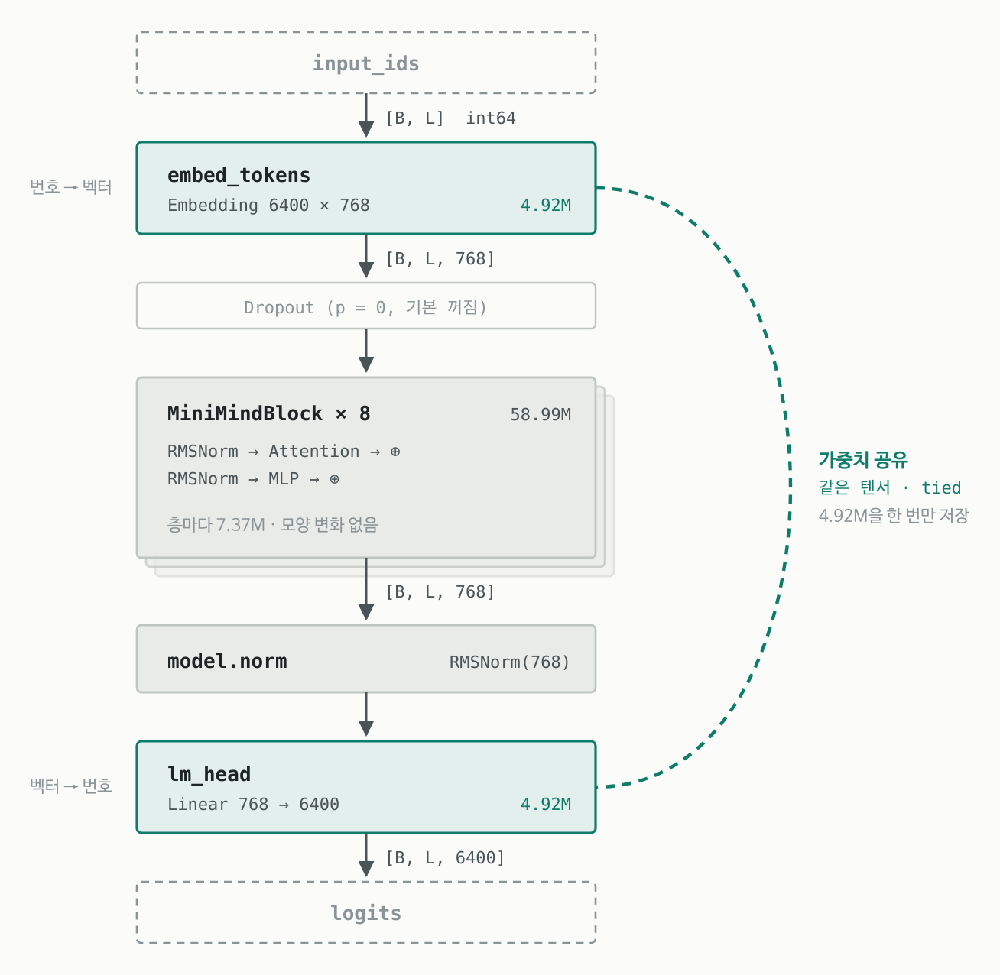
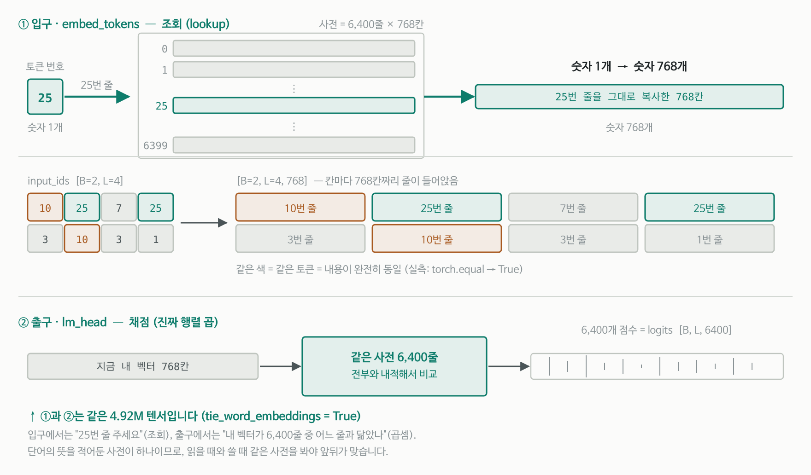
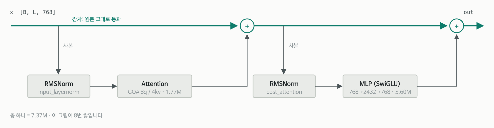
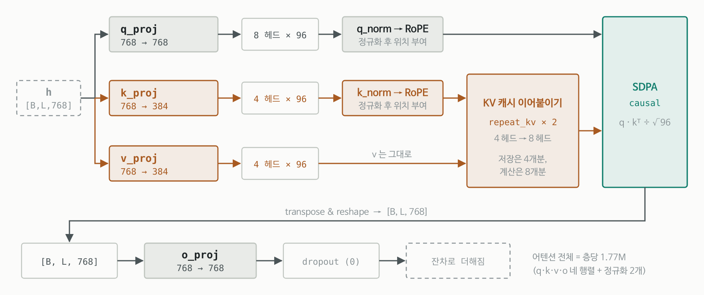
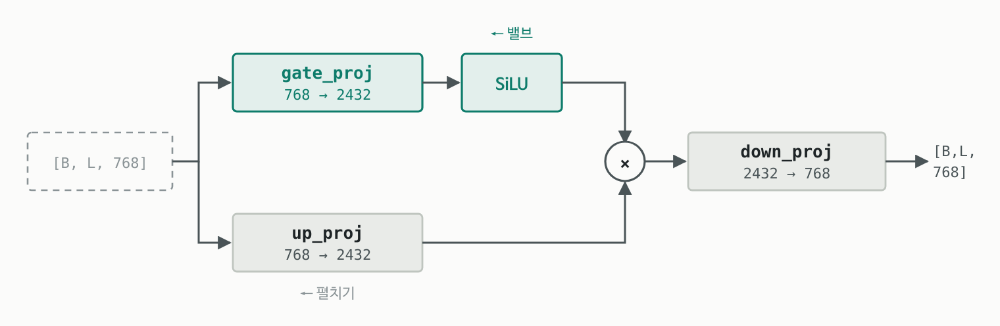
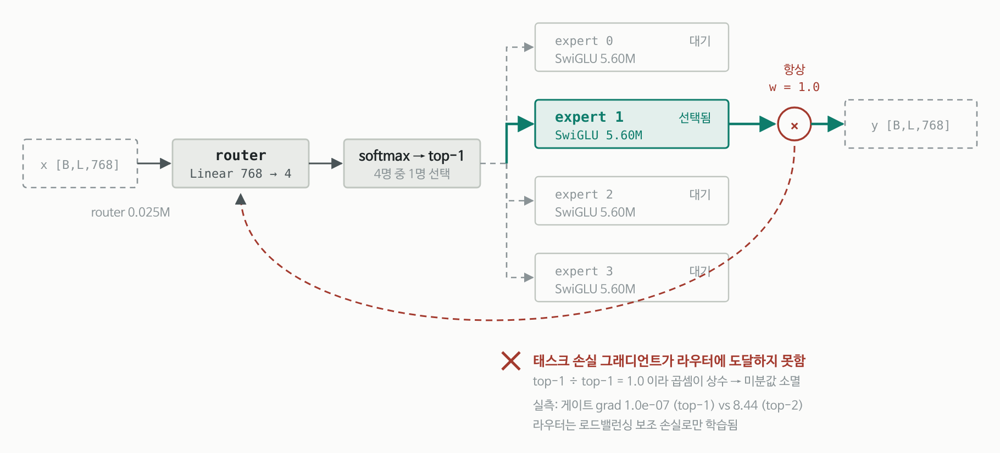
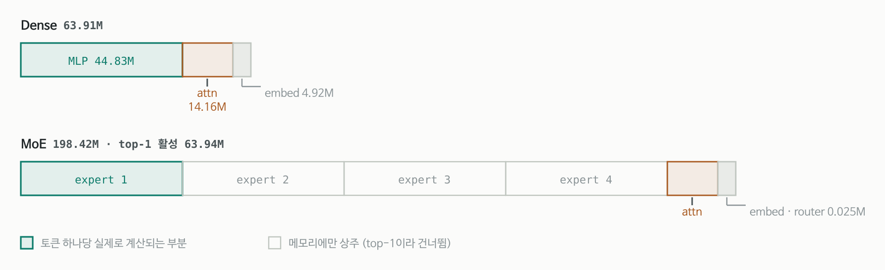

# PAPER_MiniMind — 3천원 · 2시간으로 64M LLM을 밑바닥부터 학습시키는 교육용 저장소



---

## §0. 메타 정보

| 항목 | 내용 |
|---|---|
| **이름** | MiniMind (주력 모델 `minimind-3`) |
| **저자** | jingyaogong (개인 프로젝트, 중국) |
| **공개** | 2024-08 최초 공개 · `minimind-3` 릴리스 2026-04-01 · 지속 업데이트 |
| **분야** | LLM 전 과정(사전학습→SFT→RLHF→Agentic RL) 재현, 교육용 레퍼런스 구현 |
| **코드** | https://github.com/jingyaogong/minimind |
| **모델** | HuggingFace `jingyaogong/minimind-3-pytorch` · ModelScope `gongjy/minimind-3-pytorch` |
| **라이선스** | Apache 2.0 |
| **분석 기준 커밋** | `a3c7b01` (2026-09 시점) |
| **코드 규모** | 파이썬 전체 **4,657줄** — 모델 본체는 `model/model_minimind.py` **287줄** |
| **성격** | ⚠️ SOTA 모델이 **아님**. nanoGPT의 중국어·풀스택 판 — "전 과정을 읽을 수 있는 분량으로 다시 쓰는 것"이 목적 |

> ⚠️ **이 문서의 성격**: 저장소를 클론해 코드를 직접 읽고, 모델을 실제로 띄워 측정한 결과를 1차 근거로 삼는다. 저자의 주장(파라미터 수·구조·비용)은 **가능한 한 재실행해서 검증**했고, 검증한 것과 못 한 것을 구분해 표기한다. 논문이 아닌 저장소이므로 README를 "논문 본문"에 준해 다룬다.

---

## §1. 주요 용어 사전 (Glossary)

*처음 보는 사람이 본문에서 헤매지 않도록, 반복 등장하는 용어를 먼저 모아둔다.*

### 구조 용어
- **decoder-only Transformer(디코더 전용 트랜스포머)**: 앞의 단어들만 보고 다음 단어를 맞히는 구조. GPT 계열이 전부 이것.
- **Pre-Norm(프리 놈)**: 정규화를 잔차(residual) 덧셈 **전에** 거는 방식. 원본 신호가 층을 그대로 관통해서 깊어져도 학습이 잘 됨.
- **RMSNorm**: 평균을 빼지 않고 제곱평균(root mean square)으로만 크기를 맞추는 정규화. LayerNorm보다 싸다.
- **residual(잔차)**: "곁가지에서 계산한 결과를 원본에 더한다"는 구조. 층이 깊어도 신호가 살아남는 고속도로.
- **GQA(그룹 쿼리 어텐션, Grouped Query Attention)**: 질의(query) 헤드는 많이, 키·값(key/value) 헤드는 적게 두는 어텐션. KV 캐시 메모리를 아낀다.
- **KV cache(키-값 캐시)**: 한 토큰씩 생성할 때 이미 계산한 키·값을 저장해 재사용하는 것.
- **QK-Norm**: 질의와 키에 RoPE를 걸기 **직전** 정규화를 한 번 더 거는 것. 어텐션 점수 폭주를 막는 최신 처방(Qwen3가 채택).
- **RoPE(회전 위치 임베딩, Rotary Position Embedding)**: 위치 정보를 각도 회전으로 심는 방식. 학습 파라미터가 없다.
- **YaRN**: 학습한 길이보다 긴 문장을 처리하도록 RoPE 주파수를 늘려주는 외삽(extrapolation) 기법.
- **SwiGLU**: `down(SiLU(gate(x)) × up(x))` 형태의 MLP. 한 갈래가 밸브 역할을 한다.
- **tied embedding(가중치 공유)**: 입구의 임베딩 표와 출구의 `lm_head`가 **같은 텐서**인 것.
- **MoE(전문가 혼합, Mixture of Experts)**: MLP를 여러 개(전문가) 두고 토큰마다 일부만 골라 쓰는 구조. 파라미터는 많고 계산은 적다.
- **router(라우터)**: MoE에서 "이 토큰은 몇 번 전문가에게" 를 정하는 작은 선형층.
- **top-k routing**: 전문가 중 점수 상위 k명만 쓰는 것. `top-1`이면 한 명만.
- **load balancing aux loss(로드밸런싱 보조 손실)**: 특정 전문가에 토큰이 몰리지 않도록 균등하게 퍼뜨리는 벌점.

### 학습 용어
- **Pretrain(사전학습)**: 대량 텍스트로 "다음 단어 맞히기"만 시키는 단계.
- **SFT(지도 미세조정, Supervised Fine-Tuning)**: 질문-답변 쌍으로 대화 형식을 가르치는 단계.
- **loss mask(손실 마스크)**: 학습 손실을 어느 토큰에만 걸지 정하는 것. SFT에서는 보통 assistant 답변 부분만.
- **LoRA(저랭크 적응)**: 원래 가중치는 얼리고 작은 저랭크 행렬 두 장만 학습하는 미세조정.
- **DPO(직접 선호 최적화)**: 좋은 답/나쁜 답 쌍만으로 보상 모델 없이 선호를 학습하는 방법.
- **PPO / GRPO / CISPO**: 강화학습(RL) 계열 정책 최적화 알고리즘. 자세한 비교는 §7.
- **rollout(롤아웃)**: RL에서 현재 모델로 실제 답을 생성해보는 과정.
- **advantage(어드밴티지)**: "이 답이 평균보다 얼마나 좋았나"를 나타내는 값.
- **importance ratio(중요도 비율)**: 새 정책과 옛 정책이 같은 토큰을 낼 확률의 비. RL에서 업데이트 폭을 조절하는 데 씀.
- **DDP(분산 데이터 병렬, DistributedDataParallel)**: 여러 GPU가 각자 데이터를 처리하고 그래디언트를 평균 내는 파이토치 표준 다중 GPU 방식.
- **Agentic RL**: 모델이 도구(tool)를 여러 번 호출하며 문제를 푸는 과정 전체를 RL로 학습시키는 것.

---

## §2. 한 줄 요약 (TL;DR)

**한 줄**: 어휘를 6,400개로 깎고 폭 768·8층으로 줄인 **Qwen3와 연산이 완전히 동일한** 64M 모델을, 사전학습부터 Agentic RL까지 전 과정을 파이썬 4,657줄 안에 `trl`/`peft` 없이 직접 구현해 3090 한 장·2시간·3천원으로 재현하게 만든 교육용 저장소.

**핵심 문제**: LLM 내부가 어떻게 돌아가는지 보려 해도 `transformers`·`trl`·`peft` 같은 고수준 래퍼가 다 가려버린다. 게다가 큰 GPU가 있어야 실험할 수 있다는 진입 장벽이 있다.

**해결책**:
1. 모델·데이터·학습 루프·RL 알고리즘을 전부 표준 파이토치로 다시 씀 (`trl`/`peft` 임포트 **0건** — 검증함).
2. 구조는 **Qwen3와 비트 단위로 호환**되게 설계 → 배포는 변환 스크립트 한 번으로 vLLM·llama.cpp·ollama에 그대로 올라감.
3. 어휘를 6,400개로 극단적으로 줄여 임베딩 비중을 7.7%까지 떨어뜨리고, 예산 대부분을 실제 연산층에 씀.

**결과**: 3090 1장에서 사전학습 1.21h + SFT 1.10h ≈ 2.31시간, 약 3.0 위안. 다만 객관 벤치마크(C-Eval 24.89 / CMMLU 25.38)는 **4지선다 무작위(25%) 수준**이며, README가 이 사실을 스스로 명시한다.

---

## §3. 핵심 기여 (Contributions)

*왜 이 절을 두는가: 저장소가 실제로 새로 만든 것과, 남의 것을 잘 정리한 것을 구분해두면 이후 평가가 흔들리지 않는다.*

| 기여 | 내용 | 진짜 새로운가 |
|---|---|---|
| **① 전 과정 최소 구현** | Pretrain·SFT·LoRA·DPO·PPO·GRPO·CISPO·Agentic RL·증류를 4,657줄에 | ✅ 이 조합·이 분량은 드묾 |
| **② Qwen3 호환 설계** | 구조를 Qwen3와 동일하게 맞춰 생태계에 무료 연결 | ✅ 설계 판단으로서 영리함 |
| **③ 어휘 6,400 예산 배분** | 임베딩 비중을 7.7%로 축소 | ✅ 소형 모델에서 결정적 |
| **④ 정직한 벤치마크 서술** | 표준오차 명시 + "무작위 수준"임을 자인 | ✅ 논문급 저장소보다 나음 |
| **⑤ 아키텍처 자체** | Pre-Norm·GQA·QK-Norm·SwiGLU·RoPE·MoE | ❌ **전부 Qwen3 것** (§6에서 검증) |

---

## §4. 네트워크 구조

*왜 이 절을 두는가: 이 저장소의 값어치는 "구조를 읽을 수 있게 만든 것"이므로, 구조를 텐서 모양까지 정확히 따라가는 것이 곧 저장소를 이해하는 것이다.*

모든 수치는 `MiniMindForCausalLM`을 실제로 인스턴스화해 측정했다.

### 4.1 전체 흐름

*왜: 부품을 보기 전에 전체 배관이 어떻게 이어지는지 알아야 각 부품의 역할이 보인다.*


```
input_ids [B, L]
  → embed_tokens (6400 × 768)        [B, L, 768]
  → Dropout (p=0, 기본 꺼짐)
  → MiniMindBlock × 8                [B, L, 768]   ← 모양 안 변함
  → model.norm (RMSNorm)
  → lm_head (768 → 6400)             [B, L, 6400]
```

눈여겨볼 점은 **입구와 출구가 같은 4.92M 텐서를 쓴다**는 것(tied embedding). 실측으로 `lm_head.weight`와 `embed_tokens.weight`의 메모리 주소가 동일함을 확인했다.

### 4.2 임베딩은 곱셈이 아니라 조회다

*왜: `[B, L]`이 `(6400 × 768)`을 지나 `[B, L, 768]`이 되는 과정이 초보자가 가장 많이 막히는 지점이다.*



`(6400 × 768)`을 행렬로 보면 "어떻게 곱해서 저 모양이 되지?"가 되는데, **곱셈이 아니다.** 6,400줄짜리 사전에서 번호로 한 줄을 뽑아오는 것뿐이다.

- 입력 `[B, L]`에 든 것은 데이터가 아니라 **주소(줄 번호)**
- 숫자 1개가 **숫자 768개로 부풀어난다** — 차원이 줄어든 게 아니라 축이 하나 새로 생긴 것
- **6,400은 "고를 줄이 몇 개인가"** 일 뿐이라 결과에 나타나지 않는다

실측 확인:

```python
out = emb(torch.tensor([[10, 25, 7, 25], [3, 10, 3, 1]]))
out.shape                              # (2, 4, 768)
torch.equal(out[0,0], emb.weight[10])  # True  ← 10번 줄을 통째로 복사
torch.equal(out[0,1], out[0,3])        # True  ← 둘 다 25번이니 내용 동일
```

그런데 맨 끝 `lm_head`에서는 6,400이 다시 나타난다. **같은 표를 반대 방향으로** 쓰기 때문이다.

| | 하는 일 | 모양 변화 |
|---|---|---|
| 입구 `embed_tokens` | 주소 하나 → 그 줄 하나 가져오기 (**조회**) | `[B,L]` → `[B,L,768]` |
| 출구 `lm_head` | 내 벡터를 6,400줄 전부와 내적해 점수 (**진짜 행렬 곱**) | `[B,L,768]` → `[B,L,6400]` |

이것이 가중치 공유가 말이 되는 이유이기도 하다 — 단어의 뜻을 적어둔 사전이 하나면, 읽을 때도 쓸 때도 같은 사전을 봐야 앞뒤가 맞는다.

> 참고: 수학적으로는 조회도 곱셈으로 쓸 수 있다. 토큰 10번을 6,400칸 원-핫 벡터로 만들어 표와 곱하면 정확히 10번 줄이 나온다. 결과는 같지만 0을 6,399번 곱하는 낭비라서 파이토치는 주소로 바로 꺼낸다.

### 4.3 블록 하나의 내부

*왜: 8층 전체가 같은 그림의 반복이므로, 이 한 장만 이해하면 몸통은 끝난다.*



블록은 **모양을 바꾸지 않는다.** 768 들어와서 768 나가고, 그게 8번 반복된다. 핵심은 정규화가 **본선이 아니라 곁가지에만** 걸린다는 것(Pre-Norm) — 원본 신호는 8개 층을 한 번도 건드려지지 않고 관통한다. 코드는 [`model_minimind.py:186-194`](https://github.com/jingyaogong/minimind/blob/master/model/model_minimind.py#L186) 9줄이 전부다.

```python
residual = hidden_states
hidden_states, present = self.self_attn(self.input_layernorm(hidden_states), ...)
hidden_states += residual
hidden_states = hidden_states + self.mlp(self.post_attention_layernorm(hidden_states))
```

학습 초기에 곁가지 출력이 0에 가까우면 블록은 그냥 통과 회로가 되고, 그래서 깊은 모델도 발산하지 않는다.

### 4.4 어텐션 — 비대칭이 핵심

*왜: 이 저장소에서 가장 최신 기법이 몰려 있는 부품이고, 비대칭 설계의 의도를 알아야 GQA가 왜 공짜가 아닌지 보인다.*



| 갈래 | 투영 | 헤드 | 캐시 |
|---|---|---|---|
| q (질의) | 768 → 768 | 8 × 96 | 캐시 안 함 |
| k (키) | 768 → **384** | **4** × 96 | 캐시함 |
| v (값) | 768 → **384** | **4** × 96 | 캐시함 |

세 가지 포인트:

**① GQA** — 질의는 8갈래인데 키·값은 4갈래만 만든다. 추론 시 캐시에 쌓아야 하는 건 키·값뿐이므로 캐시가 절반으로 줄고, 계산 직전에 `repeat_kv`로 4개를 8개로 복제해 짝을 맞춘다. **메모리는 아끼고 계산량은 그대로** 두는 거래다.

**② QK-Norm** — 질의와 키에 RoPE를 걸기 **직전에** 헤드 차원(96) 단위 RMSNorm을 한 번 더 건다. 어텐션 점수 폭주를 막는 처방으로, 위치와 순서가 Qwen3와 같다.

**③ 두 경로의 일치** — 플래시(SDPA) 경로와 수동 softmax 경로가 실제로 같은 값을 내는지 돌려봤다.

```
flash vs 수동 어텐션      최대 절대차 : 5.96e-07
전체 forward vs KV캐시 디코딩 최대 절대차 : 4.77e-07
```

부동소수점 오차 수준으로 일치한다. 길이 1 디코딩이거나 패딩 마스크가 있을 때만 수동 경로로 빠진다.

### 4.5 MLP — 밸브가 달린 확장

*왜: 파라미터의 70%가 여기 있으므로, 예산 이야기를 하려면 이 부품부터 봐야 한다.*



`up_proj`가 정보를 넓은 공간으로 펼치고, `gate_proj` + SiLU가 **어떤 채널을 통과시킬지 정하는 밸브** 역할을 한다. 둘을 곱한 뒤 `down_proj`로 다시 768로 접는다. 행렬이 3개라 층당 3 × 768 × 2432 = **5.60M** — 층 하나의 76%가 여기다.

확장 폭 2,432가 재밌다. LLaMA 계열 관행은 2.67배인데, MiniMind는 **원주율을 곱하고 64의 배수로 올림**해서 이 값을 얻는다.

```python
intermediate_size = math.ceil(hidden_size * math.pi / 64) * 64
# 768 × 3.1416 = 2412.7 → ÷64 = 37.7 → ceil = 38 → ×64 = 2432
```

실용적 근거는 없어 보이지만 결과적으로 GPU 타일 크기에 잘 맞는 수가 나왔다. 참고로 Qwen3는 대부분 정확히 3.0배를 쓴다(§6 표).

### 4.6 MoE 변형 — MLP 자리만 교체

*왜: MoE 버전은 구조가 아니라 "MLP 하나를 갈아끼운 것"이라는 점, 그리고 기본 설정에 함정이 있다는 점을 함께 봐야 한다.*



어텐션·임베딩은 그대로고 전문가 4명이 나란히 서서, 라우터가 토큰마다 한 명을 고른다. 전체 198M을 들고 있되 토큰 하나당 64M만 계산한다.

> ### 🔴 급소: 기본 설정에서 라우터가 학습되지 않는다
>
> [`model_minimind.py:160-161`](https://github.com/jingyaogong/minimind/blob/master/model/model_minimind.py#L160)에서 top-k를 뽑은 뒤 `norm_topk_prob=True`로 정규화하는데, 기본값이 **top-1**이다. 값 하나를 자기 자신으로 나누면 항상 1.0이므로, 전문가 출력에 곱해지는 게이트 값이 **상수 1**이 되고 라우터는 메인 손실에서 그래디언트를 못 받는다.
>
> ```
> top-1(기본) 게이트 grad (태스크 손실만) : 1.0e-07   ← 부동소수점 잡음
> top-1        게이트 grad (aux 손실만)   : 1.9e-04
> top-2        게이트 grad (태스크 손실만) : 8.44      ← 8천만 배
> ```
>
> 라우터가 배우는 것은 오직 로드밸런싱 보조 손실, 즉 "토큰을 균등하게 뿌려라"뿐이다. **"어느 전문가가 이 토큰에 더 나은가"는 학습되지 않는다.** Switch Transformer가 게이트 확률을 곱하는 이유가 정확히 이걸 막기 위해서인데, 그 신호가 정규화에 삼켜졌다.
>
> 공개된 `minimind-3-moe`(198M)가 이 설정으로 학습된 모델이다. 수정은 `norm_topk_prob and k > 1` 조건 한 줄.
>
> **원인 추정**: Qwen3-MoE 코드를 그대로 가져오면서 `norm_topk_prob=True`도 함께 가져왔는데, Qwen3-MoE는 **top-8**이라 정규화가 의미가 있다(8개 값이 합 1이 되도록). 이걸 top-1로 바꾸면서 부작용이 드러난 것으로 보인다.

### 4.7 파라미터가 어디에 쓰이는가

*왜: 소형 모델에서는 "어디에 파라미터를 안 쓸 것인가"가 성능을 가르는 결정이다.*



**Dense 63.91M** (실측)

| 부품 | 크기 | 비중 |
|---|---|---|
| MLP × 8층 | 44.83M | **70.1%** |
| Attention × 8층 | 14.16M | 22.2% |
| Embedding (= lm_head, 공유) | 4.92M | 7.7% |
| RMSNorm 전부 | 0.013M | 0.0% |
| **합계** | **63.91M** | |

**MoE 198.42M** (실측)

| 부품 | 크기 |
|---|---|
| 전문가 4명 × 8층 | 179.31M |
| Attention × 8층 | 14.16M |
| Embedding (공유) | 4.92M |
| 라우터 (768×4 × 8층) | 0.025M |
| **합계 / top-1 활성** | **198.42M / 63.94M** |

광고된 수치(64M / 198M-A64M)와 **소수점까지 일치**한다. 파라미터 수를 정직하게 표기한 저장소는 생각보다 드물다.

여기서 이 모델의 **가장 중요한 예산 결정**이 보인다. 보통 100M급 소형 모델은 어휘가 커서 임베딩이 절반 이상을 잡아먹는다. MiniMind는 어휘를 6,400개로 깎아 임베딩 비중을 7.7%까지 떨어뜨렸다.

> **만약 Qwen3의 어휘(151,936)를 그대로 썼다면?**
> 임베딩만 151,936 × 768 = **116.69M** — 모델 전체(63.91M)의 **1.8배**가 된다.
> 총 175.7M 중 임베딩이 66%를 차지하는, 사실상 "사전만 있고 머리는 없는" 모델이 됐을 것이다.

대가는 토큰 효율이다. 같은 문장에 토큰이 더 많이 들고, 중국어·영어 밖에서는 글자가 잘게 쪼개진다.

---

## §5. 학습 파이프라인

*왜: 이 저장소가 "모델 저장소"가 아니라 "전 과정 저장소"라는 점이 값어치의 절반이므로, 단계별로 무엇이 구현돼 있는지 정리해둔다.*

| 단계 | 스크립트 | 기본 설정 | 데이터 |
|---|---|---|---|
| 사전학습 | `train_pretrain.py` | epochs 2, bs 32, lr 5e-4, seq 340, accum 8 | `pretrain_t2t_mini.jsonl` |
| 지도 미세조정 | `train_full_sft.py` | epochs 2, bs 16, lr 1e-5, seq 768 | `sft_t2t_mini.jsonl` |
| 지식 증류 | `train_distillation.py` | seq 340 | SFT 데이터 |
| LoRA | `train_lora.py` | seq 340 | 태스크별 데이터 |
| DPO | `train_dpo.py` | bs 4, **lr 4e-8**, beta 0.15, seq 1024 | `dpo.jsonl` |
| PPO | `train_ppo.py` | actor+critic, GAE, KL 조기종료 | `rlaif.jsonl` |
| GRPO / CISPO | `train_grpo.py` | bs 2, lr 3e-7, num_gen 6, beta 0.1 | `rlaif.jsonl` |
| Agentic RL | `train_agent.py` | 3턴 도구 호출, num_gen 4, GRPO/CISPO | `agent_rl.jsonl` |

**SFT 손실 마스킹은 정확하다** — 2턴 대화로 실측 확인했다.

```
전체 48토큰 중 학습되는 18토큰:
['<think>','\n','\n','</think>','\n','\n','2','<|im_end|>','\n',   ← 1턴 답변
 '<think>','\n','\n','</think>','\n','\n','4','<|im_end|>','\n']   ← 2턴 답변
```

user 발화와 시스템 프롬프트에는 손실이 걸리지 않는다. 라벨 누출 없음.

**RL 알고리즘 통일 관점** (README의 정리를 코드로 확인한 것):

| 알고리즘 | 정책항 | 어드밴티지 | 학습 모델 수 |
|---|---|---|---|
| DPO | chosen/rejected 로그비 | 명시적 어드밴티지 없음 | 1 (전방 2) |
| PPO | `min(r·A, clip(r,1±ε)·A)` | Critic + GAE | 2 |
| GRPO | `min(r·A, clip(r,1±ε)·A)` | 그룹 내 표준화 `(R−μ)/σ` | 1 |
| CISPO | `clip(r,0,ε_high)·A·log π` | 그룹 내 표준화 | 1 |

`train_grpo.py`와 `train_agent.py`의 **기본값은 `cispo`** 이다(파일 이름과 다르니 주의).

---

## §6. 정체 — Qwen3와 연산이 완전히 동일하다

*왜: 이 저장소를 "새 구조를 설계한 프로젝트"로 읽으면 평가가 크게 어긋나므로, 관계를 정확히 못 박아둘 필요가 있다.*

MiniMind 가중치를 `transformers`의 진짜 `Qwen3ForCausalLM`에 그대로 부어넣고 같은 입력을 통과시켰다.

```
state_dict 키 91개  →  missing 0개, unexpected 0개
로짓 최대 절대차 : 0.0
로짓 평균 절대차 : 0.0
argmax 일치율    : 100%
```

MoE 버전도 `Qwen3MoeForCausalLM`에 대해 **최대 절대차 0.0**이다.

부동소수점 오차(보통 1e-7 수준)조차 없는 **완전한 0**이다. 텐서 이름·모양·곱하는 순서·정규화 위치·RoPE 시점이 하나도 다르지 않아야 나오는 결과이므로, **순전파 그래프는 Qwen3 그 자체**다.

### 6.1 "그럼 층 수만 다른 건가?" — 아니다

*왜: 가장 흔한 오해다. 코드가 같다는 것과 설정이 같다는 것은 전혀 다른 이야기다.*

**Dense 계열 비교** (Qwen3 수치는 HuggingFace 공식 `config.json`, 2026-09 조회)

| 모델 | vocab | hidden | layers | q / kv heads | head_dim | intermediate | 배율 | tied |
|---|---|---|---|---|---|---|---|---|
| **MiniMind-3** | **6,400** | **768** | **8** | **8 / 4** | **96** | **2,432** | **3.17 (π)** | ✅ |
| Qwen3-0.6B | 151,936 | 1,024 | 28 | 16 / 8 | 128 | 3,072 | 3.00 | ✅ |
| Qwen3-1.7B | 151,936 | 2,048 | 28 | 16 / 8 | 128 | 6,144 | 3.00 | ✅ |
| Qwen3-4B | 151,936 | 2,560 | 36 | 32 / 8 | 128 | 9,728 | 3.80 | ✅ |
| Qwen3-8B | 151,936 | 4,096 | 36 | 32 / 8 | 128 | 12,288 | 3.00 | ❌ |

**설정값 중 같은 것이 하나도 없다.** 층 수만 다른 게 아니라 **모든 크기 축이 다르다.**

특히 두 가지가 눈에 띈다.

**① 어휘가 23.7배 차이난다.** 이것이 구조적으로 가장 큰 차이이며, §4.7에서 본 예산 결정의 근원이다.

**② head_dim 철학이 다르다.** Qwen3는 모델 크기와 무관하게 `head_dim=128`로 **고정**한다. 그래서 Qwen3-0.6B는 hidden 1,024인데 q 헤드가 16 × 128 = 2,048 — **q_proj가 1,024 → 2,048로 확장**된다. MiniMind는 `head_dim = hidden ÷ heads = 96`이라 q_proj가 768 → 768 정사각이다. 코드는 `head_dim`을 설정값으로 다루므로 둘 다 문제없이 돌아가지만, 설계 사상은 다르다.

**MoE 계열 비교**

| 모델 | vocab | hidden | layers | q / kv | 전문가 수 | top-k | 전문가 폭 | 성격 |
|---|---|---|---|---|---|---|---|---|
| **MiniMind-3-MoE** | **6,400** | **768** | **8** | **8 / 4** | **4** | **1** | **2,432 (dense와 동일)** | 뚱뚱한 소수 |
| Qwen3-30B-A3B | 151,936 | 2,048 | 48 | 32 / 4 | 128 | 8 | 768 (dense의 1/8) | 날씬한 다수 |

MoE 철학도 정반대다. Qwen3는 **작은 전문가 128명 중 8명**을 쓰고, MiniMind는 **큰 전문가 4명 중 1명**을 쓴다. 그리고 이 차이가 §4.6의 라우터 문제로 직결된다 — Qwen3의 top-8에서는 `norm_topk_prob`가 의미 있는 연산이지만, top-1에서는 상수 1이 된다.

### 6.2 MiniMind 고유인 것

순전파 안에는 없고, 전부 그 바깥이다.

| 항목 | 차이 |
|---|---|
| 네트워크 연산 | 동일 (검증됨) |
| 설정값 | 6,400 어휘 / 768 폭 / 8층 / 원주율 배율 — **MiniMind 고유** |
| 코드 분량 | 287줄 재구현 vs `transformers`의 모듈 계층 |
| `generate()` | HF 것을 덮어쓴 자체 구현 |
| YaRN | 버퍼에 미리 구워넣음 (HF는 `rope_utils`가 런타임 처리) |
| dropout 훅 | MiniMind에만 있음 (기본 0.0이라 사실상 무동작) |
| MoE 보조손실 / 죽은 전문가 처리 | 구현 방식이 다름 (출력값은 동일) |

**저장소는 이를 숨기지 않는다.** 변경 이력에 "주력 구조를 `Qwen3 / Qwen3-MoE` 생태계에 맞춤"이라 명시돼 있고, shared expert를 일부러 제거한 것도 같은 이유다. "从0实现(0부터 구현)" 주장의 대상은 **아키텍처 독창성이 아니라 구현**이며(`trl`/`peft` 없이 손으로 짬 — 임포트 0건 확인), 그건 사실이다.

오히려 이건 **의도된 설계**에 가깝다. 구조를 Qwen3에 정확히 맞춰두면:

- 학습은 읽기 쉬운 287줄 코드로 하고,
- 배포는 [`convert_model.py`](https://github.com/jingyaogong/minimind/blob/master/scripts/convert_model.py) 한 번으로 vLLM·llama.cpp·ollama에 그대로 올리고,
- 그 변환이 맞는지는 `load_state_dict(..., strict=True)`가 **틀리면 즉시 터지는 방식**으로 자동 검증된다.

---

## §7. 코드 리뷰 — 발견한 급소

*왜: 교재로 쓰려면 어디를 그대로 믿어도 되고 어디를 고쳐야 하는지 알아야 한다. 아래는 모두 코드를 읽고 재현한 것이다.*

### 🔴 심각

#### ① 멀티 GPU RL 3종에서 그래디언트 동기화가 아예 안 된다

[`train_grpo.py:100`](https://github.com/jingyaogong/minimind/blob/master/trainer/train_grpo.py#L100), [`train_ppo.py:175`](https://github.com/jingyaogong/minimind/blob/master/trainer/train_ppo.py#L175), [`train_agent.py:283`](https://github.com/jingyaogong/minimind/blob/master/trainer/train_agent.py#L283) — 셋 다 DDP 래퍼를 벗겨낸 `model_unwrapped`로 forward를 한다. DDP는 **래퍼의 forward가 호출될 때만** backward 훅을 활성화하므로(`prepare_for_backward`), 이걸 우회하면 all-reduce가 한 번도 일어나지 않는다.

gloo 2프로세스로 재현:

```
rank0 grad via DDP.forward   : [1.5, 1.5, 1.5, 1.5]   ← 정상 (두 rank 평균)
rank0 grad via unwrapped fwd : [1.0, 1.0, 1.0, 1.0]   ← 자기 것만
```

즉 `torchrun --nproc_per_node 4 train_grpo.py`를 돌리면 4개 GPU가 각자 다른 가중치로 갈라지고 rank 0 것만 저장된다. 롤아웃 비용만 4배 쓰고 그래디언트 신호의 3/4를 버린다.

아이러니한 것은 `train_ppo.py:223` 주석이다 — "조기 종료 시 DDP 통신을 끊지 않기 위해 loss만 0으로 만든다"며 데드락 방어 코드를 넣어뒀는데, **그 DDP 통신이 처음부터 존재하지 않는다.** 의도가 아니라 실수라는 강한 증거다.

**수정**: `model_unwrapped` → `model` (한 단어)

#### ② MoE 기본 설정에서 라우터가 학습되지 않는다

§4.6 참조. `norm_topk_prob and k > 1` 조건 한 줄로 수정 가능.

#### ③ 웹 데모의 무방비 `eval()` — 원격 코드 실행

[`scripts/web_demo.py:128`](https://github.com/jingyaogong/minimind/blob/master/scripts/web_demo.py#L128):

```python
return {"result": eval(args.get('expression', '0'))}
```

builtins 제한도, 타임아웃도 없다. 사용자가 채팅으로 표현식을 넣으면 모델이 그걸 거의 그대로 tool 인자에 복사하는 경향이 있으므로, 호스팅된 데모에서는 실제 공격 경로가 된다.

일관성도 없고, **가장 노출된 곳이 가장 약하다**:

| 파일 | 방어 |
|---|---|
| `train_agent.py:58` | `{"__builtins__": {}}` + SIGALRM 1초 |
| `scripts/eval_toolcall.py:30` | 없음 |
| `scripts/web_demo.py:128` | **없음 (사용자 대면)** |

`{"__builtins__": {}}`도 완전하지 않다(`math` 모듈이 노출돼 있어 클래스 계층 타고 탈출 가능). `signal.alarm`은 메인 스레드에서만 동작하므로 Flask/Streamlit 환경에선 무력하다.

### 🟠 중간

#### ④ 체크포인트를 `half()`로 저장 → 재개할 때마다 정밀도 손실

[`trainer_utils.py:73`](https://github.com/jingyaogong/minimind/blob/master/trainer/trainer_utils.py#L73)에서 `v.half().cpu()`로 저장하고, 재개용 `resume_data['model']`도 **같은 half 텐서**를 쓴다. 학습은 bf16 autocast(fp32 마스터 가중치)인데 저장은 fp16 — 지수부가 8비트에서 5비트로 줄어든다. 옵티마이저 상태는 fp32로 온전히 저장되니 재개 시 가중치와 모멘텀의 정밀도가 어긋난다. 저장 간격마다 반복되므로 장시간 학습에서 누적된다.

#### ⑤ Agentic RL의 좌측 절단이 importance ratio를 깨뜨린다

`train_agent.py:270` — 시퀀스가 `max_total_len`(기본 2500)을 넘으면 `ids[-2500:]`로 **앞을 자른다.** 잘려나가는 것이 system 프롬프트와 tool 정의다. 그런데 `old_logps`는 잘리기 전 전체 문맥에서 계산된 값이라, `ratio = exp(new − old)`가 서로 다른 조건부 확률을 비교하게 된다. 기본값이 턴당 768토큰 × 3턴 + tool 정의 프롬프트라 실전에서 자주 걸린다.

#### ⑥ 참조 모델이 autocast 밖에 있다

`train_grpo.py:105`, `train_agent.py:302` — policy는 bf16 autocast 안, ref는 fp32다. KL 페널티가 순수한 정책 차이가 아니라 **정밀도 차이**까지 포함하게 되고, step 0에서 KL이 0이 나와야 하는데 안 나온다. 메모리·속도도 손해다.

#### ⑦ PPO Critic이 최종 정규화를 두 번 건다

`train_ppo.py:44-45`:

```python
outputs = self.model(input_ids=input_ids, ...)
hidden_states = self.model.norm(outputs[0])   # outputs[0]은 이미 norm 통과함
```

`MiniMindModel.forward`가 이미 `self.norm`을 적용한 hidden을 반환한다. RMSNorm은 학습 가중치가 있어서 두 번 걸면 값이 달라진다.

#### ⑧ README가 자기 기본값과 어긋난다

- 비용 표는 **1 epoch** 기준(pretrain 1.21h + SFT 1.10h ≈ 2.31h, 3.0위안)인데, 스크립트 기본값은 **`--epochs 2`** 다. README가 안내하는 `python train_pretrain.py`를 그대로 치면 약 4.6시간 / 6위안이 든다.
- 상단 각주는 "2시간 = SFT 1 epoch 실측"이라 하는데, 표의 SFT는 1.10h다. 2.31h(pretrain+SFT)를 가리키는 말로 보이므로 각주 쪽이 틀렸다.

### 🟡 사소하지만 실재

- **가중치 로딩 정책 불일치**: `trainer_utils.py:127`은 `strict=False`(크기 안 맞는 체크포인트를 조용히 부분 로드 → 나머지는 랜덤 초기화), `eval_llm.py:24`는 `strict=True`. 체크포인트 파일명이 `{이름}_{hidden_size}{_moe}.pth` 뿐이라 층 수가 다르면 소리 없이 망가진다.
- **레이어마다 GPU 동기화 2종**: `model_minimind.py:125`의 `torch.all(attention_mask == 1)`, `:165`의 `if mask.any()`(전문가 4개 × 층 8개 = forward당 32번).
- **DDP + 그래디언트 누적에 `no_sync` 없음**: 마이크로배치마다 all-reduce → 필요량의 8배 통신.
- **워밍업 없음**: `get_lr`이 `0.1 + 0.45(1+cos)`로 처음부터 최대 LR(5e-4).
- **시퀀스 패킹 없음**: pretrain이 모든 샘플을 340토큰으로 고정 패딩.
- **rank별 시드가 무효화됨**: `train_pretrain.py:113`에서 `seed + rank`로 잡아놓고 `:160`에서 매 에폭 `seed + epoch`로 덮어써서 모든 rank가 같은 RNG 상태가 된다.
- **requirements 30개 중 21개가 코드에서 한 번도 임포트되지 않음** — `trl`, `datasketch`, `simhash`, `jieba`, `sentence_transformers`, `ngrok`, `marshmallow`, `rich`, `einops`, `tiktoken` 등.
- **HF `generate`를 오버라이드**: beam search, LogitsProcessor, GenerationConfig를 못 쓴다. `model_minimind.py:211`의 `if hasattr(past_key_values, 'layers'): past_key_values = None`은 HF `Cache` 객체를 **조용히 버려서**, 서드파티 도구가 캐시를 넘기면 출력이 소리 없이 망가진다.
- **YaRN 보정 기준이 어긋남**: `original_max_position_embeddings=2048`인데 실제 학습 길이는 340(pretrain)/768(SFT)이다. YaRN의 전제가 "이 값 = 실제 사전학습 문맥 길이"인데 이미 3배 부풀려져 있다. `attention_factor=1.0`이라 온도 보정도 꺼져 있어 엄밀히는 YaRN이 아니라 NTK-by-parts다.
- **Agentic RL에서 EOS가 손실 마스크에서 제외됨**: `train_agent.py:126`의 `[int(t != eos) for t in new_ids]`. 그 결과 `:297`의 EOS 절단 로직이 항상 no-op인 **죽은 코드**가 되고, 모델은 "언제 멈출지"에 대한 직접 그래디언트를 못 받는다(보상으로는 벌점을 주면서). `train_grpo.py`는 반대로 EOS를 포함한다 — 두 스크립트가 다르다.

---

## §8. 실험 / 성능

*왜: 이 모델이 실제로 무엇을 할 수 있고 없는지를 과대·과소 없이 잡아두어야 한다.*

### 8.1 학습 비용 (저자 실측, 3090 1장)

| 모델 | pretrain 1ep | SFT 1ep | toolcall | RLAIF | 합계(pre+SFT) |
|---|---|---|---|---|---|
| minimind-3 (64M) | 1.21h / 1.57위안 | 1.10h / 1.43위안 | 0.9h | 1.1h | **2.31h / 3.0위안** |
| minimind-3-moe (198M) | 1.69h / 2.20위안 | 1.54h / 2.00위안 | 1.26h | 1.54h | 3.23h / 4.2위안 |

> ⚠️ 스크립트 기본값이 `--epochs 2`이므로 그대로 실행하면 **2배** 든다(§7 ⑧).

### 8.2 객관 벤치마크 (lm-evaluation-harness)

| 모델 | params | ceval / cmmlu | arc / piqa / obqa / hellaswag / siqa |
|---|---|---|---|
| **minimind-3** | 64M | 24.89 / 25.38 | 28.49 / 50.65 / 23.60 / 28.28 / 34.19 |
| **minimind-3-moe** | 198M | 25.48 / 24.32 | 27.74 / 50.71 / 26.20 / 27.43 / 34.03 |
| minimind-3-exam | 64M | 30.98 / 26.12 | 35.61 / 56.26 / 24.20 / 28.40 / 34.19 |
| gpt2-medium | 360M | 23.18 / 25.00 | 43.60 / 66.38 / 30.20 / 39.38 / 39.10 |
| SmolLM2-135M | 135M | 24.44 / 24.71 | 58.50 / 68.17 / 32.80 / 43.15 / 39.46 |
| TinyLlama-1.1B | 1,100M | 25.71 / 25.03 | 54.80 / 74.43 / 35.60 / 60.38 / 43.09 |

**ceval 24.89 / cmmlu 25.38은 4지선다 무작위(25%) 수준이다.** 즉 이 벤치마크로 측정 가능한 지식은 사실상 없다.

**주목할 점은 README가 이걸 스스로 밝힌다는 것이다.**

- 데이터셋별 표준오차 표를 붙이고 "obqa는 5%p, ceval/piqa/siqa는 3%p 미만 차이는 구별 불가"라고 못박음
- `minimind-3-exam`이 지식 주입이 아니라 **포맷 정렬 LoRA**임을 공개
- 오염된 데이터로 튜닝하면 97%까지 나오지만 무의미하다고 자인

논문급 저장소에서도 보기 드문 정직함이다.

---

## §9. 💬 Q&A

**Q1. "Qwen3와 연산이 동일하다"면 그냥 복사한 건가?**
순전파 그래프는 그렇다(로짓 차이 0.0). 하지만 "복사"라 부르면 두 가지를 놓친다. ① 저장소가 이 사실을 명시한다. ② 주장의 대상이 아키텍처 독창성이 아니라 **구현 최소화**(`trl`/`peft` 없이 4,657줄)이고 그건 사실이다. "Qwen3라는 검증된 구조를 64M으로 축소해 읽을 수 있는 분량으로 다시 쓴 것"이 정확한 표현이다.

**Q2. 그럼 층 수만 다른 건가?**
아니다. §6.1 표를 보면 **어휘·폭·층·헤드·확장폭이 전부 다르다.** 가장 큰 차이는 층 수가 아니라 **어휘 6,400 vs 151,936(23.7배)** 이고, 이것이 파라미터 예산 전체를 결정한다.

**Q3. `[B, L]`이 어떻게 `[B, L, 768]`이 되나?**
곱셈이 아니라 조회다. 6,400줄 사전에서 번호로 한 줄(768칸)을 뽑아오므로 숫자 1개가 숫자 768개가 된다. 6,400은 "고를 줄의 개수"라 결과에 안 나타난다. §4.2 참조.

**Q4. MoE 버전을 쓰면 성능이 좋아지나?**
벤치마크상 dense와 차이가 표준오차 안이다(24.89 vs 25.48). 게다가 §4.6의 라우터 문제로 인해 실제로는 "라우터가 균등하게 뿌리는" 준-랜덤 라우팅에 가깝다. 학습용으로 top-2 이상으로 바꿔 돌려보는 것을 권한다.

**Q5. 멀티 GPU로 RL을 돌려도 되나?**
§7 ①을 고치기 전에는 안 된다. 돌아가긴 하지만 GPU 수만큼 비용을 쓰고 데이터 병렬 효과는 0이다. Pretrain/SFT/DPO는 정상이다.

**Q6. 왜 확장 배율이 원주율인가?**
근거를 찾지 못했다. 저자 취향으로 보인다. 결과값 2,432가 64의 배수라 GPU 타일에는 잘 맞는다. Qwen3는 대부분 정확히 3.0배를 쓴다.

**Q7. `train_grpo.py`인데 왜 기본값이 CISPO인가?**
저장소가 GRPO 계열을 한 파일에 담고 `--loss_type`으로 고르게 했다. 기본값이 `cispo`이므로 GRPO를 쓰려면 `--loss_type grpo`를 명시해야 한다.

---

## §10. 한 줄 정리 (전체)

**이건 프레임워크가 아니라 교재다.** 그 기준으로 보면 잘 만들어졌다 — 모델 287줄, 파라미터 수 정직(63.91M/198.42M 실측 일치), 어텐션·KV캐시·SFT 마스킹이 검증까지 통과, 구조를 Qwen3 호환으로 설계해 생태계 연결을 "변환 스크립트가 `strict=True`로 검증"하게 만든 판단이 영리하다. 벤치마크 자기비판 수준도 논문급 저장소보다 낫다.

문제는 **깊이의 편차**다. 코어(모델·데이터·SFT)는 검증을 통과하는데, 나중에 붙은 RL 레이어(GRPO/PPO/Agentic)는 멀티GPU가 조용히 망가져 있고, MoE 기본 설정은 라우터를 무력화하며, 웹 데모에는 무방비 `eval`이 남아 있다. 저자가 강조하는 단일 3090 워크플로에서는 대부분 드러나지 않는 것들이다.

**추천**: LLM 학습 파이프라인을 처음 끝까지 읽고 싶다면 아주 좋은 선택이다. 다만 (a) 멀티 GPU RL은 §7 ①을 고치기 전엔 쓰지 말고, (b) MoE를 공부 목적으로 본다면 top-2로 바꿔서 돌리고, (c) `web_demo.py`는 공개 호스팅하지 말 것.

---

## §11. 관련 메모리 링크

- [[paper-nanovlm]] — 같은 "읽을 수 있는 분량으로 재구현" 계보의 VLM 판
- [[paper-qwen3-vl]] — MiniMind가 구조를 빌려온 Qwen3 계열
- [[reference-pretrained-backbone-reuse-landscape]] — 사전학습 백본 재사용 분류에서 MiniMind는 "구조만 차용, 가중치는 scratch" 유형
- [[paper-minit2i]] — Kaiming He 그룹의 미니멀 T2I baseline. 같은 "교육용 최소 구현" 성격

---

## §12. 부록 — 검증에 사용한 코드

*왜: 이 문서의 수치를 나중에 다시 확인할 수 있어야 한다.*

```python
# 1) 파라미터 수 실측
from model.model_minimind import MiniMindConfig, MiniMindForCausalLM
m = MiniMindForCausalLM(MiniMindConfig(hidden_size=768, num_hidden_layers=8))
sum(p.numel() for p in m.parameters())          # 63,912,192

# 2) Qwen3 동일성
from transformers import Qwen3Config, Qwen3ForCausalLM
qm = Qwen3ForCausalLM(Qwen3Config(vocab_size=6400, hidden_size=768,
        intermediate_size=2432, num_hidden_layers=8, num_attention_heads=8,
        num_key_value_heads=4, head_dim=96, rope_theta=1e6,
        tie_word_embeddings=True, use_sliding_window=False, sliding_window=None))
qm.load_state_dict(m.state_dict(), strict=True)  # 통과
(m(ids).logits - qm(ids).logits).abs().max()     # 0.0

# 3) MoE 라우터 그래디언트
from model.model_minimind import MOEFeedForward
mo = MOEFeedForward(MiniMindConfig(hidden_size=64, use_moe=True)); mo.train()
mo(x).sum().backward()
mo.gate.weight.grad.norm()                       # 1.0e-07  (top-1)
                                                 # 8.44     (top-2)

# 4) DDP 그래디언트 동기화 (torchrun --nproc_per_node 2, gloo)
ddp(x).sum().backward()          # rank0 grad = [1.5, 1.5, 1.5, 1.5]  ← 동기화됨
ddp.module(x).sum().backward()   # rank0 grad = [1.0, 1.0, 1.0, 1.0]  ← 동기화 안 됨
```

**그림 원본**: [`docs/MiniMind-anatomy.html`](docs/MiniMind-anatomy.html) — SVG를 Chrome 헤드리스로 2배 렌더 후 `figures/minimind_fig1~7.png` 생성
