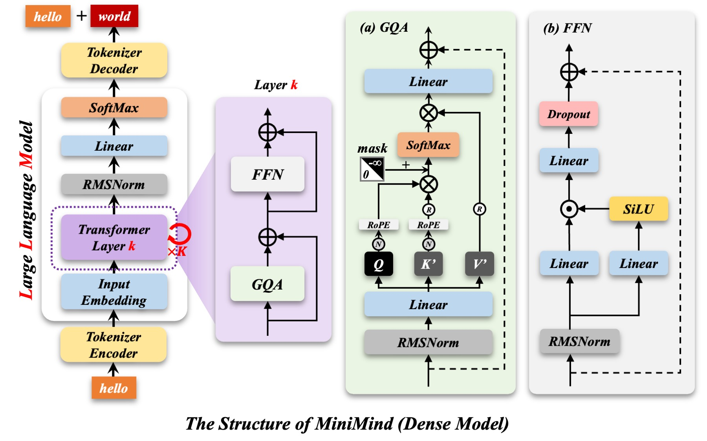
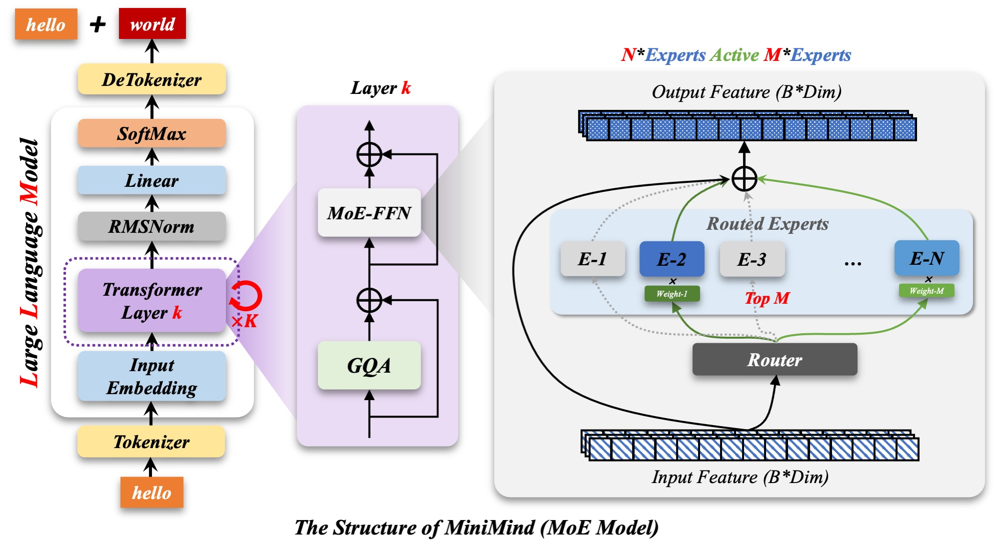
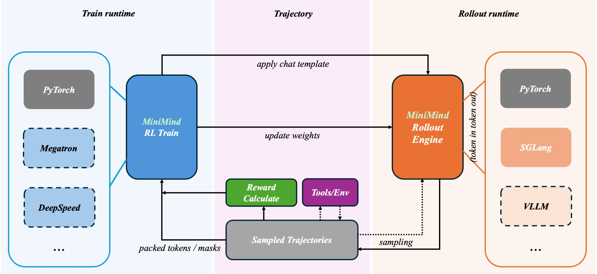

# PAPER_MiniMind — 3위안(약 600원) · 2시간으로 64M LLM을 밑바닥부터 학습시키는 교육용 저장소



> 저장소 공식 구조도 (`images/LLM-structure.jpg`). 이 그림을 코드와 한 줄씩 대조한 결과는 **§4.0**.

---

## §0. 메타 정보

| 항목 | 내용 |
|---|---|
| **이름** | MiniMind (주력 모델 `minimind-3`) |
| **저자** | jingyaogong (개인 프로젝트, 중국) |
| **공개** | 2024-08 최초 공개 · `minimind-3` 릴리스 2026-04-01 · 지속 업데이트 |
| **분야** | LLM 전 과정(사전학습→SFT→RLHF→Agentic RL) 재현, 교육용 레퍼런스 구현 |
| **코드** | https://github.com/jingyaogong/minimind |
| **모델** | HuggingFace `jingyaogong/minimind-3-pytorch` · ModelScope `gongjy/minimind-3-pytorch` |
| **라이선스** | Apache 2.0 |
| **분석 기준 커밋** | `a3c7b01` (2026-09 시점) |
| **코드 규모** | 파이썬 전체 **4,657줄** — 모델 본체는 `model/model_minimind.py` **287줄** |
| **성격** | ⚠️ SOTA 모델이 **아님**. nanoGPT의 중국어·풀스택 판 — "전 과정을 읽을 수 있는 분량으로 다시 쓰는 것"이 목적 |

> ⚠️ **이 문서의 성격**: 저장소를 클론해 코드를 직접 읽고, 모델을 실제로 띄워 측정한 결과를 1차 근거로 삼는다. 저자의 주장(파라미터 수·구조·비용)은 **가능한 한 재실행해서 검증**했고, 검증한 것과 못 한 것을 구분해 표기한다. 논문이 아닌 저장소이므로 README를 "논문 본문"에 준해 다룬다.

---

## §1. 주요 용어 사전 (Glossary)

*처음 보는 사람이 본문에서 헤매지 않도록, 반복 등장하는 용어를 먼저 모아둔다.*

### 구조 용어
- **decoder-only Transformer(디코더 전용 트랜스포머)**: 앞의 단어들만 보고 다음 단어를 맞히는 구조. GPT 계열이 전부 이것.
- **Pre-Norm(프리 놈)**: 정규화를 잔차(residual) 덧셈 **전에** 거는 방식. 원본 신호가 층을 그대로 관통해서 깊어져도 학습이 잘 됨.
- **RMSNorm**: 평균을 빼지 않고 제곱평균(root mean square)으로만 크기를 맞추는 정규화. LayerNorm보다 싸다. (자세히 → Q12)
- **residual(잔차)**: "곁가지에서 계산한 결과를 원본에 더한다"는 구조. 층이 깊어도 신호가 살아남는 고속도로.
- **GQA(그룹 쿼리 어텐션, Grouped Query Attention)**: 질의(query) 헤드는 많이, 키·값(key/value) 헤드는 적게 두는 어텐션. KV 캐시 메모리를 아낀다.
- **KV cache(키-값 캐시)**: 한 토큰씩 생성할 때 이미 계산한 키·값을 저장해 재사용하는 것.
- **QK-Norm**: 질의와 키에 RoPE를 걸기 **직전** 정규화를 한 번 더 거는 것. 어텐션 점수 폭주를 막는 최신 처방(Qwen3가 채택).
- **RoPE(회전 위치 임베딩, Rotary Position Embedding)**: 위치 정보를 각도 회전으로 심는 방식. 학습 파라미터가 없다.
- **YaRN**: 학습한 길이보다 긴 문장을 처리하도록 RoPE 주파수를 늘려주는 외삽(extrapolation) 기법.
- **SwiGLU**: `down(SiLU(gate(x)) × up(x))` 형태의 MLP. 한 갈래가 밸브 역할을 한다.
- **tied embedding(가중치 공유)**: 입구의 임베딩 표와 출구의 `lm_head`가 **같은 텐서**인 것. (하는 이유 → Q10)
- **MoE(전문가 혼합, Mixture of Experts)**: MLP를 여러 개(전문가) 두고 토큰마다 일부만 골라 쓰는 구조. 파라미터는 많고 계산은 적다.
- **router(라우터)**: MoE에서 "이 토큰은 몇 번 전문가에게" 를 정하는 작은 선형층.
- **top-k routing**: 전문가 중 점수 상위 k명만 쓰는 것. `top-1`이면 한 명만.
- **load balancing aux loss(로드밸런싱 보조 손실)**: 특정 전문가에 토큰이 몰리지 않도록 균등하게 퍼뜨리는 벌점.

### 학습 용어
- **Pretrain(사전학습)**: 대량 텍스트로 "다음 단어 맞히기"만 시키는 단계.
- **SFT(지도 미세조정, Supervised Fine-Tuning)**: 질문-답변 쌍으로 대화 형식을 가르치는 단계.
- **loss mask(손실 마스크)**: 학습 손실을 어느 토큰에만 걸지 정하는 것. SFT에서는 보통 assistant 답변 부분만.
- **LoRA(저랭크 적응)**: 원래 가중치는 얼리고 작은 저랭크 행렬 두 장만 학습하는 미세조정.
- **DPO(직접 선호 최적화)**: 좋은 답/나쁜 답 쌍만으로 보상 모델 없이 선호를 학습하는 방법.
- **PPO / GRPO / CISPO**: 강화학습(RL) 계열 정책 최적화 알고리즘. 자세한 비교는 §7.
- **rollout(롤아웃)**: RL에서 현재 모델로 실제 답을 생성해보는 과정.
- **advantage(어드밴티지)**: "이 답이 평균보다 얼마나 좋았나"를 나타내는 값.
- **importance ratio(중요도 비율)**: 새 정책과 옛 정책이 같은 토큰을 낼 확률의 비. RL에서 업데이트 폭을 조절하는 데 씀.
- **DDP(분산 데이터 병렬, DistributedDataParallel)**: 여러 GPU가 각자 데이터를 처리하고 그래디언트를 평균 내는 파이토치 표준 다중 GPU 방식.
- **Agentic RL**: 모델이 도구(tool)를 여러 번 호출하며 문제를 푸는 과정 전체를 RL로 학습시키는 것.

---

## §2. 한 줄 요약 (TL;DR)

**한 줄**: 어휘를 6,400개로 깎고 폭 768·8층으로 줄인 **Qwen3와 연산이 완전히 동일한** 64M 모델을, 사전학습부터 Agentic RL까지 전 과정을 파이썬 4,657줄 안에 `trl`/`peft` 없이 직접 구현해 3090 한 장·2시간·3위안(약 600원)으로 재현하게 만든 교육용 저장소.

**핵심 문제**: LLM 내부가 어떻게 돌아가는지 보려 해도 `transformers`·`trl`·`peft` 같은 고수준 래퍼가 다 가려버린다. 게다가 큰 GPU가 있어야 실험할 수 있다는 진입 장벽이 있다.

**해결책**:
1. 모델·데이터·학습 루프·RL 알고리즘을 전부 표준 파이토치로 다시 씀 (`trl`/`peft` 임포트 **0건** — 검증함).
2. 구조는 **Qwen3와 비트 단위로 호환**되게 설계 → 배포는 변환 스크립트 한 번으로 vLLM·llama.cpp·ollama에 그대로 올라감.
3. 어휘를 6,400개로 극단적으로 줄여 임베딩 비중을 7.7%까지 떨어뜨리고, 예산 대부분을 실제 연산층에 씀.

**결과**: README 비용 표 기준 3090 1장에서 사전학습 1.21h + SFT 1.10h ≈ 2.31시간, 약 3.0 위안 (단 README 내부 서술끼리 모순 — §7 ⑧). 다만 객관 벤치마크(C-Eval 24.89 / CMMLU 25.38)는 **4지선다 무작위(25%) 수준**이며, README가 이 사실을 스스로 명시한다.

---

## §3. 핵심 기여 (Contributions)

*왜 이 절을 두는가: 저장소가 실제로 새로 만든 것과, 남의 것을 잘 정리한 것을 구분해두면 이후 평가가 흔들리지 않는다.*

| 기여 | 내용 | 진짜 새로운가 |
|---|---|---|
| **① 전 과정 최소 구현** | Pretrain·SFT·LoRA·DPO·PPO·GRPO·CISPO·Agentic RL·증류를 4,657줄에 | ✅ 이 조합·이 분량은 드묾 |
| **② Qwen3 호환 설계** | 구조를 Qwen3와 동일하게 맞춰 생태계에 무료 연결 | ✅ 설계 판단으로서 영리함 |
| **③ 어휘 6,400 예산 배분** | 임베딩 비중을 7.7%로 축소 | ✅ 소형 모델에서 결정적 |
| **④ 정직한 벤치마크 서술** | 표준오차 명시 + "무작위 수준"임을 자인 | ✅ 논문급 저장소보다 나음 |
| **⑤ 아키텍처 자체** | Pre-Norm·GQA·QK-Norm·SwiGLU·RoPE·MoE | ❌ **전부 Qwen3 것** (§6에서 검증) |

---

## §4. 네트워크 구조

*왜 이 절을 두는가: 이 저장소의 값어치는 "구조를 읽을 수 있게 만든 것"이므로, 구조를 텐서 모양까지 정확히 따라가는 것이 곧 저장소를 이해하는 것이다.*

모든 수치는 `MiniMindForCausalLM`을 실제로 인스턴스화해 측정했다.

### 4.0 공식 구조도 읽기 — 코드와 대조

*왜: 공식 그림은 가장 먼저 보게 되는 자료인데, 그림만 믿고 구현하면 틀리는 곳이 있다. 그림의 각 기호가 코드 몇 번째 줄에 해당하는지 짝지어 둔다.*

문서 맨 위의 공식 Dense 구조도는 세 칸으로 되어 있다.

- **왼쪽 (전체)**: Tokenizer Encoder → Input Embedding → Transformer Layer k (× K = 8) → RMSNorm → Linear → SoftMax → Tokenizer Decoder
- **가운데 (층 하나)**: GQA → ⊕ → FFN → ⊕. 두 개의 ⊕가 잔차(residual) 덧셈
- **오른쪽 (상세)**: (a) GQA 내부, (b) FFN 내부. Pre-Norm의 RMSNorm은 여기 맨 아래에 그려져 있다

그림의 작은 원 기호가 핵심이다.

- **Ⓝ** = Normalize. Q와 K′에만 붙어 있다 → QK-Norm
- **Ⓡ** = Repeat. K′와 V′에 붙어 있다 → `repeat_kv`로 4헤드를 8헤드로 복제
- **K′, V′의 프라임(′)** = Q보다 좁다는 표시 (384 vs 768)
- **mask의 0 / −∞ 삼각형** = 미래 토큰을 못 보게 가리는 causal mask

**그림 ↔ 코드 대조표** (`model/model_minimind.py` 기준)

| 그림 요소 | 코드 | 판정 |
|---|---|---|
| Q, K′에 Ⓝ → 그 다음 RoPE | `q_norm`/`k_norm` (L117) → `apply_rotary_pos_emb` (L119) | ✅ QK-Norm 순서까지 일치 |
| K′, V′의 Ⓡ | `repeat_kv` (L124) | ✅ GQA 복제 |
| mask 0 / −∞ | SDPA `is_causal=True` (L126) 또는 `triu(1)` −inf (L129) | ✅ |
| Linear 하나 → Q, K′, V′ | `q_proj`·`k_proj`·`v_proj` 세 개로 분리 (L100-102) | ⚪ 합쳐 그린 것 (계산 동일) |
| FFN: Linear 2개 → 한쪽만 SiLU → ⊙ → Linear | `down(SiLU(gate(x)) × up(x))` (L146) | ✅ SwiGLU |
| **FFN 끝의 Dropout** | `FeedForward`에 dropout **없음** | ❌ 그림에만 있음 |
| **GQA 끝에 Dropout 없음** | `o_proj` 뒤 `resid_dropout` **있음** (L133) | ❌ 코드에만 있음 |
| **Input Embedding과 Linear가 떨어져 있음** | 둘이 같은 텐서 (tied, L242) | ⚠️ 가중치 공유가 안 그려짐 |
| 맨 위 SoftMax | 모델 출력은 logits. softmax는 생성·손실 계산 때만 | ⚪ 개념도 |

두 가지만 기억하면 된다.

1. **Dropout 위치가 그림과 코드에서 뒤바뀌어 있다.** 기본값이 p = 0이라 실제 동작에는 영향이 없지만, 그림만 보고 재구현하면 dropout을 엉뚱한 곳에 넣게 된다.
2. **가중치 공유가 그림에 없다.** 입구 Embedding과 출구 Linear가 별개 블록으로 그려져 있어, 4.92M이 한 번만 저장된다는 사실이 안 보인다. 이 부분은 아래 §4.1–4.2의 그림 1·2로 보충한다.

### 4.1 전체 흐름

*왜: 부품을 보기 전에 전체 배관이 어떻게 이어지는지 알아야 각 부품의 역할이 보인다.*


```
input_ids [B, L]
  → embed_tokens (6400 × 768)        [B, L, 768]
  → Dropout (p=0, 기본 꺼짐)
  → MiniMindBlock × 8                [B, L, 768]   ← 모양 안 변함
  → model.norm (RMSNorm)
  → lm_head (768 → 6400)             [B, L, 6400]
```

눈여겨볼 점은 **입구와 출구가 같은 4.92M 텐서를 쓴다**는 것(tied embedding). 실측으로 `lm_head.weight`와 `embed_tokens.weight`의 메모리 주소가 동일함을 확인했다.

### 4.2 임베딩은 곱셈이 아니라 조회다

*왜: `[B, L]`이 `(6400 × 768)`을 지나 `[B, L, 768]`이 되는 과정이 초보자가 가장 많이 막히는 지점이다.*


`(6400 × 768)`을 행렬로 보면 "어떻게 곱해서 저 모양이 되지?"가 되는데, **곱셈이 아니다.** 6,400줄짜리 사전에서 번호로 한 줄을 뽑아오는 것뿐이다.

- 입력 `[B, L]`에 든 것은 데이터가 아니라 **주소(줄 번호)**
- 숫자 1개가 **숫자 768개로 부풀어난다** — 차원이 줄어든 게 아니라 축이 하나 새로 생긴 것
- **6,400은 "고를 줄이 몇 개인가"** 일 뿐이라 결과에 나타나지 않는다

실측 확인:

```python
out = emb(torch.tensor([[10, 25, 7, 25], [3, 10, 3, 1]]))
out.shape                              # (2, 4, 768)
torch.equal(out[0,0], emb.weight[10])  # True  ← 10번 줄을 통째로 복사
torch.equal(out[0,1], out[0,3])        # True  ← 둘 다 25번이니 내용 동일
```

그런데 맨 끝 `lm_head`에서는 6,400이 다시 나타난다. **같은 표를 반대 방향으로** 쓰기 때문이다.

| | 하는 일 | 모양 변화 |
|---|---|---|
| 입구 `embed_tokens` | 주소 하나 → 그 줄 하나 가져오기 (**조회**) | `[B,L]` → `[B,L,768]` |
| 출구 `lm_head` | 내 벡터를 6,400줄 전부와 내적해 점수 (**진짜 행렬 곱**) | `[B,L,768]` → `[B,L,6400]` |

→ 이 사전에 실제로 어떤 값이 들어있는지는 **Q9**, 가중치를 공유하는 이유는 **Q10**, 사전을 어떻게 만들고 학습하는지는 **Q11**.

> 참고: 수학적으로는 조회도 곱셈으로 쓸 수 있다. 토큰 10번을 6,400칸 원-핫 벡터로 만들어 표와 곱하면 정확히 10번 줄이 나온다. 결과는 같지만 0을 6,399번 곱하는 낭비라서 파이토치는 주소로 바로 꺼낸다.

### 4.3 블록 하나의 내부

*왜: 8층 전체가 같은 그림의 반복이므로, 이 한 장만 이해하면 몸통은 끝난다.*


블록은 **모양을 바꾸지 않는다.** 768 들어와서 768 나가고, 그게 8번 반복된다. 핵심은 정규화가 **본선이 아니라 곁가지에만** 걸린다는 것(Pre-Norm) — 원본 신호는 8개 층을 한 번도 건드려지지 않고 관통한다. 코드는 [`model_minimind.py:186-194`](https://github.com/jingyaogong/minimind/blob/master/model/model_minimind.py#L186) 9줄이 전부다.

```python
residual = hidden_states
hidden_states, present = self.self_attn(self.input_layernorm(hidden_states), ...)
hidden_states += residual
hidden_states = hidden_states + self.mlp(self.post_attention_layernorm(hidden_states))
```

학습 초기에 곁가지 출력이 0에 가까우면 블록은 그냥 통과 회로가 되고, 그래서 깊은 모델도 발산하지 않는다.

→ RMSNorm이 정확히 무엇을 하는지(계산·LayerNorm과의 차이·학습된 배율)는 **Q12**, 잔차 합이 아니라 곁가지 입력만 정규화하는 이유(Pre-Norm vs Post-Norm, 실측)는 **Q13**.

### 4.4 어텐션 — 비대칭이 핵심

*왜: 이 저장소에서 가장 최신 기법이 몰려 있는 부품이고, 비대칭 설계의 의도를 알아야 GQA가 왜 공짜가 아닌지 보인다.*


| 갈래 | 투영 | 헤드 | 캐시 |
|---|---|---|---|
| q (질의) | 768 → 768 | 8 × 96 | 캐시 안 함 |
| k (키) | 768 → **384** | **4** × 96 | 캐시함 |
| v (값) | 768 → **384** | **4** × 96 | 캐시함 |

세 가지 포인트:

**① GQA** — 질의는 8갈래인데 키·값은 4갈래만 만든다. 추론 시 캐시에 쌓아야 하는 건 키·값뿐이므로 캐시가 절반으로 줄고, 계산 직전에 `repeat_kv`로 4개를 8개로 복제해 짝을 맞춘다. **메모리는 아끼고 계산량은 그대로** 두는 거래다.

**② QK-Norm** — 질의와 키에 RoPE를 걸기 **직전에** 헤드 차원(96) 단위 RMSNorm을 한 번 더 건다. 어텐션 점수 폭주를 막는 처방으로, 위치와 순서가 Qwen3와 같다.

**③ 두 경로의 일치** — 플래시(SDPA) 경로와 수동 softmax 경로가 실제로 같은 값을 내는지 돌려봤다.

```
flash vs 수동 어텐션      최대 절대차 : 5.96e-07
전체 forward vs KV캐시 디코딩 최대 절대차 : 4.77e-07
```

부동소수점 오차 수준으로 일치한다. 길이 1 디코딩이거나 패딩 마스크가 있을 때만 수동 경로로 빠진다.

### 4.5 MLP — 밸브가 달린 확장

*왜: 파라미터의 70%가 여기 있으므로, 예산 이야기를 하려면 이 부품부터 봐야 한다.*


`up_proj`가 정보를 넓은 공간으로 펼치고, `gate_proj` + SiLU가 **어떤 채널을 통과시킬지 정하는 밸브** 역할을 한다. 둘을 곱한 뒤 `down_proj`로 다시 768로 접는다. 행렬이 3개라 층당 3 × 768 × 2432 = **5.60M** — 층 하나의 76%가 여기다.

→ 확장 폭 2,432가 어떻게 정해졌는지(원주율 × 64배수 올림), 배율의 역사(4배 → 8/3배 → 3.0배), MLP를 "키-값 메모리"로 보는 해석은 **Q8**.

### 4.6 MoE 변형 — MLP 자리만 교체

*왜: MoE 버전은 구조가 아니라 "MLP 하나를 갈아끼운 것"이라는 점, 그리고 기본 설정에 함정이 있다는 점을 함께 봐야 한다.*

**공식 MoE 구조도** (`images/LLM-structure-moe.jpg`)



Dense 그림과 왼쪽·가운데는 같고, 가운데의 FFN이 **MoE-FFN**으로 바뀐 것만 다르다. 오른쪽이 MoE-FFN의 내부다.

- 제목의 **"N\*Experts, Active M\*Experts"** = 전문가 N명 중 M명만 계산. 기본값은 **N = 4, M = 1**
- **Router** → 점수 상위 M명(Top M) 선택 → 선택된 전문가의 출력에 **Weight**를 곱해 ⊕로 합산
- 회색 점선 = 이번 토큰에 선택되지 않은 전문가

| 그림 요소 | 코드 | 판정 |
|---|---|---|
| Router | `self.gate` = Linear 768 → 4 (L152), softmax (L159) | ✅ |
| Top M | `torch.topk(..., k=num_experts_per_tok)` (L160) | ✅ 기본 k = 1 |
| **E-i × Weight-i** | `expert(x) * topk_weight` (L168) | ⚠️ **top-1에서는 Weight가 항상 1.0** — 아래 급소 |
| 회색 점선 (비선택 전문가) | 학습 중 `y[0,0] += 0 × (파라미터 합)` (L169-170) | ⚪ 그림은 "비활성" 표시일 뿐. 코드는 DDP의 "안 쓰인 파라미터" 오류를 막는 더미 연결을 둔다 |
| **입력 → ⊕로 가는 검은 우회 화살표** | `MOEFeedForward` 안에 대응하는 경로 **없음** (shared expert 없음 — 코드 검색으로 확인) | ⚠️ 잔차는 가운데 그림에 이미 있음. 잔차를 두 번 그렸거나, minimind-3에서 제거한 shared expert 경로의 흔적으로 보인다 |

**공식 그림에서 가장 중요한 선은 "Weight-i를 곱하는 곳"이다.** 이 곱셈이 있어야 라우터가 "어느 전문가가 이 토큰에 더 나은지"를 배운다. 그런데 기본 설정에서는 바로 이 곱셈이 무효가 된다. 아래 그림 6은 그 경로를 코드 기준으로 다시 그린 것이다.


어텐션·임베딩은 그대로고 전문가 4명이 나란히 서서, 라우터가 토큰마다 한 명을 고른다. 전체 198M을 들고 있되 토큰 하나당 64M만 계산한다.

> ### 🔴 급소: 기본 설정에서 라우터가 학습되지 않는다
>
> [`model_minimind.py:160-161`](https://github.com/jingyaogong/minimind/blob/master/model/model_minimind.py#L160)에서 top-k를 뽑은 뒤 `norm_topk_prob=True`로 정규화하는데, 기본값이 **top-1**이다. 값 하나를 자기 자신으로 나누면 항상 1.0이므로, 전문가 출력에 곱해지는 게이트 값이 **상수 1**이 되고 라우터는 메인 손실에서 그래디언트를 못 받는다.
>
> ```
> top-1(기본) 게이트 grad (태스크 손실만) : 1.0e-07   ← 부동소수점 잡음
> top-1        게이트 grad (aux 손실만)   : 1.9e-04
> top-2        게이트 grad (태스크 손실만) : 8.44      ← 8천만 배
> ```
>
> 라우터가 배우는 것은 오직 로드밸런싱 보조 손실, 즉 "토큰을 균등하게 뿌려라"뿐이다. **"어느 전문가가 이 토큰에 더 나은가"는 학습되지 않는다.** Switch Transformer가 게이트 확률을 곱하는 이유가 정확히 이걸 막기 위해서인데, 그 신호가 정규화에 삼켜졌다.
>
> 공개된 `minimind-3-moe`(198M)가 이 설정으로 학습된 모델이다. 수정은 `norm_topk_prob and k > 1` 조건 한 줄.
>
> **원인 추정**: Qwen3-MoE 코드를 그대로 가져오면서 `norm_topk_prob=True`도 함께 가져왔는데, Qwen3-MoE는 **top-8**이라 정규화가 의미가 있다(8개 값이 합 1이 되도록). 이걸 top-1로 바꾸면서 부작용이 드러난 것으로 보인다.

### 4.7 파라미터가 어디에 쓰이는가

*왜: 소형 모델에서는 "어디에 파라미터를 안 쓸 것인가"가 성능을 가르는 결정이다.*


**Dense 63.91M** (실측)

| 부품 | 크기 | 비중 |
|---|---|---|
| MLP × 8층 | 44.83M | **70.1%** |
| Attention × 8층 | 14.16M | 22.2% |
| Embedding (= lm_head, 공유) | 4.92M | 7.7% |
| RMSNorm 전부 | 0.013M | 0.0% |
| **합계** | **63.91M** | |

**MoE 198.42M** (실측)

| 부품 | 크기 |
|---|---|
| 전문가 4명 × 8층 | 179.31M |
| Attention × 8층 | 14.16M |
| Embedding (공유) | 4.92M |
| 라우터 (768×4 × 8층) | 0.025M |
| **합계 / top-1 활성** | **198.42M / 63.94M** |

광고된 수치(64M / 198M-A64M)와 **소수점까지 일치**한다. 파라미터 수를 정직하게 표기한 저장소는 생각보다 드물다.

여기서 이 모델의 **가장 중요한 예산 결정**이 보인다. 보통 100M급 소형 모델은 어휘가 커서 임베딩이 절반 이상을 잡아먹는다. MiniMind는 어휘를 6,400개로 깎아 임베딩 비중을 7.7%까지 떨어뜨렸다.

> **만약 Qwen3의 어휘(151,936)를 그대로 썼다면?**
> 임베딩만 151,936 × 768 = **116.69M** — 모델 전체(63.91M)의 **1.8배**가 된다.
> 총 175.7M 중 임베딩이 66%를 차지하는, 사실상 "사전만 있고 머리는 없는" 모델이 됐을 것이다.

대가는 토큰 효율이다. 같은 문장에 토큰이 더 많이 들고, 중국어·영어 밖에서는 글자가 잘게 쪼개진다.

---

## §5. 학습 파이프라인

*왜: 이 저장소가 "모델 저장소"가 아니라 "전 과정 저장소"라는 점이 값어치의 절반이므로, 단계별로 무엇이 구현돼 있는지 정리해둔다.*

| 단계 | 스크립트 | 기본 설정 | 데이터 |
|---|---|---|---|
| 사전학습 | `train_pretrain.py` | epochs 2, bs 32, lr 5e-4, seq 340, accum 8 | `pretrain_t2t_mini.jsonl` |
| 지도 미세조정 | `train_full_sft.py` | epochs 2, bs 16, lr 1e-5, seq 768 | `sft_t2t_mini.jsonl` |
| 지식 증류 | `train_distillation.py` | seq 340 | SFT 데이터 |
| LoRA | `train_lora.py` | seq 340 | 태스크별 데이터 |
| DPO | `train_dpo.py` | bs 4, **lr 4e-8**, beta 0.15, seq 1024 | `dpo.jsonl` |
| PPO | `train_ppo.py` | actor+critic, GAE, KL 조기종료 | `rlaif.jsonl` |
| GRPO / CISPO | `train_grpo.py` | bs 2, lr 3e-7, num_gen 6, beta 0.1 | `rlaif.jsonl` |
| Agentic RL | `train_agent.py` | 3턴 도구 호출, num_gen 4, GRPO/CISPO | `agent_rl.jsonl` |

**SFT 손실 마스킹은 정확하다** — 2턴 대화로 실측 확인했다.

```
전체 48토큰 중 학습되는 18토큰:
['<think>','\n','\n','</think>','\n','\n','2','<|im_end|>','\n',   ← 1턴 답변
 '<think>','\n','\n','</think>','\n','\n','4','<|im_end|>','\n']   ← 2턴 답변
```

user 발화와 시스템 프롬프트에는 손실이 걸리지 않는다. 라벨 누출 없음.

**RL 알고리즘 통일 관점** (README의 정리를 코드로 확인한 것):

| 알고리즘 | 정책항 | 어드밴티지 | 학습 모델 수 |
|---|---|---|---|
| DPO | chosen/rejected 로그비 | 명시적 어드밴티지 없음 | 1 (전방 2) |
| PPO | `min(r·A, clip(r,1±ε)·A)` | Critic + GAE | 2 |
| GRPO | `min(r·A, clip(r,1±ε)·A)` | 그룹 내 표준화 `(R−μ)/σ` | 1 |
| CISPO | `clip(r,0,ε_high)·A·log π` | 그룹 내 표준화 | 1 |

`train_grpo.py`와 `train_agent.py`의 **기본값은 `cispo`** 이다(파일 이름과 다르니 주의).

### 5.1 RL 학습 구조 — 학습과 생성을 분리한다

*왜: RL은 "답을 생성하는 일"과 "가중치를 고치는 일"이 번갈아 일어나는데, 둘을 어떻게 나눴는지가 속도와 정확성을 동시에 좌우한다.*



공식 그림 (`images/rl-structure.jpg`)은 세 구역으로 나뉜다.

| 구역 | 하는 일 | 구현 |
|---|---|---|
| **Train runtime** (왼쪽) | 정책(모델) 가중치 업데이트 | PyTorch |
| **Trajectory** (가운데) | 생성된 궤적 모으기, 보상 계산, 도구 실행 | `calculate_rewards`, `execute_tool` |
| **Rollout runtime** (오른쪽) | 현재 정책으로 답을 빠르게 대량 생성 | PyTorch 또는 SGLang |

한 스텝의 흐름:

```
RL Train ──(chat template 적용한 프롬프트)──► Rollout Engine
                                                  │ sampling
                                                  ▼
                                        Sampled Trajectories ──► Reward Calculate
                                                  │          ◄─► Tools/Env
                                                  │ packed tokens / masks
                                                  ▼
RL Train (손실 계산·역전파) ──(update weights)──► Rollout Engine
```

"줘 프롬프트, 받아 궤적"이라는 인터페이스 하나로 추상화해서, 생성 쪽 엔진을 PyTorch ↔ SGLang으로 갈아끼울 수 있게 한 것이 핵심이다. 대규모 RL 프레임워크(OpenRLHF·verl·slime)와 같은 발상을 축소한 것이다.

**그림 ↔ 코드 대조표** (`trainer/rollout_engine.py`, `trainer/train_agent.py` 기준)

| 그림 요소 | 코드 | 판정 |
|---|---|---|
| Train 쪽 PyTorch 실선, Megatron·DeepSpeed **점선** | 순수 PyTorch만 있음 | ✅ 점선 = 미구현을 정직하게 표기 |
| Rollout 쪽 PyTorch·SGLang 실선, vLLM **점선** | `TorchRolloutEngine`, `SGLangRolloutEngine` 두 개뿐 | ✅ |
| **token in token out** | SGLang에 `input_ids`를 보내고 `output_ids`를 받음 | ✅ 텍스트로 왕복하며 재토큰화할 때 생기는 토큰 경계 불일치를 원천 차단. 좋은 설계 |
| packed tokens / masks | 모델이 낸 토큰은 mask = 1, 도구 결과(observation)는 mask = 0으로 이어붙임 | ✅ 도구가 돌려준 글자에는 손실을 걸지 않음 |
| **update weights** (화살표 하나) | Torch 엔진: 같은 모델 객체를 가리키므로 **항상 최신**. SGLang 엔진: `save_interval`(기본 10) 스텝마다만 디스크 저장 → 재로드 | ⚠️ SGLang 경로는 **최대 10스텝 묵은 정책**으로 생성 (off-policy). 그림엔 빈도가 안 보임 |
| Train runtime의 다중 GPU | 학습 forward가 DDP 래퍼를 우회 → 그래디언트 동기화 0 | 🔴 §7 ① — 그림의 구조는 맞지만 다중 GPU 학습 쪽은 실제로 동작하지 않음 |

---

## §6. 정체 — Qwen3와 연산이 완전히 동일하다

*왜: 이 저장소를 "새 구조를 설계한 프로젝트"로 읽으면 평가가 크게 어긋나므로, 관계를 정확히 못 박아둘 필요가 있다.*

MiniMind 가중치를 `transformers`의 진짜 `Qwen3ForCausalLM`에 그대로 부어넣고 같은 입력을 통과시켰다.

```
state_dict 키 91개  →  missing 0개, unexpected 0개
로짓 최대 절대차 : 0.0
로짓 평균 절대차 : 0.0
argmax 일치율    : 100%
```

MoE 버전도 `Qwen3MoeForCausalLM`에 대해 **최대 절대차 0.0**이다.

부동소수점 오차(보통 1e-7 수준)조차 없는 **완전한 0**이다. 텐서 이름·모양·곱하는 순서·정규화 위치·RoPE 시점이 하나도 다르지 않아야 나오는 결과이므로, **순전파 그래프는 Qwen3 그 자체**다.

### 6.1 "그럼 층 수만 다른 건가?" — 아니다

*왜: 가장 흔한 오해다. 코드가 같다는 것과 설정이 같다는 것은 전혀 다른 이야기다.*

**Dense 계열 비교** (Qwen3 수치는 HuggingFace 공식 `config.json`, 2026-09 조회)

| 모델 | vocab | hidden | layers | q / kv heads | head_dim | intermediate | 배율 | tied |
|---|---|---|---|---|---|---|---|---|
| **MiniMind-3** | **6,400** | **768** | **8** | **8 / 4** | **96** | **2,432** | **3.17 (π)** | ✅ |
| Qwen3-0.6B | 151,936 | 1,024 | 28 | 16 / 8 | 128 | 3,072 | 3.00 | ✅ |
| Qwen3-1.7B | 151,936 | 2,048 | 28 | 16 / 8 | 128 | 6,144 | 3.00 | ✅ |
| Qwen3-4B | 151,936 | 2,560 | 36 | 32 / 8 | 128 | 9,728 | 3.80 | ✅ |
| Qwen3-8B | 151,936 | 4,096 | 36 | 32 / 8 | 128 | 12,288 | 3.00 | ❌ |

**설정값 중 같은 것이 하나도 없다.** 층 수만 다른 게 아니라 **모든 크기 축이 다르다.**

특히 두 가지가 눈에 띈다.

**① 어휘가 23.7배 차이난다.** 이것이 구조적으로 가장 큰 차이이며, §4.7에서 본 예산 결정의 근원이다.

**② head_dim 철학이 다르다.** Qwen3는 모델 크기와 무관하게 `head_dim=128`로 **고정**한다. 그래서 Qwen3-0.6B는 hidden 1,024인데 q 헤드가 16 × 128 = 2,048 — **q_proj가 1,024 → 2,048로 확장**된다. MiniMind는 `head_dim = hidden ÷ heads = 96`이라 q_proj가 768 → 768 정사각이다. 코드는 `head_dim`을 설정값으로 다루므로 둘 다 문제없이 돌아가지만, 설계 사상은 다르다.

**MoE 계열 비교**

| 모델 | vocab | hidden | layers | q / kv | 전문가 수 | top-k | 전문가 폭 | 성격 |
|---|---|---|---|---|---|---|---|---|
| **MiniMind-3-MoE** | **6,400** | **768** | **8** | **8 / 4** | **4** | **1** | **2,432 (dense와 동일)** | 뚱뚱한 소수 |
| Qwen3-30B-A3B | 151,936 | 2,048 | 48 | 32 / 4 | 128 | 8 | 768 (dense의 1/8) | 날씬한 다수 |

MoE 철학도 정반대다. Qwen3는 **작은 전문가 128명 중 8명**을 쓰고, MiniMind는 **큰 전문가 4명 중 1명**을 쓴다. 그리고 이 차이가 §4.6의 라우터 문제로 직결된다 — Qwen3의 top-8에서는 `norm_topk_prob`가 의미 있는 연산이지만, top-1에서는 상수 1이 된다.

### 6.2 MiniMind 고유인 것

순전파 안에는 없고, 전부 그 바깥이다.

| 항목 | 차이 |
|---|---|
| 네트워크 연산 | 동일 (검증됨) |
| 설정값 | 6,400 어휘 / 768 폭 / 8층 / 원주율 배율 — **MiniMind 고유** |
| 코드 분량 | 287줄 재구현 vs `transformers`의 모듈 계층 |
| `generate()` | HF 것을 덮어쓴 자체 구현 |
| YaRN | 버퍼에 미리 구워넣음 (HF는 `rope_utils`가 런타임 처리) |
| dropout 훅 | MiniMind에만 있음 (기본 0.0이라 사실상 무동작) |
| MoE 보조손실 / 죽은 전문가 처리 | 구현 방식이 다름 (출력값은 동일) |

**저장소는 이를 숨기지 않는다.** 변경 이력에 "주력 구조를 `Qwen3 / Qwen3-MoE` 생태계에 맞춤"이라 명시돼 있고, shared expert를 일부러 제거한 것도 같은 이유다. "从0实现(0부터 구현)" 주장의 대상은 **아키텍처 독창성이 아니라 구현**이며(`trl`/`peft` 없이 손으로 짬 — 임포트 0건 확인), 그건 사실이다.

오히려 이건 **의도된 설계**에 가깝다. 구조를 Qwen3에 정확히 맞춰두면:

- 학습은 읽기 쉬운 287줄 코드로 하고,
- 배포는 [`convert_model.py`](https://github.com/jingyaogong/minimind/blob/master/scripts/convert_model.py) 한 번으로 vLLM·llama.cpp·ollama에 그대로 올리고,
- 그 변환이 맞는지는 `load_state_dict(..., strict=True)`가 **틀리면 즉시 터지는 방식**으로 자동 검증된다.

---

## §7. 코드 리뷰 — 발견한 급소

*왜: 교재로 쓰려면 어디를 그대로 믿어도 되고 어디를 고쳐야 하는지 알아야 한다. 아래는 모두 코드를 읽고 재현한 것이다.*

### 🔴 심각

#### ① 멀티 GPU RL 3종에서 그래디언트 동기화가 아예 안 된다

[`train_grpo.py:100`](https://github.com/jingyaogong/minimind/blob/master/trainer/train_grpo.py#L100), [`train_ppo.py:175`](https://github.com/jingyaogong/minimind/blob/master/trainer/train_ppo.py#L175), [`train_agent.py:283`](https://github.com/jingyaogong/minimind/blob/master/trainer/train_agent.py#L283) — 셋 다 DDP 래퍼를 벗겨낸 `model_unwrapped`로 forward를 한다. DDP는 **래퍼의 forward가 호출될 때만** backward 훅을 활성화하므로(`prepare_for_backward`), 이걸 우회하면 all-reduce가 한 번도 일어나지 않는다.

gloo 2프로세스로 재현:

```
rank0 grad via DDP.forward   : [1.5, 1.5, 1.5, 1.5]   ← 정상 (두 rank 평균)
rank0 grad via unwrapped fwd : [1.0, 1.0, 1.0, 1.0]   ← 자기 것만
```

즉 `torchrun --nproc_per_node 4 train_grpo.py`를 돌리면 4개 GPU가 각자 다른 가중치로 갈라지고 rank 0 것만 저장된다. 롤아웃 비용만 4배 쓰고 그래디언트 신호의 3/4를 버린다.

아이러니한 것은 `train_ppo.py:223` 주석이다 — "조기 종료 시 DDP 통신을 끊지 않기 위해 loss만 0으로 만든다"며 데드락 방어 코드를 넣어뒀는데, **그 DDP 통신이 처음부터 존재하지 않는다.** 의도가 아니라 실수라는 강한 증거다.

**수정**: `model_unwrapped` → `model` (한 단어)

#### ② MoE 기본 설정에서 라우터가 학습되지 않는다

§4.6 참조. `norm_topk_prob and k > 1` 조건 한 줄로 수정 가능.

#### ③ 웹 데모의 무방비 `eval()` — 원격 코드 실행

[`scripts/web_demo.py:128`](https://github.com/jingyaogong/minimind/blob/master/scripts/web_demo.py#L128):

```python
return {"result": eval(args.get('expression', '0'))}
```

builtins 제한도, 타임아웃도 없다. 사용자가 채팅으로 표현식을 넣으면 모델이 그걸 거의 그대로 tool 인자에 복사하는 경향이 있으므로, 호스팅된 데모에서는 실제 공격 경로가 된다.

일관성도 없고, **가장 노출된 곳이 가장 약하다**:

| 파일 | 방어 |
|---|---|
| `train_agent.py:58` | `{"__builtins__": {}}` + SIGALRM 1초 |
| `scripts/eval_toolcall.py:30` | 없음 |
| `scripts/web_demo.py:128` | **없음 (사용자 대면)** |

`{"__builtins__": {}}`도 완전하지 않다(`math` 모듈이 노출돼 있어 클래스 계층 타고 탈출 가능). `signal.alarm`은 메인 스레드에서만 동작하므로 Flask/Streamlit 환경에선 무력하다.

### 🟠 중간

#### ④ 체크포인트를 `half()`로 저장 → 재개할 때마다 정밀도 손실

[`trainer_utils.py:73`](https://github.com/jingyaogong/minimind/blob/master/trainer/trainer_utils.py#L73)에서 `v.half().cpu()`로 저장하고, 재개용 `resume_data['model']`도 **같은 half 텐서**를 쓴다. 학습은 bf16 autocast(fp32 마스터 가중치)인데 저장은 fp16 — 지수부가 8비트에서 5비트로 줄어든다. 옵티마이저 상태는 fp32로 온전히 저장되니 재개 시 가중치와 모멘텀의 정밀도가 어긋난다. 저장 간격마다 반복되므로 장시간 학습에서 누적된다.

#### ⑤ Agentic RL의 좌측 절단이 importance ratio를 깨뜨린다

`train_agent.py:270` — 시퀀스가 `max_total_len`(기본 2500)을 넘으면 `ids[-2500:]`로 **앞을 자른다.** 잘려나가는 것이 system 프롬프트와 tool 정의다. 그런데 `old_logps`는 잘리기 전 전체 문맥에서 계산된 값이라, `ratio = exp(new − old)`가 서로 다른 조건부 확률을 비교하게 된다. 기본값이 턴당 768토큰 × 3턴 + tool 정의 프롬프트라 실전에서 자주 걸린다.

#### ⑥ 참조 모델이 autocast 밖에 있다

`train_grpo.py:105`, `train_agent.py:302` — policy는 bf16 autocast 안, ref는 fp32다. KL 페널티가 순수한 정책 차이가 아니라 **정밀도 차이**까지 포함하게 되고, step 0에서 KL이 0이 나와야 하는데 안 나온다. 메모리·속도도 손해다.

#### ⑦ PPO Critic이 최종 정규화를 두 번 건다

`train_ppo.py:44-45`:

```python
outputs = self.model(input_ids=input_ids, ...)
hidden_states = self.model.norm(outputs[0])   # outputs[0]은 이미 norm 통과함
```

`MiniMindModel.forward`가 이미 `self.norm`을 적용한 hidden을 반환한다. RMSNorm은 학습 가중치가 있어서 두 번 걸면 값이 달라진다.

#### ⑧ README의 학습 시간 서술이 서로 모순된다

같은 README 안에 서로 다른 서술이 공존한다.

| 출처 | epoch | 소요 시간 |
|---|---|---|
| 비용 표 | 1 epoch | pretrain 1.21h + SFT 1.10h = **2.31h** |
| 데이터 흐름도 (`images/dataset.jpg`) | **× 2 epochs** | MiniMind-Zero **~2h** |
| 상단 각주 | 1 epoch | "2시간 = **SFT 단독** 1 epoch 실측" (그런데 표의 SFT는 1.10h) |
| 스크립트 기본값 | `--epochs 2` | — |

같은 3090에서 "1 epoch에 2.31h"와 "2 epoch에 ~2h"는 동시에 참일 수 없다. 스크립트 기본값(2 epoch)은 데이터 흐름도와 맞으므로, 표가 틀렸거나 둘이 서로 다른 조건에서 측정된 것으로 보인다. 어느 쪽이 맞는지는 저장소만으로 판단할 수 없다 — **"2시간"은 대략의 규모로만 받아들이는 게 안전**하다.

### 🟡 사소하지만 실재

- **저장 파일에 공유된 사전이 두 벌 들어감**: 키마다 `.half()`로 변환하면서 가중치 공유가 끊겨, 같은 4.92M 표가 `embed_tokens`·`lm_head` 두 키로 따로 저장된다(파일 137.7MB = 이론값 127.8MB + 9.9MB). 동작 영향은 없고 디스크만 낭비. → Q10
- **가중치 로딩 정책 불일치**: `trainer_utils.py:127`은 `strict=False`(크기 안 맞는 체크포인트를 조용히 부분 로드 → 나머지는 랜덤 초기화), `eval_llm.py:24`는 `strict=True`. 체크포인트 파일명이 `{이름}_{hidden_size}{_moe}.pth` 뿐이라 층 수가 다르면 소리 없이 망가진다.
- **레이어마다 GPU 동기화 2종**: `model_minimind.py:125`의 `torch.all(attention_mask == 1)`, `:165`의 `if mask.any()`(전문가 4개 × 층 8개 = forward당 32번).
- **DDP + 그래디언트 누적에 `no_sync` 없음**: 마이크로배치마다 all-reduce → 필요량의 8배 통신.
- **워밍업 없음**: `get_lr`이 `0.1 + 0.45(1+cos)`로 처음부터 최대 LR(5e-4).
- **시퀀스 패킹 없음**: pretrain이 모든 샘플을 340토큰으로 고정 패딩.
- **rank별 시드가 무효화됨**: `train_pretrain.py:113`에서 `seed + rank`로 잡아놓고 `:160`에서 매 에폭 `seed + epoch`로 덮어써서 모든 rank가 같은 RNG 상태가 된다.
- **requirements 30개 중 21개가 코드에서 한 번도 임포트되지 않음** — `trl`, `datasketch`, `simhash`, `jieba`, `sentence_transformers`, `ngrok`, `marshmallow`, `rich`, `einops`, `tiktoken` 등.
- **HF `generate`를 오버라이드**: beam search, LogitsProcessor, GenerationConfig를 못 쓴다. `model_minimind.py:211`의 `if hasattr(past_key_values, 'layers'): past_key_values = None`은 HF `Cache` 객체를 **조용히 버려서**, 서드파티 도구가 캐시를 넘기면 출력이 소리 없이 망가진다.
- **YaRN 보정 기준이 어긋남**: `original_max_position_embeddings=2048`인데 실제 학습 길이는 340(pretrain)/768(SFT)이다. YaRN의 전제가 "이 값 = 실제 사전학습 문맥 길이"인데 이미 3배 부풀려져 있다. `attention_factor=1.0`이라 온도 보정도 꺼져 있어 엄밀히는 YaRN이 아니라 NTK-by-parts다.
- **Agentic RL에서 EOS가 손실 마스크에서 제외됨**: `train_agent.py:126`의 `[int(t != eos) for t in new_ids]`. 그 결과 `:297`의 EOS 절단 로직이 항상 no-op인 **죽은 코드**가 되고, 모델은 "언제 멈출지"에 대한 직접 그래디언트를 못 받는다(보상으로는 벌점을 주면서). `train_grpo.py`는 반대로 EOS를 포함한다 — 두 스크립트가 다르다.

---

## §8. 실험 / 성능

*왜: 이 모델이 실제로 무엇을 할 수 있고 없는지를 과대·과소 없이 잡아두어야 한다.*

### 8.1 학습 비용 (저자 실측, 3090 1장)

| 모델 | pretrain 1ep | SFT 1ep | toolcall | RLAIF | 합계(pre+SFT) |
|---|---|---|---|---|---|
| minimind-3 (64M) | 1.21h / 1.57위안 | 1.10h / 1.43위안 | 0.9h | 1.1h | **2.31h / 3.0위안** |
| minimind-3-moe (198M) | 1.69h / 2.20위안 | 1.54h / 2.00위안 | 1.26h | 1.54h | 3.23h / 4.2위안 |

> ⚠️ README 안에서 이 표(1 epoch = 2.31h)와 데이터 흐름도(2 epoch → ~2h)가 서로 모순된다. 스크립트 기본값은 2 epoch다 (§7 ⑧).

### 8.2 객관 벤치마크 (lm-evaluation-harness)

| 모델 | params | ceval / cmmlu | arc / piqa / obqa / hellaswag / siqa |
|---|---|---|---|
| **minimind-3** | 64M | 24.89 / 25.38 | 28.49 / 50.65 / 23.60 / 28.28 / 34.19 |
| **minimind-3-moe** | 198M | 25.48 / 24.32 | 27.74 / 50.71 / 26.20 / 27.43 / 34.03 |
| minimind-3-exam | 64M | 30.98 / 26.12 | 35.61 / 56.26 / 24.20 / 28.40 / 34.19 |
| gpt2-medium | 360M | 23.18 / 25.00 | 43.60 / 66.38 / 30.20 / 39.38 / 39.10 |
| SmolLM2-135M | 135M | 24.44 / 24.71 | 58.50 / 68.17 / 32.80 / 43.15 / 39.46 |
| TinyLlama-1.1B | 1,100M | 25.71 / 25.03 | 54.80 / 74.43 / 35.60 / 60.38 / 43.09 |

**ceval 24.89 / cmmlu 25.38은 4지선다 무작위(25%) 수준이다.** 즉 이 벤치마크로 측정 가능한 지식은 사실상 없다.

**주목할 점은 README가 이걸 스스로 밝힌다는 것이다.**

- 데이터셋별 표준오차 표를 붙이고 "obqa는 5%p, ceval/piqa/siqa는 3%p 미만 차이는 구별 불가"라고 못박음
- `minimind-3-exam`이 지식 주입이 아니라 **포맷 정렬 LoRA**임을 공개
- 오염된 데이터로 튜닝하면 97%까지 나오지만 무의미하다고 자인

논문급 저장소에서도 보기 드문 정직함이다.

---

## §9. 💬 Q&A

### Q1. "Qwen3와 연산이 동일하다"면 그냥 복사한 건가?
순전파 그래프는 그렇다(로짓 차이 0.0). 하지만 "복사"라 부르면 두 가지를 놓친다. ① 저장소가 이 사실을 명시한다. ② 주장의 대상이 아키텍처 독창성이 아니라 **구현 최소화**(`trl`/`peft` 없이 4,657줄)이고 그건 사실이다. "Qwen3라는 검증된 구조를 64M으로 축소해 읽을 수 있는 분량으로 다시 쓴 것"이 정확한 표현이다.

### Q2. 그럼 층 수만 다른 건가?
아니다. §6.1 표를 보면 **어휘·폭·층·헤드·확장폭이 전부 다르다.** 가장 큰 차이는 층 수가 아니라 **어휘 6,400 vs 151,936(23.7배)** 이고, 이것이 파라미터 예산 전체를 결정한다.

### Q3. `[B, L]`이 어떻게 `[B, L, 768]`이 되나?
곱셈이 아니라 조회다. 6,400줄 사전에서 번호로 한 줄(768칸)을 뽑아오므로 숫자 1개가 숫자 768개가 된다. 6,400은 "고를 줄의 개수"라 결과에 안 나타난다. §4.2 참조.

### Q4. MoE 버전을 쓰면 성능이 좋아지나?
벤치마크상 dense와 차이가 표준오차 안이다(24.89 vs 25.48). 게다가 §4.6의 라우터 문제로 인해 실제로는 "라우터가 균등하게 뿌리는" 준-랜덤 라우팅에 가깝다. 학습용으로 top-2 이상으로 바꿔 돌려보는 것을 권한다.

### Q5. 멀티 GPU로 RL을 돌려도 되나?
§7 ①을 고치기 전에는 안 된다. 돌아가긴 하지만 GPU 수만큼 비용을 쓰고 데이터 병렬 효과는 0이다. Pretrain/SFT/DPO는 정상이다.

### Q6. 왜 확장 배율이 원주율인가?
근거는 없고 저자 취향으로 보인다. 유도 과정(768 × 원주율 → 64배수 올림 = 2,432), 배율의 역사(4배 → 8/3배 → 3.0배), 64배수로 맞추는 이유는 → **Q8**.

### Q7. `train_grpo.py`인데 왜 기본값이 CISPO인가?
저장소가 GRPO 계열을 한 파일에 담고 `--loss_type`으로 고르게 했다. 기본값이 `cispo`이므로 GRPO를 쓰려면 `--loss_type grpo`를 명시해야 한다.

### Q8. `intermediate_size`는 정확히 무엇이고, 왜 2,432인가?

#### `intermediate_size` = MLP 안쪽 방의 폭

이 모델에서 **파라미터를 가장 많이 먹는 단 하나의 숫자**입니다. 63.91M 중 44.83M(70.1%)이 이 값 때문에 생깁니다.

#### 어디에 나타나나

```
x [768] ─┬─ gate_proj  768 → 2432 ─ SiLU ─┐
         │                                × ─ down_proj  2432 → 768 ─► [768]
         └─ up_proj    768 → 2432 ────────┘
                            ▲
                    intermediate_size
```

행렬 **3개 전부**가 이 값을 한쪽 변으로 씁니다. 그래서 층당 파라미터는 `3 × 768 × 2432 = 5,603,328`. 여기에 8층이면 44.83M입니다. (구조 그림은 §4.5, 예산 그림은 §4.7)

#### 왜 넓혔다가 다시 좁히나

어텐션은 "다른 토큰에서 정보를 **가져오는**" 일을 하고, MLP는 "가져온 정보를 **혼자 곱씹는**" 일을 합니다. 768칸 안에서만 굴리면 표현할 수 있는 조합이 부족하니, 일단 2,432칸짜리 넓은 방으로 펼쳐서 비선형 처리(SiLU)를 하고 다시 768로 접는 겁니다.

**더 유용한 관점**: MLP를 *기억 장치*로 보는 해석입니다 (Geva et al., 2021 — "Transformer FFN은 키-값 메모리다").

- `up_proj`의 출력 뉴런 **2,432개** 각각이 768차원 **패턴 탐지기(key)** 입니다 — "지금 입력이 이 패턴인가?"
- `down_proj`의 대응하는 2,432개 입력 뉴런 각각이 768차원 **기록 내용(value)** 입니다 — "그렇다면 이걸 써 넣어라"
- `gate_proj` + SiLU가 그 사이에서 밸브를 겁니다

즉 **`intermediate_size` = 이 층이 기억할 수 있는 패턴 슬롯의 개수**입니다. 2,432개를 8층에 걸쳐 가지므로 총 19,456개의 슬롯이 MiniMind가 가진 "지식 저장 공간"인 셈입니다. 어휘가 6,400개인 걸 생각하면 그리 넉넉하지 않죠.

#### 배율(hidden 대비 몇 배)의 역사

**원조 Transformer(2017)는 4배**였습니다. 행렬이 2개(up, down)뿐이었죠.

그런데 SwiGLU로 바꾸면서 행렬이 **3개**가 됐습니다. 그대로 4배를 쓰면 파라미터가 1.5배로 늘어나버립니다. 그래서 LLaMA는 배율을 **8/3 ≈ 2.67배**로 낮춰 파라미터를 원래대로 맞췄습니다.

```
원조 FFN (2행렬, 4.0배)         inter=3072   층당 4.719M
SwiGLU 중립 (3행렬, 8/3배)      inter=2048   층당 4.719M   ← 정확히 같음
```

계산이 딱 떨어집니다. $2 \cdot d \cdot 4d = 8d^2$ 이고 $3 \cdot d \cdot \tfrac{8}{3}d = 8d^2$ 이니까요.

#### 그런데 요즘 모델은 8/3보다 큽니다

| 모델 | hidden | intermediate | 배율 |
|---|---|---|---|
| LLaMA 관행 (파라미터 중립) | — | — | 2.667 |
| Qwen3-0.6B | 1,024 | 3,072 | **3.000** |
| Qwen3-1.7B | 2,048 | 6,144 | **3.000** |
| Qwen3-8B | 4,096 | 12,288 | **3.000** |
| Qwen3-4B | 2,560 | 9,728 | **3.800** ← 혼자 예외 |
| **MiniMind-3** | **768** | **2,432** | **3.167 (원주율)** |

Qwen3는 대부분 딱 3.0배를 씁니다. 즉 **"파라미터 중립"을 포기하고 MLP에 더 투자**하는 쪽으로 업계가 이동한 것입니다. 어텐션보다 MLP에 파라미터를 주는 게 남는 장사라는 경험칙이죠 (실제로 MiniMind도 MLP 70% vs 어텐션 22%).

#### MiniMind의 원주율

```python
intermediate_size = math.ceil(hidden_size * math.pi / 64) * 64
```

```
768 × 3.14159 = 2412.7
2412.7 ÷ 64   = 37.699  → 올림 → 38
38 × 64       = 2432
```

배율 3.167이 나옵니다. **원주율을 쓸 이론적 근거는 없습니다** — 저장소 어디에도 설명이 없고, 저자 취향으로 보입니다. 결과값은 8/3(2.667)은 물론 Qwen3의 3.0보다도 조금 커서, 파라미터 중립보다 **18.8%(7.08M) 더 큰** MLP를 갖게 됩니다. 크기 차이가 크지 않아 실용적으로는 무해합니다.

#### 왜 64의 배수로 올림하나

이건 근거가 확실합니다. GPU의 텐서 코어는 행렬을 **타일 단위**로 쪼개 처리하는데, 크기가 8/16/64/128의 배수가 아니면 마지막 타일이 반쯤 비어서 그만큼 낭비됩니다. 2,413 같은 어중간한 수를 쓰면 연산 효율이 눈에 띄게 떨어집니다.

Qwen3의 3,072 / 6,144 / 9,728 / 12,288도 **전부 64의 배수**입니다. 업계 표준 관행이고, MiniMind가 이건 제대로 따랐습니다.

#### MoE에서는

`moe_intermediate_size`라는 별도 값이 있고, MiniMind의 기본값은 **`intermediate_size`와 동일한 2,432**입니다. 즉 전문가 하나가 dense MLP와 똑같이 뚱뚱합니다.

Qwen3-MoE는 정반대입니다.

| | dense intermediate | 전문가 폭 | 전문가 수 | top-k |
|---|---|---|---|---|
| **MiniMind-3-MoE** | 2,432 | **2,432 (그대로)** | 4 | 1 |
| Qwen3-30B-A3B | 6,144 | **768 (1/8로 축소)** | 128 | 8 |

Qwen3는 전문가를 잘게 쪼개 많이 두고 8명씩 섞어 쓰는데, MiniMind는 통짜 전문가 4명 중 1명만 씁니다. 그리고 이 차이가 **라우터 학습 문제**(§4.6)로 직결됩니다 — top-8에서는 게이트 정규화가 의미 있는 연산이지만, top-1에서는 값 하나를 자기 자신으로 나눠 항상 1.0이 되니까요.

### Q9. 사전(임베딩 표)은 어떤 상태이고, 실제로 어떤 값이 들어있나?

*아래 수치는 공개 가중치 `full_sft_768.pth`(HuggingFace `jingyaogong/minimind-3-pytorch`)를 받아 직접 꺼낸 값이다.*

#### 사전은 어떤 상태인가

**사람이 뜻을 적어 넣은 사전이 아닙니다.** 역전파가 계속 고쳐 쓰는 학습 파라미터입니다.

| 시점 | 상태 | 줄끼리 관계 |
|---|---|---|
| **초기화 직후** | 무작위 숫자, 표준편차 **0.020** | 코사인 유사도 **0.03** → 서로 아무 관계 없음 |
| **학습 후** (공개 `full_sft_768.pth`) | 표준편차 **0.046**으로 커짐 | 뜻이 비슷한 토큰끼리 방향이 가까워짐 |
| **추론 때** | 고정 (읽기만 함) | — |

- 타입: `nn.Parameter`, `requires_grad=True`, 크기 6,400 × 768
- 처음엔 모든 줄이 쓰레기 값인데, "다음 단어 맞히기"를 잘하는 쪽으로 매 스텝 조금씩 고쳐지다가 **결과적으로** 뜻이 담깁니다

#### 실제로 들어있는 값

768칸 중 앞 8칸만 보면 이렇습니다.

```
'猫'  id=3583  [ 0.050, -0.036, -0.018, -0.019, -0.053, -0.018,  0.036,  0.054 ...]
'北京' id=5412 [ 0.070,  0.020,  0.066, -0.068,  0.061,  0.028, -0.022,  0.022 ...]
'一'  id=349   [ 0.021,  0.014,  0.014,  0.039,  0.001, -0.062,  0.012,  0.005 ...]
'的'  id=296   [ 0.033, -0.063, -0.063, -0.070, -0.001,  0.014, -0.033,  0.068 ...]
```

**숫자 하나하나에는 뜻이 없습니다.** "3번째 칸 = 동물 여부" 같은 게 아닙니다. 뜻은 **다른 줄과 얼마나 같은 방향을 가리키는가**에 있습니다.

**코사인 유사도** (1 = 같은 방향, 0 = 무관)

| 쌍 | 유사도 |
|---|---|
| 他(그) – 她(그녀) | **+0.549** |
| 猫(고양이) – 狗(개) | **+0.513** |
| 红(빨강) – 蓝(파랑) | +0.387 |
| 猫 – 汽车(자동차) | +0.248 |
| 北京 – 苹果(사과) | +0.128 |
| 무작위 토큰 쌍 2,000개 평균 | +0.024 |

**가장 가까운 이웃** — 여기서 사전이 무엇을 배웠는지가 제일 잘 보입니다.

```
猫   → 狗  动物  鸟  鱼                       고양이 → 개·동물·새·물고기
红   → 蓝  黄  绿  绿色  白  黑  颜色           빨강 → 파랑·노랑·초록·흰·검정·색깔
他   → 他的  她  他们  他们的  他人  它  小明     그 → 그의·그녀·그들·타인·그것·샤오밍
北京 → 京  中国  阿里巴巴  城市  美国            베이징 → 중국·알리바바·도시·미국
苹果 → 水果  阿里巴巴  牛奶  美国  糖  香        사과 → 과일·알리바바·우유·미국·설탕
```

`苹果`가 특히 흥미롭습니다. "과일 사과"와 "애플(회사)" 두 뜻을 **한 줄에 같이 담아야** 하니까, 이웃에 `水果·牛奶·糖`(과일 쪽)과 `阿里巴巴·美国`(회사 쪽)이 섞여 있습니다. 한 토큰에 한 줄뿐인 사전의 한계가 그대로 드러납니다.

(`�`로 나오는 이웃은 한자가 바이트 단위로 쪼개진 조각 토큰이라 혼자 디코딩이 안 되는 것입니다. `上海`·`飞机`는 어휘 6,400개 안에 통째로 없어서 2토큰으로 쪼개집니다.)

### Q10. 가중치 공유(tied embedding)는 왜 하나?

이유가 세 가지이고, 두 번째가 가장 중요합니다.

#### ① 파라미터 절약 — 작은 모델일수록 중요

| 모델 | 공유 | 공유 안 하면 |
|---|---|---|
| **Qwen3-0.6B** | ✅ | **+26.1%** 증가 |
| Qwen3-1.7B | ✅ | +18.1% |
| Qwen3-4B | ✅ | +9.7% |
| **Qwen3-8B** | **❌** | +8.2% (그래서 분리) |
| MiniMind-3 | ✅ | +7.7% |

Qwen3가 정확히 이 규칙을 따릅니다. 모델이 작으면 사전이 몸집에서 차지하는 비중이 커서 한 벌로 쓰고, 8B쯤 되면 한 벌 더 둬도 부담이 작으니 분리합니다. (Qwen3 수치는 공식 `config.json`으로 모델을 meta 디바이스에 만들어 파라미터를 정확히 센 값)

#### ② 학습 신호 — 희귀한 토큰도 매번 배운다

한 번의 역전파에서 그래디언트를 받는 사전 줄 수를 직접 쟀습니다 (입력 토큰 32개, 모두 서로 다른 id).

```
[공유 O] 사전      6,400 / 6,400 줄 학습
[공유 X] 입구 사전     30 / 6,400 줄   ← 입력에 나온 id만
[공유 X] 출구 lm_head 6,400 / 6,400 줄
```

(32개가 아니라 30개인 이유: 두 문장 각각의 **마지막 토큰은 뒤에 맞힐 정답이 없어서** 손실에 기여하지 않고, 그래서 그래디언트도 받지 않는다.)

이유는 입구와 출구가 동작 방식이 다르기 때문입니다.
- **입구(조회)**: 뽑아 온 줄만 그래디언트를 받음. 드물게 나오는 토큰은 거의 학습 기회가 없음
- **출구(softmax)**: 매번 6,400개 전부에 점수를 매기므로, 오답들도 "너는 아니야"라며 **매 스텝 전부** 밀려남

공유하면 출구에서 받는 신호가 입구 사전에도 그대로 들어가서, **희귀 토큰의 입력 벡터도 매 스텝 학습**됩니다.

**실제 가중치에서 그 흔적이 보입니다.** MiniMind 토크나이저에는 텍스트 학습에서 쓰일 일이 없는 토큰 27개(vision·audio·tts·buffer)가 있습니다.

```
미사용 토큰 27개: 서로 간 평균 코사인 +0.813
일반 토큰   27개: 서로 간 평균 코사인 +0.005
```

한 번도 정답이 된 적 없는 토큰들이 **무작위로 남아 있지 않고, 한 방향으로 뭉쳐 있습니다.** 출구에서 매번 "오답"으로 똑같이 밀려나다 보니 전부 "절대 예측하지 말 것" 방향으로 모인 것입니다. 공유하지 않았다면 이 토큰들의 입력 벡터는 초기 무작위 값 그대로였을 것입니다.

#### ③ 입력과 출력의 의미가 한 공간에 놓인다

"猫"라는 입력의 벡터와 "猫"를 예측하는 출구 벡터가 같으니, 입력에서 가까운 단어는 출력 점수도 비슷해집니다. Press & Wolf (2017)가 이것으로 언어 모델 perplexity가 좋아짐을 보였고, 이후 소형 모델의 표준이 됐습니다.

**반대 의견**도 있습니다. 입구 역할("이 토큰은 무엇인가")과 출구 역할("다음에 무엇이 올까")은 엄밀히 다르다는 것이죠. 파라미터에 여유가 있는 큰 모델(Qwen3-8B)은 그래서 분리해서 각자 따로 최적화합니다.

#### 덤: 저장 파일에는 두 벌이 들어있습니다

```
파일 속 숫자 개수 68.83M  (모델 실제 63.91M)
embed 와 lm_head 값이 같은가  : True
같은 메모리를 공유하나        : False
```

학습 중 메모리엔 한 벌인데, 저장할 때 키마다 `.half()`로 변환하면서 공유가 끊겨 **같은 표가 두 번** 저장됩니다. 그래서 파일이 이론값 127.8MB보다 9.9MB 큰 137.7MB입니다. 다시 불러오면 두 키가 같은 파라미터로 들어가서 동작에는 문제가 없고, 디스크만 조금 낭비됩니다.

### Q11. 사전은 어떻게 구축하고 학습하나?

사전 만들기는 **완전히 분리된 두 단계**입니다. 이 둘을 섞으면 헷갈립니다.

| | 단계 ① 표제어 정하기 | 단계 ② 뜻풀이 채우기 |
|---|---|---|
| 정하는 것 | **어떤 6,400개 조각**을 줄로 둘지 | 각 줄의 **768개 숫자** |
| 방법 | BPE 토크나이저 학습 (횟수 세기) | 언어 모델 학습 (역전파) |
| 코드 | `trainer/train_tokenizer.py` | `trainer/train_pretrain.py` 등 |
| 이후 변하나 | **영원히 고정** | 학습 내내 계속 바뀜 |

#### 단계 ① — BPE: 자주 붙어 다니는 조각을 합친다

1. **출발점**: 바이트 256개 + 특수 토큰 36개. 모든 글자는 바이트로 쪼갤 수 있으니 이것만으로도 어떤 문장이든 표현 가능
2. **반복**: 말뭉치에서 **가장 자주 붙어 나오는 두 조각**을 찾아 하나로 합치고 새 토큰으로 등록
3. **멈춤**: 256 + 36 + 병합 **6,108번** = 정확히 **6,400**이 되면 끝

실제 토크나이저 파일에 기록된 병합 순서입니다 (번호가 작을수록 먼저 = 더 흔함):

```
#2     '，'   ← 쉼표
#4     '的'   ← 중국어에서 제일 흔한 글자
#57    '一'
#270   '上'
#1113  '中国'
#3291  '猫'
#5120  '北京'  ← 거의 막차로 들어옴
  ✗    '上海'  ← 6,400 예산 안에 못 들어감 → '上' + '海' 2토큰으로 쪼개짐
```

맨 처음 병합들이 `�`로 보이는 이유: 한자 한 글자는 UTF-8로 **3바이트**라서(`北` = 229·140·151), 바이트 두 개를 합친 "반쪽 글자" 단계를 거쳐야 온전한 한자가 됩니다.

학습 데이터는 스크립트상 `sft_t2t_mini.jsonl`의 **앞 10,000줄**입니다. 다만 스크립트 첫 줄에 "다시 학습하지 말 것, 참고용"이라 적혀 있고, 실제 배포된 토크나이저를 무엇으로 학습했는지는 문서에 없습니다.

**이 단계에는 768개 숫자가 아직 없습니다.** "이 글자 조각 = 몇 번" 이라는 번호표 목록만 생깁니다. 그리고 한 번 정하면 절대 안 바꿉니다 — 바꾸면 3583번이 더는 `猫`가 아니게 되어 학습한 모델을 전부 버려야 하니까요.

#### 단계 ② — 역전파: 숫자는 저절로 채워진다

**사전만 따로 학습하는 절차는 없습니다.** 사전은 모델의 여러 파라미터 중 하나일 뿐이고, 사전학습 루프에서 다른 가중치와 함께 고쳐집니다.

```python
optimizer = optim.AdamW(model.parameters(), ...)   # 사전(embed_tokens.weight) 포함 전부
res = model(input_ids, labels=labels)              # 다음 토큰 맞히기
loss.backward()                                    # 사전의 각 줄에도 그래디언트가 흐름
optimizer.step()                                   # 사전 숫자가 조금 바뀜
```

그럼 "고양이와 개가 가깝다" 같은 뜻은 어떻게 생길까요? 작은 실험으로 확인했습니다. 아래 24문장만 가지고 무작위 사전에서 학습을 시작합니다 (MiniMind 구조 그대로, 폭 64·2층으로 축소).

```
我 喜欢 猫 / 你 喜欢 狗 / 猫 在 吃 / 狗 在 跑 ...      ← 猫·狗는 똑같은 문맥에서만
我 开 汽车 / 你 坐 飞机 / 汽车 在 路上 / 飞机 很 快 ...  ← 汽车·飞机도 똑같은 문맥에서만
```

| 학습 스텝 | 손실 | 猫–狗 | 汽车–飞机 | 猫–汽车 | 狗–飞机 |
|---|---|---|---|---|---|
| 0 (무작위) | 3.056 | +0.179 | −0.095 | +0.001 | −0.014 |
| 25 | 0.938 | **+0.906** | **+0.801** | −0.142 | −0.202 |
| 100 | 0.802 | +0.960 | +0.926 | −0.062 | −0.103 |
| 400 | 0.796 | **+0.970** | **+0.949** | −0.018 | −0.049 |

**25스텝 만에** 같은 문맥에 나오는 단어끼리 같은 방향으로 모이고, 다른 무리와는 무관(0 근처)하게 벌어집니다. 아무도 "고양이와 개는 동물"이라고 알려주지 않았습니다.

원리는 단순합니다. `猫`와 `狗`가 똑같은 자리에 나오면 **똑같은 그래디언트를 받고**, 똑같이 밀리니 같은 방향으로 갑니다. 언어학의 오래된 명제 — "단어의 뜻은 그 곁에 오는 단어로 안다"(Firth, 1957) — 가 그대로 숫자로 구현되는 것입니다.

손실이 0.796에서 더 안 떨어지는 것도 의미가 있습니다. "我 喜欢" 다음에 `猫`가 올지 `狗`가 올지는 이 데이터로는 **동전 던지기**라서, 모델은 둘을 구별할 이유가 없고 거의 같은 벡터(0.97)로 만듭니다. 실제 모델에서 `猫–狗`가 0.51에 그친 건(Q9), 진짜 텍스트엔 둘을 가르는 문맥("喵喵叫" vs "汪汪叫")이 있기 때문입니다.

### Q12. RMSNorm은 정확히 무엇을 하나?

**한 줄**: 벡터의 **방향은 그대로 두고, 길이(크기)만** 일정하게 맞춘다.

$$
\mathrm{RMSNorm}(x) = \frac{x}{\sqrt{\frac{1}{d}\sum_{i=1}^{d} x_i^2 + \epsilon}} \odot w
$$

#### 계산을 한 줄씩

```
입력 x                  [ 3.0,   -1.0,    2.0,    6.0  ]
제곱                    [ 9.0,    1.0,    4.0,   36.0  ]
제곱의 평균              12.5
RMS = 루트(제곱의 평균)   3.5355
x ÷ RMS                 [ 0.8485, -0.2828, 0.5657, 1.6971]   → 결과의 RMS = 1.0
× weight (학습되는 배율)  채널마다 따로 곱함 (초기값 전부 1.0)
```

코드도 이게 전부입니다 ([model_minimind.py:50-60](https://github.com/jingyaogong/minimind/blob/master/model/model_minimind.py#L50-L60)):

```python
def norm(self, x):
    return x * torch.rsqrt(x.pow(2).mean(-1, keepdim=True) + self.eps)   # x ÷ RMS
def forward(self, x):
    return (self.weight * self.norm(x.float())).type_as(x)               # × weight
```

`x.float()`로 굳이 32비트로 올려서 계산하는 이유: bf16은 유효숫자가 2~3자리뿐이라, 768개 값을 **제곱해서 더하면** 오차가 쌓입니다. 그래서 정규화만 고정밀로 하고 결과는 다시 원래 형식으로 돌려놓습니다(`type_as`).

#### 덧: RMS 3.5355는 12.5에 루트를 씌운 값인가?

네, 맞습니다. **3.5355 = 12.5에 루트를 씌운 값** — 즉 "제곱해서 12.5가 되는 수"입니다.

```
3.5355 × 3.5355 = 12.5
```

이름이 순서를 그대로 알려줍니다. **R**oot **M**ean **S**quare를 뒤에서부터 읽으면 됩니다.

| 순서 | 이름 | 하는 일 | 예 |
|---|---|---|---|
| 1 | **S**quare (제곱) | 각 값을 제곱 | [3, −1, 2, 6] → [9, 1, 4, 36] |
| 2 | **M**ean (평균) | 제곱들의 평균 | (9+1+4+36) ÷ 4 = **12.5** |
| 3 | **R**oot (루트) | 평균에 루트 | 루트 12.5 = **3.5355** |

**왜 굳이 제곱했다가 다시 루트를 씌우나?**

- **제곱하는 이유**: 그냥 평균을 내면 양수와 음수가 서로 상쇄됩니다. [3, −1, 2, 6]을 그냥 평균 내면 2.5지만, [5, −5]는 평균이 0이 되어 "크기가 0"이라는 엉터리 답이 나옵니다. 제곱하면 부호가 사라져 크기만 남습니다.
- **루트를 씌우는 이유**: 제곱하면 단위도 제곱이 됩니다(12.5는 "크기의 제곱"). 루트를 씌워야 원래 값들과 같은 눈금으로 돌아와서 "이 벡터의 값들은 대략 ±3.5 정도 크기다"라고 읽을 수 있습니다.

참고로 코드는 나누기 대신 곱하기로 계산합니다.

```python
x * torch.rsqrt(12.5 + eps)    # rsqrt = 1 ÷ 루트  →  x × (1 ÷ 3.5355)
```

`rsqrt`는 "루트의 역수"를 한 번에 구하는 함수입니다. 결과는 x ÷ 3.5355와 똑같은데, GPU에서는 나눗셈보다 곱셈이 빨라서 이렇게 씁니다. 그 안의 `eps`(0.000001)는 12.5가 0에 가까울 때 0으로 나누는 사고를 막는 안전장치입니다.

#### LayerNorm과 무엇이 다른가

같은 입력 `[3, −1, 2, 6]`에 둘을 걸어봤습니다.

| | 결과 | 평균 | 하는 일 |
|---|---|---|---|
| **RMSNorm** | [0.85, −0.28, 0.57, 1.70] | +0.71 (그대로) | 길이만 맞춤 → **방향 보존** |
| **LayerNorm** | [0.20, −1.40, −0.20, 1.40] | 0 (강제) | 평균을 빼고 길이 맞춤 → **방향이 바뀜** |

RMSNorm 결과는 원래 값을 3.54로 나눈 것뿐이라 비율이 그대로입니다. LayerNorm은 평균(2.5)을 먼저 빼기 때문에 `3`이 `0.2`로, `−1`이 `−1.4`로 관계 자체가 바뀝니다.

"평균 빼기는 거의 도움이 안 되고 크기 맞추기가 핵심"이라는 게 RMSNorm 논문(Zhang & Sennrich, 2019)의 주장이고, 평균 계산 한 번과 bias가 빠져 더 쌉니다. 그래서 LLaMA 이후 거의 모든 LLM이 이걸 씁니다.

#### 크기 불변성 — 입력이 얼마나 크든 결과는 같다

```
입력 × 0.01  → [0.8482, -0.2827, 0.5655, 1.6964]   ← eps 때문에 아주 살짝 다름
입력 × 1     → [0.8485, -0.2828, 0.5657, 1.6971]
입력 × 10    → [0.8485, -0.2828, 0.5657, 1.6971]
입력 × 1000  → [0.8485, -0.2828, 0.5657, 1.6971]
```

`eps`(1e-6)는 0으로 나누는 사고를 막는 안전장치입니다. 입력이 아주 작을 때만 결과에 흔적이 보입니다.

#### 왜 필요한가 — 실제 모델로 잰 결과

§4.3의 핵심은 "정규화는 곁가지에만 걸리고, 잔차 줄기는 그대로 관통한다"였습니다. 그러면 **잔차 줄기는 층마다 더해지기만 하니 계속 커집니다.** 학습된 MiniMind에 실제 문장(`北京是中国的首都，猫和狗都是常见的宠物。`, 15토큰)을 넣고 재봤습니다.

```
                       잔차 줄기 크기    |  그 층 어텐션이 실제로 받는 입력 (RMSNorm 후)
임베딩 출력               0.045        |
0층 통과 후               0.225        |  0.902
2층 통과 후               0.351        |  0.927
4층 통과 후               0.547        |  0.982
6층 통과 후               0.884        |  1.031
7층 통과 후               1.284        |  1.067
```

**잔차 줄기는 28배로 불어나는데, 각 층이 받는 입력은 0.90~1.07로 거의 일정합니다.** RMSNorm이 없으면 7층은 0층보다 28배 큰 입력을 받게 되고, 층마다 입력 크기가 제각각이라 학습이 불안정해집니다. RMSNorm은 "어느 층이든 같은 크기로 받게" 해주는 어댑터입니다.

#### 학습된 weight — 층마다 다르게 조절한다

초기값은 전부 1.0인데, 학습 후엔 이렇게 바뀌어 있습니다.

| 위치 | 평균 배율 |
|---|---|
| 0층 input_layernorm | 0.902 (줄임) |
| 4층 input_layernorm | 0.983 |
| 7층 post_attention_layernorm | 1.169 (키움) |
| q_norm / k_norm (0층) | 1.228 / 1.224 |
| **최종 model.norm** | **1.851** |

깊은 층일수록 배율이 커지고, 특히 **출구 직전(최종 norm)에서 1.85배로 크게 키웁니다.** 공유된 사전 줄(길이 1.2 안팎)과 내적해 6,400개 점수를 낼 때 확률분포를 충분히 뾰족하게 만들려는 것으로 보입니다(해석).

#### MiniMind 안의 RMSNorm은 33개

| 이름 | 개수 | 크기 | 역할 |
|---|---|---|---|
| `input_layernorm` | 8 | 768 | 어텐션 들어가기 전 |
| `post_attention_layernorm` | 8 | 768 | MLP 들어가기 전 |
| `q_norm` / `k_norm` | 8 + 8 | **96** | 헤드마다 질의·키 크기 고정 → 어텐션 점수 폭주 방지 (QK-Norm) |
| `norm` | 1 | 768 | 출구 직전 |

학습 파라미터는 다 합쳐 **14,592개 — 모델 전체의 0.023%** 입니다. 파라미터로는 거의 공짜인데, 없으면 깊은 네트워크가 학습 자체가 안 되는 부품입니다.

### Q13. RMSNorm은 잔차를 더할 때마다 발산할까 봐 하는 것인가?

**절반은 맞습니다.** 정확히는 "잔차 합이 커지는 것"을 막는 게 아니라, **"커진 잔차가 다음 층을 더 크게 부풀리는 악순환"** 을 끊는 것입니다.

#### 말씀하신 방식은 사실 옛날 방식입니다

"잔차를 더할 때마다 정규화"는 원조 Transformer(2017)의 **Post-Norm**입니다. MiniMind는 **Pre-Norm**이라 정규화 위치가 다릅니다.

```
Post-Norm (원조 2017)   x ──► x + f(x) ──► Norm ──► 다음 층      ← 더한 결과를 정규화
Pre-Norm  (MiniMind)    x ──► x + f(Norm(x))    ──► 다음 층      ← 곁가지 입력만 정규화
```

그래서 MiniMind에서는 **더한 결과(잔차 줄기)가 실제로 계속 커집니다.** Q12에서 잰 대로 임베딩 0.045 → 7층 후 1.284, **28배**입니다. RMSNorm이 잔차 합을 막고 있는 게 아닙니다.

#### 그럼 무엇을 막나 — 실측

MLP에 들어가는 입력만 키워가며, 잔차에 더해지는 값(증분)의 크기를 쟀습니다.

| 입력 배율 | 정규화 없이 MLP(x) | MLP(RMSNorm(x)) |
|---|---|---|
| 1배 | 0.00024 (1배) | 0.1048 |
| 10배 | 0.0244 (**103배**) | 0.1048 |
| 100배 | 3.215 (**13,503배**) | 0.1048 |

정규화가 없으면 **입력이 10배 커질 때 증분은 100배** 커집니다. SwiGLU가 두 갈래(gate × up)를 곱하는데 둘 다 입력에 비례하니, 결과는 입력의 **제곱**에 비례하기 때문입니다.

그러면 이런 눈덩이가 굴러갑니다.

```
잔차가 조금 커짐 → 다음 층 증분이 제곱으로 커짐 → 잔차가 더 커짐 → 그다음 층 증분은 더더욱 …  → 발산
```

RMSNorm을 끼우면 입력이 1배든 100배든 증분은 **0.1048로 똑같습니다.** 증분의 크기가 "지금까지 쌓인 잔차가 얼마나 큰가"와 무관해지고, 오직 그 층의 가중치로만 정해집니다. **눈덩이의 고리가 끊기는 것**입니다. 잔차가 28배 커진 건 모델이 가중치로 스스로 조절한 결과이지, 폭주가 아닙니다.

(어텐션도 같은 문제가 있습니다. 질의·키 내적이 입력 크기의 제곱으로 커지면 softmax가 한 토큰에만 몰빵하게 되고 그래디언트가 죽습니다. q_norm·k_norm이 이걸 한 번 더 막습니다.)

#### 그럼 왜 합을 직접 정규화하지 않나

Post-Norm은 잔차 증가를 확실히 막아주지만 대가가 있습니다. 역전파할 때 그래디언트가 **모든 층의 Norm을 하나하나 통과**해야 앞쪽 층에 닿습니다. 층이 깊어질수록 신호가 뒤틀려서 학습이 불안정해지고, 학습률을 아주 작게 시작했다 올리는 **워밍업이 필수**가 됩니다 (Xiong et al., 2020).

Pre-Norm은 잔차 줄기가 순수한 덧셈뿐이라 그래디언트가 **막힘없이 곧장** 앞 층까지 흐릅니다. 코드 리뷰에서 "MiniMind는 워밍업이 없다"고 짚었는데(§7 🟡), 그래도 학습이 되는 큰 이유가 이 Pre-Norm 구조입니다.

#### Pre-Norm의 뒷정리

대신 잔차 줄기는 끝까지 한 번도 정규화되지 않은 채 커지기만 합니다. 그래서 **맨 마지막에 딱 한 번** `model.norm`으로 정리한 뒤 `lm_head`에 넘깁니다. 33개 RMSNorm 중 잔차 줄기 자체를 정규화하는 건 이 마지막 하나뿐입니다.

---

## §10. 한 줄 정리 (전체)

**이건 프레임워크가 아니라 교재다.** 그 기준으로 보면 잘 만들어졌다 — 모델 287줄, 파라미터 수 정직(63.91M/198.42M 실측 일치), 어텐션·KV캐시·SFT 마스킹이 검증까지 통과, 구조를 Qwen3 호환으로 설계해 생태계 연결을 "변환 스크립트가 `strict=True`로 검증"하게 만든 판단이 영리하다. 벤치마크 자기비판 수준도 논문급 저장소보다 낫다.

문제는 **깊이의 편차**다. 코어(모델·데이터·SFT)는 검증을 통과하는데, 나중에 붙은 RL 레이어(GRPO/PPO/Agentic)는 멀티GPU가 조용히 망가져 있고, MoE 기본 설정은 라우터를 무력화하며, 웹 데모에는 무방비 `eval`이 남아 있다. 저자가 강조하는 단일 3090 워크플로에서는 대부분 드러나지 않는 것들이다.

**추천**: LLM 학습 파이프라인을 처음 끝까지 읽고 싶다면 아주 좋은 선택이다. 다만 (a) 멀티 GPU RL은 §7 ①을 고치기 전엔 쓰지 말고, (b) MoE를 공부 목적으로 본다면 top-2로 바꿔서 돌리고, (c) `web_demo.py`는 공개 호스팅하지 말 것.

---

## §11. 관련 메모리 링크

- [[paper-nanovlm]] — 같은 "읽을 수 있는 분량으로 재구현" 계보의 VLM 판
- [[paper-qwen3-vl]] — MiniMind가 구조를 빌려온 Qwen3 계열
- [[reference-pretrained-backbone-reuse-landscape]] — 사전학습 백본 재사용 분류에서 MiniMind는 "구조만 차용, 가중치는 scratch" 유형
- [[paper-minit2i]] — Kaiming He 그룹의 미니멀 T2I baseline. 같은 "교육용 최소 구현" 성격

---

## §12. 부록 — 검증에 사용한 코드

*왜: 이 문서의 수치를 나중에 다시 확인할 수 있어야 한다.*

```python
# 1) 파라미터 수 실측
from model.model_minimind import MiniMindConfig, MiniMindForCausalLM
m = MiniMindForCausalLM(MiniMindConfig(hidden_size=768, num_hidden_layers=8))
sum(p.numel() for p in m.parameters())          # 63,912,192

# 2) Qwen3 동일성
from transformers import Qwen3Config, Qwen3ForCausalLM
qm = Qwen3ForCausalLM(Qwen3Config(vocab_size=6400, hidden_size=768,
        intermediate_size=2432, num_hidden_layers=8, num_attention_heads=8,
        num_key_value_heads=4, head_dim=96, rope_theta=1e6,
        tie_word_embeddings=True, use_sliding_window=False, sliding_window=None))
qm.load_state_dict(m.state_dict(), strict=True)  # 통과
(m(ids).logits - qm(ids).logits).abs().max()     # 0.0

# 3) MoE 라우터 그래디언트
from model.model_minimind import MOEFeedForward
mo = MOEFeedForward(MiniMindConfig(hidden_size=64, use_moe=True)); mo.train()
mo(x).sum().backward()
mo.gate.weight.grad.norm()                       # 1.0e-07  (top-1)
                                                 # 8.44     (top-2)

# 4) DDP 그래디언트 동기화 (torchrun --nproc_per_node 2, gloo)
ddp(x).sum().backward()          # rank0 grad = [1.5, 1.5, 1.5, 1.5]  ← 동기화됨
ddp.module(x).sum().backward()   # rank0 grad = [1.0, 1.0, 1.0, 1.0]  ← 동기화 안 됨
```

```python
# 5) 학습된 사전의 실제 값 (공개 full_sft_768.pth) — Q9, Q10
sd = torch.load('full_sft_768.pth', map_location='cpu', weights_only=True)
E  = sd['model.embed_tokens.weight'].float()
F.cosine_similarity(E[3583], E[5369], dim=0)                                   # 猫-狗  +0.513
torch.equal(sd['model.embed_tokens.weight'], sd['lm_head.weight'])             # True
sd['model.embed_tokens.weight'].data_ptr() == sd['lm_head.weight'].data_ptr()  # False → 두 벌 저장

# 6) 공유 여부별로 그래디언트를 받는 사전 줄 수 (입력 32토큰) — Q10
m(ids, labels=ids).loss.backward()
(m.model.embed_tokens.weight.grad.abs().sum(1) > 0).sum()   # 공유 O: 6400 / 공유 X: 30

# 7) 잔차 줄기 크기 — 각 블록과 input_layernorm에 forward hook — Q12
rms = lambda t: t.pow(2).mean(-1).sqrt().mean()
# 임베딩 0.045 → 7층 후 1.284 (28배) / 각 층 입력(RMSNorm 후) 0.90 ~ 1.07

# 8) 정규화 유무별 MLP 증분 — Q13
rms(ff(x * 10))       / rms(ff(x))         # ≈ 103   (입력의 제곱에 비례)
rms(ff(norm(x * 10))) / rms(ff(norm(x)))   # = 1
```

**그림 출처**

- `figures/minimind_fig1~7.png` — 직접 그린 해부도. 원본 [`docs/MiniMind-anatomy.html`](docs/MiniMind-anatomy.html)의 SVG를 Chrome 헤드리스로 2배 렌더
- `figures/minimind_readme_fig1~3.png` — 저장소 공식 그림 (`images/LLM-structure.jpg`, `LLM-structure-moe.jpg`, `rl-structure.jpg`)
