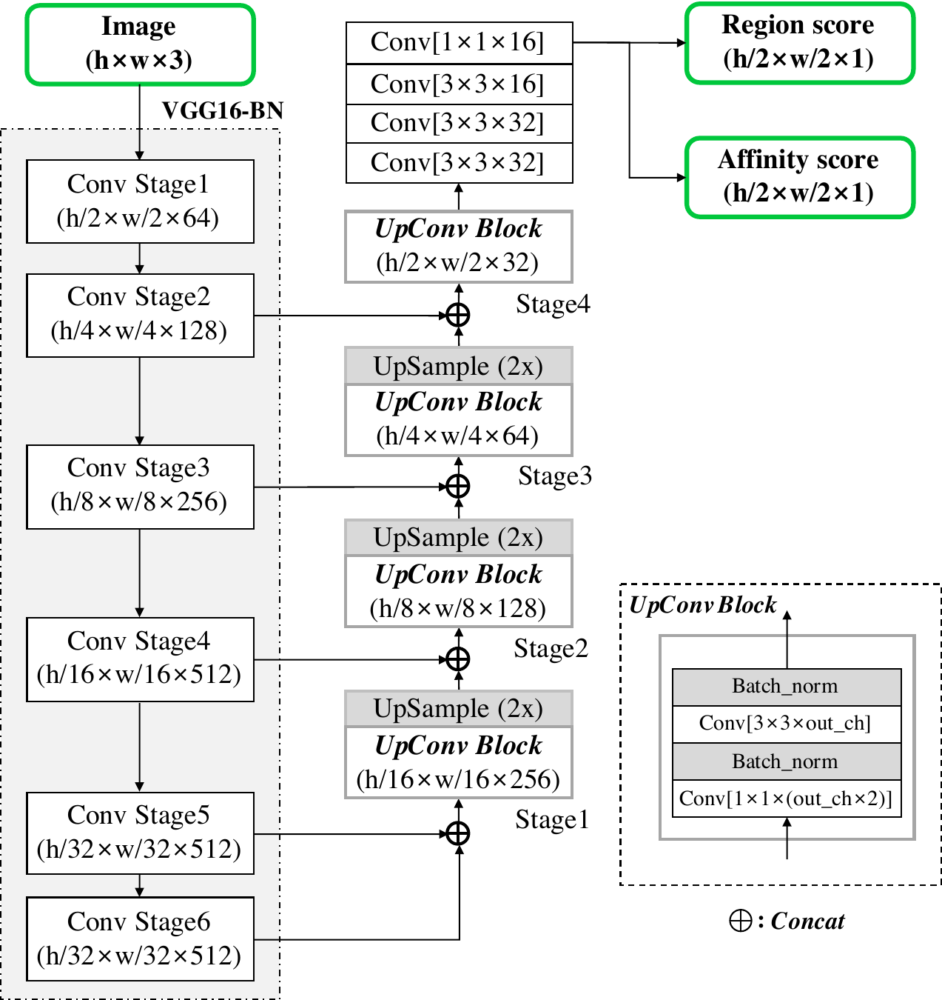
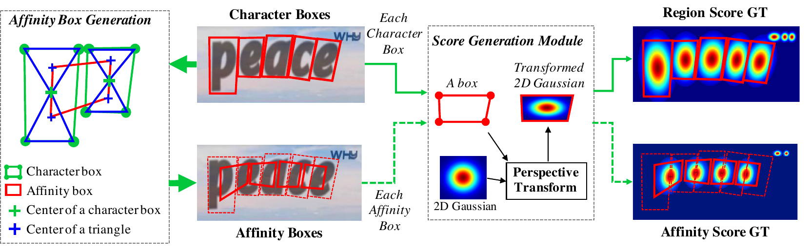
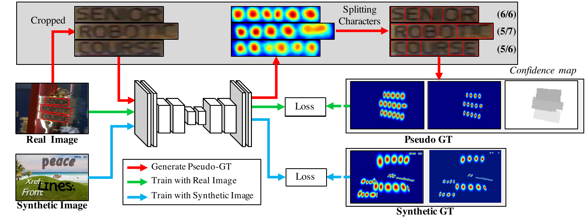
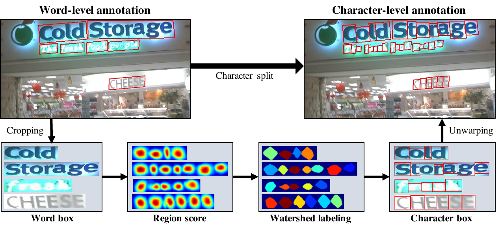
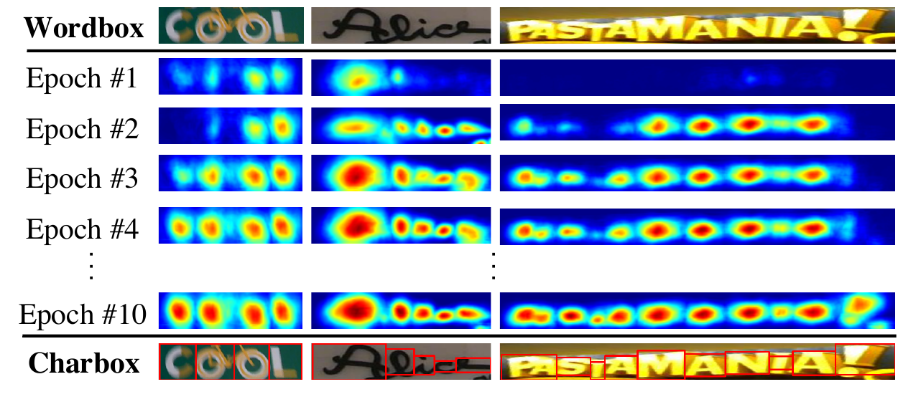
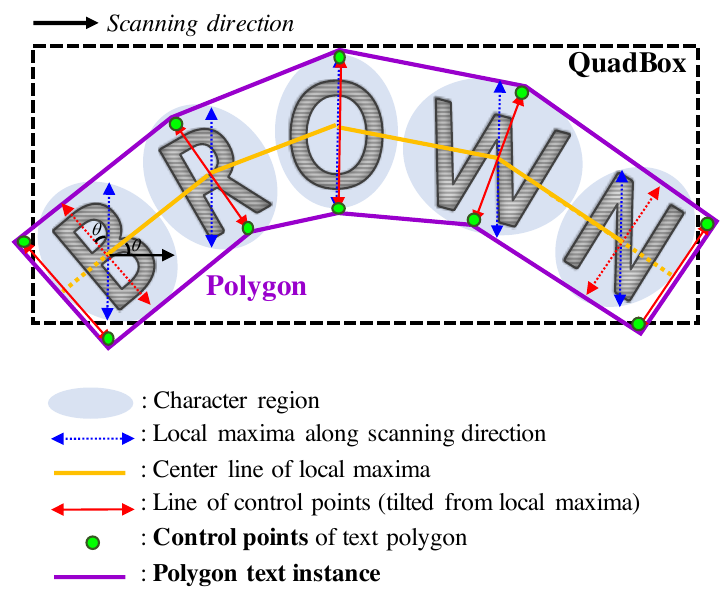
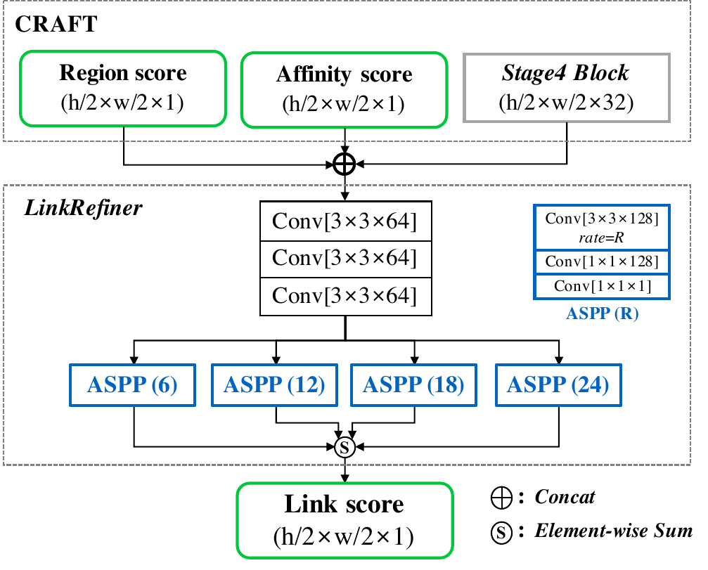

# PAPER_CRAFT — Character Region Awareness for Text Detection

> **한 줄 요약**
> 단어 박스를 통째로 회귀(regression)하지 말고, **글자 하나하나의 중심(region score)** 과 **글자 사이의 연결(affinity score)** 을 두 장의 Gaussian heatmap(가우시안 열지도)으로 그린 뒤 붙은 덩어리를 묶어 단어를 만든다.
> 문제는 "글자 단위 정답(character-level annotation)이 세상에 없다"는 것 — 이걸 **모델이 스스로 만들어 쓰되, 정답 글자 수로 신뢰도를 매겨 가중치를 조절하는 weakly-supervised learning(약지도 학습)** 으로 푼다.

---

## 0. 메타 정보

| 항목 | 값 |
|---|---|
| 제목 | Character Region Awareness for Text Detection (CRAFT) |
| 저자 | Youngmin Baek, Bado Lee, Dongyoon Han, Sangdoo Yun, Hwalsuk Lee |
| 소속 | NAVER Clova AI Research |
| 발표 | **CVPR 2019** |
| 공개일 | 2019-04-03 |
| arXiv | [1904.01941](https://arxiv.org/abs/1904.01941) · [PDF](https://arxiv.org/pdf/1904.01941) · [ar5iv HTML](https://ar5iv.labs.arxiv.org/html/1904.01941) |
| 공식 코드 | [github.com/clovaai/CRAFT-pytorch](https://github.com/clovaai/CRAFT-pytorch) (inference + 학습된 weight `craft_mlt_25k.pth`, `craft_refiner_CTW1500.pth`) |
| 분야 | Scene Text Detection(장면 텍스트 검출) — OCR 파이프라인의 앞단 |
| backbone(백본) | **VGG-16 with Batch Normalization** (ImageNet 사전학습) |
| 사용 데이터 | SynthText(합성, 글자 단위 정답 포함) + ICDAR2013 / 2015 / 2017-MLT |
| 평가 데이터 | IC13, IC15, IC17, MSRA-TD500, TotalText, CTW-1500 (총 6개) |

### 이 문서를 정리한 이유 (왜?)

CRAFT는 **EasyOCR·keras-ocr의 기본 text detector(텍스트 검출기)** 로 지금까지 실무에 박혀 있는 모델이다. 구조는 평범한데(VGG + U-Net) 왜 이렇게 오래 살아남았는지 — 즉 **"모델에게 무엇을 예측시킬 것인가(출력 표현 설계)"** 와 **"정답이 없는데 어떻게 학습시킬 것인가(약지도 부트스트랩)"** 두 아이디어를 정리해 둔다. 이 두 패턴은 텍스트 검출 밖에서도 그대로 재사용된다.

---

## 1. 주요 용어 사전 (Glossary)

> **왜?** — 본문에 들어가기 전, 논문 전체에서 반복되는 용어를 먼저 쉬운 말로 풀어둔다. 이후 본문에서는 영어 용어만 쓴다.

### 과제(task) 관련

- **scene text detection(장면 텍스트 검출)** — 간판·표지판·상품 포장 등 **자연 이미지 안의 글씨가 어디 있는지 위치를 찾는** 일. 글자를 읽는 recognition(인식)은 그다음 단계.
- **word-level annotation(단어 단위 정답)** — 데이터셋이 "단어 하나 = 박스 하나"로 라벨을 주는 방식. 대부분의 공개 데이터셋이 이 형태.
- **character-level annotation(글자 단위 정답)** — "글자 하나 = 박스 하나". 실제 이미지 데이터셋에는 **거의 존재하지 않는다.** 이 논문의 출발점이 되는 결핍.
- **transcription(전사, 글자 내용)** — 그 단어가 무슨 글자인지 적어둔 텍스트("COFFEE"). 위치가 아니라 **내용**. 이 논문은 여기서 "글자 개수"만 뽑아 쓴다.
- **H-mean** — recall(재현율)과 precision(정밀도)의 조화평균. 검출 성능의 대표 지표(F1과 같은 개념).

### 이 논문의 핵심 개념

- **region score(영역 점수)** — "이 픽셀이 **어떤 글자의 중심**일 확률". 네트워크 출력 채널 1.
- **affinity score(친화 점수)** — "이 픽셀이 **인접한 두 글자를 잇는 다리의 중심**일 확률". 네트워크 출력 채널 2. **이 논문의 발명품.**
- **Gaussian heatmap(가우시안 열지도)** — 0/1 이진 마스크가 아니라, 중심이 가장 밝고 바깥으로 갈수록 부드럽게 어두워지는 봉우리로 정답을 표현한 것.
- **affinity box(친화 박스)** — 이웃한 두 글자 박스로부터 기하학적으로 계산되는 사각형. 여기에 Gaussian을 그려 affinity score의 정답으로 쓴다.
- **pseudo-GT(의사 정답, pseudo-ground truth)** — 사람이 만든 정답이 아니라, **학습 중인 모델이 스스로 만들어낸 정답**. 여기서는 글자 박스.
- **confidence score(신뢰도 점수)** — pseudo-GT를 얼마나 믿을지 나타내는 0~1 값. 손실(loss)의 가중치로 쓰인다.
- **interim model(중간 모델)** — 아직 학습이 끝나지 않았지만 pseudo-GT를 만들어내는 데 쓰는, 그 시점까지 학습된 모델.

### 구조/후처리 관련

- **FCN(fully convolutional network, 완전 합성곱 신경망)** — fully-connected layer 없이 conv만으로 이뤄져, 입력 크기가 달라도 그대로 돌아가고 출력이 **이미지 형태(맵)** 인 네트워크.
- **U-Net skip connection(스킵 연결)** — 인코더의 얕은 층 feature를 디코더 같은 해상도 위치에 이어 붙여(concat), 세밀한 위치 정보를 복원하는 구조.
- **receptive field(수용 영역)** — 출력 픽셀 하나가 원본 이미지에서 "보고 있는" 범위. 단어 전체를 보려면 넓어야 하지만, **글자 하나만 보면 되면 좁아도 된다** — 이게 CRAFT의 근본 이점.
- **CCL(Connected Component Labeling, 연결 요소 라벨링)** — 이진 이미지에서 서로 붙어 있는 픽셀 덩어리마다 번호를 매기는 고전 알고리즘. 여기서는 **덩어리 하나 = 단어 하나**.
- **watershed algorithm(분수령 알고리즘)** — 밝기를 지형의 높이로 보고 "물이 고이는 골짜기"를 기준으로 영역을 나누는 고전 분할 기법. 붙어 있는 두 봉우리를 갈라내는 데 쓴다.
- **NMS(Non-Maximum Suppression, 비최대 억제)** — 겹치는 박스 중 점수 높은 것만 남기는 후처리. **CRAFT는 이걸 쓰지 않는다.**
- **QuadBox** — CRAFT가 내놓는 회전 사각형(4점) 형태의 단어 박스.
- **OHEM(Online Hard Negative Mining, 온라인 어려운 음성 표본 채굴)** — 배경 중 모델이 자꾸 틀리는 "헷갈리는 배경"만 골라 학습에 넣는 기법. 벽돌 무늬·창살처럼 글자처럼 생긴 것들을 걸러내는 용도.
- **ASPP(Atrous Spatial Pyramid Pooling)** — 구멍 뚫린 합성곱(atrous/dilated conv)을 여러 배율로 병렬 적용해, 파라미터를 크게 늘리지 않고 **넓은 receptive field**를 얻는 모듈. LinkRefiner에서 사용.

---

## 2. 논문 요약 (TL;DR)

- **한 줄** — "단어를 찾지 말고 글자를 찾은 다음 이어 붙여라." 그리고 "글자 정답이 없으면 모델이 만들게 하되, 정답 글자 수로 채점해서 믿을 만큼만 배우게 하라."
- **핵심 문제** — 기존 검출기는 "단어 하나 = 딱딱한 사각형 하나"라는 전제 위에 있다. 그래서 ① 휘어진 글씨(curved text)를 못 담고, ② 아주 긴 글씨는 receptive field를 넘어서 multi-scale test(여러 배율로 넣고 합치기)에 의존하며, ③ 붙어 있는 단어끼리 박스가 겹쳐 NMS가 흔들린다.
- **해결책** — 출력 표현을 바꾼다. `region score`(글자 중심) + `affinity score`(글자 사이 다리) 두 장의 Gaussian heatmap. 추론 시 두 맵을 합쳐 threshold(임계값) 후 CCL로 묶으면 단어가 통째로 나온다. 휘어진 글씨는 글자 봉우리들을 따라 polygon(다각형)을 그린다.
- **약지도 학습** — SynthText로 먼저 학습 → 실제 이미지의 단어 영역을 잘라 interim model이 region score 예측 → watershed로 글자 분리 → 글자 박스 획득 → 이걸 pseudo-GT로 다시 학습(부트스트랩). 신뢰도는 **"내가 찾은 글자 수 vs 정답 글자 수"** 로 계산해 손실 가중치로 쓴다.
- **검증** — 6개 벤치마크 **전부 single-scale(단일 배율)** 로 당시 SOTA. IC13 H-mean 95.2, IC15 86.9, IC17 73.9, MSRA-TD500 82.9, TotalText 83.6, CTW-1500 83.5. 게다가 MSRA-TD500·TotalText·CTW-1500은 **fine-tuning(미세조정) 없이** 달성.

---

## 3. 핵심 기여 (Contributions)

1. **character-level 출력 표현 제안** — region score + affinity score라는 2채널 Gaussian heatmap. 특히 **affinity score**는 "글자만 찾으면 어느 글자끼리 한 단어인지 모른다"는 문제를 **별도 그룹핑 알고리즘 없이 픽셀 수준에서** 해결한 이 논문의 발명.
2. **글자 단위 정답 없이 학습하는 weakly-supervised 프레임워크** — interim model이 만든 pseudo-GT를 부트스트랩으로 쓰되, transcription의 **word length(단어 길이)** 를 채점 기준으로 삼는 confidence score를 도입해 라벨 노이즈를 손실 가중치로 제어.
3. **NMS가 필요 없는 단순 후처리** — threshold → CCL → `minAreaRect` 세 줄. 인스턴스 분리가 출력 표현 자체에 내장돼 있기 때문.
4. **arbitrary-shape(임의 형태) 대응 polygon 생성** — local maxima line + center line 기반의 후처리로 휘어진 글씨를 다각형으로 표현. 덤으로 **rectification(휜 글씨 펴기)** 까지 가능해 인식 단계에 도움.
5. **scale robustness 실증** — single-scale만으로 multi-scale test를 쓰는 방법들을 이김. 작은 receptive field로 충분하다는 주장의 정량적 근거.
6. **generalization(일반화) 실증** — 학습에 쓰지 않은 3개 데이터셋(TD500·TotalText·CTW-1500)에서 fine-tuning 없이 SOTA.

---

## 4. 주요 알고리즘 설명

> **왜?** — 이 절에 CRAFT의 모든 수식·구조·수치를 한 번에 모아둔다. 이후 실험/Q&A 절에서는 반복하지 않고 여기를 참조한다.

### 4.1 직관 먼저 — "글자는 크기가 안 변한다"

> **왜?** — 구조를 보기 전에, 왜 굳이 단위를 단어에서 글자로 내렸는지를 한 문장으로 잡고 간다.

거대한 간판 글씨와 작은 라벨 글씨는 **단어 단위로 보면 크기가 100배 차이**나지만, **글자 하나로 좁혀 보면 종횡비도 모양도 비슷**하다. 그래서:

| 관점 | 단어 단위 검출 | 글자 단위 검출 (CRAFT) |
|---|---|---|
| 필요한 receptive field | 단어 전체를 덮어야 함 → 큼 | 글자 하나면 충분 → **작음** |
| 크기 변화 대응 | multi-scale test 필요 | **single-scale로 충분** |
| 휘어진 글씨 | 사각형에 안 담김 | 글자들을 이어 붙이면 됨 |
| 인스턴스 분리 | NMS 튜닝 | affinity로 이미 분리됨 |
| 대가(cost) | — | **글자끼리 묶는 문제 + 글자 정답 부재** 라는 새 문제 발생 |

이 논문의 나머지 전부는 저 마지막 줄의 **대가 두 개를 갚는 이야기**다. 묶는 문제는 `affinity score`(§4.3)로, 정답 부재는 `weakly-supervised learning`(§4.4)으로 갚는다.

### 4.2 아키텍처 (Fig. 2)

> **왜?** — 출력이 "이미지 크기의 맵 2장"이어야 하므로, 분류용 네트워크가 아니라 **FCN + 해상도 복원 구조**가 필요하다.



- **인코더**: VGG16-BN의 Conv Stage1~5 + Stage6(추가 pooling·conv). 해상도는 h/2 → h/4 → h/8 → h/16 → h/32로 줄어든다.
- **디코더**: `UpConv Block` 4개. 각 블록은 `Conv[1×1×(out_ch×2)] → BN → Conv[3×3×out_ch] → BN` 구조이고, 앞 단계 출력을 2배 upsample한 뒤 **인코더의 같은 해상도 feature와 concat(이어 붙이기)** 해서 입력받는다. 채널은 256 → 128 → 64 → 32로 줄어든다.
- **헤드**: `Conv[3×3×32] → Conv[3×3×32] → Conv[3×3×16] → Conv[1×1×16]` → **2채널 출력**.
- **출력 해상도**: **입력의 1/2** (h/2 × w/2 × 2). 채널 하나가 region score, 다른 하나가 affinity score.

구조 자체는 2019년 기준으로도 평범하고, 논문도 이걸 기여로 내세우지 않는다. **기여는 "이 평범한 구조에 무엇을 예측시키는가"에 있다.**

### 4.3 정답 라벨 생성 — Gaussian heatmap과 affinity box (Fig. 3)

> **왜?** — 글자 박스의 경계를 픽셀 단위로 정확히 맞히는 건 어렵고(경계 자체가 모호), 우리가 필요한 건 "여기 글자가 하나 있다"는 **중심의 존재**뿐이다. 그래서 이진 마스크 대신 봉우리를 그린다.



**region score 정답 만들기 (3단계)**

1. 2차원 **isotropic Gaussian map(등방성 가우시안 맵)** 을 **딱 한 장 미리** 만들어 둔다.
2. 그 정사각 Gaussian map과 실제 글자 사각형(4점) 사이의 **perspective transform(원근 변환)** 행렬을 계산한다.
3. Gaussian map을 그 변환으로 **warp(워핑, 찌그러뜨려 붙이기)** 한다.

> 픽셀마다 Gaussian 값을 직접 계산하면 매우 느리고, 실제 글자 박스는 원근 때문에 찌그러져 있다. 원본 한 장을 워핑만 하면 어떤 각도·원근이든 공짜 — 구현이 단순해지는 실용적 트릭이다.

**affinity score 정답 만들기 (affinity box)**

1. 각 글자 박스에 **대각선 두 개**를 그어 **upper/lower character triangle(위·아래 글자 삼각형)** 을 만든다.
2. 이웃한 두 글자 박스에 대해, **왼쪽 글자의 위·아래 삼각형 무게중심 + 오른쪽 글자의 위·아래 삼각형 무게중심** 네 점을 꼭짓점으로 하는 **affinity box**를 만든다.
3. 여기에 같은 방식으로 Gaussian을 워핑한다.

이렇게 정의하면 글자들이 휘어지며 나열돼도 affinity box가 **자연스럽게 따라 휘고**, 글자 크기가 변하면 다리 크기도 **비례해서 변한다**. 사람이 손으로 튜닝할 파라미터가 없다는 게 이 정의의 미덕.

논문의 표현으로: *"이 정답 정의 덕분에 작은 receptive field로도 크거나 긴 텍스트를 충분히 검출할 수 있다. 반면 box regression 방식은 그런 경우 큰 receptive field를 요구한다."*

### 4.4 Weakly-Supervised Learning — 이 논문의 심장 (Fig. 4, 6)

> **왜?** — 실제 데이터셋(IC13/IC15/IC17)은 **단어 박스 + transcription**만 준다. 합성 데이터(SynthText)로만 학습하면 실제 이미지의 조명·폰트·왜곡에 약하다. 그래서 "실제 이미지에 글자 박스를 자동으로 붙이는" 절차가 필요하다.



**부트스트랩 루프**

1. SynthText로 50k iteration 학습해 **interim model**을 만든다.
2. 실제 이미지에서 **단어 영역을 잘라낸다(crop)**.
3. interim model이 그 조각의 region score를 예측한다.
4. **watershed algorithm**으로 봉우리들을 갈라 개별 글자 영역으로 분리하고, 각 영역을 감싸는 사각형을 만든다.
5. crop 때 쓴 변환의 역변환으로 **원본 이미지 좌표계로 되돌린다(unwarp)**.
6. 이 글자 박스들로 §4.3의 절차를 다시 돌려 **pseudo-GT** 두 장(region/affinity)을 만든다.
7. 그걸로 학습 → 모델이 좋아짐 → 다음 라운드 pseudo-GT가 더 좋아짐 (반복).


*Fig. 6 — 1) 단어 이미지 crop → 2) region score 예측 → 3) watershed 적용 → 4) 글자 박스 획득 → 5) 원본 좌표로 unwarp*

**confidence score — 라벨 노이즈를 어떻게 다루나**

pseudo-GT가 틀리면 모델이 망가진다(글자 영역이 뭉개져 blur된 출력이 나온다). 그런데 **매우 강한 단서가 하나 있다: 우리는 정답 글자 수를 알고 있다.** 단어가 "COFFEE"라면 글자는 6개여야 한다. 모델이 4개만 찾았다면 그 pseudo-GT는 믿을 게 못 된다.

단어 샘플 `w`에 대해, `R(w)` = 단어 박스 영역, `l(w)` = 실제 글자 수, `l^c(w)` = 모델이 분리해낸 글자 수라 할 때:

```
s_conf(w) = ( l(w) − min( l(w), |l(w) − l^c(w)| ) ) / l(w)      ... (식 1)
```

(즉 **글자 개수 오차를 단어 길이로 정규화해 1에서 뺀 값**. 오차가 단어 길이보다 커지면 `min`이 막아줘서 음수가 되지 않는다.)

| 정답 글자 수 l | 검출 l^c | 오차 | s_conf |
|---|---|---|---|
| 6 | 6 | 0 | **1.00** |
| 6 | 5 또는 7 | 1 | 0.833 |
| 6 | 3 또는 9 | 3 | **0.50** |
| 6 | 0 또는 12 | 6 | 0.00 |

픽셀 단위 confidence map은:

```
S_c(p) = s_conf(w)   (p 가 단어 영역 R(w) 안일 때)
S_c(p) = 1           (그 외 = 배경)
```

**s_conf < 0.5 일 때의 규칙 (중요)**
예측을 버리고, 단어 영역 `R(w)`를 **글자 수 `l(w)`만큼 균등 분할**한 박스를 대신 쓴다. 그리고 `s_conf`를 **0.5로 고정**한다.

> 왜 완전히 버리지 않고 0.5를 주는가? 버려버리면 "모델이 아직 못 읽는 어려운 글꼴"을 **영원히 못 배운다**. 절반의 확신으로라도 학습에 넣어 unseen appearance(처음 보는 외형)를 익히게 하려는 것. 참고로 한자·한글·가나 같은 East Asian 문자는 글자 폭이 거의 일정해서 이 균등 분할 가정이 잘 맞는다 — 논문이 동아시아 문자에서 성능이 좋은 이유로 직접 지목하는 부분이다.

**추가 규칙**: IC15/IC17의 "DO NOT CARE"(평가 제외) 영역은 `s_conf`를 **0**으로 두어 학습에서 완전히 배제한다.

**손실 함수 (식 3)**

```
L = Σ_p  S_c(p) · ( ||S_r(p) − S_r*(p)||²₂ + ||S_a(p) − S_a*(p)||²₂ )
```

(즉 픽셀마다 region/affinity 각각의 **제곱 오차(L2)를 더한 뒤, 그 픽셀의 신뢰도를 곱해 합산**한다.) `S_r*`, `S_a*`는 pseudo-GT, `S_r`, `S_a`는 예측값. **합성 데이터로 학습할 때는 진짜 정답이 있으므로 `S_c(p) = 1`.**

> **설계 관점의 요점**: confidence score가 곧 **픽셀별 학습률 손잡이**다. 확실한 라벨은 세게, 애매한 라벨은 약하게 배운다. 라벨 노이즈를 "제거"가 아니라 **"가중치 감쇠"** 로 다루는 것이 이 논문의 우아한 부분.


*Fig. 5 — 학습 초기에는 낯선 글꼴의 region score가 낮지만(신뢰도 낮음), 학습이 진행되면서 봉우리가 선명해지고 `s_conf`도 함께 올라간다. 부트스트랩이 실제로 수렴한다는 증거.*

### 4.5 추론 (1) — QuadBox: NMS 없는 후처리

> **왜?** — ICDAR 계열 평가 프로토콜이 단어 단위 IoU라서, heatmap을 단어 사각형으로 바꿔야 한다.

1. 빈 binary map `M`을 0으로 초기화.
2. `S_r(p) > τ_r` **또는** `S_a(p) > τ_a` 인 픽셀을 1로 (τ_r = region threshold, τ_a = affinity threshold).
3. `M`에 **CCL** 적용 → 덩어리 하나 = 단어 하나.
4. 각 덩어리에 **최소 면적 회전 사각형**(OpenCV `minAreaRect`)을 씌워 **QuadBox** 획득.

> 논문 본문에는 τ 값이 없다. **공식 코드 `test.py` 기본값**: `text_threshold=0.7`, `link_threshold=0.4`, `low_text=0.4`, `canvas_size=1280`, `mag_ratio=1.5`.

**NMS가 없다는 점이 실용적으로 크다.** region/affinity로 인스턴스가 이미 분리돼 나오므로, 단어 박스는 각 덩어리를 감싸는 사각형 하나로 곧바로 정의된다. 밀집 텍스트에서 NMS 임계값을 튜닝하는 고통이 사라진다. 또한 SegLink·WordSup 같은 기존 linking 기법이 **텍스트 조각들 사이의 관계를 명시적으로 탐색**하는 것과 달리, CRAFT의 연결은 **픽셀 수준에서 암묵적으로** 일어난다.

**MSRA-TD500 예외**: 이 데이터셋은 line-level(줄 단위) 정답이라 단어 사이 공백까지 박스에 포함된다. 그래서 "한 박스의 오른쪽 변과 다른 박스의 왼쪽 변이 충분히 가까우면 합친다"는 후처리를 추가로 적용한다.

### 4.6 추론 (2) — Polygon 생성: 휘어진 글씨 (Fig. 7)

> **왜?** — TotalText·CTW-1500처럼 곡선 글씨를 다각형으로 평가하는 데이터셋에서는 사각형으로는 점수를 받을 수 없다.



1. **scanning direction(글자 배열 방향)** 을 따라가며 각 위치에서 **local maxima line**(그 열에서 region score가 최대인 지점을 지나는 세로선, 그림의 파란 점선)을 찾는다.
2. 선들의 길이를 **최댓값으로 통일**한다 — 최종 다각형이 들쭉날쭉해지는 것을 막기 위해.
3. 선들의 중점을 이어 **center line(중심선, 노란 선)** 을 만든다.
4. 각 local maxima line을 **center line에 수직이 되도록 회전**시킨다(빨간 화살표) — 글자의 tilt angle(기울기)을 반영.
5. 회전된 선들의 양 끝점이 다각형의 **control point(제어점, 녹색 점)** 후보가 된다.
6. 텍스트 영역을 완전히 덮기 위해, **양쪽 끝 두 선을 center line 방향으로 바깥으로 밀어** 최종 control point를 만든다.

부수 효과: 이 다각형이 있으면 휜 글씨를 **직선으로 펴는(rectification)** 것도 가능하다. 논문은 이게 인식 단계에 도움이 될 것이라 언급한다(실제로 후속 CRAFTS가 이 길로 간다).

### 4.7 LinkRefiner — CTW-1500 전용 어댑터 (부록, Fig. 10)

> **왜?** — CTW-1500은 **줄 단위 + transcription 없음**이라는 두 특성이 겹친다. CRAFT의 affinity 정의는 "공백을 사이에 둔 글자끼리는 affinity가 0"이므로, 줄 전체를 하나로 묶어야 하는 이 데이터셋과 **정의가 근본적으로 어긋난다**.



- **입력**: `region score` + `affinity score` + **CRAFT Stage4의 중간 feature map**을 concat.
- **구조**: **ASPP** 채용 — 멀리 떨어진 글자·단어를 같은 텍스트 줄로 묶으려면 **넓은 receptive field**가 필수이기 때문.
- **출력**: `link score`(refined affinity score) — 긴 텍스트에 맞게 조정된 연결 맵.
- **정답**: 라벨 다각형의 짝지어진 control point들의 **중심끼리 선을 그어** 만든다. 선의 두께는 짝지어진 점 사이 거리에 비례.
- **학습**: **CRAFT는 완전히 얼리고(freeze) LinkRefiner만** CTW-1500 학습셋으로 학습.
- **추론**: 원래 affinity score 대신 `link score`를 써서 TotalText와 **동일한** polygon 생성 절차를 수행.

즉 affinity의 의미를 "단어 내부 연결"에서 "줄 전체 연결"로 갈아끼우는 **plug-in 어댑터**다. 방법론적 순수함으로 보면 벤치마크 정의에 맞추기 위한 장치이기도 하다.

---

## 5. 실험 요약

### 5.1 데이터셋

> **왜?** — CRAFT의 주장(임의 형태 + 크기 강인 + 일반화)을 검증하려면 사각형/곡선/다국어/줄단위가 모두 필요하다.

| 데이터셋 | 학습/테스트 | 정답 형태 | 특징 |
|---|---|---|---|
| **IC13** (ICDAR2013) | 229 / 233 | 직사각형, 단어 단위 | 고해상도 근접 촬영 영어 |
| **IC15** (ICDAR2015) | 1,000 / 500 | 사각형(4점), 단어 단위 | Google Glass 촬영, 저품질·흔들림 |
| **IC17-MLT** | 7,200 / 1,800 val / 9,000 | 사각형(4점) | **9개 언어** 다국어 |
| **MSRA-TD500** | 300 / 200 | 회전 직사각형, **줄 단위** | 영어+중국어, **transcription 없음** |
| **TotalText** | 1,255 / 300 | **다각형**, 단어 단위 | 곡선 텍스트 |
| **CTW-1500** | 1,000 / 500 | **14점 다각형**, 줄 단위 | 곡선 + transcription 없음 |

### 5.2 학습 전략

> **왜?** — 약지도 학습이 성립하려면 "crop용 사각형 정답"과 "글자 수 계산용 transcription"이 **둘 다** 있어야 한다. 그 조건을 만족하는 데이터셋이 제한적이라 학습 구성이 특이해진다.

- **1단계**: SynthText로 **50k iteration** 사전학습.
- **2단계**: 벤치마크로 **25k iteration** fine-tuning. 이때 SynthText를 **1:5 비율**로 계속 섞는다 — 글자 영역이 확실히 분리된 상태를 유지하기 위해.
- **optimizer**: ADAM.
- **multi-GPU**: **학습용 GPU와 supervision(pseudo-GT 생성)용 GPU를 분리**하고, 생성된 pseudo-GT는 메모리에 저장. (즉 pseudo-GT는 미리 만들어 두는 게 아니라 **학습 중 계속 갱신**된다.)
- **OHEM 1:3** — 벽돌·창살처럼 글자를 닮은 배경 텍스처를 걸러내기 위해.
- **augmentation**: crop, rotation, color variation.

**약지도 학습이 가능한 데이터셋은 IC13·IC15·IC17뿐**이다. MSRA-TD500은 transcription이 없고, TotalText·CTW-1500은 다각형 정답만 있어 crop이 곤란하다. 그래서 **두 개의 모델**만 학습한다:

| 모델 | 학습 데이터 | 평가 대상 |
|---|---|---|
| 모델 A | IC15 | IC15만 |
| 모델 B | IC13 + IC17 | **나머지 5개 전부** (IC13, IC17, TD500, TotalText, CTW-1500) |

즉 **TD500·TotalText·CTW-1500은 한 번도 학습한 적 없는 데이터셋**이다. 추가 이미지는 전혀 쓰지 않았다.

### 5.3 결과 — 사각형 데이터셋 (Table 1)

> **왜?** — 기존 검출기들과 같은 평가 규칙에서 정면으로 비교하는 메인 실험. 모든 실험은 **single-scale**이며, 긴 변 기준 IC13=960, IC15=2240, IC17=2560, TD500=1600으로 리사이즈.

| Method | IC13 R/P/**H** | IC15 R/P/**H** | IC17 R/P/**H** | TD500 R/P/**H** | FPS |
|---|---|---|---|---|---|
| Zhang et al. | 78 / 88 / 83 | 43 / 71 / 54 | – | 67 / 83 / 74 | 0.48 |
| Yao et al. | 80.2 / 88.8 / 84.3 | 58.7 / 72.3 / 64.8 | – | 75.3 / 76.5 / 75.9 | 1.61 |
| SegLink | 83.0 / 87.7 / 85.3 | 76.8 / 73.1 / 75.0 | – | 70 / 86 / 77 | 20.6 |
| SSTD | 86 / 89 / 88 | 73 / 80 / 77 | – | – | 7.7 |
| WordSup | 87.5 / 93.3 / 90.3 | 77.0 / 79.3 / 78.2 | – | – | 1.9 |
| EAST* | – | 78.3 / 83.3 / 80.7 | – | 67.4 / 87.3 / 76.1 | 13.2 |
| He et al. | 81 / 92 / 86 | 80 / 82 / 81 | – | 70 / 77 / 74 | 1.1 |
| R2CNN | 82.6 / 93.6 / 87.7 | 79.7 / 85.6 / 82.5 | – | – | 0.4 |
| TextSnake | – | 80.4 / 84.9 / 82.6 | – | 73.9 / 83.2 / 78.3 | 1.1 |
| TextBoxes++* | 86 / 92 / 89 | 78.5 / 87.8 / 82.9 | – | – | 2.3 |
| *EAA* | 87 / 88 / 88 | 83 / 84 / 83 | – | – | – |
| *Mask TextSpotter* | 88.1 / 94.1 / 91.0 | 81.2 / 85.8 / 83.4 | – | – | 4.8 |
| PixelLink* | 87.5 / 88.6 / 88.1 | 82.0 / 85.5 / 83.7 | – | 73.2 / 83.0 / 77.8 | 3.0 |
| RRD* | 86 / 92 / 89 | 80.0 / 88.0 / 83.8 | – | 73 / 87 / 79 | 10 |
| Lyu et al.* | 84.4 / 92.0 / 88.0 | 79.7 / 89.5 / 84.3 | **70.6** / 74.3 / 72.4 | 76.2 / 87.6 / 81.5 | 5.7 |
| *FOTS* | – / – / 87.3 | 82.0 / 88.8 / 85.3 | 57.5 / 79.5 / 66.7 | – | **23.9** |
| **CRAFT (ours)** | **93.1 / 97.4 / 95.2** | **84.3 / 89.8 / 86.9** | 68.2 / **80.6 / 73.9** | **78.2 / 88.2 / 82.9** | 8.6 |

(`*` = multi-scale test 사용, *이탤릭* = end-to-end 모델의 검출 부분만 떼어낸 결과)

- **IC13에서 H-mean 95.2** — 2위(Mask TextSpotter 91.0)와 4.2%p 차이. precision 97.4가 특히 인상적.
- **IC17 recall만 68.2**로 Lyu et al.(70.6)에 밀린다 — 다국어 문제(§5.6) 때문.
- **FPS 8.6**은 IC13(긴 변 960) 기준. IC17은 2560으로 돌리므로 실제로는 훨씬 느리다. 논문도 "실험 환경이 달라 참고용"이라 못 박는다.

### 5.4 결과 — 다각형 데이터셋 (Table 2)

> **왜?** — "임의 형태에 강하다"는 이 논문의 핵심 주장을 직접 검증하는 자리. 긴 변 기준 TotalText=1280, CTW-1500=1024.

| Method | TotalText R/P/**H** | CTW-1500 R/P/**H** |
|---|---|---|
| CTD+TLOC | – | 69.8 / 77.4 / 73.4 |
| Mask TextSpotter | 55.0 / 69.0 / 61.3 | – |
| TextSnake | 74.5 / 82.7 / 78.4 | **85.3** / 67.9 / 75.6 |
| **CRAFT (ours)** | **79.9 / 87.6 / 83.6** | 81.1 / **86.0 / 83.5** |

**둘 다 fine-tuning 없이** 얻은 수치라는 게 핵심. CTW-1500은 LinkRefiner(§4.7)를 함께 사용한 결과다.

### 5.5 결과 — End-to-end 모델과의 비교 (Table 3)

> **왜?** — 검출만 학습한 모델이, 인식기(recognizer)의 도움을 받는 모델들과 비교해 어디쯤인지 보기 위해.

| Method | IC13 | IC15 | IC17 |
|---|---|---|---|
| Mask TextSpotter | 91.7 | 86.0 | – |
| EAA | 90 | 87 | – |
| FOTS | 92.8 | **89.8** | 70.8 |
| **CRAFT (ours)** | **95.2** | 86.9 | **73.9** |

FOTS·Mask TextSpotter는 인식기를 함께 학습해 검출을 보정받는다. CRAFT는 **검출 정답만으로 학습**하고도 이 수준. **IC15에서만 FOTS에 뒤지는데**, 논문의 해석이 흥미롭다: IC15는 **의미(semantics)로 단어를 나눈** 라벨이 많은데(예: 붙어 있는 글자열을 뜻으로 쪼갬), CRAFT는 **시각적 단서(글자 간격 대비 글자 크기)** 만 보기 때문에 그런 경계를 알 수 없다. 즉 인식 결과가 있으면 이득을 볼 지점이라고 스스로 진단한다.

### 5.6 Discussions (논문 §4.4)

> **왜?** — 저자들이 결과를 어떻게 해석하는지, 그리고 어디서 실패하는지를 스스로 밝힌 부분.

**① Robustness to Scale Variance(크기 변화 강인성)**
모든 데이터셋을 single-scale로 실험했다. 대부분의 다른 방법이 multi-scale test에 의존하는 것과 대비된다. *"이 이점은 텍스트 전체가 아니라 개별 글자를 지역화(localize)하는 성질에서 온다. 큰 이미지에서도 글자 하나를 덮는 데는 상대적으로 작은 receptive field로 충분하다."*

**② Multi-language issue(다국어 문제)**
IC17에는 **Bangla(벵골어)·Arabic(아랍어)** 이 있는데, ① 합성 데이터셋에 없는 문자이고, ② **모든 글자가 흘려 쓰여(cursive) 글자 단위로 나누기가 근본적으로 어렵다.** 그래서 Latin·한국어·중국어·일본어만큼 잘 구분하지 못한다. 반대로 동아시아 문자는 **일정한 폭으로 쉽게 분리**되어 약지도 학습이 잘 먹힌다.

**③ Generalization ability(일반화 능력)**
추가 fine-tuning 없이 3개 데이터셋에서 SOTA. 특정 데이터셋에 overfitting(과적합)된 게 아니라 **텍스트의 일반적 성질을 잡았다**는 근거.

---

## 6. 한계 및 비판적 검토

> **왜?** — 이 방법을 실제로 쓸 때 어디서 깨지는지 미리 알아두기 위해.

| 한계 | 내용 |
|---|---|
| **transcription 의존** | confidence score 계산에 정답 **글자 수**가 필요하다. 단어 박스만 있고 내용이 없는 데이터셋(MSRA-TD500 등)에는 약지도 루프를 아예 적용할 수 없다. |
| **cursive script 붕괴** | 아랍어·벵골어처럼 글자가 이어지는 문자 체계는 watershed 분리가 실패한다. IC17 recall 68.2가 그 결과. |
| **bootstrapping 초기값 의존** | interim model이 나쁘면 나쁜 pseudo-GT가 강화된다. SynthText 사전학습이 사실상 필수 전제이고, SynthText에 없는 문자 체계는 출발부터 불리하다. |
| **ablation study(제거 실험)가 얇다** | affinity 정의를 바꾸면? Gaussian 대신 이진 마스크면? confidence 가중을 빼면? — **정량 비교가 없다.** 정성적 그림 비교 위주라, 각 요소의 기여도를 논문만으로는 알 수 없다. |
| **속도 표기의 함정** | FPS 8.6은 IC13(960px) 기준. IC15는 2240, IC17은 2560으로 돌리므로 실제 다국어 상황에서는 크게 느려진다. |
| **polygon 후처리가 heuristic** | local maxima line + center line 회전 방식은 파라미터 감각에 의존한다. 극단적으로 휘거나 세로쓰기인 경우 취약. 논문도 "다각형 정답에 대한 명시적 학습 규칙이 아직 없다"고 인정. |
| **의미 기반 단어 분리 불가** | 시각적 간격만 보므로, 뜻으로 단어를 나눈 라벨(IC15)에는 원리적으로 대응 못 한다. |
| **CTW-1500은 별도 네트워크 필요** | LinkRefiner라는 데이터셋 전용 모듈이 있어야 SOTA가 나온다. 하나의 모델로 모든 정답 형식을 커버하지는 못한다. |

---

## 7. 💬 Q&A

### Q1. affinity score가 왜 그렇게 중요한 발명인가?

> 글자만 잘 찾는 검출기는 이 논문 이전에도 있었다(WordSup, Yao et al.). 문제는 **"찾은 글자들을 어떻게 단어로 묶느냐"** 였다.

기존 linking 방식들은 검출된 조각들 사이의 **관계를 명시적으로 탐색**했다 — SegLink는 segment 사이의 link를 별도로 예측하고, WordSup은 사각형 anchor 제약 안에서 그룹핑했다. 탐색 알고리즘이 붙으면 규칙·임계값·예외 처리가 따라온다.

CRAFT는 **묶는 일 자체를 heatmap 예측 문제로 바꿔버렸다.** "글자 사이 공간의 중심"에 봉우리를 하나 더 그려두면, 추론 때 두 맵을 OR로 합치는 순간 **글자와 다리가 하나의 연결 덩어리**가 된다. 그다음은 CCL이라는 1970년대 알고리즘이 다 해준다. 별도 그룹핑 로직도, NMS도 없다.

즉 **알고리즘으로 풀던 문제를 표현(representation)으로 옮긴 것** — 이게 이 논문에서 가장 배울 만한 설계 태도다.

### Q2. 왜 이진 마스크가 아니라 Gaussian heatmap인가?

세 가지 이유가 겹친다.

1. **경계가 원래 모호하다.** 글자의 "영역"이 어디까지인지는 정의하기 나름이다. 중심만 맞히면 되는 문제로 바꾸면 라벨의 자의성이 줄어든다. (논문은 pose estimation에서 관절 위치를 heatmap으로 표현하는 관행을 근거로 든다.)
2. **watershed가 가능해진다.** 봉우리와 골짜기가 있어야 붙어 있는 두 글자를 갈라낼 수 있다. 이진 마스크로는 붙은 글자가 하나의 덩어리로만 보인다. **즉 §4.4의 약지도 학습 전체가 Gaussian 표현에 의존한다.**
3. **L2 loss와 궁합이 맞는다.** 연속값 회귀 문제가 되므로 heatmap 회귀의 표준인 L2를 쓸 수 있다(cross-entropy나 smooth L1이 아니라).

### Q3. 신뢰도 0.5 미만일 때 "균등 분할"이라는 조치는 위험하지 않나?

위험하다. 글자 폭이 실제로 다르면(비례 폰트의 "I"와 "W") 그 pseudo-GT는 명백히 틀린 위치를 가리킨다.

그래서 논문은 **가중치도 0.5로 같이 낮춘다.** "이 라벨은 절반만 믿어라"는 신호를 함께 주는 것. 완전히 버리는 선택지와 비교하면:

| 선택 | 결과 |
|---|---|
| 버린다 | 어려운 글꼴은 영원히 학습에서 배제됨 → 그 폰트는 계속 못 읽음 |
| 그대로 쓴다(가중치 1) | 틀린 위치를 강하게 학습 → 모델 붕괴 |
| **균등 분할 + 가중치 0.5** | 위치는 대충이지만 "여기 글자가 6개 있다"는 개수 정보는 전달됨 |

핵심은 **틀린 정보와 맞는 정보가 섞여 있을 때, 맞는 부분(개수·대략적 위치)만이라도 약하게 흘려보낸다**는 발상이다. 그리고 동아시아 문자에서는 이 가정이 실제로 잘 맞아서, 논문이 동아시아 성능의 이유로 직접 지목한다.

### Q4. CRAFT가 왜 single-scale로 충분한가?

`receptive field`가 **글자 하나만 덮으면 되기 때문**이다.

단어 단위 회귀 모델은 "WELCOME"이라는 긴 단어의 박스를 예측하려면 그 픽셀 하나가 단어 전체를 봐야 한다. 이미지가 커지면 필요한 시야가 비례해 커지고, 고정된 네트워크로는 감당이 안 되니 이미지를 축소해서 여러 번 넣는다(multi-scale).

CRAFT의 출력 픽셀은 "내가 어떤 글자의 중심인가?"만 답하면 된다. 이 질문의 답에 필요한 시야는 **글자 하나 크기**이고, 그건 이미지가 커져도 상대적으로 작게 유지된다. 그래서 단일 배율로도 큰 글씨와 작은 글씨를 동시에 잡는다.

### Q5. 왜 NMS가 필요 없나?

**NMS가 필요한 이유는 원래 "같은 물체에 대한 중복 예측"을 지우기 위해서**다. anchor 기반 검출기는 물체 하나마다 여러 anchor가 박스를 내놓기 때문에 중복이 구조적으로 발생한다.

CRAFT는 박스를 예측하지 않는다. 픽셀 맵을 예측하고, **CCL이 만들어낸 덩어리 하나마다 사각형이 정확히 하나** 나온다. 중복이 애초에 생기지 않으므로 지울 것도 없다. 후처리는 `threshold → connectedComponents → minAreaRect` 세 줄이면 끝이고, 이게 8.6 FPS의 상당 부분을 설명한다.

### Q6. 2026년 시점에서 이 논문은 어떤 위치인가?

**논문 점수보다 실무 영향력이 큰 케이스**다.

- 공식 저장소의 `craft_mlt_25k.pth`는 **EasyOCR·keras-ocr의 기본 검출기**로 들어가 지금도 현역이다. "CRAFT 검출 + CRNN 인식"이 오랫동안 오픈소스 OCR의 표준 조합이었다.
- 저자 그룹(NAVER Clova)은 이후 인식 벤치마크를 정리한 *What Is Wrong With Scene Text Recognition Model Comparisons?*, CRAFT를 인식기와 결합한 **CRAFTS**(ECCV 2020), 그리고 파이프라인 자체를 버린 **Donut**(OCR-free 문서 이해)으로 나아간다. **"검출→인식 파이프라인을 정교하게 만들다가, 결국 파이프라인을 없애는" 궤적**이다.
- 오늘날 문서 이해는 Qwen3-VL·Florence-2·PaliGemma 같은 VLM이 픽셀에서 바로 텍스트를 뱉는 방향으로 넘어갔다([[paper_qwen3_vl]], [[paper_florence_2]], [[paper_paligemma]]). Florence-2가 좌표를 **위치 토큰**으로 바꿔 검출을 텍스트 생성 문제로 흡수한 것이 대표적 — CRAFT가 "표현을 바꿔 알고리즘을 없앤" 것과 같은 종류의 수(手)를 한 단계 더 밀어붙인 셈이다.
- 그럼에도 CRAFT류가 남아 있는 이유: ① 정확한 **좌표**가 필요할 때(레이아웃 분석, 마스킹, 개인정보 블러), ② 20M급 파라미터로 CPU/엣지에서 도는 가성비, ③ 출력이 **결정적(deterministic)이고 디버깅 가능**하다는 점.

### Q7. 지금 이 아이디어를 다시 쓴다면 어디를 고칠까?

| 지점 | 개선 방향 |
|---|---|
| backbone | VGG16-BN(무겁고 구식) → ResNet/ConvNeXt/경량 ViT. 성능·속도 둘 다 이득이 크다. |
| pseudo-GT 검증 | 글자 개수 하나에만 의존 → 현대적 recognizer나 VLM으로 crop을 읽혀 **내용까지 대조**하면 훨씬 강한 신뢰도 신호가 된다. |
| cursive script | watershed 대신 **인식기의 attention/CTC alignment**에서 글자 경계를 역산하면 아랍어·벵골어도 다룰 수 있다(CRAFTS가 간 방향). |
| polygon 후처리 | heuristic 대신 control point를 직접 회귀하거나 Bezier 곡선 파라미터를 예측(ABCNet 계열). |
| 데이터셋별 어댑터 | LinkRefiner 같은 전용 모듈 대신, 출력 형식을 **프롬프트/토큰으로 지시**하는 통합 모델(Florence-2 방식). |

---

## 8. 한 줄 요약 (전체)

**CRAFT는 새 아키텍처가 아니라 "모델에게 무엇을 예측시킬 것인가(region + affinity Gaussian heatmap)"와 "없는 라벨을 어떻게 만들어 쓸 것인가(글자 수로 채점하는 confidence 가중 약지도 부트스트랩)"** 두 질문에 답한 논문이고, 그 답이 7년 넘게 실무 OCR 파이프라인에서 살아남았다.

---

## 9. 관련 문서 / 메모리 링크

- [[paper_florence_2]] — 좌표를 위치 토큰으로 바꿔 검출·OCR·그라운딩을 seq2seq 하나로 통일. CRAFT의 "표현 치환" 전략을 극단까지 민 사례.
- [[paper_paligemma]] / [[paper_paligemma_2]] — VLM에서 OCR 성능은 **해상도**가, 추론 성능은 **LM 크기**가 결정한다는 분해 분석. CRAFT가 고해상도 입력에 의존하는 이유와 통한다.
- [[paper_qwen3_vl]] — 문서/OCR·그라운딩 최상위 VLM. 현재 이 계열이 CRAFT의 대체재 위치.
- [[paper_lpips]] — 같은 "CVPR 고전" 계열 정리 문서. 지각 지표.
