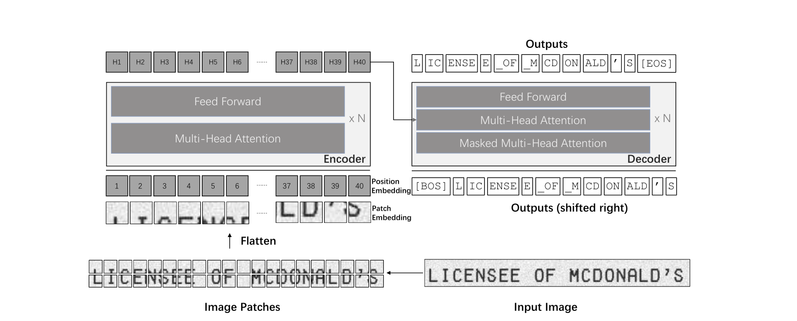

# PAPER_TrOCR — Transformer-based Optical Character Recognition with Pre-trained Models

> 논문 본체 정리 + **오피셜 코드(microsoft/unilm/trocr) 상세 분석**
> 작성일: 2026-07-30

---

## 0. 메타 정보

| 항목 | 내용 |
|---|---|
| **제목** | TrOCR: Transformer-based Optical Character Recognition with Pre-trained Models |
| **저자** | Minghao Li¹, Tengchao Lv², Jingye Chen²\*, Lei Cui², Yijuan Lu², Dinei Florencio², Cha Zhang², Zhoujun Li¹, Furu Wei² |
| **소속** | ¹Beihang University, ²Microsoft Corporation (\* 마이크로소프트 아시아 연구소 인턴 기간 수행) |
| **arXiv** | [2109.10282](https://arxiv.org/abs/2109.10282) — v1 2021-09-21 → **v5 2022-09-06** |
| **PDF** | https://arxiv.org/pdf/2109.10282 |
| **학회** | arXiv 표기는 "Work in Progress", 실제로는 **AAAI 2023** 게재 (저장소 README 기준) |
| **분야** | OCR — text recognition(텍스트 인식), 문서 이해(document understanding) |
| **오피셜 코드** | https://github.com/microsoft/unilm/tree/master/trocr (단축: https://aka.ms/trocr) |
| **HuggingFace** | `microsoft/trocr-{small,base,large}-{handwritten,printed,stage1,str}` |
| **사용한 외부 모델** | DeiT, BEiT (인코더 초기값) / RoBERTa, MiniLM·UniLM3 (디코더 초기값) |
| **사용한 외부 데이터** | 인터넷 공개 PDF 200만 페이지, TRDG(합성 텍스트 생성기), Google Fonts + 1001fonts 손글씨 폰트 5,427종, Wikipedia, IIIT-HWS, MJSynth, SynthText, IAM, SROIE Task 2, STR 벤치마크 6종 |

### 이 문서를 정리한 이유 (왜?)

*OCR 파이프라인을 직접 만들거나 손글씨·영수증 인식기를 미세조정(fine-tuning)할 때 TrOCR은 지금도 기본 선택지인데, 논문 서술과 오피셜 코드의 실제 동작이 여러 곳에서 어긋난다.* 이 문서는 (1) 논문이 주장한 것, (2) 코드가 실제로 하는 것, (3) 그 둘의 차이를 한 곳에 모아, 재현을 시도할 때 어디까지 가능한지 미리 알 수 있게 한다.

---

## 1. 주요 용어 사전 (Glossary)

### 과제(task) 관련

| 용어 | 뜻 |
|---|---|
| **OCR** (Optical Character Recognition, 광학 문자 인식) | 이미지 속 글자를 컴퓨터가 읽을 수 있는 문자 코드로 바꾸는 일. 보통 두 모듈로 나뉜다 — 어디에 글자가 있는지 찾기 + 그게 무슨 글자인지 읽기 |
| **text detection**(텍스트 검출) | 이미지에서 글자 영역의 위치(박스)를 찾아내는 단계. TrOCR은 **이 단계를 하지 않는다** (향후 과제로 명시). [[PAPER_CRAFT]]가 이 역할 |
| **text recognition**(텍스트 인식) | 잘라낸 글자 이미지 조각을 실제 문자열로 바꾸는 단계. **TrOCR이 담당하는 부분** |
| **textline**(텍스트 라인) | 한 줄짜리 글자 이미지 조각. TrOCR의 입력 단위 |
| **scene text**(장면 텍스트) | 간판·표지판처럼 자연 사진 속에 있는 글자. 블러·가림(occlusion)·저해상도 때문에 인쇄 문서보다 어렵다 |
| **CER** (Character Error Rate, 문자 오류율) | 예측 문자열을 정답으로 고치는 데 필요한 최소 편집 횟수 ÷ 정답 글자 수. **낮을수록 좋다** |
| **Word Accuracy / WPA** (Word Prediction Accuracy, 단어 정확도) | 단어 하나를 글자 하나까지 완벽히 맞혔는지 비율. **높을수록 좋다** |
| **36-char 평가** | 장면 텍스트 관행 — 소문자 알파벳 26 + 숫자 10 = 36자만 남기고 대소문자·기호를 무시한 뒤 비교 |

### 기존 방식(비교 대상)

| 용어 | 뜻 |
|---|---|
| **CNN + RNN 파이프라인** | 2021년까지의 표준. CNN(합성곱 신경망)이 이미지 특징을 뽑고, RNN/LSTM/GRU가 그 특징을 글자 순서로 풀어냄 |
| **CTC** (Connectionist Temporal Classification) | 이미지 폭의 각 위치와 글자를 일일이 짝지어주지 않고도 학습할 수 있게 해주는 손실 함수(loss). 반복 글자와 빈칸(blank)을 접어서 최종 문자열을 만든다 |
| **external LM**(외부 언어 모델) | 인식 결과를 문법·어휘 지식으로 사후 보정하는 별도 모델. 기존 방식은 정확도를 끌어올리려면 대개 이걸 덧붙여야 했다. **TrOCR이 없애려는 대상** |
| **CRNN** | CNN+RNN+CTC의 대표 구현. 논문의 baseline |

### 이 논문의 핵심 개념

| 용어 | 뜻 |
|---|---|
| **encoder-decoder**(인코더-디코더) | 입력을 이해하는 쪽(encoder)과 출력을 만들어내는 쪽(decoder)을 나눈 구조. TrOCR은 인코더=이미지, 디코더=글자 |
| **patch embedding**(패치 임베딩) | 이미지를 16×16 픽셀 정사각형 조각(patch)으로 자르고, 각 조각을 쭉 펴서(flatten) 선형 변환(linear projection)으로 벡터 하나로 만드는 것. Transformer는 "벡터의 나열"만 처리할 수 있어서 필요한 절차 |
| **wordpiece**(단어 조각) | 글자 하나씩이 아니라 "LIC / ENSE / E" 처럼 자주 등장하는 문자 덩어리 단위로 출력하는 방식. 출력 길이가 짧아지고 언어 지식이 자연스럽게 들어온다 |
| **BPE / SentencePiece** | wordpiece를 만드는 두 가지 토크나이저(tokenizer) 알고리즘. TrOCR은 RoBERTa 계열엔 BPE, Small엔 SentencePiece 사용 |
| **[CLS] token**(클래스 토큰) | ViT가 이미지 전체를 대표하도록 앞에 붙이는 특수 벡터. 원래 분류용이지만 TrOCR도 그냥 유지 |
| **distillation token**(증류 토큰) | DeiT가 "교사 모델(teacher model)에게 배운 것"을 담도록 추가한 특수 벡터. TrOCR은 DeiT 가중치를 쓸 때 이것도 버리지 않고 유지 |
| **cross-attention** (=encoder-decoder attention, 교차 어텐션) | 디코더가 "지금 어느 이미지 패치를 봐야 하나"를 결정하는 층. 질의(query)는 디코더에서, 키·값(key·value)은 인코더에서 온다. **이미지와 글자를 잇는 다리** |
| **causal mask / attention mask**(인과 마스크) | 디코더가 아직 만들지 않은 미래 글자를 미리 훔쳐보지 못하게 가리는 장치 |
| **teacher forcing**(교사 강요) | 학습할 때 이전 예측 대신 **정답**을 다음 입력으로 넣는 방법. 정답 시퀀스를 한 칸 밀고 시작 토큰을 붙인다 |
| **autoregressive**(자기회귀) | 한 토큰을 뽑고, 그걸 다시 입력에 넣어 다음 토큰을 뽑는 방식. 정확하지만 토큰 수만큼 반복해야 해서 느리다 |
| **beam search**(빔 서치) | 매 단계에서 가장 그럴듯한 후보 k개를 동시에 살려두고 끝까지 가보는 탐색. TrOCR은 k=10 |
| **inductive bias**(귀납적 편향) | 모델 구조 자체에 미리 박아둔 가정. CNN은 "가까운 픽셀끼리 관련 있다"를 구조로 강제하는데, Transformer는 그 가정이 없어 데이터에서 직접 배운다 |

### 재사용한 사전학습 모델(pre-trained model)

| 용어 | 뜻 |
|---|---|
| **ViT** (Vision Transformer) | 이미지를 패치 나열로 바꿔 Transformer에 넣는 원조 모델 |
| **DeiT** (Data-efficient image Transformer) | ImageNet만으로 ViT를 잘 학습시킨 버전. 강한 분류기의 지식을 distillation(증류)으로 물려받음 |
| **BEiT** | 이미지 패치 일부를 가리고 복원하게 시키는 **MIM** (Masked Image Modeling, 마스크 이미지 모델링) 방식의 자기지도(self-supervised) 사전학습 모델. 라벨 없이 학습 |
| **RoBERTa** | BERT를 하이퍼파라미터·데이터 규모 면에서 재검증해 개선한 언어 모델 |
| **MiniLM / UniLM3** | 큰 Transformer의 마지막 층 self-attention을 흉내내게(distillation) 압축한 소형 언어 모델. 성능 99% 유지 주장 |

### 데이터·프레임워크

| 용어 | 뜻 |
|---|---|
| **digital-born PDF**(디지털 태생 PDF) | 스캔이 아니라 처음부터 컴퓨터로 만들어진 PDF. 글자 위치와 내용이 파일 안에 이미 들어 있어 **라벨을 공짜로 얻을 수 있다** |
| **TRDG** (TextRecognitionDataGenerator) | 폰트·배경·왜곡을 조합해 텍스트 이미지를 합성해주는 오픈소스 도구 |
| **MJSynth(MJ) / SynthText(ST)** | 장면 텍스트 인식용 표준 합성 데이터셋 (합쳐 약 1,600만 장) |
| **IAM** | 손글씨 영어 문장 데이터셋. 손글씨 인식의 사실상 표준 벤치마크 |
| **SROIE Task 2** | 영수증 이미지에서 글자를 읽는 대회 과제. 검출은 정답 박스가 주어짐 |
| **fairseq** | 페이스북(Meta)의 시퀀스 모델링 툴킷. TrOCR 코드는 독립 프로그램이 아니라 **fairseq 플러그인**이다 |
| **timm** | PyTorch 이미지 모델 모음 라이브러리. 인코더를 여기서 만든다 |
| **state_dict** | PyTorch에서 "층 이름 → 가중치 텐서" 사전(dictionary). 사전학습 모델 이식은 결국 이 이름들을 짝지어주는 작업 |
| **`strict=False`** | state_dict를 넣을 때 **짝이 안 맞는 이름을 그냥 무시**하는 옵션. 편하지만 조용히 랜덤 초기화되는 사고의 원인 |
| **ape** (absolute position embedding, 절대 위치 임베딩) | 각 패치가 몇 번째 칸인지 알려주는 학습 가능한 벡터. 코드에서는 "위치 임베딩을 해상도에 맞게 2D 보간할지" 결정하는 플래그 이름으로 쓰인다 |

---

## 2. 논문 요약 (TL;DR)

**한 줄**: OCR 인식기를 새로 설계하지 말고, 이미 학습된 image Transformer와 text Transformer를 그냥 encoder-decoder로 붙이고 대규모 합성 데이터로 사전학습하면, 10년간 다듬어온 OCR 전용 설계를 이긴다.

**핵심 문제**
2021년 표준 OCR 인식기는 네 겹 조립품이었다 — CNN(이미지) + RNN(순서) + CTC(정렬) + external LM(보정). 여기엔 세 가지 손해가 있었다.
1. 전부 처음부터 학습(from scratch)해서, 당시 이미 넘쳐나던 사전학습 모델을 하나도 못 썼다.
2. 글자 단위(char-level) 출력이라 문맥 지식을 넣으려면 별도 언어 모델이 필요했다.
3. CNN의 image-specific inductive bias(이미지 특화 귀납적 편향)에 묶여 있었고, attention은 CNN 위에 얹은 장식이었다.

**해결책**
CNN을 완전히 없애고, 인코더는 DeiT/BEiT, 디코더는 RoBERTa/MiniLM으로 **초기화**한 순정(vanilla) Transformer encoder-decoder 하나로 통일. 출력 단위를 char에서 **wordpiece**로 올려 언어 모델링을 디코더가 자체 흡수. 그리고 digital-born PDF에서 라벨이 공짜로 붙은 textline 6억 8,400만 장을 뽑아 사전학습.

**검증**
- SROIE(인쇄) F1 **96.58** — 리더보드 1위 모델(96.43) 추월
- IAM(손글씨) CER **2.89** — external LM 없이, external LM 쓴 3.2를 이김
- 장면 텍스트 8개 실험 중 **5개 SOTA**

---

## 3. 핵심 기여 (Contributions)

1. **image Transformer와 text Transformer를 함께 쓴 최초의 end-to-end OCR 모델.** 외부 언어 모델이 필요 없다.
2. **순정 Transformer encoder-decoder 하나로 SOTA.** convolution 없음(convolution free), 복잡한 전/후처리 없음.
3. **모델과 코드 공개** — 이 문서 §6이 그 코드를 분석한다.
4. (논문이 기여로 세지 않았지만 실질적으로 가장 큰 것) **digital-born PDF에서 라벨 공짜로 뽑는 6.8억 장 합성 데이터 파이프라인.** §5.2의 소거 실험(ablation)이 이것이 성능 기여의 절반 이상임을 보여준다.

---

## 4. 주요 알고리즘 설명

*이 장은 논문 본문이 서술한 방법을 정리한다. 코드가 실제로 무엇을 하는지는 §6에서 따로 다룬다 — 두 곳에서 어긋나는 지점이 여럿 있다.*



*그림 읽는 법: 아래 오른쪽 원본 이미지("LICENSEE OF MCDONALD'S")를 왼쪽처럼 패치로 자르고 → 각 패치를 벡터로 만들어(patch embedding) 위치 번호(position embedding)를 더해 인코더에 넣는다 → 인코더 출력 H1…H40이 디코더의 cross-attention으로 흘러들어가고 → 디코더는 [BOS]에서 시작해 "L / IC / ENSE / E / \_OF / …" 처럼 **wordpiece 단위로** 한 조각씩 뽑아 [EOS]에서 멈춘다.*

### 4.1 인코더 — 눈 역할

*왜? CNN 백본을 쓰지 않고도 이미지에서 글자 모양 정보를 뽑을 수 있는지가 이 논문의 첫 번째 질문이라서.*

1. 입력 이미지를 **384×384로 리사이즈**
2. **16×16 패치**로 자름 → 패치 개수 N = HW / P² = (384×384) / (16×16) = **576개**
3. 각 패치를 평탄화(flatten) 후 선형 사영(linear projection)해 D차원 patch embedding으로. D는 Transformer의 hidden size(숨은 차원)
4. ViT/DeiT 관례대로 **[CLS] token 유지**, DeiT 가중치를 쓸 때는 **distillation token까지 그대로 남김**
5. 패치와 특수 토큰 모두에 절대 위치에 따른 **학습 가능한 1D position embedding** 부여

CNN이 없으니 image-specific inductive bias가 없다 → 모델이 "이미지 전체"와 "개별 패치" 어느 쪽에든 자유롭게 주의를 배분할 수 있다는 것이 논문의 논지.

### 4.2 디코더 — 입 역할

*왜? 글자를 순서대로 만들어내면서, 동시에 언어 지식(어떤 단어가 그럴듯한지)까지 이 모듈이 담당해야 external LM을 없앨 수 있어서.*

- 순정 Transformer decoder. 인코더와 층 구조는 같고, 중간에 **cross-attention**이 추가된다 (key·value는 인코더 출력, query는 디코더 입력)
- causal mask로 미래 토큰 차단 — 위치 i의 출력은 i보다 앞의 입력만 볼 수 있다
- 은닉 상태(hidden state)를 어휘 크기 V로 사영한 뒤 softmax:

  h_i = Proj(Emb(Token_i))
  σ(h_ij) = exp(h_ij) / Σ_{k=1..V} exp(h_ik)

  *(즉 각 위치에서 어휘 V개 중 무엇이 나올 확률이 얼마인지 계산한다)*
- 최종 출력은 **beam search (beam=10)**

### 4.3 모델 초기화 — 이 논문의 실제 알맹이

*왜? "새 구조를 설계하지 않는다"는 것이 논문의 주장이므로, 기여의 실체는 어떤 사전학습 가중치를 어디에 어떻게 꽂느냐에 있다.*

| 자리 | 후보 | 성격 |
|---|---|---|
| 인코더 | **DeiT** | ImageNet 지도학습 + distillation |
| 인코더 | **BEiT** | MIM 자기지도 (라벨 불필요) |
| 디코더 | **RoBERTa** | BERT 개선판 |
| 디코더 | **MiniLM** | 압축된 소형 LM |

**여기서 발생하는 구조 불일치**: RoBERTa와 MiniLM은 **인코더 전용 모델**이라 cross-attention 층이 애초에 없다. 논문의 해법은 정직하게 무식하다 — 파라미터 이름 매핑을 **수동으로 지정**해 겹치는 것만 옮기고, 없는 것(cross-attention)은 **랜덤 초기화**한다.

즉 "사전학습 디코더 재사용"이란 **self-attention과 FFN만 물려받았다**는 뜻이고, 이미지와 글자를 잇는 다리는 처음부터 배운다. 또 RoBERTa 전체를 쓰지 않고 **뒤쪽 절반 층만** 쓴다 (base면 마지막 6층, large면 마지막 12층).

### 4.4 학습 절차 (task pipeline)

*왜? 이미지-텍스트 쌍을 어떻게 손실 함수에 연결하는지가 없으면 위 구조는 돌아가지 않아서.*

**학습 시**: 정답 토큰 뒤에 [EOS]를 붙이고, 전체를 한 칸 뒤로 밀고 맨 앞에 [BOS]를 넣어 디코더 입력으로 준다(teacher forcing). 출력은 원래 정답 시퀀스와 **cross-entropy loss(교차 엔트로피 손실)**로 비교.

**추론 시**: [BOS]에서 시작해 방금 뽑은 토큰을 다시 입력에 붙이며 반복(autoregressive), [EOS]가 나오면 종료.

### 4.5 사전학습 — 실질적 기여는 사실 여기 있다

*왜? §5.2 ablation이 보여주듯, 구조보다 이 데이터가 성능의 대부분을 만든다.*

**1단계 — 인쇄 텍스트 대량 주입**
인터넷 공개 PDF **200만 페이지**를 샘플링 → digital-born이라 렌더링하면 textline 위치를 정확히 알 수 있음 → 잘라내면 **깨끗한 라벨이 자동으로 붙은 textline 6억 8,400만 장(684M)**.

라벨링 비용 0원으로 6.8억 장을 만든 이 데이터 트릭이, 이 논문에서 가장 오래 살아남은 아이디어다.

**2단계 — 태스크별 특화**

| 태스크 | 데이터 구성 | 규모 |
|---|---|---|
| 인쇄(printed) | TRDG 합성 100만 장 (템플릿 2종 + 내장 폰트) + 실제 영수증 5.3만 장을 상용 OCR로 읽고 좌표 기준 crop·정렬 | **3.3M** |
| 손글씨(handwritten) | 손글씨 폰트 **5,427종** × Wikipedia 크롤 문장 (+ IIIT-HWS) | **17.9M** |
| 장면 텍스트(scene text) | 기성 MJSynth + SynthText | **~16M** |

장면 텍스트는 2단계 특화 없이 MJ+ST로 별도 모델을 학습하며, 모두 1단계 모델에서 출발한다.

### 4.6 데이터 증강 (data augmentation)

*왜? 실제 문서에는 회전·번짐·저해상도가 섞여 있는데, 합성 데이터만으로는 그 다양성이 부족해서.*

인쇄/손글씨는 아래 6종 + "원본 유지" 중 **균등 확률로 하나만** 적용한다.

회전(−10°~10°) · 가우시안 블러(Gaussian blur) · 팽창(dilation) · 침식(erosion) · 다운스케일(downscaling) · 밑줄(underlining)

장면 텍스트는 **RandAugment**를 쓰고 종류가 다르다 — 반전(inversion), 곡률(curving), 블러, 노이즈, 왜곡(distortion), 회전 등.

---

## 5. 실험 요약

### 5.1 데이터셋과 학습 환경

*왜? 뒤 표의 숫자들이 어떤 조건에서 나왔는지 알아야 다른 논문과 공정하게 비교할 수 있어서.*

| 벤치마크 | 구성 |
|---|---|
| **SROIE Task 2** | 학습 영수증 626장 / 테스트 361장. **검출은 하지 않고 정답 박스로 잘라낸 textline을 평가** |
| **IAM** (Aachen 분할) | 학습 6,161줄(747 폼) / 검증 966줄(115 폼) / 테스트 2,915줄(336 폼) |
| **장면 텍스트 6종** | IIIT5k-3000, SVT-647, IC13-857/1015, IC15-1811/2077, SVTP-645, CUTE80-288 |

학습 환경: fairseq, **사전학습 V100 32GB × 32장 / 미세조정 8장**, 배치 2,048, lr 5e-5 (— 단 이 수치는 오피셜 명령어와 어긋난다. §6.5 참조)

### 5.2 무엇이 실제로 효과가 있었나 (Table 2, SROIE F1) — 논문의 가장 정직한 표

*왜? 이 논문의 기여가 "구조"인지 "데이터"인지를 저자들 스스로의 숫자로 판별할 수 있는 유일한 표라서.*

| 설정 | F1 | 증가폭 |
|---|---|---|
| 처음부터 학습(from scratch) | 38.24 | — |
| + 사전학습 가중치 사용 | 72.75 | **+34.5** |
| + 데이터 증강 | 82.30 | +9.6 |
| + **1단계 사전학습 (684M)** | 95.48 | **+13.2** |
| + 2단계 사전학습 | 95.84 | **+0.36** |

읽는 법:
- 사전학습 가중치 재사용이 가장 크다(+34.5) — 논문의 제목이 정당하다
- 그 다음이 **자기 손으로 만든 6.8억 장 데이터**(+13.2) — 여기서 사실상 승부가 난다
- 정성껏 설명한 **2단계 태스크 특화는 SROIE에서 사실상 기여하지 않는다**(+0.36). 논문은 이 표를 감추지 않지만, 해석도 하지 않는다

### 5.3 인코더·디코더 조합 (Table 1, SROIE만으로 학습)

*왜? "어떤 사전학습 모델을 꽂아야 하나"를 결정한 실험이고, 이후 모든 설정이 여기서 고정된다.*

| 인코더 | 디코더 | Precision | Recall | F1 |
|---|---|---|---|---|
| DeiT-Base | RoBERTa-Base | 69.28 | 69.06 | 69.17 |
| **BEiT-Base** | RoBERTa-Base | 76.45 | 76.18 | **76.31** |
| ResNet50 | RoBERTa-Base | 66.74 | 67.29 | 67.02 |
| DeiT-Base | RoBERTa-Large | 77.03 | 76.53 | 76.78 |
| **BEiT-Base** | **RoBERTa-Large** | **79.67** | **79.06** | **79.36** |
| ResNet50 | RoBERTa-Large | 72.54 | 71.13 | 71.83 |

결론 두 개: **BEiT > DeiT > ResNet50** (즉 마스킹 자기지도로 배운 시각 표현이 ImageNet 분류로 배운 것보다, 그리고 CNN보다 OCR에 유리하다), 그리고 **디코더는 클수록 좋다**.

### 5.4 최종 3종 세트

*왜? 이후 모든 표의 행 이름이 이 세 가지라서, 각각이 무엇의 조합인지 먼저 확정해 둔다.*

| 모델 | 인코더 | 디코더 | 총 파라미터 |
|---|---|---|---|
| TrOCR-Small | DeiT-Small (12층 / 384) | MiniLM (6층 / 256 / 8 head) | **62M** |
| TrOCR-Base | BEiT-Base (12층 / 768 / 12 head) | RoBERTa-Large 계열 (12층 / 1024 / 16 head) | **334M** |
| TrOCR-Large | BEiT-Large (24층 / 1024 / 16 head) | RoBERTa-Large 계열 (동일) | **558M** |

⚠️ 논문 본문은 base 디코더를 "512 hidden"이라 썼지만 **코드는 1024**다. 그리고 **Base와 Large는 디코더 설정이 완전히 동일**하다 — 인코더만 갈아끼운 구성이다. (§6.1에서 코드로 확인)

### 5.5 SROIE Task 2 (Table 3, 단어 단위 P/R/F1)

*왜? 인쇄 문서 인식에서 상용 시스템·리더보드 1위와 정면 비교하는 실험.*

| 모델 | Recall | Precision | F1 |
|---|---|---|---|
| CRNN | 28.71 | 48.58 | 36.09 |
| Tesseract OCR | 57.50 | 51.93 | 54.57 |
| H&H Lab (리더보드 1위) | 96.35 | 96.52 | 96.43 |
| MSOLab | 94.77 | 94.88 | 94.82 |
| CLOVA OCR | 94.3 | 94.88 | 94.59 |
| TrOCR-Small | 95.89 | 95.74 | 95.82 |
| TrOCR-Base | 96.37 | 96.31 | 96.34 |
| **TrOCR-Large** | 96.59 | 96.57 | **96.58** |

주목: **TrOCR-Small(62M)이 CLOVA OCR을 이긴다.** 리더보드 상위 모델들은 전부 CNN 특징 추출 + LSTM/GRU 언어 모델링 조합인데, 순수 Transformer 한 덩어리가 그걸 넘는다.

### 5.6 IAM 손글씨 (Table 4, CER — 낮을수록 좋음)

*왜? "external LM 없이도 된다"는 논문의 두 번째 주장을 검증하는 실험.*

| 모델 | 구조 | 학습 데이터 | external LM | CER |
|---|---|---|---|---|
| Bluche & Messina 2017 | GCRNN / CTC | Synthetic + IAM | **Yes** | 3.2 |
| Michael et al. 2019 | LSTM/LSTM w/Attn | IAM | No | 4.87 |
| Wang et al. 2020a | FCN / GRU | IAM | No | 6.4 |
| Kang et al. 2020 | Transformer w/ CNN | Synthetic + IAM | No | 4.67 |
| Diaz et al. 2021 | S-Attn / CTC | **Internal** + IAM | No | 3.53 |
| Diaz et al. 2021 | S-Attn / CTC | **Internal** + IAM | **Yes** | **2.75** |
| Diaz et al. 2021 | Transformer w/ CNN | **Internal** + IAM | No | 2.96 |
| TrOCR-Small | Transformer | Synthetic + IAM | No | 4.22 |
| TrOCR-Base | Transformer | Synthetic + IAM | No | 3.42 |
| **TrOCR-Large** | Transformer | Synthetic + IAM | No | **2.89** |

핵심 두 가지:
1. **external LM 없이 2.89** — external LM을 쓴 3.2를 이긴다. 사전학습된 디코더가 언어 모델 역할을 스스로 흡수했다는 주장의 근거
2. Diaz의 2.75만 TrOCR보다 낮은데, 그쪽은 **비공개 내부 사람 라벨 데이터 + external LM**을 쓴다. 추가 사람 라벨 없이 동급이라는 게 저자들의 방어선

### 5.7 장면 텍스트 (Table 6, 36-char 단어 정확도)

*왜? 인쇄·손글씨와 달리 왜곡·저해상도가 심한 영역에서도 통하는지 확인하는 실험.*

| 모델 | IIIT5k | SVT | IC13(1015) | IC15(2077) | SVTP | CUTE |
|---|---|---|---|---|---|---|
| PARSeq-A (2022) | **97.0** | 93.6 | 97.0 | 82.9 | 88.9 | 92.2 |
| MaskOCR (ViT-L, 2022) | 96.5 | 94.1 | 97.8 | — | 90.2 | 92.7 |
| ABINet | 96.2 | 93.5 | — | — | 89.3 | 89.2 |
| TrOCR-Base (합성만) | 90.1 | 91.0 | 96.3 | 75.0 | 90.7 | 86.8 |
| TrOCR-Large (합성만) | 91.0 | 93.2 | 97.0 | 78.0 | 91.0 | 89.6 |
| TrOCR-Base (합성+벤치마크) | 93.4 | 95.2 | 97.4 | 81.2 | 92.1 | 90.6 |
| **TrOCR-Large (합성+벤치마크)** | 94.1 | **96.1** | 97.3 | **84.1** | **93.0** | **95.1** |

8개 실험 중 5개 SOTA. 다만 **IIIT5k에서 94.1로 PARSeq의 97.0에 3점 뒤진다.** 논문은 원인을 스스로 밝힌다 — 사전학습 데이터의 정답은 기호(symbol)를 **포함**하는데 IIIT5k 정답은 기호를 **제외**해서, 모델이 기호를 계속 출력하려 한다는 것. (이 해명이 실제로 성립하는지는 Q3에서 코드로 검증)

### 5.8 추론 속도 (Table 5, IAM 테스트 2,915줄)

*왜? 실서비스 배포에서는 정확도만큼 처리량이 결정적이고, 여기서 예상 밖의 결과가 나온다.*

| 모델 | 파라미터 | 총 토큰 | 시간 | 문장/초 | 토큰/초 |
|---|---|---|---|---|---|
| TrOCR-Small | 62M | 31,081 | 348.4s | **8.37** | 89.22 |
| TrOCR-Base | 334M | 31,959 | 633.7s | 4.60 | 50.43 |
| TrOCR-Large | 558M | 31,966 | 666.8s | 4.37 | 47.94 |

**Base와 Large의 속도 차이가 거의 없다** (4.60 vs 4.37). 파라미터는 1.67배인데도. 원인은 Q1에서.

---

## 6. 오피셜 코드 분석 (microsoft/unilm/trocr)

*왜? 논문이 "수동 매핑", "사전학습 모델 사용" 같은 표현으로 뭉갠 부분의 실체가 코드에만 있고, 논문 수치와 어긋나는 지점도 여기서만 확인되기 때문.*

분석 대상: 저장소 master 브랜치 (2026-07-30 기준). 총 약 3,000줄 + STRAug 복사본 1,485줄.

### 6.0 저장소 지도

fairseq **플러그인**(`--user-dir ./`) 형태다. 독립 학습 스크립트가 없고, `fairseq-train` / `fairseq-generate`에 모델·태스크·데이터셋·스코어러를 등록해 얹는 구조.

| 파일 | 줄 | 역할 |
|---|---|---|
| `trocr_models.py` | 550 | **핵심.** 모델 조립 + 디코더 가중치 이식 4갈래 |
| `deit.py` | 318 | timm 기반 인코더 등록 (DeiT/BEiT 아키텍처) |
| `task.py` | 280 | `text_recognition` 태스크, 사전 로딩, beam search 설정 |
| `data.py` | 267 | 3종 데이터셋 + collater |
| `data_aug.py` | 323 | DA2(논문 6종 증강) + RandAugment(STRAug) |
| `generator.py` | 375 | fairseq SequenceGenerator 포크 (이미지 입력용) |
| `scoring.py` | 107 | CER / WPA / SROIE-F1 지표 |
| `unilm_models.py` | 76 | Small 모델용 UniLM 디코더 |
| `vit_models.py` | 357 | **죽은 레거시** (§6.3) |
| `augmentation/` | 1,485 | STRAug 통째 복사 (Atienza 2021) |

git 히스토리는 병합 커밋 하나로 뭉개져 있어 개발 과정 추적은 불가능하다.

### 6.1 모델 조립 — 논문의 애매한 서술이 코드에서 확정됨

`trocr_models.py:403-490`의 아키텍처 등록부가 정답지다.

| fairseq arch | 인코더 (timm) | 디코더 (층/dim/FFN/head) | 디코더 초기화 |
|---|---|---|---|
| `trocr_small` | `deit_small_distilled_patch16_384` (12층/384) | 6 / **256** / 1024 / 8 | `unilm` |
| `trocr_base` | `beit_base_patch16_384` (12층/768) | 12 / **1024** / 4096 / 16 | `roberta2` |
| `trocr_large` | `beit_large_patch16_384` (24층/1024) | 12 / **1024** / 4096 / 16 | `roberta2` |

- **논문의 "base 디코더 512 hidden"은 오류** — 코드는 1024
- **Base와 Large의 디코더 설정이 완전히 동일** — §5.8의 속도 미스터리가 여기서 풀린다
- Small 디코더 설정 함수의 이름이 `nlrv4_compressed_tiny`다. 논문은 "MiniLM"이라 썼지만 코드는 마이크로소프트 내부 NLRv4 압축 모델을 로드하고, 토크나이저도 저장소에 동봉된 `unilm3-cased.model`(SentencePiece)을 쓴다. **논문의 "MiniLM"과 코드의 실체가 다르다**

cross-attention의 차원 연결은 한 줄로 처리된다 (`trocr_models.py:179`):

```python
roberta_args.encoder_embed_dim = args.encoder_embed_dim
```

→ Base는 768→1024, Large는 1024→1024로 cross-attention이 사영한다.

### 6.2 디코더 가중치 이식 — 논문이 "수동 매핑"이라 뭉갠 부분의 실체

*왜? 논문 §Model Initialization 한 단락의 실제 동작이 네 갈래로 갈리고, 갈래마다 옮겨오는 가중치가 다르기 때문.*

`--decoder-pretrained` 값에 따라 **네 갈래**다.

#### (a) `roberta2` — Base/Large가 실제로 쓰는 경로

1. `torch.hub.load('pytorch/fairseq:main', 'roberta.large')` — **학습 시작 시 인터넷에서 RoBERTa를 내려받는다**
2. 24층 중 **뒤쪽 12층만** 선택 — `offset = len(roberta_layers) - len(decoder_layers)` 로 층 번호를 `layer_num - offset`으로 재번호. 논문의 "마지막 절반" 확인
3. 키 접두사를 제거해 fairseq 디코더 네이밍에 맞춤
4. **`lm_head` 관련 6개 키를 전부 삭제** (`trocr_models.py:216-222`)

4번이 중요하다. RoBERTa의 출력 헤드는 `dense + layer_norm + projection` 3단인데 fairseq 디코더의 출력층은 단순 Linear 하나라 구조가 안 맞는다. 그래서 **RoBERTa의 MLM 헤드를 버리고**, `share_decoder_input_output_embed`(RoBERTa가 임베딩을 묶어놨으니 True)를 통해 **입력 임베딩과 묶어서 대체**한다. 즉 "언어 모델 지식을 물려받는다"는 서술 중 **출력층은 물려받지 않는다**.

마지막에 `load_state_dict(..., strict=False)`. cross-attention(`encoder_attn.*`)이 missing key로 잡혀 랜덤 초기화된다 — 논문 서술과 일치.

🔴 **문제는 `missing_keys, unexpected_keys`를 변수로 받아놓고 로그도 assert도 하지 않는다는 점**이다. fairseq 버전이 바뀌어 키 이름이 어긋나면 **디코더 전체가 조용히 랜덤 초기화된 채 학습이 진행**되고, 사용자는 "성능이 좀 안 나오네" 정도로만 겪는다. 이 저장소에서 실무적으로 가장 위험한 패턴.

#### (b) `roberta` — 구버전 경로, 훨씬 적게 옮긴다

`trocr_models.py:373-376`에서 옮기는 게 딱 세 개다.

```
embed_tokens          # 토큰 임베딩
self_attn             # self-attention
self_attn_layer_norm  # 그 LayerNorm
```

**FFN(`fc1`/`fc2`)을 옮기지 않는다.** Transformer 파라미터의 약 2/3가 FFN인데 그걸 버린다. `roberta2`가 "새 버전"으로 추가된 이유가 이것이다. 두 갈래가 동시에 살아 있어서, 오래된 블로그·튜토리얼을 따라 `--decoder-pretrained roberta`를 쓰면 논문 재현이 안 된다.

#### (c) `unilm` — Small 경로

HuggingFace BERT 네이밍 → fairseq 네이밍 수동 매핑 딕셔너리가 그대로 노출된다 (`trocr_models.py:285-294`). 논문이 "manually setting the corresponding parameter mapping"이라 한 게 정확히 이 표다.

| fairseq | UniLM(BERT) |
|---|---|
| `self_attn.q/k/v_proj` | `attention.self.query/key/value` |
| `self_attn.out_proj` | `attention.output.dense` |
| `self_attn_layer_norm` | `attention.output.LayerNorm` |
| `fc1` / `fc2` | `intermediate.dense` / `output.dense` |
| `final_layer_norm` | `output.LayerNorm` |

위치 임베딩은 `new_pos_weight[pad()+1:] = unilm_pos_embed` — fairseq가 padding_idx+1만큼 오프셋을 두는 규약을 맞춘 것.

그리고 **k_proj의 bias를 동결**한다 (`requires_grad = False`). 근거는 Q5 참조.

🟡 단 `unilm_models.py:20`의 동결 시도는 **실패한 코드**다:

```python
nn.Parameter(torch.zeros_like(self.k_proj.bias, requires_grad=False))
```

`requires_grad=False`가 `zeros_like`에 들어가 있고 `nn.Parameter`에는 안 들어갔다. `nn.Parameter`는 기본이 `requires_grad=True`이므로 동결이 안 된다. 그래서 `trocr_models.py:326-327`에서 다시 수동으로 동결해 땜질한다. **같은 목적의 코드가 두 곳에 있고 하나는 먹지 않는 상태**다.

#### (d) `None` — 디코더 전체 랜덤 초기화 (ablation용)

### 6.3 인코더 — 여기가 가장 문제다

#### 🔴 BEiT 가중치를 **로드하지 않는다**

`deit.py:305-319` 전문이다.

```python
@register_model
def beit_base_patch16_384(pretrained=False, **kwargs):
    model = AdaptedVisionTransformer(
        img_size=384, patch_size=16, embed_dim=768, depth=12,
        num_heads=12, mlp_ratio=4, qkv_bias=False, norm_layer=...)
    model.default_cfg = _cfg()
    return model        # <- pretrained 인자를 쓰지 않음
```

DeiT 함수들은 모두 `if pretrained:` 블록에서 체크포인트를 내려받는데, **BEiT 두 함수에는 그 블록이 아예 없다.** 인코더 생성부(`trocr_models.py:504`)는 `pretrained=True`를 넘기지만 **조용히 무시된다**.

결론: **`--arch trocr_base`로 학습을 시작하면 인코더는 랜덤 초기화다.** BEiT 가중치는 오직 `--finetune-from-model`로 저자들이 배포한 stage1 체크포인트를 얹을 때만 들어온다.

즉 이 저장소로는 **논문의 1단계 사전학습(6.8억 장)을 BEiT 초기값에서 재현할 수 없다.** §5.2가 성능 기여의 절반 이상이라고 지목한 그 단계가 코드로 재현 불가능하다. README에도 사전학습 명령어가 없고 미세조정 명령어만 셋 있다.

덧붙여, 여기 정의된 "BEiT"는 상대 위치 바이어스(relative position bias)가 없는 **평범한 ViT 골격**(절대 위치 임베딩 + `qkv_bias=False`)이다. 진짜 BEiT 구조와 다르다. 배포된 체크포인트가 이 골격에 맞춰져 있다는 뜻이니, **저자들이 BEiT 가중치에서 상대 위치 바이어스를 떼고 이 골격으로 변환한 뒤 사전학습했다고 보는 게 자연스럽다** — 다만 그 변환 스크립트도 저장소에 없다.

#### 🟡 Small 모델의 위치 임베딩 이식이 거칠다

`deit_small_distilled_patch16_384`는 **224 체크포인트**를 내려받아 384 모델에 넣는다 (`deit.py:211-227`). 384 모델은 24×24=576 패치 + 2 특수토큰 = 578 위치, 224 체크포인트는 14×14=196 + 2 = 198 위치다. 코드의 처리:

```python
t = model.state_dict()['pos_embed']   # 랜덤 초기화된 578개
t[:, :198, :] = checkpoint pos_embed  # 앞 198개만 덮어씀
```

즉 **앞 198칸에 14×14 격자용 위치 정보를 그대로 넣고, 나머지 380칸은 랜덤**이다. 2D 공간 의미가 완전히 뒤섞인다. ViT를 고해상도로 옮길 때의 표준은 2D 격자로 되접어 bicubic 보간하는 것이고, 이 저장소에도 그 코드가 `--ape` 플래그 뒤에 있다 — **그런데 기본값이 `ape=False`**라 README의 모든 명령이 거친 경로를 탄다. 6.8억 장 학습으로 회복되니 결과는 나오지만, 설계상 정당화는 어렵다.

#### 🔴 `--ape` 경로에는 실제 버그가 있다

`--ape`를 켜면 보간은 제대로 하는데, 마지막 결합 순서가 틀린다.

| | 순서 |
|---|---|
| 토큰 `x` (`deit.py:108-110`) | `[cls, dist, p0 … p575]` |
| 위치 `pos_embed` (`deit.py:119`) | `[p0 … p575, cls, dist]` |

`x + pos_embed`를 하면 **[CLS] 토큰이 첫 패치의 위치 임베딩을 받고, 마지막 두 패치가 cls/dist 위치 임베딩을 받는다.** 특수 토큰 위치를 앞에 붙여야 하는데 뒤에 붙였다. 배포 모델은 `ape=False`라 영향이 없지만, "제대로 하려고" `--ape`를 켠 사용자가 정확히 손해를 본다.

#### 🟢 논문에 없는 흥미로운 유물 두 개

**CogView PB-Relax 어텐션** (`deit.py:17-47`): softmax 전에 점수를 alpha=32로 나누고 최댓값을 뺀 뒤 되돌리는, fp16 오버플로 방지 트릭이다. 주석에 "느려지고 약간의 편향이 생긴다"고 솔직히 적혀 있다. 그런데 이걸 켜는 `fp16fixed` 인자를 **인코더 생성부가 전달하지 않는다** → 죽은 코드. BEiT-Large + fp16에서 어텐션이 터졌던 흔적으로 읽힌다.

**`--mask-ratio`**: 인코더 입력 패치를 베르누이 확률로 0으로 만드는 미문서화 정규화(regularization). 논문에 언급이 없고 기본값 0이다. 다만 확률 행렬을 CPU에 만들어 CUDA 텐서를 인덱싱하므로 GPU에서 device 불일치로 터질 가능성이 높다 (실행 검증은 하지 않음).

#### 🔴 `vit_models.py` 전체가 죽은 코드

7번째 줄에서 `PatchEmbed`, `Block` 임포트가 **주석 처리**돼 있는데 245줄 아래 `ViTTREncoder.__init__`이 그 둘을 쓴다. 인스턴스화하면 `NameError`다. 그런데도 `__init__.py`가 이 모듈을 임포트하고 fairseq에 `ViT_TR` 모델로 등록한다. `--arch ViT_TR_base`를 시도하는 사용자는 정체불명의 NameError를 만난다.

(`reorder_encoder_out`의 복붙 버그도 여기와 `trocr_models.py` 양쪽에 있다 — `encoder_embedding` 자리에 `_encoder_padding_mask`를 넣어놨다. 디코더가 그 값을 쓰지 않아 무해하다.)

### 6.4 데이터 파이프라인

*왜? §4.6이 서술한 증강이 코드에서 정확히 재현되는지, 그리고 데이터셋 로딩에 함정이 없는지 확인하기 위해.*

#### DA2 = 논문의 증강 표 그대로 ✔

`data_aug.py:146-161`이 논문 서술과 1:1로 맞는다.

| 논문 | 코드 |
|---|---|
| 회전 −10~10° | `RandomRotation((-10,10), expand=True, fill=255)` |
| 가우시안 블러 | `GaussianBlur(3)` |
| 팽창 / 침식 | `MaxFilter(3)` / `MinFilter(3)` |
| 다운스케일 | `Resize(size//3, NEAREST)` → 이후 384로 되확대 |
| 밑줄 | `Underline()` (잉크 바운딩박스 하단 3줄을 검게) |
| 원본 유지 | `KeepOriginal()` |
| "균등 확률로 하나 선택" | `WeightedRandomChoice(weights=None)` → 전부 1 |

다운스케일을 "1/3로 줄였다가 다시 키우기"로 구현한 건 깔끔하다.

#### 🟡 정규화 상수가 DeiT와 맞지 않는다

`transforms.Normalize(0.5, 0.5)`로 [−1, 1] 정규화다. BEiT 공식 코드의 기본값과 같아 Base/Large는 맞다. 그런데 **DeiT는 ImageNet 통계(mean 0.485/0.456/0.406)로 사전학습**됐다. 즉 Small 경로는 사전학습과 다른 입력 분포로 미세조정된다. ImageNet 통계로 바꾸는 `resnet=True` 스위치가 코드에 있는데 아무도 호출하지 않는다.

#### 🟡 `Underline()`이 캐시된 이미지를 영구 훼손한다

`SROIETextRecognitionDataset`은 `__init__`에서 영수증 전체를 잘라 **PIL 객체를 메모리에 그대로 보관**한다 (`data.py:121`). 그런데 `Underline.forward`는 `img.putpixel(...)`로 **제자리 수정(in-place)**을 한다. 다른 증강(`img.filter(...)`)은 새 이미지를 반환하는데 이것만 원본을 건드린다.

결과: 어떤 SROIE 샘플이 한 번 밑줄 증강을 뽑으면 **그 샘플은 이후 모든 에폭에서 영구히 밑줄이 그어진 상태**가 된다. `KeepOriginal()`을 뽑아도 원본이 아니다. 300 에폭 학습이면 훈련셋 대부분이 밑줄로 오염된다. 다행히 밑줄 y좌표가 매번 같은 위치로 계산되어 두께가 누적 증가하지는 않고, 파일에서 매번 다시 읽는 IAM/STR 경로는 영향이 없다.

#### 🟡 데이터셋 타입 이름이 뒤바뀌어 있다

README를 그대로 읽으면 이렇다.

| 실제 데이터 | `--data-type` | 읽는 형식 |
|---|---|---|
| IAM 손글씨 | **`STR`** | `gt_{split}.txt` + `image/` 하위폴더 |
| SROIE 영수증 | `SROIE` | jpg + 사각형 좌표 txt, 즉석 crop |
| **STR 벤치마크** (IIIT5k 등) | **`Receipt53K`** | `gt_{split}.txt` (TSV) |

장면 텍스트 벤치마크를 돌리려면 `Receipt53K`를, 손글씨를 돌리려면 `STR`을 지정해야 한다. 내부 개발 시절 이름이 그대로 굳어버린 것으로, 처음 쓰는 사람이 반드시 한 번 걸린다.

#### 🔴 손상 이미지 복구 로직이 도달 불가능하다

`default_collater`는 배치 안에 `None`이 있으면 데이터셋에서 무작위 샘플을 뽑아 채우는 복구 경로를 갖고 있는데(`data.py:18-26`), 그건 `dataset` 인자가 넘어왔을 때만 동작한다. 그런데 **세 데이터셋 클래스 모두 `default_collater(self.target_dict, samples)`로 호출한다** — `dataset`을 안 넘긴다. 따라서 이미지 하나가 깨지면 복구가 아니라 **배치 전체가 `None`으로 버려진다.** 복구 코드는 죽어 있다.

### 6.5 학습 레시피 — 논문 수치와 다르다

*왜? 논문 Settings 절의 하이퍼파라미터를 그대로 믿고 재현을 시도하면 IAM 결과가 나오지 않기 때문.*

README 명령에서 추출한 실제 값이다.

| | IAM | SROIE | STR 벤치마크 |
|---|---|---|---|
| lr | **2e-5** | 5e-5 | **2e-5** |
| 스케줄러 | inverse_sqrt, warmup-init 1e-8 | 동일 | 동일 |
| warmup | 500 | 800 | 500 |
| GPU당 배치 | 8 | 16 | 8 |
| update-freq | 1 | **16** | 1 |
| **유효 배치** (×8 GPU) | **64** | **2,048** | **64** |
| max-epoch / patience | 300 / 20 | 300 / 10 | 500 / 20 |
| 전처리 | DA2 | DA2 | RandAugment |
| weight decay | 1e-4 | 1e-4 | 1e-4 |
| optimizer | adam, fp16, legacy_ddp | 동일 | 동일 |

논문은 "**모든 모델에 배치 2,048, lr 5e-5**"라고 단언한다. **SROIE만 그렇다.** IAM(CER 2.89를 낸 그 실험)과 STR 벤치마크는 배치 64, lr 2e-5다. **32배 차이**다. 논문 Settings 절의 서술은 사전학습 설정을 미세조정에도 적용한 것처럼 써놓은 부정확한 문장이다.

추가로:
- `--criterion`을 지정하지 않아 fairseq 기본 `cross_entropy`가 쓰인다 (논문 서술과 일치 ✔). `task.py`의 `--smoothing 0.1` 인자는 쓰이지 않는 죽은 옵션
- `--best-checkpoint-metric`이 없어 **모델 선택 기준이 CER이 아니라 검증 loss**다
- `filter_indices_by_size`가 인덱스를 그대로 반환한다 → **길이 필터링 없음.** 라벨이 `max_target_positions`(Base 1024 / Small 512)를 넘으면 그대로 터진다
- 사전(dictionary)을 **매 실행마다 Azure Blob에서 urllib로 내려받는다**(`task.py:84`). RoBERTa 가중치도 `torch.hub`로 내려받는다. **오프라인 클러스터에서는 학습이 시작조차 안 된다.** README가 "다운로드 실패 시 SAS 토큰 문자열을 URL 뒤에 붙이세요"라고 안내하는 것 자체가 이 취약성의 증거
- README의 SROIE 점수(Small 95.86 / Large 96.60)가 논문 Table 3(95.82 / 96.58)과 소수점에서 어긋난다

### 6.6 평가 지표 구현 — 논문 수식이 코드로 확인된다

*왜? 표의 숫자가 정확히 무엇을 센 것인지는 스코어러 코드에만 정의돼 있고, 그것이 논문 해석의 타당성까지 좌우하기 때문.*

`SROIEScorer`(`scoring.py:88-104`)는 논문의 단어 단위 P/R/F1을 그대로 구현한다. 특히 매칭된 단어를 `ref_words.remove(pred_w)`로 제거해서, 논문이 말한 "정답에 중복 단어가 있으면 예측에도 그만큼 나와야 한다"를 처리한다. ✔

`WPAScorer`는 Table 6의 "36-char" 조건을 확정해 준다 — **소문자화 + `digits + ascii_lowercase` 이외 문자를 전부 제거**한 뒤 완전 일치를 센다.

🔴 **README의 IAM 평가 명령이 실행되지 않는다.** README는 `--scoring cer2`를 쓰라고 하는데, 저장소 전체에서 `cer2`는 **README에만 등장**하고 등록된 스코어러는 `cer`, `wpa`, `acc_ed`, `sroie` 넷뿐이다. `--scoring cer`로 바꿔야 한다 (fastwer 문자 단위, 대소문자 구분 → 논문의 case-sensitive CER과 일치).

### 6.7 의존성 — 지금은 그대로 설치되지 않는다

*왜? "오피셜 코드가 있다"와 "오피셜 코드가 돌아간다"는 다른 얘기이고, 재현 시도의 첫 관문이 여기라서.*

```
torch==1.7.1+cu110    (2020-12)
torchvision==0.8.2+cu110
timm==0.4.5
fairseq  ← git main, 버전 핀 없음
```

1. **`torch 1.7.1` + `fairseq git main`은 성립하지 않는 조합이다.** `unilm_models.py`는 `TransformerDecoderLayerBase` / `TransformerDecoderBase`(2021년 후반 리팩터 이후에만 존재)를 임포트하는데, `trocr_models.py`는 `from fairseq.models.fairseq_encoder import EncoderOut`(이후 제거)을 임포트한다. 성립하는 fairseq 버전 창이 매우 좁다
2. **누락된 의존성**: `opencv-python`, `wand`(+ 시스템 ImageMagick), `scipy`, `python-Levenshtein`, `tqdm`. 앞의 넷은 STRAug가 쓴다 → `--preprocess RandAugment`(= STR 벤치마크 재현 경로)가 임포트 단계에서 죽는다
3. 🔴 **`python-Levenshtein`이 가장 악질이다.** `scoring.py:5`가 `from Levenshtein import distance`를 하는데 **이 심볼은 파일 안에서 한 번도 쓰이지 않는다**(실제 편집거리는 nltk를 쓴다). `__init__.py`가 `scoring`을 임포트하므로, 이 미사용 임포트 하나 때문에 **플러그인 전체 로딩이 실패한다** — 학습이든 평가든 전부
4. `np.random.choice(self.augs, ...)`에서 `self.augs`는 길이가 다른 리스트들의 리스트다. numpy 1.24 이상에서는 비정형(ragged) 배열 생성이 오류이므로 이 경로도 최신 numpy와 충돌할 소지가 있다
5. README의 apex 설치가 `pip install --global-option`을 쓰는데, 현대 pip에서 제거된 플래그다
6. `pic_inference.py`는 `beam=5`가 기본이라(논문/README는 10) 예제 코드로 얻는 품질이 보고된 수치보다 낮다. 함수들이 모듈 전역 `device`, `task` 변수를 참조하는 구조라 임포트해서 쓰면 깨진다

### 6.8 발견한 문제 정리

| 등급 | 위치 | 내용 |
|---|---|---|
| 🔴 재현 차단 | deit.py:305-319 | **BEiT 사전학습 가중치를 로드하는 코드가 없음** → 1단계 사전학습 재현 불가 |
| 🔴 즉시 실패 | scoring.py:5 | 미사용 `Levenshtein` 임포트가 플러그인 전체 로딩을 죽임 |
| 🔴 즉시 실패 | README:98 | 존재하지 않는 `--scoring cer2` |
| 🔴 조용한 오류 | trocr_models.py:236 | `strict=False` + missing_keys 미확인 → 디코더 랜덤 초기화가 침묵 |
| 🔴 수치 오류 | deit.py:112-119 | `--ape` 경로에서 특수 토큰 위치 임베딩 정렬이 어긋남 |
| 🔴 죽은 코드 | vit_models.py:7 | 주석 처리된 임포트를 245줄 아래에서 사용 → NameError |
| 🟡 데이터 오염 | data_aug.py:107-127 | `Underline()`의 제자리 수정이 SROIE 캐시 이미지를 영구 훼손 |
| 🟡 무효 코드 | unilm_models.py:20 | `requires_grad=False`를 잘못된 인자에 전달 → 동결 실패 (별도 땜질로 보완) |
| 🟡 도달 불가 | data.py:18-26 | 손상 이미지 복구 로직에 `dataset`이 전달되지 않음 |
| 🟡 분포 불일치 | data_aug.py:141 | DeiT(ImageNet 통계) 인코더에 `Normalize(0.5, 0.5)` |
| 🟡 함정 | task.py:148-153 | `Receipt53K`=STR 벤치마크, `STR`=IAM (이름 반전) |
| 🟡 취약 | task.py:84 | 사전·RoBERTa를 실행 시마다 네트워크에서 다운로드 |

### 6.9 논문 ↔ 코드 대조 최종표

| 논문 서술 | 코드 실제 | 판정 |
|---|---|---|
| 384×384, 16×16 패치 | 정확히 그대로 | ✔ 일치 |
| [CLS] + distillation token 유지 | DeiT 경로만. BEiT는 CLS만(577 토큰) | △ 부분 일치 |
| 증강 6종 + 원본, 균등 확률 | 완전 일치 | ✔ 일치 |
| RoBERTa 마지막 절반 층 | `offset` 로직으로 구현 | ✔ 일치 |
| cross-attention 랜덤 초기화 | `strict=False`의 부수효과로 | ✔ 일치 |
| beam search 10 | README 일치. 단 예제 코드는 5 | ✔ 일치 |
| cross-entropy loss | fairseq 기본값이 그것 | ✔ 일치 |
| base 디코더 512 hidden | **1024** | ✘ **논문 오류** |
| 디코더 = MiniLM | 내부 `nlrv4_compressed_tiny` + UniLM3 SentencePiece | ✘ **불일치** |
| 배치 2048, lr 5e-5 (전 모델) | IAM·STR은 배치 64, lr 2e-5 | ✘ **논문 오류** |
| 언어 모델 지식 계승 | 출력 헤드(lm_head)는 버리고 입력 임베딩과 묶음 | △ 부분적 |
| IIIT5k 열위 = 기호 문제 | 지표가 기호를 이미 필터링 → 설명 과장 (Q3) | △ 부분적 |
| 1단계 사전학습 684M | 명령어·데이터 생성 스크립트·BEiT 로딩 전부 없음 | ✘ **재현 불가** |

---

## 7. 한계 및 비판적 검토

*왜? 지금 이 모델을 파이프라인에 넣을지 판단하려면, 벤치마크 숫자에 안 드러나는 구조적 제약을 먼저 알아야 해서. (코드 레벨 결함은 §6.8, 여기는 논문·설계 차원)*

**강점**

- **재현성과 이식성**: 구조가 순정이라 그대로 HuggingFace `VisionEncoderDecoderModel`에 얹혔고, `microsoft/trocr-*` 체크포인트는 오늘까지 손글씨/영수증 인식의 기본 baseline이다. 논문의 실질 영향은 벤치마크 점수보다 이 "그냥 쓸 수 있음"에서 나왔다
- **자기지도 시각 표현이 OCR에 유효함을 처음 깔끔히 보여줌** (BEiT > DeiT > ResNet50)
- **external LM 제거**를 CER 숫자로 입증
- 데이터 확보 트릭(digital-born PDF → 공짜 라벨)이 방법론보다 재사용 가치가 높다

**약점 / 한계**

1. **text detection이 없다.** SROIE 평가도 정답 박스로 미리 잘라낸 라인을 넣는다. 즉 **완전한 OCR 시스템이 아니라 인식기 하나**이고, 실전에서는 CRAFT나 DBNet 같은 검출기를 앞에 붙여야 한다. 논문도 검출을 향후 과제로 명시
2. **384×384 정사각 리사이즈.** textline은 보통 가로로 길쭉한데 정사각형으로 눌러 넣는다. 종횡비(aspect ratio) 왜곡이고, 짧은 단어에서는 576개 패치 대부분이 여백을 본다. 계산 낭비이자 정확도 손실 여지인데 **분석이 전혀 없다**
3. **소거 실험(ablation)이 SROIE 하나에만** 걸려 있다. 인코더·디코더 조합(§5.3)도, 사전학습 단계별(§5.2)도 전부 SROIE다. 손글씨나 장면 텍스트에서 같은 순위가 유지되는지 검증되지 않았다
4. **2단계 사전학습이 자기 표에서 +0.36점**인데 방법 섹션에서는 큰 비중으로 서술된다. 손글씨·장면 텍스트에서의 기여를 따로 보여줬어야 한다
5. **모델 이름과 실제 구성의 불일치.** TrOCR-Base는 BEiT-**Base** 인코더 + RoBERTa-**Large** 급 디코더다. "Base"가 인코더만 가리켜서, 성능 향상이 시각 쪽인지 언어 쪽인지 구분하기 어렵게 만든다
6. **다국어는 말만 있고 실험이 없다.** "디코더 쪽 다국어 사전학습 모델을 쓰고 사전을 늘리면 쉽게 확장된다"고 주장하지만 숫자가 하나도 없다
7. **autoregressive + beam 10**이라 CTC 기반 인식기 대비 지연이 구조적으로 크다. 문서 한 장에 라인이 수백 개면 누적된다

---

## 8. 💬 Q&A

### Q1. 왜 Base(334M)와 Large(558M)의 추론 속도가 거의 같은가?

*§5.8의 4.60 vs 4.37 문장/초 결과에 대한 원인 규명.*

두 가지가 겹친 결과다.

1. **디코더를 완전히 공유한다.** §6.1의 코드 표에서 확인되듯 `trocr_base`와 `trocr_large`의 디코더 설정은 12층/1024/4096/16으로 **동일**하다. 차이는 인코더뿐(BEiT-Base 12층/768 vs BEiT-Large 24층/1024)
2. **autoregressive 디코딩이 병목이다.** 인코더는 이미지 하나당 **딱 한 번** 돌지만, 디코더는 **토큰 하나마다** 돈다. IAM 테스트는 문장당 평균 약 11토큰(31,966 / 2,915)이니, 디코더가 인코더보다 10배 이상 자주 호출된다

즉 파라미터 1.67배 차이가 거의 전부 "한 번만 도는 쪽"에 있어서 총 시간에 묻힌다.

**실무적 함의**: Base를 고를 이유가 별로 없다. 같은 속도로 CER 3.42 → 2.89를 얻을 수 있다. 반대로 Small은 디코더 자체가 작아서(6층/256) 진짜로 2배 빠르다 — 배포용 슬롯은 Small이고, Base는 사실상 어중간한 위치다.

### Q2. "external LM 없이" 라는 주장은 정확한가?

*논문의 두 번째 핵심 주장을 코드 관점에서 재검토.*

**결론부터: 주장 자체는 정확하다. 다만 근거는 논문 서술보다 약하다.**

정확한 부분 — 추론 시 별도 언어 모델을 돌리지 않는 것은 사실이고, IAM CER 2.89가 external LM을 쓴 3.2를 이긴 것도 사실이다.

약해지는 부분 — §6.2가 밝히듯, "사전학습 언어 모델을 물려받았다"의 실제 범위는 이렇다.

| 구성 요소 | 물려받았나 |
|---|---|
| 토큰 임베딩 (embed_tokens) | ✔ |
| self-attention | ✔ |
| FFN | ✔ (`roberta2` 경로) / ✘ (`roberta` 경로) |
| **출력 헤드 (lm_head)** | ✘ **버림** — 구조가 안 맞아 삭제, 입력 임베딩과 묶어 대체 |
| cross-attention | ✘ 랜덤 (원래 없으므로 당연) |
| **RoBERTa의 앞쪽 절반 층** | ✘ 버림 |

언어 모델의 "예측 층"과 "앞쪽 절반"을 버리고 뒤쪽 절반의 몸통만 가져온 셈이다. 그리고 §5.2에서 사전학습 가중치의 기여(+34.5)는 인코더·디코더 양쪽을 합친 값이라 **디코더 몫만 따로 알 수 없다.** 논문에 디코더만 랜덤으로 두는 ablation이 없어서, "언어 모델링 능력이 정말 계승됐는가"는 끝까지 간접 증거로만 남는다.

### Q3. IIIT5k에서 뒤진 이유는 정말 "기호 문제"인가?

*논문이 스스로 내린 진단을 평가 코드로 검증.*

**절반만 맞다.** 논문은 두 실패 모드를 든다.

| 논문의 설명 | 지표 코드에서 살아남는가 |
|---|---|
| (a) 기호를 출력하되 wordpiece 수를 맞추려 잘라냄 | △ 잘림 자체는 감점되지만, 기호 출력만으로는 아님 |
| (b) 기호를 비슷한 글자로 오인 (예: `!` → `I`) | ✔ 그대로 감점 |

핵심은 `WPAScorer`(§6.6)가 **정답과 예측 양쪽에서 36자 이외 문자를 전부 걷어낸다**는 점이다. 즉 모델이 기호를 몇 개 더 뱉어도 **채점 전에 지워진다.** 따라서 "사전학습 데이터가 기호를 포함해서 불리했다"는 설명은 지표 구현을 감안하면 과장이고, 실제로 남는 손해는 (b)의 오인과 (a)의 길이 잘림뿐이다.

바꿔 말하면 IIIT5k에서 3점을 잃은 진짜 원인은 논문이 든 이유만으로 다 설명되지 않는다. 남는 후보는 §7의 2번(정사각 리사이즈로 짧은 단어가 심하게 왜곡됨) 쪽인데, 논문은 이 가능성을 검토하지 않았다.

### Q4. 이 저장소로 논문을 어디까지 재현할 수 있나?

*재현을 시도하기 전에 경계선을 명확히 하기 위해.*

| 단계 | 재현 가능? | 이유 |
|---|---|---|
| 배포 체크포인트로 **평가** | ✔ 가능 | 단 `--scoring cer2` → `cer`로 고치고, 누락 의존성 4개를 직접 설치해야 함 |
| stage1 체크포인트에서 **미세조정** | ✔ 가능 | README 명령이 이 경로. 단 IAM은 논문 하이퍼파라미터가 아니라 README 값(배치 64, lr 2e-5)을 써야 함 |
| **1단계 사전학습** (684M) | ✘ 불가 | BEiT 로딩 코드 없음(§6.3) + 데이터 생성 스크립트 없음 + 학습 명령 없음 |
| **2단계 사전학습** | ✘ 불가 | 동일. 게다가 실제 영수증 5.3만 장은 비공개 |
| Table 1 조합 실험 | △ 부분 | ResNet50 인코더 경로가 코드에 없다 |
| Table 2 ablation | △ 부분 | "from scratch"와 "+pretrained"는 가능(`--only-keep-pretrained-*-structure` 플래그 존재). 사전학습 두 줄은 불가 |

요약하면 **재현 가능 범위는 "배포된 stage1 체크포인트에서 시작하는 미세조정까지"**다. 논문이 성능 기여의 대부분이라고 지목한 그 단계가 정확히 재현 불가능한 구간이다.

### Q5. 왜 k_proj의 bias를 0으로 동결하나?

*§6.2(c)에 나온 이상한 조치의 수학적 근거.*

**어텐션에서 키(key) 쪽 bias는 수학적으로 아무 효과가 없다.**

어텐션 점수는 (질의) 내적 (키)로 계산된다. 키에 bias b를 더하면 점수는 이렇게 변한다.

q · (k + b) = q·k + q·b

여기서 두 번째 항 `q·b`는 **키가 무엇이든 상관없이 같은 값**이다(질의 q에만 의존). 즉 한 질의에 대한 모든 키 점수에 **같은 상수가 더해진다.** softmax는 입력 전체에 상수를 더해도 결과가 변하지 않으므로(shift invariance), 이 항은 완전히 상쇄된다.

따라서 k bias는 (1) 학습해도 아무 것도 바꾸지 못하고, (2) 0으로 고정해도 손실이 없다. UniLM 체크포인트에 들어 있는 k bias 값을 0으로 덮고 동결하면, 쓸모없는 파라미터를 학습에서 빼면서 원본과 수치적으로 동일한 동작을 얻는다. 깔끔한 판단이다.

다만 §6.2에 적었듯 이 의도를 담은 코드 두 줄 중 하나는 파이토치 초보가 가장 자주 밟는 함정(`requires_grad`를 `zeros_like`에 전달)에 빠져 작동하지 않는다.

### Q6. 2026년 시점에서 이 논문은 어떤 위치인가?

*지금 이 모델을 쓸지 말지 판단하려면 이후 계보를 알아야 해서.*

TrOCR은 **"OCR 전용 아키텍처 시대"의 마지막 세대이면서 "범용 사전학습 재사용 시대"의 첫 세대**다.

- **직후**: MaskOCR(2022), PARSeq(2022)가 장면 텍스트에서 TrOCR을 앞질렀지만, 이들은 장면 텍스트 특화로 갔다. 문서·손글씨 실무는 TrOCR이 가져갔다
- **파이프라인 해체**: Donut(OCR-free 문서 이해)이 "라인 인식 후 파싱" 자체를 걷어냈다. TrOCR은 여전히 "검출 → 라인 인식" 틀 안에 있다
- **현재**: 문서 OCR은 대부분 범용 VLM([[PAPER_Qwen3-VL]], [[PAPER_PaliGemma]] 계열 등)이 흡수했다. 페이지를 그대로 넣고 마크다운으로 받는 방식이 라인 crop 파이프라인을 대체하고 있다. 그런데 그 VLM들이 하는 일 — **동결된 비전 인코더 + 사전학습 LM 디코더 + 대규모 합성 데이터** — 는 TrOCR이 2021년에 OCR에서 먼저 실증한 그 공식이다
- **그래도 살아 있는 이유**: 62M~558M으로 **손글씨 라인 인식만** 정확히 필요할 때, 7B VLM을 띄우는 것보다 여전히 합리적이다. 로컬 배포·라인 단위 처리·미세조정 용이성에서 대체재가 마땅치 않다

[[PAPER_CRAFT]](글자 단위 검출)와 정확히 짝을 이룬다 — CRAFT가 위치를 찾으면 TrOCR이 그 조각을 읽는다. 실무에서 CRAFT+TrOCR 조합이 흔한 게 우연이 아니다.

### Q7. 지금 이 아이디어를 다시 만든다면 어디를 고칠까?

*논문의 한계(§7) 중 실제로 고칠 수 있는 것을 골라보기 위해.*

| 고칠 곳 | 어떻게 | 근거 |
|---|---|---|
| **정사각 리사이즈** | 종횡비 유지 + 가변 길이 패치 시퀀스(NaViT 방식). 저장소에 `ResizePad`(높이 64, 폭 3072 패딩) 클래스가 이미 있는데 쓰이지 않는다 | §7-2. 짧은 단어에서 576패치 대부분이 여백 |
| **autoregressive 디코딩** | 병렬 디코딩(non-autoregressive) 또는 CTC 헤드 병용 후 융합 | §5.8·Q1. 디코더가 시간의 대부분을 먹는다 |
| **인코더/디코더 비대칭** | Base 슬롯을 없애고 Small(배포)과 Large(정확도) 둘만. 또는 Base 디코더를 진짜 base 크기로 | Q1. Base가 Large와 같은 속도라 존재 의미가 없다 |
| **평가·모델 선택** | `--best-checkpoint-metric cer` 지정 | §6.5. 지금은 loss 기준으로 최고 모델을 고른다 |
| **stage2 사전학습** | 유지하되 태스크별 ablation을 붙이거나, +0.36점이면 과감히 제거 | §5.2 |
| **검출까지 통합** | 페이지 단위 입력 + 위치 토큰 출력([[PAPER_Florence-2]] 방식) | §7-1. 지금은 반쪽 시스템 |

---

## 9. 한 줄 요약 (전체)

**구조적 독창성은 거의 없지만, "사전학습 모델 재사용 + 라벨 공짜로 뽑는 6.8억 장 합성 데이터"라는 두 축만으로 OCR 전용 설계 10년을 따라잡은 논문이다. 그리고 오피셜 코드는 그 두 축 중 두 번째(사전학습 파이프라인)를 공개하지 않았고, 논문 본문의 하이퍼파라미터·디코더 설정과도 여러 곳에서 어긋난다 — 미세조정까지만 재현 가능하다.**

---

## 10. 관련 문서 / 메모리 링크

| 문서 | 관계 |
|---|---|
| [[PAPER_CRAFT]] | TrOCR 앞단을 담당하는 text detection. CRAFT+TrOCR이 실무 표준 조합 |
| [[PAPER_Florence-2]] | 좌표까지 토큰화해 검출·인식·캡션을 하나로 통일 — TrOCR이 남긴 "검출 없음" 한계에 대한 다른 답 |
| [[PAPER_BLIP-2]] | 같은 해 "얼린 사전학습 백본 재사용" 계보. TrOCR은 얼리지 않고 전체 미세조정하는 쪽 |
| [[PAPER_PaliGemma]], [[PAPER_Qwen3-VL]] | TrOCR의 공식(비전 인코더 + 사전학습 LM 디코더)을 범용 VLM으로 확장. 현재 문서 OCR의 주류 |
| [[reference_pretrained_backbone_reuse_landscape]] | 사전학습 백본 재사용 패러다임 분류 — TrOCR은 "양쪽 다 재사용 후 전체 미세조정" 분기 |
