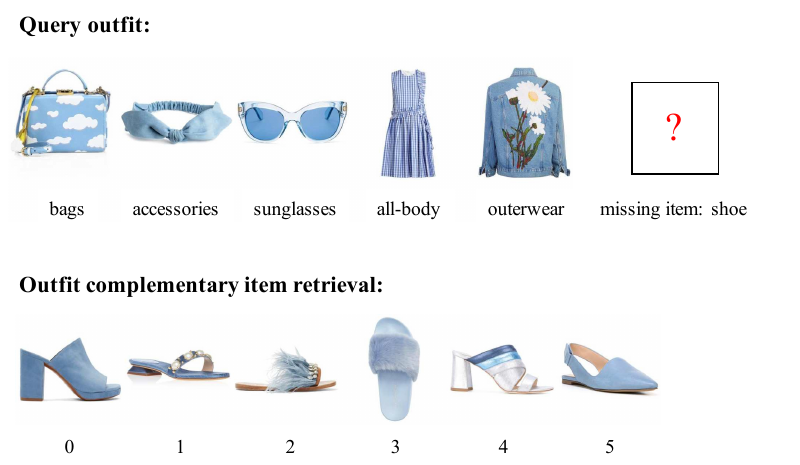
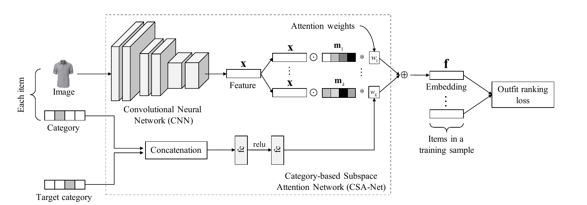
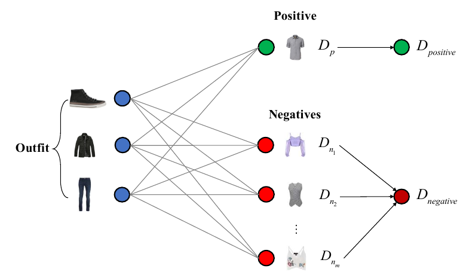
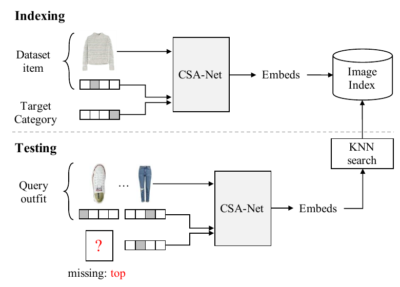

# CSA-Net — attention 의 조건을 "낮춰서" 검색을 되찾은 논문

## 📌 메타 정보

| 항목 | 내용 |
|---|---|
| **논문 제목** | Fashion Outfit Complementary Item Retrieval |
| **저자** | Yen-Liang Lin, Son Tran, Larry S. Davis |
| **소속** | **Amazon** |
| **공개일** | 2020-06 (CVPR 2020 본회의) |
| **학회** | **CVPR 2020** (pp. 3311–3317) |
| **분야** | Fashion Compatibility(패션 호환성), Complementary Item Retrieval(보완 아이템 검색), Metric Learning(거리 학습) |
| **논문 PDF** | https://openaccess.thecvf.com/content_CVPR_2020/papers/Lin_Fashion_Outfit_Complementary_Item_Retrieval_CVPR_2020_paper.pdf |
| **약칭** | **CSA-Net** (Category-based Subspace Attention Network) |
| **코드** | ❌ **미공개** (Amazon 사내 논문) |
| **데이터셋** | Polyvore Outfits [16] (Vasileva et al., ECCV 2018) — disjoint / non-disjoint 두 세트 |
| **베이스 모델** | ResNet18 (ImageNet 사전학습), embedding size 64 |
| **ANN 라이브러리** | hnswlib (https://github.com/nmslib/hnswlib) |
| **직접 계승한 방법론** | CSN [17] (Conditional Similarity Networks) → Type-aware [16] → SCE-Net [15] |

---

## 📖 주요 용어 사전 (Glossary)

*이 논문은 새 용어를 거의 만들지 않습니다. 패션 검색 분야의 기존 용어 몇 개만 알면 본문이 다 읽힙니다.*

### 문제 정의 관련

| 용어 | 풀이 |
|---|---|
| **outfit(코디, 착장)** | 상의·하의·신발·가방 등 여러 아이템이 하나로 묶인 세트. 이 논문의 기본 단위. |
| **complementary item(보완 아이템)** | 코디를 완성시켜 주는 **다른 카테고리**의 아이템. 상의+하의가 있을 때의 "신발" 같은 것. |
| **compatibility(호환성, 어울림)** | 아이템끼리 스타일이 맞는 정도. **similarity(닮음)와 정반대 개념**이라는 점이 핵심 — 보완 아이템은 일부러 시각적으로 안 닮은 걸 찾아야 한다. |
| **compatibility prediction(호환성 예측)** | "이 코디 조합이 어울리나?"를 점수로 **채점**하는 작업. 기존 연구 대부분이 여기에 머물렀다. |
| **complementary item retrieval(보완 아이템 검색)** | 채점이 아니라 카탈로그 수백만 개 중에서 **찾아오는** 작업. 이 논문이 새로 정의한 과제. |
| **FITB (Fill-In-The-Blank, 빈칸 채우기)** | 코디에서 아이템 하나를 지우고, **4지선다**(정답 1 + 오답 3) 중에서 맞는 걸 고르는 평가 방식. Han et al. [5]가 도입. |

### 방법론 관련

| 용어 | 풀이 |
|---|---|
| **subspace(부분공간)** | 특징 벡터(feature vector) 전체를 쓰지 않고, 일부 차원만 골라 쓰는 "작은 공간". 색으로 볼 때 / 소재로 볼 때 / 격식으로 볼 때처럼 **여러 관점(aspect)의 어울림**을 따로 재기 위해 쓴다. |
| **mask(마스크)** | 특징 벡터와 같은 길이의 학습 가능한 가중치 벡터. 원소별 곱(Hadamard product)으로 곱해서 subspace 를 만들어낸다. |
| **Hadamard product(원소별 곱, ⊙)** | 같은 길이 벡터 두 개를 자리마다 곱하는 연산. `[1,2,3] ⊙ [0,1,1] = [0,2,3]` — 즉 마스크가 0인 자리는 꺼진다. |
| **conditional similarity(조건부 유사도)** | "무엇을 기준으로 닮았다고 볼지"를 **조건에 따라 바꾸는** 거리. CSN [17]이 원조. |
| **attention weight(주의 가중치)** | 여러 subspace 중 어느 것을 얼마나 쓸지 정하는 소수 5개(합이 1). 이 논문에서는 **오직 카테고리 쌍에만** 의존한다. |
| **triplet loss(삼중항 손실)** | anchor(기준)·positive(정답)·negative(오답) 세 장을 놓고 "정답은 가깝게, 오답은 margin 이상 멀게" 학습시키는 고전적 손실 함수. |
| **outfit ranking loss(코디 랭킹 손실)** | 이 논문이 제안. anchor 한 장이 아니라 **코디 전체**와의 평균 거리를 쓴다. |
| **hard negative mining(어려운 오답 채굴)** | 오답 중에서도 모델이 헷갈려 하는(=거리가 가까운) 것만 골라 학습에 쓰는 기법. 학습 신호가 강해진다. |
| **semi-hard negative(준-어려운 오답)** | 정답보다는 멀지만 margin 안에는 들어와 있는 오답. 너무 어려운 오답만 쓰면 학습이 붕괴하므로 쓰는 절충안. |

### 인덱싱·평가 관련

| 용어 | 풀이 |
|---|---|
| **indexing(색인)** | DB 아이템들의 임베딩(embedding)을 **미리 계산해서** 검색 자료구조에 저장해 두는 것. 이게 가능해야 실서비스가 된다. |
| **KNN search (k-Nearest Neighbor, k-최근접 이웃 탐색)** | 질의 벡터와 가장 가까운 k개를 인덱스에서 찾아오는 것. |
| **ANN (Approximate Nearest Neighbor, 근사 최근접 이웃)** | 정확도를 조금 포기하고 KNN 을 훨씬 빠르게 하는 방식. hnswlib 가 대표. |
| **recall@top k** | 상위 k개 안에 정답이 들어 있었던 비율. 이 논문의 검색 지표. |
| **AUC (Area Under the ROC Curve)** | 호환성 예측의 표준 지표. 1에 가까울수록 좋음. |
| **disjoint / non-disjoint set** | Polyvore Outfits 의 두 분할. **disjoint** = 학습과 테스트가 아이템을 **하나도 공유하지 않음**(어려움, 작음). **non-disjoint** = 완전한 코디는 안 겹치지만 개별 아이템은 겹칠 수 있음(쉬움, 큼). |
| **distractor(방해꾼)** | 검색 평가에서 정답이 아닌 후보로 섞어 넣는 이미지들. |

---

## 🎯 논문 요약 (TL;DR)

**한 줄**: 기존 outfit 호환성 모델들은 "이 조합이 어울리나?"를 **채점**만 할 수 있고 **검색**은 못 한다. 이 논문은 attention 의 조건을 *이미지 쌍*에서 *카테고리 쌍*으로 낮춰서, 아이템 임베딩을 미리 계산해 KNN 인덱스에 넣을 수 있게 만든다. 성능은 덤으로 올랐다.

| 구분 | 내용 |
|---|---|
| **핵심 문제** | 호환성 예측 SOTA 모델(SCE-Net)은 subspace 를 고르는 데 **이미지 쌍**이 필요하다 → DB 아이템의 임베딩을 미리 만들 수 없다 → 질의마다 카탈로그 전수 비교 → 실서비스 불가 |
| **해결책 (1)** | **CSA-Net** — attention 을 이미지가 아니라 **카테고리 one-hot 두 개**에만 조건부여. 이미지 한 장 + 카테고리 두 개면 임베딩이 나오므로 인덱싱 가능 |
| **해결책 (2)** | **Outfit ranking loss** — anchor 한 장이 아니라 코디 전체와의 평균 거리로 랭킹 학습 |
| **검증** | Polyvore Outfits 에서 FITB 63.73 / AUC 0.91 (텍스트 미사용인데도 텍스트 쓰는 baseline 전부 격파), 검색 recall@10 은 SCE-Net 대비 상대 +62% |
| **가장 약한 곳** | Table 2·3 을 겹쳐 보면 **기여 (2)의 이득 전부가 hard negative mining 에서 나온다** (7장 참조) |

---

## ⭐ 핵심 기여 (Contributions)

논문이 스스로 밝힌 기여는 둘입니다.

1. **Category-based attention selection mechanism** — attention 을 **아이템 카테고리에만** 의존하게 만들어, 대규모 색인(indexing)과 탐색이 가능해짐
2. **Outfit ranking loss** — 아이템 쌍이 아니라 **코디 전체**에 작용하는 새 랭킹 손실. 호환성 예측과 검색 정확도를 함께 개선

그리고 논문이 명시하진 않았지만 실질적 기여가 하나 더 있습니다.

3. **검색 벤치마크 신설** — Polyvore Outfits 위에 recall@top k 로 재는 검색 평가 프로토콜을 처음 정의 (단, 공개 여부 언급 없음)

---

## 1️⃣ 문제 정의 — 왜 기존 방법은 검색에 못 쓰이나

*이 절을 두는 이유: 이 논문의 모든 설계 판단이 "인덱싱이 되느냐"라는 단 하나의 제약에서 나오기 때문에, 그 제약을 먼저 이해해야 나머지가 자연스럽게 읽힙니다.*

### 작업 정의

상의·하의·가방이 있는 미완성 코디에 어울리는 **신발 하나를 카탈로그에서 찾아라.**


*Figure 1. 위: 신발이 빠진 코디. 아래: 제안 방법이 찾아온 상위 결과들.*

일반 이미지 검색과 결정적으로 다른 점이 있습니다. 찾으려는 아이템은 질의 아이템들과 **일부러 다른 카테고리**입니다. 즉 **시각적으로 안 닮은 걸 찾아야** 합니다. 기준이 similarity(닮음)가 아니라 **compatibility(어울림)** 입니다.

### 기존 방법이 검색에 못 쓰이는 이유

| 기존 방법 | 검색 불가 사유 |
|---|---|
| **SCE-Net [15]** | subspace 선택에 **이미지 쌍**이 필요 → DB 아이템 임베딩을 미리 못 만든다. 질의마다 N개 전수 비교 |
| **GCN [2]** (Cucurull et al.) | 분류(classification) 모델 + 테스트 시점 그래프 연결을 활용 → **신상품은 연결선이 없어** 임베딩 자체가 정의 안 됨 |
| **Type-aware [16]** | 카테고리 쌍마다 독립 subspace 66개 → 인덱싱은 가능하지만 파라미터가 흩어져 학습 비효율 |

> ⚠️ 이 표는 나중에 7장의 급소 (3)과 이어집니다 — 실제로 "인덱싱 불가"가 엄밀히 성립하는 건 SCE-Net 과 GCN 뿐입니다.

---

## 2️⃣ 방법 (1) — CSA-Net

*이 절을 두는 이유: 인덱싱을 가능하게 만든 구조적 장치가 여기이고, 논문이 "attention"이라 부르는 것의 실체를 정확히 파악해야 성능 향상의 원인을 오해하지 않습니다.*

### 2.1 구조


*Figure 2. 소스 이미지 + 소스 카테고리 + 타깃 카테고리 → CNN 특징에 마스크 k개를 곱해 subspace 임베딩을 만들고, 카테고리 두 개로 예측한 attention 가중치로 섞어 최종 임베딩 f 를 만든다.*

입력이 셋입니다: **소스 이미지 + 소스 카테고리 + 타깃 카테고리.**

네트워크는 다음 함수를 학습합니다.

```
f = ψ(I_s, c_s, c_t)
```
*(즉 이미지 한 장과 카테고리 one-hot 벡터 두 개를 넣으면 임베딩 한 개가 나온다)*

단계별로:

1. 이미지를 CNN(ResNet18)에 통과 → 특징 벡터 **x**
2. 학습 가능한 마스크(mask) 5개 **m₁ ~ m₅** 를 x 에 원소별 곱 → subspace 임베딩 5개
3. 두 카테고리 one-hot 을 이어붙여(concatenation) 작은 MLP(fc → relu → fc → softmax)에 넣어 가중치 **w₁ ~ w₅** 산출
4. 최종 임베딩 = 각 subspace 임베딩에 w 를 곱해 더한 값

$$\mathbf{f} = \sum_{i=1}^{k} (\mathbf{x} \odot \mathbf{m}_i) * w_i \qquad (1)$$

*(k = subspace 개수 = 5, ⊙ 는 원소별 곱, wᵢ 는 스칼라)*

### 2.2 ⭐ 여기서 반드시 짚어야 할 점 — 이건 사실 attention 이 아니다

*이 소절을 두는 이유: 논문의 포장(attention)과 실제 수학이 다르고, 그 차이를 알아야 "왜 성능이 올랐는가"에 대한 답이 바뀌기 때문입니다.*

wᵢ 는 **스칼라**이므로 식 (1)을 정리하면 이렇게 됩니다.

$$\mathbf{f} = \mathbf{x} \odot \left( w_1 \mathbf{m}_1 + \cdots + w_5 \mathbf{m}_5 \right)$$

즉 subspace 5개를 섞는 게 아니라 **마스크 5개를 먼저 섞어서 유효 마스크(effective mask) 한 장을 만드는 것**과 완전히 동일합니다.

그리고 w 는 오직 카테고리 쌍에만 의존합니다. 카테고리 11개 기준 조합은 최대 121개(순서 무관이면 66개)뿐입니다.

> **결론: 이 "attention"은 입력 이미지에 전혀 반응하지 않는, 66칸짜리 학습된 룩업 테이블(lookup table)입니다.**

그러면 Type-aware [16]의 "66개 독립 마스크"와 뭐가 다른가? 딱 하나입니다.

| | 마스크 개수 | 제약 |
|---|---|---|
| Type-aware [16] | 66개 | 서로 **독립** (자유도 66 × 특징차원) |
| **CSA-Net** | 66개 (유효 마스크) | **5개 기저(basis) 마스크의 convex 조합으로 제한** (자유도 5 × 특징차원 + 66 × 5) |

표현력(expressive power)은 오히려 **줄었는데** 성능은 올랐습니다. 그러므로 이득의 정체는 새로 생긴 능력이 아니라 **파라미터 공유에 의한 regularization(정규화) 효과**입니다. 논문이 "disjoint set 성능이 전부 낮은 건 학습 데이터가 적어서"라고 스스로 설명한 것과 정확히 맞아떨어집니다.

논문은 이걸 "attention mechanism" 이라 부르지만, 정직한 이름은 **마스크 테이블의 low-rank(저랭크) 파라미터화**입니다. 아이디어의 가치가 떨어지진 않지만 포장이 실제보다 화려합니다.

---

## 3️⃣ 방법 (2) — Outfit Ranking Loss

*이 절을 두는 이유: 기존 triplet loss 가 코디에서 아이템 한 장만 anchor 로 뽑아 쓰는 것이 정보 낭비라는 문제의식에서 출발하기 때문입니다.*


*Figure 3. 코디 안 모든 아이템(왼쪽)에서 positive(위)와 negative 여러 개(아래)로 거리를 각각 재고, 그것을 하나의 Dpositive / Dnegative 로 합친다.*

### 3.1 기존 triplet loss 와의 차이

기존 triplet loss 는 코디에서 **아무 아이템 하나**를 anchor 로 뽑아 씁니다. 이 논문은 코디 **전체**를 씁니다.

### 3.2 수식

학습 샘플 하나는 Υ = {O, p, N} — 코디 O = {I₁ᵒ, …, Iₙᵒ}, 정답 p, 오답 집합 N = {I₁ⁿ, …, I_mⁿ} 입니다.

**코디 아이템들의 임베딩** (타깃 카테고리 슬롯에 정답 카테고리를 넣음):

$$\mathbf{f}_i^o = \psi(\mathbf{I}_i^o,\; c(\mathbf{I}_i^o),\; c(\mathbf{I}^p)); \quad i = 1 \to n \qquad (2)$$

**정답 이미지의 임베딩** (소스 카테고리 슬롯에 코디 아이템 카테고리를 넣음):

$$\mathbf{f}_i^p = \psi(\mathbf{I}^p,\; c(\mathbf{I}_i^o),\; c(\mathbf{I}^p)); \quad i = 1 \to n \qquad (3)$$

> 정답 이미지 한 장이 임베딩을 **n개** 갖습니다. 코디 아이템마다 소스 카테고리가 달라 attention 이 달라지기 때문입니다. 오답도 마찬가지 (식 4).

**코디와 아이템 s 의 거리** = 코디 안 모든 아이템과의 쌍거리 평균:

$$D_{outfit}(O, s) = \frac{1}{n}\sum_{i=1}^{n} d(\mathbf{f}_i^o, \mathbf{f}_i^s) \qquad (5)$$

**오답 m개의 거리를 하나로 집계** (φ = min 또는 average):

$$D_N = \varphi(D_{n_1}, \ldots, D_{n_m}) \qquad (6)$$

**최종 손실** (margin m = 0.3):

$$l(O, p, N) = \max(0,\; D_p - D_N + m) \qquad (7)$$

### 3.3 대칭성 — 카테고리 순서를 뒤집어도 같은 이유

식 (2)와 (3)을 비교하면, 질의 쪽과 후보 쪽이 **완전히 같은 카테고리 쌍** (c(Iᵢᵒ), c(Iᵖ)) 을 씁니다. 그러므로 둘은 같은 유효 마스크를 쓰고, 거리는 대칭입니다.

논문이 4.4절에서 "카테고리 순서를 뒤집어(order flipping) 학습해도 성능 변화가 없더라"고 보고한 것은 이 대칭성의 자연스러운 귀결입니다. 그리고 이는 곧 실제 카테고리 조합이 121개가 아니라 **66개**뿐임을 확인해 줍니다.

---

## 4️⃣ 인덱싱·검색 파이프라인

*이 절을 두는 이유: 이 논문의 존재 이유가 "실제로 인덱스에 넣을 수 있다"이므로, 그 절차와 비용을 구체적으로 봐야 주장의 진위를 판정할 수 있습니다.*


*Figure 4. 위(Indexing): DB 아이템을 타깃 카테고리마다 임베딩해 인덱스에 넣어둔다. 아래(Testing): 질의 코디의 각 아이템으로 KNN 검색 후 점수를 융합한다.*

| 단계 | 하는 일 | 비용 |
|---|---|---|
| **색인 (오프라인)** | DB 아이템 하나를 타깃 카테고리 **전부**와 짝지어 임베딩을 여러 벌 생성 | 저장 비용이 카테고리 수에 비례 → **11배** (논문도 "embedding size is linear in the number of high-level categories"라고 솔직히 인정) |
| **검색 (온라인)** | 질의 코디의 **아이템마다** KNN 검색 → 각 랭킹 점수를 average fusion 으로 융합 | 코디 크기 n 에 비례하는 n번의 ANN 질의 |

ANN 라이브러리는 hnswlib 를 사용했다고만 언급되어 있습니다.

---

## 5️⃣ 구현 세부 (Implementation Details)

*이 절을 두는 이유: 재현 가능성을 판정하려면 무엇이 공개되고 무엇이 빠졌는지 한눈에 봐야 하기 때문입니다.*

| 항목 | 값 |
|---|---|
| backbone CNN | ResNet18 (ImageNet 사전학습) |
| embedding size | 64 (baseline 과 공정 비교 위해 통일) |
| subspace 개수 k | **5** (SCE-Net [15]과 동일, ablation 은 그 논문 것을 인용) |
| optimizer | ADAM |
| mini-batch | 96 |
| margin | 0.3 |
| learning rate | 5e-5, **선형 감소**(linear decay to zero), warmup ratio = 0 (초기 lr 이 이미 작아서) |
| negative 선택 | 정답과 **같은 카테고리**에서 랜덤 샘플 후 **semi-hard** 선택 |
| 최적화 트릭 | online mining — 이미지당 subspace 임베딩을 **한 번만** 계산해 여러 쌍거리에 재사용 |
| 텍스트 특징 | ❌ **사용 안 함** (baseline 들은 사용) |
| **미공개 항목** | 오답 집합 크기 m, 마스크 초기화 방식, 선택된 fine-grained 카테고리 목록, 코드 전체 |

---

## 6️⃣ 실험 요약

*이 절을 두는 이유: 두 기여가 각각 얼마나 벌었는지를 숫자로 분리해야 7장의 급소 분석이 가능해집니다.*

### 6.1 호환성 예측 / FITB

*모든 방법이 ResNet18 + embedding 64 로 통일된 공정 비교입니다.*

| 방법 | 특징 | FITB (D / non-D) | AUC (D / non-D) |
|---|---|---|---|
| Siamese-Net [16] | 이미지만 | 51.80 / 52.90 | 0.81 / 0.81 |
| Type-aware [16] | 이미지 + 텍스트 | 55.65 / 57.83 | 0.84 / 0.87 |
| SCE-Net average [15] | 이미지 + 텍스트 | 53.67 / 59.07 | 0.82 / 0.88 |
| **CSA-Net + outfit ranking loss (제안)** | **이미지만** | **59.26 / 63.73** | **0.87 / 0.91** |

*(D = disjoint set, non-D = non-disjoint set)*

텍스트를 안 쓰고도 이겼고, **검색이 불가능한 원본 SCE-Net(61.6 / 0.91)까지 FITB 에서 넘어섰습니다.**

### 6.2 Ablation — 손실 함수

| 손실 함수 | FITB (D / non-D) | AUC (D / non-D) |
|---|---|---|
| Triplet loss | 56.17 / 60.91 | 0.85 / 0.90 |
| **Outfit ranking loss** | **59.26 / 63.73** | **0.87 / 0.91** |

### 6.3 Ablation — 집계 함수 φ

| 집계 함수 | FITB (D / non-D) | AUC (D / non-D) |
|---|---|---|
| Average | 56.19 / 60.0 | 0.84 / 0.89 |
| **Min** | **59.26 / 63.73** | **0.87 / 0.91** |

논문의 설명: min 이 더 좋은 이유는 **"더 어려운 오답(hard negative)을 랭킹 손실 학습에 넣기 때문"**. → 이 문장이 7장 (1)의 출발점입니다.

### 6.4 검색 (recall@top k)

*카테고리당 3000장, non-disjoint 는 27개 / disjoint 는 16개 fine-grained 카테고리의 평균.*

| 방법 | D top10 / 30 / 50 | non-D top10 / 30 / 50 |
|---|---|---|
| Type-aware [16] | 3.66 / 8.26 / 11.98 | 3.50 / 8.56 / 12.66 |
| SCE-Net average [15] | 4.41 / 9.85 / 13.87 | 5.10 / 11.20 / 15.93 |
| **CSA-Net (제안)** | **5.93 / 12.31 / 17.85** | **8.27 / 15.67 / 20.91** |

절대 수치가 낮아 보이지만 무작위 기준선 대비로는 큰 값입니다 (→ Q2 참조).

---

## 7️⃣ 급소 — 이 논문의 가장 약한 곳

*이 절을 두는 이유: 논문이 내세운 두 기여 중 하나는 실험 표를 겹쳐 보면 설명이 뒤집히기 때문에, 인용하거나 후속 연구의 baseline 으로 쓸 때 반드시 알고 있어야 합니다.*

### (1) ⭐ Ablation 두 개를 겹쳐 보면 두 번째 기여가 사라진다

논문의 Table 2(6.2절)와 Table 3(6.3절)을 **같이** 놓아보세요. non-disjoint FITB 기준입니다.

| 설정 | FITB |
|---|---|
| CSA-Net + **triplet loss** | **60.91** |
| CSA-Net + outfit ranking loss, **average** 집계 | **60.0** ⬅ triplet보다 **낮다** |
| CSA-Net + outfit ranking loss, **min** 집계 | **63.73** |

즉 "코디 전체를 본다"는 아이디어를 정직하게(average) 구현하면 **평범한 triplet loss 보다 오히려 낮습니다.** +2.8%p 이득 전부가 min 집계에서 나오는데, min 은 논문 자신도 인정하듯 그냥 **hardest negative mining** 입니다. 게다가 semi-hard negative 선택은 이미 별도로 쓰고 있습니다.

> **정리: 기여 #2("outfit ranking loss")의 실질은 "코디 전체를 고려한 랭킹"이 아니라 "negative 를 더 어렵게 뽑는 법"입니다.** 논문의 서사와 데이터가 어긋나는 지점이고, 이 조합 분석은 논문 본문에 없습니다.

### (2) 아키텍처 기여를 뜯어보면

non-disjoint FITB 기준 기여 분해:

| 기여 | 계산 | 값 |
|---|---|---|
| 아키텍처 (CSA-Net) | 60.91 − 59.07 (SCE-Net average) | ≈ **+1.8%p** |
| 손실 (outfit ranking) | 63.73 − 60.91 | ≈ **+2.8%p** |

그런데 비교 대상 SCE-Net average 는 **텍스트를 쓰는 조건**이라 이 1.8%p 도 완전 통제된 수치가 아닙니다. **같은 outfit ranking loss 로 SCE-Net average 를 학습시킨 대조군**이 없어서, 아키텍처 자체의 순수 기여는 끝까지 미확정입니다.

### (3) "대규모 검색용"이라면서 효율 수치가 0건

논문의 최대 셀링 포인트가 scalability(확장성)인데, **인덱스 크기·질의 지연시간(latency)·QPS·메모리 어느 것도 보고하지 않습니다.** 검색 실험도 카테고리당 3000장 — 대규모라 부르기 어렵습니다. hnswlib 를 썼다는 언급 한 줄이 전부입니다. 게다가 저장 비용은 카테고리 수만큼(11배) 늘어나므로, "확장성"은 절대적 성질이 아니라 SCE-Net 대비 **상대적** 우위입니다.

또한 Type-aware 는 66개 subspace 투영을 미리 계산하면 인덱싱이 되고, 실제로 논문도 baseline 실험에서 그렇게 돌렸습니다(4.3절). 따라서 **"기존 방법은 인덱싱 불가"라는 주장이 엄밀히 성립하는 대상은 SCE-Net 과 GCN 뿐입니다.**

### (4) 검색 벤치마크 설계의 인위성

| 문제 | 내용 |
|---|---|
| 정답이 1장뿐 | 어울리는 다른 아이템은 전부 오답 처리 → 지표가 성능을 **구조적으로 과소평가**. 논문도 인정하지만 인간 평가 같은 보완이 전혀 없음 |
| 후보를 미리 좁힘 | 후보를 **정답과 같은 fine-grained 카테고리**로 제한 → 실제 서비스보다 훨씬 쉬운 세팅 |
| 학습 이미지를 distractor 로 사용 | non-disjoint 에서는 모델이 **본 적 있는** 이미지가 방해꾼으로 들어감 → disjoint(5.93) 대 non-disjoint(8.27) 격차에 오염 요인 |
| 두 열이 비교 불가 | 평가 카테고리 수가 다름 (non-D 27개 / D 16개) |

### (5) 재현성

Amazon 논문이라 코드 미공개. 오답 집합 크기 m, 마스크 초기화, 선택된 fine-grained 카테고리 목록이 전부 빠져 있고, 새로 만들었다는 검색 벤치마크의 공개 언급도 없습니다. **후속 연구가 이 검색 수치를 그대로 재현하기는 어렵습니다.**

### (6) AUC 는 이미 포화

0.91 은 원본 SCE-Net 과 **동일**합니다. 실제로 앞선 건 FITB 와 검색뿐입니다.

---

## 8️⃣ 그래도 좋은 점

*이 절을 두는 이유: 급소가 많다고 해서 논문의 설계 판단까지 틀린 건 아니며, 실제로 계승할 가치가 있는 통찰이 분명히 있기 때문입니다.*

- **문제 설정의 전환이 정확합니다.** "분류 점수로 랭킹 매기면 되지 않나"를 **"인덱싱 가능해야 실서비스다"**로 다시 정의한 것이 이 논문의 진짜 기여입니다
- **덜어냄으로써 얻었습니다.** attention 의 조건을 이미지 쌍에서 카테고리 쌍으로 **약화시킨 것 자체가** 곧 인덱싱 가능성입니다. 성능까지 오른 건 low-rank 제약의 정규화 효과라는 보너스
- 텍스트 없이, 텍스트 쓰는 baseline 을 이긴 건 공정성 측면에서 유리한 결과
- 실패 사례(Figure 6)를 "색·질감·스타일이 너무 비슷해서" / "정답이 아닐 뿐 실제로는 어울리는 아이템이 여럿이라서"로 분류해 제시한 건 정직합니다

---

## 9️⃣ 계보 안에서의 위치

*이 절을 두는 이유: 이 논문의 기여는 독립적 발명이 아니라 앞선 세 논문의 제약을 하나씩 교환한 결과라서, 계보를 보면 무엇이 새로운지가 즉시 드러납니다.*

```
CSN [17]              조건부 유사도 마스크 (conditional similarity mask) 개념 도입
   ↓
Type-aware [16]       카테고리 쌍마다 독립 마스크 66개 — 인덱싱 가능, 학습 비효율
   ↓
SCE-Net [15]          마스크 공유 + 이미지 쌍 조건 — 성능 ↑, 검색 ↓ (인덱싱 불가)
   ↓
CSA-Net (본 논문)     마스크 공유 + 카테고리 조건 — 성능 ↑, 검색 복원
   ↓
(이후) Transformer 계열   코디 전체를 시퀀스로 인코딩 + "타깃 아이템 토큰"으로 검색 임베딩 추출
```

| 모델 | 마스크 공유? | 조건부여 대상 | 인덱싱 |
|---|---|---|---|
| Type-aware [16] | ❌ (66개 독립) | 카테고리 쌍 | ✅ |
| SCE-Net [15] | ✅ | **이미지 쌍** | ❌ |
| **CSA-Net** | ✅ | **카테고리 쌍** | ✅ |

이후 흐름은 Transformer 로 넘어가서, 코디 전체를 시퀀스로 인코딩하고 "타깃 아이템 토큰"으로 검색 임베딩을 뽑는 방향(OutfitTransformer 계열)이 CSA-Net 을 표준 baseline 으로 인용하며 FITB 를 60% 후반대까지 올립니다.

---

## 💬 Q&A

### Q1. 인덱스 저장 비용이 정확히 몇 배로 늘어나나?

*카테고리 쌍마다 유효 마스크가 다르므로, 아이템 하나가 임베딩 하나로 끝나지 않습니다.*

Polyvore Outfits 의 상위 카테고리(semantic category)는 **11개**입니다. DB 아이템 하나를 색인할 때, 그 아이템이 나중에 어떤 카테고리의 질의로부터 검색될지 모르므로 **가능한 소스 카테고리를 전부 열거해** 임베딩을 만들어 둬야 합니다.

| 항목 | 수 |
|---|---|
| 아이템 하나당 임베딩 개수 | 최대 11개 (자기 카테고리 제외하면 10개) |
| 임베딩 차원 | 64 |
| 아이템당 저장량 | 64 × 11 × 4바이트 ≈ **2.8KB** (float32 기준) |

논문 표현 그대로 "embedding size is linear in the number of high-level categories"입니다. 카테고리가 세분화될수록 이 비용이 커지므로, **fine-grained 153개** 수준으로 조건을 세밀하게 바꾸려 하면 곧바로 벽에 부딪힙니다. 이 논문이 굳이 상위 11개 카테고리만 조건으로 쓴 이유가 여기 있다고 보는 게 자연스럽습니다.

### Q2. recall@10 이 8.27% 면 좋은 건가 나쁜 건가?

*절대 수치가 낮아 보여 판단이 어려우므로 기준선과 비교합니다.*

| 기준 | 계산 | 값 |
|---|---|---|
| 무작위 추측 | 10 / 3000 | **0.33%** |
| CSA-Net (non-D top10) | — | **8.27%** |
| 무작위 대비 | 8.27 / 0.33 | **약 25배** |
| SCE-Net 대비 상대 개선 | (8.27 − 5.10) / 5.10 | **+62%** |

즉 절대 수치는 낮지만 무의미한 수준이 아닙니다. 다만 이 지표가 낮게 나오는 큰 이유는 **정답이 1장뿐**이기 때문이며(7장 (4) 참조), 실제 사용자 만족도와는 다른 이야기입니다. 논문 스스로 "카탈로그에 어울리는 아이템이 여럿 있을 수 있으므로 이 지표가 시스템의 실용 성능을 반영하지 못할 수 있다"고 명시했습니다.

### Q3. 왜 subspace 를 하필 5개만 쓰나?

*표현력을 늘리려면 많을수록 좋을 것 같은데 5개인 이유가 궁금해집니다.*

논문은 **자체 ablation 을 하지 않았고**, SCE-Net [15]이 같은 Polyvore Outfits 에서 수행한 subspace 개수 실험을 인용하며 그대로 5를 채택했습니다.

다만 2.2절의 관점에서 보면 5라는 숫자의 의미가 분명해집니다. **66개 유효 마스크를 5차원 기저로 표현**한다는 뜻이므로, 5는 "표현력 예산"이 아니라 **압축률 파라미터**입니다. 5를 66까지 키우면 Type-aware [16]와 동일해지고 정규화 효과가 사라집니다. 즉 **작게 유지하는 것이 이 방법의 핵심**입니다. 논문이 이 관점을 명시하지 않은 것은 아쉬운 부분입니다.

### Q4. 실서비스에 그대로 쓸 수 있나?

*이 논문의 목적이 실서비스이므로 직접 답해 둘 가치가 있습니다.*

| 조건 | 판정 |
|---|---|
| 인덱싱 가능성 | ✅ 설계 목적 그대로 달성 |
| 신상품(cold-start) 대응 | ✅ 이미지 + 카테고리만 있으면 임베딩이 나옴 (GCN 대비 결정적 우위) |
| 카탈로그 규모 | ⚠️ 미검증 — 3000장 실험이 전부, 지연시간 측정 0건 |
| 저장 비용 | ⚠️ 카테고리 수 배수 (Q1) |
| 재현 | ❌ 코드·데이터 분할 미공개 → **직접 구현 필요** |
| 카테고리 체계 의존 | ⚠️ 조건이 **카테고리 one-hot** 이므로, 카테고리 체계를 바꾸면 attention 테이블을 재학습해야 함 |

구조 자체는 단순해서(ResNet18 + 마스크 5개 + 2층 MLP) 재구현 난이도는 낮습니다. 다만 논문의 검색 수치를 그대로 재현하려는 목표는 포기하는 편이 낫습니다.

---

## 🎯 한 줄 요약 (전체)

**설계 판단은 옳고 실험 서사는 과장되어 있습니다.**

| 항목 | 평가 |
|---|---|
| 기여 #1 (CSA-Net) | ✅ 실질적. 다만 "attention"이 아니라 **마스크 테이블의 low-rank 압축**이라고 부르는 게 정확 |
| 기여 #2 (outfit ranking loss) | ⚠️ Table 2·3 을 겹쳐 보면 **hard negative mining 으로 환원**됨. average 집계일 때 triplet 보다 낮다는 사실이 결정적 |
| "대규모 검색" 주장 | ❌ 효율 측정치가 하나도 없어 **미검증** |
| 읽을 가치 | ✅ 충분. **"모델이 무엇에 조건부여되는가"가 곧 "인덱싱이 가능한가"를 결정한다**는 교훈은 추천·검색 시스템 설계 전반에 그대로 적용됨 |

---

## 🔗 관련 메모리

- [[paper-colpali]] — 마찬가지로 late interaction / 인덱싱 비용 트레이드오프를 다룬 검색 논문
- [[paper-lpips]] — 딥 feature 거리를 지각 지표로 쓰는 계보 (거리 학습 관점)
