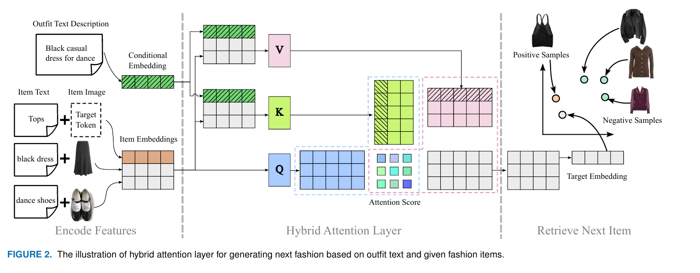
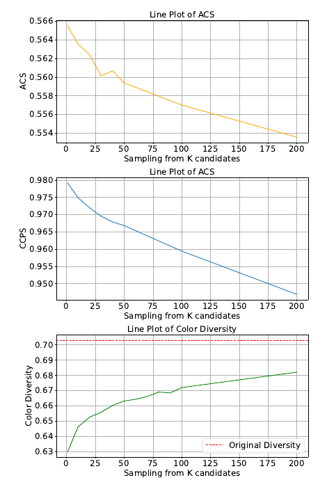
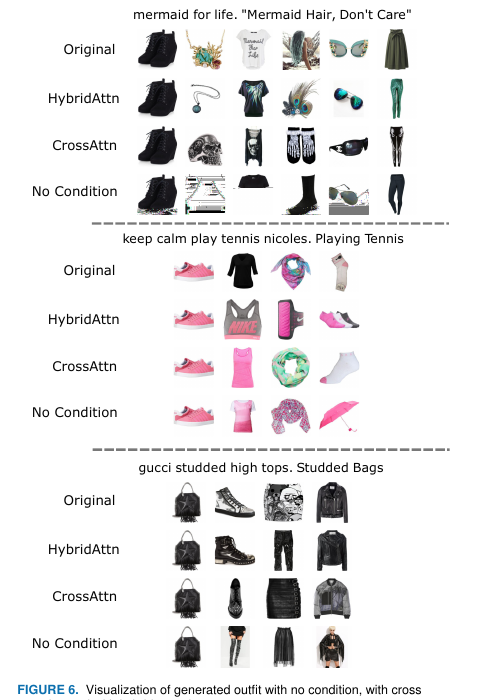
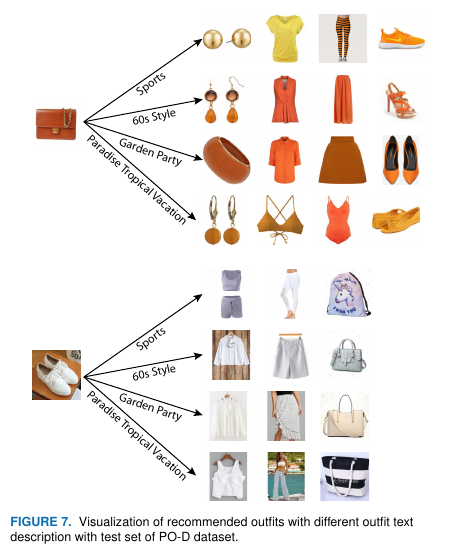

# TCOR — 어텐션의 Key/Value 에 텍스트와 아이템을 "같이" 넣어 말로 코디를 짓는 논문

## 📌 메타 정보

| 항목 | 내용 |
|---|---|
| **논문 제목** | Text-Conditioned Outfit Recommendation with Hybrid Attention Layer |
| **저자** | Xin Wang, Yueqi Zhong (교신저자) |
| **소속** | **Donghua University** 섬유대학 / 섬유과학기술 교육부 중점연구실, 상하이 |
| **공개일** | 2023-12-27 |
| **학회/저널** | **IEEE Access** vol. 12 (open access, CC BY-NC-ND 4.0) |
| **DOI** | 10.1109/ACCESS.2023.3346933 |
| **분야** | Fashion Recommendation(패션 추천), Complementary Item Retrieval(보완 아이템 검색), Conditional Generation(조건부 생성), Multimodal Retrieval(멀티모달 검색) |
| **논문 링크** | https://ieeexplore.ieee.org/document/10373836 · [PDF 직링크](https://ieeexplore.ieee.org/ielx7/6287639/6514899/10373836.pdf) |
| **코드** | ✅ https://github.com/WangXin93/text-conditioned-outfit-recommendation (MIT, 별 3개, 마지막 커밋 2025-05-13, 총 2,759줄) |
| **데이터셋** | Polyvore Outfits [Vasileva, ECCV 2018] — PO(non-disjoint) / PO-D(disjoint) |
| **사용한 외부 고정 모델** | **FashionCLIP** (`patrickjohncyh/fashion-clip`) · **SentenceBERT** (`distiluse-base-multilingual-cased-v2`) · U²-Net (색 다양성 측정용) |
| **학습 자원** | RTX 3090 24GB **1장** · PO-D 2시간 / PO 5시간 |
| **학습 파라미터(실측)** | **2,142,400 (약 2.14M)** — 본 문서 5.5절에서 직접 계산 |
| **연구비** | 상하이 자연과학기금 (21ZR1403000) |
| **약칭** | 논문에 공식 약칭 없음. 본 문서에서는 **TCOR** (Text-Conditioned Outfit Recommendation) 로 부름 |

---

## 📖 주요 용어 사전 (Glossary)

*이 논문은 새 용어를 거의 만들지 않습니다. "hybrid attention" 하나만 새 이름이고 나머지는 패션 추천 분야의 기존 어휘입니다.*

### 문제 정의 관련

| 용어 | 풀이 |
|---|---|
| **outfit(코디, 착장)** | 상의·하의·신발·가방 등 여러 아이템이 하나로 묶인 세트. 이 분야의 기본 단위. |
| **compatibility(호환성, 어울림)** | 아이템끼리 스타일이 맞는 정도. **similarity(닮음)와는 정반대 개념** — 보완 아이템은 일부러 시각적으로 안 닮은 걸 찾아야 한다. |
| **complementary item retrieval, CIR(보완 아이템 검색)** | 부분 코디가 주어졌을 때 그걸 완성시켜 줄 **다른 카테고리** 아이템을 카탈로그에서 찾아오는 작업. |
| **text condition(텍스트 조건)** | "Paradise Tropical Vacation", "60s Style" 처럼 코디 전체의 분위기를 지정하는 자유 문장. **이 논문의 주인공.** |
| **condition compliance(조건 준수)** | 만들어진 코디가 조건 텍스트의 분위기를 실제로 따르는 정도. |
| **partial outfit(부분 코디)** | 아직 완성되지 않은, 아이템 몇 개만 있는 코디. 아이템 0개(텍스트만)인 경우도 포함. |
| **FITB (Fill-In-The-Blank, 빈칸 채우기)** | 코디에서 아이템 하나를 지우고 **4지선다**(정답 1 + 오답 3)에서 고르는 평가. |
| **CP (Compatibility Prediction, 호환성 예측)** | "이 조합이 어울리나?"를 0~1 점수로 채점. 지표는 AUC. |
| **PO / PO-D** | Polyvore Outfits 의 두 분할. **PO-D(disjoint)** = 학습과 테스트가 아이템을 **하나도 공유하지 않음**(어렵고 작음, 16,995 코디). **PO(non-disjoint)** = 개별 아이템은 겹칠 수 있음(쉽고 큼, 53,306 코디). |
| **distractor(방해꾼)** | 검색 평가에서 정답이 아닌 후보로 섞어 넣는 아이템들. 여기선 세부 분류당 3,000개. |

### 방법론 관련

| 용어 | 풀이 |
|---|---|
| **self-attention(자기 주의)** | Key/Value 를 자기 자신(= 아이템들)에서 가져오는 방식. 아이템끼리의 관계는 보지만 **조건 텍스트는 못 본다.** |
| **cross-attention(교차 주의)** | Key/Value 를 조건(= 텍스트)에서만 가져오는 방식. Stable Diffusion 등 조건부 생성의 표준. 조건은 보지만 **아이템끼리의 관계가 출력에서 사라진다.** |
| **hybrid attention(혼합 주의)** | **이 논문의 제안.** Key/Value 에 조건 텍스트 **와** 아이템 특징을 **이어붙여(concatenate)** 넣는다. 둘 다 본다. |
| **target token(타깃 토큰)** | 시퀀스 맨 앞에 붙는 학습 가능한 특수 벡터. ViT 의 CLS 토큰과 같은 역할로, 이 자리의 출력이 "다음에 넣을 아이템의 특징"이 된다. |
| **target embedding(타깃 임베딩)** | 타깃 토큰 자리에서 나온 128차원 벡터. 실제 아이템이 아니라 **검색용 질의 벡터(query vector)**. |
| **margin ranking loss(마진 랭킹 손실)** | "정답은 가깝게, 오답은 최소 margin 만큼 멀게" 만드는 손실. 여기선 margin = 0.3. |
| **hard negative(어려운 오답)** | 정답과 **세부 분류(fine-grained category)가 같은** 아이템. 예: 정답이 "앵클부츠"면 다른 앵클부츠. 모델이 헷갈려 학습 신호가 강해진다. |
| **easy negative(쉬운 오답)** | 정답과 **대분류(semantic category)만 같은** 아이템. 예: 정답이 앵클부츠면 아무 신발. |
| **frozen encoder(고정 인코더)** | 사전학습된 모델의 가중치를 학습하지 않고 그대로 쓰는 것. 여기선 FashionCLIP·SentenceBERT 둘 다 고정. |
| **iterative generation(반복 생성)** | 언어 모델이 단어를 하나씩 붙이듯 아이템을 하나씩 추가해 코디를 완성하는 방식. |
| **multinomial sampling(다항 추첨)** | 항상 1등만 뽑지 않고 유사도를 확률로 삼아 상위 K개 중에서 뽑는 것. 색 다양성 확보용. |
| **two-tower, asymmetric(비대칭 이중 탑)** | 질의 쪽과 후보 쪽의 계산 경로가 다른 구조. 후보 쪽이 가벼우면 **DB 전체를 미리 색인(indexing)** 해둘 수 있다. |

### 평가 지표 관련

| 용어 | 풀이 |
|---|---|
| **recall@k (R@k)** | 상위 k개 안에 정답이 들어 있던 비율. |
| **Avg R@k (Average Recall at Different Positions)** | **이 논문 제안.** 마지막 한 개가 아니라 **코디 생성 매 단계마다** recall 을 재고 평균낸 값. |
| **ACS (Average Cosine Similarity)** | **이 논문 제안.** 만들어진 코디와 원본 코디를 FashionCLIP 공간에서 아이템별로 비교해 평균낸 유사도. |
| **CCPS (Conditional Compatibility Prediction Score)** | **이 논문 제안.** 조건부 CP 모델이 매긴 점수를 그대로 생성 품질 지표로 쓰는 것. |
| **Query-Outfit Coherence** | 조건 텍스트끼리 비슷하면 만들어진 코디끼리도 비슷한가를 상관계수로 재는 것. OutfitCoherence [Li 2019] 제안. |

---

## 🎯 논문 요약 (TL;DR)

**한 줄**: 어텐션의 Key/Value 에 조건 텍스트와 아이템 특징을 **같이 이어붙이는** 한 줄짜리 변경(hybrid attention)으로, "60s Style" 같은 자유 문장을 조건으로 코디 한 벌 전체를 지어내는 모델.

| 구분 | 내용 |
|---|---|
| **핵심 문제** | 조건부 생성의 표준인 cross-attention 은 Key/Value 가 텍스트뿐이라 **출력이 텍스트 임베딩의 가중합**이 되어 아이템끼리의 어울림 정보가 사라진다. self-attention 은 반대로 텍스트를 못 본다. |
| **해결책 (1)** | **Hybrid attention layer** — Key/Value = [조건 텍스트 ‖ 아이템 특징들]. 양쪽 장점을 모두 취함 |
| **해결책 (2)** | **FashionCLIP 고정 사용** — CNN 을 처음부터 학습하지 않고 특징을 미리 뽑아둠. 학습 파라미터 2.14M, 3090 한 장에 2~5시간 |
| **해결책 (3)** | **반복 생성 + 새 평가 지표 3종** (Avg R@k / ACS / CCPS) — "코디 한 벌 전체"의 품질을 재려는 시도 |
| **검증** | PO-D FITB 65.78, CIR R@50 22.19 로 표 상단. 초록 주장은 CP AUC +3% / FITB +5% / CIR +19% |
| **가장 약한 곳** | **성능 향상의 대부분이 조건 텍스트에서 오는데, 그 조건 텍스트가 정답 코디의 메타데이터다.** 조건을 빼고 공정하게 비교하면 PO 데이터셋 CIR 에서 2020년 CSA-Net 에게도 진다 (→ 7장) |

---

## ⭐ 핵심 기여 (Contributions)

논문이 스스로 밝힌 기여는 셋입니다.

1. **Text-conditioned outfit recommendation 프레임워크** — hybrid attention 으로 조건 텍스트와 아이템 특징을 상호작용시킴
2. **FashionCLIP 특징이 CNN 을 처음부터 학습한 것과 비슷한 성능을 내면서 파라미터 효율적**임을 보임
3. **CP / FITB / CIR 세 과제 모두에서 SOTA** + 생성 코디를 정량 평가하는 지표 2종 제안 (ACS, CCPS)

논문이 명시하지 않았지만 실질적 기여가 하나 더 있습니다.

4. **아이템 0개에서 출발하는 생성** — 기존 CIR 은 질의 아이템이 있어야 했지만, 이 구조는 조건 텍스트만으로 첫 아이템부터 뽑을 수 있음 (Table 5 의 length=0 행)

---

## 1️⃣ 문제 정의 — 왜 텍스트를 조건으로 쓰나

*이 절을 두는 이유: 이 논문의 모든 설계가 "조건을 자유 문장으로 받겠다"는 단 하나의 결정에서 파생되기 때문에, 그 결정의 동기를 먼저 봐야 나머지가 읽힙니다.*

### 같은 상의라도 조건에 따라 다른 코디가 나와야 한다

꽃무늬 블라우스 한 장이 있을 때, "Paradise Tropical Vacation" 이면 비키니 하의와 묶여야 하고 "60s Style" 이면 레트로 구두와 반바지에 묶여야 합니다. **조건 텍스트가 없으면 가능한 코디의 수가 폭발**합니다.

### 기존 방법들이 못 하는 것

| 선행 연구 | 조건 | 한계 |
|---|---|---|
| **CIR 계열** (CSA-Net, OutfitTransformer) | 조건 없음, 부분 코디만 | 아이템이 1~2개뿐이면 정답 후보가 너무 넓다. 아이템 0개면 아예 불가능 |
| **Style-conditioned** [Banerjee, ECIR 2022] | 정해진 style category(스타일 범주) 몇 개 | 유연하지 않다. 새 스타일이 생기면 **재학습** 필요 |
| **Scene-aware** [Ye, WWW 2023] | 장면 이미지 | 이미지를 준비해야 해서 텍스트보다 번거롭다 |
| **OutfitCoherence** [Li, 2019] | 자유 텍스트 ✅ | **각 아이템 임베딩**을 텍스트에 가깝게 강제 → 코디 전체의 표현(outfit representation)이 없다 |

TCOR 은 네 번째를 이어받되, 아이템 하나하나를 텍스트에 붙이는 대신 **트랜스포머로 코디 전체를 하나의 표현으로 묶고 그 안에서 텍스트와 상호작용**시킵니다.

> 논문이 덧붙이는 부수적 논거: 자유 텍스트는 재학습 횟수를 줄이므로 **모델 학습의 환경 부담도 줄인다.** (IEEE Access 스타일의 사회적 기여 서술)

---

## 2️⃣ 표현 학습 — 전부 얼려놓고 미리 뽑아둔다

*이 절을 두는 이유: 이 논문이 3090 한 장에 2시간으로 학습을 끝낼 수 있는 이유가 전부 여기에 있습니다.*

### 세 갈래 인코더

| 대상 | 인코더 (전부 **frozen(고정)**) | 원본 차원 | 선형층 통과 후 |
|---|---|---|---|
| 아이템 이미지 | **FashionCLIP** | 512 | **64** |
| 아이템 텍스트 (제목 + 설명) | **SentenceBERT** `distiluse-base-multilingual-cased-v2` | 512 | **64** |
| 코디 조건 텍스트 | **FashionCLIP 텍스트 인코더** | 512 | **128** |
| 타깃 카테고리 텍스트 | SentenceBERT | 512 | **64** |

아이템 하나의 특징 = [이미지 64 ‖ 텍스트 64] = **128차원**. 트랜스포머의 d_model 이 128인 이유입니다.

### 왜 아이템 텍스트에는 FashionCLIP 을 안 썼나

논문의 설명이 세련됩니다 — **CLIP 계열은 같은 아이템의 이미지 특징과 텍스트 특징이 이미 서로 가깝게 정렬(aligned)되어 있어서**, 둘 다 FashionCLIP 으로 뽑으면 정보가 중복됩니다. 그래서 일부러 다른 계열(SentenceBERT)을 섞어 정보를 벌립니다.

다국어 버전을 고른 이유는 Polyvore 상품 설명에 영어가 아닌 언어가 섞여 있기 때문입니다.

### 미리 뽑아 pkl 로 저장

이미지·텍스트 특징은 **학습 전에 한 번 전량 추출해 pickle 파일로 저장**합니다. 학습 중에는 디스크에서 읽기만 하므로 CNN forward/backward 가 아예 없습니다. 이게 2~5시간 학습의 정체입니다.

---

## 3️⃣ Hybrid Attention Layer — 이 논문의 전부

*이 절을 두는 이유: 논문 제목에 들어간 유일한 신규 개념이고, ablation 에서 실제로 이득이 확인되는 유일한 구성요소이기 때문입니다.*


*Figure 2. 왼쪽 = 특징 인코딩, 가운데 = hybrid attention, 오른쪽 = target embedding 으로 다음 아이템 검색.*

### 3.0 Figure 2 를 정확히 읽는 법

*이 절을 두는 이유: 그림을 대충 보면 "이미지 한 장 넣으면 다음 아이템이 나온다"로 읽히는데, 실제 입력 구성은 그것과 다릅니다.*

왼쪽 "Encode Features" 블록의 행은 **3개** 입니다.

| Item Text 열 | Item Image 열 | Item Embeddings 행 |
|---|---|---|
| `Tops` | **[Target Token]** (점선 = 아직 없는 이미지) | 🟧 주황 (= 채워야 할 자리) |
| `black dress` | 검정 드레스 사진 | ⬜ 회색 |
| `dance shoes` | 댄스화 사진 | ⬜ 회색 |

즉 이 예시에서 **주어진 아이템은 2개(드레스 + 신발)** 이고, 채워야 할 자리가 "Tops" 입니다. **이미지 한 장을 넣는 구조가 아닙니다.**

여기서 중요한 디테일 하나 — **점선 박스 `Target Token` 이 "Item Image" 열에 놓여 있습니다.** 타깃 슬롯도 다른 아이템과 똑같이 [이미지 64 ‖ 텍스트 64] 구조인데, **이미지 절반은 아직 모르니까 학습 가능한 자리표시자(target token)로 채우고, 텍스트 절반은 카테고리 "Tops" 로 채운** 것입니다. 코드의 `concat([target_img_token(64), category_emb(64)])` 가 정확히 이 그림입니다.

일반형으로 쓰면:

```
입력 아이템 L개 (L = 0 ~ 15, 패딩으로 PO-D 는 16 / PO 는 19 로 고정)

Q   = [ (target_token ‖ "Tops") , 아이템1, 아이템2, ..., 아이템L ]        ← 1+L 행
K,V = [ 조건텍스트 "Black casual dress for dance" , 아이템1, ..., 아이템L ] ← 1+L 행
```

**Q 와 K/V 는 길이가 같고 맨 첫 행만 다릅니다.** Q 첫 행 = "내가 찾는 것", K/V 첫 행 = "조건". 그 뒤로는 양쪽 다 똑같은 아이템들입니다. 코드에서 padding mask 를 tgt 와 memory 에 **그대로 재사용**할 수 있는 것도 이 길이 일치 덕분입니다(`tgt_key_padding_mask=mask, memory_key_padding_mask=mask`).

#### ⚠️ Fig. 2 와 Fig. 7 이 서로 달라 보이는 이유 — **L 은 변수다**

논문 그림 두 장이 서로 다른 L 을 예시로 골랐기 때문에 처음 보면 모순처럼 읽힙니다. 모순이 아닙니다.

| | **Fig. 2** | **Fig. 7** |
|---|---|---|
| 그림의 목적 | 구조 설명 | 조건 효과 데모 |
| 주어진 아이템 | **2개** — `black dress`, `dance shoes` | **1개** — 갈색 체인백 |
| **L** | **2** | **1** |
| 타깃 | "Tops" 한 칸 채우기 (1스텝) | 4스텝 반복해 코디 완성 |

**모델은 L=0 부터 15 까지 전부 같은 경로로 처리합니다.** 어느 쪽도 "이 모델의 표준 입력 형태"가 아니고, 그냥 각 그림이 설명하려는 바에 맞는 L 을 고른 것입니다.

따라서 다음 두 진술은 **둘 다 참**입니다.

- "Fig. 2 는 이미지 한 장을 받는 그림이 아니다" — 맞음 (거기선 L=2)
- "이 모델은 이미지 한 장 + 조건 텍스트만으로 다음 아이템을 검색할 수 있다" — 맞음 (L=1, Fig. 7 이 그 예시)

### 3.1 세 가지 선택지

어텐션에서 **Query 는 "내가 뭘 찾고 있나", Key/Value 는 "어디서 정보를 가져오나"** 입니다. 여기서 Key/Value 를 무엇으로 채우느냐가 갈림길입니다.

| 설계 | Key / Value | 문제점 |
|---|---|---|
| **self-attention** | 아이템들만 | 조건 텍스트를 아예 못 봄 |
| **cross-attention** (Stable Diffusion 방식) | 조건 텍스트만 | 출력이 결국 **텍스트 임베딩의 가중합** — 아이템끼리의 관계가 출력에서 사라짐 |
| **hybrid attention (제안)** | **조건 텍스트 + 아이템들 이어붙임** | 둘 다 봄 |

### 3.2 수식 (논문 식 1)

```
Q = W_Q · [ (x_tgt ‖ τ'(T_tgt)) ‖ F ]
K = W_K · [ φ'(T_o) ‖ F ]
V = W_V · [ φ'(T_o) ‖ F ]
```

기호 풀이:

| 기호 | 뜻 | 차원 |
|---|---|---|
| `x_tgt` | 학습 가능한 target token(타깃 토큰) | 64 |
| `τ'(T_tgt)` | 타깃 아이템의 **카테고리 텍스트** (예: "Tops") 임베딩 | 64 |
| `F` | 부분 코디 아이템들의 특징 행렬 | L × 128 |
| `φ'(T_o)` | **코디 조건 텍스트** 임베딩 (예: "Black casual dress for dance") | 128 |
| `‖` | concatenation(이어붙이기) | — |

핵심은 **Q 의 맨 앞과 K/V 의 맨 앞이 서로 다른 것**이라는 점입니다. Q 맨 앞은 "내가 찾는 것(타깃 토큰 + 카테고리)", K/V 맨 앞은 "조건 텍스트". 그 뒤로는 양쪽 다 아이템 특징 F 가 붙습니다. 그래서 **타깃 토큰이 조건 텍스트도 보고 아이템도 본다.**

### 3.3 어텐션 맵이 실제로 보여주는 것 (논문 Fig. 3)

논문은 attention map(주의 지도)을 시각화해 세 가지를 관찰합니다.

1. **첫 행(= 타깃 토큰 자리)의 맨 왼쪽 값이 어느 층에서든 가장 크다** → 타깃 토큰은 주로 조건 텍스트의 영향을 받는다
2. **첫 열의 값이 다른 열보다 크다** → 모든 위치의 출력이 조건 텍스트의 영향을 크게 받는다
3. **그 외 영역에도 값이 남아 있다** → 아이템 정보도 여전히 쓰인다 (= 조건에만 매몰되지 않았다)

### 3.4 손실 함수 (논문 식 2) — 두 항의 합

```
L(t, p, N) = L_All + L_Hard

L_All  = (1/|N|) · Σ_j  [ d(t, f^p) − d(t, f^N_j) + m ]₊
L_Hard = [ d(t, f^p) − min_j d(t, f^N_j) + m ]₊          m = 0.3
```

- `t` = 모델이 뱉은 타깃 임베딩, `f^p` = 정답 아이템 임베딩, `f^N_j` = j번째 오답
- `[ · ]₊` = 음수면 0으로 자르기 (hinge)
- **L_All** = 오답 10개 **전체 평균**에 대한 마진 손실
- **L_Hard** = 그중 **가장 헷갈리는 하나**만 골라 거는 손실 (= hard negative mining)

> ⚠️ 논문 본문은 "cosine similarity(코사인 유사도)를 distance function(거리 함수)으로 쓴다"고 적었는데, 유사도라면 식 (2)의 부호가 반대여야 합니다. 코드는 올바르게 구현돼 있으므로 **논문 쪽 표기 오류**입니다. (→ 6.4절)

### 3.5 학습 커리큘럼

| 구간 | 오답 종류 |
|---|---|
| 1 ~ 39 에폭 | **easy negative** — 정답과 **대분류만** 같은 아이템 |
| 40 ~ 100 에폭 | **hard negative** — 정답과 **세부 분류까지** 같은 아이템 |

정답 1개당 오답 10개를 뽑습니다.

---

## 4️⃣ 코디 생성 절차 — GPT 처럼 한 벌씩

*이 절을 두는 이유: "아이템 하나 검색"에서 "코디 한 벌 생성"으로 넘어가는 다리이고, 이 논문이 CIR 선행 연구와 갈라지는 지점입니다.*

### 4.1 반복 생성

언어 모델이 단어를 하나씩 이어붙이듯 아이템을 하나씩 추가합니다.

```
L=0: []                        + "비 오는 날 출근" + 타깃="Tops"      → 상의 검색 → 채택
L=1: [상의]                    + 같은 조건        + 타깃="Bottoms"   → 바지 검색 → 채택
L=2: [상의, 바지]              + 같은 조건        + 타깃="Shoes"     → 신발 검색 → 채택
L=3: [상의, 바지, 신발]        + 같은 조건        + 타깃="Outerwear" → 아우터 검색
...
```

단계가 진행될수록 **L 이 커집니다.** 어느 단계에서 시작하든(사용자가 이미 아이템 몇 개를 갖고 있어도) 같은 구조로 이어붙일 수 있습니다.

매 단계마다 **이미 고른 아이템 전부**가 다시 입력으로 들어가서 뒤로 갈수록 제약이 강해집니다. 부분 코디가 비어 있으면 타깃 토큰과 조건 텍스트만 넣어 **첫 아이템부터** 뽑을 수 있습니다.

단, **어떤 카테고리를 어떤 순서로 채울지는 사용자가 정해야 합니다.** 모델은 "다음은 신발 차례"를 스스로 판단하지 못합니다.

### 4.2 다항 추첨 (multinomial sampling)

*왜 필요한가: 매 단계 1등만 뽑으면 빨간 가방 → 빨간 원피스 → 빨간 신발로 색이 수렴해 버리기 때문입니다.*

논문의 진단은 두 가지입니다. ① 데이터셋의 어울리는 코디 상당수가 실제로 비슷한 색이다. ② 매 단계 가장 호환되는 1등만 고르는 greedy 방식이 그 편향을 증폭시킨다.

처방은 타깃 임베딩과 후보의 유사도를 그대로 **확률로 삼아 상위 K개 중에서 추첨**하는 것입니다.


*Figure 9. K 를 1에서 200까지 키우면 ACS·CCPS 는 선형적으로 완만히 떨어지지만(0.566→0.554, 0.980→0.948) 여전히 높은 수준을 유지하고, 색 다양성은 0.63에서 0.68까지 올라 원본 코디 평균(점선 0.70)에 수렴한다.*

색 다양성 측정 방법: U²-Net 으로 배경을 지운 뒤 → LAB 색공간으로 변환 → 아이템 쌍마다 색 히스토그램의 Bhattacharyya distance(바타차리야 거리) → 코디 내 모든 쌍의 평균.

---

## 5️⃣ 실험 결과

### 5.1 호환성 예측 (CP, 지표 = AUC)

*왜 보나: 이 분야의 가장 오래된 표준 지표라 선행 연구 전부와 한 줄에 놓고 비교할 수 있습니다.*

| Method | Features | PO-D | PO |
|---|---|---|---|
| BiLSTM + VSE | Img + Text | 0.62 | 0.65 |
| GCN (k=0) | Img | 0.67 | 0.68 |
| SiameseNet | Img | 0.81 | 0.81 |
| Type-Aware | Img + Text | 0.84 | 0.86 |
| SCE-Net | Img + Text | – | 0.91 |
| CSA-Net | Img | 0.87 | 0.91 |
| OutfitTransformer | Img + Text | 0.88 | 0.93 |
| OutfitCoherence | Img + Text | 0.901 | 0.928 |
| Ours (CIR 학습, 조건 없음) | Img + Text | 0.899 | 0.933 |
| Ours (CIR 학습, 조건 있음) | Img + Text | 0.917 | **0.956** |
| Ours (CP 학습, 조건 없음) | Img + Text | 0.923 | **0.956** |
| **Ours (CP 학습, 조건 있음)** | Img + Text | **0.930** | 0.954 |

> ⚠️ **PO 열에서 조건 있는 모델(0.954)이 조건 없는 모델(0.956)보다 낮습니다.** 그런데 본문은 "조건이 있으면 성능이 더 향상된다"고 단정합니다. → 7장 (2)

### 5.2 FITB / CIR

*왜 보나: CIR 이 이 논문의 실제 목표 과제이고, CSA-Net 이 만든 벤치마크를 그대로 쓰므로 선행 연구와 직접 비교가 됩니다.*

| Method | PO-D FITB | R@10 | R@30 | R@50 | PO FITB | R@10 | R@30 | R@50 |
|---|---|---|---|---|---|---|---|---|
| Type-Aware | 55.65 | 3.66 | 8.26 | 11.98 | 57.83 | 3.50 | 8.56 | 12.66 |
| SCE-Net Average | 53.67 | 4.41 | 9.85 | 13.87 | 59.07 | 5.10 | 11.20 | 15.93 |
| CSA-Net | 59.26 | 5.93 | 12.31 | 17.85 | 63.73 | **8.27** | 15.67 | 20.91 |
| OutfitTransformer | 59.48 | **6.53** | 12.12 | 16.64 | **67.10** | **9.58** | **17.96** | 21.98 |
| OutfitCoherence | 62.80 | – | – | – | 66.10 | – | – | – |
| Ours (조건 없음) | 63.04 | 6.10 | 13.24 | 18.81 | 65.32 | 6.81 | 14.46 | 20.38 |
| **Ours (조건 있음)** | **65.78** | **7.35** | **16.22** | **22.19** | **70.33** | 10.12 | 19.49 | **26.17** |

**조건을 빼면 PO 데이터셋에서 CSA-Net(이미지만 사용)과 OutfitTransformer 에게 R@10 이 크게 밀립니다.** 논문도 이건 인정합니다 — "ResNet50 이 픽셀에서 더 좋은 fine-grained feature(세밀한 특징)를 뽑을 수 있고, PO 는 데이터가 많아 ResNet50 이 더 잘 학습되기 때문".

### 5.3 절제 실험 (Ablation, Table 3)

*왜 보나: 초록의 향상분 중 실제로 어느 구성요소가 얼마를 만들었는지 분해해야 논문의 기여를 판정할 수 있습니다.*

| 행 | Cond | Hard | CA | HA | Pre | PO-D FITB | R@10 | R@30 | R@50 | PO FITB | R@10 | R@30 | R@50 |
|---|---|---|---|---|---|---|---|---|---|---|---|---|---|
| 1 | | | | | | 61.93 | 5.68 | 12.49 | 17.67 | 65.32 | 6.81 | 14.46 | 20.38 |
| 2 | | ✓ | | | | 63.04 | 6.10 | 13.24 | 18.81 | 68.37 | 8.50 | 17.66 | 23.92 |
| 3 | ✓ | ✓ | ✓ | | | 63.96 | 6.41 | 14.31 | 19.99 | 68.59 | 9.35 | 18.54 | 24.77 |
| 4 | ✓ | ✓ | | ✓ | | 65.42 | 6.87 | 14.97 | 21.28 | 69.77 | 9.75 | 19.19 | 25.48 |
| 5 | ✓ | ✓ | | ✓ | ✓ | **65.78** | **7.35** | **16.22** | **22.19** | **70.33** | **10.21** | **19.49** | **26.17** |

*Cond = 텍스트 조건, Hard = hard negative, CA = cross attention, HA = hybrid attention, Pre = CP 사전학습*

PO-D FITB 기준으로 분해하면:

| 구성요소 | 기여 |
|---|---|
| hard negative | +1.11 |
| cross-attention 조건화 | +0.92 |
| **hybrid attention (CA→HA 교체)** | **+1.46** ← 파라미터 수가 같은 공정한 비교 |
| CP 사전학습 | +0.36 |

### 5.4 CLIP vs FashionCLIP (Table 4)

*왜 보나: "패션 도메인 특화 사전학습이 실제로 값어치를 하는가"를 통제된 조건에서 확인합니다.*

| Feature | PO-D FITB | R@10 | R@30 | R@50 | PO FITB | R@10 | R@30 | R@50 |
|---|---|---|---|---|---|---|---|---|
| CLIP | 60.87 | 5.76 | 13.26 | 18.38 | 65.48 | 7.91 | 16.19 | 21.90 |
| **FashionCLIP** | **65.42** | **6.87** | **14.97** | **21.28** | **69.77** | **9.75** | **19.19** | **25.48** |

PO-D FITB 기준 **+4.55점.** 이 논문에서 가장 큰 단일 이득이 사실 여기 있습니다 — 즉 **hybrid attention(+1.46) 보다 FashionCLIP 교체(+4.55)가 3배 크게 기여합니다.**

### 5.5 파라미터 수 (직접 계산)

*왜 세나: "parameter efficient(파라미터 효율적)"라는 기여 주장의 근거 숫자를 논문이 제시하지 않았기 때문입니다.*

PyTorch 로 동일 구조를 만들어 직접 세었습니다.

| 부품 | 파라미터 |
|---|---|
| 이미지 선형층 (512→64) | 32,832 |
| 텍스트 선형층 (512→64) | 32,832 |
| 코디 텍스트 선형층 (512→128) | 65,664 |
| `nn.TransformerDecoder` 3층 (d_model=128, nhead=16, ff=2048) | 1,977,984 |
| 출력 MLP (128→128→128) | 33,024 |
| target token | 64 |
| **합계 (학습 대상)** | **2,142,400 ≈ 2.14M** |

참고로 조건 없는 변형은 `nn.TransformerEncoder` 를 쓰므로 1,779,072 → **조건 있는 모델이 약 20% 더 큽니다.** (→ 7장 (4))

주의: 이건 **학습되는** 파라미터만입니다. 추론 시 FashionCLIP(≈150M)과 SentenceBERT 는 여전히 필요합니다. 다만 특징을 미리 뽑아두면 검색 서비스 런타임에서는 안 돌려도 됩니다.

### 5.6 생성 코디 평가 (논문 제안 지표)

*왜 필요한가: 기존 지표는 전부 "마지막 아이템 하나"만 재기 때문에, 코디 한 벌을 통째로 만드는 능력을 평가할 방법이 없었습니다.*

**Table 5 — 단계별 평균 recall (PO-D, 11,463 코디)**

| 주어진 아이템 수 | 조건 없음 R@10 | Cross-Attn R@10 | Hybrid R@10 | 표본 수 |
|---|---|---|---|---|
| 0개 (텍스트만) | 0.38 | 0.93 | **1.77** | 11,463 |
| 1개 | 4.24 | 4.62 | **5.43** | 9,684 |
| 2개 | 5.61 | 5.46 | **6.52** | 9,022 |
| 3개 | 6.51 | 6.28 | **7.14** | 6,787 |
| 4개 | 6.48 | 6.74 | **7.30** | 4,614 |
| 5개 | 6.77 | 6.31 | **7.15** | 2,614 |
| 6개 | 5.31 | 5.39 | **6.28** | 1,243 |
| 7개 이상 | 5.30 | 4.95 | **6.11** | 868 |
| **평균** | **5.08** | **5.09** | **5.96** | 5,787 |

**이 표가 이 논문에서 가장 단단한 증거입니다.** 읽는 법:

1. 아이템이 0개일 때 조건 없는 모델은 무력합니다(0.38). 정보가 아무것도 없으니 당연합니다.
2. 아이템이 많아지면 **cross-attention 이 조건 없는 모델보다 오히려 떨어집니다** (5개: 6.77 → 6.31). Key/Value 가 텍스트뿐이라 이미 확보한 아이템 정보를 못 쓰기 때문입니다.
3. 그래서 **평균으로 보면 cross-attention 을 붙인 효과가 사실상 0** (5.09 vs 5.08). hybrid 만 +0.88 을 만듭니다.

**Table 6 — ACS / CCPS** (Keep_n = 원본 코디에서 아이템 n개를 남기고 나머지를 다시 생성)

| Method | ACS Keep0 | Keep1 | Keep2 | CCPS Keep0 | Keep1 | Keep2 |
|---|---|---|---|---|---|---|
| No Condition | 0.442 | 0.552 | 0.569 | 0.965 | 0.964 | 0.942 |
| Cross Attn | 0.500 | 0.565 | 0.580 | 0.978 | 0.970 | 0.946 |
| **Hybrid Attn** | **0.502** | **0.566** | **0.582** | **0.988** | **0.979** | **0.962** |

남기는 아이템이 많을수록 ACS 가 올라갑니다(제약이 강해지므로 당연). 조건 없는 모델의 ACS 가 Keep0 에서 급락(0.442)하는 건 첫 아이템이 카테고리 제약만으로 뽑혀 원본과 완전히 달라지기 때문입니다.

**Query-Outfit Coherence**: PO-D 테스트셋에서 조건 텍스트 500개로 코디를 만들고, 124,750개 코디 쌍에 대해 "조건 텍스트끼리의 유사도"와 "코디 특징끼리의 유사도"의 상관계수를 쟀더니 **0.1522**. 양의 상관은 있지만 그리 강하진 않습니다.

### 5.7 정성 평가


*Figure 6. 같은 조건 텍스트에 대해 No Condition / CrossAttn / HybridAttn 이 만든 코디. 첫 사례 "mermaid for life" 에서 조건 없는 모델은 검은 신발과의 어울림만 맞추지만, 조건부 모델은 "mermaid" 키워드까지 반영한다.*

---

## 6️⃣ 공식 코드 분석

*이 절을 두는 이유: 논문 수치를 직접 재현하거나 자기 데이터에 이식하려는 사람에게는 "코드가 논문대로 돌아가는가"가 성능 수치보다 먼저이기 때문입니다.*

저장소 전체 2,759줄을 논문과 한 줄씩 대조했습니다. 구조 자체는 논문과 잘 맞습니다 — 3층·16헤드, margin 0.3, 오답 10개, 40에폭부터 hard negative, 10에폭마다 lr 절반이 전부 `config/base_config.py` 에 그대로 있습니다. 그런데 실행 가능성 쪽에서 문제가 여럿 나옵니다.

### 6.1 급소 ① Hard negative 샘플링이 실제로는 동작하지 않음

`dataset.py` 578~581행:

```python
if self.sample_hard_negative:
    hard_negatives = {'items': []}
    for _ in range(self.num_negative):
        hard_negatives['items'].append(self.sample_hard_negative_item(positive))
    hard_negative_imgs, hard_negative_txts = self.load_outfit(negatives)[:2]   # ← negatives!
```

`hard_negatives` 를 열심히 만들어 놓고 정작 로드하는 건 **쉬운 오답인 `negatives`** 입니다. 복사-붙여넣기 실수로, 공개된 CIR 학습 코드에서 **"세부 분류가 같은 어려운 오답"은 단 한 번도 모델에 들어가지 않습니다.**

실제로 추가되는 건 "쉬운 오답 중 가장 헷갈리는 하나"에 대한 L_Hard 항뿐입니다. 즉 Table 3 의 Hard 절제(+1.11점)를 이 코드로는 재현할 수 없습니다.

> CP 쪽(`train_cp.py` + `sample_hard_negative_outfit`)은 같은 실수가 없고 정상입니다.

### 6.2 급소 ② `train_cir.py` 가 그대로는 실행되지 않음

`train_cir.py` 102행:

```python
if init_from == 'scratch':
    if pretrained_cp_model is not None:      # ← 어디에도 정의되지 않은 변수
        model.from_cp_pretriained(pretrained_cp_model)
```

저장소 전체를 grep 하면 `base_config.py` 31행에 **주석 처리된 유사 이름**(`# cp_pretrained = ...`)만 있습니다. 기본 설정(`init_from='scratch'`)으로 돌리면 즉시 `NameError` 입니다.

### 6.3 급소 ③ 카테고리 특징 파일의 키가 어긋남

`scripts/extract_item_category_with_sentenceBERT.py`:

```python
encoded[content] = out          # content = "Tops" 같은 카테고리 이름
```

그런데 `dataset.py` 는:

```python
category = torch.tensor(self.category_feats[item_id])   # item_id 로 조회
```

스크립트대로 특징을 뽑으면 무조건 `KeyError` 입니다. README 의 구글 드라이브 파일은 공개되지 않은 다른 버전으로 만들어진 것으로 보입니다.

### 6.4 논문 서술과 구현의 개념적 차이 ⭐

`nn.TransformerDecoderLayer` 는 **self-attention → cross-attention → FFN** 순서입니다. 코드는 `memory = [조건 텍스트 ; 아이템들]` 을 넘기므로, **cross-attention 하위층이 논문 식 (1)의 hybrid attention 에 정확히 대응**합니다. 하지만 **그 앞에 논문이 언급하지 않는 self-attention 층이 하나 더 있습니다.**

이게 왜 문제냐면 — 논문은 cross-attention 의 약점을 *"아이템끼리의 상호작용이 없다, 출력이 조건 텍스트 임베딩의 가중합일 뿐"* 이라고 설명하고 Table 5 의 거동을 그걸로 해석합니다. 그런데 이 코드 구조에서 cross-attention 설정을 만들면(memory 를 텍스트만으로) **self-attention 층은 그대로 남아 아이템 상호작용을 수행합니다.**

즉 **현상(Table 5)은 실재하지만 논문이 제시한 원인 설명은 자기 구현에 들어맞지 않습니다.**

또 3.4절에서 언급한 대로 식 (2)의 부호가 본문 서술("코사인 유사도를 거리 함수로 쓴다")과 반대입니다. 코드(`MarginRankingLoss(D_p, D_n, target=1)` = `max(0, D_n − D_p + margin)`)는 유사도 기준으로 올바르게 구현돼 있으므로 논문 표기 오류입니다.

### 6.5 그 외 재현성 문제

| 문제 | 위치 | 영향 |
|---|---|---|
| `en_outfit_title.json` 생성 스크립트 부재 | `scripts/` | `translate_outfit_txt.py` 는 `url_name` 만 번역해 `en_outfit_urlName.json` 을 만드는데, `extract_outfit_txt_fashionClip.py` 는 두 파일 모두 요구 |
| `break` 가 `continue` 자리에 | `evaluate_cir.py` 216~218행 | "후보가 모자라면 학습 split 에서 채운다"가 dict 순서에 따라 임의로 중단됨 |
| CP·FITB 평가가 **전부 주석 처리** | `evaluate_cir.py` 106~192행 | 실행하면 CIR recall 만 나옴. FITB 는 `train_cir.py` 검증 루프에 있는데 그건 **valid split** (논문 수치는 test) |
| 파일명 불일치 | config vs README/스크립트 | config = `encoded_title_description_*.pkl`, 나머지 = `encoded_itemTitleDescription_*.pkl` |
| 윈도우 경로 하드코딩 | `base_config.py` 55행 | `datadir = 'E:\\Datasets\\UIUC-polyvore'` |
| `requirements.txt` 없음 | — | 버전 정보 전무 |
| 모듈 최상단에서 `ipdb` import | `outfit_transformer.py` 12행 | 디버거 미설치 시 모델 정의조차 로드 불가 |
| CLIP 토큰 77개 슬라이싱 | `extract_outfit_txt_fashionClip.py` | EOT 토큰이 잘려 나가 pooling 위치가 어긋날 수 있음 (CLIP 계열 공통 함정) |
| `pickle.load(open(save_path), 'rb')` | 같은 파일 20행 | 괄호 위치 오류 — 이어서 실행하면 `TypeError` |
| **논문 4장 F절 전체 코드 부재** | — | 코디 생성 절차, Avg R@k, ACS, CCPS, Query-Outfit Coherence, multinomial sampling, U²-Net 색 다양성 — **이 논문의 가장 독창적인 평가 부분이 하나도 공개되지 않음.** ablation 의 cross-attention 설정도 경로가 없어 직접 concat 을 지워야 함 |
| 이슈 #1 열린 채 | GitHub | "학습·평가 스크립트를 찾을 수 없다" |

### 6.6 실제 데이터 흐름 (코드 기준)

```
[입력]  (부분 코디 아이템 L개, L = 0 ~ 15)
  아이템i 이미지 → FashionCLIP(고정)  → 512 → 선형층 → 64  ┐
  아이템i 텍스트 → SentenceBERT(고정) → 512 → 선형층 → 64  ┘ 이어붙임 = 128  ... i = 1..L
                                                            → F (L × 128), 뒤는 0 패딩

  조건 문장 "60s Style"    → FashionCLIP  → 512 → 선형층 → 128
  타깃 카테고리 "Bottoms"  → SentenceBERT → 512 → 선형층 → 64
  target token (학습 파라미터)                                → 64

  Q   = [ (target_token 64 ‖ "Bottoms" 64) , F ]      ← 1+L 행
  K,V = [ 조건 문장 임베딩 128            , F ]      ← 1+L 행
                                                  ↓
              TransformerDecoder 3층 (hybrid attention)
                                                  ↓
              맨 앞자리(= target token 위치) 출력 → MLP → **128차원 target embedding**
[검색]
  DB 아이템: [이미지 64 ‖ 텍스트 64] = 128  ← 미리 전량 계산
  cosine similarity 1등 = 추천 아이템
```

**비대칭 two-tower** 인 점이 중요합니다.

| | 통과하는 것 |
|---|---|
| 질의(부분 코디) | 선형층 + **트랜스포머 3층** + MLP |
| 후보 아이템 | **선형층 2개뿐** |

후보 쪽이 질의와 무관하게 계산되므로 **DB 전체를 미리 인덱싱해둘 수 있습니다.** CSA-Net 이 논문 전체를 걸고 확보한 성질을 이 구조는 자연스럽게 갖고 있습니다.

---

## 7️⃣ 급소 — 조건 텍스트의 정체와 표의 불일치

*이 절을 두는 이유: 초록의 숫자를 그대로 믿고 인용하면 곤란하기 때문입니다. 어디까지가 실제 기여인지 선을 그어 둡니다.*

### (1) 조건 텍스트는 사용자 입력이 아니라 **정답 코디의 메타데이터**다 ⭐

코드를 따라가면 조건 텍스트 = `polyvore_outfit_titles.json` 의 `title` + `url_name` 을 구글 번역으로 영역한 것입니다. 논문 그림에 나오는 **실제** 예시가 이렇습니다.

- `"gucci studded high tops. Studded Bags"`
- `"newchic.6 valentines day. Day at the Office"`
- `"lake studio floral stitched embroidered. Embroidered Coats"`

**정답 아이템의 브랜드와 종류가 조건 텍스트에 그대로 적혀 있습니다.** 그리고 평가 시점(`evaluate_cir.py` 263행)에 정답 코디의 `set_id` 로 이 텍스트를 그대로 꺼내 씁니다.

그러니 Table 2 의 "19% 향상"은 모델링이 좋아서가 아니라 **비교 대상(CSA-Net, OutfitTransformer)에게는 주지 않은 정답 유래 정보를 자기만 받아서** 나온 것일 가능성이 큽니다. 논문은 이 통제 실험(정답 아이템 이름을 지운 조건, 사람이 다시 쓴 조건 등)을 하지 않았습니다.

공정한 비교는 "Ours (조건 없음)" 행인데, 거기서는 **PO FITB 65.32 < OutfitTransformer 67.10**, **PO R@10 6.81 < CSA-Net 8.27 / OutfitTransformer 9.58** 입니다.

### (2) CP 에서는 조건이 오히려 성능을 떨어뜨린다

PO 데이터셋: 조건 없음 **0.956** > 조건 있음 **0.954**. 그런데 본문은 "조건이 있으면 성능이 더 향상된다"고 단정합니다.

즉 PO 의 CP AUC 향상분(0.93 → 0.956)은 **전부 FashionCLIP 특징 덕**이지 이 논문의 기여(hybrid attention + 조건화)가 아닙니다.

**게다가 CP 평가에는 별도의 지름길이 있습니다.** Polyvore 호환성 테스트 파일의 음성(비호환) 코디는 여러 코디에서 아이템을 섞어 만든 것인데, `parse_iminfo` 는 **첫 번째 아이템의 set_id** 를 조건 텍스트 키로 씁니다. 결과적으로 양성 코디는 제목이 전 아이템과 맞고, 음성 코디는 제목이 첫 아이템하고만 맞습니다. 조건을 받는 모델은 이 불일치만 감지하면 됩니다.

### (3) 표 사이의 불일치 2건

**① `Ours (w/o cond)` 행의 정의가 데이터셋마다 다릅니다.**

| | Table 2 의 "Ours (조건 없음)" | Table 3 의 어느 행인가 |
|---|---|---|
| PO-D | 63.04 / 6.10 / 13.24 / 18.81 | **2행** (hard negative **사용**) |
| PO | 65.32 / 6.81 / 14.46 / 20.38 | **1행** (hard negative **미사용**) |

PO 의 공정한 baseline 은 68.37 이어야 하고, 그러면 조건화의 이득은 +7.7% 가 아니라 **+2.9%** 로 줄어듭니다.

**② Table 3 5행의 PO R@10 = 10.21, Table 2 의 같은 설정 = 10.12.** 같은 값이어야 하는데 다릅니다.

### (4) 조건 없는 baseline 과 파라미터 수가 다르다

조건 있는 모델은 `TransformerDecoder`(1.98M + 조건 선형층 65K), 조건 없는 모델은 `TransformerEncoder`(1.78M). **약 20% 차이**에 층당 cross-attention 블록 하나가 더 있습니다. 따라서 "self-attention vs hybrid" 비교는 파라미터 통제가 안 된 비교입니다.

반면 **CA vs HA 비교(Table 3 3행 vs 4행)는 같은 구조·같은 파라미터**이므로 이 부분(+1.46)은 신뢰할 만합니다.

### (5) 초록의 "19%" 재계산

| 지표 | 최고 baseline | Ours | 상대 향상 |
|---|---|---|---|
| PO-D R@10 | 6.53 | 7.35 | +12.6% |
| PO-D R@30 | 12.31 | 16.22 | +31.8% |
| PO-D R@50 | 17.85 | 22.19 | +24.3% |
| PO R@10 | 9.58 | 10.12 | +5.6% |
| PO R@30 | 17.96 | 19.49 | +8.5% |
| PO R@50 | 21.98 | 26.17 | +19.1% |
| **평균** | | | **17.0%** |

논문의 "19%" 는 **재계산하면 약 17.0%** 입니다. 그리고 그 대부분이 PO-D 의 R@30(+31.8%) 한 칸에서 나옵니다.

### (6) 논문 스스로 밝힌 한계

> *"'street style with a black t-shirt' 라고 해도 부분 코디가 전부 빨간색이면 여전히 빨간 티셔츠를 고른다. 조건 텍스트와 부분 아이템 사이의 충돌(condition conflict) 때문."*

이건 구조적 한계입니다. 조건 텍스트가 FashionCLIP 임베딩 **한 개(512차원)** 로 압축돼 들어가기 때문에, 문장 안의 특정 단어("검은")를 특정 아이템에 꽂아 넣을 통로가 없습니다.

---

## 💬 Q&A

### Q1. CSA-Net 과 동일한 문제를 푸는 건가?

*두 논문이 같은 표에 나란히 등장하므로 목표가 같은지 먼저 정리해 둡니다.*

**부분적으로만 그렇습니다. CIR 하나는 완전히 같은 문제이고, 실제로 평가 프로토콜까지 CSA-Net 것을 그대로 빌려 씁니다.**

TCOR 논문이 직접 이렇게 적습니다: *"On CIR task, we use the same setting as CSA-Net [3]. In detail, we set 3000 candidates with the same fine-grained category for each retrieval."*

코드에서도 확인됩니다 — `evaluate_cir.py` 가 세부 분류별로 후보 3,000개를 모으고, 모자라면 학습 split 에서 채우고, recall@10/30/50 을 잽니다. **CSA-Net 이 2020년에 새로 만든 벤치마크를 그대로 계승한 것**이라 Table 2 에서 두 모델을 나란히 놓는 게 정당합니다.

**갈라지는 부분**

| | CSA-Net (CVPR 2020) | TCOR (IEEE Access 2023) |
|---|---|---|
| **핵심 질문** | 부분 코디 + 타깃 카테고리 → 보완 아이템 **한 개** 찾기 | 같은 것 **+ 텍스트 한 문장으로 코디 한 벌 전체 만들기** |
| **입력 모달리티** | **이미지만** (텍스트 일절 안 씀) | 이미지 + 아이템 텍스트 + 코디 조건 텍스트 |
| **조건** | 카테고리 one-hot 두 개 (66가지 룩업) | 자유 문장 ("Paradise Tropical Vacation") |
| **구조** | ResNet18 + subspace 마스크 5개 + 카테고리쌍 attention | 고정 FashionCLIP + 트랜스포머 3층 (코디 전체를 한 표현으로) |
| **코디 점수** | 아이템 **쌍 거리의 평균** (코디 표현이 없음) | target token 하나 = **코디 표현** |
| **아이템 0개에서 시작** | ❌ 불가능 (질의 아이템이 있어야 함) | ✅ 텍스트만으로 첫 아이템부터 생성 |
| **집착한 제약** | **indexability(색인 가능성)** — 이게 논문의 존재 이유 | 조건 준수 + 내부 호환성 |

CSA-Net 의 논문 전체는 사실 *"attention 조건을 이미지 쌍에서 카테고리 쌍으로 낮춰서, DB 아이템 임베딩을 미리 계산해 ANN 인덱스에 넣을 수 있게 만들자"* 는 한 가지 엔지니어링 제약에서 나옵니다. TCOR 은 그 제약을 신경 쓴 적이 없는데, 구조상 **공짜로 물려받습니다** (→ 6.6절).

#### 진짜 분기점 — 네트워크가 한 번에 받는 것

*표에서 가장 중요한 줄인데 눈에 안 띄어 따로 뽑습니다.*

**CSA-Net 은 네트워크가 아이템을 하나씩만 봅니다.** 임베딩 함수가 `f(이미지 1장, 내 카테고리, 타깃 카테고리)` 이기 때문입니다. 코디에 아이템이 4개면:

```
가방     → CNN → 마스크(가방→신발)     → 임베딩 → 신발 인덱스 KNN → 랭킹1
선글라스 → CNN → 마스크(선글라스→신발) → 임베딩 → KNN → 랭킹2
원피스   → CNN → 마스크(원피스→신발)   → 임베딩 → KNN → 랭킹3
아우터   → CNN → 마스크(아우터→신발)   → 임베딩 → KNN → 랭킹4
                                                    ↓
                                    랭킹 4개 average fusion → 최종
```

**합치는 일이 네트워크 바깥에서 평균으로 일어납니다.** 학습 때도 손실 함수에서 거리 n개를 평균낼 뿐입니다. 그래서 *"파란 원피스 **+** 검은 아우터"* 라는 **조합에서만 생기는 스타일**은 원리상 포착이 안 됩니다.

TCOR 논문의 관련연구 절이 정확히 이걸 지적합니다:

> *"When conducting complementary item retrieval, the candidate item has to be calculated with each existing item in the outfit. **The lack of outfit representation** makes it have to do more calculations and achieve suboptimal performance."*

정면 비교하면:

| | CSA-Net | TCOR |
|---|---|---|
| **네트워크 1회 입력** | **이미지 1장** | **아이템 L개 전부 (+ 조건 텍스트)** |
| 아이템 간 상호작용 | ❌ 없음 (바깥에서 평균) | ✅ self-attention 으로 안에서 |
| 추론 1스텝당 인코더 호출 | **L회** | **1회** (16칸 패딩 배치) |
| 추론 1스텝당 ANN 질의 | **L회** + 랭킹 융합 | **1회** |
| 후보 아이템당 저장 벡터 | 64차원 × **11개**(카테고리쌍별) ≈ **2.8KB** | 128차원 × **1개** = **512B** |
| 아이템 1개짜리 질의 | 수식상 가능하나 평균 효과 0 → 노이즈 큼 (논문 미측정) | L=1 도 정상 구간 (Table 5 에 측정됨) |

**여기서 통념이 뒤집힙니다.** CSA-Net 이 논문 전체를 걸고 지킨 게 indexability 인데, **그 대가로 "한 번에 한 장"을 받아들였습니다.** 조건을 카테고리 쌍으로 낮췄기 때문에 아이템마다 11개 변종을 저장해야 하고, 질의도 L번 날려야 합니다.

TCOR 은 비대칭을 **질의 쪽에만** 몰아넣어서, 후보 쪽은 선형층 2개만 통과하는 순수 128차원 벡터 하나입니다. 결과적으로 **저장 5.5배 적고, ANN 질의 L배 적으면서, 아이템 상호작용까지 봅니다.**

두 논문 다 이 대비를 명시하지 않았는데, 구조상으로는 **TCOR 아키텍처의 가장 확실한 우위**입니다 — 정작 논문은 "parameter efficient" 같은 약한 주장만 하고 이걸 놓쳤습니다.

> ⚠️ 공짜는 아닙니다. 후보 인덱싱에 이미지뿐 아니라 **텍스트도** 필요하고, 인코더가 ResNet18 보다 무거운 FashionCLIP + SentenceBERT 입니다. 이미지만 있는 카탈로그라면 CSA-Net 쪽이 여전히 유일한 선택지입니다.

**진짜 직접 경쟁자는 CSA-Net 이 아닙니다.** TCOR 이 "우리가 새로 푸는 문제"라고 말하는 text-conditioned outfit recommendation 의 선행 연구는 **OutfitCoherence (Li et al., 2019)** 입니다. CSA-Net 은 조건 텍스트를 아예 다루지 않으므로 이 문제를 "풀지 못한다"기보다 **애초에 그 문제를 안 풀고 있습니다.**

**그런데 그 baseline 에게 집니다.** 같은 조건(텍스트 조건 없음)으로 맞붙이면:

| PO (non-disjoint) | R@10 | R@30 | R@50 |
|---|---|---|---|
| CSA-Net (**이미지만**) | **8.27** | 15.67 | 20.91 |
| TCOR (조건 없음, 이미지+텍스트) | 6.81 | 14.46 | 20.38 |

이미지만 쓰는 2020년 모델이, 아이템 텍스트까지 쓰는 2023년 모델을 이깁니다. TCOR 이 CSA-Net 을 넘어서는 건 오직 코디 제목(= 정답 유래 메타데이터)을 조건으로 넣었을 때뿐입니다.

**정리**: CIR 이라는 과제는 공유하고 벤치마크도 공유하지만, **CSA-Net 은 "대규모 검색을 되게 만드는" 문제를, TCOR 은 "말로 코디를 짓는" 문제를 풀고 있습니다.** 표에 나란히 있다고 해서 같은 목표를 겨눈 건 아닙니다.

### Q2. 입력 이미지에 어울리는 바지 피처를 추출하는 건가?

*모델의 출력물이 정확히 무엇인지가 이 논문을 자기 시스템에 이식할 때 첫 번째 관문입니다.*

**출력물에 대해서는 정확합니다 — 다음에 들어갈 아이템의 128차원 검색용 벡터를 만듭니다.** 다만 입력 쪽에 단서 둘이 붙습니다: ① "바지"라는 카테고리는 모델이 정하는 게 아니라 사용자가 지정하고, ② **입력은 이미지 한 장이 아니라 아이템 L개짜리 부분 코디**입니다 (→ 3.0절, Q6, Q7).

실제 데이터 흐름은 6.6절의 다이어그램을 참고. 짚어둘 점 네 가지:

**① 카테고리는 사용자 입력입니다.** `target_item_info='category'` 로 세팅돼 있어서, target token 에 "Bottoms" 라는 카테고리 텍스트가 **붙어서** 들어갑니다. 모델이 "이 상의엔 바지가 필요하겠군"이라고 판단하는 게 아니라, "바지 자리를 채워라"라고 지시받는 구조입니다. 평가할 때는 아예 정답 아이템의 세부 분류로 후보 3,000개를 미리 좁혀놓고 그 안에서만 찾습니다.

**② 나오는 건 이미지가 아니라 128차원 벡터입니다.** 생성 모델이 아니라 **검색용 질의 벡터**를 만드는 겁니다. 그래서 실제 추천 결과는 항상 DB 에 이미 있는 아이템입니다.

**③ 이 128차원 공간은 FashionCLIP 공간이 아닙니다.** 학습된 compatibility space(호환성 공간)입니다. FashionCLIP 원본 512차원 벡터와 직접 비교할 수 없고, 반드시 저 선형층 두 개를 통과시킨 뒤에 비교해야 합니다.

**④ 질의 쪽과 후보 쪽 계산량이 다릅니다 (비대칭 two-tower).** 후보 쪽이 질의와 무관하게 계산되니까 **DB 전체를 미리 인덱싱해둘 수 있습니다.** 대신 후보 임베딩을 만들려면 아이템마다 **이미지와 텍스트(제목+설명)가 둘 다** 있어야 합니다 — 이미지만 있는 카탈로그에는 그대로 못 씁니다.

### Q3. 가진 옷에 TPO 나 날씨를 조건으로 주면 다른 카테고리 옷들을 검색할 수 있는 건가?

*이 논문을 실제 서비스 아이디어로 옮길 때 가장 먼저 떠오르는 활용법이고, 되는 것과 안 되는 것의 경계가 뚜렷합니다.*

**네, 정확히 그 그림입니다.** 그리고 논문의 Figure 7 이 **말 그대로 그 데모**입니다.



**Figure 7 읽는 법** — **왼쪽이 입력, 오른쪽이 출력**입니다.

| 위치 | 정체 |
|---|---|
| **왼쪽 갈색 체인백 1개** (아래 예시는 흰 스니커즈) | 사용자가 준 **유일한 입력 아이템**. 즉 **L=1** (Fig. 5 용어로 Keep1) |
| **화살표 위 글자 4개** | **조건 텍스트** — Sports / 60s Style / Garden Party / Paradise Tropical Vacation |
| **오른쪽 4행 × 4칸** | **생성된 코디 4벌** (귀걸이 · 상의 · 하의 · 신발) |

**한 행이 한 번에 나온 게 아닙니다.** 그림은 시작 상태와 최종 결과만 보여주고 중간 과정을 생략했습니다. 실제로는 4.1절의 반복 생성이 돌아갑니다.

```
step1: 입력 [가방]                     + "Sports" + 타깃=액세서리 → 금색 귀걸이    (L=1)
step2: 입력 [가방, 귀걸이]             + "Sports" + 타깃=상의     → 노란 티        (L=2)
step3: 입력 [가방, 귀걸이, 티]         + "Sports" + 타깃=하의     → 줄무늬 레깅스  (L=3)
step4: 입력 [가방, 귀걸이, 티, 레깅스] + "Sports" + 타깃=신발     → 주황 러닝화    (L=4)
```

**방금 생성된 아이템이 다음 스텝의 입력 집합에 합류합니다.** 사용자가 실제로 준 것은 **L=1** 이고, L 은 생성이 진행되며 커집니다.

**왜 하필 아이템을 하나만 남겼나**: 입력이 많으면 제약이 세져서 조건을 바꿔도 결과가 잘 안 변하기 때문입니다(Table 6 의 ACS 가 Keep 수에 따라 올라가는 것과 같은 현상). 조건의 효과를 눈에 보이게 하려고 **일부러 가장 느슨한 L=1** 을 고른 것입니다.

**이 그림은 자기 약점도 같이 드러냅니다.** 행마다 카테고리와 실루엣은 확실히 바뀝니다(러닝화 / 스트랩 힐 / 포인티드 힐 / 니트 플랫, 레깅스 / 롱스커트 / A라인 / 수영복). **그런데 4행이 전부 주황–브라운 계열입니다.** 왼쪽 가방 색에 묶인 것이고, 논문 본문도 인정합니다 — *"'Sports' 기반 코디는 운동화를 포함하면서 **가방과 색을 비슷하게 유지한다**"*.

즉 조건 텍스트는 **"무엇을 입을까"(카테고리 · 실루엣)는 바꾸지만 "무슨 색"은 못 바꿉니다.** 호환성 신호가 색을 잡아먹기 때문이고, 이것이 7장 (6) 의 condition conflict 한계이자 4.2절 multinomial sampling 이 필요한 이유입니다.

**확장 방식 = 한 벌씩 반복** (→ 4.1절)

**잘 되는 조건 vs 안 되는 조건** — 이게 중요합니다.

| 조건 유형 | 예시 | 잘 되나 |
|---|---|---|
| **상황·분위기 (TPO)** | "Summer Wedding", "Day at the Office", "Playing Tennis" | ✅ 학습 데이터 제목에 이런 게 많음 |
| **스타일·시대** | "60s Style", "glamour summer" | ✅ |
| **날씨** | "Cold Morning Run" | 🔶 있긴 한데 얇음 — 날씨가 명시적 학습 축이 아님 |
| **구체적 속성 지시** | "검은 티셔츠", "린넨 소재로" | ❌ 기존 아이템과 충돌하면 무시됨 (→ 7장 (6)) |

**TPO 는 되고 속성 지시는 안 됩니다.** 분위기 전체를 미는 건 잘 되고, 핀포인트 지시는 호환성 신호에 밀립니다.

날씨를 제대로 넣고 싶다면 조건 문장을 **분위기 어휘로 번역**해 주는 게 실전 요령입니다 — "기온 5도, 비" 대신 "rainy cold day layered outerwear" 쪽이 FashionCLIP 공간에서 훨씬 잘 잡힙니다.

**그대로 쓸 때 걸리는 것들**

- **색이 다 똑같아집니다.** 매 단계 1등만 뽑으면 빨간 가방 → 빨간 원피스 → 빨간 신발로 수렴합니다. 처방은 multinomial sampling (→ 4.2절)인데 **이 부분 코드는 공개돼 있지 않습니다.** 직접 짜야 합니다(어렵진 않습니다).
- **자체 카탈로그를 쓰려면** 아이템마다 이미지 **와** 텍스트가 둘 다 필요합니다. 이미지만 있으면 후보 임베딩의 절반(64차원)이 비어버립니다.
- **카테고리 체계를 Polyvore 에 맞춰야 합니다.** 타깃 카테고리 이름을 SentenceBERT 로 인코딩해 넣는 구조라 이름이 달라도 의미가 비슷하면 작동은 하지만, 학습 때 본 분류 체계(대분류 약 11개 / 세부 약 150개)와 어긋나면 성능이 떨어집니다.
- **공개 저장소는 그대로 안 돌아갑니다** — 6.1~6.3절의 세 급소를 먼저 고쳐야 합니다.

### Q4. "Sports" / "60s Style" / "Garden Party" / "Paradise Tropical Vacation" 은 사용자 입력값이거나 다 뽑을 수 있는 건가?

*이 논문이 style-category 방식 대비 내세우는 유일한 장점이 여기 걸려 있습니다.*

**네. 그 4개는 추론 시점의 free-form text(자유 텍스트)라, 사용자가 직접 입력해도 되고 원하는 만큼 다 돌려도 됩니다.**

Figure 7 이 정확히 그 실험입니다 — 아이템 하나를 고정하고 조건만 4개로 바꿔 코디 4벌을 병렬로 뽑았습니다.

**왜 이게 가능한가**: 조건 텍스트는 FashionCLIP 텍스트 인코더를 통과해 512차원 벡터 하나가 된 뒤 선형층으로 128차원이 되어 memory 맨 앞에 들어갈 뿐입니다. 모델 어디에도 "허용된 조건 목록" 같은 게 없습니다. **재학습이 전혀 필요 없습니다.**

이게 style-conditioned 방식([Banerjee, ECIR 2022] — 정해진 스타일 범주 몇 개)과 결정적으로 다른 점이고, 논문이 1장에서 *"재학습 횟수를 줄이므로 환경 부담도 준다"* 고 주장하는 근거입니다.

**단, 두 가지 유의점**

1. **조건은 CLIP 텍스트 인코더가 알아듣는 어휘여야 합니다.** 학습 데이터의 조건 분포가 Polyvore 코디 제목(사용자가 쓴 잡음 섞인 영문)이라, 깔끔한 한국어 프롬프트는 out-of-distribution 에 가깝습니다. 영어 분위기 어휘로 바꿔 넣는 게 안전합니다.
2. **조건을 바꿔도 부분 코디가 강하면 결과가 잘 안 바뀝니다.** Figure 7 이 아이템을 **하나만** 남긴 이유가 이것입니다. Keep2 정도만 되어도 제약이 세져서 조건의 영향이 눈에 띄게 줄어듭니다(Table 6 의 ACS 가 Keep 수에 따라 올라가는 것과 같은 현상).

### Q5. 그래서 이 논문, 결국 재현 가능한가?

*코드가 공개돼 있다는 사실만 보고 착수하면 시간을 크게 쓸 수 있어 미리 판정해 둡니다.*

| 목표 | 판정 |
|---|---|
| 논문 Table 2 수치 그대로 재현 | ❌ 6.1~6.3 세 급소 + 특징 pkl 불일치로 불가능. 공개 체크포인트로 CIR recall 만 확인 가능 |
| Table 3 ablation 재현 | ❌ hard negative 무효화 + CA 설정 코드 부재 |
| Table 5/6 (Avg R@k, ACS, CCPS) 재현 | ❌ 코드 전무 |
| 구조를 이해하고 자기 데이터에 이식 | ✅ 가능. 모델 파일 667줄이 전부고 구조가 단순함 |
| hybrid attention 아이디어만 차용 | ✅ 매우 쉬움 — `nn.TransformerDecoder` 의 `memory` 에 조건뿐 아니라 시퀀스도 함께 넣으면 끝 |

### Q6. Fig. 2 에서는 하나의 이미지에서 추출하는 게 아닌 것 같은데?

*그림을 대충 보면 "이미지 한 장 → 다음 아이템"으로 읽히기 쉬워서, 실제 입력 구성을 못 박아 둡니다.*

**맞습니다. 이미지 한 장이 아닙니다.** Figure 2 의 왼쪽 블록은 행이 3개이고, 그중 2개가 실제로 주어진 아이템(`black dress`, `dance shoes`)입니다. 나머지 1개가 채워야 할 자리(`Tops`)입니다.

상세한 읽는 법과 일반형 표기는 **3.0절**에 정리했습니다. 핵심만 다시 적으면:

- **Target Token 이 "Item Image" 열에 놓여 있습니다** — 타깃 슬롯도 [이미지 64 ‖ 텍스트 64] 구조인데, 이미지 절반은 아직 모르니 학습 가능한 자리표시자로, 텍스트 절반은 카테고리 이름으로 채운 것
- **Q 와 K/V 는 행 수가 1+L 로 같고, 맨 첫 행만 다릅니다** — Q 첫 행 = "내가 찾는 것", K/V 첫 행 = "조건"
- 서비스 시나리오의 "옷 한 장 올림"은 **L=1 인 특수 경우**일 뿐이고, L=0(텍스트만)부터 L=15 까지 전부 같은 구조로 처리됩니다

한 줄로: **이 모델의 입력 단위는 "이미지 한 장"이 아니라 "부분 코디 + 조건 텍스트 + 채울 카테고리" 세트입니다.**

### Q7. 추론에서 하나의 이미지만 받는 게 아니잖아?

*Q6 이 그림 읽는 법이었다면, 이건 실제 추론 시점에 텐서가 어떻게 들어가는가의 문제입니다. 여기를 오해하면 이식할 때 인터페이스 설계를 통째로 잘못 잡습니다.*

**정확히는 "하나만 받는 게 아니다"이지 "하나는 못 받는다"가 아닙니다.** 입력 인터페이스가 **아이템 집합**이고, L=1 은 그 집합의 크기가 1인 정상적이고 흔한 경우입니다(Table 5 에 9,684건 측정, Fig. 7 이 그 예시).

`evaluate_cir.py` 258행:

```python
partial_imgs, partial_txts, _ = test_dat.load_outfit({'items': outfits[0]['items'][:-1]})
partial_imgs, partial_txts, mask = test_dat.pad_imgs_and_txts(partial_imgs, partial_txts)
```

코디에서 마지막 하나만 빼고 **나머지 전부**를 넣습니다. 그리고 항상 `max_item_len`(PO-D 16 / PO 19)으로 zero padding(0 채우기)을 해서 텐서 모양이 `(N, 16, 512)` 로 고정됩니다. **L 은 그중 mask 가 풀린 개수일 뿐**입니다.

**실제 L 분포** — 논문 Table 5 의 Counts 열이 그대로 답입니다.

| 주어진 아이템 수 L | 평가 횟수 |
|---|---|
| 0 (텍스트만) | 11,463 |
| 1 | 9,684 |
| 2 | 9,022 |
| 3 | 6,787 |
| 4 | 4,614 |
| 5 | 2,614 |
| 6 | 1,243 |
| 7 이상 | 868 |

L=1 은 여덟 구간 중 하나일 뿐이고, **L≥2 가 전체의 절반 가까이** 입니다.

**그리고 L=1 은 이 모델에게 오히려 불리한 지점입니다.** hybrid attention 이 cross-attention 보다 나은 **이유 자체가 아이템끼리의 상호작용**인데, 그건 **L≥2 에서만 존재**합니다. L=1 이면 그 장점의 절반이 꺼집니다. 이 논문이 굳이 트랜스포머를 쓴 명분은 L 이 클 때 나옵니다.

덧붙여 — 슬롯 하나가 이미 **[이미지 64 ‖ 텍스트 64]** 이므로, L=1 이어도 "이미지 하나"가 아니라 벡터 두 개입니다.

**이식할 때의 함의**: API 를 `recommend(image, condition, target_category)` 로 설계하면 안 되고, `recommend(items: List[(image, text)], condition, target_category)` 여야 합니다. 그리고 아이템이 하나도 없는 경우(L=0)도 정상 입력이므로 빈 리스트를 허용해야 합니다.

**CSA-Net 과의 차이가 L 에 따라 어떻게 달라지는가** (→ Q1)

| | L=0 (텍스트만) | L=1 | L≥2 |
|---|---|---|---|
| CSA-Net | ❌ 불가능 (질의 아이템 필수) | ✅ 가능 (단 랭킹 평균 효과 0 → 노이즈. 논문 미측정) | ⚠️ 가능하지만 **네트워크 밖에서 랭킹 평균** |
| TCOR | ✅ 가능 | ✅ 가능 | ✅ **네트워크 안에서 attention 으로 상호작용** |

**L=1 에서는 두 구조가 사실상 같습니다.** 차이는 양쪽 끝에서만 드러납니다 — TCOR 은 CSA-Net 이 하는 걸 다 하면서 L=0 과 L≥2 를 더 합니다. Fig. 7 이 하필 가운데 지점(L=1)을 고른 것은 조건의 효과를 보여주기 위해서지 그게 이 모델의 기본 입력 형태여서가 아닙니다.

---

## 🎯 한 줄 요약 (전체)

**아이디어는 한 줄이고 값어치가 있는데, 성능 서사는 정답 유래 메타데이터에 기대고 있습니다.**

| 항목 | 평가 |
|---|---|
| 기여 #1 (hybrid attention) | ✅ 실질적. Table 5 의 "cross-attention 평균 이득 0 (5.09 vs 5.08) vs hybrid +0.88" 대비가 설득력 있음. CA↔HA 는 파라미터가 같은 공정 비교라 +1.46 도 신뢰 가능 |
| 기여 #2 (FashionCLIP 파라미터 효율) | ✅ 사실. 학습 파라미터 2.14M, 3090 한 장 2~5시간. **다만 이 논문 최대의 단일 이득(+4.55)이 여기서 나오므로, hybrid attention(+1.46)보다 3배 크다** |
| 기여 #3 (SOTA 주장) | ⚠️ 조건을 빼면 PO 데이터셋 CIR 에서 CSA-Net(2020, 이미지만)에게 진다. "19%" 는 재계산하면 17.0% |
| 기여 #4 (생성 코디 평가 지표) | ✅ 방향은 옳고 드물게 성실. ❌ **코드가 하나도 공개되지 않음** |
| 코드 재현성 | ❌ hard negative 무효화 / `NameError` / 카테고리 pkl 키 불일치 3종으로 그대로는 실행 불가 |
| 읽을 가치 | ✅ 충분. **"조건을 Key/Value 에 어떻게 넣느냐가 조건부 검색의 성패를 가른다"** 는 교훈은 패션 밖으로도 그대로 이식됨. 30분이면 다른 태스크에 옮길 수 있음 |
| 실무 적용 | 🔶 hybrid attention 만 차용하는 건 권장. 저장소를 baseline 으로 삼으려면 급소 3개를 먼저 고쳐야 하고, **Polyvore 코디 제목을 조건으로 쓰는 평가 프로토콜은 물려받지 말 것** |

---

## 🔗 관련 메모리

- [[paper-csa-net]] — CIR 벤치마크의 원조. TCOR 이 평가 프로토콜(세부 분류당 후보 3,000개)을 그대로 계승. 조건을 "낮춰서" 인덱싱을 되찾은 논문
- [[reference-pretrained-backbone-reuse-landscape]] — 사전학습 백본을 얼려 재사용하는 분기(B 계열)의 전형적 사례
- [[paper-blip-2]] — 얼린 백본 재사용의 원조. "학습 파라미터를 줄이면서 성능을 유지한다"는 같은 논지
- [[paper-colpali]] — late interaction / 인덱싱 비용 트레이드오프를 다룬 검색 논문
