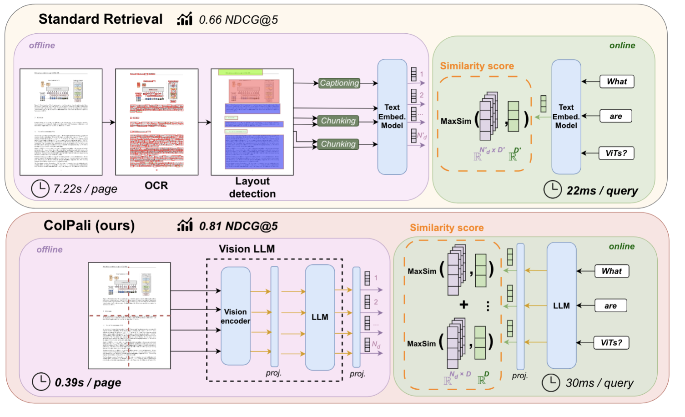
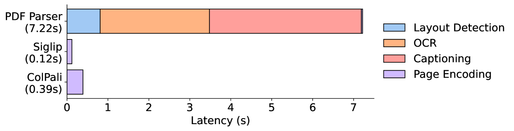
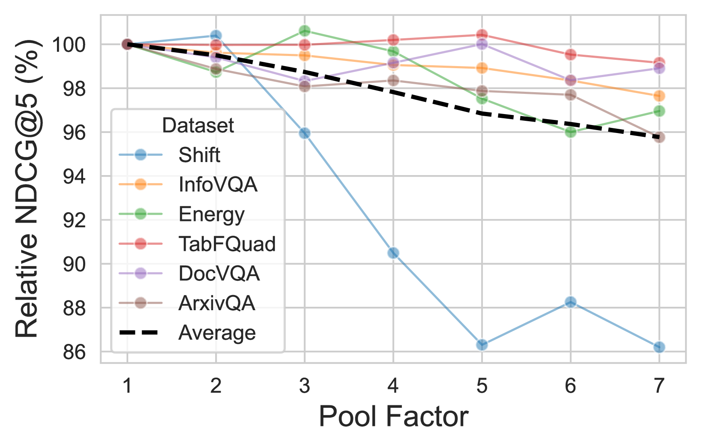
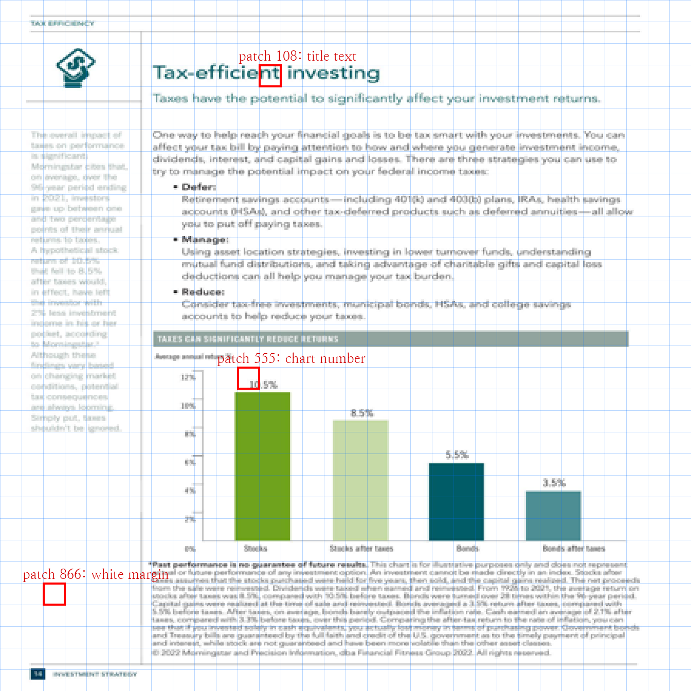
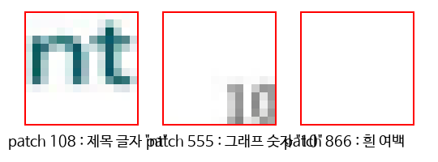
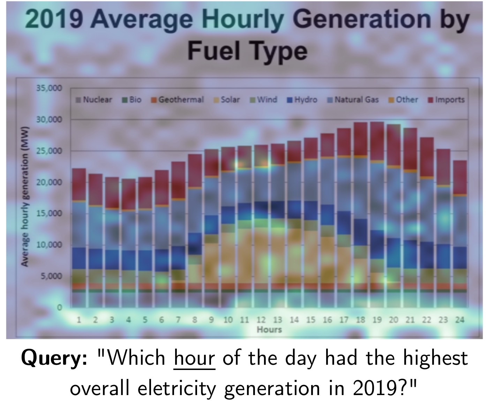
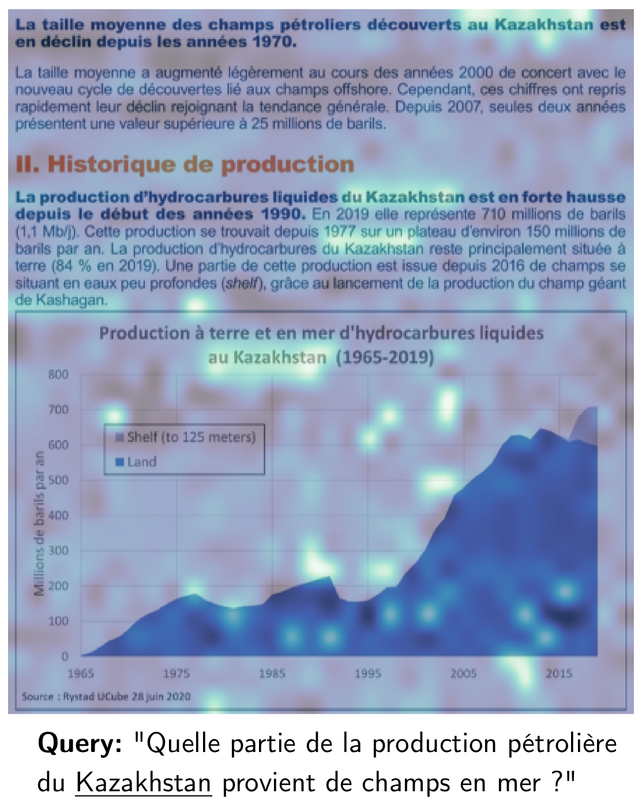

# ColPali — PDF 파싱을 지우고, 페이지를 그냥 사진으로 본다

## 📌 메타 정보

| 항목 | 내용 |
|---|---|
| **논문 제목** | ColPali: Efficient Document Retrieval with Vision Language Models |
| **저자** | Manuel Faysse, Hugues Sibille*, Tony Wu*, Bilel Omrani, Gautier Viaud, Céline Hudelot, Pierre Colombo (*공동 1저자) |
| **소속** | Illuin Technology / Equall.ai / CentraleSupélec, Paris-Saclay / ETH Zürich |
| **공개일** | 2024-06-27 (arXiv v1) → 2025-02-28 (v6, 최종) |
| **학회** | **ICLR 2025** (conference paper) |
| **분야** | Document Retrieval(문서 검색), Multi-vector Retrieval(다중 벡터 검색), Vision-Language Model(VLM), RAG |
| **arXiv abstract** | https://arxiv.org/abs/2407.01449 |
| **arXiv HTML (v6)** | https://arxiv.org/html/2407.01449v6 |
| **코드** | https://github.com/illuin-tech/colpali (패키지명 `colpali-engine`, MIT) |
| **벤치마크 코드** | https://github.com/illuin-tech/vidore-benchmark (별도 저장소) |
| **모델·데이터** | https://hf.co/vidore (모델, ViDoRe 벤치마크, 학습셋 전부 공개) |
| **리더보드** | https://huggingface.co/spaces/vidore/vidore-leaderboard |
| **베이스 모델** | **PaliGemma-3B** (`google/paligemma-3b-mix-448`) = SigLIP-So400m/14 비전 인코더 + Gemma-2B 언어 모델 |
| **계승한 방법론** | **ColBERT** (Khattab & Zaharia, 2020) — late interaction(늦은 상호작용) / MaxSim |
| **데이터 생성에 쓴 외부 모델** | **Claude-3 Sonnet** (합성 질의 생성 + 캡셔닝 베이스라인), GPT-3.5 Turbo (웹 크롤러 주제 확장) |
| **리뷰 시점 코드 상태** | main 브랜치 커밋 `c23838d` (2026-06-10), colpali-engine 0.3.14+ |

---

## 📖 주요 용어 사전 (Glossary)

*논문을 읽기 전에 이 표만 이해하면 본문이 거의 다 읽힙니다. ColPali는 새 용어를 거의 만들지 않고, 검색 분야의 기존 용어들을 조합한 논문입니다.*

### 검색(retrieval) 기본 구조

| 용어 | 풀이 |
|---|---|
| **document retrieval(문서 검색)** | 사용자 질의(query)에 맞는 문서를 코퍼스에서 찾아 순위를 매기는 일. 이 논문은 **page-level(페이지 단위)** 검색을 다룬다 — 즉 "문서"의 최소 단위가 PDF 한 장이다. |
| **indexing phase(색인 단계, 오프라인)** | 문서를 미리 벡터로 바꿔 저장해 두는 단계. 사용자를 기다리게 하지 않으므로 느려도 되지만, 처리량(throughput)이 중요하다. |
| **querying phase(질의 단계, 온라인)** | 사용자가 검색어를 넣은 순간 벌어지는 일. 여기서 느리면 사용자가 바로 느낀다. |
| **bi-encoder(양방향 인코더, 단일 벡터)** | 질의와 문서를 **따로** 인코딩해 각각 벡터 하나로 만들고 코사인 유사도로 비교. 빠르지만 문서를 벡터 하나로 압축하면서 정보를 잃는다. |
| **cross-encoder(교차 인코더)** | 질의와 문서를 **붙여서 한 번에** Transformer에 넣음. 정확하지만 질의가 올 때마다 문서 전부를 다시 forward 해야 해서 느리다. |
| **late interaction(늦은 상호작용)** | 위 둘의 절충. 문서는 미리(오프라인) 토큰 단위 벡터로 만들어 두고, **비교(상호작용)만 질의 시점으로 미룬다**. ColBERT가 제안. |
| **multi-vector(다중 벡터)** | 문서 하나를 벡터 하나가 아니라 **벡터 여러 개의 묶음**으로 표현하는 것. ColPali는 페이지 하나당 1030개. |
| **MaxSim** | late interaction의 점수 계산 방식. 질의 토큰 하나마다 문서 벡터들 중 **가장 잘 맞는 것 하나**를 고르고(max), 그 값들을 질의 토큰 전체에 대해 더한다(sum). |

### 문서 처리 파이프라인 (ColPali가 지우려는 대상)

| 용어 | 풀이 |
|---|---|
| **ingestion pipeline(데이터 수집 파이프라인)** | PDF → 검색 가능한 벡터가 되기까지의 전처리 사슬 전체. 이 논문의 진단은 "성능 병목이 임베딩 모델이 아니라 여기 있다". |
| **OCR (Optical Character Recognition, 광학 문자 인식)** | 이미지 속 글자를 텍스트로 뽑아내는 기술. 파이프라인에서 가장 느린 축(페이지당 2.67초). |
| **layout detection(레이아웃 검출)** | 페이지에서 제목·본문·표·그림 영역을 네모로 찾아내는 단계. |
| **chunking(청킹)** | 뽑아낸 텍스트를 의미 단위로 자르는 것. ColPali 비교군은 `by-title`(제목 기준) 전략을 씀. |
| **captioning(캡셔닝)** | 그림·표를 VLM에 보여주고 "이건 무슨 그림인지" 텍스트 설명을 받아 그 설명을 임베딩하는 우회 전략. 시각 정보를 텍스트 검색기에 억지로 넣는 방법이라 느리고 비싸다(페이지당 3.71초). |
| **Unstructured** | 위 과정을 묶어주는 상용/오픈 도구(unstructured.io). 논문의 주 베이스라인. |

### 모델 구성 요소

| 용어 | 풀이 |
|---|---|
| **VLM (Vision-Language Model, 시각-언어 모델)** | 이미지와 텍스트를 함께 받아 텍스트를 출력하는 모델. ColPali는 이걸 **생성이 아니라 임베딩 용도로** 전용한다. |
| **PaliGemma-3B** | 구글의 30억 파라미터 VLM. SigLIP-So400m/14(눈) + Gemma-2B(입)를 선형 투영(linear projection) 한 장으로 연결한 구조. |
| **SigLIP** | CLIP의 후속. softmax 대신 sigmoid 손실을 써서 배치 크기를 크게 키울 수 있는 이미지-텍스트 대조 학습(contrastive learning) 모델. |
| **prefix-LM (Prefix Language Model)** | PaliGemma의 핵심 성질. 입력 앞부분(이미지 토큰 + 지시문)에는 **양방향 full attention(전방향 어텐션)**을 걸고, 출력만 자기회귀(autoregressive)로 생성. ColPali가 PaliGemma를 고른 결정적 이유 — 각 patch(패치) 벡터가 페이지 전체를 본 상태로 나온다. |
| **patch(패치)** | 이미지를 격자로 자른 작은 정사각형 조각. PaliGemma는 14×14 픽셀 단위. 448 해상도면 32×32 = **1024개**. |
| **projection layer(투영 층)** | ColPali가 새로 추가한 유일한 모듈. 언어 모델 출력(2048차원)을 **128차원**으로 줄이는 선형 층 하나(`custom_text_proj`). |
| **query augmentation token(질의 확장 토큰)** | 질의 뒤에 붙이는 의미 없는 특수 토큰들. 모델이 "질의를 스스로 확장/재가중하는 여유 칸"으로 쓰라는 의도. ColBERT에서 유래. |
| **LoRA (Low-Rank Adaptation, 저랭크 적응)** | 원본 가중치는 얼려 두고 작은 저랭크 행렬만 학습하는 미세조정 기법. ColPali는 rank 32 / alpha 32. |

### 평가·효율

| 용어 | 풀이 |
|---|---|
| **ViDoRe (Visual Document Retrieval Benchmark)** | 이 논문이 만든 벤치마크. 학술 5개 + 실무 5개 = 10개 과제, 영어/프랑스어. |
| **nDCG@5** | 상위 5개 결과의 순위 품질 지표. 정답이 위에 있을수록 높음. 이 논문의 주 지표. |
| **Recall@1** | 1등으로 뽑은 문서가 정답일 확률. 부록 Table 6에 별도 보고. |
| **token pooling(토큰 풀링)** | 비슷한 패치 벡터들을 계층적으로 묶어 평균 내 개수를 줄이는 압축. 흰 여백처럼 중복이 많은 패치를 합친다. |
| **PLAID** | ColBERT 계열 다중 벡터를 대규모로 검색하기 위한 전용 인덱스(중심점 클러스터링 + 압축). 저장소에 실험 지원(`fast-plaid`). |
| **R1 / R2 / R3** | 논문이 정의한 실무 요구사항 3가지 — R1 검색 성능, R2 온라인 질의 지연, R3 오프라인 색인 처리량. |

---

## 📝 논문 요약 (TL;DR)

**한 줄:** 문서 검색의 진짜 병목은 임베딩 모델이 아니라 그 앞의 PDF 전처리 사슬이므로, 그 사슬을 통째로 지우고 **페이지 이미지를 VLM에 그대로 먹여 patch(패치)마다 벡터 하나씩 만든 뒤 late interaction(늦은 상호작용)으로 매칭**한다.

- **핵심 문제**: 기존 파이프라인은 OCR·레이아웃 검출·청킹·캡셔닝을 거치느라 페이지당 7.22초가 걸리고, 그 과정에서 그림·표·레이아웃·폰트 같은 시각 단서를 잃는다. 정작 임베딩 모델을 BM25에서 SOTA 신경망(BGE-M3)으로 바꿔도 **0.6점밖에 안 오른다** — 병목이 거기가 아니라는 증거.
- **해결책**: PaliGemma-3B에 128차원 선형 투영 한 장만 붙이고 LoRA로 미세조정. 페이지 = 1030개 벡터, 질의 = 수십 개 벡터, 점수는 MaxSim.
- **검증**: ViDoRe 10개 과제 평균 **nDCG@5 81.3**, 최고 베이스라인(Unstructured + Captioning + BGE-M3, 67.0) 대비 **+14.3**. 색인은 페이지당 7.22초 → **0.39초**.
- **가장 중요한 발견**: 성능 향상 **+22.5점 전부가 "다중 벡터로 바꾼 것"에서 나온다**. VLM을 붙인 것 자체(BiPali)는 영어에서 +0.2로 사실상 0.

핵심 문장 하나만 남긴다면: **"이 논문의 성능은 VLM이 좋아서가 아니라, 페이지를 벡터 하나로 뭉개지 않아서 나온다."** (근거는 §6.2 단계별 분해)

---

## 🎯 핵심 기여 (Contributions)

1. **ViDoRe 벤치마크** — 페이지 단위 시각 문서 검색을 종합 평가하는 최초의 벤치마크. 학술 5개(DocVQA, InfoVQA, TAT-DQA, arXivQA, TabFQuAD) + 실무 5개(Energy, Government, Healthcare, AI, Shift). 영어 + 프랑스어. 실무 과제는 Claude-3 Sonnet이 만든 질의를 사람이 전수 검수.
2. **ColPali 모델** — VLM + late interaction으로 "이미지에서 곧바로 검색"이라는 개념(Retrieval in Vision Space)을 구현. 구조 변경은 선형 층 한 장이 전부.
3. **문제의 재정의** — "임베딩 모델 성능이 아니라 수집 파이프라인이 병목"이라는 주장을 Table 2의 BM25 vs BGE-M3 격차(0.6점)로 실증.
4. **단계별 분해 실험** — SigLIP → BiSigLIP → BiPali → ColPali로 한 번에 한 가지만 바꿔가며, 성능 향상의 출처를 정확히 late interaction으로 특정.
5. **해석 가능성(interpretability)** — MaxSim이 고른 패치를 히트맵으로 되돌려 "이 질의 단어가 페이지의 어디를 봤는지" 시각화. 검색 모델로는 드문 성질.
6. **전면 공개** — 모델(어댑터), 학습셋 11.9만 쌍, 벤치마크, 코드 전부 MIT/공개 라이선스.

---

## 🧩 주요 알고리즘 설명

### 5.1 전체 구조 — 새로 만든 건 선형 층 한 장

*왜 이 구조인가: 이미 이미지와 텍스트를 같은 공간에 정렬해 놓은 VLM이 있으니, 검색에 필요한 건 "그 공간을 128차원으로 줄이는 다리" 하나뿐이라는 판단.*



```
[페이지 이미지 448×448]
        │  SigLIP-So400m/14 (patch 14 → 32×32 = 1024 patch)
        ▼
[patch 임베딩 1024개] + [텍스트 토큰 6개: "<image><bos>Describe the image."]
        │  Gemma-2B 언어 모델 (prefix-LM = 전방향 full attention)
        ▼
[문맥이 반영된 hidden state 1030개 × 2048차원]
        │  custom_text_proj : Linear(2048 → 128)  ← 이 논문이 추가한 유일한 모듈
        ▼
[128차원 벡터 1030개]  →  L2 정규화  →  attention_mask 곱해 패딩 자리 0
```

질의 쪽도 **같은 모델**을 통과합니다(이미지 없이 텍스트만). 질의 = "질의 텍스트 + query augmentation token(질의 확장 토큰)"이고, 결과는 128차원 벡터 수십 개.

**PaliGemma를 고른 이유**는 크기(3B)와 문서 이해 성능도 있지만, 결정적인 건 **prefix-LM**입니다. 이미지 토큰 구간에 양방향 어텐션이 걸리므로, 왼쪽 위 패치도 오른쪽 아래 표를 보고 나서 자기 벡터를 정합니다. causal mask(인과 마스크)였다면 앞쪽 패치는 뒤를 못 봅니다.

### 5.2 점수 계산 — MaxSim

*왜 이 방식인가: 페이지를 벡터 하나로 요약하면 "이건 에너지 보고서" 정도만 남지만, 사용자가 찾는 답은 보통 표 한 칸에 있다. 그 한 칸을 직접 가리킬 수 있어야 한다.*

질의 $q$ 의 벡터 묶음을 $E_q \in \mathbb{R}^{N_q \times 128}$, 문서 $d$ 의 벡터 묶음을 $E_d \in \mathbb{R}^{N_d \times 128}$ 라 할 때:

$$
\mathrm{LI}(q, d) \;=\; \sum_{i=1}^{N_q} \; \max_{j=1}^{N_d} \; \big\langle E_q^{(i)},\, E_d^{(j)} \big\rangle
$$

말로 풀면: **질의 토큰 하나하나에 대해, 문서의 1030개 벡터 중 가장 잘 맞는 것 하나의 내적값을 고르고(max), 그것들을 질의 토큰 전체에 대해 더한다(sum).**

- 벡터가 모두 L2 정규화돼 있으므로 내적 = 코사인 유사도 ∈ [-1, 1].
- 이 연산은 **완전히 미분 가능**하므로 그대로 학습에 쓸 수 있다.

**왜 이게 이기는지 직관.** 벡터 하나로 페이지를 요약하면 "이 페이지는 대략 에너지 보고서" 정도의 정보만 남습니다. 하지만 질의가 "카자흐스탄 해상 유전 비중"이면, 그 답은 페이지 구석 표 한 칸에 있습니다. 다중 벡터는 **그 한 칸을 직접 가리킬 수 있습니다.** 요약 압축을 안 하니까요.

**계산상 이득은 "늦은(late)"이라는 이름에 있습니다.** 문서 벡터는 **오프라인에 미리 다 만들어 두고**, 질의가 들어왔을 때만 max/sum을 돌립니다. cross-encoder(교차 인코더)처럼 매번 질의+문서를 함께 forward 하지 않습니다.

### 5.3 손실 함수 — 배치 안에서 가장 헷갈리는 오답 하나만

*왜 이렇게 하나: 정답과 무관한 쉬운 오답 수십 개를 밀어내는 건 학습 신호가 약하다. 정답 바로 밑까지 올라온 오답 하나를 집중적으로 밀어내는 편이 효율적이다.*

배치 크기 $b$ 에서 $(q_k, d_k)$ 가 정답 쌍일 때:

$$
\mathcal{L} \;=\; \frac{1}{b}\sum_{k=1}^{b} \log\Big(1 + \exp\big(\,\mathrm{LI}(q_k, d_k^{-}) - \mathrm{LI}(q_k, d_k^{+})\,\big)\Big)
$$

여기서 $d_k^{-}$ 는 배치 안에서 **점수가 가장 높은 오답(hardest in-batch negative)**. 수치적으로 안정된 softplus 형태로 쓴 것이 논문 식 (2).

**→ 코드 확인** (`colpali_engine/loss/late_interaction_losses.py:315-327`, `ColbertPairwiseCELoss`):

```python
scores = self._inbatch_scores(query_embeddings, doc_embeddings)  # [B, B]
pos_scores = scores.diagonal(offset=offset)
top2 = scores.topk(2, dim=1).values
neg_scores = torch.where(top2[:, 0] == pos_scores, top2[:, 1], top2[:, 0])  # 1등이 정답이면 2등을
return F.softplus((neg_scores - pos_scores) / self.temperature).mean()
```

top-2를 뽑아 "1등이 정답이면 2등, 아니면 1등"을 오답으로 쓰는 방식으로 hardest negative를 구현했습니다. 논문 식과 정확히 일치합니다.

### 5.4 학습 설정

*왜 이렇게 가볍나: 백본은 이미 이미지-텍스트 정렬을 마쳤으므로, 검색용으로 살짝 비틀기만 하면 된다는 가정.*

| 항목 | 값 |
|---|---|
| 학습 데이터 | **118,695 쌍** (학술 train 분할 72,788 + 웹 크롤 PDF 합성 45,940) — **전부 영어** |
| 학습 대상 | 언어 모델의 attention/MLP 층에 **LoRA (r=32, α=32)** + 새 투영 층. **비전 인코더는 동결(freeze)** |
| 에폭 / 배치 | 1 epoch / 배치 32 (8 GPU × 4) |
| 옵티마이저 / lr | `paged_adamw_8bit` / 5e-5, linear decay, warmup 2.5% |
| 정밀도 | bfloat16 |
| 질의 확장 토큰 | `<unused0>` **5개** (논문 기준) |
| 투영 차원 | **128** |

학습 데이터가 전부 영어인 것은 **의도적**입니다. 프랑스어 과제(Shift, TabFQuAD)를 zero-shot(사전 학습 없이 바로) 다국어 일반화 테스트로 쓰기 위해서입니다.

### 5.5 논문 ↔ 코드 매핑 요약

| 논문 서술 | 코드 위치 | 확인 결과 |
|---|---|---|
| 투영 층으로 128차원 축소 | `models/paligemma/colpali/modeling_colpali.py:52-53` | `self.dim = 128` **하드코딩** + "ColPali2 나올 때까지 대기" TODO |
| 출력 L2 정규화 | 같은 파일 `:70` | 일치 |
| 패딩 자리 제외 | 같은 파일 `:72` | `proj * attention_mask` — **패딩 벡터를 정확히 0으로** 만드는 것이 코드 전체의 전제 |
| 문서 프롬프트 "Describe the image." | `processing_colpali.py:15` | `"<image><bos>Describe the image."` — 논문의 "텍스트 토큰 6개"와 일치 |
| MaxSim | `utils/maxsim.py:31` | `einsum("bnd,csd->bcns").amax(3).sum(2)` — 식 (1) 그대로 |
| pairwise CE 손실 | `loss/late_interaction_losses.py:274-327` | 식 (2) 그대로 |
| 저장 용량 257.5 KB | 계산 검증 | (1024+6) × 128 × 2바이트 = 263,680 B = **257.5 KB** ✅ |

---

## 📊 실험 요약

### 6.1 메인 결과 (ViDoRe, nDCG@5)

*왜 이 표가 중요한가: "파이프라인을 지워도 성능이 떨어지지 않는다"가 아니라 "지웠더니 크게 올랐다"를 보여야 논문의 주장이 성립하기 때문.*

| 시스템 | ArxivQ | DocQ | InfoQ | TabF | TATQ | Shift | AI | Energy | Gov | Health | **평균** |
|---|---|---|---|---|---|---|---|---|---|---|---|
| Unstructured(텍스트만) + BM25 | – | 34.1 | – | – | 44.0 | 59.6 | 90.4 | 78.3 | 78.8 | 82.6 | – |
| Unstructured + OCR + BM25 | 31.6 | 36.8 | 62.9 | 46.5 | 62.7 | 64.3 | 92.8 | 85.9 | 83.9 | 87.2 | 65.5 |
| Unstructured + OCR + BGE-M3 | 31.4 | 25.7 | 60.1 | 70.8 | 50.5 | 73.2 | 90.2 | 83.6 | 84.9 | 91.1 | 66.1 |
| Unstructured + Captioning + BGE-M3 | 35.7 | 32.9 | 71.9 | 69.1 | 43.8 | 73.1 | 88.8 | 83.3 | 80.4 | 91.3 | **67.0** |
| Jina-CLIP | 25.4 | 11.9 | 35.5 | 20.2 | 3.3 | 3.8 | 15.2 | 19.7 | 21.4 | 20.8 | 17.7 |
| Nomic-vision | 17.1 | 10.7 | 30.1 | 16.3 | 2.7 | 1.1 | 12.9 | 10.9 | 11.4 | 15.7 | 12.9 |
| SigLIP (그대로) | 43.2 | 30.3 | 64.1 | 58.1 | 26.2 | 18.7 | 62.5 | 65.7 | 66.1 | 79.1 | 51.4 |
| **ColPali** | **79.1** | **54.4** | **81.8** | **83.9** | **65.8** | **73.2** | **96.2** | **91.0** | **92.7** | **94.4** | **81.3** |

읽는 법 두 가지:

1. **BM25(65.5) vs BGE-M3(66.1) = 0.6점.** 1970년대 통계 기법과 당시 SOTA 신경 임베딩의 차이가 이것뿐입니다. 임베딩 모델을 갈아 끼워도 병목은 안 풀린다는 논문의 핵심 진단이 이 한 칸에 있습니다.
2. **일반 대조 학습 VLM은 완전히 무력합니다.** Jina-CLIP 17.7, Nomic-vision 12.9. 자연 이미지용으로 만든 모델은 문서 페이지 앞에서 쓸모가 없습니다. SigLIP만 51.4로 버티는데, 이건 SigLIP이 WebLI로 학습되며 어느 정도 OCR 능력을 얻었기 때문입니다.

### 6.2 단계별 분해 — 진짜 기여가 어디서 나오는가

*왜 이 분해가 이 논문에서 가장 잘 쓴 부분인가: 한 번에 한 가지만 바꿔서, +22.5점의 출처를 오해의 여지 없이 특정했기 때문.*

| 모델 | 무엇이 바뀌었나 | 평균 nDCG@5 | 변화 |
|---|---|---|---|
| SigLIP (그대로) | 기성품 | 51.4 | – |
| BiSigLIP | + 문서 데이터로 미세조정 | 58.6 | +7.2 |
| BiPali | + 언어 모델 통과(단일 벡터, 평균 풀링) | 58.8 | **+0.2** |
| **ColPali** | **+ late interaction(다중 벡터)** | **81.3** | **+22.5** |

- **언어 모델을 붙인 것 자체는 영어에서 이득이 0에 가깝습니다.** 오히려 Energy는 −11.7, Health는 −8.8로 떨어집니다. 저자들도 정직하게 인정합니다: PaliGemma는 contrastive(대조) 학습을 받은 적이 없고, 11.9만 장짜리 미세조정은 SigLIP의 원래 대조 학습 대비 **10만 배(5 orders of magnitude) 작은 규모**입니다.
- **언어 모델이 확실히 기여한 유일한 축은 다국어입니다.** 프랑스어 Shift가 26.5 → 43.7 (**+17.2**). 학습 데이터가 100% 영어인데도 오릅니다. Gemma-2B가 사전학습에서 얻은 다국어 능력이 새어 나온 것입니다.
- **+22.5점 전부가 late interaction에서 나옵니다.** 백본 교체도 데이터도 아닙니다. **페이지를 벡터 하나로 뭉개지 않은 것**, 그 하나입니다.

### 6.3 음성 결과(negative result) — late interaction은 아무 데나 못 붙인다

*왜 이 실패가 중요한가: "다중 벡터가 좋다"는 결론을 다른 모델에 적용하려는 사람이 반드시 알아야 할 전제 조건이기 때문.*

| 실패한 변형 | 평균 nDCG@5 | 원인 |
|---|---|---|
| ColSigLIP (원본 SigLIP + late interaction) | **2.5** | SigLIP은 **풀링된 벡터 하나**에만 손실을 걸어 학습 → 개별 patch 벡터에 아무 의미도 안 담겨 있음 |
| ColSigLIP (PaliGemma의 SigLIP) | 3.2 | 동일 |
| BiSigLIP (PaliGemma의 SigLIP + PaliGemma 텍스트) | 26.0 | PaliGemma 학습 후 SigLIP 임베딩과 Gemma 임베딩이 **서로 정렬이 깨짐** |

즉 다중 벡터 검색은 **토큰 단위로 의미가 정렬된 백본(= 언어 모델을 통과한 표현)이 전제 조건**입니다. 아무 비전 인코더에나 MaxSim을 얹으면 2~3점으로 붕괴합니다.

### 6.4 비용 구조 — 실무에서 진짜 결정 요인

*왜 별도로 다루나: 성능만 보면 압승이지만, 이 방법의 채택 여부는 사실상 저장 공간이 결정하기 때문.*

**색인 지연 (NVIDIA L4, 페이지당 평균, 1000 페이지)**



| 단계 | Unstructured | SigLIP | ColPali |
|---|---|---|---|
| 레이아웃 검출 | 0.81s | – | – |
| OCR | 2.67s | – | – |
| 캡셔닝 | 3.71s | – | – |
| 페이지/청크 인코딩 | 0.03s | 0.12s | 0.39s |
| **합계** | **7.22s** | **0.12s** | **0.39s** |

인코딩은 0.03초인데 전처리가 7.19초 — 문제 정의가 정확합니다.

**저장 공간**

| 모델 | 페이지당 | 100만 페이지 환산 |
|---|---|---|
| BM25 (희소) | 1.56 ± 0.51 KB | – |
| BM25 (밀집) | 3.00 KB | – |
| BGE-M3 | 8.60 KB | 8.6 GB |
| **ColPali (fp16)** | **257.5 KB** | **약 257 GB** |

**30배**입니다. 이 논문의 거래 조건을 한 줄로 하면: **색인 시간 18배 절약 ↔ 저장 공간 30배 지출.** 전처리 GPU 시간과 파이프라인 유지비를 스토리지로 바꾸는 것입니다.

**질의 지연**: 질의 인코딩은 BGE-M3 22ms vs ColPali 30ms로 차이가 없습니다. 문제는 MaxSim입니다. 논문 표현으로 "1000 페이지당 약 1ms 오버헤드" — 뒤집으면 **100만 페이지 완전 탐색에 질의당 1초**입니다. 실서비스에서는 PLAID 같은 다중 벡터 전용 인덱스가 사실상 필수입니다.

**token pooling(토큰 풀링)으로 완화**



pool factor 3이면 벡터 수 **66.7% 감소**, 성능 **97.8% 유지**. 다만 그래프에서 파란 선(Shift)만 혼자 급락합니다. Shift는 텍스트가 가장 빽빽한 문서 세트인데, **여백이 적으면 합칠 중복도 적기 때문**입니다. 이것이 토큰 풀링의 정확한 적용 조건입니다 — 여백이 많은 문서일수록 잘 먹힙니다.

### 6.5 절제 실험 (Table 7 전체, nDCG@5)

*왜 이 표를 통째로 싣나: 본문 서술과 표가 어긋나는 곳이 있어서, 표 자체를 봐야 하기 때문(§7.1 참조).*

| 변형 | ArxivQ | DocQ | InfoQ | TabF | TATQ | Shift | AI | Energy | Gov | Health | 평균 |
|---|---|---|---|---|---|---|---|---|---|---|---|
| **ColPali (기준, 448)** | 79.1 | 54.4 | 81.8 | **83.9** | 65.8 | **73.2** | 96.2 | 91.0 | 92.7 | 94.4 | **81.3** |
| 질의확장 토큰 없음 | 80.4 | 53.2 | 82.4 | 77.4 | 65.7 | 63.4 | 97.0 | 89.9 | 93.6 | 92.4 | 79.6 |
| 비전 인코더도 학습 | 78.8 | 53.9 | 81.3 | 81.7 | 64.4 | 70.6 | 95.3 | 91.7 | 93.5 | 94.7 | 80.6 |
| pairwise 손실 대신 in-batch | 79.0 | 53.0 | 82.1 | 85.3 | 63.2 | 66.2 | 94.9 | 88.9 | 92.7 | 92.1 | 79.7 |
| DocMatix만으로 학습 | 71.3 | 48.0 | 80.0 | 83.9 | 59.1 | 73.8 | 95.7 | 93.8 | 92.5 | 93.1 | 79.1 |
| + TabFQuAD 학습 추가 | 77.6 | 54.7 | 82.6 | 86.5 | 65.4 | 73.9 | 94.8 | 92.4 | 94.2 | 94.8 | 81.7 |
| ColPali (224 해상도) | 71.0 | 37.4 | 62.3 | 65.7 | 28.6 | 20.4 | 65.7 | 66.8 | 73.9 | 73.0 | 56.5 |
| ColIdefics2 (64 patch) | 73.6 | 48.0 | 82.4 | 81.6 | 63.0 | 57.2 | 95.5 | 86.9 | 86.6 | 91.2 | 76.6 |
| **ColQwen2 (768 patch)** | 86.4 | 56.2 | 89.8 | 88.7 | 75.2 | 85.7 | 98.8 | 94.8 | 93.6 | 97.3 | **86.6** |

핵심만 뽑으면:

- **패치 수가 가장 민감합니다.** 448 → 224로 줄이면 −24.8점. 특히 텍스트가 빽빽한 TATQ(65.8→28.6), Shift(73.2→20.4)에서 참혹합니다. **해상도가 낮으면 글자를 못 읽습니다.**
- **비전 인코더는 얼리는 게 낫습니다** (−0.7). 데이터 11.9만 장으로는 SigLIP을 건드려 봐야 손해라는 뜻. 저자도 "데이터가 커지면 결론이 바뀔 수 있다"고 유보합니다.
- **더 좋은 VLM = 더 좋은 검색기** (ColQwen2 +5.3). 이 논문에서 가장 잘 늙은(오래 유효한) 주장입니다 — §8.1의 계보 표가 그 뒤로도 계속 성립했음을 보여줍니다.
- **분포 밖 일반화**: 학습 데이터를 DocMatix로 완전히 갈아치워도 −2.2에 그칩니다(79.1). 학술 데이터셋 train 분할을 학습에 넣은 것에 대한 정당한 반박입니다. 이 실험이 없었으면 결과 전체가 의심스러웠을 겁니다.

---

## 🔍 급소 — 확인된 문제들

### 7.1 [논문 오류] 질의 확장 토큰 절제 실험의 **부호가 뒤집혀 있습니다**

*왜 짚나: 본문만 읽은 사람이 정반대 결론을 가져가게 되는 오류이기 때문.*

논문 6장 본문:

> "이 토큰들 없이 학습하면 영어 벤치마크에서는 유의미한 차이가 없다. 그러나 **프랑스어 과제에서는 성능이 향상되는 것으로 보인다** (+9.8 nDCG@5 on Shift, +6.3 nDCG@5 on TabFQuAD, Table 7)."

그런데 그 Table 7(§6.5)을 보면:

| | Shift | TabFQuAD |
|---|---|---|
| ColPali (기준) | **73.2** | **83.9** |
| 질의확장 토큰 없음 | 63.4 | 77.4 |

73.2 − 63.4 = **9.8**. 크기는 정확히 맞고 **방향이 정반대**입니다. 토큰을 빼면 프랑스어가 9.8점 **떨어집니다**. 영어 8개 과제 평균 변화는 약 −0.1이라 "차이 없음"은 맞고, 전체 평균도 79.6 vs 81.3으로 빼는 쪽이 나쁩니다.

**저장소가 이 오류를 반증합니다.** 코드는 토큰을 빼기는커녕 **5개 → 10개로 늘렸습니다** (`collators/visual_retriever_collator.py:11`, `N_AUGMENTATION_TOKENS = 10`). 실무에서는 표가 맞다고 판단한 것입니다.

### 7.2 [논문 오류] 패치 수 산수가 2배씩 어긋납니다

본문: "이미지 패치를 절반(**512개**)으로 줄인 PaliGemma 변형을 학습했다 (−24.8 nDCG@5)", "PaliGemma는 **512~2048** 패치".

−24.8 = 81.3 − 56.5이고, 56.5는 Table 7의 **ColPali (224)** 행입니다. 그런데 PaliGemma의 비전 인코더는 patch 크기 14이므로:

| 해상도 | 패치 수 |
|---|---|
| 224 | 16×16 = **256** |
| 448 | 32×32 = **1024** |
| 896 | 64×64 = **4096** |

따라서 "절반(512)"은 실제로 **1/4(256)**이고, "512~2048 범위"는 실제로 **256~4096**입니다. 공개된 체크포인트 계열이 224/448/896 셋뿐이므로 512패치 모델은 존재하지 않습니다. 결론(패치를 줄이면 크게 손해)은 그대로지만, **"절반 줄여서 −24.8"과 "1/4로 줄여서 −24.8"은 실무 판단이 완전히 다릅니다.**

### 7.3 [벤치마크 설계] ViDoRe는 작고, 오차 막대가 없습니다

- **코퍼스가 과제당 500~1600 페이지**뿐입니다. 검색 난이도는 코퍼스 크기에 따라 급격히 오르는데, 1000페이지에서 잰 nDCG@5는 100만 페이지에서 어떨지 아무것도 말해주지 않습니다.
- **실무 과제는 질의가 각 100개**입니다. 100개 질의의 nDCG@5는 표준오차가 수 점 단위인데, **논문 전체에 신뢰구간도 시드 분산도 한 번도 없습니다.** 절제 실험의 −0.7(비전 인코더 해동) 같은 숫자는 사실상 잡음과 구별할 수 없습니다.
- **실무 과제 질의를 Claude-3 Sonnet이 페이지 이미지를 보고 생성**했습니다(사람이 필터링은 함). VLM이 "이 페이지를 보고 물어볼 만한 것"을 만들면, 그 질의는 태생적으로 **페이지 이미지로 답할 수 있는 것들에 치우칩니다.** 이미지를 직접 보는 ColPali에 유리한 방향의 편향인데, 논문은 이를 논의하지 않습니다.
- **학습셋에 DocVQA/InfoVQA/TAT-DQA/arXivQA의 train 분할이 들어 있고**, ViDoRe는 같은 데이터셋의 test 분할을 씁니다. 임베딩 모델 분야의 관행이지만, 미세조정이 불가능한 BM25/BGE-M3와 비교할 때는 명백한 이점입니다. → DocMatix 절제 실험(§6.5)이 이에 대한 정당한 반박.

### 7.4 [비교 공정성] 지연 시간 비교에 API 호출이 섞여 있습니다

7.22초 중 **3.71초가 Claude-3 Sonnet 캡셔닝**, 즉 네트워크 API 왕복입니다. 로컬 GPU forward(0.39초)와 같은 축에 놓고 "18배 빠르다"고 하는 건 다소 유리하게 짜여 있습니다. 캡셔닝을 빼면 3.51초(9배)이고, 텍스트만 쓰는 최소 구성이면 더 줄어듭니다. 결론(전처리가 병목)은 유효하지만 배수는 할인해서 읽어야 합니다.

---

## 🛠 코드 리뷰 — 저장소는 논문보다 훨씬 멀리 가 있습니다

*왜 별도 장인가: 이 저장소는 논문 재현용 코드가 아니라 2년간 계속 자란 실사용 라이브러리라서, 논문만 읽고 코드를 열면 다른 물건을 만나게 되기 때문.*

### 8.1 논문 체크포인트는 이미 지원이 끊겼습니다

README 모델 표에서 논문 체크포인트 `vidore/colpali`(81.3)는 **"현재 지원 ❌"**로 표시돼 있습니다. v1.1이 고친 것이 "질의의 오른쪽 padding(패딩) 수정"인데, 이게 v1.0의 알려진 버그였습니다. 논문 그림을 그대로 재현하려면 옛 버전 엔진을 따로 구해야 합니다.

성능 계보 (ViDoRe 리더보드 기준):

| 체크포인트 | ViDoRe | 비고 |
|---|---|---|
| vidore/colpali (**논문**) | 81.3 | PaliGemma-3B |
| vidore/colpali-v1.1 | 81.5 | 질의 패딩 버그 수정 |
| vidore/colpali-v1.2 | 83.9 | |
| vidore/colpali-v1.3 | 84.8 | 유효 배치 256, 3 에폭 |
| vidore/colqwen2-v0.1 | 87.3 | Qwen2-VL-2B, 동적 해상도 |
| vidore/colqwen2-v1.0 | 89.3 | 유효 배치 256 |
| vidore/colqwen2.5-v0.2 | 89.4 | Qwen2.5-VL-3B |
| TomoroAI/tomoro-colqwen3-embed-4b | 90.6 | Qwen3-VL, **320차원** 임베딩 |
| athrael-soju/colqwen3.5-4.5B-v3 | **90.9** | Qwen3.5-4B, 커뮤니티 기여 |
| vidore/colSmol-256M / 500M | 80.1 / 82.3 | SmolVLM 기반 초소형 |

**레시피는 그대로 두고 백본만 갈아 끼우면 계속 오릅니다.** 논문의 "더 좋은 VLM → 더 좋은 검색기" 주장이 2년간 계속 성립했다는 뜻입니다.

### 8.2 모델 코드는 정말로 짧습니다

`ColPali.forward` 전체가 다섯 줄입니다 (`models/paligemma/colpali/modeling_colpali.py:59-78`):

1. VLM forward → 마지막 hidden state 꺼내기
2. `custom_text_proj`로 128차원 투영
3. L2 정규화
4. **`attention_mask`를 곱해 패딩 자리를 0으로**
5. (옵션) `mask_non_image_embeddings`면 이미지 토큰만 남기기

**4번이 구조적으로 중요합니다.** 코드 전체가 "패딩은 정확히 0"이라는 규약 위에 서 있습니다 — MaxSim 커널도 마스크를 따로 받지 않고 **영벡터의 내적이 0이라는 성질에 의존**합니다(`utils/maxsim.py` 독스트링에 "Pad tokens must be exactly zero"라고 명시). 외부에서 임베딩을 양자화하거나 풀링한 뒤 0이 아닌 값으로 패딩하면 **조용히 틀린 점수가 나옵니다.**

**5번의 기본값은 False**입니다. 즉 `"Describe the image."` 프롬프트 토큰 6개도 문서 임베딩에 그대로 들어갑니다 — 논문의 257.5 KB 계산과 정확히 일치합니다.

그리고 `self.dim = 128`이 **하드코딩**돼 있고 바로 위에 이런 주석이 있습니다:

> "TODO: ColPali2가 나와서 ColPaliConfig를 만들 때까지 대기. 지금 해도 되지만 기존 체크포인트 로딩이 다 깨진다."

논문 발표 2년 뒤인 지금도 그대로입니다. 반면 커뮤니티 모델들은 320차원을 씁니다. 형식이 굳어버린 전형적 사례입니다.

### 8.3 논문 → 코드 드리프트 (재현하려는 사람 주의)

| 항목 | 논문 | 현재 코드 |
|---|---|---|
| 질의 확장 토큰 | `<unused0>` **5개** | **패딩 토큰 10개** (`N_AUGMENTATION_TOKENS = 10`), ColQwen 계열은 `<|endoftext|>` |
| 에폭 / 배치 | 1 epoch / 32 | ColQwen2 설정은 **5 epoch / GPU당 64** |
| 학습률 | 5e-5 | ColPali 설정 5e-5, ColQwen2 설정 **2e-4** |
| 워밍업 | "2.5% 스텝" (≈93 스텝) | `warmup_steps: 500` (≈13%) |
| 옵티마이저 | `paged_adamw_8bit` | 기본 설정에서 **주석 처리됨** |
| 질의 패딩 방향 | (언급 없음) | ColPali만 **right**(collator가 강제), 나머지 전부 **left** |

논문 ColPali에 가장 가까운 설정은 `scripts/configs/pali/train_colpali_model.yaml`이지만, 워밍업과 옵티마이저는 논문 서술과 다릅니다.

### 8.4 논문 이후 추가된 것들 (논문에 한 줄도 없음)

| 기능 | 내용 |
|---|---|
| **손실 5종** | 명시적 hard negative 지원, in-batch 항 가중 혼합(`in_batch_term_weight`), hard max 대신 log-sum-exp를 쓰는 **smooth max**(`use_smooth_max`), sigmoid 손실, 지식 증류(KD)용 후보 레이아웃 |
| **거짓 오답 필터링** | `pos_aware_negative_filtering` — 정답 점수의 95%를 넘는 오답은 "사실 정답인데 라벨이 없는 것"으로 보고 가중치 0.5배. 합성 학습셋에서 필연적으로 생기는 문제에 대한 실용적 처방 |
| **분산 학습 전략 변경** | 예전엔 질의·문서를 모두 GPU 간에 모았지만, 지금은 **문서만** 모음(`trainer/contrastive_trainer.py:153-160`, 기울기 그래프를 유지하는 all_gather). 점수 행렬이 [로컬 배치 × 전체 배치]가 되어 메모리를 아끼면서 오답 풀은 그대로 큼 |
| **융합 Triton MaxSim 커널** | `pip install colpali-engine[lik]`. `[B, B, Lq, Ld]` 4차원 점수 텐서를 아예 만들지 않음. 이 텐서는 배치 크기의 **제곱**으로 커져 사실상 배치 상한을 결정하던 요인 → 80GB H100에서 최대 배치 **64 → 128** (처리량은 동일). `COLPALI_SCORES_BACKEND`로 백엔드 전환, 순수 torch 폴백 상시 제공 |
| **8개 모델 계열** | PaliGemma / Qwen2 / Qwen2.5 / Qwen3 / Qwen3.5 / Qwen-Omni / Gemma3 / Idefics3 / ModernVBERT, 각각 Col(다중 벡터)·Bi(단일 벡터) 양쪽 |
| **기타** | 계층적·람다 토큰 풀링, 실험적 PLAID 인덱스, 유사도 지도 유틸, 다중 데이터셋 샘플러 |

### 8.5 코드 품질 총평

논문 저장소치고 **드물게 잘 관리돼 있습니다.** CHANGELOG가 성실하고, transformers v5 마이그레이션 대응이 최신이며, 테스트가 손실·풀링·프로세서·체크포인트 키 매핑까지 덮습니다. 특히 CHANGELOG의 "LoRA 어댑터 키 리매핑을 고쳐 **투영 층이 조용히 랜덤 초기화로 떨어지는 것을 방지**" 항목들은, 이 계열에서 가장 잡기 어려운 버그(성능이 이상한데 에러는 안 남)를 정면으로 다룬 흔적입니다.

거슬리는 부분 3가지:

1. `_apply_normalization`의 독스트링은 "범위를 벗어나면 ValueError를 던진다"고 적혀 있는데 실제로는 `print`만 합니다 (`loss/late_interaction_losses.py:59-72`).
2. 질의 길이를 세는 방식이 `임베딩의 0번째 좌표가 0이 아닌 것의 개수`라는 휴리스틱입니다. bf16 정밀도에서 실제 토큰의 첫 좌표가 정확히 0으로 반올림되면 길이를 잘못 셉니다. `attention_mask`를 넘기면 될 일을 우회한 구현입니다.
3. `_filter_high_negatives`는 **점수가 음수일 때 부호가 뒤집힙니다.** 정답 점수가 음수면 임계값도 음수가 되고, 오답 점수에 0.5를 곱하면 오히려 **커집니다**(예: −0.1 × 0.5 = −0.05). 정규화된 점수가 보통 양수라 실전에서 터질 일은 드물지만, 학습 초기에는 걸릴 수 있는 경계 조건입니다.

---

## 💬 Q&A

### Q1. "페이지 이미지를 VLM에 그대로 먹여 patch 하나당 벡터 하나를 만든다" — 실제 예제를 보여줘

*왜 이 질문이 나오나: 이 문장이 이 논문의 전부인데, 말로만 들으면 "패치"가 얼마나 작은 단위인지 감이 안 오기 때문.*

ViDoRe의 Energy 세트에 실제로 들어 있는 페이지(Tax-efficient investing, 원본 1700×2200)로 그 과정을 직접 재현했습니다.

**① 실제 페이지가 1024칸으로 잘리는 모습**

ColPali 입력 규격인 448×448로 줄이고 patch 크기 14로 격자를 그린 것입니다. 448 ÷ 14 = 32 → **32×32 = 1024칸**.



**② 칸 하나를 확대하면 이것이 들어 있습니다**

위 그림에서 빨간 네모로 표시한 세 칸을 8배 확대한 것. **이 14×14 픽셀 조각 하나가 최종적으로 128차원 벡터 하나가 됩니다.**



| 패치 번호 | 위치 | 실제 내용물 | 이 벡터가 하는 일 |
|---|---|---|---|
| 108 | (3행, 12열) | 제목 "investing"의 **"nt" 두 글자** | 질의에 "investing"이 있으면 여기가 반응 |
| 555 | (17행, 11열) | 막대그래프 위 숫자 **"10"** (10.5%) | 질의에 "10.5%"나 "return"이 있으면 반응 |
| 866 | (27행, 2열) | **완전히 흰 여백** | 정보 없음 → token pooling으로 가장 먼저 합쳐지는 대상 |

여기서 중요한 점: **패치 108은 "nt"라는 글자 조각을 담고 있지, 단어도 문장도 아닙니다.** 그런데 언어 모델(Gemma-2B)을 통과하면서 prefix-LM의 full attention으로 페이지 전체를 보게 되므로, 이 벡터는 "제목의 investing이라는 단어 중간 부분"이라는 맥락을 담은 벡터가 됩니다. SigLIP 단독이면 그냥 "청록색 글자 픽셀"에서 끝납니다 — **ColSigLIP이 3.2점으로 붕괴한 이유가 정확히 이것입니다**(§6.3).

**③ 텐서 모양으로 보면**

```python
batch_images = processor.process_images([page])   # "<image><bos>Describe the image."
# input_ids   : (1, 1030)          = 이미지 토큰 1024 + 텍스트 토큰 6
# pixel_values: (1, 3, 448, 448)

emb = model(**batch_images)        # (1, 1030, 128)  ← 페이지 1장 = 벡터 1030개

batch_queries = processor.process_queries(["10.5%는 세전 수익률인가?"])
qemb = model(**batch_queries)      # (1, 약 25, 128) ← 질의 토큰 + 확장 토큰 10개
```

BGE-M3라면 이 페이지가 `(1, 1024)` 벡터 **하나**로 끝납니다. ColPali는 `(1030, 128)`을 **전부 저장**합니다. 그래서 1030 × 128 × 2바이트 = 257.5 KB, BGE-M3의 30배가 되는 겁니다.

**④ 이 벡터들이 실제로 무엇에 반응하는지 (논문 Figure 3 오른쪽)**

논문이 실제 모델에서 뽑은 similarity map(유사도 지도)입니다. 질의 "Which **hour** of the day had the highest overall electricity generation in 2019?"에서 **`hour` 토큰 하나만** 떼어내, 1024개 패치 각각과의 내적을 색으로 칠한 것입니다.



밝은 곳을 보세요. 제목의 **"Hourly"**, x축 라벨 **"Hours"**, 그리고 **1~24 시각 눈금 숫자들**이 켜집니다. 별도 OCR을 붙인 적이 없는데도요. `hour` 토큰이 "이 페이지에서 나와 가장 잘 맞는 칸"을 고른 결과 — MaxSim이 실제로 하는 일이 눈에 보이는 형태입니다.

**⑤ 글자 매칭이 아니라 세계 지식이 작동하는 예 (논문 Figure 6)**



Shift 데이터셋에서 `Kazakhstan` 토큰을 넣으면 "Kazakhstan"이라는 글자뿐 아니라 **"Kashagan"**(카자흐스탄 해상 유전 이름)에도 불이 들어옵니다. 단순 글자 매칭이었다면 불가능한 반응입니다.

**⑥ 논문이 정직하게 남긴 이상 현상**

두 유사도 지도 모두에서 **흰 여백 패치 몇 개가 높은 점수를 받습니다.** 정보가 없는 칸인데도요. 저자들은 이를 **ViT register(레지스터) 현상**(Darcet et al., 2023) — 정보가 없는 패치가 모델 내부 계산용 **전역 정보 저장소로 재활용**되는 것 — 으로 추정합니다.

### Q2. 그래서 우리 서비스에 쓸 만한가? (판단 기준)

*왜 이 질문이 필요한가: 논문의 결론이 "무조건 좋다"가 아니라 "이런 조건에서 좋다"이기 때문.*

| 조건 | 판단 |
|---|---|
| 코퍼스 수만~수십만 페이지 | **명백히 유리.** 저장 257 KB × 10만 = 26 GB로 감당 가능하고, 전처리 파이프라인 유지비를 통째로 없앰 |
| 코퍼스 수천만 페이지 이상 | **재검토 필요.** 인덱스가 TB 단위. token pooling(×3) + 이진 양자화 + PLAID를 전제로 설계해야 함 |
| 문서가 그림·표·차트·인포그래픽 중심 | **강력 추천.** InfoVQA 81.8, ArxivQA 79.1처럼 기존 방식이 무너지는 곳에서 가장 크게 이김 |
| 문서가 순수 텍스트 위주 | 여전히 이기지만 격차는 줄어듦. 저장 비용 30배가 정당한지 따져봐야 함 |
| 다국어(비영어) | 학습셋이 전부 영어인데도 프랑스어 zero-shot이 됨. 다만 검증된 언어는 프랑스어뿐 |
| 저해상도 스캔본 | **주의.** 224 해상도 절제 실험(−24.8)이 보여주듯 글자가 안 읽히면 급락 |

버전 선택: **논문 재현 목적이면 v1.2/v1.3 이후**, **실사용이면 ColQwen2 계열 이상**을 쓰는 것이 맞습니다. `vidore/colpali`(논문 체크포인트)는 현재 엔진에서 지원이 끊겼습니다.

### Q3. ColBERT를 그대로 이미지에 옮긴 것뿐 아닌가? 새로운 게 뭔가?

*왜 이 질문이 나오나: MaxSim도 손실도 ColBERT 그대로라서, 기여가 무엇인지 헷갈리기 때문.*

기여는 **알고리즘이 아니라 "어디에 붙일 수 있는지"의 발견**입니다. 구체적으로 세 가지:

1. **적용 가능성의 발견** — ColBERT를 이미지에 붙이려면 "패치마다 의미가 정렬된 벡터"가 필요한데, 그런 게 존재하는지 자체가 자명하지 않았습니다. ColSigLIP의 2.5점 붕괴가 그 증거입니다. **VLM의 언어 모델을 통과한 패치 임베딩만이 그 조건을 만족한다**는 것이 이 논문의 실질적 발견입니다.
2. **문제 프레이밍** — "OCR 파이프라인을 개선하자"가 아니라 "지우자"로 문제를 다시 세웠고, 그것을 측정할 벤치마크(ViDoRe)를 같이 만들었습니다. 벤치마크가 없었으면 주장을 증명할 방법이 없었습니다.
3. **비용 구조의 재배치** — 색인 시간(GPU + 엔지니어링)을 저장 공간으로 바꾸는 거래를 처음으로 정량화했습니다.

바꿔 말하면 이 논문은 **새 알고리즘 논문이 아니라 시스템 설계 논문**입니다. 그래서 산업 채택이 빨랐습니다.

---

## 🎓 무엇을 가져갈 것인가

*왜 이 절을 두나: 위 §5~§8이 "이 논문이 무엇을 했나"라면, 여기는 "다른 논문·다른 프로젝트를 볼 때 이 논문에서 뭘 들고 갈 것인가"를 남기는 자리.*

### 남는 것 (다른 모델에도 적용되는 교훈)

1. **압축하지 않는 것이 이긴다.** +22.5점 전부가 다중 벡터에서 나왔습니다. 단일 벡터로 페이지를 요약하는 순간 잃는 정보가, 백본 업그레이드로 되찾을 수 있는 양보다 훨씬 큽니다.
2. **late interaction은 아무 백본에나 안 붙습니다.** ColSigLIP의 2.5~3.2점 붕괴가 증거입니다. 토큰 단위 표현이 의미적으로 정렬돼 있어야(= 언어 모델을 통과했어야) 합니다. 새 모델에 이 레시피를 얹으려면 **이 조건부터 확인**해야 합니다.
3. **백본 교체만으로 계속 오릅니다.** 81.3 → 90.9까지, 방법론은 그대로 두고 백본만 바뀌었습니다(§8.1). 레시피의 수명이 길다는 뜻입니다.
4. **비용은 스토리지로 지불합니다.** 페이지당 257.5 KB, 100만 페이지에 257 GB. token pooling(×3, 성능 97.8% 유지)과 이진 양자화가 사실상 필수 짝입니다.

### 주의해서 읽을 것 (이 논문을 인용하기 전에)

1. 6장 질의 확장 토큰 문단은 **부호가 반대**입니다. Table 7(§6.5)을 직접 보세요. → §7.1
2. **"패치 512개"는 실제로 256개**입니다. → §7.2
3. **모든 수치에 오차 막대가 없고**, 실무 과제는 질의가 100개뿐입니다. 1점 이하 차이는 무시하는 게 안전합니다. → §7.3
4. 논문 재현 목적이면 `vidore/colpali`가 아니라 **v1.2/v1.3 이후**를, 실사용이면 **ColQwen2 계열 이상**을 쓰는 게 맞습니다. → §8.1

---

## 🧾 한 줄 요약 (전체)

**ColPali = PaliGemma-3B + 128차원 선형 층 한 장 + ColBERT MaxSim.** 성능 향상 +22.5점의 전부는 "페이지를 벡터 하나로 압축하지 않은 것"에서 나오며, 그 대가로 저장 공간을 30배 지불한다. 새 알고리즘이 아니라 **"OCR 파이프라인을 개선하지 말고 지워라"는 문제 재정의와, 그것을 측정할 벤치마크(ViDoRe)를 함께 낸 시스템 논문**이다. 단, 6장의 질의 확장 토큰 절제 실험은 **본문 서술의 부호가 표와 반대**이고, 패치 수 서술은 2배 어긋나 있으므로 Table 7을 직접 봐야 한다.

---

## 🔗 관련 문서 / 메모리

| 문서 | 관계 |
|---|---|
| [PAPER_PaliGemma.md](PAPER_PaliGemma.md) | ColPali의 백본. **prefix-LM(전방향 어텐션)** 성질이 ColPali가 이 모델을 고른 결정적 이유 — 그 원리가 여기 정리돼 있음 |
| [PAPER_PaliGemma-2.md](PAPER_PaliGemma-2.md) | 후속. "글자 읽기 = 해상도, 생각하기 = LM 크기" 분해 분석 → ColPali의 224 절제 실험(−24.8)과 정확히 같은 결론 |
| [PAPER_Qwen3-VL.md](PAPER_Qwen3-VL.md) | ColQwen3 계열의 백본. 동적 해상도 지원이 ColPali 고정 1024패치의 한계를 푸는 지점 |
| [PAPER_DeepSeek-OCR.md](PAPER_DeepSeek-OCR.md) | 반대 방향 접근 — "텍스트를 이미지로 압축". ColPali가 "검색을 이미지로", DeepSeek-OCR이 "저장을 이미지로" |
| [PAPER_PaddleOCR-VL-1.6.md](PAPER_PaddleOCR-VL-1.6.md), [PAPER_MinerU2.5-Pro.md](PAPER_MinerU2.5-Pro.md), [PAPER_GLM-OCR.md](PAPER_GLM-OCR.md) | ColPali가 "지우자"고 한 바로 그 파싱 파이프라인을 정면으로 개선하는 계열. 두 노선의 대비로 읽으면 좋음 |
| [PAPER_Florence-2.md](PAPER_Florence-2.md) | 모든 시각 과제를 seq2seq로 통일한 접근. ColPali는 반대로 **생성을 버리고 임베딩만** 취함 |
