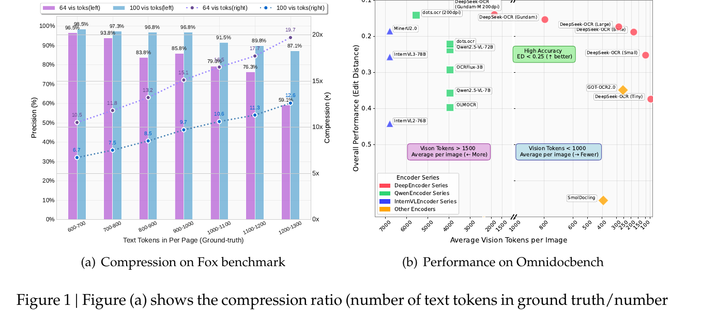
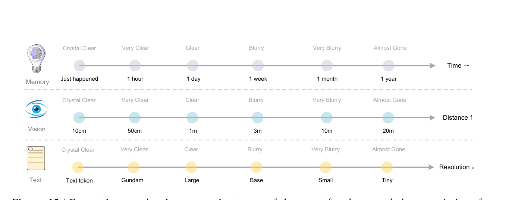
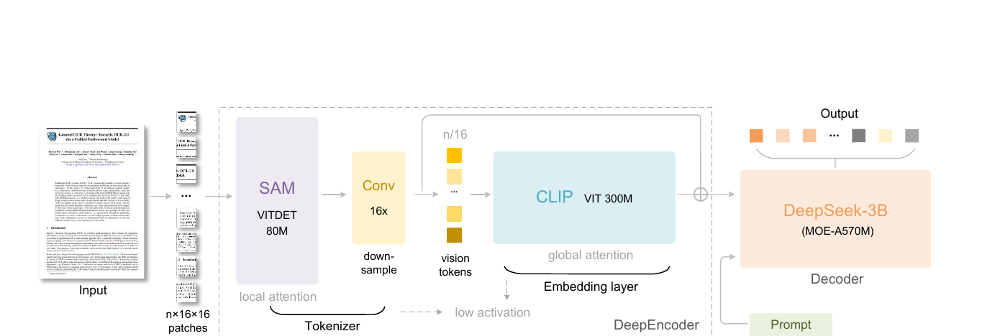
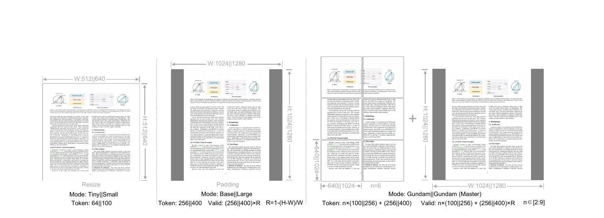
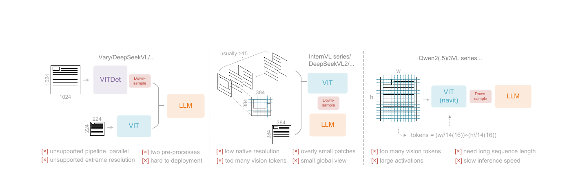

# PAPER: DeepSeek-OCR — 글자를 이미지로 압축한다는 발상, 그리고 그 압축률의 실제 회계

## 0. 이 문서를 읽는 법

이 문서는 DeepSeek-OCR 논문(arXiv 2510.18234, 22쪽)과 공개된 추론 코드(github.com/deepseek-ai/DeepSeek-OCR + HuggingFace 허브의 `modeling_deepseekocr.py`, `deepencoder.py`, `config.json`)를 함께 읽고 정리한 리뷰입니다.

핵심 주장은 하나입니다.

> **DeepSeek-OCR은 "글자 1000개를 이미지로 그리면 vision token(시각 토큰) 몇 개로 복원되는가"를 처음으로 곡선 형태로 측정한 논문이다. 답은 대략 9배 압축까지 거의 무손실. 다만 논문이 내세우는 "10배/20배"는 코드상 실제로 소비되는 토큰이 아니라 관대하게 계산된 회계이고, 정작 제목의 "context compression(문맥 압축)"은 한 번도 context로 검증되지 않았다.**

읽는 순서는 이렇게 잡았습니다.

1. **무엇을 주장하는가**(§4): optical compression(광학 압축)이라는 발상과 그 야심
2. **아키텍처**(§5): DeepEncoder의 실제 구조 — **논문 본문에 없는 것 3가지를 코드에서 복원**
3. **해상도 모드**(§6)와 **데이터·학습**(§7)
4. **토큰 회계 검증**(§8): 이 리뷰의 핵심 지적. 논문의 압축률을 실제 토큰으로 다시 계산
5. **실험 결과**(§9)와 **비판적 평가**(§10)
6. **코드 리뷰**(§11): 실전 함정 8가지
7. **계보 정리**(§12), **Q&A**(§13), 한 줄 요약(§14)

수식은 GitHub에서 깨지지 않도록 LaTeX 대신 일반 텍스트로 적었습니다.

```text
예: valid_img_tokens = int(256 × ratio),  ratio = 1 − (max(w,h) − min(w,h)) / max(w,h)
    (즉 A4처럼 세로가 긴 문서는 정사각형 패딩 여백만큼 토큰 수를 할인해서 보고한다는 뜻)
```

---

## 1. 메타 정보

| 항목 | 내용 |
|---|---|
| 논문 | DeepSeek-OCR: Contexts Optical Compression |
| 저자 | Haoran Wei, Yaofeng Sun, Yukun Li (3명) |
| 소속 | **DeepSeek-AI** |
| 공개일 | 2025-10-20 (모델 릴리스) / PDF 생성일 2025-10-17 |
| arXiv | https://arxiv.org/abs/2510.18234 |
| PDF | https://github.com/deepseek-ai/DeepSeek-OCR/blob/main/DeepSeek_OCR_paper.pdf |
| 코드 | https://github.com/deepseek-ai/DeepSeek-OCR (추론 전용) |
| 체크포인트 | https://huggingface.co/deepseek-ai/DeepSeek-OCR (모델 정의 코드가 여기에 있음) |
| 분야 | Document OCR(문서 광학 문자 인식), Vision-Language Model(시각-언어 모델, VLM), Context Compression(문맥 압축) |
| 구성 | DeepEncoder(약 380M) + DeepSeek3B-MoE-A570M(디코더) |
| 재사용한 사전학습 모델 | **SAM-base**(ViTDet, patch16, Meta) + **CLIP-L/14@224**(OpenAI) — 둘 다 가중치를 출발점으로 가져옴 |
| 벤치마크 | Fox(압축률 측정), OmniDocBench(실용 문서 파싱 성능) |
| 공개 범위 | **추론 코드 + 가중치만.** 학습 코드·학습 데이터·DeepEncoder 사전학습 단계 전부 비공개 |
| 1저자 전작 | Vary(ECCV 2024) → GOT-OCR2.0 → Slow Perception → **DeepSeek-OCR**. 사실상 3부작의 연장선 |
| 후속작 | **DeepSeek-OCR2** (2026-01-27 릴리스, github.com/deepseek-ai/DeepSeek-OCR-2) |

---

## 2. 주요 용어 사전 (Glossary)

*본문에 들어가기 전에 걸릴 만한 용어를 먼저 풀어둡니다. 이 논문은 "토큰을 몇 개 쓰느냐"가 전부라서, 토큰 관련 용어를 안 깔면 §8이 안 읽힙니다.*

### 2.1 압축과 토큰 관련

- **vision token(시각 토큰)**: 이미지를 인코더에 넣으면 나오는 벡터 하나하나. LLM 입장에서는 단어 토큰과 똑같이 시퀀스 한 칸을 차지하고, KV cache(키-값 캐시) 메모리도 똑같이 먹습니다.
- **text token(텍스트 토큰)**: 글자를 tokenizer(토크나이저)로 자른 단위. DeepSeek-OCR의 vocabulary(어휘 사전)는 약 129,280개.
- **compression ratio(압축률)**: 이 논문에서는 `ground truth 텍스트 토큰 수 ÷ 사용한 vision token 수`. 10배면 "텍스트 토큰 700개짜리 문서를 vision token 70개로 표현했다"는 뜻.
- **contexts optical compression(문맥 광학 압축)**: 이 논문이 만든 용어. 긴 텍스트를 **이미지로 렌더링해서** LLM에 넣으면 토큰 수를 줄일 수 있다는 발상. "optical(광학)"은 "눈으로 본다"는 의미.
- **decoding precision(복원 정확도)**: 압축된 이미지에서 원본 텍스트를 얼마나 정확히 되살렸는가. edit distance(편집 거리) 기반으로 계산.
- **edit distance(편집 거리)**: 두 문자열을 같게 만들려면 몇 번 고쳐야 하는지. **낮을수록 좋음.** OmniDocBench의 기본 지표.

### 2.2 아키텍처 관련

- **DeepEncoder**: 이 논문이 만든 vision encoder(시각 인코더). SAM + 16배 압축기 + CLIP을 **직렬(serial)** 로 연결한 것.
- **SAM (Segment Anything Model)**: Meta가 만든 분할 모델. 여기서는 그 안의 image encoder(ViTDet 백본)만 떼어 씁니다. **고해상도 지각(perception) 담당.**
- **CLIP**: OpenAI가 만든 이미지-텍스트 정렬 모델. 여기서는 vision tower(시각 탑) 24층만 씁니다. **의미·지식(knowledge) 담당.**
- **window attention(윈도우 어텐션)**: 이미지를 작은 창(여기서는 14×14 패치)으로 나눠 창 안에서만 어텐션. 토큰이 많아도 싸게 처리됨.
- **global attention(전역 어텐션)**: 모든 토큰이 모든 토큰을 봄. 토큰 수의 제곱으로 비쌈.
- **activation memory(활성 메모리)**: forward 중에 GPU에 올라가는 중간 텐서의 크기. 고해상도 VLM이 GPU 메모리를 터뜨리는 주범.
- **MoE (Mixture-of-Experts, 전문가 혼합)**: 여러 개의 작은 FFN(expert, 전문가) 중 일부만 골라 쓰는 구조. 총 파라미터는 크지만 실제 계산에 쓰이는 것(activated, 활성)은 적음.
- **A570M**: activated 570M. 총 3B 중 실제로 계산되는 건 5.7억 파라미터라는 뜻.
- **projector(프로젝터)**: 인코더 출력 차원을 LLM의 hidden size(은닉 차원)에 맞춰주는 다리. 여기서는 Linear(2048 → 1280) 한 장.
- **skip connection(우회 연결)**: 어떤 모듈을 건너뛰고 그 앞의 특징을 뒤에 그대로 전달하는 배선.
- **positional embedding interpolation(위치 임베딩 보간)**: 사전학습 때와 다른 해상도를 쓸 때, 학습된 위치 정보 표를 bicubic 등으로 늘리거나 줄여 맞추는 것.

### 2.3 해상도 모드 관련

- **native resolution(네이티브 해상도)**: 이미지를 통째로 정해진 크기 하나에 맞추는 방식. Tiny/Small/Base/Large 4종.
- **dynamic resolution(동적 해상도)**: 이미지를 여러 타일(tile)로 잘라 각각 처리하고, 전체를 축소한 글로벌 뷰를 하나 더 붙이는 방식. Gundam 모드.
- **tile / local view(타일 / 지역 뷰)**: 원본을 격자로 자른 조각. 세부 글자를 보는 담당.
- **global view(전역 뷰)**: 원본 전체를 축소한 한 장. 레이아웃 파악 담당.
- **padding(패딩)**: 가로세로비를 유지한 채 남는 부분을 회색으로 채워 정사각형을 만드는 것. Base/Large 모드가 사용.
- **resize(리사이즈)**: 가로세로비를 무시하고 강제로 정사각형으로 늘리는 것. Tiny/Small 모드가 사용.

### 2.4 평가·디코딩 관련

- **Fox benchmark**: 문서 이해용 벤치마크. 여기서는 영어 문서 중 텍스트 토큰 600~1300개짜리 100페이지만 골라 씀.
- **OmniDocBench**: 실제 PDF 문서 파싱 벤치마크(CVPR 2025). 문서 유형 9종별로 edit distance를 잼.
- **no-repeat n-gram(반복 n-gram 금지)**: 최근 생성한 n개짜리 연속 토큰이 또 나오려 하면 확률을 0으로 눌러버리는 디코딩 제약. **모델이 같은 문장을 무한 반복하는 붕괴(degeneration)를 막는 응급처치.**
- **greedy decoding(탐욕적 디코딩)**: `temperature=0.0`, 매 스텝 최고 확률 토큰만 선택. 이 저장소의 모든 스크립트가 이 설정.

---

## 3. 논문 요약 (TL;DR)

**한 줄**: 텍스트를 이미지로 렌더링해 vision token으로 압축하면, 약 9~10배까지는 97% 정확도로 원본 텍스트를 복원할 수 있다는 것을 OCR로 처음 정량화한 논문.

**핵심 문제**: LLM은 긴 텍스트를 다룰 때 시퀀스 길이의 제곱으로 비용이 커집니다. 그런데 문서 한 장을 담은 **이미지 하나가, 같은 내용의 텍스트보다 훨씬 적은 토큰으로 표현될 수 있지 않을까?** 아무도 이 질문에 숫자로 답한 적이 없었습니다. 논문의 표현으로는 — *"1000단어를 담은 문서를 디코딩하려면 vision token이 최소 몇 개 필요한가?"*

**해결책**:
1. **DeepEncoder** — 고해상도를 저활성으로 처리하는 새 인코더. window attention 구간에서 토큰을 많이 만들고, **비싼 global attention에 들어가기 직전에 16배로 압축**하는 순서가 핵심.
2. **다중 해상도 모드** — 64/100/256/400 토큰을 한 모델이 모두 지원해서, 압축률을 바꿔가며 정확도 곡선을 그릴 수 있게 함.
3. **DeepSeek3B-MoE 디코더** — 3B급 표현력에 500M급 추론 속도.

**검증**: Fox 벤치마크 100페이지로 압축률-정확도 곡선을 그리고(Table 2), OmniDocBench에서 실용 성능을 측정(Table 3). 압축률 10배 이내에서 97%, 20배에서 60%.

---

## 4. 핵심 기여 (Contributions)와 그 야심

*논문이 스스로 뭘 했다고 주장하는지, 그리고 마지막에 던지는 그림이 왜 이 논문의 진짜 목적인지 먼저 짚습니다.*

논문이 명시한 기여 3가지:

1. **vision-text 압축률의 정량 분석** — 9~10배에서 96% 이상, 10~12배에서 약 90%, 20배에서 약 60%. 이런 곡선을 제시한 건 처음.
2. **DeepEncoder라는 새 구조** — window attention 컴포넌트와 global attention 컴포넌트를 16배 convolutional compressor(합성곱 압축기)로 직렬 연결.
3. **DeepSeek-OCR이라는 실용 모델** — OmniDocBench에서 end-to-end 모델 중 가장 적은 토큰으로 SOTA. 프로덕션에서 A100-40G 한 장당 하루 20만+ 페이지, 20노드(각 8×A100-40G)로 하루 **3300만 페이지** 생성.



*Figure 1(a)는 Fox 벤치마크에서의 압축률-정확도 곡선, (b)는 OmniDocBench에서 "평균 vision token 수 vs edit distance". (b)의 오른쪽 아래로 갈수록 "적은 토큰으로 좋은 성능"인데, DeepSeek-OCR 계열(빨간 점)이 그 영역을 독점합니다.*

### 4.1 진짜 야심은 마지막 그림에 있다

*논문의 실험은 전부 OCR인데, 왜 제목이 "Contexts Optical Compression"인지는 Figure 13에서 드러납니다.*



저자들이 그리는 그림은 이렇습니다. **인간의 망각 곡선(forgetting curve)을 해상도로 흉내내자.**

| 인간의 기억 | 인간의 시각 | DeepSeek-OCR의 모드 |
|---|---|---|
| 방금 일어난 일 (선명) | 10cm 거리 (선명) | text token 원본 |
| 1시간 전 | 50cm | Gundam |
| 1일 전 | 1m | Large |
| 1주 전 (흐릿) | 3m (흐릿) | Base |
| 1개월 전 | 10m | Small |
| 1년 전 (거의 사라짐) | 20m (거의 사라짐) | Tiny |

즉 **최근 대화는 고해상도로 렌더링해서 토큰을 많이 주고, 오래된 대화는 점점 작은 이미지로 렌더링해서 토큰을 줄이면** — 오래된 정보는 자연스럽게 "흐릿해지며" 잊혀지고, 이론상 무한한 context 길이가 가능해진다는 것입니다.

**이 부분에 실험은 하나도 없습니다.** 순수한 제안이고, 논문 스스로도 *"we acknowledge this is early-stage work"* 라고 씁니다.

---

## 5. 아키텍처: 코드로 복원한 DeepEncoder

*논문 Figure 3은 "SAM → 16배 압축 → CLIP → 디코더" 직렬 연결로 단순하게 그려져 있습니다. 그런데 코드를 열어보면 논문 본문이 설명하지 않은 요소가 세 개 나옵니다. 이 절은 "그림이 말하지 않은 것"을 채우는 절입니다.*



### 5.1 실제 데이터 흐름 (1024×1024 Base 모드 기준)

```text
이미지 1024×1024
  ↓ SAM-base, patch16 (window attention 위주, 80M)
64×64 = 4096 토큰, dim 768
  ↓ neck: Conv1x1(768→256) → LayerNorm2d → Conv3x3(256→256) → LayerNorm2d
64×64, dim 256
  ↓ net_2 (Conv 3x3, stride 2) → net_3 (Conv 3x3, stride 2)   ← 논문의 "16배 압축기"
16×16 = 256 토큰, dim 1024          (토큰 수가 4096 → 256으로 16배 감소)
  ↓ CLIP-L/14 (patch embedding 우회, 24층 전부 global attention, 300M)
257 토큰 (cls 포함), dim 1024
  ├─ [:, 1:] 로 cls 토큰 제거 → 256 토큰
  └─ 여기에 SAM 출력(256×1024)을 채널 방향으로 concat  ← ★ 논문 본문에 없음
256 토큰, dim 2048
  ↓ Linear(2048 → 1280), 활성함수 없음
256 토큰, dim 1280 → DeepSeek-3B-MoE 디코더
```

핵심 설계 의도는 명확합니다. **토큰이 4096개로 많은 구간은 싼 연산(window attention)이 처리하고, 비싼 연산(global attention)은 압축된 256개만 본다.** 이 순서 하나가 이 논문의 진짜 기여입니다.

### 5.2 논문에 안 적힌 것 ①: CLIP을 건너뛰는 skip connection

*논문은 "직렬 연결(serially connects)"이라고만 씁니다. 그런데 실제로는 SAM 특징이 CLIP을 우회해서도 전달됩니다.*

`DeepSeek-OCR-vllm/deepseek_ocr.py:400` 및 HuggingFace `modeling_deepseekocr.py:426`:

```python
local_features = torch.cat((local_features_2[:, 1:],                    # CLIP 출력 (dim 1024)
                            local_features_1.flatten(2).permute(0,2,1)), # SAM 출력 직결 (dim 1024)
                           dim=-1)                                       # → dim 2048
local_features = self.projector(local_features)                          # Linear(2048 → 1280)
```

**SAM의 고해상도 지각(perception) 특징이 CLIP을 통과하지 않고 디코더로 직행합니다.** Figure 3에 그려진 동그란 ⊕ 기호가 이것인데, 캡션에도 본문에도 설명이 없습니다.

이건 사소한 배선 디테일이 아닙니다. 논문의 프레이밍은 "SAM = 지각, CLIP = 지식"인데, 실제로는 **지각 특징이 지식 모듈에 의해 가공되기 전 원본 그대로도 함께 전달**됩니다. Vary 계열에서 흔한 dual-vocabulary(이중 시각 어휘) 융합의 변형이고, 논문이 "novel architecture"라 부르는 것의 실질적 일부입니다.

참고로 `clip_sdpa.py`의 `__main__` 데모 블록에는 아직 `torch.add`(더하기)로 남아 있습니다 — 개발 중에 add에서 concat으로 바꾼 흔적입니다.

```python
# clip_sdpa.py:502 — 실제 모델 경로에서는 쓰이지 않는 데모 코드
image_feature = torch.add(y[:, 1:], patch_embed.flatten(2).permute(0, 2, 1))
```

### 5.3 논문에 안 적힌 것 ②: 16배 압축기는 사실 **선형(linear)** 이다

*논문은 "2-layer convolutional module"이라고만 씁니다. 그런데 두 층 사이에 비선형이 없습니다.*

`sam_vary_sdpa.py:166-167`:

```python
self.net_2 = nn.Conv2d(256, 512,  kernel_size=3, stride=2, padding=1, bias=False)
self.net_3 = nn.Conv2d(512, 1024, kernel_size=3, stride=2, padding=1, bias=False)
```

두 conv 사이에 **활성함수(activation)도 정규화(normalization)도 없습니다.** 즉 이 "2층 합성곱 모듈"은 수학적으로 다음 한 층과 **완전히 동일**합니다.

```text
net_2 ∘ net_3  ≡  Conv2d(256, 1024, kernel_size=7, stride=4, padding=3, bias=False)
    (receptive field(수용 영역) = 3 + (3−1)×2 = 7,  stride = 2×2 = 4)
```

표현력은 하나도 늘지 않고, 파라미터만 줄어드는 low-rank(저계수) 분해입니다.

| | 파라미터 |
|---|---|
| 등가 단일 conv (k7, s4) | 256 × 1024 × 49 = **12.8M** |
| 실제 factorized 2층 | 256×512×9 + 512×1024×9 = **5.9M** |

이건 오히려 논문 주장에 **유리한** 사실입니다. "비선형 압축의 마법"이 아니라 **그냥 선형 사영(linear projection)으로 16배를 줄여도 성능이 나온다**는 뜻이니까요. 논문이 이 점을 짚지 않은 게 아깝습니다.

### 5.4 논문에 안 적힌 것 ③: SAM의 4개 층은 window가 아니라 global attention

*"저활성(low activation)"이 DeepEncoder의 1번 셀링포인트인 만큼, 실제로 어디서 global attention이 도는지는 명시했어야 합니다.*

`sam_vary_sdpa.py:486`, `config.json`:

```python
encoder_global_attn_indexes=[2, 5, 8, 11],   # 12층 중 4층
window_size=14,
```

논문 본문: *"Since the first half of encoder is dominated by window attention and only 80M, the activation is acceptable."*

`dominated`(위주)는 맞습니다(8/12층). 하지만 **2, 5, 8, 11번 층은 1024² 입력에서 4096 토큰 전체에 대한 global attention을 수행합니다.** SAM-base 원본 설정을 그대로 물려받은 결과입니다. 여전히 dim 768이라 Qwen2-VL의 NaViT 방식보다 훨씬 가볍긴 하지만, "window attention만 돈다"는 인상은 정확하지 않습니다.

### 5.5 잘 설계된 부분: 해상도 정합 (칭찬할 지점)

*이건 우연이 아니라 의도된 설계로 보이는데, 논문이 자랑하지 않아서 오히려 눈에 띕니다.*

CLIP-L/14는 224×224 입력에서 16×16 = 256개 패치를 봅니다. 그리고 DeepEncoder Base 모드의 압축기 출력이 정확히 16×16 = 256개입니다.

| 모드 | 입력 | SAM 출력 | 16배 압축 후 | CLIP-L/14@224 네이티브 |
|---|---|---|---|---|
| **Base** | 1024² | 64×64 | **16×16 = 256** | **16×16 = 256** ✓ 완전 일치 |
| Tiny | 512² | 32×32 | 8×8 = 64 | 보간 필요 |
| Small | 640² | 40×40 | 10×10 = 100 | 보간 필요 |
| Large | 1280² | 80×80 | 20×20 = 400 | 보간 필요 |

**Base 모드는 위치 임베딩 보간(positional embedding interpolation) 없이 CLIP의 원래 토큰 수와 정확히 일치합니다.** 즉 CLIP 사전학습 이득을 손실 없이 받는 지점을 기준점으로 잡고, 나머지 모드는 bicubic 보간으로 처리한 것입니다. `1024 = 16(SAM patch) × 4(compressor) × 16(CLIP grid)` 이라는 계산이 딱 맞아떨어집니다.

### 5.6 파라미터 수 검증 (직접 계산해서 재현)

*논문이 던진 숫자(380M / 3B / 570M)가 실제로 맞는지 확인하는 절입니다. 스펙에서 거짓말을 하는 논문인지 아닌지가 여기서 갈립니다.*

**인코더:**

| 구성요소 | 계산 | 값 |
|---|---|---|
| SAM blocks | 12 × (4×768² + 2×768×3072) | 85M |
| SAM neck | 768×256 + 256×256×9 | 0.8M |
| 16배 압축기 (net_2 + net_3) | 256×512×9 + 512×1024×9 | 5.9M |
| CLIP-L vision tower | 24 × (4×1024² + 2×1024×4096) | 302M |
| projector | 2048 × 1280 | 2.6M |
| **합계** | | **396M** (논문 "약 380M" ✓) |

**디코더** (`config.json`: hidden 1280, 12층, routed expert 64개 중 6개 활성 + shared 2개, moe_intermediate 896, `first_k_dense_replace=1`, vocab 129,280, `use_mla: false`):

| 구성요소 | 계산 | 값 |
|---|---|---|
| embedding + lm_head | 2 × 129280 × 1280 | 331M |
| attention (12층) | 12 × 4 × 1280² | 79M |
| 0층 dense MLP | 3 × 1280 × 6848 | 26M |
| MoE 층 (11층) | 11 × 66 × 3 × 1280 × 896 | 2.50B |
| **총 파라미터** | | **2.93B** (논문 "3B" ✓) |
| **활성 파라미터** | 위에서 expert를 8개(6+2)만 세고 embedding 테이블 제외 | **574M** (논문 "A570M" ✓) |

**결론: 논문의 스펙 숫자는 전부 정확합니다.** 이 논문은 최소한 파라미터에서는 과장하지 않습니다. (문제는 §8의 토큰 회계입니다.)

---

## 6. 해상도 모드: 하나의 모델이 5가지 압축률을 지원하는 법

*압축률-정확도 곡선을 그리려면 같은 모델이 vision token 수를 바꿔가며 동작해야 합니다. 그래서 여러 해상도를 한 모델에 같이 학습시킨 것입니다.*



| 모드 | 해상도 | 논문 표기 토큰 | 전처리 방식 |
|---|---|---|---|
| Tiny | 512×512 | 64 | resize (가로세로비 무시하고 강제로 정사각형) |
| Small | 640×640 | 100 | resize |
| Base | 1024×1024 | 256 | padding (가로세로비 유지 + 회색 여백) |
| Large | 1280×1280 | 400 | padding |
| **Gundam** | n×640 타일 + 1024 글로벌 | n×100 + 256 | resize + padding, n ∈ [2, 9] |
| **Gundam-M** | n×1024 타일 + 1280 글로벌 | n×256 + 400 | 위와 동일. 사후 추가 학습 |

**왜 resize와 padding을 나눴나**: Tiny/Small은 해상도가 작아서 패딩 여백에 토큰을 쓰는 게 아까우므로 가로세로비를 포기하고 강제로 늘립니다. Base/Large는 여유가 있으니 비율을 지킵니다. 코드에서 확인됩니다 (`image_process.py:382-388`):

```python
if self.image_size <= 640 and not cropping:
    image = image.resize((self.image_size, self.image_size))   # Tiny/Small
global_view = ImageOps.pad(image, (self.base_size, self.base_size), color=회색)  # Base/Large
```

**Gundam-M은 별도 학습**: 논문 §3.2.2에 따르면 Gundam-master는 해상도가 너무 커서 같이 학습하면 전체 학습 속도를 떨어뜨리므로, 완성된 DeepSeek-OCR에 600만 샘플을 추가로 학습시켜 얻었습니다. load balancing(부하 분산) 문제입니다.

**valid token 공식 (논문 Eq. 1)**:

```text
N_valid = ceil( N_actual × [1 − (max(w,h) − min(w,h)) / max(w,h)] )
```

패딩으로 생긴 회색 여백만큼 토큰을 할인해서 보고하는 식입니다. A4 문서(가로세로비 0.707)라면 256 → 182. **이 할인이 §8.3의 문제로 이어집니다.**

---

## 7. 데이터 엔진과 학습

*모델 구조보다 데이터가 성능의 본체인 논문이 많습니다. DeepSeek-OCR이 어디에 진짜 공을 들였는지 보는 절입니다.*

### 7.1 데이터 구성

전체 비율: **OCR 데이터 70% + 일반 vision 데이터 20% + 텍스트 전용 데이터 10%**

**OCR 1.0 (전통적 OCR)**
- **문서 PDF 3000만 페이지**, 약 100개 언어 (중국어+영어 2500만, 기타 언어 500만)
- 라벨 2종:
  - **coarse annotation(거친 라벨)**: `fitz`(PyMuPDF)로 PDF에서 텍스트를 그냥 뽑음. 목적은 "소수 언어의 광학적 글자를 인식하게 하는 것".
  - **fine annotation(정밀 라벨)**: 중국어·영어 각 200만 페이지. PP-DocLayout(레이아웃 검출) + MinerU + GOT-OCR2.0(인식)으로 **검출 + 인식이 뒤섞인(interleaved) 라벨**을 만듦. 좌표는 1000 bin으로 정규화.
  - 소수 언어는 **model flywheel(모델 플라이휠)** — fitz로 작은 패치 데이터를 만들어 GOT-OCR2.0을 학습 → 그 모델로 라벨링 → 60만 샘플 확보.
- **Word 데이터 300만** — 워드 문서에서 내용을 직접 추출. 수식과 HTML 표에 특히 도움.
- **자연 장면 OCR**: LAION + Wukong에서 PaddleOCR로 라벨링, 중/영 각 1000만.

**OCR 2.0 (구조화 파싱)** — GOT-OCR2.0의 정의를 따름
- **차트 1000만** — pyecharts/matplotlib로 렌더링. OneChart의 딕셔너리 포맷 대신 **HTML 표 포맷**을 라벨로 씀(토큰 절약 목적).
- **화학식 500만** — PubChem의 SMILES를 RDKit으로 렌더링.
- **평면 기하 100만** — Slow Perception 방식. 선분을 "perception-ruler size 4"로 모델링하고, 같은 도형을 평행이동시킨 데이터 증강 적용.

**일반 vision 20%**: DeepSeek-VL2 방식으로 caption/detection/grounding 데이터 생성. 논문이 명시하듯 *"DeepSeek-OCR is not a general VLM"* — 일반 vision 인터페이스를 살려두기 위한 최소한의 비율입니다.

**텍스트 전용 10%**: 인하우스 사전학습 데이터를 8192 토큰 길이로 처리. 8192가 곧 DeepSeek-OCR의 학습 시퀀스 길이입니다.

### 7.2 학습 파이프라인 (2단계)

*논문 표현으로 "very simple". 실제로 간단합니다.*

**1단계 — DeepEncoder 단독 학습**
- Vary 방식: 작은 language model을 붙여 next token prediction으로 인코더를 학습
- 데이터: 위의 OCR 1.0 + 2.0 전부 + LAION 1억 장
- 2 epoch, batch 1280, AdamW, cosine annealing, lr 5e-5, 시퀀스 길이 4096

**2단계 — DeepSeek-OCR 전체 학습**
- 플랫폼: HAI-LLM
- **pipeline parallelism(파이프라인 병렬) 4단계**:
  - PP0: SAM + 압축기 = "vision tokenizer" 취급, **파라미터 동결(freeze)**
  - PP1: CLIP 부분 = "입력 임베딩 층" 취급, **학습함**
  - PP2, PP3: 디코더 12층을 6층씩
- 20노드 × 8×A100-40G, data parallelism 40, global batch 640, AdamW, step-based scheduler, lr 3e-5
- 학습 속도: 텍스트 전용 90B tokens/day, 멀티모달 70B tokens/day

**주목할 점**: SAM은 동결하고 CLIP만 학습합니다. 즉 "지각 능력은 SAM 사전학습을 그대로 신뢰하고, 의미 해석만 OCR에 맞게 재조정한다"는 설계입니다.

---

## 8. ★ 토큰 회계 검증: 논문의 압축률을 실제 토큰으로 다시 계산

*이 절이 이 리뷰의 핵심입니다. 논문이 보고하는 "64 / 100 / 256 / 400 토큰"이 정말로 디코더가 소비하는 토큰 수인지 코드에서 확인합니다.*

### 8.1 논문이 세지 않는 토큰: image_newline과 view_separator

`image_process.py:428-432`, `modeling_deepseekocr.py:829-833`:

```python
tokenized_image  = ([image_token_id] * num_queries_base + [image_token_id]) * num_queries_base
#                    └─ 실제 이미지 토큰 ─┘              └─ 줄바꿈 토큰 ─┘  (행마다 1개씩)
tokenized_image += [image_token_id]                    # view_seperator, 마지막에 1개
if width_crop_num > 1 or height_crop_num > 1:
    tokenized_image += ([image_token_id] * (num_queries * width_crop_num) + [image_token_id]) \
                       * (num_queries * height_crop_num)     # 로컬 타일도 동일한 구조
```

embedding 쪽에서도 대응되는 파라미터가 실제로 삽입됩니다 (`deepseek_ocr.py:425-438`):

```python
global_features = torch.cat(
    [global_features, self.image_newline[None, None, :].expand(h, 1, n_dim)], dim=1)   # 행마다 줄바꿈
...
global_local_features = torch.cat([local_features, global_features,
                                   self.view_seperator[None, :]], dim=0)              # 구분자
```

**이 토큰들은 디코더의 시퀀스 위치를 차지하고 KV cache를 똑같이 먹습니다.** 그런데 논문이 보고하는 토큰 수는 순수 이미지 토큰(h × w)만 셉니다.

계산식: `실제 토큰 = h × (w + 1) + 1` (여기서 h = w = ceil((해상도 ÷ 16) ÷ 4))

| 모드 | 논문 보고 | **실제 디코더 소비** | 초과 |
|---|---|---|---|
| Tiny (512²) | 64 | **73** = 8×9 + 1 | **+14.1%** |
| Small (640²) | 100 | **111** = 10×11 + 1 | **+11.0%** |
| Base (1024²) | 256 | **273** = 16×17 + 1 | **+6.6%** |
| Large (1280²) | 400 | **421** = 20×21 + 1 | **+5.2%** |
| Gundam (A4, 6타일 2×3) | 781 | **903** = 272 + 1 + 630 | **+15.6%** |
| Gundam-M (A4, 6타일 2×3) | 1818 | **2005** = 420 + 1 + 1584 | **+10.3%** |

### 8.2 Table 2 압축률 재계산

논문의 핵심 표(Fox 벤치마크)는 Tiny(64)/Small(100)만 사용합니다. 실제 73/111로 다시 계산하면:

| 텍스트 토큰 | 정확도 | **논문 압축률** | **실제 압축률** | 페이지 수 |
|---|---|---|---|---|
| 600–700 | 96.5% | 10.5× | **9.2×** | 7 |
| 700–800 | 93.8% | 11.8× | **10.3×** | 28 |
| 800–900 | 83.8% | 13.2× | **11.6×** | 28 |
| 900–1000 | 85.9% | 15.1× | **13.2×** | 14 |
| 1000–1100 | 79.3% | 16.5× | **14.5×** | 11 |
| 1100–1200 | 76.4% | 17.7× | **15.5×** | 8 |
| 1200–1300 | 59.1% | 19.7× | **17.3×** | 4 |

(vision token = 64 열 기준. 100 열도 동일하게 ×100/111 = 0.901배 적용: 6.7× → 6.0×, 12.6× → 11.4×)

**즉 초록의 "10배에서 97%, 20배에서 60%"는 정확히는 "9.2배에서 96.5%, 17.3배에서 59%"입니다.**

여전히 인상적인 결과지만, 논문이 반복 강조하는 라운드 넘버는 약 12% 낙관적입니다.

이건 "이미지 정보를 담은 토큰만 센다"는 정의로 방어할 수는 있습니다. 하지만 논문의 논지가 **시퀀스 길이 비용 절감**인 이상, 실제로 attention을 받고 KV cache를 차지하는 토큰을 세는 게 맞습니다.

### 8.3 Table 3의 "256(182)" — 두 번째 할인, 그리고 Gundam-M 버그

*Table 3에서 DeepSeek-OCR만 괄호 안에 별도 숫자가 병기되는데, 그 숫자의 정체를 확인하는 절입니다.*

OmniDocBench 비교표에서 DeepSeek-OCR만 "Tokens 256(182)", "400(285)"처럼 괄호를 달고, **그 괄호 값으로 다른 모델과 비교**합니다. 코드 (`modeling_deepseekocr.py:754, 792`):

```python
ratio = 1 - ((max(w,h) - min(w,h)) / max(w,h))       # A4면 약 0.707
valid_img_tokens += int(256 * ratio)                  # 256 → 182
```

A4 문서를 정사각형으로 패딩하면 약 29%가 회색 여백입니다. 논문은 이 여백 토큰을 제외하고 182로 보고합니다. **하지만 모델은 실제로 273개 토큰을 전부 인코딩하고 전부 디코더에 넣습니다.** 여백 토큰도 attention 비용을 똑같이 냅니다.

```text
Base 모드 실제 = 273 토큰
Base 모드 논문 표기 = 256(182)
```

경쟁 모델들이 raw 토큰 수로 나열되어 있는 표에서 자기만 50% 할인가를 적어놓은 셈입니다.

**추가로 Gundam-M 모드에는 실제 버그가 있습니다** (`modeling_deepseekocr.py:817-818`):

```python
if image_size == 640:                                  # Gundam-M은 image_size가 1024
    valid_img_tokens += len(images_crop_list) * 100
```

Gundam-M에서는 `image_size == 1024`이므로 이 분기를 타지 못하고, **로컬 타일이 0으로 집계**됩니다. 진단 출력(`test_compress=True`)에만 영향을 주지만, 이 기능을 믿고 압축률을 재보려는 사용자는 완전히 틀린 수치를 봅니다.

(같은 줄에 두 번째 문제도 있습니다 — `images_crop_list`는 이미지 루프 바깥에서 누적되므로 다중 이미지 입력 시 중복 집계됩니다.)

---

## 9. 실험 결과

*논문이 실제로 측정한 것과, 그 숫자를 어디까지 믿을 수 있는지 정리합니다.*

### 9.1 Fox 벤치마크 — 압축률 곡선 (Table 2)

*"몇 배까지 압축해도 복원되는가"를 재는 이 논문의 메인 실험.*

- 영어 문서 중 텍스트 토큰 600~1300개인 것만 골라 **총 100페이지**
- 프롬프트: `<image>\nFree OCR.` (레이아웃 없이 순수 텍스트만 출력하게 유도)
- 저자 주석: *"the output format still cannot completely match Fox benchmarks, so the actual performance would be somewhat higher"* — 즉 이 숫자들은 포맷 불일치 페널티를 포함한 **하한선**입니다. 이 점은 논문에 유리합니다.

숫자는 §8.2 표 참조 (중복 방지).

**논문의 해석**: 10배를 넘어가면 성능이 떨어지는 이유로 두 가지를 듭니다 — (1) 긴 문서의 레이아웃이 복잡해짐, (2) 512²/640² 해상도에서 긴 텍스트가 뭉개짐(blurred). 그리고 (2)는 *"a feature of the forgetting mechanism"* — 즉 버그가 아니라 망각 메커니즘의 특징이라고 재해석합니다.

### 9.2 OmniDocBench — 실용 문서 파싱 (Table 3)

*압축 얘기를 빼고, 순수하게 "쓸 만한 OCR 모델인가"를 재는 실험. 여기가 논문의 가장 단단한 부분입니다.*

edit distance라 **낮을수록 좋습니다.**

| 모델 | 토큰 | English overall | Chinese overall |
|---|---|---|---|
| **DeepSeek-OCR Tiny** | 64 (실제 73) | 0.386 | 0.361 |
| **DeepSeek-OCR Small** | 100 (실제 111) | **0.221** | 0.284 |
| GOT-OCR2.0 | 256 | 0.287 | 0.411 |
| **DeepSeek-OCR Base** | 256→182 (실제 273) | **0.137** | 0.240 |
| **DeepSeek-OCR Large** | 400→285 (실제 421) | 0.138 | 0.208 |
| Qwen2.5-VL-72B | 3949 | 0.214 | 0.261 |
| InternVL3-78B | 6790 | 0.218 | 0.296 |
| MinerU2.0 | 6790 | 0.133 | 0.238 |
| **DeepSeek-OCR Gundam** | 795 (실제 ~903) | **0.127** | 0.181 |
| **DeepSeek-OCR Gundam-M** (200dpi) | 1853 | **0.123** | **0.157** |
| GPT4o | - | 0.233 | 0.399 |
| Gemini2.5-Pro | - | 0.148 | 0.212 |

**핵심 대비 3가지:**
1. **Small(100토큰) 0.221 > GOT-OCR2.0(256토큰) 0.287** — 40% 토큰으로 더 좋음
2. **Gundam(795토큰) 0.127 < MinerU2.0(6790토큰) 0.133** — 1/8.5 토큰으로 우위
3. **Base(273토큰) 0.137이 Qwen2.5-VL-72B(3949토큰, 0.214)를 압도** — 토큰 14배, 파라미터 20배 차이를 뒤집음

**회계를 실제 토큰(273 / 903)으로 고쳐도 결론은 바뀌지 않습니다.** 파레토 프론티어(Figure 1b의 오른쪽 아래) 독점은 진짜입니다.

### 9.3 문서 유형별 분해 (Table 4)

*"내 문서에는 몇 토큰이 필요한가"를 바로 답해주는, 실무에서 가장 쓸모 있는 표.*

| 모드 | 책 | 슬라이드 | 재무보고서 | 교과서 | 시험지 | 잡지 | 논문 | 노트 | **신문** | 전체 |
|---|---|---|---|---|---|---|---|---|---|---|
| Tiny (64) | 0.147 | **0.116** | 0.207 | 0.173 | 0.294 | 0.201 | 0.395 | 0.297 | 0.94 | 0.32 |
| Small (100) | **0.085** | 0.111 | **0.079** | 0.147 | 0.171 | 0.107 | 0.131 | 0.187 | 0.744 | 0.205 |
| Base (256) | 0.037 | 0.08 | 0.027 | 0.1 | 0.13 | 0.073 | 0.052 | 0.176 | 0.645 | 0.156 |
| Large (400) | 0.038 | 0.108 | 0.022 | 0.084 | 0.109 | 0.06 | 0.053 | 0.155 | 0.353 | 0.117 |
| Gundam | **0.035** | 0.085 | 0.289 | 0.095 | 0.094 | 0.059 | **0.039** | 0.153 | **0.122** | 0.083 |
| Gundam-M | 0.052 | 0.09 | 0.034 | 0.091 | 0.079 | 0.079 | 0.048 | **0.1** | 0.099 | **0.077** |

**읽는 법**:
- **슬라이드는 64토큰으로 충분** (0.116). 글자가 적으니 당연합니다.
- **책·재무보고서는 100토큰이면 충분** (0.085 / 0.079). 논문 해석: 이 유형은 대부분 텍스트 토큰이 1000개 이내라 압축률이 10배를 안 넘기 때문.
- **신문은 Gundam 이상이 필수**. Tiny 0.94(사실상 실패) → Gundam 0.122로 **8배 개선**. 신문의 텍스트 토큰은 4000~5000개라 다른 모드의 10배 압축 한계를 훨씬 초과합니다.

**한 줄 결론: 필요 토큰 수는 문서의 텍스트 밀도가 결정한다.**

### 9.4 Deep parsing(심층 파싱)

*OCR을 넘어 "문서 안의 그림까지 2차 호출로 파싱"하는 기능. 실용 가치를 보여주는 정성 실험.*

`<image>\n<|grounding|>Convert the document to markdown.` 하나로 문서를 파싱한 뒤, 그 안의 그림에 `<image>\nParse the figure.`를 다시 던지면:

| 대상 | 출력 형식 |
|---|---|
| 차트(막대/선/파이) | HTML 표로 구조화 |
| 화학 구조식 | **SMILES 문자열** |
| 평면 기하 도형 | 선분 좌표 딕셔너리 (Slow Perception 방식) |
| 자연 이미지 | dense caption(조밀 캡션) |

**하나의 프롬프트로 모델이 스스로 그림 종류를 판별하고 적절한 형식으로 출력한다**는 게 포인트입니다. 다국어는 약 100개 언어를 지원하고, 레이아웃 유무를 프롬프트로 제어합니다.

---

## 10. 비판적 평가

*논문이 약속한 것과 실제로 증명한 것 사이의 간극을 정리합니다.*

### 10.1 진짜 문제: "context compression"이 context로 검증되지 않았다

이 논문은 **한 번도 vision token을 실제 context로 사용하지 않습니다.** 하는 일은 전부 "이미지 → 텍스트 복원(= OCR)"입니다.

> "이 압축된 표현 위에서 질문에 답할 수 있는가?" — **실험 0건.**

저자들도 결론에서 인정합니다:

> *"Of course, OCR alone is insufficient to fully validate true context compression and we will conduct digital-optical text interleaved pretraining, needle-in-a-haystack testing, and other evaluations in the future."*

즉 **제목의 주장은 미래 과제로 남아 있고, 논문이 실제로 검증한 것은 "고압축 OCR"** 입니다. 정직한 서술이긴 하지만, 제목·초록·Figure 13이 만들어내는 인상과 실제 증거 사이의 간극이 큽니다.

**중요한 구분**: "이미지에서 텍스트를 복원할 수 있다"와 "이미지 토큰 위에서 추론할 수 있다"는 다른 주장입니다. 전자는 정보가 보존되었음을 보이지만, 후자는 LLM이 그 표현을 **텍스트처럼 다룰 수 있는지**를 묻습니다. Figure 13의 망각 곡선 비전은 후자를 전제하는데, 검증된 건 전자뿐입니다.

### 10.2 Fox 실험의 표본 크기

Table 2 마지막 열이 페이지 수입니다: **7, 28, 28, 14, 11, 8, 4** — 총 100페이지.

가장 많이 인용되는 **"20배 압축에서 60%"는 1200–1300 토큰 구간, 페이지 4장**에서 나온 59.1%입니다. 표본 4개로 나온 숫자에 신뢰구간이 없습니다.

반대로 신뢰할 만한 구간은 700–900 토큰(각 28장)인데, 여기 정확도는 93.8% / 83.8%로 **이미 꺾이기 시작합니다.**

### 10.3 Ablation(제거 실험)이 완전히 없다

"DeepEncoder라는 새 구조"가 두 번째 기여인데, **그 구조를 정당화하는 실험이 단 하나도 없습니다.**

검증되지 않은 설계 선택들:

| 질문 | 논문의 답 |
|---|---|
| SAM 없이 CLIP만? CLIP 없이 SAM만? | 없음 |
| 16배 압축 대신 4배 / 8배 / 32배는? | 없음 |
| concat 대신 add는? (코드에 add였던 흔적이 있는데도) | 없음 |
| §5.2의 SAM skip connection이 실제로 기여하는가? | 없음 (언급조차 없음) |
| §5.3의 압축기에 활성함수를 넣으면? | 없음 |
| 왜 하필 SAM-base + CLIP-L 조합인가? | 없음 |
| SAM 동결 vs 학습? | 없음 (동결한다고만 서술) |

Related Works(§2.1)에서 기존 인코더 3종의 단점을 조목조목 비판합니다.



| 유형 | 대표 | 논문이 지적한 문제 |
|---|---|---|
| dual-tower(이중 탑, 병렬) | Vary | 전처리 2번, 파이프라인 병렬 어려움, 극단 해상도 미지원, 배포 어려움 |
| tile 분할 | InternVL2.0 | 네이티브 해상도가 낮아(512² 미만) 큰 이미지가 과도하게 조각남 → 토큰 폭증, 글로벌 뷰가 작음 |
| adaptive resolution(NaViT) | Qwen2-VL | 활성 메모리 폭발, 학습 시 긴 시퀀스 필요, 추론 느림 |

**그런데 Figure 2의 빨간 X 표시들은 전부 주장이지 측정이 아닙니다.** 자기 설계와 직접 비교한 통제 실험은 없습니다.

### 10.4 공개 범위 — 재현 불가

공개된 것: **추론 코드 + 가중치**뿐입니다.

공개되지 않은 것:
- 학습 코드 전체 (HAI-LLM 플랫폼 기반이라 애초에 이식 불가)
- 학습 데이터 (3000만 PDF, 1000만 차트, 500만 화학식, 100만 기하 도형 — 전부 인하우스)
- 데이터 라벨링 파이프라인 (PP-DocLayout, MinerU, GOT-OCR2.0으로 만든 fine annotation)
- DeepEncoder 사전학습 단계 (1단계에서 쓴 "compact language model"이 무엇인지도 불명확 — 인용은 OPT-IML)

즉 **DeepEncoder를 다른 백본에 이식하거나 다른 압축률로 재학습하는 건 불가능**합니다. 논문이 "empirical guidelines(경험적 지침)"를 제공한다고 하지만, 그 지침을 자기 데이터로 검증할 수단은 주지 않습니다.

---

## 11. 코드 리뷰: 실전 함정 8가지

*저장소를 그대로 프로덕션에 붙일 때 물릴 수 있는 지점들. 논문에는 하나도 안 나옵니다.*

### 11.1 모든 진입점에 반복 억제기가 강제로 걸려 있다 (가장 중요)

```python
run_dpsk_ocr_eval_batch.py:37  NoRepeatNGramLogitsProcessor(ngram_size=40, window_size=90, ...)
run_dpsk_ocr_image.py:162      NoRepeatNGramLogitsProcessor(ngram_size=30, window_size=90, ...)
run_dpsk_ocr_pdf.py:46         NoRepeatNGramLogitsProcessor(ngram_size=20, window_size=50, ...)
modeling_deepseekocr.py:927    no_repeat_ngram_size = 20   (일반)
modeling_deepseekocr.py:944    no_repeat_ngram_size = 35   (eval_mode)
```

**논문에는 단 한 줄도 언급이 없습니다.** 5개 진입점에서 파라미터가 20/30/35/40으로 제각각이라는 건 경험적으로 튜닝했다는 뜻이고, 이는 **밀집 문서에서 반복 붕괴(degeneration)가 상시 위험**이라는 강한 신호입니다. 20배 압축에서 정확도가 떨어지는 이유 중 일부가 이 실패 모드일 가능성이 큽니다.

더 중요한 건, **Table 3의 OmniDocBench 수치가 `ngram_size=40, window_size=90`이라는 비표준 디코딩 제약 하에서 나온 값**이라는 점입니다. 비교 대상 모델들이 같은 처치를 받았을 리는 없습니다. 실용적으로 정당한 조치지만, 논문에 명시했어야 합니다.

`<td>`, `</td>`(토큰 128821, 128822)만 화이트리스트에 있습니다 — 표에서 셀 태그가 반복되는 건 정상이니까요. 이건 잘 짚은 부분입니다.

### 11.2 PDF 파이프라인이 페이지를 조용히 버린다

`run_dpsk_ocr_pdf.py:289-293`:

```python
if '<｜end▁of▁sentence｜>' in content:      # 정상 종료
    content = content.replace('<｜end▁of▁sentence｜>', '')
else:
    if SKIP_REPEAT:
        continue     # ← EOS 없이 끝난 페이지를 통째로 버림
```

8192 토큰 상한에 걸렸거나 루프에 빠진 페이지는 **출력물에서 흔적 없이 사라집니다.** "하루 20만 페이지 처리"라는 생산성 주장의 이면에, 조용히 유실되는 페이지가 몇 %인지는 어디에도 보고되지 않습니다.

**대량 데이터 생성용으로 쓸 거라면 반드시 이 분기에 로깅을 추가해야 합니다.**

### 11.3 시퀀스 길이 예산이 빠듯하다

```text
max_position_embeddings = 8192   (config.json — 학습 시퀀스 길이)
max_model_len           = 8192   (vLLM 스크립트 전부)
max_tokens              = 8192   (SamplingParams 전부)
```

Gundam-M 모드는 프롬프트에만 **약 1850~2000 토큰**을 씁니다 (논문 Table 3: 평균 1853). 여기에 `max_tokens=8192`를 요청하면 총 10K로 학습 길이를 넘어섭니다. RoPE 외삽(extrapolation) 구간에 들어가는데, 하필 **Gundam-M이 겨냥하는 신문 같은 초고밀도 문서가 출력도 가장 긴** 케이스입니다.

실질 출력 예산은 약 6200 토큰입니다.

### 11.4 나머지 코드 이슈

| 위치 | 문제 |
|---|---|
| `deepseek_ocr.py:212-213` | `width = images[0][-1][0][0]` — `item_idx`를 무시하고 **항상 첫 이미지 크기** 사용. 크기가 다른 다중 이미지 프롬프트는 placeholder 토큰 수 불일치로 깨짐 |
| `deepseek_ocr.py:341` | `torch.sum(pixel_values).item() == 0`으로 "이미지 없음" 판정. 정규화(mean=std=0.5) 후 **균일 회색 이미지가 오탐**됨. 게다가 `.item()`이 매 forward마다 GPU 동기화 유발 |
| `config.json:9` + `deepseek_ocr.py:294` | `global_view_pos: "head"` — 읽기만 하고 아무 데도 안 씀. 실제 임베딩 순서는 두 구현 모두 `[local, global, separator]`로 하드코딩. DeepSeek-VL2에서 물려받은 죽은 필드 |
| `clip_sdpa.py:9`, `sam_vary_sdpa.py:13` | 파일명은 `_sdpa`인데 `flash_attn`을 최상단에서 하드 임포트. `use_flash_attn=False`라 **기본 경로에서 한 번도 안 씀.** 설치 부담만 있음 |
| `clip_sdpa.py:377` | `logger.info(...)` — `logger`가 임포트되지 않음. `fp32norm=True`일 때만 터지는 지뢰 |
| `clip_sdpa.py:78-79` | `get_abs_pos`에서 `src_size`는 cls 토큰을 빼고 sqrt, `tgt_size`는 포함해서 sqrt. **불일치인데 `int()` 내림 덕분에 65/101/257/401 전부 우연히 맞습니다.** 다른 해상도를 추가하면 조용히 깨질 수 있음 |
| `image_process.py:22` | InternVL에서 물려받은 tie-break 조건(`area > 0.5 * image_size² * ratio[0] * ratio[1]`) 그대로. 원본의 알려진 quirk |

---

## 12. 계보 정리: 이 논문의 위치

*DeepEncoder가 뭘 새로 했고 뭘 물려받았는지 한 표로 정리합니다.*

| 모델 | 인코더 접근 | 특징 |
|---|---|---|
| Vary | SAM + CLIP **병렬** dual-tower | 전처리 2번, 배포 어려움 |
| InternVL2 | 저해상도 타일 분할 | 타일 과다 → 토큰 폭증 |
| Qwen2-VL | NaViT 네이티브 해상도 | 활성 메모리 폭발, 긴 시퀀스 |
| **DeepSeek-OCR** | SAM + 압축기 + CLIP **직렬** | 고해상도를 저활성으로, 토큰 최소화 |

핵심 통찰은 **"압축기를 window attention 뒤, global attention 앞에 놓는다"**는 순서입니다. 토큰이 많은 구간은 싼 연산이 처리하고, 비싼 연산은 압축 후의 적은 토큰만 본다. 이건 정말 깔끔한 아이디어이고, 논문의 진짜 기여입니다.

다만 이 통찰은 이미 **1저자(Haoran Wei)의 전작들을 직접 계승**한 것입니다:

| 전작 | DeepSeek-OCR에 물려준 것 |
|---|---|
| **Vary** (ECCV 2024) | SAM 재사용, 2층 conv 압축 모듈, 인코더 사전학습 방식(1단계) |
| **GOT-OCR2.0** | OCR 2.0 개념(차트/화학식/기하 파싱), 소수 언어 라벨 생성 |
| **Slow Perception** | 평면 기하 도형 파싱 방식(perception-ruler) |
| **OneChart** | 차트 구조 추출 (단 딕셔너리 → HTML 표로 변경) |
| **DeepSeek-VL2** | 일반 vision 데이터, `tile_tag`/`global_view_pos` 설정 구조 |

**즉 이 논문은 1저자 OCR 3부작의 4번째 작품**으로 읽는 게 정확합니다. 논문의 Acknowledgement에도 이 전작들이 모두 나열되어 있습니다.

참고로 저장소 README에 **2026년 1월 27일 DeepSeek-OCR2가 릴리스**됐다고 적혀 있습니다. 이 논문(2025-10)은 이미 후속작이 있는 상태입니다.

---

## 13. 💬 Q&A

### Q1. "10배 압축"이 정확히 무슨 뜻인가? 뭐가 10배 줄어드는 건가?

*압축률의 정의가 헷갈리기 쉬워서 분리해 답합니다.*

**줄어드는 건 시퀀스 길이(토큰 개수)입니다. 정보량이나 메모리 총량이 아닙니다.**

구체적으로:

```text
문서 한 장 = 텍스트로 토큰화하면 650개
           = 이미지로 렌더링해서 DeepEncoder에 넣으면 vision token 64개 (논문 표기)
           → 압축률 650 / 64 = 10.2배
```

여기서 주의할 점 세 가지:

1. **vision token 하나는 text token 하나보다 "무겁지" 않습니다.** 둘 다 dim 1280 벡터고, KV cache도 똑같이 먹습니다. 그러니 시퀀스가 10배 짧아지면 attention 비용은 진짜로 줄어듭니다(제곱이니 100배 절감).
2. **대신 380M짜리 인코더를 한 번 돌리는 비용이 추가됩니다.** 논문은 이걸 *"does not bring any overhead because... multimodal systems inherently require an additional vision encoder"* 라고 넘깁니다. 순수 텍스트 LLM에는 해당 안 되는 논리입니다.
3. **실제로는 §8.2대로 9.2배입니다.** 줄바꿈/구분자 토큰 때문입니다.

**물리적 감각 확인** (숫자가 말이 되는지):

```text
A4 한 장, 1000단어 ≈ 6000자
Base 모드 valid token 182개 → 토큰 하나당 약 33자
토큰 하나가 커버하는 영역 = 1024÷16 = 64픽셀 사각형
A4 세로 297mm를 1024px로 그리면 64px ≈ 18.5mm ≈ 텍스트 2줄
2줄 × 한 줄 15~17자 ≈ 30~34자   ✓ 일치
```

숫자가 물리적으로 앞뒤가 맞습니다. 이건 논문 신뢰도에 긍정적인 신호입니다.

### Q2. 왜 하필 SAM과 CLIP인가? 하나만 쓰면 안 되나?

*ablation이 없어서 논문으로는 답이 안 나오는 질문입니다. 설계 의도만 재구성할 수 있습니다.*

역할 분담이 이렇게 설계되어 있습니다.

| | SAM-base | CLIP-L |
|---|---|---|
| 논문의 표현 | "perception(지각)" | "knowledge(지식)" |
| attention | window 위주 (14×14) | 전부 global |
| 입력 토큰 수 | 4096 (1024² 기준) | 256 (압축 후) |
| 파라미터 | 80M | 300M |
| 학습 여부 | **동결(freeze)** | **학습함** |
| 사전학습 성격 | 분할(segmentation) — 경계·모양에 민감 | 이미지-텍스트 정렬 — 의미에 민감 |

즉 **"글자 획의 모양을 보는 눈"은 SAM에게, "이게 무슨 글자·무슨 구조인지 아는 머리"는 CLIP에게** 맡긴 구조입니다.

**하나만 쓰면 왜 안 되나** (논문이 아니라 구조에서 추론):
- **SAM만**: dim 768 window attention이라 전역 문맥이 약함. 레이아웃 파악이 어려움.
- **CLIP만**: patch 14라 1024² 입력이면 5329 토큰. global attention이 24층이라 활성 메모리가 터짐. 애초에 압축기를 놓을 자리가 없음.

핵심은 **압축기를 놓을 위치가 필요했다**는 것입니다. window attention 구간과 global attention 구간이 분리되어 있어야 그 사이에 압축기를 끼워넣을 수 있습니다. SAM+CLIP은 그 구조를 만들기 위한 재료 선택으로 보입니다.

**단, 이 모든 게 추론입니다. 논문에 검증 실험은 없습니다** (§10.3).

### Q3. 이 논문에서 실제로 새로운 건 뭔가?

*Vary/GOT-OCR2.0을 이미 아는 사람이 가장 궁금해할 지점.*

| 요소 | 새로운가 | 출처 |
|---|---|---|
| SAM + CLIP 조합 | ❌ | Vary (단, 병렬 → **직렬**로 바꾼 건 새로움) |
| 2층 conv 압축 모듈 | ❌ | Vary에서 그대로 가져옴 ("we borrow from Vary") |
| **압축기의 위치** (window 뒤, global 앞) | ✅ | **이 논문의 진짜 기여** |
| 타일 분할 (Gundam) | ❌ | InternVL2.0 방식 그대로 |
| 다중 해상도 동시 학습 | 🔶 | 흔한 기법이지만, **압축률 실험용으로 쓴 건 새로움** |
| 압축률-정확도 곡선 측정 | ✅ | **이 논문이 처음** |
| MoE 디코더 | ❌ | DeepSeekMoE (DeepSeek-V2/V3) |
| OCR 2.0 데이터 (차트/화학식/기하) | ❌ | GOT-OCR2.0, OneChart, Slow Perception |
| SAM skip connection (concat) | 🔶 | 논문에 서술 없음. Vary 계열의 변형 |
| forgetting mechanism 비전 | ✅ (제안만) | 이 논문. **검증 없음** |

**정리**: 아키텍처 novelty는 "압축기의 배치 순서" 하나로 좁혀지고, 나머지는 전작 조립입니다. 대신 **"압축률을 x축에 놓고 정확도를 재는 실험 설계" 자체가 새롭고**, 그게 이 논문이 화제가 된 이유입니다.

### Q4. Gundam 모드는 정확히 어떻게 동작하나?

*논문 설명이 짧아서 코드로 보완합니다.*

Gundam = **n개의 640×640 타일(로컬 뷰) + 1개의 1024×1024 글로벌 뷰**.

```python
# image_process.py, dynamic_preprocess()
# 1. 원본 가로세로비에 가장 가까운 격자(w,h)를 후보 중에서 찾음. w×h ∈ [MIN_CROPS, MAX_CROPS]
target_aspect_ratio = find_closest_aspect_ratio(...)      # 예: (2, 3)
# 2. 그 격자 크기로 원본을 리사이즈 (비율 무시)
resized_img = image.resize((640*2, 640*3))
# 3. 640씩 잘라 6장의 타일 생성
# 4. 별도로 원본 전체를 1024×1024로 padding → 글로벌 뷰
```

**타일 개수 제어**: 저장소 기본값은 `MIN_CROPS=2, MAX_CROPS=6`이고 주석에 *"max:9; If your GPU memory is small, it is recommended to set it to 6"* 라고 되어 있습니다. **논문의 n ∈ [2:9]와 다릅니다.** Table 3의 795 토큰 평균은 아마 9까지 허용한 설정입니다.

**640 이하 이미지는 자동으로 Base 모드로 강등됩니다**:

```python
if image.size[0] <= 640 and image.size[1] <= 640:
    crop_ratio = [1, 1]        # 타일 없이 글로벌 뷰만
```

**임베딩 순서는 `[로컬 타일 전부, 글로벌 뷰, 구분자]`** 입니다 (§11.4의 `global_view_pos` 항목 참조). 즉 모델은 세부를 먼저 읽고 전체 레이아웃을 나중에 봅니다.

**토큰 계산 (2×3 격자, A4 기준)**:
```text
글로벌: 16 × (16+1)         = 272
구분자:                        1
로컬:   (10×2 + 1) × (10×3) = 630
────────────────────────────────
실제:                        903 토큰
논문 표기: int(256×0.707) + 6×100 = 781
```

### Q5. 이걸 실제로 쓰려면 뭘 조심해야 하나?

*프로덕션 투입 체크리스트.*

1. **반복 억제기를 절대 빼지 말 것** (§11.1). 빼면 밀집 문서에서 무한 반복이 납니다. 표를 다룬다면 `<td>`, `</td>` 화이트리스트도 유지.
2. **PDF 스크립트의 `SKIP_REPEAT`에 로깅을 붙일 것** (§11.2). 지금은 실패 페이지가 조용히 사라집니다.
3. **`max_tokens`를 6000 이하로** (§11.3). Gundam-M이면 특히.
4. **문서 유형에 맞는 모드를 고를 것** (§9.3). 슬라이드에 Gundam을 쓰는 건 낭비, 신문에 Small을 쓰는 건 실패.
5. **다중 이미지 프롬프트는 피할 것** (§11.4). 크기가 다르면 깨집니다.
6. **토큰 예산을 짤 때는 논문 숫자가 아니라 실제 숫자를 쓸 것** (§8.1 표).
7. **`test_compress=True`의 출력을 믿지 말 것** — Gundam-M에서 틀립니다 (§8.3).
8. **일반 VLM으로 기대하지 말 것.** 논문 Figure 12 캡션: *"since we do not include SFT (Supervised Fine-Tuning) stage, the model is not a chatbot, and some capabilities need completion prompts to be activated."*

### Q6. "9배 압축 무손실"이 앞으로 뭘 바꿀 수 있나?

*논문이 제안만 하고 검증하지 않은 부분에 대한 평가.*

논문이 제시하는 응용 시나리오는 두 가지입니다.

**① 다중 턴 대화의 히스토리 압축** — k턴 이전의 대화를 이미지로 렌더링해서 넣으면 약 10배 절감. 논문 표현: *"implementing optical processing for dialogue histories beyond k rounds in multi-turn conversations."*

**② 계층적 망각** (§4.1의 Figure 13) — 오래된 것일수록 낮은 해상도로.

**현실적 평가**:
- ①은 당장 시도해볼 수 있지만, **압축된 표현 위에서 질문에 답하는 능력이 검증 안 됐습니다**(§10.1). "복원 가능"과 "그 위에서 추론 가능"은 다릅니다.
- ②는 매력적인 비유지만, 해상도를 낮췄을 때 **무엇이 먼저 사라지는지**가 통제되지 않습니다. 인간의 망각은 중요도 기반인데, 해상도 저하는 위치 기반(작은 글자부터)입니다. 각주가 먼저 사라지는 건 그럴듯하지만, 표의 숫자가 먼저 사라지는 건 곤란합니다.
- 무엇보다 **인코더 비용**이 있습니다. 380M 인코더를 매 턴 돌리는 것과, 텍스트 토큰을 그냥 attention에 태우는 것 중 어느 쪽이 싼지는 컨텍스트 길이에 따라 다릅니다.

**즉 방향은 흥미롭지만, 이 논문은 그 방향의 첫 측정치를 준 것이지 실현 가능성을 보인 것은 아닙니다.**

---

## 14. 한 줄 요약 (전체)

> **좋은 질문을 처음 던졌고, 실용적으로 강한 모델을 만들었고, 그 답을 실제보다 12% 좋게 반올림했다.**

제목이 약속하는 "context 압축"은 아직 미래 과제이고, 이 논문이 실제로 준 것은 **"고압축 OCR은 9배까지 거의 무손실"** 이라는 잘 측정된 사실 하나입니다. 그것만으로도 충분히 인용할 가치가 있지만, Figure 13의 망각 곡선에 설득당하기 전에 그게 순수 제안이라는 점은 기억할 필요가 있습니다.

**강점**
- "1000단어 문서를 디코딩하려면 vision token이 최소 몇 개 필요한가"라는 질문 자체가 새롭고, 답을 곡선 형태로 처음 제시
- 압축기 위치 설계(window → 압축 → global)가 깔끔하고 실제로 작동
- 파라미터·토큰 수를 직접 계산해 재현했을 때 스펙이 전부 정확 (§5.6)
- OmniDocBench 파레토 우위는 회계를 고쳐도 유지 — 실용 모델로서 진짜 (§9.2)
- 문서 유형별 필요 토큰 분해(§9.3)는 즉시 써먹을 수 있는 가이드

**약점**
- **"context compression"이 context로 검증되지 않음** — 전부 OCR 재구성 실험 (저자도 인정)
- **토큰 회계가 실제보다 5~16% 관대함** — "10배/20배"는 실제로 "9.2배/17.3배" (§8)
- **핵심 기여인 DeepEncoder에 ablation이 전무** (§10.3)
- **논문↔코드 불일치 3건** — SAM skip connection, 압축기가 선형, SAM 4개 층이 global attention (§5.2~5.4)
- **반복 억제기 의존이 은폐됨** — 5개 진입점 전부에 걸려 있고 파라미터가 제각각인데 논문에 언급 없음. 벤치마크 수치도 이 제약 하에 측정 (§11.1)
- 20배 압축 결과가 페이지 4장 표본 (§10.2)
- 학습 코드/데이터 비공개로 재현·확장 불가 (§10.4)

---

## 15. 관련 메모리 / 문서 링크

- [[reference_pretrained_backbone_reuse_landscape]] — 사전학습 백본 재사용 3분기 분류. DeepSeek-OCR은 **분기 A(비전 인코더 재사용) + 자체 디코더** 유형
- [[paper_florence_2]] — 좌표를 위치 토큰으로 텍스트화한 OCR/그라운딩 통합. DeepSeek-OCR의 `<|det|>` 1000-bin 좌표와 같은 계열
- [[paper_craft]] — 글자 단위 검출. DeepSeek-OCR이 대체하려는 pipeline OCR의 전형
- [[paper_trocr]] — 사전학습 인코더+디코더 조립형 OCR. digital-born PDF 대량 라벨이라는 데이터 전략이 DeepSeek-OCR의 3000만 PDF와 동일한 발상
- [[paper_blip2]] — 얼린 백본 + 병목 토큰(Q-Former 32 query)으로 압축. **"vision token 수를 줄인다"는 목표의 원조**
- [[paper_qwen3_vl]] — DeepSeek-OCR이 §2.1에서 비판하는 NaViT 계열의 최신형
- [[paper_smolvlm]] — pixel shuffle로 토큰을 접는 소형 VLM. 압축 방식 대안 비교용
