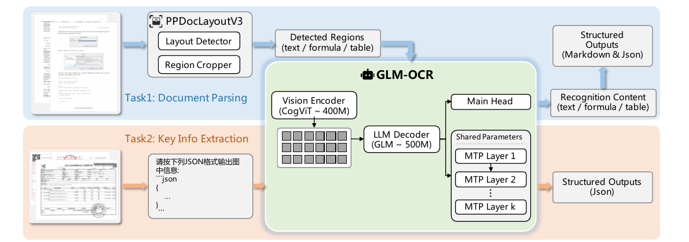
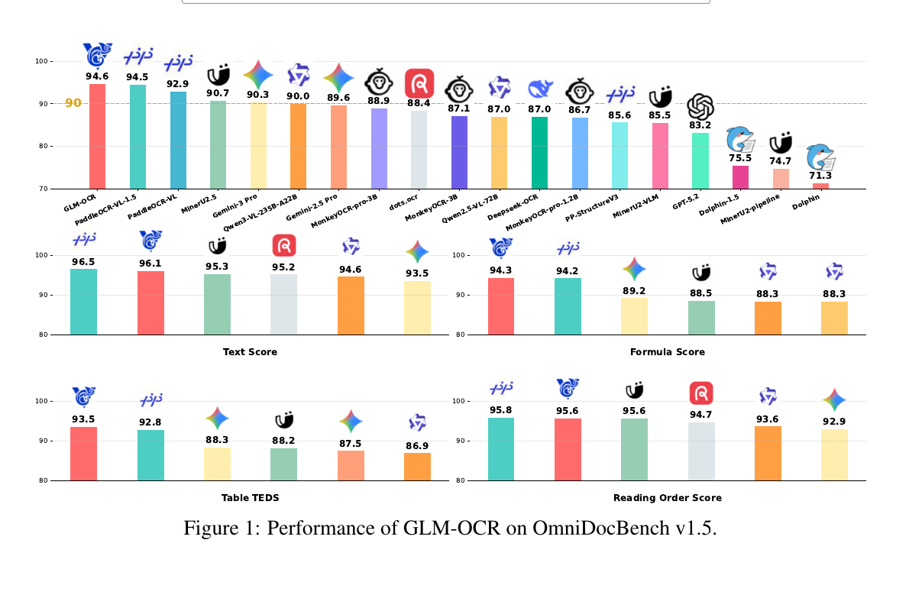

# PAPER: GLM-OCR — 0.9B 모델의 1위, 그런데 그 1위를 만든 건 모델이 아니라 파이프라인

## 0. 이 문서를 읽는 법

이 문서는 GLM-OCR technical report(arXiv 2603.10910, 16쪽)와 공개 저장소(github.com/zai-org/GLM-OCR, 파이썬 6,269줄), 그리고 HuggingFace 허브의 **`config.json` + 실제 체크포인트 `model.safetensors`의 텐서 헤더**를 **함께 대조해서** 읽고 정리한 리뷰입니다.

> **검증 방법 메모**: safetensors 파일은 맨 앞 8바이트에 헤더 길이가, 그 뒤에 "텐서 이름 → shape / 바이트 구간" JSON이 들어 있습니다. HTTP Range 요청으로 이 헤더만 뜯으면 **2.65GB를 다 받지 않고도 파라미터를 정확히 셀 수 있고**, 특정 텐서의 바이트 구간만 골라 받아 **두 텐서가 같은 값인지 직접 비교**할 수도 있습니다. 이 문서의 실측 수치(§5.2)와 "중복 가중치" 판정(§6.4)은 전부 이 방식으로 확인한 것입니다.

핵심 주장은 하나입니다.

> **GLM-OCR은 새로운 방법론 논문이 아니라 제품 릴리스 노트에 가깝다. 유일한 모델링 기여인 Multi-Token Prediction(MTP, 다중 토큰 예측)은 검증(ablation)이 하나도 없고, 논문이 자랑하는 "스텝당 5.2 토큰"은 공개된 가중치와 공개된 실행 명령으로는 산술적으로 불가능하며, "파라미터 공유로 메모리를 아꼈다"는 주장과 달리 배포된 체크포인트에는 182.5M(365MB)이 그냥 복사본으로 들어 있다. 논문 표기 0.9B의 실측은 1.325B다. OmniDocBench v1.5 종합 1위(94.62)는 사실이지만 2위와 0.12점 차이이고, 세부 5개 지표 중 3개는 오히려 진다. 실제 성능의 출처는 모델이 아니라 "레이아웃으로 잘라서 병렬 인식"이라는 시스템 설계다.**

읽는 순서는 이렇게 잡았습니다.

1. **메타 정보**(§1)와 **용어 사전**(§2)
2. **한 줄 요약**(§3)과 **핵심 기여**(§4)
3. **아키텍처**(§5): 논문이 말한 "0.4B + 0.5B = 0.9B"를 실제 체크포인트로 재검산 — **실측은 1.325B**
4. **MTP**(§6): 유일한 모델링 기여와 그 숫자가 안 맞는 지점
5. **2단계 파이프라인**(§7): 성능의 진짜 출처
6. **학습 레시피**(§8)와 **실험 결과**(§9)
7. **코드 리뷰**(§10): 논문에 없고 저장소를 봐야만 아는 실전 함정 13가지
8. **비판적 평가**(§11), **Q&A**(§12), 한 줄 요약(§13)

수식은 GitHub에서 깨지지 않도록 LaTeX 대신 일반 텍스트로 적었습니다.

```text
예: 토큰 1개가 덮는 픽셀 = patch_size(14) × spatial_merge_size(2) = 28 × 28 픽셀
    (즉 가로세로 28픽셀짜리 정사각형 하나가 vision token 한 칸이 된다는 뜻)
```

---

## 1. 메타 정보

| 항목 | 내용 |
|---|---|
| 논문 | GLM-OCR Technical Report |
| 저자 | Shuaiqi Duan, Yadong Xue, Weihan Wang, Zhe Su 외 23명 (Jie Tang 포함) |
| 소속 | **Zhipu AI**(지푸 AI, z.ai) + Tsinghua University(칭화대) |
| 공개일 | 2026-03-11 (v1) / 2026-03-16 (v2) |
| arXiv | https://arxiv.org/abs/2603.10910 |
| 코드 | https://github.com/zai-org/GLM-OCR (**SDK/추론 전용**) |
| 체크포인트 | https://huggingface.co/zai-org/GLM-OCR (BF16) |
| 데모 | https://ocr.z.ai/ |
| 분야 | Document OCR(문서 광학 문자 인식), Document Parsing(문서 구조 해석), KIE(Key Information Extraction, 핵심 정보 추출) |
| 구성 | CogViT(약 0.4B) + GLM decoder(약 0.5B) = 논문 표기 **0.9B** / **실측 1,325,258,240 = 1.325B, 파일 2.65GB** (§5 참조) |
| 외부 의존 모델 | **PP-DocLayoutV3**(PaddlePaddle의 문서 레이아웃 검출기, 실측 **33.3M**) — 파이프라인 필수, 파라미터는 0.9B에 **미포함** |
| 파생 계보 | 전처리기가 `Glm46VImageProcessor` / `Glm46VProcessor` → **GLM-4.6V 계열에서 갈라져 나온 것**이 파일 수준에서 확인됨 |
| 벤치마크 | OmniDocBench v1.5, OCRBench, UniMERNet, PubTabNet, TEDS_TEST, Nanonets-KIE, Handwritten-KIE + 사내 6종 |
| 라이선스 | 코드 Apache 2.0 / **모델 가중치 MIT** / PP-DocLayoutV3 Apache 2.0 |
| 공개 범위 | **추론 SDK + 가중치만.** 학습 코드·학습 데이터·데이터 규모·GPU 시간 전부 비공개 |
| 직접 경쟁 모델 | **PaddleOCR-VL-1.5** (arXiv 2601.21957, 같은 0.9B, 같은 PP-DocLayout 파이프라인 구조) |

---

## 2. 주요 용어 사전 (Glossary)

*본문에 들어가기 전에 걸릴 만한 용어를 먼저 풀어둡니다. 이 논문은 "디코딩을 몇 스텝에 끝내느냐"와 "페이지를 어떻게 자르느냐"가 전부라서, 이 두 갈래 용어를 안 깔면 §6과 §7이 안 읽힙니다.*

### 2.1 디코딩 속도 관련

- **autoregressive decoding(자기회귀 디코딩)**: 언어모델이 토큰을 **한 번에 하나씩** 뽑는 기본 방식. 앞 토큰이 나와야 다음 토큰을 계산할 수 있어서, 100토큰을 만들려면 100번 forward 해야 합니다.
- **MTP (Multi-Token Prediction, 다중 토큰 예측)**: 메인 예측 헤드(main head) 옆에 보조 헤드를 붙여 **다음 k개 토큰을 동시에 예측**하는 기법. DeepSeek-V3가 대중화시켰습니다.
- **speculative decoding(추측 디코딩)**: 값싼 모델(또는 보조 헤드)이 여러 토큰을 **초안(draft)** 으로 미리 만들고, 본 모델이 한 번에 검증해서 맞은 만큼 확정하는 가속 기법. 결과는 원래 모델과 동일하고 속도만 빨라집니다.
- **draft token(초안 토큰)**: 보조 헤드가 미리 찍어본 후보 토큰.
- **acceptance rate(수용률)**: 초안 토큰 중 검증을 통과해 실제로 확정된 비율. 이게 높아야 속도 이득이 납니다.
- **parameter sharing(파라미터 공유)**: 여러 MTP 헤드가 **같은 가중치 한 벌**을 돌려쓰는 것. 헤드를 k개 늘려도 GPU 메모리는 1개분만 듭니다.
- **throughput(처리량)**: 단위 시간당 처리한 양(여기서는 초당 페이지 수).

### 2.2 문서 파싱 파이프라인 관련

- **layout analysis(레이아웃 분석)**: 페이지를 보고 "여기는 문단, 여기는 표, 여기는 수식" 하고 **영역(region)을 네모로 찍어주는** 단계.
- **PP-DocLayoutV3**: PaddlePaddle이 공개한 레이아웃 검출 모델. GLM-OCR은 이걸 그대로 가져다 씁니다.
- **region-level recognition(영역 단위 인식)**: 페이지 전체를 한 번에 읽지 않고, 잘라낸 영역 하나하나를 따로 모델에 넣어 읽는 방식. 영역끼리 독립이라 **병렬 처리**가 가능합니다.
- **reading order(읽기 순서)**: 잘라낸 영역들을 어떤 순서로 이어 붙여야 원래 문서가 되는가. 2단 편집(multi-column) 문서에서 특히 어렵습니다.
- **repetitive generation(반복 붕괴)**: 작은 모델이 긴 출력을 만들다가 같은 문장/행을 무한히 되풀이하는 고장. 이 논문의 설계 동기 1번입니다.
- **hallucination(환각)**: 이미지에 없는 내용을 지어내는 것.
- **KIE (Key Information Extraction, 핵심 정보 추출)**: 영수증·송장·신고서에서 "발행일", "총액" 같은 **정해진 필드만 뽑아 JSON으로** 내놓는 작업.

### 2.3 모델 구조 관련

- **CogViT**: Zhipu가 자체 학습한 vision encoder(시각 인코더). GLM-V 계열에서 쓰던 것.
- **patch(패치)**: 이미지를 잘게 자른 정사각형 조각. 여기서는 14×14 픽셀.
- **spatial merge(공간 병합)**: 인접한 패치 여러 개(여기서는 2×2)를 하나의 토큰으로 합쳐 토큰 수를 줄이는 것.
- **connector / projector(연결기)**: 인코더 출력 차원을 디코더의 hidden size(은닉 차원)에 맞춰주는 다리.
- **GQA (Grouped-Query Attention, 그룹 질의 어텐션)**: 어텐션의 Key/Value 헤드 수를 Query보다 적게 두어 KV cache(키-값 캐시) 메모리를 줄이는 기법. 여기서는 Q 16개 : KV 8개(2:1).
- **mRoPE (multimodal Rotary Position Embedding, 멀티모달 회전 위치 임베딩)**: 위치 정보를 시간/세로/가로 축으로 쪼개서 넣는 방식. config의 `[16, 24, 24]`가 그 배분입니다.
- **tie_word_embeddings(입출력 임베딩 묶기)**: 입력 단어 임베딩과 출력 예측층 가중치를 공유할지 여부. **false면 두 벌을 따로** 들고 있어 파라미터가 두 배로 듭니다.

### 2.4 평가 지표 관련

- **OmniDocBench v1.5**: 문서 파싱 종합 벤치마크(CVPR 2025). 텍스트/수식/표/읽기순서를 각각 재고 종합 점수를 냅니다.
- **edit distance(편집 거리)**: 두 문자열을 같게 만들려면 몇 번 고쳐야 하는지. **낮을수록 좋음.**
- **TEDS (Tree-Edit-Distance-based Similarity, 트리 편집거리 유사도)**: 표를 HTML 트리로 보고 비교하는 지표. **높을수록 좋음.** TEDS-S는 셀 내용을 빼고 **구조만** 보는 변형.
- **CDM (Character Detection Matching)**: 수식(LaTeX)을 문자열이 아니라 **렌더링 결과로** 비교하는 지표. 표기 차이에 덜 민감합니다.
- **abandon(버림) 카테고리**: OmniDocBench가 **평가에서 제외**하는 영역 묶음 — 머리글(header), 바닥글(footer), 쪽번호(page number), 각주(page footnote). 모델마다 처리 관행이 달라 공정성 문제가 생기므로 무시합니다. **이 목록이 §10에서 중요해집니다.**

---

## 3. 논문 요약 (TL;DR)

**한 줄**: 0.9B짜리 작은 VLM에 레이아웃 검출기를 앞에 붙여 페이지를 잘라 병렬로 읽게 하고, 디코딩에 MTP를 얹어 속도를 올린 **실전 배포용 OCR 시스템**.

**핵심 문제**: 문서 이해를 잘하려면 큰 멀티모달 모델(MLLM)을 써야 하는데, 크면 느리고 비싸서 고동시성·엣지 배포가 안 된다. 반대로 작은 모델은 복잡한 레이아웃에서 환각과 반복 붕괴를 일으킨다.

**해결책 3종**:
1. **레이아웃으로 문제를 쪼갠다** — 복잡한 페이지 하나를 단순한 영역 여러 개로 분해하면 작은 모델도 안정적이고, 게다가 병렬 처리가 된다.
2. **MTP로 디코딩을 줄인다** — OCR은 창작이 아니라 결정론적 전사이므로, 한 토큰씩 뽑는 건 낭비다.
3. **작업별 보상으로 RL** — 편집거리/CDM/TEDS/필드 F1에 "태그 닫힘·JSON 파싱·반복 비율" 검증을 얹어 GRPO로 다듬는다.

**검증**: OmniDocBench v1.5 종합 94.62로 전체 1위(2위 PaddleOCR-VL-1.5 94.50, Gemini-3 Pro 90.33, Qwen3-VL-235B 89.15). 사내 벤치 6개 중 5개 1위, 특히 인장(seal) 인식 90.5 vs 차순위 오픈모델 63.0.

**이 리뷰의 판정**: 시스템 엔지니어링은 훌륭하고 코드 품질은 논문보다 낫다. 그러나 **ablation이 단 하나도 없어** 기여 주장이 전부 무근거로 남고, 속도 수치는 공개 설정으로 재현 불가하며, 종합 1위는 세부 지표 하나(표)로 만든 결과다.

---

## 4. 핵심 기여 (Contributions)

논문이 내세우는 것과, 그것이 실제로 검증됐는지를 같이 적습니다.

| # | 논문의 주장 | 실제 검증 여부 |
|---|---|---|
| 1 | 0.9B 컴팩트 멀티모달 모델로 SOTA 달성 | ❌ **실측 1.325B.** 경쟁자 PaddleOCR-VL은 전부 포함한 0.96B라 **동급 비교가 아님**(§5) |
| 2 | OCR에 MTP를 도입해 학습 효율·디코딩 처리량 개선 | ⚠️ 속도 주장 있음, **재현 불가**(§6.3). 정확도 영향 **측정 없음** |
| 3 | MTP가 구조 토큰의 지역 의존성을 학습해 "깨진 태그"가 줄어듦 | ❌ **증거 0.** 측정도 ablation도 없음 |
| 4 | 파라미터 공유로 MTP의 메모리 오버헤드 억제 | ⚠️ **절반만 사실.** 모듈은 1개(`num_nextn_predict_layers: 1`) 맞지만, 그 안에 임베딩·출력층 **복사본 182.5M이 별도로 들어 있음**(§6.4) |
| 5 | 레이아웃 분석 + 병렬 영역 인식의 2단계 파이프라인 | ✅ 코드로 완전 구현·공개. **실질적으로 성능의 주 출처**(§7) |
| 6 | 작업별 보상 설계로 구조 출력 신뢰성 향상(GRPO) | ⚠️ 설계는 구체적, **기여도 측정 없음** |

---

## 5. 아키텍처 — 논문의 "0.9B"를 실제 체크포인트로 재검산

*논문은 "CogViT 0.4B + GLM 0.5B = 0.9B"라고만 쓰고 넘어갑니다. 그런데 이 숫자가 어디까지 세고 어디부터 안 셌는지가 "0.9B로 235B를 이겼다"와 "같은 0.9B인데 PaddleOCR-VL을 이겼다"는 두 서사의 신뢰도를 동시에 좌우하기 때문에, 공개된 체크포인트의 텐서를 하나하나 직접 세어봅니다.*



*(Figure 2 — 위쪽 Task 1은 PPDocLayoutV3로 자른 뒤 GLM-OCR Core로 영역별 인식, 아래쪽 Task 2는 프롬프트만으로 JSON 추출. 오른쪽 초록 상자 안의 "Shared Parameters — MTP Layer 1..k"가 §6의 주인공입니다.)*

### 5.1 HuggingFace config.json 실측

| 부품 | 실제 값 |
|---|---|
| 비전 (`glm_ocr_vision`) | hidden 1024, **24층**, heads 16, FFN 4096, patch 14, spatial_merge 2, temporal_patch 2, out_hidden 1536 → **토큰 1개 = 28×28 픽셀** |
| 디코더 (`glm_ocr_text`) | hidden 1536, **16층**, heads 16(head_dim 128), **KV heads 8 (GQA 2:1)**, FFN 4608, vocab 59,392, max_position 131,072, **mRoPE [16, 24, 24]** |
| MTP | **`num_nextn_predict_layers: 1`** |
| 임베딩 | **`tie_word_embeddings: false`** → 입력/출력 각각 91.2M |

### 5.2 재검산 결과 — 실측 1.325B

체크포인트의 텐서를 접두어별로 묶어 전부 더한 결과입니다. **추정이 아니라 파일에서 읽은 값**입니다.

| 텐서 그룹 | 텐서 개수 | 파라미터 | 논문 대응 |
|---|---:|---:|---|
| `model.visual.blocks` (24층) | 336 | 403.02M | **"CogViT 0.4B"** ✅ |
| `model.visual.merger` | 6 | 23.60M | 논문 누락 ❌ |
| `model.visual.downsample` | 2 | 6.29M | 논문 누락 ❌ (= "efficient token downsampling") |
| `model.visual.patch_embed` | 2 | 1.21M | 논문 누락 ❌ |
| `model.language_model.layers` (16층 + **MTP 1층**) | 176 | 708.68M | 이 중 16층분 490.8M만 **"GLM 0.5B"** ✅ |
| `model.language_model.embed_tokens` | 1 | 91.23M | 논문 누락 ❌ |
| `lm_head.weight` | 1 | 91.23M | 논문 누락 ❌ |
| **합계** | **525** | **1,325,258,240 (1.325B)** | 논문 표기 **0.9B** |

```text
논문의 "0.9B" = 비전 블록 403M + 디코더 16층 491M = 894M ≈ 0.9B
빠진 것들     = 커넥터 31.1M + 임베딩·출력층 182.5M + MTP 모듈 217.9M = 431.5M
──────────────────────────────────────────────────────────────────────
실제 다운로드 파일 = model.safetensors 2,650,579,464 바이트 = bf16 기준 1.325B
```

즉 논문의 **"0.9B"는 비전 블록과 디코더 층만 더한 숫자**이고, **커넥터·임베딩·MTP 모듈 431.5M(전체의 33%)이 통째로 빠져 있습니다.** 여기에 파이프라인 필수인 PP-DocLayoutV3 33.3M은 아예 별도로, 실제 배포 시에는 모델 두 개를 동시에 띄웁니다.

특히 MTP 모듈이 **31M이 아니라 217.9M**인 이유는 그 안에 임베딩과 출력층 복사본이 따로 들어 있기 때문인데, 이건 논문 주장과 정면으로 부딪히므로 §6.4에서 따로 다룹니다.

### 5.3 "같은 0.9B끼리 붙어서 이겼다"가 성립하지 않는 이유 ⭐

*이 소절을 두는 이유: 논문 Table 4는 GLM-OCR과 PaddleOCR-VL-1.5를 나란히 `0.9B`로 적어 "동급 대결"의 그림을 만드는데, 그 전제가 맞는지 확인해야 0.12점 차이를 어떻게 읽을지 정해지기 때문입니다.*

경쟁 모델의 체크포인트도 같은 방식으로 세어봤습니다.

| 모델 | 논문/표 표기 | HuggingFace 실측 | 표기가 정직한가 |
|---|---|---:|---|
| **GLM-OCR** | 0.9B | **1,325,258,240 (1.325B)** | ❌ 33% 누락 |
| **PaddleOCR-VL** | 0.9B | **958,588,736 (0.96B)** | ✅ 전부 포함한 총합 |
| PP-DocLayoutV3 (둘 다 사용) | 언급 없음 | 33,288,957 (33.3M) | — |

```text
Table 4가 보여주는 구도 :  0.9B  vs  0.9B   → "같은 크기인데 우리가 이겼다"
실제 구도             :  1.33B vs  0.96B  → GLM-OCR이 38% 더 큼
```

**이전 판단 정정**: 이 문서의 이전 버전은 "PaddleOCR-VL도 같은 방식으로 세니 업계 관행"이라고 적었는데, 실제로 체크포인트를 열어보니 **PaddleOCR-VL의 0.9B는 임베딩까지 전부 포함한 정직한 총합**이었습니다. 관행이 아니라 **GLM-OCR 쪽만의 관대한 회계**입니다. 종합 점수 차이가 0.12점(§9.1)이라는 걸 감안하면, 이 38% 크기 차이는 무시할 수 있는 항목이 아닙니다.

---

## 6. MTP — 유일한 모델링 기여, 그런데 숫자가 안 맞습니다

*이 절을 따로 두는 이유: MTP는 이 논문에서 "시스템 조립"이 아니라 "모델링"이라고 부를 수 있는 유일한 항목이고, 동시에 검증이 가장 부실한 항목이기 때문입니다.*

### 6.1 아이디어

OCR은 창작이 아니라 **결정론적 전사(deterministic transcription)** 입니다. 이미지에 "안녕하세요"가 적혀 있으면 답은 하나뿐이라, 한 토큰씩 조심조심 뽑는 autoregressive decoding은 낭비입니다.

그래서 메인 헤드(main head) 옆에 보조 헤드 k개를 붙여 다음 k개 토큰을 동시에 예측하고, 맞은 만큼 한 스텝에 확정합니다(speculative decoding). 메모리 폭증을 막기 위해 **헤드들이 파라미터를 공유**합니다 — Figure 2의 "Shared Parameters" 상자가 이것이고, config의 `num_nextn_predict_layers: 1`(물리 층 1개를 재귀적으로 재사용)과 정확히 일관됩니다. **여기까지는 설계가 깔끔합니다.**

논문의 부수 주장: MTP가 **구조 토큰(표 태그, 마크다운 문법)의 지역 의존성(local dependency)** 을 미리 보게 만들어 "깨진 태그"가 줄어든다.

### 6.2 문제 ①: 검증이 하나도 없습니다

"깨진 태그가 줄어든다"는 주장에 대한 측정치·ablation이 **논문 전체에 없습니다.** MTP를 끈 모델과 켠 모델의 TEDS 비교 한 줄이면 끝날 일인데 없습니다. 학습 효율 개선 주장도 마찬가지입니다.

### 6.3 문제 ②: 속도 수치가 공개 설정으로 재현 불가

논문 3쪽 원문 주장:

> "GLM-OCR is trained to predict **ten tokens per step** and generates **5.2 tokens per decoding step** at inference, bringing approximately **50% throughput improvement**."

그런데 README가 안내하는 실행 명령은 이렇습니다.

```bash
# vLLM
vllm serve zai-org/GLM-OCR --speculative-config '{"method": "mtp", "num_speculative_tokens": 3}'
#                                                              └─ 초안 3개

# SGLang
sglang serve --model-path zai-org/GLM-OCR --speculative-algorithm NEXTN \
  --speculative-num-steps 3 --speculative-eagle-topk 1 --speculative-num-draft-tokens 4
#                                                       └─ 초안 4개
```

```text
스텝당 최대 확정 토큰 = 초안 토큰 3개 + 메인 헤드 1개 = 4개
논문 주장                                            = 5.2개
→ 4 < 5.2 이므로 공개된 명령으로는 산술적으로 도달 불가
```

즉 **공개된 가중치 + 공개된 실행 명령으로는 5.2 토큰/스텝이 원천적으로 나올 수 없습니다.** 사내 측정은 더 큰 k(초안 토큰 수)를 쓴 다른 설정이었다는 뜻인데, 그 설정이 논문에도 README에도 없습니다. "50% 처리량 개선"도 같은 이유로 검증할 수 없습니다.

그리고 배포 설정이 3인 것 자체가 정보입니다 — **초안을 4개 이상 늘려도 이득이 없다**는 걸 팀이 이미 알고 있다는 뜻인데, 그 수용률(acceptance rate) 곡선을 보여주는 표가 논문에 없습니다.

### 6.4 문제 ③: "파라미터 공유"인데 복사본을 들고 있습니다 ⭐

*이 소절을 두는 이유: 초록이 내세운 네 가지 주장 중 "shared parameters로 메모리 오버헤드를 낮게 유지했다"만은 체크포인트로 참/거짓을 바로 판정할 수 있기 때문입니다.*

MTP 모듈(`model.language_model.layers.16`)의 텐서를 전부 뽑아보면 이렇습니다.

| 텐서 | shape | 파라미터 |
|---|---|---:|
| `layers.16.embed_tokens.weight` | [59392, 1536] | **91.23M** |
| `layers.16.shared_head.head.weight` | [59392, 1536] | **91.23M** |
| `layers.16.self_attn.{q,k,v,o}_proj` | — | 9.44M |
| `layers.16.mlp.{gate_up,down}_proj` | — | 21.24M |
| `layers.16.eh_proj.weight` | [1536, 3072] | 4.72M |
| `layers.16.{enorm, hnorm, ...}` (norm 6종) | [1536] | ~0.01M |
| **MTP 모듈 합계** | | **217.85M** |

`eh_proj`(embedding-hidden projection)가 3072 → 1536인 건 **"본체가 뱉은 hidden state"와 "다음 토큰의 임베딩"을 이어붙여(concat) 다시 1536으로 눌러주는 다리**입니다. DeepSeek-V3의 MTP 모듈 구조 그대로입니다.

**핵심은 위쪽 두 줄입니다.** MTP 모듈이 본체와 임베딩을 "공유"한다면 저 두 텐서는 파일에 있을 이유가 없습니다. 정말 값이 같은지 확인하려고 본체의 `embed_tokens` / `lm_head`와 **바이트 단위로 직접 비교**했습니다(각 텐서의 앞 200KB와 뒤 200KB를 Range 요청으로 받아 대조).

```text
model.language_model.embed_tokens.weight  vs  layers.16.embed_tokens.weight
    크기 182,452,224 바이트 / 182,452,224 바이트   앞 200KB 동일? True   뒤 200KB 동일? True
lm_head.weight                            vs  layers.16.shared_head.head.weight
    크기 182,452,224 바이트 / 182,452,224 바이트   앞 200KB 동일? True   뒤 200KB 동일? True
```

**완전히 동일한 값입니다.** 즉 **182.5M 파라미터(bf16으로 365MB)가 순수 중복**으로 파일에 들어 있습니다.

```text
체크포인트 총량      1,325.3M
중복 제거 시 고유량  1,142.8M   (= 1,325.3 − 182.5)
중복 비율           체크포인트의 13.8%, 파일 크기로 365MB
```

이걸 어떻게 볼 것인가:

- **논문 주장과의 관계**: 초록의 "keeping memory overhead low through **shared parameters**"는 문맥상 *"k개 draft 단계가 모듈 하나를 돌려쓴다"* 는 뜻으로 읽는 게 맞고, 그건 `num_nextn_predict_layers: 1`로 사실입니다. 하지만 **읽는 사람이 자연스럽게 기대하는 "본체와 임베딩·출력층을 공유한다"는 배포물에서 지켜지지 않았습니다.**
- **실전 영향**: vLLM·SGLang의 DeepSeek-MTP 로더는 이 텐서들을 **별도 모듈로 로드**합니다. 엔진이 따로 묶어주지 않는 한 **365MB가 VRAM에 한 번 더 올라갑니다.** 0.9B급을 엣지에 올리겠다는 모델에서 365MB는 작은 숫자가 아닙니다.
- **정상 참작**: DeepSeek-V3 공개 가중치도 같은 형태로 복사본을 담고 있어서 **이 자체는 관행에 가깝습니다.** 다만 "메모리 오버헤드를 낮췄다"를 기여로 내세운 논문이라면 실측을 한 줄이라도 붙였어야 합니다.

---

## 7. 성능의 진짜 출처는 MTP가 아니라 파이프라인

*이 절을 두는 이유: 벤치마크 1위를 보고 "0.9B 모델이 그만큼 똑똑하구나"로 읽으면 오독이기 때문입니다. 코드를 보면 모델이 하는 일의 범위가 생각보다 좁습니다.*

### 7.1 SDK의 실제 실행 흐름

저장소 코드(`glmocr/pipeline/_workers.py`, 3단계 비동기 워커)를 보면, GLM-OCR 모델이 **페이지 전체를 한 번에 파싱하는 경로는 존재하지 않습니다.**

```text
PDF/이미지
  → 200 dpi 렌더, 긴 변 3500px 상한          (Stage 1: data_loading_worker)
  → PP-DocLayoutV3로 영역 검출 + 순서(order_seq) 산출  (Stage 2: layout_worker)
  → 영역별 crop → 영역마다 개별 API 호출 (최대 32 병렬) (Stage 3: recognition_worker)
      프롬프트는 딱 3종: "Text Recognition:" / "Table Recognition:" / "Formula Recognition:"
  → order_seq 순서대로 마크다운 재조립         (ResultFormatter)
```

### 7.2 여기서 나오는 함의 두 가지

**① 읽기 순서(reading order) 점수는 사실상 PP-DocLayoutV3의 공적입니다.** OmniDocBench의 Reading Order Edit 0.044는 레이아웃 검출기가 뱉은 `order_seq`를 그대로 정렬한 결과이고, GLM-OCR 모델은 순서 결정에 **전혀 관여하지 않습니다.**

**② 이 설계는 작은 모델의 고질병을 우회하는 장치입니다.** 논문 스스로 설계 동기 1번에서 밝힙니다 — *"소규모 모델은 복잡한 레이아웃 문서를 처리할 때 환각과 반복 생성에 매우 취약하다."* 정직한 서술이지만, 동시에 **성능이 모델보다 시스템에서 나온다**는 자백이기도 합니다. 논문 한계 6.1에서도 레이아웃 오검출 시 오류가 그대로 전파된다고 인정합니다.

### 7.3 논문이 말하지 않은 진짜 이유 — 토큰 비용

*이 소절을 두는 이유: 논문은 2단계 설계의 동기로 "환각 방지"만 이야기하는데, 코드에서 해상도 처리를 따라가 보면 애초에 **한 장을 통째로 넣는 게 물리적으로 무리**라는 더 단순한 이유가 나오기 때문입니다.*

`glmocr/utils/image_utils.py`의 `load_image_to_base64`는 이미지를 넘기기 전에 가로·세로를 **28의 배수로 반올림**합니다.

```text
h_factor = w_factor = 14 × 2 × patch_expand_factor(=1) = 28
  → patch_size(14) × spatial_merge_size(2) = 토큰 1개가 28×28 픽셀을 담당
```

이 값으로 A4 한 장을 계산해 보면:

```text
A4를 200 dpi로 렌더 → 1654 × 2339 픽셀
vision token 수     = (1654 ÷ 28) × (2339 ÷ 28) ≈ 59 × 84 ≈ 4,950 토큰
```

**0.5B짜리 디코더에 페이지당 5천 토큰짜리 prefix(접두 문맥)를 매번 물리는 건 비현실적입니다.** 반면 문단 하나를 잘라내면 수백 토큰이면 끝나고, 게다가 영역끼리 독립이라 32개를 동시에 던질 수 있습니다(`max_workers: 32`).

즉 2단계 파이프라인은 "작은 모델의 환각을 막는 안전장치"이기 이전에 **작은 모델로 페이지를 감당하기 위한 필수 조건**입니다. 논문이 이 계산을 보여주지 않아서, 읽는 사람은 레이아웃 단계를 "있으면 좋은 옵션"으로 오해하기 쉽습니다.

---

## 8. 학습 레시피

*이 절을 두는 이유: 논문에서 실제로 따라 해볼 만한 정보가 남아 있는 유일한 부분이 RL 보상 설계이기 때문입니다.*

### 8.1 4단계 학습 (Table 1)

| 단계 | 내용 |
|---|---|
| Stage 1 | **ViT 단독 학습.** 수백억 장(tens of billions) 규모 image-text, **MIM + CLIP 이중 목적**, 더 큰 사내 ViT로부터 distillation(증류) |
| Stage 2.1 | GLM-0.5B를 붙여 공동 사전학습 (image-text, 문서 파싱, grounding, VQA) |
| Stage 2.2 | **MTP 목적 추가** 사전학습 (문서 파싱, grounding, VQA) |
| Stage 3 | **SFT** (텍스트/수식/표 인식 + KIE), MTP 유지 — 학습/추론 불일치를 막기 위해 |
| Stage 4 | **GRPO 기반 RL** |

### 8.2 RL 보상 설계 (Table 2) — 이 논문에서 가장 실용적인 부분

정확도 지표만으로는 "그럴듯하지만 파싱이 안 되는 출력"을 걸러낼 수 없기 때문에, **구조 검증 신호를 보상에 직접 넣었습니다.**

| 작업 | 주 정확도 보상 | 추가 제약 |
|---|---|---|
| 텍스트 인식 | 정규화 edit distance(편집 거리) | 반복 페널티 |
| 수식 인식 | CDM score | 구조 유효성 검사 |
| 표 인식 | TEDS score | **태그 닫힘 검증**, 구조 파싱 검사 |
| KIE | 필드 단위 F1 | **JSON 파싱 검증**, 필드 누락/중복 페널티 |
| 전역 정규화 | — | 반복 비율 페널티, 구조 오류 페널티 |

### 8.3 재현 가능성

**불가능합니다.** 데이터 규모(Stage 1의 "수백억 장" 외엔 숫자 없음), 토큰 수, GPU 시간, 데이터셋 이름이 전부 없고 학습 코드도 비공개입니다. 공개된 것은 가중치(MIT)와 추론 SDK, 그리고 LLaMA-Factory 기반 fine-tuning 예제뿐입니다.

---

## 9. 실험 결과 — 어떻게 읽어야 하나

*이 절을 두는 이유: "종합 1위"라는 한 줄과 세부 표가 서로 다른 이야기를 하기 때문입니다.*



### 9.1 OmniDocBench v1.5 세부 (Table 4) — 1위지만 세부는 3패

화살표 방향에 주의하세요. **Edit(편집 거리)은 낮을수록 좋고, CDM·TEDS는 높을수록 좋습니다.**

| 항목 | GLM-OCR (표기 0.9B / **실측 1.33B**) | PaddleOCR-VL-1.5 (**실측 0.96B**) | 승자 |
|---|---|---|---|
| **Overall** | **94.62** | 94.50 | GLM (+0.12) |
| Text Edit ↓ | 0.040 | **0.035** | Paddle |
| Formula CDM ↑ | 93.90 | **94.21** | Paddle |
| Table TEDS ↑ | **93.96** | 92.76 | **GLM** |
| Table TEDS-S ↑ | **96.39** | 95.79 | **GLM** |
| Reading Order Edit ↓ | 0.044 | **0.042** | Paddle |

**세부 5개 중 3개는 PaddleOCR-VL-1.5가 이깁니다.** 종합 1위는 **표 인식에서 1.2점 벌어 종합 0.12점을 만든 결과**이고, 0.12는 벤치마크 노이즈 수준입니다. 논문 본문도 이걸 알고 *"뛰어난 표 파싱 능력이 최상위 자리를 확보해줬다"* 고 솔직하게 씁니다만, 초록과 README의 "**#1 overall**" 한 줄이 그 뉘앙스를 전부 지웁니다.

여기에 §5.3의 실측을 겹치면 구도가 한 번 더 바뀝니다 — **3패를 당한 쪽이 오히려 38% 작은 모델**입니다.

참고로 범용 VLM은 MinerU2.5 90.67, Gemini-3 Pro 90.33, Qwen3-VL-235B 89.15, GPT-4o 75.02입니다. "0.9B가 235B를 이긴다"는 서사는 수치상 맞지만, 이 벤치마크가 **구조화된 마크다운 출력 형식에 특화**되어 범용 VLM에 불리하다는 점을 감안해야 합니다.

### 9.2 공개 벤치마크 종합 (Table 3)

| 데이터셋 | GLM-OCR | 최고 경쟁자 |
|---|---|---|
| OmniDocBench v1.5 | **94.6** | PaddleOCR-VL-1.5 94.5 |
| OCRBench (Text) | **94.0** | dots.ocr 92.1 |
| UniMERNet (수식) | **96.5** | PaddleOCR-VL-1.5 96.1 |
| PubTabNet (표) | 85.2 | **MinerU 2.5 88.4** |
| TEDS_TEST | **86.0** | MinerU 2.5 85.4 |
| Nanonets-KIE | **93.7** | (오픈 경쟁자 수치 없음) |
| Handwritten-KIE | **86.1** | (오픈 경쟁자 수치 없음) |

### 9.3 사내 실무 벤치마크 (Table 5) — 여기가 진짜 강점, 단 회색 열을 봐야 합니다

| 작업 | GLM-OCR | PaddleOCR-VL-1.5 | GPT-5.2 | *Gemini-3 Pro (회색 처리)* |
|---|---|---|---|---|
| 인장(Seal) 인식 | 90.5 | 42.2 | 58.8 | ***91.3*** |
| 다국어 텍스트 | 69.3 | 54.8 | 70.1 | ***86.2*** |
| 실제 환경 표 | **91.5** | 86.1 | 86.7 | *90.6* |
| 코드 문서 | 84.7 | 75.8 | 84.4 | ***86.9*** |
| 영수증 KIE | 94.5 | — | 83.5 | ***97.3*** |
| 손글씨 | 87.0 | **87.4** | 78.0 | ***90.0*** |

인장 인식에서 차순위 오픈모델(dots.ocr 63.0)을 27.5점 차로 앞서는 건 데이터 큐레이션의 승리로 보입니다. 실무 도입 관점에서 논문의 공개 벤치마크 표보다 이쪽이 더 의미 있습니다.

**다만 프레이밍을 정확히 읽어야 합니다.** 논문은 "6개 중 5개에서 최고점"이라고 쓰는데, 정확히는 ***오픈웨이트 모델 한정*** 입니다. 회색으로 처리해 순위에서 제외한 Gemini-3 Pro는 **6개 중 5개에서 GLM-OCR을 이깁니다.** 특히 다국어는 **69.3 vs 86.2로 17점 차**인데, 본문은 이걸 *"다양한 언어 환경에서 뛰어나다(excels in diverse linguistic contexts)"* 로 서술합니다. 그리고 이 사내 벤치마크는 **공개되지 않아 검증이 불가능**합니다.

그 다국어 주장을 외부 데이터로 검증할 방법이 있습니다 → §9.5.

### 9.4 신뢰가 걸리는 지점 3가지

1. **베이스라인 설정 의심**: Table 3에서 Deepseek-OCR2의 OCRBench(Text)가 **34.7**로 나옵니다. 같은 모델의 다른 지표(OmniDocBench 91.1)는 정상인데 이것만 붕괴 수준 — 프롬프트/파싱 설정 문제일 가능성이 높습니다.
2. **처리량 표의 미설명 역전**(Table 6): 이미지 입력 0.67 pages/s인데 **PDF 입력이 1.86 pages/s로 2.8배 빠릅니다.** "동일 하드웨어, 단일 replica, 단일 동시성"이라고만 쓰고 **GPU 모델명조차 없으며**, 이 역전에 설명이 없습니다. (PDF는 200dpi·3500px 상한으로 렌더되어 입력이 더 작기 때문일 가능성이 크지만 명시되지 않음.)
3. **운영 비용 주장**: MaaS 가격은 입출력 통합 100만 토큰당 0.2 RMB, "1 RMB로 A4 스캔 2,000장 또는 10페이지 PDF 200개, 기존 OCR 대비 약 1/10 비용". 이건 가격 정책이지 기술 결과가 아닙니다.

### 9.5 논문에 없는 제3자 평가 — HF 저장소에 조용히 들어 있습니다 ⭐

*이 소절을 두는 이유: 사내 벤치마크는 검증할 수 없고 논문 표는 유리한 것만 골랐을 수 있는데, HuggingFace 저장소의 숨은 폴더 `.eval_results/`에 **외부 사용자·외부 리더보드가 매긴 점수**가 들어 있어 교차 검증이 가능하기 때문입니다.*

#### MDPBench (다국어 문서 파싱) — 전체 67.3

| 잘하는 쪽 | 점수 | 무너지는 쪽 | 점수 |
|---|---:|---|---:|
| 영어 (en) | 84.5 | **아랍어 (ar)** | **21.7** |
| 이탈리아어 (it) | 82.8 | **태국어 (th)** | **27.4** |
| 독일어 (de) | 82.7 | **힌디어 (hi)** | **39.6** |
| 네덜란드어 (nl) | 80.2 | 한국어 (ko) | 61.2 |
| 인도네시아어 (id) | 79.7 | 러시아어 (ru) | 64.2 |
| 중국어 간체 (zh) | 78.5 | 일본어 (jp) | 65.5 |
| **라틴 문자 평균** | **78.7** | **비라틴 문자 평균** | **54.3** |

논문의 다국어 각주를 다시 보면 대상이 **중국어·영어·프랑스어·스페인어·러시아어·독일어·일본어·한국어 8개**로 명시돼 있고, HuggingFace 모델 태그(`zh, en, fr, es, ru, de, ja, ko`)도 정확히 같은 8개입니다. 즉 이 모델의 "multilingual(다국어)"은 **그 8개 한정**이고, 그 밖의 문자 체계(아랍 문자, 태국 문자, 데바나가리)는 **사실상 미지원**으로 보는 게 맞습니다.

**한국어 61.2**는 "되긴 되는데 좋지는 않다" 수준입니다. 한국어 문서가 주력이면 이 점수를 기준으로 판단하세요.

#### olmOCR-bench — 전체 75.2

| 항목 | 점수 | 해석 |
|---|---:|---|
| baseline | 98.8 | 기본 케이스는 거의 만점 |
| long_tiny_text (작은 글씨 대량) | 86.9 | 강함 |
| arxiv_math (논문 수식) | 80.7 | 강함 |
| table_tests | 77.6 | 강함 |
| multi_column (다단 편집) | 76.7 | 무난 |
| old_scans_math | 68.3 | 하락 시작 |
| **old_scans (오래된 스캔본)** | **37.6** | **붕괴** |

`old_scans` 37.6은 논문 한계 6.2의 *"극저해상도·심하게 왜곡된 문서에서 열화"* 가 빈말이 아니라는 **정량 증거**입니다. 오래된 스캔본이나 사진 촬영본이 주 대상이라면 이 모델은 후보에서 빼는 게 맞습니다. (참고로 이 평가는 `notes` 필드에 *"Headers & Footers 카테고리 제외, ZAI API 사용"* 이라고 적혀 있습니다 — §10 ①의 `abandon` 설정과 맞물리는 대목입니다.)

---

## 10. 코드 리뷰 — 논문에 없고 저장소를 봐야만 아는 함정 13가지

*이 절을 두는 이유: 이 시스템을 실제로 붙여 쓸 때 사고가 나는 지점은 전부 논문이 아니라 `config.yaml`과 후처리 코드에 있기 때문입니다.*

### ① 기본 설정이 머리글/바닥글/각주/쪽번호를 통째로 버립니다 ⭐

`glmocr/config.yaml`의 `label_task_mapping.abandon`:

```yaml
abandon:
  - header, footer, number, footnote, aside_text, reference, footer_image, header_image
```

그리고 이 목록은 **OmniDocBench가 평가에서 무시하는 카테고리와 정확히 일치**합니다. 벤치마크에는 무해하지만, 계약서 각주나 페이지 번호가 필요한 실무에서는 **경고 없이 사라집니다.** → 도입 전에 이 목록부터 고치세요.

### ② 차트/이미지는 인식하지 않습니다

`skip: [chart, image]` — 크롭해서 파일로 저장만 하고 내용은 읽지 않습니다. 차트 수치 추출이나 이미지 캡션 생성은 **없습니다.** "문서 이해(document understanding)"라는 이름보다는 "텍스트·표·수식 전사"에 가깝습니다.

### ③ greedy 디코딩인데 repetition_penalty가 걸려 있습니다

```yaml
temperature: 0.0
top_p: 0.00001
top_k: 1              # ← 여기까지가 완전 greedy
repetition_penalty: 1.1   # ← 그런데 반복 페널티도 같이 켜져 있음
```

반복 붕괴 방어책인 건 알겠는데, **같은 값이 정당하게 반복되는 표**(예: "N/A"만 있는 열, 0.00이 연속되는 재무제표)에서는 정답 토큰의 확률을 깎습니다.

### ④ 반복이 감지되면 그 뒤를 통째로 잘라냅니다 ⭐

`glmocr/utils/result_postprocess_utils.py`의 `clean_repeated_content`:

```text
(a) 2048자 이상 결과에서, 10자 이상 패턴이 10회 이상 반복되면 → 그 지점 이후 전부 삭제
(b) 동일 라인이 10회 이상 등장하고 그것이 전체 라인의 80% 이상이면 → 그 지점에서 절단
```

**정상적인 표에서도 데이터가 소실될 수 있는 구조입니다.** 동일 행이 반복되는 명세서·재고표가 위험합니다.

### ⑤ 점·밑줄 3개 초과는 3개로 축약됩니다

`_clean_content`가 `.`, `·`, `_`, `\_`의 3회 초과 반복을 3회로 줄입니다. **목차의 점선 리더**(dot leader)와 **빈칸 밑줄이 있는 서식 문서**가 훼손됩니다.

### ⑥ 제목 계층이 2단계뿐입니다

`doc_title → #`, `paragraph_title → ##` 두 가지만 매핑됩니다. 1.1.1 같은 **절 계층(section hierarchy)이 전부 평탄화**됩니다.

### ⑦ 해상도 상한이 세 군데에서 전부 다릅니다

같은 "입력 이미지 최대 크기"를 말하는 숫자가 세 개이고, **셋 다 값이 다릅니다.**

| 출처 | 값 | 정체 |
|---|---:|---|
| SDK `config.yaml`의 주석 | 1,003,520 | `14 * 14 * 4 * 1280` — 주석대로 계산한 값 |
| SDK `config.yaml`의 실제 `max_pixels` | **71,372,800** | 주석보다 **71배** 큼 |
| 모델 `preprocessor_config.json`의 `longest_edge` | **9,633,792** | `14 * 14 * 4 * 12288` = **비전 토큰 12,288개**가 진짜 상한 |

```text
SDK가 거는 상한 71,372,800  >  모델이 거는 상한 9,633,792   (7.4배)
→ SDK 값은 절대 걸리지 않는 죽은 상한이고, 실효 상한은 서버 쪽 12,288 토큰
```

게다가 `smart_resize`가 `t=2`(temporal_patch_size)로 호출돼 픽셀을 **2배로 세어** 비교하므로, SDK 상한은 실질 35.7 메가픽셀입니다. A4를 200 dpi로 렌더해도 3.9 메가픽셀이라 어차피 안 걸립니다. **결론: 이 설정을 조절해봐야 아무 일도 일어나지 않고, 실제로 자르는 건 모델 쪽 12,288 토큰 상한입니다.**

### ⑧ 죽은 설정값(dead config)

`image_expect_length: 6144`는 `config.yaml` → `PageLoaderConfig` → `PageLoader.__init__`까지 실려 오지만 **어디에서도 사용되지 않습니다.**

### ⑨ 인식 실패가 조용합니다 ⭐

`_handle_future_result`에서 HTTP 오류가 나면 해당 영역은 `content = None`이 되고, 마크다운 조립 시 `elif content:`에서 걸러져 **그냥 사라집니다.** 경고 로그만 남고 결과 객체에는 실패 표시가 없어서, **일부 영역이 누락된 결과와 정상 결과를 구분할 방법이 없습니다.**

### ⑩ Fine-tuning 예제가 MTP를 건드리지 않습니다

`examples/finetune/glm_ocr_full_sft.yaml`:

```yaml
freeze_vision_tower: true
freeze_multi_modal_projector: true
freeze_language_model: false   # ← LM만 학습
cutoff_len: 2048               # ← 추론 기본값 max_tokens 8192와 불일치
```

LLaMA-Factory 경로에 **MTP 층을 갱신하는 로직이 없습니다.** 메인 헤드만 이동하면 draft 헤드와 어긋나 acceptance rate(수용률)가 떨어지고, **속도 이점이 줄어들 수 있습니다.** 또 긴 표를 학습시키려면 `cutoff_len`부터 올려야 합니다.

### ⑪ 읽기 순서는 모델이 아니라 레이아웃 검출기가 결정합니다

→ §7.2 ① 참조.

### ⑫ 사소한 불일치

`nms()` 함수의 기본 `iou_diff`는 0.95인데, 실제 호출부는 0.98을 넘깁니다. 동작에 큰 영향은 없지만 의도가 불분명합니다.

### ⑬ 기본값이 "문서를 지푸 클라우드로 전송"입니다 ⭐

`glmocr/config.py`의 `MaaSApiConfig`:

```python
# Enable MaaS mode (passthrough to Zhipu cloud API)
# Default: True — MaaS is the default mode after `pip install glmocr` (no GPU needed)
enabled: bool = True
api_url: str = "https://open.bigmodel.cn/api/paas/v4/layout_parsing"
```

즉 `pip install glmocr` 직후의 기본 동작은 **로컬 처리가 아니라 문서를 지푸 클라우드로 올려 보내는 것**입니다. 팀은 의도적으로 그렇게 했고 주석에도 밝혀뒀습니다(GPU 없이 바로 쓰게 하려는 것).

문제는 **README에 실린 예시 yaml이 정반대로 적혀 있다**는 점입니다.

```yaml
pipeline:
  maas:
    enabled: false # Disable MaaS mode (default)   ← 실제 코드 기본값은 true
```

API 키가 없으면 에러가 나므로 **조용히 유출되지는 않습니다.** 다만 사내 문서·계약서를 다루는 환경이라면, 문서만 믿고 "기본이 로컬"이라고 생각하면 안 됩니다. 자체 호스팅을 쓸 거라면 `maas.enabled: false`를 **명시적으로 적어두세요.**

---

## 11. 비판적 평가

*이 절을 두는 이유: 위의 개별 관찰들을 "그래서 이 논문/모델을 어떻게 대할 것인가"로 묶기 위해서입니다.*

### 11.1 좋은 점

- **개방성**: 가중치 MIT, 코드 Apache 2.0. 0.9B급 문서 OCR에서 상당히 관대한 편입니다.
- **SDK 완성도가 논문보다 높습니다**: 3단계 큐 기반 비동기 파이프라인, PDF 스트리밍 렌더링(한 페이지 렌더되면 즉시 큐로), 입력 단위(unit)별 조기 결과 방출, 재시도/지수 백오프, MaaS·vLLM·SGLang·Ollama·MLX 전방위 지원, 레이아웃 모델만 CPU로 내리는 옵션까지. **실무 배포를 진짜로 해본 팀의 코드**입니다.
- **틈새 성능은 진짜입니다**: 인장, 영수증 KIE, 다국어, 코드 문서.
- **한계 섹션(6장)이 정직합니다**: 레이아웃 오류 전파, 저해상도 열화, 출력 형식의 확률적 변동을 스스로 인정합니다.

### 11.2 나쁜 점

- **ablation이 단 하나도 없습니다.** MTP의 정확도 영향, RL의 기여, 레이아웃 유무 비교 — 전부 미측정. technical report라는 장르를 감안해도, 기여로 내세운 항목의 검증이 0인 건 다릅니다.
- **파라미터 표기가 관대합니다.** 표기 0.9B, 실측 1.325B(§5.2). 경쟁자 PaddleOCR-VL은 전부 포함한 0.96B라서, Table 4의 "동급 대결"은 실제로 **1.33B vs 0.96B**입니다(§5.3).
- **"shared parameters로 메모리 절감"이 배포물에서 지켜지지 않습니다** — 임베딩·출력층 복사본 182.5M(365MB)이 그대로 들어 있습니다(§6.4).
- **MTP는 DeepSeek-V3를 그대로 인용**한 것이고, 새로움은 "OCR 도메인에 적용"뿐입니다.
- **속도 수치 재현 불가**(§6.3).
- **학습 데이터·GPU 시간·코드 비공개**로 재현 불가.
- **다국어 주장이 8개 언어 한정**이고, 그 밖의 문자 체계는 외부 평가에서 20~40점대로 무너집니다(§9.5).
- **설계가 PaddleOCR-VL-1.5와 거의 동일**합니다. 같은 PP-DocLayout 파이프라인, 같은 문제 분해. 사실상 **같은 레시피 + MTP + 더 큰 모델**이고, 종합 점수 차이는 0.12점입니다.

### 11.3 계보 정리

```text
[백본 계보]
GLM-4.5V / GLM-4.1V  ──(encoder-decoder 프레임워크, CogViT)──▶  GLM-OCR
DeepSeek-V3          ──(MTP)────────────────────────────────▶  GLM-OCR
PaddleOCR 3.0 → PP-DocLayoutV3 ──(레이아웃 검출기 그대로 사용)──▶  GLM-OCR 파이프라인

[동시대 경쟁]
PaddleOCR-VL-1.5 (0.9B, 2601.21957)  ← 거의 동일 설계, 직접 경쟁
MinerU 2.5 (1.2B)                    ← PubTabNet에서는 우위
dots.ocr / MonkeyOCR / Dolphin       ← 같은 specialized VLM 진영
DeepSeek-OCR / DeepSeek-OCR2         ← 다른 노선(optical compression, 문맥 압축)
```

### 11.4 그래서 쓸 만한가

*결론부터: 잘 맞는 용도가 분명히 있고, 안 맞는 용도도 그만큼 분명합니다. 벤치마크 1위 한 줄로 고르지 말고 아래 두 목록으로 판단하세요.*

**쓰세요**

- 중국어/영어 위주 **디지털 문서**(PDF, 깨끗한 스캔)를 **대량으로** 마크다운화해야 할 때
- **표가 많은 문서** — 이 모델의 진짜 강점은 표입니다 (TEDS 93.96은 실제로 최고)
- 도장(seal)·영수증·코드 스크린샷 같은 중국 실무 시나리오
- 비용이 중요할 때 — MaaS 100만 토큰당 0.2 RMB면 **1 RMB에 A4 스캔 약 2,000장**

**쓰지 마세요**

| 상황 | 근거 |
|---|---|
| 한국어/일본어가 주력 | MDPBench ko 61.2, jp 65.5 (§9.5) |
| 아랍어·태국어·힌디어 | 21.7 / 27.4 / 39.6 — 사실상 미지원 (§9.5) |
| 오래된 스캔본·사진 촬영본 | olmOCR-bench old_scans **37.6** (§9.5) |
| 각주·머리글·바닥글이 의미 있는 문서 | 기본 `abandon` 목록이 통째로 버림 (§10 ①) |
| 차트 내용 추출 | `skip` 처리라 **아예 읽지 않음** (§10 ②) |

**PaddleOCR-VL-1.5와 고민 중이라면** — 종합 0.12점 차는 무시하고 이렇게 고르세요.

```text
표(table)가 핵심이다        → GLM-OCR      (TEDS 93.96 vs 92.76)
텍스트·수식 정확도가 핵심이다 → PaddleOCR-VL  (Text Edit·Formula CDM·Reading Order 모두 우위)
처리량이 핵심이다           → GLM-OCR      (1.86 vs 1.22 pages/s, 단 모델이 38% 큼)
```

그리고 도입 전에 **§10의 ①(abandon 목록), ③(repetition_penalty), ④(반복 절단 로직), ⑬(MaaS 기본값) 네 가지는 반드시 검토**하세요. 기본값이 **실무 문서가 아니라 벤치마크에 맞춰져** 있습니다.

---

## 12. 💬 Q&A

### Q1. 논문은 0.9B라는데 실제 체크포인트는 왜 1.325B인가?

**커넥터·임베딩·MTP 모듈을 세지 않았기 때문**입니다.

```text
논문이 센 것 : 비전 블록 403.0M + 디코더 16층 490.8M = 893.8M ≈ "0.9B"
안 센 것     : 커넥터(merger+downsample+patch_embed) 31.1M
               임베딩 + lm_head 182.5M   (tie_word_embeddings=false 라 두 벌)
               MTP 모듈 217.9M
──────────────────────────────────────────────────────────
실측 합계    : 1,325,258,240 = 1.325B   (파일 2.65GB)
```

빠진 431.5M은 **전체의 33%** 입니다. 여기에 파이프라인 필수인 PP-DocLayoutV3 33.3M은 아예 별도로 띄웁니다.

이게 단순한 반올림 문제가 아닌 이유는 **경쟁자와의 비교 때문**입니다. Table 4는 GLM-OCR과 PaddleOCR-VL-1.5를 둘 다 `0.9B`로 적는데, PaddleOCR-VL의 체크포인트를 열어보면 **958,588,736 = 0.96B로 전부 포함한 정직한 총합**입니다. 실제 대결은 **1.33B vs 0.96B**입니다. 자세한 계산은 §5.2·§5.3.

*(이 문서의 이전 버전은 config.json만 보고 1.11B로 추정하면서 "PaddleOCR-VL도 같은 회계"라고 적었는데, 체크포인트를 직접 세어보니 둘 다 틀렸습니다. 실측이 1.325B이고, PaddleOCR-VL의 표기는 정직합니다.)*

### Q2. MTP 헤드가 k개라면서 config에는 왜 1개인가? 오류인가?

**오류가 아니라 일관됩니다.** 논문이 "헤드들이 파라미터를 공유한다(shared parameters)"고 명시했으므로, 물리적으로는 층 하나를 k번 재귀 호출하는 구조입니다(EAGLE·NEXTN 계열이 하는 방식). Figure 2의 "Shared Parameters" 상자 안에 MTP Layer 1~k가 들어 있는 그림이 정확히 이 뜻입니다.

다만 **논문 본문에 이 설명이 한 줄도 없습니다.** "k개의 파라미터 공유 보조 헤드"라고만 쓰여 있어서, 같은 가중치가 어떻게 서로 다른 미래 위치(offset)를 예측하는지는 논문만 읽어서는 알 수 없습니다. 재현하려면 config를 봐야 합니다.

진짜 문제는 헤드 개수가 아니라 **추론 시 초안 토큰 수**(→ Q3)와 **그 모듈 안에 든 복사본**(→ Q8)입니다.

### Q3. "스텝당 5.2 토큰"이 왜 재현 불가인가?

README의 실행 명령이 초안 토큰을 3개(vLLM) 또는 4개(SGLang)로 잡기 때문에, 스텝당 확정 가능한 토큰은 **최대 4개**입니다. 5.2 > 4이므로 산술적으로 불가능합니다. 사내 측정은 더 큰 설정이었을 텐데 그 설정이 어디에도 없습니다. 자세한 계산은 §6.3.

### Q3-1. "5.2 토큰/스텝"인데 왜 속도는 50%만 빨라지나?

이건 논문이 스스로 던져놓고 답하지 않은 질문입니다.

```text
스텝당 5.2 토큰을 확정한다면 → 순진하게 보면 5배 가까운 가속이어야 함
실제 주장                  → 약 50% (1.5배)
```

차이가 나는 이유는 두 가지로 볼 수 있습니다. ① 스텝 하나가 더 비싸집니다 — 초안을 만들고 본 모델로 검증하는 비용이 붙으니까요. ② **전체 지연이 디코딩이 아닌 다른 곳에 묶여 있습니다** — 비전 인코더 forward와 레이아웃 검출 단계는 MTP로 빨라지지 않습니다.

MTP가 나쁘다는 뜻이 아니라, **"MTP가 처리량을 50% 올렸다"는 서술이 오해를 부른다**는 뜻입니다. 어느 구간에서 몇 %인지 분해한 표가 논문에 없어서, 읽는 사람은 저 50%를 전부 MTP 공으로 돌리게 됩니다.

### Q4. 종합 1위인데 왜 "세부는 3패"라고 하나?

OmniDocBench v1.5의 5개 세부 지표 중 GLM-OCR이 이긴 건 표 관련 2개(TEDS, TEDS-S)뿐이고, 텍스트 편집거리·수식 CDM·읽기순서는 PaddleOCR-VL-1.5가 앞섭니다. 종합 점수 차이는 0.12점이고, 이건 표 지표에서 1.2점 번 게 종합에 반영된 결과입니다. 즉 **OmniDocBench의 종합 산식이 표에 가중치를 크게 준다**는 사실을 이용한 1위입니다. 표는 §9.1.

### Q5. 실무 도입 전에 반드시 바꿔야 할 설정만 꼽는다면?

| 설정 | 위험 | 조치 |
|---|---|---|
| `label_task_mapping.abandon` | 머리글·바닥글·각주·쪽번호가 **경고 없이 소실** | 필요한 라벨을 `text`로 옮기기 |
| `repetition_penalty: 1.1` | 정당하게 반복되는 표 값이 왜곡될 수 있음 | 표 위주 문서면 1.0으로 실험 |
| `clean_repeated_content` | 반복 감지 시 **뒤를 통째로 절단** → 데이터 소실 | `enable_*` 스위치로 끄거나 임계값 상향 |
| `maas.enabled` | 코드 기본값이 **true**(문서를 클라우드로 전송)인데 README에는 false로 적혀 있음 | 자체 호스팅이면 `false`를 **명시적으로** 적기 |

근거는 §10의 ①③④⑬.

### Q6. 이 논문에서 실제로 배울 만한 건 뭔가?

**RL 보상 설계(§8.2)** 하나입니다. "정확도 지표 + 구조 검증 신호(태그 닫힘, JSON 파싱, 반복 비율)"를 보상에 같이 넣는 방식은 구조화 출력이 필요한 어떤 작업에도 그대로 옮길 수 있고, 이 논문에서 유일하게 구체적으로 서술된 방법론입니다.

### Q7. GLM-OCR과 DeepSeek-OCR은 같은 계열인가?

**아닙니다. 목표가 다릅니다.** DeepSeek-OCR은 "긴 텍스트를 이미지로 렌더링해서 토큰 수를 줄일 수 있는가"라는 **문맥 압축(context compression)** 실험이고, GLM-OCR은 "문서를 정확하고 빠르게 마크다운/JSON으로 바꾼다"는 **실무 파싱 제품**입니다. 벤치마크(OmniDocBench)가 겹칠 뿐 문제의식이 다릅니다. → [[paper_deepseek_ocr]]

### Q8. "파라미터 공유"라면서 복사본을 들고 있다는 게 무슨 뜻인가?

MTP 모듈 안에 `embed_tokens`(91.23M)와 `shared_head.head`(91.23M)가 **따로** 들어 있는데, 본체의 `embed_tokens` / `lm_head`와 **바이트 단위로 비교했더니 완전히 같은 값**이었습니다. 즉 182.5M 파라미터(365MB)가 순수 중복입니다.

```text
체크포인트 총량      1,325.3M
중복 제거 시 고유량  1,142.8M
중복 비율           13.8% (파일 크기로 365MB)
```

**"공유"라는 단어가 두 가지로 쓰인 게 문제입니다.**

| 어떤 공유인가 | 사실인가 |
|---|---|
| k개 draft 단계가 **모듈 하나**를 돌려쓴다 | ✅ 사실 (`num_nextn_predict_layers: 1`) |
| MTP가 **본체와 임베딩·출력층을 공유**한다 | ❌ 파일에는 복사본이 들어 있음 |

논문이 말한 건 앞쪽이지만, "메모리 오버헤드를 낮게 유지"라는 문구는 읽는 사람에게 뒤쪽까지 기대하게 만듭니다. 실전 영향은 **vLLM/SGLang의 DeepSeek-MTP 로더가 이 텐서들을 별도 모듈로 로드**한다는 점 — 엔진이 따로 묶어주지 않으면 365MB가 VRAM에 한 번 더 올라갑니다. 자세한 내용은 §6.4.

*(정상 참작: DeepSeek-V3 공개 가중치도 같은 형태라 이 자체는 관행에 가깝습니다. 다만 메모리 절감을 기여로 내세운 논문이라면 실측 한 줄은 붙였어야 합니다.)*

### Q9. 한국어 문서에 써도 되나?

**주력으로는 권하지 않습니다.** 논문의 다국어 각주가 밝힌 지원 언어 8개(중·영·불·서·러·독·일·한)에 한국어가 들어는 있지만, 외부 리더보드 MDPBench에서 **한국어 61.2**입니다. 같은 표에서 영어 84.5, 독일어 82.7, 중국어 78.5인 걸 보면 **한국어는 지원 언어 중에서도 하위권**입니다.

논문 사내 벤치의 "다국어 69.3"은 8개 언어를 섞은 평균이고, 같은 표에서 Gemini-3 Pro가 86.2입니다(§9.3). 한국어 문서가 핵심이라면 이 17점 차를 감수할 이유가 없습니다.

### Q10. 이 논문에서 검증 방식으로 배울 게 있다면?

**"논문 숫자를 체크포인트로 되받아 확인하는 절차"** 자체입니다. 이번 리뷰에서 뒤집힌 것들은 전부 파일에서 나왔습니다.

| 확인한 것 | 방법 | 결과 |
|---|---|---|
| 진짜 파라미터 수 | safetensors 헤더만 Range 요청으로 수신 | 0.9B → **1.325B** |
| "공유"가 진짜 공유인가 | 두 텐서의 바이트 구간을 받아 직접 비교 | **완전 동일 = 복사본** |
| 속도 주장의 실현 가능성 | README 실행 명령의 초안 토큰 수와 대조 | 5.2 > 4 → **불가능** |
| 경쟁자와 동급인가 | 경쟁 모델 체크포인트도 같은 방식으로 계수 | 0.9B vs 0.9B → **1.33B vs 0.96B** |
| 벤치마크 주장의 일반성 | HF `.eval_results/`의 제3자 평가 확인 | 다국어 = **8개 언어 한정** |

2.65GB를 다 받을 필요도 없습니다. 헤더 몇 KB와 텐서 앞뒤 200KB면 충분합니다.

---

## 13. 한 줄 요약 (전체)

> **GLM-OCR은 "작은 모델을 레이아웃 검출기로 감싸 페이지를 잘라 병렬로 읽힌다"는 시스템 설계로 OmniDocBench 1위(94.62)를 만든 실전 배포용 OCR이다. 코드는 논문보다 잘 만들어졌고 인장·영수증·표 같은 틈새는 진짜 강하다. 그러나 체크포인트를 직접 열어보면 논문의 숫자가 세 군데서 무너진다 — 표기 0.9B의 실측은 1.325B이고(경쟁자 PaddleOCR-VL의 0.96B는 정직한 총합이라 동급 대결이 아니다), "파라미터 공유로 메모리를 아꼈다"면서 임베딩·출력층 복사본 365MB를 그대로 담았으며, "스텝당 5.2 토큰"은 README가 시키는 초안 3~4개와 산술상 충돌한다. 종합 1위도 세부 5개 중 3개를 지고 표 하나로 만든 0.12점 차이다. 다국어는 8개 언어 한정이라 외부 평가에서 한국어 61.2·아랍어 21.7로 갈라지고, 기본 설정이 벤치마크의 무시 규칙(abandon)에 맞춰져 있어 실무 문서에서는 머리글·각주가 조용히 사라진다.**

---

## 14. 관련 메모리 링크

- [[paper_paddleocr_vl_1_6]] — **직접 경쟁 모델.** 같은 PP-DocLayout 파이프라인 구조, 실측 0.96B(정직한 표기). Table 4에서 세부 5개 중 3개를 이기고 종합만 0.12점 뒤짐 → §5.3·§9.1
- [[paper_mineru25_pro]] — 같은 구도의 문서 파싱 경쟁자(1.2B). PubTabNet에서는 GLM-OCR 우위, "부품별 ablation 전무"라는 약점까지 닮음
- [[paper_deepseek_ocr]] — 같은 문서 OCR 분야, 다른 노선(optical compression). 논문의 압축률 회계를 코드로 재검산한 사례로 §5·§6의 검산 방식이 유사
- [[paper_qwen3_vl]] — Table 4에서 GLM-OCR에 밀린 235B 범용 VLM. 범용 VLM vs 특화 OCR VLM 구도 참고
- [[paper_trocr]] — 논문↔코드 불일치를 코드에서 찾아낸 또 다른 OCR 사례
- [[paper_penguin_vl]] — 논문 주장과 공개 코드가 어긋나 재현 불가한 사례
- [[reference_pretrained_backbone_reuse_landscape]] — GLM-OCR은 "사내 백본(GLM-V) 재사용 + 외부 검출기(PP-DocLayoutV3) 조립" 분기
