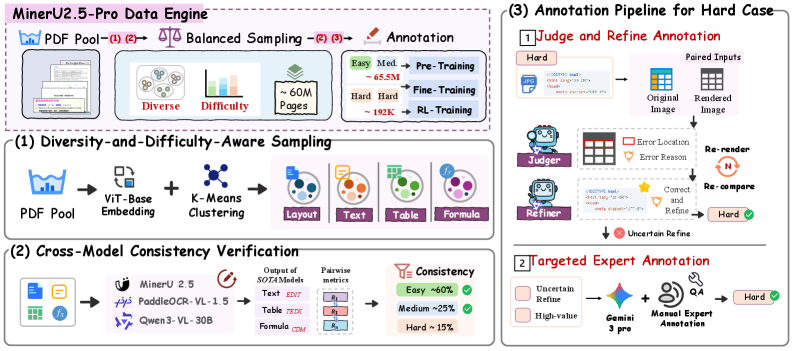
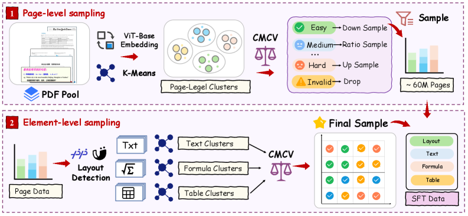
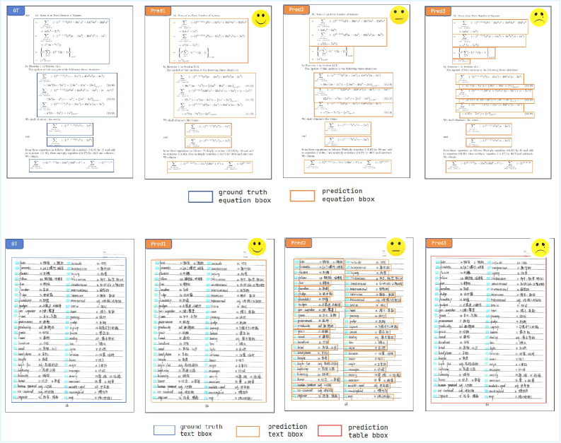
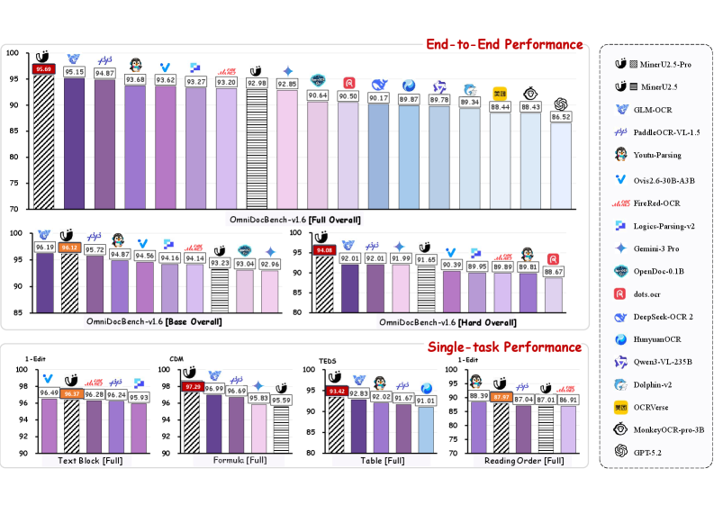

# PAPER: MinerU2.5-Pro — 모델을 한 글자도 안 바꾸고 데이터만으로 SOTA를 만든 통제 실험

## 0. 이 문서를 읽는 법

이 문서는 MinerU2.5-Pro 논문(arXiv 2604.04771v2, Technical Report)을 읽고 정리한 리뷰입니다.

핵심 주장은 하나입니다.

> **MinerU2.5-Pro는 전작 MinerU2.5의 1.2B architecture(구조)를 한 글자도 바꾸지 않고, 학습 데이터만 1000만 장 미만 → 6550만 장으로 갈아엎어서 OmniDocBench 점수를 92.98 → 95.69로 올린 논문이다. 논문 전체가 "이제 document parsing(문서 파싱)의 병목은 architecture가 아니라 data(데이터)다"라는 한 문장을 증명하려는 controlled experiment(통제 실험)다. 다만 그 전제인 "여러 모델이 같은 곳에서 실패한다"는 관찰에는 정량 근거가 하나도 없고, 1위를 만드는 Hard subset은 저자들이 자기 데이터 풀에서 직접 만든 홈그라운드다.**

읽는 순서는 이렇게 잡았습니다.

1. **왜 데이터라고 결론냈는가**(§4): 논문 전체의 전제와 두 갈래 진단
2. **Data Engine**(§5): DDAS / CMCV / Judge-and-Refine — 이 논문의 본체
3. **3단계 학습**(§6): 데이터 등급에 학습 단계를 맞추는 설계
4. **OmniDocBench v1.6**(§7): 모델뿐 아니라 benchmark(벤치마크)도 같이 고쳤다
5. **실험 결과**(§8)와 **부록에 숨은 실전 기능**(§9)
6. **비판적 평가 — 급소 5개**(§10): 이 리뷰의 핵심 지적
7. **Q&A**(§11), 한 줄 요약(§12)

수식은 GitHub에서 깨지지 않도록 LaTeX 대신 일반 텍스트로 적었습니다.

---

## 1. 메타 정보

| 항목 | 내용 |
|---|---|
| 논문 | MinerU2.5-Pro: Pushing the Limits of Data-Centric Document Parsing at Scale |
| 저자 | Bin Wang, Tianyao He, Linke Ouyang 외 40여 명 (교신저자 Conghui He) |
| 소속 | **Shanghai AI Laboratory** + 北京大学(Peking University) + 上海交通大学(SJTU) + SenseTime |
| 공개일 | 2026-04-06 (v1) / 2026-04-09 (v2) |
| arXiv | https://arxiv.org/abs/2604.04771 |
| HTML | https://arxiv.org/html/2604.04771v2 |
| 코드 | https://github.com/opendatalab/MinerU |
| 체크포인트 | https://huggingface.co/opendatalab/MinerU2.5-Pro-2604-1.2B (Apache-2.0) |
| 분야 | Document Parsing(문서 파싱), Data-Centric AI(데이터 중심 AI), VLM |
| 구성 | **MinerU2.5와 완전히 동일** — NaViT-675M vision encoder + Qwen2-0.5B language model = 1.2B |
| 출발 체크포인트 | MinerU2.5의 Stage 0 (vision-language alignment + 기초 OCR 완료 상태) |
| 학습 데이터 | 자동 주석 6550만 + 전문가 주석 19.2만. **미공개** |
| 라벨 생성에 쓴 외부 모델 | PaddleOCR-VL, **Qwen3-VL-30B**(CMCV) / **Qwen3-VL-235B**(Judge-and-Refine) / **Gemini 3 Pro**(사람 사전 주석) / **Gemini 3 Flash**(문단 병합 라벨) |
| 벤치마크 | **OmniDocBench v1.6**(저자들이 이 논문에서 새로 정의) + UniMERNet, CCOCR, OCRBenchV2 |
| 공개 범위 | **추론 코드 + 가중치 + 평가셋만.** 학습 코드·학습 데이터·Data Engine 파이프라인 전부 비공개 → 상세는 **Q5** |
| 평가셋 | OmniDocBench v1.6 **공개** — https://huggingface.co/datasets/opendatalab/OmniDocBench (2026-04-10 업데이트, Hard 296p + MGAM 코드 포함) |

---

## 2. 주요 용어 사전 (Glossary)

*본문에 들어가기 전에 걸릴 만한 용어를 먼저 풀어둡니다. 이 논문은 "어떤 데이터를 골라 어떻게 라벨을 붙이느냐"가 전부라서, 난이도 분류 용어를 안 깔면 §5가 안 읽힙니다.*

### 2.1 이 논문이 만든 용어

- **Data Engine(데이터 엔진)**: 이 논문이 만든 데이터 생산 파이프라인 전체. 세 부품(DDAS → CMCV → Judge-and-Refine)이 사슬로 이어져 있습니다.
- **DDAS (Diversity-and-Difficulty-Aware Sampling, 다양성·난이도 인식 샘플링)**: PDF 풀에서 무엇을 뽑을지 정하는 단계. "골고루(diversity)"와 "어려운 것 위주로(difficulty)"를 동시에 만족시키는 샘플링.
- **CMCV (Cross-Model Consistency Verification, 교차 모델 일관성 검증)**: 서로 다른 모델 3개를 돌려서 **답이 얼마나 겹치는지**로 샘플 난이도를 매기는 방법. 정답이 없는 대규모 데이터에 난이도표를 붙이는 장치.
- **Judge-and-Refine(판정-교정)**: 어려운 샘플의 라벨을 자동으로 고치는 반복 루프. 핵심은 **render-then-verify(렌더링 후 검증)**.
- **render-then-verify(렌더링 후 검증)**: LaTeX 수식을 실제로 compile(컴파일)하고 HTML 표를 실제로 render(렌더링)해서 이미지로 만든 뒤, 원본 이미지와 **눈으로 비교**시키는 것.
- **MGAM (Multi-Granularity Adaptive Matching, 다중 세분도 적응 매칭)**: 평가할 때 예측을 어떤 단위로 쪼개서 정답과 짝지을지를 **탐색**하는 알고리즘. §7에서 상세히 다룹니다.

### 2.2 난이도 3등급 (이 논문을 관통하는 축)

- **Easy**: 개선 대상 모델(MinerU2.5)이 외부 모델 중 최소 하나와 거의 같은 답을 낸 샘플. 이미 아는 것.
- **Medium**: 외부 모델 둘은 서로 맞는데 **MinerU2.5만 다른** 샘플. "남들은 되는데 나만 안 되는 것" → **훈련 가치 최고**.
- **Hard**: 셋 다 서로 다른 샘플. 돌파구지만 **믿을 라벨이 없음**.

### 2.3 평가 지표

- **edit distance(편집 거리)**: 두 문자열을 같게 만들려면 몇 번 고쳐야 하는지. **낮을수록 좋음.** 텍스트 인식에 씀.
- **TEDS (Tree-Edit-Distance-based Similarity)**: 표를 트리로 보고 재는 유사도. **높을수록 좋음.** `TEDS-S`는 내용은 빼고 **구조(structure)만** 보는 변형.
- **CDM (Character Detection Matching)**: 수식 평가 지표. LaTeX 문자열을 그대로 비교하면(BLEU 방식) 같은 수식을 다른 명령어로 써도 감점되니, **렌더링한 뒤 글자 단위로 매칭**합니다. 높을수록 좋음.
- **IoU (Intersection over Union)**: 박스 두 개가 얼마나 겹치는지. layout detection(레이아웃 검출) 평가에 씀.
- **Overall(총점)**: 이 논문에서는 텍스트 edit distance, 수식 CDM, 표 TEDS를 평균한 값.

### 2.4 구조·학습 관련

- **decoupled(디커플드) 방식**: 레이아웃 분석과 내용 인식을 **두 단계로 분리**하는 파이프라인. 페이지 전체를 축소해 박스를 먼저 찾고, 그 박스를 원본 해상도로 잘라 따로 읽습니다. 반대는 **end-to-end(종단간)** — 페이지 이미지를 통째로 넣어 최종 결과를 한 번에 뱉는 방식.
- **NaViT (Native Resolution ViT)**: 이미지를 정사각형으로 억지로 리사이즈하지 않고 **원본 비율·해상도 그대로** 처리하는 ViT.
- **OTSL (Optimized Table Structure Language)**: 표를 HTML보다 훨씬 짧은 토큰 시퀀스로 적는 표기법. 셀 구분자와 줄바꿈 토큰만 있는 납작한 형태.
- **GRPO (Group Relative Policy Optimization)**: 한 입력에 대해 답을 여러 개(G개) 뽑고, **그 그룹 안에서의 상대적 우열**로 정책을 업데이트하는 RL 기법. 별도 reward model(보상 모델)이 필요 없습니다.
- **replay(재생) 데이터**: 새 데이터로 미세조정할 때 이전 단계 데이터를 섞어 넣어 **catastrophic forgetting(파국적 망각)**을 막는 것.
- **query-by-committee(위원회 질의)**: 여러 모델의 의견이 갈리는 샘플을 골라 라벨링하는 고전 active learning(능동 학습) 기법. CMCV의 뿌리.

---

## 3. 논문 요약 (TL;DR)

**한 줄**: 모델을 고정한 채 데이터만 바꿔서 문서 파싱 SOTA를 만들고, 그 과정에서 벤치마크의 채점 편향까지 고쳤다.

**핵심 문제**: 문서 파싱 모델들이 표준 벤치마크에서 점수가 서로 붙어버렸다(score convergence). 그런데 **구조도 크기도 다른 모델들이 같은 어려운 페이지에서 똑같이 틀린다.** 구조가 원인이면 이렇게 겹칠 리가 없다 → 원인은 모두가 공유하는 학습 데이터다.

**해결책**: Data Engine 세 부품으로 커버리지·정보량·주석 정확도를 동시에 잡고(§5), 데이터 등급에 맞춘 3단계 학습을 돌린다(§6). 평가는 매칭 편향을 고치고 Hard subset을 붙인 OmniDocBench v1.6으로 한다(§7).

**검증**: OmniDocBench v1.6 Full 95.69(베이스라인 92.98, +2.71)로 1위. 200배 큰 모델들(Qwen3-VL-235B 89.78, GPT-5.2 86.52)보다 높음. 단계별 ablation(제거 실험)에서 순수 데이터 확장(Stage 1)이 단일 최대 기여(+1.31).

---

## 4. 왜 데이터라고 결론냈나

*이 절이 논문 전체의 전제이므로 먼저 봐야 합니다. 여기가 무너지면 나머지 설계가 다 근거를 잃습니다.*

저자들이 대규모 실제 PDF에 여러 SOTA 모델(구조도 다르고 파라미터 규모도 다른)을 돌려봤더니, **같은 어려운 페이지에서 다 같이 틀리더라**는 것. 구조가 다른데도 실패 지점이 겹친다면 원인은 구조가 아니라 **모두가 공유하는 학습 데이터의 결함**이라는 추론입니다.

병목을 두 갈래로 진단합니다.

- **insufficient coverage(커버리지 부족)** — MinerU2.5 학습 데이터가 1000만 장 미만인데다 흔한 유형(일반 논문, 1단 보고서)에 몰려 있습니다. 중첩 표(nested table), 수식 밀집 레이아웃 같은 long-tail(롱테일, 희귀 유형)이 거의 없습니다.
- **annotation quality paradox(주석 품질의 역설)** — 모델을 가장 크게 개선시키는 어려운 샘플이, 하필 자동 주석이 가장 못 미더운 샘플입니다. 어떤 모델도 제대로 못 읽으니 정답을 자동으로 만들 방법이 없습니다. 이 둘은 얽혀 있어서, 그냥 데이터를 늘리면 기존 편향과 노이즈만 증폭됩니다.

> ⚠️ **여기가 논문의 첫 번째 급소입니다.** 이 "공통 실패 패턴"은 논문 전체의 출발점인데, **정량 근거가 하나도 없습니다.** 실패 집합의 겹침 비율도, Jaccard index(자카드 지수)도, 몇 개 모델을 어떤 데이터에 돌렸는지도 안 나옵니다. 문장 하나로 선언하고 넘어갑니다. → 자세한 지적은 §10-1.

---

## 5. Data Engine — 커버리지 / 정보량 / 정확도 3축

*세 부품이 따로 노는 게 아니라 앞 단계 출력이 뒷 단계 입력이 되는 사슬이라는 게 이 설계의 핵심입니다. 저자들이 전작(MinerU2.5)의 파이프라인을 비판하는 지점도 "부품들이 독립적으로 돌아서 공동 최적화가 안 됐다"는 것입니다.*



*Figure 2. 왼쪽 위: PDF 풀 → Balanced Sampling → Annotation의 큰 흐름. 왼쪽 아래 (1)(2): DDAS와 CMCV. 오른쪽 (3): Hard 샘플 전용 주석 파이프라인. **그림에만 있고 본문에는 없는 숫자**: CMCV 난이도 분포가 Easy 약 60% / Medium 약 25% / Hard 약 15%.*

### 5.1 DDAS — 무엇을 뽑을지 정한다

*그냥 많이 모으면 흔한 유형만 더 많아지므로, 뽑는 단계에서부터 "골고루 + 어려운 쪽"을 강제해야 합니다.*



두 층위로 돕니다.

**Stage 1: page-level sampling(페이지 단위 샘플링)**
PDF 풀의 페이지를 ViT-base로 512차원 embedding(임베딩)한 뒤 K-Means로 clustering(군집화)합니다. 각 군집에서 균일하게 조금씩 뽑아 CMCV로 난이도를 매기고, 그 분포를 보고 군집별 샘플링 가중치를 조정합니다.

```text
Easy가 지배하는 군집     → Down Sample (덜 뽑는다)
난이도가 골고루 섞인 군집 → Ratio Sample (비율대로)
Hard가 많은 군집         → Up Sample (더 뽑는다)
Invalid 군집(빈 페이지, 대상 외 언어 등) → Drop (통째로 버린다)
```

이 가중치로 원본 풀에서 다시 확장 샘플링해서 **약 6000만 페이지**를 확보합니다.

**Stage 2: element-level sampling(요소 단위 샘플링)**
뽑힌 페이지를 MinerU2.5와 PaddleOCR-VL의 layout detection(레이아웃 검출) 모델로 텍스트/수식/표 블록으로 쪼갭니다. 블록 종류별로 **따로** 시각 특징을 뽑아 군집화하고, element-level CMCV로 난이도를 매깁니다. 이 시점에 layout·text·formula·table 네 subtask(하위 과제) 전부가 "다양성(군집) × 난이도(CMCV)" 두 축의 라벨을 갖게 됩니다.

**Final sampling(최종 샘플링)**
군집×난이도 결합 공간에서 균형 샘플링. 다양성 축에서는 큰 군집을 줄이고 작은 군집을 늘려 롱테일을 보정하고, 난이도 축에서는 Medium과 Hard를 위로 끌어올려 학습 신호 밀도를 높입니다.

### 5.2 CMCV — 난이도를 매긴다 (가장 영리한 부분)

*샘플링 가중치도, 주석에 얼마나 자원을 쓸지도 전부 난이도를 알아야 정할 수 있는데, 정답 없는 대규모 데이터에는 난이도표가 없습니다. 그걸 만드는 장치입니다.*

기존 방식 — MinerU2.5의 **IMIC**(Iterative Model Inference Consistency)와 PaddleOCR-VL-1.5의 **UACS**(Uncertainty-Aware Cluster Sampling) — 은 **한 모델을 여러 번 돌려서 답이 흔들리는 정도**를 난이도로 썼습니다. 저자들의 지적: 그건 그 모델 하나의 epistemic uncertainty(인식적 불확실성)일 뿐이라, **"이 모델만 못 하는 것"과 "누구도 못 하는 것"을 구분 못 합니다.** 전자는 남의 답을 베끼면 되고 후자는 사람이 붙어야 하는데, 처방이 완전히 달라서 이 구분이 결정적입니다.

그래서 이질적인 모델 셋을 독립적으로 돌립니다.

```text
MinerU2.5  +  PaddleOCR-VL  +  Qwen3-VL-30B
   ↓ 과제별 지표로 쌍쌍이(pairwise) 일치도 계산
   텍스트 = edit distance,  표 = TEDS,  수식 = CDM
   ↓
Easy / Medium / Hard 3등급
```

전제는 직관적입니다: **여러 이질적 모델이 같은 답을 내면 그 답은 거의 맞고, 다 갈라지면 그 샘플은 진짜 어렵다.** 개선 대상이 MinerU2.5이므로 난이도 분류의 기준점(anchor)도 MinerU2.5로 잡습니다.

| 등급 | 정의 | 라벨 출처 | 훈련에서의 역할 | 비중(Fig 2) |
|---|---|---|---|---|
| **Easy** | MinerU2.5가 외부 모델 중 최소 하나와 거의 일치 | 아무 모델 출력이나 OK | 기초 체력. 양은 많지만 이미 아는 것이라 한계 가치는 낮음 | 약 60% |
| **Medium** | 외부 둘은 서로 맞는데 **MinerU2.5만 다름** | 외부 합의(consensus)가 곧 pseudo-label(유사 정답) | **훈련 가치 최고** | 약 25% |
| **Hard** | 셋 다 서로 다름 | **없음** → §5.3으로 | 돌파구지만 그냥 쓰면 노이즈만 주입 | 약 15% |

**Medium이 왜 가장 값나가는가**: ① MinerU2.5의 능력 공백을 정확히 짚어주고, ② 외부 모델이 성공했다는 사실이 **"이건 배울 수 있는 문제다"를 이미 증명**하며, ③ 외부 합의가 **추가 교정 없이 바로 정답 라벨**로 쓰입니다. 어려운 것도 쉬운 것도 아닌 "나만 못 하는 것"이 공짜 정답과 함께 오는 셈입니다.

방법론적으로는 ensemble-based active learning(앙상블 기반 능동 학습)의 **query-by-committee**를 문서 파싱에 옮긴 것입니다. 다만 저자들은 여기서 한 발 더 나가, 난이도 정보를 **다음 단계의 주석 전략과 폐루프(closed loop)로 연결**한 점을 기여로 내세웁니다.

과제별로 최적 비율이 다르다는 관찰도 있습니다: **수식·표는 Hard에 더 민감하고, 텍스트는 Medium에서 더 이득**을 봅니다.

### 5.3 Judge-and-Refine — 어려운 샘플의 라벨을 고친다

*Hard는 "훈련 가치가 가장 큰데 라벨이 가장 못 미더운" 데이터라서, 그냥 넣으면 성능을 올리는 게 아니라 깎습니다. Data Engine을 "거르기(filtering)"에서 "고치기(refinement)"로 넘기는 단계입니다.*

**먼저, 왜 순진한 자기 검토가 안 되는가**

모델에게 자기 출력을 검토시키면 **"내 답 맞는데?"라고 넘어가 버립니다(self-affirmation bias, 자기 긍정 편향).** 원인 분석이 이 논문에서 제일 좋습니다:

> cross-modal mapping(교차 모달 사상)이 비대칭이다. 모델은 *이미지 → 구조화된 문자열*은 잘하지만, *문자열 → 이 문자열이 어떻게 보일지*는 머릿속에서 못 그린다. LaTeX 수식이나 HTML 표처럼 구조가 복잡하면 이 역방향 상상이 사실상 불가능해서, 구조 오류를 탐지하는 능력이 크게 떨어진다.

**처방: render-then-verify**

LaTeX는 compile하고 HTML 표는 render해서 **이미지로 만든 다음, 원본 이미지와 나란히 넣어줍니다.** 두 가지 이득이 있습니다.

1. 없던 "문자열 → 시각" 경로를 외부에서 채워줘서, 모델이 해야 할 추론 부담을 덜어준다.
2. **렌더링은 오류를 증폭한다.** 정렬 기호 누락(missing alignment symbol)이나 닫히지 않은 태그(unclosed tag)처럼 텍스트로는 안 보이던 흠집이, **레이아웃 붕괴라는 눈에 띄는 시각적 이상**으로 튀어나온다.

판정 모델은 **Qwen3-VL-235B**입니다. 선택 이유가 명시돼 있습니다 — 멀티모달 추론이 강하고, **CMCV 모델 풀에 들어있지 않아서** 오류 탐지에 계통 편향이 안 생긴다는 것. 원본 이미지와 렌더 이미지를 직접 비교하며 오류 위치 파악(error localization) → 표적 교정(targeted correction)을 여러 라운드 반복합니다.

**Targeted Expert Annotation(표적 전문가 주석)**

자동 교정이 안 되는 잔여분은 사람에게 갑니다. 무작위가 아니라 두 축으로 우선순위를 매깁니다.

1. **correction efficiency(교정 효율)**: Judge가 오류 위치는 자신 있게 찍었는데 Refine이 못 고친 샘플이 최우선. 작업자가 지목된 지점만 국소 수정하면 되니 처리량이 최대가 됩니다.
2. **marginal impact(한계 기여)**: 그중에서도 CMCV 불일치 패턴으로 봤을 때 현재 모델이 제일 약한 과제를 우선.

사람 작업은 **AI 사전 주석 + 전문가 검수·수정** 방식이고, 사전 주석에는 **Gemini 3 Pro**를 씁니다(역시 CMCV 풀 밖이라 data leakage(데이터 누출) 방지). 전작 MinerU2.5가 무작위 샘플링으로 주석을 맡겼던 것에 비해, 3단 필터로 표적을 좁힌 만큼 주석 예산 활용률이 크게 올랐다고 주장합니다.

**최종 산출물**

```text
Easy + Medium 약 65.5M (자동 주석)  → Stage 1 pre-training
Hard 192K (전문가 주석)             → Stage 2 fine-tuning + Stage 3 GRPO
```

---

## 6. 3단계 점진 학습 — 데이터 등급에 학습 단계를 맞춘다

*Data Engine이 품질 등급이 다른 데이터를 세 종류 만들어 놓았으니, 학습도 "넓게 → 좁고 정확하게 → 지표에 맞추기" 순서로 등급에 맞춰 소비하는 것이 자연스럽습니다.*

구조 변경은 전혀 없습니다. MinerU2.5의 Stage 0 체크포인트(vision-language alignment와 기초 OCR이 이미 되어 있는 상태)에서 출발합니다.

| 항목 | Stage 1 (대규모 SFT) | Stage 2 (Hard SFT) | Stage 3 (GRPO) |
|---|---|---|---|
| 데이터 | **65.5M** (CMCV 자동 주석) | **3.9M** (그중 192K가 사람 주석) | **192K** |
| 데이터 종류 | Layout & OCR & Image Analysis | Layout & OCR & Image Analysis | Layout & Text & Formula & Table |
| 최대 해상도 | 2048×28×28 | 동일 | 동일 |
| 이미지당 토큰 | 64~2048 | 동일 | 동일 |
| sequence length | 8192 | 8192 | 8192 |
| 학습 대상 | 전체 파라미터 | 전체 | 전체 |
| batch size | 256 | 128 | 512 |
| ViT learning rate | 1e-4 | 5e-6 | 1e-7 |
| MLP/LLM learning rate | 1e-3 | 5e-5 | 1e-5 |
| epoch | 1 | 1 | 1 |

### 6.1 Stage 1 — 대규모 사전학습

*커버리지 문제를 정면으로 푸는 단계. 이 단계 하나가 전체 개선의 절반 가까이를 만듭니다(§8 ablation).*

과제별 구성: 텍스트 인식 21M / 레이아웃 분석 14M / 수식 인식 13M / 표 인식 11.5M / 이미지 분석 6M = 약 65.5M. 비율은 **OmniDocBench 총점에서 각 과제가 차지하는 비중**과 **베이스라인 모델의 과제별 성능 공백**을 보고 정했다고 합니다.

전작과 비교하면 690만 샘플 × 2 epoch → **6550만 × 1 epoch.** 데이터 규모를 거의 한 자릿수 늘렸고, 동시에 DDAS의 분포 교정과 CMCV의 주석 필터링으로 품질도 올렸다는 주장입니다.

### 6.2 Stage 2 — 고품질 미세조정

*Stage 1으로 기초 체력은 갖췄지만 Hard 시나리오에는 여전히 구멍이 남아 있어서, 전문가 주석 데이터로 그 구멍만 메우는 단계입니다.*

데이터는 두 부분: ① 전문가 주석 Hard 192K, ② Stage 1 학습셋에서 비례 추출한 **replay 데이터**(파국적 망각 방지).

**replay 비율이 과제마다 극단적으로 다른 것이 흥미로운 대목입니다.**

| 과제 | Hard : Replay | 이유 |
|---|---|---|
| layout 분석 | **6 : 1** | Hard 샘플이 많고 Stage 1 기초가 튼튼해 replay가 거의 필요 없음 |
| image 분석 | 1 : 4 | |
| table 인식 | 1 : 10 | |
| formula 인식 | 1 : 25 | |
| text 인식 | **1 : 50** | Hard 샘플이 희귀해서 replay를 50배 섞지 않으면 일반화가 무너짐 |

learning rate를 5e-5로 낮춘 것도 같은 취지 — Stage 1에서 얻은 기초 능력을 보호하면서 어려운 시나리오의 decision boundary(결정 경계)만 다듬습니다.

### 6.3 Stage 3 — GRPO 정렬

*cross-entropy loss(교차 엔트로피 손실)는 토큰을 하나씩 독립·동일 가중으로 보기 때문에, sequence 수준·structure 수준 지표(edit distance, CDM, TEDS, IoU)를 전혀 반영하지 못합니다. 학습 목표와 평가 지표 사이의 이 틈을 RL로 메웁니다.*

한 입력에 대해 후보 출력을 G개 뽑고, 보상을 계산해 **그룹 내 상대 우위(relative advantage)**로 정책을 업데이트합니다. 별도 reward model이 필요 없다는 게 GRPO의 장점입니다.

**reward 설계 — 평가에 쓰는 지표를 그대로 보상으로 씁니다.**

```text
text    → edit distance
formula → CDM
table   → TEDS
layout  → category IoU
```

**학습 데이터 필터링**: Stage 2 모델의 rollout(롤아웃)에서 보상 분포를 보고, 너무 높은 것(모델이 이미 포화되어 배울 게 없음)과 너무 낮은 것(너무 어렵거나 라벨이 틀림)을 잘라내고 **중간 구간만** 남깁니다. 유효 policy gradient(정책 경사) 신호를 최대화하려는 것. 데이터는 전부 전문가 주석 세트에서만 가져와 보상 신호의 신뢰성을 확보합니다.

설정: rollout G=16, DAPO를 따라 **clip-higher**(advantage 추정 안정화)와 **dynamic sampling**(분산이 0인 rollout 그룹 폐기) 적용.

---

## 7. OmniDocBench v1.6 — 벤치마크도 같이 고쳤다

*모델 얘기 다음에 벤치마크 얘기가 나오는 이유는, 저자들이 기존 v1.5로는 자기들의 개선을 측정할 수 없다고 판단했기 때문입니다.*

### 7.1 문제 1 — matching strategy bias(매칭 전략 편향)

v1.5는 예측 요소와 정답 요소를 **고정 세분도(fixed granularity)로 1:1 매칭**합니다. 그래서 **내용이 완벽히 맞아도 쪼개는 방식이 다르면 점수가 폭락합니다.**



*Figure 4. 위: 여러 줄 수식이 정답에는 한 덩어리인데 모델이 줄마다 나눠 내면(Pred2, Pred3) 만점에서 거의 0점으로 떨어집니다. 아래: 중국어-영어 대역 단어 목록을 텍스트로 읽으면 정답, 표로 읽으면(Pred3, 빨간 박스) 매칭될 텍스트 요소가 없어 0점.*

실력이 아니라 **출력 관습**을 재는 셈이고, 이런 세분도 의존 채점 artifact(인공물) 때문에 시스템 간 비교가 신뢰할 수 없게 됩니다.

### 7.2 처방 — MGAM (다중 세분도 적응 매칭)

핵심 원칙: **정답(ground truth)은 그대로 두고, 예측 쪽에서만 최적 분할을 탐색한다.**

정답 요소 집합을 G = {g1, ..., gm}, 예측 요소 집합을 P = {p1, ..., pn}이라 할 때 3단계로 후보를 만들고 최고점을 채택합니다.

```text
Stage 1: 원래 세분도 그대로 이분 매칭(bipartite matching)
         비용 행렬 C_ij = 1 − sim(p_i, g_j)
         헝가리안 알고리즘으로 최소 비용 매칭 → 점수 S1

Stage 2: 예측을 LaTeX 줄바꿈 기호(\\, \newline 등)로 쪼개
         더 잘게 나눈 집합 P'(요소 n'개, n' ≥ n)로 다시 매칭 → S2
         (쪼갤 구분자가 없는 예측은 그대로 둔다)

Stage 3: Stage 2가 너무 잘게 쪼갰을 수 있으므로, 다시 붙이는 경우를 전부 열거.
         조각 n'개 사이에는 인접 틈이 n'−1개 있고, 각 틈은 "쪼갬" 또는 "붙임"
         → 2^(n'−1) 가지 분할(partition) 방식
         각 분할에서 연속 블록을 순서대로 이어붙여 매칭 → 최고점이 S3

최종: M* = argmax(S1, S2, S3), 이 매칭 위에서 과제 지표(CDM/edit distance)를 계산
```

**dense text matching(조밀 텍스트 매칭)**: 세분도 불일치는 수식만의 문제가 아니라서, 텍스트 요소에도 같은 MGAM을 edit distance 기준으로 재사용합니다. 추가로 **모델이 어떤 영역을 표로 인식했다면 표를 평문으로 되돌려 같은 매칭 파이프라인에 넣어줍니다** — 형식 선호 차이로 부당하게 0점을 주지 않기 위해서.

결과적으로 평가가 **출력 세분도와 형식 선호에 중립**이 되고, 시스템 간 점수 분산의 계통적 원인 하나가 제거됩니다.

### 7.3 문제 2 — Hard 샘플 부재, 그리고 3단 프로토콜

자체 Data Engine의 난이도 분류로 훑어보니 **v1.5 평가셋에는 Hard가 사실상 없었습니다.** 저난이도~중난이도만 재고 있으니 상위 모델들이 촘촘히 뭉쳐서 변별력이 사라진 것입니다.

그래서 Hard 풀에서 296페이지를 골라 새 subset을 만들었습니다. 중첩 표, 수식 밀집 레이아웃, 비정형 레이아웃 등 가장 어려운 범주를 커버하도록 선정했고, **MinerU2.5-Pro의 모든 학습 단계(Judge-and-Refine 학습 데이터 포함)에서 제외**했으며, 전문 팀이 교차 검증(inter-annotator cross-validation)으로 주석했습니다.

| 구간 | 페이지 수 | 목적 |
|---|---|---|
| **Base** | 1,355 | 기존 v1.5 평가셋 그대로. 과거 결과와의 비교 가능성 유지 |
| **Hard** | 296 | 상위 모델이 포화되는 지점에서 민감하게 측정 |
| **Full** | 1,651 | 둘의 합집합. 종합 평가 |

---

## 8. 실험 결과

*"구조를 안 바꿨는데 정말 올랐는가", 그리고 "그 개선이 어느 단계에서 나오는가"를 확인하는 부분입니다. 모든 경쟁 모델은 동일 환경·동일 평가 코드로 재평가했다고 명시합니다.*



### 8.1 End-to-End 문서 파싱 (OmniDocBench v1.6 Full)

| 종류 | 모델 | 파라미터 | Full ↑ | 텍스트 Edit ↓ | 수식 CDM ↑ | 표 TEDS ↑ | 표 TEDS-S ↑ | 읽기순서 Edit ↓ |
|---|---|---|---|---|---|---|---|---|
| 특화 | **MinerU2.5-Pro** | 1.2B | **95.69** | 0.036 | **97.29** | **93.42** | **95.92** | **0.120** |
| 특화 | GLM-OCR | 0.9B | 95.15 | 0.044 | 96.99 | 92.83 | 95.39 | 0.133 |
| 특화 | PaddleOCR-VL-1.5 | 0.9B | 94.87 | 0.038 | 96.69 | 91.67 | 94.37 | 0.130 |
| 특화 | PaddleOCR-VL | 0.9B | 94.11 | 0.040 | 95.70 | 90.65 | 93.74 | 0.135 |
| 특화 | Youtu-Parsing | 2.5B | 93.68 | 0.044 | 93.45 | 92.02 | 95.00 | 0.116 |
| 특화 | Logics-Parsing-v2 | 4B | 93.27 | 0.041 | 95.47 | 88.42 | 91.98 | 0.137 |
| 특화 | FireRed-OCR | 2B | 93.20 | 0.037 | 95.27 | 88.04 | 91.06 | 0.131 |
| 특화 | **MinerU2.5 (베이스)** | 1.2B | 92.98 | 0.045 | 95.59 | 87.88 | 91.47 | 0.130 |
| 특화 | dots.ocr | 3B | 90.50 | 0.048 | 89.12 | 87.18 | 90.58 | 0.138 |
| 특화 | DeepSeek-OCR 2 | 3B | 90.17 | 0.050 | 91.59 | 83.89 | 87.75 | 0.144 |
| 특화 | HunyuanOCR | 1B | 89.87 | 0.089 | 87.44 | 91.01 | 93.23 | 0.171 |
| 범용 | Ovis2.6-30B-A3B | 30B | 93.62 | 0.035 | 94.93 | 89.44 | 92.40 | 0.135 |
| 범용 | Gemini 3 Pro | – | 92.85 | 0.064 | 95.83 | 89.15 | 92.96 | 0.165 |
| 범용 | Gemini 3 Flash | – | 92.58 | 0.066 | 95.03 | 89.29 | 93.51 | 0.173 |
| 범용 | Qwen3-VL-235B | 235B | 89.78 | 0.063 | 92.53 | 83.07 | 86.75 | 0.166 |
| 범용 | GPT-5.2 | – | 86.52 | 0.114 | 88.00 | 82.95 | 87.93 | 0.193 |
| 범용 | InternVL3.5-241B | 241B | 83.61 | 0.130 | 89.52 | 74.35 | 79.78 | 0.215 |

**Base와 Hard를 나눠 보면 그림이 달라집니다.**

| 구간 | 1위 | 2위 | 3위 |
|---|---|---|---|
| **Base** (1,355p) | GLM-OCR **96.19** | MinerU2.5-Pro 96.12 | PaddleOCR-VL-1.5 95.72 |
| **Hard** (296p) | MinerU2.5-Pro **94.08** | PaddleOCR-VL 92.48 | GLM-OCR / PaddleOCR-VL-1.5 92.01 |

즉 **표준 구간에서는 사실상 포화돼 2위이고, 종합 1위를 만드는 것은 자기들이 만든 Hard 구간입니다.** 저자들 스스로도 Base 상위 3개가 0.5점 안에 몰려 있어 "near-saturation(포화 근접)"이라고 인정합니다.

부수적 관찰: **Gemini 3 Pro/Flash가 v1.6의 매칭 교정으로 크게 이득을 봐서**(Full 92.85 / 92.58) 특화 모델과의 격차를 좁혔습니다. 즉 v1.5에서 범용 VLM이 낮게 나온 데는 실력 외의 채점 요인이 섞여 있었다는 뜻입니다.

### 8.2 학습 단계별 ablation

| 단계 | Base | Hard | Full | ΔFull | 텍스트↓ | CDM↑ | TEDS↑ |
|---|---|---|---|---|---|---|---|
| MinerU2.5 (베이스라인) | 93.23 | 91.65 | 92.98 | — | 0.045 | 95.59 | 87.88 |
| + Stage 1: 대규모 SFT | 94.54 | 93.10 | 94.29 | **+1.31** | 0.039 | 96.40 | 90.37 |
| + Stage 2: Hard SFT | 95.60 | 93.84 | 95.25 | **+0.96** | 0.036 | 96.48 | 92.87 |
| + Stage 3: GRPO | 96.12 | 94.08 | 95.69 | **+0.45** | 0.036 | 97.29 | 93.42 |

읽는 법:

- **Stage 1(순수 데이터 확장)이 단일 최대 기여(+1.31)** → 데이터 가설의 가장 직접적인 증거.
- **Stage 2는 표에 집중** (TEDS 90.37 → 92.87, +2.50) → 전문가 주석이 값을 하는 곳은 표.
- **Stage 3는 수식에 집중** (CDM 96.48 → 97.29, +0.81) → RL이 과제 지표를 직접 조준한 효과.
- Hard 누적 개선(91.65 → 94.08, +2.43)이 Base 누적 개선(93.23 → 96.12, +2.89)과 비슷 → 어려운 쪽만 편식하지 않고 균형 있게 올랐다는 주장.

### 8.3 요소별(element-specific) 평가

*end-to-end 점수에는 layout detection 오류가 섞여 들어가므로, 정답 박스로 잘라 넣어 **순수 내용 인식 능력**만 재는 실험입니다. 단, 이 설정에서 end-to-end 모델은 요소 범주 사전정보(category prior)를 못 받아 불리하다고 저자들이 스스로 밝혀둡니다.*

**텍스트 인식 (edit distance ↓)**

| 모델 | 종류 | Base | Hard | Full |
|---|---|---|---|---|
| **MinerU2.5-Pro** | Decoupled | **0.015** | **0.048** | **0.019** |
| Qwen3.5-397B | 범용 | 0.016 | 0.052 | 0.020 |
| GLM-OCR | Decoupled | 0.016 | 0.053 | 0.021 |
| Qwen3-VL-235B | 범용 | 0.017 | 0.049 | 0.021 |
| MinerU2.5 | Decoupled | 0.023 | 0.066 | 0.028 |
| DeepSeek-OCR 2 | End-to-End | 0.057 | 0.130 | 0.066 |
| FireRed-OCR | End-to-End | 0.135 | 0.176 | 0.140 |

베이스라인 대비 **30.5% 감소**(0.028 → 0.019). 수천억 규모 범용 VLM이 텍스트 인식만큼은 특화 모델과 겨룰 만하다는 점도 눈에 띕니다.

**수식 인식 (CDM ↑, 9개 벤치마크)**

| 모델 | OmniDoc Base | OmniDoc Hard | CPE | HWE | SCE | SPE | LaTeX-80M | Chinese | Fuzzy |
|---|---|---|---|---|---|---|---|---|---|
| **MinerU2.5-Pro** | **99.20** | **98.79** | **98.97** | 95.38 | 97.04 | **99.44** | **97.23** | 95.28 | 94.90 |
| PaddleOCR-VL-1.5 | 98.76 | 97.22 | 98.84 | 92.27 | 94.95 | 99.27 | 92.77 | 94.06 | 89.73 |
| GLM-OCR | 98.75 | 98.28 | 96.74 | 95.10 | **97.77** | 98.42 | 95.39 | 94.35 | 93.75 |
| Qwen3.5-397B | 98.19 | 97.25 | 98.32 | **97.59** | 95.87 | 99.41 | 95.17 | 78.24 | 90.53 |
| MinerU2.5 | 97.25 | 98.67 | 97.79 | 94.42 | 96.65 | 98.57 | 96.23 | **95.50** | **94.92** |

(CPE/HWE/SCE/SPE = UniMERNet의 복잡 인쇄체 / 손글씨 / 화면 캡처 / 단순 인쇄체 부분집합)

9개 중 5개 1위, 나머지 4개 2위. OmniDoc Base에서 CDM 99.20은 사실상 천장입니다. **다만 손글씨 수식(HWE)은 95.38로 Qwen3.5-397B의 97.59에 크게 밀리고, Chinese(95.28 vs 95.50)와 Fuzzy(94.90 vs 94.92)에서는 오히려 이전 버전 MinerU2.5가 살짝 낫습니다.** 한편 Qwen3.5-397B는 손글씨는 잘하면서 중국어 수식에서 78.24로 무너집니다.

**표 인식 (TEDS / TEDS-S ↑)**

| 모델 | 종류 | OmniDoc Base | OmniDoc Hard | CCOCR | OCRBv2 | Inhouse | **Overall** |
|---|---|---|---|---|---|---|---|
| **MinerU2.5-Pro** | Decoup. | 95.67 / 97.42 | **92.46 / 94.67** | 88.49 / 91.90 | **93.56 / 96.27** | **82.70 / 89.65** | **91.10 / 94.48** |
| GLM-OCR | Decoup. | **96.14 / 97.60** | 90.49 / 93.47 | **89.17 / 92.58** | 91.19 / 94.44 | 79.41 / 87.65 | 89.71 / 93.52 |
| Gemini 3 Pro | 범용 | 94.42 / 97.37 | 88.16 / 91.34 | 86.47 / 90.10 | – | – | – |
| MinerU2.5 | Decoup. | 92.87 / 95.33 | 88.28 / 91.80 | 84.35 / 88.25 | 92.32 / 95.31 | 76.95 / 85.98 | 87.94 / 92.17 |
| PaddleOCR-VL | Decoup. | 92.31 / 94.64 | 89.21 / 92.02 | 81.54 / 85.80 | 82.29 / 85.79 | 74.88 / 82.92 | 83.67 / 87.85 |
| DeepSeek-OCR 2 | E2E | 79.27 / 82.46 | 75.07 / 80.06 | 66.98 / 72.74 | 84.38 / 88.70 | 57.70 / 69.35 | 74.59 / 80.35 |

베이스라인 대비 Overall +3.16 / +2.31. **격차가 가장 큰 곳은 Hard(TEDS 88.28 → 92.46, +4.18)** — Data Engine의 hard sample mining과 전문가 주석이 가장 값을 하는 곳이 표라는 뜻입니다. GLM-OCR은 Base와 CCOCR에서는 살짝 앞서지만 벤치마크 간 안정성이 떨어지고, PaddleOCR-VL-1.5는 CCOCR 76.34, Inhouse 72.66으로 일반화가 약합니다.

---

## 9. 부록에 숨은 실전 기능들

*벤치 점수(단일 페이지 내용 인식 중심)에는 안 잡히지만, 실무 파싱 완성도에는 이쪽이 더 중요합니다.*

**인터페이스**는 단순합니다. 프롬프트는 이미지 토큰 하나 + 평문 접미사뿐이고 few-shot 예시나 구조화된 메타데이터가 필요 없습니다.

```text
<image>\nLayout Detection:      → <|box_start|>x1 y1 x2 y2<|box_end|><|ref_start|>category<|ref_end|><|rotate_dir|>
<image>\nText Recognition:      → 평문 그대로
<image>\nFormula Recognition:   → LaTeX (블록 수식은 \[...\], 수식 번호는 \tag{})
<image>\nTable Recognition:     → OTSL 토큰 시퀀스(<fcel> 셀, <nl> 줄) → 이후 HTML로 변환
<image>\nImage Analysis:        → class / sub_class / caption / content 4개 필드
```

좌표는 0~999 격자로 정규화하고, 여러 줄 수식은 **한 번에 생성하지 않고** layout detection이 equation_block 안의 각 줄을 잡아주면 줄마다 따로 인식해 읽기 순서대로 이어붙입니다.

**추가된 실전 기능 4가지**

- **image-aware parsing(이미지 인식 파싱)**: MinerU2.5는 그림 영역을 그냥 잘라 버렸습니다. Pro는 chart / text image / table-like image / general image로 분류해 차트는 표로, 텍스트 이미지는 OCR로 뽑습니다. **단, 저자들이 "이미지 분석 데이터에는 아직 Data Engine을 적용하지 않았다"고 명시** — 개선 여지가 큰 미완성 기능.
- **truncated paragraph merging(잘린 문단 병합)**: 다단 조판이나 그림에 끊긴 문단을 잇습니다. 읽기 순서가 이미 있으니 인접 영역 경계마다 "붙일까 말까" **이진 분류로 환원**하고, 그 라벨을 layout 출력 시퀀스에 심어 마크다운 렌더링 때 재조립합니다. 학습 라벨은 규칙 필터로 명백한 비병합을 걸러낸 뒤, 두 영역을 빨강/초록으로 칠한 이미지를 **Gemini 3 Flash**에 물어서 만들었습니다(API 비용 때문에 긴 문단은 첫/마지막 문장만 전달).
- **cross-page table merging(페이지 넘어가는 표 병합)**: 규칙(열 개수·구조 패턴 호환성)으로 후보 쌍을 찾고, 모델이 위 표의 마지막 행과 아래 표의 첫 행을 받아 **열 단위 이진 결정 리스트**를 냅니다. 0이면 그대로 이어붙이고(셀 하나가 페이지 경계에서 찢어진 경우), 1이면 별개 행으로 유지. 같은 표 안에서도 어떤 열은 이어야 하고 어떤 열은 아닌 흔한 상황을 다룹니다.
- **in-table image detection(표 안 이미지 처리)**: 표 박스 안에 든 이미지 영역을 placeholder 토큰으로 마스킹 → 마스킹된 표를 Table Recognition에 넣어 OTSL 생성 → 최종 출력에서 placeholder를 img 태그로 복원. 표 구조 인식이 이미지에 방해받지 않으면서 셀-이미지 대응은 유지됩니다.

---

## 10. 비판적 평가 — 급소 5개

*논문이 스스로 밝히지 않은 부분을 짚습니다. 결론이 틀렸다는 게 아니라, 어디까지가 검증됐는지 선을 긋는 작업입니다.*

### 10-1. 핵심 전제에 증거가 없다

"여러 모델이 같은 곳에서 실패한다"(§4)는 관찰이 **정량화되지 않았습니다.** 논문 제목이 data-centric인데 그 근거만 일화적(anecdotal)입니다. 실패 집합 겹침 비율, 사용한 모델 목록, 대상 데이터 규모 — 전부 없습니다.

### 10-2. Data Engine 부품별 ablation이 없다

검증된 것은 "학습 단계 3개를 순서대로 쌓으면 오른다"(§8.2)뿐입니다.

| 제안한 부품 | 단독 검증됐나 | 확인하려면 필요했던 실험 |
|---|---|---|
| DDAS | ❌ | 균일 샘플링 vs DDAS 비교 |
| CMCV | ❌ | 단일 모델 IMIC vs 3모델 CMCV 비교 |
| Judge-and-Refine의 render-then-verify | ❌ | 순수 자기 검토 vs 렌더링 비교 |

**세 부품 어느 것도 단독으로 검증되지 않았습니다.** 방법론 논문이라기보다 잘 쓴 technical report(기술 보고서)에 가깝습니다.

### 10-3. 1위 주장은 자기가 만든 구간에서 나온다

Base(기존 v1.5 세트)에서는 GLM-OCR에 0.07 뒤진 2위입니다. 종합 1위를 만드는 것은 Hard 296페이지인데, 이 구간은

1. **저자들의 Data Engine 난이도 분류로 자기들 PDF 풀에서 뽑았고**,
2. 난이도 정의 자체가 MinerU2.5를 anchor(기준점)로 삼고 있으며,
3. 학습 데이터가 정확히 같은 분포를 겨냥해 증강됐습니다.

학습셋에서 제외한 것은 맞지만 **분포는 확실히 홈그라운드**입니다. Hard의 +2.07을 액면 그대로 일반화 능력으로 읽으면 안 됩니다.

### 10-4. "1.2B가 235B를 이겼다"는 프레임이 절반만 사실이다

학습 라벨의 출처를 따라가 보면:

```text
Easy/Medium 라벨  ← PaddleOCR-VL + Qwen3-VL-30B 의 합의
Hard 라벨 교정    ← Qwen3-VL-235B
사람 사전 주석    ← Gemini 3 Pro
문단 병합 라벨    ← Gemini 3 Flash
```

즉 이 모델은 **큰 모델들을 distillation(증류)해 문서 파싱에 특화시킨 결과**입니다. 이긴 게 아니라 **압축한 것**에 가깝고, 이 관점은 논문에서 언급되지 않습니다. 폐쇄형 모델(Gemini) 출력을 학습에 쓰는 라이선스 문제에 대한 논의도 없습니다.

### 10-5. 재현 불가능하다

데이터가 레버(lever)라고 주장하면서, 정작 그 레버의 규격이 없습니다.

| 필요한 값 | 논문에 있나 |
|---|---|
| K-Means 군집 수 | ❌ |
| CMCV 일관성 임계값(threshold) | ❌ |
| Judge-and-Refine 반복 횟수 / 통과율 | ❌ |
| 사람에게 넘어간 비율 / 주석 비용 | ❌ |
| GPU 시간·학습 비용 | ❌ |
| 65.5M 데이터셋 공개 | ❌ (가중치만 Apache-2.0) |

아이러니하게도 architecture 논문은 코드만 있으면 재현되는데, **이 논문은 방법을 알아도 재현할 수 없습니다.** 공개/비공개 경계선의 전체 목록은 **Q5** 참조.

### 10-6. 추가로 신경 쓰이는 것들

- **GRPO의 reward가 평가 지표와 글자 그대로 동일합니다.** 표준 지표이긴 하나 벤치 조준(benchmark targeting)의 성격이 있습니다.
- **MGAM Stage 3은 조각 수에 대해 지수적**(2의 (n'−1)제곱)으로 분할을 열거하는데, 상한이나 복잡도 처리에 대한 언급이 없습니다. 조밀한 표나 긴 다중행 수식에서 폭발할 수 있습니다.
- 요소별 평가에서 end-to-end 모델이 category prior를 못 받아 불리한 점 — 이건 저자들이 스스로 밝혀뒀습니다(§8.3).
- 논문이 인정하는 한계: 형식 수준(HTML vs Markdown 표)과 구조 수준(같은 배치를 텍스트 쌍으로도 표로도 표현 가능)의 **semantic equivalence(의미 동등성) 문제는 여전히 미해결**이고, 금융·법률·의료 같은 vertical domain(수직 도메인) 평가셋도 없으며, 제목-본문 계층이나 그림-본문 결합 같은 **구조적 이해**는 다루지 않습니다.

---

## 11. 💬 Q&A

### Q1. MinerU2.5(전작)와 Pro는 정확히 뭐가 같고 뭐가 다른가?

*"구조를 안 바꿨다"가 어디까지를 뜻하는지가 이 논문의 신뢰도를 좌우하므로 명확히 해둡니다.*

| 항목 | MinerU2.5 | MinerU2.5-Pro |
|---|---|---|
| architecture | NaViT-675M + Qwen2-0.5B = 1.2B | **완전히 동일** |
| 출발 체크포인트 | — | MinerU2.5의 **Stage 0** |
| 해상도 설정 | — | **동일** (2048×28×28, 이미지당 64~2048 토큰) |
| 사전학습 데이터 | 6.9M × 2 epoch | **65.5M × 1 epoch** |
| 난이도 추정 | IMIC (단일 모델 반복 추론) | **CMCV (이질 모델 3개 교차)** |
| Hard 주석 | 모델 기반 정제, 무작위 인간 주석 | **Judge-and-Refine + 표적 전문가 주석 192K** |
| 학습 단계 | SFT 중심 | **3단계 (대규모 SFT → Hard SFT → GRPO)** |
| 추가 기능 | 없음 | 이미지 인식 파싱, 문단 병합, 페이지 간 표 병합, 표 안 이미지 |
| OmniDocBench v1.6 Full | 92.98 | **95.69** |

즉 바뀐 것은 **데이터와 학습 절차, 그리고 후처리 기능**뿐입니다. 이 통제(control)가 이 논문의 최대 미덕입니다.

### Q2. CMCV 난이도 분포는 실제로 어떻게 되나?

본문에는 안 나오지만 **Figure 2에 숫자가 찍혀 있습니다**: Easy 약 60%, Medium 약 25%, Hard 약 15%.

읽는 법: 실제 PDF 풀의 대다수는 이미 모델들이 잘 푸는 문서이고, "나만 못 푸는" 금맥(Medium)은 넷 중 하나꼴, 진짜 난제는 여섯 중 하나꼴이라는 뜻입니다. 그래서 DDAS가 샘플링 단계에서 Easy를 down-sample하고 Hard를 up-sample하지 않으면, 데이터를 아무리 늘려도 **60%짜리 Easy만 6배로 늘어나는** 결과가 됩니다. §4의 "그냥 늘리면 편향만 증폭된다"는 진단이 이 분포에서 나옵니다.

### Q3. 내 작업에 바로 가져다 쓸 만한 것은?

*논문의 결론(문서 파싱 SOTA)보다 이쪽이 재사용 가치가 높습니다.*

1. **render-then-verify** — 모델이 자기 출력의 겉모습을 상상하지 못한다면 **실제로 렌더링해서 보여주면 된다.** 문서 파싱을 넘어 **구조화된 출력을 다루는 모든 작업**에 그대로 옮길 수 있습니다: 코드 생성(실행해서 결과를 보여주기), 차트/다이어그램 생성, 마크업 변환, SVG 생성. 단순하지만 "자기 검토가 왜 안 되는가"에 대한 원인 진단(교차 모달 사상의 비대칭)까지 딸려 있어 응용 방향이 명확합니다.
2. **Medium 계층 개념** — 라벨 예산이 한정된 상황에서 무엇을 먼저 라벨링할지 정할 때, "**내 모델만 틀리고 남의 모델은 맞히는 샘플**"을 찾으면 정답이 공짜로 따라옵니다. 사람을 부르기 전에 반드시 거쳐야 할 단계.
3. **replay 비율을 과제별로 극단적으로 다르게 주기**(§6.2) — 6:1에서 1:50까지 벌어집니다. "미세조정에는 replay 몇 %" 같은 단일 규칙이 얼마나 거친 근사인지 보여줍니다.

### Q4. 문서 파싱 모델 계보에서 어디에 있나?

논문이 정리한 3분류를 기준으로:

| 패러다임 | 방식 | 대표 | 약점 |
|---|---|---|---|
| **pipeline** | 레이아웃→텍스트→표→수식을 독립 모듈로 cascade | MinerU(1세대), PaddleOCR, Marker | error propagation(오류 전파), 모듈 간 정보 손실 |
| **end-to-end VLM** | 이미지 → 구조화 출력을 한 번에 | Nougat, GOT-OCR 2.0, olmOCR, dots.ocr, **DeepSeek-OCR** | native resolution 처리 시 토큰 수 제곱 복잡도 |
| **decoupled VLM** | 레이아웃과 내용 인식을 분리하되 **한 모델 안에서** | Dolphin, MonkeyOCR, **MinerU2.5 / Pro**, GLM-OCR, PaddleOCR-VL | 2단계 추론 |

MinerU2.5-Pro는 세 번째 계열의 최신 지점이지만, **기여의 성격이 다릅니다.** 위 계보는 전부 "구조를 어떻게 짤 것인가"의 축인데, 이 논문은 그 축에서 한 발도 안 움직이고 **직교하는(orthogonal) 축 — 데이터 — 만 밀었습니다.** 저자들 스스로도 결론에서 "architecture 혁신과 상보적(complementary)인 경로를 제시한다"고 위치를 잡습니다.

### Q5. 학습셋은 어떻게 구성했나? 공개됐나?

*§5(Data Engine)와 §6(학습 단계)에 흩어져 있는 데이터 정보를 "데이터셋 카드" 한 장으로 모으고, 공개/비공개 경계선을 확정하는 절입니다.*

#### (1) 구성 — 전체 흐름

논문이 밝힌 범위 안에서 정리하면 이렇습니다. 원천은 **인하우스 PDF 풀**이고, 그 풀 자체의 출처·규모·저작권은 논문에 없습니다.

```text
PDF 풀(규모 미공개)
   ↓ DDAS 페이지 단위 샘플링 (ViT-base 임베딩 → K-Means → 난이도별 가중치)
약 6000만 페이지 후보
   ↓ 요소 단위로 쪼개기 (MinerU2.5 + PaddleOCR-VL 레이아웃 검출기)
   ↓ CMCV 난이도 분류 → Easy 약 60% / Medium 약 25% / Hard 약 15%
Easy+Medium 6550만 (자동 주석)  →  Stage 1
Hard 19.2만 (사람 주석)          →  Stage 2, 3
```

#### (2) Stage 1 — 6550만 장

| 과제 | 수량 |
|---|---|
| 텍스트 인식 | 2100만 |
| 레이아웃 분석 | 1400만 |
| 수식 인식 | 1300만 |
| 표 인식 | 1150만 |
| 이미지 분석 | 600만 |

비율은 **OmniDocBench 총점에서 각 과제가 차지하는 비중 + 베이스라인의 과제별 약점**을 보고 정했다고만 적혀 있습니다.

정답 라벨은 사람이 만든 게 아니라 **모델 합의(consensus)**입니다. Easy는 아무 모델 출력이나 쓰고, Medium은 외부 모델 둘(PaddleOCR-VL + Qwen3-VL-30B)의 합의를 그대로 정답으로 씁니다.

#### (3) Stage 2 — 390만 장

전문가 주석 Hard 19.2만 + Stage 1에서 뽑아온 replay 데이터 약 370만. 섞는 비율이 과제마다 극단적으로 다릅니다(레이아웃 6:1 ↔ 텍스트 1:50, 상세 표는 §6.2).

#### (4) Stage 3 — 19.2만 장

Stage 2 모델이 직접 뽑은 답(rollout) 중에서 **보상이 너무 높은 것과 너무 낮은 것을 잘라내고 중간 구간만** 남깁니다. 전부 전문가 주석 세트에서만 가져옵니다.

#### (5) 라벨을 만든 모델 사슬

| 용도 | 사용 모델 |
|---|---|
| 난이도 판정 + Easy/Medium 라벨 | MinerU2.5, PaddleOCR-VL, Qwen3-VL-30B |
| Hard 라벨 자동 교정 (판정자) | Qwen3-VL-235B |
| 사람 주석용 사전 라벨 | Gemini 3 Pro |
| 문단 병합 라벨 | Gemini 3 Flash |

#### (6) 논문에 없는 것

PDF 풀의 출처·언어·도메인 분포, K-Means 군집 수, CMCV 일치도 임계값, Judge-and-Refine 반복 횟수와 통과율, Hard 19.2만이 네 과제로 어떻게 쪼개지는지, 주석 인원·비용·기간.

#### (7) 공개 여부

**학습 데이터는 공개 안 됐습니다.** 다만 평가 쪽은 공개됐습니다.

| 항목 | 공개 | 비고 |
|---|---|---|
| 학습 데이터 6550만 + 19.2만 | ❌ | 언급조차 없음 |
| 학습 코드 (3단계 SFT/GRPO) | ❌ | MinerU 저장소는 추론·파이프라인용 |
| Data Engine 파이프라인 코드 | ❌ | |
| 모델 가중치 | ✅ | MinerU2.5-Pro-2604-1.2B, Apache-2.0, 중국어·영어 |
| **OmniDocBench v1.6** | ✅ | HF 데이터셋에 2026-04-10 업데이트. Hard 296페이지 + MGAM 평가 코드 포함 |

OmniDocBench v1.6 릴리스 노트에 부수적으로 나온 실용 정보 하나 — 평가 코드에서 Node.js와 KaTeX 의존성을 **파이썬으로 다시 짜서 약 3배 빨라졌습니다.**

**정리하면**: 이 논문에서 재현 가능한 건 **평가뿐**입니다. 남의 모델을 v1.6으로 채점하는 건 누구나 할 수 있지만, 논문의 주장("데이터가 레버다")을 검증하거나 파이프라인을 따라 하는 건 불가능합니다. 데이터 중심을 표방한 논문인데 정작 그 데이터와 만드는 방법이 통째로 비공개라는 점이 이 논문의 가장 큰 구멍입니다(→ §10-5).

참고로 전작 MinerU2.5도 학습 데이터는 비공개였으니, 이 팀의 일관된 방침으로 보입니다.

---

## 12. 한 줄 요약

**MinerU2.5-Pro는 1.2B 모델을 한 글자도 안 고치고 데이터만 6.5배로 갈아엎어 문서 파싱 SOTA(92.98 → 95.69)를 만든, 보기 드물게 깨끗한 통제 실험이다. Medium 계층("남들은 되는데 나만 안 되는 샘플")이 훈련 가치 1등이라는 관점과, 자기 검토 편향을 렌더링해서 눈으로 비교시켜 깨는 render-then-verify는 문서 파싱 밖으로도 그대로 옮길 수 있는 일반 원리다. 다만 전제("모두가 같은 곳에서 실패한다")에 정량 근거가 없고, 제안한 세 부품 어느 것도 단독 ablation이 없으며, 종합 1위를 만드는 Hard subset은 저자들이 자기 데이터 풀에서 만든 홈그라운드다. 무엇보다 "데이터가 레버"라고 주장하면서 그 레버의 규격(군집 수·임계값·반복 횟수·데이터셋)을 전부 비공개로 남겨, 재현이 불가능하다. 실용적으로는 Gemini 3 Pro보다 문서 파싱을 잘하는 1.2B 모델을 Apache-2.0으로 받을 수 있다는 것이 가장 큰 실익이고, 학술적 기여는 그보다 얇다.**

---

## 13. 관련 문서

- [PAPER_GLM-OCR.md](PAPER_GLM-OCR.md) — **최대 경쟁자.** 본 논문 v1.6에서 Full 95.15(2위)지만 **Base 96.19로 MinerU2.5-Pro(96.12)를 앞섭니다.** 즉 §10-3의 "1위는 Hard subset에서 나온다"는 지적의 반대편 당사자. 접근도 정반대 — GLM-OCR은 MTP(multi-token prediction) 같은 구조·효율 축, 본 논문은 데이터 축
- [PAPER_DeepSeek-OCR.md](PAPER_DeepSeek-OCR.md) — end-to-end 계열 문서 파싱. 본 논문 Table 2에서 DeepSeek-OCR 2가 90.17로 비교 대상에 포함됨
- [PAPER_Qwen3-VL.md](PAPER_Qwen3-VL.md) — CMCV의 외부 모델(Qwen3-VL-30B)과 Judge 모델(Qwen3-VL-235B)의 원논문
- [PAPER_TrOCR.md](PAPER_TrOCR.md), [PAPER_CRAFT.md](PAPER_CRAFT.md), [PAPER_Florence-2.md](PAPER_Florence-2.md) — OCR/문서 이해 계보
