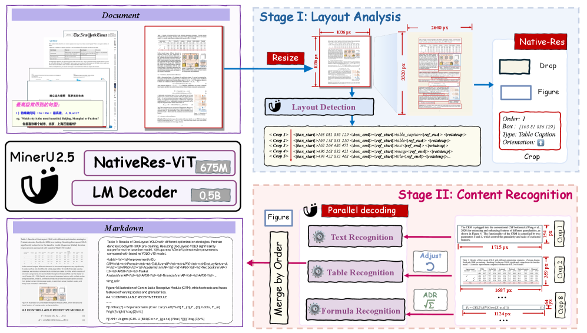
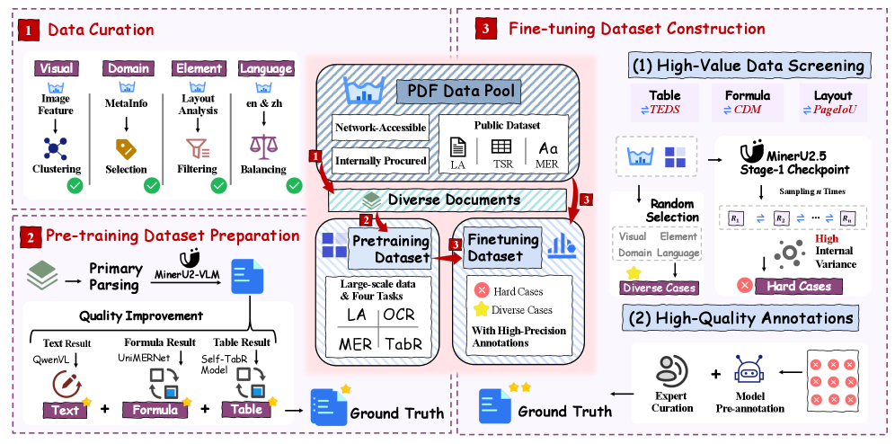
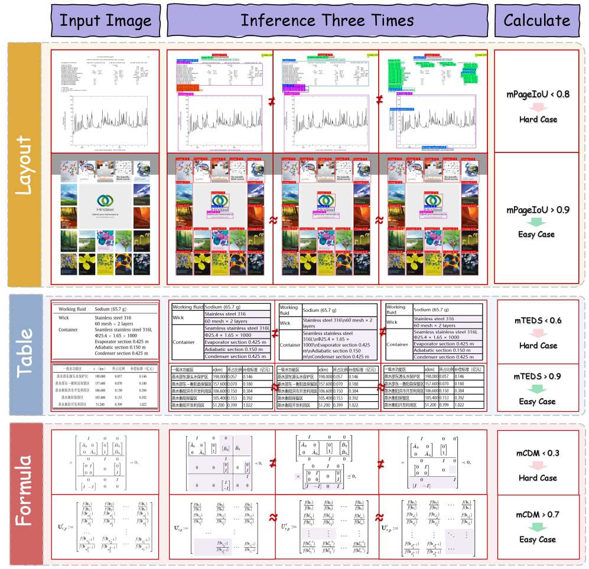
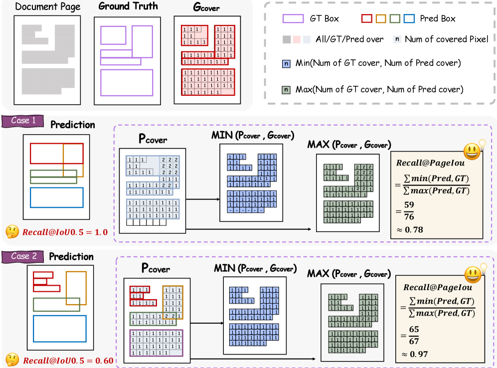
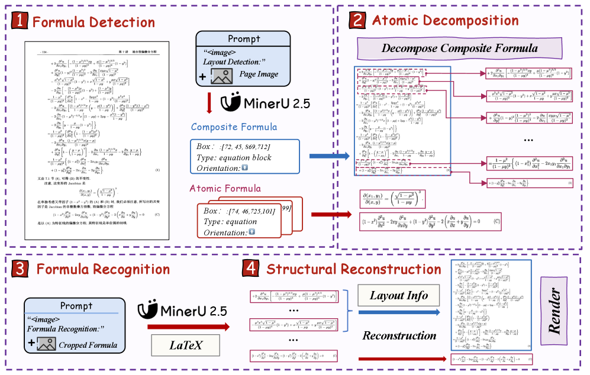
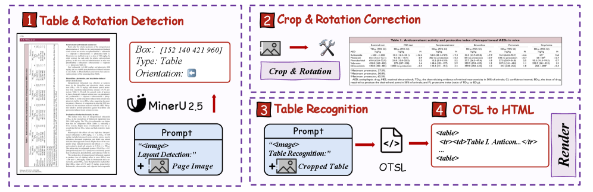

# PAPER: MinerU2.5 — 문서를 통째로 보지 말고, 축소판으로 훑고 원본에서 잘라 읽어라

## 0. 이 문서를 읽는 법

*맨 앞에 이 절을 두는 이유: 이 논문은 "새 구조를 제안한 논문"이 아니라 "잘 만든 제품의 기술 보고서"라서, 어디를 믿고 어디를 의심할지 미리 알고 읽어야 시간이 절약되기 때문입니다.*

- **3~9장**: 논문이 실제로 무엇을 했는지. 설계 선택 하나하나가 실전 지식이라 그대로 베낄 만합니다.
- **10장**: 급소. **ablation(부품별 절제 실험)이 논문에 단 하나도 없고**, Table 9에는 수학적으로 불가능한 F1 값이 섞여 있습니다. 직접 검산한 결과를 실었습니다.
- **11장**: 공개 저장소 코드와 논문의 대조. 프롬프트·해상도·penalty까지 논문대로인 것도 있고, **논문에 없는 방어 장치**도 있고, 무엇보다 **1년 뒤 제품의 기본 경로는 논문의 방식이 아닙니다.**
- 후속작 [PAPER_MinerU2.5-Pro.md](PAPER_MinerU2.5-Pro.md)와 짝을 이룹니다. 이 논문이 **구조를 확정**했고, Pro가 그 구조를 동결한 채 **데이터만 갈아서** 점수를 올렸습니다.

> **한 문장 요약**
> **MinerU2.5는 "고해상도 문서를 VLM에 통째로 넣지 말고, 축소판으로 layout(레이아웃)만 먼저 읽은 뒤 원본에서 필요한 조각만 잘라 다시 읽자"는 decoupled(분리형) coarse-to-fine(성긴→정밀) 2단계 추론을 1.2B 모델 하나로 구현한 논문이다. 구조는 Qwen2-VL 거의 그대로이고, 실제 기여의 무게중심은 Data Engine(데이터 엔진)과 task reformulation(태스크 재정의)에 있다.**

---

## 1. 메타 정보

| 항목 | 내용 |
|---|---|
| 논문 | MinerU2.5: A Decoupled Vision-Language Model for Efficient High-Resolution Document Parsing |
| arXiv | [2509.22186](https://arxiv.org/abs/2509.22186) (v1 2025-09-26, v2 2025-09-29) |
| HTML | https://arxiv.org/html/2509.22186v2 |
| 기관 | Shanghai AI Laboratory (주), Peking University, Shanghai Jiao Tong University |
| 저자 | Junbo Niu, Zheng Liu, Zhuangcheng Gu, Bin Wang 외 50여 명 / 교신저자 Conghui He |
| 코드 | https://github.com/opendatalab/MinerU (2단계 추론 실체는 https://github.com/opendatalab/mineru-vl-utils) |
| 체크포인트 | https://huggingface.co/opendatalab/MinerU2.5-2509-1.2B |
| 파라미터 | **1.2B** = NaViT vision encoder 675M + Qwen2-Instruct **0.5B** LM |
| 학습 데이터 | Stage 1 6.9M 샘플 × 2 epoch, Stage 2 630K × 3 epoch (모두 비공개) |
| 사용한 외부 모델 | Qwen2-VL-2B(인코더 초기화), Qwen2-Instruct-0.5B(LM 초기화), **Qwen2.5-VL-72B**(텍스트 라벨 교정), **Gemini-2.5-Pro**(하드케이스 사전 주석), UniMERNet(수식 라벨), LLaVA-Pretrain/Instruct(모달리티 정렬) |
| 공개 범위 | **추론 코드 + 체크포인트만.** 학습 코드·학습 데이터·Data Engine 구현 전부 비공개. HF `opendatalab` 조직 데이터셋 31개를 전수 조회했으나 학습 데이터는 0건(OmniDocBench 등은 전부 평가용) → **Q2** |
| 라이선스 | 저장소는 2026-04 AGPLv3 → **MinerU Open Source License**(Apache 2.0 기반 + 대기업 조건)로 변경 |

---

## 2. 주요 용어 사전 (Glossary)

*본문보다 앞에 두는 이유: 이 논문은 자기가 만든 용어(PageIoU, ADR, IMIC)가 세 개나 되고, 그 뜻을 모르면 표를 읽을 수 없기 때문입니다.*

### 2.1 이 논문이 만든 용어

| 용어 | 뜻 |
|---|---|
| **decoupled two-stage parsing(분리형 2단계 파싱)** | 페이지 전체 구조 파악(Stage I)과 개별 블록 내용 읽기(Stage II)를 **한 모델 안에서 두 번의 추론**으로 나눠 하는 방식. 프롬프트만 바꿔서 같은 모델이 두 역할을 함 |
| **PageIoU** | 레이아웃 품질을 재는 자체 지표. box 매칭을 포기하고 **픽셀 커버리지 맵(coverage map)**의 겹침 비율을 잼 (→ 8.2절) |
| **ADR (Atomic Decomposition & Recombination, 원자 분해·재조립)** | 긴 수식을 줄 단위로 쪼개 각각 인식한 뒤 다시 붙이는 절차 (→ 8.3절) |
| **IMIC (Iterative Mining via Inference Consistency, 추론 일관성 기반 반복 채굴)** | 같은 이미지를 여러 번 확률적으로 추론시켜 **답이 흔들리는 샘플**을 hard case(어려운 샘플)로 자동 선별 (→ 7.3절) |

### 2.2 구조 관련

| 용어 | 뜻 |
|---|---|
| **VLM (Vision-Language Model, 시각-언어 모델)** | 이미지와 글자를 함께 입력받아 글자를 출력하는 모델. 여기선 "이미지 넣고 문서 내용을 뱉는 기계" |
| **native resolution(원본 해상도)** | 이미지를 정해진 크기로 줄이지 않고 원래 크기 그대로 넣는 방식. 작은 글씨가 안 뭉개짐 |
| **NaViT** | 크기·비율이 제각각인 이미지를 그대로 처리하는 vision encoder(시각 인코더). "Patch n' Pack"이라는 이름으로도 불림 |
| **patch(패치)** | 이미지를 잘게 자른 정사각 조각. 여기선 14×14 픽셀 |
| **patch merger / pixel-unshuffle(패치 병합)** | 인접한 2×2 패치를 하나로 합쳐 토큰 수를 1/4로 줄이는 장치 |
| **M-RoPE (Multimodal Rotary Position Embedding)** | 위치 정보를 시간·세로·가로 축으로 나눠 넣는 위치 인코딩. 다양한 crop 비율에 강함 |
| **window attention(윈도우 어텐션)** | 이미지를 고정 격자로 나눠 그 안에서만 attention을 계산해 비용을 줄이는 기법. **이 논문은 문서에서 성능이 떨어진다며 거부** |
| **crop(크롭)** | 페이지에서 잘라낸 블록 이미지 조각 |

### 2.3 태스크·데이터 관련

| 용어 | 뜻 |
|---|---|
| **layout analysis(레이아웃 분석)** | 페이지에서 "여기는 제목, 여기는 표" 하고 영역과 종류를 찾아내는 일 |
| **reading order(읽기 순서)** | 사람이 읽는 순서대로 블록을 정렬하는 일. 다단(multi-column) 문서에서 특히 어려움 |
| **OTSL (Optimized Table-Structure Language)** | IBM이 만든 표 구조 표기법. HTML보다 구조 토큰이 28개 이상 → **5개**로 줄고 시퀀스 길이가 약 **50%** 짧아짐 |
| **hallucination(환각)** | 모델이 문서에 없는 내용을 지어내는 현상. 긴 텍스트나 같은 패턴 반복 구간에서 잘 터짐 |
| **hard case(어려운 샘플)** | 현재 모델이 잘 못 푸는 데이터. 사람 주석 예산을 여기에 몰아넣는 게 핵심 전략 |
| **distillation(증류)** | 큰 모델의 출력을 정답 삼아 작은 모델을 가르치는 것. 이 논문은 그 단어를 안 쓰지만 실질이 그러함 |

### 2.4 평가 지표

| 지표 | 방향 | 뜻 |
|---|---|---|
| **Edit Distance(편집 거리)** | ↓ | 정답 텍스트로 고치는 데 필요한 최소 편집 횟수(정규화). 0에 가까울수록 좋음 |
| **TEDS / TEDS-S** | ↑ | Tree-Edit-Distance-based Similarity. 표를 트리로 보고 비교. **-S는 구조만**, 일반 TEDS는 셀 내용까지 |
| **CDM (Character Detection Matching)** | ↑ | LaTeX 문자열을 **실제로 렌더링해서** 비교하는 수식 지표. `\cdots`와 `\dotsb`처럼 똑같이 보이는 표기 차이를 오답 처리하지 않음 |
| **ExpRate** | ↑ | CDM 계열에서 "완전히 똑같으면 1, 아니면 0"인 엄격 버전 |
| **Overall (OmniDocBench)** | ↑ | `((1 − Text Edit)×100 + Table TEDS + Formula CDM) ÷ 3`. **읽기 순서와 TEDS-S는 안 들어감** |

---

## 3. 논문 요약 (TL;DR)

**한 줄**: 문서 이미지를 통째로 넣는 대신 1036×1036 축소판으로 구조부터 읽고, 그 결과대로 원본에서 블록만 잘라 다시 읽게 해서 1.2B로 72B·상용 모델을 이겼다.

**핵심 문제**: 문서 이미지는 해상도는 큰데 정보는 듬성듬성합니다. native resolution(원본 해상도)으로 넣으면 여백까지 전부 토큰이 되어 **token redundancy(토큰 낭비)**가 심하고, attention 비용이 토큰 수의 제곱으로 늘어납니다. 그렇다고 줄이면 작은 글씨가 뭉개집니다.

**해결책**: 두 번에 나눠 봅니다. ① 축소판으로 "무엇이 어디 있는지"만 싸게 파악하고, ② 원본에서 그 위치만 잘라 native resolution으로 정밀하게 읽습니다. 여기에 데이터 쪽 처방(Data Engine)과 태스크 재정의(레이아웃에 회전·읽기순서 통합, PageIoU, ADR, OTSL)를 얹습니다.

**검증**: OmniDocBench Overall **90.67** (Gemini-2.5 Pro 88.03, dots.ocr 88.41, Qwen2.5-VL-72B 87.02). olmOCR-bench 75.2, Ocean-OCR bench 영문 edit 0.033. A100에서 2.12 pages/s.

**그러나**: ablation이 0건이라 "분리가 정확도를 올린다"는 중심 주장은 실험적으로 검증되지 않았습니다.

---

## 4. 핵심 기여 (Contributions)

1. **decoupled two-stage 추론을 단일 모델로** 구현 — Dolphin은 고정 해상도라 극단 비율 crop이 찌그러지고, MonkeyOCR는 단계마다 다른 모델이 필요한데, MinerU2.5는 프롬프트만 바꿔 한 모델이 두 역할을 수행.
2. **layout analysis를 4-in-1 multi-task로 재정의** — 위치 + 클래스 + **회전각** + **읽기순서**를 한 번의 추론에서 동시 출력.
3. **PageIoU** — box 매칭 기반 mAP가 문서에서 사람 직관과 어긋나는 문제를 픽셀 커버리지로 해결한 새 지표.
4. **ADR** — 긴 다줄 수식을 원자 단위로 분해→인식→재조립해서 structural hallucination(구조 환각)을 억제.
5. **표 목표 표기를 HTML → OTSL로 교체** — 시퀀스 길이 약 50% 단축.
6. **IMIC 기반 Data Engine** — 사람 주석 예산을 hard case에만 집중시키는 폐루프(closed-loop).
7. **1.2B로 SOTA + 압도적 효율** — vLLM 최적화 포함 A100 2.12 pages/s.

---

## 5. 왜 2단계로 쪼개면 싸지는가 (핵심 분석)

*이 절을 두는 이유: 논문의 모든 설계가 "토큰 낭비"라는 한 가지 문제에서 파생되고, 절감이 어디서 나오는지를 알아야 이 방법을 내 모델에 옮길 수 있기 때문입니다.*


*Figure 2. 왼쪽 위 원본 문서(2640×3339 px) → Stage I은 1036×1036 축소판에서 박스·종류·회전을 뽑고, Stage II는 원본에서 crop을 떠서 Text/Table/Formula 인식을 병렬로 돌린 뒤 읽기 순서대로 합칩니다.*

### 5.1 두 단계의 역할

| | Stage I (Layout Analysis) | Stage II (Content Recognition) |
|---|---|---|
| 입력 | **1036×1036 고정** 축소판 | 원본 해상도 crop, **상한 2048×28×28 픽셀** |
| 프롬프트 | `Layout Detection:` | `Text Recognition:` / `Formula Recognition:` / `Table Recognition:` |
| 출력 | 박스 + 카테고리 + 회전각 + 읽기순서 | 텍스트 / LaTeX / OTSL |

Stage I의 출력 형식은 다음과 같습니다(부록 8.1 원문):

```
<|box_start|>100 200 300 400<|box_end|><|ref_start|>title<|ref_end|><|rotate_up|>
<|box_start|>400 500 600 700<|box_end|><|ref_start|>text<|ref_end|><|rotate_up|>
```

좌표는 0~1000으로 정규화된 상대 좌표이고, 요소가 나오는 **순서 자체가 읽기 순서**입니다.

### 5.2 1036이라는 숫자의 정체

*왜 1024도 1000도 아닌 1036인지가 설계 의도를 드러냅니다.*

patch(패치) 크기가 14이고 2×2 patch merger(패치 병합)를 거치므로 유효 단위는 **28**입니다. 그런데

```
1036 = 28 × 37
```

즉 축소판은 **정확히 37×37 = 1369개 토큰**으로 딱 떨어집니다. 임의로 고른 값이 아니라 "패치 경계에 정확히 맞으면서 A4 한 장의 구조가 보이는 최소 크기"를 잡은 것입니다. 논문은 "너무 작으면 디테일 손실, 너무 크면 NaViT의 제곱 복잡도가 터진다"고만 적었지만, 나눗셈이 딱 떨어지는 건 우연이 아닙니다.

또 하나: **원본 비율을 유지한 축소판이 아니라 정사각 고정**을 씁니다. 이유도 명시돼 있습니다 — "bounding-box 위치 예측이 더 안정적이고 학습이 효율적"이기 때문입니다. 좌표계가 항상 같으면 모델이 좌표를 외우기 쉽습니다.

### 5.3 절감의 진짜 출처는 LM이 아니라 ViT

*논문이 근거로 드는 O(N²) 논리가 어느 부품에서 성립하는지 따져봅니다.*

논문은 "native resolution 방식은 시각 토큰이 O(N²)로 늘어 계산이 불가능해진다"고 씁니다. 그런데 **language model(언어 모델)이 0.5B밖에 안 되므로** 수천 토큰 구간에서는 attention이 MLP를 압도하지 않습니다. 실제 절감은 다른 곳에서 나옵니다.

핵심은 저자들이 **Qwen2.5-VL의 window attention을 일부러 거부하고 full attention NaViT을 택했다**는 사실입니다(문서 파싱에서 성능이 떨어져서). full attention이면 vision encoder(시각 인코더) 쪽이 진짜로 제곱 비용을 냅니다. 병합 전 패치 개수로 계산하면:

| | 패치 개수 | attention 비용 (제곱) |
|---|---|---|
| 원본 페이지 (Fig 2의 2640×3339) | (2640/14) × (3339/14) ≈ **45,000** | 45,000² |
| 축소판 1036×1036 | 74 × 74 = **5,476** | 5,476² |

개수로 8.2배, attention 비용으로는 **약 67배** 차이입니다. 게다가 Stage II의 crop들은 각자 **독립된 작은 이미지**라 서로 attention을 주고받지 않으므로, 블록 N개로 쪼개면 비용이 N배가 아니라 1/N 수준으로 떨어집니다.

> **한 줄 해석**: decoupling(분리)이란 결국 **"레이아웃이 지정해준 의미 단위로 윈도우를 자르는 것"**입니다. Qwen2.5-VL이 기계적 격자로 윈도우를 나눈 것을, MinerU2.5는 의미 단위로 나눈 셈입니다. 같은 문제(제곱 비용)에 대한 다른 답이고, **window attention을 거부한 것과 2단계를 도입한 것은 사실 한 몸의 결정**입니다.

### 5.4 부수 효과와 구조적 비용

부수 효과 세 가지는 실제로 큽니다.
- 블록 단위로 끊으니 긴 문서 hallucination(환각)이 줄어듭니다.
- 어디서 틀렸는지 추적 가능해집니다(interpretability, 해석 가능성).
- 두 단계를 따로 학습·교체할 수 있습니다.

대신 대가도 있습니다. **crop 단위로 끊으면 문맥이 사라집니다.** 페이지를 넘는 표, 잘린 문단의 이어짐, 블록 간 참조는 전부 후처리 규칙이 감당해야 합니다(11장에서 보듯 실제 코드에 그 규칙들이 잔뜩 있습니다). 그리고 **Stage I이 틀리면 Stage II는 회복 불가**입니다. 파이프라인 방식의 error propagation(오류 전파) 비판이 사라진 게 아니라 **경계가 여러 개에서 2개로 줄어든 것**입니다.

---

## 6. 모델과 학습 레시피

*이 절을 두는 이유: 구조가 얼마나 평범한지를 확인해야, 성능이 어디서 왔는지(=데이터)를 납득할 수 있기 때문입니다.*

### 6.1 구조 — 새로울 게 없다는 게 태도

| 부품 | 내용 |
|---|---|
| **Language Model** | Qwen2-Instruct **0.5B**. 이유가 솔직합니다 — "문서 파싱은 대규모 언어모델에 대한 의존도가 낮다". 1D-RoPE → **M-RoPE**로 교체해 다양한 crop 비율 대응 |
| **Vision Encoder** | Qwen2-VL-2B-Instruct에서 초기화한 **675M NaViT**, 2D-RoPE, **full attention** |
| **Patch Merger** | 인접 2×2 시각 토큰을 pixel-unshuffle로 병합 + 2층 MLP |

합계 1.2B인데 **인코더(675M)가 LM(0.5B)보다 큽니다.** "눈이 입보다 큰" 배치로, OCR 계열 모델의 전형적 형태입니다.

### 6.2 3단계 학습

*Stage 0(일반 VQA로 몸풀기)을 왜 두는지가 헷갈릴 수 있는데, 문서 데이터만으로 처음부터 학습하면 시각-언어 정렬 자체가 안 되기 때문입니다.*

| | Stage 0a<br>(언어-이미지 정렬) | Stage 0b<br>(시각 지시 튜닝) | Stage 1<br>(문서 파싱 사전학습) | Stage 2<br>(문서 파싱 미세조정) |
|---|---|---|---|---|
| 데이터 | LLaVA-Pretrain 캡션 **558K** | LLaVA-Instruct VQA **665K** | Layout&OCR **6.9M** | Layout&OCR **630K** |
| 학습 대상 | **MLP adaptor만** | 전체 | 전체 | 전체 |
| 최대 해상도 | 2048×28×28 | 4096×28×28 | 2048×28×28 | 2048×28×28 |
| 시퀀스 길이 | 4096 | 4096 | 8192 | **16384** |
| batch size | 128 | 64 | 256 | 256 |
| LR (ViT) | 1e-3 | 1e-5 | 4e-6 | 4e-6 |
| LR (MLP+LM) | 1e-3 | 1e-5 | **4e-5** | **4e-5** |
| epoch | 1 | 1 | 2 | 3 |
| 증강 | ✗ | ✗ | ✓ | ✓ |

**읽을 포인트 세 가지**

1. **Stage 1과 2에서 ViT의 학습률이 LM의 1/10** (4e-6 vs 4e-5). 이미 잘 학습된 인코더를 망가뜨리지 않으려는 전형적 처방입니다.
2. **데이터 구성 비율이 Stage 1 → 2에서 크게 바뀝니다** — 레이아웃 비중이 33% → 7%로 급감. 태스크별 상세 수치와 그 해석, 그리고 이 데이터가 어디서 왔고 공개돼 있는지는 → **Q2** 참조.
3. **시퀀스 길이가 8192 → 16384로 두 배**. 긴 표·긴 수식을 끝까지 뱉게 하려면 출력 길이가 필요합니다.

### 6.3 데이터 증강

*문서는 스캔·워터마크·그림자 같은 현실 오염이 많아서, 깨끗한 학습 데이터만으로는 실전에서 무너집니다.*

| 계열 | 연산 |
|---|---|
| **공간(Spatial)** | Scaling, Grid Distortion, Rotation |
| **배경(Background)** | Texture, Weather effect, Image background, Watermark, Scanlines, Shadow |
| **색상(Color)** | Brightness Contrast, Illumination, RGB Shift |
| **열화(Degradation)** | PSF Blur, Vibration Blur, Gaussian Blur, Erosion / Dilation |

**공간 변환은 레이아웃 샘플에 적용하지 않습니다** — 좌표 정답이 깨지기 때문입니다. 당연하지만 명시한 건 좋습니다.

### 6.4 배포 최적화

*논문에 배포 절이 따로 있는 게 특이한데, 이 모델이 논문이기 전에 제품이라는 뜻입니다.*

vLLM 기반 오프라인 추론 파이프라인에 두 가지를 얹었습니다.
- **비동기 백엔드**로 페이지 단위 요청을 배치 제출해 CPU/GPU 작업을 겹치게 함
- **Stage I과 Stage II를 독립 태스크로 분리** — 배치 전체를 기다리지 않고 결과 나오는 대로 다음 단계 시작

그리고 **degenerate token repetition(무의미한 토큰 반복)** 억제가 핵심 난제였다고 밝힙니다. 표나 수식처럼 **정당하게 반복되는 구조**까지 벌하면 안 되므로, Stage I이 알려준 블록 종류에 따라 `frequency_penalty`·`presence_penalty`를 **동적으로 조절**합니다. 텍스트 문단에는 높은 penalty, 표에는 낮은 penalty. (→ 이 주장은 11장에서 코드로 검증했습니다.)

---

## 7. Data Engine — 이 논문의 실질적 본체

*이 절을 두는 이유: 구조가 기성품이므로 성능 차이를 만든 건 결국 데이터이고, 논문 분량도 여기에 가장 많이 쓰였기 때문입니다.*


*Figure 3. ① Curation(선별) → ② 사전학습 데이터 준비(자동 주석 + 전문 모델 정제) → ③ 미세조정 데이터 구축(IMIC로 하드케이스 채굴 + 전문가 검수).*

### 7.1 Curation — 무엇을 학습할지 고른다

*원시 문서 풀은 long-tail(롱테일, 흔한 유형만 잔뜩)이라 그대로 쓰면 모델이 편식합니다.*

4개 축으로 균형을 맞춥니다.

| 축 | 방법 |
|---|---|
| Layout Diversity(레이아웃 다양성) | 페이지 단위 image clustering(이미지 군집화)으로 다양한 시각 스타일에서 대표 샘플 선발 |
| Document Type Diversity(문서 유형) | 메타데이터(학문 분야, 태그)로 stratified sampling(층화 표집) — 논문·교과서·보고서·발표자료 균형 |
| Element Balance(요소 균형) | 예비 검출 모델로 제목·문단·표·수식·그림 비율을 고르게 |
| Language Balance(언어 균형) | 중국어와 영어 문서 분량을 비슷하게 |

### 7.2 사전학습 라벨링 — 사실상 72B의 증류

*사람이 690만 장을 주석할 수는 없으니, 자동 주석의 품질을 어떻게 끌어올리느냐가 관건입니다.*

MinerU2 파이프라인으로 초벌 주석을 만든 뒤, 유형별 전문 모델(텍스트는 Qwen2.5-VL-72B, 수식은 자체 UniMERNet, 표는 자체 표 파싱 모델)로 덮어씁니다. **누가 어느 층의 라벨을 만들었는지 전체 표는 → Q2 참조.**

> **주의해서 볼 지점**: 사전학습 데이터는 실질적으로 **72B 교사 모델의 knowledge distillation(지식 증류)**입니다. 논문은 "distillation"이라는 단어를 쓰지 않지만 실질이 그렇습니다. "1.2B가 72B를 이겼다"는 결론은 **"72B를 라벨러로 써서 1.2B에 문서 도메인만 압축했다"**로 읽는 게 정확합니다.

### 7.3 IMIC — 사람을 어디에 투입할지 정한다

*자동 주석은 노이즈가 있어 성능 천장을 만듭니다. 그 천장을 뚫으려면 사람이 필요한데, 사람은 비싸니 "어디를 사람에게 맡길지"를 기계가 골라야 합니다.*


*Figure 7. (a) 레이아웃 (b) 표 (c) 수식 — 각 태스크마다 같은 입력을 여러 번 확률적으로 추론시키고, 결과들 사이의 pairwise(쌍별) 일치도를 태스크별 지표로 잽니다.*

**핵심 원리**

> 모델이 어떤 샘플의 특징을 **robust하게(안정적으로) 학습했다면**, stochastic sampling(확률적 샘플링)을 켜고 여러 번 돌려도 출력이 거의 같아야 한다. 반대로 출력이 크게 갈리면 그 샘플은 **decision boundary(결정 경계) 근처**에 있다는 뜻이고, 그게 곧 hard case다.

**태스크별 일치도 척도**

| 태스크 | 입력 | 일치도 지표 |
|---|---|---|
| Layout analysis | 페이지 전체 | **PageIoU** (쌍별) |
| Formula recognition | 수식 crop | **CDM** (쌍별) |
| Table recognition | 표 crop | **TEDS** (쌍별) |

임계값 아래로 떨어진 샘플만 사람에게 보냅니다. 사람 작업도 맨손이 아니라 **Gemini-2.5-Pro가 사전 주석**(특히 복잡한 표)한 뒤 전문가가 검수·수정하고, 자체 오픈소스 QA 도구 **Dingo**로 규칙 기반·모델 기반 점검을 겁니다.

최종 SFT 데이터셋 = **고품질 하드케이스 + 소량의 무작위 일반 샘플**. 일반 샘플을 섞는 이유는 기존 능력을 잊지 않게(catastrophic forgetting 방지) 하기 위해서입니다.

**IMIC의 구조적 한계** (후속작이 정확히 이 지점을 공격합니다)

1. IMIC가 재는 건 **그 모델 자신의 epistemic uncertainty(인식적 불확실성)**입니다. 그래서 **"나만 못 하는 것"과 "아무도 못 하는 것"을 구분하지 못합니다.** 전자는 남의 답을 베끼면 되고 후자는 사람이 붙어야 하는데, 처방이 완전히 달라서 이 구분이 결정적입니다.
2. 모델이 **자신 있게 틀리는** 경우(항상 같은 오답)는 일관성이 높으므로 영원히 안 걸립니다.

→ MinerU2.5-Pro가 IMIC를 이 이유로 비판하며 **CMCV(모델 3개 교차 합의)**로 갈아치웁니다. 자세한 비교는 [PAPER_MinerU2.5-Pro.md](PAPER_MinerU2.5-Pro.md) 5.2절.

---

## 8. 태스크 재정의 3종

*이 절을 두는 이유: 이 논문이 구조를 안 건드린 대신 "문제를 어떻게 정의할 것인가"를 바꿨고, 실전에서 바로 베낄 수 있는 지식이 대부분 여기 있기 때문입니다.*

### 8.1 레이아웃 — 4가지를 한 번에

*기존 방식은 레이아웃을 단순 object detection(객체 검출)으로 보고 읽기 순서는 뒷단 모듈에 맡기는데, 그러면 회전된 요소를 못 다루고 모듈 결합도가 올라갑니다.*

MinerU2.5는 **한 번의 추론에서 4가지를 동시 출력**합니다: Position(위치) + Class(종류) + **Rotation Angle(회전각)** + **Reading Order(읽기 순서)**.

태깅 체계도 확장했습니다. 세 가지 원칙:

| 원칙 | 내용 |
|---|---|
| **Comprehensive Coverage(포괄적 커버리지)** | header, footer, page_number 같은 **본문 아닌 요소를 버리지 않고 보존** — RAG(검색 증강 생성)에서 필요 |
| **Fine Granularity(세밀한 입도)** | figure를 image / chart / chemical_structure로 세분하고 각각의 caption에 별도 태그 |
| **Semantic Distinction(의미 구분)** | code, algorithm, reference, list를 각자의 카테고리로 — 시각적으로 구분되는 텍스트 블록의 의미를 살림 |

MinerU2-pipeline / PaddleOCR과 비교하면 MinerU2.5에만 있는 카테고리가 `phonetic`, `code_caption`, `algorithm`, `list`, `equation_block`, `page_footnote` 등입니다.

### 8.2 PageIoU — 지표가 사람 직관과 어긋나는 문제

*레이아웃을 mAP(고정 IoU 임계값)로 재면, 시각적으로 더 나은 예측이 더 낮은 점수를 받는 역전이 일어납니다.*


*Figure 4. Case 1(문단을 뭉뚱그린 예측)이 Recall@IoU0.5 = 1.0으로 만점, Case 2(줄 단위로 정확히 친 예측)가 0.60. 눈으로 보면 Case 2가 명백히 낫습니다. PageIoU로 재면 0.78 대 0.97로 뒤집힙니다.*

**계산 방식**: 박스 매칭을 포기하고 **픽셀 커버리지 맵**을 만듭니다.

- 정답 커버리지 맵 `G_cover(p)` = 픽셀 p를 덮는 정답 박스의 **개수**
- 예측 커버리지 맵 `P_cover(p)` = 픽셀 p를 덮는 예측 박스의 **개수**
- 그리고

$$\text{PageIoU}(P,G)=\frac{\sum_{p \in M}\min\{P_{cover}(p),\,G_{cover}(p)\}}{\sum_{p \in M}\max\{P_{cover}(p),\,G_{cover}(p)\}}$$

여기서 M은 페이지의 비배경 영역입니다. 교집합·합집합을 픽셀별 min·max로 대체한 것이고, Figure 4의 실제 계산은 59/76 ≈ 0.78과 65/67 ≈ 0.97입니다.

**장점**: 데이터셋마다 카테고리 정의가 달라도(어떤 데이터셋은 문단 단위, 어떤 건 줄 단위) 비교가 가능해집니다. 실제로 Table 9의 zero-shot 비교는 라벨을 5개 대분류로 매핑하고 Full Page 점수는 **카테고리를 아예 무시**하고 잽니다.

**감안할 점**: 자기가 만든 지표로 자기 SOTA를 선언하는 구조입니다.

### 8.3 ADR — 긴 수식은 쪼개서 읽는다

*VLM이 여러 줄 수식에서 구조를 통째로 지어내는(structural hallucination) 이유는, 수식을 나눌 수 없는 덩어리로 취급하기 때문입니다.*


*Figure 5. 복합 수식 → 레이아웃 분석으로 원자 줄들로 분해 → 각 줄을 개별 LaTeX로 인식 → 위치 정보로 재조립.*

**"전체-부분(whole-part)" 분해 철학**

| 종류 | 정의 |
|---|---|
| **Atomic Formula(원자 수식)** | 더 쪼갤 수 없는 최소 의미 단위, 2D 위상이 촘촘하게 얽힌 것 (분수 하나, 행렬 하나) |
| **Compound Formula(복합 수식)** | 원자 수식들이 특정 정렬 관계로 세로로 쌓인 것 (등호 정렬된 여러 줄 유도 과정) |

**4단계 절차** — 놀라운 점은 **이 전부를 MinerU2.5 자기 자신이 프롬프트만 바꿔가며 수행**한다는 것입니다.

1. 레이아웃 프롬프트로 페이지의 수식 영역을 찾고 atomic / compound로 분류
2. compound는 구성 원자 줄들의 **순서 있는 시퀀스**로 분할, 각각 이미지로 crop
3. 각 원자 이미지를 **수식 인식 프롬프트**로 다시 넣어 LaTeX 변환
4. 초기 레이아웃의 위치 정보로 `align` 환경 안에 구조적으로 재조립

어려운 인식 문제 하나를 쉬운 문제 여러 개로 바꾸는 전형적인 divide and conquer(분할 정복)입니다.

### 8.4 표 — HTML 대신 OTSL

*긴 표에서 VLM이 무너지는 원인을 목표 표기법(target representation) 자체에서 찾은 절입니다.*


*Figure 6. 표 검출 + 회전각 판정 → 기하 보정(crop + 회전) → OTSL 인식 → HTML 변환.*

**HTML의 두 가지 약점** (논문 진단)
1. 문법이 복잡하고 **시각적이지 않아** 모델이 암묵적으로 배워야 함
2. **토큰 중복이 심해** 시퀀스가 지나치게 길어지고, 큰 표에서 성능이 무너짐

**OTSL의 처방**: 표의 2D 행렬 구조에 직접 대응하는 최소 설계로, 구조 토큰이 **28개 이상 → 5개**, 평균 시퀀스 길이 **약 50% 단축**. 실제 출력은 이런 모양입니다.

```
<fcel>Site<fcel>Cl<fcel>NO3<fcel>SO4<fcel>References<nl>
<fcel>Comba<fcel>109.8<fcel>12.1<fcel>23.3<fcel>Present study<nl>
```

`<fcel>`은 내용 있는 셀, `<lcel>`은 왼쪽 셀에 병합, `<nl>`은 줄바꿈입니다. 마지막 단계에서 표준 HTML로 변환합니다. (회전된 표 문제는 8.1의 레이아웃 회전각 출력이 이미 해결하므로 여기서 따로 다루지 않습니다.)

---

## 9. 실험 결과

*이 절을 두는 이유: 이 논문의 주장이 얼마나 큰 마진으로 성립하는지, 그리고 어디서 성립하지 않는지를 숫자로 확인하기 위해서입니다.*

### 9.1 OmniDocBench (1,355 페이지) — 메인 표

| 유형 | 모델 | 파라미터 | Overall↑ | Text Edit↓ | Formula CDM↑ | Table TEDS↑ | TEDS-S↑ | Read Order↓ |
|---|---|---|---|---|---|---|---|---|
| **특화** | **MinerU2.5** | **1.2B** | **90.67** | **0.047** | **88.46** | **88.22** | **92.38** | **0.044** |
| 특화 | MonkeyOCR-pro-3B | 3.7B | 88.85 | 0.075 | 87.25 | 86.78 | 90.63 | 0.128 |
| 특화 | dots.ocr | 3B | 88.41 | 0.048 | 83.22 | 86.78 | 90.62 | 0.053 |
| 일반 | Gemini-2.5 Pro | - | 88.03 | 0.075 | 85.82 | 85.71 | 90.29 | 0.097 |
| 일반 | Qwen2.5-VL-72B | 72B | 87.02 | 0.094 | 88.27 | 82.15 | 86.22 | 0.102 |
| 파이프라인 | PP-StructureV3 | - | 86.73 | 0.073 | 85.79 | 81.68 | 89.48 | 0.073 |
| 특화 | MinerU2-VLM (전작) | 0.9B | 85.56 | 0.078 | 80.95 | 83.54 | 87.66 | 0.086 |
| 일반 | GPT-4o | - | 75.02 | 0.217 | 79.70 | 67.07 | 76.09 | 0.148 |

**직접 검산했습니다.** Overall = ((1−Text Edit)×100 + Table TEDS + Formula CDM) ÷ 3 이므로

- MinerU2.5: (95.3 + 88.22 + 88.46) / 3 = **90.66** ✅ (표기값 90.67)
- dots.ocr: (95.2 + 86.78 + 83.22) / 3 = **88.40** ✅ (88.41)
- MonkeyOCR-pro-3B: (92.5 + 86.78 + 87.25) / 3 = **88.84** ✅ (88.85)
- Gemini-2.5 Pro: (92.5 + 85.71 + 85.82) / 3 = **88.01** ✅ (88.03)

Table 5는 **내부 정합성이 있습니다.**

**하지만 마진을 뜯어보면**:
- 텍스트: dots.ocr 대비 **0.001** 차이 (0.047 vs 0.048)
- 수식: Qwen2.5-VL-72B 대비 **0.19점** 차이 (88.46 vs 88.27)
- 실제 격차를 만드는 건 **표(+1.44)와 읽기 순서(0.044 vs 0.053)**

그리고 **Overall 공식에는 읽기 순서와 TEDS-S가 들어가지 않습니다.** 즉 이 모델의 가장 큰 강점(읽기 순서 압도)은 헤드라인 점수에 반영조차 안 되어 있습니다.

### 9.2 문서 유형별 (Text Edit Distance) — 주장 직접 검증

*집계 점수 1등이 유형별로도 고른 1등인지 확인하는 절입니다.*

논문은 "9개 중 6개에서 1~2위"라고 주장합니다. 직접 세어봤습니다.

| 유형 | MinerU2.5 | 1위 모델 (값) | MinerU2.5 순위 |
|---|---|---|---|
| Slides | 0.0294 | dots.ocr (0.0290) | **2위** ✅ |
| Academic Papers | 0.0235 | MinerU2-VLM (0.0104) | 4위 ❌ |
| Book | 0.0332 | InternVL3.5-241B (0.0237) | **2위** ✅ |
| Textbook | 0.0499 | **MinerU2.5** | **1위** ✅ |
| Exam Papers | 0.0681 | dots.ocr (0.0467) | **2위**(Qwen2.5-VL-72B와 공동) ✅ |
| Magazine | 0.0316 | Gemini-2.5 Pro (0.0161) | 3위 ❌ |
| Newspaper | 0.0540 | **MinerU2.5** | **1위** ✅ |
| Notes | 0.1161 | dots.ocr (0.1116) | 3위 ❌ |
| Financial Report | 0.0104 | dots.ocr (0.0076) | **2위** ✅ |

**정확히 6개입니다. 주장은 사실입니다.** 정직한 서술입니다.

**다만 같은 표를 다르게 읽으면**: 1위는 **2개뿐**이고 **dots.ocr가 4개에서 1위**입니다. 학술논문·잡지·필기노트에서는 3~4위로 밀립니다. 집계 지표 0.047이 1등인 건 페이지 수 가중 평균 덕이지, 유형별로 고르게 이기는 게 아닙니다.

### 9.3 olmOCR-bench — 지표 교체의 함정

| 모델 | Overall | AR | OSM | TA | OS | HF | MC | LTT | Base |
|---|---|---|---|---|---|---|---|---|---|
| **MinerU2.5** | **75.2** | **76.6** | **54.6** | 84.9 | **33.7** ⚠️ | 96.6 | 78.2 | **83.5** | **93.7** ⚠️ |
| dots.ocr | 73.6 | 66.3 | 35.8 | **88.3** | 40.9 | 94.1 | **82.4** | 81.2 | 99.5 |
| olmOCR | 71.8 | 63.9 | 41.0 | 72.9 | **43.9** | 95.1 | 77.3 | 81.2 | 98.9 |
| MonkeyOCR-pro-3B | 68.8 | 67.7 | 28.4 | 74.6 | 36.1 | 91.2 | 76.6 | 80.1 | 95.3 |

(AR=arXiv Math, OSM=Old Scans Math, TA=Tables, OS=Old Scans, HF=Headers/Footers, MC=Multi Column, LTT=Long Tiny Text)

**여기에 방법론적 함정이 있습니다.** 논문은 AR과 OSM 두 subset의 지표를 원래 것 대신 **CDM의 ExpRate로 교체**했다고 명시합니다. 교체 이유(LaTeX를 AST로 파싱해 유니코드 토큰 매칭하면 `\cdots` vs `\dotsb` 같은 **똑같이 렌더링되는** 표기 차이를 오답 처리)는 완전히 타당합니다.

문제는 각주에 **"다른 결과는 olmOCR-bench와 dots.ocr의 공식 리포트에서 가져왔다"**고 되어 있어, **경쟁 모델도 같은 교체 지표로 재평가했는지가 불명확**하다는 점입니다. 그리고 하필 **그 두 subset이 격차가 가장 큰 곳**입니다 (OSM 54.6 vs 차순위 41.0, 무려 +13.6).

반대로 **OS(옛 스캔) 33.7은 비교 대상 중 꼴찌**고, Base 93.7도 최하위입니다. 오래된 스캔 문서에서는 약합니다.

### 9.4 요소별 평가

**표 인식 (Table 10, TEDS / TEDS-S)**

| 벤치마크 | MinerU2.5 | 최고 경쟁자 |
|---|---|---|
| PubTabNet | 89.07 / 93.11 | dots.ocr 90.65 / RapidTable 96.43 |
| **FinTabNet** | **95.97 / 97.61** | MiniCPM-V 4.5 85.41 (**+10.6**) |
| CC-OCR | 79.76 / 85.16 | Gemini-2.5 Pro 85.56 |
| OCRBench v2 | 87.13 / 90.62 | Gemini-2.5 Pro 88.94 |
| In-house TR (비공개) | **71.48 / 82.83** | Gemini-2.5 Pro 69.72 |

FinTabNet에서 압도적인데, 논문이 그 이유를 **직접 밝힙니다** — "재무보고서에서 추출한 대규모 고품질 표 데이터를 학습에 넣은 덕". 즉 **데이터 편식의 결과**임을 스스로 인정합니다. PubTabNet은 학습셋의 20%만 썼다며 2·3위를 설명합니다.

**수식 인식 (Table 11, CDM)**

| 모델 | CPE | HWE | SCE | SPE | LaTeX-80M_M | Chinese | Fuzzy Math | Complex |
|---|---|---|---|---|---|---|---|---|
| **MinerU2.5** | 96.6 | 94.4 | **96.4** | 98.4 | **90.6** | 90.7 | **92.6** | **82.2** |
| UniMERNet* | **98.2** | **96.5** | 95.4 | **99.2** | 83.9 | 84.0 | 84.3 | 67.9 |
| PP-Formula_plus-L | **98.2** | 94.7 | 95.7 | **99.2** | 85.9 | 84.0 | 86.5 | 76.5 |
| Qwen2.5-VL-72B | 88.9 | 91.8 | 95.5 | 96.2 | 83.4 | **90.8** | 86.7 | 81.4 |

7개 중 4개 1위. 다만 **CPE·HWE·SPE에서는 수식 전용 모델(UniMERNet, PP-FormulaNet)에 밀립니다.** 강점은 행렬(LaTeX-80M_M), 흐릿한 실제 문서(Fuzzy Math), 초고난도(Complex) 쪽입니다.

**효율 (Table 3)**

| 모델 | 파라미터 | 백엔드 | 하드웨어 | Tokens/s | Pages/s |
|---|---|---|---|---|---|
| MinerU2-VLM (전작) | 0.9B | **SGLang** | A100 80G | **3091.23** | **2.84** |
| **MinerU2.5** | 1.2B | vLLM | A100 80G | 2337.25 | 2.12 |
| **MinerU2.5** | 1.2B | vLLM | H200 141G | 4938.31 | 4.47 |
| **MinerU2.5** | 1.2B | vLLM | RTX 4090 48G | 1875.82 | 1.70 |
| Nanonets-OCR-s | 3.7B | vLLM | A100 80G | 605.92 | 0.55 |
| MonkeyOCR-pro-1.2B | 1.9B | vLLM | A100 80G | 589.76 | 0.53 |
| MonkeyOCR-pro-3B | 3.7B | vLLM | A100 80G | 520.16 | 0.47 |
| dots.ocr | 3B | vLLM | A100 80G | 311.06 | 0.28 |

최적화 없이도 0.95 pages/s로 경쟁자 기본 설정을 이긴다고 밝힙니다. **이 표의 문제는 10장 3번에서 다룹니다.**

**레이아웃 (Table 9)** — 수치에 결함이 있어 10장 2번에서 별도로 다룹니다.

---

## 10. 비판적 평가 — 급소 6개

*이 절을 두는 이유: 이 논문의 결론을 그대로 인용하기 전에 어디까지가 검증된 사실인지 선을 그어두기 위해서입니다.*

### 10-1. ablation이 논문에 하나도 없다 (가장 큰 문제)

2단계 분리 vs 단일 단계, OTSL vs HTML, ADR 켬/끔, IMIC 유무, PageIoU 유무 — **어느 것도 통제 비교(controlled comparison)가 없습니다.** Stage 0의 효과조차 "건너뛰면 loss가 높고 성능이 떨어진다"고 **말로만** 적혀 있고 숫자가 없습니다.

결과적으로 **논문의 중심 주장인 "decoupling(분리)이 정확도도 올린다"는 실험적으로 뒷받침되지 않았습니다.** 입증된 것은 **효율(Table 3)**뿐이고, 정확도는 "이 레시피 전체를 다 넣었더니 벤치마크 1위"라는 형태입니다. 어느 부품이 몇 점을 기여했는지 알 수 없습니다.

### 10-2. Table 9의 F1이 수학적으로 불가능하다 (직접 발견)

레이아웃 성능표(Table 9)를 검산하다 찾은 오류입니다. **F1은 정의상 항상 Precision과 Recall 사이의 값**인데:

| 데이터셋 / 항목 | 모델 | P | R | 논문 F1 | 실제 F1 |
|---|---|---|---|---|---|
| OmniDocBench / Table | **MinerU2.5** | 96.0 | 98.1 | **98.4** ❌ | 97.0 |
| OmniDocBench / Table | PP-StructureV3 | 96.6 | 97.4 | **98.2** ❌ | 97.0 |
| OmniDocBench / Table | DocLayout-YOLO | 94.9 | 98.1 | **98.4** ❌ | 96.5 |
| D⁴LA / Equation | PP-StructureV3 | 24.6 | 85.9 | **92.1** ❌ | 38.3 |
| DocLayNet / Image | MinerU2-VLM | 85.5 | 78.1 | **91.3** ❌ | 81.6 |

**F1이 max(P, R)를 넘습니다 — 불가능합니다.** 조화평균(harmonic mean)은 두 값 사이에 있어야 합니다.

조화평균이 안 맞는 칸은 더 많습니다. 예를 들어 D⁴LA에서 MinerU2.5의 Equation은 P=46.0, R=100.0인데 F1이 91.0으로 적혀 있습니다 — 실제 조화평균은 **63.0**입니다.

Textual 열과 Full Page 열은 대체로 맞으므로 **열 정렬이 어긋난 전사 오류**로 보입니다. 모든 모델 행에 걸쳐 있어 MinerU 쪽에만 유리한 조작은 아니지만, **이 표의 원소별 수치는 그대로 인용하면 안 됩니다.**

### 10-3. 효율 표가 자기 전작의 우위를 서술에서 지운다

Table 3에는 **자기 전작 MinerU2-VLM(0.9B)이 3091 tok/s, 2.84 pages/s로 MinerU2.5(A100, 2337 / 2.12)보다 빠르다**고 분명히 적혀 있습니다. 그런데 본문은 **"MonkeyOCR-pro-3B 대비 4배, dots.ocr 대비 7배"**만 이야기합니다.

게다가 그 행만 백엔드가 **SGLang**이고 나머지는 전부 vLLM이라 애초에 동일 조건 비교가 아닙니다. 표에 숨기지는 않았지만 서술은 유리한 쪽만 골랐습니다.

### 10-4. 평가 환경 상당 부분이 자체 관할이다

| 항목 | 관계 |
|---|---|
| **OmniDocBench** | **저자들과 같은 기관**(Shanghai AI Lab / OpenDataLab) 산출물. 게다가 이 논문을 위해 **374페이지를 추가하고 매칭 알고리즘을 바꾼** 버전을 사용 |
| **PageIoU** | 이 논문이 만든 지표로 레이아웃 SOTA 선언 |
| **In-house TR Benchmark** (표 약 500개) | 비공개 |
| **In-house 수식 3종** (Chinese / Fuzzy Math / Complex) | 비공개 |
| **olmOCR-bench** | 2개 subset의 지표를 교체 (→ 9.3절) |

개별로는 다 명분이 있습니다(문서 레이아웃에서 mAP가 이상하게 동작하는 것도, CDM이 LaTeX 표기 차이에 관대한 것도 사실입니다). 하지만 **합치면 "내가 만든 벤치마크를 내가 고친 지표로 평가"하는 구조**입니다.

### 10-5. "1.2B가 72B를 이겼다"는 프레임이 절반만 사실이다

사전학습 텍스트 라벨은 **Qwen2.5-VL-72B**가, 하드케이스 사전주석은 **Gemini-2.5-Pro**가 만듭니다. 즉 **거대 모델을 라벨러로 써서 문서 도메인만 1.2B에 압축**한 것입니다. 결과가 대단하지 않다는 뜻이 아니라, "작은 모델이 큰 모델을 이겼다"가 아니라 **"큰 모델의 문서 능력을 작은 모델에 옮겼다"**가 정확한 서술이라는 뜻입니다.

### 10-6. 재현 불가능하다

학습 코드·데이터 모두 비공개. 공개된 건 추론 코드와 체크포인트뿐입니다. **Data Engine은 문장으로만 존재합니다.** 다른 팀이 IMIC를 재현하려면 "여러 번 돌려서 안 맞는 걸 고른다"는 아이디어만 가져다 처음부터 만들어야 합니다.

여기에 더해, 학습에 **"공개 데이터셋도 섞었다"고 해놓고 목록을 밝히지 않습니다.** 특정 가능한 유일한 단서가 "PubTabNet 학습셋의 20%만 썼다"는 한 문장입니다. 원시 문서 자체도 일부는 **상업적으로 구매한(commercially procured)** 것이라 애초에 공개될 수 없습니다. 재현 가능 범위와 대체 경로는 → **Q2 (5)**.

---

## 11. 코드 리뷰 — 논문과 저장소 대조

*이 절을 두는 이유: 논문이 말하지 않은 것이 코드에 있고, 무엇보다 1년 뒤 제품의 기본 동작이 논문과 다르기 때문입니다. 클론 시점 기준 v3.4.4 (2026-07-10 커밋).*

### 11.0 먼저 알아야 할 구조

**`opendatalab/MinerU` 저장소에는 논문의 2단계 추론 로직이 없습니다.** 실제 구현은 별도 패키지 [`mineru-vl-utils`](https://github.com/opendatalab/mineru-vl-utils)의 `MinerUClient`에 있고, MinerU 본체(`mineru/backend/vlm/vlm_analyze.py`)는 그걸 호출만 합니다. 논문만 보고 저장소를 뒤지면 헤맵니다.

### 11.1 논문과 일치하는 것 (전부 코드로 확인)

| 논문 서술 | 코드 위치 | 확인 |
|---|---|---|
| 축소판 1036×1036 | `mineru_client.py:505` `layout_image_size=(1036, 1036)` | ✅ 기본값 그대로 |
| 프롬프트 4종 | `DEFAULT_PROMPTS` (`:58-66`) | ✅ `Layout Detection:` / `Text·Formula·Table Recognition:` 문자열까지 동일 |
| 출력 포맷 | `_layout_re` (`:26-31`) | ✅ `<\|box_start\|>…<\|ref_start\|>…<\|rotate_up\|>` 파싱, 좌표 0~1000 → /1000 정규화 |
| "블록 종류에 따라 penalty를 동적 조절" | `DEFAULT_SAMPLING_PARAMS` (`:68-76`) | ✅ 표는 `frequency_penalty=0.005`, 텍스트·수식·이미지는 `0.05` (**10배 차**), 레이아웃은 전부 0 |
| 극단 종횡비 crop 문제 (Dolphin 비판) | `resize_by_need` (`:214`) | ✅ **리사이즈로 찌그러뜨리지 않고**, 비율 50 초과 시 **흰 캔버스에 패딩**해서 중앙 배치 |
| OTSL 채택 | `post_process/otsl2html.py` | ✅ IBM/docling 계열 변환기 이식 |
| header/footer 보존 | `abandon_paratext=False`, `abandon_list=False` 기본 | ✅ 기본적으로 안 버림 |

프롬프트·해상도·penalty 정책이 논문 부록과 문자열 수준으로 맞는 건 드문 일입니다. **이 부분은 신뢰할 만합니다.**

### 11.2 논문에 없는데 코드에는 있는 것 (중요)

**(a) 하드 반복 차단기 — 논문의 penalty 설명은 절반만 사실**

`MinerUSamplingParams`의 기본값에 **`no_repeat_ngram_size=100`**이 있고, 이를 위해 vLLM v0/v1용 **커스텀 logits processor를 직접 구현**했습니다 (`logits_processor/vllm_v1_no_repeat_ngram.py`).

```python
# 이미 나온 100-gram의 다음 토큰을 완전 금지
banned_tokens = cached_ngrams.get(current_prefix, [])
for token in banned_tokens:
    logits[index][token] = -float("inf")
```

논문은 "frequency/presence penalty를 조절했다"고만 말하지만, 실제로는 **100-gram이 반복되면 해당 토큰의 확률을 -무한대로 완전 차단**하는 강수를 둡니다. VLM 문서 파싱의 고질병(무한 반복)에 대한 진짜 방어선은 penalty가 아니라 이쪽입니다.

**(b) 후처리 규칙 22개 파일 — 보고된 CDM은 순수 모델 성능이 아닐 수 있다**

`post_process/` 아래 구성:
- **수식 교정 7종**: `equation_big`, `equation_left_right`, `equation_double_subscript`, `equation_leq`, `equation_unbalanced_braces`, `equation_delimeters`, `equation_fix_eqqcolon`
- **표/이미지**: `otsl2html`, `table_image_processor`, `cross_page_table`(페이지 넘는 표 병합), `image_analysis_postprocess`
- **mermaid 교정 4종**, **텍스트 교정 3종**(display→inline 수식 변환, 매크로 공백, 언더스코어 위치)

**논문이 보고한 수식 CDM 점수는 이 손으로 쓴 LaTeX 교정 레이어를 통과한 뒤의 값**일 가능성이 높은데, 논문에는 한 줄도 언급이 없습니다. **모델 단독 성능과 시스템 성능이 구분되지 않습니다.**

**(c) 환각 방어 3중 장치**

| 코드 | 하는 일 |
|---|---|
| `_convert_bbox` (`:108`) | 좌표가 0~1000 밖이거나 역전·퇴화된 박스를 버림 |
| `_filter_table_internal_layout_blocks` (`:272`) | 표 **안에** 잘못 잡힌 text/equation 박스 제거 (90% 이상 포함되면) |
| `_find_covered_block_indices` (`:182`) | 이미지 안에 들어간 caption 박스 제거 |

논문의 "hallucination 완화" 주장은 모델 능력이라기보다 **이 방어 코드들과의 합작**입니다.

**(d) `scored` 모드** — `predict_scored`로 logprob(로그 확률)을 함께 받는 경로가 있습니다. 신뢰도 기반 필터링용으로 보이는데 논문에는 없습니다.

### 11.3 저장소의 현재 상태 — 논문이 이미 과거가 된 지점

**(a) 기본 체크포인트가 바뀌었습니다**

`mineru/utils/enum_class.py:97`
```python
vlm_root_hf = "opendatalab/MinerU2.5-Pro-2605-1.2B"
```
논문 모델(`MinerU2.5-2509-1.2B`)이 아니라 **Pro의 2026년 5월판**입니다. 구조는 같지만 가중치는 다릅니다.

**(b) 기본 백엔드가 `hybrid-auto-engine`으로 바뀌었습니다 — 이게 가장 중요한 발견**

2.7.0(2025-12-30)에서 `hybrid` 백엔드가 추가되고 **기본값이 `pipeline`에서 `hybrid-auto-engine`으로 전환**됐습니다. hybrid의 동작을 코드에서 확인하면:

`mineru/backend/hybrid/hybrid_analyze.py:899` 기본값 `effort="medium"`일 때:

> **VLM의 Stage I(레이아웃)을 아예 건너뜁니다.** 대신 파이프라인 계열 CNN 검출기 **PP-DocLayoutV2**(RT-DETR + LayoutLMv3 임베딩)가 레이아웃을 잡고, 그 결과를 `_build_medium_vlm_layout_blocks`로 VLM에 **외부 입력**으로 넘겨 **Stage II만** 돌립니다. 텍스트 PDF는 `pdftext`로 원문을 직접 뽑습니다.

주석에도 명시돼 있습니다: *"用 pipeline layout 构造 VLM 外部 layout 输入，跳过 VLM 自身 layout 解析"* (파이프라인 레이아웃으로 VLM 외부 레이아웃 입력을 구성, VLM 자체 레이아웃 파싱은 건너뜀).

그리고 `effort="high"`(논문의 진짜 2단계, `batch_two_step_extract`)에서조차 `_predict_layout_for_window`가 **분기 전에 무조건 먼저 실행**되어, 제목 분할·표 회전 판정·수식 마스킹에 CNN 레이아웃 결과를 씁니다.

> **즉, 논문이 "error propagation과 유지보수 부담"을 이유로 비판했던 파이프라인 방식이, 1년 뒤 제품의 기본 경로로 되돌아왔습니다.**

이유도 릴리스 노트에 명시돼 있습니다.
- 텍스트 PDF는 원문 직접 추출이 **"환각 위험이 훨씬 낮고"** 다국어에 강함
- **`medium`이 `high` 대비 OmniDocBench v1.6에서 0.13점만 손해 보면서 35~220% 빠름** (Linux 텍스트 PDF 약 80%↑, macOS 약 220%↑)

논문의 순수 VLM 2단계는 이제 **"최고 정확도나 image analysis가 필요할 때 켜는 옵션"**의 위치입니다. 논문의 기여를 부정하는 건 아니지만, **실전에서의 최적점은 논문이 그린 그림과 다른 곳에 있었다**는 뜻입니다.

**(c) 라이선스 변경 (3.1.0, 2026-04-18)**

`AGPLv3` → **MinerU Open Source License** (Apache 2.0 기반 + 부가 조건):
- **MAU 1억 초과** 또는 **월매출 2천만 달러 초과** 시 별도 상업 라이선스 필요
- 온라인 서비스 제공 시 MinerU 사용 사실을 **눈에 띄게 표기할 의무**

대부분 사용자에게는 AGPL보다 훨씬 완화된 조건입니다. 동시에 AGPL 모델 2개(`doclayoutyolo`, `mfd_yolov8`)와 CC-BY-NC-SA 모델 1개(`layoutreader`)를 제거했습니다 — **라이선스 청소를 제대로 했습니다.**

**(d) 문서 부채**

`docs/*/reference/changelog.md`는 **2.7.6(2026-02-06)에서 멈춰 있습니다.** 3.0~3.4 내역은 README에만 있고 공식 changelog에는 없습니다. **5개월치 공백**입니다.

**(e) 역설 하나**

기본 경로가 의존하는 **PP-DocLayoutV2는 Baidu PaddleOCR 계열 모델**입니다. 논문에서 PP-StructureV3를 주요 비교 대상으로 삼아 이겼다고 보고했는데, 제품은 그 진영의 레이아웃 모델을 가져와 씁니다. 좋은 엔지니어링 판단이지만 논문의 서사와는 온도차가 있습니다.

---

## 12. 💬 Q&A

### Q1. 내 작업에 바로 가져다 쓸 만한 것은?

*논문의 나머지가 재현 불가여도 이 목록은 오늘 바로 적용 가능합니다.*

| 아이디어 | 왜 좋은가 | 확인 |
|---|---|---|
| **축소판 크기를 patch 배수로 맞추기** (1036 = 28×37) | 토큰 수가 딱 떨어져 학습·추론이 안정됨 | 코드 기본값 ✅ |
| **비율 유지 대신 정사각 고정** | 좌표계가 항상 같아 bbox 예측이 안정적 | 논문 명시 |
| **회전각·읽기순서를 레이아웃 출력에 통합** | 뒷단 모듈 제거 + 회전 요소 자동 처리 | `<\|rotate_up\|>` 토큰 ✅ |
| **표 목표 표기를 HTML 대신 OTSL** | 시퀀스 50% 단축, 긴 표 붕괴 완화 | `otsl2html.py` ✅ |
| **극단 비율 crop은 리사이즈 말고 패딩** | 찌그러짐 방지 (Dolphin의 실패 지점) | `resize_by_need` ✅ |
| **블록 종류별 sampling penalty 분리** | 표의 정당한 반복을 벌하지 않음 | 표 0.005 vs 텍스트 0.05 ✅ |
| **`no_repeat_ngram` 하드 차단** | 무한 반복 최후 방어선 | 커스텀 logits processor ✅ |
| **긴 수식은 줄 단위 분해 후 재조립(ADR)** | 구조 환각 억제, 같은 모델로 3역할 | 논문 |
| **하드케이스만 사람에게 (IMIC)** | 주석 예산 대비 효과 극대화 | 논문 (구현 비공개) |

### Q2. 학습셋은 어떻게 구성했고, 공개돼 있나?

**결론부터: 학습 데이터는 전량 비공개입니다.** 공개된 건 추론 코드와 가중치뿐이고, 논문에도 데이터셋 목록이 없습니다.

#### (1) 단계별 구성

| 단계 | 데이터 | 규모 | epoch | 공개 여부 |
|---|---|---|---|---|
| Stage 0a (언어-이미지 정렬) | 이미지-캡션 쌍 | **558K** | 1 | ✅ **LLaVA-Pretrain** (외부 공개 데이터) |
| Stage 0b (시각 지시 튜닝) | VQA | **665K** | 1 | ✅ **LLaVA-Instruct** (외부 공개 데이터) |
| Stage 1 (문서 파싱 사전학습) | Layout & OCR | **6.9M** | 2 | ❌ 비공개 |
| Stage 2 (문서 파싱 미세조정) | Layout & OCR | **630K** | 3 | ❌ 비공개 |

**태스크별 분해** — 이 비율 변화가 설계 의도를 드러냅니다.

| | 레이아웃 | 텍스트 블록 | 수식 블록 | 표 블록 |
|---|---|---|---|---|
| **Stage 1** (6.9M) | 2.3M (33%) | 2.4M (35%) | 1.1M (16%) | 1.1M (16%) |
| **Stage 2** (630K) | 43K (**7%**) | 300K (48%) | 147K (23%) | 140K (22%) |

미세조정에서 레이아웃 비중이 33% → 7%로 급감합니다. **레이아웃은 사전학습에서 이미 끝났고, 남은 어려움은 내용 인식**이라는 판단입니다. 입력 형태도 다릅니다 — 레이아웃 샘플은 페이지 전체 이미지를 고정 크기로 줄이고 좌표를 상대값으로 바꾼 것이고, 인식 샘플은 텍스트/수식/표 **블록 하나짜리 단일 이미지**입니다.

#### (2) 라벨은 어디서 왔나 (3층 구조)

데이터를 사람이 만든 게 아니라 **모델이 만들고 사람이 마지막만 손봤습니다.**

| 층 | 무엇을 | 누가 만들었나 |
|---|---|---|
| ① 원시 수집 | 문서 이미지 | 웹 공개 데이터 + **상업적으로 구매한(commercially procured) 문서** |
| ② 초벌 주석 | 레이아웃·텍스트·수식·표 | MinerU2 파이프라인(자기 전작) |
| ③ 정제 | 텍스트 | **Qwen2.5-VL-72B**가 검증·교정 |
| | 수식 | 자체 재학습한 **UniMERNet**으로 치환 |
| | 표 | 자체 표 파싱 모델로 구조 전면 재생성 |
| ④ 하드케이스 | Stage 2용 소수 정예 | **Gemini-2.5-Pro** 사전 주석 → 사람 전문가 검수·수정 |

즉 **Stage 1의 690만 장은 사실상 72B 교사 모델의 distillation(증류) 결과물**이고, 사람 손이 닿은 건 Stage 2의 63만 장 중 IMIC가 골라낸 일부뿐입니다. "1.2B가 72B를 이겼다"를 읽을 때 이 구조를 알고 있어야 합니다. (→ 7.2절 해석)

#### (3) "공개 데이터셋도 섞었다"면서 목록이 없다

Stage 1 설명은 딱 이렇게만 되어 있습니다:

> "model-labeled data(모델이 라벨링한 데이터)와 public datasets(공개 데이터셋)의 대규모 혼합"

**어떤 공개 데이터셋을 얼마나 썼는지는 끝까지 안 밝힙니다.** 논문 전체에서 학습에 쓴 공개 데이터가 특정되는 유일한 단서는 표 실험 논의에 지나가듯 나오는 한 문장입니다:

> "PubTabNet 학습셋의 **20%만** 사용했음에도…"

여기서 두 가지가 드러납니다. ① PubTabNet 학습셋을 실제로 썼고, ② 그런데 **PubTabNet은 자기들이 평가에도 쓰는 벤치마크**입니다(Table 10). 학습셋과 테스트셋이 분리돼 있으니 규칙 위반은 아니지만, **"20%만 썼다"는 해명이 필요했다는 사실 자체**가 도메인 근접성을 인정하는 대목입니다. FinTabNet에서 차순위를 10.6점 차로 압도한 것도 논문이 직접 "재무보고서 표를 대량으로 학습에 넣은 덕"이라고 밝힙니다.

#### (4) 실제로 공개된 게 있는지 확인 (HuggingFace 조회)

HuggingFace의 `opendatalab` 조직 데이터셋 **31개를 전부 조회**했습니다. **MinerU 학습 데이터는 없습니다.**

| 있는 것 | 성격 |
|---|---|
| `opendatalab/OmniDocBench` (다운로드 33K) | **평가용** 벤치마크 (학습 데이터 아님) |
| `OHR-Bench`, `WebMainBench`, `ScienceMetaBench` | 전부 평가용 |
| `WanJuan-*`, `SlimPajama-*`, `ChartVerse-*`, `AICC` | LLM 사전학습 코퍼스·차트 등, MinerU와 무관 |

즉 **문서 파싱 학습 데이터는 단 한 건도 공개되지 않았습니다.** 후속작 MinerU2.5-Pro(6550만 장)도 마찬가지입니다.

#### (5) 그래서 재현이 되나

| 항목 | 상태 |
|---|---|
| 추론 코드 | ✅ 공개 (`MinerU` + `mineru-vl-utils`) |
| 체크포인트 | ✅ 공개 (HF/ModelScope) |
| **학습 코드** | ❌ 없음 |
| **학습 데이터** | ❌ 없음 |
| **Data Engine 구현** | ❌ 없음 (IMIC는 문장으로만 존재) |
| 초기화 가중치 | ✅ Qwen2-VL-2B(인코더), Qwen2-Instruct-0.5B(LM) — 공개 |
| Stage 0 데이터 | ✅ LLaVA-Pretrain/Instruct — 공개 |

**따라서 남이 따라 하려면**: Stage 0까지는 그대로 재현 가능하지만, Stage 1의 690만 장을 직접 만들어야 합니다. 논문이 알려주는 건 레시피뿐입니다 — 문서를 모아서, MinerU2 파이프라인 같은 기성 도구로 초벌 라벨을 뽑고, 큰 VLM으로 텍스트를 교정하고, 수식·표는 전용 모델로 갈아끼우고, 프롬프트 4종과 출력 포맷(`<|box_start|>` 방식)을 맞추면 된다는 것. 이건 **실행 가능한 레시피이긴 합니다** — 실제로 필요한 건 라벨러로 쓸 큰 모델의 추론 비용과 문서 수집이지, 비밀 기술이 아닙니다.

다만 **하드케이스 주석(사람 + Gemini)과 상업적으로 구매한 문서**는 돈으로만 해결되는 부분이라, 이 논문의 마지막 몇 점은 예산이 만든 격차입니다.

### Q3. 논문의 O(N²) 논리는 정확한가?

**방향은 맞지만 부품을 잘못 짚었습니다.** 논문은 "시각 토큰이 O(N²)"라고 쓰는데, 실제로 제곱 비용을 내는 건 **language model이 아니라 vision encoder**입니다.

LM이 0.5B(hidden 896)라서 수천 토큰 구간에서는 attention과 MLP 비용이 비슷한 수준입니다. 반면 vision encoder는 **675M full attention NaViT**이고, 병합 **전** 패치 개수로 동작하므로 토큰 수가 4배 많습니다. Fig 2의 실제 페이지(2640×3339)로 계산하면 약 45,000 패치 대 축소판 5,476 패치 — attention 비용 약 67배 차이입니다. 자세한 계산은 5.3절 참조.

이게 중요한 이유: **window attention을 거부한 결정과 2단계 도입이 한 몸**이라는 걸 알아야, 다른 모델에 이 아이디어를 옮길 때 판단이 섭니다. 이미 window attention을 쓰고 있다면 2단계의 이득이 훨씬 작습니다.

### Q4. IMIC와 후속작의 CMCV는 뭐가 다른가?

| | **IMIC** (이 논문) | **CMCV** (MinerU2.5-Pro) |
|---|---|---|
| 방식 | **한 모델**을 여러 번 확률적으로 추론 | **이질적 모델 3개**(MinerU2.5 + PaddleOCR-VL + Qwen3-VL-30B)의 출력을 비교 |
| 재는 것 | 그 모델의 epistemic uncertainty(인식적 불확실성) | 문제 자체의 난이도 |
| 구분 못 하는 것 | **"나만 못 하는 것" vs "아무도 못 하는 것"** | (이 구분이 목적) |
| 라벨 | 사람이 처음부터 | Medium 등급은 **외부 모델 합의가 곧 정답** (공짜) |
| 못 잡는 것 | 자신 있게 틀리는 경우(항상 같은 오답) | 3개 모델이 똑같이 틀리는 경우 |

**핵심 차이**: IMIC는 "내가 헷갈리는 것"을 찾고, CMCV는 "남들은 되는데 나만 안 되는 것"을 찾습니다. 후자가 훈련 가치가 훨씬 높은 이유는 ① 능력 공백을 정확히 짚고 ② **배울 수 있는 문제임이 이미 증명**됐고 ③ 외부 합의가 **추가 교정 없이 바로 정답 라벨**이 되기 때문입니다. 자세한 것은 [PAPER_MinerU2.5-Pro.md](PAPER_MinerU2.5-Pro.md) 5.2절.

### Q5. 문서 파싱 모델 계보에서 어디에 있나?

```
MinerU (2409.18839)        파이프라인 = 특화 모델 여러 개 조립 (PDF-Extract-Kit)
   ↓                        문제: error propagation, 유지보수 지옥
MinerU2-VLM 0.9B           end-to-end VLM 한 방
   ↓                        문제: 고해상도 토큰 폭발, 긴 문서 환각
MinerU2.5 (이 논문)         decoupled 2-stage, 1.2B — 구조 확정
   ↓                        남은 문제: 데이터 커버리지·난이도 편중
MinerU2.5-Pro (2604.04771)  구조 완전 동결 + 데이터만 6550만 장으로 교체
   ↓                        92.98 → 95.69
MinerU 3.x (제품, 2026)     hybrid = 파이프라인 레이아웃 + 원문 추출 + VLM은 어려운 요소만
```

같은 계열(decoupled VLM)에는 Dolphin(Swin 고정 해상도), MonkeyOCR(단계별 별도 모델), GLM-OCR, PaddleOCR-VL이 있습니다. MinerU2.5의 차별점은 **단일 모델 + native resolution**을 동시에 만족한 것입니다.

계보 전체를 보면 **파이프라인 → end-to-end → decoupled → 다시 hybrid**로 한 바퀴 돌았습니다. 각 단계가 앞 단계의 실패를 고치면서 앞 단계의 장점을 일부 되찾는 형태입니다.

### Q6. 이 논문을 인용할 때 주의할 점은?

1. **Table 9의 원소별 P/R/F1은 인용 금지** — F1이 max(P,R)을 넘는 칸이 여러 개입니다 (→ 10-2).
2. **"1.2B가 Gemini/72B를 이겼다"는 조건부** — 라벨을 그 72B가 만들었습니다 (→ 10-5).
3. **"2단계가 정확도를 올린다"는 미검증** — ablation이 없습니다 (→ 10-1).
4. **효율 4×/7× 주장은 백엔드가 섞여 있음** — 자기 전작은 SGLang, 나머지는 vLLM (→ 10-3).
5. **olmOCR-bench 수치는 지표 교체 후 값** — 경쟁 모델도 같은 처리를 받았는지 불명확 (→ 9.3).
6. **Overall 90.67에는 읽기 순서가 안 들어감** — 정작 이 모델의 최대 강점입니다 (→ 9.1).

---

## 13. 한 줄 요약

> **MinerU2.5는 "축소판으로 구조 읽고 원본에서 조각 잘라 읽기"라는 한 가지 아이디어를 1.2B 모델과 Data Engine으로 끝까지 밀어붙여 문서 파싱 SOTA를 찍은 잘 만든 기술 보고서다. 설계 선택 하나하나(1036=28×37, 정사각 고정, 회전·읽기순서 통합, OTSL, 극단 비율 패딩, 블록별 penalty)는 코드로 검증되는 실전 지식이지만, ablation이 0건이고 평가 환경 상당 부분이 자체 관할이며 Table 9에는 수학적으로 불가능한 값이 섞여 있다. 그리고 1년 뒤, 이 논문이 비판했던 파이프라인 방식이 제품의 기본 경로로 돌아왔다 — 0.13점을 내주고 최대 220% 빨라진다는 이유로.**

---

## 14. 관련 문서

- [PAPER_MinerU2.5-Pro.md](PAPER_MinerU2.5-Pro.md) — 이 논문의 구조를 한 글자도 안 바꾸고 데이터만 갈아 92.98 → 95.69를 만든 후속작. IMIC → CMCV 교체
- [PAPER_PaddleOCR-VL-1.6.md](PAPER_PaddleOCR-VL-1.6.md) — 같은 decoupled 계열 경쟁자. 코드·config 동결 후 데이터만으로 SOTA
- [PAPER_GLM-OCR.md](PAPER_GLM-OCR.md) — 같은 계열, 파라미터 수 미계상 문제
- [PAPER_DeepSeek-OCR.md](PAPER_DeepSeek-OCR.md) — 반대 방향 접근(텍스트→이미지 광학 압축)
- [PAPER_Qwen3-VL.md](PAPER_Qwen3-VL.md) — 비교 대상 계열의 일반 VLM
- [PAPER_Florence-2.md](PAPER_Florence-2.md) — 좌표를 토큰으로 바꿔 검출을 seq2seq로 통일한 선례 (`<|box_start|>` 방식의 조상)
- [PAPER_TrOCR.md](PAPER_TrOCR.md) — 사전학습 인코더·디코더 조립형 OCR의 원형
