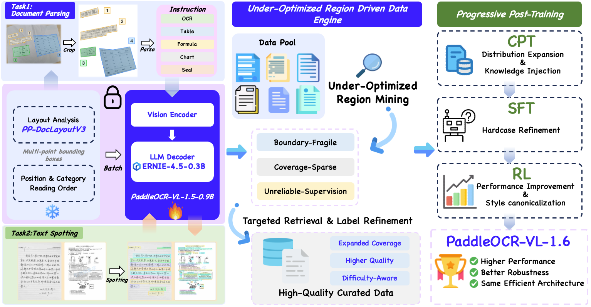
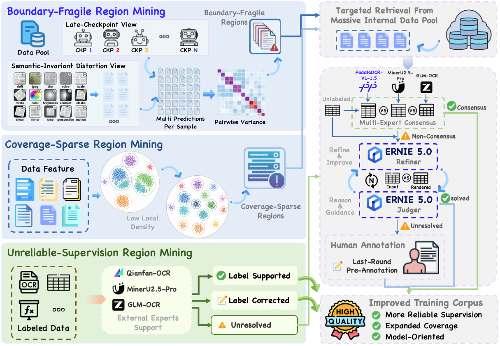
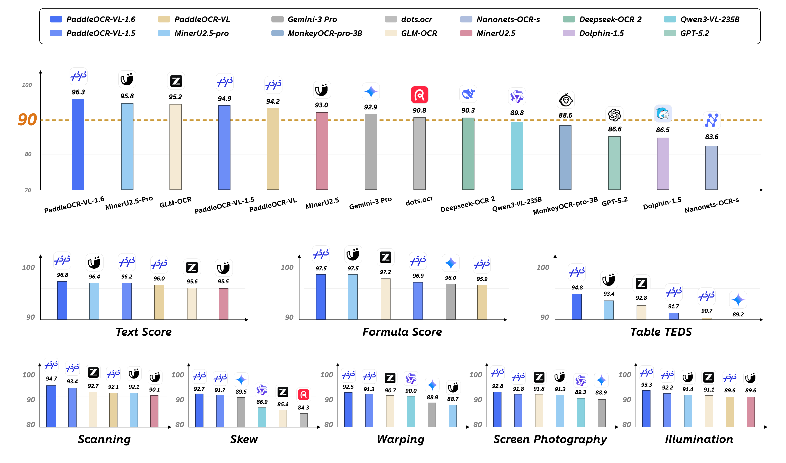

# PaddleOCR-VL-1.6 — 구조는 그대로, 데이터와 후처리만으로 SOTA

## 📌 메타 정보

| 항목 | 내용 |
|---|---|
| **논문 제목** | PaddleOCR-VL-1.6: Expanding the Frontier of Document Parsing with Under-Optimized Region Refinement and Progressive Post-Training |
| **저자** | Zelun Zhang, Hongen Liu, Suyin Liang, Yubo Zhang, Yiqing Xiang, Jiaxuan Liu, Ting Sun, Manhui Lin, Yue Zhang, Changda Zhou, Tingquan Gao, Cheng Cui†, Yi Liu, Dianhai Yu, Yanjun Ma († Project Leader) |
| **소속** | PaddlePaddle Team, **Baidu Inc.** |
| **공개일** | 2026-06-02 (arXiv v1) / 모델 공개 2026-05-28 |
| **분야** | Document Parsing (문서 파싱), OCR, Vision-Language Model (VLM), Post-Training |
| **arXiv abstract** | https://arxiv.org/abs/2606.03264 |
| **arXiv PDF** | https://arxiv.org/pdf/2606.03264 |
| **모델 (HF)** | https://huggingface.co/PaddlePaddle/PaddleOCR-VL-1.6 |
| **코드** | https://github.com/PaddlePaddle/PaddleOCR (추론 파이프라인만. **학습 코드 없음**) |
| **라이선스** | Apache 2.0 |
| **베이스 모델** | PaddleOCR-VL-1.5 (arXiv 2601.21957) — 체크포인트를 이어받아 후처리만 진행 |
| **재사용한 사전학습 모델** | 비전 인코더 = SigLIP-so400m 계열 (patch14/384), 언어 모델 = ERNIE-4.5-0.3B |
| **데이터 엔진에 동원된 외부 모델** | Qianfan-OCR, GLM-OCR, MinerU2.5-Pro (전문가 3인 투표) + **ERNIE 5.0** (judge & refiner) |
| **벤치마크** | OmniDocBench v1.6, Real5-OmniDocBench, 인하우스 4종(표/차트/스포팅/인장) |
| **직접 비교 대상 논문** | **GLM-OCR** (arXiv 2603.10910, Zhipu AI + 칭화대, 2026-03-16) / **MinerU2.5-Pro** (arXiv 2604.04771, 상하이 AI Lab + OpenDataLab, 2026-04-09) / MinerU2.5 (2509.22186) — §7 Q7~Q10 참조 |

---

## 📖 주요 용어 사전 (Glossary)

### 과제 / 시스템

| 용어 | 풀이 |
|---|---|
| **document parsing(문서 파싱)** | 문서 이미지를 Markdown이나 JSON 같은 기계가 읽을 수 있는 구조로 통째로 되살리는 작업. 글자만 뽑는 게 아니라 layout(레이아웃), reading order(읽기 순서), 수식, 표, 차트, 도장까지 전부 복원해야 한다. |
| **text spotting(텍스트 스포팅)** | 검출(detection)과 인식(recognition)을 한 번에 하는 것. "어디에 무슨 글자가 있다"를 동시에 출력한다. |
| **PP-DocLayoutV3** | PaddleOCR의 layout analysis(레이아웃 분석) 모델. 1.6에서는 **손대지 않고 그대로** 사용. 페이지를 영역별로 잘라주는 1단계 담당. |
| **two-stage framework(2단 구조)** | 1단계 PP-DocLayoutV3가 영역을 자르고 → 2단계 PaddleOCR-VL-1.6-0.9B가 각 영역을 인식하는 분업 구조. |
| **OTSL** | Optimized Table Structure Language. 표 구조를 짧은 토큰 열로 표현하는 형식. HTML보다 토큰이 적게 든다. |

### 아키텍처

| 용어 | 풀이 |
|---|---|
| **VLM (Vision-Language Model, 시각-언어 모델)** | 이미지와 텍스트를 같이 받아 텍스트를 뱉는 모델. 여기서는 "문서 이미지 + 지시문 → 구조화된 텍스트". |
| **native resolution(원본 해상도) 인코더** | 이미지를 정사각형으로 억지로 늘리지 않고, 원래 가로세로 비율 그대로 patch(패치)로 잘라 넣는 방식. NaViT(Patch n' Pack) 논문에서 나온 아이디어. |
| **SigLIP-so400m** | 구글이 공개한 4억 파라미터급 이미지 인코더. hidden 1152 / 27층 / patch 14 / 입력 384². 이 논문의 눈(eye) 역할. |
| **APE (Absolute Position Embedding, 절대 위치 임베딩)** | "이 패치는 왼쪽 위에서 몇 번째"라는 좌표를 학습된 벡터로 더해주는 방식. |
| **RoPE (Rotary Position Embedding, 회전 위치 임베딩)** | 좌표를 벡터에 더하지 않고 **회전**시켜 넣는 방식. 상대 거리 정보가 자연스럽게 담긴다. |
| **2D RoPE** | 높이(h)와 너비(w) 두 축에 각각 RoPE를 걸어 합친 것. 이미지 패치용. |
| **3D RoPE / mRoPE (multimodal RoPE)** | 시간(t)·높이(h)·너비(w) 세 축으로 쪼갠 RoPE. 언어 모델 쪽에서 이미지 토큰과 텍스트 토큰의 위치를 구분해준다. 이 모델은 `mrope_section=[16,24,24]`. |
| **GQA (Grouped Query Attention, 그룹 질의 어텐션)** | Q 헤드는 많이, K/V 헤드는 적게 두어 KV cache(키·값 캐시) 메모리를 줄이는 기법. 이 모델은 Q 16개 : KV 2개 = 8:1. |
| **connector(커넥터) / projector(투영기)** | 비전 인코더의 출력 벡터를 언어 모델이 알아듣는 차원으로 바꿔주는 다리. 이 모델은 2×2 패치를 접어 붙인 뒤 MLP 2층. |
| **patch packing(패치 패킹)** | 길이가 다른 여러 이미지를 padding(패딩) 없이 한 줄로 이어 붙여 한 번에 처리하는 기법. `cu_seqlens`(누적 길이 배열)와 `flash_attn_varlen_func`로 구현. |

### 이 논문의 핵심 개념

| 용어 | 풀이 |
|---|---|
| **UOR (Under-Optimized Region, 덜 최적화된 영역)** | 이 논문이 만든 말. "현재 모델이 문서 이미지 → 구조화 출력의 믿을 만한 대응 관계를 아직 못 배운 데이터·정답 공간의 국소 지역". 세 종류로 나뉜다. |
| **Boundary-Fragile Region(경계 취약 영역)** | 거의 수렴한 모델인데도 예측이 흔들리는 샘플들. decision boundary(결정 경계)가 불안정하다는 뜻. |
| **Coverage-Sparse Region(커버리지 희박 영역)** | feature space(특징 공간)에서 주변에 비슷한 학습 샘플이 거의 없는 외딴 지역. long-tail(롱테일, 희귀 유형) 문서가 여기 산다. |
| **Unreliable-Supervision Region(정답 불신 영역)** | 입력이 어려운 게 아니라 **붙어 있는 정답 라벨 자체가 틀린** 샘플들. |
| **semantic-invariant distortion(의미 보존 왜곡)** | 픽셀 시프트, JPEG 압축, 노이즈, 블러처럼 **내용은 안 바뀌는** 가벼운 변형. 여기에 출력이 크게 흔들리면 모델이 불안정한 것. |
| **render-guided refinement(렌더 기반 정제)** | LaTeX/HTML 문자열을 이미지로 **그려서(render)** 원본 이미지와 눈으로 비교하게 만드는 검증 방식. |
| **multi-expert consensus(다중 전문가 합의)** | 서로 다른 데이터·구조로 학습된 강한 모델 여러 개가 같은 샘플을 예측해 투표하는 것. |

### 학습 / 강화학습

| 용어 | 풀이 |
|---|---|
| **CPT (Continued Pre-Training, 이어서 사전학습)** | 이미 학습된 모델에 새 분포의 데이터를 대량으로 부어 지식을 넓히는 단계. |
| **SFT (Supervised Fine-Tuning, 지도 미세조정)** | 정답이 확실한 고품질 데이터로 행동을 다듬는 단계. |
| **RL (Reinforcement Learning, 강화학습)** | 정답 대신 **보상(reward)** 을 주고 스스로 좋은 출력을 찾게 하는 단계. |
| **GRPO (Group Relative Policy Optimization)** | 같은 입력에 대해 여러 개(=group)의 답을 뽑아 서로 비교해 상대적 우열로 학습하는 RL 기법. value model(가치 모델)이 따로 필요 없다. |
| **rollout(롤아웃)** | 현재 모델이 실제로 생성해본 답 하나. 여기선 샘플당 16개를 뽑는다. |
| **DAPO** | GRPO 개선판. **clip-higher**(상한 클리핑을 느슨하게, 여기선 0.28)와 **dynamic sampling**(그룹 내 보상 분산이 0이면 그 그룹을 버림)을 제안. 이 논문이 그대로 채택. |
| **verifiable reward(검증 가능한 보상)** | 사람 평가나 보상 모델 없이, 정답과 규칙만으로 자동 계산되는 보상. OCR은 편집거리, 표는 TEDS 등. |
| **UACS (Uncertainty-Aware Cluster Sampling)** | 1.5에서 쓰던 하드 샘플 채굴법. 불확실성 기준으로 군집에서 어려운 샘플을 골라낸다. |

### 평가 지표

| 지표 | 풀이 |
|---|---|
| **Edit distance(편집 거리) / NED** | 예측 문자열을 정답으로 고치는 데 필요한 최소 편집 횟수. NED는 길이로 나눈 정규화 버전. **낮을수록 좋음**. |
| **TEDS (Tree-Edit-Distance Similarity)** | 표를 트리로 보고 구조+내용의 유사도를 재는 지표. **TEDS-S**는 내용을 빼고 **구조만** 본다. 높을수록 좋음. |
| **CDM (Character Detection Matching)** | 수식(LaTeX) 평가 지표. 문자열을 그대로 비교하지 않고 **렌더링한 뒤 문자 단위로 매칭**한다. 같은 수식의 여러 표기법 문제를 피한다. |
| **RMS-F1** | 차트를 데이터 표로 되살렸을 때의 F1 계열 지표. |
| **MGAM (Multi-Granularity Adaptive Matching)** | OmniDocBench v1.6에서 새로 도입. 예측이 정답과 **다른 단위로 쪼개져 있어도** 의미가 같으면 맞다고 쳐주는 매칭 방식. |
| **OmniDocBench v1.6** | v1.5 대비 ① MGAM 도입 ② **Hard subset 296장**(복잡 중첩 표, 조밀한 수식, 비정형 구조) 추가. **이 벤치마크 자체가 MinerU2.5-Pro 논문의 기여**이며, Base(표준) / Hard(고난도) / Full(전체) **3단 프로토콜**이 핵심 설계다. PaddleOCR-VL-1.6은 Full만 보고한다(→ Q9). |
| **MTP (Multi-Token Prediction, 멀티 토큰 예측)** | GLM-OCR의 구조적 기여. 메인 헤드 외에 **파라미터를 공유하는** 보조 헤드 k개를 붙여 한 스텝에 여러 토큰을 동시에 예측한다. 파라미터 공유라 메모리 추가분이 거의 없다. |
| **DDAS (Diversity-and-Difficulty-Aware Sampling)** | MinerU2.5-Pro의 데이터 채굴법. ViT-base 임베딩 + **K-Means** 클러스터링을 페이지/요소 2단계로 돌려 다양성과 난이도를 동시에 균형 잡는다. PaddleOCR-VL-1.6의 Coverage-Sparse에 대응. |
| **CMCV (Cross-Model Consistency Verification)** | MinerU2.5-Pro의 라벨 검증법. 이종 모델 3개의 출력 일치 패턴으로 샘플을 Easy / Medium / Hard로 층화. PaddleOCR-VL-1.6의 Unreliable-Supervision 전문가 투표에 대응. |
| **KIE (Key Information Extraction, 핵심 정보 추출)** | 문서에서 송장 번호·금액 같은 **특정 필드만** JSON으로 뽑는 과제. 세 모델 중 GLM-OCR만 지원한다. |
| **Real5-OmniDocBench** | 저자들이 만든 실사용 벤치. OmniDocBench v1.5 원본과 1:1 대응되게, 스캔 / 휘어짐(warping) / 화면 촬영 / 조명 변화 / 기울기 5개 시나리오를 **손으로 직접 촬영**해 만들었다. |

---

## 🎯 논문 요약 (TL;DR)

**한 줄**: PaddleOCR-VL-1.5의 **구조를 단 한 줄도 바꾸지 않고**, "이 모델이 못 하는 데이터 영역"을 세 가지 방법으로 찾아내 보강한 뒤 CPT→SFT→RL 3단 후처리만으로 OmniDocBench v1.6을 94.93 → **96.33**으로 올린 논문.

**핵심 문제**: 1.5가 이미 강한 0.9B baseline(기준선)이 된 상황에서, 남은 오차는 **고르게 퍼진 잡음이 아니다**. ① 모델이 불안정한 지점 ② 데이터가 희박한 지점 ③ 정답 라벨이 틀린 지점에 몰려 있다. 데이터를 균등하게 늘리면 이미 잘하는 영역에 예산을 낭비하게 된다. 특히 0.9B 같은 작은 모델은 데이터 효율과 분포 균형에 훨씬 민감하다.

**해결책**:
1. **UOR 데이터 엔진** — 위 세 종류의 약한 영역을 각각 다른 방법으로 진단하고, ①②는 내부 데이터 풀에서 비슷한 데이터를 끌어오는 **검색 씨앗(retrieval seed)** 으로, ③은 **라벨 교정 대상**으로 쓴다.
2. **자동 라벨링** — 외부 전문가 3개의 합의 + 합의 실패 시 ERNIE 5.0의 **렌더 기반 반복 정제(judge-and-refine)**.
3. **점진 후처리** — 데이터 신뢰도에 따라 CPT(16.8M) → SFT(7.3M) → RL(49K)로 좁혀가며 적용.

**검증**: OmniDocBench v1.6 **96.33%** 종합 1위(0.9B로 235B·Gemini 3 Pro·GPT-5.2 전부 추월), Real5-OmniDocBench 93.19%로 5개 시나리오 전부 SOTA, 인하우스 표/차트/스포팅/인장 4종 모두 1위.

---

## 🏆 핵심 기여 (Contributions)

논문이 스스로 밝힌 기여 4가지:

1. **PaddleOCR-VL-1.6** 자체 — 1.5의 컴팩트 0.9B 규모를 유지하면서 OmniDocBench v1.6 SOTA 달성. 구조 호환이라 **교체 비용 0**.
2. **Under-Optimized Region Mining** — boundary-fragile / coverage-sparse / unreliable-supervision 세 종류의 약점을 진단하는 방법론. 여기에 다중 전문가 합의 + 반복 judge-and-refine을 결합한 고정밀 자동 라벨링 파이프라인.
3. **RL용 데이터 선별 전략** — 작은 모델의 RL은 데이터 품질에 극도로 민감하다는 전제 아래, ① 개선 여지(improvement potential) ② 생성 불확실성(entropy-based uncertainty) ③ 롤아웃 보상 분포 세 관점으로 후보를 평가.
4. **CPT-SFT-RL 점진 후처리 레시피** — PaddleOCR-VL 계열을 downstream(하위 도메인)에 적응시키는 실전 참조 레시피.

> ⚠️ 뒤의 §7 Q&A에서 다루지만, 기여 4개 중 2개가 RL 관련인데 **RL의 실제 이득은 +0.08점**이다.

---

## 🔬 주요 알고리즘 설명

### 5.0 먼저: "구조를 안 바꿨다"가 진짜인지 코드로 검증

*논문과 모델 카드가 "zero-cost plug-and-play migration(교체 비용 0의 즉시 대체)"이라고 주장하는데, 이게 사실이면 이 논문에 구조적 기여는 없다는 뜻이므로 먼저 확인해야 한다.*

HuggingFace에서 1.5와 1.6의 파일을 각각 받아 직접 비교했다.

| 파일 | 결과 |
|---|---|
| `config.json` | **완전 동일** |
| `modeling_paddleocr_vl.py` (103,889 bytes) | **완전 동일** |
| `image_processing_paddleocr_vl.py` | **완전 동일** |
| `processing_paddleocr_vl.py` | **완전 동일** |
| `preprocessor_config.json` | **완전 동일** |

**바이트 단위로 같다.** 바뀐 건 `model.safetensors` 하나뿐. 주장은 사실이고, 동시에 **이 논문에 구조적 기여는 0**이라는 뜻이기도 하다. 그래서 이 문서의 §5는 "새 알고리즘 해설"이 아니라 **"물려받은 구조의 해부 + 데이터/학습 알고리즘 해설"** 로 구성한다.

---

### 5.1 물려받은 구조 해부 (코드 + 체크포인트 실측)

*논문은 구조를 "Native Resolution Visual Encoder + Adaptive MLP Connector + ERNIE-4.5-0.3B" 한 줄로 넘어가는데, 실제로 어디에 파라미터가 쓰였는지 알아야 "0.9B"라는 숫자의 의미를 알 수 있다.*

`model.safetensors` 헤더를 직접 파싱해 텐서를 세어본 결과:

| 블록 | 파라미터 | 비중 |
|---|---|---|
| `visual` (ViT, 눈) | **465.97M** | 48.6% |
| `model` (ERNIE Transformer 18층) | 254.84M | 26.6% |
| `embed_tokens` (입력 임베딩) | 105.91M | 11.0% |
| `lm_head` (출력 임베딩, untied) | 105.91M | 11.0% |
| `mlp_AR` (connector, 다리) | 25.96M | 2.7% |
| **합계** | **958.6M** | 100% |

**첫 번째 포인트**: "0.9B VLM"이라고 하지만 **절반이 눈(ViT 466M)이고 절반이 입(LLM 467M)** 이다. 언어 모델 본체는 실제로 0.3B급(임베딩 제외 시 255M)이고, 문서 파싱이라는 과제 특성상 **"읽는 쪽"에 예산을 몰아준 설계**다. 논문은 이 비대칭을 전혀 언급하지 않는다.

#### 비전 인코더의 정체

`vision_config`를 보면 hidden 1152 / 27층 / intermediate 4304 / 16 heads / patch 14 / image_size 384 → **SigLIP-so400m-patch14-384** 그 자체다. 여기에 세 가지를 덧붙여 native resolution(원본 해상도)용으로 개조했다.

1. **학습된 APE(절대 위치 임베딩) 729개(27×27)를 bilinear interpolation(이중선형 보간)** 으로 임의의 h×w 격자에 맞춰 늘린다.
2. 그 위에 **2D RoPE**를 추가로 건다. `head_dim = 1152/16 = 72`, RoPE 차원은 `72//2 = 36` → 주파수 18개씩 h/w 두 축 → 36 → 복제해서 72 = head_dim.
3. `cu_seqlens`(누적 길이 배열) + `flash_attn_varlen_func`로 여러 이미지를 **패킹**해 한 번에 처리.

즉 **absolute(절대)와 relative(상대) 위치 정보를 동시에** 쓴다. Qwen2-VL은 RoPE만, 원본 SigLIP은 APE만 쓰는데 여기는 둘 다다. 어느 쪽이 실제로 일하는지에 대한 ablation(제거 실험)은 1.5 논문에도 이 논문에도 없다.

#### 커넥터와 토큰 수

```python
# Projector.forward — 2×2 패치를 채널 방향으로 접는다
rearrange(x, "(t h p1 w p2) d -> (t h w) (p1 p2 d)", p1=2, p2=2)
# 1152 × 4 = 4608 → Linear → GELU → Linear → 1024 (LLM hidden)
```

`merge_kernel_size=(2,2)`이므로 비전 토큰이 **1/4로 줄어든다**. `preprocessor_config.json`의 `max_pixels=1003520` 기준으로 계산하면:

- 최대 패치 수 = 1003520 / (14×14) = **5120** → 병합 후 **1280 비전 토큰**
- 최소 패치 수 = 112896 / 196 = 576 → 병합 후 **144 비전 토큰**

#### 언어 모델의 특이점

`hidden_size=1024`인데 `head_dim=128 × num_attention_heads=16 = 2048`. 즉 q/o projection이 hidden보다 **2배 넓은** over-complete attention(과완비 어텐션)이다 — ERNIE-4.5-0.3B의 설계 선택. 반면 `num_key_value_heads=2`라 GQA 비율은 8:1로 KV cache는 아주 가볍다. 언어 모델 쪽 위치 인코딩은 3D RoPE(`mrope_section=[16,24,24]`, 합이 head_dim의 절반인 64).

---

### 5.2 코드에서 발견한 것들 (논문에 한 줄도 없음)

*공개 코드와 체크포인트를 실제로 뜯어보면 논문이 말하지 않는 사실들이 나온다. "컴팩트 0.9B"라는 세일즈 포인트를 검증하는 데 필요하다.*

#### (a) 죽은 가중치 53M — 체크포인트의 5.53%

```
visual...embeddings.packing_position_embedding.weight  [32768, 1152]   37,748,736
visual...head.*  (MultiheadAttentionPooling 전체)                      15,238,352
─────────────────────────────────────────────────────────────────────────────────
합계                                                                   52,987,088   (bf16 기준 106 MB)
```

- **`packing_position_embedding`(37.7M)**: `interpolate_pos_encoding=False`일 때만 쓰이는 대체 경로용 임베딩인데, 최상위 `forward`가 **항상 `True`를 하드코딩**해서 넘긴다(`modeling_paddleocr_vl.py` 2198행). 영원히 안 쓰인다.
- **pooling head(15.2M)**: `return_pooler_output=False`가 역시 하드코딩(2201행)이라 절대 호출되지 않는다. 그런데 `use_head` 기본값이 True라 **객체는 생성되고 VRAM에 올라간다**.

"컴팩트 0.9B"를 세일즈 포인트로 삼는 모델에서 5.5%가 유령 가중치라는 건 아이러니하다. 실제 유효 파라미터는 **약 0.906B**.

#### (b) 죽은 코드 두 곳

- **`fetch_position_embedding_lfu_cache`** — 해상도별 보간 결과를 LFU(Least Frequently Used) 캐시하는 함수를 정성껏 만들어놓고 **아무 데서도 호출하지 않는다**. `forward`는 `interpolate_pos_encoding`을 매 이미지마다 새로 계산한다. 문서 파싱은 같은 해상도가 반복되는 워크로드라 캐시가 실제로 효과 있을 자리인데 낭비 중이다.
- **window attention(윈도우 어텐션)** — `build_window_index`(패딩, 재정렬, 역인덱스까지 완비)가 있지만 호출부가 `window_size=-1`이라 **전 구간 full attention**이다. 최대 1280 토큰이면 감당 가능한 크기이긴 하다.

#### (c) `use_cache: false`

`config.json`과 `generation_config.json` 둘 다 `use_cache: false`다. README의 transformers 예제(`model.generate`)를 그대로 돌리면 **KV cache 없이 매 토큰마다 전체 prefix(앞부분)를 재계산**한다. 공식 경로(PaddleOCR 파이프라인 / vLLM)에서는 무관하지만, HF로 속도를 재는 사람은 크게 오해하게 된다.

#### (d) 벤치마크 조건의 비대칭

README의 spotting 예제는 이미지가 1500px 미만이면 **2배 업스케일**하고 `max_pixels`를 1280 → **2048 토큰**으로 올린다. 즉 text spotting 결과(Table 6)는 다른 태스크보다 **60% 많은 비전 토큰**을 쓴 조건이다. 논문 본문에는 이 얘기가 없다.

#### (e) 자잘한 것

- README에 "support inference using the **PaddleOCR-VL-1.5**-0.9B model"이라는 복붙 흔적이 남아 있다.
- `preprocessor_config`의 `temporal_patch_size=1` vs `vision_config`의 `2` 불일치(이미지 전용이라 무해).

---

### 5.3 UOR 데이터 엔진 — 세 종류의 약점 진단

*데이터를 무작정 늘리면 이미 잘하는 영역에 예산이 낭비된다. 그래서 "이 모델이 지금 약한 지점"을 먼저 진단하고 거기만 보강한다는 것이 이 논문 전체의 전제다.*


*Figure 2 — 왼쪽: 2단 구조(레이아웃 분석 → VLM 인식). 가운데: UOR 데이터 엔진. 오른쪽: CPT-SFT-RL 점진 후처리.*


*Figure 3 — 세 종류 마이닝(위: 경계 취약 / 가운데: 커버리지 희박 / 아래: 정답 불신)과 그 뒤의 라벨링 파이프라인.*

논문 §3.1에 나온 세 가지 관찰과, 각각에 대응하는 처방:

| 관찰된 실패 패턴 | 진단명 | 처방 |
|---|---|---|
| 작은 픽셀 시프트나 의미 보존 왜곡에 출력이 크게 흔들린다 (증강을 10종 넘게 섞어도 안 잡힘) | **Boundary-Fragile** | 검색 씨앗(retrieval seed)으로 사용 → 비슷한 데이터를 내부 풀에서 끌어옴 |
| 학습 분포에 이미 있는 샘플인데도 계속 틀린다 | **Coverage-Sparse** | 검색 씨앗으로 사용 → 롱테일 보강 |
| **높은 확신**으로 같은 오답을 반복한다 | **Unreliable-Supervision** | 기존 라벨을 교정 |

#### ① Boundary-Fragile Region 채굴 — 두 축으로 흔들어보기

*거의 수렴한 모델이라면 작은 변화에 출력이 안 흔들려야 정상이다. 흔들린다면 그 국소 지역에서 안정된 대응 관계를 못 배운 것.*

두 개의 상보적 관점(view)으로 흔든다.

- **View 1 — Checkpoint-Level Instability(체크포인트 축)**: 학습 마지막 8% 구간에서 체크포인트 **8개**를 뽑는다. 이 구간은 learning rate(학습률)가 이미 낮게 annealing(담금질)되어 전체 성능이 안정된 시점이므로, 잘 배운 영역이면 이웃 체크포인트끼리 예측이 같아야 한다.
- **View 2 — Semantic-Invariant Perturbation Sensitivity(입력 축)**: 픽셀 시프트, JPEG 압축, 노이즈, 블러, 비균일 스케일 등 **의미 보존 왜곡 16종**을 같은 입력에 건다.

두 축의 Cartesian product(데카르트 곱) = 8 × 16 = **샘플당 128개 예측**.

```
128개 예측 → 모든 쌍의 정규화 편집거리 계산 → (128 × 127) / 2 = 8,128쌍
           → 그중 가장 큰 128개만 평균  =  Boundary-Fragility Score(경계 취약도 점수)
           → 상위 1% 선택 + 128개 중 하나라도 degeneration(모델 붕괴)이 나온 샘플 추가
```

"가장 큰 128개만" 쓰는 이유는 사소한 서식 차이의 영향을 줄이고 **가장 큰 변동**에만 집중하기 위해서다.

> 💡 발상은 좋다 — 모델 구조에 의존하지 않는 진단법이고, "표준 augmentation을 10종 넘게 섞어도 안 잡히는 불안정성이 있더라"는 실제 관찰에서 출발했다.
> ⚠️ 그런데 이걸 **"전체 학습 데이터셋"에 적용**했다고 쓴다. 샘플당 128번 생성이면 수천만 장 규모 코퍼스에서 **수십억 번의 생성**이다. 논문은 이 비용을 한 줄도 보고하지 않는다. 상위 1%, "가장 큰 128쌍"이라는 숫자도 "empirically(경험적으로)"라고만 하고 민감도 분석이 없다.

#### ② Coverage-Sparse Region 채굴 → **Algorithm 1**

*희귀 문서 유형은 큰 군집에 흡수되어 사라지기 쉽다. 그래서 "모든 샘플을 어딘가에 배정하는" 클러스터링을 쓰면 안 된다.*

문서 전용 feature encoder(특징 인코더)로 모든 학습 샘플의 표현을 뽑고, 코사인 유사도로 그래프를 만든 뒤 **임계값을 조금씩 올려가며 연결 요소(connected component)를 쪼갠다.**

```
Algorithm 1  Coverage-Sparse Region Mining
────────────────────────────────────────────────────────────
입력: 학습 샘플 D, 문서 특징 인코더 f, 목표 군집 수 K_target,
      초기 유사도 임계값 τ₀, 임계값 증가폭 Δτ
출력: 후보 커버리지 희박 영역 R_cs

 1: 정규화 특징 z_i = f(x_i) 추출
 2: 쌍별 코사인 유사도 s_ij = z_i · z_j
 3: 초기 그래프 G = (V, E),  E = { (i,j) | s_ij ≥ τ₀ }
 4: G의 연결 요소 집합 C 를 구하고 τ ← τ₀
 5: while |C| < K_target do
 6:     τ ← τ + Δτ                       # 임계값을 올린다 = 연결이 끊긴다
 7:     C_new ← ∅
 8:     for 각 군집 C ∈ C do
 9:         G_C = (C, E_C),  E_C = { (i,j) | x_i, x_j ∈ C, s_ij ≥ τ }
10:         C 를 G_C 의 연결 요소들로 쪼개 C_new 에 추가
11:     end for
12:     C ← C_new
13: end while
14: C 중 **작게 남은 outlier 요소들**을 R_cs 로 선택
15: return R_cs
────────────────────────────────────────────────────────────
```

**K-Means를 쓰지 않는 이유**가 명확하다. K-Means는 ① 군집 수 K를 미리 정해야 하고 ② **모든 샘플을 어딘가에 강제 배정**하므로, 희귀 문서 모드가 가까운 밀집 군집에 흡수되어 보이지 않게 된다. 이 알고리즘은 이웃 연결성(neighborhood connectivity)을 보존하기 때문에 **희박 영역이 계속 눈에 보인다**. 이렇게 찾은 씨앗으로 고서(ancient books), 희귀 한자(rare characters), 산업용 표(industrial tables) 데이터를 보강했다.

#### ③ Unreliable-Supervision Region 채굴 — 외부 전문가 투표

*"높은 확신으로 같은 오답을 반복한다"는 건 입력이 어려운 게 아니라 정답이 틀렸다는 신호다. 원래 라벨링 시스템의 편향을 깨려면 **다른 데이터·다른 구조로 학습된 외부 시선**이 필요하다.*

외부 전문가 3개 — **Qianfan-OCR, GLM-OCR, MinerU2.5-Pro** — 로 같은 샘플을 예측시켜 원래 라벨과 대조한다.

| 상황 | 판정 | 처리 |
|---|---|---|
| 전문가 중 **1개 이상**이 원래 라벨과 일치 | externally supported(외부 지지 있음) | 원래 라벨 **유지** |
| 원래 라벨은 전부 불일치인데 **전문가끼리 2개 이상** 일치 | label-correctable(교정 가능) | 합의 출력으로 **라벨 교체** |
| 아무도 합의 못 함 | unresolved(미해결) | §5.4의 정밀 라벨링으로 넘김 |

보수적이지만 효과적인 방식이고, 부수 효과로 **합의 패턴 자체가 난이도 층화(difficulty stratification)** 역할을 한다 — 합의로 풀린 샘플은 고신뢰 데이터, 합의 실패 샘플은 어려운 케이스로 뒤 단계에서 따로 다룬다.

> ⚠️ **이 부분이 이 논문에서 가장 솔직하지 못한 지점**이다. 투표에 쓰인 GLM-OCR(95.22)과 MinerU2.5-Pro(95.75)는 Table 2에서 **자기가 이겨야 할 2·3위 경쟁 모델**이다. 상세는 §7 Q2 참조.

---

### 5.4 정밀 자동 라벨링 → **Algorithm 2** (Render-Guided Judge-and-Refine)

*표나 수식처럼 어려운 과제는 라벨을 만들 때 강한 test-time reasoning(추론 시점 사고)이 필요하다. 전문가 3개가 합의 못 한 샘플이 여기로 온다.*

judge(심판) 겸 refiner(정제기)로 **ERNIE 5.0**(텍스트·이미지·비디오·오디오 통합 autoregressive foundation model)을 쓴다.

```
Algorithm 2  Multi-Expert Consensus and Render-Guided Label Refinement
─────────────────────────────────────────────────────────────────────────
입력: 이미지 x, 전문가 모델 {E1, E2, E3}, judge-and-refine 모델 M, 최대 라운드 T
출력: 채택된 라벨 y  또는  사전 라벨 ŷ 를 붙인 수동 주석 요청

 1: 전문가 예측 {y1, y2, y3} 생성
 2: if 전문가 중 2개 이상이 일치 then
 3:     y ← 합의 출력
 4:     return y                                     # 대부분 여기서 끝
 5: end if
 6: ŷ⁽⁰⁾ ← M_refine(x, y1, y2, y3)                   # 전문가 참조는 **이 첫 회만**
 7: for t = 0 .. T-1 do
 8:     ŷ⁽ᵗ⁾ 를 이미지 r⁽ᵗ⁾ 로 **렌더링**
 9:     δ⁽ᵗ⁾ ← M_judge(x, r⁽ᵗ⁾)                       # 원본 이미지 vs 렌더 이미지 비교
10:     if δ⁽ᵗ⁾ = ∅ then                              # 불일치 없음
11:         y ← ŷ⁽ᵗ⁾ ;  return y
12:     end if
13:     ŷ⁽ᵗ⁺¹⁾ ← M_refine(ŷ⁽ᵗ⁾, δ⁽ᵗ⁾)                 # 지적된 불일치만 보고 고침
14: end for
15: return 수동 주석 요청 (ŷ⁽ᵀ⁾ 를 사전 라벨로 첨부)
─────────────────────────────────────────────────────────────────────────
```

**설계 디테일 두 개가 좋다.**

1. **Render-guided(렌더 기반) 심판** — LaTeX/HTML 문자열을 원본 이미지와 직접 비교하는 건 강한 멀티모달 모델에게도 어렵다. 후보 출력을 **이미지로 그려서** 비교하면 **같은 modality(양식)끼리의 시각 매칭 문제**로 바뀌어, 행/열 어긋남, 잘못된 spanning cell(병합 셀), 내용 배치 오류를 훨씬 정확히 짚어낸다.
2. **전문가 예측을 첫 회에만 주입** — 2라운드부터는 현재 예측과 직전 judge가 찾아낸 불일치만 본다. 전문가 출력이 반복 주입되면서 정제 궤적을 편향시키는 걸 막기 위해서다.

끝까지 안 풀리면 사람에게 넘기되, 마지막 출력을 **pre-annotation(사전 주석)** 으로 붙여 사람 노동을 줄인다.

---

### 5.5 점진 후처리 (Progressive Post-Training) — CPT → SFT → RL

*데이터마다 신뢰도와 학습 가치가 다르다. 전부 한 솥에 넣지 말고, 넓고 거친 것부터 좁고 확실한 것 순으로 단계를 나눠 쓴다는 발상.*

1.6은 **처음부터 학습하지 않는다**. 1.5 체크포인트에서 출발해 아래 3단계만 밟는다.

| 단계 | 왜 하나 | 데이터 | 학습 설정 |
|---|---|---|---|
| **CPT** | 데이터 엔진이 새로 끌어온 고서·희귀문자 등은 **분포 자체가 이동(distributional shift)** 해서, 좁은 SFT만으로는 흡수가 안 된다. 먼저 넓게 부어 안정화. | **16.8M** — 1.5의 SFT 전량 + 사전학습 데이터 일부 + 신규 검색 데이터 전량. **전부 최신 정답으로 갱신** | 1 epoch, global batch 1024, max LR **3e-5**, 전 파라미터 unfreeze |
| **SFT** | CPT가 넓힌 기반 위에서, **믿을 만한 정답이 붙은 어려운 샘플**에만 집중해 행동을 날카롭게 다듬는다. | **7.3M** — ① UACS로 CPT 코퍼스에서 뽑은 하드 샘플 ② 전문가 합의 실패로 Algorithm 2를 거친 샘플 전량 ③ Unreliable-Supervision 마이닝으로 **라벨이 교정된** 기존 샘플 | 1 epoch, batch 1024, max LR **1e-5**, 전 파라미터 unfreeze |
| **RL** | 여러 출처 데이터가 섞이면 같은 입력에 **출력 스타일이 여러 갈래**로 나온다. 이를 정규화하고, 분포 밖(OOD) 입력에서의 degeneration(붕괴)을 억제한다. | **49K** — 태스크별 상위 8K | 2 epoch, batch 1024, max LR **2e-6**, GRPO |

LR이 3e-5 → 1e-5 → 2e-6으로 한 자릿수씩 내려가는 것이 "점진(progressive)"의 실체다.

---

### 5.6 RL 데이터 선별 — GRPO-oriented High-Potential Sample Mining

*언어 모델 부분이 0.3B밖에 안 되는 작은 모델은 RL 데이터 품질에 극도로 민감하다. 대충 고르면 "일부 하드 케이스는 좋아지는데 전체는 나빠지는" 일이 벌어진다.*

SFT 모델을 rollout policy(롤아웃 정책)로 삼아, 후보마다 **16개 rollout**을 생성한다(temperature 0.85, top-p 0.9, top-k 32). 각 rollout은 §5.7의 검증 가능한 보상으로 점수가 매겨져 **경험적 보상 분포**를 이룬다.

#### 1단계 — 쓸모없는 샘플 걸러내기 (Non-informative filtering)

| 조건 | 왜 버리나 |
|---|---|
| 최대 보상 `r_max(x)` 가 임계 이하 | 너무 어려움 — 정책이 좋은 출력에 **한 번도** 도달 못 함. 보상이 "실패"만 알려줌 |
| 평균 보상 `r_mean(x)` 가 임계 이상 | 너무 쉬움 — 이미 풀었음 |
| `r_max(x) − r_mean(x)` 격차가 작음 | **개선 여지 없음** — 최고 출력이 평균과 별 차이 없음 |
| 보상 분산이 매우 낮음 | GRPO는 그룹 내 **상대 차이**로 학습하는데, 평평한 보상은 advantage(이점) 신호가 죽어 있음 |

#### 2단계 — High-Potential Score 계산

**생성 불확실도** — k번째 rollout `y⁽ᵏ⁾ = (y₁, …, y_Tk)` 의 길이 정규화 시퀀스 확신도:

$$C(y^{(k)} \mid x) = \left( \prod_{t=1}^{T_k} p_\theta\!\left(y_t^{(k)} \mid x,\, y_{<t}^{(k)}\right) \right)^{1/T_k} \tag{1}$$

*(즉 토큰별 확률을 다 곱한 뒤 길이 제곱근을 취한 **기하평균**. 기하평균이라 긴 출력이 무조건 불리해지는 길이 편향이 제거된다.)*

$$U(x) = 1 - \frac{1}{K}\sum_{k=1}^{K} C\!\left(y^{(k)} \mid x\right), \qquad K = 16 \tag{2}$$

*(U가 크다 = 정책이 자기 출력에 자신이 없다 = 아직 다듬을 여지가 있다.)*

**보상 분산** — 롤아웃들이 태스크 보상 기준으로 실제 변별되는지:

$$V_r(x) = \frac{1}{K}\sum_{k=1}^{K}\left(r^{(k)}(x) - r_{\text{mean}}(x)\right)^2 \tag{3}$$

**최종 점수**:

$$\text{Score}(x) = \big(r_{\max}(x) - r_{\text{mean}}(x)\big)\cdot \exp\!\big(\alpha\,U(x) + \beta\,V_r(x)\big), \qquad \alpha = 1,\ \beta = 2 \tag{4}$$

*(선두항 "최대−평균"이 도달 가능한 개선 여지를 재는 **지배항**이고, 지수항은 생성이 불확실하면서 보상 변별력도 있는 샘플에 가중치를 얹는 보조 역할. 보상이 [0,1] 범위라 `V_r`은 최대 0.25 → `exp(2×0.25) ≈ 1.65`, `U`는 최대 1 → `exp(1) ≈ 2.72`. 즉 지수 인자 전체는 대략 1~4.5배.)*

철학이 명확하다: **"어려운 샘플"이 아니라 "배울 수 있는(learnable) 샘플"** — 정책이 가끔은 더 나은 답에 도달할 수 있고, 보상 분포가 그룹 상대 비교에 변별력을 주며, 생성 과정에 아직 불확실성이 남아 있는 샘플.

태스크 균형을 지키려고 이 선별을 **OCR / 차트 파싱 / 표 인식 / 수식 인식 / 인장 인식 / 텍스트 스포팅 6종 각각에 따로** 수행한 뒤 상위 샘플만 GRPO에 쓴다.

> ⚠️ 작은 설계 중복: 보상 분산이 낮은 샘플은 1단계 필터에서 이미 버리는데, 2단계 점수 식에서 `exp(2 × 분산)`으로 **같은 신호를 한 번 더** 쓴다.

---

### 5.7 보상 설계 — Valid × Struct × Sim

*이진(binary) 보상은 신호가 너무 성겨서 작은 모델이 배우기 어렵다. 그렇다고 아무 출력이나 부분점수를 주면 형식이 깨진 출력이 살아남는다. 그래서 "엄격한 관문 × 부드러운 감점 × 유사도"로 쪼갰다.*

태스크 t마다 모델 출력 y와 정답 y\*를 태스크별 정규 표현(canonical representation) φ_t 로 먼저 변환한 뒤:

$$R_t(y, y^*) = \text{Valid}_t(y)\cdot \text{Struct}_t\!\big(\varphi_t(y)\big)\cdot \text{Sim}_t\!\big(\varphi_t(y),\, \varphi_t(y^*)\big) \tag{5}$$

- **Valid** (0 또는 1, **곱셈 관문**): 형식 위반, LaTeX 깨짐, 출력 잘림(truncation), degeneration(같은 말 반복 등 붕괴) → **즉시 0점**
- **Struct**: 파싱은 되지만 후처리로 고쳐야 하는 경우 부드럽게 감점. 예: 비직사각형 OTSL 표는 **직사각형으로 바꾸는 데 필요한 최소 편집 비용**만큼 깎는다
- **Sim**: 정규화된 유효 출력이 정답에 얼마나 가까운지

| 태스크 | Valid 체크 항목 | Struct | Sim |
|---|---|---|---|
| **Table(표)** | 붕괴, 잘림, 파싱 불가 OTSL | 셀 단위 LaTeX 유효성, OTSL 직사각형화 비용 | **TEDS** |
| **OCR** | 붕괴, 잘림, 잘못된 인라인 LaTeX | 1 (없음) | **1 − NED** |
| **Formula(수식)** | 붕괴, 잘림, LaTeX 문법 오류 | 1 | **CDM** |
| **Seal(인장)** | 붕괴, 잘림 | 1 | **1 − NED** |
| **Chart(차트)** | 붕괴, 잘림, 잘못된 Markdown 표, 행/열 붕괴 | 표 직사각형화 비용 | **RMS-F1** |
| **Spotting(스포팅)** | 붕괴, 잘림, 형식 오류 | 1 | **편집유사도 가중 F1** |

**스포팅 보상이 특히 잘 설계됐다.** 기하학적으로 매칭된 예측·정답 박스 쌍마다 텍스트 유사도(1 − NED)로 **가중**해서, "박스는 맞췄는데 글자는 틀린" 경우를 정직하게 깎는다. 보통의 검출 F1은 매칭된 박스를 전부 만점 처리한다.

**RL 학습 설정**: temperature 0.85, top-k 32, top-p 0.9, group size G = 16, 2 epoch, batch 1024, LR 2e-6. DAPO를 따라 **clip-higher (ε_high = 0.28)** 와 **dynamic sampling**(그룹 내 보상 분산이 0이면 그 그룹은 GRPO 업데이트에서 제외)을 채택.

---

## 📊 실험 요약

### OmniDocBench v1.6 (Table 2) — 종합 1위 96.33

*이 논문의 메인 주장을 떠받치는 표. 0.9B가 초대형 범용 VLM과 전용 모델을 전부 넘는지 보는 자리.*


*Figure 1 — OmniDocBench v1.6 종합 점수(위)와 Real5-OmniDocBench 5개 시나리오(아래).*

| 모델 | 크기 | Overall↑ | Text^Edit↓ | Formula^CDM↑ | Table-TEDS↑ | Table-TEDS-S↑ | Reading Order↓ |
|---|---|---|---|---|---|---|---|
| **PaddleOCR-VL-1.6** | **0.9B** | **96.33** | **0.033** | **97.49** | **94.76** | **97.11** | 0.127 |
| MinerU2.5-Pro | 1.2B | 95.75 | 0.036 | 97.45 | 93.42 | 95.92 | **0.120** |
| GLM-OCR | – | 95.22 | 0.044 | 97.18 | 92.35 | 95.39 | 0.133 |
| PaddleOCR-VL-1.5 | 0.9B | 94.93 | 0.038 | 96.89 | 91.67 | 94.37 | 0.130 |
| PaddleOCR-VL | 0.9B | 94.18 | 0.040 | 95.91 | 90.65 | 93.74 | 0.135 |
| Ovis2.6-30B-A3B | 30B | 93.70 | 0.035 | 95.17 | 89.44 | 92.40 | 0.135 |
| Gemini 3 Pro | – | 92.91 | 0.064 | 95.99 | 89.15 | 92.96 | 0.165 |
| Qwen3-VL-235B | 235B | 89.78 | 0.063 | 92.55 | 83.07 | 86.75 | 0.166 |
| GPT-5.2 | – | 86.59 | 0.114 | 88.21 | 82.95 | 87.93 | 0.193 |

읽기 순서(Reading Order)만 1위(Youtu-Parsing 0.116)를 못 잡았다.

> 📌 이 표에는 두 가지 함정이 있다. ① 같은 벤치마크 숫자가 MinerU2.5-Pro 논문과 **미묘하게 다르다**. ② 이 벤치마크의 핵심 설계인 Base / Hard 분해를 **보고하지 않는다**. 둘 다 Q9에서 다룬다.

### Real5-OmniDocBench (Table 3) — 5개 시나리오 전부 SOTA

*벤치에 없는 실제 촬영 조건에서도 버티는지 보는 자리. 스캔을 뺀 4종은 전부 손으로 찍은 사진이다.*

| 모델 | 크기 | Overall↑ | Scanning | Warping | Screen Photo | Illumination | Skew |
|---|---|---|---|---|---|---|---|
| **PaddleOCR-VL-1.6** | **0.9B** | **93.19** | **94.74** | **92.48** | **92.78** | **93.28** | **92.66** |
| PaddleOCR-VL-1.5 | 0.9B | 92.05 | 93.43 | 91.25 | 91.76 | 92.16 | 91.66 |
| GLM-OCR | – | 90.32 | 92.67 | 90.68 | 91.75 | 91.12 | 85.39 |
| Gemini 3 Pro | – | 89.24 | 89.47 | 88.90 | 88.86 | 89.53 | 89.45 |
| Qwen3-VL-235B-A22B | 235B | 88.90 | 89.43 | 89.99 | 89.27 | 89.27 | 86.56 |
| GPT-5.2 | – | 78.66 | 84.43 | 76.26 | 76.75 | 80.88 | 75.00 |
| PP-StructureV3 (파이프라인) | – | 64.45 | 84.68 | 59.34 | 66.89 | 73.38 | 37.98 |

전통 파이프라인 도구(PP-StructureV3)가 skew 37.98로 무너지는 걸 보면, 이 벤치가 실제로 어렵다는 건 확인된다.

### 서브 능력 4종 (Table 4~7)

*페이지 단위 종합 점수로는 안 보이는 세부 능력을 따로 재는 자리. 단, 네 벤치 모두 **인하우스 비공개**다.*

| 벤치 | 규모 | 우리 | 2위 |
|---|---|---|---|
| **하드 표** (20종 표 카테고리, 병합 셀·저품질 스캔·워터마크·손글씨 포함) | 1,258장 | **TEDS 91.71 / 구조 94.67** | MinerU2.5-Pro 89.77 / 93.78 |
| **차트** (11종, 영어 851 + 중국어 950) | 1,801장 | **RMS-F1 91.74** (EN 90.11 / ZH 93.37) | Gemini 3 Flash 89.45 |
| **텍스트 스포팅** (9개 축: 고서·블러·일반·중영 손글씨·인쇄·표·일본어) | – | **평균 87.47**, 9축 전부 1위 | PaddleOCR-VL-1.5 86.21 |
| **인장** (원형/타원/사각, 겹침·저대비·왜곡 배경) | 300장 | **NED 0.119** | 1.5의 0.138 / Qwen3-VL-235B 0.382 |

### Ablation — 어느 단계가 일했나 (Table 8)

*논문 제목의 후반부("Progressive Post-Training")를 검증하는 유일한 표.*

| 단계 | Overall↑ | Text^Edit↓ | Formula^CDM↑ | Table-TEDS↑ | Table-TEDS-S↑ |
|---|---|---|---|---|---|
| PaddleOCR-VL-1.5 (시작) | 94.93 | 0.038 | 96.89 | 91.67 | 94.37 |
| **+ CPT** | 95.62 (**+0.69**) | 0.035 | 97.32 | 93.03 | 95.82 |
| **+ SFT** | 96.25 (**+0.63**) | 0.034 | 97.37 | 94.74 | 97.09 |
| **+ RL** | **96.33** (**+0.08**) | **0.033** | **97.49** | **94.76** | **97.11** |

전체 **+1.40** 중 CPT + SFT가 **+1.32**, RL이 **+0.08**. 특히 Table-TEDS가 91.67 → 94.74로 오르는 구간이 CPT와 SFT에 몰려 있다.

> 📌 논문 §5.3 본문은 "SFT가 Table-TEDS-S를 **97.19**로 올렸다"고 쓰는데 Table 8은 **97.09**다. 급하게 마감한 흔적.

---

## 💬 Q&A

### Q1. 이 논문의 가장 큰 구멍은 뭔가?

**UOR ablation이 아예 없다는 것.**

논문 제목의 절반이 "Under-Optimized Region Refinement"인데, **Table 8은 CPT / SFT / RL 단계별 분해뿐**이다. 없는 것들:

1. Boundary-Fragile / Coverage-Sparse / Unreliable-Supervision **각각의 기여도 분해**
2. 결정적으로 — **"UOR 마이닝 없이 같은 양의 데이터를 균등하게 늘렸으면 어땠는가"** 라는 대조군

§3.1은 "균등 확장(uniform scaling)보다 타겟 확장(targeted expansion)이 학습 효율과 최종 성능 양쪽에서 더 효과적"이라고 **단언**하지만, 그 근거를 제시하지 않는다. 이 논문의 전제 자체가 검증되지 않은 채 남아 있다.

부수적으로 하이퍼파라미터도 전부 "empirically"다 — 체크포인트 8개, 왜곡 16종, 상위 1%, 가장 큰 128쌍, 태스크당 8K. 민감도 분석이 하나도 없다.

### Q2. "0.9B가 235B를 이겼다"를 어떻게 받아들여야 하나?

**절반은 진짜고, 절반은 회계 트릭이다.**

라벨 검증 투표에 동원된 3개 전문가 중 두 개 — **GLM-OCR(95.22)과 MinerU2.5-Pro(95.75)** — 는 Table 2에서 **자기가 이겨야 할 2위·3위 경쟁 모델**이다. 즉 "0.9B가 1.2B MinerU2.5-Pro를 이겼다"의 실체는 상당 부분:

> **MinerU2.5-Pro + GLM-OCR + Qianfan-OCR 합의를 라벨로 삼아 증류(distillation)하고, 그마저 안 되는 건 ERNIE 5.0으로 다듬은 결과**

다. 추론 시점의 파라미터 효율이 아니라 **데이터 시점의 앙상블 비용**으로 산 승리다. 논문은 이 관계를 "external expert views(외부 전문가 시선)"라는 중립적 표현으로만 부르고, 그 전문가가 곧 비교 대상이라는 사실을 어디에서도 짚지 않는다.

추론 비용만 보면 0.9B가 훨씬 싸다는 건 여전히 사실이고 실용적으로 중요하다. 다만 **"작은 모델이 본질적으로 더 효율적이다"** 라는 서사로 읽으면 안 된다.

그리고 이 증류 관계는 **일방향이 아니다** — MinerU2.5-Pro 쪽도 PaddleOCR-VL을 교사로 쓰고 있다. 상호 증류 루프의 전모는 **Q7** 참조.

인장(seal) 결과도 같은 맥락이다. Qwen3-VL-235B의 NED 0.382 대비 0.119는 3배 차이지만, **범용 VLM은 인장 데이터를 안 배웠을 뿐**이다. 도메인 특화 모델과 범용 모델의 비교로 "파라미터 효율"을 주장하는 건 과하다.

### Q3. 재현 가능한가?

**아니다. 이건 오픈 레시피가 아니라 릴리스 노트에 가깝다.**

| 항목 | 상태 |
|---|---|
| 학습 데이터 (CPT 16.8M / SFT 7.3M / RL 49K) | ❌ 비공개 |
| 검색 대상 "massive internal document pool" | ❌ 비공개 |
| 라벨 정제용 ERNIE 5.0 (judge / refiner) | ❌ 비공개 |
| 학습 코드 | ❌ 없음 (추론 파이프라인만 공개) |
| 인하우스 벤치 4종 (표 1,258 / 차트 1,801 / 스포팅 / 인장 300) | ❌ 비공개 → Table 4~7 검증 불가 |
| 문서 전용 feature encoder (Algorithm 1의 f) | ❌ 정체 불명 |
| Real5-OmniDocBench | ⭕ 공개, 단 **저자들이 직접 만든 벤치** |
| 모델 가중치 | ⭕ Apache 2.0 |

거기에 §5.3에서 지적한 계산 비용 문제 — Boundary-Fragile 마이닝을 "전체 학습 데이터셋"에 적용하려면 수십억 번의 생성이 필요한데, 이 비용이 어디에도 보고되지 않는다. 바이두 인프라를 전제한 방법이고, 외부에서 그대로 따라 할 수 있는 성질의 것이 아니다.

### Q4. 평가 방법에 문제가 있나?

두 가지가 걸린다.

**① 혼합 비교.** Table 2 각주: "성능 수치는 OmniDocBench 공식 리더보드에서 인용, **단 Gemini-3 Pro, Qwen3-VL-235B-A22B-Instruct, 그리고 우리 모델은 독립적으로 평가**". 즉 자기 모델은 자기가 재고 대부분의 경쟁자는 리더보드 숫자를 가져다 쓴 혼합 비교다. **1위와 2위 격차가 0.58점**인 상황에서는 무시할 수 없는 조건 차이다.

**② 숫자 불일치.**
- §5.3 본문 "Table-TEDS-S **97.19**" vs Table 8 "**97.09**"
- 태스크 6종 × 상위 8K = 48K인데 총계는 **49K**로 표기

**③ 벤치마크 자체의 성격.** OmniDocBench는 Markdown 출력 형식에 민감한 지표들로 구성돼 있고, 전용 문서 파싱 모델은 그 출력 관례에 맞춰 학습된다. GPT-5.2가 86.59로 낮게 나오는 걸 "GPT-5.2가 문서를 못 읽는다"로 읽으면 곤란하다. §5.2 (d)에서 본 spotting의 토큰 예산 비대칭도 같은 종류의 문제다.

### Q5. RL은 정말 필요했나?

**점수로만 보면 아니다. 하지만 측정되지 않은 곳에서 일하고 있을 가능성이 크다.**

기여 4개 중 2개가 RL 관련인데 실제 이득은 **+0.08점**(96.25 → 96.33)이다. 저자들도 정직하게 "CPT/SFT 후 이미 강한 성능 영역에 도달해 헤드룸이 적다"고 인정한다.

그런데 §4.3 도입부를 다시 보면 RL의 진짜 목적이 따로 적혀 있다:

> 학습 코퍼스가 여러 출처에서 오다 보니 **비슷한 입력에 여러 출력 스타일**이 나온다. RL이 이를 정규화하고, **OOD(분포 밖) 샘플에서의 degeneration(붕괴)을 억제**한다.

보상 설계에서 Valid 게이트가 degeneration과 truncation을 **곱셈으로 0점 처리**하는 걸 보면 실제 조준점은 명백히 "붕괴 방지"다. 그런데 **이걸 보여주는 정량 지표가 하나도 없다.** 붕괴율(degeneration rate), 형식 유효율(format validity rate), 출력 스타일 분산 같은 걸 before/after로 하나만 보여줬어도 이 절의 설득력이 완전히 달라졌을 것이다. 벤치 점수만 들고 오니 "+0.08점짜리 기여 2개"로 보인다.

### Q6. 그래서 이 논문에서 뭘 가져갈까?

**쓸 만한 것 3가지**

1. **Render-Guided Judge** (§5.4) — 구조화 출력(LaTeX / HTML / 표)을 검증할 때 텍스트로 비교하지 말고 **렌더링해서 이미지로 비교**하라. 도메인 무관하게 재사용 가능한 아이디어다. 덤으로 "참조 정보를 첫 회에만 주입해 정제 궤적의 편향을 막는다"는 디테일도 좋다.
2. **임계값 상승형 그래프 분할** (§5.3 Algorithm 1) — 롱테일 발굴에 K-Means를 쓰면 안 되는 이유(모든 샘플을 강제 배정 → 희귀 모드가 흡수됨)와 그 대안이 명확하다.
3. **"어려운" 대신 "배울 수 있는" 샘플 선별** (§5.6) — `(r_max − r_mean)`을 지배항으로 두는 RL 데이터 선별. 작은 모델 RL에 바로 적용 가능하고, 필터 조건 4개(너무 어려움/너무 쉬움/여지 없음/분산 0)도 그대로 쓸 만하다.

**주의할 것**

- 재현 불가 (Q3) — 오픈 레시피가 아니다.
- "0.9B가 235B를 이긴다"는 서사의 회계 (Q2).
- 실사용 관점에서는 오히려 **구조가 1.5와 100% 동일하다는 점이 최대 장점**이다. vLLM 레시피, 양자화 설정, 서빙 구성을 그대로 두고 **가중치만 갈아끼우면 된다**. 그 이상의 기술적 새로움은 없다.
- 코드를 쓸 거면 §5.2를 확인할 것 — 죽은 가중치 53M(5.5%), `use_cache: false`, spotting 토큰 예산 비대칭.

---

### Q7. PaddleOCR-VL-1.6은 MinerU2.5-Pro와 얼마나 다른가?

**거의 같은 논문이다. 그리고 MinerU2.5-Pro가 2개월 먼저 나왔다.**

MinerU2.5-Pro(arXiv 2604.04771, 2026-04-09) 초록 첫 문장:

> "MinerU2.5의 1.2B 파라미터 구조를 **그대로 유지한 채**, 순수하게 데이터 엔지니어링과 학습 전략 설계만으로 최신 성능을 끌어올린다."

PaddleOCR-VL-1.6(2026-06-02)의 초록과 사실상 같은 문장이다. 방법론을 하나씩 맞춰보면:

| 구성 요소 | **MinerU2.5-Pro** (2026-04) | **PaddleOCR-VL-1.6** (2026-06) |
|---|---|---|
| 전제 | 구조 동결, 데이터만 손댐 | 구조 동결, 데이터만 손댐 |
| 다양성·롱테일 발굴 | **DDAS** — ViT-base 임베딩 + **K-Means** 클러스터링, 페이지/요소 2단계 | **Coverage-Sparse** — 임계값 상승형 그래프 분할 (K-Means를 **명시적으로 거부**) |
| 난이도 층화 + 라벨 검증 | **CMCV** — 이종 모델 3개 교차 검증 → Easy / Medium / Hard | **Unreliable-Supervision** — 외부 전문가 3개 투표 → 유지 / 교정 / 미해결 |
| 하드 케이스 라벨링 | **Judge-and-Refine**, *render-then-verify*(렌더 후 검증) | **Algorithm 2**, *Render-Guided* Judge-and-Refine |
| 심판 모델 | Qwen3-VL-235B (+ 사람 주석 전 Gemini 3 Pro 사전주석) | ERNIE 5.0 |
| 3단 학습 | 대규모 SFT → 하드샘플 SFT → **GRPO** | CPT → SFT → **GRPO** |
| RL 설정 | G=16, **DAPO clip-higher + dynamic sampling** | G=16, **DAPO clip-higher(0.28) + dynamic sampling** |
| 단계별 기여 | +1.31 / +0.96 / **+0.45** | +0.69 / +0.63 / **+0.08** |

거의 1:1 대응이다. PaddleOCR-VL-1.6이 **실제로 새로 얹은 건 두 가지뿐**이다.

1. **Boundary-Fragile 마이닝** (§5.3 ①, 체크포인트 8개 × 왜곡 16종 = 샘플당 128 예측) — MinerU2.5-Pro에는 없다.
2. **GRPO high-potential 점수식** (§5.6 식 4) — MinerU2.5-Pro는 "보상이 너무 높거나 낮은 샘플 제거" 수준의 단순 필터만 쓴다.

논문은 MinerU2.5-Pro를 참고문헌 [16]으로 **벤치마크 출처**와 **전문가 모델**로만 인용하고, 방법론이 겹친다는 사실은 어디에서도 언급하지 않는다.

#### 상호 증류 루프 — 서로를 교사로 쓴다

```
MinerU2.5-Pro 의 CMCV 검증 3인방:
    MinerU2.5  +  PaddleOCR-VL  +  Qwen3-VL-30B
                  └─ 경쟁자를 교사로

PaddleOCR-VL-1.6 의 전문가 3인방:
    Qianfan-OCR  +  GLM-OCR  +  MinerU2.5-Pro
                                 └─ 경쟁자를 교사로

GLM-OCR 의 레이아웃 단계:
    PP-DocLayout-V3  ← 바이두(PaddleOCR)의 모델
```

세 시스템이 서로의 출력이나 부품에 의존한 채 **같은 벤치마크에서 각자 1위를 주장**한다. 특히 PaddleOCR-VL-1.6은 MinerU2.5-Pro를 교사로 쓰고 MinerU2.5-Pro는 PaddleOCR-VL을 교사로 썼으니, 두 모델의 96.33 대 95.75 격차(0.58점)를 "누가 더 좋은 모델인가"로 읽기는 어렵다.

---

### Q8. 세 모델의 구조와 학습 규모를 비교하면?

*구조 비교 — 셋 다 1B 안팎의 컴팩트 모델이지만 예산 배분과 시스템 구성이 다르다.*

| | **PaddleOCR-VL-1.6** | **GLM-OCR** | **MinerU2.5-Pro** |
|---|---|---|---|
| 소속 / 공개일 | Baidu / 2026-06-02 | Zhipu AI + 칭화대 / 2026-03-16 | 상하이 AI Lab + OpenDataLab / 2026-04-09 |
| 총 파라미터 | **0.9B** (실측 0.959B) | **0.9B** | **1.2B** |
| 비전 인코더 | SigLIP-so400m 개조, **466M** | CogViT, **400M** | NaViT, **675M** |
| 언어 디코더 | ERNIE-4.5-0.3B (본체 255M + 임베딩 212M) | GLM, **500M** | Qwen2-0.5B |
| 눈 : 입 비율 | 약 **1 : 1** (466M : 467M) | 약 **0.8 : 1** | 약 **1.4 : 1** |
| 시스템 구성 | 2단 (PP-DocLayoutV3 → 인식) | 2단 (**PP-DocLayoutV3** → 병렬 인식) | 2단 **단일 모델 내부** (축소 이미지로 레이아웃 → 원본 해상도 크롭 인식) |
| 구조적 신규 기여 | **없음** (1.5와 바이트 동일) | **MTP** (멀티 토큰 예측) | **없음** (MinerU2.5와 동일) |
| 최대 비전 토큰 | 1,280 (스포팅 2,048) | – | 64 ~ 2,048 |

**MinerU2.5 계열의 구조적 장점**: layout analysis(레이아웃 분석)와 인식을 **한 모델 안에서** 처리한다(decoupled coarse-to-fine, 성긴→고운 2단). PaddleOCR-VL과 GLM-OCR은 둘 다 외부 레이아웃 모델(PP-DocLayoutV3)에 의존하므로 배포 시 모델이 2개다.

**GLM-OCR만의 구조적 기여 — MTP**: 학습 시 **10개 토큰**을 예측하도록 훈련해 추론 시 스텝당 평균 **5.2 토큰**을 생성, 처리량 약 **+50%**. 보조 헤드가 파라미터를 공유해 GPU 메모리 추가분이 거의 없다. 논리도 설득력 있다 — OCR은 "표 태그, Markdown 문법처럼 국소 의존성이 강한 결정론적 과제"라 여러 토큰을 한꺼번에 내다보는 게 오히려 **깨진 태그를 줄인다**. 세 논문 중 **유일하게 정확도가 아닌 속도를 건드린 기여**다.

*학습 규모 비교 — 같은 "데이터 중심" 주장이라도 투입량이 4배 차이 난다.*

| | PaddleOCR-VL-1.6 | GLM-OCR | MinerU2.5-Pro |
|---|---|---|---|
| 출발점 | 1.5 체크포인트 | **scratch에 가까움** (인코더부터) | MinerU2.5 Stage 0 |
| 1단계 | CPT **16.8M**, LR 3e-5 | 인코더 학습 (수백억 image-text 쌍, MIM + CLIP 이중 목적, 자체 대형 ViT에서 **증류**) | 대규모 SFT **65.5M**, LR 1e-3(LLM) / 1e-4(ViT) |
| 2단계 | SFT **7.3M**, LR 1e-5 | VL 사전학습 → MTP 사전학습 | 하드샘플 SFT **3.9M** (그중 **192K 사람 라벨**), LR 5e-5 |
| 3단계 | GRPO **49K**, LR 2e-6 | SFT(MTP) → GRPO | GRPO **192K**, LR 1e-5 |
| 데이터 증가 | 미공개 | 미공개 | **10M 미만 → 65.5M** (명시) |
| 사람 주석 | 미해결 건만, 규모 미공개 | 미공개 | **192K, 명시** |

MinerU2.5-Pro만 숫자를 다 밝힌다(텍스트 21M / 레이아웃 14M / 수식 13M / 표 11.5M / 이미지 분석 6M). 학습 규모가 PaddleOCR-VL-1.6의 4배(65.5M vs 16.8M)인데, 이건 MinerU2.5-Pro가 **1단계를 사실상 재학습**하는 반면 PaddleOCR-VL-1.6은 CPT로 얇게 얹기 때문이다.

---

### Q9. 성능 숫자를 어떻게 읽어야 하나?

*세 모델이 같은 벤치마크를 쓰는데도 논문마다 숫자가 다르고, 순위를 가르는 정보가 한쪽에서 빠져 있다.*

#### ① 같은 벤치, 다른 숫자

**OmniDocBench v1.6 Full** — 두 논문 모두 "공식 리더보드 인용"이라고 쓴다.

| 모델 | 크기 | MinerU2.5-Pro 논문 (04월) | PaddleOCR-VL-1.6 논문 (06월) |
|---|---|---|---|
| **PaddleOCR-VL-1.6** | 0.9B | – (미출시) | **96.33** |
| **MinerU2.5-Pro** | 1.2B | **95.69** | 95.75 |
| **GLM-OCR** | 0.9B | 95.15 | 95.22 |
| PaddleOCR-VL-1.5 | 0.9B | 94.87 | 94.93 |
| MinerU2.5 | 1.2B | 92.98 | 93.04 |
| Gemini 3 Pro | – | 92.85 | 92.91 |
| Qwen3-VL-235B | 235B | 89.78 | 89.78 |
| GPT-5.2 | – | 86.52 | 86.59 |

대부분 0.06점씩 차이 나지만 Qwen3-VL-235B는 동일하고 dots.ocr은 0.27 차이다(90.50 vs 90.77). 리더보드가 두 시점 사이에 갱신된 것으로 보이는데, **1위와 2위 격차가 0.58점**인 상황에서 이 정도 흔들림은 무시하기 어렵다.

#### ② 🔑 Base / Hard 분해 — 여기가 진짜 핵심

OmniDocBench v1.6은 **MinerU2.5-Pro 저자들이 만든 벤치마크**이고, Base / Hard / Full **3단 프로토콜**이 그 논문의 기여다. 그 분해를 보면:

| 서브셋 | GLM-OCR | MinerU2.5-Pro | PaddleOCR-VL-1.5 | PaddleOCR-VL-1.6 |
|---|---|---|---|---|
| **Base** (표준) | **96.19** 🥇 | 96.12 | 95.72 | **미보고** |
| **Hard** (고난도 296장) | 92.01 | **94.08** 🥇 | 92.01 | **미보고** |
| Full | 95.15 | 95.69 | 94.87 | 96.33 |

**표준 문서만 보면 GLM-OCR이 1위다.** 세 모델이 0.5점 안에 몰려 있어 사실상 포화 상태고, 순위를 가르는 건 전적으로 **Hard 서브셋**이다. MinerU2.5-Pro가 여기서 +2.07을 벌어 Full 1위가 됐다.

그런데 **PaddleOCR-VL-1.6은 Full 하나만 보고한다.** 자기가 SOTA를 주장하는 벤치마크의 핵심 설계를 쓰지 않은 셈이라, +0.58이 Base(이미 포화)에서 온 건지 Hard(진짜 어려운 곳)에서 온 건지 알 수 없다.

#### ③ 요소별 강약 (MinerU2.5-Pro 논문 Table 4~6, 5개 벤치 종합)

| 능력 | 1위 | 참고 |
|---|---|---|
| **텍스트 인식** (편집거리 Full) | MinerU2.5-Pro **0.019** | GLM-OCR 0.021, PaddleOCR-VL-1.5 0.022 |
| **수식 인식** (CDM 9개 벤치) | MinerU2.5-Pro 5개 1위 | 손글씨 수식은 Qwen3.5-397B, 중국어는 MinerU2.5가 우위 |
| **표 인식** (5개 벤치 종합 TEDS) | MinerU2.5-Pro **91.10** | GLM-OCR 89.71 — 단 **OmniDoc Base(96.14)와 CCOCR(89.17)은 GLM-OCR 1위** |
| **읽기 순서** | MinerU2.5-Pro 0.120 | PaddleOCR-VL-1.6 0.127 |
| **KIE (핵심 정보 추출)** | **GLM-OCR 단독** (Nanonets-KIE 93.7 / 손글씨 86.1 / 영수증 94.5) | 나머지 둘은 미지원 |
| **도장 · 차트 · 스포팅** | **PaddleOCR-VL-1.6 단독 강점** (인장 NED 0.119, 차트 RMS-F1 91.74) | GLM-OCR 인장 90.5도 강함 |

⚠️ **제3자 지적**: MinerU2.5-Pro 논문은 표 인식에서 "**PaddleOCR-VL-1.5가 CCOCR(TEDS 76.34)과 인하우스(72.66)에서 눈에 띄게 떨어져, 표 인식 일반화가 제한적**"이라고 명시한다. PaddleOCR-VL-1.6의 인하우스 표 벤치(91.71 SOTA, §6 Table 4)와 정면으로 어긋나는 평가인데, **양쪽 벤치가 다 비공개**라 검증할 방법이 없다.

---

### Q10. 공개 수준과 실무 선택 가이드는?

*세 논문의 차이가 가장 크게 벌어지는 축이 성능이 아니라 공개 수준이다.*

| | PaddleOCR-VL-1.6 | GLM-OCR | MinerU2.5-Pro |
|---|---|---|---|
| 모델 가중치 | ⭕ Apache 2.0 | ⭕ | ⭕ |
| 추론 코드 | ⭕ | ⭕ (vLLM / SGLang / **Ollama**) | ⭕ |
| **학습 코드** | ❌ | ❌ (단 **LLaMA-Factory 파인튜닝 지원**) | ❌ |
| 학습 데이터 규모 | 숫자만 (16.8M / 7.3M / 49K) | ❌ | ⭕ **서브태스크별 분해까지** |
| 사람 주석 규모 | ❌ | ❌ | ⭕ **192K** |
| 자체 벤치 | ❌ 4종 전부 비공개 | ❌ 6종 비공개 | ⭕ **OmniDocBench v1.6 자체가 공개 기여** |
| Limitations 섹션 | ❌ **없음** | ⭕ 4개 항목(2단 구조 제약 / 데이터 커버리지 / 구조화 출력 변동성 / KIE) | ⭕ 있음 |

**GLM-OCR과 MinerU2.5-Pro는 한계를 쓴다. PaddleOCR-VL-1.6은 쓰지 않는다.** MinerU2.5-Pro는 심지어 "OmniDocBench v1.6조차 element-matching(요소 매칭) 패러다임 자체의 모호성 — 표를 HTML로 쓸지 Markdown으로 쓸지, 같은 레이아웃에 복수의 정답 표현이 가능한 문제 — 을 못 푼다"며 **자기가 만든 벤치마크를 비판**한다.

#### 세 논문의 성격 한 줄씩

| | 한 문장 |
|---|---|
| **GLM-OCR** | 세 논문 중 **유일하게 구조를 건드린** 논문. MTP로 처리량 +50%를 사면서 정확도도 유지. 표준 문서(Base)에선 1위. KIE까지 하는 유일한 모델. 대신 데이터 얘기가 거의 없다. |
| **MinerU2.5-Pro** | **"데이터 엔지니어링을 독립 연구 문제로 다루겠다"** 를 명시적 목표로 삼은 논문. 데이터 10M→65.5M, 사람 주석 192K를 다 공개하고, 평가 프로토콜(v1.6)까지 만들어 커뮤니티에 기여. 고난도(Hard)에서 압도적. |
| **PaddleOCR-VL-1.6** | MinerU2.5-Pro와 **같은 처방을 2개월 뒤에** 적용하고, 그 위에 Boundary-Fragile 마이닝을 얹어 Full 1위를 잡은 논문. 도장·차트·스포팅 같은 **주변 능력의 폭**이 넓은 게 진짜 차별점. 대신 공개 수준과 자기 검증은 셋 중 가장 약하다. |

#### 실무 선택 가이드

- **처리량이 중요하다 / KIE도 필요하다** → **GLM-OCR** (MTP 5.2토큰/스텝, Ollama 지원, LLaMA-Factory 파인튜닝)
- **어려운 문서(중첩 표, 조밀한 수식)가 많다 / 모델 하나로 끝내고 싶다** → **MinerU2.5-Pro** (Hard 94.08, 레이아웃 내장, 1.2B)
- **도장 · 차트 · 다국어 스포팅 등 커버 범위가 넓어야 한다 / 실촬영 환경** → **PaddleOCR-VL-1.6** (Real5 5개 시나리오 SOTA, 인장 NED 0.119)
- 세 모델 모두 레이아웃 단계는 **PP-DocLayoutV3에 수렴**하거나(PaddleOCR · GLM) 내장했으므로(MinerU), 실제 파이프라인 교체 비용은 생각보다 낮다.

**한 줄**: 지금 문서 파싱 상위권은 구조 경쟁이 끝나고 **데이터 엔지니어링 경쟁**으로 넘어갔으며, 세 팀이 서로의 출력을 교사로 쓰면서 0.5점 안에서 순위를 다투는 국면이다. 그 국면에서 "0.9B가 235B를 이겼다"보다 의미 있는 숫자는 **Base 96.19 vs Hard 92.01의 4점 격차**다.

---

## 🎬 한 줄 요약 (전체)

**PaddleOCR-VL-1.6은 구조를 바이트 단위로 동결한 채, "모델이 흔들리는 곳 / 데이터가 없는 곳 / 라벨이 틀린 곳" 세 가지를 진단해 보강하고 CPT→SFT→RL로 짜낸 데이터 엔지니어링 논문이다. 96.33 SOTA는 진짜지만, ① 그 승리는 경쟁 모델 3개의 합의를 라벨로 증류해 산 것이고, ② 같은 처방(데이터 엔진 3종 + 렌더 기반 judge-refine + 3단 GRPO)을 2개월 먼저 낸 MinerU2.5-Pro와 방법론이 거의 1:1로 겹치며, ③ 정작 제목의 절반인 UOR 마이닝은 ablation이 없어 검증되지 않았다.**

---

## 🔗 관련 메모리 / 문서 링크

| 문서 | 관계 |
|---|---|
| [[paper_deepseek_ocr]] (`PAPER_DeepSeek-OCR.md`) | 같은 문서 파싱 계열. 이쪽은 "텍스트→이미지 광학 압축"이라는 구조적 기여, 이 논문은 순수 데이터 기여. 대비 사례 |
| [[paper_trocr]] (`PAPER_TrOCR.md`) | OCR 인식기 계열 원류. 사전학습 인코더+디코더 재사용이라는 점에서 계보 상 앞선다 |
| [[paper_craft]] (`PAPER_CRAFT.md`) | 검출 전용 시대의 대표. PaddleOCR-VL의 text spotting은 검출+인식을 한 모델로 흡수한 형태 |
| [[reference_pretrained_backbone_reuse_landscape]] | SigLIP-so400m(눈) + ERNIE-4.5-0.3B(입) 조합은 "분기 A: 기성 인코더 + 기성 LLM" 전형 |
| [[paper_qwen3_vl]] (`PAPER_Qwen3-VL.md`) | Table 2/3의 주요 비교 대상(235B). 범용 VLM vs 도메인 특화 소형 모델 대비 |
| [[paper_smolvlm]], [[paper_nanovlm]] | 소형 VLM 설계 규칙. "ViT가 절반을 먹는" 구조 배분 논의와 직접 연결 |
| **MinerU2.5-Pro** (arXiv 2604.04771) — PAPER md 미작성 | **이 논문의 사실상 선행 쌍둥이.** 같은 "구조 동결 + 데이터 엔진 + 3단 GRPO" 처방을 2개월 먼저 발표. OmniDocBench v1.6 벤치마크의 저자. → Q7~Q10 |
| **GLM-OCR** (arXiv 2603.10910) — PAPER md 미작성 | 같은 0.9B 급 경쟁 모델. 셋 중 유일하게 구조적 기여(MTP)를 냈고 KIE를 지원. Base 서브셋 1위 → Q8, Q9 |
| [[feedback_paper_summary_format]] · [[feedback_beginner_friendly_tone]] · [[feedback_chapter_why_intro]] | 이 문서의 작성 규칙 |
