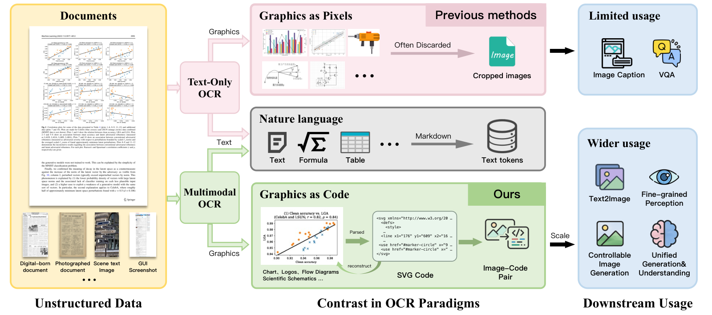
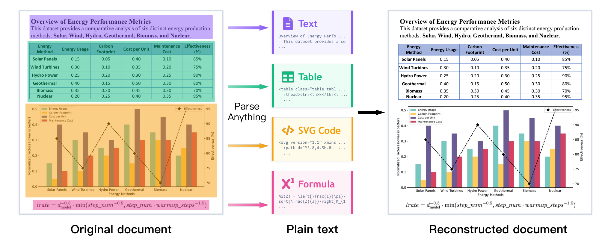
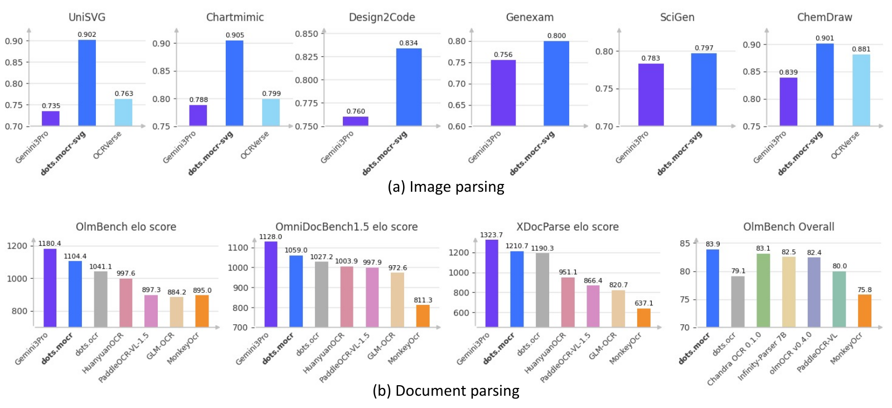

# dots.mocr — Multimodal OCR: Parse Anything from Documents

## 📌 메타 정보

| 항목 | 내용 |
|---|---|
| **논문 제목** | Multimodal OCR: Parse Anything from Documents |
| **저자** | Handong Zheng, Yumeng Li, Kaile Zhang, Liang Xin 외 25명 (core: 앞 4명) / Project leader: Guang Yang / Corresponding: Colin Zhang / 지도: Yuliang Liu, Xiang Bai |
| **소속** | **hi lab, Xiaohongshu Inc**(샤오홍슈=RedNote) + **Huazhong University of Science and Technology**(화중과기대) |
| **공개일** | 2026-03-13 (v1), 2026-03-19 (v2) |
| **분야** | cs.CV — Document Parsing / OCR / Vision-Language Model |
| **arXiv** | [abs 2603.13032](https://arxiv.org/abs/2603.13032v1) · [HTML v1](https://arxiv.org/html/2603.13032v1) |
| **코드** | [github.com/rednote-hilab/dots.mocr](https://github.com/rednote-hilab/dots.mocr) (조직 개명 후 `studio-dots-ai/dots.mocr` 로도 접근) — 커밋 `23f3e56` 기준 리뷰 |
| **가중치** | HF `rednote-hilab/dots.mocr` (→ `dots-studio/dots.mocr`), `dots.mocr-svg` |
| **라이선스** | 코드/가중치 **MIT** + 보충 약정(`dots.mocr LICENSE AGREEMENT`, 충돌 시 MIT 우선) → **상업 이용 가능** / 논문 본문은 CC BY-NC-ND 4.0 |
| **전작** | dots.ocr (arXiv 2512.02498, 2025-07) — **dots.mocr 는 dots.ocr-1.5 의 리브랜딩** |
| **사용한 외부 모델** | decoder = **Qwen2.5-1.5B (base)**, 자동 라벨링 교사 = **dots.ocr**(자기 전작), Elo 심판 = **Gemini 3 Flash**(폐쇄 API), SVG 정규화 도구 = **svgo** |
| **미공개** | 학습 코드, 데이터 엔진, SVG 코퍼스, XDocParse 벤치마크, OCR Arena 배틀 데이터·Elo 계산 코드 |

---

## 📖 주요 용어 사전 (Glossary)

### 이 논문이 만든 개념

| 용어 | 쉬운 풀이 |
|---|---|
| **MOCR (Multimodal OCR, 멀티모달 OCR)** | 문서에서 글자만 뽑던 기존 OCR을, **그림(차트·도표·아이콘·UI)까지 "코드"로 되살리는** 파싱 방식으로 확장하자는 이 논문의 제안. 이름은 거창하지만 새 신경망 구조가 아니라 **"이렇게 하자"는 패러다임 선언 + 데이터 만드는 법**에 가깝다. |
| **first-class parsing target(1급 파싱 대상)** | "그림을 부록 취급하지 말고 글자와 **동등한 지위**의 파싱 결과물로 취급하자"는 뜻. 기존 OCR은 그림 영역을 잘라 이미지 파일로 던져버렸다(=2급 취급). |
| **image-to-SVG(이미지→SVG 코드 변환)** | 차트 그림을 보고 그것을 그려내는 **SVG 벡터 코드**(`<svg><path d="..."/></svg>`)를 생성하는 것. SVG는 "선을 어디서 어디까지 그어라"가 텍스트로 적힌 그림 포맷이라, LLM이 글자처럼 뱉어낼 수 있다. |
| **render-and-reuse(렌더해서 재사용)** | 생성한 SVG 코드를 실제로 그려보고(render), 원본과 비교해 검증한 뒤 학습 데이터로 재활용하는 흐름. |
| **image–code pair(이미지–코드 쌍)** | "이 그림 = 이 코드"로 짝지어진 데이터. 논문이 궁극적으로 노리는 산출물 — 문서를 갈아 넣어 멀티모달 사전학습용 코퍼스를 만들겠다는 것. |
| **OCR Arena** | 두 모델의 출력을 **강한 VLM 심판(Gemini 3 Flash)에게 1:1로 비교시켜** Elo 점수를 매기는 자체 평가 체계. 기존 편집거리 지표가 "형식만 달라도 감점"하는 문제를 피하려는 시도. |
| **XDocParse** | 전작 dots.ocr 논문이 만든 **자체 비공개 문서 파싱 벤치마크**. HuggingFace 등 어디에도 공개되어 있지 않다. |

### 구조 관련

| 용어 | 쉬운 풀이 |
|---|---|
| **vision encoder(비전 인코더)** | 이미지를 잘게 쪼개(patch) 벡터 열로 바꾸는 "눈". 여기서는 42층·hidden 1536짜리 **1.26B** 짜리이며 **CLIP 등을 가져오지 않고 처음부터 학습(from scratch)** 된 것 — 단, 그 학습은 **전작 dots.ocr 때 이미 끝난 것**이다. |
| **native resolution(원본 해상도 입력)** | 이미지를 512×512 같은 고정 크기로 찌그러뜨리지 않고 **원래 비율·크기 그대로** 넣는 방식. 코드상 상한이 `MAX_PIXELS=11289600`(약 1129만 화소)이라 A4 고해상도 스캔을 통째로 넣을 수 있다. |
| **structured language decoder(구조화 언어 디코더)** | 비전 인코더가 만든 벡터를 받아 JSON·LaTeX·HTML·SVG 같은 **구조화된 문자열**을 한 글자씩 뱉는 "입". Qwen2.5-1.5B **base**(대화 튜닝 안 된 원본)를 출발점으로 삼았다. |
| **connector / merger(연결부)** | 눈과 입 사이를 잇는 다리. 여기서는 인접 2×2 패치를 하나로 합치는(spatial merge) MLP 두 장(6144×6144 → 1536×6144, 약 37.7M). |
| **task-conditioned(태스크 조건부)** | 하나의 모델이 **프롬프트에 따라** 문서 파싱/웹 파싱/장면 글자/SVG 변환 등 다른 일을 하는 방식. 반대로 **one-pass(한 번에 전부)** 는 한 번 호출로 모든 결과를 내는 것 — 이 논문은 아직 후자가 **안 된다**. |

### 평가 관련

| 용어 | 쉬운 풀이 |
|---|---|
| **olmOCR-Bench** | AllenAI가 만든 문서 파싱 벤치마크. 아카이브 논문·옛날 스캔·표·다단 조판 등 카테고리별 점수와 **전체 점수(±오차)** 를 준다. |
| **OmniDocBench v1.5** | 상하이 AI Lab 계열 문서 파싱 벤치마크. **TextEdit / ReadOrderEdit = 편집거리(edit distance)라서 낮을수록 좋다.** |
| **ISVGEN** | UniSVG 논문이 만든 SVG 복원 품질 점수. 생성한 SVG를 **실제로 렌더해서 원본 이미지와 비교**한다(높을수록 좋음). |
| **Elo / K factor / bootstrap** | 체스 점수 체계. 이길 확률을 점수 차이로 계산하고(식은 §5.4), 승패마다 K(=32)만큼 점수를 옮긴다. 대전 순서에 따라 결과가 흔들리므로 **순서를 1000번 섞어 평균**낸 것이 최종 점수. |
| **positional bias(위치 편향)** | LLM 심판이 **먼저 제시된 후보를 편애**하는 현상. 이 논문은 A/B 순서를 바꿔 두 번 물어 **두 번 다 같은 답일 때만 승리 인정**하는 대칭 프로토콜로 막았다(설계는 훌륭). |

---

## 🎯 논문 요약 (TL;DR)

**한 줄**: 문서 속 **그림을 픽셀로 버리지 말고 SVG 코드로 되살리자**는 패러다임(MOCR)을 제안하고 3B 모델로 시연했는데, **정작 이번 릴리스는 그것을 한 번에 해내지 못하고, 대표 지표는 그 능력을 채점에서 명시적으로 제외한다.** 다만 문서 **텍스트** 파싱기로서는 3B급 최상위권이다.

**핵심 문제 의식**: 기존 문서 파싱기는 차트·도표·아이콘을 `Picture` 영역으로 검출만 하고 **잘라서 이미지로 버린다**. 문서에 담긴 정보의 상당량이 그림에 있는데, 그게 전부 사전학습 코퍼스에서 증발한다.

**해결책 (주장)**: 그림 중 "짧은 프로그램으로 기술 가능한 것"(아이콘·차트·UI·도식)은 **SVG 코드로 생성**하고, 사진처럼 코드로 못 그리는 것만 래스터로 남긴다. 이를 위해 PDF·웹페이지·네이티브 SVG 자산 4종 소스의 데이터 엔진을 만들고, 3단계 사전학습 + SFT로 3B 모델을 학습.

**검증**: olmOCR-Bench **83.9**(자칭 SOTA), OmniDocBench v1.5 TextEdit **0.031**/ReadOrder **0.029**(표 내 최고), 자체 OCR Arena Elo에서 Gemini 3 Pro 다음 2위, UniSVG 등 SVG 벤치에서 Gemini 3 Pro 상회.

**실측 후 총평**: 성능 숫자와 파라미터 표기는 **정직**하다(3.0392B 실측). 그러나 ① 구조는 전작과 **바이트 단위로 동일**하고 ② 핵심 주장인 그래픽 파싱은 **저장소 코드에서 작동하지 않으며** ③ 그 능력이 **자체 대표 지표에서 규정상 제외**된다. 학습 레시피에 정량 수치가 하나도 없고 ablation도 0건이라, **재현 가능한 방법론 논문이 아니라 결과 보고서**에 가깝다.

---

## 🏆 핵심 기여 (논문 주장 vs 실측 검증)

논문이 스스로 꼽은 3가지 기여를, 코드·가중치·제3자 평가로 하나씩 대조한다.

| # | 논문의 주장 | 실측 검증 결과 |
|---|---|---|
| 1 | **MOCR 패러다임** — 그림을 1급 파싱 대상으로 올려 재사용 가능한 코드로 회수 | ⚠️ **개념은 타당하나 이번 릴리스에서 미구현.** 논문 §3.1이 스스로 "one-pass 출력 불가, 두 번의 별도 패스"라고 인정. 저장소에는 그림→SVG 연결 코드가 0줄이고 마크다운 출력은 여전히 **base64 래스터 크롭**(→ §6.1) |
| 2 | **dots.mocr 시스템** — 희소·비유일 프로그램 감독 하에서 실용화, **스크래치 학습 비전 인코더** 포함 | ⚠️ 비전 인코더는 **전작 dots.ocr의 자산**. config.json이 전작과 바이트 동일, 총 파라미터도 3.0392B로 동일 → **이번 논문의 구조 기여는 0** (→ §5.1) |
| 3 | **균형 잡힌 성능** — Elo 2위 + olmOCR SOTA + SVG에서 Gemini 상회, 3B 안에서 | ✅/⚠️ 문서 텍스트 파싱은 **진짜**(특히 열화 스캔 수식 +21.3점). 단 olmOCR 83.9는 **오차 구간이 경쟁자와 겹치고**, SVG 우위는 **in-domain 벤치에 집중**되며 전 벤치 승리는 **별도 체크포인트(-svg)** 의 몫 (→ §6) |

**실질적으로 이 논문이 기여한 것 한 줄**: *"같은 3B 그릇에, 열화 스캔·수식·표 중심으로 데이터를 다시 갈아 넣으면 olmOCR-Bench 79.1 → 83.9까지 간다"* 는 **데이터 큐레이션 결과 보고**.

---

## 🧩 구조와 방법 (§3 해설)

### 5.1 모델 구조 — 전작과 완전히 같다

*이 절을 두는 이유: 논문이 "새 시스템"처럼 서술하지만, 진짜로 무엇이 바뀌었는지 알아야 나머지 주장을 올바른 무게로 읽을 수 있기 때문.*

논문 §3.2는 "이전 연구[15]의 설계 원칙을 따른다"고만 적는다. [15]는 자기 전작 dots.ocr다. 실제로 얼마나 따르는지 **가중치와 설정 파일로 직접 확인**하면:

| 확인 항목 | 결과 |
|---|---|
| dots.ocr README (2026.03.19) | *"We have rebranded **dots.ocr-1.5** as dots.mocr"* — 저자들이 직접 명시 |
| `config.json` 두 모델 비교 | **바이트 단위 동일** (`architectures: DotsOCRForCausalLM`, `model_type: dots_ocr` 그대로) |
| safetensors 총 바이트 | 둘 다 `6,078,431,736` B → **3.0392B 파라미터 동일** |
| 저장소 파이썬 파일 9개 diff | `consts` / `image_utils` / `format_transformer` / `output_cleaner` / `prompts` / `inference` **6개가 이름 치환 후 0줄 차이** |

즉 **아키텍처 변경은 0이고, 순수하게 데이터·학습만 바뀐 릴리스**다. 그런데 기여 목록에는 "supported by a vision encoder trained entirely from scratch"가 올라가 있다. 그 인코더는 2025년 dots.ocr가 이미 스크래치로 학습해 둔 것이다.

**실측 파라미터 분해** (HF safetensors 헤더에서 직접 합산):

| 부품 | 상세 | 파라미터 |
|---|---|---|
| Vision encoder | 42층, hidden 1536, SwiGLU(fc1/fc2/fc3), patch 14, spatial merge 2, bias 없음 | **1,262.1M** |
| LLM 본체 | Qwen2.5-1.5B, 28층 hidden 1536, GQA(head 12/kv 2), intermediate 8960 | 1,310.3M |
| embed_tokens | vocab 151,936 × 1536 | 233.4M |
| lm_head | `tie_word_embeddings: false` 라 별도 존재 | 233.4M |
| **합계** | | **3.0392B** |

논문의 "1.2B 비전 인코더 + Qwen2.5-1.5B 디코더, 총 3B"는 **정직하다**. (`PAPER_GLM-OCR.md` 가 0.9B라 쓰고 실측 1.325B였던 것과 대조적.) 최대 입력 ~11M 화소 주장도 코드 `consts.py`의 `MAX_PIXELS=11289600` 으로 확인된다.

> 참고: `dots.mocr-svg` 도 safetensors 총량 6.078GB로 **완전히 같은 크기** — 구조는 같고 SFT 배합만 다른 자매 체크포인트.

### 5.2 태스크 정의 — 무엇을 코드로 만들고 무엇을 픽셀로 남기나

*이 절을 두는 이유: "Parse Anything"이 실제로는 무엇까지를 뜻하는지, 그 경계가 논문 주장의 크기를 결정하기 때문.*

입력 이미지 `I` 에 대해 요소들의 순서 있는 목록 `S` 를 생성한다:

```
S = [(B_1, c_1, p_1), ..., (B_K, c_K, p_K)]
```

- `B_k` = bounding box(경계 상자), `c_k` = category(요소 종류), `p_k` = payload(내용물)
- 순서는 **사람이 읽는 순서(human-centric reading order)** — 별도 관계 예측 모듈 없이 **생성 순서 자체로** 구조를 표현한다.

payload가 종류마다 다르다는 것이 핵심:

| 요소 종류 | payload 형태 |
|---|---|
| 본문·제목·리스트 | Markdown |
| 수식(Formula) | LaTeX |
| 표(Table) | HTML |
| **아이콘·차트·UI·도식** | **SVG 코드** ← 이 논문의 새로움 |
| 사진·실사 이미지 | 래스터 그대로 유지 (코드로 간결히 기술 불가하므로) |

**그리고 논문 §3.1 마지막 문단이 결정적이다** (원문 취지 그대로):

> *현재 릴리스에서 MOCR은 task-conditioned이며, 전체 페이지 문서 파싱과 시각 기호(SVG) 파싱을 **동시에 포함하는 one-pass 출력을 아직 만들지 못한다**. 대신 페이지 단위 텍스트 파싱과 영역 단위 image-to-SVG 디코딩을 **별도의 패스로 실행**해 완전한 멀티모달 파스를 얻는다.*

제목이 약속한 "Parse Anything"은 **아직 비전 선언**이고, 사용자가 크롭·재호출·재조립을 직접 짜야 한다는 뜻이다.

### 5.3 학습 레시피 — 정량 정보가 문자 그대로 0

*이 절을 두는 이유: 구조가 안 바뀌었으니 성능 향상은 전부 학습에서 왔을 텐데, 그 학습이 검증 가능하게 적혀 있는지가 이 논문의 과학적 가치를 좌우하기 때문.*

논문이 밝힌 전부:

| 단계 | 목적 (논문 서술) |
|---|---|
| Pretrain Stage 1 | 일반 비전 데이터로 **눈과 입 사이 인터페이스를 안정화** — LM이 시각 토큰을 제대로 소비하게 만듦 |
| Pretrain Stage 2 | 일반 비전 + **텍스트 전용 문서 파싱** 혼합 → 텍스트 중심 파싱 기초 확립 |
| Pretrain Stage 3 | 일반 비전 비중을 **줄이고** MOCR 타깃(문서 파싱 + image-to-SVG) 비중을 **늘림** |
| SFT (instruction tuning) | 데이터 엔진이 만든 고품질 소집합으로 체계적 오류 교정·출력 규약 정렬 |

- 목적함수는 전 단계 **단일 autoregressive(자기회귀) 목적** 하나로 통일. 입력 해상도는 단계마다 **점진 상승**.
- SFT 배합만 바꿔 두 체크포인트를 낸다: `dots.mocr`(균형) / `dots.mocr-svg`(SVG 비중↑, 어려운 SVG 프로그램 가중치↑).

**여기에 없는 것**: 데이터 규모, 토큰 수, GPU 시간, 학습률, 배치 크기, 단계별 해상도 값, 단계별 혼합 비율 — **숫자가 단 하나도 없다.** 그리고 **ablation은 0건**이다. 커리큘럼을 기여로 내세우면서 어느 요소가 +4.8점을 만들었는지 증명하는 실험이 하나도 없다.

### 5.4 데이터 엔진 — 이 논문의 실제 본체

*이 절을 두는 이유: 구조도 안 바뀌고 레시피도 수치가 없으니, 성능을 만든 것은 결국 데이터이며 논문이 그나마 구체적으로 쓴 유일한 부분이기 때문.*

네 갈래 소스:

| 소스 | 무엇을 얻나 | 품질 관리 |
|---|---|---|
| **PDF 문서** | 다국어 문서 파싱 감독(레이아웃 영역 + 읽기 순서) | **dots.ocr(자기 전작)를 자동 라벨링 엔진으로 사용**. 언어·도메인·레이아웃 복잡도(블록 수·글자 밀도·표/수식 유무)로 **층화 샘플링(stratified sampling)** 해 어려운 구간을 강조. SFT용은 규칙 기반 점검 + **렌더 비교 검증** + "더 강한 감독으로 재라벨링(distillation)" |
| **웹페이지** | 크롤링→렌더한 페이지 이미지. HTML/DOM에서 **정답 구조를 공짜로** 얻어 라벨 잡음↓. 네이티브 SVG 아이콘·차트도 여기서 대량 확보 | 고해상도·복잡 레이아웃 분포 확대 |
| **네이티브 SVG 자산** | image–SVG 쌍의 본체 | ① **cleaning**: `svgo`로 메타데이터 제거·수치 정밀도 정규화·구조 표준화 → 코드 텍스트 매칭 + **렌더 이미지 pHash(perceptual hash, 지각 해시)** 이중 중복 제거 ② **sampling**: 출처별 도메인 균형 + SVG 프로그램 **복잡도 기반 샘플링**(쉬운 것/어려운 것 균형) |
| **일반 목적 데이터** | grounding(위치 지정), counting(개수 세기) 등 | 범용 능력 유지 |

**"프로그램은 정답이 유일하지 않다"** 는 문제(같은 그림을 그리는 SVG는 무한히 많다)를 **정규화(canonicalization, viewBox 정규화, 복잡도 축소) + 렌더 검증**으로 다룬다는 것이 방법론적 요지다. 이 접근 자체는 건전하다.

⚠️ **주의할 대목**: PDF 라벨을 **자기 전작으로 자동 생성**하면 상한이 전작에 묶인다. 논문은 이를 *"distillation that relabels or filters samples with **stronger supervision**"* 으로 보정한다고만 하고 **그 "더 강한 교사"가 누구인지 밝히지 않는다.** 최종 심판이 Gemini 3 Flash인 상황에서 교사가 Gemini 계열이면 "교사가 채점하는" 정렬 문제가 생긴다. 확증은 없으나 논문이 밝혔어야 할 항목이다.

### 5.5 OCR Arena — 평가 방법 자체를 제안한 부분

*이 절을 두는 이유: 논문의 헤드라인 숫자(Elo 2위)가 어떻게 만들어진 것인지 알아야 그 숫자를 얼마나 믿을지 정할 수 있기 때문.*

**동기**: WER/NED(편집거리), 표용 TEDS, 수식용 CDM 같은 규칙 기반 지표는 **"의미는 같은데 표기만 다른" 출력**을 과하게 감점한다. 그래서 강한 VLM에게 원본 이미지와 두 모델의 마크다운을 주고 **어느 쪽이 더 충실한지 직접 판단**시킨다.

**Elo 계산** (논문 식 2, 3):

- A가 이길 기대 확률: `E_A = 1 / (1 + 10^((R_B - R_A)/400))`
- 갱신: `R_A' = R_A + K · (S_A - E_A)` — `S_A` 는 승 1, 무 0.5, 패 0. **K = 32**
- 대전 순서 의존성을 없애려 **전체 대전 이력을 무작위로 섞어 1000회 반복(bootstrap)** 하고 그 평균을 최종 점수로 삼음.
- (논문은 "각 모델은 초기 레이팅 R로 시작한다"고만 쓰고 **R 값을 밝히지 않는다** — 표 수치로 보아 1000 추정.)

**위치 편향 차단**: 모든 A vs B 비교를 **A를 먼저 보여준 시행 / B를 먼저 보여준 시행 두 번** 수행하고, **두 번 다 같은 결론일 때만 승리로 인정**한다. 순서에 따라 답이 뒤집히면 "inconsistent"로 처리해 **무승부**. — 이 설계는 정직하고 훌륭하다.

**그러나 심판 프롬프트가 문제다** → §6.2.

---

## 📊 실험 요약

### 6.1 문서 파싱 Elo (논문 Table 2) — 자체 OCR Arena

*왜 보는가: 논문이 초록에서 앞세운 "Gemini 3 Pro 다음 2위"의 근거 표.*

| 모델 | olmOCR-Bench | OmniDocBench v1.5 | XDocParse | 평균 |
|---|---|---|---|---|
| Gemini 3 Pro | **1180.4** | **1128.0** | **1323.7** | **1210.7** |
| **dots.mocr** | 1104.4 | 1059.0 | 1210.7 | 1124.7 |
| dots.ocr (전작) | 1041.1 | 1027.2 | 1190.3 | 1086.2 |
| HunyuanOCR | 997.6 | 1003.9 | 951.1 | 984.2 |
| PaddleOCR-VL-1.5 | 897.3 | 997.9 | 866.4 | 920.5 |
| GLM-OCR | 884.2 | 972.6 | 820.7 | 892.5 |
| MonkeyOCR-pro-3B | 895.0 | 811.3 | 637.1 | 781.1 |

⚠️ **오픈소스 대비 격차가 가장 크게 벌어지는 XDocParse(1210.7 vs PaddleOCR-VL-1.5 866.4)는 자기네 비공개 벤치**다. HuggingFace 데이터셋 검색 결과 0건 — 외부 검증 불가.

### 6.2 olmOCR-Bench 카테고리별 (논문 Table 3) — 이 논문의 진짜 성과

*왜 보는가: 구조가 안 바뀌었으니 "데이터만 갈아서 무엇이 좋아졌나"가 전부 여기 드러나기 때문.*

전작 대비 변화가 이야기의 전부다:

| 카테고리 | dots.ocr | **dots.mocr** | 변화 |
|---|---|---|---|
| **Old scans math**(열화 스캔 속 수식) | 64.2 | **85.5** | **+21.3** ⭐ |
| Old scans(열화 스캔) | 40.9 | **48.2** | +7.3 |
| ArXiv | 82.1 | **85.9** | +3.8 |
| Multi column(다단 조판) | 82.4 | **85.3** | +2.9 |
| Tables | 88.3 | **90.7** | +2.4 |
| Long tiny text(길고 작은 글씨) | 81.2 | 81.6 | +0.4 |
| Headers & footers | 94.1 | 94.0 | −0.1 |
| Base | 99.5 | 99.7 | +0.2 |
| **Overall** | 79.1 | **83.9±0.9** | **+4.8** |

경쟁 모델과의 위치:

| 모델 | Overall |
|---|---|
| **dots.mocr** | **83.9±0.9** → 구간 [83.0, 84.8] |
| Chandra OCR 0.1.0 (**Figure 2(b)에만 등장, Table 3에는 없음**) | 83.1 |
| Infinity-Parser 7B | 82.5 |
| olmOCR v0.4.0 | 82.4±1.1 → 구간 [81.3, 83.5] |
| PaddleOCR-VL | 80.0±1.0 |
| dots.ocr | 79.1±1.0 |

⚠️ **"sets a new state of the art of 83.9"는 통계적으로 분리된 승리가 아니다.** olmOCR과 오차 구간이 겹치고, **표에서 빠졌지만 그림에는 있는 Chandra OCR 83.1과는 0.8점 차** — 자기 오차폭 ±0.9보다 작다.

⚠️ **논문이 자기 표를 잘못 읽은 곳**: 본문은 *"Old scans, Headers & footers, Long tiny text, Base는 다른 시스템이 최고"* 라고 적었으나, **Old scans는 dots.mocr 48.2가 Infinity 47.9·olmOCR 47.7보다 높아 자기가 1등**이다. 과소 주장 방향의 실수라 해롭진 않지만, 표와 본문이 안 맞는다는 신호다.

**남은 약점**: Long tiny text 81.6 — Nanonets 93.0, Infinity 86.4, PaddleOCR-VL 85.7에 크게 밀린다. 작고 빽빽한 글씨는 여전히 못한다.

### 6.3 OmniDocBench v1.5 / pdf-parse-bench (논문 Table 6)

*왜 보는가: 편집거리 기반 전통 지표에서도 통하는지, 즉 Elo 없이도 성립하는 성과인지 확인하려고.*

**편집거리는 낮을수록 좋다.**

| 유형 | 모델 | 크기 | TextEdit ↓ | ReadOrderEdit ↓ | pdf-parse-bench ↑ |
|---|---|---|---|---|---|
| 범용 VLM | Gemini 2.5 Pro | – | 0.075 | 0.097 | 9.06 |
| 범용 VLM | Qwen3-VL-235B-A22B | 235B | 0.069 | 0.068 | **9.71** |
| 범용 VLM | Gemini 3 Pro | – | 0.066 | 0.079 | 9.68 |
| 전용 | Mistral OCR | – | 0.164 | 0.144 | 8.84 |
| 전용 | DeepSeek-OCR | 3B | 0.073 | 0.086 | 8.26 |
| 전용 | MinerU2.5 | 1.2B | 0.047 | 0.044 | – |
| 전용 | PaddleOCR-VL-1.5 | 0.9B | 0.035 | 0.042 | – |
| 전용 | GLM-OCR | 0.9B | 0.040 | 0.043 | – |
| 전용 | dots.ocr | 3B | 0.048 | 0.053 | 9.29 |
| 전용 | **dots.mocr** | 3B | **0.031** | **0.029** | 9.54 |

✅ **여기가 가장 깨끗한 승리다.** 3B로 235B Qwen3-VL과 Gemini 3 Pro를 텍스트 전사·읽기 순서에서 모두 앞선다.

⚠️ 단, **수식·표 지표는 "검출 규칙과 정답 매칭 프로토콜에 민감하다"는 이유로 논문이 스스로 뺐다.** 편의적 선택으로 읽힐 여지가 있다.

### 6.4 구조화 그래픽 파싱 (논문 Table 4) — 다르게 읽어야 하는 표

*왜 보는가: 이 표가 논문의 새 기여를 재는 유일한 표인데, 원문 서술과 표의 함의가 다르기 때문.*

원본 수치 (ISVGEN, 높을수록 좋음):

| 방법 | UniSVG Low | UniSVG High | UniSVG Score | ChartMimic | Design2Code | GenExam | SciGen | ChemDraw |
|---|---|---|---|---|---|---|---|---|
| OCRVerse (4B, 오픈소스) | 0.632 | 0.852 | 0.763 | 0.799 | – | – | – | 0.881 |
| Gemini 3 Pro | 0.563 | 0.850 | 0.735 | 0.788 | 0.760 | 0.756 | 0.783 | 0.839 |
| dots.mocr (기본) | 0.850 | 0.923 | 0.894 | 0.772 | 0.801 | 0.664 | 0.660 | 0.790 |
| **dots.mocr-svg** | **0.860** | **0.931** | **0.902** | **0.905** | **0.834** | **0.800** | **0.797** | **0.901** |

**Gemini 3 Pro 대비 차이로 다시 계산하면 그림이 뒤집힌다:**

| 벤치마크 | dots.mocr(기본) − Gemini | dots.mocr-svg − Gemini |
|---|---|---|
| **UniSVG**(학습 분포와 겹칠 가능성 높음) | **+0.159** | +0.167 |
| ChartMimic | −0.016 | +0.117 |
| Design2Code | +0.041 | +0.074 |
| GenExam | −0.092 | +0.044 |
| SciGen | −0.123 | +0.014 |
| ChemDraw | −0.049 | +0.062 |
| **UniSVG 제외 5개 평균** | **−0.048 (패)** | **+0.062 (승)** |

읽는 법 세 가지:

1. **기본 모델은 UniSVG에서만 압승하고, 외부 5개 벤치에서는 평균적으로 Gemini 3 Pro에 진다.** 학습 데이터가 "웹에서 긁은 네이티브 SVG 자산"이고 UniSVG도 웹 SVG 기반이라, 이 패턴은 **분포 중첩(사실상 in-domain)** 의 전형적 모양이다. 논문은 이 가능성을 한 줄도 다루지 않는다. 게다가 평가 지표 ISVGEN 자체가 **UniSVG가 만든 자**다 — 가장 강한 벤치가 소유한 잣대로 잰다.
2. 초록의 *"achieves higher reconstruction quality than Gemini 3 Pro across image-to-SVG benchmarks"* 는 **-svg 변형에만 해당**하고, 그건 별도 체크포인트다. 그런데 **논문 어디에도 dots.mocr-svg의 문서 파싱 점수가 없다.** SVG를 얻으려 문서 파싱을 얼마나 포기했는지 알 수 없게 되어 있다. 통합 모델 논문에서 빠지면 안 되는 표다.
3. **요약 그림(Figure 2(a))에는 기본 dots.mocr가 아예 없다.** Gemini 3 Pro / dots.mocr-svg / OCRVerse 세 막대만 그려 "전 벤치 압승"으로 보이게 한다. 4개 벤치에서 지는 기본 모델은 그림에서 조용히 빠졌다.

⚠️ **추가 재현성 경고**: 저장소 `demo/demo_vllm_svg.py` 는 `temperature=0.9` 를 쓰며 주석에 *"SVG: low temperature often causes repetitive/looping output"*(낮은 온도면 반복 루프에 빠진다)이라 적어 놨다. 즉 SVG 생성은 **고온 샘플링이 필수**인데, 논문의 SVG 표에는 **오차막대도 샘플링 설정도 없다.**

### 6.5 일반 비전 능력 (논문 Table 5)

*왜 보는가: "문서에 특화시키느라 일반 능력을 잃지 않았나"를 확인하는 표.*

| 모델 | CharXiv Desc | CharXiv Reason | OCR Reasoning | InfoVQA | DocVQA | ChartQA | OCRBench | AI2D | CountBenchQA | RefCOCO |
|---|---|---|---|---|---|---|---|---|---|---|
| Qwen3-VL-2B-Instruct | 62.3 | 26.8 | – | 72.4 | 93.3 | – | 85.8 | 76.9 | 88.4 | – |
| Qwen3-VL-4B-Instruct | 76.2 | 39.7 | – | **80.3** | **95.3** | – | **88.1** | **84.1** | 84.9 | – |
| **dots.mocr** | **77.4** | **55.3** | 22.85 | 73.76 | 91.85 | 83.2 | 86.0 | 82.16 | **94.46** | 80.03 |

- ✅ CharXiv Reasoning **55.3 vs 39.7** (+15.6): 차트를 보고 **추론**하는 능력이 두드러진다. 차트/SVG 학습의 부수 효과로 읽힌다.
- ⚠️ InfoVQA(−6.5), DocVQA(−3.5), OCRBench(−2.1), AI2D(−1.9)는 Qwen3-VL-4B에 밀린다. README의 *"retains comparable performance in general vision tasks to Qwen3-VL-4B"* 는 **"동등"이라기보다 "크게 뒤지지 않음"** 이 정확하다. (파라미터도 3B vs 4B로 다르다.)
- OCR Reasoning 22.85는 절대 수치가 낮다 — 비교 대상이 표에 없어 해석 불가.

### 6.6 제3자 실측 (HF 모델 카드 `.eval_results`) — 논문보다 냉정하다

*왜 보는가: 저자가 고른 벤치가 아니라 외부 리더보드가 매긴 점수라야 §6.4의 의심을 검증할 수 있기 때문.*

**LlamaIndex ParseBench** (파이프라인명 `dots_ocr_1_5_parse` = 이 모델, 2026-03~04):

| 항목 | 점수 |
|---|---|
| text_content | 90.0 |
| table | 85.2 |
| layout (= 박스 IoA + 분류 + 귀속 + 읽기순서, 규칙 기반 → Q12) | 55.8 |
| text_formatting | 47.0 |
| **chart** | **0.9** ⚠️ |
| mean | 55.8 |

🔥 **차트 0.9점.** 이것이 §7.1의 결정타를 숫자로 확인해 준다 — 문서 파싱 패스는 차트 내용을 아예 내놓지 않으므로(프롬프트가 `Picture`의 text 생략을 명령), 차트 정보 추출 과제에서 0점에 수렴한다. **"차트를 1급 파싱 대상으로 만들었다"는 논문 주장과 정면 충돌하는 독립 측정치**다.

**MDPBench 다국어** (2026-07, 전체 80.5 / digital 90.5 / photographed 77.2):

| 언어 | 점수 | 언어 | 점수 |
|---|---|---|---|
| 이탈리아어 | 89.3 | 아랍어 | 83.3 |
| 영어 | 87.4 | 독일어 | 82.6 |
| 포르투갈어 | 86.8 | **한국어** | **78.7** |
| 중국어 | 84.6 | 태국어 | 77.9 |
| 인도네시아어 | 84.5 | 일본어 | 75.0 |
| 힌디어 | 83.6 | 스페인어 | 71.3 |
| 네덜란드어 | 83.2 | 러시아어 | 71.2 |
| 번체 중국어 | 79.6 | 프랑스어 | 70.1 |

→ **한국어 문서라면 78.7 정도가 기대치.** 중국어(84.6)보다 6점 낮고, 라틴 계열 평균(81.7)보다도 낮다.

---

## 🔍 저장소 코드 실측 리뷰

*이 장을 두는 이유: 이 논문의 가장 중요한 사실 두 개가 논문 본문이 아니라 공개 코드 안에 있기 때문.*

### 7.1 결정타 1 — 마크다운 출력은 여전히 픽셀을 박아넣는다

논문 Figure 3의 논지는 명확하다. **"Graphics as Pixels → Often Discarded → Cropped images"(기존)** vs **"Graphics as Code → SVG → Image–Code Pair"(우리)**.



그런데 저장소의 마크다운 생성 함수 `dots_mocr/utils/format_transformer.py` 의 `layoutjson2md()` 는 이렇게 되어 있다:

```python
if cell['category'] == 'Picture':
    image_crop = image.crop((x1, y1, x2, y2))
    image_base64 = PILimage_to_base64(image_crop)
    text_items.append(f"")
```

**`Picture` 영역을 잘라서 base64 래스터로 마크다운에 삽입한다.** 논문이 비판한 바로 그 행동이다. 게다가 문서 파싱 프롬프트(`prompts.py`) 자체가 이렇게 명령한다:

```
- Picture: For the 'Picture' category, the text field should be omitted.
```

즉 **문서 파싱 모드에서는 모델이 그림 내용을 생성하지 못하도록 프롬프트가 막고 있다.**

그리고 저장소 전체에서 **"Picture bbox를 잘라 SVG 프롬프트로 2차 호출하는" 코드는 한 줄도 없다.** `parser.py:286` 의 SVG 분기에는 `##todo` 주석이 그대로 달려 있다.

더 나쁜 점: 그 두 번째 패스가 **다른 모델**이다. `demo/demo_gradio.py`(42~81행)는 `dots.mocr` 와 `dots.mocr-svg` 두 개의 vLLM 서버를 등록하고 SVG 태스크만 후자로 라우팅한다. **"단일 통합 아키텍처"라는 서술과 배치 현실이 다르다.**

### 7.2 결정타 2 — 대표 지표가 자기 기여를 채점에서 명시적으로 제외한다

논문 헤드라인은 "OCR Arena Elo에서 Gemini 3 Pro 다음 2위"다. 그 심판 프롬프트가 저장소 `tools/elo_score_prompt.py` 에 공개되어 있는데, 그 안에 이렇게 적혀 있다 (원문 발췌):

```
【Items to Ignore - Do NOT factor into scoring】
- **Image/Figure Processing Differences (ABSOLUTELY IGNORE)**:
  - How the model parses image/figure regions is **completely excluded**
    from the scoring standard.
  - Whether it parses as a `figure` field, outputs bbox coordinates,
    extracts text inside the image, provides a caption, describes the
    image content, or **completely ignores/skips the image**, these are
    all considered equivalent.
  - Do NOT declare a winner based on image handling.
```

번역하면: *"모델이 그림 영역을 어떻게 파싱하든 채점에서 **완전히 제외**한다. figure 필드로 내든, bbox를 내든, 캡션을 내든, **완전히 무시하고 건너뛰든 전부 동등**하게 본다. 그림 처리로 승자를 결정하지 마라."*

🔥 **논문의 유일한 새 기여(그래픽 파싱)가, 논문의 대표 지표에서 규정상 0점 가중치다.** Elo 1104.4는 "그래픽을 코드로 복원하는 능력"에 대해 아무것도 말해주지 않는다. 순수 본문 텍스트·표·수식 정확도 점수다.

프롬프트를 공개한 것은 투명해서 칭찬할 일이지만, 공개한 순간 자기 논지를 무너뜨렸다. (심판은 헤더/푸터 차이와 서식 차이도 전부 무시하라 지시받는다. 프롬프트 예시에 2자 비교인데 "Model 3"이 등장하는 등 정리도 덜 됐다.)

### 7.3 실행 시 걸리는 버그 목록

실제로 쓸 때 알고 있어야 할 것들.

| # | 위치 | 문제 |
|---|---|---|
| 1 | `parser.py:486` | **`--use_hf` 가 절대 꺼지지 않는다.** `type=bool` 이라 `--use_hf false` → `bool("false") = True`. README가 *"just add `--use_hf true`"* 라고 안내하는데, 한 번 붙이면 무엇을 넣어도 HF 경로로 간다 |
| 2 | `parser.py` `main()` | **`--custom_prompt` 는 죽은 인자.** argparse에 정의만 되고 `parse_file()` 로 전달되지 않는다 → CLI에서 `prompt_general` 을 쓰면 언제나 기본 문구("Please describe the content of this image.")가 나간다 |
| 3 | `parser.py:293` | **죽은 코드.** `tw, th = (1024, round(h*1024/w)) if ... ` 로 종횡비를 계산해 놓고 바로 다음 줄에서 `svg_to_png(..., width=w, height=h)`(원본 크기)를 쓴다. 계산값은 어디에도 안 쓰인다 |
| 4 | `demo/demo_vllm.py` | help에 `prompt_image_to_svg` 가 선택지로 있지만 그 스크립트에는 `{width}`/`{height}` 치환 로직이 없어 **프롬프트에 리터럴 중괄호가 그대로 나간다.** 치환은 `demo_vllm_svg.py` 에만 있고, 그 파일은 `--image_path` 인자 자체가 없어 이미지가 하드코딩 |
| 5 | 전역 | **출력 길이 상한이 세 곳에서 다르다** — CLI 기본 16384 / 클래스·vLLM 기본 32768 / HF 경로 24000. 그리고 저장소에 **잘린 SVG를 스택 매칭으로 봉합하는 `fix_svg()` 가 존재**한다(`svg_utils.py`) → SVG 출력 잘림이 예외가 아니라 **상시 상황**이라는 뜻 |
| 6 | `demo/demo_gradio.py:42-52` | 두 모델 서버(`dots.mocr`, `dots.mocr-svg`)의 포트가 **둘 다 8000** 으로 하드코딩. 그대로 돌리면 SVG 요청이 일반 모델로 간다 |
| 7 | `demo/demo_gradio.py:75` | SVG 온도 `0.9` 에 *"较低温度(낮은 온도)"* 라는 **반대 주석** |
| 8 | `layout_utils.py` `post_process_output` | 반복 출력 정리(`OutputCleaner`)는 **JSON 파싱이 실패했을 때만** 호출된다. JSON이 유효한 채 같은 블록이 반복되면 걸러지지 않는다 |
| 9 | `layout_utils.py:196` | `is_legal_bbox()` 정의만 되고 어디서도 호출되지 않는 죽은 함수 |

---

## 💬 Q&A

### Q1. 이 논문, 한 줄로 뭐라고 정리하면 되나?

**문서 텍스트 파싱기로는 3B급 최강 라인업에 확실히 들어가는 좋은 모델인데, 논문이 내세운 새 패러다임("그래픽도 1급 파싱 대상")은 이번 릴리스에서 실제로 작동하지 않는다.** 그리고 그 증거가 논문이 아니라 자기네 코드 안에 있다.

- 정체: **dots.ocr 1.5의 리브랜딩** (전작 README가 직접 명시, config.json 바이트 동일, 3.0392B 동일) → 구조 기여 0, 순수 데이터/학습 업그레이드
- 성과: olmOCR 79.1 → 83.9, 특히 **열화 스캔 속 수식 64.2 → 85.5 (+21.3)**
- 미달: 그래픽 파싱은 두 번의 패스 + 두 개의 모델, 마크다운 출력은 여전히 base64 크롭, 대표 지표는 그림 처리를 채점 제외

### Q2. "Parse Anything"이 왜 실제로는 안 된다는 건가?

세 겹의 증거가 있다.

1. **논문 자백** (§3.1 마지막): one-pass 출력 불가, "페이지 텍스트 파싱"과 "영역 image-to-SVG"를 **별도 패스**로 돌려야 한다.
2. **코드 부재**: 저장소에 `Picture` bbox를 크롭해 SVG 프롬프트로 재호출하고 결과를 마크다운에 재조립하는 코드가 **0줄**. `parser.py:286`에 `##todo`만 있다.
3. **출력 실물**: `layoutjson2md()` 가 `Picture` 를 base64 래스터로 삽입 — 논문 Figure 3이 비판한 "Graphics as Pixels" 그 자체.

여기에 **모델도 두 개** 필요하다(gradio 데모가 서버 2개 등록). 그리고 제3자 ParseBench 차트 점수 **0.9**가 이 상태를 외부에서 확인해 준다.

### Q3. olmOCR 83.9는 진짜 SOTA인가?

**"동률 최상위권"이라 부르는 게 정확하다.**

- dots.mocr 83.9±0.9 → [83.0, 84.8]
- olmOCR v0.4.0 82.4±1.1 → [81.3, 83.5] → **구간이 겹친다**
- Chandra OCR 0.1.0 83.1 → **0.8점 차, 자기 오차폭보다 작다.** 게다가 이 모델은 **Figure 2(b)에는 있는데 Table 3에는 없다**

다만 **전작 대비 +4.8점(79.1→83.9)은 확실한 개선**이고, 그 안에서 열화 스캔 수식 +21.3은 특히 실무적으로 값어치가 있다. OmniDocBench v1.5 편집거리(0.031/0.029)에서 235B Qwen3-VL과 Gemini 3 Pro를 모두 앞선 것도 깨끗한 승리다.

### Q4. SVG 성능은 진짜로 Gemini보다 좋은가?

**"기본 모델은 아니고, SVG 특화 체크포인트는 그렇다. 다만 in-domain 편중 의심이 크다."**

Gemini 3 Pro 대비 차이를 벤치별로 다시 계산하면(→ §6.4 표):
- 기본 dots.mocr: UniSVG에서 **+0.159** 압승, 나머지 5개 평균 **−0.048로 패**
- dots.mocr-svg: 전 벤치 승, 5개 평균 +0.062

학습 데이터가 "웹에서 긁은 네이티브 SVG"이고 UniSVG도 웹 SVG 기반이며 **평가 지표 ISVGEN도 UniSVG가 만든 것**이다. 자기가 제일 강한 벤치가 소유한 잣대로 재는 구조인데, 논문은 분포 중첩 가능성을 한 줄도 다루지 않는다.

그리고 **-svg 체크포인트의 문서 파싱 점수는 논문 어디에도 없다** → 통합 모델이라면서 트레이드오프를 숨긴 셈. 요약 그림(Figure 2(a))에서 지는 기본 모델을 뺀 것도 같은 방향의 편집이다.

### Q5. 학습 방법을 따라할 수 있나?

**없다.** §3.3 "Training Recipe" 전체에 **데이터 규모·토큰 수·GPU 시간·학습률·배치·단계별 해상도·혼합 비율 중 어떤 숫자도 없다.** ablation도 **0건**이다. 커리큘럼을 기여로 내세우면서 어느 요소가 +4.8점을 만들었는지 증명하는 실험이 없다.

공개 범위도 좁다:

| 공개 | 비공개 |
|---|---|
| 추론 코드 (MIT) | 학습 코드 |
| 가중치 2종 (MIT + 보충 약정, 상업 이용 OK) | 데이터 엔진 / SVG 코퍼스 |
| Elo 심판 프롬프트 | Elo 배틀 데이터 / 계산·bootstrap 코드 |
| — | **XDocParse 벤치마크** (HF 검색 0건) |

즉 **재현 가능한 방법론 논문이 아니라, "3B 그릇에 데이터를 이렇게 갈아 넣었더니 여기까지 갔다"는 결과 보고서**로 읽어야 한다.

### Q6. 실무에 쓸 만한가? 언제 쓰고 언제 피하나?

**쓰기 좋은 경우**
- 다국어 PDF·스캔 문서를 마크다운/JSON으로 뽑는 파이프라인 — 3B급에서 현재 최선의 선택지 중 하나
- **수식이 많은 열화 스캔본** (이 릴리스의 최대 강점, +21.3)
- 읽기 순서가 중요한 다단 조판 (ReadOrderEdit 0.029, 표 내 최고)
- vLLM 0.11+ 공식 통합 + MIT 라이선스 → 상용 배포 장벽이 낮다

**피하거나 각오해야 하는 경우**
- **차트·다이어그램 내용까지 자동으로 얻으려는 파이프라인** → 이 저장소로는 안 된다. `Picture` bbox 크롭 → `dots.mocr-svg` 서버 2차 호출 → 마크다운 재조립을 **직접 구현**해야 하고, 그 SVG 품질이 차트·과학 도해에서 Gemini보다 낫다는 보장도 없다
- **작고 빽빽한 글씨** (Long tiny text 81.6 — Nanonets 93.0에 11점 뒤짐)
- **한국어 문서** — MDPBench 78.7, 중국어보다 6점 낮음
- 마크다운 산출물 크기에 민감한 경우 — `Picture` 마다 base64 PNG가 통째로 박히므로 파일이 크게 부푼다
- SVG를 쓴다면 온도 0.9 필수(낮으면 반복 루프), 출력 잘림 상시 → `fix_svg()` 봉합에 의존

### Q7. 그래도 이 논문의 좋은 점은?

| 좋은 점 | 근거 |
|---|---|
| **파라미터 정직도 합격** | "3B" 표기 vs safetensors 실측 3.0392B 일치 (0.9B라 쓰고 1.325B였던 [[paper_glm_ocr]] 와 대조) |
| **깨끗한 텍스트 파싱 승리** | OmniDocBench TextEdit 0.031 / ReadOrder 0.029 로 235B·Gemini 3 Pro 상회 |
| **열화 스캔 수식 +21.3** | 데이터 큐레이션만으로 얻은 실질 성과 |
| **평가 프로토콜 설계** | A/B 순서 뒤집어 두 번 물어 **일치할 때만 승리 인정**, 대전 순서 1000회 셔플 bootstrap — 정직한 설계 |
| **심판 프롬프트 공개** | 자기 발등을 찍었지만(§7.2) 공개했다는 사실 자체는 투명 |
| **비전 자체는 설득력 있음** | "문서 그래픽을 image–code 페어로 회수해 멀티모달 사전학습 코퍼스를 만든다"(§6 Discussion)는 방향은 옳다. TikZ·D3.js·CAD·SMILES로의 확장 여지도 실제로 있다 |
| **라이선스** | MIT (+보충 약정, 충돌 시 MIT 우선) → 상업 이용 가능 |

### Q8. 전작 dots.ocr 와의 차이점은 정확히 무엇인가?

**결론부터: 뼈대는 100% 같고, 바뀐 건 "데이터"와 그로 인한 "할 수 있는 일의 범위"다.**

#### 한눈에 비교

| 축 | **dots.ocr** (2025-07, arXiv 2512.02498) | **dots.mocr** (2026-03, arXiv 2603.13032) |
|---|---|---|
| 정체 | 원본 | **dots.ocr-1.5의 리브랜딩** (전작 README가 직접 명시) |
| 논문 저자 | 5명 (샤오홍슈 hi lab) | 25명 (+ 화중과기대, Xiang Bai·Yuliang Liu 합류) |
| `config.json` | — | **전작과 바이트 단위 동일** |
| 총 파라미터 | 3.0392B | **3.0392B (완전 동일)** |
| 구성 | 1.26B 비전 인코더 + Qwen2.5-1.5B(임베딩 포함 1.78B) | 동일 |
| 저장소 파이썬 9개 | — | **6개가 이름 치환 후 0줄 차이** |

#### 1) 진짜 새것: 할 수 있는 일이 4개 늘었다

프롬프트 개수가 **4개 → 8개**로 늘었고, 이게 논문 Table 1의 능력표 차이 그대로다.

| 능력 | dots.ocr | dots.mocr |
|---|---|---|
| 레이아웃 검출 (Layout-Det) | ✓ | ✓ |
| 문서 파싱 (Parsing) | ✓ | ✓ |
| bbox 내 OCR (grounding) | ✓ | ✓ |
| **웹페이지 파싱** | ✗ | ✓ |
| **장면 글자 스포팅** (Spotting) | ✗ | ✓ |
| **자유 질의응답** (VQA) | ✗ | ✓ |
| **정보 추출** (IE) | ✗ | ✓ |
| **그림→SVG 코드** (Graphics) | ✗ | ✓ (단, 별도 체크포인트·별도 패스 → §7.1) |

즉 dots.ocr은 **문서 전용 파서**였고, dots.mocr은 거기에 **범용 VLM 성격을 얹은 것**이다. §6.5의 CharXiv·DocVQA·RefCOCO 점수는 dots.ocr 시절엔 아예 불가능했던 일이다.

#### 2) 정확도: 같은 그릇에 데이터만 갈아 넣은 결과

| 지표 | dots.ocr | dots.mocr | 변화 |
|---|---|---|---|
| olmOCR-Bench Overall | 79.1 | 83.9 | **+4.8** |
| ┗ 열화 스캔 속 수식 | 64.2 | 85.5 | **+21.3** ⭐ |
| ┗ 열화 스캔 | 40.9 | 48.2 | +7.3 |
| ┗ ArXiv | 82.1 | 85.9 | +3.8 |
| ┗ 다단 조판 | 82.4 | 85.3 | +2.9 |
| ┗ 표 | 88.3 | 90.7 | +2.4 |
| ┗ 길고 작은 글씨 | 81.2 | 81.6 | +0.4 |
| ┗ 헤더/푸터 | 94.1 | 94.0 | **−0.1** |
| OmniDocBench TextEdit ↓ | 0.048 | 0.031 | −35% |
| OmniDocBench ReadOrder ↓ | 0.053 | 0.029 | −45% |
| pdf-parse-bench ↑ | 9.29 | 9.54 | +0.25 |
| 자체 Elo 평균 | 1086.2 | 1124.7 | +38.5 |

**+4.8점의 절반 이상이 "열화 스캔 속 수식" 한 칸에서 나온다.** 나머지는 2~4점대 고른 개선이고, 헤더/푸터는 오히려 미세하게 후퇴했다. 데이터 큐레이션이 어디를 겨냥했는지가 그대로 보인다.

#### 3) 나머지 실무적 차이

| 항목 | dots.ocr | dots.mocr |
|---|---|---|
| 체크포인트 | 1개 | **2개** (`dots.mocr` + `dots.mocr-svg`) — SVG 쓰려면 서버 2개 |
| base 모델 공개 | `dots.ocr.base` 공개 (2025-10-31) | **없음** |
| 자체 벤치 | **XDocParse 신설** (126개 언어) | 계승해서 쓰기만 함 |
| 자체 평가체계 | 없음 | **OCR Arena Elo 신설** (심판 Gemini 3 Flash → §5.5, §7.2) |
| 학습 데이터 | 다국어 합성 데이터 엔진 | + 웹페이지 렌더링 + 네이티브 SVG 자산. **PDF 라벨은 dots.ocr가 자동 생성**(자기 증류 → §5.4) |
| HF 지표 (2026-09 기준) | likes 1,328 / 다운로드 268K | likes 167 / 다운로드 497K |

⚠️ **함정 하나**: dots.ocr 저장소의 README·프롬프트 파일이 **사후에 dots.mocr 것으로 통째 동기화**됐다. 지금 dots.ocr 저장소를 받으면 `prompt_image_to_svg` 같은 새 프롬프트가 보이지만, **구 dots.ocr 가중치는 그 태스크로 학습된 적이 없다.** 저장소만 보고 "dots.ocr도 SVG 되네"라고 판단하면 안 된다.

#### 세 줄 요약

1. **구조 기여는 0.** 설정 파일이 바이트 단위로 같고 파라미터도 3.0392B로 동일하다. 논문이 기여로 올린 "스크래치 학습 비전 인코더"는 dots.ocr가 이미 만들어 둔 자산이다.
2. **정확도 향상은 진짜지만 좁다.** olmOCR +4.8의 주역은 열화 스캔 수식 +21.3 한 칸이고, OmniDocBench 편집거리 35~45% 감소는 깨끗한 승리다.
3. **가장 큰 변화는 "전용 파서 → 준범용 문서 VLM"으로의 성격 전환**이다. 다만 그 확장의 간판인 SVG는 별도 모델·별도 패스라, 실제로 손에 쥐어지는 건 **"웹/장면/QA가 추가된 더 정확한 dots.ocr"** 이다.

### Q9. MinerU2.5-Pro와 한 표로 비교하면?

*(같은 시기 문서 파싱 SOTA를 다투는 직접 경쟁자. 전작 MinerU2.5는 [[paper_mineru25]] 참조)*

| 축 | **dots.mocr** (2026-03) | **MinerU2.5-Pro** (2026-04) |
|---|---|---|
| **소속** | Xiaohongshu hi lab + 화중과기대 | Shanghai AI Lab + PKU + SJTU + SenseTime |
| **arXiv** | 2603.13032 | 2604.04771 |
| **파라미터 (실측)** | **3.0392B** = 비전 1.26B + Qwen2.5-**1.5B**(임베딩 포함 1.78B) | **1.2B** = NaViT 675M + Qwen2-**0.5B** |
| **추론 방식** | **1-pass end-to-end** — 페이지당 호출 1회, 레이아웃+내용을 한 JSON으로 | **decoupled 2-stage** — ① 1036px 축소판으로 레이아웃만 ② 원본에서 블록 crop해 재인식. 페이지당 **1+N회** |
| **해상도 전략** | native, 최대 **11.29M 화소**를 통째로 | 축소판(저비용) + 원본 crop(고정밀) 분업 |
| **전작 대비 구조 변경** | **0** — config.json이 dots.ocr과 바이트 동일 | **0** — 저자가 "한 글자도 안 바꿨다"고 명시 |
| **그 사실을 논문이 다루는 태도** | **감춤.** "새 패러다임(MOCR)"으로 포장, 전작 인코더를 자기 기여로 표기 | **간판으로 내세움.** "병목은 구조가 아니라 데이터"를 증명하는 통제 실험이라 선언 |
| **성격** | 문서 파서 + **준범용 VLM** (웹 파싱·장면 글자·VQA·SVG) | **문서 파싱 전용** |
| **그래픽(차트/도해)** | SVG 코드 생성 주장 — 단 **별도 체크포인트 + 별도 패스**, 문서 파싱 출력은 여전히 base64 크롭 | 없음 (Picture 크롭) |
| **olmOCR-Bench Overall** | **83.9±0.9** | **논문 미보고** |
| **OmniDocBench 종합 Full** | **보고 안 함** (수식·표를 "매칭 프로토콜에 민감"하다며 제외) | **95.69** (v1.6, 베이스 92.98 대비 +2.71) |
| **텍스트 Edit ↓** | **0.031** (v1.5) | 0.036 (v1.6) — ※대략 비교 가능 |
| **읽기순서 Edit ↓** | 0.029 (v1.5) | 0.120 (v1.6) — ⚠️**비교 불가**(아래 주석) |
| **상대 진영과의 교차 평가** | MinerU2.5를 표에 넣음(olmOCR 75.2 / edit 0.047) | **dots.ocr(v1.6 Full 90.50)은 넣었으나 dots.mocr은 없음** — 최신판끼리 붙은 적 없음 |
| **학습 데이터 규모** | **공개 안 함** (장수·토큰·GPU시간·LR·해상도 스케줄 전부 0) | 자동 **65.5M** + 전문가 **19.2만** (수치 공개, 데이터는 비공개) |
| **ablation** | **0건** | **있음** — 순수 데이터 확장(Stage 1) 단독 **+1.31** 등 단계별 분해 |
| **자체 벤치마크** | XDocParse(126개 언어) + OCR Arena Elo | OmniDocBench **v1.6 + Hard 296p** |
| **자체 벤치 공개** | ❌ **둘 다 비공개**(XDocParse는 HF 검색 0건, Arena 배틀 데이터·계산 코드 없음) | ✅ **공개**(Hard subset + MGAM 코드 포함) |
| **평가 철학** | **LLM 심판 Elo**(Gemini 3 Flash 1:1, 대칭 양방향, K=32, 1000회 bootstrap) | 규칙 기반 편집거리/CDM/TEDS + 매칭 편향 보정 |
| **속도** | **논문에 수치 0건** | 보고 (전작 A100 2.12 pages/s 계열) |
| **공개 범위** | 추론 코드 + 가중치 2종 | 추론 코드 + 가중치 + **평가셋** |
| **라이선스** | **MIT**(+보충 약정, 충돌 시 MIT 우선) → 상업 자유 | 체크포인트 **Apache-2.0** / 저장소는 MinerU Open Source License(대기업 조건) |
| **제3자 실측** | ParseBench mean 55.8 / **chart 0.9** / MDPBench 한국어 78.7 | — |
| **논문의 급소** | 핵심 기여(그래픽)를 **자기 심판 프롬프트가 "절대 무시"로 명시 제외**; 83.9는 경쟁자와 오차 구간 겹침 | 전제("여러 모델이 같은 곳에서 실패")에 정량 근거 0; **종합 1위를 만드는 Hard subset이 자기 데이터 풀 산출물**(Base 구간은 GLM-OCR에 밀린 2위) |

⚠️ **읽기순서 0.029 vs 0.120을 비교하면 안 되는 이유**: 같은 MinerU2.5 모델의 읽기순서 점수가 **v1.5에서 0.044, v1.6에서 0.130**으로 3배 뛴다. v1.6이 매칭 프로토콜을 바꿔 스케일 자체가 달라진 것이지 성능 차이가 아니다. 반면 텍스트 Edit은 같은 모델이 0.047 → 0.045로 거의 안 변해서 **텍스트 축만 대략 비교 가능**하다.

**세 줄 정리**

1. **정반대 설계.** dots.mocr은 "3B 큰 모델에 원본 해상도를 통째로 넣고 한 번에 끝낸다", MinerU2.5-Pro는 "1.2B 작은 모델로 축소판을 훑고 조각만 잘라 두 번 읽는다". 파라미터는 2.5배 차이지만 호출 횟수는 반대라, **dots.mocr에 속도 수치가 아예 없어서 실제 비용 우열은 논문만으로 판정 불가.**
2. **강점 축이 다르다.** 텍스트 전사·다국어 열화 스캔·읽기 순서는 dots.mocr(olmOCR 83.9, 텍스트 Edit 0.031), **수식·표까지 포함한 종합 충실도는 MinerU2.5-Pro**(v1.6 Full 95.69, 수식 CDM 97.29 / 표 TEDS 93.42). dots.mocr은 그 종합 지표를 아예 보고하지 않았다 — 수식·표를 뺀 채로 이긴 표만 실은 셈.
3. **같은 일을 했는데 정직도가 갈린다.** 둘 다 "구조 동결 + 데이터만 교체"인데, MinerU2.5-Pro는 그걸 선언하고 단계별 ablation과 평가셋까지 공개했고, dots.mocr은 새 패러다임으로 포장한 채 **학습 수치 0·ablation 0·자체 벤치 비공개**로 간다. 대신 dots.mocr은 **MIT 라이선스와 태스크 범위(웹·장면·VQA)** 에서 앞선다.

**선택 기준**: 수식·표 밀집 문서의 종합 품질 → MinerU2.5-Pro. 다국어 열화 스캔 + 상업 배포 자유도 + 웹/장면까지 한 모델로 → dots.mocr.

### Q10. dots.mocr는 문서 내 블록을 감지하나?

**감지한다. 그게 기본 동작 모드다.** 다만 방식이 전통적 검출기와 다르다.

#### 무엇을 내놓나

기본 프롬프트(`prompt_layout_all_en`) 하나로 **검출 + 분류 + 인식 + 읽기순서를 한 번에** JSON으로 뱉는다:

```json
[
  {"bbox": [120, 88, 940, 132], "category": "Title",   "text": "Multimodal OCR"},
  {"bbox": [120, 150, 520, 470], "category": "Text",    "text": "본문 마크다운..."},
  {"bbox": [540, 150, 940, 470], "category": "Table",   "text": "<table>...</table>"},
  {"bbox": [120, 490, 940, 560], "category": "Formula", "text": "\\frac{a}{b}..."},
  {"bbox": [120, 580, 520, 800], "category": "Picture"}
]
```

**카테고리 11종**: `Caption`, `Footnote`, `Formula`, `List-item`, `Page-footer`, `Page-header`, `Picture`, `Section-header`, `Table`, `Text`, `Title`

내용 형식도 종류별로 다르다 — 수식은 LaTeX, 표는 HTML, 나머지는 Markdown, **`Picture`는 text 필드 자체가 생략**된다(그림 내용은 안 나온다).

#### 어떻게 감지하나 — 검출기가 따로 없다

- **detection head도, anchor도, NMS도 없다.** 좌표 숫자를 그냥 **텍스트 토큰으로 생성**한다. `[120, 88, 940, 132]` 이 문자열이 언어모델 출력의 일부다.
- **읽기 순서 = 생성 순서 그 자체.** 별도 관계 예측 모듈이 없고, 모델이 사람이 읽는 순서대로 요소를 차례로 뱉는 것으로 구조를 표현한다.
- 그래서 MinerU처럼 "레이아웃 먼저 → 크롭해서 다시 읽기" 2단계가 아니라 **페이지당 호출 1회**로 끝난다.

#### 검출 관련 모드 4가지

| 프롬프트 | 하는 일 |
|---|---|
| `prompt_layout_all_en` | 검출 + 분류 + 텍스트 인식 (기본) |
| `prompt_layout_only_en` | **검출·분류만**, 텍스트 생성 안 함 → 훨씬 빠르고 출력 잘림 위험 없음 |
| `prompt_grounding_ocr` | bbox를 **입력으로 주면** 그 안의 글자만 읽음 (역방향) |
| `prompt_web_parsing` | 웹 스크린샷용 레이아웃 JSON |

#### ⚠️ 쓸 때 걸리는 것 3가지

1. **좌표계가 원본이 아니다.** 모델은 `smart_resize`로 28의 배수에 맞춰 리사이즈된 **입력 이미지 좌표계**로 좌표를 뱉는다. `post_process_cells()`가 원본 크기로 역변환해 준다. vLLM 서버에 원본을 던지고 받은 좌표를 그대로 쓰면 **어긋난다** — 클라이언트 쪽에서 동일한 리사이즈 계산을 재현해야 한다.
2. **JSON 파싱이 깨지면 bbox가 통째로 사라진다.** 출력이 잘리거나 반복되어 `json.loads`가 실패하면 `OutputCleaner` 폴백이 도는데, 이 경로는 **텍스트만 이어붙이고 bbox·category를 버린다**(`filtered: True`). 이때 저장되는 `.json`은 구조화된 결과가 아니라 원시 문자열이다.
3. **bbox 유효성 검사가 꺼져 있다.** `layout_utils.py:196`의 `is_legal_bbox()`(x2>x1, y2>y1 확인)가 **어디서도 호출되지 않는다**(→ §7.3 표 9번).

#### 그런데 검출 성능 수치가 없다

**논문 전체에 레이아웃 검출 정확도 지표가 하나도 없다.** mAP도, F1도, MinerU가 쓰는 PageIoU 같은 것도 없다. Table 1의 "Layout-Det ✓" 체크와 Figure 4의 정성 예시가 전부다. 유일한 정량 수치는 제3자 ParseBench의 **layout 55.8**(→ Q12).

### Q11. 그럼 학습 자체는 MinerU와 같은 것 아닌가? 블록 감지 원리는? 추론만 다른가?

**절반은 맞다.** 어디까지 같고 어디서 갈라지는지 나누면 이렇다.

#### 같은 것 — 블록 감지 "원리"는 사실상 동일

| 공통점 | 내용 |
|---|---|
| 모델 개수 | 둘 다 **VLM 하나**. RT-DETR·YOLO 같은 별도 검출기 없음 |
| 검출 방식 | 둘 다 detection head·anchor·NMS 없이 **좌표를 텍스트 토큰으로 생성** |
| 태스크 전환 | 둘 다 **프롬프트만 바꿔** 같은 모델이 레이아웃/인식을 함 |
| 구조 계보 | 둘 다 NaViT 계열 비전 인코더 + 작은 Qwen LM |
| 학습 성격 | 둘 다 multi-task joint training, 데이터 엔진이 본체, 학습 데이터 비공개 |

**"MinerU는 2단계, dots.mocr는 1단계"라는 통념이 오해를 만든다** — MinerU의 2단계도 **모델이 두 개가 아니라 한 모델을 두 번 호출**하는 것이다.

#### 다른 것 — 추론만이 아니라 **학습 샘플의 단위**가 다르다

여기가 핵심이다. 추론 차이는 **결과**이지 원인이 아니다.

| 축 | **dots.mocr** | **MinerU2.5 / Pro** |
|---|---|---|
| **학습 샘플 1개 = ?** | **페이지 한 장 → 페이지 전체 JSON**(모든 블록의 bbox+category+text가 읽기순서대로 든 **하나의 긴 시퀀스**) | **샘플 N+1개로 쪼갬**: ① 축소판 → 레이아웃 JSON ② 블록 crop → 그 블록 텍스트(표 조각→OTSL, 수식 조각→LaTeX) |
| **레이아웃 학습 입력 해상도** | **native 원본**(최대 11.29M 화소) | **1036×1036 고정 축소판**(1036 = 28×37, 패치 배수) |
| **비전 토큰 수(레이아웃 단계)** | 원본 기준 수만 개 | **5,476개** — attention 비용 약 **67배** 저렴 |
| **인식 단계의 문맥** | 페이지 전체를 봄(블록 간 참조·이어지는 문단 학습 가능) | **crop 단위라 문맥이 끊김** → 페이지 넘는 표·잘린 문단은 후처리 규칙이 감당 |
| **읽기 순서를 배우는 곳** | **생성 순서 자체** — 한 시퀀스 안 장거리 의존으로 학습 | **Stage I 레이아웃 태스크에 통합**(회전각과 함께). Stage II는 순서를 모름 |
| **출력 길이** | 페이지당 **수천~수만 토큰 단일 시퀀스** | 블록당 **짧은 출력** N개 |
| **그래서 생기는 문제** | 잘림·반복 붕괴(`max_tokens` 16K/32K 불일치, `fix_svg()` 봉합 함수 존재 → §7.3) | 블록별 `frequency_penalty` 동적 조절로 반복 억제(표는 낮게, 문단은 높게) |
| **오류 전파** | 없음(한 번에 끝) | **Stage I이 틀리면 Stage II는 회복 불가** |
| **추론 호출** | 페이지당 **1회** | 페이지당 **1 + N회**(crop들은 서로 attention 안 하므로 병렬 가능) |

**한 줄로**: *"모델 하나 + 프롬프트로 태스크 전환"은 같다. 다른 건 학습 샘플을 쪼개는 단위다.* dots.mocr은 "페이지 한 장 = 샘플 한 개", MinerU는 "축소판 1개 + 블록 crop N개 = 샘플 N+1개". **추론이 1회냐 1+N회냐는 이 학습 단위 차이가 그대로 드러난 결과**이지, 추론만 다른 게 아니다.

그래서 MinerU 모델에 페이지 전체를 넣고 "다 뱉어"라고 해도 그렇게 학습된 적이 없어 안 된다. 반대로 dots.mocr에 블록 crop만 주고 읽히는 건 된다 — `prompt_grounding_ocr`가 그 용도이고, 이 방향은 dots.mocr도 학습돼 있다.

#### 반전 하나

**MinerU 제품은 결국 이 방식을 버렸다.** 저장소 v3.4.4의 기본 경로(`medium`)는 **VLM의 Stage I(레이아웃)을 통째로 건너뛰고**, CNN 검출기 **PP-DocLayoutV2**(RT-DETR + LayoutLMv3)가 블록을 잡은 뒤 그 결과를 VLM에 외부 입력으로 넘겨 **Stage II만** 돌린다. 이유는 "0.13점 손해 보고 35~220% 빨라져서".

즉 **블록 감지에 관한 한 MinerU는 "VLM 생성" → "전용 검출기"로 되돌아갔고, dots.mocr은 여전히 VLM 생성 방식**이다. 이게 현재 두 진영의 실질적 갈림길이다.

### Q12. 레이아웃 점수 55.8이 낮으면 실제로는 안 쓰는 건가?

**답: 텍스트 뽑는 용도에서는 bbox를 거의 안 쓴다. 그래서 55.8이 낮아도 text 90.0이 성립한다.** 코드로 증명된다.

#### 먼저 55.8이 무엇을 재는 점수인지

ParseBench의 layout 항목은 규칙 기반이고 **진짜 bbox 정확도**를 잰다:

> "Joint evaluation of **localization (IoA)**, classification, and attribution" — 500페이지에 **16,325개 레이아웃 규칙**. 각 요소가 올바른 박스·클래스(Text/Table/Picture/Header/Footer)·내용 귀속·**읽기순서 인덱스**를 받았는지 채점. LLM 심판이 아니라 rule-based.

즉 **55.8은 에누리 없이 "박스가 절반쯤 어긋난다"는 뜻**이다.

#### 그런데 왜 text는 90.0인가 — bbox를 안 쓰기 때문

`format_transformer.py`의 마크다운 생성 함수를 그대로 보면:

```python
for i, cell in enumerate(cells):
    x1, y1, x2, y2 = [int(c) for c in cell['bbox']]     # 읽기만 함
    text = cell.get(text_key, "")

    if no_page_hf and cell['category'] in ['Page-header','Page-footer']:
        continue                                         # category 사용
    if cell['category'] == 'Picture':
        image_crop = image.crop((x1, y1, x2, y2))        # ← bbox를 실제로 쓰는 유일한 곳
        text_items.append(f"})")
    elif cell['category'] == 'Formula':
        text_items.append(get_formula_in_markdown(text)) # category 사용
    else:
        text_items.append(text)                          # bbox 무관

markdown_text = '\n\n'.join(text_items)                  # 순서 = 배열 순서
```

**읽기 순서는 배열 순서(=모델 생성 순서)에서 오지, bbox를 정렬해서 만들지 않는다.** 그리고 bbox가 실제로 소비되는 곳은 **`Picture` 크롭 한 군데뿐**이다. → 박스가 20px 어긋나도 마크다운 텍스트는 멀쩡하다. 두 점수가 독립적인 이유다.

#### 언제 신경 안 써도 되고, 언제 그대로 품질이 되나

| 용도 | 55.8이 영향을 주나? | 이유 |
|---|---|---|
| RAG·검색용 텍스트 추출 | ❌ **거의 무관** | 텍스트와 순서만 씀. 실질 지표는 text_content 90.0 |
| LLM 학습 코퍼스 만들기 | ❌ 거의 무관 | 위와 동일 |
| 표를 HTML로 뽑기 | ❌ 거의 무관 | 표 내용은 text 필드(ParseBench table 85.2) |
| **그림 잘라 저장 / 마크다운 그림** | ✅ **직격** | 유일하게 bbox를 쓰는 경로. 어긋나면 캡션이 딸려 들어오거나 그림이 잘림 |
| **근거 하이라이트**(답변 출처를 원문 페이지에 표시) | ✅ **직격** | 좌표가 곧 결과물 |
| **사람 검수 UI / 어노테이션 도구** | ✅ **직격** | 박스를 사람이 봄 |
| **영역 기반 재추출·편집** | ✅ **직격** | 좌표로 crop해서 다시 처리 |
| 문서 구조 트리(제목 계층) 복원 | 🔶 부분 | bbox보다 **category**에 의존. category 오류는 헤더/푸터 제외·수식 `$$` 처리에서 바로 드러남 |

#### 처방 3가지

1. **텍스트만 필요하면 그냥 쓴다.** 55.8은 무시해도 된다. 오히려 검출을 끄고 `prompt_ocr`(텍스트만)을 쓰면 출력이 짧아져 **잘림 위험도 줄어든다.**
2. **박스가 필요하면 하이브리드가 정답.** 마침 MinerU가 이미 그 길로 갔다(→ Q11 반전).
   ```
   CNN 검출기(PP-DocLayoutV2 등)로 정확한 박스 확보
           ↓ 각 박스를 crop
   dots.mocr `prompt_grounding_ocr` 로 그 안만 읽기
   ```
   `prompt_grounding_ocr`가 bbox를 입력으로 받는 모드라 이 조합이 그대로 된다. dots.mocr의 강점(텍스트 인식 90, 열화 스캔 수식)은 살리고 약점(박스 55.8)은 검출기로 대체한다.
3. **`prompt_layout_only_en`으로 자기 문서 20~30장을 먼저 눈으로 확인한다.** ParseBench 500페이지의 분포가 내 문서와 다를 수 있고, 그 실행이 최적 설정이었는지도 알 수 없다.

**한 줄**: 55.8은 진짜로 낮은 박스 점수가 맞지만, dots.mocr의 텍스트 파이프라인은 그 박스를 쓰지 않으므로 **"낮아서 못 쓴다"가 아니라 "텍스트 용도면 애초에 안 쓰이는 부품"** 이다.

### Q13. 결국 이미지 한 장 주면 전체를 한 번에 뱉는 구조인가?

**그렇다. 그게 이 모델의 정체다.**

**이미지 1장 + 프롬프트 1줄 → 호출 1번 → 페이지 전체가 JSON 한 덩이로.** 박스도, 종류도, 텍스트도, 읽기 순서도 전부 한 시퀀스 안에서 한꺼번에 생성된다. 레이아웃 검출기도, 표 인식기도, 수식 인식기도, 순서 정렬 모듈도 따로 없다.

다만 "전체"에 두 가지 예외가 있다:

- **그림 내용은 안 나온다.** 프롬프트가 `Picture`의 text 필드를 생략하라고 명령한다. 박스만 찍고 내용은 비운다.
- **SVG는 이 한 번에 안 들어온다.** 별도 프롬프트 + (권장 설정상) 별도 체크포인트로 두 번째 패스를 돌려야 한다.

즉 정확히는 **"이미지 한 장 → 텍스트 전체를 한 번에"** 다.

#### 그 대가도 한 덩이로 온다

| 이득 | 대가 |
|---|---|
| 호출 1회, 파이프라인 없음 | 출력이 페이지당 수천~수만 토큰 → **잘림**(`fix_svg` 같은 봉합 함수가 존재하는 이유) |
| 단계 간 오류 전파 없음 | 반복 붕괴가 나면 **페이지 전체가 오염** |
| 문맥이 안 끊겨 읽기 순서·블록 간 참조에 유리 | **JSON 파싱이 깨지면 bbox·category가 통째로 소실**되고 텍스트만 남음 |
| 배포 단순 (vLLM 서버 하나) | 재시도 단위가 **페이지 전체** — 표 하나 틀려도 다 다시 |

MinerU가 정반대인 이유가 여기 있다. 잘게 쪼개면 실패도 잘게 쪼개지고, 한 번에 하면 실패도 한 번에 온다. **dots.mocr은 "단순함과 문맥"을 사고 "실패 격리"를 판 설계**다.

실무에선 이걸 감안해 `max_completion_tokens`를 넉넉히(32768) 잡고, `filtered: True`로 떨어진 페이지는 별도 큐로 빼서 재처리하면 된다.

#### 그럼 MinerU도 페이지 한 장 주면 결과가 한 번에 나오지 않나?

**사용자 관점에서는 똑같이 나온다.** 차이는 "어디서 쪼개지느냐"다.

```python
# MinerU
result = mineru_client.two_step_extract(image)     # 한 줄, 완성된 결과
# dots.mocr
result = parser.parse_file("page.jpg")             # 한 줄, 완성된 결과
```

MinerU의 2단계는 **`mineru-vl-utils` 라이브러리 안에 숨겨져 있어서** 사용자가 Stage I/II를 의식할 일이 없다. 진짜 차이는 **오케스트레이션이 사는 곳**이다.

| | **dots.mocr** | **MinerU** |
|---|---|---|
| "페이지 → 전체 결과" 로직이 있는 곳 | **모델 가중치 안**(그렇게 학습됨) | **라이브러리 코드 안**(`mineru_client.py`) |
| vLLM 서버에 원시 요청을 직접 던지면 | **완성된 전체 JSON이 나옴** | **Stage I 레이아웃 JSON만** 나옴. 페이지 통째 파싱은 학습된 적이 없음 |
| 클라이언트 라이브러리 | 없어도 됨(얇은 파서일 뿐) | **필수** — 없으면 반쪽만 나옴 |
| 같이 배포해야 하는 것 | 서버 1개 | 서버 + 오케스트레이션 + 후처리 규칙(문단 병합, 표 회전 보정, 블록별 penalty 조절) |

즉 **"모델이 한 번에 하느냐" vs "시스템이 한 번에 해 보이게 하느냐"** 의 차이다. 이게 실제로 갈리는 지점은 셋:

1. **OpenAI 호환 API로 그냥 쓰고 싶을 때** — dots.mocr은 vLLM 서버에 이미지+프롬프트를 던지면 끝. MinerU를 그렇게 쓰면 레이아웃 JSON만 받고 내용은 못 받는다. 직접 crop 떠서 N번 더 호출해야 한다.
2. **품질을 만드는 주체가 다르다.** MinerU는 **후처리 규칙이 실제로 점수를 만든다** — 블록 종류별 `frequency_penalty` 동적 조절(표는 낮게, 문단은 높게), 극단 비율 crop은 리사이즈 대신 흰 캔버스 패딩, crop 경계에서 끊긴 문단 잇기. dots.mocr에는 **이런 안전장치 없이 한 방에 간다** — 그래서 잘리거나 반복되면 페이지가 통째로 날아간다.
3. **"한 번에"가 더 빠른 것도 아니다.** MinerU는 1+N번 호출이지만 crop들이 서로 attention을 안 해 병렬로 돌고 레이아웃 단계는 축소판(토큰 5,476개)이라 싸다 — A100 **2.12 pages/s** 실측치가 있다. dots.mocr은 호출 1번이지만 원본 해상도 수만 토큰을 넣고 수만 토큰을 뱉으며, **논문에 속도 수치가 하나도 없다.**

**한 줄**: 둘 다 "이미지 한 장 → 결과 한 번에"가 맞다. 다만 **dots.mocr은 그 능력이 모델 안에 학습되어 있고, MinerU는 라이브러리가 그렇게 보이도록 조립해 준다.** dots.mocr의 이점은 배포 단순함(서버 하나), MinerU의 이점은 실패 격리와 튜닝 여지(후처리로 개입 가능).

### Q14. 다른 문서 OCR 논문들과 어떤 관계인가?

| 모델 | 크기 | 이 논문과의 관계 |
|---|---|---|
| [[paper_deepseek_ocr]] | 3B (MoE A570M) | "텍스트→이미지 광학 압축"이 주제. dots.mocr는 압축이 아니라 **표현 확장**(그림→코드) 쪽. olmOCR 75.7로 뒤짐 |
| [[paper_glm_ocr]] | 자칭 0.9B / 실측 1.325B | 파라미터 표기 정직도에서 dots.mocr가 우위. Elo 884.2로 크게 뒤짐 |
| [[paper_mineru25]] / [[paper_mineru25_pro]] | 1.2B | **2단계 decoupled**(레이아웃→크롭 인식) vs dots.mocr의 **1패스 end-to-end**. MinerU2.5-Pro도 "구조 고정 + 데이터 교체"라는 같은 전략을 씀 |
| [[paper_paddleocr_vl_1_6]] | 0.9B | 같은 "코드 동결 + 데이터/후처리" 전략. OmniDocBench는 PaddleOCR-VL-1.5(0.035)가 dots.mocr(0.031)에 근접하며 **크기는 1/3** |
| OCRVerse | 4B | 유일하게 그래픽 파싱을 함께 다루는 오픈소스 경쟁자. UniSVG 0.763으로 dots.mocr-svg(0.902)에 뒤지나 **ChemDraw 0.881로 기본 dots.mocr(0.790)를 앞선다** |
| dots.ocr (전작) | 3B | **같은 네트워크.** 이번 논문의 모든 향상은 데이터·학습에서 옴 |

---

## 📝 한 줄 요약 (전체)

**dots.mocr는 dots.ocr와 바이트 단위로 같은 3.04B 네트워크에 데이터만 다시 갈아 넣어 olmOCR-Bench를 79.1 → 83.9(열화 스캔 수식 +21.3)로 끌어올린 뛰어난 문서 텍스트 파싱기지만, "문서 그림을 SVG 코드로 되살린다"는 제목의 약속은 별도 모델·별도 패스로만 가능하고(§3.1 자백), 저장소 코드는 여전히 그림을 base64 래스터로 박아넣으며(`layoutjson2md`), 자체 대표 지표인 OCR Arena 심판 프롬프트는 "그림 처리 차이는 절대 무시하라"고 명시해 그 기여를 채점에서 스스로 제외한다 — 제3자 ParseBench 차트 점수 0.9가 이를 외부에서 확인한다.**

---

## 🔗 관련 문서

- [[paper_glm_ocr]] — 파라미터 표기 정직도 비교 대상 (PAPER_GLM-OCR.md)
- [[paper_paddleocr_vl_1_6]] — "코드 동결 + 데이터만 교체" 같은 전략 (PAPER_PaddleOCR-VL-1.6.md)
- [[paper_mineru25_pro]] — 구조 고정 + 데이터 교체로 SOTA, ablation 부재도 동일 (PAPER_MinerU2.5-Pro.md)
- [[paper_mineru25]] — decoupled 2-stage 대조군 (PAPER_MinerU2.5.md)
- [[paper_deepseek_ocr]] — 광학 압축 계열 대조군 (PAPER_DeepSeek-OCR.md)
- [[paper_qwen3_vl]] — Table 5의 일반 비전 비교 기준선 (PAPER_Qwen3-VL.md)
- [[paper_florence_2]] / [[paper_trocr]] / [[paper_craft]] — OCR 계보 (PAPER_Florence-2.md, PAPER_TrOCR.md, PAPER_CRAFT.md)

### 참고 그림

| 그림 | 내용 |
|---|---|
|  | MOCR 개요 — 문서 한 장을 텍스트+시각 구조가 모두 담긴 순서 있는 표현으로 파싱 |
|  | 종합 성능. **(a)에 기본 dots.mocr가 없고 dots.mocr-svg만 있다**(§6.4-3), (b) OlmBench Overall의 y축이 70에서 시작(잘린 축) + **Chandra OCR 83.1이 여기에만 등장** |
|  | 기존 텍스트 전용 OCR(Graphics as Pixels → Often Discarded)과 MOCR(Graphics as Code → SVG → Image–Code Pair)의 대비. **§7.1의 코드가 이 그림의 왼쪽(비판 대상)을 그대로 하고 있다** |
