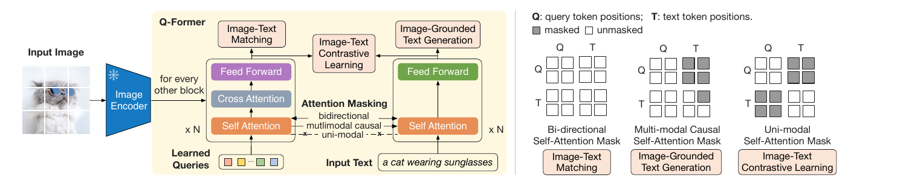
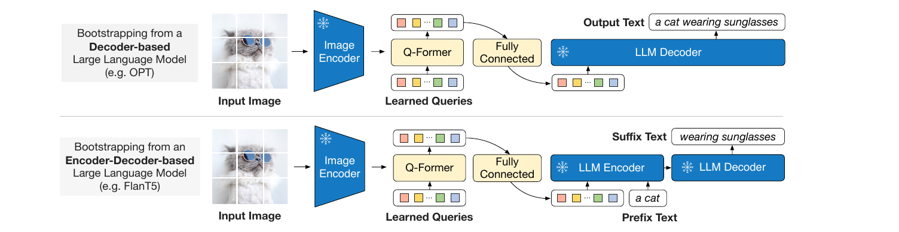
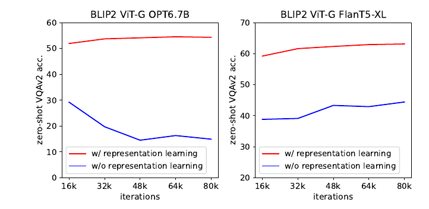

# BLIP-2 — 이미지 인코더도 LLM도 전부 얼려놓고, 그 사이 188M짜리 다리 하나만 학습한다

---

## 📌 메타 정보

| 항목 | 내용 |
|---|---|
| **제목** | BLIP-2: Bootstrapping Language-Image Pre-training with Frozen Image Encoders and Large Language Models |
| **저자** | Junnan Li, Dongxu Li, Silvio Savarese, Steven Hoi (**Salesforce Research**) |
| **공개** | v1 2023-01-30 / v2 2023-05-01 / **v3 2023-06-15** (ICML 2023) |
| **분야** | Vision-Language Pre-training(비전-언어 사전학습, VLP), frozen backbone(동결 백본) 재사용 |
| **arXiv (abstract)** | https://arxiv.org/abs/2301.12597 |
| **arXiv (PDF)** | https://arxiv.org/pdf/2301.12597v3 |
| **코드** | https://github.com/salesforce/LAVIS/tree/main/projects/blip2 |
| **사용 외부 모델** | 눈: CLIP **ViT-L/14**, EVA-CLIP **ViT-g/14** · 입: **OPT** 2.7B/6.7B, **FlanT5** XL/XXL · 다리 초기화: **BERT-base** |
| **사용 데이터** | BLIP과 동일한 **129M 이미지** (COCO, Visual Genome, CC3M, CC12M, SBU + LAION400M 115M) + CapFilt 합성 캡션 |
| **자원** | **A100 40G 16장 한 대**, 최대 모델이 Stage 1 6일 미만 + Stage 2 3일 미만 (≈3,500 A100-hour) |

---

## 📖 주요 용어 사전 (Glossary)

*처음 보는 사람이 본문에서 헤매지 않도록, 반복해서 나오는 용어를 먼저 모아둔다.*

### 아키텍처 3덩어리
- **Image Encoder(이미지 인코더, 눈)**: 이미지를 시각 특징 벡터로 바꾸는 부분. 여기선 CLIP/EVA-CLIP의 ViT를 **가져다 얼려서** 씀.
- **LLM(거대 언어모델, 입)**: 텍스트를 생성하는 부분. OPT 또는 FlanT5를 **가져다 얼려서** 씀.
- **Q-Former(Querying Transformer, 다리)**: 눈과 입 사이를 잇는 **유일하게 학습되는 부품**. 188M 파라미터.

### 핵심 개념
- **frozen(동결)**: 가중치를 아예 안 건드리는 것. 학습 비용도 줄고, 원래 능력이 망가지는 것도 막는다는 게 이 논문의 전제.
- **modality gap(모달리티 갭)**: 시각 벡터와 언어 벡터가 서로 다른 공간에 살아서 말이 안 통하는 현상. 이 논문이 메우려는 대상.
- **learnable query(학습 가능한 질의 벡터)**: Q-Former의 입력처럼 보이지만 실제로는 **모델 파라미터**인 32개의 768차원 벡터. 학습이 끝나면 고정된 32개 벡터가 된다.
- **information bottleneck(정보 병목)**: 출력 자리를 일부러 좁게(32칸) 만들어, 그 안에 **텍스트와 관련된 정보만** 담기도록 강제하는 설계.
- **soft visual prompt(부드러운 시각 프롬프트)**: 시각 정보를 "토큰인 척" 만들어 LLM 입력 앞에 붙이는 것. 진짜 단어 토큰이 아니라 연속값 벡터라서 soft.
- **catastrophic forgetting(치명적 망각)**: 새 작업을 배우다가 원래 잘하던 것을 잊는 현상. LLM 앞에 정렬 안 된 벡터를 붙이면 벌어진다.
- **attention mask(어텐션 마스크)**: 어떤 토큰이 어떤 토큰을 볼 수 있는지 정하는 표. BLIP-2는 **마스크만 바꿔서 세 가지 학습 목표를 구현**한다.
- **CapFilt**: BLIP에서 온 캡션 정제 기법. 웹 캡션이 지저분하니 모델로 캡션을 새로 만들고(Cap) 좋은 것만 거른다(Filt).

### 학습 목표(objective) 3종 — Stage 1에서 동시에 돌린다
- **ITC (Image-Text Contrastive, 이미지-텍스트 대조 학습)**: 맞는 짝은 가깝게, 틀린 짝은 멀게 미는 학습.
- **ITG (Image-grounded Text Generation, 이미지 조건 텍스트 생성)**: 이미지를 보고 캡션을 써내는 학습.
- **ITM (Image-Text Matching, 이미지-텍스트 매칭)**: 이 짝이 맞는지 아닌지 O/X로 맞히는 학습.

### 비교 대상 / 평가
- **Flamingo (DeepMind)**: 얼린 LLM 안에 **cross-attention 층을 새로 끼워 넣는** 방식. BLIP-2의 주 비교 대상. 80B 버전의 학습 파라미터가 10.2B.
- **Perceiver Resampler**: Flamingo가 쓴, 가변 개수의 시각 특징을 고정 개수로 줄이는 모듈. Q-Former와 역할이 비슷하다.
- **VQAv2 / OK-VQA / GQA**: 이미지를 보고 질문에 답하는 벤치마크. OK-VQA는 특히 **세상 지식**을 많이 요구한다.
- **NoCaps / COCO Caption**: 캡션 생성 벤치마크. NoCaps의 out-domain은 **학습에서 못 본 개념**을 얼마나 잘 설명하는지 본다.
- **CIDEr / SPICE / B@4**: 캡션 품질 점수. 높을수록 좋다.
- **R@1 (Recall@1)**: 검색에서 1등으로 뽑은 게 정답일 확률.

---

## 🎯 논문 요약 (TL;DR)

**한 줄**: 이미지 인코더도 LLM도 전부 얼려놓고, 그 사이에 끼우는 188M짜리 작은 다리(Q-Former) 하나만 학습해서 Flamingo-80B를 이겼다. 학습 파라미터 **54배 절감**, A100 16장으로 **9일**.

**핵심 문제**: 2022년까지 VLP의 상식은 **end-to-end 학습**(이미지 타워와 텍스트 타워를 통째로 같이 돌리기)이었는데, 모델이 커질수록 비용이 감당이 안 됐다. "이미 잘 학습된 CLIP 인코더랑 이미 잘 학습된 LLM을 그대로 갖다 쓰면 되지 않나?"가 자연스러운 발상인데 함정이 있다 — **LLM은 평생 이미지를 본 적이 없다.** 얼려버리면 시각 정보와 언어 공간을 맞출 방법이 사라진다. 기존 시도(Frozen, Flamingo)는 "이미지 주고 캡션 만들어"라는 **생성 손실 하나**로 다리를 학습시켰는데, 저자들은 **그것만으로는 modality gap을 못 메운다**고 주장한다.

**해결책**: Q-Former를 **2단계로 나눠** 학습한다.
1. **Stage 1** — LLM 없이, 얼린 이미지 인코더만 붙여 놓고 ITC/ITG/ITM 세 목표를 동시에 돌려 **query를 언어 정렬된 상태로 만든다.**
2. **Stage 2** — 그 Q-Former 출력을 fully-connected layer 한 장으로 투영해 얼린 LLM 입력 앞에 붙이고, 생성 학습만 한다.

**검증**: zero-shot(제로샷) VQAv2에서 **65.0** — Flamingo80B의 56.3보다 **+8.7%p** 높으면서 학습 파라미터는 **54배 적다**. NoCaps out-domain CIDEr 124.8(Flamingo 115.2), Flickr30K zero-shot 검색 R@1 97.6.

---

## 🏆 핵심 기여 (Contributions)

1. **Q-Former** — 얼린 눈과 얼린 입 사이를 잇는 188M짜리 다리. 32개 learnable query가 이미지를 32칸으로 압축하는 information bottleneck 구조.
2. **2단계 사전학습 전략** — 표현 학습(Stage 1) → 생성 학습(Stage 2). "생성 손실만으로는 부족하다"는 주장을 Figure 5로 실증.
3. **마스크만 바꿔 3목표를 한 모듈로** — ITC/ITG/ITM을 하나의 입력 형식·하나의 파라미터로, self-attention mask만 갈아끼워 구현.
4. **압도적 비용 효율** — 학습 파라미터 54배 절감, A100 16장 × 9일로 Flamingo80B 추월.
5. **"어댑터 레시피"로서의 일반성** — 더 좋은 이미지 인코더나 더 좋은 LLM을 꽂으면 성능이 그대로 따라온다는 것을 실험으로 보임.
6. **instructed zero-shot image-to-text generation** — 시각 대화, 시각 지식 추론, 개인화된 캡션 등 지시문을 따르는 창발적 능력 시연.

---

## 🧩 주요 알고리즘 설명

전체 흐름: **이미지 → [얼린 눈] ViT → [다리] Q-Former 32 query → FC 한 장 → [얼린 입] LLM 앞에 prepend → 텍스트 생성.**

### 1️⃣ Q-Former — 핵심 구조

*왜 이런 걸 새로 만드나?* 얼린 눈이 뱉는 수백 개의 시각 벡터를 LLM이 알아들을 리 없으니, **"텍스트와 관련 있는 것만 골라 담는 압축기"**를 하나 끼워 넣는다.

이름 그대로 **Querying Transformer**, "질의(query) 벡터들이 이미지 특징에서 필요한 것만 뽑아오는 Transformer"다.

**스펙**

| 항목 | 값 |
|---|---|
| 파라미터 | **188M** |
| 초기화 | **BERT-base** 가중치 (단, **cross-attention 층만 랜덤 초기화**) |
| 층/차원 | 12블록, hidden 768 |
| query | **학습 가능한 query 임베딩 32개**, 각 768차원 |
| cross-attention 위치 | **매 두 번째 블록마다**(every other block) 삽입 → 12블록 중 6개 |

⚠️ query는 입력처럼 보이지만 **모델 파라미터(model parameters)**다. 학습이 끝나면 고정된 32개 벡터가 되고, 어떤 이미지가 들어와도 같은 32개 query가 질문을 던진다.

**두 개의 서브모듈이 self-attention 층을 공유한다**

1. **image transformer**: query들이 얼린 이미지 인코더와 **cross-attention**으로 대화하며 시각 특징을 뽑아옴
2. **text transformer**: 텍스트 인코더 겸 디코더 역할

그리고 query와 텍스트는 **공유된 self-attention 층에서 서로 만난다.** 여기가 설계의 묘수인데, 다음 절의 세 가지 목적함수가 **바로 이 self-attention의 마스크만 바꿔가며** 구현된다.

**information bottleneck(정보 병목)이 핵심 아이디어**

출력 Z의 크기는 **32 × 768**이다. 반면 ViT-L/14가 뱉는 이미지 특징은 **257 × 1024**. 즉 Q-Former는 이미지를 32개 슬롯으로 **강제 압축**한다. 자리가 32칸뿐이니 query들은 "텍스트와 관련된 정보"를 우선 담을 수밖에 없고, LLM에게는 쓸데없는 시각 정보가 걸러진 알짜만 전달된다. 저자들의 표현으로는 이게 **LLM의 vision-language 정렬 부담을 덜어줘서 catastrophic forgetting(치명적 망각)을 완화**한다.

또 하나의 실용적 장점: **출력 개수가 입력 해상도와 무관하게 항상 32개**다. 해상도를 올려도 LLM이 받는 토큰 수는 그대로다.

### 2️⃣ Stage 1 — 이미지 인코더만 붙여서 표현 학습

*왜 LLM을 안 붙이고 먼저 이 단계를 두나?* 정렬되지 않은 시각 벡터를 곧바로 LLM에 먹이면 LLM이 망가지기 때문에(→ 실험 요약의 Figure 5), **query를 미리 "언어에 맞춰진 상태"로 만들어 두는 준비운동**이다.

LLM은 아직 등장하지 않는다. 얼린 이미지 인코더 + Q-Former만 놓고, BLIP에서 물려받은 **세 가지 목적함수를 동시에** 돌린다. **셋의 차이는 오직 attention mask다** (위 Figure 2 오른쪽).

**(1) ITC — Image-Text Contrastive (대조 학습)**
- 마스크: **uni-modal** — query와 텍스트가 서로를 **아예 못 본다.** 정답이 새어나가는 것(information leak)을 막기 위함
- 유사도 계산: Z에는 출력이 32개나 있으니, 텍스트의 `[CLS]` 임베딩과 **32개 각각의 유사도를 구한 뒤 그중 최댓값(max)**을 이미지-텍스트 유사도로 쓴다
- BLIP은 momentum queue(모멘텀 큐)를 썼지만 BLIP-2는 **in-batch negative(배치 안 오답)**만 쓴다. 이미지 인코더가 얼어 있어서 GPU에 훨씬 많은 샘플을 올릴 수 있기 때문 — **프리징이 배치 크기라는 부수입을 낳은 사례**

**(2) ITG — Image-grounded Text Generation (이미지 조건 텍스트 생성)**
- 마스크: **multimodal causal** (UniLM 방식) — query끼리는 서로 다 보되 텍스트는 못 봄, 텍스트 토큰은 **모든 query + 자기 앞 텍스트**를 봄
- 구조상 **텍스트 토큰은 이미지 인코더에 직접 접근할 수 없다.** 캡션을 쓰려면 정보가 반드시 query를 거쳐야 하고, 이게 query에게 "텍스트 생성에 필요한 정보를 다 담아라"는 압력을 건다
- `[CLS]` 대신 새 `[DEC]` 토큰을 첫 텍스트 토큰으로 써서 "지금은 디코딩 작업"임을 알림

**(3) ITM — Image-Text Matching (매칭 판별)**
- 마스크: **bidirectional(양방향)** — 전부 다 봄
- 각 query 출력을 2-class 선형 분류기(linear classifier)에 넣어 로짓을 얻고, **32개 로짓을 평균**내서 매칭 점수로 사용
- **hard negative mining(어려운 오답 채굴)** 적용 — 헷갈릴 만한 오답 짝을 골라 학습

이 세 개를 **하나의 입력 형식, 하나의 파라미터**로 굴린다는 게 깔끔하다. **마스크가 곧 태스크다.**

### 3️⃣ Stage 2 — LLM 붙여서 생성 학습

*왜 또 한 단계가 필요한가?* Stage 1의 query는 "텍스트와 정렬된" 상태일 뿐, 특정 LLM이 알아듣는 임베딩 공간에 있는 건 아니다. 그 마지막 좌표 변환과 생성 적응을 여기서 한다.

Q-Former 출력 Z(32×768)를 **fully-connected layer(완전연결층, FC) 한 장**으로 LLM의 텍스트 임베딩 차원에 맞춰 투영하고, 입력 텍스트 임베딩 **앞에 붙인다(prepend)**. 논문 표현으로 **soft visual prompt**.

LLM 종류에 따라 손실이 다르다:

| LLM 유형 | 예시 | 손실 |
|---|---|---|
| decoder-based(디코더형) | OPT 2.7B / 6.7B | 일반 **language modeling loss** |
| encoder-decoder-based(인코더-디코더형) | FlanT5-XL / XXL | **prefix LM loss** — 텍스트를 둘로 쪼개 **앞부분(prefix)은 시각 표현과 함께 인코더로**, **뒷부분(suffix)은 디코더의 생성 타깃**으로 |

여기서 중요한 점: Stage 2에서는 **Q-Former의 text transformer 쪽이 사실상 퇴장**하고, "이미지 → 32 토큰" 변환기로만 동작한다. 즉 Stage 1은 오로지 **query들을 언어 정렬된 상태로 만들어놓기 위한 준비운동**이다.

### 4️⃣ 학습 설정 (재현 관점에서 중요한 숫자들)

*왜 굳이 다 적나?* 이 논문의 주장 자체가 "싸게 된다"이므로, 그 비용 수치가 곧 기여의 증거다.

| 항목 | 값 |
|---|---|
| 데이터 | BLIP과 동일한 **129M 이미지** — COCO, Visual Genome, CC3M, CC12M, SBU + LAION400M에서 115M |
| 캡션 정제 | **CapFilt**: BLIP-large로 이미지당 합성 캡션 10개 생성 → 원본 웹 캡션과 함께 CLIP ViT-L/14 유사도로 랭킹 → **상위 2개 보관, 매 스텝 그중 하나 랜덤 샘플링** |
| 이미지 인코더 | CLIP **ViT-L/14**, EVA-CLIP **ViT-g/14**. **마지막 층을 제거하고 끝에서 두 번째 층 출력**을 사용 (약간 더 좋았다고) |
| LLM | OPT 2.7B/6.7B (비지도 학습), FlanT5-XL/XXL (instruction-tuned, 지시문 튜닝됨) |
| 스텝 | Stage 1 **250k**, Stage 2 **80k** |
| 배치 | Stage 1: 2320(ViT-L)/1680(ViT-g), Stage 2: 1920(OPT)/1520(FlanT5) |
| 최적화 | AdamW, beta 0.9 / 0.98, weight decay 0.05, cosine decay, peak LR 1e-4, warmup 2k step, Stage 2 min LR 5e-5 |
| 정밀도 | ViT/LLM을 **FP16**으로 변환 (FlanT5만 BFloat16). 32비트 대비 **성능 저하 없음** |
| 해상도 | **224×224**, random resized crop + horizontal flip |
| 자원 | **A100 40G 16장 한 대**. 최대 모델(ViT-g + FlanT5-XXL)이 Stage 1 6일 미만 + Stage 2 3일 미만 |

총합 대략 **3,500 A100-hour** 수준이다. 2023년 기준으로도, 지금 기준으로는 더더욱 **말도 안 되게 싼** 비용이다.

---

## 📊 실험 요약

### zero-shot VQA (Table 2) — 논문의 대표 주장

*이 표 하나가 초록의 "+8.7%, 54배"를 만들어낸다.*

| 모델 | 학습 파라미터 | 전체 파라미터 | VQAv2 test-dev | OK-VQA | GQA |
|---|---|---|---|---|---|
| Flamingo3B | 1.4B | 3.2B | 49.2 | 41.2 | – |
| Flamingo9B | 1.8B | 9.3B | 51.8 | 44.7 | – |
| **Flamingo80B** | **10.2B** | **80B** | **56.3** | **50.6** | – |
| BLIP-2 ViT-L OPT-2.7B | 104M | 3.1B | 49.7 | 30.2 | 33.9 |
| BLIP-2 ViT-g OPT-2.7B | 107M | 3.8B | 52.3 | 31.7 | 34.6 |
| BLIP-2 ViT-g OPT-6.7B | 108M | 7.8B | 52.6 | 36.4 | 36.4 |
| BLIP-2 ViT-L FlanT5-XL | 103M | 3.4B | 62.3 | 39.4 | 44.4 |
| BLIP-2 ViT-g FlanT5-XL | 107M | 4.1B | 63.0 | 40.7 | 44.2 |
| **BLIP-2 ViT-g FlanT5-XXL** | **108M** | **12.1B** | **65.0** | 45.9 | **44.7** |

65.0 − 56.3 = **+8.7%p**, 10.2B ÷ 188M ≈ **54배**. 초록의 두 숫자가 여기서 나온다.

**OK-VQA만 진다** (45.9 vs 50.6). 저자들의 해명이 솔직하다 — OK-VQA는 시각 이해보다 **세상 지식**을 묻는 벤치마크고, Flamingo가 쓴 **70B Chinchilla가 11B FlanT5-XXL보다 아는 게 많다**는 것. 즉 이 논문의 성능은 상당 부분 **LLM에서 빌려온 것**이고, 저자들도 그렇게 인정한다.

여기서 논문이 뽑아낸 일반 원칙(Table 2 관찰)이 오히려 더 중요하다:

> **더 좋은 이미지 인코더 또는 더 좋은 LLM을 꽂으면 그대로 성능이 오른다.**
> (ViT-g > ViT-L, 큰 LLM > 작은 LLM, instruction-tuned FlanT5 > 비지도 OPT)

즉 BLIP-2는 모델이 아니라 **"비전 커뮤니티와 NLP 커뮤니티의 발전을 그대로 수확하는 어댑터 레시피"**라는 자기 규정이다.

### 캡셔닝 (Table 3)

*못 본 개념까지 설명할 수 있는지 = 얼린 LLM의 지식이 실제로 살아 있는지를 보는 자리.*

| 모델 | NoCaps overall CIDEr | NoCaps **out-domain** CIDEr | COCO B@4 | COCO CIDEr |
|---|---|---|---|---|
| Flamingo (10.6B 학습) | 112.2 | 115.2 | – | 138.1 |
| BLIP-2 ViT-g OPT-2.7B | 119.7 | 123.4 | **43.7** | **145.8** |
| BLIP-2 ViT-g OPT-6.7B | 121.0 | 124.4 | 43.5 | 145.2 |
| BLIP-2 ViT-g FlanT5-XL | **121.6** | **124.8** | 42.4 | 144.5 |

특히 **out-domain(학습에서 못 본 개념) 124.8 vs Flamingo 115.2** — 일반화에서 강하다.

### 검색 (Table 5)

*LLM을 아예 떼고 Stage 1 산출물만으로도 쓸 만한지 확인하는 실험.*

LLM 없이 **Stage 1 모델만** 파인튜닝한다. 추론은 ITC로 후보 **k=128**개를 뽑고 ITM으로 재랭킹하는 2단 구조.

| 모델 | Flickr30K zero-shot I→T R@1 | T→I R@1 | COCO 파인튜닝 I→T R@1 | T→I R@1 |
|---|---|---|---|---|
| BLIP (446M) | 96.7 | 86.7 | 82.4 | 65.1 |
| BEIT-3 (1.9B) | 94.9 | 81.5 | **84.8** | 67.2 |
| **BLIP-2 ViT-g (1.2B)** | **97.6** | **89.7** | **85.4** | **68.3** |

### VQA 파인튜닝 (Table 4)

*"제로샷만 잘하는 것 아니냐"에 대한 답.*

82.19 test-dev로 Flamingo80B(82.0, 학습 10.6B)와 동급, BEIT-3(84.19)에는 밀린다. 이때 **질문 토큰도 Q-Former에 넣어** self-attention으로 query와 섞는다 — 그러면 cross-attention이 **질문과 관련된 이미지 영역**에 집중하게 된다. 영리한 트릭. LLM은 얼린 채 Q-Former + 이미지 인코더만 파인튜닝한다.

### ⭐ Ablation (a) — Figure 5: Stage 1을 빼면 무너진다

*이 논문에서 제일 중요한 그림. "생성 손실만으로는 부족하다"는 전제 전체가 여기 걸려 있다.*

Stage 1 없이 Stage 2만 돌리면(= Flamingo의 Perceiver Resampler와 비슷한 상황) zero-shot VQAv2가 **폭락**한다.

| 조합 | Stage 1 있음 (80k step) | Stage 1 없음 (80k step) |
|---|---|---|
| ViT-g + OPT-6.7B | 약 **54** (계속 상승) | 약 **15** (16k의 29에서 **계속 하락**) |
| ViT-g + FlanT5-XL | 약 **63** | 약 **44** |

특히 **OPT 쪽은 학습이 진행될수록 catastrophic forgetting으로 성능이 계속 떨어진다** — 16k 스텝의 29에서 80k 스텝의 15로 내려간다.

**해석**: 정렬되지 않은 시각 벡터를 LLM 앞에 붙이면, LLM은 **"이 이상한 벡터가 뭔지 이해하려고 자기 언어 능력을 갈아 넣는다."** Stage 1은 그 부담을 Q-Former가 미리 대신 져주는 장치다. **"프리징만으로는 망각을 못 막는다"**는 게 이 그림의 메시지다.

### ⭐ Ablation (b) — Table 6: ITG가 검색까지 도와준다

*생성용 손실을 왜 표현 학습 단계에 굳이 같이 넣었는지에 대한 근거.*

| COCO 파인튜닝 목적함수 | I→T R@1 | I→T R@5 | T→I R@1 | T→I R@5 |
|---|---|---|---|---|
| ITC + ITM | 84.5 | 96.2 | 67.2 | 87.1 |
| **ITC + ITM + ITG** | **85.4** | **97.0** | **68.3** | **87.7** |

검색은 생성과 무관한 태스크인데도 **생성 손실을 넣으면 검색이 좋아진다.** 이유: ITG는 "텍스트를 써낼 수 있을 만큼"의 정보를 query에 강제로 담게 하고, 그렇게 뽑힌 특징이 결국 언어와 잘 맞물린 특징이라는 것. **설계 의도가 숫자로 확인된 드문 사례다.**

---

## 💬 Q&A

### Q1. 논문이 스스로 인정한 한계는?

| 한계 | 내용 |
|---|---|
| **in-context learning(문맥 내 학습)이 안 됨** | few-shot VQA 예시를 넣어줘도 성능이 안 오른다. 원인은 **사전학습 데이터가 샘플당 이미지-텍스트 쌍 하나뿐**이라 여러 쌍 사이의 상관을 배울 기회가 없었기 때문. Flamingo는 M3W라는 비공개 interleaved(교차 배치) 데이터로 이걸 얻었다. |
| 지식·추론 오류 | 부정확한 지식, 잘못된 추론 경로 활성화, 최신 정보 부재 |
| LLM 위험 상속 | 편향·유해 표현·프라이버시 유출을 그대로 물려받음 |

⚠️ 첫 항목이 뼈아프다 — **"LLM을 얼리면 LLM의 능력이 보존된다"는 서사가 여기서 부분적으로 깨진다.**

### Q2. 2026년 시점에서 이 논문의 무엇이 살아남았나?

*지금 읽고 있는 다른 VLM 논문들과의 관계를 정리하는 자리.*

- **"양쪽 다 얼리고 다리만 학습"**이 이후 오픈소스 VLM의 **기본 문법**이 됐다. MiniGPT-4는 아예 BLIP-2의 Q-Former를 그대로 가져와 Vicuna에 선형층 하나로 붙였고, InstructBLIP은 BLIP-2 위에 지시문 튜닝을 얹은 직계 후속이다.
- **"인코더/LLM을 더 좋은 걸로 갈아끼우면 성능이 따라온다"**는 관찰이 사실상 **모든 후속 VLM의 로드맵**이 됐다.
- **Stage 1의 존재 이유**(정렬 안 된 벡터를 LLM에 먹이면 망가진다)는 지금도 유효한 교훈이다. 다만 현대 레시피는 이걸 **별도 Stage 1 대신 "projector만 먼저 학습하는 warmup 단계"**로 훨씬 싸게 해결한다.

### Q3. 그런데 왜 Q-Former는 지금 아무도 안 쓰나?

*이 논문의 가장 유명한 부품이 정작 계승되지 못한 이유 — 실무 선택에 직접 영향을 준다.*

반년 뒤 **LLaVA-1.5가 Q-Former 없이 MLP 두 층**으로 BLIP-2 계열을 압도했고, 이후 흐름은 명확하게 **"복잡한 resampler 대신 단순 projection + 좋은 지시문 데이터"**로 갔다. [PaliGemma](PAPER_PaliGemma.md)는 **선형 투영 한 장**이고, [SmolVLM](PAPER_SmolVLM.md)/[nanoVLM](PAPER_nanoVLM.md)은 **pixel shuffle로 토큰을 접기만** 한다. 이유는 두 가지로 정리된다:

1. **32 토큰 병목은 정보 손실이 너무 크다.** OCR·문서·세밀한 공간 추론이 중요해지자, 압축된 32칸으로는 감당이 안 됐다. 실제로 [PaliGemma 2](PAPER_PaliGemma-2.md)가 **"글자 읽기 = 해상도"**라고 분해해낸 결론과 정면으로 충돌한다.
2. **188M짜리 다리는 학습시켜야 할 또 하나의 모델이다.** 단순 MLP는 학습이 쉽고 데이터가 늘수록 잘 스케일한다. BLIP-2는 "학습 파라미터가 적다"를 자랑했지만, 정작 **그 188M을 제대로 학습시키느라 2단계 250k + 80k 스텝**이 필요했다.

### Q4. 논문 숫자를 읽을 때 주의할 부분은?

*초록의 홍보 문구와 표의 실제 내용 사이에 있는 간극.*

- **Table 1의 "188M"과 Table 2의 "104~108M"이 다르다.** Table 1은 Q-Former 전체(텍스트 쪽 포함), Table 2는 Stage 2에서 실제로 쓰이는 부분 기준으로 보인다. 초록의 "54배"는 188M 기준이다.
- **Table 1은 "베스트 오브" 합성 행이다.** VQAv2 65.0은 ViT-g + FlanT5-XXL, NoCaps 121.6은 ViT-g + FlanT5-XL, 검색 97.6/89.7은 LLM 없는 Stage 1 모델 — **한 모델이 낸 성적이 아니다.**
- **"54배 적은 학습 파라미터"는 전체 크기 얘기가 아니다.** ViT-g + FlanT5-XXL의 총 파라미터는 12.1B이고, 추론할 땐 이걸 다 돌려야 한다. 80B 대비 6.6배 작은 건 맞지만 54배가 아니다.
- **zero-shot 비교가 완벽히 공정하진 않다.** BLIP-2는 프롬프트를 튜닝했고(OPT는 "Question: {} Answer:", FlanT5는 "Question: {} Short answer:"), beam 5 + length penalty −1로 **"사람 라벨에 맞는 짧은 답"**을 유도했다. 게다가 FlanT5는 **이미 지시문 튜닝된** 모델이라 Chinchilla와 출발선이 다르다. 논문도 이걸 숨기지 않고 Table 2 관찰 (3)으로 명시한다.

---

## 🧾 한 줄 요약 (전체)

**BLIP-2는 Q-Former라는 특정 구조로 기억될 논문이 아니라, "얼린 두 거인 사이에 학습 가능한 다리를 놓는다"는 패러다임을 숫자로 못박은 논문이다.** 다리의 모양은 이후 훨씬 단순해졌지만(Q-Former → MLP → 선형 한 장), 다리를 놓는다는 발상 자체는 지금의 VLM 논문 전부의 뿌리다.

---

## 🔗 관련 문서

| 문서 | 관계 |
|---|---|
| [PAPER_nanoVLM.md](PAPER_nanoVLM.md) | 같은 "눈+다리+입" 구조를 750줄로 벌거벗긴 교육용 구현. 다리가 Q-Former가 아니라 pixel shuffle + Linear |
| [PAPER_PaliGemma.md](PAPER_PaliGemma.md) | 다리를 **선형 투영 한 장**으로 극단 단순화. "복잡한 트릭 불필요"를 대규모 ablation으로 증명 |
| [PAPER_PaliGemma-2.md](PAPER_PaliGemma-2.md) | "글자 읽기 = 해상도, 생각하기 = LM 크기" 분해 — BLIP-2의 32 토큰 병목이 왜 한계인지 설명해줌 |
| [PAPER_SmolVLM.md](PAPER_SmolVLM.md) | 소형 VLM 설계 규칙 9 Findings. "인코더 작게·압축 세게" |
| [PAPER_Florence-2.md](PAPER_Florence-2.md) | 같은 시기 다른 노선 — 백본 재사용이 아니라 **데이터 엔진**으로 통합 |
| [PAPER_Phi-4-Mini.md](PAPER_Phi-4-Mini.md) | 백본 동결 + 모달리티별 LoRA — 프리징 계보의 또 다른 갈래 |
