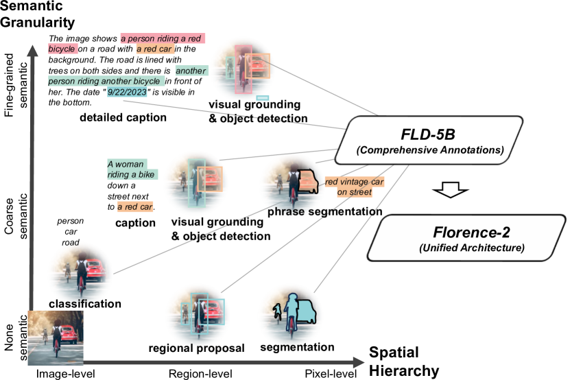
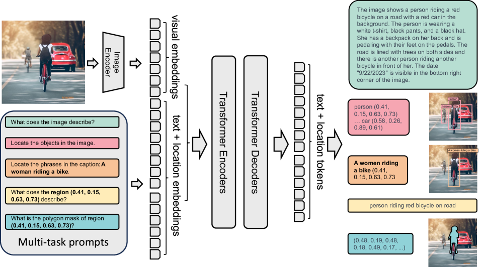
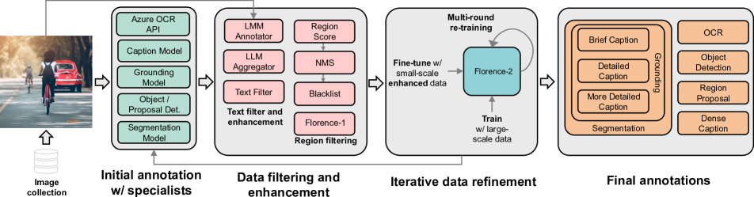

# Florence-2: Advancing a Unified Representation for a Variety of Vision Tasks

## 📋 메타 정보

| 항목 | 내용 |
|---|---|
| **제목** | Florence-2: Advancing a Unified Representation for a Variety of Vision Tasks |
| **저자/소속** | Bin Xiao, Haiping Wu, Weijian Xu, Xiyang Dai, Houdong Hu, Yumao Lu, Michael Zeng, Ce Liu, Lu Yuan — **Microsoft (Azure AI)** |
| **공개일** | 2023-11-10 (arXiv v1) · **CVPR 2024** 채택 |
| **분야** | Unified Vision Foundation Model(통합 비전 파운데이션 모델) — 이미지+지시문(prompt)을 받아 **텍스트 시퀀스**를 출력하는 seq2seq 방식으로 캡션·검출·그라운딩·분할·OCR을 한 모델에 통합 |
| **arXiv** | [abs](https://arxiv.org/abs/2311.06242) · [ar5iv](https://ar5iv.labs.arxiv.org/abs/2311.06242) |
| **공식 자료** | [HF: microsoft/Florence-2-large](https://huggingface.co/microsoft/Florence-2-large) · [Florence-2-base](https://huggingface.co/microsoft/Florence-2-base) |
| **외부 모델/데이터** | DaViT(vision encoder) · Azure OCR API·Caption/Grounding/Detection/Segmentation 전문 모델(데이터 엔진용) · ImageNet·Object365·COCO 등 시드 이미지 |

---

## 📖 주요 용어 사전 (Glossary)

### 아키텍처
- **unified representation(통합 표현)**: 작업마다 다른 모델·헤드를 쓰지 않고, **하나의 모델이 하나의 형식으로** 모든 비전 작업을 처리하도록 배운 내부 표현. Florence-2의 목표 그 자체.
- **seq2seq(sequence-to-sequence, 시퀀스→시퀀스)**: 입력 토큰 열을 받아 출력 토큰 열을 생성하는 구조. 번역기(영어→한국어)와 같은 틀. Florence-2는 "이미지+지시문 → 답 토큰 열"로 이 틀을 그대로 씀.
- **DaViT (Dual Attention Vision Transformer)**: Microsoft의 이미지 인코더(image encoder). 이미지를 시각 토큰(visual token) 열로 바꿔주는 "눈". 공간 어텐션과 채널 어텐션을 번갈아 쓰는 ViT 계열.
- **transformer encoder-decoder(트랜스포머 인코더-디코더)**: 시각 토큰 + 지시문 토큰을 함께 받아(encoder), 답 토큰을 한 개씩 생성(decoder)하는 표준 트랜스포머. 특별한 검출·분할 전용 부품(head)이 없음.
- **location token(위치 토큰, `<loc_0>`~`<loc_999>`)**: 좌표를 **텍스트 단어처럼** 다루려고 어휘집(vocabulary)에 새로 추가한 특수 토큰 1,000개. 이미지 좌표를 1,000개 구간(bin)으로 양자화(quantize)한 것. 이게 검출·분할을 "글자 뱉듯" 처리하게 만드는 핵심 장치.

### 핵심 개념
- **spatial hierarchy(공간 계층)**: 이미지 안에 전체 장면(coarse) → 물체 영역(region) → 픽셀 경계(fine)까지 여러 "공간 해상도" 정보가 겹겹이 있다는 뜻. 통합 모델이 반드시 다 다뤄야 하는 축 ①.
- **semantic granularity(의미 세분화)**: "고양이"라는 굵은 개념부터 "털의 질감"까지 여러 "의미 수준"이 있다는 뜻. 통합 모델이 다뤄야 하는 축 ②.
- **task prompt(작업 지시문)**: 어떤 작업을 원하는지 알려주는 짧은 문장. 예) `"What does the image describe?"` = 캡션. 같은 이미지라도 지시문만 바꾸면 다른 작업이 됨.
- **data engine(데이터 엔진)**: 사람이 손으로 라벨을 다는 대신, 여러 전문 모델과 필터·재학습을 **자동 순환**시켜 대규모 라벨을 찍어내는 파이프라인. FLD-5B를 만든 장치. → [3️⃣](#3️⃣-fld-5b-와-데이터-엔진--논문의-진짜-심장) 참조.

### 데이터 (FLD-5B 라벨 3종)
- **Text annotation(텍스트 라벨)**: 이미지 전체를 설명하는 캡션(coarse). 상세도 3단계(Brief/Detailed/More Detailed).
- **Region-Text annotation(영역-텍스트 라벨)**: "이 박스 = 이 물체/짧은 설명" 쌍. 검출·영역 캡션용(region 수준).
- **Text-Phrase-Region annotation(텍스트-구절-영역 라벨)**: 긴 캡션 안의 **각 구절(phrase)** 을 이미지 **영역(region)** 에 연결한 삼중쌍. 그라운딩(grounding)용, 가장 세밀(fine).

### 평가/작업 이름
- **grounding(그라운딩)**: 문장 속 표현이 이미지의 **어느 위치**인지 짚는 것. phrase grounding = 캡션의 여러 구절을 각각 영역에 매핑.
- **referring expression(참조 표현)**: "왼쪽에서 두 번째 빨간 차" 같은 지시 문구. 그 대상을 박스(REC)나 마스크(RES)로 찾음.
- **RES (Referring Expression Segmentation)**: 참조 표현이 가리키는 물체를 **픽셀 마스크**로 분할.
- **zero-shot(제로샷)**: 해당 벤치마크로 **추가 미세조정 없이** 곧바로 평가. 통합 사전학습만으로 얼마나 되나 보는 것.
- **CIDEr**: 캡션 품질 지표(높을수록 좋음). AP/mAP = 검출 정확도. Recall@1 = 그라운딩 정확도. mIoU = 분할 겹침 정확도.

---

## 🎯 논문 요약 (TL;DR)

**한 줄**: **좌표까지 전부 토큰으로 바꿔** 캡션·검출·그라운딩·분할·OCR을 하나의 seq2seq 모델(이미지+지시문 → 텍스트)로 통일하고, 이를 학습시킬 **54억 라벨 자동 데이터 엔진(FLD-5B)** 을 만든 논문. 0.77B짜리 작은 모델이 대형 특화 모델급 범용 표현을 얻는다.

**핵심 문제**: 지금까지 비전 모델은 작업마다 전용 머리(task-specific head)를 달아야 했다. 하나의 모델로 통합하려면 **공간 계층(spatial hierarchy)** 과 **의미 세분화(semantic granularity)** 를 동시에 다뤄야 하는데, 그럴 만큼 다층·다작업 라벨이 촘촘히 붙은 대규모 데이터가 세상에 없었다.

**해결책**:
1. **작업을 전부 "번역 문제"로 통일** — 입력은 항상 `이미지 + 작업 지시문`, 출력은 항상 `토큰 시퀀스`. 좌표는 `<loc_i>` 위치 토큰(1,000 bin)으로 텍스트화 → 검출·분할용 전용 헤드 제거.
2. **데이터 엔진으로 FLD-5B 자작** — 전문 모델 앙상블 라벨링 → 필터/정제 → 재학습의 3단계 순환으로 **이미지 1.26억 장 위에 라벨 54억 개**를 자동 생성.
3. **작고 표준적인 구조** — DaViT(눈) + 표준 트랜스포머 인코더-디코더. Florence-2-B는 0.23B, L은 0.77B.

**검증**: 제로샷으로 COCO 캡션 CIDEr 135.6, Flickr30k 그라운딩 84.4, RefCOCO 계열 강세. 백본으로 미세조정하면 ImageNet 사전학습 대비 **4배 학습 효율 + COCO 검출 +6.9 AP**. 작은 크기로 훨씬 큰 특화 모델과 대등.

---

## 🔑 핵심 기여 (Contributions)

1. **모든 비전 작업의 seq2seq 통일 정식화**: 캡션(3단계)·검출·영역 캡션·영역 제안·구절 그라운딩·참조 분할(RES)·영역→분할·OCR·영역 OCR을, 좌표까지 토큰으로 바꿔 **하나의 출력 형식**으로 묶음.
2. **FLD-5B 데이터 엔진**: 사람 손 라벨 없이 전문 모델 앙상블 + 필터 + 반복 재학습으로 **54억 라벨/1.26억 이미지**를 자동 생성. 논문의 실질적 심장.
3. **소형 통합 백본**: 0.23B/0.77B 규모로 제로샷과 미세조정 양쪽에서 대형 특화 모델과 경쟁. 다운스트림(검출·분할) 백본으로도 강한 전이.
4. **완전 공개**: 모델 가중치(base/large)를 공개해 이후 open-vocabulary·통합 비전 연구의 강력한 베이스라인이 됨.

---

## 🧩 주요 알고리즘 설명

### 1️⃣ 전체 그림 — 두 축(공간·의미)을 데이터로 덮는다

*왜 보나: Florence-2의 모든 설계는 "한 모델이 coarse~fine, 굵은 개념~세밀한 묘사를 다 다루려면 그만큼 다양한 라벨이 필요하다"는 한 문장에서 출발한다. 이 그림이 그 동기를 담고 있다.*

> **논문 Fig 1** — 가로축은 **공간 계층(spatial hierarchy, image→region→pixel)**, 세로축은 **의미 세분화(semantic granularity, 굵은 분류→세밀한 묘사)**. 같은 자전거 사진 하나에도 `bicycle`(분류) · `a red car`(영역) · `a person riding a red car`(관계) · 픽셀 마스크(사람 실루엣)까지 서로 다른 수준의 라벨이 붙는다. 이 2차원 평면 전체를 촘촘히 덮은 라벨 뭉치가 **FLD-5B**이고, 그걸로 학습한 통합 모델이 **Florence-2**다.

### 2️⃣ 아키텍처 — "이미지+지시문 → 답 토큰"의 단일 seq2seq

*왜 이렇게 하나: 작업마다 다른 헤드를 붙이면 통합이 깨진다. 그래서 출력 형식을 "텍스트 토큰 열" 하나로 못 박고, 구조도 번역기와 똑같은 표준 인코더-디코더로 단순화했다.*

데이터 흐름은 세 단계다.

1. **눈 (Image Encoder = DaViT)**: 입력 이미지를 시각 토큰(visual token) 열로 변환.
2. **합류 + 두뇌 (Transformer Encoder-Decoder)**: 시각 토큰 뒤에 **작업 지시문(task prompt)** 토큰을 이어 붙여(concat) 인코더에 통째로 넣고, 디코더가 답 토큰을 한 개씩 생성.
3. **답 (텍스트 토큰 열)**: 캡션이면 문장, 검출이면 `person (0.41, 0.15, 0.63, 0.73) … car (…)` 처럼 **물체명 + 위치 토큰**, 분할이면 다각형 꼭짓점 좌표 토큰 열이 나옴.

핵심 트릭 — **위치 토큰(location token)**:
- 이미지 좌표를 **1,000개 구간(bin)으로 양자화**해 `<loc_0>`~`<loc_999>` 라는 **단어 1,000개를 어휘집에 추가**.
- 바운딩 박스 = 좌상단·우하단 좌표 = 위치 토큰 4개. 분할 마스크 = 다각형 꼭짓점들의 좌표 토큰 열. OCR = 글자 + 그 위치 토큰.
- 덕분에 **검출·분할조차 "특정 토큰 열을 받아쓰는 번역"** 이 되고, 전용 헤드가 사라진다. (같은 아이디어를 이후 [[paper_paligemma]] 가 `<loc>`/`<seg>` 토큰으로 계승한다.)

Fig 2의 **Multi-task prompts** 예시로 "같은 이미지, 다른 지시문 → 다른 작업"이 한눈에 보인다:

| 지시문(prompt) | 작업 | 출력 형식 |
|---|---|---|
| `What does the image describe?` | 캡션 | 문장 (Brief / Detailed / More Detailed) |
| `Locate the objects in the image.` | 객체 검출(OD) | 물체명 + 박스(위치 토큰 4개) 반복 |
| `Locate the phrases in the caption: {문장}` | 구절 그라운딩 | 각 구절 → 박스 |
| `What does the region (loc,loc,loc,loc) describe?` | 영역 캡션(dense region caption) | 그 박스의 설명 문구 |
| `What is the polygon mask of region (…)?` | 영역→분할 | 다각형 꼭짓점 좌표 토큰 열 |

학습은 표준 **언어모델 손실(다음 토큰 예측, cross-entropy)** 하나로 끝. 작업이 뭐든 "정답 토큰 열을 맞히기"이므로 손실 함수가 통일된다.

### 3️⃣ FLD-5B 와 데이터 엔진 — 논문의 진짜 심장

*왜 필요한가: 위 2차원 평면(공간×의미)을 다 덮는 라벨을 사람이 손으로 달면 비용이 폭발한다. 그래서 전문 모델·필터·재학습을 자동 순환시켜 라벨을 찍어내는 "공장"을 만들었다.*

**규모**: 이미지 **1억 2,600만(126M) 장** 위에 라벨 **54억(5.4B) 개**. 라벨 3종 구성:

| 라벨 종류 | 개수 | 담는 정보 | 용도 |
|---|---|---|---|
| Text(텍스트) | 약 5억 | 이미지 전체 캡션(coarse) | 캡션 |
| Region-Text(영역-텍스트) | 약 13억 | 박스 ↔ 짧은 설명(region) | 검출·영역 캡션 |
| Text-Phrase-Region(텍스트-구절-영역) | 약 36억 | 캡션 구절 ↔ 영역 연결(fine) | 그라운딩 |

**데이터 엔진 3단계** (Fig 3, 왼→오):

1. **전문가 초기 라벨링 (Initial annotation w/ specialists)**: 한 이미지에 여러 전문 모델을 동시에 돌려 다층 라벨을 자동 생성 — Azure OCR API, Caption 모델, Grounding 모델, Object/Proposal Detector, Segmentation 모델. (사람 손 라벨이 아니라 **기존 모델들의 앙상블**이 출발점.)
2. **필터링·정제 (Data filtering and enhancement)**: 노이즈·모순 라벨 제거. 텍스트는 LLM으로 다듬고(LMM Annotator·LLM Aggregator·Text Filter), 영역은 점수화·NMS·블랙리스트로 거른다.
3. **반복 정제 (Iterative data refinement)**: 정제된 라벨로 Florence를 학습 → 그 개선된 모델로 라벨을 **다시** 달아 품질을 끌어올리는 순환(multi-round re-training). 초기 전문가 모델보다 나은 라벨이 점점 쌓인다.

→ 결과물이 오른쪽 **Final annotations**(캡션 3단계·그라운딩·검출·영역 제안·영역 캡션·분할·OCR)이고, 이게 곧 2️⃣의 학습 데이터가 된다.

---

## 📊 실험 요약

### 제로샷 (미세조정 없이 바로 평가) — Florence-2-L

*왜 보나: 통합 사전학습만으로 각 작업이 곧바로 되는지 = "범용 표현을 정말 배웠나"의 첫 증거.*

| 작업 | 벤치마크 | Florence-2-L | 의미 |
|---|---|---|---|
| 캡션 | COCO Caption (CIDEr) | **135.6** | 훨씬 큰 Flamingo(80B)급과 경쟁 |
| 검출 | COCO det (mAP) | 37.5 | 제로샷 검출이 되는 것 자체가 이례적 |
| 그라운딩 | Flickr30k (Recall@1) | **84.4** | Kosmos-2 대비 우위 |
| 참조 표현(REC) | RefCOCO / + / g (acc) | 56.3 / 61.6 / 51.4 | 지시 문구 → 박스 |
| 참조 분할(RES) | RefCOCO (mIoU) | 35.8 | 지시 문구 → 픽셀 마스크 |

> 포인트: Florence-2-L은 **0.77B**로, 수십 배 큰 모델(Flamingo 80B 등)과 제로샷에서 겨룬다. 좌표 통일 덕에 검출·그라운딩까지 미세조정 없이 나오는 게 핵심.

### 백본 전이 (다운스트림 미세조정)

*왜 보나: Florence-2를 "눈(백본)"으로 쓰고 뒤에 헤드를 붙였을 때, 표준 ImageNet 사전학습 백본보다 나은지 = 표현의 실전 가치.*

- **COCO 객체 검출** (백본으로 사용): ImageNet-1k 사전학습 대비 **+6.9 AP**, 동시에 **약 4배 학습 효율**(같은 성능에 더 적은 스텝).
- **의미 분할(ADE20k) 등** 다운스트림에서도 대형 전용 사전학습 백본과 대등/우위.

즉 통합 사전학습이 특정 작업 성능을 깎기는커녕, **다른 작업의 백본으로도 더 좋은 출발점**을 준다.

---

## 💬 Q&A

### Q1. 검출·분할을 "텍스트 생성"으로 하면 정밀도가 떨어지지 않나?

일부 그렇다. 두 가지 상한이 있다.
- **좌표 양자화**: 위치를 1,000 bin으로 쪼개므로, 고해상도에서 아주 미세한 좌표 정밀도에는 천장이 생긴다.
- **다각형 마스크**: 분할을 꼭짓점 좌표 열로 표현하므로, 픽셀 단위로 매끈한 경계가 필요한 작업에선 전용 분할 모델(예: Mask 헤드)보다 경계가 거칠 수 있다.
- 대신 얻는 것: **전용 헤드 0개**로 모든 작업을 한 모델·한 손실로 통합 → 확장성과 범용성. Florence-2는 "정밀도 최고"보다 "하나로 다 되는 강한 베이스"를 노린 설계다.

### Q2. 성능의 핵심은 모델 구조인가 데이터인가?

**압도적으로 데이터(FLD-5B)** 다. 구조는 DaViT + 표준 인코더-디코더로 의도적으로 평범하다. 진짜 기여는 "공간×의미 2차원을 촘촘히 덮는 다층 라벨을 **데이터 엔진으로 자동 생성**했다"는 점. 그래서 모델 코드만 재현해서는 같은 성능을 얻기 어렵고, 데이터 파이프라인이 곧 해자(moat)다. (단, 초기 전문가 모델의 편향이 라벨에 스며들 여지는 한계.)

### Q3. 요즘 대형 VLM(예: Qwen-VL, GPT-4V)과 뭐가 다른가?

지향점이 다르다.
- **대형 LLM 기반 VLM**: 수 B~수십 B LLM을 두뇌로 써서 **대화·복잡한 추론·VQA**에 강함. 무겁다.
- **Florence-2**: 0.23~0.77B의 **작고 빠른 통합 비전 전문가**. 캡션·검출·그라운딩·분할·OCR 같은 **구조화된 지각(perception) 작업**을 좌표 토큰으로 정밀하게 뱉는 데 특화. 대화형 추론은 타깃이 아니다.
- 그래서 Florence-2는 요즘도 **경량 백본/라벨러/전처리기**로 자주 쓰인다(예: 대형 VLM의 그라운딩·검출 보조).

### Q4. 위치 토큰 아이디어의 계보는?

좌표를 어휘집 토큰으로 바꾸는 발상은 Pix2Seq(검출을 시퀀스 생성으로) 계열에서 이어지며, Florence-2가 이를 **여러 작업으로 일반화**했다. 이후 [[paper_paligemma]] 가 `<loc0000>`~`<loc1023>`(박스) + `<seg000>`~`<seg127>`(마스크) 토큰으로 같은 철학을 계승한다. "검출·분할을 별도 헤드 없이 텍스트로" 라는 공통 DNA다.

---

## 🧾 한 줄 요약 (전체)

> **Florence-2 = "좌표까지 전부 위치 토큰(1,000 bin)으로 바꿔 모든 비전 작업을 이미지+지시문→텍스트 seq2seq로 통일 + 전문 모델 앙상블·필터·재학습 순환으로 만든 54억 라벨 데이터 엔진(FLD-5B)"** 으로, 0.23~0.77B 소형 모델이 대형 특화 모델급 범용 비전 표현을 학습한 Microsoft의 CVPR 2024 논문. 이후 open-vocabulary·통합 비전 모델의 강력한 경량 백본/베이스라인이 되었다.

---

## 🔗 관련 메모리 링크
- [[paper_paligemma]] — 위치·분할 토큰(`<loc>`/`<seg>`)으로 검출·분할을 텍스트 생성으로 통합하는 철학 계승
- [[reference_pretrained_backbone_reuse_landscape]] — 사전학습 백본 재사용 관점에서 Florence-2 위치
