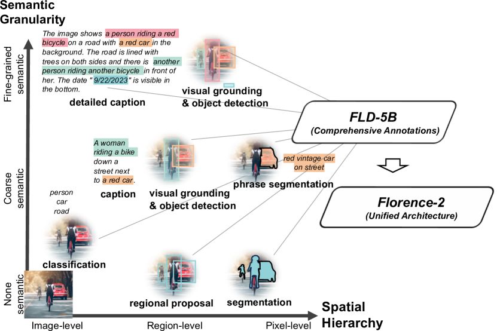
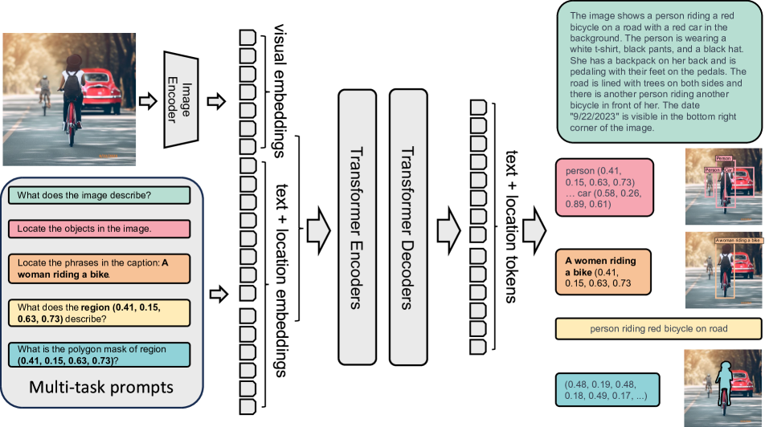
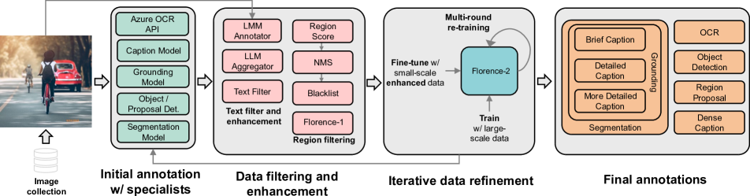

# Florence-2: Advancing a Unified Representation for a Variety of Vision Tasks

## 📋 메타 정보

| 항목 | 내용 |
|---|---|
| **제목** | Florence-2: Advancing a Unified Representation for a Variety of Vision Tasks |
| **저자/소속** | Bin Xiao, Haiping Wu, Weijian Xu, Xiyang Dai, Houdong Hu, Yumao Lu, Michael Zeng, Ce Liu, Lu Yuan — **Microsoft (Azure AI)** |
| **공개일** | 2023-11-10 (arXiv v1) · **CVPR 2024** 채택 |
| **분야** | Unified Vision Foundation Model(통합 비전 파운데이션 모델) — 이미지+지시문(prompt)을 받아 **텍스트 시퀀스**를 출력하는 seq2seq 방식으로 캡션·검출·그라운딩·분할·OCR을 한 모델에 통합 |
| **arXiv** | [abs](https://arxiv.org/abs/2311.06242) · [ar5iv](https://ar5iv.labs.arxiv.org/abs/2311.06242) |
| **공식 자료** | [HF: microsoft/Florence-2-large](https://huggingface.co/microsoft/Florence-2-large) · [Florence-2-base](https://huggingface.co/microsoft/Florence-2-base) |
| **외부 모델/데이터** | DaViT(vision encoder) · Azure OCR API·Caption/Grounding/Detection/Segmentation 전문 모델(데이터 엔진용) · ImageNet·Object365·COCO 등 시드 이미지 |

---

## 📖 주요 용어 사전 (Glossary)

### 아키텍처
- **unified representation(통합 표현)**: 작업마다 다른 모델·헤드를 쓰지 않고, **하나의 모델이 하나의 형식으로** 모든 비전 작업을 처리하도록 배운 내부 표현. Florence-2의 목표 그 자체.
- **seq2seq(sequence-to-sequence, 시퀀스→시퀀스)**: 입력 토큰 열을 받아 출력 토큰 열을 생성하는 구조. 번역기(영어→한국어)와 같은 틀. Florence-2는 "이미지+지시문 → 답 토큰 열"로 이 틀을 그대로 씀.
- **DaViT (Dual Attention Vision Transformer)**: Microsoft의 이미지 인코더(image encoder). 이미지를 시각 토큰(visual token) 열로 바꿔주는 "눈". 공간 어텐션과 채널 어텐션을 번갈아 쓰는 ViT 계열.
- **transformer encoder-decoder(트랜스포머 인코더-디코더)**: 시각 토큰 + 지시문 토큰을 함께 받아(encoder), 답 토큰을 한 개씩 생성(decoder)하는 표준 트랜스포머. 특별한 검출·분할 전용 부품(head)이 없음.
- **location token(위치 토큰, `<loc_0>`~`<loc_999>`)**: 좌표를 **텍스트 단어처럼** 다루려고 어휘집(vocabulary)에 새로 추가한 특수 토큰 1,000개. 이미지 좌표를 1,000개 구간(bin)으로 양자화(quantize)한 것. 이게 검출·분할을 "글자 뱉듯" 처리하게 만드는 핵심 장치.

### 핵심 개념
- **spatial hierarchy(공간 계층)**: 이미지 안에 전체 장면(coarse) → 물체 영역(region) → 픽셀 경계(fine)까지 여러 "공간 해상도" 정보가 겹겹이 있다는 뜻. 통합 모델이 반드시 다 다뤄야 하는 축 ①.
- **semantic granularity(의미 세분화)**: "고양이"라는 굵은 개념부터 "털의 질감"까지 여러 "의미 수준"이 있다는 뜻. 통합 모델이 다뤄야 하는 축 ②.
- **task prompt(작업 지시문)**: 어떤 작업을 원하는지 알려주는 짧은 문장. 예) `"What does the image describe?"` = 캡션. 같은 이미지라도 지시문만 바꾸면 다른 작업이 됨.
- **data engine(데이터 엔진)**: 사람이 손으로 라벨을 다는 대신, 여러 전문 모델과 필터·재학습을 **자동 순환**시켜 대규모 라벨을 찍어내는 파이프라인. FLD-5B를 만든 장치. → [3️⃣](#3️⃣-fld-5b-와-데이터-엔진--논문의-진짜-심장) 참조.

### 데이터 (FLD-5B 라벨 3종)
- **Text annotation(텍스트 라벨)**: 이미지 전체를 설명하는 캡션(coarse). 상세도 3단계(Brief/Detailed/More Detailed).
- **Region-Text annotation(영역-텍스트 라벨)**: "이 박스 = 이 물체/짧은 설명" 쌍. 검출·영역 캡션용(region 수준).
- **Text-Phrase-Region annotation(텍스트-구절-영역 라벨)**: 긴 캡션 안의 **각 구절(phrase)** 을 이미지 **영역(region)** 에 연결한 삼중쌍. 그라운딩(grounding)용, 가장 세밀(fine).

### 평가/작업 이름
- **grounding(그라운딩)**: 문장 속 표현이 이미지의 **어느 위치**인지 짚는 것. phrase grounding = 캡션의 여러 구절을 각각 영역에 매핑.
- **referring expression(참조 표현)**: "왼쪽에서 두 번째 빨간 차" 같은 지시 문구. 그 대상을 박스(REC)나 마스크(RES)로 찾음.
- **RES (Referring Expression Segmentation)**: 참조 표현이 가리키는 물체를 **픽셀 마스크**로 분할.
- **zero-shot(제로샷)**: 해당 벤치마크로 **추가 미세조정 없이** 곧바로 평가. 통합 사전학습만으로 얼마나 되나 보는 것.
- **closed-set / open-vocabulary(고정 클래스 / 열린 어휘)**: closed-set은 찾을 클래스 목록을 미리 정하고 그 라벨로 학습해야 하는 방식(대부분의 전용 디텍터, 예: RF-DETR). open-vocabulary는 학습 때 못 본 대상도 자연어로 지목해 찾는 방식(Florence-2). → [Q6](#q6-rf-detr-roboflow-과-비교하면-어떤가) 참조.
- **set prediction(집합 예측)**: DETR 계열이 박스 전체를 **한 번에 병렬로** 내놓는 방식. Florence-2의 토큰 하나씩 생성(autoregressive)과 대비되며, 실시간 속도 차이의 구조적 원인.
- **CIDEr**: 캡션 품질 지표(높을수록 좋음). AP/mAP = 검출 정확도. Recall@1 = 그라운딩 정확도. mIoU = 분할 겹침 정확도.

---

## 🎯 논문 요약 (TL;DR)

**한 줄**: **좌표까지 전부 토큰으로 바꿔** 캡션·검출·그라운딩·분할·OCR을 하나의 seq2seq 모델(이미지+지시문 → 텍스트)로 통일하고, 이를 학습시킬 **54억 라벨 자동 데이터 엔진(FLD-5B)** 을 만든 논문. 0.77B짜리 작은 모델이 대형 특화 모델급 범용 표현을 얻는다.

**핵심 문제**: 지금까지 비전 모델은 작업마다 전용 머리(task-specific head)를 달아야 했다. 하나의 모델로 통합하려면 **공간 계층(spatial hierarchy)** 과 **의미 세분화(semantic granularity)** 를 동시에 다뤄야 하는데, 그럴 만큼 다층·다작업 라벨이 촘촘히 붙은 대규모 데이터가 세상에 없었다.

**해결책**:
1. **작업을 전부 "번역 문제"로 통일** — 입력은 항상 `이미지 + 작업 지시문`, 출력은 항상 `토큰 시퀀스`. 좌표는 `<loc_i>` 위치 토큰(1,000 bin)으로 텍스트화 → 검출·분할용 전용 헤드 제거.
2. **데이터 엔진으로 FLD-5B 자작** — 전문 모델 앙상블 라벨링 → 필터/정제 → 재학습의 3단계 순환으로 **이미지 1.26억 장 위에 라벨 54억 개**를 자동 생성.
3. **작고 표준적인 구조** — DaViT(눈) + 표준 트랜스포머 인코더-디코더. Florence-2-B는 0.23B, L은 0.77B.

**검증**: 제로샷으로 COCO 캡션 CIDEr 135.6, Flickr30k 그라운딩 84.4, RefCOCO 계열 강세. 백본으로 미세조정하면 ImageNet 사전학습 대비 **4배 학습 효율 + COCO 검출 +6.9 AP**. 작은 크기로 훨씬 큰 특화 모델과 대등.

---

## 🔑 핵심 기여 (Contributions)

1. **모든 비전 작업의 seq2seq 통일 정식화**: 캡션(3단계)·검출·영역 캡션·영역 제안·구절 그라운딩·참조 분할(RES)·영역→분할·OCR·영역 OCR을, 좌표까지 토큰으로 바꿔 **하나의 출력 형식**으로 묶음.
2. **FLD-5B 데이터 엔진**: 사람 손 라벨 없이 전문 모델 앙상블 + 필터 + 반복 재학습으로 **54억 라벨/1.26억 이미지**를 자동 생성. 논문의 실질적 심장.
3. **소형 통합 백본**: 0.23B/0.77B 규모로 제로샷과 미세조정 양쪽에서 대형 특화 모델과 경쟁. 다운스트림(검출·분할) 백본으로도 강한 전이.
4. **완전 공개**: 모델 가중치(base/large)를 공개해 이후 open-vocabulary·통합 비전 연구의 강력한 베이스라인이 됨.

---

## 🧩 주요 알고리즘 설명

### 1️⃣ 전체 그림 — 두 축(공간·의미)을 데이터로 덮는다

*왜 보나: Florence-2의 모든 설계는 "한 모델이 coarse~fine, 굵은 개념~세밀한 묘사를 다 다루려면 그만큼 다양한 라벨이 필요하다"는 한 문장에서 출발한다. 이 그림이 그 동기를 담고 있다.*



> **논문 Fig 1** — 가로축은 **공간 계층(spatial hierarchy, image→region→pixel)**, 세로축은 **의미 세분화(semantic granularity, 굵은 분류→세밀한 묘사)**. 같은 자전거 사진 하나에도 `bicycle`(분류) · `a red car`(영역) · `a person riding a red car`(관계) · 픽셀 마스크(사람 실루엣)까지 서로 다른 수준의 라벨이 붙는다. 이 2차원 평면 전체를 촘촘히 덮은 라벨 뭉치가 **FLD-5B**이고, 그걸로 학습한 통합 모델이 **Florence-2**다.

### 2️⃣ 아키텍처 — "이미지+지시문 → 답 토큰"의 단일 seq2seq

*왜 이렇게 하나: 작업마다 다른 헤드를 붙이면 통합이 깨진다. 그래서 출력 형식을 "텍스트 토큰 열" 하나로 못 박고, 구조도 번역기와 똑같은 표준 인코더-디코더로 단순화했다.*



데이터 흐름은 세 단계다.

1. **눈 (Image Encoder = DaViT)**: 입력 이미지를 시각 토큰(visual token) 열로 변환.
2. **합류 + 두뇌 (Transformer Encoder-Decoder)**: 시각 토큰 뒤에 **작업 지시문(task prompt)** 토큰을 이어 붙여(concat) 인코더에 통째로 넣고, 디코더가 답 토큰을 한 개씩 생성.
3. **답 (텍스트 토큰 열)**: 캡션이면 문장, 검출이면 `person (0.41, 0.15, 0.63, 0.73) … car (…)` 처럼 **물체명 + 위치 토큰**, 분할이면 다각형 꼭짓점 좌표 토큰 열이 나옴.

핵심 트릭 — **위치 토큰(location token)**:
- 이미지 좌표를 **1,000개 구간(bin)으로 양자화**해 `<loc_0>`~`<loc_999>` 라는 **단어 1,000개를 어휘집에 추가**.
- 바운딩 박스 = 좌상단·우하단 좌표 = 위치 토큰 4개. 분할 마스크 = 다각형 꼭짓점들의 좌표 토큰 열. OCR = 글자 + 그 위치 토큰.
- 덕분에 **검출·분할조차 "특정 토큰 열을 받아쓰는 번역"** 이 되고, 전용 헤드가 사라진다. (같은 아이디어를 이후 [[paper_paligemma]] 가 `<loc>`/`<seg>` 토큰으로 계승한다.)

Fig 2의 **Multi-task prompts** 예시로 "같은 이미지, 다른 지시문 → 다른 작업"이 한눈에 보인다:

| 지시문(prompt) | 작업 | 출력 형식 |
|---|---|---|
| `What does the image describe?` | 캡션 | 문장 (Brief / Detailed / More Detailed) |
| `Locate the objects in the image.` | 객체 검출(OD) | 물체명 + 박스(위치 토큰 4개) 반복 |
| `Locate the phrases in the caption: {문장}` | 구절 그라운딩 | 각 구절 → 박스 |
| `What does the region (loc,loc,loc,loc) describe?` | 영역 캡션(dense region caption) | 그 박스의 설명 문구 |
| `What is the polygon mask of region (…)?` | 영역→분할 | 다각형 꼭짓점 좌표 토큰 열 |

학습은 표준 **언어모델 손실(다음 토큰 예측, cross-entropy)** 하나로 끝. 작업이 뭐든 "정답 토큰 열을 맞히기"이므로 손실 함수가 통일된다.

입력 해상도는 **384×384로 주 학습 → 768×768로 고해상도 튜닝**. 이 낮은 해상도가 조밀한 문서 텍스트에서 발목을 잡는다 → [Q7](#q7-ocr-부분은-sota인가) 참조.

### 3️⃣ FLD-5B 와 데이터 엔진 — 논문의 진짜 심장

*왜 필요한가: 위 2차원 평면(공간×의미)을 다 덮는 라벨을 사람이 손으로 달면 비용이 폭발한다. 그래서 전문 모델·필터·재학습을 자동 순환시켜 라벨을 찍어내는 "공장"을 만들었다.*

**규모**: 이미지 **1억 2,600만(126M) 장** 위에 라벨 **54억(5.4B) 개**. 라벨 3종 구성:

| 라벨 종류 | 개수 | 담는 정보 | 용도 |
|---|---|---|---|
| Text(텍스트) | 약 5억 | 이미지 전체 캡션(coarse) | 캡션 |
| Region-Text(영역-텍스트) | 약 13억 | 박스 ↔ 짧은 설명(region) | 검출·영역 캡션 |
| Text-Phrase-Region(텍스트-구절-영역) | 약 36억 | 캡션 구절 ↔ 영역 연결(fine) | 그라운딩 |



**데이터 엔진 3단계** (Fig 3, 왼→오):

1. **전문가 초기 라벨링 (Initial annotation w/ specialists)**: 한 이미지에 여러 전문 모델을 동시에 돌려 다층 라벨을 자동 생성 — Azure OCR API, Caption 모델, Grounding 모델, Object/Proposal Detector, Segmentation 모델. (사람 손 라벨이 아니라 **기존 모델들의 앙상블**이 출발점.)
2. **필터링·정제 (Data filtering and enhancement)**: 노이즈·모순 라벨 제거. 텍스트는 LLM으로 다듬고(LMM Annotator·LLM Aggregator·Text Filter), 영역은 점수화·NMS·블랙리스트로 거른다.
3. **반복 정제 (Iterative data refinement)**: 정제된 라벨로 Florence를 학습 → 그 개선된 모델로 라벨을 **다시** 달아 품질을 끌어올리는 순환(multi-round re-training). 초기 전문가 모델보다 나은 라벨이 점점 쌓인다.

→ 결과물이 오른쪽 **Final annotations**(캡션 3단계·그라운딩·검출·영역 제안·영역 캡션·분할·OCR)이고, 이게 곧 2️⃣의 학습 데이터가 된다.

---

## 📊 실험 요약

### 제로샷 (미세조정 없이 바로 평가) — Florence-2-L

*왜 보나: 통합 사전학습만으로 각 작업이 곧바로 되는지 = "범용 표현을 정말 배웠나"의 첫 증거.*

| 작업 | 벤치마크 | Florence-2-L | 의미 |
|---|---|---|---|
| 캡션 | COCO Caption (CIDEr) | **135.6** | 훨씬 큰 Flamingo(80B)급과 경쟁 |
| 검출 | COCO det (mAP) | 37.5 | 제로샷 검출이 되는 것 자체가 이례적 |
| 그라운딩 | Flickr30k (Recall@1) | **84.4** | Kosmos-2 대비 우위 |
| 참조 표현(REC) | RefCOCO / + / g (acc) | 56.3 / 61.6 / 51.4 | 지시 문구 → 박스 |
| 참조 분할(RES) | RefCOCO (mIoU) | 35.8 | 지시 문구 → 픽셀 마스크 |

> 포인트: Florence-2-L은 **0.77B**로, 수십 배 큰 모델(Flamingo 80B 등)과 제로샷에서 겨룬다. 좌표 통일 덕에 검출·그라운딩까지 미세조정 없이 나오는 게 핵심.

### 백본 전이 (다운스트림 미세조정)

*왜 보나: Florence-2를 "눈(백본)"으로 쓰고 뒤에 헤드를 붙였을 때, 표준 ImageNet 사전학습 백본보다 나은지 = 표현의 실전 가치.*

한 줄 요지: 통합 사전학습이 특정 작업 성능을 깎기는커녕, **다른 작업의 백본으로도 더 좋은 출발점**을 준다. 핵심은 정확도보다 **학습 효율(약 4배)**.

- **COCO 객체 검출/인스턴스 분할** (Mask R-CNN, DINO-4scale) · **ADE20k 의미 분할** (UperNet) 상세 수치와 SOTA 대비 해석 → [Q5](#q5-검출만-하는-알고리즘보다-좋은가--sota보다-좋은가) 참조.
- **의미 분할 ADE20k (UperNet, DaViT-B, 512×512)**: Florence-2(FLD-5B) **mIoU 54.9 / ms-mIoU 55.5** vs BEiT(ViT-B) 53.6 / 54.1. ImageNet-1k 사전학습 대비 **+4.9점 + 4배 효율**.
- **텍스트 관련 미세조정** (TextVQA 73.5% · TextCaps 151.1 CIDEr) 및 "OCR SOTA인가?" 해석 → [Q7](#q7-ocr-부분은-sota인가) 참조.

---

## 💬 Q&A

### Q1. 검출·분할을 "텍스트 생성"으로 하면 정밀도가 떨어지지 않나?

일부 그렇다. 두 가지 상한이 있다.
- **좌표 양자화**: 위치를 1,000 bin으로 쪼개므로, 고해상도에서 아주 미세한 좌표 정밀도에는 천장이 생긴다.
- **다각형 마스크**: 분할을 꼭짓점 좌표 열로 표현하므로, 픽셀 단위로 매끈한 경계가 필요한 작업에선 전용 분할 모델(예: Mask 헤드)보다 경계가 거칠 수 있다.
- 대신 얻는 것: **전용 헤드 0개**로 모든 작업을 한 모델·한 손실로 통합 → 확장성과 범용성. Florence-2는 "정밀도 최고"보다 "하나로 다 되는 강한 베이스"를 노린 설계다.

### Q2. 성능의 핵심은 모델 구조인가 데이터인가?

**압도적으로 데이터(FLD-5B)** 다. 구조는 DaViT + 표준 인코더-디코더로 의도적으로 평범하다. 진짜 기여는 "공간×의미 2차원을 촘촘히 덮는 다층 라벨을 **데이터 엔진으로 자동 생성**했다"는 점. 그래서 모델 코드만 재현해서는 같은 성능을 얻기 어렵고, 데이터 파이프라인이 곧 해자(moat)다. (단, 초기 전문가 모델의 편향이 라벨에 스며들 여지는 한계.)

### Q3. 요즘 대형 VLM(예: Qwen-VL, GPT-4V)과 뭐가 다른가?

지향점이 다르다.
- **대형 LLM 기반 VLM**: 수 B~수십 B LLM을 두뇌로 써서 **대화·복잡한 추론·VQA**에 강함. 무겁다.
- **Florence-2**: 0.23~0.77B의 **작고 빠른 통합 비전 전문가**. 캡션·검출·그라운딩·분할·OCR 같은 **구조화된 지각(perception) 작업**을 좌표 토큰으로 정밀하게 뱉는 데 특화. 대화형 추론은 타깃이 아니다.
- 그래서 Florence-2는 요즘도 **경량 백본/라벨러/전처리기**로 자주 쓰인다(예: 대형 VLM의 그라운딩·검출 보조).

### Q4. 위치 토큰 아이디어의 계보는?

좌표를 어휘집 토큰으로 바꾸는 발상은 Pix2Seq(검출을 시퀀스 생성으로) 계열에서 이어지며, Florence-2가 이를 **여러 작업으로 일반화**했다. 이후 [[paper_paligemma]] 가 `<loc0000>`~`<loc1023>`(박스) + `<seg000>`~`<seg127>`(마스크) 토큰으로 같은 철학을 계승한다. "검출·분할을 별도 헤드 없이 텍스트로" 라는 공통 DNA다.

### Q5. 검출만 하는 알고리즘보다 좋은가? = SOTA보다 좋은가?

결론부터: **절대 SOTA는 아니다.** 다만 논문이 주장하는 건 "SOTA 갱신"이 아니라 **"같은 크기·같은 비용에서 더 나은 출발점"**이다. 두 가지를 분리해서 봐야 한다.

#### (1) 제로샷 검출 37.5 AP — SOTA 근처도 아님

이건 **COCO 학습 데이터를 한 번도 안 보고** 바로 뱉은 숫자다. 검출 전용 모델은 COCO로 직접 학습하고 60점대를 낸다. 비교 자체가 다른 종목이다.

- 검출 전용 SOTA (2023년 기준, **논문에 나온 수치가 아니라 외부 지식 기반**): Co-DETR 약 66 AP, InternImage-H 약 65 AP, DINO+Swin-L 약 63 AP
- Florence-2 제로샷: **37.5 AP**

즉 "제로샷인데도 37.5가 나온다"가 자랑거리지, "검출 전용을 이겼다"가 아니다.

#### (2) 백본으로 미세조정 — 동급에서는 이김, 절대 SOTA는 아님

논문이 실제로 비교한 건 이쪽이다. Florence-2로 사전학습한 **DaViT-B 백본**에 기존 검출 프레임워크(Mask R-CNN, DINO)를 얹어 COCO로 미세조정한 결과 (논문 Table 7).

| 검출 프레임워크 | 백본 사전학습 | AP | 학습 일정 |
|---|---|---|---|
| Mask R-CNN | **Florence-2 (FLD-5B)** | **53.6** (박스) / 46.4 (마스크) | **12 에폭 (1×)** |
| Mask R-CNN | ConvNeXt v2-B (FCMAE) | 52.9 / 46.6 | 36 에폭 (3×) |
| Mask R-CNN | ViT-B (MAE) | 51.6 / 45.9 | 100 에폭 |
| DINO-4scale | **Florence-2 (FLD-5B)** | **59.2** | **12 에폭 (1×)** |
| DINO-4scale | ViT-B (MAE) | 55.0 | 50 에폭 |

여기서 읽어야 할 두 줄:

- **동급 크기(Base급) 백본끼리는 Florence-2가 이긴다.** DINO 기준 ViT-B(MAE) 대비 **+4.2 AP**.
- **더 중요한 건 비용이다.** 상대는 36~100 에폭인데 Florence-2는 12 에폭에서 그 점수를 낸다 → 논문이 말하는 **"약 4배 학습 효율"**.

하지만 **59.2 AP는 리더보드 최상단(65~66 AP)이 아니다.** 상단 모델들은 Swin-L·InternImage-H 같은 훨씬 큰 백본에 긴 스케줄, 추가 데이터까지 붙인 조합이라 체급이 다르다.

#### (3) 정리

> **"검출만 하는 최강 모델보다 좋다" = 아니오.**
> **"같은 크기 백본을 쓰는 다른 사전학습 방법보다 좋고, 훨씬 적은 에폭으로 도달한다" = 예.**

논문의 셀링 포인트는 정확도 왕좌가 아니라 **범용성 + 효율**이다. 하나의 모델이 캡션·검출·그라운딩·분할·OCR을 다 하면서, 검출 백본으로 떼어 써도 동급 대비 손해가 아니라 이득이라는 것.

#### (4) 한 가지 공정성 단서

이 비교는 완전히 대등하지 않다. MAE·ConvNeXt v2는 **라벨 없이(self-supervised)** ImageNet으로 사전학습한 반면, Florence-2는 **1.26억 장에 검출·그라운딩 라벨이 붙은 FLD-5B**로 사전학습했다. 즉 사전학습 단계에서 이미 "물체 위치 맞히기"를 잔뜩 연습한 백본이다.

그래서 "구조가 더 좋아서 이겼다"가 아니라 **"더 과제-정합적인 대규모 라벨을 봤기 때문에 이겼다"** 로 읽는 게 맞고, 실제로 그게 이 논문의 핵심 주장(데이터 엔진이 심장)과도 일치한다.

### Q6. [RF-DETR (Roboflow)](https://github.com/roboflow/rf-detr) 과 비교하면 어떤가?

결론부터: **검출 정확도·속도만 놓고 보면 RF-DETR이 압도적으로 앞선다.** 다만 두 모델은 사실 경쟁 관계가 아니라 **역할이 다른 도구**이고, 실무에서는 오히려 짝으로 쓰는 조합이다.

#### (1) 먼저 체급부터 다르다

| | Florence-2 | RF-DETR |
|---|---|---|
| 정체 | 범용 비전 파운데이션 모델 (멀티태스크 seq2seq) | **검출 전용** 실시간 디텍터 (DETR 계열) |
| 출력 방식 | 텍스트 토큰을 하나씩 생성 (autoregressive) | 박스를 한 번에 병렬 예측 (set prediction) |
| 지원 작업 | 캡션·검출·그라운딩·분할·OCR·영역 설명 | 검출 + 인스턴스 분할 + 키포인트(preview) |
| 크기 | base 0.23B / **large 0.77B** | N 30.5M / L **33.9M** / 2XL 126.9M |
| 백본 | DaViT | **DINOv2** (+ LW-DETR·Deformable DETR 기반, NAS 최적화) |
| 발표 | 2023-11 (CVPR 2024) | 2025-03 이후, 지금도 계속 업데이트 |
| 라이선스 | MIT | Apache 2.0 (XL/2XL은 PML 1.0) |

파라미터만 봐도 Florence-2-L이 RF-DETR-L보다 **20배 이상 크다.**

#### (2) 검출 정확도 — RF-DETR 완승

RF-DETR 저장소 기준 (NVIDIA T4, TensorRT, FP16, batch 1):

| 모델 | COCO AP50:95 | 지연시간 | 파라미터 | 해상도 |
|---|---|---|---|---|
| RF-DETR-N | 48.4 | **2.3 ms** | 30.5M | 384² |
| RF-DETR-M | 54.7 | 4.4 ms | 33.7M | 576² |
| RF-DETR-L | 56.5 | 6.8 ms | 33.9M | 704² |
| RF-DETR-XL | 58.6 | 11.5 ms | 126.4M | 700² |
| RF-DETR-2XL | **60.1** | 17.2 ms | 126.9M | 880² |
| — | | | | |
| Florence-2 제로샷 | **37.5** | (실시간 아님) | 0.77B | — |
| Florence-2 백본 + DINO-4scale 미세조정 | 59.2 | (실시간 아님) | 백본만 base급, 헤드 별도 | — |

읽어야 할 세 줄:

- **제로샷 37.5 vs RF-DETR-N 48.4** — RF-DETR의 **가장 작은 나노 모델**(30M, 2.3ms)이 Florence-2 제로샷을 10 AP 이상 앞선다.
- **미세조정 59.2 vs 2XL 60.1** — Florence-2를 백본으로 쓰고 무거운 DINO-4scale 헤드를 얹어야 겨우 비슷해진다. 그런데 RF-DETR-L은 **33.9M / 6.8ms로 56.5**를 낸다. 효율 차이가 극심하다.
- **구조적 한계**: Florence-2는 물체를 **토큰으로 하나씩 받아쓰기** 때문에, 물체가 많을수록 느려진다. 실시간 영상 파이프라인에는 애초에 맞지 않는 구조다.

여기에 시간 차도 있다. Florence-2는 2023년 11월, RF-DETR은 2025년 3월 이후 계속 갱신 중 — **1년 반 이상의 기술 격차**가 그대로 반영된 결과다.

#### (3) 그런데 RF-DETR이 못 하는 것

RF-DETR은 **closed-set(고정 클래스) 디텍터**다. 즉:

- 내가 찾고 싶은 클래스 목록을 **미리 정하고, 라벨링된 데이터로 미세조정해야** 한다.
- 학습에 없던 새 물체는 못 찾는다.
- "빨간 모자 쓴 왼쪽 사람" 같은 **자연어 지시로 지목**하는 건 불가능하다.

Florence-2는 반대다:

- 라벨링·학습 없이 **바로 아무 이미지에 던져도** 뭔가 나온다.
- `"Locate the phrases in the caption: {문장}"` 처럼 **자연어로 대상을 지정**(phrase grounding)할 수 있다.
- 검출과 동시에 캡션·OCR·영역 설명·참조 분할까지 **같은 모델 하나로** 처리한다.

RF-DETR의 RF100-VL 결과(L 기준 AP50:95 62.2, N 57.7, XL 62.9)도 "100개 도메인에서 잘 된다"는 뜻이지, **도메인마다 미세조정한 결과**다. 라벨 없이 되는 게 아니다.

#### (4) 실무 결론 — 경쟁이 아니라 파이프라인

가장 현실적인 사용법은 **둘을 이어 붙이는 것**이다.

```
Florence-2 (라벨이 없는 단계)          RF-DETR (배포 단계)
  자연어로 대상 지정 → 박스 자동 생성  →  그 라벨로 학습  →  실시간 추론
  = 오토 라벨러 / 데이터 부트스트랩         = 30M·수 ms 짜리 배포 모델
```

Roboflow 생태계가 실제로 미는 흐름도 이것이다. Florence-2(또는 유사 open-vocab 모델)로 **초기 라벨을 싸게 찍고**, 사람이 조금 고친 뒤, **RF-DETR을 학습시켜 현장에 배포**한다.

**선택 기준**

| 상황 | 선택 |
|---|---|
| 찾을 클래스가 정해져 있고 라벨 데이터가 있음 · 실시간/엣지 배포 | **RF-DETR** (고민할 것 없음) |
| 라벨이 아예 없음 · 클래스가 계속 바뀜 · 자연어로 지목하고 싶음 | **Florence-2** (또는 더 최신 open-vocab 모델) |
| 검출 외에 캡션·OCR·영역 설명까지 한 모델로 | **Florence-2** |
| 라벨을 만들고 싶다 | Florence-2로 생성 → **RF-DETR로 학습** |

#### (5) 한 줄 정리

> **검출 성능만 물으면 RF-DETR이 이긴다 — 비교가 안 될 정도로.** 하지만 Florence-2를 "검출기"로 보는 것 자체가 잘못된 프레이밍이다. Florence-2의 값어치는 **라벨 없이, 자연어로, 여러 작업을 동시에** 한다는 데 있고, RF-DETR의 값어치는 **정해진 문제를 가장 빠르고 정확하게** 푼다는 데 있다.

> ⚠️ 수치 출처 주의: RF-DETR 수치는 저장소 README 기준(2026-07 확인)이고, 벤치마크 하드웨어(T4 + TensorRT FP16, batch 1)가 명시된 값이다. Florence-2 쪽 지연시간은 논문에 실시간 비교가 없어 수치로 제시하지 않았다 — 필요하면 실제 환경에서 재는 게 정확하다.

### Q7. OCR 부분은 SOTA인가?

결론부터: **OCR은 SOTA가 아니다. 정확히 말하면 논문이 OCR SOTA를 주장하지도 않는다.** 구조적으로 그럴 수밖에 없는 이유가 있다.

#### (1) OCR 전용 벤치마크가 논문에 아예 없음

이게 핵심이다. Florence-2는 작업 목록에 OCR과 OCR-with-region을 넣어두고 실제로 실행도 하지만, **텍스트 검출·텍스트 인식 벤치마크(ICDAR 계열 등) 결과를 하나도 싣지 않았다.**

즉 "OCR 전용 모델과 붙어서 이겼다"는 실험 자체가 없다. 논문이 조심스럽게 피해간 영역이다.

#### (2) 논문이 SOTA라고 말한 건 OCR이 아니라 "글자를 읽어야 푸는 문제"

논문이 내세우는 텍스트 관련 수치는 두 개인데, 둘 다 **미세조정 후** 값이다.

| 벤치마크 | Florence-2-B | Florence-2-L | 성격 |
|---|---|---|---|
| TextVQA (정확도) | — | **73.5%** | 이미지 속 글자를 읽고 질문에 답하기 |
| TextCaps (CIDEr) | 143.9 | **151.1** | 이미지 속 글자를 반영해 캡션 쓰기 |

TextVQA 73.5%에 대해 논문은 SOTA라고 말하는데, **조건이 붙는다 — "외부 OCR 토큰 입력 없이(without any external OCR token input)"**. 기존 방식들은 별도 OCR 엔진을 돌려서 인식된 글자를 텍스트로 따로 넣어줬는데, Florence-2는 그 목발 없이 자기 눈만으로 그 점수를 냈다는 뜻이다.

**이건 "OCR 성능이 최고"가 아니라 "OCR을 내장했는데도 VQA를 잘한다"는 주장이다.** 종목이 다르다.

#### (3) 왜 OCR SOTA가 될 수 없는가 — 구조적 상한 3가지

*여기부터는 논문이 명시한 한계가 아니라 **분석**이다. (논문에는 OCR·작은 글씨·조밀 문서에 대한 한계 서술이 없다.)*

**① 선생이 Azure OCR (증류의 천장)**
FLD-5B의 OCR 라벨은 **Azure AI Services OCR API로 만들었다**(→ [3️⃣](#3️⃣-fld-5b-와-데이터-엔진--논문의-진짜-심장) 데이터 엔진 1단계). 즉 Florence-2의 OCR은 Azure OCR을 베껴 배운 것이다. 원리상 선생을 크게 넘기 어렵고, 넘을 이유도 없다. "Azure OCR을 0.77B 모델 안에 녹여 넣은 것"에 가깝다.

**② 해상도가 너무 낮음**
- Florence-2: **384×384로 주 학습, 768×768로 고해상도 튜닝**
- 문서 OCR 전용 도구: 보통 1,000~2,000px 이상

영수증·논문·표처럼 **작고 조밀한 글자**는 768px에서 이미 뭉개진다. 간판·표지판처럼 큰 글자 몇 단어(scene text, 장면 텍스트)는 괜찮지만, 문서는 애초에 범위 밖이다.

**③ 글자를 토큰으로 하나씩 뱉음**
autoregressive(자기회귀) 생성이라 글자가 많을수록 느려지고 오류가 누적된다. 문서 한 장에 수천 자면 감당이 안 된다.

#### (4) 실무 판단

| 상황 | 판단 |
|---|---|
| 간판·제품 라벨·표지판 등 **글자 몇 단어 + 위치** | Florence-2로 충분. 게다가 검출·캡션과 **한 모델로 동시 처리**되는 게 장점 |
| 이미지 속 글자를 읽고 **질문에 답하기**(TextVQA류) | Florence-2 강점 구간 (외부 OCR 불필요) |
| **문서 OCR** — 영수증, 계약서, 논문, 표, 손글씨 | ❌ 쓰지 말 것. 전용 도구(PaddleOCR, Azure OCR 원본, 최신 문서 특화 VLM)가 압도적 |
| 한글·중국어 등 **비라틴 문자 조밀 텍스트** | ❌ 논문에 평가 자체가 없음. 검증 안 된 영역 |

#### (5) 한 줄 정리

> **Florence-2의 OCR은 "SOTA"가 아니라 "번들 기능"이다.** Azure OCR을 증류해 768px 해상도 안에 넣은 것이라, 장면 속 글자 몇 개를 검출·캡션과 함께 처리하는 데는 편리하지만, 문서 OCR 전용 도구와 겨루는 물건이 아니다. 논문이 SOTA라고 말한 TextVQA 73.5%도 **"외부 OCR 없이"라는 단서가 붙은, OCR이 아니라 VQA 성적**이다.

[Q6](#q6-rf-detr-roboflow-과-비교하면-어떤가)의 RF-DETR 비교와 같은 패턴이다 — **개별 종목의 왕좌가 아니라, 하나로 다 되는 편의성**이 Florence-2의 값어치다.

---

## 🧾 한 줄 요약 (전체)

> **Florence-2 = "좌표까지 전부 위치 토큰(1,000 bin)으로 바꿔 모든 비전 작업을 이미지+지시문→텍스트 seq2seq로 통일 + 전문 모델 앙상블·필터·재학습 순환으로 만든 54억 라벨 데이터 엔진(FLD-5B)"** 으로, 0.23~0.77B 소형 모델이 대형 특화 모델급 범용 비전 표현을 학습한 Microsoft의 CVPR 2024 논문. 이후 open-vocabulary·통합 비전 모델의 강력한 경량 백본/베이스라인이 되었다.

---

## 🔗 관련 메모리 링크
- [[paper_paligemma]] — 위치·분할 토큰(`<loc>`/`<seg>`)으로 검출·분할을 텍스트 생성으로 통합하는 철학 계승
- [[reference_pretrained_backbone_reuse_landscape]] — 사전학습 백본 재사용 관점에서 Florence-2 위치
