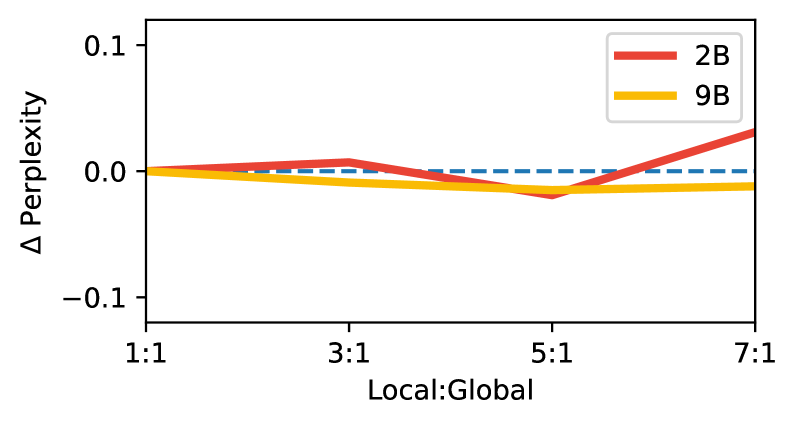
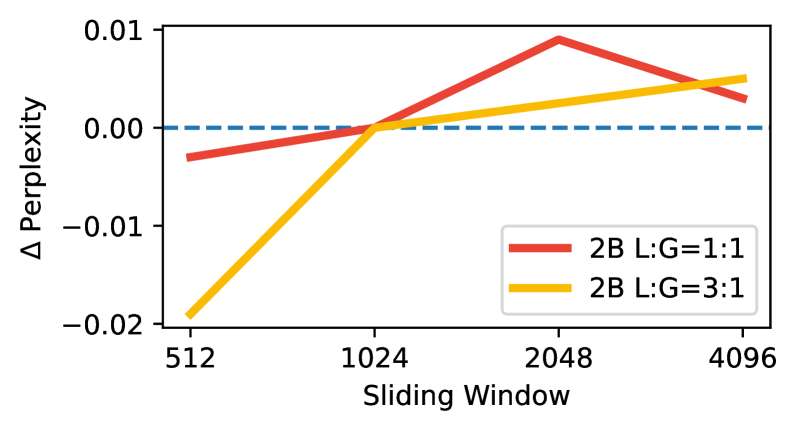
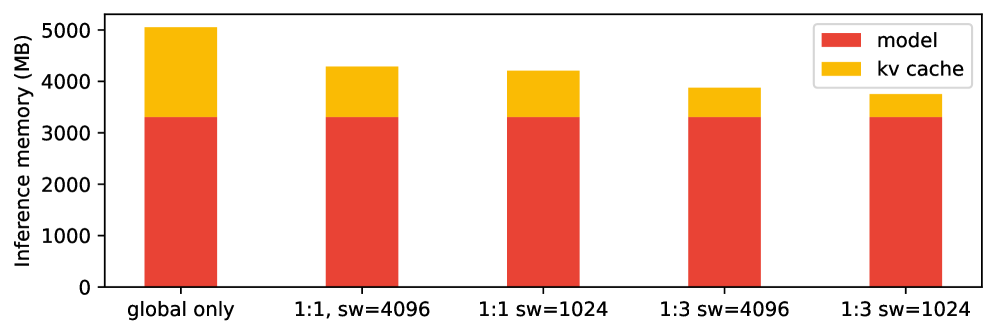
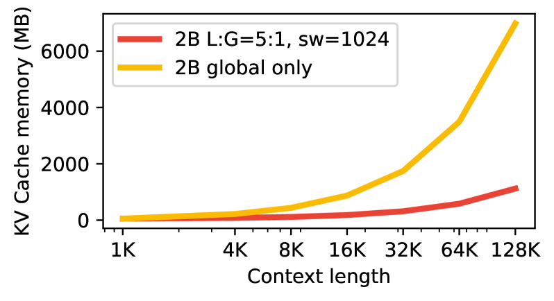
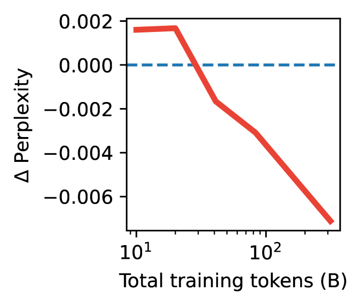
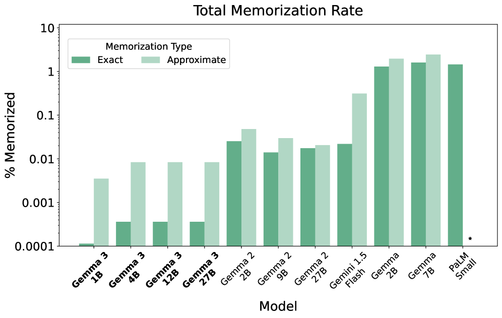

# Gemma 3 Technical Report

## 📋 메타 정보

| 항목 | 내용 |
|---|---|
| **제목** | Gemma 3 Technical Report |
| **저자** | Gemma Team (Aishwarya Kamath, Johan Ferret, Shreya Pathak, Nino Vieillard 외 200여 명) |
| **소속** | Google DeepMind |
| **공개일** | 2025-03-25 |
| **분야** | open-weight(공개 가중치) 멀티모달 LLM — 텍스트 + 이미지 |
| **arXiv** | [abs](https://arxiv.org/abs/2503.19786) · [html](https://arxiv.org/html/2503.19786v1) |
| **라이선스** | Gemma Terms of Use (커스텀. Apache 2.0 전환은 Gemma 4부터) |
| **분류** | cs.CL |
| **후속** | [[paper_gemma_4]] — 같은 KV cache 문제를 다른 축에서 공격 |

---

## 📖 주요 용어 사전 (Glossary)

*이 리포트는 용어 하나하나가 곧 메모리 절감 장치라, 뜻을 정확히 잡아두면 논문 절반이 풀린다.*

### 어텐션
- **global attention(전역 어텐션) layer**: 지금까지 나온 **모든 토큰**을 본다. 그래서 KV cache가 컨텍스트 길이에 **비례해서 자란다**.
- **local attention / SWA (sliding window attention, 슬라이딩 윈도우 어텐션) layer**: 직전 **W개 토큰만** 본다. KV cache가 W개로 **고정** — 컨텍스트가 128K든 1M이든 캐시 크기가 안 변한다.
- **local:global ratio(로컬:글로벌 비율)**: local layer 몇 개마다 global layer 하나를 끼울지. Gemma 2 = 1:1, **Gemma 3 = 5:1**.
- **sliding window size (sw, 창 크기)**: local layer가 보는 범위. Gemma 2 = 4096, **Gemma 3 = 1024**.
- **GQA (Grouped-Query Attention, 그룹 쿼리 어텐션)**: 여러 query head가 key/value head를 공유해 KV cache를 줄이는 표준 기법. Gemma 3도 사용.
- **QK-norm**: query·key 벡터를 정규화해 어텐션 로짓이 폭주하는 걸 막는 안정화 장치. Gemma 2의 **soft-capping(tanh로 로짓을 눌러 담는 방식)을 대체**.

### 위치 인코딩
- **RoPE base frequency(회전 기본 주파수)**: RoPE의 회전 주기를 정하는 상수. 크게 잡을수록 **먼 거리까지 위치를 구분**할 수 있다. Gemma 3는 **global layer만 10k → 1M**으로 올리고 local layer는 10k 유지.
- **positional interpolation(위치 보간)**: 짧은 길이로 학습한 모델의 위치 좌표를 눌러 담아 더 긴 컨텍스트로 확장하는 기법 (Chen et al., 2023). Gemma 3는 **scaling factor 8**로 32K → 128K 확장.

### 학습
- **knowledge distillation(지식 증류)**: 큰 교사(teacher) 모델의 출력 분포를 작은 학생(student) 모델이 따라 배우게 하는 학습법. Gemma 3는 **사전학습 전체를 이걸로** 한다.
- **QAT (Quantization Aware Training, 양자화 인지 학습)**: 양자화된 상태를 가정하고 미세조정해서, int4로 눌러도 성능이 덜 깨지게 만드는 것.

### 비전
- **SigLIP**: CLIP 계열 vision encoder. Gemma 3는 **400M 변종을 동결(frozen)해서** 사용.
- **Pan & Scan (P&S)**: 이미지를 여러 크롭으로 잘라 각각 인코더에 넣는 **추론 시점 전용** 트릭.

---

## 🎯 논문 요약 (TL;DR)

**한 줄**: Gemma 3의 진짜 내용은 **"128K 컨텍스트를 KV cache 폭발 없이 얹는 법" 하나**다. 처방은 두 줄 — **local:global을 5:1로 올리고, local의 창을 1024로 줄인다.** 나머지(멀티모달, 다국어, distillation)는 다 있지만 새롭지 않다.

**핵심 문제**: 컨텍스트가 길어지면 병목은 **파라미터가 아니라 KV cache**다. global attention만 쓰는 표준 구성으로 32K를 돌리면 KV cache가 모델 메모리 대비 **60% 오버헤드**를 낸다. 128K로 가면 감당이 안 된다.

**해결책**: **캐시가 자라는 층(global) 자체를 희소하게** 만든다. 6개 층에 하나만 global로 두고, 나머지 5개는 1024토큰만 보는 local로. → 32K에서 KV 오버헤드 **60% → 15% 미만**.

**검증**: 비율을 1:1 → 7:1까지 바꿔도, 창을 4096 → 512까지 줄여도 **validation perplexity가 거의 안 변한다** (Fig 3, 4). 이 두 그림이 논문의 존재 이유다.

**결과**: Gemma 3 27B-IT가 Chatbot Arena Elo **1338(9위)** — DeepSeek-V3(671B), LLaMA 3 405B, Qwen2.5-72B를 **파라미터가 훨씬 작은데도** 앞선다.

**⚠️ 다만**: 교사 모델의 정체가 없고, RL 단계는 이름만 있으며, QK-norm 교체에는 ablation이 없다. 자세한 빈칸은 §7.

---

## 🏆 핵심 기여 (Contributions)

1. **5:1 local:global + sw=1024** — perplexity 손해 없이 KV cache 오버헤드를 60% → 15% 미만으로. **이 리포트의 유일한 아키텍처 주장이자, ablation으로 뒷받침된 유일한 것.**
2. **RoPE를 층 종류별로 분리** — global만 1M, local은 10k. "롱컨텍스트는 global layer만의 문제"라는 인식의 구현.
3. **256 로짓 샘플링 distillation** — 262K 어휘에서 교사 분포 전체를 저장하지 않고 상위만 근사하는 값싼 방법.
4. **교사 크기 ablation** — "작은 모델엔 작은 교사가 낫다"는 통념을 **학습 길이에 따라 뒤집는다**는 관찰.
5. **QAT 체크포인트 동시 배포** — 27B를 54GB → 14.1GB로.
6. **Pan & Scan** — 학습을 안 건드리고 추론만 바꿔 문서·인포그래픽 성능을 크게 올림.

---

## 🧱 모델 라인업

*모델마다 "어디에 배포할 것인가"가 다르고, 그에 따라 컨텍스트 길이와 비전 유무가 갈리므로 지형부터 본다.*

| | 1B | 4B | 12B | 27B |
|---|---|---|---|---|
| **임베딩 파라미터** | 302M | 675M | 1,012M | 1,416M |
| **비임베딩 파라미터** | 698M | 3,209M | 10,759M | 25,600M |
| **Vision encoder** | **0 (없음)** | 417M | 417M | 417M |
| **학습 토큰** | 2T | 4T | 12T | 14T |
| **컨텍스트** | **32K** | 128K | 128K | 128K |
| **학습 하드웨어** | TPUv5e 512칩 | TPUv5e 2048칩 | TPUv4 6144칩 | TPUv5p 6144칩 |

> Table 1 + Table 2 (리포트 원표).

- **1B만 텍스트 전용에 32K.** 나머지 셋은 비전 + 128K.
- **어휘 262K** (Gemini 2.0과 동일한 SentencePiece: 숫자 분할, 공백 보존, 바이트 레벨 인코딩). 다국어 균형을 위해 크게 잡았다.
  → 그 대가로 **1B는 전체 파라미터의 30%가 임베딩 테이블**이다. 어휘를 키운 비용을 작은 모델이 제일 비싸게 치른다.
- 정규화: RMSNorm 기반 **pre-norm + post-norm** 병용.
- **soft-capping 제거 → QK-norm 도입** (Dehghani, Wortsman, Chameleon Team 인용).
- Vision encoder(417M SigLIP)는 **4B/12B/27B가 공유**하고 **학습 내내 동결**.

---

## 🔬 주요 알고리즘 설명

### 3.1 KV cache를 어떻게 줄였나 — 이 논문의 전부

*파라미터는 컨텍스트가 길어져도 안 자란다. 자라는 건 KV cache뿐이다. 그러니 "파라미터를 줄이자"가 아니라 "자라는 부분을 줄이자"가 옳은 질문이다.*

#### ① 문제 정의

- **global layer**: 캐시가 컨텍스트 길이에 **비례해서 자란다**.
- **local layer**: 캐시가 창 크기 W로 **고정**. 128K를 넣어도 1024개만 들고 있으면 된다.

즉 **KV cache 문제는 순전히 global layer의 문제**다. 그렇다면 **global layer 개수를 줄이면 되지 않나?** — 이게 논문의 출발점이자 도착점이다.

#### ② 처방 두 줄

리포트 원문:
> "We alternate between a local sliding window self-attention and global self-attention, with a pattern of **5 local layers for every global layer, starting with a local layer as the first layer** of the model."
> "we interleave multiple local layers between each global layer, and assign **a smaller span of only 1024 tokens** to the local layers"

1. **비율: 1:1 → 5:1** (local 5개마다 global 1개, 첫 층은 local)
2. **창: 4096 → 1024**

#### ③ 공짜인가? — Ablation이 알맹이다

**Figure 3: local:global 비율**

2B와 9B 모델에서 1:1 → 3:1 → 5:1 → 7:1로 바꿔가며 학습. **Δ perplexity가 ±0.02 안에서만 움직인다.** y축 범위가 ±0.1인데 곡선이 거의 0선에 붙어 있다.

리포트 원문: *"We observe minimal impact on perplexity when changing this ratio."* 캡션은 한 술 더 뜬다 — *"The impact is minimal, **even with 7-to-1** local to global."*

**Figure 4: sliding window 크기**

512 / 1024 / 2048 / 4096을 비교. **여기서 재밌는 게 나온다** — 창을 512까지 줄이면 오히려 **perplexity가 더 낮다** (L:G=3:1에서 Δ = −0.019). 물론 이 크기의 변화는 노이즈 수준이고, 리포트도 "줄여도 perplexity가 안 나빠진다"는 약한 주장만 한다.

> **읽고 남는 것**: 이 두 그림이 말하는 진짜 메시지는 "5:1이 최적이다"가 아니라 **"이 하이퍼파라미터는 perplexity에 거의 영향이 없다"**는 것이다. 그러면 **메모리가 유일한 선택 기준**이 되고, 그래서 메모리 유리한 쪽으로 끝까지 민 게 5:1 / 1024다. **성능 최적화가 아니라 자유도 발견**이다.

#### ④ 메모리 결과

**Figure 5: 32K 컨텍스트에서의 모델 vs KV cache 메모리**

리포트 원문:
> "The **'global only'** configuration is the standard configuration used across most dense models. The '1:1, sw=4096' is used in Gemma 2. We observe that the **'global only' configuration results in a memory overhead of 60%**, while this is **reduced to less than 15%** with 1:3 and sliding windows of 1024."

2B 모델 기준으로 읽으면:
- 모델 가중치는 어느 구성이든 **3,300MB로 고정**.
- **global only**: KV cache가 ~1,750MB → 가중치 대비 **약 60% 오버헤드**.
- **1:3, sw=1024**: KV cache ~450MB → **15% 미만**.

> ⚠️ **표기 주의**: Fig 4·5의 "1:3"은 본문의 "5:1"과 **표기 방향이 반대**다. 본문은 `local:global`(5 local당 1 global)로 쓰고, Fig 5 캡션은 "different local to global ratios"라면서 `1:3`으로 쓴다. 문맥상 둘 다 "global이 소수"를 뜻하지만 **리포트 자체가 표기에 일관성이 없다.** 인용할 때 조심.

**Figure 6: 컨텍스트 길이별 KV cache**

이게 진짜 그림이다. global only는 128K에서 **~7,000MB**로 폭주하고, 5:1/sw=1024는 **~1,100MB**에 머문다. **약 6배 차이.** 곡선 모양 자체가 다르다 — global only는 위로 휘고, Gemma 3 구성은 거의 직선이다.

#### ⑤ RoPE를 층 종류별로 갈랐다

> "We increase RoPE base frequency **from 10k to 1M on global self-attention layers, and keep the frequency of the local layers at 10k**."

논리가 깔끔하다. RoPE base를 키우는 건 회전 주기를 늘려 **먼 거리를 구분 가능하게** 만드는 조치인데, **local layer는 애초에 1024토큰 너머를 볼 일이 없으므로 손댈 이유가 없다.** 롱컨텍스트는 global layer만의 문제라는 §3.1①의 인식이 여기서도 그대로 관철된다.

#### ⑥ 32K로 학습하고 128K로 늘린다

> "Instead of training with 128K sequences from scratch, we **pre-train our models with 32K sequences and then scale the 4B, 12B, and 27B models up to 128K tokens at the end of pre-training** while rescaling RoPE. We find a **scaling factor of 8** to work well in practice."
> "Our models **generalize to 128K, but rapidly degrade as we continue to scale**."

즉 **128K는 "여기까지가 안전선"으로 실험적으로 찍은 값**이지, 무한 확장 가능한 방법이 아니다. 128K 너머는 급격히 무너진다.

---

### 3.2 Distillation — 실무적으로 제일 쓸모 있는 디테일

*사전학습 전체를 증류로 한다. 그런데 어휘가 262K라 교사 분포를 통째로 다루면 감당이 안 된다. 그 문제를 어떻게 우회했는지가 이 절이다.*

#### 256 로짓 샘플링

> "We sample **256 logits per token, weighted by teacher probabilities**. The student learns the teacher's distribution within these samples via cross-entropy loss. The teacher's target distribution is **set to zero probability for non-sampled logits, and renormalized**."

262K 어휘 전체 분포를 토큰마다 저장·전송하면 불가능하다. 그래서 **교사 확률에 비례해 256개만 뽑고**, 나머지는 확률 0으로 두고 **재정규화**한 뒤 그 위에서 cross-entropy를 건다. 교사 분포의 **머리만 근사하고 꼬리는 버리는** 것.

> 💡 **이미지 생성 쪽으로 옮기면**: [[paper_dmd]] / [[paper_dmd2]] 처럼 분포를 맞추는 증류에서 "전체 분포 대신 확률 상위만 맞춘다"는 발상의 LLM판이다. 어휘/출력 공간이 클 때 증류 비용을 깎는 일반 레시피.

#### 교사 크기 ablation (Figure 8) — 통념을 뒤집는다

> "A common finding is that, **to train a small model, it is preferable to distill from a smaller teacher.** We suspect this is because these studies are often performed in settings where **the regularization effect of using a worse teacher surpasses the benefit of using a better teacher.** We train a student with 2 teachers of different sizes, one large and one small, for different training horizons. In Fig. 8, we observe that **for short training horizons, the smaller teacher is better, but the trend is reversed for longer training.**"

y축은 "큰 교사 − 작은 교사"의 perplexity 차이라서 **음수일수록 큰 교사가 이긴다**. 그래프를 읽으면:
- **~10~20B 토큰**: 양수 → **작은 교사 승**
- **~30B 토큰 부근에서 교차**
- **~300B 토큰**: −0.007까지 벌어짐 → **큰 교사 압승**

**해석**: 작은 교사는 학생이 따라가기 쉬워 초반에 빨리 좋아지지만 **곧 교사의 천장에 갇힌다**. 큰 교사는 초반이 비효율적이지만 **천장이 높다**. 저자들의 표현대로, 기존 연구들이 "작은 교사가 낫다"고 결론 낸 건 **학습을 짧게 돌려서** 나쁜 교사의 정규화 효과만 본 탓이라는 것.

> **실무 결론**: **교사 크기는 토큰 예산에 맞춰 골라라.** 예산이 작으면 작은 교사, 길게 돌릴 거면 큰 교사.

---

### 3.3 Vision — 붙였을 뿐, 새롭지 않다

*비전은 이 논문의 기여가 아니다. 다만 "동결 인코더를 어떻게 싸게 쓰는가"의 교과서적 사례라 볼 값어치가 있다.*

#### 동결 SigLIP + 평균 풀링 + 사전 계산

- **400M SigLIP**을 896×896 정사각 입력으로, **동결해서** 사용. 4B/12B/27B가 **같은 인코더 공유**.
- 인코더 출력을 **4×4 average pooling**으로 눌러 **이미지 1장 = 256 토큰**으로 고정.
- 결정적인 실무 포인트:
  > "For the vision encoder, we **pre-compute the embeddings for each image and directly train with the embeddings, adding no cost to the training of the language models**."

  **동결이므로 이미지 임베딩을 한 번 계산해 캐싱**하면 된다. → LLM 학습 비용에 비전이 **추가 비용 0**으로 얹힌다. PaliGemma 2 대비 전이 비용이 훨씬 싼 이유.

#### 해상도 ablation (Table 7)

| 해상도 | DocVQA | InfoVQA | TextVQA |
|---|---|---|---|
| 256 | 31.9 | 23.1 | 44.1 |
| 448 | 45.4 | 31.6 | 53.5 |
| **896** | **59.8** | **33.7** | **58.0** |

DocVQA가 31.9 → 59.8로 **두 배 가까이** 뛴다. **비전 성능의 대부분이 "글자가 읽히느냐"에 달려 있다**는 뜻.

#### Pan & Scan (P&S)

> "The Gemma vision encoder operates at a fixed resolution of 896×896. This results in artifacts when processing non-square aspect ratios and high-resolution images, **leading to unreadable text, or small objects disappearing**. ... This algorithm **segments images into non-overlapping crops of equal size, covering the whole image, and resize them to 896×896 pixels** to pass them to the encoder. This windowing is applied only when necessary, and control for the maximum number of crops. **It is an inference-time only optimization and can be disabled** for faster inference."

즉 **학습은 안 건드리고 추론만 바꾸는** 값싼 트릭이다.

**Table 8 (4-shot, valid set)**:

| | DocVQA | InfoVQA | TextVQA |
|---|---|---|---|
| 4B | 72.8 | 44.1 | 58.9 |
| **4B + P&S** | **81.0** (+8.2) | **57.0** (+12.9) | **60.8** (+1.9) |
| 27B | 85.6 | 59.4 | 68.6 |
| **27B + P&S** | **90.4** (+4.8) | **76.4** (+17.0) | **70.2** (+1.6) |

**InfoVQA(인포그래픽)에서 +17.0**이 압권이다. 반면 TextVQA는 +2 남짓. 종횡비가 극단적이고 글자가 작은 과제에서만 크게 오른다 — 해상도 ablation과 완전히 같은 방향이다.

---

### 3.4 Quantization Aware Training

*가중치를 4배 줄여도 KV cache는 그대로다. 이 절과 §3.1이 사실 한 몸이라는 게 표에서 드러난다.*

> "These versions are obtained by finetuning each model for a small number of steps, **typically 5,000**, using QAT. We use **probabilities from the non-quantized checkpoint as targets**."

**즉 자기 자신을 교사로 쓰는 증류**다. 5,000 스텝이면 사실상 공짜. 세 표현: **per-channel int4 / per-block int4 (blocks=32) / switched fp8**.

**Table 3 (32K 컨텍스트, GB)**:

| 모델 | bf16 | Int4 | Int4 (blocks=32) | SFP8 |
|---|---|---|---|---|
| 1B | 2.0 | 0.5 | 0.7 | 1.0 |
| 1B **+KV** | 2.9 | 1.4 | 1.6 | 1.9 |
| 4B | 8.0 | 2.6 | 2.9 | 4.4 |
| 4B **+KV** | 12.7 | 7.3 | 7.6 | 9.1 |
| 12B | 24.0 | 6.6 | 7.1 | 12.4 |
| 12B **+KV** | 38.9 | 21.5 | 22.0 | 27.3 |
| **27B** | **54.0** | **14.1** | 15.3 | 27.4 |
| 27B **+KV** | 72.7 | 32.8 | 34.0 | 46.1 |

**여기서 §3.1이 왜 필요했는지가 보인다.** 27B를 int4로 누르면 가중치는 54 → 14.1GB로 **4배 줄지만**, KV cache 몫(72.7 − 54.0 = **18.7GB**)은 **양자화해도 그대로**다. 양자화를 밀어붙일수록 **KV cache가 유일한 병목으로 남는다**. 그래서 5:1 / sw=1024가 있어야 했던 것.

---

### 3.5 Post-training — 여기가 제일 얇다

> "Our post-training approach relies on an **improved version of knowledge distillation** ... and a **RL finetuning phase based on improved versions of BOND, WARM, and WARP**."

무엇을 어떻게 "improved" 했는지는 **없다**.

보상은 세 종류를 섞는다:
- 사람 피드백으로 학습한 **weight-averaged reward model** (WARM)
- **코드 실행 피드백** (돌려보고 맞으면 보상)
- **수학 정답 대조** (ground-truth)

데이터 필터링:
> "We filter examples that show **certain personal information, unsafe or toxic model outputs, mistaken self-identification data, and duplicated examples.** Including subsets of data that encourage better **in-context attribution, hedging, and refusals** to minimize hallucinations also improves performance on factuality metrics, without degrading model performance on other metrics."

포맷: PT/IT 모두 **[BOS] 토큰을 명시적으로** 붙여야 한다("[BOS]"라는 문자열은 BOS 토큰으로 매핑되지 **않는다**). PT는 `<eos>`로, IT는 `<end_of_turn>`으로 끝난다.

---

## 📊 실험 요약

### Chatbot Arena (Table 5) — 이 리포트의 헤드라인

*벤치마크 말고 사람이 실제로 어느 답을 고르는가.*

| 순위 | 모델 | Elo | Open | Type | #params |
|---|---|---|---|---|---|
| 1 | Grok-3-Preview | 1412 | – | – | – |
| 1 | GPT-4.5-Preview | 1411 | – | – | – |
| 3 | Gemini-2.0-Pro-Exp | 1380 | – | – | – |
| 6 | DeepSeek-R1 | 1363 | yes | MoE | 671B/37B |
| 8 | o1-2024-12-17 | 1352 | – | – | – |
| **9** | **Gemma-3-27B-IT** | **1338** | **yes** | **Dense** | **27B** |
| 9 | o1-preview | 1335 | – | – | – |
| 13 | DeepSeek-V3 | 1318 | yes | MoE | 671B/37B |
| 14 | Claude 3.7 Sonnet | 1309 | – | – | – |
| 28 | Llama-3.1-405B-Instruct | 1269 | yes | Dense | 405B |
| 38 | Llama-3.3-70B-Instruct | 1257 | yes | Dense | 70B |
| 39 | Qwen2.5-72B-Instruct | 1257 | yes | Dense | 72B |
| 59 | **Gemma-2-27B-it** | **1220** | yes | Dense | 27B |

- **27B가 671B MoE(DeepSeek-V3)와 405B dense를 앞선다.** 20배 큰 모델보다 사람이 더 좋아한다는 뜻.
- Gemma 2 → 3에서 **Elo +118점**. 파라미터는 그대로인데.
- ⚠️ 단, **non-thinking 모델 한정** 비교이며, Elo는 시각 능력을 반영하지 않는다(비교 대상 모델 대부분이 비전이 없다).

### IT 벤치마크 (Table 6) — Gemini와의 격차 패턴이 흥미롭다

| | Gemini 1.5 Flash | Gemini 1.5 Pro | Gemini 2.0 Pro | Gemma 2 27B | **Gemma 3 27B** |
|---|---|---|---|---|---|
| MMLU-Pro | 67.3 | 75.8 | 79.1 | 56.9 | **67.5** |
| LiveCodeBench | 30.7 | 34.2 | 36.0 | 20.4 | **29.7** |
| Bird-SQL (dev) | 45.6 | 54.4 | 59.3 | 46.7 | **54.4** |
| GPQA Diamond | 51.0 | 59.1 | 64.7 | 34.3 | **42.4** |
| **SimpleQA** | 8.6 | 24.9 | **44.3** | 9.2 | **10.0** |
| FACTS Grounding | 82.9 | 80.0 | 82.8 | 62.4 | **74.9** |
| Global MMLU-Lite | 73.7 | 80.8 | 86.5 | 68.6 | **75.1** |
| **MATH** | 77.9 | 86.5 | **91.8** | 55.6 | **89.0** |
| HiddenMath | 47.2 | 52.0 | 65.2 | 14.8 | **60.3** |
| MMMU (val) | 62.3 | 65.9 | 72.7 | – | **64.9** |

> 💡 **이 표에서 제일 중요한 관찰**: **MATH는 89.0 vs 91.8로 거의 붙었는데, SimpleQA는 10.0 vs 44.3으로 4배 이상 벌어진다.**
>
> 우연이 아니다. **MATH는 형식화된 추론 절차**라서 distillation으로 잘 옮겨온다. **SimpleQA는 파라미터에 저장된 세계 지식**을 묻는 거라 27B라는 **용량 자체의 한계**에 걸린다. GPQA Diamond(42.4 vs 64.7)도 같은 계열이다.
>
> **작은 모델은 추론 절차는 훔쳐올 수 있어도 지식은 못 훔쳐온다.** 이게 이 리포트가 의도치 않게 보여주는 가장 정직한 사실이다.

### 사전학습 벤치마크 (Table 9~13, 발췌)

| | Gemma 2 27B | **Gemma 3 27B** | Gemma 2 2B | **Gemma 3 1B** |
|---|---|---|---|---|
| MMLU | 76.2 | **76.9** | 56.1 | 38.8 |
| HumanEval | 51.8 | **87.8** | 20.1 | **41.5** |
| MBPP | 67.4 | **74.4** | 36.6 | 35.2 |
| GSM8K | 91.1 | **95.9** | 62.6 | 62.8 |
| MATH | 55.6 | **89.0** | 27.2 | **48.0** |
| HiddenMath | 12.0 | **56.0** | 2.0 | **15.0** |
| LiveCodeBench | 29.0 | **39.0** | 7.0 | 5.0 |

- **MATH 55.6 → 89.0, HiddenMath 12 → 56.** 같은 27B 크기에서 수학이 폭발적으로 오른다. 이 정도 점프는 아키텍처로 설명이 안 되고 **데이터 + distillation 교사의 몫**인데, 리포트는 교사를 밝히지 않는다.
- **1B는 MMLU에서 Gemma 2 2B에 진다** (38.8 vs 56.1). 지식은 파라미터 수를 못 이긴다는 같은 얘기.

### 롱컨텍스트 (Table 15) — 여기 이상한 게 있다

| | Gemma 3 PT 4B | PT 12B | PT 27B | IT 4B | IT 12B | IT 27B |
|---|---|---|---|---|---|---|
| RULER 32K | 67.1 | **90.6** | 85.9 | 61.4 | 80.3 | **91.1** |
| RULER 128K | 51.7 | **80.7** | 72.9 | 46.8 | 57.1 | 66.0 |
| MRCR 32K | 44.7 | 59.8 | **63.2** | 49.8 | 53.7 | **63.2** |
| MRCR 128K | 40.6 | 56.9 | **60.0** | 44.6 | 49.8 | 59.3 |

> ⚠️ **PT 모델의 RULER에서 12B(80.7)가 27B(72.9)를 이긴다.** 32K에서도 90.6 vs 85.9로 마찬가지. MRCR에서는 정상적으로 27B가 이기는데 RULER만 뒤집힌다. **리포트는 이걸 언급조차 하지 않는다.** 128K 확장이 27B에서 덜 안정적이었을 가능성이 크지만 확인할 방법이 없다.
>
> 또 하나: **IT가 PT보다 128K에서 나쁘다** (PT 12B 80.7 → IT 12B 57.1). 후처리가 롱컨텍스트 능력을 깎아먹는다는 뜻인데, 이것도 설명이 없다.

### 암기와 프라이버시 (Figure 9)

- 측정법: 학습 데이터에서 **prefix 50 토큰**을 주고 이어 쓰게 해서, **suffix 50 토큰**과 비교. 완전 일치 = "exact", **편집 거리 10% 이내** = "approximate".
- **로그 스케일 y축**에 주목. Gemma 3는 이전 세대 대비 **한두 자릿수 낮은** 암기율. (Gemma 2B ≈ 1.3% → Gemma 3 4B ≈ 0.0004%)
- 4B/12B/27B 사이엔 차이가 거의 없고, **1B만 더 적게 암기**한다.
- > "a relative increase in **approximate memorization compared to exact memorization of roughly 24x on average**."

  즉 암기가 일어나도 **대부분 축자적 복사가 아니라 변형된 재현**이다.
- Google Cloud Sensitive Data Protection으로 검사한 결과, **암기로 분류된 출력에서 개인정보는 하나도 발견되지 않았다.**

---

## 🕳️ 이 리포트의 빈칸 — 솔직히 말해서

*무엇을 알 수 있는지만큼 무엇을 알 수 없는지도 적어둬야 나중에 재현 시도할 때 헛수고를 안 한다.*

| 항목 | 확인 결과 |
|---|---|
| **교사 모델의 정체** | **없음.** 사전학습 **전체**가 distillation인데 교사가 뭔지 안 밝힌다. Gemini 계열로 추정될 뿐. **재현 불가능한 핵심.** MATH가 55.6 → 89.0으로 뛴 진짜 이유가 여기 숨어 있다. |
| **RL 단계 상세** | BOND/WARM/WARP의 "improved version"이라고만. 무엇을 개선했는지 **없음.** |
| **QK-norm vs soft-capping** | 아키텍처 변경 중 **유일하게 ablation 없이** 바뀐 부분. |
| **RULER 12B > 27B 역전** | **침묵.** |
| **IT가 PT보다 128K에서 나쁜 이유** | **침묵.** |
| **5:1 / 1024가 왜 그 값인가** | 이론적 근거 없음. 곡선 보고 찍은 값. (다만 곡선이 평평하니 아무 값이나 괜찮다는 게 요점이긴 하다.) |
| **레이어/헤드/차원 하이퍼파라미터 표** | **없음.** Table 1은 파라미터 총량만. |
| **데이터 혼합 비율** | "다국어를 늘렸다", "품질 재가중을 했다" 수준의 서술만. |

**결론**: 재현 가능한 건 **아키텍처와 ablation**뿐이고, **성능을 만든 요인(교사, 데이터)은 공개되지 않았다.** 다만 §3.1의 KV cache 설계는 **누구나 그대로 가져다 쓸 수 있는 완결된 처방**이고, 이 부분만큼은 ablation으로 정직하게 뒷받침된다.

---

## 💬 Q&A

### Q1. "global layer가 6개 층에 하나만 있어도 된다"가 어떻게 가능한가?

리포트는 **왜**를 설명하지 않는다. 실험적으로 perplexity가 안 떨어지더라, 가 전부다.

다만 자연스러운 해석은 이렇다. **정보는 층을 타고 흐른다.** local layer도 1024토큰 안의 정보를 다음 층으로 넘기고, 그 다음 local layer는 다시 1024만큼 더 멀리 있는 정보와 섞을 수 있다. 층을 쌓으면 **local layer만으로도 유효 수용 영역(receptive field)이 계속 넓어진다** (CNN에서 3×3 conv를 쌓는 것과 같은 원리). global layer는 **긴 점프가 필요할 때 가끔 있으면 되는 지름길**이라는 것.

그래서 7:1까지도 perplexity가 안 무너진다. 하지만 이건 **본 문서의 해석이지 리포트의 주장이 아니다.**

### Q2. Gemma 3와 Gemma 4는 같은 문제를 푸는데 뭐가 다른가?

**완전히 같은 적**과 싸우는데 **직교하는 두 축**을 공격한다.

| | Gemma 3 | [[paper_gemma_4]] |
|---|---|---|
| **줄이는 대상** | global layer의 **개수** | global layer **하나당 캐시 크기** |
| **방법** | local:global = 5:1, sw=1024 | `values=keys` + pp-RoPE(p=0.25) |
| **절감** | KV 오버헤드 60% → 15% 미만 | global KV cache **37.5%** |
| **RoPE** | global 1M / local 10k | **동일하게 계승** |
| **비율** | 5:1 (신규) | **5:1 그대로 계승** (E2B만 4:1) |

**핵심**: Gemma 4는 Gemma 3의 5:1 구조를 **버린 게 아니라 계승했다.** 그 위에서 "이제 남은 1/6개의 global layer를 **개당 더 싸게** 만들자"로 간 것. 즉 **Gemma 3에서 개수를 최소화했으니, Gemma 4는 단가를 깎는 자연스러운 후속**이다.

두 세대를 합치면: **(층 수 1/6로 희소화) × (남은 층 62.5% 비용)** — 곱해서 효과를 본다.

### Q3. 이미지 생성 연구자가 가져갈 게 있나?

솔직히 많지 않지만 세 가지:

1. **QK-norm**: DiT 계열에서 이미 표준처럼 쓰는 그 안정화 장치가, LLM에서도 soft-capping을 밀어냈다는 방증. 안정화 처방의 수렴.

2. **동결 인코더 + 임베딩 사전 계산**: [[reference_pretrained_backbone_reuse_landscape]]의 "동결 인코더 재사용" 분기의 교과서적 사례. 특히 *"동결이니까 임베딩을 미리 계산해 캐싱하면 학습 비용이 0"*이라는 실무 포인트는, T2I에서 텍스트 인코더를 동결할 때 ([[paper_qwen_image]], [[paper_i1]]) 그대로 적용된다.

3. **256 로짓 샘플링**: 출력 공간이 클 때 교사 분포를 근사하는 값싼 방법. [[paper_dmd]]/[[paper_dmd2]] 계열 증류에 옮길 만한 발상.

**반대로 KV cache 절감 자체는** 이미지 생성에 바로는 안 온다. Diffusion은 autoregressive가 아니라 **KV cache를 안 쓰기 때문**이다. 다만 텍스트+이미지 토큰을 concat해 joint self-attention 돌리는 single-stream DiT ([[paper_lumina_image_2]], [[paper_z_image]])에서 **시퀀스가 길어질 때 어텐션 비용**을 줄이는 발상으로는 유효하다 — "모든 층이 전역을 볼 필요는 없다"는 관찰 자체는 도메인 무관하다.

### Q4. sw=512가 1024보다 perplexity가 낮은데 왜 1024를 골랐나?

**리포트가 답하지 않는다.** Fig 4에서 L:G=3:1의 512 지점이 Δ = −0.019로 가장 낮다.

가장 그럴듯한 이유는 **그 차이가 노이즈 수준**(y축 전체 범위가 ±0.02)이라 의미가 없고, 창을 너무 줄이면 **perplexity에는 안 잡히지만 롱컨텍스트 검색(RULER 류)에서 무너질 위험**이 있어서 안전 마진을 뒀을 것이라는 것. 하지만 이건 추측이고, **리포트는 512를 왜 안 썼는지 한 마디도 안 한다.**

### Q5. 1B에 비전이 없고 컨텍스트도 32K인 이유는?

리포트가 명시하지 않지만 표를 보면 답이 나온다. **1B는 파라미터의 30%가 이미 임베딩 테이블**(302M / 1000M)이다. 여기에 417M SigLIP을 얹으면 **인코더가 언어 모델 본체(698M)의 60%**가 되어버린다. 배보다 배꼽이 커진다.

Table 3에서도 1B는 bf16 2.0GB에 KV 0.9GB — **KV cache가 가중치의 45%**다. 128K까지 늘리면 KV가 가중치를 압도한다. **작은 모델일수록 롱컨텍스트가 상대적으로 더 비싸다.**

---

## 🎬 한 줄 요약 (전체)

> **"global 어텐션은 6개 층에 하나면 충분하고, 나머지는 1024 토큰만 보면 된다"** — 이 경험적 발견 하나(그리고 그걸 뒷받침하는 Fig 3·4)로 128K 컨텍스트를 KV cache 오버헤드 15% 미만에 얹었고, int4로 4배 압축한 체크포인트와 함께 오픈웨이트로 뿌린 릴리즈 리포트다. 27B가 671B DeepSeek-V3를 Arena에서 앞서고 MATH에서 Gemini 1.5 Pro와 붙지만, **SimpleQA에서 10.0 대 44.3으로 무너지는 게 distillation이 무엇을 옮길 수 있고(추론 절차) 무엇을 못 옮기는지(세계 지식) 정직하게 보여준다.**

---

## 🔗 관련 메모리 / 문서

- [[paper_gemma_4]] — 같은 KV cache 문제를 "층당 단가"로 공격한 후속. Gemma 3의 5:1을 그대로 계승한다.
- [[reference_pretrained_backbone_reuse_landscape]] — 동결 SigLIP + 임베딩 사전 계산은 이 지형의 대표 사례.
- [[paper_dmd]], [[paper_dmd2]] — 분포 증류. 256 로짓 샘플링의 발상을 옮길 대상.
- [[paper_qwen_image]], [[paper_i1]] — 동결 텍스트 인코더 재사용. 사전 계산·캐싱 논리가 동일.
- [[paper_lumina_image_2]], [[paper_z_image]] — single-stream joint attention. "모든 층이 전역을 볼 필요는 없다"의 이식 대상.
